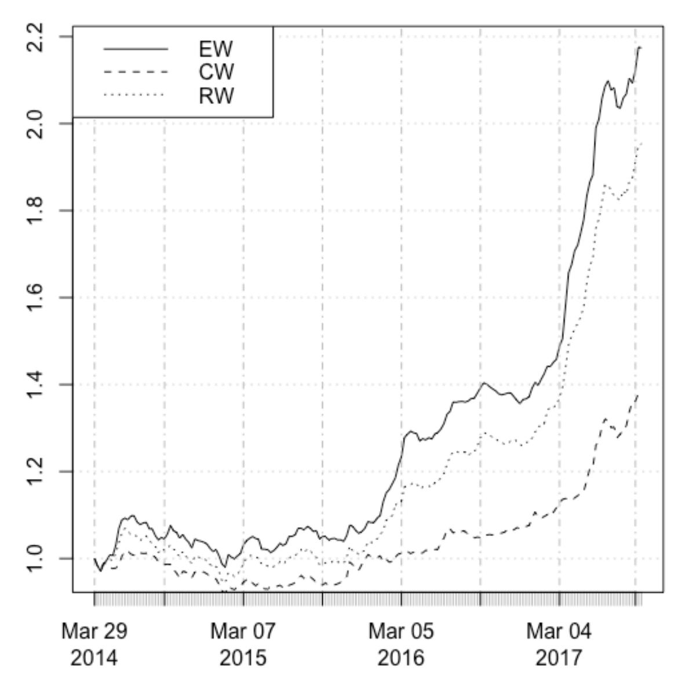
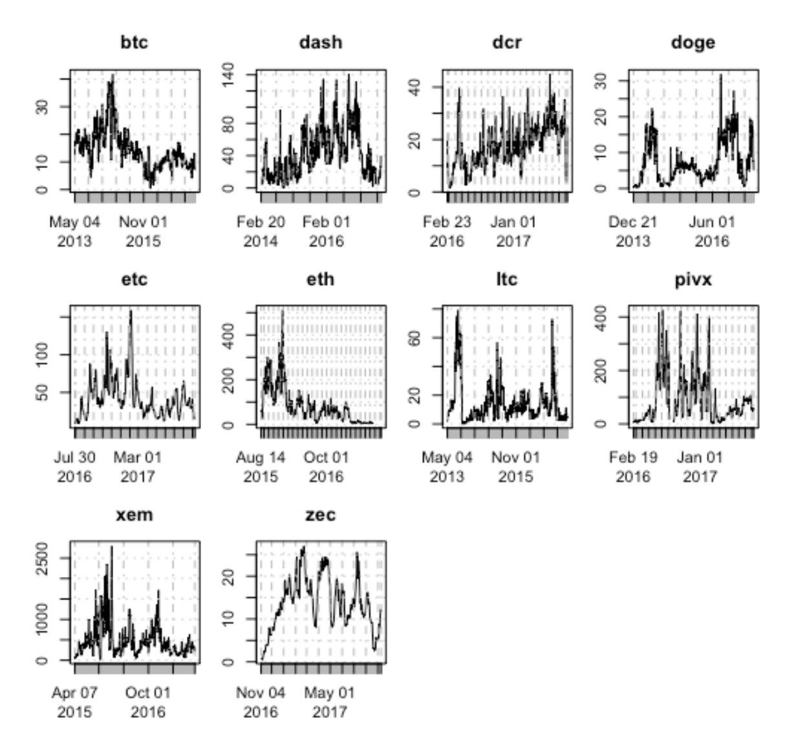
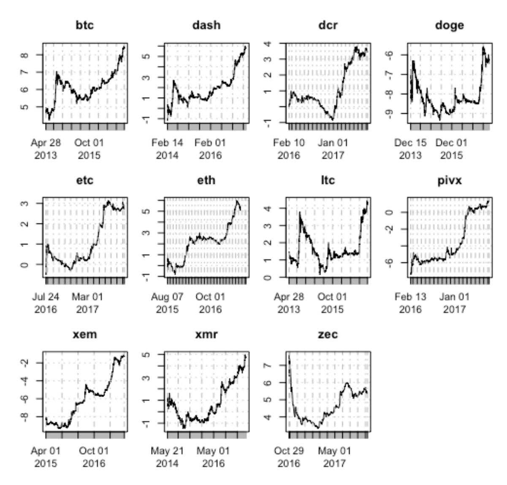
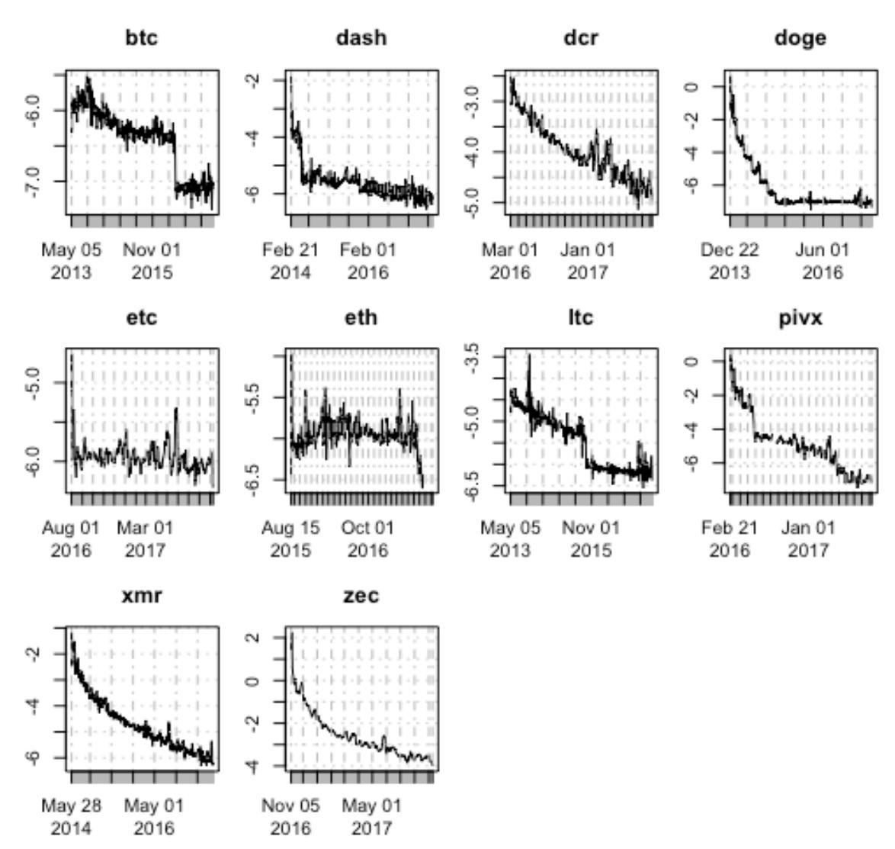
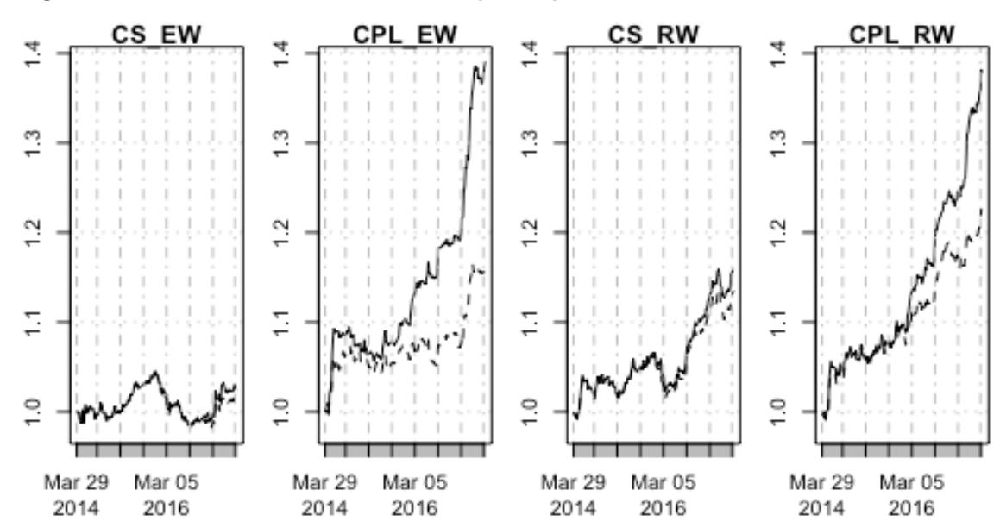
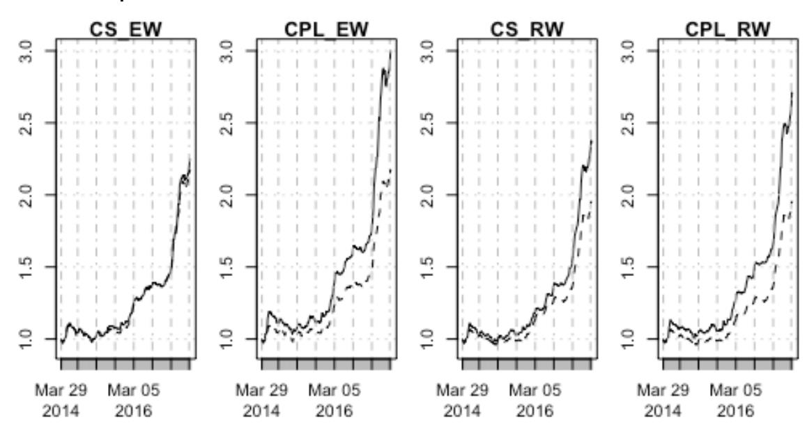

# **"Know when to hodl them, know when to fodl them": An Investigation of Factor Based Investing in the Cryptocurrency Space**

**Stefan Hubrich, Ph.D., CFA**

Director of Multi-Asset Research

T. Rowe Price Associates, Inc.

*stefan\_hubrich@yahoo.com*

*Second draft – October 28, 2017*

**The views and statements contained in this document are entirely the author's, and do not represent the view of T. Rowe Price Group or any of its subsidiaries, affiliates, or employees. Neither T. Rowe Price Group nor any of its subsidiaries, affiliates, or employees are responsible for the contents of this document. This document does not constitute investment advice or an offer to sell securities. The information in this paper is not, and is not intended, to relate to any investment strategy or product offered by T. Rowe Price or any of its subsidiaries or affiliates.**

# **"Know when to hodl 'em, know when to fodl 'em": An Investigation of Factor Based Investing in the Cryptocurrency Space1**

#### **Abstract**

It has been known since at least the groundbreaking work of Fama and French (1992) that there are specific attributes, so called factors, that can help predict the returns of individual assets above the return of the broader market. Since these predictive characteristics arise out of sample (with currently observable factor values predicting future returns), investors can earn excess returns with portfolios that are constructed to align with the factors. First introduced in the cross section of returns and focusing on individual equity securities, the efficacy of such factors has since been demonstrated at the asset class level as well, and found to work not only in the cross section but also longitudinally (for individual assets, through time). Factors like value, momentum, and carry have been found to work so broadly across different asset classes, security universes, countries, and time periods, that Asness et al. simply titled their influential 2013 *Journal of Finance* paper "Value and Momentum Everywhere". Our paper provides a first application of momentum, value, and carry based factor investing to the cryptocurrencies. We show that these same factors are effective in this relatively new and unexplored asset class, permitting the construction of portfolios that can earn excess returns over the cryptocurrency "market" as a whole.

1 Our title adapts a line from Kenny Rogers' famous song, "The Gambler", to refer to buy-andhold investing in cryptocurrencies as "hodling" (as opposed to "holding"). Various highly reliable internet sources (is there any other kind?) credit a 2013 post on bitcointalk.org with the creation of this famous typo (which has since been widely adopted in the blockchain community), and we have neither reason nor desire to doubt them.

### **I. Introduction**

It has been known since at least the groundbreaking work of Fama and French (1992) that there are specific attributes, so called "factors", that can help predict the returns of individual assets above the return of the broader market. Since these predictive characteristics arise out of sample (with currently observable factor values predicting future returns), investors can earn excess returns (or "beat the market") with portfolios that are constructed to align with the factors. First introduced in the cross section of returns and focusing on individual equity securities, the efficacy of such factors has since been demonstrated at the asset class level as well, and found to work not only in the cross section but also longitudinally (for individual assets, through time). Factors like value, momentum, and carry have been found to work so broadly across different asset classes, security universes, countries, and time periods, that Asness et al. simply titled their influential 2013 *Journal of Finance* paper "Value and Momentum Everywhere". Our paper provides a first application of momentum, value, and carry based factor investing to the cryptocurrencies. We show that these same factors are effective in this relatively new and unexplored asset class, permitting the construction of portfolios that can earn excess returns over the cryptocurrency "market" as a whole.

This paper connects two topics that, to the best of our knowledge, have not previously been brought together: the well-established field of factor based investing and the just now emerging literature on the economic and financial aspects of blockchains and their associated cryptocurrencies. We suspect that most of our readers will either be investment professionals or academics familiar with factor based investing but new to the cryptocurrency world, or cryptocurrency practitioners (including many without a finance background) for whom factor based investing is a new topic. We therefore chose to keep our introduction to both the cryptocurrency and the factor investing thematic lean in the main paper, providing additional background on both topics in Appendix 1 and 3, respectively.

Cryptocurrencies have been the subject of much recent debate, and there are many important questions for which we claim no expertise. Are cryptocurrencies in a bubble? Maybe2 . Are they used for illicit activities? Most certainly3 . *Will* governments try to "shut them down"? Some already have. *Should* they be shut down? And so forth. We take no view on whether anyone *should* make investments in cryptocurrencies, or whether the fact that someone *does* reflects on their intellectual capabilities one way or the other. Rather, our perspective is that of a zoologist encountering a new financial species. We don't know whether it will turn out to be an invasive pest or a useful addition to the ecosystem – but we believe that we can learn something from it about the laws of nature. The well documented efficacy of the same factors across a wide range of asset classes comes close to being an empirical "law of nature" in financial markets, and our main question is simply whether these same patterns are present among cryptocurrencies as well. Appendix 1 provides a more detailed introduction to the inner workings of the cryptocurrency ecosystem.

Given the idiosyncrasies of the young, new asset class facing us (such as an absence of cash flows and pre-existing frameworks for security valuation) we employ factor definitions that are similar in spirit to the more technically consistent definitions employed in the academic literature, hoping that the underlying "deep" behavioral or risk premium aspects that give rise to factor returns are preserved. We encourage the reader who is not familiar with the academic factor literature to simply think of momentum as "the return we get if things keep changing the way they have", value as the return we get "if things go back to where they were/some kind of fair equilibrium", and carry as "the return we get if things don't change at all". We place some emphasis on the distinction between a cross sectional perspective (many assets at one point in time) vs. a longitudinal perspective (one asset or portfolio through time), which in our view represents a particularly important complication for the factor literature. In fact,

2 It strikes us that "being in a bubble" is more of a rite of passage towards actually constituting an asset class, than an argument to the contrary. If something is in a bubble, it's unlikely to be a

good investment – but it probably can be viewed as an asset class. 3 "Technological progress is like an axe in the hands of a criminal." (Albert Einstein)

the earlier work was very much focused on the cross-sectional perspective, contemplating the problem facing an active equity manager who needs to allocate her capital across a universe of stocks at a point in time. Over time, a complementary longitudinal (or market timing) dimension entered the literature, informed by the trading practices of so called Commodity Trading Advisors or CTA's. The important implication for this paper is that we will need to investigate the performance of momentum, carry, and value both cross sectionally and longitudinally. Intriguingly, the very high volatility of cryptocurrencies represents an advantage in this regard: as we will demonstrate, typical rational investors will most likely only be willing to invest a small fraction of their wealth in crypto currencies (unlike the equity manager, who is expected to be "fully invested"). They can therefore exploit the longitudinal aspects of our factors despite the fact that no derivatives (such as futures) are available to "leverage" these assets. Appendix 3 provides a more detailed overview of factor investing concepts at the asset class level.

Our summary of the factor literature rests on two relatively recent papers by Asness et al. (2013) Koijen et al. (2016). (We encourage readers who seek a broader introduction into factor investing to work with the references in these two papers.) Focused on value and momentum in the first paper and carry in the second, both papers robustly define each factor across asset classes and then proceed to demonstrate their ability to earn excess returns across multiple markets and time periods. Additionally, they demonstrate that returns to portfolios built on a given factor tend to be correlated across asset classes even though there is no overlap in the underlying investments. This suggests that these factor returns are driven by a common underlying feature of capital markets, such as behavioral phenomena or compensation for risk characteristics embodied in the portfolios themselves. It is this apparent "ubiquity" of factor related excess returns that motivates us to investigate similar factors in the cryptocurrency space. Finally, these papers illustrate that due to the lack of correlation between returns of portfolios built on different factors, multi-factor

portfolios that simultaneously feature several factor exposures can be even more attractive in terms of risk-adjusted return.

In contrast to the mature academic literature on factor returns and portfolio implications, academic research into the asset pricing and investment characteristics of cryptocurrencies is only now beginning to emerge. For those seeking more of a survey of the overall cryptocurrency ecosystem (with less emphasis on research and discovery), we recommend Hileman and Rauchs (2017). Boehme et al (2015) provide a good early overview of the Bitcoin network in particular, introducing some of the underlying technological aspects as well as providing some early summary statistics and considerations from a traditional finance perspective. Catalini and Gans (2017) consider blockchain systems through a market microstructure lens, concluding that the technology has the potential to accelerate innovation by lowering the cost of transaction verification and of networking as such. Other papers focus on the return characteristics of cryptocurrencies, noting the often extreme volatility and tail risk properties – Osterrieder et al. (2016) and Kuo Chuen et al. (2017) are of note. Rohrbach et al. (2017) study momentum and trend following strategies across a wide range of currencies, and importantly include some cryptocurrencies in their analysis. They conclude that cross sectional momentum strategies perform better than longitudinal approaches within their cryptocurrency universe. They attribute the better performance of momentum in emerging economy currencies and cryptocurrencies to their greater underlying volatility compared to G-10 currencies. Our study relies on a much less sophisticated momentum signal, but employs a broader data set (both in terms of sample length and number of currencies), and controls explicitly for returns that can simply be garnered from structural exposure to the underlying "market". Finally, Wang et al (2017) employ a very cryptocurrency specific set of "factors" in order to explain weekly returns, in a manner similar to our overall goal. Using a smaller data set (five currencies; roughly one year of returns), they examine the impact of "buzz" on cryptocurrency returns, using media mentions and internet search activity as independent variables. They also include metrics capturing the technological

development potential of the ecosystem that surrounds each currency. Their work is relevant to ours in that they use changes in coin supply (related to our measure of carry) as well as liquidity as control variables. Unlike our study, and counterintuitively, they find that coin supply has a positive impact on returns when all these other variables are included.

Against this backdrop of existing work, our paper provides early evidence that factor based investing can earn excess returns in the cryptocurrency market. Using novel data sources from the underlying blockchains themselves, we first introduce workable notions of value (defined as the ratio of a currency's market value to the value of its on-chain transaction volume) and carry (via the dynamic of protocol driven "inflation" generated by the continuous issuance of new coins in each blockchain). We argue that even though we only have four years of daily data at our disposal, this dataset contains sufficient relevant variation in the underlying variables, owing to the generally extremely high volatility in the cryptocurrency universe. We first show that our three factors have statistically significant explanatory power in a traditional full-sample regression, and then proceed to the analysis of investable, factor based cryptocurrency portfolios that could have been composed given the information available at the time of rebalancing. While we find momentum to be by far the most powerful individual factor, the even better performance of blended multi-factor portfolios suggests that carry and value help to enhance performance, similar to what has been reported for other asset classes. Most of our multi factor portfolios have very attractive risk adjusted returns as well as evidence of true value-add (so called alphas) that are highly significant and resilient to a range of robustness tests.

The remainder of our paper is organized as follows. The next section lays the groundwork as it introduces our cryptocurrency universe, the benchmark portfolios we construct to represent the "market", and our proposed incarnations of momentum, carry, and value as investable factors. Section III provides an initial, purely explanatory (or "in-sample") investigation of the predictive power of factors in the cryptocurrency universe. Section IV illustrates that these factors are exploitable to generate excess returns in a real time (or "out of sample")

fashion, by construction portfolios of cryptocurrencies with weighting schemes that are tilted towards the factors. Section V concludes, and a sequence of appendixes deals with 1) a broader introduction to the blockchain and cryptocurrency ecosystem, 2) additional detail on the specific cryptocurrencies present in our sample, 3) an introduction to factor investing concepts, 4) robustness checks, and 5) an examination of implementation costs for the portfolios studied.

# **II. The cryptocurrency universe**

### **A. Universe and data**

Appendix 2 provides a detailed overview of the cryptocurrencies present in our sample – for the main body of the paper, we assume that the reader is either familiar with the individual currencies, or is comfortable taking in our results at the "asset class level". Table 1 provides some useful summary statistics on our basic data. As can be seen from the data availability information, BTC and LTC have the longest available history of about 4 years and 4 months4 . In terms of the return statistics, the immense volatility of these assets is readily apparent (note that the figures are based on weekly returns and have not been annualized). This and other distributional aspects (such as the fat tails evident in the kurtosis measures shown) are the most focused-upon aspects in the existing literature (see, e.g., Osterrieder et al. (2016) and Kuo Chuen et al. (2010)). We will not revisit these issues here in detail, and focus instead on two important implications for our analysis. First, since we will examine factor based cryptocurrency portfolios in later Section IV, this level of volatility has very important implications for portfolio construction. Second, it raises the importance of robustness tests, which will be described in detail in Appendix 3. Among other things, we confirmed our main results by iteratively excluding each individual coin to make sure that no one single asset was driving our results.

4 Both the underlying blockchains and the exchanges that provide the price data operate 24 hours, 7 days a week

**Table 1. Summary statistics of cryptocurrency data in sample.**

Source: https://coinmetrics.io for the raw data (maximum coin supply obtained from www.cryptocompare.com ); additional calculations provided by the author. Return statistics based on daily overlapping 7 day holding period returns.

Table 1 also provides some interesting market statistics. We start by showing the current price and aggregate market value (analog to the "market capitalization" in equities, i.e., price times units outstanding). Not surprisingly, BTC at the time of writing is by far the largest currency in the sample. It is however noteworthy that there are several other currencies that post market valuations in excess of \$1bn, led by ETH with just over \$18bn. Next, the number

| Data	category Variable First	observaton	date Data	availability      | BTC 4/28/13 | DASH 2/14/14 | DCR 2/10/16 | DOGE 12/15/13 | ETC 7/24/16 | ETH 8/7/15 | LTC 4/28/13 | PIVX 2/13/16 | XEM 4/1/15 | XMR 5/21/14 | ZEC 10/29/16 |
|---------------------------------------------------------------------|-------------|--------------|-------------|---------------|-------------|------------|-------------|--------------|------------|-------------|--------------|
| #	of	daily	observations                                             | 1589        | 1297         | 571         | 1358          | 406         | 705        | 1589        | 552          | 886        | 1199        | 309          |
| Average	return                                                      | 2.3%        | 6.0%         | 7.0%        | 3.4%          | 6.9%        | 7.9%       | 3.4%        | 20.1%        | 8.7%       | 4.8%        | 1.6%         |
| Return	standard	deviation Weekly	return statistics	(not annualized) | 12.2%       | 27.4%        | 27.2%       | 31.3%         | 28.3%       | 26.4%      | 26.5%       | 59.9%        | 29.2%      | 25.7%       | 30.5%        |
| Return	skewness                                                     | 1.7         | 3.7          | 1.9         | 6.8           | 4.4         | 2.1        | 6.7         | 3.7          | 2.5        | 2.6         | 1.1          |
| Return	kurtosis Aggregate	market	value                              | 12.3        | 26.4         | 8.0         | 71.2          | 35.4        | 9.1        | 74.5        | 20.9         | 12.2       | 17.8        | 9.0          |
| \$mn                                                                | \$70,017    | \$2,528      | \$180       | \$176         | \$1,444     | \$18,207   | \$3,552     | \$201        | \$2,411    | \$1,779     | \$458        |
| Price #	of	coins	outstanding                                        | \$4,226.06  | \$323.14     | \$30.40     | \$0.00        | \$14.89     | \$234.39   | \$66.01     | \$3.69       | \$0.27     | \$116.27    | \$213.79     |
| (mil.) Market	statistics Memo:	maximum	coin                         | 16.6        | 7.8          | 5.9         | 112,274       | 96.9        | 77.7       | 53.8        | 54.5         | 9,022      | 15.3        | 2.1          |
| supply	per	protocol per	last observation 90	day	average	aggregate   | 21	mn       | 22	mn        | 21	mn       | 100	bn        | NA          | NA         | 84	mn       | NA           | 9	bn       | NA          | 21	mn        |
| daily	on-chain	transaction value	(\$mn) 90	day	average	aggregate    | \$6,432.0   | \$131.1      | \$9.6       | \$36.4        | \$53.5      | \$2,960.9  | \$636.9     | \$2.2        | \$9.1      | NA          | \$51.8       |
| daily	#	of	on-chain transactions 90	day	average	daily	new           | 246,603     | 5,767        | 3,021       | 13,756        | 32,608      | 234,381    | 20,352      | 465          | 2,311      | 3,574       | 4,546        |
| outstanding                                                         | 0.012%      | 0.029%       | 0.131%      | 0.012%        | 0.034%      | 0.031%     | 0.030%      | 0.014%       | NA         | 0.034%      | 0.402%       |

of coins outstanding is of little value by itself, as it depends heavily on the design of the underlying blockchain. Where supply is limited by the protocol, we also list the ultimate maximum supply of coins as regulated by the blockchain protocol. For example, in the case of BTC, roughly 16mn of the maximum 21mn coins have already been mined.

The transaction related information helps us understand the level of activity in each currency, and – together with the market cap – will form the basis of the "value" factor we employ. We show the average \$USD transaction volumes for the last 90 days in the sample, focusing on so-called "on-chain" transactions that are executed as book entries in the underlying block chain (meaning, the data does not include possible transactions on exchanges where the underlying coin reservoir is held in something akin to an "omnibus" address in the name of the exchange). BTC posts more than \$6bn in on-chain transactions daily, and ETH about half that at around \$3bn. Average transaction sizes are also surprisingly large, indicating that most of these currencies are not presently used for small, every-day transactions (although it is possible that a minority of very large transactions could skew these numbers). However, the nature of the "record keeping" on most blockchains introduces an important caveat regarding the level of transaction activity in each coin. As an example, if an existing address has a claim on 6 BTC, and the owner issues a transaction in the amount of 1 BTC to another address, the remaining "change" (=5 BTC) is posted to a new address as well. Our data effectively reports a transaction volume of 6 BTC even though economically, only 1 BTC changed hands. Thus, our data on transactions represents an upper limit of the actual transaction volume in a given coin. This has implications for how we later normalize the data, as it means that we cannot directly compare this raw metric across individual currencies, while longitudinal comparisons for a given currency should remain valid if the underlying transaction pattern remains stable. Finally, we show the rate at which new coins are mined in each currency – this is effectively the "inflation rate" being driven by the ongoing mining in each blockchain, and it forms the basis of our proposed measure of carry in later analysis. Due to the limited ultimate supply in most

cases, these "inflation rates" tend to decrease over time as coins in circulation approach final supply.

### **B. Return Timing and Portfolio Construction Conventions**

Factor studies in conventional asset classes such as equities or commodities are most often based on monthly data – they assume that portfolios are rebalanced at the end of a calendar month, held throughout the subsequent month, and then rebalanced again. In addition to the properties of monthly returns, great attention is paid to annual returns, or the annualized properties of monthly returns. The extremely high volatility of cryptocurrencies renders this approach meaningless. As an illustration, we can think of typical asset classes as large mammals like lions or horses, with slow metabolisms and low heart rates. By contrast, cryptocurrencies are mice and chipmunks – their hearts beat faster, and their metabolism is much quicker. Therefore, we decided to organize our study around weekly returns, with portfolios being rebalanced once a week and then held for 7 trading days. Since our data itself is daily, we are then faced with deciding on what day our "weeks" begin. Since there are 7 possible ways of defining "weeks", we opted to implement each portfolio 7 times, with each version having a different day of the week as "rebalancing day". Most of our numerical results are then based on pooled statistics of all 7 return series. As detailed in Appendix 4, we employ a range of robustness tests to account for the use of overlapping periods and the pooling of returns from what are effectively different portfolios.

While the need to resort to such departures from the traditional approach is unfortunate, there is a positive corollary to the "fast metabolism" of the currency market: it gives us hope that a relatively short sample of just over 4 years contains enough meaningful variation (in factors and returns) to draw robust conclusions. By way of preview, valuation metrics in equity markets are known for being effective (mean reverting) at investment horizons that are measured in years if not decades. By contrast, we will demonstrate that our valuation metric for cryptocurrencies mean reverts at much higher frequencies.

Finally, choosing weekly rather than monthly returns as our basic building blocks of course does nothing to reduce the volatility of the underlying returns. Thus, our final convention is to assume that all portfolios are only 10% invested and effectively hold the remaining 90% in cash. For our benchmarks where all weights are positive, this means that the sum of the weights at each rebalancing date equals 10%. For our factor portfolios, which can "go short" (have negative weights) in the currencies, it means that the sum of the absolute weights is 10%. We can think of this as limiting the "gross exposure" to cryptocurrency risk assets at 10%. We made this choice based on informal calculations that assumed cryptocurrencies would have risk-adjusted returns that are comparable to traditional asset classes going forward5 . These suggest that if the high volatility persists and risk adjusted returns normalize, asset allocators should be quite happy with small (perhaps homeopathic) allocations to cryptocurrencies. When considered thus through an asset allocation lens, we view the high volatility of cryptocurrency returns as a good thing: it means that economically meaningful allocations can be obtained by using only a fraction of the available capital, a critical advantage in portfolios that cannot borrow or "lever up". Put another way, high volatility assets are convenient because it is always possible to simply allocate less to them. Allocating more to a low-volatility asset, by contrast, represents much more of a challenge from a portfolio construction perspective.

5 Our choice of only a partial, 10% allocation is based on back of the envelope calculations using CRRA utility functions. Traditional asset classes which represent risk premia tend to have Sharpe Ratios that are much lower than the performance of cryptocurrencies realized thus far For example, the annualized Sharpe Ratio of the broad equity market tends to be around 0.3 for long periods of time. Analogously, we assumed that our cryptocurrency benchmarks will retain their distributional characteristics, but will only be rewarded with a similar 0.3 Sharpe Ratio. We implemented this by re-scaling the returns of all three benchmarks introduced in the next sub section accordingly. We then assumed a risk aversion coefficient in the 2-3 range (a level commonly used in the economics literature as being representative of human choice under uncertainty) and backed out the allocation to each benchmark that would be utility maximizing if the remainder was in cash (no return). The 10% number we chose was at the upper end of those results. Note that we only rescaled returns for this specific calibration exercise – the results in the paper are all based on the actual returns.

### **C. Benchmarks – what to hodl?**

A key proof point for factor based portfolios is for them to provide returns that cannot be obtained via simply owning "the market", defined as static buy-andhold portfolios of the underlying currencies. This is particularly important given the strongly positive returns for all currencies in our universe over the available period – clearly, any random mix of positive exposures in the underlying currencies would have yielded a positive return. This in turn creates the need for us to define a series of benchmarks that represents uninformed or passive ways of simply being "invested" in the cryptocurrency market ("hodling"). We use three benchmarks throughout our analysis:

- **Equal Weighted (BM\_EW).** Allocates an equal fraction of the 10% exposure budget to all coins available on the rebalancing date and holds this portfolio until the next rebalancing date.
- **Capitalization Weighted (BM\_CW).** Weights at each rebalancing date sum to 10% and are otherwise proportional to the market value in each available coin as of the rebalancing date. Portfolio is held until the next rebalancing date. This benchmark construction is similar to the most common form of equity market benchmarks, like the S&P
  - 500. By definition, it is the only portfolio that could simultaneously be held by all cryptocurrency investors in our universe.
- **Risk Weighted (BM\_RW).** We introduce this perhaps more unusual benchmark definition given the high degree of volatility present in our universe, accompanied by meaningful difference in volatility across currencies (see Table 1). We use realized trailing volatility for each currency as a simple forecast for expected future volatility6 . Weights on each rebalancing date are inversely proportional to this currency

6 We calculate volatility as standard deviation over a "telescoping" window of maximum possible length up to the rebalancing date, based on daily overlapping 7 day returns and a 30 day initial burn-in (minimum window size)

specific volatility estimate, and normalized to sum to 10%. This portfolio is then held until the next rebalancing date.

Sample statistics for the three benchmarks are provided in Table 2.

**Table 2. Return statistics of benchmark portfolios.**

Based on pooled 7 day returns for 7 benchmark series in each case, corresponding to 7 possible rebalancing day conventions. Average and Standard Deviation have been annualized. All benchmarks are 10% invested and hold 90% cash. Cash return assumed to be zero.

We focus on relative comparison as we do not believe that the absolute performance of all three benchmarks in the sample could possibly be indicative of reasonable long term expectations. BM-CW has lower return (and risk adjusted return) due to the prominence of BTC as the dominant currency in the universe. As we see in Table 1, BTC has the second lowest average return in the sample, lagged only by ZEC. The same weighting bias is in play in BM-RW, given the *comparatively* low volatility (and thus higher weight) of BTC vs. most of the other currencies7 , leaving BM-EW as the best performing benchmark in this sample (we seriously caution readers against extrapolating these patterns in any fashion). Finally, the three benchmarks feature lower skewness and kurtosis than the individual currencies, injecting a degree of higher moment diversification into the "unruly bunch" made up by the individual currencies. Figure 1 shows the cumulative return (value of 1 unit invested at beginning of sample) over time.

|                    | BM-EW	(Equal-Weighted) | BM-CW	(Market	Value-Weighted) | BM-RW	(Risk-Weighted) |
|--------------------|------------------------|-------------------------------|-----------------------|
| Average            | 25.6%                  | 9.9%                          | 21.6%                 |
| Standard	Deviation | 10.0%                  | 6.8%                          | 8.8%                  |
| Sharpe	Ratio       | 2.56                   | 1.46                          | 2.45                  |
| Geometric	Mean     | 24.1%                  | 9.8%                          | 20.4%                 |
| Skewness           | 1.26                   | 0.64                          | 1.14                  |
| Kurtosis           | 7.34                   | 6.08                          | 7.95                  |

7 You know you're investing in crypto currencies when 12% weekly volatility [BTC in Table 1] is "comparatively low"

**Figure 1. Cumulative return of 1 unit invested in benchmarks at beginning of sample.**

Since there are 7 actual portfolios for each benchmark version (representing the different rebalancing rhythms), we show the median value across all versions at each point in time.

### **D. Factor definitions**

Beyond the construction of each factor as explained below, the daily data also presents us with a wide variety of time horizon choices for each factor. E.g., if our focus is on weekly returns (rebalancing portfolios weekly), that does not *per se* imply that the trailing 7 day return is the *best* definition for momentum. However, to avoid overfitting we tried to define each factor, to the degree possible, according to the same weekly "rhythm" as our return horizon. Thus, the following description focuses on the most natural factor definition when seeking to invest with weekly rebalancing (our base case).

#### **1. Momentum**

Our raw momentum factor is the prior week's return for each currency.

#### **2. Value**

Traditional fundamental valuation analysis seeks to obtain a fair value for a cash flow bearing asset by making assumptions about future cash flows and then discounting these back to the present using an appropriate discount rate. It seeks to determine whether the market value of a given asset is above or below its "fair value". Dividend-discount models are a leading equity market example, and coupon bearing bonds are routinely valued in much the same fashion. Unfortunately, cryptocurrencies in general do not have cash flows associated with them. More importantly, value from a factor investing perspective presents a somewhat different challenge: it is at its core the pursuit of mean-reverting relationships that involve the value of the asset in comparison to a more exogenous fundamental variable, expecting that valuation will normalize via the corresponding change in market value. This notion of value can be extended to assets that do not generate cash flows. For example, factor investors often employ a simple long term mean reversion model in (inflation adjusted) spot price as a decent valuation metric for commodities or currencies. Fortunately, the transactional nature of cryptocurrencies provides us with a possible "fundamental" variable that we can compare to market values in hope of obtaining a mean reverting relationship. Practitioners in the cryptocurrency arena have recently noted that the \$ - valued on chain transaction volume might represent an interesting proxy for the level of economic activity in the actual application served by the corresponding blockchain8 . As laid out in Appendix 1, cryptocurrencies are not designed to be investments as such, but rather to incentivize the continued administration of (and contribution to) the real world application associated with the blockchain that the currency resides in. It is

8 "Bitcoin Metric doesn't lie, but it obfuscates" – Bloomberg News, 10/06/2017

reasonable to assume that a greater \$ volume of transactions in the blockchain is directionally reflective of greater economic activity in the associated application. This suggests that the relationship between the market value of the currency and the \$ transaction volume on its blockchain should have mean reverting tendencies. This type of metric goes by several different labels in the cryptocurrency community, and we will retain the term "Market to Transaction Value" (MTV) that is used within our data source, www.coinmetrics.io. In our case, we define the raw valuation metric as the ratio of current market value and the trailing 7 day average of \$-valued on-chain transactions in its blockchain9 .

Figure 2 illustrates that unlike the raw price (Figure 3), this is clearly a mean reverting metric for essentially all currencies. Moreover, the metric mean-reverts at sufficiently high frequency to be useful in our short sample/high volatility factor study. This represents a notable difference to traditional asset classes where valuation cycles can be measured in years and sometimes decades.

#### **3. Carry**

Our carry factor exploits the fact that all cryptocurrencies have rules built into their protocols that govern the issuance of new coins, as a by-product of the mining process. Our notion of carry thus asks, what will be the price return of a currency if the underlying demand (driven by economic activity on the blockchain and/or speculative activity) does not change? In that thought experiment, it stands to reason that the currency would lose nominal value according to the current run rate of mining based "inflation" through the creation of new coins. Since that inflation is by definition positive10, "high carry" in our cryptocurrency universe amounts to having low inflation in the form of new coin issuance.

9 We keep the asset value in the numerator as a nod to similar equity valuation metrics like Price/Earnings or Price/Book. Clearly, a high numeric value of the raw metric implies that value is low and the currency is expensive.

10 To our knowledge, there exist no protocols that permit the *coercive* confiscation of previously issued coins as part of the regular operation of the blockchain. We recognize that there are protocols where coins may be "burned" voluntarily in exchange for utility provided by the application powered by the blockchain, but we do not consider this to be carry as it occurs voluntarily and in exchange a service being provided, and thus would not affect the buy-and-hodl investor.

**Figure 2. MTV valuation metric for currencies in universe.**

Valuation data is not available for XMR.

**Figure 3. Price history for currencies in universe.**

Natural log of daily price shown.

The bottom row in Table 1 illustrates that this inflation dynamic does indeed differ materially across currencies. Specifically, we define raw carry as the *negative* of the sum total coin issuance over the preceding 7 days, divided by the coins outstanding at the beginning of that 7 day period. Figure 4 shows the history of this carry metric for each currency11. The path for each currency is a

11 We show the log of raw carry simply to facilitate visual inspection, as "inflation" is by necessity very high initially and then declines at the speed dictated by the protocol, in some instances very quickly.

function of the underlying protocol – there are log-linear decline patterns (DCR), faster than log linear declines (ZEC), as well as currencies with no clear trend at all (such as ETC and ETH), reflecting the lack of a protocol-based ultimate supply limit in those particular blockchains. In some instances, there are step changes such as in BTC and LTC in 2016, reflecting the built-in "halving" of the mining reward that occurs every 210,000 blocks/roughly every 4 years.

**Figure 4. Raw carry for currencies in universe**

Natural log of raw carry shown. Carry data not available for XEM.

#### **E. Standardization issues**

In order to coherently apply the same factors across a set of currencies with different volatility as well as other related dynamics, we need to introduce some standardization practices before proceeding to the actual empirical analysis. The first issue arises from the fact that different currencies have very different overall levels of volatility, as shown in Table 1. The same, say, 5% trailing return as a momentum indicator clearly means something very different if the underlying distribution has 2% volatility from when it has 25% volatility. Likewise, it is clear from Figure 2 that the "steady state" level of our MTV valuation metric varies materially across currencies. An absolute MTV level that is clearly "expensive" for one currency may be downright cheap for another. In both cases, we need to normalize the metric to make it comparable across currencies, and we do so by z-scoring the variable longitudinally (de-meaning it and dividing by its standard deviation so as to create a normalized variable with zero mean and unit standard deviation, separately for each factor and currency). In the case of carry, the protocol-driven structure of the time series pattern requires a different form of normalization. By definition, carry is closest to an expected return metric – if demand does not change, carry should actually quantify the price impact, rather than just being "indicative" of expected return as would be the case for value and momentum. However, if carry is definitionally closer to an expected return, then it should be viewed in light of the risk that needs to be taken in order to garner that inspected return. We therefore choose to standardize our raw carry metric by the volatility of the underlying currency return.

When analyzing metrics that are intended to explain returns, an important distinction exists between explaining returns with the benefit of hindsight, compared to simulating returns that could have been generated given what was known at the time portfolio decisions had to be made. Valuation provides a good illustration for this tension. Our confidence in the mean reverting nature of a MTV for a given currency is clearly a function of the number of times that we know it to actually have reverted to the mean. More importantly, the mean it reverts to is only established over time and not known in advance. A currency

that was clearly cheap with the benefit of hindsight may not have looked as cheap compared to its prior history up to that point in time. Our paper will examine the efficacy of the proposed factors twice for that very reason: once (in the next section) to see if they can explain cryptocurrency returns with the benefit of hindsight, and then again (in Section IV) to illustrate the portfolio performance that could have been generated using only information available at the time. Specifically, we implement the normalization described in the previous sub section in two different ways. In the next section, the standardization is based on means and standard deviations calculated on the entire time series for each currency. In Section IV where we consider implementable portfolios, we only use data available *at the time of portfolio construction* to standardize the data.

### **III. Stylized facts: do factors explain cryptocurrency returns?**

Table 3 below summarizes a battery of regression models in which we investigate whether, using data for the entire available sample, the proposed factors can explain realized cryptocurrency returns. All three factors have been standardized over the entire sample length as previously described, and are signed such that a positive coefficient conforms with our hypothesis about the factor. We show models explaining 1 day, 7 day, 30 day, and 90 day returns, based on daily overlapping observations. Returns for each currency have been z-scored. We pool the data for all currencies after standardization, effectively imposing the constraint that the coefficients are the same for all currencies and time periods12. We show two models for each return holding period. The "BASE" model employs the specific version of each factor that corresponds to the same holding period as the return. For example, in the case of 7 day returns, the model includes 7 day momentum, carry based on coin issuance over the trailing 7 days, and MTV valuation based on the trailing 7 days of on-chain transaction

12 The structure of the data permits the application of panel data techniques, and we investigated such alternatives as part of our robustness checks. See Appendix 4.

volume. The "FIT" model is based on a variable selection process where initially the factor definitions for all holding period horizons are eligible13.

**Table 3. Full sample regression results for pooled data.**

Newey-West heteroscedasticity and autocorrelation consistent p-values in parentheses. **Bold** coefficients statistically significant at 10% level. Shaded coefficients both statistically significant and having sign consistent with expected factor performance. Data standardized as described in the text and then pooled across currencies. XEM (no carry data) and XMR (no value data) excluded.

The weekly (7 day) model appears to be the sweet spot, with BASE\_7 showing coefficients for all three factors as statistically significant, and signed in

| Model Dependent Variable | Intercept | M_1     | M_7     | Momentum M_30 | M_90    | C_1     | C_7   | Carry C_30 | C_90    | V_1    | V_7     | Value V_30 | V_90    | Adjusted	R sq |
|--------------------------|-----------|---------|---------|---------------|---------|---------|-------|------------|---------|--------|---------|------------|---------|----------------|
| BASE_1 R_1               | 0.000     | 0.013   |         |               |         | 0.029   |       |            |         | 0.036  |         |            |         | 0.001          |
|                          | (0.99)    | (0.533) |         |               |         | (0.758) |       |            |         | (0)    |         |            |         |                |
| FIT_1 R_1                | -0.006    |         |         |               |         | 3.389   |       |            | -1.001  | 0.029  |         | 0.037      | -0.072  | 0.007          |
|                          | (0.551)   |         |         |               |         | (0.003) |       |            | (0.001) | (0.01) |         | (0.037)    | (0.001) |                |
| BASE_7 R_7               | -0.003    |         | 0.119   |               |         |         | 0.050 |            |         |        | 0.040   |            |         | 0.019          |
|                          | (0.926)   |         | (0.01)  |               |         |         | (0)   |            |         |        | (0.083) |            |         |                |
| FIT_7 R_7                | 0.006     |         | 0.082   |               |         |         |       |            |         |        | 0.093   |            | -0.156  | 0.042          |
|                          | (0.804)   |         | (0.048) |               |         |         |       |            |         |        | (0.001) |            | (0)     |                |
| BASE_30 R_30             | 0.090     |         |         | -0.004        |         |         |       | 0.025      |         |        |         | 0.007      |         | 0.009          |
|                          | (0.002)   |         |         | (0.973)       |         |         |       | (0.372)    |         |        |         | (0.937)    |         |                |
| FIT_30 R_30              | 0.013     | 0.049   |         |               | -0.088  |         |       |            |         |        | 0.136   |            | -0.329  | 0.100          |
|                          | (0.847)   | (0.016) |         |               | (0.026) |         |       |            |         |        | (0.005) |            | (0.009) |                |
| BASE_90 R_90             | -0.019    |         |         |               | -0.157  |         |       |            | -0.380  |        |         |            | -0.331  | 0.128          |
|                          | (0.878)   |         |         |               | (0.006) |         |       |            | (0.405) |        |         |            | (0.014) |                |
| FIT_90 R_90              | -0.003    | 0.026   |         |               | -0.167  |         |       |            |         |        |         |            | -0.328  | 0.127          |
|                          | (0.977)   | (0.011) |         |               | (0.003) |         |       |            |         |        |         |            | (0.011) |                |

13 The selection process is as follows: initially we evaluate the univariate correlation between each regressor and the dependent variable. We select the regressor with the greatest correlation (in absolute value), run that model, obtain the fitted residual, and repeat the same process for that residual, using all of the remaining regressors. We re-estimate the entire model after each step (based on all regressors selected up to that point) and terminate the procedure when for the first time not all regressors are significant at the 5% level, reverting back to the prior model (the last model where all regressors were significant). That model is shown in Table 3 as "FIT".

line with our hypothesis. The coefficients imply that when trailing returns are elevated by one standard deviation (momentum), forward currency return is expected to be more than 0.1 standard deviations above average. Currencies that are cheap (per valuation) by one standard deviation are expected to garner 0.04 standard deviations of outperformance, and coin issuance (carry) in the amount of one standard deviation of return volatility is expected to cost 0.05 standard deviations of return. The "FIT\_7" model retains the momentum and valuation effect, but drops carry and introduces instead a longer term valuation impact that is signed negatively, contrary to our valuation hypothesis. This is a consistent pattern across most models: short term (1 or 7 day) momentum and valuation seem to work quite well, but are often offset by negatively signed impacts from long term (90 day) momentum and valuation. It is possible that the longer term momentum acts like a valuation metric based on longer term mean reversion in price, keeping in mind that 90 days are quite long term in the "fast metabolism" cryptocurrency universe. Carry seems to play the weakest role of the three factors, and generally the shorter term models (explaining 1 day or 7 day returns) look more promising than the longer dated models. This is not ideal, but again somewhat consistent with the "fast metabolism" notion. We must keep in mind that our cryptocurrency benchmarks have roughly 5 times the volatility of the equity market, so 90 days in "Cryptoland" is a long time indeed. The model fit as measured by adjusted R-squared strikes us as decent, keeping in mind that returns are generally difficult to forecast if the assets are liquid and market participants can trade freely. Appendix 4 summarizes a battery of robustness tests we executed to further validate the 7 day models; our conclusion is that the results shown are robust in that regard.

# **IV. Performance of Implementable Factor Portfolios**

We now turn to the construction of factor based cryptocurrency portfolios that could actually have been implemented given the information known at the time of investment. We start by examining individual factor portfolios. In keeping with the broader factor literature, these portfolios will be both long and short (allowing

for negative weights). Cryptocurrencies cannot yet be shorted at scale, but these portfolios are nevertheless relevant in that they can be thought of as "bets" against a long-only cryptocurrency benchmark. If the factor portfolio performs well, the "actively managed" cryptocurrency portfolio (benchmark plus factor bets) should perform better than the benchmark itself. We will demonstrate this fact later on when combining factor portfolios and benchmarks.

As mentioned in our introduction, the factor literature overall has paid attention to both cross sectional factor portfolios as well as "longitudinal" portfolios that allow time series aspects in the factors to inform the portfolio. We will examine both cross sectional portfolios and "complete" portfolios. The complete portfolios rely on the normalization described earlier, with the caveat that we only use data available up to the time of investment to standardize the raw factors14. Based on the weighting schemes introduced below, this means that the weight in a given currency is informed by its attractiveness in *both* the longitudinal and the cross sectional dimension. Consider momentum as an example. Imagine a period when trailing returns have been bad, albeit with some currencies doing relatively better than others. The portfolio will likely be net "short" cryptocurrencies, but less so (and perhaps even moderately long) those few currencies that in a cross sectional comparison feature better (less bad) momentum than the others. For the cross sectional portfolios, we further standardize the factor by calculating the *cross sectional* z-score at each point in time before building the portfolio. This effectively erases the historical perspective from the factor and leads to portfolios that are entirely driven by the relative distribution of the factors at a moment in time. These portfolios tend to have limited net exposure to the overall cryptocurrency "market", being long the leading currencies in terms of the factor, and short the laggards15. Given the

14 Since this is an investment analysis, we do not standardize returns at all – when calculating actual portfolio performance, return is return. (We will however pay attention to the risk characteristics of the resulting portfolio returns).

15 A further complication arises for the "complete" carry portfolio, as carry is by construction negative. Since our weighting schemes rely crucially on the sign of the factor, that would lead universally "short-only" portfolios, featuring only negative weights. At the same time, longitudinal standardization of the factor itself seems ill advised, as it would destroy the information inherent

different sample lengths of individual currencies, we allow the universe for a given portfolio to grow over time, but only start building portfolios once at least four currencies are available for investment. We employ two weighting schemes for each factor, leading us to a total of four portfolios each when considering both cross sectional and complete portfolios:

- **Equal Weighted (EW).** Absolute weight is 10%/n, where 10% is the gross exposure limit motivated in an earlier section, and *n* is the number of currencies available for investment. For complete portfolios, the weight is positive when the longitudinally standardized factor is above zero, and negative when it is below, allowing for portfolios that can be net long or short the market. For cross sectional portfolios, we examine the factor ranks after the cross sectional standardization described above. Currencies in the top half by ranking receive positive weights, and vice versa for the bottom half, yielding portfolios that are "market neutral" by construction.
- **Risk Weighted (RW).** Our weights are based on the factor scores themselves (having first standardized cross sectionally in the case of the cross sectional portfolio). The factor is first divided by the longest possible trailing volatility estimate for each currency. Since realized volatility is by construction a positive number, this causes lower volatility currencies to receive larger absolute factor values – a simple method for leveling the risk contributions from the different currencies (of course it ignores correlation entirely). The factor is then further rescaled to set the sum of absolute values at the 10% gross exposure target. These numbers are then used as the weights for each portfolio

in the numerical magnitude of carry across currencies. If one currency has consistently higher inflation than the other, it would be wrong to favor the former just because inflation is low vs. its own history. We therefore calculate a "panel z score": after standardizing carry with the currency's return volatility (as introduced earlier), we further standardize using the mean and volatility of pooled carry across all currencies, up to that point in time. This allows for positive factor values when carry is attractive, while at the same time directionally preserving the structural differences across currencies.

type. The complete and cross sectional portfolios will be different because the latter were initially z-scored cross sectionally16.

Unlike the previous section, our focus here is entirely on 7 day portfolios that are rebalanced on a weekly basis (we view the weekly rhythm for the "fast metabolism" cryptocurrency market as the rough equivalent of monthly analysis in traditional asset classes). As described before, since there are 7 different ways to schedule a weekly rebalancing rhythm, we generate the 7 possible versions of each portfolio and then pool all weekly returns for our return analysis. Table 4 shows the results at the individual factor portfolio level. In addition to the statistics of the returns themselves, we also conduct performance attribution analysis that helps to indicate the degree to which the returns shown are truly based on new information, as opposed to being obtainable simply via the benchmarks we introduced earlier. This corresponds to established practice in investment analysis for traditional asset classes, where active managers are expected to deliver returns that cannot be obtained by simply investing in the "passive" benchmark. A typical method (and our approach here) is to run a linear regression of portfolio returns on benchmark returns. Success or "skill" in active management requires a positive intercept ("alpha"). Similar to the Sharpe Ratio as a measure for absolute return, the so-called "Information Ratio" (IR) relates that alpha to the residual volatility from the regression, representing active risk. Given the strong positive momentum for most cryptocurrencies over our sample, this is particularly important – indeed, it would be difficult to put together any combination of currencies that would not have garnered a positive return, as long as the weights are positive (no "shorting"). Clearly, a positive return (or Sharpe Ratio) cannot be considered sufficient by itself to establish the benefit of factor investing over and above what mere passive exposure to the benchmarks could

16 Unlike for he EW portfolios, it is possible that the cross sectional RW portfolio is not market neutral (weights do not sum to zero). However, the reason lies in the risk adjustment – the portfolios by construction do not make use of the longitudinal distribution of the factor, which is what makes them cross sectional under our definition.

have produced We do this attribution regression against all three benchmarks introduced earlier.

**Table 4. Return analysis for individual factor portfolios.**

Average return, standard deviation, and geometric mean annualized based on weekly data. Bottom three blocks show results from linear performance attribution regression of factor portfolio return on EW, CW, and RW benchmark portfolio returns, respectively. "Alpha" is the intercept, "P\_alpha" is its p-value (based on Newey-West heteroscedasticity and autocorrelation-consistent standard errors), and "IR" is the Information Ratio, defined as the ratio of alpha to standard deviation of residual. Both have been annualized. **Bold** indicates alphas that are significant at the 10% level, and Shaded indicates significant positive alphas.

The complete portfolios in Table 4 emerge universally better than their purely cross sectional counterparts. They feature not only higher absolute or risk adjusted returns (as measured by Sharpe Ratios), but there is also much more evidence of true value-added as measured by alphas and information ratios (IR). This indicates that similar to traditional asset classes, the longitudinal dimension of the factors makes meaningful contributions to performance. Cross sectional results are mostly positive (with the exception of EW carry) but not statistically significant in terms of value-add, whereas there is a number of statistically significant alphas among the complete portfolios. Among our three factors, momentum clearly shows the most favorable individual performance in Table 4, consistent with the findings in Rohrbach et al. (2017). Our annualized Sharpe

|                  | Carry  | Equal	Weighted,	Cross	Sectional Value | Momentum | Carry | Risk	Weighted,	Cross	Sectional Value | Momentum | Carry  | Equal	Weighted,	Complete Value | Momentum | Carry | Risk	Weighted,	Complete Value | Momentum |
|------------------|--------|---------------------------------------|----------|-------|--------------------------------------|----------|--------|--------------------------------|----------|-------|-------------------------------|----------|
| Average	Return   | -5.5%  | 2.7%                                  | 5.6%     | 2.3%  | 3.9%                                 | 9.3%     | 16.4%  | 8.0%                           | 6.3%     | 8.9%  | 6.1%                          | 19.8%    |
| Return	Std.	Dev. | 6.1%   | 6.3%                                  | 6.2%     | 6.1%  | 5.5%                                 | 8.7%     | 7.5%   | 7.1%                           | 8.1%     | 6.0%  | 6.5%                          | 11.6%    |
| Sharpe	Ratio     | -0.90  | 0.43                                  | 0.91     | 0.38  | 0.71                                 | 1.06     | 2.19   | 1.13                           | 0.77     | 1.48  | 0.94                          | 1.70     |
| Geometric	Mean   | -7.2%  | 2.2%                                  | 5.8%     | -7.2% | 2.3%                                 | 5.8%     | 15.8%  | 12.0%                          | 10.9%    | 15.8% | 12.0%                         | 10.8%    |
| Skewness         | -1.39  | 0.94                                  | 1.21     | -1.56 | 0.33                                 | 2.78     | 1.30   | 0.79                           | -0.49    | 0.16  | 0.83                          | 1.68     |
| Kurtosis         | 10.15  | 10.17                                 | 10.30    | 7.96  | 9.13                                 | 22.14    | 6.70   | 7.73                           | 11.37    | 4.89  | 10.09                         | 12.20    |
| Alpha_EW         | -0.88% | 0.31%                                 | 2.39%    | 5.68% | 1.01%                                | 5.32%    | 2.11%  | 0.85%                          | 9.88%    | 4.85% | 1.69%                         | 16.88%   |
| P_alpha_EW       | 0.728  | 0.890                                 | 0.166    | 0.093 | 0.675                                | 0.123    | 0.338  | 0.713                          | 0.001    | 0.087 | 0.563                         | 0.001    |
| IR_EW            | -0.15  | 0.05                                  | 0.40     | 0.96  | 0.19                                 | 0.62     | 0.44   | 0.13                           | 1.24     | 0.84  | 0.27                          | 1.46     |
| Alpha_CW         | -4.96% | 1.82%                                 | 5.21%    | 2.66% | 2.38%                                | 9.03%    | 10.06% | 4.88%                          | 9.72%    | 5.72% | 3.58%                         | 21.33%   |
| P_alpha_CW       | 0.188  | 0.513                                 | 0.046    | 0.447 | 0.428                                | 0.045    | 0.022  | 0.148                          | 0.005    | 0.098 | 0.259                         | 0.001    |
| IR_CW            | -0.81  | 0.29                                  | 0.84     | 0.44  | 0.44                                 | 1.03     | 1.59   | 0.72                           | 1.25     | 1.02  | 0.57                          | 1.84     |
| Alpha_RW         | -1.38% | 1.08%                                 | 2.58%    | 5.60% | 1.46%                                | 4.98%    | 3.11%  | 1.22%                          | 10.26%   | 5.02% | 1.83%                         | 16.91%   |
| P_alpha_RW       | 0.604  | 0.623                                 | 0.152    | 0.106 | 0.560                                | 0.122    | 0.197  | 0.607                          | 0.001    | 0.103 | 0.531                         | 0.001    |
| IR_RW            | -0.24  | 0.17                                  | 0.43     | 0.94  | 0.27                                 | 0.58     | 0.61   | 0.19                           | 1.29     | 0.87  | 0.29                          | 1.46     |

Ratios are of comparable magnitude with their study17. There is some evidence of carry "working" as well, including some statistically significant alphas. As a single factor, value disappoints – the alphas are positive throughout but far from statistically significant. We also note that RW portfolios do not perform consistently better than EW ones in terms of risk adjusted return (Sharpe Ratio). It would have been our hypothesis for risk based portfolios to provide superior risk adjusted returns. It is possible that given the highly volatile and fat tailed nature of individual currency returns, the simple approach of using trailing volatility to capture the "riskiness" of an individual currency may not be enough. Additionally, our sample may be too short (given the fat tailed returns) to assess risk levels reliably.

We proceed next to considering portfolios that blend our three factors together. Since the individual factors are either based on EW or RW portfolio construction, we employ a corresponding EW or RW method when blending. We follow the existing literature by blending factor portfolios, as opposed to creating composite *signals* from the factors themselves and then constructing one portfolio based on the composite signal. The EW factor composite portfolios simply assume a 1/3 allocation to each individual factor portfolio for each rebalancing period. The RW portfolios are based on trailing realized risk of the individual factor portfolios – the weights to the three factor portfolios are inverse to estimated volatility and then rescaled to sum to one. Consistent with the existing literature, the blending of factor portfolios produces combined portfolios with much stronger characteristics than the individual components. As shown in the left half of Table 5, three of the four blends (both RW versions and the complete EW approach) provide strong risk adjusted and active returns, with robustly significant alphas against all benchmarks. Notably, the blends perform better than the momentum factor itself, despite the much better standalone performance of the momentum factor relative to carry and value. This constitutes

17 Note that only our cross sectional results are directly comparable to theirs. While they complement that approach with a purely longitudinal or time series alternative, we decided to focus on "complete" portfolios that nest both dimensions.

important, albeit more indirect, evidence of the validity of carry and value as cryptocurrency factors.

**Table 5. Return analysis for composite factor portfolios.**

Average return, standard deviation, and geometric mean annualized based on weekly data. Bottom three blocks show results from linear performance attribution regression of factor portfolio return on EW, CW, and RW benchmark portfolio returns, respectively. "Alpha" is the intercept, "P\_alpha" is its p-value (based on Newey-West heteroscedasticity and autocorrelation-consistent standard errors), and "IR" is the Information Ratio, defined as the ratio of alpha to standard deviation of residual. Both have been annualized. **Bold** indicates alphas that are significant at the 10% level, and Shaded indicates significant positive alphas.

Figure 5 provides a visual illustration of the blended portfolio performance. The plots show the evolution of portfolio value over time, assuming an initial value that is unitized to one. The solid line represents the portfolio itself, while the dashed line is the time series of the "alpha" that is (statistically) independent from the corresponding benchmark return. Cryptocurrency investors who remember "bear market" of 2014-15 will be intrigued to see that the complete factor composites did quite well during that period. In fact, some readers may be tempted to question our entire emphasis on factor based, active cryptocurrency returns when simple "buy-and-hodl" portfolios have done so incredibly well during the bull market of the past 12-18 months (we write this in October of 2017). The experience in traditional asset classes indicates that strong fundamental growth

|                  | Cross	Sectional (EW) | Factor	composite	portfolios Complete (EW) | Cross	Sectional (RW) | Complete (RW) | Cross	Sectional (EW) | Complete (EW) | Cross	Sectional (RW) | Complete (RW) |
|------------------|----------------------|-------------------------------------------|----------------------|---------------|----------------------|---------------|----------------------|---------------|
| Average	Return   | 0.8%                 | 10.1%                                     | 4.6%                 | 10.0%         | 26.7%                | 38.3%         | 28.8%                | 33.9%         |
| Return	Std.	Dev. | 3.1%                 | 4.8%                                      | 3.6%                 | 4.3%          | 10.6%                | 13.2%         | 10.5%                | 11.6%         |
| Sharpe	Ratio     | 0.27                 | 2.10                                      | 1.30                 | 2.32          | 2.51                 | 2.91          | 2.73                 | 2.91          |
| Geometric	Mean   | 0.3%                 | 13.0%                                     | 4.9%                 | 11.0%         | 24.5%                | 39.8%         | 28.0%                | 33.4%         |
| Skewness         | 0.35                 | 2.41                                      | 0.39                 | 1.29          | 1.46                 | 1.65          | 1.42                 | 1.49          |
| Kurtosis         | 7.95                 | 12.87                                     | 5.74                 | 7.59          | 7.92                 | 7.72          | 8.14                 | 7.83          |
| Alpha_EW         | 0.60%                | 4.21%                                     | 3.72%                | 6.07%         | 0.48%                | 4.16%         | 3.77%                | 5.41%         |
| P_alpha_EW       | 0.584                | 0.008                                     | 0.039                | 0.002         | 0.647                | 0.008         | 0.118                | 0.041         |
| IR_EW            | 0.19                 | 1.01                                      | 1.05                 | 1.51          | 0.16                 | 1.00          | 0.83                 | 1.09          |
| Alpha_CW         | 0.60%                | 8.20%                                     | 4.10%                | 8.00%         | 15.75%               | 24.48%        | 15.95%               | 19.30%        |
| P_alpha_CW       | 0.642                | 0.005                                     | 0.030                | 0.001         | 0.018                | 0.021         | 0.010                | 0.011         |
| IR_CW            | 0.19                 | 1.76                                      | 1.16                 | 1.95          | 1.87                 | 2.28          | 2.18                 | 2.37          |
| Alpha_RW         | 0.75%                | 4.79%                                     | 3.79%                | 6.20%         | 2.52%                | 6.71%         | 3.17%                | 4.89%         |
| P_alpha_RW       | 0.500                | 0.005                                     | 0.028                | 0.002         | 0.262                | 0.020         | 0.057                | 0.009         |
| IR_RW            | 0.24                 | 1.12                                      | 1.07                 | 1.55          | 0.54                 | 1.13          | 0.97                 | 1.31          |

potential notwithstanding, all asset classes can go through pronounced periods of negative returns. Our analysis provides compelling evidence that factor based portfolios can add a novel layer to cryptocurrency investment strategies, one that has the potential to generate positive returns even when the underlying cryptocurrency "market" is in the doldrums.

**Figure 5. Cumulative return of factor composite portfolios.**

"CS" designates cross sectional portfolios and "CPL" designates complete portfolios. Since there are 7 actual portfolios for each construction method (representing the different rebalancing rhythms), we show the median value across all versions at each point in time. Solid line represents portfolio. Dashed line represents the part of the return that cannot be explained by the corresponding (EW or RW) benchmark in a linear performance regression of portfolio returns on benchmark returns, constructed as sum of intercept and regression residuals. indicates significant positive alphas.

Our final analysis brings everything together and demonstrates what can be obtained when our factor based portfolios are combined with the underlying benchmarks to create enhanced portfolios that nevertheless participate in the overall market. We create these by simply adding together our "EW" factor portfolios with the "EW" benchmark, and likewise for the "RW" portfolios and the "RW" benchmark. Leverage as such is not an issue since both the portfolios and the benchmarks have been limited by construction to only 10% gross exposure. We do however encounter occasional negative weights in the underlying currencies, which can occur when the factor portfolio has a negative weight that

is larger in absolute value than the positive exposure in the benchmark. We simply set the currency weight to zero in those cases, capturing the fact that outright short positions are challenging to establish given the market infrastructure available today. The right hand side of Table 5 shows the performance characteristics of these combined portfolios and Figure 6 plots the evolution of their value over time (the dashed line represents just the benchmark itself). Both numerically and visually, it is very clear that these combined portfolios are more attractive than the benchmarks themselves, featuring greater absolute and risk adjusted returns (compare to Table 2), as well as the statistically significant alphas we would have expected vs. the underlying benchmarks themselves.

**Figure 6. Cumulative return of combined factor composite and benchmark portfolios vs. benchmark portfolios alone.**

"CS" designates portfolios based on cross sectional factors and "CPL" designates portfolios based on complete factors. Since there are 7 actual portfolios for each construction method (representing the different rebalancing rhythms), we show the median value across all versions at each point in time. Solid line represents portfolio, and dashed line represents the corresponding (EW or RW) benchmark alone.

# **V. Conclusion**

In what is, to our knowledge, the first application of factor investing to cryptocurrencies, we have implemented factor portfolios that capture the notions of momentum, carry, and value. These factors have been shown to work across a wide range of asset classes and historical contexts in the existing literature on factor investing. Having only a little more than 4 years of daily data at our disposal, we hoped that the "fast metabolism" of cryptocurrencies, as evidenced by their extremely high volatility levels, provides sufficient relevant variation in the data to reach robust conclusions as to the efficacy of factor investing. Our initial investigation into the full sample (hindsight benefit) explanatory power of these factors for cryptocurrencies suggested that our proposed factors are indeed relevant at shorter term holding periods, with momentum having the broadest impact. We then proceeded to back test investable factor portfolios that are based entirely on information available at the time of portfolio rebalancing. At the individual factor level, momentum again seemed to work most reliably, with some significant evidence supporting carry as well. We noted the strong contribution of the longitudinal properties of factor signals, evident from the fact that purely cross sectional factor portfolios were invariably associated with weaker performance. We proceeded on to demonstrate that much like in other asset classes, these three basic factors diversify each other, with a blended carry/value/momentum portfolio featuring improved risk adjusted returns when compared to what could be achieved with momentum alone (the best performing individual factor in our analysis). This provided important indirect confirmation that despite their mixed standalone performance, value and carry may have a role to play in cryptocurrency factor portfolios. These portfolios also were shown to have statistically significant alphas and attractive risk adjusted value-add characteristics when controlling for the "market" via three different benchmarks introduced for this purpose (equal weighted, market value weighted, and risk weighted).

Our results should not be taken as an endorsement of cryptocurrencies as an asset class, or as a recommendation to pursue factor based (or any other) cryptocurrency investment strategies. Instead, we view our findings as an intriguing confirmation of the efficacy of the underlying factors themselves, which as a matter of fact already are being deployed across a wide swath of

established capital markets by investors, whether explicitly under the mantle of "factor investing" or not.

Based on this first analysis, we are aware of multiple possible avenues for further research. We were unenthused by the value-add from risk management applications (such as risk weighted benchmarks or factor portfolios), and believe that important work is left to be done towards risk managing cryptocurrency portfolios. If the fat-tailed nature of the returns persists, this will pose intriguing challenges for conventional risk forecasting and volatility management approaches that appear to work well in traditional asset classes. Second, cryptocurrencies present with unique challenges for portfolio construction within a broader multi-asset context, owing to their exceptionally high volatility levels. It strikes us that traditional multi-asset portfolio construction approaches may have to be broadened in order to incorporate such highly volatile assets. Many relatively uninformed observers seem to view the exceptionally high volatility of cryptocurrency returns as a negative, while we would contend that the opposite is the case, allowing them to have a meaningful impact on portfolio outcomes with only very small capital allocations. And last, there is time. While many of our results are encouragingly robust and significant given the brevity of our sample, the cryptocurrency universe is evolving at a staggering pace, and we surmise that our initial study will be outdated in a year or two. We look forward to reexamining our initial findings as more return data become available with the passage of time.

### **References**

- Asness, Clifford, Tobias J. Moskowitz, and Lasse H. Pedersen. "Value and Momentum Everywhere." *The Journal of Finance,* Vol. LXVIII, No. 3, June 2013, pp. 929-985. Baz, Jamil, Nick Granger, Campbell R. Harvey, Nicolas Le Roux, and Sandy Rattray, "Dissecting Investment Strategies in the Cross Section and Time Series." SSRN working paper #2695101 (2015) Boehme, Rainer, Nicolas Christin, Benjamin Edelman, and Tyler Moore. "Bitcoin: Economics, Technology, and Governance." *Journal of Economic Perspectives*, Vol. 29, No. 2, Spring 2015, pp. 213-238. Catalini, Christian, and Joshua S. Gans. "Some Simple Economics of the Blockchain" (September 21, 2017). Rotman School of Management Working Paper No. 2874598; MIT Sloan Research Paper No. 5191-16. Available at SSRN: https://ssrn.com/abstract=2874598 or http://dx.doi.org/10.2139/ssrn.2874598 Fama, Eugene F., and Kenneth R. French. "The Cross-Section of Expected Stock Returns." *The Journal of Finance*, Vol. 47, No. 2, June 1992, pp. 427-
- 465. Hileman, Garrick, and Michel Rauchs, "Global Cryptocurrency Benchmarking Study", Cambridge Center for Alternative Finance, 2017. Koijen, Ralph S. J., Tobias J. Moskowitz, Lasse H. Pedersen, and Evert B. Vrugt. "Carry" (November 1, 2016). Chicago Booth Research Paper No. 15-20. Available at SSRN: https://ssrn.com/abstract=2632697 Kuo Chuen, David Lee, Li Guo, and Yu Wang. "Cryptocurrency: A New Investment Opportunity?", SSRN working paper #2994097 (2017) Nakamoto, Satoshi (2008). "Bitcoin: A Peer-To-Peer Electronic Cash System". Osterrieder, Joerg, Julian Lorenz, and Martin Srika. "Bitcoin and Cryptocurrencies – not for the faint-hearted", SSRN working paper #2867671 (2016) Rohrbach, Janick, Siran Suremann, and Joerg Osterrieder. "Momentum and Trend Following Trading Strategies for Currencies Revisited - Combining Academia and Industry" (June 6, 2017). Available at SSRN: https://ssrn.com/abstract=2949379 Wang, Sha and Jean-Philippe Vergne. "Buzz Factor or Innovation Potential: What Explains Cryptocurrencies' Returns?" (January 17, 2017). Available at SSRN: https://ssrn.com/abstract=2930237

# **Appendix 1: Overview of the Cryptocurrency Ecosystem**

We will focus our following exposition on those aspects of the cryptocurrency ecosystem that are relevant to our analysis, assuming a reader who is unfamiliar with this new universe. Blockchain technology is thought to have been invented by Satoshi Nakamoti (Nakamoto (2008). The original working paper introduced all the key concepts that gave rise to Bitcoin and the first blockchain. We directly quote Catalini and Gans (2017) to help summarize the current understanding of the resulting economic potential of blockchain systems:

"When combined with a native token (as in Bitcoin and Ethereum), a blockchain allows a decentralized network of economic agents to agree, at regular intervals, about the true state of shared data. This shared data can represent exchanges of currency, intellectual property, equity, information or other types of contracts and digital assets - making blockchain a general purpose technology that can be used to trade scarce, digital property rights and create novel types of digital platforms. The resulting marketplaces are characterized by increased competition, lower barriers to entry and innovation, lower privacy and censorship risk, and allow participants within the same ecosystem to make investments to support and operate shared infrastructure without assigning market power to a platform operator. They also challenge the existing revenue models and accumulated knowledge and resources of incumbents, and open opportunities for new approaches to startup fundraising, the provision of public goods and software protocols, data ownership and licensing, auctions and reputation systems."

We emphasize two key notions residing in the above summary: first, the economic potential arises from the utility of the blockchain application, not from the currency itself. Second, the key feature differentiating blockchain systems from other networks lies in its decentralized nature. This decentralized nature

provides new avenues for creating, monetizing, and sustaining utility providing applications that benefit from network externalities.

At its heart, a cryptocurrency holding is a book entry in a ledger, not unlike traditional forms of fiat money beyond physical cash (e.g., a balance in a bank checking account). But rather than residing with an institution that has a legal structure and a phone number (like a bank), this ledger (called the "blockchain") is run in a decentralized manner across (often) thousands of nodes that participate in the ecosystem on an egalitarian basis. These nodes represent physical computer hardware (run by businesses or individuals), with internet connections binding them together. Their interplay is governed by a mathematically defined computational protocol – basically an agreed-upon set of rules that govern how new information is absorbed into and processed within the ledger, with currency transactions (new book entries) being a key example of such new information. New transactions are bundled in blocks and added to the prior existing transaction history, giving rise to the term "blockchain". A chain of physical titles or deeds, recording a sequence of transactions regarding the same real property and stored at the local courthouse, might be a real world analogy to this process. The protocol can change, but is enforced by a consensus mechanism that incentivizes participants to focus their effort and participation on the version of the chain that is accepted by the majority of other nodes. It is this self-regulating consensus mechanism that makes blockchains robust to interruptions (as copies are simultaneously maintained on possibly thousands of computers across the globe) and manipulation or cyber-attacks (as an adversary would have to convince the majority of participating nodes of an alternate version of "history" via enforcing a corrupted version of the blockchain).

Blockchains exist because the ledger mechanism lends itself to a range of novel, decentralized applications with real-world utility. These *can* include the administration of a store of value as the primary purpose (as would be the case with Bitcoin), but they often go much further, with examples including to provide a platform for self-enforcing contracts that do not require a legal system (Ethereum), the maintenance of Twitter or Facebook-like social networks

(Steem), sharing computational resources (Filecoin) etc. Where then do cryptocurrencies come in? Blockchains require a form of economic value to compensate the "producers" in their ecosystem for their services and inputs. In the relatively simple case of Bitcoin, the currency is the reward for the "miners" who spend computational power to solve a complex cryptological puzzle in their efforts to book new transactions into the blockchain18. Additionally, bitcoin is spent by users (those authorizing transactions in order to move bitcoin from one address to another) to incentivize miners to include their transaction in the next block they are working on. The case of bitcoin is simple because the primary "business purpose" of this particular blockchain is to administrate the associated currency itself (which in turn is hoped to have real world utility as a medium of exchange or store of value). In other cases, there is a broader range of "producers" who contribute to the ecosystem. For example, the social networking system Steemit.io uses its currency, Steem, to reward participants who create content that is highly valued by other participants of the platform.

By analogy, the cryptocurrency is secondary to the blockchain itself in a manner similar to common stock and the associated corporations in the equity market: common stock exists not as a purpose in and of itself, but in order to finance the real world business activities of the associated corporations. These business activities may be financial in nature (it may be a bank, for example), but they need not be. Still, the common stock issued by all corporations creates what we think of as the "equity market". It is this real world connection, driven by the real world utility of blockchain applications that, when overlooked, can make

18 This puzzle is artificially imposed by the protocol – it does not arise from the task of maintaining a ledger as such. Other than giving rise to the term *crypto*currency, it is necessary to make the blockchain secure from attacks. Consider an adversary who might seek to corrupt the blockchain by retroactively changing its history (e.g., by introducing a number of "past" transactions that route assets to herself). The underlying puzzle involved with authenticating a block is so numerically difficult that in the case of Bitcoin for example, the entire network only solves a new puzzle (and adds a new block to the chain) about every ten minutes. In order to execute the attack, the attacker would have to grow a new blockchain (starting from the corrupt transaction) faster than the rest of the network, including solving a new puzzle for each block along the way – since the attack can only be successful if the corrupt chain is accepted as consensus by the network (by being the longest chain). The crpytological puzzle thus exists to make this type of attack impossible.

cryptocurrencies seem like a "Ponzi scheme", a mathematical invention etc. Similarly, everyone would agree that that the common stock of a corporation that doesn't actually have any business activities (and no cash flows) should not have much value either.

A key difference between the equity market and the cryptocurrency "market" is that in the case of the latter, the value of the network is accrues not to a centralized corporation (economically represented by the holders of its common stock), but to the users and participants in the network itself, who participate in the creation and exchange of the associated currency. To illustrate this, compare Twitter Inc. as a social network provider with the aforementioned blockchain alternative, Steemit.io. In the case of Twitter, users create content voluntarily as they benefit from the network effects of connecting with others on a common platform. As the value of Twitter Inc.'s common stock shows, this network externality clearly has value – but that *monetary* value does not flow back to its users, who do not get paid for their contributions19. Instead, the centralized provider, Twitter Inc., monetizes it by, among other things, exposing the users to advertisements paid for by the advertisers. Contrast that with Steemit, where there is no centralized owner. Users who create highly read (and favorably reviewed) content are "paid" via an allocation of freshly mined Steem cryptocurrency via the inherent and continued execution of the underlying protocol. In addition, due to the limited supply of the currency, users (Steem holders) benefit from price appreciation when the value of the network grows (e.g., when adoption rises and users are added). The currency itself has value because it can be used to promote content on the platform, and the greater the network, the greater is the value of this ability to promote content. The key insight is that in a blockchain application, the economic value of the network externality is distributed back to its users in a self-regulating, decentralized

19 We do not mean to imply that Twitter users obtain no utility from using the platform – they clearly do, and one only has to misplace one's mobile phone for a day or two to realize how "valuable" Twitter and other network applications effectively are to the end user.

fashion – rather than accruing to a single legal entity (like a corporation) that runs the network in a centralized manner.

As a final corollary to this exposition, it follows that blockchains (and thus cryptocurrencies) are most likely to be viable in applications that have strong network externalities. This includes a function of store of value or medium of exchange (where mutual acceptance as a medium of exchange is the network aspect that makes the application viable), but goes much beyond this early application in the case of bitcoin. We highlight this because it implies that a mathematically limited final supply of currency is not necessary for cryptocurrencies whose main application is not to be a store of value. Bitcoin is famous as a form of "digital gold" due to the protocol's hard limit of final bitcoin supply at 21 million. But other cryptocurrencies may not have such hard supply limits. This does not render them unviable as investable assets any more than a corporation's ability to make a secondary stock offering makes the investment in the IPO unviable.

We go to such lengths to illustrate and emphasize the real-world economic utility of blockchain applications in order to support a key assumption made in this paper, namely, that cryptocurrencies are assets that have investable, asset management applications. We propose that cryptocurrencies are in fact currencies, and real-world currencies only have value and durability because they are tied to a real-world economy in which this currency is medium of exchange and store of value. The main difference is that real-world currencies are based on geographically defined economies we call "countries", whereas cryptocurrencies are based on decentralized micro-economics organized around an application and the associated user base. If that proposition is accepted, then if we believe that fiat currencies are an asset class, we should consider cryptocurrencies to be one as well.

# **Appendix 2: Cryptocurrency Universe**

An interesting and convenient feature of cryptocurrencies compared to other assets is that since they are essentially internet based and administered by numerical protocols, much of the core data needed for financial analysis is publicly available and can easily be accessed over the internet. The decentralized nature of the protocols makes it essential to invite participation and provide transparency – and that this can be achieved while essentially preserving the anonymity of each transaction is in itself quite remarkable. In fact, we view the ability to allow for decentralized, scalable, *reliable*, anonymous transactions *that do not require trust* as a major innovation in and of itself. Mathematical protocols and self-enforcing consensus mechanisms essentially obviate the need to rely on either a pre-existing relationship or an exogenous legal system to transact between parties. Thus, the blockchain itself can easily be explored online, and stores transaction and "money supply" related information. Likewise, there are many online cryptocurrency exchanges who liberally share their pricing and transaction feed. A range of aggregation websites gather the data from different coin blockchains and exchanges to facilitate analysis. Specifically, our cryptocurrency universe consists of the 11 cryptocurrencies (or "coins") for which data were available on https://coinmetrics.io per September 201720.

The coin that started it all, **Bitcoin (BTC),** is of course included in that list, and the other 10 are can be viewed as aiming to address a range of challenges or drawbacks that the BTC protocol has revealed over time. We do not mean to take a view on these issues, but they need to be understood in order to appreciate the "business objectives" of the other coins in our sample, the use case for most of which is payment/transaction focused like BTC itself:

- *Scalability and transaction costs/times*. The BTC protocol puts a hard limit on block sizes, which inherently limits the number of transactions that can be processed over a given period. The consensus

20 Examples of other aggregator websites are www.cryptocompare.com or

https://bitinfocharts.com. We chose Coinmetrics because it most conveniently aggregated the data we need to calculate our proposed measures of value and carry.

mechanism implies that even after a transaction has been successfully included in the most recent block, it is not viewed as final until it has been confirmed a certain number of times, by virtue of sitting a sufficient number of blocks below the current "top" of the blockchain. Taken together, this means that there is a relatively hard mathematical limit on the number of transactions that can be processed over a given period. A user who wants to ensure the fastest possible processing of her transaction needs to attach a meaningful transaction fee to induce miners towards inclusion in the next block. This makes BTC more appropriate as a store of value or for large transactions than for smaller/day to day transactions.

- *Privacy*. The BTC blockchain reveals the unique public address behind each transaction over its entire history. The addresses themselves preserve anonymity (they can only be tied to an actual individual when using the corresponding private key, known only to the individual). However, both the total amount of coins owned in a given address and the recent pattern of transaction activity are public knowledge. This is a level of transparency that does not exist for fiat currencies, where law enforcement or tax authorities typically have to obtain a warrant to access transaction data from an existing financial institution.
- *The mining ecosystem*. The specifics of the mathematical puzzle that needs to be solved to mine BTC have implications for the type of hardware that is required to successfully mine BTC at a given difficulty level in the system. This "Proof-of-Work" (PoW) approach implies that when (as in the case of BTC) final supply of coins is mathematically limited, that difficulty needs to adjust upwards as more and more coins have been mined. In BTC's case, the system has long reached a state where only highly specialized hardware builds can profitably mine BTC, and where the cost of electricity has become a major factor

in profitability. This in turn has led to a few large mining nodes (basically run by dedicated businesses) playing a large role in the ecosystem, as well as giving the miner population overall meaningful influence over BTC's success and viability, when compared to other constituencies such as the developers of the protocol, the users, or the exchanges.

- *Limited coding applications within the blockchain itself***.** BTC was conceived as a pure transaction processing solution, and its protocol is both narrowly and rigidly focused on that purpose. This makes it very challenging to develop other (not transaction focused) applications within or "on top of" the BTC blockchain.

The other 10 coins in our data set all aim to address one or several of these perceived challenges to varying degrees21:

- **DigitalCash (DASH)** was designed to better facilitate small, frequent transactions. In addition to faster confirmation times, it also adds a privacy layer whereby coin amounts from several different users can be bundled into one transaction, thus making individual transactions less traceable via the publicly available blockchain history.
- **Decred (DCR)** appears focused on addressing the governance issues (miner concentration) surrounding BTC. Among other things, it employs an alternative verification system of a class called "Proof-of-Stake" (PoS), compared to BTC's PoW approach. PoS models rely on miners having a "stake" in the system, e.g., by posting some form of collateral in the associated coin. This can make mining more egalitarian, and miners are effectively selected based on their willingness to commit rather than their raw computational power.

21 Our descriptions rely on the cryptocompare.com website as well as a perusal of the main websites affiliated with each coin. We welcome feedback and look forward to making appropriate corrections.

- **DogCoin (DOGE)** is effectively a clone of the BTC protocol itself. Since the protocol is just an assembly of computer code, it is entirely possible for someone to essentially "re-start" a copy of BTC, including its own transaction history, if there is a universe of users and miners willing to support it. DOGE has achieved this by the unusual means of traditional, "analog" marketing (such as advertising in NASCAR races).
- **Ethereum Classic (ETC) and Ethereum (ETH).** Ethereum was created to overcome the applicability limits of the BTC protocol. A custom programming language (called Solidity) was invented that supports the execution of "smart contracts" via the associated blockchain. This generalization of what in BTC is basically a transaction permits a wide range of non-payment applications to be run off the ETF platform. In fact, many of the coins or "tokens" existing today that are not payment oriented rely on the ETH blockchain as the underlying computational backbone. ETH is essentially used as the "gas" that users have to attach to smart contracts for execution in the blockchain, with more computationally intensive contracts requiring more "gas". Finally, there are two forms of Ethereum because of an early successful attack on an ETH based application22. In 2016, an adversary exploited a security vulnerability of the project to route a substantial amount of ETH to himself on the official blockchain. In response, the majority of the community decided to roll back the official history of the blockchain to undo the attack. The coin run off of that revised chain is today's ETH, while the "Classic" version ETC, supported by the remainder of the community, continues to operate without the rollback23. Finally, both forms of

22 Known as the "DAO" attack in the summer of 2016 (DAO stands for Decentralized Autonomous Organization)

23 Such blockchain splits are called "forks", and they represent a key vulnerability of the overall blockchain paradigm. It is important to note that in in this case, the chain could only be rolled back because of the support of the majority of ETH miners and users – thanks to the consensus

Ethereum stand out in that their final supply of coins is not inherently limited by the protocol.

- **Litecoin (LTC)** is based on the BTC protocol but modified to enhance scalability, and allow for faster (and cheaper) transaction confirmations. Like DASH, it is intended to support a high volume of potentially small transactions. In terms of the ecosystem, the PoW mechanism was modified in a way that creates more of a level playing field and invites a broader base of miners to support the network, being able to run a node from a traditional home PC24.
- **Private Instant Verified Transaction (PIVX)** is intended to combine fast transaction processing and confirmation with strong privacy. The protocol has BTC origins, but relies on a PoS rather than PoW confirmation mechanism. PIVX is the only coin in our analysis other than ETH and ETC that does not have a hard limit on the ultimate supply of coins.
- **Nem (XEM)** is similar to Ethereum (ETC/ETH) in that it is designed to support a broad range of business applications rather than just payments. XEM emphasizes integration with existing business processes, featuring an integrated messaging system, the possibility for private chains (that exist just within an organization), as well as highly customizable programming features, including the ability to directly access the blockchain via an API and using traditional programming languages.

 mechanism, blockchains remain robust by design to such manipulation when pursued by individual minders. Finally, when a chain forks, it means that essentially two versions of its official history start existing in parallel. One intriguing implication is that users who owned the coin prior to the fork end up owning coin *on both chains*. If, as in the case of Ethereum, both coins remain economically viable and valuable, this further mitigates the user level impact of such events (while remaining highly inconvenient of course).

24 Technically, the puzzle underlying the BTC protocol relies more on the graphic chip (GPU) than the CPU for computation. This necessary emphasis on GPU's is one reason for the specialization and concentration among BTC miners. By contrast, the LTC puzzle is more "memory hard", leveraging the RAM and CPU power around which the majority of retail PC's are designed.

- **Monero (XMR)** combines several intended enhancements, including privacy features, highly decentralized (user based) mining, and an absence of block size limits in order to enhance scalability.
- **ZCash (ZEC)** is a privacy focused coin, applying advanced encryption techniques to the blockchain itself (so-called "zero knowledge proofs" that permit a transaction to be verified within the blockchain even though its underlying information has been encrypted).

## **Appendix 3: Factor Investing Overview**

High level, we can think of the three key factors in our focus as follows:

- 1. Momentum is the return obtained "if prices keep moving as they have". Momentum as a factor is easily measured in all asset universes as a simple trailing price return, and represents a bet that assets with abnormally good recent performance will continue to have abnormally good forward performance in the near to medium term.
- 2. Value can be thought of at the return obtained "if prices go back to where they were", in the sense of normalizing to some kind of equilibrium or fair value. In the case of equities, value as a factor is represented by typical equity specific valuation metrics like Price/Earnings or Price/Book. In the case of other asset classes, it is often more convenient to define value in terms of (the inverse of) trailing long term return, assuming more directly that extended outperformance of an asset (implying an "expensive" valuation) will have to mean revert at some point.
- 3. Finally, carry can be thought of as the price return obtained "when underlying fundamentals do not change". Carry is typically defined in the case of futures or forwards that reference an underlying asset. Carry is then the return implied to the holder of the future or forward contract if the price of the underlying asset stays the same25.

The definition of carry as the futures/forward return given no price change in the underlying is attractive because it unifies the notion of carry across asset classes where futures or forwards are available, with carry being the basis between the futures price and the spot price. Conveniently, momentum and

25 For example, carry in the currency space is economically the interest rate differential between the foreign and the local economy. Based on the concept of "covered interest parity" (a wellknown no-arbitrage condition in currency markets), the forward should trade at a premium or discount to spot that offsets the underlying interest rate differential. Since the spot price has to equal the price of the forward at expiration, the "carry" so measured then represents the return of the forward if the spot price does not change. A similar analysis suggests that the carry in equity futures is basically the spread between expected dividend yield and short term interest rates.

value can then be thought of as the returns emanating from price changes in the underlying asset. Unfortunately, a robust futures market is not available for cryptocurrencies. We therefore look for factor definitions that are similar in spirit to the more technically consistent definitions employed in the academic literature, hoping that the underlying "deep" behavioral or risk premium aspects that give rise to factor returns are preserved.

Value and momentum may appear to be opposing bets – how can they both "work"? The broad finding that value and momentum returns have low (if not negative) correlation through time suggests that there is indeed some counterbalancing that occurs *over time*. It is entirely possible however that value and momentum signals agree *at a point in time*: if an asset that has become expensive on valuation starts to post negative returns (thus scoring low both on value and momentum characteristics), this can be a powerful indication that market participants have begun to recognize the misaligned valuation and that the asset is on its way lower to a normalized valuation. If this occurs, it will have been the case that both value and momentum "worked". At a higher level, we can think of the lack of correlation as nothing more than traditional portfolio diversification: it is entirely possible that individual assets that are uncorrelated can nevertheless have positive returns over time. The lack of correlation simply means that those positive returns are unlikely to arise *at the same time*, with the by-product of mitigating portfolio level volatility when both assets (or factors) are included.

The distinction between a cross sectional perspective (many assets at one point in time) vs. a longitudinal perspective (one asset or portfolio through time) represents a particularly important complication for the factor literature. In fact, the earlier work was very much focused on the cross sectional perspective, contemplating the problem facing an active equity manager who needs to allocate her capital across a universe of stocks at a point in time. For this to generate attractive portfolio returns through time, the stocks with larger weights (or bets) need to outperform those with smaller weights (or bets) at each point in time, i.e., a cross sectional problem. More recently however, researchers in the

factor literature have started to pay more attention to the longitudinal dimension, with Baz et al. (2015) being a good reference. This dimension is more rooted in the practice of so called Commodity Trading Advisors or CTA's, a type of hedge fund that invests in liquid futures. CTA's are known for their trend following approach, which is basically a longitudinal application of momentum investing – more akin to market timing than to stock selection. Inherent in this derivative based approach is the ability to not be fully invested – either by having less than full exposure to the market (the remainder being "in cash"), or by "levering up" and having more than 100% of market exposure. The fact that momentum as a factor has been found to work both in the cross section of stocks and in the longitudinal return of more asset class level futures is a testament to the ubiquity of factor based excess returns.

## **Appendix 4: Robustness Checks**

The need for robustness checks is heightened by the use of a new asset universe (with few results in the existing literature to compare to), the short sample period combined with very high levels of volatility, and finally the use of overlapping periods. Recall that the weekly (7 day) results shown in the body of our paper are based on running 7 portfolios in parallel (with each portfolio rebalancing on a different day of the week), and then evaluating the pooled (daily rolled but weekly) results. Thus, to check the robustness of our findings, we performed both our in sample regression (Table 3; 7 day results only) and our portfolio backtests (Tables 4 and 5) under the following iterations:

- Instead of pooling weekly results from different (week day based) rebalancing schemes, we analyzed non-overlapping periods under all 7 possible definitions and focused on the median estimates across those 7 versions. This would have removed any statistical issues having to do with the use of overlapping periods as such, as well as removing outlier effects in case one of the 7 possible definitions were to drive our pooled results.
- We winsorized the data at the 2.5% level, meaning that we set all observations above the 97.5th or below the 2.5th percentile equal to that percentile. We did so after standardization, and immediately prior to calculating results. The regression is simply run on the winsorized data, and in the case of the portfolio back tests the portfolios are the same as shown in the paper – we just winsorize the resulting portfolio returns prior to calculating results. This controls for the possible impact of individual numerical outliers on our findings, a reasonable concern given the fat tailed nature of the data.
- We individually dropped each currency from the sample and re-ran our analysis using only the remaining currencies. Since there are 11 currencies in our universe, this left us with 11 versions of each analysis, where one specific currency is excluded from each version.

For each statistic we then focused on the median result across those versions. The intent here is to rule out the possibility that any one currency is driving our results.

- We re-ran the analysis using a 90 day rather than 30 day burn-in for all standardizations and risk estimates. The intent was to make sure that our results were not driven by possibly volatile early results during the initial burn-in phase.
- The regression only was run on ranked data, to see if our findings are present in the mere ordering of the data.

With the following exceptions, our results were robust to these checks. First, in terms of the regression results, winsorizing led to a meaningful reduction in statistical significance for carry (p=0.35), and some weakening for value as well (p=0.16). When looking purely at ranked data, the value effect became negligible, and entirely statistically insignificant. Regarding the back tests, there were isolated instances where individual factor portfolios that had statistically significant alphas in the main analysis failed to achieve the same in the robustness test. Using a 90 day burn-in was the most frequent reason, underscoring the benefits of (ultimately) having a longer sample to better calibrate risk management inputs and standardization steps in general. Importantly, we observed no deterioration in the performance of the combined multi-factor portfolios. Overall, and not surprisingly, those results that featured most significantly in the original analysis also showed themselves to be most resilient against our robustness checks.

Since our data has both a cross sectional and a time series dimension, we investigated the use of panel data techniques as alternatives to the simpler pooled regression employed in the main paper. We probed for the presence of fixed or random effects in the cross sectional (currency) dimension26 by

26 We did not investigate fixed or random effects in the time series dimension as our panel is very thin and long, implying that time series effects would consume a large number of degrees of freedom.

performing F-tests (testing the presence of currency fixed effects against the pooled OLS model as the null hypothesis) and Breusch-Pagan tests (testing for the presence of currency random effects against the pooled OLS model as the null hypothesis). We focused on the BASE model where the explanatory variables are predetermined to align with the holding period of the dependent variable. There were a handful of combinations where the OLS null was rejected at 10% significance or better, but the resulting estimates for our factors were essentially identical (in magnitude and significance) to the OLS results in all but one case. That exception is the use of fixed effects for the BASE\_30 regression, where results changed (vs. Table 3) in that the momentum factor became positive and significant, and the value factor became negative and significant. Given the relatively limited impact of panel data approaches on our conclusions, we decided to rely on the simpler pooled OLS approach for the main analysis in the paper.

## **Appendix 5: Trading Costs**

The ability to implement a given strategy in real world market conditions represents a final, important consideration for factor studies that rely on backtested portfolio performance as a proof point. To start with, we examined the trading volume created by our proposed benchmark and factor portfolios. We measure the average annual trading volume for each portfolio. To compare these results to traditional long-only portfolios, we have to keep in mind that our portfolios are restricted to 10% gross exposure – a fully invested portfolio would have 10x the gross exposure in the case of our benchmarks (and the comparison doesn't quite apply to our factor portfolios, which have both long and short positions). In addition, turnover (the more common metric in traditional portfolios) is defined as the lesser of buys and sells (to account for the presence of inflows and outflows to the portfolio). Taken together, this means that if one of our benchmarks has, say, 10% annual trading volume, this amounts to ca. 50% turnover in a traditional long-only portfolio (times 10, divide by 2). As it happens, this is roughly where our benchmarks land – the CW benchmark as the lowest trading volume as one would expect, at 5% annualized, with the other two benchmarks in the 8-9% range. It is noteworthy that a market value weighted benchmark actually has this much trading volume to begin with – clearly, the same is not true in traditional equity markets where, aside from index reconstitution and corporate events, capitalization weighted benchmarks should have no turnover whatsoever. The reason lies in the constant issuance of new coins, with different coins following different patterns through time. Moving on to the individual factor portfolios, we can generalize to say that the momentum factor generates the highest trading volume at 80-90% annualized, followed by value at 30-50% (given the fast mean reversion of our value metric), and carry at 10-25%. The combined factor portfolios tend to have trading volume of 28-32% annualized, benefiting from significant netting opportunities between the different factor portfolios. What kinds of trading costs should one associate with this activity? For one thing, cryptocurrency markets are still so small that any kind of meaningful institutional investment would be difficult to accomplish at today's

market size and depth. Websites such as bitcoinity.org that aggregate order books across various exchanges suggest that at the time of writing a \$10mn transaction in BTC would have a market impact on the order of 0.5-1% on the combined USD order book. BTC is by far the most liquid currency, and feasible "ticket sizes" are surely much lower for equal or risk weighted portfolios that transact in the other 10 currencies as well. It seems most appropriate to recognize that institutionally sized investments are difficult to imagine today, and to simply assume that market depth at some future point will be much greater. That future state would leave other trading costs to consider, such as bid-ask spreads and exchange fees27. "Taker" fees on exchanges can be on the order of 0.1-0.25% today. In terms of spreads, casual inspection on the websites of today's exchanges suggests negligible spreads for BTC and ETH (1.5 bps to mid or less), and higher spreads for the less liquid coins, maybe up to 20-25 bps. Allin, a conservative assumption would be that if the current market conditions scale up as investors come in, spreads and exchange fees would amount to 0.2-0.5% of notional trading for a multi-coin portfolio (having "assumed away" market impact considerations of course). That would suggest that in the worst case, our combined factor portfolios with ~30% notional trading would incur no more than 15 bps of trading costs, clearly a small fraction of the alphas shown in Table 5.

27 We abstract from transaction costs that arise for security reasons. Our discussion essentially assumes that the portfolio is held in an exchange wallet, possibly commingled with other assets in the back end, and subject to electronic attacks on the exchange. Most cryptocurrency investors today will likely only keep relatively small asset volumes in their exchange wallets, and secure most of their holding through direct "on-chain" ownership in segregated private wallets. This implies that on-chain transactions are required for a trade, which subjects the investor to the transaction economics of the underlying blockchains, which can be unfavorable. Today's investors clearly operate in a very young industry, and solutions for cheaper on-chain transactions as well as more efficient off-chain storage are a key area of innovation in the industry.