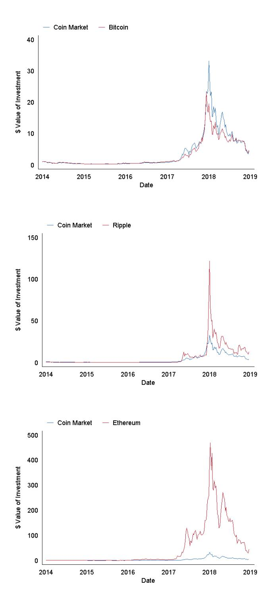

### NBER WORKING PAPER SERIES

#### COMMON RISK FACTORS IN CRYPTOCURRENCY

Yukun Liu Aleh Tsyvinski Xi Wu

Working Paper 25882 http://www.nber.org/papers/w25882

NATIONAL BUREAU OF ECONOMIC RESEARCH 1050 Massachusetts Avenue Cambridge, MA 02138 May 2019

We thank Nicola Borri, Markus Brunnermeier, Kent Daniel, Zhiguo He, Andrew Karolyi, Alan Kwan, Ye Li, Nikolai Roussanov, Jinfei Sheng, Michael Sockin, and Jessica Wachter for comments. We are grateful to Colton Conley and Dean Li for their excellent research assistance. The views expressed herein are those of the authors and do not necessarily reflect the views of the National Bureau of Economic Research.

NBER working papers are circulated for discussion and comment purposes. They have not been peer-reviewed or been subject to the review by the NBER Board of Directors that accompanies official NBER publications.

© 2019 by Yukun Liu, Aleh Tsyvinski, and Xi Wu. All rights reserved. Short sections of text, not to exceed two paragraphs, may be quoted without explicit permission provided that full credit, including © notice, is given to the source.

Common Risk Factors in Cryptocurrency Yukun Liu, Aleh Tsyvinski, and Xi Wu NBER Working Paper No. 25882 May 2019 JEL No. G12

#### **ABSTRACT**

We find that three factors – cryptocurrency market, size, and momentum – capture the crosssectional expected cryptocurrency returns. We consider a comprehensive list of price- and market-related factors in the stock market, and construct their cryptocurrency counterparts. Nine cryptocurrency factors form successful long-short strategies that generate sizable and statistically significant excess returns. We show that all of these strategies are accounted for by the cryptocurrency three-factor model.

Yukun Liu Department of Economics Yale University New Haven, CT 06520-8268 yukun.liu@yale.edu

Aleh Tsyvinski Department of Economics Yale University Box 208268 New Haven, CT 06520-8268 and NBER a.tsyvinski@yale.edu

Xi Wu Stern School of Business New York University New York, NY 10012 xwu@stern.nyu.edu

## **1 Introduction**

The cryptocurrency market has experienced rapid growth. This market allows companies to raise money without engaging with venture capitalists and to be traded without being listed on stock exchanges. The entire set of coins in the crypto market ranges from wellknown currencies such as Bitcoin, Ripple, and Ethereum to much more obscure coins. There are two views on the cryptocurrency market. The first is that most and perhaps all of the coins represent bubbles and fraud. The second is that the blockchain technology embodied in coins may become an important innovation and that at least some coins may be assets that represent a stake in the future of this technology. If the latter case is true, analyzing the cryptocurrency market from the empirical asset pricing point of view is important for at least two reasons. The first reason is to understand whether the returns of cryptocurrencies share similarities with other asset classes, most importantly, with equities. The second reason is to establish a set of empirical regularities that can be used as stylized facts and important inputs to assess and develop theoretical models of cryptocurrency.

In this paper, we study the cross-section of cryptocurrency returns. Our primary goal is to examine this market using standard empirical asset pricing tools. We consider all of the coins with market capitalizations above one million dollars and their returns from the beginning of 2014 to the end of 2018. The number of such coins grew from 109 in 2014 to 1,583 in 2018.

We examine whether the characteristics that are deemed important in the cross-section of equity returns are also present in the cryptocurrency market. We find that many of the known characteristics in the equity market also form successful long-short trading strategies in the cross-section of cryptocurrencies. In particular, three factors – cryptocurrency market, size, and momentum – capture most of the cross-sectional expected returns.

The literature on the stock market established a number of factors that explain the cross-section of stock returns. Among the factors compiled by [Feng et al.](#page-39-0) [\(2017\)](#page-39-0) and [Chen](#page-38-0) [and Zimmermann](#page-38-0) [\(2018\)](#page-38-0), we select those that are constructed based only on price and market information – 25 such factors in total. We first describe the construction of the cryptocurrency counterparts for all these factors in the cross-section of cryptocurrencies. There are broadly four groups of factors: size, momentum, volume, and volatility. We also construct a coin market return using all of the coins for which the data is readily available. The coin market return series comprises 1,707 coins weighted by their market capitalization.

We then analyze the performance of all the 25 factors in the cryptocurrency market.

Each week, we sort the returns of individual cryptocurrencies into quintile portfolios based on the value of a given factor. We track the return of each portfolio in the week that follows and calculate the average excess return over the risk-free rate of each portfolio. We then form the long-short strategy based on the difference between the fifth and the first quintiles. We find that the returns of the zero-investment strategies are statistically significant for 9 out of the 25 factors. Specifically, these are: market capitalization, price, and maximum price; one-, two-, three-, and four-week momentum; dollar volume; and standard deviation of dollar volume. We now turn to the detailed description of the results for each group of factors.

For the statistically significant size related strategies, a zero-investment long-short strategy that longs the smallest coins and shorts the largest coins generates more than 3 percent excess weekly returns (3.4 percent for the market capitalization, 3.9 percent for the end of week price, and 4.1 percent for the highest price of the week strategies). For the momentum strategies, a zero-investment long-short strategy that longs the coins with comparatively large price increases and shorts the coins with comparatively small increases generates about 3 percent excess weekly returns (2.7 percent for one-week momentum, 3.3 percent for two-week momentum, 4.1 percent for three-week momentum, and 2.5 percent for four-week momentum strategies). For the volume related strategies, a zero-investment strategy that longs the lowest volume coins and shorts the highest volume coins generates about 3 percent excess weekly returns (3.2 percent for the dollar volume). For the volatility strategy, a zero-investment strategy that longs the lowest dollar volume volatility coins and shorts the highest dollar volume volatility coins generates about 3 percent excess weekly returns. For all of these factors, the returns on individual quintile portfolios are almost monotonic with the quintiles. Determining the cryptocurrency factors that predict the cross-section of the entire cryptocurrency space is the first main result of the paper.

Next, we investigate whether these nine cross-sectional cryptocurrency return predictors can be spanned by a small number of factors. Our second main result is to develop a factor model for the cross-section of the cryptocurrency returns. We first consider a one-factor model with the coin market factor only. This is, in essence, a cryptocurrency CAPM model. The results are similar to those found in other asset classes – the model performs poorly in pricing the cross-section of the coin returns. The alphas for most of the successful zeroinvestment strategies remain large and statistically significant. The alphas for some of the strategies decrease marginally. The explanatory power of the model is low, with the *R* 2 s of the long-short strategies ranging from about zero percent for the one-week momentum to

6.8 percent for the maximum day price strategies.

We next show that a three-factor model with the cryptocurrency market factor (CMKT), a cryptocurrency size factor (CSMB), and a cryptocurrency momentum factor (CMOM), accounts for the excess returns of all of the nine successful zero-investment strategies. Adjusted for the cryptocurrency three-factor model, none of the alphas of the nine strategies remains statistically significant. The CSMB factor accounts for the following strategies: market capitalization, price, maximum day price, dollar volume, and the standard deviation of dollar volume. The CMOM factor accounts for the two-week, three-week, and four-week momentum strategies. Both CSMB and CMOM account for the one-week momentum strategy. We conclude that the cryptocurrency three-factor model captures the cross-section of expected returns of cryptocurrencies.

Finally, we note several additional results. First, as the construction of the long-short strategies relies on the ability to short coins, a natural criticism of our findings is that short selling is either not possible or limited for most of the coins. We thus analyze each strategy that shorts Bitcoin instead of shorting the relevant quintile portfolio. The results virtually do not change. Second, we find that the momentum strategies perform significantly better among the larger coins. The momentum strategy in the below median size group generates statistically insignificant 0.6 percent weekly excess returns; the momentum strategy in the above median size group generates statistically significant 4.2 percent weekly returns. We also show that the stock market factor models, such as the Fama-French 3-factor, Carhart 4-factor, and the Fama-French 5-factor models, do not account for the cross-section of cryptocurrency returns. Additionally, we show that the procedure that removes the unpriced risks similar to [Daniel et al.](#page-39-1) [\(2018\)](#page-39-1) strengthens the cryptocurrency size factor but not the cryptocurrency momentum factor. One possible explanation is that loadings on the cryptocurrency momentum factor are more transient than loadings on the cryptocurrency size factor.

We briefly discuss the relationship to the literature. Size and momentum are among the most studied strategies in asset pricing. The size effect in the stock market is first documented in [Banz](#page-37-0) [\(1981\)](#page-37-0). [Fama and French](#page-39-2) [\(1992\)](#page-39-2) show that size and value are important factors in explaining the cross-section of expected stock returns. Our findings on momentum are related to many papers on the topic such as [Jegadeesh and Titman](#page-40-0) [\(1993\)](#page-40-0), [Moskowitz](#page-41-0) [and Grinblatt](#page-41-0) [\(1999\)](#page-41-0), [Moskowitz et al.](#page-41-1) [\(2012\)](#page-41-1), [Asness et al.](#page-37-1) [\(2013\)](#page-37-1). The use of factor models to analyze asset returns dates back to the papers of [Fama and French](#page-39-3) [\(1993\)](#page-39-3) and [Fama and](#page-39-4) [French](#page-39-4) [\(1996\)](#page-39-4). [Lustig et al.](#page-40-1) [\(2011\)](#page-40-1), [Szymanowska et al.](#page-41-2) [\(2014\)](#page-41-2), and [Bai et al.](#page-37-2) [\(2018\)](#page-37-2) develop factor models for the currency, commodity, and corporate bond markets, respectively.

[Yermack](#page-41-3) [\(2015\)](#page-41-3) is one of the first papers that brings academic attention to the field of cryptocurrency. A number of recent papers develop models of cryptocurrencies (see, e.g., [Weber,](#page-41-4) [2016;](#page-41-4) [Biais et al.,](#page-37-3) [2018a;](#page-37-3) [Chiu and Koeppl,](#page-38-1) [2017;](#page-38-1) [Cong and He,](#page-38-2) [2018;](#page-38-2) [Cong et al.,](#page-38-3) [2018a;](#page-38-3) [Cong et al.,](#page-38-4) [2018b;](#page-38-4) [Sockin and Xiong,](#page-41-5) [2018;](#page-41-5) [Schilling and Uhlig,](#page-41-6) [2018;](#page-41-6) [Abadi and](#page-37-4) [Brunnermeier,](#page-37-4) [2018;](#page-37-4) [Routledge and Zetlin-Jones,](#page-41-7) [2018\)](#page-41-7). Several recent papers document empirical facts related to cryptocurrency investments (e.g., [Stoffels,](#page-41-8) [2017;](#page-41-8) [Hubrich,](#page-40-2) [2017;](#page-40-2) [Borri,](#page-38-5) [2018;](#page-38-5) [Borri and Shakhnov,](#page-38-6) [2018a;](#page-38-6) [Borri and Shakhnov,](#page-38-7) [2018b;](#page-38-7) [Hu et al.,](#page-40-3) [2018;](#page-40-3) [Makarov and](#page-41-9) [Schoar,](#page-41-9) [2018;](#page-41-9) [Liu and Tsyvinski,](#page-40-4) [2018;](#page-40-4) [Li and Yi,](#page-40-5) [2018\)](#page-40-5).

# **2 Data**

We collect trading data of all cryptocurrencies available from Coinmarketcap.com. Coinmarketcap.com is a leading source of cryptocurrency price and volume data. It aggregates information from over 200 major exchanges and provides daily data on opening, closing, high, low prices, volume and market capitalization (in dollars) for most of the cryptocurrencies.[1](#page--1-0) For each cryptocurrency on the website, its price is calculated by taking the volume weighted average of all prices reported at each market. A cryptocurrency needs to meet a list of criteria to be listed, such as being traded on a public exchange with an API that reports the last traded price and the last 24-hour trading volume, and having a non-zero trading volume on at least one supported exchange so that a price can be determined. Coinmarketcap.com lists both active and defunct cryptocurrencies, thus alleviating concerns about survivorship bias.

We use daily close prices to construct weekly coin returns. Specifically, we divide each year into 52 weeks. The first week of the year consists of the first seven days of the year. The first 51 weeks of the year consist of seven days each and the last week of the year consists of the last eight days of the year.[2](#page--1-0) Our sample includes 1,707 coins from the beginning of 2014 to the end of 2018. The trading volume data became available in the last week of 2013, and thus our sample period starts from the beginning of 2014. We require that the coins have information on price, volume, and market capitalization. We further exclude coins with market capitalizations of less than \$1,000,000. To alleviate concerns for outliers, we winsorize all non-return variables by the 1st and 99th percentiles each week.

1Some coins are not tracked by the website because the coins' exchanges do not provide accessible APIs.

2The last week of 2016 consists of the last nine days of the year.

The summary statistics are presented in Panel A of Table [1.](#page-7-0) The number of coins in our sample that satisfy all the filters increases from 109 in 2014 to 1,583 in 2018. The mean (median) market capitalization in the sample is 356.71 (8.17) million dollars. The mean (median) daily dollar volume in our sample is 18,305.83 (103.89) thousand dollars.

We construct a cryptocurrency market return as the value-weighted return of all the underlying available coins. The cryptocurrency excess market return (CMKT) is constructed as the difference between the cryptocurrency market index return and the risk-free rate measured as the one-month Treasury bill rate. The summary statistics are presented in Panel B of Table [1.](#page-7-0) During the sample period, the average coin market index return is 1.3 percent per week, which is higher than the average Bitcoin return (1.2 percent per week) but is lower than the average Ripple return (3.5 percent per week) or Ethereum return (4.6 percent per week).[3](#page--1-0) The weekly standard deviation of the coin market index return is 0.117, which is slightly higher than that of Bitcoin (0.114) but much lower than those of Ripple (0.267) and Ethereum (0.241). The coin market index returns have positive skewness and kurtosis. Figure [1](#page-8-0) plots the cryptocurrency market index against Bitcoin, Ripple, and Ethereum. The values are presented as the US dollar value of investing one dollar from the inception of the given cryptocurrency to facilitate comparisons. The figure shows strong correlations among the cryptocurrency market index and the investment values of the major coins.

We obtain the stock market factors for the Fama French 3-factor, Carhart 4-factor, and Fama French 5-factor models from Kenneth French's website.

3Bitcoin, Ripple, and Ethereum are the three largest cryptocurrencies by market capitalization and thus form a natural reference group.

#### **Table 1: Summary Statistics**

Panel A reports the number of coins, the mean and median of market capitalization, and the mean and median of daily trading dollar volume by year. Panel B reports the characteristics of coin market index returns, Bitcoin returns, Ripple returns, and Ethereum returns. The coin market index returns, Bitcoin returns, and Ripple returns start from the first week of 2014. The Ethereum returns start from the thirtysecond week of 2015.

| Year | Number of Coins | Panel Market Mean | A Cap (mil) Median | Volume Mean | (thous) Median |
|------|-----------------|-------------------|--------------------|-------------|----------------|
| 2014 | 109             | 239.83            | 3.89               | 1,146.09    | 36.24          |
| 2015 | 77              | 134.53            | 2.76               | 1,187.64    | 11.51          |
| 2016 | 155             | 160.06            | 3.39               | 1,789.24    | 23.73          |
| 2017 | 804             | 435.68            | 9.01               | 18,509.55   | 133.56         |
| 2018 | 1,583           | 357.20            | 8.91               | 20,829.12   | 124.02         |
| Full | 1,707           | 356.71            | 8.17               | 18,305.83   | 103.89         |

|          |               | Mean  | Panel Median | B SD  | Skewness | Kurtosis |
|----------|---------------|-------|--------------|-------|----------|----------|
| Coin     | Market Return | 0.013 | 0.006        | 0.117 | 0.294    | 4.574    |
| Bitcoin  | Return        | 0.012 | 0.005        | 0.114 | 0.367    | 4.580    |
| Ripple   | Return        | 0.035 | -0.007       | 0.267 | 3.478    | 21.263   |
| Ethereum | Return        | 0.046 | 0.001        | 0.241 | 1.841    | 9.843    |

## **Figure 1: Cryptocurrency Market Index and Major Coins**

This figure plots the cryptocurrency market index against Bitcoin, Ripple, and Ethereum.

# **3 Cross-Sectional Factors**

We consider a comprehensive list of the established factors in the cross-section of stock returns, compiled by [Feng et al.](#page-39-0) [\(2017\)](#page-39-0) and [Chen and Zimmermann](#page-38-0) [\(2018\)](#page-38-0). Among these, we select all the factors that can be directly constructed using only the information on price, volume, and market capitalization. The reason we consider only the market-based factors is that financial and accounting data for the cross-section of coins is either not readily available or not applicable. We hence investigate 25 factors, which we present in Table [2.](#page-10-0) We further group them into four broad categories: size, momentum, volume, and volatility.

### **3.1 Size Factors**

We analyze the performance of the zero-investment long-short strategies based on the size-related factors: market capitalization, price, maximum price, and age. Each week, we sort individual cryptocurrencies into quintile portfolios based on the value of a given factor. We track the return of each portfolio in the week that follows. We then calculate the average excess returns over the risk-free rate of each portfolio, and the excess returns of the longshort strategies based on the difference between the fifth and the first quintiles. We find that the first three factors generate statistically significant long-short strategy returns. The result of the zero-investment long-short strategy for age is not statistically significant and is summarized in the last part of the section.

Table [3](#page-11-0) presents the results. For the first three factors, the average mean excess returns decrease from the top to the bottom quintiles. The differences in the average returns of the highest and lowest quintiles are -3.4 percent for market capitalization, -3.9 percent for the end of week price, and -4.1 percent for the highest price of the week. All of these differences are statistically significant at the 5 percent level. In other words, a zero-investment strategy that longs the smallest coins and shorts the largest coins generates about 3 percent excess weekly returns. Of course, this strategy does not take into account trading costs and the feasibility of short selling. We consider strategies that short Bitcoin, and present results that long the smallest coins and short Bitcoin in Section [5.](#page-28-0) In the Appendix, we also present results based on tercile instead of quintile portfolios.[4](#page--1-0) The results based on tercile portfolios

4The same robustness results are presented for all other successful strategies in the Appendix.

are qualitatively similar.

**Table 2: Factor Definitions**

| Category   |   | Factor    |            | Definition                                                          |
|------------|---|-----------|------------|---------------------------------------------------------------------|
| Size       |   | MCAP      | Log        | last day market capitalization in the portfolio formation week      |
| Size       |   | PRC       | Log        | last day price in the portfolio formation week                      |
| Size       |   | MAXDPRC   | The        | maximum price of the portfolio formation week                       |
| Size       |   | AGE       | The        | number of weeks that have been listed on Coinmarketcap.com          |
| Momentum   | r | 1,0       | One-week   | momentum                                                            |
| Momentum   | r | 2,0       | Two-week   | momentum                                                            |
| Momentum   | r | 3,0       | Three-week | momentum                                                            |
| Momentum   | r | 4,0       | Four-week  | momentum                                                            |
| Momentum   | r | 8,0       | Eight-week | momentum                                                            |
| Momentum   | r | 16,0      |            | Sixteen-week momentum                                               |
| Momentum   | r | 50,0      | Fifty-week | momentum                                                            |
| Momentum   | r | 100,0     |            | Hundred-week momentum                                               |
| Volume     |   | VOL       | Log        | average daily volume in the portfolio formation week                |
| Volume     |   | PRCVOL    | Log        | average daily volume times price in the portfolio formation week    |
| Volume     |   | VOLSCALED | Log        | average daily volume times price scaled by market capitalization in |
|            |   |           | the        | portfolio formation week                                            |
| Volatility |   | BETA      | The        | regression coefficient β                                            |
|            |   |           |            | CMKT in R i − R f = α                                               |
|            |   |           |            | i + β                                                               |
|            |   |           |            | CMKT CMKT +  i                                                     |
|            |   |           | The        | model is estimated using daily returns of the previous 365 days     |
|            |   |           | before     | the formation week.                                                 |
| Volatility |   | BETA2     | Beta       | squared                                                             |
| Volatility |   | IDIOVOL   | The        | idiosyncratic volatility is measured as the standard deviation of   |
|            |   |           | the        | residual after estimating R i − R f = α                             |
|            |   |           |            | i + β                                                               |
|            |   |           |            | CMKT CMKT +  i                                                     |
|            |   |           | model      | is estimated using daily returns of the previous 365 days before    |
|            |   |           | the        | formation week.                                                     |
| Volatility |   | RETVOL    | The        | standard deviation of daily returns in the portfolio formation week |
| Volatility |   | RETSKEW   | The        | skewness of daily returns in the portfolio formation week           |
| Volatility |   | RETKURT   | The        | kurtosis of daily returns in the portfolio formation week           |
| Volatility |   | MAXRET    | Maximum    | daily return of the portfolio formation week                        |
| Volatility |   | DELAY     | The        | improvement of R                                                    |
|            |   |           | R i − R    | f = α                                                               |
|            |   |           |            | i + β                                                               |
|            |   |           |            | CMKT CMKT + β                                                       |
|            |   |           |            | CMKT − 1                                                            |
|            |   |           |            | CMKT − 1 + β                                                        |
|            |   |           |            | CMKT − 2                                                            |
|            |   |           |            | CMKT − 2 +  i                                                      |
|            |   |           | where      | CMKT − 1 and CMKT − 2 are the lagged one and two day coin           |
|            |   |           | market     | index returns, compared to using only current coin market           |
|            |   |           | excess     | returns. The model is estimated using daily returns of the          |
|            |   |           | previous   | 365 days before the formation week.                                 |
| Volatility |   | STDPRCVOL | Log        | standard deviation of dollar volume in the portfolio formation week |
| Volatility |   | DAMIHUD   | The        | average absolute daily return divided by dollar volume in the       |
|            |   |           | portfolio  | formation week                                                      |

**Table 3: Size Factor Returns**

This table reports the mean quintile portfolio returns based on the market capitalization, last day price, and maximum day price factors. The mean returns are the time-series averages of weekly value-weighted portfolio excess returns. \*, \*\*, \*\*\* denote significance levels at the 10%, 5%, and 1%.

|         |          |         |         | Quintiles |         |          |
|---------|----------|---------|---------|-----------|---------|----------|
|         | 1        | 2       | 3       | 4         | 5       | 5-1      |
| MCAP    | Low      |         |         |           | High    |          |
| Mean    | 0.047*** | 0.018   | 0.013   | 0.013     | 0.013*  | -0.034** |
| t(Mean) | (2.958)  | (1.610) | (1.286) | (1.439)   | (1.766) | (-2.557) |
| PRC     | Low      |         |         |           | High    |          |
| Mean    | 0.051*** | 0.029** | 0.001   | 0.018     | 0.012*  | -0.039** |
| t(Mean) | (2.739)  | (2.118) | (0.117) | (1.419)   | (1.689) | (-2.420) |
| MAXDPRC | Low      |         |         |           | High    |          |
| Mean    | 0.053*** | 0.025*  | 0.002   | 0.021     | 0.012*  | -0.041** |
| t(Mean) | (2.791)  | (1.905) | (0.143) | (1.568)   | (1.681) | (-2.483) |

#### **3.2 Momentum**

We analyze the performance of the zero-investment long-short strategies based on the one-, two-, three-, four-, eight-, sixteen-, fifty-, and one hundred-week momentum factors. Each week, we sort individual cryptocurrencies into quintile portfolios based on the value of a given factor. All strategies are rebalanced weekly. We find that the one-, two-, three-, and four-week momentum factors generate statistically significant long-short strategy returns. The results of the zero-investment long-short strategies for the eight-, sixteen-, fifty, and one hundred-week momentum are not statistically significant and are summarized in the last part of the section.

Table [4](#page-12-0) presents the results of the successful factors for the portfolios sorted in quintiles. For the one-, two-, three-, and four-week momentum strategies, the average mean excess returns increase with the quintiles. The patterns are almost universally monotonic. The difference in the average returns of the highest and lowest quintiles is about 3 percent for each horizon and statistically significant at the 5 percent level (1 percent level for three-week momentum). In other words, a zero-investment strategy that longs the coins with comparatively large increases and shorts the coins with comparatively small increases generates about 3 percent excess weekly returns. The differences in the average returns of the highest and lowest quintiles are 2.7 percent for the one-week momentum, 3.3 percent for the two-week momentum, 4.1 percent for the three-week momentum, and 2.5 percent for the four-week momentum.

**Table 4: Momentum Factor Returns**

This table reports the mean quintile portfolio returns based on the one-week, two-week, three-week, and fourweek momentum factors. The mean returns are the time-series averages of weekly value-weighted portfolio excess returns. \*, \*\*, \*\*\* denote significance levels at the 10%, 5%, and 1%.

|         |          |          |         | Quintiles |          |          |
|---------|----------|----------|---------|-----------|----------|----------|
|         | 1        | 2        | 3       | 4         | 5        | 5-1      |
| r 1,0   | Low      |          |         |           | High     |          |
| Mean    | -0.006   | -0.002   | 0.010   | 0.042**   | 0.021    | 0.027**  |
| t(Mean) | (-0.552) | (-0.176) | (1.094) | (2.317)   | (1.550)  | (1.994)  |
| r 2,0   | Low      |          |         |           | High     |          |
| Mean    | -0.002   | 0.005    | 0.010   | 0.018*    | 0.030**  | 0.033**  |
| t(Mean) | (-0.225) | (0.493)  | (1.155) | (1.894)   | (2.314)  | (2.442)  |
| r 3,0   | Low      |          |         |           | High     |          |
| Mean    | 0.002    | 0.001    | 0.016   | 0.020**   | 0.043*** | 0.041*** |
| t(Mean) | (0.156)  | (0.124)  | (1.587) | (2.091)   | (2.956)  | (2.742)  |
| r 4,0   | Low      |          |         |           | High     |          |
| Mean    | 0.002    | 0.004    | 0.008   | 0.019*    | 0.027**  | 0.025**  |
| t(Mean) | (0.243)  | (0.435)  | (0.935) | (1.921)   | (2.033)  | (2.002)  |

### **3.3 Volume Factors**

We analyze the performance of the volume-related factors: volume, dollar volume, and scaled volume. Each week, we sort individual cryptocurrencies into quintile portfolios based on the value of a given factor. All strategies are rebalanced weekly. The dollar volume strategy generates statistically significant long-short strategy returns. The results of the zero-investment long-short strategies based on the other volume factors are not statistically significant and are summarized in the last part of the section.

Table [5](#page-13-0) presents the results for the portfolios sorted in quintiles based on the dollar volume factor. The average mean excess returns decrease with the quintiles. The patterns are mostly monotonic from the lowest to the highest quintiles. The difference in the average returns of the highest and lowest quintiles is -3.2 percent for the dollar volume factor. The difference is statistically significant at the five percent level. In other words, a zero-investment strategy that longs the lowest dollar volume coins and shorts the highest dollar volume coins generates about 3 percent excess weekly returns.

**Table 5: Volume Factor Returns**

This table reports the mean quintile portfolio returns based on the price dollar volume factor. The mean returns are the time-series averages of weekly value-weighted portfolio excess returns. \*, \*\*, \*\*\* denote significance levels at the 10%, 5%, and 1%.

|         |         |         |         | Quintiles |         |          |
|---------|---------|---------|---------|-----------|---------|----------|
|         | 1       | 2       | 3       | 4         | 5       | 5-1      |
| PRCVOL  | Low     |         |         |           | High    |          |
| Mean    | 0.045** | 0.028** | 0.017   | 0.018     | 0.013*  | -0.032** |
| t(Mean) | (2.438) | (2.154) | (1.375) | (1.456)   | (1.745) | (-2.016) |

### **3.4 Volatility Factors**

We analyze the performance of the volatility-related factors: beta, beta squared, idiosyncratic volatility, the standard deviation of returns, the skewness of returns, the kurtosis of returns, maximum day return, delay, the standard deviation of dollar volume, and Amihud's illiquidity measure. Each week, we sort individual cryptocurrencies into quintile portfolios

on the value of a given factor. All strategies are rebalanced weekly. The standard deviation of dollar volume measure generates statistically significant long-short strategy returns, but the other factors do not. We summarize the insignificant volatility factors in the last part of the section.

Table [6](#page-14-0) presents the results for the portfolios sorted in quintiles for the standard deviation of dollar volume – the only factor out of ten in this group that generates statistically significant excess returns on the long-short strategies. For the standard deviation of dollar volume, the average mean excess returns of the portfolios decrease monotonically with the quintiles and are statistically significant for each quintile except quintile four. The difference in the average returns of the highest and lowest quintiles is -3.0 percent. In other words, a zero-investment strategy that longs the lowest dollar volume volatility coins and shorts the highest dollar volume volatility coins generates about 3 percent excess weekly returns.[5](#page--1-0)

#### **Table 6: Volatility Factor Returns**

This table reports the mean quintile portfolio returns based on the standard deviation of dollar volume factor. The mean returns are the time-series averages of weekly value-weighted portfolio excess returns. \*, \*\*, \*\*\* denote significance levels at the 10%, 5%, and 1%.

|           |          |         | Quintiles |         |         |          |
|-----------|----------|---------|-----------|---------|---------|----------|
|           | 1        | 2       | 3         | 4       | 5       | 5-1      |
| STDPRCVOL | Low      |         |           |         | High    |          |
| Mean      | 0.043*** | 0.032** | 0.021*    | 0.021   | 0.013*  | -0.030** |
| t(Mean)   | (2.711)  | (2.114) | (1.687)   | (1.644) | (1.739) | (-2.269) |

5For the cross-section of cryptocurrencies, the dollar volume volatility strongly correlates with size. The reason is that the dollar volume volatility measure is primarily driven by the differences in the price levels of coins. In the next section, we show that the dollar volume volatility premium can be accounted for by the cryptocurrency size factor.

**Table 7: Insignificant Factor Returns**

This table reports the mean quintile portfolio returns based on the insignificant factors. The mean returns are the time-series averages of weekly value-weighted portfolio excess returns. \*, \*\*, \*\*\* denote significance levels at the 10%, 5%, and 1%.

|                | 1        | 2       | 3       | 4       | 5        | 5-1      |
|----------------|----------|---------|---------|---------|----------|----------|
| Mean AGE       | 0.018    | 0.010   | 0.019*  | 0.014   | 0.013*   | -0.005   |
| t(Mean)        | (1.070)  | (1.034) | (1.902) | (1.445) | (1.732)  | (-0.358) |
| r 8,0          |          |         |         |         |          |          |
| Mean           | 0.016    | 0.011   | 0.025** | 0.022** | 0.022*   | 0.006    |
| t(Mean)        | (1.366)  | (1.266) | (2.016) | (2.211) | (1.740)  | (0.421)  |
| r 16,0         |          |         |         |         |          |          |
| Mean           | 0.017*   | 0.017*  | 0.006   | 0.013   | 0.021*   | 0.004    |
| t(Mean)        | (1.693)  | (1.806) | (0.714) | (1.300) | (1.661)  | (0.310)  |
| r 50,0         |          |         |         |         |          |          |
| Mean           | 0.015    | 0.021** | 0.017   | 0.014   | 0.008    | -0.008   |
| t(Mean)        | (1.572)  | (2.167) | (1.593) | (1.447) | (0.680)  | (-0.764) |
| r 100,0        |          |         |         |         |          |          |
| Mean           | 0.032*** | 0.027** | 0.027*  | 0.024*  | 0.018    | -0.011   |
| t(Mean)        | (2.842)  | (2.556) | (1.971) | (1.923) | (1.376)  | (-0.804) |
| Mean VOL       | 0.014    | 0.034*  | 0.017*  | 0.014   | 0.013*   | -0.002   |
| t(Mean)        | (1.237)  | (1.736) | (1.695) | (1.289) | (1.780)  | (-0.170) |
| Mean VOLSCALED | 0.028*   | 0.035** | 0.019   | 0.001   | 0.012*   | -0.016   |
| t(Mean)        | (1.913)  | (2.347) | (1.481) | (0.120) | (1.699)  | (-1.332) |
| Mean BETA      | 0.019*   | 0.017   | 0.020*  | 0.016   | 0.006    | -0.013   |
| t(Mean)        | (1.967)  | (1.573) | (1.817) | (1.488) | (0.544)  | (-1.256) |
| Mean BETA2     | 0.018*   | 0.024** | 0.017   | 0.015   | 0.005    | -0.012   |
| t(Mean)        | (1.847)  | (2.074) | (1.616) | (1.334) | (0.484)  | (-1.191) |
| Mean IDIOVOL   | 0.014*   | 0.027** | 0.023*  | 0.007   | 0.022    | 0.009    |
| t(Mean)        | (1.894)  | (2.200) | (1.803) | (0.564) | (1.378)  | (0.682)  |
| Mean RETVOL    | 0.013    | 0.022** | 0.026*  | 0.020   | -0.004   | -0.017   |
| t(Mean)        | (1.549)  | (2.102) | (1.951) | (1.163) | (-0.281) | (-1.237) |
| Mean RETSKEW   | 0.011    | 0.002   | 0.020*  | 0.011   | 0.016    | 0.005    |
| t(Mean)        | (1.206)  | (0.270) | (1.947) | (1.015) | (1.191)  | (0.383)  |
| Mean RETKURT   | -0.002   | 0.022** | 0.011   | 0.021** | 0.005    | 0.006    |
| t(Mean)        | (-0.185) | (2.255) | (1.135) | (2.009) | (0.412)  | (0.647)  |
| Mean MAXRET    | 0.012    | 0.018*  | 0.013   | 0.030*  | 0.006    | -0.006   |
| t(Mean)        | (1.452)  | (1.691) | (1.358) | (1.778) | (0.388)  | (-0.441) |
| Mean DELAY     | 0.014*   | 0.019*  | 0.018   | 0.018   | 0.012    | -0.001   |
| t(Mean)        | (1.876)  | (1.783) | (1.629) | (1.338) | (1.264)  | (-0.159) |
| Mean DAMIHUD   | 0.013*   | 0.013   | 0.039** | 0.015   | 0.038*   | 0.026    |
| t(Mean)        | (1.739)  | (1.074) | (2.159) | (1.511) | (1.914)  | (1.478)  |

#### **3.5 Insignificant Factors**

In this section, we present the table that summarizes the results for the zero-investment strategies for the factors that do not generate statistically significant returns. There are sixteen such factors in total: age; eight-, sixteen-, fifty-, and one hundred-week momentum; volume, and scaled volume; beta, beta squared, idiosyncratic volatility, the standard deviation of returns, the skewness of returns, the kurtosis of returns, maximum day return, delay, and the Amihud's illiquidity measure. Each week, we sort individual cryptocurrencies into quintile portfolios on the value of a given factor. All strategies are rebalanced weekly.

Table [7](#page-15-0) presents the results of the performance of the zero-investment long-short strategies. None of the measures generates statistically significant long-short strategy returns. The average mean excess returns do not change monotonically with the quintiles. The differences in the average returns of the highest and lowest quintiles are small and statistically insignificant. For example, the sixteen-week momentum strategy generates statistically insignificant excess returns of 0.4 percent per week on the long-short strategy.

# **4 Cryptocurrency Factors**

In this section, we investigate whether the nine cross-sectional cryptocurrency return predictors that we have identified can be spanned by a small number of factors. We perform an analysis similar to that of [Fama and French](#page-39-4) [\(1996\)](#page-39-4). We first show that a one-factor model with only the coin market return, or the cryptocurrency CAPM, cannot account for most of the excess returns of the nine strategies. Then, we analyze two-factor models: a two-factor model that adds the cryptocurrency size factor and a two-factor model that adds the cryptocurrency momentum factor. The two-factor model with the cryptocurrency market factor and a cryptocurrency size factor can account for the excess returns of five out of the nine zero-investment strategies but cannot explain any of the momentum related strategies. The two-factor model with the cryptocurrency market factor and a cryptocurrency momentum factor can account for the four momentum related strategies but not for any of the other strategies. Finally, we show that a three-factor model with the cryptocurrency market factor, a cryptocurrency size factor, and a cryptocurrency momentum factor explains the excess returns of all nine strategies.

The construction of the cryptocurrency market excess returns is discussed in Section [2.](#page-5-0) We construct the cryptocurrency size and momentum factors following the method used by [Fama and French](#page-39-3) [\(1993\)](#page-39-3). Specifically, for size, each week we split the coins into three size groups by market capitalization: bottom 30 percent (small, S), middle 40 percent (middle, M), and top 30 percent (big, B).[6](#page--1-0) We then form value-weighted portfolios for each of the three groups. The cryptocurrency size factor (CSMB) is the return difference between the portfolios of the small and the big size portfolios. We construct the momentum factor (CMOM) using the three-week momentum.[7](#page--1-0) Each week, we split the coins into three threeweek momentum groups: bottom 30 percent, middle 40 percent, and top 30 percent. Then, we form value-weighted portfolios for each of the three three-week momentum groups. The cryptocurrency momentum factor (CMOM) is the return difference between the top and the bottom momentum portfolios. In the Appendix, we provide summary statistics for each of the cryptocurrency factors.

We first consider a one-factor model with only the cryptocurrency market factor, or the cryptocurrency CAPM. Table [8](#page-18-0) presents the results for all the nine significant zeroinvestment strategies that we have found in the previous section. The alphas for all of the zero-investment long-short strategies remain significant. Moreover, the decreases in magnitude are small compared to the unadjusted excess returns. The average decrease of the zero-investment strategy alphas for the statistically significant strategies is only 8.61 percent of the orignal values. The strategies have some exposures to the coin market returns. In particular, the zero-investment long-short strategies based on market capitalization, price, maximum day price, dollar volume, and standard deviation of dollar volume are significantly exposed to the coin market excess returns. The strategies based on past returns – one-week momentum, two-week momentum, three-week momentum, and four-week momentum – are not significantly exposed to the coin market returns. The average of the absolute value of the statistically significant betas is 0.39 (with a range of 0.210 for the market capitalization strategy to 0.592 for the maximum day price). However, for all the strategies, the one-factor model does not explain a sizable portion of the excess returns, with the zero-investment strategy *R* 2 s ranging from about zero percent for the one-week momentum strategy to 6.8 percent for the maximum day price.

6We use market capitalization as our main size measure because of the tradition in the stock market size literature. The results are robust to using alternative measures of size.

7We use three-week momentum as our main momentum measure because it generates the largest longshort spread in the data. The results are qualitatively similar using alternative measures of momentum.

### **Table 8: Cryptocurrency One-Factor Model**

| $R_f - R_f = \alpha^i + \beta_{CMKT}^i CMKT + \epsilon_i$ | (1) |
|-----------------------------------------------------------|-----|
|-----------------------------------------------------------|-----|

where *CMKT* is the cryptocurrency excess market returns. The formation of the quintile portfolios for the nine significant strategies are discussed in Section [3.](#page-9-0) The t-statistics are reported in the parentheses. \*, \*\*, \*\*\* denote significance levels at the 10%, 5%, and 1%. m.a.e and ¯*R*2 are the mean of the absolute pricing errors and the average *R* 2 of the five portfolios, respectively.

|           |     |   |      | 1          | 2        | 3        | 4        | 5         | 5-1 m.a.e ¯ R 2 |
|-----------|-----|---|------|------------|----------|----------|----------|-----------|-----------------|
| α         |     |   |      | 0.031**    | 0.005    | -0.001   | 0.002    | 0.001     | -0.031**        |
|           |     |   |      |            |          |          |          |           | 0.008 0.571     |
| t         | ( α | ) |      | (2.346)    | (0.640)  | (-0.148) | (0.257)  | (1.400)   | (-2.284)        |
| β MCAP    | C   | M | KT   | 1.208***   | 1.074*** | 0.990*** | 0.984*** | 0.998***  | -0.210*         |
| t         | ( β | C | M KT | ) (10.606) | (15.302) | (16.023) | (18.662) | (200.564) | (-1.841)        |
|           | 2 R |   |      | 0.305      | 0.478    | 0.501    | 0.576    | 0.994     | 0.013           |
| α         |     |   |      | 0.033**    | 0.013    | -0.011   | 0.005    | 0.000     | -0.032**        |
|           |     |   |      |            |          |          |          |           | 0.012 0.539     |
| t         | ( α | ) |      | (2.153)    | (1.307)  | (-1.484) | (0.502)  | (0.314)   | (-2.035)        |
| β PRC     | C   | M | KT   | 1.544***   | 1.307*** | 1.073*** | 1.083*** | 0.958***  | -0.585***       |
| t         | ( β | C | M KT | ) (11.858) | (15.688) | (16.277) | (12.295) | (89.475)  | (-4.299)        |
|           | 2 R |   |      | 0.355      | 0.490    | 0.509    | 0.371    | 0.969     | 0.067           |
| α         |     |   |      | 0.034**    | 0.010    | -0.011   | 0.008    | 0.000     | -0.034**        |
|           |     |   |      |            |          |          |          |           | 0.013 0.533     |
| t         | ( α | ) |      | (2.218)    | (1.009)  | (-1.459) | (0.722)  | (0.271)   | (-2.101)        |
| β MAXDPRC | C   | M | KT   | 1.551***   | 1.290*** | 1.070*** | 1.094*** | 0.958***  | -0.592***       |
| t         | ( β | C | M KT | ) (11.796) | (15.753) | (16.244) | (11.579) | (89.511)  | (-4.310)        |
|           | 2 R |   |      | 0.352      | 0.492    | 0.508    | 0.344    | 0.969     | 0.068           |
| r 1,0     |     |   |      |            |          |          |          |           |                 |
| α         |     |   |      | -0.019**   | -0.014** | -0.002   | 0.029*   | 0.009     | 0.028**         |
|           |     |   |      |            |          |          |          |           | 0.015 0.437     |
| t         | ( α | ) |      | (-2.415)   | (-2.220) | (-0.399) | (1.754)  | (0.774)   | (2.012)         |
| β         | C   | M | KT   | 1.036***   | 1.015*** | 0.975*** | 1.111*** | 1.015***  | -0.021          |
| t         | ( β | C | M KT | ) (15.653) | (18.950) | (21.158) | (7.865)  | (10.058)  | (-0.175)        |
|           | 2 R |   |      | 0.489      | 0.584    | 0.636    | 0.195    | 0.283     | 0.000           |
| r 2,0     |     |   |      |            |          |          |          |           |                 |
| α         |     |   |      | -0.013     | -0.007   | -0.002   | 0.006    | 0.018     | 0.031**         |
|           |     |   |      |            |          |          |          |           | 0.009 0.484     |
| t         | ( α | ) |      | (-1.515)   | (-1.000) | (-0.386) | (0.955)  | (1.649)   | (2.306)         |
| β         | C   | M | KT   | 0.872***   | 0.998*** | 0.941*** | 1.048*** | 1.041***  | 0.169           |
| t         | ( β | C | M KT | ) (11.682) | (16.539) | (19.940) | (20.302) | (11.241)  | (1.468)         |
|           | 2 R |   |      | 0.348      | 0.517    | 0.608    | 0.617    | 0.330     | 0.008           |
| r 3,0     |     |   |      |            |          |          |          |           |                 |
| α         |     |   |      | -0.009     | -0.011*  | 0.003    | 0.007    | 0.031**   | 0.040***        |
|           |     |   |      |            |          |          |          |           | 0.012 0.459     |
| t         | ( α | ) |      | (-1.047)   | (-1.651) | (0.469)  | (1.273)  | (2.431)   | (2.652)         |
| β         | C   | M | KT   | 0.904***   | 0.994*** | 0.955*** | 1.037*** | 1.005***  | 0.101           |
| t         | ( β | C | M KT | ) (11.864) | (17.958) | (15.591) | (21.437) | (9.318)   | (0.782)         |
|           | 2 R |   |      | 0.355      | 0.557    | 0.487    | 0.642    | 0.253     | 0.002           |

| Table 3 Continued  | 1          | 2        | 3        | 4        | 5         | 5-1 m.a.e ¯ R 2 |
|--------------------|------------|----------|----------|----------|-----------|-----------------|
| r 4,0              |            |          |          |          |           |                 |
| α                  | -0.009     | -0.008   | -0.004   | 0.006    | 0.014     | 0.024*          |
|                    |            |          |          |          |           | 0.008 0.522     |
| t ( α )            | (-1.333)   | (-1.071) | (-0.770) | (0.993)  | (1.300)   | (1.906)         |
| β C M KT           | 0.939***   | 0.979*** | 0.959*** | 1.067*** | 1.064***  | 0.125           |
| t ( β C M KT       | ) (15.586) | (15.407) | (22.943) | (21.056) | (11.353)  | (1.174)         |
| 2 R                | 0.487      | 0.481    | 0.673    | 0.634    | 0.335     | 0.005           |
| α                  | 0.029*     | 0.014    | 0.003    | 0.004    | 0.001     | -0.028*         |
|                    |            |          |          |          |           | 0.010 0.520     |
| t ( α )            | (1.814)    | (1.389)  | (0.309)  | (0.465)  | (0.924)   | (-1.758)        |
| β C M KT PRCVOL    | 1.334***   | 1.193*** | 1.125*** | 1.114*** | 0.997***  | -0.337**        |
| t ( β C M KT       | ) (9.789)  | (14.131) | (14.640) | (14.268) | (156.767) | (-2.454)        |
| 2 R                | 0.272      | 0.438    | 0.456    | 0.443    | 0.990     | 0.023           |
| α                  | 0.028**    | 0.017    | 0.006    | 0.007    | 0.001     | -0.028**        |
|                    |            |          |          |          |           | 0.012 0.524     |
| t ( α )            | (2.118)    | (1.374)  | (0.713)  | (0.689)  | (0.843)   | (-2.048)        |
| β C M KT STDPRCVOL | 1.223***   | 1.292*** | 1.192*** | 1.209*** | 0.993***  | -0.230**        |
| t ( β C M KT       | ) (10.734) | (12.332) | (15.557) | (14.870) | (152.231) | (-1.997)        |
| 2 R                | 0.310      | 0.373    | 0.486    | 0.463    | 0.989     | 0.015           |

In the last two columns, we report the absolute pricing errors and average *R* 2 s of the five quintile portfolios for each strategy. We report the mean of the absolute pricing errors, m.a.e, for each strategy. The mean of the absolute pricing errors is defined as the average of the absolute value of the alphas for all the five quintile portfolios. In particular, the m.a.e ranges from 0.8 percent for the market capitalization and the four-week momentum strategies to 1.5 percent for the one-week momentum strategy. The average *R* 2 , *R*¯2 , is about 50 percent for most of the strategies, indicating that the model explains substantial fractions of the return variations of the individual portfolios. In other words, there is strong comovement across different coins.

### **Table 9: Cryptocurrency Market and Size Factor Model**

$$R_i - R_f = \alpha^i + \beta_{CMKT}^i CMKT + \beta_{CSMB}^i CSMB + \epsilon_i \quad (2)$$

where *CMKT* is the cryptocurrency excess market returns and *CSMB* is the cryptocurrency size factor. The formation of the quintile portfolios for the nine significant strategies are discussed in Section [3.](#page-9-0) The tstatistics are reported in the parentheses. \*, \*\*, \*\*\* denote significance levels at the 10%, 5%, and 1%. m.a.e and ¯*R*2 are the mean of the absolute pricing errors and the average *R* 2 of the five portfolios, respectively.

|           |     |    |        | 1          | 2        | 3        | 4        | 5         | 5-1 m.a.e ¯ R 2 |
|-----------|-----|----|--------|------------|----------|----------|----------|-----------|-----------------|
| α         |     |    |        | 0.006      | -0.005   | -0.006   | -0.004   | 0.001     | -0.005          |
|           |     |    |        |            |          |          |          |           | 0.004 0.755     |
| t         | ( α | )  |        | (1.051)    | (-0.740) | (-0.858) | (-0.712) | (1.413)   | (-0.912)        |
| β         | C   | M  | KT     | 1.036***   | 1.004*** | 0.944*** | 0.946*** | 0.998***  | -0.037          |
| t MCAP    | ( β | C  | M KT   | ) (20.427) | (17.636) | (16.906) | (19.744) | (199.107) | (-0.737)        |
| β         | C   | SM | B      | 1.343***   | 0.548*** | 0.359*** | 0.300*** | -0.001    | -1.344***       |
| t         | ( β | C  | SM B ) | (32.427)   | (11.777) | (7.873)  | (7.667)  | (-0.211)  | (-32.480)       |
|           | 2 R |    |        | 0.864      | 0.662    | 0.598    | 0.656    | 0.994     | 0.808           |
| α         |     |    |        | 0.019      | 0.008    | -0.017** | 0.002    | 0.001     | -0.018          |
|           |     |    |        |            |          |          |          |           | 0.009 0.584     |
| t         | ( α | )  |        | (1.363)    | (0.792)  | (-2.254) | (0.147)  | (0.690)   | (-1.241)        |
| β         | C   | M  | KT     | 1.448***   | 1.271*** | 1.037*** | 1.057*** | 0.962***  | -0.486***       |
| t PRC     | ( β | C  | M KT   | ) (12.272) | (15.661) | (16.492) | (12.095) | (90.547)  | (-3.929)        |
| β         | C   | SM | B      | 0.748***   | 0.279*** | 0.278*** | 0.197*** | -0.025*** | -0.773***       |
| t         | ( β | C  | SM B ) | (7.762)    | (4.206)  | (5.418)  | (2.763)  | (-2.884)  | (-7.650)        |
|           | 2 R |    |        | 0.478      | 0.523    | 0.559    | 0.390    | 0.970     | 0.241           |
| α         |     |    |        | 0.020      | 0.004    | -0.016** | 0.004    | 0.001     | -0.019          |
|           |     |    |        |            |          |          |          |           | 0.009 0.577     |
| t         | ( α | )  |        | (1.440)    | (0.463)  | (-2.176) | (0.386)  | (0.644)   | (-1.319)        |
| β         | C   | M  | KT     | 1.454***   | 1.253*** | 1.036*** | 1.069*** | 0.962***  | -0.493***       |
| t MAXDPRC | ( β | C  | M KT   | ) (12.188) | (15.761) | (16.389) | (11.372) | (90.569)  | (-3.941)        |
| β         | C   | SM | B      | 0.749***   | 0.287*** | 0.263*** | 0.200*** | -0.025*** | -0.774***       |
| t         | ( β | C  | SM B ) | (7.686)    | (4.424)  | (5.093)  | (2.607)  | (-2.871)  | (-7.576)        |
|           | 2 R |    |        | 0.474      | 0.528    | 0.553    | 0.361    | 0.970     | 0.239           |
| r 1,0     |     |    |        |            |          |          |          |           |                 |
| α         |     |    |        | -0.021***  | -0.014** | -0.006   | 0.028*   | 0.004     | 0.025*          |
|           |     |    |        |            |          |          |          |           | 0.015 0.455     |
| t         | ( α | )  |        | (-2.737)   | (-2.260) | (-1.176) | (1.661)  | (0.346)   | (1.810)         |
| β         | C   | M  | KT     | 1.019***   | 1.012*** | 0.948*** | 1.103*** | 0.980***  | -0.039          |
| t         | ( β | C  | M KT   | ) (15.462) | (18.767) | (21.743) | (7.751)  | (9.850)   | (-0.327)        |
| β         | C   | SM | B      | 0.132**    | 0.021    | 0.208*** | 0.068    | 0.274***  | 0.141           |
| t         | ( β | C  | SM B ) | (2.460)    | (0.475)  | (5.826)  | (0.584)  | (3.369)   | (1.459)         |
|           | 2 R |    |        | 0.501      | 0.584    | 0.679    | 0.196    | 0.314     | 0.008           |

| Table 9 Continued |     |    |      | 1          | 2        | 3        | 4        | 5         | 5-1 m.a.e ¯ R 2 |
|-------------------|-----|----|------|------------|----------|----------|----------|-----------|-----------------|
| r 2,0             |     |    |      |            |          |          |          |           |                 |
| α                 |     |    |      | -0.016*    | -0.010   | -0.003   | 0.004    | 0.014     | 0.030**         |
|                   |     |    |      |            |          |          |          |           | 0.009 0.496     |
| t                 | ( α | )  |      | (-1.841)   | (-1.438) | (-0.611) | (0.696)  | (1.325)   | (2.230)         |
| β                 | C   | M  | KT   | 0.852***   | 0.977*** | 0.932*** | 1.037*** | 1.016***  | 0.164           |
| t                 | ( β | C  | M KT | ) (11.474) | (16.416) | (19.727) | (20.098) | (11.031)  | (1.415)         |
| β                 | C   | SM | B    | 0.152**    | 0.160*** | 0.068*   | 0.084**  | 0.190**   | 0.039           |
| t                 | ( β | C  | SM B | ) (2.498)  | (3.295)  | (1.751)  | (1.982)  | (2.528)   | (0.408)         |
|                   | 2 R |    |      | 0.363      | 0.536    | 0.613    | 0.623    | 0.347     | 0.009           |
| r 3,0             |     |    |      |            |          |          |          |           |                 |
| α                 |     |    |      | -0.013     | -0.014** | 0.000    | 0.006    | 0.026**   | 0.039**         |
|                   |     |    |      |            |          |          |          |           | 0.012 0.477     |
| t                 | ( α | )  |      | (-1.445)   | (-2.170) | (0.058)  | (1.085)  | (2.093)   | (2.566)         |
| β                 | C   | M  | KT   | 0.880***   | 0.972*** | 0.935*** | 1.030*** | 0.975***  | 0.095           |
| t                 | ( β | C  | M KT | ) (11.668) | (17.920) | (15.447) | (21.211) | (9.097)   | (0.729)         |
| β                 | C   | SM | B    | 0.186***   | 0.168*** | 0.159*** | 0.055    | 0.234***  | 0.048           |
| t                 | ( β | C  | SM B | ) (3.012)  | (3.782)  | (3.207)  | (1.379)  | (2.672)   | (0.456)         |
|                   | 2 R |    |      | 0.377      | 0.581    | 0.507    | 0.645    | 0.274     | 0.003           |
| r 4,0             |     |    |      |            |          |          |          |           |                 |
| α                 |     |    |      | -0.012*    | -0.012   | -0.006   | 0.005    | 0.011     | 0.023*          |
|                   |     |    |      |            |          |          |          |           | 0.009 0.537     |
| t                 | ( α | )  |      | (-1.716)   | (-1.615) | (-1.159) | (0.790)  | (0.997)   | (1.831)         |
| β                 | C   | M  | KT   | 0.921***   | 0.952*** | 0.946*** | 1.059*** | 1.041***  | 0.120           |
| t                 | ( β | C  | M KT | ) (15.418) | (15.348) | (22.851) | (20.834) | (11.143)  | (1.120)         |
| β                 | C   | SM | B    | 0.141***   | 0.204*** | 0.100*** | 0.063    | 0.179**   | 0.038           |
| t                 | ( β | C  | SM B | ) (2.893)  | (4.023)  | (2.967)  | (1.516)  | (2.344)   | (0.431)         |
|                   | 2 R |    |      | 0.503      | 0.512    | 0.684    | 0.637    | 0.349     | 0.006           |
| α                 |     |    |      | 0.008      | 0.006    | -0.006   | -0.001   | 0.001     | -0.007          |
|                   |     |    |      |            |          |          |          |           | 0.004 0.623     |
| t                 | ( α | )  |      | (0.646)    | (0.659)  | (-0.728) | (-0.101) | (1.110)   | (-0.575)        |
| β                 | C   | M  | KT   | 1.190***   | 1.140*** | 1.065*** | 1.078*** | 0.998***  | -0.193*         |
| t PRCVOL          | ( β | C  | M KT | ) (11.093) | (14.422) | (15.499) | (14.236) | (156.423) | (-1.780)        |
| β                 | C   | SM | B    | 1.116***   | 0.408*** | 0.465*** | 0.276*** | -0.008    | -1.124***       |
| t                 | ( β | C  | SM B | ) (12.738) | (6.324)  | (8.281)  | (4.460)  | (-1.483)  | (-12.726)       |
|                   | 2 R |    |      | 0.555      | 0.514    | 0.571    | 0.483    | 0.990     | 0.402           |
| α                 |     |    |      | 0.011      | 0.007    | -0.001   | -0.001   | 0.001     | -0.010          |
|                   |     |    |      |            |          |          |          |           | 0.004 0.632     |
| t                 | ( α | )  |      | (1.018)    | (0.581)  | (-0.133) | (-0.134) | (1.124)   | (-0.926)        |
| β                 | C   | M  | KT   | 1.102***   | 1.221*** | 1.140*** | 1.156*** | 0.995***  | -0.107          |
| t STDPRCVOL       | ( β | C  | M KT | ) (12.379) | (12.623) | (16.116) | (15.315) | (152.720) | (-1.191)        |
| β                 | C   | SM | B    | 0.946***   | 0.550*** | 0.403*** | 0.416*** | -0.012**  | -0.957***       |
| t                 | ( β | C  | SM B | ) (13.011) | (6.964)  | (6.967)  | (6.749)  | (-2.176)  | (-13.040)       |
|                   | 2 R |    |      | 0.586      | 0.473    | 0.568    | 0.545    | 0.989     | 0.409           |

We then consider a two-factor model with the cryptocurrency market factor and the cryptocurrency size factor. Table [9](#page-20-0) presents the results for all nine strategies. The longshort alphas for most of them, with the exception of the momentum strategies, are no longer significant. For example, the absolute value of the alpha for dollar volume drops from 2.8 percent under the one-factor model to an insignificant 0.7 percent under the two-factor model. All non-momentum strategies have significant exposures to the cryptocurrency size factor. Among the non-momentum strategies, the absolute values of their size factor loadings range from 1.344 for the market capitalization factor to 0.773 for the last day price factor. In other words, the small coins are also more illiquid and have lower trading volume, similar to results in the stock market. Many strategies have significant loadings on CMKT, with the exception of the market capitalization, the standard deviation of dollar volume, the one-, two-, three- and four-week momentum factors. For all non-momentum strategies, the model explains substantial fractions of the return variations beyond what the coin market factor explains. Among the non-momentum strategies, the zero-investment long-short strategy *R* 2 s range from 23.9 percent for the strategy based on the maximum day price factor to more than 80 percent for the strategy based on the market capitalization factor. However, this two-factor model based on the cryptocurrency market and size falls short in explaining any of the momentum based strategies. The alphas on the momentum based strategies are all statistically significant adjusting for this two-factor model. Compared to those of the one-factor model, the means of absolute pricing errors decrease dramatically for the nonmomentum strategies. For example, the m.a.e of the dollar volume strategy reduces from 1.0 percent in the one-factor model to 0.4 percent in the two-factor model controlling for the cryptocurrency market and size factors – a 60 percent decrease. The means of absolute pricing errors do not materially change for the momentum strategies controlling for the two-factor model.

We next consider an alternative two-factor model by combining the cryptocurrency market factor and the cryptocurrency momentum factor. Table [10](#page-24-0) presents the results for all nine zero-investment long-short strategies adjusting for the alternative two-factor model. This two-factor model performs well in capturing the excess returns of the four momentum factors – one-, two-, three-, and four-week momentum factors. After controlling for this alternative two-factor model, the alphas for all four momentum strategies are no longer statistically significant. For example, the alpha of the one-week momentum strategy drops from 2.8 percent under the one-factor model to 0.7 percent under this alternative two-factor model. All four momentum strategies have statistically significant exposures to the momentum factor. For these four strategies, their momentum factor loadings range from 0.582 for the one-week momentum to 0.985 for the three-week momentum. All non-momentum strategies, with the exception of dollar volume, have significant exposures to the market. On the other hand, none of the momentum strategies significantly exposes to the cryptocurrency market factor. For the momentum strategies, this alternative two-factor model explains a substantial fraction of the return variations in contrast to the market one-factor model or the market and size two-factor model. The zero-investment strategy *R* 2 s range from 23.2 percent for the one-week momentum to 56.1 percent for the three-week momentum. However, the model underperforms in explaining the return variations of the non-momentum strategies compared to the two-factor model with the cryptocurrency market and the cryptocurrency size factors. The alphas of the non-momentum strategies, with the exception of the dollar volume strategy, remain statistically significant. Compared to the one-factor model, the means of absolute pricing errors largely decrease for the momentum factors. For example, the m.a.e of the two-week momentum strategy reduces from 0.9 percent in the one-factor model to 0.2 percent in the two-factor model.

Finally, we consider a three-factor model that combines the cryptocurrency market, size, and momentum factors. Table [11](#page-26-0) presents the results for all nine strategies. Adjusted for the cryptocurrency three-factor model, none of the alphas for the nine strategies remains statistically significant. We now turn to the discussion of exposures to the three factors. The one-week momentum long-short strategy is statistically significantly exposed to both the size and momentum factors. The market capitalization and standard deviation of dollar volume zero-investment long-short strategies are statistically significantly exposed to the size factor only but not to the market or momentum factors. The two-, three- and four-week momentum zero-investment long-short strategies are statistically significantly exposed to the momentum factor only but not to the market or size factors. The following strategies are statistically significantly exposed to both the market and size factors: price, maximum day price, and dollar volume. None of the strategies is exposed to the market factor only. In other words, both size and momentum are important in explaining the cross-section of expected returns of cryptocurrencies. Compared to the one-factor model, the means of absolute pricing errors largely decrease for all of the nine strategies.

### **Table 10: Cryptocurrency Market and Momentum Factor Model**

| $R_i - R_f = \alpha^i + \beta_{CMKT}^i CMKT + \beta_{CSMB}^i CMOM + \epsilon_i$ | (3) |
|---------------------------------------------------------------------------------|-----|
|---------------------------------------------------------------------------------|-----|

where *CMKT* is the cryptocurrency excess market returns and *CMOM* is the cryptocurrency momentum factor. The formation of the quintile portfolios for the nine significant strategies are discussed in Section [3.](#page-9-0) The t-statistics are reported in the parentheses. \*, \*\*, \*\*\* denote significance levels at the 10%, 5%, and 1%. m.a.e and ¯*R*2 are the mean of the absolute pricing errors and the average *R* 2 of the five portfolios, respectively.

|           |     |     |        | 1          | 2         | 3         | 4        | 5         | 5-1 m.a.e ¯ R 2 |
|-----------|-----|-----|--------|------------|-----------|-----------|----------|-----------|-----------------|
| α         |     |     |        | 0.034**    | 0.004     | 0.001     | 0.003    | 0.001     | -0.033**        |
|           |     |     |        |            |           |           |          |           | 0.009 0.572     |
| t         | ( α | )   |        | (2.503)    | (0.509)   | (0.179)   | (0.458)  | (1.341)   | (-2.444)        |
| β         | C   | M   | KT     | 1.218***   | 1.071***  | 0.991***  | 0.989*** | 0.998***  | -0.219*         |
| t MCAP    | ( β | C   | M KT ) | (10.657)   | (15.184)  | (15.956)  | (18.693) | (199.519) | (-1.920)        |
| β         | C   | MOM |        | -0.076     | 0.027     | -0.007    | -0.036   | 0.000     | 0.076           |
| t         | ( β | C   | MOM    | ) (-1.040) | (0.609)   | (-0.179)  | (-1.067) | (0.155)   | (1.047)         |
|           | 2 R |     |        | 0.308      | 0.478     | 0.501     | 0.578    | 0.994     | 0.017           |
| α         |     |     |        | 0.035**    | 0.011     | -0.012    | 0.005    | 0.001     | -0.034**        |
|           |     |     |        |            |           |           |          |           | 0.013 0.540     |
| t         | ( α | )   |        | (2.257)    | (1.082)   | (-1.490)  | (0.520)  | (0.888)   | (-2.088)        |
| β         | C   | M   | KT     | 1.552***   | 1.300***  | 1.072***  | 1.084*** | 0.961***  | -0.591***       |
| t PRC     | ( β | C   | M KT ) | (11.870)   | (15.556)  | (16.178)  | (12.244) | (90.786)  | (-4.319)        |
| β         | C   | MOM |        | -0.063     | 0.055     | 0.008     | -0.008   | -0.020*** | 0.043           |
| t         | ( β | C   | MOM    | ) (-0.755) | (1.040)   | (0.188)   | (-0.143) | (-2.979)  | (0.491)         |
|           | 2 R |     |        | 0.356      | 0.492     | 0.509     | 0.371    | 0.970     | 0.068           |
| α         |     |     |        | 0.036**    | 0.007     | -0.012    | 0.008    | 0.001     | -0.035**        |
|           |     |     |        |            |           |           |          |           | 0.013 0.534     |
| t         | ( α | )   |        | (2.290)    | (0.761)   | (-1.468)  | (0.689)  | (0.850)   | (-2.124)        |
| β         | C   | M   | KT     | 1.557***   | 1.282***  | 1.069***  | 1.094*** | 0.961***  | -0.596***       |
| t MAXDPRC | ( β | C   | M KT ) | (11.792)   | (15.619)  | (16.145)  | (11.512) | (90.851)  | (-4.316)        |
| β         | C   | MOM |        | -0.050     | 0.062     | 0.009     | 0.006    | -0.020*** | 0.030           |
| t         | ( β | C   | MOM    | ) (-0.600) | (1.189)   | (0.203)   | (0.095)  | (-3.005)  | (0.344)         |
|           | 2 R |     |        | 0.353      | 0.495     | 0.508     | 0.344    | 0.970     | 0.068           |
| r 1,0     |     |     |        |            |           |           |          |           |                 |
| α         |     |     |        | -0.013*    | -0.009    | 0.001     | 0.027    | -0.006    | 0.007           |
|           |     |     |        |            |           |           |          |           | 0.011 0.473     |
| t         | ( α | )   |        | (-1.651)   | (-1.507)  | (0.118)   | (1.570)  | (-0.527)  | (0.552)         |
| β         | C   | M   | KT     | 1.057***   | 1.031***  | 0.985***  | 1.102*** | 0.963***  | -0.094          |
| t         | ( β | C   | M KT ) | (16.404)   | (19.671)  | (21.553)  | (7.772)  | (10.364)  | (-0.905)        |
| β         | C   | MOM |        | -0.168***  | -0.125*** | -0.077*** | 0.070    | 0.414***  | 0.582***        |
| t         | ( β | C   | MOM    | ) (-4.089) | (-3.762)  | (-2.664)  | (0.771)  | (7.010)   | (8.781)         |
|           | 2 R |     |        | 0.520      | 0.606     | 0.646     | 0.196    | 0.399     | 0.232           |

| Table 10 Continued     | 1          | 2         | 3         | 4        | 5         | 5-1 m.a.e ¯ R 2 |
|------------------------|------------|-----------|-----------|----------|-----------|-----------------|
| r 2,0                  |            |           |           |          |           |                 |
| α                      | -0.003     | -0.001    | 0.001     | 0.001    | 0.003     | 0.006           |
|                        |            |           |           |          |           | 0.002 0.542     |
| t ( α )                | (-0.350)   | (-0.134)  | (0.157)   | (0.088)  | (0.346)   | (0.569)         |
| β C M KT               | 0.908***   | 1.019***  | 0.951***  | 1.030*** | 0.990***  | 0.082           |
| t ( β C M KT           | ) (13.062) | (17.485)  | (20.365)  | (20.644) | (11.736)  | (0.876)         |
| β C MOM                | -0.286***  | -0.170*** | -0.083*** | 0.145*** | 0.399***  | 0.685***        |
| t ( β C MOM            | ) (-6.476) | (-4.579)  | (-2.799)  | (4.583)  | (7.428)   | (11.435)        |
| 2 R                    | 0.440      | 0.553     | 0.620     | 0.646    | 0.450     | 0.344           |
| r 3,0                  |            |           |           |          |           |                 |
| α                      | 0.004      | -0.002    | 0.007     | 0.005    | 0.008     | 0.004           |
|                        |            |           |           |          |           | 0.005 0.553     |
| t ( α )                | (0.462)    | (-0.399)  | (0.980)   | (0.885)  | (0.769)   | (0.435)         |
| β C M KT               | 0.950***   | 1.023***  | 0.968***  | 1.030*** | 0.926***  | -0.024          |
| t ( β C M KT           | ) (14.006) | (20.119)  | (15.939)  | (21.324) | (10.364)  | (-0.276)        |
| β C MOM                | -0.362***  | -0.229*** | -0.103*** | 0.059*   | 0.623***  | 0.985***        |
| t ( β C MOM            | ) (-8.386) | (-7.095)  | (-2.663)  | (1.918)  | (10.971)  | (18.005)        |
| 2 R                    | 0.494      | 0.630     | 0.501     | 0.647    | 0.493     | 0.561           |
| r 4,0                  |            |           |           |          |           |                 |
| α                      | 0.000      | -0.000    | -0.001    | 0.004    | -0.004    | -0.004          |
|                        |            |           |           |          |           | 0.002 0.592     |
| t ( α )                | (0.031)    | (-0.013)  | (-0.141)  | (0.639)  | (-0.376)  | (-0.422)        |
| β C M KT               | 0.973***   | 1.006***  | 0.970***  | 1.060*** | 1.001***  | 0.028           |
| t ( β C M KT           | ) (17.809) | (16.732)  | (23.553)  | (20.932) | (12.419)  | (0.373)         |
| β C MOM                | -0.266***  | -0.218*** | -0.085*** | 0.057*   | 0.495***  | 0.760***        |
| t ( β C MOM            | ) (-7.652) | (-5.698)  | (-3.249)  | (1.756)  | (9.648)   | (15.751)        |
| 2 R                    | 0.583      | 0.540     | 0.686     | 0.638    | 0.513     | 0.496           |
| α                      | 0.011      | 0.005     | 0.013     | 0.007    | -0.003    | -0.014          |
|                        |            |           |           |          |           | 0.008 0.509     |
| t ( α )                | (1.233)    | (0.980)   | (1.304)   | (0.944)  | (-0.314)  | (-1.114)        |
| β C M KT               | 1.137***   | 0.888***  | 1.061***  | 1.006*** | 1.114***  | -0.023          |
| t ( β C M KT PRCVOL    | ) (15.660) | (19.048)  | (12.723)  | (16.897) | (14.675)  | (-0.227)        |
| β C MOM                | -0.235***  | -0.145*** | -0.025    | 0.099*** | 0.299***  | 0.534***        |
| t ( β C MOM            | ) (-5.099) | (-4.895)  | (-0.467)  | (2.611)  | (6.184)   | (8.252)         |
| 2 R                    | 0.505      | 0.595     | 0.389     | 0.542    | 0.514     | 0.211           |
| α                      | 0.029**    | 0.012     | 0.008     | 0.006    | 0.001     | -0.028**        |
|                        |            |           |           |          |           | 0.011 0.527     |
| t ( α )                | (2.118)    | (0.954)   | (0.885)   | (0.629)  | (0.912)   | (-2.044)        |
| β C M KT               | 1.225***   | 1.274***  | 1.198***  | 1.208*** | 0.994***  | -0.232**        |
| t ( β C M KT STDPRCVOL | ) (10.698) | (12.205)  | (15.581)  | (14.775) | (151.535) | (-2.002)        |
| β C MOM                | -0.016     | 0.139**   | -0.047    | 0.012    | -0.002    | 0.015           |
| t ( β C MOM            | ) (-0.226) | (2.086)   | (-0.956)  | (0.240)  | (-0.445)  | (0.198)         |
| 2 R                    | 0.311      | 0.383     | 0.488     | 0.464    | 0.989     | 0.015           |

**Table 11: Cryptocurrency Three-Factor Model**

$$R_i - R_f = \alpha^i + \beta_{CMKT}^i CMKT + \beta_{CSMB}^i CSMB + \beta_{CHML}^i CMOM + \epsilon_i \quad (4)$$

where *CMKT* is the cryptocurrency excess market returns, *CSMB* is the cryptocurrency size factor, and *CMOM* is the cryptocurrency momentum factor. The formation of the quintile portfolios for the nine significant strategies are discussed in Section [3.](#page-9-0) The t-statistics are reported in the parentheses. \*, \*\*, \*\*\* denote significance levels at the 10%, 5%, and 1%. m.a.e is the mean of the absolute pricing errors. ¯*R*2 is the average *R* 2 of the five portfolios.

|           |     |     |        | 1          | 2        | 3        | 4        | 5         | 5-1 m.a.e ¯ R 2 |
|-----------|-----|-----|--------|------------|----------|----------|----------|-----------|-----------------|
| α         |     |     |        | 0.007      | -0.007   | -0.006   | -0.003   | 0.001     | -0.007          |
|           |     |     |        |            |          |          |          |           | 0.005 0.756     |
| t         | ( α | )   |        | (1.224)    | (-0.974) | (-0.865) | (-0.528) | (1.354)   | (-1.091)        |
| β         | C   | M   | KT     | 1.040***   | 0.998*** | 0.943*** | 0.949*** | 0.998***  | -0.042          |
| t         | ( β | C   | M KT   | ) (20.436) | (17.487) | (16.802) | (19.735) | (198.002) | (-0.818)        |
| β MCAP    | C   | SM  | B      | 1.341***   | 0.550*** | 0.359*** | 0.298*** | -0.001    | -1.342***       |
| t         | ( β | C   | SM B ) | (32.355)   | (11.833) | (7.856)  | (7.620)  | (-0.205)  | (-32.409)       |
| β         | C   | MOM |        | -0.032     | 0.045    | 0.005    | -0.026   | 0.000     | 0.032           |
| t         | ( β | C   | MOM    | ) (-0.981) | (1.256)  | (0.133)  | (-0.857) | (0.146)   | (0.997)         |
|           | 2 R |     |        | 0.865      | 0.664    | 0.598    | 0.657    | 0.994     | 0.809           |
| α         |     |     |        | 0.020      | 0.005    | -0.017** | 0.002    | 0.002     | -0.019          |
|           |     |     |        |            |          |          |          |           | 0.009 0.585     |
| t         | ( α | )   |        | (1.435)    | (0.531)  | (-2.290) | (0.149)  | (1.309)   | (-1.258)        |
| β         | C   | M   | KT     | 1.453***   | 1.262*** | 1.035*** | 1.058*** | 0.964***  | -0.488***       |
| t         | ( β | C   | M KT   | ) (12.254) | (15.517) | (16.370) | (12.031) | (92.059)  | (-3.927)        |
| β PRC     | C   | SM  | B      | 0.746***   | 0.282*** | 0.279*** | 0.197*** | -0.026*** | -0.772***       |
| t         | ( β | C   | SM B ) | (7.722)    | (4.260)  | (5.423)  | (2.754)  | (-3.065)  | (-7.620)        |
| β         | C   | MOM |        | -0.038     | 0.065    | 0.017    | -0.002   | -0.021*** | 0.017           |
| t         | ( β | C   | MOM    | ) (-0.511) | (1.254)  | (0.427)  | (-0.029) | (-3.154)  | (0.221)         |
|           | 2 R |     |        | 0.478      | 0.526    | 0.560    | 0.390    | 0.971     | 0.242           |
| α         |     |     |        | 0.021      | 0.002    | -0.017** | 0.004    | 0.002     | -0.020          |
|           |     |     |        |            |          |          |          |           | 0.009 0.578     |
| t         | ( α | )   |        | (1.476)    | (0.175)  | (-2.214) | (0.337)  | (1.269)   | (-1.302)        |
| β         | C   | M   | KT     | 1.458***   | 1.243*** | 1.034*** | 1.067*** | 0.964***  | -0.494***       |
| t         | ( β | C   | M KT   | ) (12.152) | (15.616) | (16.268) | (11.292) | (92.112)  | (-3.924)        |
| β MAXDPRC | C   | SM  | B      | 0.748***   | 0.291*** | 0.264*** | 0.201*** | -0.026*** | -0.774***       |
| t         | ( β | C   | SM B ) | (7.652)    | (4.489)  | (5.099)  | (2.609)  | (-3.053)  | (-7.552)        |
| β         | C   | MOM |        | -0.026     | 0.072    | 0.017    | 0.012    | -0.021*** | 0.005           |
| t         | ( β | C   | MOM    | ) (-0.341) | (1.421)  | (0.428)  | (0.206)  | (-3.180)  | (0.060)         |
|           | 2 R |     |        | 0.474      | 0.532    | 0.553    | 0.361    | 0.971     | 0.239           |

| Table 11 Continued |     |     |        | 1          | 2         | 3         | 4        | 5        | 5-1 m.a.e ¯ R 2 |
|--------------------|-----|-----|--------|------------|-----------|-----------|----------|----------|-----------------|
| r 1,0              |     |     |        |            |           |           |          |          |                 |
| α                  |     |     |        | -0.015**   | -0.010    | -0.003    | 0.025    | -0.012   | 0.003           |
|                    |     |     |        |            |           |           |          |          | 0.013 0.491     |
| t                  | ( α | )   |        | (-1.970)   | (-1.535)  | (-0.657)  | (1.470)  | (-1.080) | (0.274)         |
| β                  | C   | M   | KT     | 1.041***   | 1.029***  | 0.958***  | 1.093*** | 0.924*** | -0.117          |
| t                  | ( β | C   | M KT ) | (16.198)   | (19.486)  | (22.122)  | (7.650)  | (10.171) | (-1.126)        |
| β                  | C   | SM  | B      | 0.124**    | 0.014     | 0.204***  | 0.072    | 0.297*** | 0.173**         |
| t                  | ( β | C   | SM B ) | (2.360)    | (0.328)   | (5.776)   | (0.617)  | (4.014)  | (2.043)         |
| β                  | C   | MOM |        | -0.164***  | -0.125*** | -0.071**  | 0.072    | 0.424*** | 0.587***        |
| t                  | ( β | C   | MOM    | ) (-4.022) | (-3.739)  | (-2.581)  | (0.796)  | (7.378)  | (8.914)         |
|                    | 2 R |     |        | 0.531      | 0.606     | 0.687     | 0.198    | 0.435    | 0.245           |
| r 2,0              |     |     |        |            |           |           |          |          |                 |
| α                  |     |     |        | -0.006     | -0.004    | -0.000    | -0.001   | -0.001   | 0.005           |
|                    |     |     |        |            |           |           |          |          | 0.002 0.554     |
| t                  | ( α | )   |        | (-0.677)   | (-0.572)  | (-0.068)  | (-0.218) | (-0.073) | (0.430)         |
| β                  | C   | M   | KT     | 0.890***   | 0.999***  | 0.943***  | 1.017*** | 0.962*** | 0.072           |
| t                  | ( β | C   | M KT ) | (12.847)   | (17.352)  | (20.136)  | (20.443) | (11.529) | (0.764)         |
| β                  | C   | SM  | B      | 0.136**    | 0.151***  | 0.063*    | 0.092**  | 0.212*** | 0.076           |
| t                  | ( β | C   | SM B ) | (2.415)    | (3.224)   | (1.656)   | (2.260)  | (3.123)  | (0.986)         |
| β                  | C   | MOM |        | -0.282***  | -0.165*** | -0.081*** | 0.148*** | 0.405*** | 0.687***        |
| t                  | ( β | C   | MOM    | ) (-6.429) | (-4.522)  | (-2.736)  | (4.711)  | (7.679)  | (11.466)        |
|                    | 2 R |     |        | 0.452      | 0.571     | 0.624     | 0.653    | 0.470    | 0.347           |
| r 3,0              |     |     |        |            |           |           |          |          |                 |
| α                  |     |     |        | 0.000      | -0.006    | 0.004     | 0.004    | 0.003    | 0.002           |
|                    |     |     |        |            |           |           |          |          | 0.003 0.570     |
| t                  | ( α | )   |        | (0.053)    | (-0.924)  | (0.565)   | (0.680)  | (0.273)  | (0.236)         |
| β                  | C   | M   | KT     | 0.928***   | 1.002***  | 0.948***  | 1.022*** | 0.890*** | -0.037          |
| t                  | ( β | C   | M KT ) | (13.819)   | (20.117)  | (15.779)  | (21.089) | (10.160) | (-0.432)        |
| β                  | C   | SM  | B      | 0.166***   | 0.155***  | 0.153***  | 0.058    | 0.268*** | 0.102           |
| t                  | ( β | C   | SM B ) | (3.039)    | (3.829)   | (3.130)   | (1.470)  | (3.758)  | (1.451)         |
| β                  | C   | MOM |        | -0.356***  | -0.224*** | -0.098**  | 0.061**  | 0.632*** | 0.988***        |
| t                  | ( β | C   | MOM    | ) (-8.385) | (-7.114)  | (-2.574)  | (1.983)  | (11.399) | (18.089)        |
|                    | 2 R |     |        | 0.512      | 0.651     | 0.519     | 0.650    | 0.519    | 0.564           |
| r 4,0              |     |     |        |            |           |           |          |          |                 |
| α                  |     |     |        | -0.002     | -0.004    | -0.003    | 0.003    | -0.008   | -0.005          |
|                    |     |     |        |            |           |           |          |          | 0.004 0.606     |
| t                  | ( α | )   |        | (-0.358)   | (-0.557)  | (-0.532)  | (0.418)  | (-0.809) | (-0.591)        |
| β                  | C   | M   | KT     | 0.956***   | 0.981***  | 0.957***  | 1.051*** | 0.974*** | 0.018           |
| t                  | ( β | C   | M KT ) | (17.645)   | (16.687)  | (23.437)  | (20.700) | (12.221) | (0.234)         |
| β                  | C   | SM  | B      | 0.127***   | 0.192***  | 0.096***  | 0.066    | 0.206*** | 0.079           |
| t                  | ( β | C   | SM B ) | (2.876)    | (4.019)   | (2.883)   | (1.599)  | (3.174)  | (1.273)         |
| β                  | C   | MOM |        | -0.262***  | -0.212*** | -0.082*** | 0.059*   | 0.501*** | 0.763***        |
| t                  | ( β | C   | MOM    | ) (-7.632) | (-5.690)  | (-3.171)  | (1.827)  | (9.943)  | (15.810)        |
|                    | 2 R |     |        | 0.596      | 0.567     | 0.696     | 0.642    | 0.531    | 0.499           |

| Table 11 Continued |     |     |        | 1         | 2        | 3        | 4        | 5         | 5-1 m.a.e ¯ R 2 |
|--------------------|-----|-----|--------|-----------|----------|----------|----------|-----------|-----------------|
| α                  |     |     |        | 0.006     | 0.002    | -0.005   | 0.000    | 0.001     | -0.005          |
|                    |     |     |        |           |          |          |          |           | 0.003 0.626     |
| t                  | ( α | )   |        | (0.433)   | (0.193)  | (-0.582) | (0.024)  | (1.151)   | (-0.362)        |
| β                  | C   | M   | KT     | 1.181***  | 1.125*** | 1.069*** | 1.082*** | 0.998***  | -0.183*         |
| t                  | ( β | C   | M KT ) | (10.968)  | (14.298) | (15.483) | (14.221) | (155.617) | (-1.688)        |
| β PRCVOL           | C   | SM  | B      | 1.120***  | 0.415*** | 0.463*** | 0.274*** | -0.008    | -1.128***       |
| t                  | ( β | C   | SM B ) | (12.770)  | (6.471)  | (8.236)  | (4.425)  | (-1.492)  | (-12.759)       |
| β                  | C   | MOM |        | 0.069     | 0.116**  | -0.029   | -0.030   | -0.001    | -0.070          |
| t                  | ( β | C   | MOM    | ) (1.014) | (2.329)  | (-0.665) | (-0.624) | (-0.324)  | (-1.025)        |
|                    | 2 R |     |        | 0.557     | 0.525    | 0.572    | 0.484    | 0.990     | 0.405           |
| α                  |     |     |        | 0.010     | 0.001    | 0.000    | -0.002   | 0.001     | -0.009          |
|                    |     |     |        |           |          |          |          |           | 0.003 0.635     |
| t                  | ( α | )   |        | (0.945)   | (0.067)  | (0.017)  | (-0.239) | (1.207)   | (-0.848)        |
| β                  | C   | M   | KT     | 1.100***  | 1.200*** | 1.145*** | 1.152*** | 0.995***  | -0.105          |
| t                  | ( β | C   | M KT ) | (12.290)  | (12.499) | (16.107) | (15.193) | (152.008) | (-1.160)        |
| β STDPRCVOL        | C   | SM  | B      | 0.947***  | 0.559*** | 0.401*** | 0.417*** | -0.012**  | -0.958***       |
| t                  | ( β | C   | SM B ) | (12.986)  | (7.143)  | (6.923)  | (6.757)  | (-2.194)  | (-13.017)       |
| β                  | C   | MOM |        | 0.015     | 0.157**  | -0.034   | 0.026    | -0.002    | -0.017          |
| t                  | ( β | C   | MOM    | ) (0.258) | (2.582)  | (-0.747) | (0.545)  | (-0.540)  | (-0.295)        |
|                    | 2 R |     |        | 0.586     | 0.486    | 0.569    | 0.545    | 0.989     | 0.409           |

# **5 Other Results**

In this section, we describe four sets of additional results: using Bitcoin for short portfolios, the analysis of the Fama-MacBeth regressions, using the stock market factors, and hedging unpriced risks.

### **5.1 Using Bitcoin for Short Portfolios**

One concern with constructing the zero-investment strategies in cryptocurrencies is that shorting is not readily available for most of the coins. Table [12](#page-30-0) presents the analysis of the strategies that short Bitcoin rather than shorting the relevant factor quintiles. The results are qualitatively similar to those of Section [4.](#page-16-0) The reason is that most of the relevant factor quintiles behave similarly to Bitcoin. The exceptions are the momentum factors for which the lowest quintiles behave differently from Bitcoin. As a result, the mean returns of the one-, two-, and four-week momentum strategies are no longer statistically significant, and the returns to the Bitcoin zero-investment strategies are somewhat different. We also report the results adjusting for the one- and three-factor cryptocurrency models. For the onefactor cryptocurrency model, the only major difference is that the alpha of the dollar volume strategy is no longer statistically significant. Consistent with the previous section, none of the alphas remain statistically significant controlling for the three-factor cryptocurrency model.

### **5.2 Additional Cross-Sectional Results**

We first present the results of the cross-sectional regressions using the Fama-MacBeth method in Table [13.](#page-31-0) We only report the factors that form successful long-short strategies. Panel A shows the results for the size related factors. All of them are individually statistically significant but not jointly significant. This is consistent with the fact that these factors are highly correlated. Panel B shows the results for the volume related factors. The dollar volume factor is individually statistically significant. Panel C shows the results for the volatility factor, which is statistically significant. Panel D shows that the momentum factors are not statistically significant in the Fama-MacBeth regressions. This is different from what we have found in the previous section for the value-weighted portfolio strategies. A potential reason for this discrepancy is that, in essence, the Fama-MacBeth regressions consider each observation equally and thus are close to strategies formed on equally weighted portfolios. In Panel E, we show that the momentum strategies perform strongly for the larger coins, defined as coins with more than 10 million dollar market capitalization. We further confirm this in the Appendix. We double sort first on market capitalization into two groups at the median. Then, within each size group, we sort on the past three-week returns into five groups. We find that the long-short momentum strategy in the below median size group only generates 0.6 percent weekly returns which is not statistically significant. In contrast, the long-short momentum strategy in the above median size group generates statistically significant 4.2 percent weekly returns. This implies that the momentum strategy works better for the larger coins in the cryptocurrency market. This is in sharp contrast to the equity market where momentum strategies work better among smaller stocks (see [Hong et al.,](#page-40-6) [2000\)](#page-40-6).

**Table 12: Bitcoin for Short Portfolios**

*CMKT* is the cryptocurrency excess market returns, *CSMB* is the cryptocurrency size factor, and *CMOM* is the cryptocurrency momentum factor. The formation of nine quintiles are discussed in Section [3.](#page-9-0) The t-statistics are reported in the parentheses. \*, \*\*, \*\*\* denote significance levels at the 10%, 5%, and 1%.

|           |      |          |          |          |         |          |          |          |          | 2     |
|-----------|------|----------|----------|----------|---------|----------|----------|----------|----------|-------|
|           |      | Cons     | t        | CMKT     | t       | CSMB     | t        | CMOM     | t        | R     |
|           | Mean | 0.034**  | (2.423)  |          |         |          |          |          |          |       |
| MCAP      | C-1  | 0.031**  | (2.216)  | 0.141    | (1.464) |          |          |          |          | 0.008 |
|           | C-3  | 0.004    | (0.601)  | 0.071*   | (1.719) | 1.431*** | (33.786) | -0.024   | (-0.716) | 0.819 |
|           | Mean | 0.039**  | (2.295)  |          |         |          |          |          |          |       |
| PRC       | C-1  | 0.031*   | (1.864)  | 0.397*** | (3.531) |          |          |          |          | 0.046 |
|           | C-3  | 0.015    | (0.978)  | 0.357*** | (3.542) | 0.850*** | (8.237)  | -0.025   | (-0.306) | 0.247 |
|           | Mean | 0.040**  | (2.358)  |          |         |          |          |          |          |       |
| MAXDPRC   | C-1  | 0.032*   | (1.924)  | 0.405*** | (3.571) |          |          |          |          | 0.047 |
|           | C-3  | 0.016    | (1.018)  | 0.363*** | (3.572) | 0.852*** | (8.182)  | -0.012   | (-0.151) | 0.245 |
| r 1,0     |      |          |          |          |         |          |          |          |          |       |
|           | Mean | 0.009    | (0.694)  |          |         |          |          |          |          |       |
|           | C-1  | 0.007    | (0.559)  | 0.085    | (0.991) |          |          |          |          | 0.004 |
|           | C-3  | -0.016   | (-1.345) | 0.027    | (0.345) | 0.378*** | (4.804)  | 0.428*** | (6.949)  | 0.215 |
| r 2,0     |      |          |          |          |         |          |          |          |          |       |
|           | Mean | 0.018    | (1.498)  |          |         |          |          |          |          |       |
|           | C-1  | 0.016    | (1.321)  | 0.102    | (1.277) |          |          |          |          | 0.006 |
|           | C-3  | -0.005   | (-0.439) | 0.050    | (0.684) | 0.295*** | (3.986)  | 0.411*** | (7.083)  | 0.205 |
| r 3,0     |      |          |          |          |         |          |          |          |          |       |
|           | Mean | 0.030**  | (2.248)  |          |         |          |          |          |          |       |
|           | C-1  | 0.036*** | (2.607)  | 0.092    | (0.800) |          |          |          |          | 0.003 |
|           | C-3  | 0.006    | (0.506)  | 0.004    | (0.054) | 0.348*** | (4.536)  | 0.636*** | (10.602) | 0.338 |
| r 4,0     |      |          |          |          |         |          |          |          |          |       |
|           | Mean | 0.014    | (1.204)  |          |         |          |          |          |          |       |
|           | C-1  | 0.012    | (1.000)  | 0.122    | (1.505) |          |          |          |          | 0.009 |
|           | C-3  | -0.012   | (-1.109) | 0.061    | (0.869) | 0.290*** | (4.051)  | 0.506*** | (9.027)  | 0.277 |
|           | Mean | 0.032*   | (1.896)  |          |         |          |          |          |          |       |
| PRCVOL    | C-1  | 0.027    | (1.607)  | 0.254**  | (2.199) |          |          |          |          | 0.018 |
|           | C-3  | 0.001    | (0.041)  | 0.186**  | (2.067) | 1.209*** | (13.087) | 0.079    | (1.090)  | 0.412 |
|           | Mean | 0.030**  | (2.109)  |          |         |          |          |          |          |       |
| STDPRCVOL | C-1  | 0.027*   | (1.853)  | 0.187*   | (1.908) |          |          |          |          | 0.014 |
|           | C-3  | 0.005    | (0.468)  | 0.133*   | (1.751) | 1.033*** | (13.304) | 0.023    | (0.379)  | 0.417 |

#### **Table 13: Fama-MacBeth Cross-Sectional Regression**

This table reports the Fama-MacBeth regression results. Each factor is first sorted into five portfolios at the end of each week. Panel A, B, C, and D are based on the sample of coins with market capitalizations of more than 1 million dollars. Panel E is based on the sample of coins with market capitalizations of more than 10 million dollars. The t-statistics of the coefficient estimates are reported in the parentheses.\*, \*\*, \*\*\* denote significance levels at the 10%, 5%, and 1%.

| Panel A Panel B > 1 mil Panel C | MCAP PRC MAXDPRC PRCVOL STDPRCVOL | -0.011* (-1.890) -0.006** (-2.546) -0.007*** (-2.894) | -0.008*** (-3.120) | ret t + 1 -0.008*** (-3.256) |          | -0.000 (-0.210) -0.027 (-1.136) 0.019 (0.802) |
|---------------------------------|-----------------------------------|-------------------------------------------------------|--------------------|------------------------------|----------|-----------------------------------------------|
| Panel D                         |                                   |                                                       |                    |                              |          |                                               |
|                                 | r 1,0                             | -0.002                                                |                    |                              |          | -0.004                                        |
|                                 |                                   | (-0.692)                                              |                    |                              |          | (-1.427)                                      |
|                                 | r 2,0                             |                                                       | 0.000              |                              |          | 0.003                                         |
|                                 |                                   |                                                       | (0.020)            |                              |          | (0.751)                                       |
|                                 | r 3,0                             |                                                       |                    | -0.000                       |          | -0.002                                        |
|                                 |                                   |                                                       |                    | (-0.148)                     |          | (-0.499)                                      |
|                                 | r 4,0                             |                                                       |                    |                              | -0.001   | 0.000                                         |
|                                 |                                   |                                                       |                    |                              | (-0.274) | (0.107)                                       |
| > 10 mil Panel E                |                                   |                                                       |                    |                              |          |                                               |
|                                 | r 1,0                             | 0.005*                                                |                    |                              |          | -0.006                                        |
|                                 |                                   | (1.668)                                               |                    |                              |          | (-1.520)                                      |
|                                 | r 2,0                             |                                                       | 0.007**            |                              |          | 0.005                                         |
|                                 |                                   |                                                       | (2.095)            |                              |          | (0.866)                                       |
|                                 | r 3,0                             |                                                       |                    | 0.007**                      |          | 0.006                                         |
|                                 |                                   |                                                       |                    | (1.978)                      |          | (1.086)                                       |
|                                 | r 4,0                             |                                                       |                    |                              | 0.003    | -0.000                                        |
|                                 |                                   |                                                       |                    |                              | (0.693)  | (-0.061)                                      |

**Table 14: Fama-French Three-Factor Model**

| $R_i - R_f = \alpha^i + \beta_{MKT}^i MKT + \beta_{SMB}^i SMB + \beta_{HML}^i HML + \epsilon_i$ | (5) |
|-------------------------------------------------------------------------------------------------|-----|
|                                                                                                 |     |

where *MKT* is the excess stock market returns, *SMB* is the Fama-French size factor, and *HM L* is the Fama-French value factor. The formation of the quintile portfolios for the nine significant strategies are discussed in Section [3.](#page-9-0) The t-statistics are reported in the parentheses. \*, \*\*, \*\*\* denote significance levels at the 10%, 5%, and 1%. m.a.e and ¯*R*2 are the mean of the absolute pricing errors and the average *R* 2 of the five portfolios.

|           |     |    |       | 1        | 2        | 3        | 4        | 5        | 5-1 m.a.e ¯ R 2 |
|-----------|-----|----|-------|----------|----------|----------|----------|----------|-----------------|
| α         |     |    |       | 0.044*** | 0.017    | 0.013    | 0.012    | 0.012    | -0.032**        |
|           |     |    |       |          |          |          |          |          | 0.020 0.008     |
| t         | ( α | )  |       | (2.737)  | (1.469)  | (1.220)  | (1.278)  | (1.626)  | (-2.372)        |
| β         | M   | KT |       | 0.859    | 0.981    | 0.311    | 0.615    | 0.404    | -0.455          |
| t MCAP    | ( β | M  | KT )  | (0.976)  | (1.573)  | (0.551)  | (1.178)  | (1.002)  | (-0.615)        |
| β         | SM  |    | B     | -0.298   | -0.966   | 0.124    | -0.412   | -0.682   | -0.384          |
| t         | ( β | SM | B )   | (-0.210) | (-0.961) | (0.136)  | (-0.490) | (-1.050) | (-0.323)        |
| β         | H   | M  | L     | -1.398   | 0.589    | -0.434   | -0.642   | -0.222   | 1.176           |
| t         | ( β | H  | M L ) | (-1.014) | (0.603)  | (-0.491) | (-0.786) | (-0.352) | (1.016)         |
|           | 2 R |    |       | 0.008    | 0.013    | 0.002    | 0.008    | 0.007    | 0.007           |
| α         |     |    |       | 0.049**  | 0.027**  | 0.000    | 0.017    | 0.011    | -0.037**        |
|           |     |    |       |          |          |          |          |          | 0.021 0.008     |
| t         | ( α | )  |       | (2.551)  | (1.999)  | (0.026)  | (1.295)  | (1.560)  | (-2.256)        |
| β         | M   | KT |       | 1.254    | 0.503    | 0.624    | 1.125    | 0.396    | -0.858          |
| t PRC     | ( β | M  | KT )  | (1.202)  | (0.669)  | (1.029)  | (1.578)  | (1.010)  | (-0.944)        |
| β         | SM  |    | B     | -1.295   | -1.512   | -0.403   | -0.837   | -0.592   | 0.702           |
| t         | ( β | SM | B )   | (-0.770) | (-1.249) | (-0.412) | (-0.729) | (-0.938) | (0.480)         |
| β         | H   | M  | L     | -1.176   | 0.396    | -0.395   | 1.071    | -0.131   | 1.045           |
| t         | ( β | H  | M L ) | (-0.720) | (0.337)  | (-0.416) | (0.960)  | (-0.213) | (0.734)         |
|           | 2 R |    |       | 0.008    | 0.007    | 0.005    | 0.014    | 0.006    | 0.006           |
| α         |     |    |       | 0.050*** | 0.024*   | 0.001    | 0.020    | 0.011    | -0.039**        |
|           |     |    |       |          |          |          |          |          | 0.021 0.007     |
| t         | ( α | )  |       | (2.603)  | (1.793)  | (0.051)  | (1.457)  | (1.553)  | (-2.319)        |
| β         | M   | KT |       | 1.180    | 0.499    | 0.609    | 1.111    | 0.395    | -0.785          |
| t MAXDPRC | ( β | M  | KT )  | (1.122)  | (0.673)  | (1.006)  | (1.482)  | (1.008)  | (-0.855)        |
| β         | SM  |    | B     | -1.565   | -1.195   | -0.381   | -0.636   | -0.592   | 0.972           |
| t         | ( β | SM | B )   | (-0.924) | (-1.001) | (-0.391) | (-0.526) | (-0.938) | (0.658)         |
| β         | H   | M  | L     | -1.207   | 0.293    | -0.257   | 1.083    | -0.131   | 1.076           |
| t         | ( β | H  | M L ) | (-0.733) | (0.252)  | (-0.271) | (0.923)  | (-0.213) | (0.749)         |
|           | 2 R |    |       | 0.008    | 0.005    | 0.004    | 0.012    | 0.006    | 0.006           |

| Table 14 Continued |               | 1        | 2        | 3        | 4        | 5        | 5-1      | m.a.e | ¯ R 2 |
|--------------------|---------------|----------|----------|----------|----------|----------|----------|-------|-------|
| r 1,0              |               |          |          |          |          |          |          |       |       |
|                    | α             | -0.008   | -0.003   | 0.009    | 0.042**  | 0.021    | 0.029**  |       |       |
|                    |               |          |          |          |          |          |          | 0.017 | 0.014 |
|                    | t ( α )       | (-0.732) | (-0.321) | (0.953)  | (2.306)  | (1.495)  | (2.094)  |       |       |
|                    | β M KT        | 0.766    | 0.472    | 0.367    | 1.600    | -0.381   | -1.148   |       |       |
|                    | t ( β M KT )  | (1.291)  | (0.883)  | (0.745)  | (1.592)  | (-0.498) | (-1.522) |       |       |
|                    | β SM B        | 0.047    | -1.340   | -0.775   | 1.171    | -1.934   | -1.981   |       |       |
|                    | t ( β SM B )  | (0.049)  | (-1.558) | (-0.978) | (0.724)  | (-1.568) | (-1.631) |       |       |
|                    | β H M L       | -1.394   | -0.381   | -0.517   | 2.795*   | -0.588   | 0.806    |       |       |
|                    | t ( β H M L ) | (-1.499) | (-0.456) | (-0.671) | (1.777)  | (-0.490) | (0.682)  |       |       |
|                    | 2 R           | 0.016    | 0.011    | 0.006    | 0.026    | 0.013    | 0.027    |       |       |
| r 2,0              |               |          |          |          |          |          |          |       |       |
|                    | α             | -0.004   | 0.005    | 0.009    | 0.018*   | 0.029**  | 0.034**  |       |       |
|                    |               |          |          |          |          |          |          | 0.013 | 0.010 |
|                    | t ( α )       | (-0.402) | (0.457)  | (0.965)  | (1.827)  | (2.218)  | (2.498)  |       |       |
|                    | β M KT        | 0.856    | 0.373    | -0.020   | 0.186    | -0.190   | -1.046   |       |       |
|                    | t ( β M KT )  | (1.442)  | (0.665)  | (-0.041) | (0.346)  | (-0.261) | (-1.414) |       |       |
|                    | β SM B        | -0.139   | 0.308    | -1.085   | -1.294   | -1.933*  | -1.794   |       |       |
|                    | t ( β SM B )  | (-0.146) | (0.341)  | (-1.389) | (-1.497) | (-1.654) | (-1.505) |       |       |
|                    | β H M L       | -0.783   | -0.125   | -0.640   | 0.416    | -1.140   | -0.357   |       |       |
|                    | t ( β H M L ) | (-0.842) | (-0.142) | (-0.843) | (0.496)  | (-1.003) | (-0.308) |       |       |
|                    | 2 R           | 0.011    | 0.003    | 0.010    | 0.010    | 0.015    | 0.022    |       |       |
| r 3,0              |               |          |          |          |          |          |          |       |       |
|                    | α             | 0.001    | 0.001    | 0.014    | 0.018*   | 0.043*** | 0.042*** |       |       |
|                    |               |          |          |          |          |          |          | 0.015 | 0.009 |
|                    | t ( α )       | (0.130)  | (0.087)  | (1.373)  | (1.924)  | (2.961)  | (2.799)  |       |       |
|                    | β M KT        | 0.436    | 0.094    | 0.615    | 0.892*   | -0.798   | -1.234   |       |       |
|                    | t ( β M KT )  | (0.714)  | (0.174)  | (1.115)  | (1.718)  | (-0.997) | (-1.507) |       |       |
|                    | β SM B        | 1.219    | -0.373   | -0.484   | -0.891   | -1.864   | -3.083** |       |       |
|                    | t ( β SM B )  | (1.241)  | (-0.431) | (-0.545) | (-1.065) | (-1.446) | (-2.338) |       |       |
|                    | β H M L       | -0.474   | -0.520   | -0.137   | 0.247    | -0.177   | 0.297    |       |       |
|                    | t ( β H M L ) | (-0.496) | (-0.619) | (-0.158) | (0.304)  | (-0.141) | (0.232)  |       |       |
|                    | 2 R           | 0.011    | 0.002    | 0.005    | 0.014    | 0.015    | 0.038    |       |       |
| r 4,0              |               |          |          |          |          |          |          |       |       |
|                    | α             | 0.002    | 0.003    | 0.007    | 0.017*   | 0.026*   | 0.024**  |       |       |
|                    |               |          |          |          |          |          |          | 0.011 | 0.009 |
|                    | t ( α )       | (0.210)  | (0.265)  | (0.843)  | (1.749)  | (1.969)  | (1.975)  |       |       |
|                    | β M KT        | 0.206    | 0.711    | 0.332    | 0.717    | -0.551   | -0.757   |       |       |
|                    | t ( β M KT )  | (0.379)  | (1.251)  | (0.706)  | (1.331)  | (-0.750) | (-1.121) |       |       |
|                    | β SM B        | 0.623    | -0.071   | -0.850   | -0.977   | -1.752   | -2.375** |       |       |
|                    | t ( β SM B )  | (0.712)  | (-0.077) | (-1.120) | (-1.126) | (-1.479) | (-2.183) |       |       |
|                    | β H M L       | -0.027   | -0.279   | 0.405    | -0.338   | -1.659   | -1.633   |       |       |
|                    | t ( β H M L ) | (-0.031) | (-0.314) | (0.550)  | (-0.401) | (-1.441) | (-1.544) |       |       |
|                    | 2 R           | 0.003    | 0.007    | 0.007    | 0.010    | 0.020    | 0.036    |       |       |

| Table 14 Continued   | 1            | 2        | 3        | 4        | 5        | 5-1 m.a.e ¯ R 2 |
|----------------------|--------------|----------|----------|----------|----------|-----------------|
| α                    | 0.042**      | 0.026**  | 0.015    | 0.017    | 0.012    | -0.030*         |
|                      |              |          |          |          |          | 0.022 0.008     |
| t ( α )              | (2.222)      | (1.987)  | (1.190)  | (1.366)  | (1.607)  | (-1.826)        |
| β M KT               | 1.691        | 0.759    | 1.009    | 0.495    | 0.393    | -1.299          |
| t ( β M KT           | ) (1.648)    | (1.047)  | (1.506)  | (0.733)  | (0.973)  | (-1.453)        |
| β SM B PRCVOL        | -1.596       | -0.898   | -0.803   | -0.098   | -0.678   | 0.918           |
| t ( β SM B           | ) (-0.965)   | (-0.769) | (-0.744) | (-0.090) | (-1.043) | (0.638)         |
| β H M L              | -0.563       | -0.855   | -0.105   | -0.509   | -0.232   | 0.331           |
| t ( β H M            | L ) (-0.350) | (-0.752) | (-0.101) | (-0.482) | (-0.368) | (0.236)         |
| 2 R                  | 0.012        | 0.007    | 0.009    | 0.003    | 0.007    | 0.009           |
| α                    | 0.040**      | 0.029*   | 0.019    | 0.020    | 0.012    | -0.029**        |
|                      |              |          |          |          |          | 0.024 0.009     |
| t ( α )              | (2.508)      | (1.902)  | (1.491)  | (1.528)  | (1.601)  | (-2.098)        |
| β M KT               | 1.302        | 1.322    | 0.894    | 0.721    | 0.393    | -0.909          |
| t ( β M KT STDPRCVOL | ) (1.475)    | (1.556)  | (1.300)  | (1.007)  | (0.978)  | (-1.215)        |
| β SM B               | -1.251       | -1.581   | -1.137   | -0.172   | -0.678   | 0.573           |
| t ( β SM B           | ) (-0.880)   | (-1.156) | (-1.027) | (-0.149) | (-1.047) | (0.475)         |
| β H M L              | -0.517       | -0.734   | -0.667   | -0.417   | -0.221   | 0.296           |
| t ( β H M            | L ) (-0.374) | (-0.552) | (-0.620) | (-0.372) | (-0.351) | (0.253)         |
| 2 R                  | 0.010        | 0.013    | 0.010    | 0.005    | 0.007    | 0.006           |

#### **5.3 Stock Market Factors**

We next investigate whether the nine successful long-short strategies can be explained by the stock market risk factors. Previous research (e.g., [Asness et al.,](#page-37-1) [2013\)](#page-37-1) finds that value and momentum strategies comove strongly across different asset classes. Hence, the cryptocurrency strategies may comove with their corresponding counterparts in the equity market as well. In this section, we present results controlling for the Fama-French threefactor model. In the Appendix, we also present results based on the Carhart four-factor and the Fama-French five-factor models. The results are qualitatively similar using any of the stock market factor models.

Table [14](#page-32-0) presents the results based on the Fama-French three-factor model. Overall, the Fama-French three-factor model adjusted alphas of the strategies are quantitatively similar to the unadjusted excess returns. For example, the adjusted alpha for the market capitalization long-short strategy is -3.2 percent per week with a t-statistic of -2.372. The unadjusted average excess returns of the long-short strategy is -3.4 percent per week with a t-statistic of -2.557. The adjusted alpha for the three-week momentum long-short strategy is 4.2 percent per week with a t-statistic of 2.799. The unadjusted average excess returns of the long-short strategy is 4.1 percent per week with a t-statistic of 2.742.

#### **5.4 Hedged Strategies**

Recent empirical asset pricing literature has found that the common practice to create factor-portfolios by sorting on characteristics associated with average returns captures both priced and unpriced risks. [Daniel et al.](#page-39-1) [\(2018\)](#page-39-1) develop a method to hedge the unpriced risks in the stock market using covariance information estimated from past returns. In this section, we apply their method to our factors and evaluate whether we can further strengthen the performance of our cryptocurrency factors.

We follow the procedure in [Daniel et al.](#page-39-1) [\(2018\)](#page-39-1) and provide an example based on the cryptocurrency size factor. Detailed descriptions of the theoretical motivation and empirical account can be found in [Daniel et al.](#page-39-1) [\(2018\)](#page-39-1). We first rank all cryptocurrencies by their previous week market capitalization. Break-points are selected at the 30 percent and 70 percent marks. Then, all cryptocurrencies are assigned to one of the three bins. Next, each of the three bins is further sorted into three equal bins based on the coins' expected covariances with the cryptocurrency size factor. Therefore, cryptocurrencies with similar size but different loadings on size factor are assigned into different bins. We estimate the expected covariance between coin returns and the size factor using the rolling past 365 days of data. Finally, the hedge-portfolio for the cryptocurrency size factor is constructed as going long on an equal-weighted portfolio of the low size-factor-loading portfolios and short on an equal-weighted portfolio of the high size-factor-loading portfolios. We find that the hedgeportfolio does not carry statistically significant return spreads for either the cryptocurrency size strategy or momentum strategy, similar to findings in the stock market (See [Daniel](#page-39-5) [and Titman,](#page-39-5) [1997\)](#page-39-5). Therefore, the construction ensures that the hedge-portfolio captures unpriced risks. We construct the cryptocurrency momentum hedge-portfolio in the same way.

We use the squared Sharpe-ratio to evaluate the performance of the strategies. For the cryptocurrency size factor, we find considerable gains from hedging the unpriced risks. The squared weekly Sharpe-ratio goes from 0.057 for the unhedged strategy to 0.076 for the hedged strategy when the hedge-portfolio is available. The gains are economically large. However, for the cryptocurrency momentum factor, the adjustment does not increase the squared Sharpe-ratio of the momentum strategy. One possibility for the lack of improvement of the cryptocurrency momentum strategy is that the expected loadings on the momentum factors change faster and are more transient than those on the size factors.

# **6 Conclusion**

The results of this paper show that the cross-section of cryptocurrencies can be meaningfully analyzed using standard asset pricing tools. We document that, similar to other asset classes (see, e.g., [Asness et al.,](#page-37-1) [2013\)](#page-37-1), size and momentum factors are important in capturing the cross-section of cryptocurrency returns. Moreover, a parsimonious three-factor model that can be constructed using the market information is successful in pricing the strategies in the cryptocurrency market. The paper thus establishes a set of stylized facts on the cross-section of cryptocurrencies that can be used to assess and develop theoretical models.

# **References**

Abadi, J. and M. Brunnermeier (2018): "Blockchain economics," *Working Paper*. Amaya, D., P. Christoffersen, K. Jacobs, and A. Vasquez (2015): "Does realized skewness predict the cross-section of equity returns?" *Journal of Financial Economics*, 118, 135–167. Amihud, Y. (2002): "Illiquidity and stock returns: Cross-section and time-series effects," *Journal of Financial Markets*, 5, 31–56. Ang, A., R. J. Hodrick, Y. Xing, and X. Zhang (2006): "The cross-section of volatility and expected returns," *The Journal of Finance*, 61, 259–299. Asness, C., A. Frazzini, R. Israel, T. J. Moskowitz, and L. H. Pedersen (2018): "Size matters, if you control your junk," *Journal of Financial Economics*. Asness, C. S., T. J. Moskowitz, and L. H. Pedersen (2013): "Value and momentum everywhere," *The Journal of Finance*, 68, 929–985. Bai, J., T. G. Bali, and Q. Wen (2018): "Common risk factors in the cross-section of corporate bond returns," *Journal of Financial Economics*. Bali, T. G., N. Cakici, and R. F. Whitelaw (2011): "Maxing out: Stocks as lotteries and the cross-section of expected returns," *Journal of Financial Economics*, 99, 427–446. Banz, R. W. (1981): "The relationship between return and market value of common stocks," *Journal of Financial Economics*, 9, 3–18. Barberis, N., A. Shleifer, and R. Vishny (1998): "A model of investor sentiment," *Journal of Financial Economics*, 49, 307–343. Barberis, N. and R. Thaler (2003): "A survey of behavioral finance," *Handbook of the Economics of Finance*, 1, 1053–1128. Barry, C. B. and S. J. Brown (1984): "Differential information and the small firm effect," *Journal of Financial Economics*, 13, 283–294. Biais, B., C. Bisiere, M. Bouvard, and C. Casamatta (2018a): "The blockchain folk theorem," *Working Paper*. Biais, B., C. Bisiere, M. Bouvard, C. Casamatta, and A. J. Menkveld (2018b): "Equilibrium bitcoin pricing," *Working Paper*. Bianchi, D. (2017): "Cryptocurrencies as an asset class: An empirical assessment," *Working Paper*.

Bianchi, D. and A. Dickerson (2018): "Trading volume in cryptocurrency markets," *Working Paper*. Borri, N. (2018): "Conditional tail-risk in cryptocurrency markets," *Working Paper*. Borri, N. and K. Shakhnov (2018a): "The cross-section of cryptocurrency returns," *Working Paper*. ——— (2018b): "Cryptomarket discounts," *Working Paper*. Brennan, M. J., T. Chordia, and A. Subrahmanyam (1998): "Alternative factor specifications, security characteristics, and the cross-section of expected stock returns," *Journal of Financial Economics*, 49, 345–373. Carhart, M. M. (1997): "On persistence in mutual fund performance," *The Journal of Finance*, 52, 57–82. Chen, A. and M. Velikov (2017): "Accounting for the anomaly zoo: A trading cost perspective," *Working Paper*. Chen, A. Y. and T. Zimmermann (2018): "Publication bias and the cross-section of stock returns," *Working Paper*. Chiu, J. and T. V. Koeppl (2017): "The economics of cryptocurrencies–bitcoin and beyond," *Working Paper*. Chordia, T., A. Subrahmanyam, and V. R. Anshuman (2001): "Trading activity and expected stock returns," *Journal of Financial Economics*, 59, 3–32. Cong, L. W. and Z. He (2018): "Blockchain disruption and smart contracts," *Working Paper*. Cong, L. W., Z. He, and J. Li (2018a): "Decentralized mining in centralized pools," *Working Paper*. Cong, L. W., Y. Li, and N. Wang (2018b): "Tokenomics: Dynamic adoption and valuation," *Working Paper*. Corbet, S., B. Lucey, and L. Yarovaya (2018a): "Datestamping the Bitcoin and Ethereum bubbles," *Finance Research Letters*, 26, 81–88. Corbet, S., B. M. Lucey, A. Urquhart, and L. Yarovaya (2018b): "Cryptocurrencies as a financial asset: A systematic analysis," *Working Paper*. Corbet, S., A. Meegan, C. Larkin, B. Lucey, and L. Yarovaya (2018c): "Exploring the dynamic relationships between cryptocurrencies and other financial assets," *Economics Letters*, 165, 28–34.

Daniel, K., D. Hirshleifer, and A. Subrahmanyam (1998): "Investor psychology and security market under- and overreactions," *The Journal of Finance*, 53, 1839–1885. Daniel, K. and T. J. Moskowitz (2016): "Momentum crashes," *Journal of Financial Economics*, 122, 221–247. Daniel, K., L. Mota, S. Rottke, and T. Santos (2018): "The cross-section of risk and return," *Working Paper*. Daniel, K. and S. Titman (1997): "Evidence on the characteristics of cross sectional variation in stock returns," *The Journal of Finance*, 52, 1–33. ——— (2006): "Market reactions to tangible and intangible information," *The Journal of Finance*, 61, 1605–1643. De Bondt, W. F. and R. Thaler (1985): "Does the stock market overreact?" *The Journal of Finance*, 40, 793–805. Fama, E. F. (1965): "The behavior of stock-market prices," *The Journal of Business*, 38, 34–105. ——— (1998): "Market efficiency, long-term returns, and behavioral finance," *Journal of Financial Economics*, 49, 283–306. Fama, E. F. and K. R. French (1992): "The cross-section of expected stock returns," *The Journal of Finance*, 47, 427–465. ——— (1993): "Common risk factors in the returns on stocks and bonds," *Journal of Financial Economics*, 33, 3–56. ——— (1995): "Size and book-to-market factors in earnings and returns," *The Journal of Finance*, 50, 131–155. ——— (1996): "Multifactor explanations of asset pricing anomalies," *The Journal of Finance*, 51, 55–84. ——— (2016a): "Choosing factors," *Working Paper*. ——— (2016b): "Dissecting anomalies with a five-factor model," *Review of Financial Studies*, 29, 69–103. Fama, E. F. and J. D. MacBeth (1973): "Risk, return, and equilibrium: Empirical tests," *Journal of Political Economy*, 81, 607–636. Feng, G., S. Giglio, and D. Xiu (2017): "Taming the factor zoo," *Working Paper*. George, T. J. and C.-Y. Hwang (2004): "The 52-week high and momentum investing," *The Journal of Finance*, 59, 2145–2176.

Gervais, S., R. Kaniel, and D. H. Mingelgrin (2001): "The high-volume return premium," *The Journal of Finance*, 56, 877–919. Gilbert, S. and H. Loi (2018): "Digital currency risk," *International Journal of Economics and Finance*, 10, 108. Herskovic, B., A. Moreira, and T. Muir (2018): "Hedging risk factors," *Working Paper*. Hong, H., T. Lim, and J. C. Stein (2000): "Bad news travels slowly: Size, analyst coverage, and the profitability of momentum strategies," *The Journal of Finance*, 55, 265–295. Hong, H. and J. C. Stein (1999): "A unified theory of underreaction, momentum trading, and overreaction in asset markets," *The Journal of Finance*, 54, 2143–2184. Hou, K., C. Xue, and L. Zhang (2015): "Digesting anomalies: An investment approach," *Review of Financial Studies*, 28, 650–705. Hu, A., C. A. Parlour, and U. Rajan (2018): "Cryptocurrencies: Stylized facts on a new investible instrument," *Working Paper*. Hubrich, S. (2017): "'Know when to hodl 'em, know when to fodl 'em': An investigation of factor based investing in the cryptocurrency space," *Working Paper*. Jegadeesh, N. (1990): "Evidence of predictable behavior of security returns," *The Journal of Finance*, 45, 881–898. Jegadeesh, N. and S. Titman (1993): "Returns to buying winners and selling losers: Implications for stock market efficiency," *The Journal of Finance*, 48, 65–91. ——— (1995): "Overreaction, delayed reaction, and contrarian profits," *Review of Financial Studies*, 8, 973–993. ——— (2001): "Profitability of momentum strategies: An evaluation of alternative explanations," *The Journal of Finance*, 56, 699–720. Li, J. and W. Mann (2018): "Initial coin offering and platform building," *Working Paper*. Li, J. and G. Yi (2018): "Toward a factor structure in crypto asset returns," *Working Paper*. Liu, Y. and A. Tsyvinski (2018): "Risks and returns of cryptocurrency," *Working Paper*. Lustig, H., N. Roussanov, and A. Verdelhan (2011): "Common risk factors in currency markets," *Review of Financial Studies*, 24, 3731–3777.

Makarov, I. and A. Schoar (2018): "Trading and arbitrage in cryptocurrency markets," *Working Paper*. Moskowitz, T. J. and M. Grinblatt (1999): "Do industries explain momentum?" *The Journal of Finance*, 54, 1249–1290. Moskowitz, T. J., Y. H. Ooi, and L. H. Pedersen (2012): "Time series momentum," *Journal of Financial Economics*, 104, 228–250. Novy-Marx, R. (2012): "Is momentum really momentum?" *Journal of Financial Economics*, 103, 429–453. Pagnotta, E. (2018): "Bitcoin as decentralized money: Prices, mining rewards, and network security," *Mining Rewards, and Network Security*. Pagnotta, E. and A. Buraschi (2018): "An equilibrium valuation of bitcoin and decentralized network assets," *Working Paper*. Routledge, B. and A. Zetlin-Jones (2018): "Currency stability using blockchain technology," *Working Paper*. Schilling, L. and H. Uhlig (2018): "Some simple bitcoin economics," *Working Paper*. Sockin, M. and W. Xiong (2018): "A model of cryptocurrencies," *Working Paper*. Stoffels, J. (2017): "Asset pricing of cryptocurrencies and momentum based patterns," *Working Paper*. Szymanowska, M., F. De Roon, T. Nijman, and R. Van Den Goorbergh (2014): "An anatomy of commodity futures risk premia," *The Journal of Finance*, 69, 453–482. Weber, W. E. (2016): "A Bitcoin standard: Lessons from the gold standard," *Working Paper*. Yang, H. (2018): "Behavioral anomalies in cryptocurrency markets," *Working Paper*. Yermack, D. (2015): "Is Bitcoin a real currency? An economic appraisal," in *Handbook of Digital Currency*, Elsevier, 31–43.

# **Online Appendix**

**Table A.1: Summary Statistics of Factors**

Panel A reports mean, median, standard deviation, skewness, and kurtosis of the cryptocurrency market excess returns, the cryptocurrency size factor returns, and the cryptocurrency momentum factor returns. Panel B reports the correlation matrix of the cryptocurrency market excess returns, the cryptocurrency size factor returns, the cryptocurrency momentum factor returns, the Bitcoin returns, the Ethereum returns, and the Ripple returns.

|             |               | Mean         | Panel Median | A SD   | Skewness | Kurtosis        |
|-------------|---------------|--------------|--------------|--------|----------|-----------------|
|             | Market Excess | Return 0.013 | 0.005        | 0.117  | 0.292    | 4.574           |
| Size        | Return        | 0.020        | -0.005       | 0.143  | 3.067    | 19.616          |
|             | Mom Return    | 0.038        | 0.034        | 0.184  | 0.791    | 7.868           |
|             |               |              | Panel        | B      |          |                 |
|             |               | CMKT         | CSIZE        | CMOM   | Bitcoin  | Ethereum Ripple |
| Market      | Excess Return | 1.000        |              |        |          |                 |
| Size Return |               | 0.187        | 1.000        |        |          |                 |
| Mom         | Return        | -0.001       | -0.033       | 1.000  |          |                 |
| Bitcoin     | Return        | 0.927        | 0.055        | -0.030 | 1.000    |                 |
| Ethereum    | Return        | 0.531        | 0.146        | -0.019 | 0.367    | 1.000           |
| Ripple      | Return        | 0.549        | 0.268        | 0.022  | 0.376    | 0.289 1.000     |

**Table A.2: Double Sort on Size and Momentum**

This table shows results based on double sorting on both the size and momentum factors. Each coin is first sorted into one of two size portfolios. Within each size portfolio, the coins are further sorted into one of five momentum portfolios. \*, \*\*, \*\*\* denote significance levels at the 10%, 5%, and 1%.

|      |         |         |        | Momentum |         |          |
|------|---------|---------|--------|----------|---------|----------|
|      | 1       | 2       | 3      | 4        | 5       | 5 1      |
|      | Low     |         |        |          | High    |          |
| Low  | 0.032** | 0.015   | 0.020* | 0.015    | 0.039** | 0.006    |
| Size | (2.05)  | (1.29)  | (1.72) | (1.26)   | (2.05)  | (0.30)   |
| High | -0.002  | -0.00   | 0.018  | 0.019**  | 0.040** | 0.042*** |
|      | (-0.15) | (-0.01) | (1.60) | (1.98)   | (2.48)  | (2.57)   |

**Table A.3: Carhart Four-Factor**

| $R_i - R_f = \alpha^i + \beta_{MKT}^i MKT + \beta_{SMB}^i SMB + \beta_{HML}^i HML + \beta_{MOM}^i MOM + \epsilon_i$ | (6) |
|---------------------------------------------------------------------------------------------------------------------|-----|
|                                                                                                                     |     |

where *MKT* is the excess stock market returns, *SMB* is the Fama-French size factor, *HM L* is the Fama-French value factor, and *MOM* is the momentum factor. The formation of the quintile portfolios for the nine significant strategies are discussed in Section [3.](#page-9-0) \*, \*\*, \*\*\* denote significance levels at the 10%, 5%, and 1%. m.a.e and ¯*R*2 are the mean of the absolute pricing errors and the average *R* 2 of the five portfolios.

|                | 1        | 2       | 3      | 4       | 5       | 5-1 m.a.e ¯ R 2 |
|----------------|----------|---------|--------|---------|---------|-----------------|
| α              | 0.043*** | 0.017   | 0.012  | 0.012   | 0.012   | -0.031**        |
|                |          |         |        |         |         | 0.019 0.008     |
| β M KT         | 0.937    | 0.998   | 0.333  | 0.672   | 0.400   | -0.536          |
| β SM B MCAP    | -0.177   | -0.941  | 0.159  | -0.322  | -0.689  | -0.512          |
| β H M L        | -1.023   | 0.667   | -0.326 | -0.365  | -0.244  | 0.779           |
| β MOM          | 0.607    | 0.126   | 0.175  | 0.449   | -0.036  | -0.643          |
| 2 R            | 0.009    | 0.013   | 0.003  | 0.010   | 0.007   | 0.009           |
| α              | 0.049**  | 0.027** | 0.000  | 0.017   | 0.011   | -0.038**        |
|                |          |         |        |         |         | 0.021 0.008     |
| β M KT         | 1.210    | 0.522   | 0.637  | 1.112   | 0.410   | -0.800          |
| β SM B PRC     | -1.364   | -1.483  | -0.383 | -0.857  | -0.571  | 0.792           |
| β H M L        | -1.392   | 0.485   | -0.335 | 1.008   | -0.067  | 1.325           |
| β MOM          | -0.351   | 0.144   | 0.096  | -0.104  | 0.103   | 0.454           |
| 2 R            | 0.009    | 0.008   | 0.005  | 0.014   | 0.006   | 0.006           |
| α              | 0.050*** | 0.024*  | 0.000  | 0.020   | 0.011   | -0.039**        |
|                |          |         |        |         |         | 0.021 0.008     |
| β M KT         | 1.157    | 0.515   | 0.631  | 1.077   | 0.409   | -0.748          |
| β SM B MAXDPRC | -1.601   | -1.169  | -0.346 | -0.690  | -0.571  | 1.030           |
| β H M L        | -1.319   | 0.373   | -0.148 | 0.913   | -0.064  | 1.255           |
| β MOM          | -0.183   | 0.128   | 0.176  | -0.276  | 0.107   | 0.290           |
| 2 R            | 0.009    | 0.005   | 0.005  | 0.013   | 0.006   | 0.006           |
| r 1,0          |          |         |        |         |         |                 |
| α              | -0.009   | -0.003  | 0.008  | 0.042** | 0.021   | 0.029**         |
|                |          |         |        |         |         | 0.017 0.017     |
| β M KT         | 0.927    | 0.467   | 0.408  | 1.604   | -0.337  | -1.265*         |
| β SM B         | 0.298    | -1.348  | -0.711 | 1.178   | -1.866  | -2.165*         |
| β H M L        | -0.613   | -0.406  | -0.319 | 2.816   | -0.376  | 0.237           |
| β MOM          | 1.265*   | -0.041  | 0.320  | 0.032   | 0.343   | -0.922          |
| 2 R            | 0.028    | 0.011   | 0.007  | 0.026   | 0.014   | 0.031           |
| r 2,0          |          |         |        |         |         |                 |
| α              | -0.005   | 0.005   | 0.009  | 0.017*  | 0.029** | 0.034**         |
|                |          |         |        |         |         | 0.013 0.013     |
| β M KT         | 0.979    | 0.329   | -0.064 | 0.270   | -0.121  | -1.100          |
| β SM B         | 0.053    | 0.239   | -1.153 | -1.163  | -1.826  | -1.879          |
| β H M L        | -0.186   | -0.337  | -0.854 | 0.823   | -0.807  | -0.620          |
| β MOM          | 0.967    | -0.345  | -0.347 | 0.658   | 0.539   | -0.428          |
| 2 R            | 0.018    | 0.004   | 0.012  | 0.014   | 0.017   | 0.022           |

| Table A.3 Continued | α   |     | 1 0.001 | 2 0.001 | 3 0.014 | 4 0.018* | 5 0.042*** | 5-1 m.a.e ¯ R 2 0.041*** |
|---------------------|-----|-----|---------|---------|---------|----------|------------|--------------------------|
| r 3,0               |     |     |         |         |         |          |            |                          |
|                     |     |     |         |         |         |          |            | 0.015 0.012              |
| β                   | M   | KT  | 0.494   | 0.082   | 0.596   | 0.952*   | -0.636     | -1.130                   |
| β                   | SM  | B   | 1.309   | -0.391  | -0.514  | -0.798   | -1.610     | -2.920**                 |
| β                   | H   | M L | -0.193  | -0.578  | -0.230  | 0.537    | 0.611      | 0.804                    |
| β                   | MOM |     | 0.455   | -0.095  | -0.152  | 0.468    | 1.277      | 0.823                    |
|                     | 2 R |     | 0.013   | 0.002   | 0.005   | 0.016    | 0.022      | 0.041                    |
| r 4,0               |     |     |         |         |         |          |            |                          |
| α                   |     |     | 0.002   | 0.002   | 0.007   | 0.017*   | 0.026*     | 0.024*                   |
|                     |     |     |         |         |         |          |            | 0.011 0.011              |
| β                   | M   | KT  | 0.264   | 0.738   | 0.304   | 0.718    | -0.426     | -0.690                   |
| β                   | SM  | B   | 0.713   | -0.028  | -0.895  | -0.976   | -1.556     | -2.270**                 |
| β                   | H   | M L | 0.253   | -0.148  | 0.264   | -0.335   | -1.054     | -1.307                   |
| β                   | MOM |     | 0.453   | 0.212   | -0.230  | 0.005    | 0.981      | 0.529                    |
|                     | 2 R |     | 0.005   | 0.007   | 0.008   | 0.010    | 0.025      | 0.038                    |
| α                   |     |     | 0.049** | 0.027** | 0.000   | 0.017    | 0.011      | -0.038**                 |
|                     |     |     |         |         |         |          |            | 0.021 0.008              |
| β                   | M   | KT  | 1.210   | 0.522   | 0.637   | 1.112    | 0.410      | -0.800                   |
| β PRCVOL            | SM  | B   | -1.364  | -1.483  | -0.383  | -0.857   | -0.571     | 0.792                    |
| β                   | H   | M L | -1.392  | 0.485   | -0.335  | 1.008    | -0.067     | 1.325                    |
| β                   | MOM |     | -0.351  | 0.144   | 0.096   | -0.104   | 0.103      | 0.454                    |
|                     | 2 R |     | 0.009   | 0.008   | 0.005   | 0.014    | 0.006      | 0.006                    |
| α                   |     |     | 0.040** | 0.029*  | 0.019   | 0.019    | 0.012      | -0.028**                 |
|                     |     |     |         |         |         |          |            | 0.024 0.009              |
| β                   | M   | KT  | 1.380   | 1.305   | 0.873   | 0.796    | 0.389      | -0.992                   |
| β STDPRCVOL         | SM  | B   | -1.129  | -1.608  | -1.170  | -0.054   | -0.686     | 0.443                    |
| β                   | H   | M L | -0.139  | -0.818  | -0.772  | -0.053   | -0.246     | -0.107                   |
| β                   | MOM |     | 0.612   | -0.137  | -0.170  | 0.590    | -0.042     | -0.654                   |
|                     | 2 R |     | 0.011   | 0.013   | 0.010   | 0.006    | 0.007      | 0.008                    |

#### **Table A.4: Fame-French Five-Factor**

| $R_i - R_f = \alpha^i + \beta_{MKT}^i MKT + \beta_{SMB}^i SMB + \beta_{HML}^i HML + \beta_{RMW}^i RMW + \beta_{CMA}^i CMA + \epsilon_i$ | (7) |
|-----------------------------------------------------------------------------------------------------------------------------------------|-----|
|                                                                                                                                         |     |

where *MKT* is the excess stock market returns, *SMB* is the Fama-French size factor, *HM L* is the Fama-French value factor, and *RMW* is the Fama French profitability factor, and *CM A* is the Fama French investment factor. The formation of the quintile portfolios for the nine significant strategies are discussed in Section [3.](#page-9-0) \*, \*\*, \*\*\* denote significance levels at the 10%, 5%, and 1%. m.a.e and ¯*R*2 are the mean of the absolute pricing errors and the average *R* 2 of the five portfolios.

|           |     |    |   | 1        | 2       | 3      | 4       | 5       | 5-1 m.a.e ¯ R 2 |
|-----------|-----|----|---|----------|---------|--------|---------|---------|-----------------|
| α         |     |    |   | 0.045*** | 0.017   | 0.013  | 0.013   | 0.012   | -0.033**        |
|           |     |    |   |          |         |        |         |         | 0.020 0.011     |
| β         | M   | KT |   | 0.903    | 0.762   | 0.164  | 0.555   | 0.357   | -0.546          |
| β MCAP    | SM  |    | B | -0.554   | -1.326  | 0.001  | -0.747  | -0.743  | -0.188          |
| β         | H   | M  | L | -1.992   | 0.716   | -0.143 | -1.020  | -0.163  | 1.829           |
| β         | RMW |    |   | -1.147   | -1.932  | -0.744 | -1.636  | -0.341  | 0.806           |
| β         | C   | M  | A | 1.789    | -0.129  | -0.723 | 1.243   | -0.123  | -1.912          |
|           | 2 R |    |   | 0.010    | 0.018   | 0.004  | 0.015   | 0.007   | 0.009           |
| α         |     |    |   | 0.049**  | 0.028** | 0.001  | 0.017   | 0.011   | -0.038**        |
|           |     |    |   |          |         |        |         |         | 0.021 0.011     |
| β         | M   | KT |   | 1.395    | 0.368   | 0.758  | 1.240   | 0.305   | -1.090          |
| β PRC     | SM  |    | B | -1.593   | -1.813  | -0.619 | -0.766  | -0.614  | 0.980           |
| β         | H   | M  | L | -2.178   | 0.335   | -1.227 | 0.800   | 0.145   | 2.322           |
| β         | RMW |    |   | -1.231   | -1.561  | -0.853 | 0.461   | -0.206  | 1.025           |
| β         | C   | M  | A | 2.935    | 0.352   | 2.416  | 0.705   | -0.742  | -3.676          |
|           | 2 R |    |   | 0.012    | 0.010   | 0.011  | 0.015   | 0.007   | 0.012           |
| α         |     |    |   | 0.051*** | 0.025*  | 0.001  | 0.020   | 0.011   | -0.040**        |
|           |     |    |   |          |         |        |         |         | 0.022 0.010     |
| β         | M   | KT |   | 1.386    | 0.328   | 0.670  | 1.240   | 0.304   | -1.082          |
| β MAXDPRC | SM  |    | B | -1.856   | -1.503  | -0.669 | -0.548  | -0.614  | 1.242           |
| β         | H   | M  | L | -2.419   | 0.343   | -0.964 | 0.793   | 0.146   | 2.565           |
| β         | RMW |    |   | -1.119   | -1.635  | -1.271 | 0.553   | -0.209  | 0.910           |
| β         | C   | M  | A | 3.506    | 0.050   | 2.119  | 0.744   | -0.745  | -4.251          |
|           | 2 R |    |   | 0.013    | 0.008   | 0.011  | 0.013   | 0.007   | 0.013           |
| r 1,0     |     |    |   |          |         |        |         |         |                 |
| α         |     |    |   | -0.008   | -0.003  | 0.008  | 0.041** | 0.022   | 0.029**         |
|           |     |    |   |          |         |        |         |         | 0.016 0.017     |
| β         | M   | KT |   | 0.701    | 0.530   | 0.344  | 2.065*  | -0.548  | -1.249          |
| β         | SM  |    | B | -0.135   | -1.344  | -0.790 | 1.675   | -2.363* | -2.228*         |
| β         | H   | M  | L | -1.484   | -0.587  | -0.466 | 2.075   | -0.759  | 0.724           |
| β         | RMW |    |   | -0.924   | 0.048   | -0.098 | 2.879   | -2.189  | -1.265          |
| β         | C   | M  | A | 0.359    | 0.570   | -0.130 | 1.676   | 0.732   | 0.373           |
|           | 2 R |    |   | 0.017    | 0.011   | 0.006  | 0.031   | 0.018   | 0.029           |

| Table A.4 Continued | α   |     | 1 -0.004 | 2 0.005 | 3 0.008 | 4 0.017* | 5 0.030** | 5-1 m.a.e ¯ R 2 0.034** |
|---------------------|-----|-----|----------|---------|---------|----------|-----------|-------------------------|
| r 2,0               |     |     |          |         |         |          |           |                         |
|                     |     |     |          |         |         |          |           | 0.013 0.014             |
| β                   | M   | KT  | 0.632    | 0.282   | 0.057   | 0.341    | -0.336    | -0.968                  |
| β                   | SM  | B   | -0.324   | 0.012   | -0.991  | -0.926   | -2.365*   | -2.041                  |
| β                   | H   | M L | -0.334   | -0.327  | -0.741  | 0.525    | -1.386    | -1.053                  |
| β                   | RMW |     | -1.122   | -1.482  | 0.525   | 1.889    | -2.180    | -1.058                  |
| β                   | C   | M A | -1.120   | 0.736   | 0.221   | -0.520   | 0.940     | 2.061                   |
|                     | 2 R |     | 0.014    | 0.007   | 0.011   | 0.017    | 0.020     | 0.025                   |
| r 3,0               |     |     |          |         |         |          |           |                         |
| α                   |     |     | 0.002    | 0.001   | 0.013   | 0.018*   | 0.044***  | 0.042***                |
|                     |     |     |          |         |         |          |           | 0.016 0.012             |
| β                   | M   | KT  | 0.304    | 0.106   | 0.563   | 0.916    | -0.695    | -0.999                  |
| β                   | SM  | B   | 0.901    | -0.478  | -0.378  | -0.723   | -2.170    | -3.071**                |
| β                   | H   | M L | -0.572   | -0.746  | 0.229   | 0.459    | -1.060    | -0.488                  |
| β                   | RMW |     | -1.632   | -0.479  | 0.434   | 0.810    | -1.306    | 0.326                   |
| β                   | C   | M A | 0.464    | 0.685   | -1.066  | -0.682   | 2.614     | 2.149                   |
|                     | 2 R |     | 0.015    | 0.003   | 0.007   | 0.016    | 0.020     | 0.040                   |
| r 4,0               |     |     |          |         |         |          |           |                         |
| α                   |     |     | 0.002    | 0.003   | 0.007   | 0.017*   | 0.027**   | 0.025**                 |
|                     |     |     |          |         |         |          |           | 0.011 0.011             |
| β                   | M   | KT  | 0.181    | 0.671   | 0.317   | 0.720    | -0.259    | -0.439                  |
| β                   | SM  | B   | 0.602    | -0.228  | -0.801  | -0.818   | -1.813    | -2.415**                |
| β                   | H   | M L | 0.024    | -0.414  | 0.541   | -0.070   | -2.770*   | -2.794**                |
| β                   | RMW |     | -0.130   | -0.780  | 0.206   | 0.743    | 0.049     | 0.179                   |
| β                   | C   | M A | -0.125   | 0.467   | -0.402  | -0.832   | 3.088     | 3.213                   |
|                     | 2 R |     | 0.003    | 0.008   | 0.008   | 0.012    | 0.026     | 0.043                   |
| α                   |     |     | 0.043**  | 0.028** | 0.014   | 0.017    | 0.012     | -0.031*                 |
|                     |     |     |          |         |         |          |           | 0.023 0.014             |
| β                   | M   | KT  | 1.450    | 0.719   | 1.156   | 0.886    | 0.327     | -1.123                  |
| β PRCVOL            | SM  | B   | -2.261   | -1.451  | -0.652  | -0.139   | -0.749    | 1.512                   |
| β                   | H   | M L | -0.891   | -1.677  | -0.344  | -1.923   | -0.130    | 0.761                   |
| β                   | RMW |     | -3.382   | -2.623  | 0.874   | 0.263    | -0.411    | 2.971                   |
| β                   | C   | M A | 1.306    | 2.596   | 0.565   | 3.908*   | -0.235    | -1.541                  |
|                     | 2 R |     | 0.018    | 0.018   | 0.011   | 0.014    | 0.007     | 0.015                   |
| α                   |     |     | 0.041**  | 0.031** | 0.018   | 0.021    | 0.012     | -0.030**                |
|                     |     |     |          |         |         |          |           | 0.025 0.014             |
| β                   | M   | KT  | 1.176    | 1.124   | 1.160   | 0.873    | 0.333     | -0.843                  |
| β STDPRCVOL         | SM  | B   | -1.662   | -2.271  | -1.038  | -0.484   | -0.744    | 0.918                   |
| β                   | H   | M L | -0.798   | -1.250  | -1.406  | -1.477   | -0.126    | 0.672                   |
| β                   | RMW |     | -2.065   | -3.442  | 0.767   | -1.279   | -0.379    | 1.687                   |
| β                   | C   | M A | 1.021    | 1.836   | 1.972   | 3.101    | -0.221    | -1.242                  |
|                     | 2 R |     | 0.013    | 0.023   | 0.013   | 0.012    | 0.007     | 0.010                   |

**Table A.5: Crypto Factor – Tercile**

*CMKT* is the cryptocurrency excess market returns, *CSMB* is the cryptocurrency size factor, and *CMOM* is the cryptocurrency momentum factor. The formation of the quintile portfolios for the nine significant strategies are discussed in Section [3.](#page-9-0) The t-statistics are reported in the parentheses. \*, \*\*, \*\*\* denote significance level at the 10%, 5%, and 1%.

|           |      |          |          |           |           |           |           |          |          | 2     |
|-----------|------|----------|----------|-----------|-----------|-----------|-----------|----------|----------|-------|
|           |      | Cons     | t        | CMKT      | t         | CSMB      | t         | CMOM     | t        | R     |
|           | Mean | -0.015*  | (-1.810) |           |           |           |           |          |          |       |
| MCAP      | C-1  | -0.013   | (-1.633) | -0.121*   | (-1.741)  |           |           |          |          | 0.012 |
|           | C-3  | 0.004**  | (1.970)  | -0.006    | (-0.369)  | -0.893*** | (-72.831) | -0.004   | (-0.429) | 0.994 |
|           | Mean | -0.027** | (-2.080) |           |           |           |           |          |          |       |
| PRC       | C-1  | -0.022*  | (-1.721) | -0.441*** | (-4.094)  |           |           |          |          | 0.062 |
|           | C-3  | -0.010   | (-0.815) | -0.365*** | (-3.621)  | -0.544*** | (-6.630)  | -0.047   | (-0.738) | 0.201 |
|           | Mean | -0.027** | (-2.099) |           |           |           |           |          |          |       |
| MAXDPRC   | C-1  | -0.022*  | (-1.741) | -0.436*** | (-4.070)  |           |           |          |          | 0.061 |
|           | C-3  | -0.010   | (-0.819) | -0.359*** | (-3.589)  | -0.545*** | (-6.685)  | -0.051   | (-0.807) | 0.203 |
| r 1,0     |      |          |          |           |           |           |           |          |          |       |
|           | Mean | 0.041*** | (3.719)  |           |           |           |           |          |          |       |
|           | C-1  | 0.041*** | (3.633)  | 0.060     | (0.628)   |           |           |          |          | 0.002 |
|           | C-3  | 0.021**  | (2.072)  | -0.019    | (-0.219)  | 0.127*    | (1.852)   | 0.479*** | (8.947)  | 0.246 |
| r 2,0     |      |          |          |           |           |           |           |          |          |       |
|           | Mean | 0.029*** | (2.698)  |           |           |           |           |          |          |       |
|           | C-1  | 0.030*** | (2.997)  | 0.168**   | (1.978)   |           |           |          |          | 0.015 |
|           | C-3  | 0.007    | (1.031)  | 0.089     | (1.484)   | -0.014    | (-0.286)  | 0.618*** | (16.236) | 0.519 |
| r 3,0     |      |          |          |           |           |           |           |          |          |       |
|           | Mean | 0.031*** | (2.836)  |           |           |           |           |          |          |       |
|           | C-1  | 0.030*** | (2.696)  | 0.120     | (1.287)   |           |           |          |          | 0.006 |
|           | C-3  | -0.003   | (-0.828) | 0.005     | (0.147)   | -0.009    | (-0.346)  | 0.897*** | (44.227) | 0.886 |
| r 4,0     |      |          |          |           |           |           |           |          |          |       |
|           | Mean | 0.027**  | (2.518)  |           |           |           |           |          |          |       |
|           | C-1  | 0.025**  | (2.340)  | 0.157*    | (1.742)   |           |           |          |          | 0.012 |
|           | C-3  | 0.000    | (0.029)  | 0.073     | (1.218)   | -0.046    | (-0.943)  | 0.692*** | (18.278) | 0.576 |
|           | Mean | -0.020*  | (-1.686) |           |           |           |           |          |          |       |
| PRCVOL    | C-1  | -0.017   | (-1.408) | -0.300*** | (-2.920)  |           |           |          |          | 0.032 |
|           | C-3  | 0.002    | (0.231)  | -0.181**  | (-2.184)  | -0.805*** | (-11.921) | -0.113** | (-2.153) | 0.385 |
|           | Mean | -0.021*  | (-1.764) |           |           |           |           |          |          |       |
| STDPRCVOL | C-1  | -0.018   | (-1.494) | -0.284*** | (-2.845)  |           |           |          |          | 0.031 |
|           | C-3  | 0.001    | (0.820)  | 0.998***  | (171.436) | -0.006    | (-1.170)  | -0.002   | (-0.588) | 0.992 |