[info@rebellionresearch.com](mailto:info@rebellionresearch.com)

2124905668

350 East 54, NY, NY 10022

A Factor Risk Analysis of the Cross-Section of

Cryptocurrency Returns: A Unique Asset Class

Alexander Fleiss alex@rebellionresearch.com, Gihyen Eom ge2247@columbia.edu , Daria Tikhonova dtikhonova@fordham.edu, Eric Tu eric\_tu@mfe.berkeley.edu June 2021

#### **Abstract**

We compare the explainability of cryptocurrency returns from macro and microeconomic risk factors during stressed and normal market environments, in particular, analyzing the effects of the COVID-19 pandemic to cryptocurrency return explainability. We find that risk-premiums are encapsulated within cryptocurrency-specific market factors in both stressed and normal market

conditions. Furthermore, cryptocurrency factors, particularly relating to liquidity, momentum, and counterparty risk, showed evidence of providing stronger predictability of cryptocurrency returns during the COVID-19 pandemic compared to pre-pandemic levels. We find that during the stressed market environment, Fama-French 5 factors continue to provide low explainability to cryptocurrency returns.

Keywords: Cryptocurrency, Liquidity, Momentum, Risk Analysis, Factor Model, PCA

# **1 Introduction**

Created as decentralized peer-to-peer electronic payment systems based on a distributed ledger protocol, blockchain, cryptocurrencies have gained the attention of investors and speculators over the past few years. The public attention towards cryptocurrencies as an individual investment asset class has grown and with it has come concerns. The fundamentals of cryptocurrencies have been called into question by both the public and private sectors. In particular, the intrinsic value of cryptocurrencies is often the main target of critique's ire. Though some have pointed towards measurable properties, such as the amount of electricity required to mine a unit of cryptocurrency (Hayes 2018), or the innate value of the information stored within each blockchain unit, the valuation is predominantly shrouded in uncertainty. As the risks associated with this asset class are better understood, the ability to ultimately determine the long-term investment value of this asset will be better realized.

Cryptocurrencies have also become attractive as a potential diversification tool within an investment portfolio. With empirical evidence of cryptocurrencies having little correlation with other financial assets such as bonds, equities, real estate, and other currencies, from a modern portfolio theory perspective, there is an opportunity to maximize risk-adjusted returns through appropriate diversification including cryptocurrencies within an investment portfolio. However, the cryptocurrency market is still young and has many market frictions. A multitude of exchanges provide liquidity for a host of cryptocurrencies, but often provide different exchange rates to the local currencies, leading to market inefficiencies and high transaction costs. Besides, the total market capitalization of cryptocurrencies is far less than other traditional financial asset

classes, leading to limited availability for institutional investors. Furthermore, cryptocurrencies and their associated exchanges have not truly undergone a consolidation period, thus exposing the asset class to potentially unusual risk factors associated with the uncertainty around the implementation and application of new technology . 1

In addition to specific risk factors surrounding blockchain technology and the young cryptocurrency market, there may also be important macroeconomic risk factor sensitivities to consider. Empirically observed pricing shocks from trading tensions between U.S. and China, as well as political attitudes towards the cryptocurrency market have been considered. Furthermore, the behavior of this asset class in periods of market stress has largely not been observed. Cryptocurrencies were developed in response to the 2008 crisis and have not seen a recessionary market environment until the recent COVID-19 pandemic. This recent pandemic has caused an unprecedented economic environment, limiting social interactions, increasing remote work, and shifting market dynamics away from certain sectors, like retail, travel to technology and healthcare, but has also been characterized by unprecedented proactivity in the Fed's monetary policy.

In this paper, we look to analyze the effects of macro and microeconomic factors to the valuation of cryptocurrencies. We study the relationship of cryptocurrency returns with equity factors, as well as commodities, to determine whether cryptocurrencies are sufficiently distinct to be labeled as their own asset class. We are able to identify the primary risk factors accounting for risk premiums driving excess cryptocurrency returns. In particular, we study whether the recent COVID-19 pandemic altered relationships between the cryptocurrency, equity markets, and commodities to determine whether there is a risk of high correlation during periods of market stress.

We build on the work of several previous studies on the topic of cryptocurrency valuation. Liu et al. (2019) concluded cryptocurrency specific market factors (CAPM, size, momentum) are the primary predictors of cryptocurrency returns. Liu et al. (2018) established that cryptocurrencies have no exposure to most common stock market and macroeconomic factors, and no exposure to currency and commodity returns, but have strong exposure to

1 For examples of several high profile hacking cases of cryptocurrency exchanges, see Borri (2018) et al. Table A.7.

investor attention and momentum effects. Borri et al. showed cryptocurrency risk premiums can be captured well using aggregate crypto risk factors in liquidity, momentum, and counterparty risks. An initial literature review shows evidence towards suggesting the existence of a model of cryptocurrency return on risk premium factors specific to cryptocurrency market properties.

Prior research, including Frank (2009), suggests market crises often cause an increase in correlation between asset classes, suggesting similar macroeconomic drivers for predicting asset returns. Given the relatively short lifespan of cryptocurrencies, the COVID-19 pandemic represents a uniquely stressed market environment to assess the predictive power of global market factors to cryptocurrency returns.

We conduct cross-sectional analysis between cryptocurrency returns and constructed cryptocurrency market factors related to four broad categories: price, volume, volatility, and momentum. These factors are utilized to construct several portfolios, including a long-short portfolio, and compare the significance of the returns with each of the factors pre-COVID and post-COVID. Additionally, we consolidate the factors into Fama-French inspired cryptocurrency factors and compare return predictability against equity market factors and exposure to commodities. We then further refine the cryptocurrency factors to include the effects of cryptocurrency price differences present across competing cryptocurrency exchanges due to crypto-specific risk factors. We present the results of regressing the two most significant PCA components, and show that the predictability is persistent across the tested market regimes.

## **2 Data**

## **2.1 Collection**

Bitcoin prices, in USD, have significant, time-varying differences, or *discounts*, across different currencies and different exchanges. To analyze the impact the COVID shock has had on the cryptocurrency markets, we consider fiat-to-crypto exchanges for several currencies. More 2 specifically, the list of currencies are: Australian dollars (AUD), Canadian dollars (CAD), Danish krone (DKK), euros (EUR), Hong Kong dollars (HKD), Israeli shekels (ILS), Japanese yen (JPY), Polish złoty (PLN), Swiss franc (CHF), Pound sterling (GBP), and United States

2 We only consider fiat-to-crypto exchanges, as crypto-to-crypto exchanges are mostly unregulated.

dollars (USD). For each currency, we fetch the available fiat-to-crypto exchanges, or *markets*, using the *cryptocompy* Python API. Then, we retrieve the daily open prices and transaction volume from November 1, 2019 to July 1, 2020. Prices are then converted into USD using the daily spot rate via the *pandas datareader* Python API.

As mentioned in the introduction, we also look to analyze the impact of the COVID-19 shock on market factors between cryptocurrency and U.S. equity markets and commodities. USD volume, intraday high, and closing prices of the top 100 cryptocurrencies ranked by market capitalization as of August 10, 2020 were constructed by volume averaging across available exchange listings using the same *cryptocompy* Python API. The date range for this dataset was extended from July 26, 2016 to August 10, 2020 to compare the explainability of market factors on price movements before and during the COVID-19 shock. Analysis was performed over three time ranges, a pre-COVID period from July 26, 2016 to November 1, 2019, a market stress COVID period from November 1, 2019 to August 10, 2020, and a complete data period combining both date ranges. Fama-French 5 factor portfolio returns and 1-month Treasury bill rates were collected from the Fama-French datasets available through the *pandas\_datareader* Python API for construction of equity market factors. The commodities chosen were historical gold and platinum prices, collected via Quandl . 3

## **2.2 Cleaning and Preparation**

To clean the bitcoin currency-market pairs, or pair of bitcoin for some currency and some exchange for that currency, to compute the discounts, we consider two methods of filtering. First, we drop pairs with incomplete data, ie. if more than 100 of the 175 dates of data in the COVID period are missing. For example, we drop the AUD-Kraken pair despite the fact that Kraken is one of the world's largest fiat-to-crypto exchanges by volume, as the exchange entered the Australian market on June 17, 2020 . Second, we drop pairs with mean daily transaction volume 4

4 <https://blog.kraken.com/post/5363/australian-dollar-aud-funding-and-trading-is-going-live-on-kraken/>

3 The gold price chosen was the London fixing price, often considered as the international standard. Similarly, we chose the platinum fixing price. An interesting addition would be to include crude oil. Unfortunately, we were not able to obtain publicly available historical data on crude oil.

of less than 1000 to combat issues of illiquidity and to emphasize the liquid pairs. To illustrate 5 the time-dependent, significant bitcoin discounts, we plot below the bitcoin discount between the BTCMarkets and Liquid markets' daily open prices for the Australian currency in USD across the period of our sample. Note that this is the difference *within* a single currency, AUD. Therefore, we can consider this demonstration as a relatively mild realization of the bitcoin discounts, as bitcoin discounts are likely to be larger across different currencies.

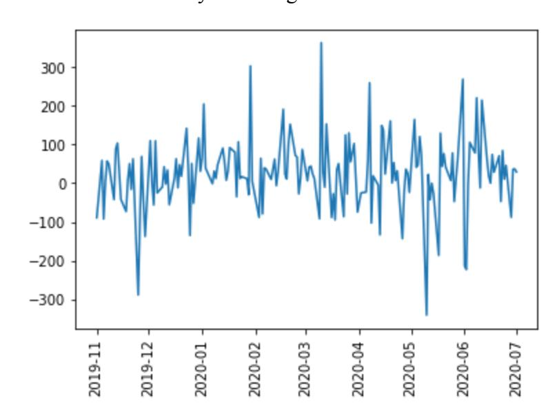

*Figure 1: Bitcoin discount between BTCMarkets and Liquid fiat-to-crypto exchanges from November 1, 2019 to July 1, 2020*

To measure cryptocurrency market factors, the prices of the top 100 cryptocurrencies by market cap as of August 10, 2020 were recorded. A market-cap weighted average of this set of cryptocurrencies was constructed to represent a cryptocurrency market portfolio. Due to our limited access to historical market cap data for each cryptocurrency over the period of interest, the market-cap weighted contributions for each currency were held constant throughout the period. The contributions of each cryptocurrency to the crypto market portfolio is shown in Figure 2.

5

[https://www.investopedia.com/articles/active-trading/051415/rewards-trading-stocks-low-volume.asp#:~:text=Low%2](https://www.investopedia.com/articles/active-trading/051415/rewards-trading-stocks-low-volume.asp#:~:text=Low%2Dvolume%20stocks%20typically%20have,traded%20on%20major%20stock%20exchanges.) [Dvolume%20stocks%20typically%20have,traded%20on%20major%20stock%20exchanges.](https://www.investopedia.com/articles/active-trading/051415/rewards-trading-stocks-low-volume.asp#:~:text=Low%2Dvolume%20stocks%20typically%20have,traded%20on%20major%20stock%20exchanges.)

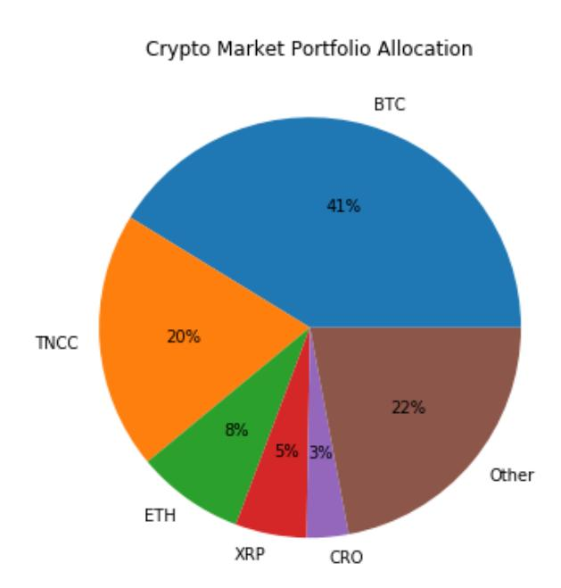

*Figure 2: A depiction of the cryptocurrency weighting of the constructed cryptocurrency market portfolio. The top 5 cryptocurrencies ranked by market capitalization comprise over 75% of the constructed cryptocurrency market portfolio.*

The effects of limiting the market cap portfolio to this subset of cryptocurrencies is shown in Figure 3. The null space of the price data for each cryptocurrency shows that only 6 out of 100 of the cryptocurrency tickers had price data as of the earliest date July 26, 2016. It can also be observed that the largest cryptocurrencies by market cap are not a predictor of the availability of age or price history for the cryptocurrencies.

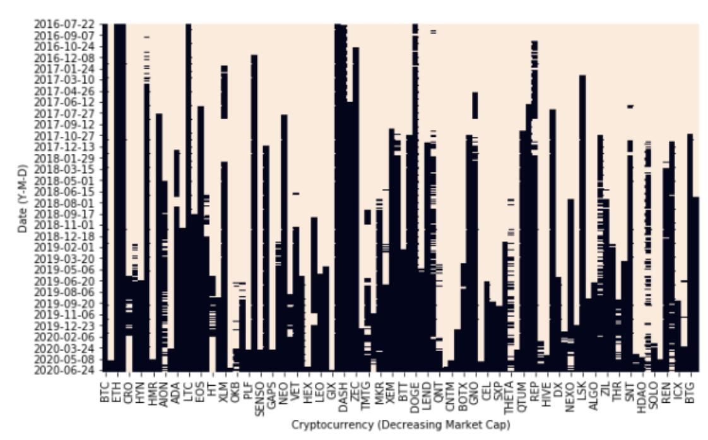

*Figure 3: The null space matrix of available cryptocurrency prices is shown for the 100 tickers used in constructing the cryptocurrency market portfolio. Beige cells indicate no data is available for the cryptocurrency and date pair, while blue cells indicate data is available.*

# **3 Methodology**

#### **3.1 Risk Factors of Cryptocurrency**

We build upon previous efforts to construct a set of stylized factors as benchmarks for characterizing the factors influencing cryptocurrency price movements, introducing the price information gathered during the COVID period to determine if the same factors can be used to characterize cryptocurrency markets during periods of market stress. The cross-section of log cryptocurrency returns are studied from 22/07/16 to 01/07/20, focusing on four broad categories of size, volume, momentum, and volatility indicators.

#### **3.1.1 Factors Descriptions**

In total, 22 factors were constructed under four broad categories: size, momentum, volume, and volatility. Table 1 presents the full list of factors constructed and their description. Due to limited market capitalization data, a few suggested benchmark factors were not able to be constructed, and omitted from the analysis.

#### *Table 1: List of cryptocurrency factor candidates*

| Category   | Factor       | Definition |                                                                       |
|------------|--------------|------------|-----------------------------------------------------------------------|
| Size       | prc          | Log        | last day price in the portfolio formation week                        |
| Size       | maxdprc      | The        | maximum price of the portfolio formation week                         |
| Momentum   | r1           | One-week   | momentum                                                              |
| Momentum   | r2           | Two-week   | momentum                                                              |
| Momentum   | r3           |            | Three-week momentum                                                   |
| Momentum   | r4           | Four-week  | momentum                                                              |
| Momentum   | r8           | Eight-week | momentum                                                              |
| Momentum   | r16          |            | Sixteen-week momentum                                                 |
| Momentum   | r50          | Fifty-week | momentum                                                              |
| Momentum   | r100         |            | Hundred-week momentum                                                 |
| Volume     | vol          | Log        | average daily volume in the portfolio formation week                  |
| Volume     | prc_vol      | Log        | average daily volume times price in the portfolio formation week      |
| Volatility | beta         | The        | regression coefficient. The model is estimated using daily returns of |
|            |              | the        | previous 365 days before the formation week.                          |
| Volatility | beta_squared | Beta       | squared                                                               |
| Volatility | idiovol      | The        | idiosyncratic volatility is measured as the standard deviation of the |
|            |              | residual   | after estimating the model that is estimated using daily returns      |
|            |              | of the     | previous 365 days before the formation week.                          |
| Volatility | ret_vol      | The        | standard deviation of daily returns in the portfolio formation week   |
| Volatility | ret_skew     | The        | skewness of daily returns in the portfolio formation week             |
| Volatility | ret_kurt     | The        | kurtosis of daily returns in the portfolio formation week             |
| Volatility | max_ret      | Maximum    | daily return of the portfolio formation week                          |
| Volatility | delay        | The        | improvement The model is estimated using daily returns of the         |
|            |              | previous   | 365 days before the formation week.                                   |
| Volatility | std_prc_vol  | Log        | standard deviation of dollar volume in the portfolio formation week   |
|            |              | calculated | as Log average daily volume multiplied by price                       |
| Volatility | damihud      | The        | average absolute daily return divided by dollar volume in the         |
|            |              | portfolio  | formation week                                                        |

#### **3.1.2 The Zero-Investment Long-Short Strategy / Quintile Separation.**

To assess whether these factors are significant in predicting cryptocurrency returns, quintile portfolios based on each factor are constructed weekly from the previous list of 100 cryptocurrencies. The mean excess return over the risk-free rate for each portfolio is also determined weekly. The significance of the returns from a long-short portfolio, constructed by taking a long position in the highest quintile portfolio and taking a short position in the lowest quintile portfolio, are analyzed. We compare three time periods to assess the impact of COVID-19 on the significance of the predictability of returns: a COVID-19 period ranging from 2019-11-01 to 2020-08-06, a pre-COVID period ranging from 2016-07-26 to 2019-11-01, and a full period from 2016-07-26 to 2020-08-06. The COVID-19 period range was chosen to include the first known cases of COVID-19 infection to the most recent date to capture persistent economic effects present as financial markets processed and reacted to the widespread changes in company operations and in people's daily behavior.

#### **3.1.2.1 Size Factors**

The tables below report the mean quintile portfolio returns based on last day price, and maximum day price factors. The average mean excess returns is not monotonic for size-related factors. All of the related differences are insignificant.

*Table 2.1: Significance of size factor quintile portfolios during COVID period..*

| Quintiles    |         |         |         |         |         |         |         |
|--------------|---------|---------|---------|---------|---------|---------|---------|
|              |         | 1       | 2       | 3       | 4       | 5       | 5-1     |
| COVID period | PRC     |         |         |         |         |         |         |
|              | Mean    | -0.017  | -0.026  | -0.017  | -0.000  | -0.014  | 0.003   |
|              | t(Mean) | (0.026) | (0.038) | (0.020) | (0.019) | (0.020) | (0.013) |
|              | MAXDPRC |         |         |         |         |         |         |
|              | Mean    | -0.002  | -0.041  | 0.004   | -0.008  | -0.014  | -0.012  |
|              | t(Mean) | (0.021) | (0.036) | (0.017) | (0.020) | (0.020) | (0.009) |

*The mean returns are the time-series averages of weekly value-weighted portfolio excess returns. \*, \*\*, \*\*\* denote significance levels at the 10%, 5%, and 1%.*

*Table 2.2: Significance of size factor quintile portfolios during the whole period of interest.*

|          |                                    |                         | <b>Quintiles</b>        |                       |                       |                       |
|----------|------------------------------------|-------------------------|-------------------------|-----------------------|-----------------------|-----------------------|
|          |                                    | 1                       | 2                       | 3                     | 4                     |                       |
|          |                                    |                         |                         |                       | 5                     |                       |
| All Data | PRC 
Mean
 
t(Mean)
     | -0.013 
(0.012)
   | -0.025** 
(0.011)
 | -0.008 
(0.010)
 | -0.009 
(0.011)
 | -0.012 
(0.008)
 |
|          | MAXDPRC 
Mean
 
t(Mean)
 | -0.023** 
(0.010)
 | -0.013 
(0.013)
   | -0.009 
(0.009)
 | -0.007 
(0.010)
 | 0.011 
(0.008)
  |

*The mean returns are the time-series averages of weekly value-weighted portfolio excess returns. \*, \*\*, \*\*\* denote significance levels at the 10%, 5%, and 1%.*

*Table 2.3: Significance of size factor quintile portfolios pre-COVID.*

| Quintiles |         |          |          |         |         |         |         |
|-----------|---------|----------|----------|---------|---------|---------|---------|
|           |         | 1        | 2        | 3       | 4       | 5       | 5-1     |
| Non COVID | PRC     |          |          |         |         |         |         |
|           | Mean    | -0.012   | -0.024** | -0.007  | -0.012  | -0.011  | 0.001   |
|           | t(Mean) | (0.014)  | (0.011)  | (0.011) | (0.012) | (0.008) | (0.012) |
| MAXDPRC   | Mean    | -0.027** | -0.006   | -0.011  | -0.007  | -0.011  | 0.016   |
|           | t(Mean) | (0.011)  | (0.014)  | (0.010) | (0.011) | (0.008) | (0.010) |

*The mean returns are the time-series averages of weekly value-weighted portfolio excess returns. \*, \*\*, \*\*\* denote significance levels at the 10%, 5%, and 1%.*

#### **3.1.2.2 Momentum Factors**

We also investigate the zero-investment long-short strategies based on the one-, two-, three-, four-, eight-, sixteen-, fifty-, and one hundred-week momentum factors. We find that only hundred-week momentum factors generate statistically insignificant long-short strategy returns for COVID period. However, for the other two subsets, all factors produce 1% statistically significant results. The results for the momentum-related factors are summarized in the table below.

*Table 3: Significance of momentum factor quintile portfolios during each period of interest.*

| Quintiles             |                         |                       |                      |                      |                      |                     |                     |
|-----------------------|-------------------------|-----------------------|----------------------|----------------------|----------------------|---------------------|---------------------|
|                       |                         | 1                     | 2                    | 3                    | 4                    | 5                   | 5-1                 |
| COVID period          | R1 Mean t(Mean)   | -0.174*** (0.039)  | -0.058*** (0.021) | -0.021 (0.020)    | 0.012 (0.019)     | 0.178*** (0.037) | 0.352*** (0.043) |
|                       | r2 Mean t(Mean)   | -0.132*** (0.049)  | -0.050** (0.021)  | -0.021 (0.020)    | 0.010 (0.016)     | 0.107*** (0.024) | 0.239*** (0.047) |
|                       | r3 Mean t(Mean)   | -0.126*** (0.048)  | -0.034* (0.021)   | -0.021 (0.020)    | 0.006 (0.015)     | 0.085*** (0.023) | 0.210*** (0.048) |
|                       | r4 Mean t(Mean)   | -0.083 (0.051)     | -0.049** (0.023)  | -0.017 (0.019)    | 0.002 (0.018)     | 0.066*** (0.019) | 0.148*** (0.049) |
|                       | r8 Mean t(Mean)   | -0.062 (0.047)     | -0.030 (0.022)    | -0.015 (0.019)    | -0.007 (0.019)    | 0.039 (0.042)    | 0.101* (0.061)   |
|                       | r16 Mean t(Mean)  | -0.089* (0.049)    | -0.025 (0.021)    | -0.010 (0.021)    | -0.002 (0.021)    | 0.040** (0.020)  | 0.129*** (0.050) |
|                       | r50 Mean t(Mean)  | -0.060 (0.041)     | -0.025 (0.032)    | -0.015 (0.018)    | -0.009 (0.021)    | 0.005 (0.018)    | 0.066* (0.034)   |
|                       | r100 Mean t(Mean) | -0.022 (0.025)     | -0.044 (0.032)    | -0.023 (0.039)    | -0.007 (0.019)    | 0.007 (0.011)    | 0.028 (0.019)    |
|                       | All Data                | r1 Mean t(Mean) | -0.161*** (0.012) | -0.071*** (0.008) | -0.029*** (0.008) | 0.018** (0.009)  | 0.140*** (0.015) |
| r2 Mean t(Mean) |                         | -0.129*** (0.013)  | -0.054*** (0.008) | -0.025*** (0.009) | 0.012 (0.009)     | 0.108*** (0.014) | 0.237*** (0.015) |
| r3 Mean t(Mean) |                         | -0.109*** (0.013)  | -0.056*** (0.008) | -0.018* (0.010)   | 0.005 (0.009)     | 0.079*** (0.014) | 0.189*** (0.014) |
| r4 Mean t(Mean) |                         | -0.094*** (0.013)  | -0.052*** (0.008) | -0.019** (0.010)  | 0.004 (0.010)     | 0.065*** (0.013) | 0.159*** (0.015) |

#### *Table 3 (continued).*

|               | r8 Mean t(Mean)   | -0.082*** (0.013) | -0.041*** (0.008) | -0.014 (0.010)    | -0.006 (0.010)    | 0.045*** (0.014)  | 0.127*** (0.016) |
|---------------|-------------------------|----------------------|----------------------|----------------------|----------------------|----------------------|---------------------|
|               | r16 Mean t(Mean)  | -0.075*** (0.013) | -0.028*** (0.009) | -0.013 (0.010)    | -0.009 (0.011)    | 0.023* (0.012)    | 0.097*** (0.015) |
|               | r50 Mean t(Mean)  | -0.061*** (0.014) | -0.035*** (0.012) | -0.029*** (0.010) | -0.021** (0.010)  | -0.012 (0.011)    | 0.050*** (0.013) |
|               | Mean t(Mean) r100 | -0.058*** (0.014) | -0.055*** (0.015) | -0.041*** (0.014) | -0.036*** (0.010) | -0.024*** (0.008) | 0.034*** (0.010) |
| Pre-COVI D | R1 Mean t(Mean)   | -0.158*** (0.011) | -0.073*** (0.008) | -0.031*** (0.009) | 0.019** (0.010)   | 0.132*** (0.016)  | 0.290*** (0.014) |
|               | r2 Mean t(Mean)   | -0.128*** (0.012) | -0.055*** (0.009) | -0.026*** (0.010) | 0.012 (0.011)     | 0.108*** (0.016)  | 0.235*** (0.016) |
|               | r3 Mean t(Mean)   | -0.106*** (0.011) | -0.059*** (0.008) | -0.018* (0.011)   | 0.004 (0.011)     | 0.078*** (0.016)  | 0.184*** (0.014) |
|               | r4 Mean t(Mean)   | -0.096*** (0.012) | -0.053*** (0.009) | -0.020* (0.011)   | 0.005 (0.011)     | 0.064*** (0.016)  | 0.161*** (0.015) |
|               | r8 Mean t(Mean)   | -0.086*** (0.012) | -0.043*** (0.009) | -0.013 (0.012)    | -0.006 (0.012)    | 0.046*** (0.015)  | 0.132*** (0.015) |
|               | r16 Mean t(Mean)  | -0.071*** (0.012) | -0.028*** (0.011) | -0.013 (0.011)    | -0.011 (0.012)    | 0.018 (0.013)     | 0.090*** (0.014) |
|               | r50 Mean t(Mean)  | -0.061*** (0.014) | -0.038*** (0.012) | -0.033*** (0.011) | -0.025** (0.011)  | -0.016 (0.013)    | 0.045*** (0.013) |
|               | r100 Mean t(Mean) | -0.075*** (0.016) | -0.059*** (0.016) | -0.049*** (0.009) | -0.050*** (0.011) | -0.038*** (0.010) | 0.037*** (0.012) |

*The mean returns are the time-series averages of weekly value-weighted portfolio excess returns. \*, \*\*, \*\*\* denote significance levels at the 10%, 5%, and 1%.*

#### **3.1.2.3 Volume Factor**

We now analyze the results of the volume-related factor. The result indicates that our strategy that longs the highest dollar volume coins and shorts the lowest dollar volume coins generates about 2.2% excess weekly returns. Regarding the volume factor, the return varies between 3% and 4% for the whole data set, as well as for the period without pandemic horizon. The outcome was significant at the 10% level, though both volume and dollar volume factors are insignificant for the COVID period.

*Table 4: Significance of volume factor quintile portfolios during each period of interest*

| Quintiles    |              |                   |                   |                   |                 |                |                 |
|--------------|--------------|-------------------|-------------------|-------------------|-----------------|----------------|-----------------|
|              |              | 1                 | 2                 | 3                 | 4               | 5              | 5-1             |
| COVID period | VOL          |                   |                   |                   |                 |                |                 |
|              | Mean t(Mean) | -0.019 (0.019)    | 0.009 (0.034)     | -0.022 (0.038)    | -0.001 (0.024)  | -0.018 (0.018) | 0.001 (0.012)   |
|              | PRCVOL       |                   |                   |                   |                 |                |                 |
|              | Mean t(Mean) | -0.034 (0.027)    | -0.023 (0.043)    | -0.004 (0.013)    | -0.004 (0.026)  | -0.015 (0.020) | 0.019 (0.024)   |
| All Data     | VOL          |                   |                   |                   |                 |                |                 |
|              | Mean t(Mean) | -0.032*** (0.010) | -0.017* (0.010)   | -0.013 (0.010)    | -0.015 (0.009)  | 0.003 (0.013)  | 0.035** (0.014) |
|              | PRCVOL       |                   |                   |                   |                 |                |                 |
|              | Mean t(Mean) | -0.033*** (0.011) | -0.035*** (0.011) | -0.030*** (0.011) | -0.009 (0.011)  | -0.010 (0.007) | 0.022** (0.010) |
| Non COVID    | VOL          |                   |                   |                   |                 |                |                 |
|              | Mean t(Mean) | -0.034*** (0.012) | -0.022** (0.010)  | -0.010 (0.009)    | -0.017* (0.010) | 0.007 (0.015)  | 0.041** (0.016) |
|              | PRCVOL       |                   |                   |                   |                 |                |                 |
|              | Mean t(Mean) | -0.032** (0.012)  | -0.038*** (0.010) | -0.035*** (0.013) | -0.010 (0.012)  | -0.009 (0.008) | 0.022** (0.011) |

*The mean returns are the time-series averages of weekly value-weighted portfolio excess returns. \*, \*\*, \*\*\* denote significance levels at the 10%, 5%, and 1%.*

#### **3.1.2.4 Volatility Factors**

Finally, we investigate the results of the different volatility-related factors, such as beta, beta squared, idiosyncratic volatility, the standard deviation of returns, the skewness of returns, the kurtosis of returns, maximum day return, delay, the standard deviation of dollar volume, and Amihud's illiquidity measure.

Table 5 below presents a summary for the portfolios sorted in quintiles for the corresponding volatility factors. The skewness of daily returns in the portfolio formation week and maximum daily return – only two factors out of ten produce statistically significant excess returns on the long-short strategies. The difference in the average returns of the highest and lowest quintiles is 12.1 and 14.7 percent respectively during the COVID period. In contrast, most of the factors during the non-covid period result in significant outcomes.

*Table 5: Significance of volatility factor quantile portfolios during each time frame of interest.*

|              |                            |                      | Quintiles          |                   |                   |                    |                    |
|--------------|----------------------------|----------------------|--------------------|-------------------|-------------------|--------------------|--------------------|
|              |                            | 1                    | 2                  | 3                 | 4                 | 5                  | 5-1                |
| COVID period | BETA Mean t(Mean)    | -0.015 (0.020)    | -0.017 (0.022)  | -0.003 (0.021) | -0.007 (0.008) | -0.041 (0.042)  | -0.026 (0.049)  |
|              | BETA2 Mean t(Mean)   | -0.050 (0.047)    | 0.005 (0.010)   | 0.010 (0.024)  | -0.004 (0.024) | -0.005 (0.023)  | 0.044 (0.053)   |
|              | IDIOVOL Mean t(Mean) | -0.016 (0.013)    | -0.028* (0.016) | -0.014 (0.046) | 0.000 (0.030)  | -0.013 (0.023)  | 0.003 (0.014)   |
|              | RETVOL Mean t(Mean)  | -0.025** (0.010)  | -0.017 (0.020)  | -0.016 (0.021) | -0.001 (0.025) | -0.012 (0.060)  | 0.013 (0.058)   |
|              | RETSKEW Mean t(Mean) | -0.076*** (0.028) | -0.001 (0.028)  | -0.011 (0.026) | -0.017 (0.019) | 0.044 (0.031)   | 0.12*** (0.038) |
|              | RETKURT Mean t(Mean) | 0.011 (0.031)     | -.039 (0.024)   | -0.006 (0.024) | -0.015 (0.019) | -0.027 (0.041)  | -0.038 (0.047)  |
|              | MAXRET Mean t(Mean)  | -0.045*** (0.009) | -0.040 (0.026)  | -0.010 (0.020) | -0.017 (0.038) | 0.102** (0.050) | 0.15*** (0.047) |

*Table 5 (continued).*

|          | DELAY Mean t(Mean)     | -0.031* (0.018)   | 0.007 (0.026)     | -0.005 (0.020)    | -0.003 (0.024)    | -0.009 (0.019)    | 0.022 (0.016)    |
|----------|------------------------------|----------------------|----------------------|----------------------|----------------------|----------------------|---------------------|
|          | STDPRCVOL Mean t(Mean) | -0.036 (0.026)    | -0.027 (0.043)    | -0.003 (0.015)    | -0.015 (0.025)    | -0.014 (0.020)    | 0.022 (0.024)    |
|          | DAMIHUD Mean t(Mean)   | -0.015 (0.019)    | 0.002 (0.021)     | -0.056 (0.069)    | 0.006 (0.050)     | -0.030 (0.053)    | -0.015 (0.049)   |
| All Data | BETA Mean t(Mean)      | -0.034** (0.015)  | -0.024 (0.016)    | -0.024 (0.016)    | -0.018*** (0.006) | -0.020 (0.030)    | 0.014 (0.036)    |
|          | BETA2 Mean t(Mean)     | -0.047 (0.035)    | -0.004 (0.008)    | -0.010 (0.020)    | -0.013 (0.019)    | -0.020 (0.019)    | 0.027 (0.040)    |
|          | IDIOVOL Mean t(Mean)   | -0.025*** (0.009) | -0.030*** (0.011) | -0.031 (0.029)    | -0.017 (0.021)    | -0.038** (0.017)  | -0.013 (0.013)   |
|          | RETVOL Mean t(Mean)    | -0.031*** (0.005) | -0.036*** (0.008) | -0.014 (0.010)    | -0.001 (0.012)    | 0.031 (0.022)     | 0.06*** (0.020)  |
|          | RETSKEW Mean t(Mean)   | -0.052*** (0.011) | -0.024** (0.011)  | -0.017* (0.009)   | 0.004 (0.011)     | 0.029*** (0.011)  | 0.08*** (0.013)  |
|          | RETKURT Mean t(Mean)   | -0.013 (0.011)    | -0.019* (0.010)   | -0.009* (0.012)   | -0.021** (0.009)  | -0.020 (0.014)    | -0.007 (0.015)   |
|          | MAXRET Mean t(Mean)    | -0.055*** (0.005) | -0.046*** (0.008) | -0.015* (0.009)   | 0.013 (0.012)     | 0.100*** (0.019)  | 0.16*** (0.018)  |
|          | DELAY Mean t(Mean)     | -0.035** (0.015)  | -0.016 (0.021)    | -0.014 (0.015)    | -0.025 (0.019)    | -0.016 (0.017)    | 0.019 (0.014)    |
|          | STDPRCVOL Mean t(Mean) | -0.036*** (0.011) | -0.041*** (0.012) | -0.032*** (0.011) | -0.008 (0.011)    | -0.010 (0.008)    | 0.026*** (0.010) |
|          | DAMIHUD Mean t(Mean)   | -0.012* (0.007)   | -0.001 (0.014)    | -0.020 (0.017)    | -0.026* (0.014)   | -0.048*** (0.016) | -0.023* (0.014)  |

*Table 5 (continued).*

| Non-CO VID | BETA Mean t(Mean)      | -0.064*** (0.018) | -0.039* (0.021)   | -0.060*** (0.021) | -0.040*** (0.001) | 0.016 (0.035)     | 0.080** (0.040)  |
|------------|------------------------|-------------------|-------------------|-------------------|-------------------|-------------------|------------------|
|            | BETA2 Mean t(Mean)     | -0.041*** (0.001) | -0.031*** (0.007) | -0.057* (0.032)   | -0.037 (0.027)    | -0.053** (0.023)  | -0.012 (0.022)   |
|            | IDIOVOL Mean t(Mean)   | -0.038*** (0.013) | -0.035*** (0.011) | -0.054*** (0.015) | -0.042* (0.023)   | -0.077*** (0.021) | -0.039* (0.022)  |
|            | RETVOL Mean t(Mean)    | -0.032*** (0.006) | -0.040*** (0.009) | -0.014 (0.011)    | -0.001 (0.013)    | 0.040* (0.023)    | 0.072*** (0.021) |
|            | RETSKEW Mean t(Mean)   | -0.047*** (0.013) | -0.028** (0.013)  | -0.018* (0.010)   | 0.008 (0.012)     | 0.025** (0.012)   | 0.072*** (0.013) |
|            | RETKURT Mean t(Mean)   | -0.018 (0.012)    | -0.015 (0.011)    | -0.009 (0.014)    | -0.022** (0.011)  | -0.018 (0.014)    | 0.000 (0.016)    |
|            | MAXRET Mean t(Mean)    | -0.057*** (0.006) | -0.047*** (0.008) | -0.015 (0.010)    | 0.019* (0.012)    | 0.100*** (0.020)  | 0.16*** (0.019)  |
|            | DELAY Mean t(Mean)     | -0.041 (0.027)    | -0.073** (0.030)  | -0.035*** (0.006) | -0.076*** (0.023) | -0.036 (0.036)    | 0.005 (0.030)    |
|            | STDPRCVOL Mean t(Mean) | -0.035*** (0.012) | -0.044*** (0.011) | -0.038*** (0.013) | -0.006 (0.013)    | -0.009 (0.008)    | 0.026** (0.011)  |
|            | DAMIHUD Mean t(Mean)   | -0.011 (0.008)    | -0.002 (0.016)    | -0.010 (0.014)    | -0.033** (0.013)  | -0.054*** (0.015) | -0.03** (0.012)  |

*The mean returns are the time-series averages of weekly value-weighted portfolio excess returns. \*, \*\*, \*\*\* denote significance levels at the 10%, 5%, and 1%.*

#### **3.1.3 Cryptocurrency Factor Models**

After considering the 22 factors, we look to verify if the significant factors of returns can be characterized by a consolidated set of core market factors. We run regression tests on the long-short portfolio against a one-factor CAPM model, and a two factor CAPM + momentum model over the complete data period. Value and size factors were not constructed due to the lack

of standardardized valuation metrics for cryptocurrencies and the restrictions we faced in accessing historical market capitalization data.

#### **3.1.3.1 Cryptocurrency CAPM Model**

Using the aforementioned cryptocurrency market portfolio, a proxy for a market portfolio shows little explainability for excess returns seen in some of the benchmark factors. Results show a negative adjusted r-squared which demonstrates low predictability of CAPM as an explanatory variable. Plotting the fitted mean excess returns against the realized average excess returns also reveals a poor relationship between the market portfolio and predicted excess return.

*Table 6: Regression results for long-short cryptocurrency portfolios regressed on the constructed cryptocurrency market portfolio.*

|            | alpha     | White_se_A | beta_0    | White_se_0 | MSE      | Adj R-squared |           |
|------------|-----------|------------|-----------|------------|----------|---------------|-----------|
|            | r 1,05-1  | 0.349822   | 0.044846  | 0.144169   | 0.172129 | 0.066042      | -0.027027 |
|            | r 2,05-1  | 0.236665   | 0.048645  | 0.139684   | 0.202734 | 0.078262      | -0.027902 |
|            | r 3,05-1  | 0.209741   | 0.049412  | 0.049068   | 0.210582 | 0.081238      | -0.030851 |
|            | r 4,05-1  | 0.145362   | 0.050470  | 0.222246   | 0.271970 | 0.084821      | -0.023463 |
|            | r 8,05-1  | 0.096171   | 0.061868  | 0.380235   | 0.400206 | 0.126964      | -0.016131 |
|            | r 16,05-1 | 0.121441   | 0.049779  | 0.538932   | 0.427361 | 0.082128      | 0.014298  |
|            | r 50,05-1 | 0.061953   | 0.033888  | 0.263249   | 0.167206 | 0.039325      | -0.008040 |
| RETSKEW5-1 | 0.119150  | 0.039454   | 0.125715  | 0.141832   | 0.050906 | -0.027084     |           |
| MAXRET5-1  | 0.152287  | 0.048253   | -0.386445 | 0.188875   | 0.075750 | -0.005353     |           |

$$R_i^i - R_i^f = \alpha_i + \beta_i(R_i^M - R_i^f) + \epsilon_i^j$$

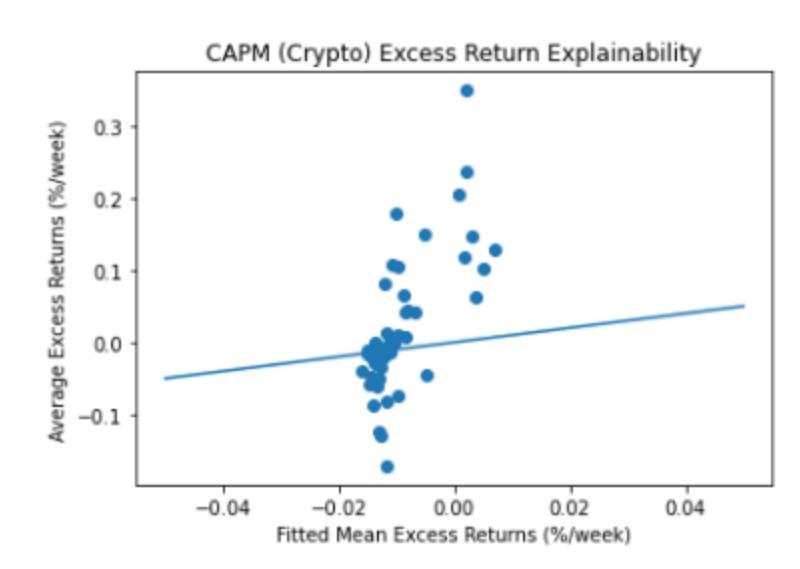

*Figure 4: Plot of predicted vs realized excess returns for each quantile and long-short portfolio of the regressed on one-factor cryptocurrency CAPM regressions.*

#### **3.1.3.2 Two Factor Cryptocurrency CAPM + Momentum Model**

A market momentum portfolio was constructed by taking a long position in the top 30% three week momentum cryptocurrency tickers and a short position in the bottom 30% three week momentum cryptocurrencies. Significant improvement in the r-squared metrics and in the fitted predicted vs. true excess returns show market momentum in the cryptocurrency market is strongly correlated with excess returns. This is not too surprising given the correlation between excess returns and momentum factors discovered in the prior analysis.

*Table 7: Regression results for long-short cryptocurrency portfolios regressed on the constructed cryptocurrency market portfolio and the momentum factor.*

| r 1,05-1   | 0.305121  | 0.080559 | 0.096942  | 0.160785 | 0.304722 |
|------------|-----------|----------|-----------|----------|----------|
| r 2,05-1   | 0.081189  | 0.030486 | -0.024575 | 0.099421 | 0.092638 |
| r 3,05-1   | 0.044584  | 0.015343 | -0.125419 | 0.084353 | 0.049711 |
| r 4,05-1   | -0.020866 | 0.019917 | 0.046628  | 0.145094 | 0.068521 |
| r 8,05-1   | -0.014023 | 0.054533 | 0.263815  | 0.371724 | 0.293319 |
| r 16,05-1  | -0.023468 | 0.027360 | 0.385837  | 0.327620 | 0.087281 |
| r 50,05-1  | -0.004345 | 0.037024 | 0.193206  | 0.454913 | 0.028510 |
| RETSKEW5-1 | 0.003753  | 0.038177 | 0.098883  | 0.140357 | 0.225544 |
| MAXRET5-1  | 0.240224  | 0.048388 | -0.293540 | 0.201739 | 0.056935 |

$$R_i^t - R_f^t = \alpha_i + \beta_M(R_i^M - R_f^M) + \beta_{MOM}(R_i^{MOM} - R_f^{MOM}) + \epsilon_i^t$$

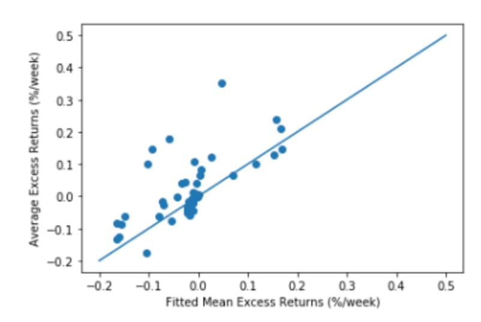

*Figure 5: Plot of predicted vs realized excess returns for each quantile and long-short portfolio of the two-factor cryptocurrency CAPM + momentum regression*

### **3.1.4 Stock Market Factor Models**

To determine whether market drivers are shared between the equity asset class and cryptocurrencies, we perform a similar regression between significant long-short cryptocurrency factor portfolios and U.S. equity factors, namely the Fama-French 3 factor (Size Premium, Value Premium, and Market Portfolio) and 5 factor models (Size Premium, Value Premium, and Market Portfolio, Operation Profitability Premium, Investment Premium). The r-squared values of the long-short portfolios show there is little explainability from the Fama-French 3 factors. This is also seen in the poor relationship between fitted mean excess returns against average realized excess returns.

*Table 8.1: Regression results for long-short cryptocurrency portfolios Fama-French 3 Factor Model.*

|            | alpha    | Whet_se_A | beta_1    | Whet_se_B | beta_1    | Whet_se_B | MSE       | adj R-squared |          |           |
|------------|----------|-----------|-----------|-----------|-----------|-----------|-----------|---------------|----------|-----------|
| r 1,05-1   | 0.35592  | 0.046778  | -0.004128 | 0.007217  | -0.017124 | 0.019932  | 0.004855  | 0.017741      | 0.069537 | -0.081369 |
| r 2,05-1   | 0.268561 | 0.044879  | 0.016004  | 0.008850  | 0.032581  | 0.022644  | 0.028470  | 0.016128      | 0.072442 | 0.048537  |
| r 3,05-1   | 0.243967 | 0.046071  | -0.019953 | 0.008863  | -0.028090 | 0.023708  | 0.031761  | 0.015922      | 0.072644 | 0.078207  |
| r 4,05-1   | 0.179491 | 0.045304  | -0.014880 | 0.009294  | -0.031993 | 0.022468  | 0.029155  | 0.016879      | 0.080011 | 0.034583  |
| r 8,05-1   | 0.122773 | 0.061449  | -0.012001 | 0.009186  | -0.058523 | 0.026105  | 0.022188  | 0.019307      | 0.123918 | 0.008244  |
| r 16,05-1  | 0.155975 | 0.047601  | -0.016372 | 0.009971  | -0.043303 | 0.027324  | 0.026714  | 0.015463      | 0.079009 | 0.051722  |
| r 50,05-1  | 0.054084 | 0.029088  | -0.003749 | 0.006855  | -0.013016 | 0.014965  | -0.008104 | 0.007176      | 0.040032 | -0.026161 |
| RETSKEW5-1 | 0.136018 | 0.084049  | -0.009160 | 0.006171  | -0.018256 | 0.016277  | 0.014631  | 0.017771      | 0.051208 | -0.033189 |
| MAXRET5-1  | 0.101120 | 0.045789  | 0.011046  | 0.008631  | 0.032763  | 0.020195  | -0.040563 | 0.015777      | 0.064807 | -0.139881 |

$$R_i^j - R_j^i = \alpha_i + \beta_{CAPM}(R_i^{CAPM} - R_i^j) + \beta_{SMB}(R_i^{SMB} - R_i^j) + \beta_{HML}(R_i^{HML} - R_i^j) + \epsilon_i^j$$

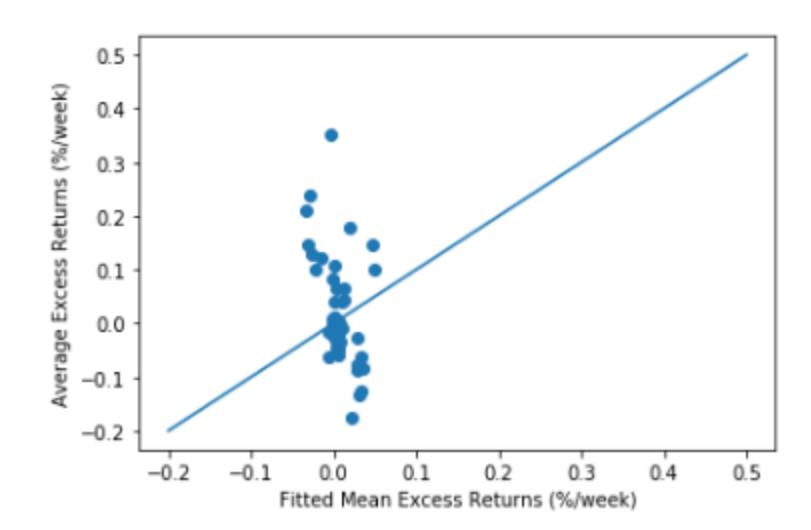

*Figure 6: Plot of predicted vs realized excess returns for each quantile and long-short portfolio of the Fama-French 3 Factor model regression.*

The 5 factor model shows an even worse fit clearly seen in the r-squared values, providing further evidence against explainability of cryptocurrency prices from equity factors.

*Figure 7: Plot of predicted vs realized excess returns for each quantile and long-short portfolio of the Fama-French 5 Factor model regression.*

#### **3.1.5 Commodity Factor Models**

Having demonstrated the lack of exposure to equity factors, we now consider two commodities: gold and platinum. As described in Section 2, we use the daily gold and platinum prices that are available via Quandl. We conduct the same analysis: separate the data by market periods and estimate the factor regression to determine the risk exposures to the commodities chosen.

Given below are the results over the entire data set. Results separated by COVID regimes are given in the appendix.

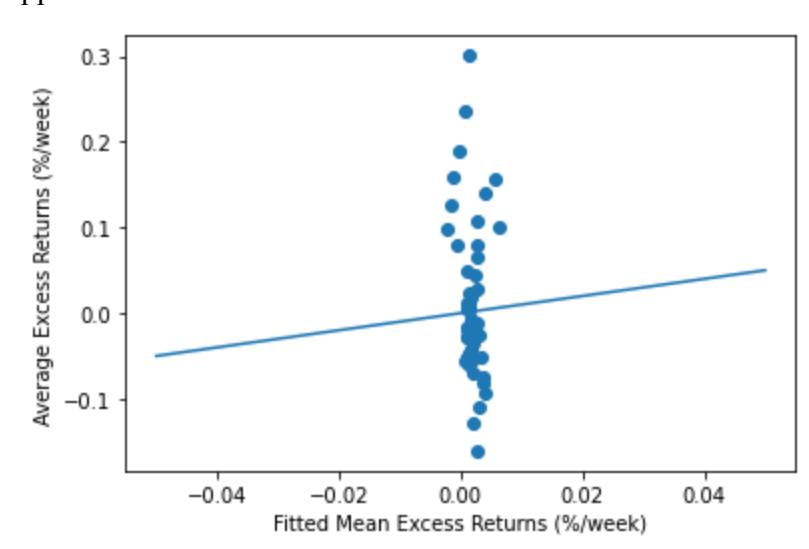

*Figure 8: Plot of predicted vs realized excess returns for each quantile and long-short portfolio of the commodities regression.*

*Table 8.2: Regression results for long-short cryptocurrency portfolios Commodities Regression.*

|            | alpha     | White_se_A | beta_0    | White_se_P | beta_1    | White_se_I | MSE      | Adj R-squared |
|------------|-----------|------------|-----------|------------|-----------|------------|----------|---------------|
|            | r 1,05-1  | 0.299582   | 0.014091  | 0.724163   | 0.410956  | -0.339209  | 0.532811 | 0.040618      |
|            | r 2,05-1  | 0.236081   | 0.015159  | 0.550523   | 0.275281  | 0.207149   | 0.523187 | -0.005006     |
|            | r 3,05-1  | 0.189154   | 0.014410  | -0.229721  | 0.305513  | -0.051117  | 0.525554 | -0.009502     |
|            | r 4,05-1  | 0.160393   | 0.014654  | -0.833222  | 0.407511  | 0.030167   | 0.545637 | -0.005833     |
|            | r 8,05-1  | 0.128446   | 0.015363  | -0.042502  | 0.165375  | -0.113591  | 0.622261 | -0.001552     |
|            | r 16,05-1 | 0.099770   | 0.014704  | -1.263244  | 0.391884  | 0.313209   | 0.502804 | -0.003563     |
|            | r 50,05-1 | 0.048337   | 0.012116  | 0.516429   | 0.113314  | -0.365088  | 0.485571 | -0.008885     |
| RETSKEW5-1 | 0.081305  | 0.011927   | -0.701752 | 0.128299   | -0.476826 | 0.468944   | 0.031516 | 0.012119      |
| MAXRET5-1  | 0.149606  | 0.017882   | 3.217757  | 0.721322   | -0.812523 | 0.629716   | 0.061375 | 0.020197      |

As can be seen, there is no evidence of exposure to gold or platinum, and the results are similar to the explainability of the equity factors. In other words, the cross-section of cryptocurrency returns are not exposed to equity factors nor commodities, suggesting that cryptocurrencies risks are generally crypto-specific.

### **3.2 Cross-Section**

As discussed in Section 3.1, a broad survey of risk factors demonstrated that cryptocurrencies are less exposed to non-crypto factors. This section addresses the cross-section of bitcoin discounts, or price differences of bitcoin across various exchanges and currencies, and evaluates the robustness of Borri and Shakhnov's motivation of the 2-factor model and risk analysis using the COVID market shock.

#### **3.2.1 Preliminary Analysis**

The *bitcoin discounts* are the differences in USD prices for two currency-market crypto pairs. Thus, consider �� , where is the number of markets available for currencies �� = 1,..., �� �� �� �� 6 �� = 1,..., 11. We define the discount for market �� and currency �� as �� , ��,�� = �� ��,�� ÷ �� ������ − 1 where �� is the price for the pair . In our analysis, we denote the Coinbase exchange for ��,�� ��, �� 7 USD as our benchmark numeraire for the USD bitcoin price.

Note that a negative discount indicates that the US investor receives less dollars per bitcoin in the pair ��, �� than in the reference market, ie. USD Coinbase, and conversely, a positive discount indicates that the investor receives more.

We first do a preliminary survey of the discounts with two tests. First, each discount is tested for significance using a 1-sample, Student's -test. Then, each discount is tested for 8 �� stationarity using the standard augmented Dickey-Fuller test . Of the 83 discounts in the sample 9 10

10 Preparation of the discounts as in section 2.2. The full list of discounts is given in the appendix.

9 H0: a unit root is present in the AR process, Ha: there is evidence of stationary

8 Two-sided *t*-test, H0: mean = 0, Ha: mean is significantly nonzero

7 Coinbase, as well as Kraken, is one of the most popular USD-to-crypto exchanges available.

6 As briefly mentioned in Section 2.1, the currency list is AUD, CAD, DKK, EUR, HKD, ILS, JPY, PLN, CHF, GBP, and USD, corresponding to Australia, Canada, Denmark, EU, Hong Kong, Israel, Japan,

Poland, Switzerland, United Kingdom, and U.S.A respectively.

13 (15.66%) were statistically insignificant while 17 (20.48%) were non-stationary11, or contained a unit root, both with 95% confidence.

### 3.2.2 Excess Returns and Two Strategies

Once we compute the discounts, we consider the logarithm of the excess returns, using the 3-month US T-bills as the risk-free rate. Then, as described in Borri and Shakhnov's paper, consider two strategies: *cross* and *within*.

The cross strategy exploits the persistence and significance of the bitcoin discounts. To illustrate the mechanics of the strategy, consider at time  $t$  an investor borrows 1 USD at the risk-free rate. The investor then buys bitcoin in USD at Coinbase (the numeraire) and transfers the bitcoin to another pair with some market  $m$  for some currency  $j$ . At time  $t + 1$ , the investor trades the bitcoin for currency  $j$  and exchanges it back to USD with the daily spot and repays any interest on the loan. Note that every exchange in this strategy occurs *against* the benchmark Coinbase for USD. The cross returns can be expressed as:

$$r_{m,j,t+1}^{cross} = \log(P_{m,j,t+1}) - \log(P_{USD,t}) - r_t^f$$

Alternatively, the within strategy exploits the mean-reversion of the bitcoin discounts. Suppose at time  $t$  an investor borrows some amount in USD to buy bitcoin for some market  $m$  and currency  $j$ , with  $j \neq 11$ , ie. in some currency other than USD. At time  $t + 1$ , the investor exchanges their bitcoin for currency  $j$  and converts the amount back to USD with the daily spot rate and closes the loan. Unlike the cross strategy, all exchanges occur in a single pair, for some market  $m$  and some currency  $j$ . The within returns can be expressed as:

$$r_{m,j,t+1}^{within} = \log(P_{m,j,t+1}) - \log(P_{m,j,t}) - r_t^f$$

---

11 The full list of insignificant and non-stationary discounts is given in the appendix.

#### **3.2.3 Cross and Within Portfolio**

Suppose that an investor observes the cross section of discounts �� on some day *t*. ��,��,�� Then, consider two sets of seven portfolios for the cross and within strategy. For each set of seven, the portfolios are constructed using the lowest mean discounts, for portfolio 1, and the high mean discounts, for portfolio 7. Within the set of 83 discounts, the maximum mean discount is 0.3512 while the minimum mean is -0.2688%. We then assign 11 discounts per portfolio, ranked by their mean . The mean and standard deviation of the equally weighted portfolios of 12 bitcoin discounts are summarized below in Table 9.

*Table 9: Mean and Standard Deviation of Discounts for each Portfolio*

| Portfolio | 1       | 2      | 3      | 4      | 5      | 6      | 7      |
|-----------|---------|--------|--------|--------|--------|--------|--------|
| Mean      | -0.1385 | 0.0005 | 0.0015 | 0.0029 | 0.0062 | 0.0230 | 0.0600 |
| Std       | 0.3398  | 0.0122 | 0.0067 | 0.0130 | 0.0140 | 0.0665 | 0.2445 |

Once the pairs are assigned to a portfolio, we compute the cross and within returns for each discount and equally weight them. Discarding any dates with missing information, we estimate the daily mean, standard deviation, standard error, and the Sharpe ratio of the portfolios. We also consider the long-short portfolio, which longs the seventh portfolio and shorts the first for the cross portfolios, and shorts the seventh and longs the first for the within portfolios. Given below are the unconditional statistics for the cross portfolios and the within portfolios using the same assignment of bitcoin discount pairs.

12 The pairs assigned to each portfolio and their corresponding mean returns can be found in the appendix.

*Table 10: Daily Mean, Standard Deviation, Standard Error, and Sharpe Ratio for Cross and Within Portfolios*

| Cross  | 1       | 2      | 3      | 4      | 5      | 6      | 7      | LS     |
|--------|---------|--------|--------|--------|--------|--------|--------|--------|
| Mean   | -0.0106 | 0.0016 | 0.0025 | 0.0040 | 0.0065 | 0.0212 | 0.0515 | 0.0622 |
| Std    | 0.0544  | 0.0575 | 0.0596 | 0.0575 | 0.0572 | 0.0653 | 0.0624 | 0.0386 |
| SE     | 0.0048  | 0.0051 | 0.0053 | 0.0051 | 0.0051 | 0.0058 | 0.0056 | 0.0034 |
| Sharpe | -0.1955 | 0.0287 | 0.0412 | 0.0695 | 0.1134 | 0.3253 | 0.8266 | 1.609  |
| Within | 1       | 2      | 3      | 4      | 5      | 6      | 7      | LS     |
| Mean   | 0.0046  | 0.0013 | 0.0013 | 0.0013 | 0.0013 | 0.0016 | 0.0012 | 0.0034 |
| Std    | 0.0681  | 0.0563 | 0.0594 | 0.0558 | 0.0564 | 0.0736 | 0.0642 | 0.0635 |
| SE     | 0.0061  | 0.0050 | 0.0053 | 0.0050 | 0.0050 | 0.0066 | 0.0057 | 0.0057 |
| Sharpe | 0.0682  | 0.0234 | 0.0223 | 0.0231 | 0.0238 | 0.0218 | 0.0187 | 0.0542 |

Table 10 shows the mean return of the cross portfolios are strictly increasing, while the standard deviation remains relatively consistent across the portfolios. Therefore, the Sharpe ratios are also increasing. Note also that the long-short cross portfolio generates significant returns, with a Sharpe ratio of 1.609. While these portfolios are not necessarily practical , it is 13 interesting to note that this strategy can achieve Sharpe ratios greater than 1. Furthermore, the standard errors imply that these portfolios are significantly different from 0, with the exception of the middle portfolios which are to be expected by construction.

13 The strategies may have some practical issues. For example, some exchanges, including Kraken, require an existing balance within the account for the trades to occur. Furthermore, the transfer of bitcoin may take anywhere up to 24 hours. The long-short cross portfolio also assumes that we are able to short bitcoin on the exchange, which is not supported across all platforms, albeit is becoming increasingly available.

Opposite to the cross results, the within portfolios mean returns are decreasing, with a relatively consistent standard deviation. This naturally results in a decreasing Sharpe ratio. Similar to the cross counterpart, the long-short within the portfolio boasts a comparatively higher Sharpe ratio. Again, this strategy is not practical, albeit the risk-adjusted returns of this portfolio is not quite as enticing as the long-short cross portfolio.

To further analyze the results of the portfolios, consider only the cross strategy, as the returns are more significant. Plotted below are the time series of cross-sectional discounts for portfolio 1 and portfolio 7, along with the cross-sectional average.

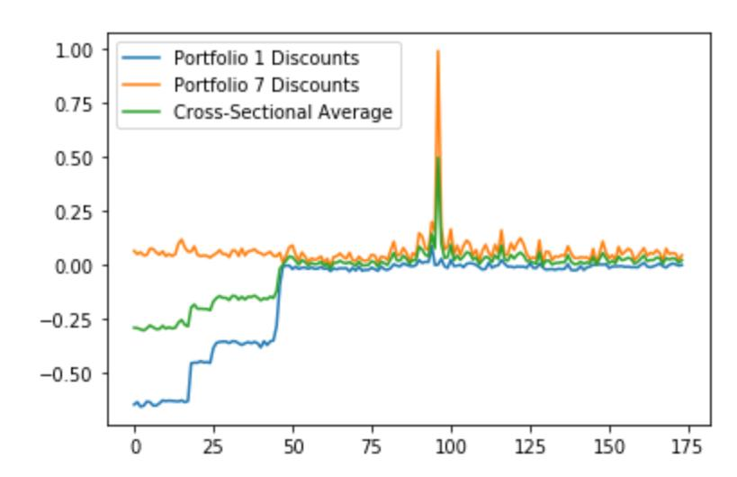

*Figure 9: Portfolio 1, Portfolio 7, and Overall Cross-Sectional (Equally Weighted) Bitcoin Discounts*

We can clearly see that portfolio 7 has much less downside risk compared to portfolio 1 and the cross-section. The peak at approximately 90 is due to the COVID-shock in March. The discounts grew very large, which was exploited by portfolio 7 and the long-short strategy. This also shows evidence that the bitcoin discounts are correlated with bitcoin prices, and, as can be expected, are significantly influenced by market shocks, and thus market stress.

To demonstrate the correlation between portfolio and bitcoin returns, we now plot the returns for portfolios 1 and 7 alongside the bitcoin returns . Note that the market shock appears 14

14 As mentioned in previous sections, the benchmark Bitcoin price is given as the Coinbase USD open price. The bitcoin returns plotted in Figure 5 are therefore the returns corresponding to the Coinbase USD open price.

at around 45, as we drop any dates with invalid data. Nevertheless, it is clear that bitcoin returns are highly correlated with the constructed portfolios, which were built on the bitcoin discounts. Notably, portfolio 7 boasts a high 20% return during the COVID-shock.

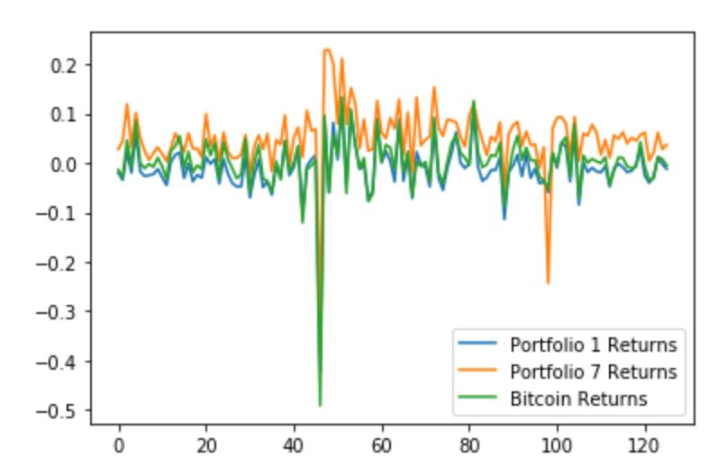

*Figure 10: Portfolio 1, Portfolio 7, and Bitcoin Returns*

Lastly, the returns of the long-short cross portfolio are plotted to demonstrate the significantly nonzero returns of the strategy.

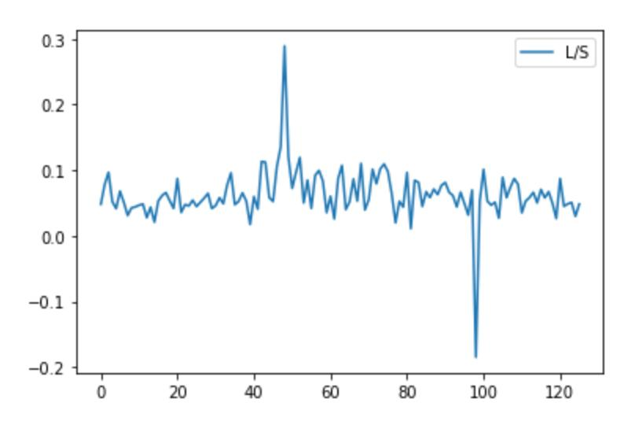

*Figure 11: Long-Short Cross Portfolio Returns*

#### **3.2.4 2-Factor Model**

Motivated by the results of the cross and within portfolios, we demonstrate the applicability of the 2-factor model to the cross-section of portfolio returns via PCA.

The first *level* factor is the bitcoin returns, ie. the returns of the Coinbase USD prices. The second *slope* factor is the long-short cross returns. As discussed by Borri and Shakhnov, this factor is related to crypto liquidity, momentum, and counterparty risks.

To demonstrate the strength of the risk factors, we employ PCA . Summarized below are 15 the fitted component values, with dimensionality reduction. The bottom row denotes the explained variance by component. As can be seen, 99% of the variance can be explained by the 16 first two components, which naturally motivates a two-factor model.

*Table 11: Principal Components of the Cross Portfolio Returns and Variance Explained*

| Portfolio | 1       | 2       | 3       | 4       | 5       |
|-----------|---------|---------|---------|---------|---------|
| 1         | 3.0719  | 0.1274  | 0.0033  | 0.0005  | 0.0000  |
| 2         | -0.3874 | -0.2573 | -0.0699 | -0.0325 | -0.0083 |
| 3         | -0.3973 | -0.2632 | -0.0792 | -0.0011 | -0.0331 |
| 4         | -0.4066 | -0.2363 | -0.0518 | -0.0016 | -0.0211 |
| 5         | -0.4461 | -0.2371 | -0.0335 | 0.0389  | -0.0066 |
| 6         | -0.5335 | -0.0457 | 0.2820  | -0.0041 | 0.0026  |
| 7         | -0.9010 | 0.9122  | -0.0510 | -0.0001 | 0.0002  |
| Variance  | 0.9032  | 0.0885  | 0.0078  | 0.0002  | 0.0001  |

16 The paper by Borri and Shakhnov shows that the first 2 components explain 94% of the variance. This implies that the risk factors are even stronger during the COVID-period.

15 PCA is implemented using the *sklearn* on Python.

The 2-factor model is constructed using the benchmark bitcoin returns and the long-short cross returns. The table below presents the descriptive statistics of the factors. 17

*Table 12: Statistics of the Factors and Average Cross Portfolio Returns*

|             | Mean   | Std    | Skew    | Kurt    | VaR     |
|-------------|--------|--------|---------|---------|---------|
| Bitcoin Ret | 0.0013 | 0.0604 | -4.0746 | 32.7371 | -0.1683 |
| LS Ret      | 0.0622 | 0.0386 | -0.2983 | 19.9638 | -0.0463 |

# **4 Results & Analyses**

We report the factors that form successful long-short strategies for the entire data set. The results of section 3.1.2 reveal that the cross-section of cryptocurrencies can be examined using standard asset pricing tools. We find that 15 momentum, volume, and volatility related factors are key in capturing the cross-section of cryptocurrency returns.

*Table 13: The zero-investment long-short strategy*

|     |        |    | The Zero-Investment Long-Short Strategy |     |      |
|-----|--------|----|-----------------------------------------|-----|------|
| r1  | r2     | r3 | r4 r8 r16                               | r50 | r100 |
| Vol | prcvol |    |                                         |     |      |

17 Figure 8 presents the first four *daily* moments, mean, standard deviation, skewness, and kurtosis, as well as the 1% VaR assuming normality.

| Volatility | retskew |         |           |         |  |
|------------|---------|---------|-----------|---------|--|
| Factor     | retvol  | maxret  | stdprevol | damihud |  |
|            |         |         |           |         |  |
| Mean       |         |         |           |         |  |
| (Mean)     | 0.06*** | 0.08*** | 0.16***   | 0.02*** |  |
|            | (0.020) | (0.013) | (0.018)   | (0.014) |  |
|            |         |         |           |         |  |
|            |         |         |           |         |  |

In the pre-covid time period, the additional volume factor beta and *idiovol* long-short portfolios generated significant returns. Additionally, the significance level of the *stdprcvol* portfolio was smaller and the *damihud* portfolio was greater. In contrast, the post-COVID period had less significance in the 8- and 50-week momentum long-short portfolio, and the 100-week weekly momentum portfolio was not significant. Additionally, none of the volume factors were significant, and only *retskew* and *maxret* factors were significant. The complete set of factors and significance levels are shown in the appendix. The change in the number of significant factors during each period suggests a different market environment between these periods.

We further established weak explainability of the significant long-short portfolio returns using equity market five-factor Fama French factors for all three examined time periods. The results for the complete date range are shown in Figure 12, with the two other periods yielding similar results shown in the appendix.

*Table 14: Mean-Squared Error and Adjusted R-Squared for the 4-Factor Fama French Model for the Entire Period*

|  | MSE     | Adj R-squared |        |
|--|---------|---------------|--------|
|  | r 1,0   | 0.035         | 0.002  |
|  | r 2,0   | 0.042         | -0.016 |
|  | r 3,0   | 0.034         | 0.004  |
|  | r 4,0   | 0.036         | 0.019  |
|  | r 8,0   | 0.036         | -0.006 |
|  | r 16,0  | 0.030         | 0.006  |
|  | r 50,0  | 0.020         | 0.036  |
|  | RETSKEW | 0.029         | -0.026 |
|  | MAXRET  | 0.059         | 0.024  |

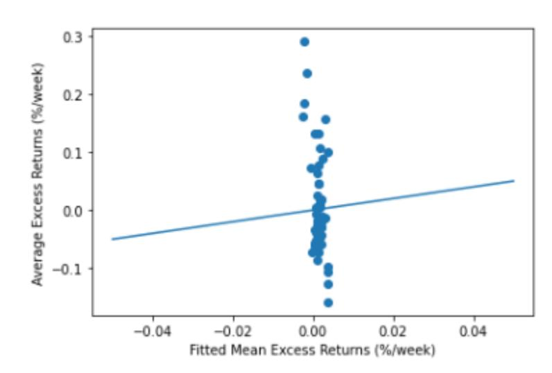

*Figure 12: Plot of the 5-Factor Fama French Model for the Entire Period*

Long-short cryptocurrency portfolios have low r-squared against the Fama-French 5 factors for the equity markets over the complete date range. Plotting predicted vs realized excess returns for each quintile portfolio for each significant factor visually verifies the low predictive power from stock market factors. Separation into COVID and pre-COVID periods yields similar results.

To verify whether the portfolio return predictability is self-contained within cryptocurrency market factors, we constructed CAPM and momentum factors, and regressed the long-short portfolio returns against these factors. We find stronger r-squared, primarily driven by the momentum beta factor. The results are shown below in Table 15.

*Table 15: Estimates of the 2-Factor, CAPM and Momentum, Model with Mean-Squared Error and Adjusted R-Squared*

|         | Alpha  | White SE Alpha | Beta CAPM | White SE CAPM | Beta MOM | White SE MOM | MSE   | Adjusted R* |
|---------|--------|----------------|-----------|---------------|----------|--------------|-------|-------------|
| r 1,0   | 0.305  | 0.081          | 0.097     | 0.161         | 0.307    | 0.405        | 0.063 | 0.025       |
| r 2,0   | 0.081  | 0.030          | -0.025    | 0.099         | 1.067    | 0.092        | 0.014 | 0.812       |
| r 3,0   | 0.045  | 0.015          | -0.125    | 0.084         | 1.133    | 0.050        | 0.009 | 0.887       |
| r 4,0   | -0.021 | 0.020          | 0.047     | 0.152         | 1.141    | 0.069        | 0.012 | 0.860       |
| r 8,0   | -0.014 | 0.055          | 0.264     | 0.318         | 0.756    | 0.293        | 0.098 | 0.218       |
| r 16,0  | -0.023 | 0.027          | 0.386     | 0.328         | 0.994    | 0.087        | 0.027 | 0.675       |
| r 50,0  | -0.004 | 0.037          | 0.193     | 0.142         | 0.455    | 0.297        | 0.029 | 0.269       |
| RETSKEW | 0.094  | 0.038          | 0.099     | 0.140         | 0.174    | 0.226        | 0.051 | -0.024      |
| MAXRET  | 0.240  | 0.048          | -0.294    | 0.202         | -0.603   | 0.284        | 0.057 | 0.244       |

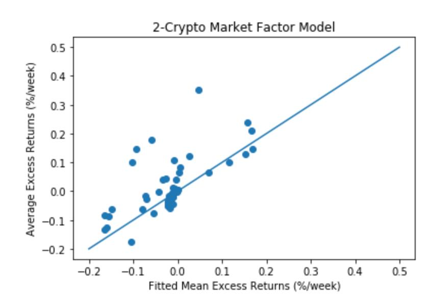

*Figure 13: Plot of the 2-Factor, CAPM and Momentum Model*

The long-short cryptocurrency portfolios using a two-factor cryptocurrency CAPM and momentum model show significant alpha and momentum beta across most portfolios. High adjusted r-squared values are seen for two, three, and four week momentum portfolios, while *retskew* and one week momentum portfolios show no significant explainability with these factors. Plotting the predicted vs. realized excess returns for each portfolio quantile for each of the significant factors visually verifies the predictive power of the two factors.

Motivated by this broad survey of risk factors and predictive power of the resulting two factors, combined with the motivation of the two-factor model for the cross-section of returns in section 3.2.4, we now construct and estimate the 2-factor model, with bitcoin returns (level factor) and the LS portfolio returns (slope factor). Recall that the cross-section of the cross portfolio returns are constructed using bitcoin discounts across different crypto-exchange pairs as described in section 3.2.3. Given in the table below are the adjusted r-squared values as well as the OLS estimates of each factor.

*Table 16: OLS Estimates of the Two-Factor Models on Cross Portfolio Returns*

| Portfolio | $R_{adj}^2$ | Constant                   | Bitcoin Ret               | LS Ret                  |
|-----------|-------------|----------------------------|---------------------------|-------------------------|
| 1         | 0.946       | -0.0142*** (0.002)      | 0.8797*** (0.019)      | 0.0386 (0.030)       |
| 2         | 0.991       | -0.0015 (0.001)         | 0.9505*** (0.008)      | 0.0307** (0.013)     |
| 3         | 0.996       | 0.0003 (0.001)          | 0.9856*** (0.006)      | 0.0141 (0.009)       |
| 4         | 0.989       | 0.0007 (0.001)          | 0.9505*** (0.009)      | 0.0338** (0.014)     |
| 5         | 0.988       | 0.0037*** (0.001)       | 0.9444*** (0.009)      | 0.0262* (0.015)      |
| 6         | 0.543       | 0.0134* (0.008)         | 0.8103*** (0.066)      | 0.1096 (0.103)       |
| 7         | 0.959       | -0.0142*** (0.002)      | 0.8797*** (0.019)      | 1.0386*** (0.030)    |
| LS        | 1.000       | 6.245e-17*** (1.26e-17) | 8.465e-16*** (1.1e-16) | 1.0000*** (1.72e-16) |

The results agree with Table 11 in section 3.2.4: the first component, bitcoin returns, are highly significant for every portfolio and the second component, LS returns, are significant on the 10% level for portfolio 5, 5% level for portfolios 2 and 4, and 1% level for portfolios 7 and LS. Notably, the LS portfolio serves as a sanity check, as the slope factor is the dependent variable. Recalling that the first principal component captured 90% of the variation while the second captured 9%, the level factor highly significantly captures the majority of the variation in portfolio returns while the slope factor captures the majority of the remaining variation.

As established by Borri and Shakhnov, the slope factor has a significant positive correlation to bitcoin aggregate liquidity risk, momentum, and counterparty risks. In other words, these strategies illuminate bitcoin's exposure to aggregate crypto risk factors. Thus, there is statistically significant evidence suggesting that the cryptocurrencies' risks are generally self-contained.

# **5 Conclusion and Future Directions**

Whether or not cryptocurrencies should exist within their own asset class has been debated since its inception. To tangentially address this, we first broadly survey potential risk factors, including macro and microeconomic factors and crypto-specific factors, and demonstrate that cryptocurrencies' risk exposures are predominantly self-contained. That is, there is no particularly compelling evidence that the crypto space is exposed to the same risks associated with the other asset classes. Building on existing literature, we leverage the recent post-COVID market data and determine if the change in market structure had an observable impact on the crypto risk exposures. Our cross-sectional analysis of the cryptocurrency returns and bitcoin discounts and risk survey consolidate the Fama-French factors, resulting in a much better fit than with standard equity market factors. The first two principal components of the cross-section of the cross and within portfolios constructed on the bitcoin discounts further solidifies the robustness, by independently motivating the two-factor model. Comparing our results across different market regimes, we find strong evidence of the independence of the risk structure of cryptocurrency.

However, there are some issues with the cross-sectional analysis for the cryptocurrency market that were not accounted for. We have not included market capitalization data into our analysis, due to lack of publicly available data. Additionally, the structure of the cryptocurrency market did not mature until late 2016, implying that a significant fraction of currencies were neither traded nor liquid until recently. Bitcoin has been by far the dominant asset representing approximately 90% of the whole market until early 2017. This fact can cause a great bias towards understanding how the market works.

One potential extension would be to construct a market index, weighted by coins' market capitalization, and then a cryptocurrency CAPM model. This would allow one to investigate an additional way to price the cross-section of returns. We would also be able to separate the market into small-, medium- and large-cap, giving us the possibility to construct market cap weighted portfolios and explore the risk and return characteristics. We did not account for transaction cost or bid ask spreads in our analysis, which may have a significant influence on the results. Finally,

if more historical data were available, we could have tested for the significance of more factors. This could potentially bring some greater insight in the future.

## **References**

Borri, Nicola, and Kirill Shakhnov. "The Cross-Section Of Cryptocurrency Returns". *SSRN*

*Electronic Journal*, 2018. Frank, Nathaniel. "Linkages between Asset Classes during the Financial Crisis, Accounting for Market Microstructure Noise and Non-Synchronous Trading". Oxford-Man Institute of Quantitative Finance, 2008. Hayes, Adams. "Bitcoin price and its marginal cost of production: support for a fundamental value". 2018 Liu, Yukun et al. "Common Risk Factors In Cryptocurrency". *SSRN Electronic Journal*, 2019. Liu, Yukun, and Aleh Tsyvinski. "Risks And Returns Of Cryptocurrency". *SSRN Electronic Journal*, 2018. Nakamoto, S.. Bitcoin: A peer-to-peer electronic cash system. 2008

# **Appendix**

|         | 1                 | 2                 | 3              | 4              | 5                | 5-1              |
|---------|-------------------|-------------------|----------------|----------------|------------------|------------------|
| PRC     | -0.017 (0.026)    | -0.026 (0.038)    | -0.017 (0.020) | -0.000 (0.019) | -0.014 (0.020)   | 0.003 (0.013)    |
| MAXDPRC | -0.002 (0.021)    | -0.041 (0.036)    | 0.004 (0.017)  | -0.008 (0.020) | -0.014 (0.020)   | -0.012 (0.009)   |
| r 1,0   | -0.174*** (0.039) | -0.058*** (0.021) | -0.021 (0.020) | 0.012 (0.019)  | 0.178*** (0.037) | 0.352*** (0.043) |
| r 2,0   | -0.132*** (0.049) | -0.050** (0.021)  | -0.021 (0.020) | 0.010 (0.016)  | 0.107*** (0.024) | 0.239*** (0.047) |
| r 3,0   | -0.126*** (0.048) | -0.034* (0.021)   | -0.021 (0.020) | 0.006 (0.015)  | 0.085*** (0.023) | 0.210*** (0.048) |
| r 4,0   | -0.083 (0.051)    | -0.049** (0.023)  | -0.017 (0.019) | 0.002 (0.018)  | 0.066*** (0.019) | 0.148*** (0.049) |
| r 8,0   | -0.062 (0.047)    | -0.030 (0.022)    | -0.015 (0.019) | -0.007 (0.019) | 0.039 (0.042)    | 0.101* (0.061)   |
| r 16,0  | -0.089* (0.049)   | -0.025 (0.021)    | -0.010 (0.021) | -0.002 (0.021) | 0.040** (0.020)  | 0.129*** (0.050) |
| r 50,0  | -0.060 (0.041)    | -0.025 (0.032)    | -0.015 (0.018) | -0.009 (0.021) | 0.005 (0.018)    | 0.066* (0.034)   |
| r 100,0 | -0.022 (0.025)    | -0.044 (0.032)    | -0.023 (0.039) | -0.007 (0.019) | 0.007 (0.011)    | 0.028 (0.019)    |
| VOL     | -0.019 (0.019)    | 0.009 (0.034)     | -0.022 (0.038) | -0.001 (0.024) | -0.018 (0.018)   | 0.001 (0.012)    |
| PRCVOL  | -0.034 (0.027)    | -0.023 (0.043)    | -0.004 (0.013) | -0.004 (0.026) | -0.015 (0.020)   | 0.019 (0.024)    |
| BETA    | -0.015 (0.020)    | -0.017 (0.022)    | -0.003 (0.021) | -0.007 (0.008) | -0.041 (0.042)   | -0.026 (0.049)   |
| BETA2   | -0.050 (0.047)    | 0.005 (0.010)     | 0.010 (0.024)  | -0.004 (0.024) | -0.005 (0.023)   | 0.044 (0.053)    |
| IDIOVOL | -0.016 (0.013)    | -0.028* (0.016)   | -0.014 (0.046) | 0.000 (0.030)  | -0.013 (0.023)   | 0.003 (0.014)    |
| RETVOL  | -0.025** (0.010)  | -0.017 (0.020)    | -0.016 (0.021) | -0.001 (0.025) | -0.012 (0.060)   | 0.013 (0.058)    |
| RETSKEW | -0.076*** (0.028) | -0.001 (0.028)    | -0.011 (0.026) | -0.017 (0.019) | 0.044 (0.031)    | 0.121*** (0.038) |
| RETKURT | 0.011 (0.031)     | -0.039 (0.024)    | -0.006 (0.024) | -0.015 (0.019) | -0.027 (0.041)   | -0.038 (0.047)   |
| MAXRET  | -0.045*** (0.009) | -0.040 (0.026)    | -0.010 (0.020) | -0.017 (0.038) | 0.102** (0.050)  | 0.147*** (0.047) |
| DELAY   | -0.031* (0.018)   | 0.007 (0.026)     | -0.005 (0.020) | -0.003 (0.024) | -0.009 (0.019)   | 0.022 (0.016)    |
|         |                   |                   |                |                |                  |                  |

*Table A.1: Significance of price, volume, volatility, and momentum factors during COVID period*

|  | PRC     | -0.012 (0.014)    | -0.024** (0.011)  | -0.007 (0.011)    | -0.012 (0.012)    | -0.011 (0.008)    | 0.001 (0.012)    |
|--|---------|-------------------|-------------------|-------------------|-------------------|-------------------|------------------|
|  | MAXDPRC | -0.027** (0.011)  | -0.006 (0.014)    | -0.011 (0.010)    | -0.007 (0.011)    | -0.011 (0.008)    | 0.016 (0.010)    |
|  | r 1,0   | -0.158*** (0.011) | -0.073*** (0.008) | -0.031*** (0.009) | 0.019** (0.010)   | 0.132*** (0.016)  | 0.290*** (0.014) |
|  | r 2,0   | -0.128*** (0.012) | 0.055*** (0.009)  | -0.026*** (0.010) | 0.012 (0.011)     | 0.108*** (0.016)  | 0.235*** (0.016) |
|  | r 3,0   | -0.106*** (0.011) | -0.059*** (0.008) | -0.018* (0.011)   | 0.004 (0.011)     | 0.078*** (0.016)  | 0.184*** (0.014) |
|  | r 4,0   | -0.096*** (0.012) | -0.053*** (0.009) | -0.020* (0.011)   | 0.005 (0.011)     | 0.064*** (0.016)  | 0.161*** (0.015) |
|  | r 8,0   | -0.086*** (0.012) | -0.043*** (0.009) | -0.013 (0.012)    | -0.006 (0.012)    | 0.046*** (0.015)  | 0.132*** (0.015) |
|  | r 16,0  | -0.071*** (0.012) | -0.028*** (0.011) | -0.013 (0.011)    | -0.011 (0.012)    | 0.018 (0.013)     | 0.090*** (0.014) |
|  | r 50,0  | -0.061*** (0.014) | -0.038*** (0.012) | -0.033*** (0.011) | -0.025** (0.011)  | -0.016 (0.013)    | 0.045*** (0.013) |
|  | r 100,0 | -0.075*** (0.016) | -0.059*** (0.016) | -0.049*** (0.009) | -0.050*** (0.011) | -0.038*** (0.010) | 0.037*** (0.012) |
|  | VOL     | -0.034*** (0.012) | -0.022** (0.010)  | -0.010 (0.009)    | -0.017* (0.010)   | 0.007 (0.015)     | 0.041** (0.016)  |
|  | PRCVOL  | -0.032* (0.012)   | -0.038*** (0.010) | -0.035*** (0.013) | -0.010 (0.012)    | -0.009 (0.008)    | 0.022** (0.011)  |
|  | BETA    | -0.064*** (0.018) | -0.039* (0.021)   | -0.060*** (0.021) | -0.040*** (0.001) | 0.016 (0.035)     | 0.080** (0.040)  |
|  | BETA2   | -0.041*** (0.001) | -0.031*** (0.007) | -0.057* (0.032)   | -0.037 (0.027)    | -0.053** (0.023)  | -0.012 (0.022)   |
|  | IDIOVOL | -0.038*** (0.013) | -0.035*** (0.011) | -0.054*** (0.015) | -0.042* (0.023)   | -0.077*** (0.021) | -0.039* (0.022)  |
|  | RETVOL  | -0.032*** (0.006) | -0.040*** (0.009) | -0.014 (0.011)    | -0.001 (0.013)    | 0.040* (0.023)    | 0.072*** (0.021) |
|  | RETSKEW | -0.047*** (0.013) | -0.028** (0.013)  | -0.018* (0.010)   | 0.008 (0.012)     | 0.025** (0.012)   | 0.072*** (0.013) |
|  | RETKURT | -0.018 (0.012)    | -0.015 (0.011)    | -0.009 (0.014)    | -0.022** (0.011)  | -0.018 (0.014)    | 0.000 (0.016)    |
|  | MAXRET  | -0.057*** (0.006) | -0.047*** (0.008) | -0.015 (0.010)    | 0.019* (0.012)    | 0.100*** (0.020)  | 0.157*** (0.019) |
|  | DELAY   | -0.041 (0.027)    | -0.073** (0.030)  | -0.035*** (0.006) | -0.076*** (0.023) | -0.036 (0.036)    | 0.               |

*Table A.2: Significance of price, volume, volatility, and momentum factors during pre-COVID period*

|  | PRC     | -0.013 (0.012)    | -0.025** (0.011)  | -0.008 (0.010)    | -0.009 (0.011)    | -0.012 (0.008)    | 0.001 (0.010)    |
|--|---------|-------------------|-------------------|-------------------|-------------------|-------------------|------------------|
|  | MAXDPRC | -0.023** (0.010)  | -0.013 (0.013)    | -0.009 (0.009)    | -0.007 (0.010)    | -0.012 (0.008)    | 0.011 (0.008)    |
|  | r 1,0   | -0.161*** (0.012) | -0.071*** (0.008) | -0.029*** (0.008) | 0.018** (0.009)   | 0.140*** (0.015)  | 0.301*** (0.014) |
|  | r 2,0   | -0.129*** (0.013) | -0.054*** (0.008) | -0.025*** (0.009) | 0.012 (0.009)     | 0.108*** (0.014)  | 0.237*** (0.015) |
|  | r 3,0   | -0.109*** (0.013) | -0.056*** (0.008) | -0.018* (0.010)   | 0.005 (0.009)     | 0.079*** (0.014)  | 0.189*** (0.014) |
|  | r 4,0   | -0.094*** (0.013) | -0.052*** (0.008) | -0.019** (0.010)  | 0.004 (0.010)     | 0.065*** (0.013)  | 0.159*** (0.015) |
|  | r 8,0   | -0.082*** (0.013) | -0.041*** (0.008) | -0.014 (0.010)    | -0.006 (0.010)    | 0.045*** (0.014)  | 0.127*** (0.016) |
|  | r 16,0  | -0.075*** (0.013) | -0.028*** (0.009) | -0.013 (0.010)    | -0.009 (0.011)    | 0.023* (0.012)    | 0.097*** (0.015) |
|  | r 50,0  | -0.061*** (0.014) | -0.035*** (0.012) | -0.029*** (0.010) | -0.021** (0.010)  | -0.012 (0.011)    | 0.050*** (0.013) |
|  | r 100,0 | -0.058*** (0.014) | -0.055*** (0.015) | -0.041*** (0.014) | -0.036*** (0.010) | -0.024*** (0.008) | 0.034*** (0.010) |
|  | VOL     | -0.032*** (0.010) | -0.017* (0.010)   | -0.013 (0.010)    | -0.015 (0.009)    | 0.003 (0.013)     | 0.035** (0.014)  |
|  | PRCVOL  | -0.033*** (0.011) | -0.035*** (0.011) | -0.030*** (0.011) | -0.009 (0.011)    | -0.010 (0.007)    | 0.022** (0.010)  |
|  | BETA    | -0.034** (0.015)  | -0.024 (0.016)    | -0.024 (0.016)    | -0.018*** (0.006) | -0.020 (0.030)    | 0.014 (0.036)    |
|  | BETA2   | -0.047 (0.035)    | -0.004 (0.008)    | -0.010 (0.020)    | -0.013 (0.019)    | -0.020 (0.019)    | 0.027 (0.040)    |
|  | IDIOVOL | -0.025*** (0.009) | -0.030*** (0.011) | -0.031 (0.029)    | -0.017 (0.021)    | -0.038** (0.017)  | -0.013 (0.013)   |
|  | RETVOL  | -0.031*** (0.005) | -0.036*** (0.008) | -0.014 (0.010)    | -0.001 (0.012)    | 0.031 (0.022)     | 0.062*** (0.020) |
|  | RETSKEW | -0.052*** (0.011) | -0.024** (0.011)  | -0.017* (0.009)   | 0.004 (0.011)     | 0.029*** (0.011)  | 0.081*** (0.013) |
|  | RETKURT | -0.013 (0.011)    | -0.019* (0.010)   | -0.009 (0.012)    | -0.021** (0.009)  | -0.020 (0.014)    | -0.007 (0.015)   |
|  | MAXRET  | -0.055*** (0.005) | -0.046*** (0.008) | -0.015* (0.009)   | 0.013 (0.012)     | 0.100*** (0.019)  | 0.155*** (0.018) |
|  | DELAY   | -0.035** (0.015)  | -0.016 (0.021)    | -0.014 (0.015)    | -0.025 (0.019)    | -0.016 (0.017)    | 0.019 (0.014)    |

*Table A.3: Significance of price, volume, volatility, and momentum factors during entire period*

|  | MSE               | Adj R-squared   |                  |
|--|-------------------|-----------------|------------------|
|  | <b>r 1,05-1</b>   | <b>0.034923</b> | <b>0.002149</b>  |
|  | <b>r 2,05-1</b>   | <b>0.041815</b> | <b>-0.016218</b> |
|  | <b>r 3,05-1</b>   | <b>0.033981</b> | <b>0.003590</b>  |
|  | <b>r 4,05-1</b>   | <b>0.035837</b> | <b>0.018834</b>  |
|  | <b>r 8,05-1</b>   | <b>0.035546</b> | <b>-0.006178</b> |
|  | <b>r 16,05-1</b>  | <b>0.029570</b> | <b>0.005626</b>  |
|  | <b>r 50,05-1</b>  | <b>0.020058</b> | <b>0.036150</b>  |
|  | <b>RETSKEW5-1</b> | <b>0.028771</b> | <b>-0.026362</b> |
|  | <b>MAXRET5-1</b>  | <b>0.058705</b> | <b>0.023569</b>  |

*Table A.4: 5-Factor Fama French Model During COVID Period*

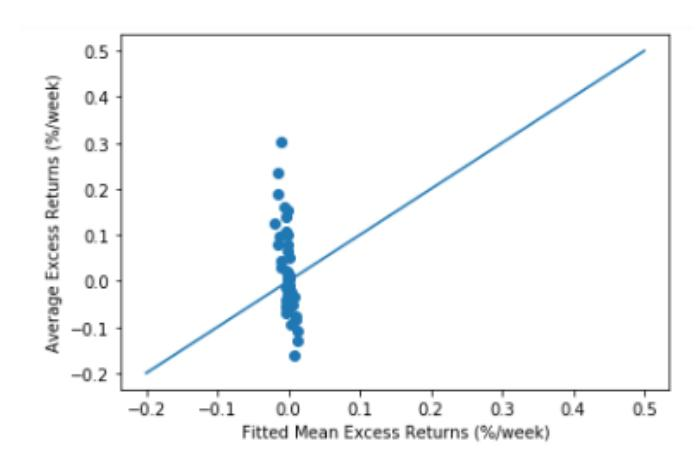

*Figure A.1: Plot of the 5-Factor Fama French Model During COVID Period*

|            | MSE      | Adj R-squared |
|------------|----------|---------------|
| r 1,05-1   | 0.034923 | 0.002149      |
| r 2,05-1   | 0.041815 | -0.016218     |
| r 3,05-1   | 0.03981  | 0.003590      |
| r 4,05-1   | 0.035837 | 0.018834      |
| r 8,05-1   | 0.035546 | -0.006178     |
| r 16,05-1  | 0.029570 | 0.005626      |
| r 50,05-1  | 0.020058 | 0.036150      |
| RETSKEW5-1 | 0.028771 | -0.026362     |
| MAXRET5-1  | 0.058705 | 0.023569      |

*Table A.5: 5-Factor Fama French Model Pre-COVID Period*

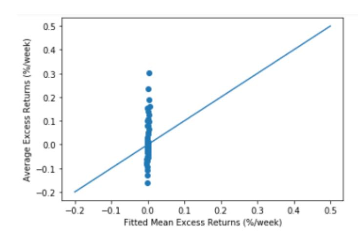

*Figure A.2: Plot of the 5-Factor Fama French Model Pre-COVID Period*

|            | alpha     | White_se_A | beta_0    | White_se_0 | beta_1    | White_se_1 | MSE       | Adj R-squared |
|------------|-----------|------------|-----------|------------|-----------|------------|-----------|---------------|
|            | r 1,05-1  | 0.334183   | 0.040268  | 3.333429   | 2.917701  | -1.209429  | 0.1024053 | 0.064614      |
|            | r 2,05-1  | 0.233787   | 0.047449  | 0.885252   | 2.309300  | -0.359521  | 0.870748  | -0.080753     |
|            | r 3,05-1  | 0.204893   | 0.047085  | 0.815444   | 2.624790  | -0.635859  | 0.944857  | -0.083023     |
|            | r 4,05-1  | 0.156710   | 0.046284  | -1.671857  | 3.210257  | 0.439187   | 1.000937  | 0.087306      |
|            | r 8,05-1  | 0.112306   | 0.054185  | -2.345993  | 4.233810  | 0.408893   | 1.270234  | 0.130907      |
|            | r 16,05-1 | 0.136362   | 0.052401  | -1.606238  | 3.137189  | 0.278407   | 0.970232  | 0.087706      |
|            | r 50,05-1 | 0.069711   | 0.029298  | -0.962982  | 1.875413  | 0.067604   | 0.677413  | 0.041039      |
| RETSKEW5-1 | 0.118131  | 0.031898   | -0.004959 | 3.087891   | -0.781098 | 0.912219   | 0.050235  | -0.013546     |
| MAXRET5-1  | 0.135340  | 0.043918   | 2.257809  | 3.459707   | -0.710882 | 1.097978   | 0.078541  | -0.042394     |

*Table A.6: Commodities Model During COVID Period*

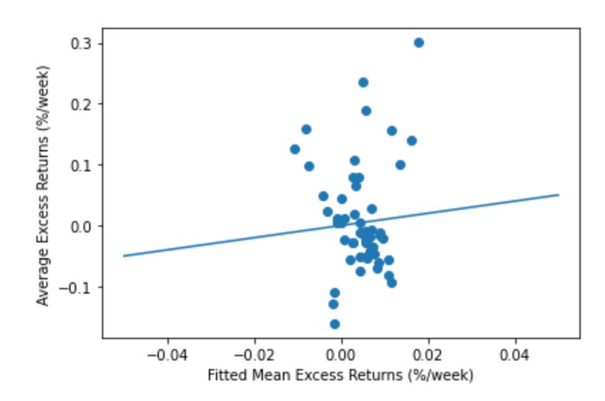

*Figure A.3: Plot of the Commodities Model During COVID Period*

|             | alpha    | White_se_A | beta_0    | White_se_0 | beta_1    | White_se_1 | MSE      | Adj R-squared |
|-------------|----------|------------|-----------|------------|-----------|------------|----------|---------------|
| r 1,05-1    | 0.200989 | 0.014761   | -0.680982 | 1.372370   | 0.300410  | 0.655797   | 0.035353 | -0.010137     |
| r 2,05-1    | 0.235748 | 0.015715   | 0.217165  | 1.518531   | 0.832690  | 0.751594   | 0.041045 | 0.002495      |
| r 3,05-1    | 0.185382 | 0.014593   | -0.911033 | 1.449986   | 0.519514  | 0.674352   | 0.034376 | -0.007985     |
| r 4,05-1    | 0.160867 | 0.015031   | -0.356919 | 1.432069   | -0.336611 | 0.665053   | 0.036801 | -0.007545     |
| r 8,05-1    | 0.132130 | 0.014718   | -0.281240 | 1.476069   | -0.577402 | 0.608181   | 0.035433 | -0.002986     |
| r 16,05-1   | 0.091283 | 0.014104   | -1.369482 | 1.426951   | 0.556708  | 0.638209   | 0.029859 | -0.004101     |
| r 50,05-1   | 0.042586 | 0.012945   | 1.360629  | 1.191991   | -0.597866 | 0.704818   | 0.020890 | -0.003839     |
| RET SKEWS-1 | 0.073551 | 0.012644   | -1.272317 | 1.232991   | -0.126353 | 0.579161   | 0.027879 | 0.005442      |
| MAXRETS-1   | 0.152643 | 0.019291   | 3.674207  | 1.957971   | -0.858528 | 0.882605   | 0.058709 | 0.023500      |

*Table A.7: Commodities Model Pre-COVID Period*

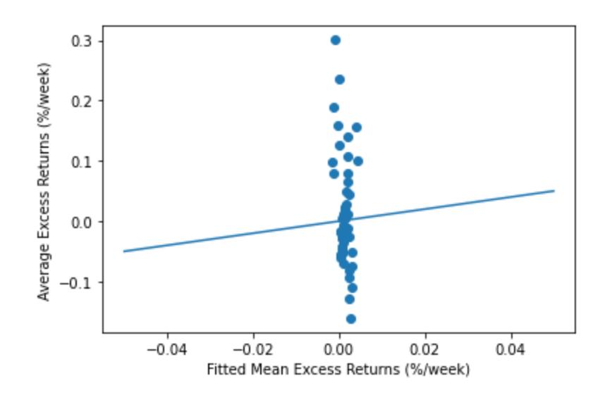

*Figure A.4: Plot of the Commodities Model Pre-COVID Period*

| AUD                | CAD           | DKK           | HKD           | ILS           | PLN           | CHF           |
|--------------------|---------------|---------------|---------------|---------------|---------------|---------------|
| BTCMarkets         | LakeBTC       | LocalBitcoins | Liquid        | LocalBitcoins | Exmo          | LocalBitcoins |
| Liquid             | Kraken        |               | LocalBitcoins | Bit2C         | LocalBitcoins | Kraken        |
| LakeBTC            | coinfield     |               |               |               | BitBay        | Lykke         |
| LocalBitcoins      | LocalBitcoins |               |               |               | CoinDeal      |               |
| IndependentReserve |               |               |               |               |               |               |
| CoinJar            |               |               |               |               |               |               |

*Table A.8.1: AUD, CAD, DKK, HKD, ILS, PLN, and CHF Crypto-Exchange Pairs*

| JPY           | GBP           |
|---------------|---------------|
| crex24        | LakeBTC       |
| Kraken        | cryptonex     |
| Coincheck     | Binanceje     |
| huobijapan    | Cexio         |
| lmax          | Bitfinex      |
| Zaif          | coinfield     |
| LocalBitcoins | CoinDeal      |
| LakeBTC       | CoinCorner    |
| Bitfinex      | Kraken        |
| Liquid        | Coinfloor     |
| BitBank       | BitSquare     |
| coinfield     | ExtStock      |
| BTCBOX        | LocalBitcoins |
| bitFlyer      | Coinbase      |

*Table A.8.2: JPY and GBP crypto-exchange pairs*

| EUR            | USD                |
|----------------|--------------------|
| Exmo           | Kuna               |
| BitBay         | OKCoin             |
| coinfield      | Liquid             |
| OKCoin         | seedcx             |
| CoinFalcon     | bingcoins          |
| Bitstamp       | Yobit              |
| StocksExchange | Gemini             |
| Luno           | erisx              |
| BTCExchange    | BitTrex            |
| Cexio          | bitasset           |
| DSX            | binanceusa         |
| lmax           | Lykke              |
| ExtStock       | Bitstamp           |
| Bitfinex       | Coinbase           |
| CoinCorner     | Coinsbit           |
| Coinbase       | lmax               |
| LakeBTC        | bitflyerus         |
| Lykke          | CoinDeal           |
| TheRockTrading | binanceus          |
| Binanceje      | DSX                |
| CoinDeal       | Liqnet             |
| LiveCoin       | Kraken             |
| LocalBitcoins  | Bitfinex           |
| cryptonex      | cryptonex          |
| Paymium        | LiveCoin           |
| bitflyereu     | coinfield          |
| Coinmate       | primexbt           |
| Liquid         | IndependentReserve |
| Coinsbit       | ExtStock           |
| BitSquare      | P2PB2B             |
| Kraken         | xcoex              |
| Coinfloor      | Exmo               |
| Binance        | BitSquare          |
|                | itBit              |
|                | LakeBTC            |
|                | LocalBitcoins      |
|                | StocksExchange     |
|                | BTCAlpha           |
|                | Cexio              |
|                | BitBay             |

*Table A.8.3: EUR and USD crypto-exchange pairs*

| Insignificant Pairs   | Non-Stationary Pairs   |
|-----------------------|------------------------|
| AUD and Liquid        | AUD and CoinJar        |
| CAD and coinfield     | CAD and Kraken         |
| EUR and coinfield     | CAD and LocalBitcoins  |
| EUR and bitflyereu    | DKK and LocalBitcoins  |
| EUR and Coinmate      | EUR and StocksExchange |
| EUR and Coinfloor     | EUR and DSX            |
| HKD and Liquid        | EUR and lmax           |
| ILS and Bit2C         | EUR and ExtStock       |
| JPY and coinfield     | EUR and Coinsbit       |
| JPY and bitFlyer      | EUR and Binance        |
| PLN and Exmo          | JPY and crex24         |
| PLN and LocalBitcoins | JPY and lmax           |
| GBP and coinfield     | JPY and Bitfinex       |

*Table A.9: List of Insignificant and Non-Stationary Crypto-Exchange Pairs*

| Portfolio 1                   | Portfolio 2                     | Portfolio 3                 | Portfolio 4                  | Portfolio 5                          | Portfolio 6                    | Portfolio 7                      |
|-------------------------------|---------------------------------|-----------------------------|------------------------------|--------------------------------------|--------------------------------|----------------------------------|
| -0.2688 EUR and lmax       | -0.0003 EUR and Coinfloor    | 0.0011 EUR and coinfield | 0.0019 PLN and Exmo       | 0.0041 GBP and CoinDeal           | 0.0078 CHF and Lykke        | 0.0399 EUR and LiveCoin       |
| -0.2687 JPY and lmax       | -0.0002 JPY and coinfield    | 0.0011 EUR and OKCoin    | 0.0022 CAD and Kraken     | 0.0050 AUD and IndependentReserve | 0.0094 PLN and LocalBitcoin | 0.0447 EUR and LakeBTC        |
| -0.2590 EUR and Binance    | 2.5652e-05 HKD and Liquid    | 0.0012 EUR and Liquid    | 0.0023 EUR and Exmo       | 0.0055 EUR and TheRockTrading     | 0.0108 EUR and Lykke        | 0.0459 AUD and LakeBTC        |
| -0.2350 GBP and ExtStock   | 5.4584e-05 CAD and coinfield | 0.0013 EUR and Bitstamp  | 0.0024 GBP and Coinbase   | 0.0060 GBP and Binanceje          | 0.0109 EUR and BTCExchange  | 0.0470 CAD and LakeBTC        |
| -0.1439 CHF and Kraken     | 0.0007 JPY and bitFlyer      | 0.0013 EUR and Coinbase  | 0.0026 JPY and Kraken     | 0.0061 EUR and Luno               | 0.0192 EUR and Coinsbit     | 0.0502 JPY and LakeBTC        |
| -0.1310 JPY and crex24     | 0.0008 AUD and Liquid        | 0.0014 EUR and CoinDeal  | 0.0027 EUR and Cexio      | 0.0064 EUR and Paymium            | 0.0260 HKD and LocalBitcoin | 0.0573 GBP and LakeBTC        |
| -0.1082 GBP and cryptonex  | 0.0008 JPY and Zaif          | 0.0015 JPY and BitBank   | 0.0035 EUR and BitBay     | 0.0068 PLN and BitBay             | 0.0270 GBP and BitSquare    | 0.0602 EUR and LocalBitcoin   |
| -0.1041 EUR and cryptonex  | 0.0009 JPY and BTCBOX        | 0.0017 EUR and Binanceje | 0.0036 EUR and Coinmate   | 0.0070 PLN and CoinDeal           | 0.0349 EUR and ExtStock     | 0.0632 ILS and Bit2C          |
| -0.0043 JPY and huobijapan | 0.0009 EUR and Kraken        | 0.0017 EUR and Bitfinex  | 0.0036 GBP and Coinfloor  | 0.0070 EUR and CoinFalcon         | 0.0353 EUR and BitSquare    | 0.0643 AUD and LocalBitcoin   |
| -0.0008 GBP and coinfield  | 0.0010 JPY and Liquid        | 0.0018 JPY and Bitfinex  | 0.0038 AUD and BTCMarkets | 0.0071 GBP and Cexio              | 0.0360 EUR and DSX          | 0.0910 EUR and StocksExchange |
| -0.0004 EUR and bitflyereu | 0.0010 JPY and Coincheck     | 0.0019 GBP and Bitfinex  | 0.0039 AUD and CoinJar    | 0.0073 GBP and Kraken             | 0.0362 GBP and LocalBitcoin | 0.0960 CAD and LocalBitcoin   |

*Table A.10: List of Crypto-Exchange Pairs Used for the Portfolios*