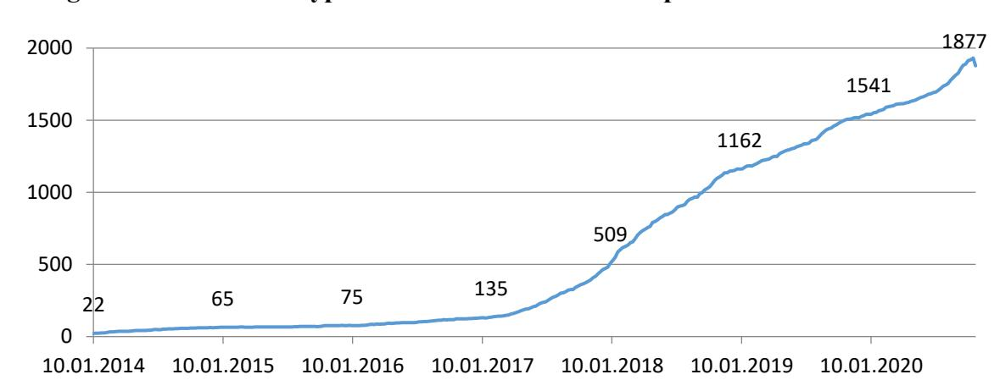
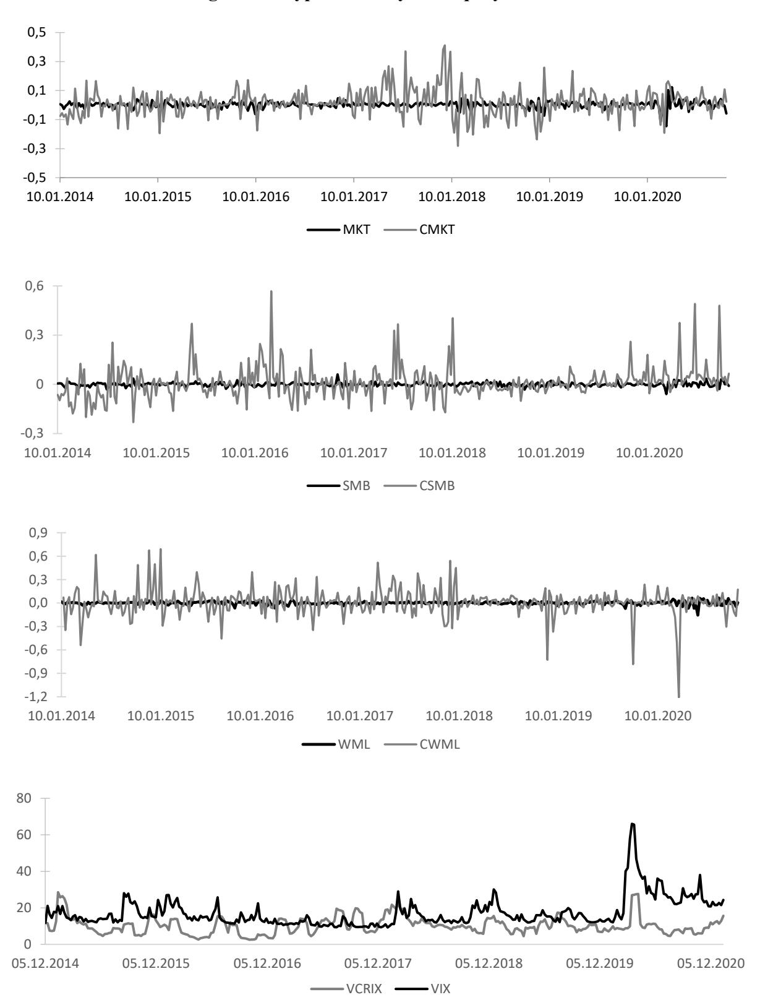

## NATIONAL RESEARCH UNIVERSITY HIGHER SCHOOL OF ECONOMICS

## NATIONAL RESEARCH UNIVERSITY HIGHER SCHOOL OF ECONOMICS

*Victoria Dobrynskaya, Mikhail Dubrovskiy*

# **CRYPTOCURRENCIES MEET EQUITIES: RISK FACTORS AND ASSET PRICING RELATIONSHIPS**

BASIC RESEARCH PROGRAM WORKING PAPERS

SERIES: FINANCIAL ECONOMICS WP BRP 86/FE/2022

This Working Paper is an output of a research project implemented at the National Research University Higher School of Economics (HSE). Any opinions or claims contained in this Working Paper do not necessarily reflect the views of HSE.

# **CRYPTOCURRENCIES MEET EQUITIES: RISK FACTORS AND ASSET PRICING RELATIONSHIPS**

We consider a variety of cryptocurrency and equity risk factors as potential forces that drive cryptocurrency returns and carry risk premiums. In a crosssection of 2,000 biggest cryptocurrencies, only downside market risk, cryptocurrency size and policy uncertainty factors are systematically priced with significant premiums. Momentum premium has vanished in the recent years. Equity market risk, particularly equity downside market risk, appears to be more important than cryptocurrency market risk, suggesting greater linkages between cryptocurrency and equity markets than we used to think. Global and US equity factors are the most relevant for the cryptocurrency market.

JEL classification: D14, G12, G15

Keywords: cryptocurrency, asset pricing; risk factors, factor models, alternative investments

 Corresponding author, HSE University, School of Finance, 11 Pokrovskiy boulevard, Moscow, Russian Federation,

e-mail [vdobrynskaya@hse.ru.](mailto:vdobrynskaya@hse.ru)

HSE University, Faculty of Economic Sciences.

We are grateful to Sergey Stepanov, Simon Trimborn and seminar participants at HSE University, International Risk Management Conference, World Finance and Banking Society conference, 1st De-Fi and Financial Services conference.

#### **1. INTRODUCTION**

Cryptocurrencies enter our lives and occupy portfolios of individual and institutional investors at tremendous pace (Bianchi and Babiak, 2021). Therefore, understanding which forces drive cryptocurrency returns is of great importance. Which risk factors are cryptocurrencies systematically exposed to? Which factors carry risk premiums? What are the linkages between cryptocurrency and traditional financial markets? This study is aimed to answer these questions.

Several recent studies have tried to impose factor structure on cryptocurrency returns. These studies can be divided into two groups. The first group explores how returns on a cryptocurrency market index or several major cryptocurrencies are related to various factors in *time-series*  regressions. Milunovich (2018) documents significant Granger causality from equities, bonds and commodities to some cryptocurrencies. However, most studies find that major cryptocurrencies are not contemporaneously exposed to macroeconomic, equity or currency factors (Yermack, 2015; Corbet et al., 2018; Bianchi, 2020; Bianchi et al., 2020; Liu et al., 2020), and some coins only have a mild exposure to precious metals (Bianchi, 2020). Smales (2020) documents that Bitcoin is the main driving force for other big cryptocurrencies. Liu and Tsyvinski (2021) is the first comprehensive empirical study of a great number of factors which may potentially influence cryptocurrency returns over time. They find that the cryptocurrency market index is driven by cryptocurrency-specific factors, suggested in theoretical cryptocurrency pricing models (network factors, investor attention and time-series momentum), but has a weakly significant exposure to a stock market index and insignificant exposures to other equity factors, as well as precious metals, currency and macroeconomic factors, cryptocurrency value and cost-of-production factors.

The second group of studies considers cryptocurrency-specific factors in *cross-sectional* assetpricing tests. Liu et al. (2020) and Liu et al. (2021) propose a three-factor model with cryptocurrency market, size and momentum factors, which are traded portfolios of cryptocurrencies themselves. The model explains cryptocurrency average returns well, and size and momentum factors carry significant premiums. Shen et al. (2020) document that a similar model with reversal factor instead of momentum is relevant for cryptocurrencies. Dobrynskaya (2020) demonstrates the importance of cryptocurrency downside market risk in addition to the aforementioned factors. Shanaev et al. (2019) propose cryptocurrency 'age' (period of listing) and 'proof' (proof-of-stake-minus-proof-of-work) factors to explain cryptocurrency returns. Assamoi et al. (2020) is, to our knowledge, the only crosssectional study of traditional market factors for cryptocurrencies, which shows ambiguous results. Only equity size and commodity factors are significantly priced, but with negative premiums, and there is no monotonicity of returns in portfolio sorts by the factors. Unfortunately, the sample of this study is very narrow (100 biggest cryptocurrencies) in order to draw general conclusions.1

We contribute to the second strand of cryptocurrency-related literature by running horse races between cryptocurrency-specific and equity market factors in cross-sectional multifactor regressions for 2,000 cryptocurrencies with market capitalization above \$1 million. Even though some earlier studies document irrelevance of equity factors for the crypto-market index or several major cryptocurrencies, these factors may be significant drivers of other cryptocurrencies in a bigger sample, and may be compensated by risk premiums. So, we ask the question: Do equity factors explain cryptocurrency returns cross-sectionally in addition to cryptocurrency factors? Which risk factors are systematically priced and have high explanatory power in the cryptocurrency market?

Contrary to earlier studies, we find that equity market risk, particularly equity downside risk, is priced with a statistically significant premium, generalizing the findings of Dobrynskaya (2020) for the equity risk and a more recent time period. The equity market risk turns out to be even more important than the cryptocurrency market risk. This suggests greater linkages between cryptocurrency and equity markets in the recent years. However, we do not find evidence that other popular equity factors (size, value, momentum, volatility, profitability and investment) are priced in cryptocurrency market.

In line with previous findings, cryptocurrency-specific factors are priced with significant premiums, even after controlling for the equity market risk. Moreover, when we compare cryptocurrency factors to their counterparts for equities, we find that only cryptocurrency factors deliver statistically significant returns in the recent period 2014-2020, and the factors are uncorrelated with each other. However, contrary to Liu et al. (2020) and in line with Grobys and Sapkota (2019), we do not find evidence for either significant momentum effect, or significant momentum premium in the cryptocurrency market. The reason is extraordinary performance of several 'past loser' cryptocurrencies in the recent years.

Our study also contributes to the existing literature by documenting some explanatory power of two recently proposed cryptocurrency factors, which have not been tested cross-sectionally – volatility VCRIX (Kim et al., 2019) and uncertainty UCRY (Lucey et al., 2021). The both factors are priced with positive premiums, i.e. cryptocurrencies with greater exposure to volatility and uncertainty yield higher returns subsequently.

The uncertainty factor together with cryptocurrency size and equity downside risk factors form the best multifactor model for cryptocurrencies in term of explanatory power. However, these factors

 1 The study of Assamoi et al. (2020) also has several methodological flaws (i.e. the assumption of constant betas and risk premiums), due to which the results may be biased.

do not explain *all* cryptocurrency returns since the intercepts remain positive and highly significant. Hence, the cryptocurrency market delivers high average returns which are still unexplained by the factors.

We also consider equity factors from different geographical regions and find that the global and US factors are the most relevant for the cryptocurrency market.

The rest of the paper is organized as follows. Section 2 describes the data and reports summary statistics of cryptocurrency returns. In section 3, we construct and compare cryptocurrency-specific risk factors to their equity counterparts. In section 4, we run horse races between cryptocurrency and equity factors in multifactor asset-pricing tests. Section 5 is devoted to the analysis of equity factors from different geographical markets. Section 6 concludes.

### **2. DATA**

Our period of study from January 6th, 2014 until November 1st, 2020 basically covers the whole history of the cryptocurrency market at the time of writing the paper. Whereas Bitcoin was introduced in 2009, it remained the only cryptocurrency traded for several years, until a few other cryptocurrencies were introduced in early 2010s. However, we need a sufficient number of liquid cryptocurrencies to perform cross-sectional tests, hence we start our sample period in 2014, when the number of cryptocurrencies exceeds 20. Our sample period includes stable periods, booms and busts in the cryptocurrency market, as well as the COVID-19 Pandemic, so our results are not driven by a particular market trend.

We consider only "big" cryptocurrencies with the market capitalization above \$1 million. A cryptocurrency enters our sample when its capitalization exceeds this level, and may leave our sample if its capitalization drops subsequently. We also restrict the sample to cryptocurrencies with at least 27 weeks of uninterrupted observations. Overall, our sample includes 1986 such "big" cryptocurrencies traded over the seven years. Figure 1 depicts the growth of the number of cryptocurrencies in the sample from 22 in the beginning of our sample to about 1900 in the end. Table 1 reports summary statistics of returns in our sample.

We collect daily raw data on cryptocurrency prices and capitalizations from the usual source coinmarketcap.com, which aggregates price data for each cryptocurrency from numerous exchanges. The data include delisted cryptocurrencies, so there is no concern about survivorship bias. We calculate weekly returns from Monday opening prices and Friday closing prices. Although cryptocurrencies are traded 7 days a week, we calculate the returns for working weeks in order to be comparable to equity weekly returns. So, we have 356 weeks of data and 216,369 return observations in total. The weekly frequency is chosen for several reasons. Firstly, there is less noise compared to

daily frequency. Secondly, there is a sufficient number of time-series observations compared to monthly frequency. Due to the short history of the crypto-market (12 years) and the fast metabolism of cryptocurrencies, the weekly frequency seems to be optimal so far and it is used in many studies (e.g. Liu et al., 2020, Shen et al., 2020; Liu et al., 2021).

**Figure 1. Number of cryptocurrencies with market capitalization above \$1 mln**

The figure plots the total number of cryptocurrencies with market capitalization above \$1 million and at least 27 consecutive weekly observations. Sample period: January 2014 – October 2020.

**Table 1. Summary statistics** 

| Sample period                 | January 6 th , 2014 – November 1 st , 2020 |
|-------------------------------|--------------------------------------------|
| Number of weeks               | 356                                        |
| Number of cryptocurrencies    | 1986                                       |
| Number of return observations | 216,369                                    |
| Mean return                   | 0.12                                       |
| Median return                 | -0.01                                      |
| Minimum return                | -1                                         |
| Maximum return                | 7,188.54                                   |

The table reports summary statistics of returns (in absolute values, per week) for the sample of cryptocurrencies with market capitalization above \$1 million.

Cryptocurrency weekly returns have huge volatility and extreme observations, therefore, we winsorize the data by excluding 0.005% of outliers. Even after deleting outliers, the occasional weekly returns on single cryptocurrencies have been as small as -100% and as large as 7,189%.

We construct cryptocurrency market (CMKT), size (CSMB) and momentum (CWML) factors following the methodology of Liu et al. (2020). However, our factors are dated differently. Liu et al. (2020) consider the first 7 days of each year as the first week, the next 7 days as the second week and so on, whereas we use calendar weeks from Mondays to Fridays. The CMKT factor is the capitalization-weighted portfolio of all cryptocurrencies in our sample. The CSMB factor is a weekly

rebalanced zero-cost portfolio, which has a long position in the 30% of the smallest cryptocurrencies and a short position in the 30% of the biggest cryptocurrencies, weighted by capitalizations. The CWML factor is a weekly rebalanced zero-cost portfolio, which has a long position in the 30% of cryptocurrencies with the highest previous-week returns and a short position in the 30% of cryptocurrencies with the lowest previous-week returns, weighted by capitalizations2 .

We collect a variety of equity factors from Kenneth French data library: the market (MKT), size (SMB), value (HML), investments (CMA), profitability (RMW) and momentum (WML) factors for the US, for four geographical regions (Asian-Pacific, North-American, European regions and Japan) and for the global market. Whenever a factor is not available at the weekly frequency, we use the daily data to calculate weekly returns, so that all factors are dated similarly.

We also collect the implied volatility factor for equities (VIX) from CBOE and a model-based forecast volatility factor for cryptocurrencies (VCRIX) from thecrix.de, which was constructed by Kim el at. (2019) to capture the expectations of the cryptocurrency market volatility for the next 30 days in a similar way as VIX. Finally, we consider a cryptocurrency uncertainty factor (UCRY), which was recently proposed by Lucey et al. (2021). The data is retrieved from Brian Lucey website.

# **3. COMPARISON OF CRYPTOCURRENCY AND EQUITY MARKETS**

First of all, we compare the cryptocurrency and equity markets in general. Table 2 reports the descriptive statistics for the US market factor (MKT), our CMKT factor, which represents the market portfolio of cryptocurrencies, and Bitcoin separately. Bitcoin is not only the oldest and biggest cryptocurrency, but is also the main "driving force" for other cryptocurrencies and the general market (Hu et al., 2019; Smales, 2020). Therefore, Bitcoin is often used as a proxy for the cryptocurrency market factor.

Compared to the equity market, the cryptocurrency market has about four times as high average and median returns and return volatility and a higher Sharpe ratio. The factor return dynamics are depicted on figure 2. Unlike the equity market, it has a positive skewness, so the general market is more exposed to the jump risk, rather than the crash risk. Surprisingly, the cryptomarket has a lower kurtosis.

 2 Liu et al. (2020) construct the momentum factor based on the previous three-week returns; however, we use the one-week horizon because it generates the highest momentum in our sample period. Using longer sorting horizons does not affect our results significantly, but the momentum effect is less pronounced.

**Figure 2. Cryptocurrency and equity factors**

The figure plots the dynamics of equity and cryptocurrency risk factors: the market (MKT, CMKT), size (SMB, CSMB), momentum (WML, CWML) and volatility (VIX, VCRIX). The market factors are capitalization-weighted indices of US stocks or cryptocurrencies, the size and momentum factors represent value-weighted long-short portfolios, sorted by capitalization or past returns.

**Table 2. Comparison of equity and cryptocurrency market factors** 

|                             | MKT     | CMKT     | Bitcoin    |
|-----------------------------|---------|----------|------------|
| Mean annualized return      | 0.12    | 0.88     | 0.53       |
|                             | [1.84]  | [3.41]   | [2.11]     |
| Median annualized return    | 0.20    | 0.73     | 0.55       |
| Minimum weekly return       | -0.15   | -0.28    | -0.31      |
| Maximum weekly return       | 0.12    | 0.41     | 0.46       |
| Standard deviation          | 1.22    | 4.86     | 4.73       |
| Sharpe ratio                | 0.10    | 0.18     | 0.11       |
| Skewness                    | -0.94   | 0.52     | 0.30       |
| Kurtosis                    | 8.95    | 2.41     | 2.83       |
| Correlation (mkt, cmkt)     | 0.11    | [2.17]** |            |
| Correlation (cmkt, Bitcoin) |         | 0.91     | [40.84]*** |
| Stock market beta           | 1.00    | 0.46**   | 0.37*      |
|                             |         | [2.05]   | [1.72]     |
| Downside beta               | 1.00    | 0.62*    | 0.67**     |
|                             |         | [1.89]   | [2.10]     |
| Upside beta                 | 1.00    | 0.25     | 0.04       |
|                             |         | [0.65]   | [0.12]     |
| SMB beta                    | 0.38*** | 0.26     | 0.47       |
|                             | [3.82]  | [0.61]   | [1.13]     |
| HML beta                    | 0.27*** | -0.12    | -0.01      |
|                             | [3.04]  | [-0.33]  | [-0.04]    |
| WML beta                    | -0.02   | 0.06     | 0.18       |
|                             | [-0.28] | [0.18]   | [0.57]     |

The table reports return and risk characteristics of the US equity market factor, cryptocurrency market factor and Bitcoin. Betas with respect to equity risk factors (MKT, SMB, HML, WML) are estimated in the 4-factor Carhart model. Tstatistics are reported in brackets. \* denotes significance at 10%, \*\* denotes significance at 5%, \*\*\* denotes significance at 1%.

Bitcoin and CMKT returns are highly correlated indeed (correlation 0.91), and both are weekly positively correlated with the equity market (correlation is only 0.11, but it is statistically significant). The equity market betas of CMKT and Bitcoin are rather high and significant (0.46 and 0.37, respectively), which is a consequence of their high volatility, rather than high correlation. 3 The downside beta, which is conditional on the negative equity market returns, is significantly higher, than the regular beta, and the upside beta is close to zero. Therefore, the cryptocurrency market comoves with the equity market much closer on the downside, when both are falling, but there is almost no systematic relationship between the markets on the upside. The cryptocurrency market has an insignificant exposure to equity size, value and momentum factors.

*Size and momentum factors*

 3 Comparing global and regional equity market indices, the highest correlation and beta of CMKT are observed with respect to the European market (0.16 and 0.63, respectively) and the lowest correlation and beta are observed with respect to the Asian-Pacific region (0.08 and 0.35, respectively).

Liu et al. (2020) consider a variety of cryptocurrency factors and show that only size and momentum factors have some systematic explanatory power for cryptocurrency returns. We look at these factors more closely and compare them with their sister factors for US the equity market. The factor descriptive statistics are reported in table 3 and the return dynamics are plotted on figure 2.

**Table 3. Comparison of equity and cryptocurrency size and momentum factors**

| Mean annualized       | SMB return -0.02 [-0.52] | CSMB 0.61** [2.26] | WML 0.04 [0.76] | CWML 0.46 [0.95] |
|-----------------------|--------------------------|--------------------|-----------------|------------------|
| Median annualized     | return -0.01             | 0.29               | 0.08            | 0.32             |
| Minimum weekly return | -0.06                    | -0.23              | -0.16           | -1.21            |
| Maximum weekly return | 0.06                     | 0.57               | 0.07            | 0.69             |
| Standard deviation    | 0.64                     | 5.12               | 1.09            | 9.21             |
| Sharpe ratio          | -0.03                    | 0.12               | 0.04            | 0.05             |
| Skewness              | 0.21                     | 1.77               | -1.36           | -0.85            |
| Kurtosis              | 2.71                     | 7.06               | 9.76            | 9.43             |
| Correlation           | 0.04                     | [0.78]             | -0.05           | [-0.85]          |

The table reports return and risk characteristics of the US equity size (SMB) and momentum (WML) factors and cryptocurrency size (CSMB) and momentum (CWML) factors. The factors represent long-short portfolios, sorted by market capitalization and past returns, respectively. T-statistics are reported in brackets. \*\* denotes significance at 5%.

Whereas the size effect has been negligible in the equity market in the recent years (the average SMB return is -2% per annum in 2014-2020), it has been pronounced in the cryptocurrency market. The average annualized return on the CSMB factor is 61% and statistically significant, the factor has a Sharpe ratio of 12% and a positive skewness. As we can see on figure 2, there are many positive spikes in the CSMB returns, which are generated by occasional very high returns of small cryptocurrencies. The cryptocurrency and equity size factors are uncorrelated.

The cryptocurrency momentum (CWML) premium is rather high (46%), but statistically insignificant due to very high volatility. Similarly to Liu et al. (2021) and contrary to Shen et al. (2020), we observe short-term momentum effect rather than reversal. However, as we can see on figure 2, the factor has a few negative spikes, which were a consequence of extremely high occasional returns of a few cryptocurrencies, which turned out to be past losers. Deleting those observations would make the average momentum return higher and significant4 . The equity momentum premium has been rather low (4%) and statistically insignificant in the recent years similarly to the equity size premium. Both equity and cryptocurrency momentum factors have a

 4 Since these negative spikes occurred in 2019-2020, the average momentum return was significantly higher in 2014-2018 – in the period of study of Liu et al. (2020), where they find that the momentum factor was significant in the cryptocurrency market.

negative skewness as an evidence of momentum crash risk (Daniel and Moskowitz, 2016). However, these crashes are unrelated and the two factors are uncorrelated.

### *Implied volatility factors*

Since volatility is an important factor for any market, particularly for the cryptocurrency market, we compare the implied volatility factors VIX and VCRIX. The VCRIX factor was proposed by Kim et al. (2019) to measure the perceived future volatility of the cryptocurrency market in a similar way as VIX measures the perceived volatility of the US stock market. The authors use the Trimborn and Hardle's (2018) cryptocurrency market factor CRIX as a benchmark. CRIX has a varying over time number of constituents, which are determined econometrically by AIC to capture the movement of the cryptocurrency market. Because of the absence of developed derivatives market and impossibility of extracting implied volatility from derivatives prices (as in the case of VIX), Kim et al. (2019) developed a model to forecast the future volatility of CRIX and constructed the modelbased implied volatility factor VCRIX.

Since VIX and VCRIX have different scales, we normalize VCRIX to have the same starting value as VIX on 5.12.2014 – the first date when VCRIX becomes available. The two volatility factors are plotted in the bottom panel of figure 2. The two factors are weakly positively correlated (statistically significant correlation 0.20) with many simultaneous spikes, which can be viewed as an evidence of volatility spillovers between the cryptocurrency and equity markets. The largest jump in implied volatilities in the both markets is observed at the outbreak of the Coronavirus pandemic in March 2020.

# **4. CRYPTOCURRENCY PRICING BY EQUITY AND CRYPTO FACTORS**

In this section, we look at the whole cross-section of 1986 cryptocurrencies to investigate, which risk factors (cryptocurrency or equity), if any, explain their returns better. We start from the regular CAPM using MKT, CMKT and Bitcoin as different proxies for the market factor. Then we extend the model by adding downside risk, the Fama-French factors and implied volatility factors for the equity and cryptocurrency markets.

We employ the two step Fama-MacBeth procedure. On the first step, each cryptocurrency's returns are regressed on factors over a 26-weeek (half-year) horizon to estimated factor betas. The regular betas are estimated in the classical CAPM regression:

$$R_{i,t} = \alpha_i + \beta_i * R_{MKT,t} + \varepsilon_{i,t} \quad (1)$$

where  $R_{i,t}$  is the excess return of cryptocurrency  $i$  and  $R_{MKT}$  is the excess return of a market factor (MKT, CMKT or Bitcoin). The downside betas are estimated in the two-beta CAPM regression (Ang et al., 2006):

$$R_{i,t} = \alpha_i + \beta_i^- * R_{MKT,t} + \gamma_i * R_{MKT,t} * dummy_t + \varepsilon_{i,t} \quad (2)$$

where  $dummy_t = \begin{cases} 0, & if R_{MKT,t} < 0 \\ 1, & otherwise \end{cases}$ , and hence,  $\beta_i^-$  is the estimate of the downside beta. The downside beta is interpreted as the market beta conditional on negative market returns.

On the second step, the cross-section of cryptocurrency returns in the subsequent week are regressed on their trailing betas to estimate risk premiums (lambdas):

$$R_i = a + \beta_i * \lambda + \eta_i \quad (3)$$

$$R_i = a + \beta_i * \lambda + (\beta_i^- - \beta_i)\lambda^- + \eta_i \quad (4)$$

Regression (3) is the regular CAPM specification, whereas regression (4) is the Downside Risk CAPM specification of Lettau et al. (2014), where extra downside risk on top of the beta-risk enters as the second term. Regressions (3) and (4) are augmented by other risk factors in various multifactor specifications.

The 26-week rolling window is then moved by one week forward, and the two-step procedure is repeated. And so on. The Fama-MacBeth methodology generates time series of risk premiums and intercepts for each multifactor specification. The average risk premiums and their t-statistics are reported in table 4. Column 1 reports the estimates of specification (3), column 2 reports the estimates of specification (4), and subsequent columns report the estimates of augmented multifactor models. Panel A reports alternative multifactor specifications using US equity factors as explanatory variables, and panel B reports specifications with cryptocurrency factors. A positive and statistically significant premium of a factor implies that cryptocurrencies which have higher exposures to this factor yield higher subsequent returns systematically. In other words, this factor is priced in the crypto-market.

**Table 4. Cross-sectional asset-pricing regressions with equity and cryptocurrency risk factors**

|               |         |               | Panel A: Equity factors |                              |         |                 |
|---------------|---------|---------------|-------------------------|------------------------------|---------|-----------------|
|               | 1       | 2             | 3                       | 4                            | 5       | 6               |
| Market        | 0.13**  | 0.09          | 0.09*                   | 0.07                         | 0.11**  | 0.06            |
|               | [2.12]  | [1.48]        | [1.83]                  | [1.33]                       | [2.02]  | [1.08]          |
| Downside risk |         | 0.10** [2.43] |                         |                              |         |                 |
| SMB           |         |               | 0.01                    | 0.02                         |         | 0.37            |
|               |         |               | [0.74]                  | [0.74]                       |         | [0.13]          |
| HML           |         |               | -0.01                   | -0.01                        |         | -3.20           |
|               |         |               | [-0.26]                 | [-0.40]                      |         | [-0.91]         |
| WML           |         |               | -0.10*                  |                              |         | -0.08           |
|               |         |               | [-1.72]                 |                              |         | [-1.41]         |
| CMA           |         |               |                         | -0.02 [-0.91]                |         |                 |
| RMW           |         |               |                         | -0.01 [-0.59]                |         |                 |
| VIX           |         |               |                         |                              | 9.06    | 20.55*          |
|               |         |               |                         |                              | [0.66]  | [1.73]          |
| Intercept     | 1.75*** | 1.84***       | 1.84***                 | 1.71***                      | 1.80*** | 1.84***         |
|               | [5.72]  | [5.90]        | [5.80]                  | [5.54]                       | [5.91]  | [5.88]          |
| 2 R           | 0.03    | 0.05          | 0.08                    | 0.10 Panel B: Crypto factors | 0.05    | 0.10            |
|               | 1       | 2             | 3 4                     | 5                            | 6       | 7 8             |
| Market        | 0.13    | 0.21          | 0.12 0.18               | -0.01                        | 0.14    | -0.06 0.16      |
|               | [0.63]  | [0.98]        | [0.54] [0.83]           | [-0.02]                      | [0.60]  | [-0.26] [0.57]  |
| Downside risk |         | 0.28**        | 0.31***                 |                              | 0.23**  |                 |
|               |         | [2.56]        | [2.58]                  |                              | [2.18]  |                 |
| CSMB          |         |               | 0.35** 0.41**           |                              |         | 0.26            |
|               |         |               | [2.04] [2.21]           |                              |         | [1.63]          |
| CWML          |         |               | -0.18 -0.21             |                              |         |                 |
|               |         |               | [-0.48] [-0.58]         |                              |         |                 |
| UCRY          |         |               |                         | 0.03**                       | 0.03**  | 0.03**          |
|               |         |               |                         | [2.12]                       | [2.29]  | [2.23]          |
| VCRIX         |         |               |                         |                              |         | 12.38 [1.63]    |
| Intercept     | 1.57*** | 1.47***       | 1.48*** 1.39***         | 1.73***                      | 1.56*** | 1.71*** 1.78*** |
|               | [4.62]  | [4.38]        | [4.28] [4.05]           | [4.83]                       | [4.27]  | [4.74] [4.72]   |
| 2 R           | 0.03    | 0.05          | 0.06 0.08               | 0.05                         | 0.07    | 0.07 0.04       |

The table reports the estimates of annualized premiums of equity (panel A) and cryptocurrency (panel B) risk factors, obtained in cross-sectional Fama-MacBeth regressions for up to 1,900 simultaneously traded cryptocurrencies. Alternative multifactor specifications are presented in columns. Specifications without downside risk are described by regression ���� = �� + ���� ∗ �� +���� , where *Ri* denotes cryptocurrency i excess return, *βi* denotes exposures of cryptocurrency i to different risk factors, and λ denotes the estimates of factor risk premiums. Specifications with downside risk are described by regression ���� = �� + ���� ∗ �� + (���� − − ����)�� − + ���� , where ���� − is downside beta of cryptocurrency i, and the whole second term reflects downside risk pricing. T-statistics are reported in brackets. \* denotes significance at 10%, \*\* denotes significance at 5%, \*\*\* denotes significance at 1%.

The results in table 4 reveal that very few factors are priced systematically.

Column 1 is the regular CAPM. The equity market factor carries a positive statistically significant premium of 13% per annum, whereas the cryptocurrency market premium of the same size is insignificant due to its high volatility5 . However, when we control for the extra downside risk (column 2 6 ), we obtain statistically significant downside risk premiums for both MKT and CMKT (or Bitcoin), whereas the market premium becomes insignificant in all cases. This result confirms the findings of Dobrynskaya (2020), that downside risk is an important component in cryptocurrency pricing models. Whereas Dobrynskaya (2020) obtains this result with respect to the cryptocurrency market factor, we generalize it to the equity factor. The significance of the downside risk suggests that cryptocurrencies, which tend to correlate with the equity or cryptocurrency markets more when these markets are falling, are compensated by higher subsequent returns. The downside risk premium remains significant in all specifications where we control for other factors.

Columns 3 and 4 in panel A are the 4-factor Carhart model (Carhart, 1997) and the 5-factor Fama-French model (Fama and French, 2015), respectively. We do not find any evidence of explanatory power of these equity factors for cryptocurrency returns. However, we do find a high explanatory power of the cryptocurrency size factor CSMB (column 3 in panel B). Moreover, the cryptocurrency size and downside risk factors are both statistically significant in the 4-factor specification in column 4. The results confirm the findings of Dobrynskaya (2020) and Liu et al. (2021) with the exception of the cryptocurrency momentum factor. We find that the CWML factor generated negative returns in the recent years leading to insignificant whole-period average return and insignificant negative premium in the cross-sectional regressions.

Next, we observe a robust significant premium of 3% per annum for the UCRY Policy uncertainty factor (columns 5-7 in panel B). Lucey et al. (2021) propose two uncertainty factors for the cryptocurrency market: price uncertainty and policy uncertainty. They claim that informed investors would be sensitive to changes in policy uncertainty, whereas amateurs would be more responsive to price uncertainty. Hence, "it is important to distinguish between two types of cryptocurrency uncertainty, since it may help to better understand the behavior of different sets of investors in cryptocurrency markets" (Lucey et al., 2021). We find that only policy uncertainty is priced7 . This is an indirect evidence of an important role of institutional investors in cryptocurrency

 5 All results are similar if we use Bitcoin instead of CMKT (not reported). The average Bitcoin premium (19%) is a little higher than the average CMKT premium (13%), but the time series of the both premiums are highly correlated with the coefficient of 0.91. Hence, using Bitcoin as a cryptocurrency market proxy is fully justified.

6 The CAPM with downside risk is proposed by Ang et al. (2006), tested empirically for different asset classes by Lettau et al. (2014) and for the cryptocurrency market by Dobrynskaya (2020). Compared to the CAPM, the model has an additional term – the relative downside risk premium, which is a compensation for the extra downside beta on top of the regular beta (β- -β), where the downside beta is estimated in times when the market is falling.

7 The estimates of risk premiums of the price uncertainty index are insignificant in all specifications and not reported.

markets. The uncertainty factor and the downside risk factor both remain significant in a three-factor specification in column 6. However, the uncertainty factor suppresses the significance of the size factor (column 7).

Finally, we find weak evidence of a positive premium for volatility factors (VIX and VCRIX). Both VIX and VCRIX premiums are statistically significant at 90% confidence level (column 6 in panel A and column 8 in panel B), hence the both factors have similar explanatory power for the crypto-market.

**Table 5. Cross-sectional asset-pricing regressions with equity and cryptocurrency risk factors simultaneously**

|                      | 1       | 2       | 3       | 4       | 5             |
|----------------------|---------|---------|---------|---------|---------------|
| Equity market        | 0.13**  | 0.06    | 0.09    | 0.07    | 0.03          |
|                      | [1.97]  | [0.87]  | [1.52]  | [1.16]  | [0.56]        |
| Crypto market        | 0.05    | 0.06    | -0.09   | 0.00    | -0.03         |
|                      | [0.24]  | [0.25]  | [-0.39] | [0.01]  | [-0.13]       |
| Equity downside risk |         | 0.17**  |         | 0.18**  | 0.12**        |
|                      |         | [2.15]  |         | [2.30]  | [2.33]        |
| Crypto downside risk |         | 0.05    |         | 0.05    | 0.03          |
|                      |         | [0.19]  |         | [0.20]  | [0.27]        |
| SMB                  |         |         | 0.03    | 0.00    | -0.00         |
|                      |         |         | [0.89]  | [0.12]  | [-0.06]       |
| CSMB                 |         |         | 0.35**  | 0.40**  | 0.36**        |
|                      |         |         | [2.08]  | [2.31]  | [2.13]        |
| UCRY                 |         |         |         |         | 0.03** [2.08] |
| Intercept            | 1.64*** | 1.68*** | 1.70*** | 1.61*** | 1.65***       |
|                      | [4.83]  | [4.52]  | [4.63]  | [4.24]  | [4.38]        |
| 2 R                  | 0.04    | 0.07    | 0.08    | 0.12    | 0.14          |

The table reports the estimates of annualized premiums of equity and cryptocurrency risk factors, obtained in crosssectional Fama-MacBeth regressions for up to 1,900 cryptocurrencies. Alternative multifactor specifications are presented in columns. Specifications without downside risk are described by regression ���� = �� +���� ∗ �� + ���� , where *Ri* denotes cryptocurrency i excess return, *βi* denotes exposures of cryptocurrency i to different risk factors, and λ denotes the estimates of factor risk premiums. Specifications with downside risk are described by regression ���� = �� + ���� ∗ �� + (���� − − ����)�� − + ���� , where ���� − is downside beta of cryptocurrency i with respect to equity or cryptocurrency market index. T-statistics are reported in brackets. \*\* denotes significance at 5%, \*\*\* denotes significance at 1%.

On the next step, we run horse races between equity and cryptocurrency factors by putting them into regressions simultaneously (table 5). Since the factors from the two markets are uncorrelated, there is no problem with multicollinearity. Two major results follow. First, the equity market factor and, particularly, the equity downside risk factor are more important than the cryptocurrency market factors. The significance of cryptocurrency downside risk vanishes once we control for equity downside risk. Second, the cryptocurrency size and uncertainty factors remain

significant once we control for equity factors. The explanatory power (R2 ) of the model with equity downside risk, cryptocurrency size and uncertainty factors is the highest.

Overall, our results suggest that the cryptocurrency market has a weak (probably only emerging) factor structure, and the unexplained component of returns remains high, as evidenced by high and statistically significant intercepts and rather low R2 . The cryptocurrency factors generally have a higher explanatory power than equity factors, which is not surprising given that the equity factors themselves have been insignificant in the recent years. The exception is the downside market risk factor, which has an equal explanatory power irrespective of whether we use the equity or the cryptocurrency market as the benchmark.

Equity downside risk becomes even more important than cryptocurrency downside risk, when they are considered together. This suggests that the cryptocurrency market is becoming more integrated with the equity market, than we used to think. Whereas early studies of the cryptocurrency market analyzed it in isolation (Liu et al., 2020; Cong et al., 2021) or documented very weak connections with traditional markets (Sovbetov, 2018, Bianchi et al., 2020; Liu and Tsyvinsky, 2021), more recent studies document stronger interrelations, especially during the COVID-19 pandemic (Feng and Sun, 2021; Assamoi et al., 2020). For instance, Feng and Sun (2021) document the emergence of one common factor for explaining cryptocurrency and equity returns in 2020, which relates to equity market factors. Our findings are in line with this recent evidence, and they have important implications for cryptocurrency investors. Greater exposure of cryptocurrencies to the equity market and, particularly, to equity downside risk suggests that the diversification potential of cryptocurrencies is decreasing in the recent years. As more and more traditional investors and asset managers start adding cryptocurrencies to their portfolios, the cryptocurrency market becomes more integrated in the general financial market, and this trend is likely to continue in the future.

# **5. CRYPTOCURRENCY PRICING BY GLOBAL AND REGIONAL FACTORS**

The previous analysis was conducted with respect to the US equity market factors. However, since cryptocurrencies are traded globally 24/7, global or regional factors may be of greater relevance to explain cryptocurrency returns. Table 6 reports the Fama-MacBeth risk premiums in the 4-factor Carhart model with global and regional equity market factors in columns. Compared to the US factors (column 3 in panel A of table 4), the global factors have a little higher explanatory power indeed. The global market and momentum factors have significant premiums, whereas the SMB and HML factors are still insignificant. The regional factors perform worse than the global and US factors, and the weakest relationship is observed with respect to the Asian-Pasific market. Overall, our results suggest that the global equity market factor is the most relevant proxy for the market portfolio for cryptocurrency asset-pricing tests.

**Table 6. Global and regional equity factors**

| Market    | Global 0.11** [2.10] | North American 0.09* [1.65] | European 0.07 [1.40] | Asian-Pacific 0.09 [1.30] | Japanese 0.10 [1.50] |
|-----------|----------------------|------------------------------|----------------------|---------------------------|----------------------|
| SMB       | 0.01                 | 0.00                         | 0.03                 | -0.05                     | 0.03                 |
|           | [0.77]               | [-0.02]                      | [1.13]               | [-1.15]                   | [1.30]               |
| HML       | 0.01                 | -0.01                        | 0.03                 | 0.00                      | 0.02                 |
|           | [0.23]               | [-0.20]                      | [1.17]               | [0.10]                    | [0.65]               |
| WML       | -0.09**              | -0.09*                       | -0.10**              | -0.05**                   | -0.12***             |
|           | [-2.12]              | [-1.92]                      | [-2.22]              | [-2.14]                   | [-2.62]              |
| Intercept | 1.69***              | 1.75***                      | 1.56***              | 1.56***                   | 1.52***              |
|           | [5.35]               | [5.53]                       | [5.04]               | [5.03]                    | [5.03]               |
| 2 R       | 0.08                 | 0.09                         | 0.09                 | 0.09                      | 0.09                 |

The table reports the estimates of annualized premiums of the 4-factor Carhart model, obtained in cross-sectional Fama-MacBeth regressions for up to 1,900 cryptocurrencies. Equity risk factors from 5 geographical regions are used in the alternative specifications in columns. The estimated are obtained for the following regression: ���� = �� + ���� ∗ �� + ���� , where *Ri* denotes cryptocurrency i excess return, *βi* denotes exposures of cryptocurrency i to different risk factors, and λ denotes the estimates of factor risk premiums. T-statistics are reported in brackets. \* denotes significance at 10%, \*\* denotes significance at 5%, \*\*\* denotes significance at 1%.

Interestingly, we observe significantly negative risk premiums for momentum factors in all markets. Given that our cryptocurrency momentum factor itself is also negatively correlated with the equity momentum factor, it seems that the timing of the momentum effect may be significantly different in the two markets and requires further investigation.

# **6. CONCLUSION**

We run horse races between equity and cryptocurrency-specific risk factors in cross-sectional multifactor regressions for almost the whole cryptocurrency market. Equity downside market risk, cryptocurrency size and cryptocurrency uncertainty factors are the ones which are most consistently priced with positive premiums. Cryptocurrencies, which have greater exposures to these factors, yield higher expected returns systematically. A multifactor model with these factors has the highest explanatory power for cryptocurrency returns. The global or US equity indices are the best proxies for the market portfolios. Contrary to earlier studied, equity market risk appears even more important than cryptocurrency market risk, suggesting greater linkages between cryptocurrency and equity markets in the recent years, especially during the COVID-19 pandemic. The significance of equity market risk and, particularly, of equity downside risk implies lower diversification potential of cryptocurrencies for investors who aim to diversify across asset markets.

However, the factor structure of the crypto-market is only emerging, since the average unexplained crypto-market returns (alphas) remain high. We are likely to observe greater convergence of the markets and asset-pricing relationships in the future. Hence, a possible avenue for future research is to explore other factors from various asset markets or to look for new cryptocurrency-specific factors to explain cryptocurrency returns and volatility. We are also in search of an asset-pricing model, which would explain cryptocurrency returns together with returns in other asset classes within a single framework, since investors' stochastic discount factor is common for all markets, in theory.

# **REFERENCES**

- 1. Ang, A., J. Chen and Y. Xing (2006). Downside risk. Review of Financial Studies 19(4), 1191- 1239.
- 2. Assamoi, K., Ekponon, A. and Guo, Z. (2020). Are cryptocurrencies priced in the crosssection? A portfolio approach. Available at SSRN: https://ssrn.com/abstract=3571998.
- 3. Bianchi D. (2020) Cryptocurrencies as an asset class? An empirical assessment. Journal of Alternative Investments 23(2), 162-179.
- 4. Bianchi, D. and Babiak, M. (2021). On the performance of cryptocurrency funds. Working paper.
- 5. Bianchi D., Guidolin M., Pedio M. (2020). Dissecting time-varying risk exposures in cryptocurrency markets. BAFFI CAREFIN Centre Research Paper No. 2020-143.
- 6. Carhart, M. M. (1997). On persistence in mutual fund performance. Journal of Finance 52 (1), 57–82.
- 7. Cong, L., Karolyi, G. A., Tang, K. and Zhao, W. (2021) Value premium, network adoption, and factor pricing of crypto assets. Available at SSRN: https://ssrn.com/abstract=3985631.
- 8. Corbet, S., Meegan, A., Larkin, C., Lucey, B., Yarovaya, L. (2018). Exploring the dynamic relationships between cryptocurrencies and other financial assets. Economics Letters 165, 28-34.
- 9. Dobrynskaya, V. (2020). Is downside risk priced in cryptocurrency market? Available at SSRN: https://ssrn.com/abstract=3623359.
- 10. Fama, E. F.., French, K. R. (2015). A five-factor asset pricing model. Journal of Financial Economics 116, 1–22.
- 11. Feng, G. and Sun, Y. (2021). How common are return factors in cryptocurrencies and equities? Available at SSRN: [https://ssrn.com/abstract=3835627.](https://ssrn.com/abstract=3835627)

- 12. Grobys K. and N. Sapkota (2019). Cryptocurrencies and momentum. Economics Letters 180, 6-10.
- 13. Hu, A., C. A. Parlour, and U. Rajan (2019). Cryptocurrencies: Stylized facts on a new investible instrument. Financial Management 48(3).
- 14. Kim A., Trimborn S., Härdle W.K. (2019). VCRIX a volatility index for crypto-currencies. Available at SSRN: [https://ssrn.com/abstract=3480348.](https://ssrn.com/abstract=3480348)
- 15. Lettau M., Maggiori M., Weber M. (2014). Conditional risk premia in currency markets and other asset classes. Journal of Financial Economics 114(2), 197-225.
- 16. Liu W., Liang X. and Cui G. (2020) Common risk factors in the returns on cryptocurrencies. Economic Modelling 86, 299-305.
- 17. Liu J., Marsh I.W., Mazza P., Petitjean M. (2021). Factor structure in cryptocurrency return and volatility. Available at SSRN: [https://ssrn.com/abstract=3389152.](https://ssrn.com/abstract=3389152)
- 18. Liu Y., Tsyvinski A. (2021). Risks and returns of cryptocurrency. Review of Financial Studies 34(6), 2589-2727.
- 19. Liu Y., Tsyvinski A., Wu X. (2020). Common risk factors in cryptocurrency. Journal of Finance, forthcoming.
- 20. Lucey B., Vigne S.A., Yarovaya L., Wang Y. (2021). The cryptocurrency uncertainty index. Finance Research Letters, forthcoming.
- 21. Milunovich G. (2018) Cryptocurrencies, mainstream asset classes and risk factors a study of connectedness. [Australian Economic Review,](https://econpapers.repec.org/article/blaausecr/) 51(4), 551-563.
- 22. Shanaev, S., Sharma, S., Valluri, S. and Shuraeva, A. (2019) Proof-of-What? Detecting original consensus algorithms in cryptocurrencies with a four-factor model. Available at SSRN: [https://ssrn.com/abstract=3395008.](https://ssrn.com/abstract=3395008)
- 23. Shen D., Urquhart A., Wang P. (2020). A three-factor pricing model for cryptocurrencies. Finance Research Letters 34, 101248.
- 24. Smales, L.A. (2020). One cryptocurrency to explain them all? Understanding the importance of bitcoin in cryptocurrency returns. Economic papers 39(2), 118-132
- 25. Sovbetov, Y. (2018). Factors influencing cryptocurrency prices: evidence from Bitcoin, Ethereum, Dash, Litcoin, and Monero. Journal of Economics and Financial Analysis 2(2), 1-27.
- 26. Yermack, D. (2015). Is Bitcoin a Real Currency? An Economic Appraisal. Handbook of Digital Currency.

**Any opinions or claims contained in this Working Paper do not necessarily reflect the views of HSE.**

# **© Dobrynskaya, Dubrovskiy, 2021**