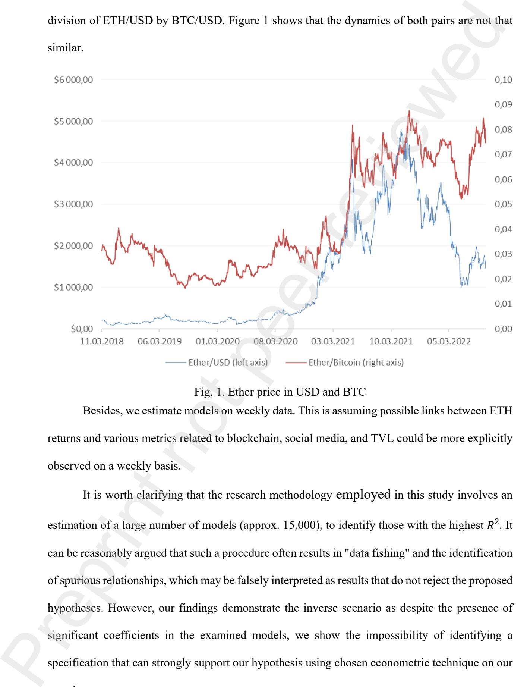

# **Return factors of Ether cryptocurrency: on chain metrics and DeFi Kirill Shilov1(c), Andrey Zubarev2**

# **ABSTRACT**

In this study, we analyse whether such inner features of Ethereum blockchain as creation of smart contracts and decentralized applications influence in any way the price dynamics of Ethereum's native cryptocurrency Ether or the latter can be mainly explained by the cryptocurrency market movements. Our results show that various on-chain metrics and total value locked in Ethereum's DeFi protocols are almost insignificantly correlated with Ether returns on daily and weekly data. The corresponding regression models are also not able to explain a sufficient part of the variation of Ether returns relative to USD and BTC. Preprint not peer reviewed

*Keywords:* cryptocurrency; blockchain; Ethereum; Bitcoin; financial markets; financial assets.

*JEL codes:* G12, G15, C52

## **Declaration of interest**s

None.

# **CRediT authorship contribution statement**

**Kirill Shilov**: Methodology, Data curation, Software, Formal analysis, Writing – original draft, Formal analysis, Investigation. **Andrey Zubarev**: Conceptualization, Validation, Writing - Review & Editing, Supervision, Project administration.

## **Acknowledge**

Authors would like to thank participants of the Crypto Assets and Digital Asset Investment Conference in Rennes School of Business (April 7-8, 2022), and especially a discussant José Manuel Carbó (Banco de España) for valuable comments.

1(c) Kirill Dmitrievich Shilov — The Gaidar Institute, Moscow, Russia, shilov@iep.ru

Corresponding author, present postal address: 11 rue de Nice, 67400 Illkirch-Graffenstaden, France Andrey Vitalievich Zubarev — The Gaidar Institute, Moscow, Russia, [texxik@gmail.com](mailto:texxik@gmail.com)

#### **Return factors of Ether cryptocurrency: on chain metrics and DeFi**

### **ABSTRACT**

In this study, we analyse whether such inner features of Ethereum blockchain as creation of smart contracts and decentralized applications influence in any way the price dynamics of Ethereum's native cryptocurrency Ether or the latter can be mainly explained by the cryptocurrency market movements. Our results show that various on-chain metrics and total value locked in Ethereum's DeFi protocols are almost insignificantly correlated with Ether returns on daily and weekly data. The corresponding regression models are also not able to explain a sufficient part of the variation of Ether returns relative to USD and BTC.

*Keywords:* cryptocurrency; blockchain; Ethereum; Bitcoin; financial markets; financial assets.

*JEL codes:* G12, G15, C52

#### **1 INTRODUCTION**

Currently, a consensus has been established that cryptocurrencies are a distinct exotic class of financial assets (Corbert et al., 2019). Amongst all cryptocurrencies, Bitcoin has been the most popular subject of research, as it has been investigated as a means of exchange (Foley, 2019; Luckner, 2021), a store of value (like gold) and as a safe-haven asset (Shahzad et al., 2019; Smales, 2019). In papers where multiple cryptocurrencies have been studied (e.g., Sovbetov, 2018; Liu and Tsyvinsky, 2022), their technical and functional characteristics have usually not been taken into consideration. Unlike Bitcoin, Ethereum has never been positioned as a means of payment or digital gold, however its native cryptocurrency called Ether (ETH) traditionally is the second largest digital currency in terms of capitalization behind Bitcoin. Ethereum, in turn, is a blockchain platform that serves as a tangible software product and functions as a decentralized software development environment. It has the capability to build whole services and protocols, referred to as decentralized applications (dApps), through the utilization of specific pieces of code known as smart contracts. The latter are also used to create new cryptocurrencies (tokens) without necessity of developing a whole new blockchain for it. Preprint not peer reviewed

For a long time, Ethereum has been the most popular blockchain platform in terms of number of dApps created, active users and tokens – stablecoins, utility tokens and non-fungible tokens (NFT) – built on it1 . It's also still a dominant platform for decentralized finance applications (DeFi).2 Consequently, a logical question arises, which is the main objective of this article: does the market price the fundamental characteristics of Ethereum as a digital platform for creating decentralized applications in dynamics of Ether, or does the dynamics of Ether merely reflect the general sentiments of investors regarding the cryptocurrency market? The answer to this question is also directly related to the search for possible fundamental factors determining the price formation of the cryptocurrency Ether.

The rest of the paper is organized as follows. Section 2 contains a brief literature review. Section 3 presents the data and methodology used in this study. Section 4 provides estimation results, while section 5 provides discussion and summarizes the paper.

### **2 LITERATURE REVIEW**

As Urquhart (2021) reasonably noticed, the academic literature hasn't given Ethereum enough attention. Usually Ether is treated as "some other than Bitcoin cryptocurrency" in line with Litecoin, Ripple (XRP), Monero, Stellar or whatsoever (e.g., Liu and Tsyvinsky, 2022; Gil-Alana et. al., 2020) or as a part of different factors portfolios (e.g., Daniel et. al., 2020; Liu and Tsyvinsky, 2022; Jia et al.). However only a few papers have their focus on the Ethereum specifically. In Kim et al. (2021) and Jagannath et al. (2021), the authors utilised machine and deep learning methods to demonstrate the significance of various blockchain metrics of Ethereum in predicting future returns of the cryptocurrency Ether. Alexander et al. (2020) conducted an analysis of the mechanism of establishing an appropriate spot price of Ether (price discovery mechanism) and explored the microstructure of the cryptocurrency market. Preprint not peer reviewed

1 https://dappradar.com/blog/2020-dapp-industry-report

https://dappradar.com/blog/2021-dapp-industry-report

2 Approximately 60% of all funds deposited in DeFi protocols (the total value locked) are on the Ethereum blockchain., according to data provided by defillama.com as for 02.02.2023.

In the context of Ethereum as a blockchain platform it's worth mentioning only studies which analyse different aspects of NFT3 and DeFi sectors. In the study by Dowling (2022), the author analysed the relationship between NFT-platform tokens and conventional cryptocurrencies and concluded that there is no significant transfer of volatility between them. The research by Karim et al. (2022) identified a connection between traditional cryptocurrency markets and DeFitoken markets, however, the NFT-token market was found to be somewhat isolated, indicating that NFT-tokens have potential for diversification. In the study by Yousaf and Ali (2021), the relationship of cryptocurrency returns and volatility with traditional financial assets, as well as NFT and DeFi tokens, was analysed. The authors highlighted the benefits of incorporating NFT and DeFi tokens into investment portfolios as it may significantly reduce investment portfolio risk. Another recent paper by Yousaf and Yarovaya (2022) investigated the relationships between the returns of a group of DeFi tokens and exchange rates of several fiat currencies (Chinese yuan, Japanese yen, euro, and pounds sterling) to the US dollar. The authors found an increase in the relationship between DeFi tokens and traditional currencies after the start of the COVID-19 pandemic in early 2020.4 The research by Corbet et al. (2022) showed that investor attention is a dominant driver of DeFi prices and DeFi is a separate asset class, different from mainstream cryptocurrencies. Ante (2022) investigated the interrelationships between NFT sales, NFT users (unique active blockchain wallets), and the pricing of Bitcoin and Ether. The results showed that a Bitcoin price shock triggers an increase in NFT sales, while Ether price shocks reduce the number of active NFT wallets. The author concluded that the cryptocurrency markets affect the growth and development of the NFT market, but there is no reverse effect. Preprint not peer reviewed

### **3 DATA AND METHODOLOGY**

We obtained the data on Ether and Bitcoin prices as well as Ether trading volumes from

3 Also, worth mentioning a noticeable systematic review of NFT related papers done by Bao and Roubaud

4 In Shilov and Zubarev (2021) a similar situation shown for Bitcoin.

coingecko.com5 . Various blockchain metrics were obtained from etherescan.com and were enriched with the data from the Ethereum blockchain itself6 . We also used API from Cryptocompare.com (CC) to add some additional blockchain metrics, such as average transaction value and large (>100,000 USD) transaction count. Moreover, CC's API has «Social Data» endpoint, which contains a lot of information from different social networks – Twitter, Reddit, Facebook, Github – regarding chosen cryptocurrency and statistics on the number of views, likes and comments on CC page of corresponding cryptocurrency as well. However, close investigation revealed a bad quality of Twitter, Facebook and Github data – it's clearly seen that the information from these networks hasn't been updated since 11/05/2018, 05/03/2020 and 09/09/2021 respectively. Total value locked (TVL) in DeFi protocols and applications was obtained from DeFiLlama.com7 . The full list of 39 variables under consideration is presented in Appendix A (Table A.1). Preprint not peer reviewed

The shortest series in our possession are TVL indicators, the first observation for which is available only from 11/03/2018, so we use the sample from 11/03/2018 to 15/09/2022, which gives us 1413 points. The end of our sample is the day of the global Ethereum update ("The Merge") which has changed the consensus algorithm from Proof-Of-Work to Proof-Of-Stake. Descriptive statistics of the data used is presented in Appendix A (Table A.2).

All variables were transformed to log returns/differences ln (���� ����―1) for daily data. As far as weekly observations are concerned, all data were transformed in similar fashion: crypto prices and TVL we turned into log returns between two subsequent Sundays, while for other metrics we used log difference of mean weekly value8 or log difference of weekly sums9 .

5 Taking into consideration the necessity of 1 time shift of data after 30/01/2018 as it is pointed by Alexander and Dakos (2020)

6 Accessed through the publicly available database in Google BigQuery, DatasetID: bigquery-publicdata.crypto\_ethereum

7 DefiLlama receives cryptocurrency prices also from coingecko.com, so we also adjusted TVL metrics as prices by 1 time shift of data after 30/01/2018.

8 For variables like trading volume, transactions, unique addresses, gas used, total transaction fee paid, number of tokens transferred, number of new smart contracts, all social metrics from CC (except for reddit active users).

9 For variables like block size, average gas price, number of active addresses, hashrate, difficulty, TVL, reddit

To answer our main research question, we employed the following research strategy. First, we will estimate a set of linear regression models for Ether returns whereby every feasible combination of our other variables (limited up to 4 variables at a time, without BTC returns) is employed as exogenous regressors.

$$r_{eth} = \alpha + \sum_{k=1}^4 \beta_k x_k + \epsilon$$

To avoid potential multicollinearity, we don't include pairs of variables with an absolute correlation coefficient greater than 0.6 in the same combination of regressors.10 Then we sort all the models by the coefficient of determination (�� 2 ) and analyse 3 best models. After that, we add BTC returns to a pool of regressors used, repeat the procedure one more time and analyse new results comparing them with the previous ones.

We expect that some blockchain, social and TVL metrics can show statistical significance and can explain some part of Ether returns variation through different channels. For example, if many new smart contracts serving decentralized applications are launched on the network, and network participants use them by interacting with them by depositing its Ether or any other ERC-20 tokens, then the demand for Ether as a means for buying and paying commissions for relevant actions may grow. This may result in an increase in the price of Ether relative to the US dollar.11 Other sign of popularity of Ethereum blockchain usage is the TVL which represent values of all tokens allocated in DeFi services, so an increase in TVL may be accompanied by an increase of Ether capitalisation. At the same time, if all these metrics are insignificant in models with BTC returns as an exogenous variable we can conclude that the dynamics of Ether is mainly associated with the dynamics of BTC which we use as a proxy for general sentiment regarding the whole cryptocurrency market. Preprint not peer reviewed

To exclude potential common component in dynamics of ETH and BTC, we additionally

posts and active users, etc.

10 Correlation matrixes of daily and weekly returns also presented in Appendix B

11 Similar logic is also discussed in Kim et. al. (2021).

estimate models where the dependent variable is the ETH/BTC rate which is calculated by direct division of ETH/USD by BTC/USD. Figure 1 shows that the dynamics of both pairs are not that similar.

Fig. 1. Ether price in USD and BTC

Besides, we estimate models on weekly data. This is assuming possible links between ETH returns and various metrics related to blockchain, social media, and TVL could be more explicitly observed on a weekly basis.

It is worth clarifying that the research methodology employed in this study involves an estimation of a large number of models (approx. 15,000), to identify those with the highest �� 2 . It can be reasonably argued that such a procedure often results in "data fishing" and the identification of spurious relationships, which may be falsely interpreted as results that do not reject the proposed hypotheses. However, our findings demonstrate the inverse scenario as despite the presence of significant coefficients in the examined models, we show the impossibility of identifying a specification that can strongly support our hypothesis using chosen econometric technique on our sample.

### **4 ESTIMATION RESULTS**

Table 1 presents results of 5 best models in terms of �� 2 from 48,072 estimated models for daily ETH/USD returns. Only 20 of those models have an adjusted �� 2 equal to or higher than 0.05. Amongst top 5 models there are only 3 significant variables – trading volume (tvol), number of daily active addresses (active\_addr) and number of followers on CC page. Despite their significance on 1% level, the coefficients are relatively small12 and could explain only a fraction of ETH/USD variation with maximum �� 2 = 0.0557. For example, 1 percent increase in daily Ether crypto exchange volume is associated only with 0.03%–0.034% increase in Ether price.

Table 1 – Estimations of ETH/UDS returns models, daily data.

|                                  | 1         | 2         | 3         | 4         | 5         |
|----------------------------------|-----------|-----------|-----------|-----------|-----------|
| tvol                             | 0.0316*** | 0.0334*** | 0.0335*** | 0.0342*** | 0.0304*** |
| average_transaction_valu e_cc | -0.03     | -0.0281   | -0.0282   | -0.0282   | -0.0304   |
| posts                            | -15.222   | -14.6679  | -14.6661  | -22.598   |           |
| active_addr                      | 0.0636*** |           |           |           | 0.062***  |
| tvl_eth                          |           | 0.0289    |           |           |           |
| tvl_all                          |           |           | 0.0278    |           |           |
| followers                        |           |           |           | 19.497*** |           |
| reddit_comments_ per_day      |           |           |           |           | -0.0131   |
| $R_{adj}^2$                      | 0.0557    | 0.0545    | 0.0538    | 0.053     | 0.0529    |

Notes: \*\*\*, \*\*, \* — significance of 1%, 5% and 10% level respectively. Coefficients significance obtained using robust errors. Number of observations – 1412.

Table 2 shows results for the same models, but with the addition of BTC/USD returns as a regressor (6,753 more models were estimated). The addition of BTC returns drastically raised adjusted �� 2 from 0.05 to 0.71. Minimum �� 2 for models with BTC/USD is equal to 0.6934. The ������ coefficient is significant and consistently higher than 1 (from 1.078 to 1.112) in all estimated models. On average, 1% increase in BTC price is associated with 1.09% increase in ETH price. This fact can reflect the perception of Ether as a riskier cryptocurrency than Bitcoin. Exchange trading volume and number of large transactions are also statistically significant in 5 best models, however �������� coefficient is twice lower than in models without BTC returns. Preprint not peer reviewed

12 For "followers" variable this coefficient is quite small given the mean value of "followers" daily log difference 0.0004 and standard deviation of 0.0003

Table 2 – Estimations of ETH/USD returns models with BTC, daily data.

|                            | 1         | 2         | 3         | 4         | 5         |
|----------------------------|-----------|-----------|-----------|-----------|-----------|
| btc                        | 1.097***  | 1.1052*** | 1.0985*** | 1.0978*** | 1.1027*** |
| reddit_posts_per_day       | -0.0148   | -0.0168   | -0.0156   | -0.0158   | -0.016    |
| tvol                       | 0.0177*** |           | 0.0168*** | 0.0164*** | 0.0165*** |
| posts                      | -10.5414  | -10.2748  |           |           |           |
| large_transaction_count_cc |           | 0.0128*** |           |           |           |
| points                     |           |           | -9.2848   |           |           |
| comments                   |           |           |           | -6.2942   |           |
| trades_page_views          |           |           |           |           | -12.1013  |
| $R_{adj}^2$                | 0.7137    | 0.7125    | 0.7115    | 0.7109    | 0.7107    |

Notes: \*\*\*, \*\*, \* — significance of 1%, 5% and 10% level respectively. Coefficients significance obtained using robust errors. Number of observations – 1412.

Results of 5 best models with ETHBTC daily returns as a dependent variable are provided in table 3. Overall, we’ve estimated 48,092 such models and only 303 of them had  $R^2$  higher than 0.05 with the maximum value of 0.0707. Trading volume have almost the same values as in models with BTC, while coefficients for *followers* and *active\_addr* are half the values of those observed in table **Error! Reference source not found..** There are also significant variables such as *hashrate*, *difficulty*, and *uni\_addr*, however they don’t deliver much to the explanatory power of the models.

Table 3 – Estimations of ETH/BTC returns models, daily data.

|                      | 1          | 2         | 3         | 4         | 5         |
|----------------------|------------|-----------|-----------|-----------|-----------|
| tvol                 | 0.0179***  | 0.0178*** | 0.0168*** | 0.0179*** | 0.0183*** |
| posts                | -15.7661   | -11.0678  | -11.2228  | -11.0154  | -13.6878  |
| reddit_posts_per_day | -0.0134    | -0.0143   | -0.0157   | -0.0142   | -0.0134   |
| followers            | 11.2103*** |           |           |           |           |
| difficulty           |            | 0.059***  |           |           |           |
| active_addr          |            |           | 0.0305*** |           |           |
| hashrate             |            |           |           | 0.0583*** |           |
| uni_addr             |            |           |           |           | 5.4305*** |
| $R_{adj}^2$          | 0.0707     | 0.0701    | 0.0696    | 0.069     | 0.068     |

Note. \*\*\*, \*\*, \* — significance of 1%, 5% and 10% level respectively. Coefficients significance obtained using robust errors. Number of observations – 1412.

Estimation of weekly models generally exhibits similar pattern. We’ve estimated 40,584 models from which 3,827 have  $R^2$  higher than 0.05. According to table 4, a maximum  $R^2$  that we’ve gotten is 0.0919 with only one significant coefficient in the corresponding model. Off all

regressors in table 4 only ������������\_�������� exhibits somewhat stable significance – this variable is significant in 94% of models in which it appears. Other variables are not that stable and insignificant in most cases.

Table 4 – Estimations of ETH/USD returns models, weekly data.

|                                  | 1         | 2         | 3         | 4        | 5         |
|----------------------------------|-----------|-----------|-----------|----------|-----------|
| average_transaction_ value cc | -0.1059   | -0.0591   | -0.0615   | -0.0873  | -0.0621   |
| active addr                      |           | 0.1687*** | 0.1615*** | 0.1008   | 0.2011*** |
| ave gas price                    | -0.0347   |           |           | -0.0224  |           |
| veri contracts                   | -0.0525   |           | -0.0361   |          |           |
| large_transaction_ count cc   | 0.0846*** |           |           | 0.0536** |           |
| tvol                             |           |           | 0.0271    |          | 0.031     |
| uni_addr                         |           | 1.5048*** |           |          |           |
| influence_page_views             |           | -5.5683   |           |          |           |
| trans tk erc20                   |           |           |           |          | -0.0642   |
| $R_{adj}^2$                      | 0.0919    | 0.0915    | 0.0871    | 0.0858   | 0.0857    |

Table 5 – Estimations of ETH/UDS returns models with BTCUSD, weekly data.

| insignificant in most cases.                                                                                           |                                                                    |
|------------------------------------------------------------------------------------------------------------------------|--------------------------------------------------------------------|
| average_transaction_                                                                                                   | 1 2 3 4 5                                                          |
| value_cc                                                                                                               | -0.1059 -0.0591 -0.0615 -0.0873 -0.0621                            |
| active_addr                                                                                                            | 0.1687*** 0.1615*** 0.1008 0.2011***                               |
| ave_gas_price                                                                                                          | -0.0347 -0.0224                                                    |
| veri_contracts large_transaction_                                                                                      | -0.0525 -0.0361                                                    |
| count_cc                                                                                                               | 0.0846*** 0.0536**                                                 |
| tvol                                                                                                                   | 0.0271 0.031                                                       |
| uni_addr                                                                                                               | 1.5048***                                                          |
| influence_page_views                                                                                                   | -5.5683                                                            |
| trans_tk_erc20                                                                                                         | -0.0642                                                            |
| ������ ��                                                                                                              | 0.0919 0.0915 0.0871 0.0858 0.0857                                 |
| increase of ��                                                                                                         |                                                                    |
| coefficient on the variable ������                                                                                     | was found to be statistically significant and exceeded the value o |
| 1, ranging from 1.04 to 1.11. These values are close to the coefficients reported in Table Reference source not found. | Error                                                              |
|                                                                                                                        | 1 2 3 4 5                                                          |
| btc reddit_posts_                                                                                                      | 1.0701*** 1.1026*** 1.1032*** 1.0733*** 1.1019***                  |
| per_day                                                                                                                | -0.0454 -0.0382 -0.0383 -0.0382 -0.0386                            |
| tvol                                                                                                                   | 0.0278*** 0.0367*** 0.0374*** 0.036***                             |
| active_addr trades_page_                                                                                               | 0.093*** 0.0848**                                                  |
| views markets_page_                                                                                                    | -1.1364                                                            |
| views                                                                                                                  | -1.6074                                                            |
| large_transaction_count_cc                                                                                             | 0.0172                                                             |
| forum_page_views                                                                                                       | -0.7136                                                            |
| ������ ��                                                                                                              | 0.6955 0.6891 0.6888 0.6884 0.6883                                 |
| Best models 5 in terms of                                                                                              | ��                                                                 |

1,065 models from 40,584 estimated exhibit �� 2 larger than 0.05. Trading volume as well as number of active addresses are consistently statistically significant in almost all models with quiet stable coefficients around 0.03 and 0.095 respectively.

Table 6 – Estimations of ETH/BTC returns models, weekly data.

|  | 1                    | 2         | 3         | 4         | 5         |           |
|--|----------------------|-----------|-----------|-----------|-----------|-----------|
|  | tvol                 | 0.0298*** | 0.0304*** | 0.0292*** | 0.0292*** | 0.0287*** |
|  | active addr          | 0.0977*** | 0.0988*** | 0.097***  | 0.0959*** | 0.0972*** |
|  | reddit_posts_per_day | -0.0423   | -0.0424   | -0.0431   | -0.0427   | -0.0427   |
|  | trades_page_views    | -0.9692   |           |           |           |           |
|  | markets_page_views   | -1.401    |           |           |           |           |
|  | comments             |           | -0.4853   |           |           |           |
|  | forum_page_views     |           |           | -0.5552   |           |           |
|  | points               |           |           |           | -0.5834   |           |
|  | $R_{adj}^2$          | 0.0997    | 0.0996    | 0.0963    | 0.096     | 0.0949    |

Note. \*\*\*, \*\*, \* — significance of 1%, 5% and 10% level respectively. Coefficients significance obtained using robust errors. Number of observations – 195.

### **5 DISCUSSSION AND RESULTS**

Based on the results of more than 200,000 estimated linear regressions using daily and weekly data, we have shown that the dynamics of Ethereum's native cryptocurrency Ether is mostly correlated with general sentiment regarding the market of digital assets. We have proxied this sentiment using the prices of the most popular and liquid cryptocurrency, Bitcoin. Almost all of the 37 collected variables which reflect network utilisation, transactional and user activity, as well as some social interest, turned out to be insignificant. Some of the variables, such as trading volume and the number of active addresses, are significant on both daily and weekly data and even in explaining ETH/BTC returns in most cases. However, their contribution to the explanation of Ether's returns variation turns out to be negligible. It's also quite remarkable that the total value locked in DeFi applications also turned out to be insignificant, regardless of the rise of this sector in our sample. Preprint not peer reviewed

In this study, we have used a simple econometric tool, and it is possible to assume that the relationship between blockchain metrics and Ether price is more complex than linear model. Further research with more sophisticated statistical methods could probably prove that market prices the fundamental characteristics of Ethereum as a digital platform for creating decentralized applications in dynamics of Ether. However, our findings suggest that the price dynamics of the Ether cryptocurrency remain more susceptible to the speculative component inherent in the entire cryptocurrency market.

## **REFERENCES**

- 1. Alexander C., Choi J., Massie H.R.A., Sohn S. Price discovery and microstructure in ether spot and derivative markets // International Review of Financial Analysis.– 2020.– V. 71.– PP. 101506, https://doi.org/10.1016/j.irfa.2020.101506
- 2. Alexander C., Dakos M. A critical investigation of cryptocurrency data and analysis // Quantitative Finance.– 2020.– V. 20, № 2.– PP. 173–188, https://doi.org/10.1080/14697688.2019.1641347
- 3. Ante L. The Non-Fungible Token (NFT) Market and Its Relationship with Bitcoin and Ethereum // FinTech.– 2022.– V. 1, № 3.– PP. 216–224, https://doi.org/10.3390/fintech1030017
- 4. Bao H., Roubaud D. Non-Fungible Token: A Systematic Review and Research Agenda // Journal of Risk and Financial Management.– 2022.– V. 15, № 5.– PP. 215, https://doi.org/10.3390/jrfm15050215
- 5. Corbet S., Lucey B., Urquhart A., Yarovaya L. Cryptocurrencies as a financial asset: A systematic analysis // International Review of Financial Analysis.– 2019.– V. 62.– PP. 182–199, https://doi.org/10.1016/j.irfa.2021.101781
- 6. Corbet S., Goodell J.W., Günay S. What drives DeFi prices? Investigating the effects of investor attention // Finance Research Letters. – 2022.– V. 48.– PP. 102883, https://doi.org/10.1016/j.frl.2022.102883
- 7. Daniel K., Mota L., Rottke S., Santos T. The Cross-Section of Risk and Returns // The Review of Financial Studies.– 2020.– V. 33, № 5.– PP. 1927–1979, https://doi.org/10.1093/rfs/hhaa021
- 8. Dowling M. Is non-fungible token pricing driven by cryptocurrencies? // Finance Research Letters.– 2022.– V. 44.– PP. 102097, https://doi.org/10.1016/j.frl.2021.102097
- 9. Foley S., Karlsen J.R., Putniņš T.J. Sex, Drugs, and Bitcoin: How Much Illegal Activity Is Financed through Cryptocurrencies? // The Review of Financial Studies.– 2019.– V. 32, № 5.– PP. 1798–1853 https://doi.org/10.1093/rfs/hhz015
- 10. Gil-Alana L.A., Abakah E.J.A., Rojo M.F.R. Cryptocurrencies and stock market indices. Are they related? // Research in International Business and Finance.– 2020.– V. 51.– PP. 101063, https://doi.org/10.1016/j.ribaf.2019.101063
- 11. Jagannath N., Barbulescu T., Sallam K.M., Elgendi I., Mcgrath B., Jamalipour A., Abdel-Basset [P](https://doi.org/10.1016/j.ribaf.2019.101063)r[ep](https://doi.org/10.1093/rfs/hhz015)rin[t](https://doi.org/10.1016/j.frl.2022.102883) [n](https://doi.org/10.1016/j.frl.2022.102883)[ot](https://doi.org/10.1016/j.irfa.2021.101781) pe[er](https://doi.org/10.3390/fintech1030017) reviewed

- M., Munasinghe K. An On-Chain Analysis-Based Approach to Predict Ethereum Prices // IEEE Access.– 2021.– V. 9.– PP. 167972–167989, https://doi.org/10.1109/ACCESS.2021.3135620
- 12. Jia B., Goodell J.W., Shen D. Momentum or reversal: Which is the appropriate third factor for cryptocurrencies? // Finance Research Letters.– 2022.– V. 45.– PP. 102139, https://doi.org/10.1016/j.frl.2021.102139
- 13. Karim S., Lucey B.M., Naeem M.A., Uddin G.S. Examining the interrelatedness of NFTs, DeFi tokens and cryptocurrencies // Finance Research Letters. – 2022.– PP. 102696, https://doi.org/10.1016/j.frl.2022.102696
- 14. Kim H.-M., Bock G.-W., Lee G. Predicting Ethereum prices with machine learning based on Blockchain information // Expert Systems with Applications.– 2021.– V. 184.– PP. 115480, https://doi.org/10.1016/j.eswa.2021.115480
- 15. Liu Y., Tsyvinski A. Risks and Returns of Cryptocurrency // The Review of Financial Studies.– 2021. – V. 34. – № 6. – p. 2689–2727, https://doi.org/10.1093/rfs/hhaa113
- 16. Liu Y., Tsyvinski A., Wu X. Common risk factors in cryptocurrency // The Journal of Finance.– 2022.– V. 77, № 2.– PP. 1133–1177, https://doi.org/10.1111/jofi.13119
- 17. von Luckner C. G., Reinhart C. M., Rogoff K. S. Decrypting new age international capital flows. – National Bureau of Economic Research, 2021. – №. w29337. https://doi.org/10.3386/w29337
- 18. Shahzad S.J.H., Bouri E., Roubaud D., Kristoufek L., Lucey B. Is Bitcoin a better safe-haven investment than gold and commodities? // International Review of Financial Analysis.– 2019.– V. 63.– PP. 322–330, https://doi.org/10.1016/j.irfa.2019.01.002
- 19. Shilov K. D., Zubarev A. V. Evolution of Bitcoin as a financial asset. // Finance: Theory and Practice. – 2021.– V. 25, № 5.– PP. 150–171, https://doi.org/10.26794/2587-5671-2021-25-5-150- 171
- 20. Smales L.A. Bitcoin as a safe haven: Is it even worth considering? // Finance Research Letters.– 2019.– V. 30.– PP. 385–393, https://doi.org/10.1016/j.frl.2018.11.002
- 21. Sovbetov Y. Factors influencing cryptocurrency prices: Evidence from bitcoin, ethereum, dash, litcoin, and monero // Journal of Economics and Financial Analysis.– 2018.– V. 2, № 2.– PP. 1–27, https://doi.org/10.1991/jefa.v2i2.a16
- 22. Urquhart A. Under the hood of the Ethereum blockchain // Finance Research Letters.– 2021. –
- V. 41. PP. 102628, https://doi.org/10.1016/j.frl.2021.102628
- 23. Yousaf I., Ali S. Linkages between stock and cryptocurrency markets during the COVID-19 outbreak: An intraday analysis // The Singapore Economic Review.– 2021.– PP. 1–20, https://doi.org/10.1142/S0217590821470019
- 24. Yousaf I., Yarovaya L. Static and dynamic connectedness between NFTs, Defi and other assets: [P](https://doi.org/10.1142/S0217590821470019)re[pr](https://doi.org/10.1991/jefa.v2i2.a16)int n[ot](https://doi.org/10.1016/j.irfa.2019.01.002) pe[er](https://doi.org/10.1111/jofi.13119) [r](https://doi.org/10.1093/rfs/hhaa113)eviewe[d](https://doi.org/10.1109/ACCESS.2021.3135620)

Portfolio implication // Global Finance Journal.– 2022.– V. 53.– PP. 100719, https://doi.org/10.1016/j.gfj.2022.100719 Preprint not peer reviewed

# **APPENDIX A**

Table A.1 – List of variables used.

| Table A.1 – List of variables used. | Preprint not peer reviewed                                                                                                                                            |                                     |
|-------------------------------------|-----------------------------------------------------------------------------------------------------------------------------------------------------------------------|-------------------------------------|
| Variable                            | Description                                                                                                                                                           | Source                              |
| eth                                 | ETH price, USD                                                                                                                                                        | coingecko.com                       |
| btc                                 | BTC price, USD                                                                                                                                                        | coingecko.com                       |
| tvol                                | Ether trading volume, USD                                                                                                                                             | coingecko.com                       |
| transactions                        | Daily number of transactions in Ethereum                                                                                                                              |                                     |
|                                     | blockchain                                                                                                                                                            | etherscan.io                        |
| uni_addr                            | The total distinct numbers of address on the                                                                                                                          |                                     |
|                                     | Ethereum blockchain                                                                                                                                                   | etherscan.io                        |
| block_size                          | Average block size, bytes                                                                                                                                             | etherscan.io                        |
| ave_gas_price                       | Average Gas Price, ETH                                                                                                                                                | etherscan.io                        |
| gas_used                            | Daily Gas Used, gas                                                                                                                                                   | etherscan.io                        |
| active_addr                         | Daily active Ethereum addresses                                                                                                                                       | etherscan.io                        |
| active_erc20_addr                   | Daily active ERC20 token addresses                                                                                                                                    | etherscan.io                        |
| ave_trans_fee_usd                   | The daily average amount in USD spent per                                                                                                                             |                                     |
|                                     | transaction, USD                                                                                                                                                      | etherscan.io                        |
| hashrate                            | Network Hash Rate, GH/s                                                                                                                                               | etherscan.io                        |
| difficulty                          | Network difficulty, TH                                                                                                                                                | etherscan.io                        |
| trans_fee                           | Total number of ETH paid as transaction fee                                                                                                                           | etherscan.io                        |
| veri_contracts                      | The total number of smart contracts verified                                                                                                                          |                                     |
|                                     | daily                                                                                                                                                                 | etherscan.io                        |
| trans_erc20                         | The number of ERC20 tokens transferred daily                                                                                                                          | etherscan.io                        |
| trans_tk_erc20                      | The number of ERC20 tokens transferred daily                                                                                                                          | Ethereum blockchain                 |
| trans_tk_nft                        | The number of ERC721 tokens transferred                                                                                                                               |                                     |
|                                     | daily                                                                                                                                                                 | Ethereum blockchain                 |
| trans_tk_other                      | The number of tokens of other standards                                                                                                                               |                                     |
|                                     | transferred daily                                                                                                                                                     | Ethereum blockchain                 |
| contracts_new                       | The total number of contracts launched daily                                                                                                                          | Ethereum blockchain                 |
| large_transaction_count_cc          | Count of large (>100,000 USD) transactions                                                                                                                            |                                     |
|                                     | per day                                                                                                                                                               | Cryptocompare.com                   |
| average_transaction_value_cc        | Average transaction value denominated in the                                                                                                                          |                                     |
|                                     | Ether per day                                                                                                                                                         | Cryptocompare.com                   |
| tvl_eth                             | Total Value Locked in Ethereum blockchain, in                                                                                                                         |                                     |
|                                     | USD                                                                                                                                                                   | defillama.com                       |
| tvl_all                             | Total Value Locked in all blockchains, in USD                                                                                                                         | defillama.com                       |
| comments                            | The total number of posts/replies on the coin’s                                                                                                                       |                                     |
|                                     | CC page                                                                                                                                                               | Cryptocompare.com                   |
| posts                               | The number of posts on this coin’s CC page                                                                                                                            | Cryptocompare.com                   |
| followers points                    | The number of users following this coin on CC Total points scored for this coin on CC that day Points are awarded for different metrics on each social media platform | Cryptocompare.com Cryptocompare.com |
| overview_page_views                 | Numbers of views for the ‘Overview’ tab on                                                                                                                            |                                     |
|                                     | this coin’s CC page that day                                                                                                                                          | Cryptocompare.com                   |
| analysis_page_views                 | Number of views for the ‘Analysis’ tab on this                                                                                                                        |                                     |
|                                     | coin’s CC page that day                                                                                                                                               | Cryptocompare.com                   |
| markets_page_views                  | Numbers of views for the ‘Markets’ tab on this                                                                                                                        |                                     |
|                                     | coin’s CC page that day                                                                                                                                               | Cryptocompare.com                   |

| charts_page_views       | Number of views for the ‘Charts’ tab on this    |                   |
|-------------------------|-------------------------------------------------|-------------------|
|                         | coin’s CC page that day                         | Cryptocompare.com |
| trades_page_views       | Number of views for the ‘Trades’ tab on this    |                   |
|                         | coin’s CC page that day                         | Cryptocompare.com |
| forum_page_views        | Number of views for the ‘Forum’ tab on this     |                   |
|                         | coin’s CC page that day                         | Cryptocompare.com |
| influence_page_views    | Number of views for the ‘Influence’ tab on this |                   |
|                         | coin’s CC page                                  | Cryptocompare.com |
| total_page_views        | Total Number of page views for any tab on this  |                   |
|                         | coin’s CC page                                  | Cryptocompare.com |
| reddit_active_users     | The number of ‘active users’ (as determined by  |                   |
|                         | Reddit) in this coin’s sub-reddit that day      | Cryptocompare.com |
| reddit_posts_per_day    | The average number of posts per day in this     |                   |
|                         | coin’s sub-reddit as of that day                | Cryptocompare.com |
| reddit_comments_per_day | The number of times this repository had been    |                   |
|                         | starred as of that day                          | Cryptocompare.com |

Table A.2 – Descriptive statistics of variables

| Variable                              | charts_page_views trades_page_views forum_page_views influence_page_views total_page_views reddit_active_users reddit_posts_per_day reddit_comments_per_day min | mean        | coin’s CC page that day coin’s CC page that day coin’s CC page that day coin’s CC page coin’s CC page coin’s sub-reddit as of that day starred as of that day median | max          | sd          | Cryptocompare.com Cryptocompare.com Cryptocompare.com Cryptocompare.com Cryptocompare.com Cryptocompare.com Cryptocompare.com Cryptocompare.com skewne ss | kurtos is |
|---------------------------------------|-----------------------------------------------------------------------------------------------------------------------------------------------------------------|-------------|----------------------------------------------------------------------------------------------------------------------------------------------------------------------|--------------|-------------|-----------------------------------------------------------------------------------------------------------------------------------------------------------|-----------|
| eth                                   | 83,80                                                                                                                                                           | 1265,90     | 393,40                                                                                                                                                               | 4815,00      | 1326,10     | 0,88                                                                                                                                                      | -0,56     |
| btc                                   | 3216,60                                                                                                                                                         | 23143,30    | 11908,70                                                                                                                                                             | 67617,00     | 18236,80    | 0,68                                                                                                                                                      | -0,96     |
| tvol                                  | 1031402141,                                                                                                                                                     |             |                                                                                                                                                                      |              |             |                                                                                                                                                           |           |
|                                       |                                                                                                                                                                 |             |                                                                                                                                                                      |              | 1,90        | 2,78                                                                                                                                                      | 13,33     |
| transactions                          | 381151,00                                                                                                                                                       | 973567,60   | 1077884,00                                                                                                                                                           | 1716600,00   | 281509,10   | -0,23                                                                                                                                                     | -1,11     |
| uni_addr                              | 48470030,00                                                                                                                                                     | 123783046,1 |                                                                                                                                                                      |              |             |                                                                                                                                                           |           |
|                                       |                                                                                                                                                                 |             |                                                                                                                                                                      | 205410380,00 | 49807415,20 | 0,15                                                                                                                                                      | -1,40     |
| block_size                            | 13666,00                                                                                                                                                        | 46568,20    | 39041,00                                                                                                                                                             | 127467,00    | 26712,60    | 0,66                                                                                                                                                      | -0,90     |
| ave_gas_price                         | 7320700832,                                                                                                                                                     |             |                                                                                                                                                                      |              |             |                                                                                                                                                           |           |
|                                       |                                                                                                                                                                 |             |                                                                                                                                                                      |              | 2,20        | 2,98                                                                                                                                                      | 16,57     |
| gas_used                              | 2678619336                                                                                                                                                      |             |                                                                                                                                                                      |              |             |                                                                                                                                                           |           |
|                                       |                                                                                                                                                                 |             |                                                                                                                                                                      |              | 2,20        | -0,22                                                                                                                                                     | -1,51     |
| active_addr                           | 152762,00                                                                                                                                                       | 395174,60   | 406188,00                                                                                                                                                            | 1066898,00   | 135692,30   | 0,22                                                                                                                                                      | -0,61     |
| active_erc20_addr                     | 100960,00                                                                                                                                                       | 243604,30   | 241546,00                                                                                                                                                            | 1101901,00   | 61405,40    | 2,43                                                                                                                                                      | 27,58     |
| ave_trans_fee_usd                     | 0,00                                                                                                                                                            | 8,30        | 2,00                                                                                                                                                                 | 200,10       | 13,50       | 3,51                                                                                                                                                      | 30,05     |
| hashrate                              | 136800,30                                                                                                                                                       | 442369,20   | 256221,50                                                                                                                                                            | 1126674,30   | 325397,30   | 0,77                                                                                                                                                      | -1,02     |
| difficulty                            | 1717,00                                                                                                                                                         | 5724,00     | 3280,40                                                                                                                                                              | 15101,20     | 4219,70     | 0,81                                                                                                                                                      | -0,94     |
| trans_fee                             | 190,13                                                                                                                                                          | 2901,32     | 881,02                                                                                                                                                               | 42763,25     | 4563,20     | 3,17                                                                                                                                                      | 14,15     |
| veri_contracts                        | 15,00                                                                                                                                                           | 184,20      | 135,00                                                                                                                                                               | 650,00       | 140,10      | 1,04                                                                                                                                                      | 0,31      |
| trans_erc20                           | 204774,00                                                                                                                                                       | 620542,30   | 599509,00                                                                                                                                                            | 1370266,00   | 221800,50   | 0,22                                                                                                                                                      | -1,06     |
| trans_tk_erc20                        | 142284,00                                                                                                                                                       | 366364,60   | 354042,00                                                                                                                                                            | 817195,00    | 99979,70    | 0,39                                                                                                                                                      | -0,31     |
| trans_tk_nft                          | 194,00                                                                                                                                                          | 6554,50     | 4364,00                                                                                                                                                              | 29076,00     | 5631,40     | 0,93                                                                                                                                                      | 0,11      |
| trans_tk_other                        | 5814,00                                                                                                                                                         | 351029,40   | 391532,00                                                                                                                                                            | 3880899,00   | 285630,40   | 2,00                                                                                                                                                      | 19,36     |
| contracts_new large_transaction_count | 4826,00                                                                                                                                                         | 29989,30    | 18804,00                                                                                                                                                             | 269525,00    | 31163,10    | 3,13                                                                                                                                                      | 13,39     |
| _cc average_transaction_va            | 110,00                                                                                                                                                          | 3989,00     | 2446,00                                                                                                                                                              | 31775,00     | 4216,90     | 1,45                                                                                                                                                      | 3,04      |
| lue_cc                                | 0,90                                                                                                                                                            | 4,10        | 3,60                                                                                                                                                                 | 30,70        | 2,50        | 3,65                                                                                                                                                      | 27,69     |
| tvl_eth                               | 40551,80                                                                                                                                                        | 4084623846  |                                                                                                                                                                      |              |             |                                                                                                                                                           |           |
|                                       |                                                                                                                                                                 |             |                                                                                                                                                                      |              | 6,00        | 0,88                                                                                                                                                      | -0,66     |
| tvl_all                               | 40551,80                                                                                                                                                        | 6246928211  |                                                                                                                                                                      |              |             |                                                                                                                                                           |           |
|                                       |                                                                                                                                                                 |             |                                                                                                                                                                      |              | 2,60        | 0,98                                                                                                                                                      | -0,50     |

| comments                                  | 200393,00   | 380069,10   | 368452,00   | 545668,00   | 98525,50   | 0,03  | -1,17 |
|-------------------------------------------|-------------|-------------|-------------|-------------|------------|-------|-------|
| posts                                     | 82167,00    | 124542,40   | 123188,00   | 155900,00   | 20968,90   | -0,20 | -1,09 |
| followers                                 | 60732,00    | 84087,00    | 80039,00    | 106103,00   | 13800,00   | 0,18  | -1,29 |
| points                                    | 5576405,00  | 9016427,30  | 8765195,00  | 12006755,00 | 1850977,30 | 0,00  | -1,18 |
| overview_page_views                       | 20849401,00 | 31041134,00 | 30771283,00 | 38836077,00 | 5427316,50 | -0,18 | -1,24 |
| analysis_page_views                       | 917394,00   | 1109538,20  | 1103215,00  | 1255442,00  | 93498,90   | -0,12 | -1,00 |
| markets_page_views                        | 1341631,00  | 1597461,60  | 1613421,00  | 1719718,00  | 104115,40  | -0,69 | -0,61 |
| charts_page_views                         | 6813525,00  | 9572617,80  | 9579543,00  | 11318822,00 | 1277113,50 | -0,35 | -0,99 |
| trades_page_views                         | 637739,00   | 799160,80   | 806224,00   | 878628,00   | 66576,90   | -0,71 | -0,56 |
| forum_page_views                          | 5926163,00  | 9319982,00  | 9300970,00  | 11692984,00 | 1635197,20 | -0,27 | -1,06 |
| influence_page_views                      | 54250,00    | 63066,80    | 63177,00    | 68967,00    | 4168,10    | -0,35 | -0,99 |
| total_page_views                          | 36540103,00 | 53502961,30 | 53237833,00 | 65770638,00 | 8600857,90 | -0,23 | -1,17 |
| reddit_active_users                       | 0,00        | 5616,80     | 4753,00     | 31140,00    | 2867,80    | 2,20  | 8,96  |
| reddit_posts_per_day reddit_comments_per_ | 42,40       | 167,50      | 126,70      | 1308,30     | 116,10     | 3,00  | 15,34 |
| day                                       | 894,40      | 4468,40     | 3525,10     | 34838,70    | 3149,30    | 2,52  | 11,30 |

## **APPENDIX B**

Fig. B.1 – Correlation matrix of daily returns

| #  | Variable\#                   | 1     | 2     | 3     | 4     | 5     | 6     | 7     | 8     | 9     | 10    | 11    | 12    | 13    | 14    | 15    | 16    | 17    | 18    | 19    | 20    | 21    | 22    | 23    | 24    | 25    | 26    | 27    | 28    | 29    | 30    | 31    | 32    | 33    | 34    | 35    | 36    | 37    | 38    | 39    | 40    |
|----|------------------------------|-------|-------|-------|-------|-------|-------|-------|-------|-------|-------|-------|-------|-------|-------|-------|-------|-------|-------|-------|-------|-------|-------|-------|-------|-------|-------|-------|-------|-------|-------|-------|-------|-------|-------|-------|-------|-------|-------|-------|-------|
| 1  | eth                          |       | 0,65  | 0,03  | 0,83  | 0,01  | 0,05  | -0,02 | -0,11 | -0,02 | 0,09  | 0,02  | 0,04  | 0,06  | 0,05  | -0,10 | 0,04  | -0,04 | 0,04  | -0,06 | 0,05  | -0,04 | -0,13 | 0,05  | 0,10  | 0,10  | -0,10 | -0,11 | 0,02  | -0,09 | -0,03 | -0,02 | -0,04 | -0,03 | -0,05 | -0,08 | -0,06 | -0,04 | -0,08 | -0,05 | -0,10 |
| 2  | eth_btc                      | 0,65  |       | 0,08  | 0,13  | 0,00  | 0,02  | 0,00  | -0,04 | 0,00  | 0,06  | -0,01 | 0,06  | 0,08  | 0,09  | -0,03 | 0,01  | -0,03 | 0,03  | -0,04 | 0,01  | 0,03  | -0,06 | 0,03  | 0,06  | 0,06  | -0,12 | -0,16 | 0,00  | -0,12 | -0,10 | -0,05 | -0,09 | -0,05 | -0,10 | -0,11 | -0,07 | -0,10 | -0,10 | -0,16 | -0,10 |
| 3  | tvol                         | 0,03  | 0,08  |       | -0,01 | 0,24  | -0,03 | 0,24  | 0,35  | 0,13  | 0,13  | 0,06  | 0,36  | -0,04 | -0,03 | 0,30  | 0,07  | 0,17  | 0,03  | 0,24  | -0,14 | 0,62  | 0,54  | -0,27 | -0,03 | -0,03 | 0,13  | 0,20  | 0,05  | 0,16  | 0,14  | 0,04  | 0,12  | 0,07  | 0,14  | 0,15  | 0,07  | 0,14  | 0,13  | 0,29  | 0,15  |
| 4  | btc                          | 0,83  | 0,13  | -0,01 |       | 0,01  | 0,05  | -0,02 | -0,11 | -0,03 | 0,08  | 0,03  | 0,01  | 0,01  | 0,01  | -0,11 | 0,04  | -0,02 | 0,03  | -0,05 | 0,06  | -0,07 | -0,13 | 0,04  | 0,09  | 0,09  | -0,05 | -0,04 | 0,02  | -0,03 | 0,04  | 0,01  | 0,01  | 0,00  | 0,02  | -0,03 | -0,02 | 0,02  | -0,03 | 0,05  | -0,07 |
| 5  | transactions                 | 0,01  | 0,00  | 0,24  | 0,01  |       | -0,06 | 0,62  | 0,33  | 0,50  | 0,65  | 0,42  | 0,27  | -0,03 | -0,06 | 0,41  | 0,31  | 0,54  | 0,01  | 0,59  | -0,21 | 0,49  | 0,24  | -0,37 | 0,01  | 0,01  | 0,11  | 0,12  | 0,02  | 0,11  | 0,10  | 0,06  | 0,09  | 0,05  | 0,09  | 0,10  | 0,09  | 0,10  | 0,05  | 0,32  | 0,08  |
| 6  | uni_addr                     | 0,05  | 0,02  | -0,03 | 0,05  | -0,06 |       | -0,06 | -0,08 | -0,03 | 0,00  | -0,02 | -0,08 | 0,02  | 0,02  | -0,08 | -0,04 | -0,03 | -0,02 | -0,04 | 0,04  | -0,07 | -0,06 | 0,19  | 0,05  | 0,04  | 0,38  | 0,39  | 0,38  | 0,42  | 0,51  | 0,27  | 0,53  | 0,37  | 0,49  | 0,51  | 0,41  | 0,52  | 0,00  | -0,04 | 0,00  |
| 7  | block_size                   | -0,02 | 0,00  | 0,24  | -0,02 | 0,62  | -0,06 |       | 0,31  | 0,40  | 0,29  | 0,24  | 0,30  | 0,00  | 0,04  | 0,35  | 0,16  | 0,35  | 0,07  | 0,34  | -0,20 | 0,40  | 0,22  | -0,33 | 0,02  | 0,02  | 0,09  | 0,10  | 0,01  | 0,09  | 0,07  | 0,05  | 0,07  | 0,04  | 0,07  | 0,08  | 0,06  | 0,07  | 0,08  | 0,29  | 0,11  |
| 8  | ave_gas_price                | -0,11 | -0,04 | 0,35  | -0,11 | 0,33  | -0,08 | 0,31  |       | 0,15  | 0,07  | 0,08  | 0,94  | -0,01 | 0,01  | 0,82  | 0,10  | 0,14  | -0,01 | 0,21  | -0,26 | 0,42  | 0,36  | -0,37 | -0,02 | -0,02 | 0,08  | 0,11  | 0,01  | 0,09  | 0,09  | 0,02  | 0,06  | 0,04  | 0,07  | 0,08  | 0,03  | 0,08  | 0,10  | 0,27  | 0,09  |
| 9  | gas_used                     | -0,02 | 0,00  | 0,13  | -0,03 | 0,50  | -0,03 | 0,40  | 0,15  |       | 0,27  | 0,30  | 0,21  | -0,01 | -0,12 | 0,25  | 0,27  | 0,42  | 0,22  | 0,40  | -0,08 | 0,33  | 0,19  | -0,12 | -0,02 | -0,02 | 0,11  | 0,09  | 0,01  | 0,10  | 0,06  | 0,05  | 0,05  | 0,02  | 0,05  | 0,07  | 0,08  | 0,06  | -0,01 | 0,20  | 0,08  |
| 10 | active_addr                  | 0,09  | 0,06  | 0,13  | 0,08  | 0,65  | 0,00  | 0,29  | 0,07  | 0,27  |       | 0,24  | 0,01  | -0,01 | -0,05 | 0,14  | 0,26  | 0,16  | 0,08  | 0,17  | -0,10 | 0,32  | 0,13  | -0,12 | 0,03  | 0,03  | 0,08  | 0,09  | 0,03  | 0,08  | 0,07  | 0,05  | 0,07  | 0,04  | 0,06  | 0,07  | 0,05  | 0,07  | 0,01  | 0,22  | 0,06  |
| 11 | active_erc20_addr            | 0,02  | -0,01 | 0,06  | 0,03  | 0,42  | -0,02 | 0,24  | 0,08  | 0,30  | 0,24  |       | 0,05  | -0,06 | -0,08 | 0,12  | 0,23  | 0,84  | 0,25  | 0,66  | -0,13 | 0,17  | 0,06  | -0,13 | 0,01  | 0,01  | 0,03  | -0,01 | -0,01 | 0,01  | 0,01  | 0,01  | 0,00  | 0,00  | -0,01 | 0,01  | 0,04  | 0,01  | 0,02  | 0,13  | 0,04  |
| 12 | ave_trans_fee_usd            | 0,04  | 0,06  | 0,36  | 0,01  | 0,27  | -0,08 | 0,30  | 0,94  | 0,21  | 0,01  | 0,05  |       | 0,00  | 0,02  | 0,85  | 0,08  | 0,11  | 0,01  | 0,17  | -0,26 | 0,43  | 0,36  | -0,38 | -0,01 | -0,01 | 0,07  | 0,11  | 0,02  | 0,09  | 0,08  | 0,02  | 0,06  | 0,04  | 0,06  | 0,07  | 0,02  | 0,08  | 0,08  | 0,26  | 0,09  |
| 13 | hashrate                     | 0,06  | 0,08  | -0,04 | 0,01  | -0,03 | 0,02  | 0,00  | -0,01 | -0,01 | -0,01 | -0,06 | 0,00  |       | 0,93  | -0,03 | -0,02 | -0,04 | 0,01  | -0,06 | -0,02 | -0,01 | 0,02  | 0,00  | 0,01  | 0,01  | -0,03 | 0,00  | 0,05  | -0,01 | 0,03  | 0,01  | 0,01  | 0,01  | 0,01  | 0,00  | -0,01 | 0,02  | -0,01 | 0,00  | 0,02  |
| 14 | difficulty                   | 0,05  | 0,09  | -0,03 | 0,01  | -0,06 | 0,02  | 0,04  | 0,01  | -0,12 | -0,05 | -0,08 | 0,02  | 0,93  |       | -0,01 | -0,01 | -0,07 | -0,01 | -0,08 | -0,06 | -0,01 | 0,03  | -0,04 | 0,04  | 0,04  | -0,04 | 0,01  | 0,05  | -0,01 | 0,03  | 0,01  | 0,01  | 0,02  | 0,02  | 0,01  | -0,01 | 0,03  | 0,01  | 0,01  | 0,02  |
| 15 | trans_fee                    | -0,10 | -0,03 | 0,30  | -0,11 | 0,41  | -0,08 | 0,35  | 0,82  | 0,25  | 0,14  | 0,12  | 0,85  | -0,03 | -0,01 |       | 0,11  | 0,20  | 0,01  | 0,25  | -0,26 | 0,41  | 0,30  | -0,35 | -0,02 | -0,02 | 0,08  | 0,11  | 0,01  | 0,09  | 0,08  | 0,03  | 0,07  | 0,04  | 0,07  | 0,08  | 0,04  | 0,08  | 0,09  | 0,28  | 0,10  |
| 16 | veri_contracts               | 0,04  | 0,01  | 0,07  | 0,04  | 0,31  | -0,04 | 0,16  | 0,10  | 0,27  | 0,26  | 0,23  | 0,08  | -0,02 | -0,01 | 0,11  |       | 0,20  | 0,10  | 0,24  | -0,04 | 0,30  | 0,20  | -0,11 | 0,03  | 0,03  | 0,07  | 0,05  | 0,00  | 0,05  | 0,05  | 0,06  | 0,04  | 0,03  | 0,03  | 0,05  | 0,06  | 0,05  | -0,03 | 0,25  | 0,00  |
| 17 | trans_erc20                  | -0,04 | -0,03 | 0,17  | -0,02 | 0,54  | -0,03 | 0,35  | 0,14  | 0,42  | 0,16  | 0,84  | 0,11  | -0,04 | -0,07 | 0,20  | 0,20  |       | 0,20  | 0,85  | -0,15 | 0,29  | 0,16  | -0,20 | 0,00  | 0,00  | 0,05  | 0,03  | -0,01 | 0,04  | 0,03  | 0,02  | 0,02  | 0,01  | 0,02  | 0,04  | 0,06  | 0,03  | 0,05  | 0,19  | 0,07  |
| 18 | trans_tk_other               | 0,04  | 0,03  | 0,03  | 0,03  | 0,01  | -0,02 | 0,07  | -0,01 | 0,22  | 0,08  | 0,25  | 0,01  | 0,01  | -0,01 | 0,01  | 0,10  | 0,20  |       | -0,08 | -0,04 | 0,05  | 0,02  | -0,10 | 0,04  | 0,04  | 0,04  | 0,01  | 0,00  | 0,02  | 0,02  | 0,02  | 0,03  | 0,00  | 0,03  | 0,02  | -0,01 | 0,02  | -0,02 | 0,03  | -0,01 |
| 19 | trans_tk_erc20               | -0,06 | -0,04 | 0,24  | -0,05 | 0,59  | -0,04 | 0,34  | 0,21  | 0,40  | 0,17  | 0,66  | 0,17  | -0,06 | -0,08 | 0,25  | 0,24  | 0,85  | -0,08 |       | -0,16 | 0,37  | 0,24  | -0,25 | 0,00  | 0,00  | 0,07  | 0,05  | 0,00  | 0,06  | 0,04  | 0,01  | 0,02  | 0,02  | 0,02  | 0,05  | 0,08  | 0,04  | 0,03  | 0,24  | 0,06  |
| 20 | trans_tk_nft                 | 0,05  | 0,01  | -0,14 | 0,06  | -0,21 | 0,04  | -0,20 | -0,26 | -0,08 | -0,10 | -0,13 | -0,26 | -0,02 | -0,06 | -0,26 | -0,04 | -0,15 | -0,04 | -0,16 |       | -0,22 | -0,17 | 0,23  | -0,01 | -0,01 | -0,05 | -0,06 | -0,01 | -0,05 | -0,05 | -0,02 | -0,04 | -0,03 | -0,04 | -0,05 | -0,03 | -0,04 | -0,01 | -0,12 | -0,02 |
| 21 | large_transaction_count_cc   | -0,04 | 0,03  | 0,62  | -0,07 | 0,49  | -0,07 | 0,40  | 0,42  | 0,33  | 0,32  | 0,17  | 0,43  | -0,01 | -0,01 | 0,41  | 0,30  | 0,29  | 0,05  | 0,37  | -0,22 |       | 0,76  | -0,34 | -0,03 | -0,03 | 0,17  | 0,22  | 0,05  | 0,19  | 0,14  | 0,06  | 0,12  | 0,07  | 0,14  | 0,16  | 0,09  | 0,14  | 0,13  | 0,44  | 0,18  |
| 22 | average_transaction_value_cc | -0,13 | -0,06 | 0,54  | -0,13 | 0,24  | -0,06 | 0,22  | 0,36  | 0,19  | 0,13  | 0,06  | 0,36  | 0,02  | 0,03  | 0,30  | 0,20  | 0,16  | 0,02  | 0,24  | -0,17 | 0,76  |       | -0,22 | -0,04 | -0,04 | 0,14  | 0,18  | 0,04  | 0,15  | 0,12  | 0,05  | 0,09  | 0,07  | 0,10  | 0,13  | 0,08  | 0,12  | 0,09  | 0,36  | 0,14  |
| 23 | contracts_new                | 0,05  | 0,03  | -0,27 | 0,04  | -0,37 | 0,19  | -0,33 | -0,37 | -0,12 | -0,12 | -0,13 | -0,38 | 0,00  | -0,04 | -0,35 | -0,11 | -0,20 | -0,10 | -0,25 | 0,23  | -0,34 | -0,22 |       | 0,02  | 0,02  | -0,04 | -0,06 | 0,01  | -0,05 | -0,04 | -0,02 | -0,04 | -0,03 | -0,04 | -0,05 | -0,04 | -0,04 | -0,07 | -0,26 | -0,09 |
| 24 | tvl_eth                      | 0,10  | 0,06  | -0,03 | 0,09  | 0,01  | 0,05  | 0,02  | -0,02 | -0,02 | 0,03  | 0,01  | -0,01 | 0,01  | 0,04  | -0,02 | 0,03  | 0,00  | 0,04  | 0,00  | -0,01 | -0,03 | -0,04 | 0,02  |       | 1,00  | 0,03  | 0,01  | 0,02  | 0,02  | 0,03  | 0,02  | 0,05  | 0,17  | 0,04  | 0,04  | 0,04  | 0,07  | -0,03 | -0,01 | 0,00  |
| 25 | tvl_all                      | 0,10  | 0,06  | -0,03 | 0,09  | 0,01  | 0,04  | 0,02  | -0,02 | -0,02 | 0,03  | 0,01  | -0,01 | 0,01  | 0,04  | -0,02 | 0,03  | 0,00  | 0,04  | 0,00  | -0,01 | -0,03 | -0,04 | 0,02  | 1,00  |       | 0,03  | 0,01  | 0,02  | 0,02  | 0,03  | 0,02  | 0,05  | 0,17  | 0,04  | 0,04  | 0,04  | 0,07  | -0,03 | -0,01 | 0,00  |
| 26 | comments                     | -0,10 | -0,12 | 0,13  | -0,05 | 0,11  | 0,38  | 0,09  | 0,08  | 0,11  | 0,08  | 0,03  | 0,07  | -0,03 | -0,04 | 0,08  | 0,07  | 0,05  | 0,04  | 0,07  | -0,05 | 0,17  | 0,14  | -0,04 | 0,03  | 0,03  |       | 0,85  | 0,44  | 0,95  | 0,73  | 0,44  | 0,77  | 0,53  | 0,74  | 0,84  | 0,60  | 0,76  | 0,01  | 0,12  | 0,05  |
| 27 | posts                        | -0,11 | -0,16 | 0,20  | -0,04 | 0,12  | 0,39  | 0,10  | 0,11  | 0,09  | 0,09  | -0,01 | 0,11  | 0,00  | 0,01  | 0,11  | 0,05  | 0,03  | 0,01  | 0,05  | -0,06 | 0,22  | 0,18  | -0,06 | 0,01  | 0,01  | 0,85  |       | 0,55  | 0,95  | 0,87  | 0,49  | 0,86  | 0,55  | 0,87  | 0,93  | 0,69  | 0,88  | 0,05  | 0,19  | 0,10  |
| 28 | followers                    | 0,02  | 0,00  | 0,05  | 0,02  | 0,02  | 0,38  | 0,01  | 0,01  | 0,01  | 0,03  | -0,01 | 0,02  | 0,05  | 0,05  | 0,01  | 0,00  | -0,01 | 0,00  | 0,00  | -0,01 | 0,05  | 0,04  | 0,01  | 0,02  | 0,02  | 0,44  | 0,55  |       | 0,64  | 0,69  | 0,39  | 0,55  | 0,42  | 0,59  | 0,59  | 0,57  | 0,66  | 0,00  | 0,02  | 0,01  |
| 29 | points                       | -0,09 | -0,12 | 0,16  | -0,03 | 0,11  | 0,42  | 0,09  | 0,09  | 0,10  | 0,08  | 0,01  | 0,09  | -0,01 | -0,01 | 0,09  | 0,05  | 0,04  | 0,02  | 0,06  | -0,05 | 0,19  | 0,15  | -0,05 | 0,02  | 0,02  | 0,95  | 0,95  | 0,64  |       | 0,86  | 0,50  | 0,85  | 0,57  | 0,85  | 0,91  | 0,70  | 0,87  | 0,03  | 0,15  | 0,07  |
| 30 | overview_page_views          | -0,03 | -0,10 | 0,14  | 0,04  | 0,10  | 0,51  | 0,07  | 0,09  | 0,06  | 0,07  | 0,01  | 0,08  | 0,03  | 0,03  | 0,08  | 0,05  | 0,03  | 0,02  | 0,04  | -0,05 | 0,14  | 0,12  | -0,04 | 0,03  | 0,03  | 0,73  | 0,87  | 0,69  | 0,86  |       | 0,51  | 0,89  | 0,63  | 0,91  | 0,92  | 0,76  | 0,97  | 0,02  | 0,12  | 0,03  |
| 31 | analysis_page_views          | -0,02 | -0,05 | 0,04  | 0,01  | 0,06  | 0,27  | 0,05  | 0,02  | 0,05  | 0,05  | 0,01  | 0,02  | 0,01  | 0,01  | 0,03  | 0,06  | 0,02  | 0,02  | 0,01  | -0,02 | 0,06  | 0,05  | -0,02 | 0,02  | 0,02  | 0,44  | 0,49  | 0,39  | 0,50  | 0,51  |       | 0,51  | 0,31  | 0,52  | 0,53  | 0,44  | 0,52  | 0,00  | 0,05  | 0,01  |
| 32 | markets_page_views           | -0,04 | -0,09 | 0,12  | 0,01  | 0,09  | 0,53  | 0,07  | 0,06  | 0,05  | 0,07  | 0,00  | 0,06  | 0,01  | 0,01  | 0,07  | 0,04  | 0,02  | 0,03  | 0,02  | -0,04 | 0,12  | 0,09  | -0,04 | 0,05  | 0,05  | 0,77  | 0,86  | 0,55  | 0,85  | 0,89  | 0,51  |       | 0,61  | 0,94  | 0,95  | 0,74  | 0,92  | 0,03  | 0,10  | 0,04  |
| 33 | charts_page_views            | -0,03 | -0,05 | 0,07  | 0,00  | 0,05  | 0,37  | 0,04  | 0,04  | 0,02  | 0,04  | 0,00  | 0,04  | 0,01  | 0,02  | 0,04  | 0,03  | 0,01  | 0,00  | 0,02  | -0,03 | 0,07  | 0,07  | -0,03 | 0,17  | 0,17  | 0,53  | 0,55  | 0,42  | 0,57  | 0,63  | 0,31  | 0,61  |       | 0,61  | 0,65  | 0,48  | 0,77  | 0,00  | 0,06  | 0,01  |
| 34 | trades_page_views            | -0,05 | -0,10 | 0,14  | 0,02  | 0,09  | 0,49  | 0,07  | 0,07  | 0,05  | 0,06  | -0,01 | 0,06  | 0,01  | 0,02  | 0,07  | 0,03  | 0,02  | 0,03  | 0,02  | -0,04 | 0,14  | 0,10  | -0,04 | 0,04  | 0,04  | 0,74  | 0,87  | 0,59  | 0,85  | 0,91  | 0,52  | 0,94  | 0,61  |       | 0,94  | 0,75  | 0,92  | 0,03  | 0,11  | 0,05  |
| 35 | forum_page_views             | -0,08 | -0,11 | 0,15  | -0,03 | 0,10  | 0,51  | 0,08  | 0,08  | 0,07  | 0,07  | 0,01  | 0,07  | 0,00  | 0,01  | 0,08  | 0,05  | 0,04  | 0,02  | 0,05  | -0,05 | 0,16  | 0,13  | -0,05 | 0,04  | 0,04  | 0,84  | 0,93  | 0,59  | 0,91  | 0,92  | 0,53  | 0,95  | 0,65  | 0,94  |       | 0,75  | 0,95  | 0,03  | 0,13  | 0,05  |
| 36 | influence_page_views         | -0,06 | -0,07 | 0,07  | -0,02 | 0,09  | 0,41  | 0,06  | 0,03  | 0,08  | 0,05  | 0,04  | 0,02  | -0,01 | -0,01 | 0,04  | 0,06  | 0,06  | -0,01 | 0,08  | -0,03 | 0,09  | 0,08  | -0,04 | 0,04  | 0,04  | 0,60  | 0,69  | 0,57  | 0,70  | 0,76  | 0,44  | 0,74  | 0,48  | 0,75  | 0,75  |       | 0,76  | -0,01 | 0,06  | 0,02  |
| 37 | total_page_views             | -0,04 | -0,10 | 0,14  | 0,02  | 0,10  | 0,52  | 0,07  | 0,08  | 0,06  | 0,07  | 0,01  | 0,08  | 0,02  | 0,03  | 0,08  | 0,05  | 0,03  | 0,02  | 0,04  | -0,04 | 0,14  | 0,12  | -0,04 | 0,07  | 0,07  | 0,76  | 0,88  | 0,66  | 0,87  | 0,97  | 0,52  | 0,92  | 0,77  | 0,92  | 0,95  | 0,76  |       | 0,02  | 0,11  | 0,04  |
| 38 | reddit_active_users          | -0,08 | -0,10 | 0,13  | -0,03 | 0,05  | 0,00  | 0,08  | 0,10  | -0,01 | 0,01  | 0,02  | 0,08  | -0,01 | 0,01  | 0,09  | -0,03 | 0,05  | -0,02 | 0,03  | -0,01 | 0,13  | 0,09  | -0,07 | -0,03 | -0,03 | 0,01  | 0,05  | 0,00  | 0,03  | 0,02  | 0,00  | 0,03  | 0,00  | 0,03  | 0,03  | -0,01 | 0,02  |       | 0,23  | 0,43  |
| 39 | reddit_posts_per_day         | -0,05 | -0,16 | 0,29  | 0,05  | 0,32  | -0,04 | 0,29  | 0,27  | 0,20  | 0,22  | 0,13  | 0,26  | 0,00  | 0,01  | 0,28  | 0,25  | 0,19  | 0,03  | 0,24  | -0,12 | 0,44  | 0,36  | -0,26 | -0,01 | -0,01 | 0,12  | 0,19  | 0,02  | 0,15  | 0,12  | 0,05  | 0,10  | 0,06  | 0,11  | 0,13  | 0,06  | 0,11  | 0,23  |       | 0,32  |
| 40 | reddit_comments_per_day      | -0,10 | -0,10 | 0,15  | -0,07 | 0,08  | 0,00  | 0,11  | 0,09  | 0,08  | 0,06  | 0,04  | 0,09  | 0,02  | 0,02  | 0,10  | 0,00  | 0,07  | -0,01 | 0,06  | -0,02 | 0,18  | 0,14  | -0,09 | 0,00  | 0,00  | 0,05  | 0,10  | 0,01  | 0,07  | 0,03  | 0,01  | 0,04  | 0,01  | 0,05  | 0,05  | 0,02  | 0,04  | 0,43  | 0,32  |       |

| #  | Variable\#                   | 1     | 2     | 3     | 4     | 5     | 6     | 7     | 8     | 9     | 10    | 11    | 12    | 13    | 14    | 15    | 16    | 17    | 18    | 19    | 20    | 21    | 22    | 23    | 24    | 25    | 26    | 27    | 28    | 29    | 30    | 31    | 32    | 33    | 34    | 35    | 36    | 37    | 38    | 39    | 40 |
|----|------------------------------|-------|-------|-------|-------|-------|-------|-------|-------|-------|-------|-------|-------|-------|-------|-------|-------|-------|-------|-------|-------|-------|-------|-------|-------|-------|-------|-------|-------|-------|-------|-------|-------|-------|-------|-------|-------|-------|-------|-------|----|
| 1  | eth                          | 0,66  | 0,11  | 0,82  | 0,17  | 0,11  | -0,03 | -0,05 | 0,09  | 0,25  | 0,11  | 0,05  | 0,02  | -0,08 | -0,02 | -0,10 | 0,09  | 0,03  | 0,07  | 0,02  | 0,08  | -0,18 | -0,09 | 0,03  | 0,03  | 0,03  | 0,01  | -0,01 | 0,02  | 0,05  | 0,02  | 0,03  | -0,01 | 0,01  | 0,02  | -0,01 | 0,03  | 0,05  | 0,00  | 0,02  |    |
| 2  | eth_btc                      | 0,66  | 0,15  | 0,10  | 0,15  | -0,05 | -0,03 | -0,01 | 0,16  | 0,21  | 0,07  | 0,06  | 0,01  | -0,04 | 0,04  | -0,01 | 0,13  | 0,06  | 0,13  | -0,12 | 0,14  | 0,01  | -0,05 | 0,03  | 0,04  | -0,09 | -0,10 | -0,04 | -0,09 | -0,07 | -0,06 | -0,09 | -0,06 | -0,11 | -0,10 | -0,09 | -0,08 | 0,00  | -0,12 | -0,08 |    |
| 3  | tvol                         | 0,11  | 0,15  | 0,02  | 0,33  | 0,11  | -0,01 | 0,21  | 0,23  | 0,27  | 0,18  | 0,40  | 0,17  | -0,03 | 0,29  | -0,05 | 0,24  | 0,20  | 0,24  | -0,38 | 0,71  | 0,35  | -0,01 | 0,13  | 0,12  | 0,16  | 0,12  | 0,11  | 0,14  | 0,19  | 0,09  | 0,23  | 0,09  | 0,19  | 0,16  | 0,15  | 0,17  | 0,32  | 0,40  | 0,41  |    |
| 4  | btc                          | 0,82  | 0,10  | 0,02  | 0,11  | 0,18  | -0,02 | -0,06 | 0,00  | 0,17  | 0,09  | 0,03  | 0,01  | -0,07 | -0,06 | -0,13 | 0,03  | 0,00  | -0,01 | 0,12  | -0,01 | -0,24 | -0,07 | 0,01  | 0,01  | 0,11  | 0,09  | 0,01  | 0,09  | 0,11  | 0,07  | 0,11  | 0,03  | 0,10  | 0,10  | 0,06  | 0,10  | 0,07  | 0,10  | 0,08  |    |
| 5  | transactions                 | 0,17  | 0,15  | 0,33  | 0,11  | 0,18  | 0,31  | 0,29  | 0,65  | 0,89  | 0,62  | 0,40  | 0,21  | -0,08 | 0,47  | 0,05  | 0,56  | 0,28  | 0,65  | -0,23 | 0,59  | 0,04  | 0,03  | -0,07 | -0,06 | 0,06  | 0,00  | 0,02  | 0,03  | 0,10  | 0,02  | 0,13  | -0,12 | 0,07  | 0,03  | 0,04  | 0,04  | 0,06  | 0,23  | 0,21  |    |
| 6  | uni_addr                     | 0,11  | -0,05 | 0,11  | 0,18  | 0,18  | 0,09  | 0,09  | 0,08  | 0,10  | 0,15  | 0,15  | -0,01 | 0,01  | 0,14  | -0,13 | 0,25  | 0,14  | 0,17  | -0,03 | 0,14  | -0,01 | 0,05  | 0,43  | 0,43  | 0,65  | 0,69  | 0,49  | 0,68  | 0,77  | 0,47  | 0,76  | 0,63  | 0,70  | 0,73  | 0,68  | 0,77  | -0,10 | 0,18  | 0,16  |    |
| 7  | block_size                   | -0,03 | -0,03 | -0,01 | -0,02 | 0,31  | 0,09  | 0,35  | 0,18  | 0,12  | 0,03  | 0,35  | 0,15  | 0,33  | 0,28  | -0,07 | -0,09 | 0,09  | -0,06 | -0,08 | 0,26  | 0,15  | -0,17 | 0,07  | 0,07  | 0,01  | -0,06 | 0,01  | -0,01 | -0,04 | 0,03  | -0,03 | 0,00  | -0,07 | -0,04 | -0,11 | -0,03 | -0,13 | 0,10  | 0,11  |    |
| 8  | ave_gas_price                | -0,05 | -0,01 | 0,21  | -0,06 | 0,29  | 0,09  | 0,35  | 0,16  | 0,12  | 0,03  | 0,90  | 0,28  | 0,30  | 0,85  | -0,23 | 0,01  | -0,05 | 0,07  | -0,32 | 0,49  | 0,22  | -0,27 | 0,07  | 0,08  | 0,10  | 0,08  | -0,01 | 0,08  | 0,13  | -0,12 | 0,09  | 0,07  | 0,07  | 0,08  | 0,06  | 0,11  | -0,05 | 0,12  | 0,12  |    |
| 9  | gas_used                     | 0,09  | 0,16  | 0,23  | 0,00  | 0,65  | 0,08  | 0,18  | 0,16  | 0,58  | 0,32  | 0,32  | 0,20  | -0,22 | 0,37  | 0,15  | 0,38  | 0,19  | 0,39  | -0,19 | 0,47  | 0,20  | 0,03  | -0,23 | -0,23 | 0,00  | -0,08 | -0,02 | -0,03 | -0,02 | -0,02 | -0,02 | -0,24 | -0,05 | -0,05 | -0,05 | -0,08 | -0,14 | 0,01  | 0,00  |    |
| 10 | active_addr                  | 0,25  | 0,21  | 0,27  | 0,17  | 0,89  | 0,10  | 0,12  | 0,12  | 0,58  | 0,63  | 0,28  | 0,27  | -0,03 | 0,30  | 0,06  | 0,47  | 0,12  | 0,60  | -0,21 | 0,48  | -0,09 | 0,05  | -0,09 | -0,08 | 0,00  | -0,04 | 0,04  | -0,01 | 0,08  | 0,01  | 0,06  | -0,13 | 0,03  | -0,02 | 0,02  | 0,01  | 0,09  | 0,25  | 0,22  |    |
| 11 | active_erc20_addr            | 0,11  | 0,07  | 0,18  | 0,09  | 0,62  | 0,15  | 0,03  | 0,03  | 0,32  | 0,63  | 0,10  | 0,18  | 0,06  | 0,13  | 0,16  | 0,77  | 0,31  | 0,75  | -0,13 | 0,28  | -0,08 | 0,06  | -0,10 | -0,09 | 0,10  | 0,13  | 0,11  | 0,12  | 0,17  | 0,09  | 0,18  | -0,05 | 0,15  | 0,11  | 0,14  | 0,11  | 0,13  | 0,19  | 0,17  |    |
| 12 | ave_trans_fee_usd            | 0,05  | 0,06  | 0,40  | 0,03  | 0,40  | 0,15  | 0,35  | 0,90  | 0,32  | 0,28  | 0,10  | 0,44  | 0,35  | 0,81  | -0,19 | 0,09  | -0,03 | 0,13  | -0,40 | 0,68  | 0,18  | -0,26 | 0,11  | 0,12  | 0,09  | 0,06  | 0,08  | 0,09  | 0,17  | -0,11 | 0,08  | 0,04  | 0,07  | 0,06  | 0,06  | 0,12  | -0,01 | 0,17  | 0,19  |    |
| 13 | hashrate                     | 0,02  | 0,01  | 0,17  | 0,01  | 0,21  | -0,01 | 0,15  | 0,28  | 0,20  | 0,27  | 0,18  | 0,44  | 0,76  | 0,15  | 0,22  | 0,05  | 0,07  | 0,04  | -0,11 | 0,42  | 0,13  | 0,13  | -0,20 | -0,18 | -0,22 | -0,16 | 0,33  | -0,08 | 0,03  | -0,13 | -0,20 | -0,25 | -0,16 | -0,21 | -0,05 | -0,08 | -0,05 | 0,15  | 0,21  |    |
| 14 | difficulty                   | -0,08 | -0,04 | -0,03 | -0,07 | -0,08 | 0,01  | 0,33  | 0,30  | -0,22 | -0,03 | 0,06  | 0,35  | 0,76  | 0,12  | 0,16  | -0,10 | -0,08 | -0,09 | -0,13 | 0,19  | 0,12  | -0,05 | 0,06  | 0,08  | -0,17 | -0,07 | 0,31  | -0,03 | 0,07  | -0,11 | -0,14 | 0,01  | -0,10 | -0,13 | -0,02 | 0,01  | 0,00  | 0,12  | 0,14  |    |
| 15 | trans_fee                    | -0,02 | 0,04  | 0,29  | -0,06 | 0,47  | 0,14  | 0,28  | 0,85  | 0,37  | 0,30  | 0,13  | 0,81  | 0,15  | 0,12  | -0,14 | 0,25  | 0,00  | 0,27  | -0,44 | 0,58  | 0,30  | -0,18 | 0,02  | 0,03  | 0,06  | 0,06  | -0,04 | 0,04  | 0,16  | -0,03 | 0,12  | 0,03  | 0,10  | 0,07  | 0,08  | 0,11  | 0,04  | 0,15  | 0,10  |    |
| 16 | veri_contracts               | -0,10 | -0,01 | -0,05 | -0,13 | 0,05  | -0,13 | -0,07 | -0,23 | 0,15  | 0,06  | 0,16  | -0,19 | 0,22  | 0,16  | -0,14 | 0,40  | 0,28  | 0,29  | 0,06  | 0,05  | 0,11  | 0,37  | -0,19 | -0,18 | -0,38 | -0,36 | -0,14 | -0,35 | -0,31 | -0,12 | -0,32 | -0,34 | -0,36 | -0,32 | -0,34 | -0,14 | -0,15 | -0,18 |       |    |
| 17 | trans_erc20                  | 0,09  | 0,13  | 0,24  | 0,03  | 0,56  | 0,25  | -0,09 | 0,01  | 0,38  | 0,47  | 0,77  | 0,09  | 0,05  | -0,10 | 0,25  | 0,40  | 0,41  | 0,86  | -0,24 | 0,39  | 0,12  | 0,19  | 0,03  | 0,04  | 0,05  | 0,07  | 0,03  | 0,06  | 0,11  | 0,11  | 0,16  | -0,04 | 0,10  | 0,08  | 0,06  | 0,07  | 0,04  | 0,05  | 0,00  |    |
| 18 | trans_tk_other               | 0,03  | 0,06  | 0,20  | 0,00  | 0,28  | 0,14  | 0,09  | -0,05 | 0,19  | 0,12  | 0,31  | -0,03 | 0,07  | -0,08 | 0,00  | 0,28  | 0,41  | 0,17  | 0,09  | 0,15  | 0,01  | 0,05  | -0,03 | -0,03 | 0,12  | 0,09  | -0,01 | 0,08  | 0,06  | 0,14  | 0,13  | -0,04 | 0,08  | 0,08  | 0,05  | 0,04  | -0,10 | -0,08 | -0,05 |    |
| 19 | trans_tk_erc20               | 0,07  | 0,13  | 0,24  | -0,01 | 0,65  | 0,17  | -0,06 | 0,07  | 0,39  | 0,60  | 0,75  | 0,13  | 0,04  | -0,09 | 0,27  | 0,29  | 0,86  | 0,17  | -0,30 | 0,37  | 0,09  | 0,18  | 0,02  | 0,02  | 0,08  | 0,10  | 0,07  | 0,09  | 0,13  | 0,09  | 0,17  | -0,01 | 0,13  | 0,10  | 0,09  | 0,10  | 0,11  | 0,18  | 0,11  |    |
| 20 | trans_tk_nft                 | 0,02  | -0,12 | -0,38 | 0,12  | -0,23 | -0,03 | -0,08 | -0,32 | -0,19 | -0,21 | -0,13 | -0,40 | -0,11 | -0,13 | -0,44 | 0,06  | -0,24 | 0,09  | -0,30 | -0,45 | -0,30 | 0,04  | -0,07 | -0,07 | -0,04 | -0,08 | -0,10 | -0,07 | -0,12 | -0,06 | -0,07 | -0,05 | -0,07 | -0,06 | -0,08 | -0,09 | -0,13 | -0,14 | -0,15 |    |
| 21 | large_transaction_count_cc   | 0,08  | 0,14  | 0,71  | -0,01 | 0,59  | 0,14  | 0,26  | 0,49  | 0,47  | 0,48  | 0,28  | 0,68  | 0,42  | 0,19  | 0,58  | 0,05  | 0,39  | 0,15  | 0,37  | -0,45 | 0,57  | 0,04  | -0,01 | -0,01 | -0,05 | -0,06 | 0,01  | -0,05 | 0,06  | -0,11 | 0,03  | -0,16 | -0,01 | -0,05 | -0,06 | -0,01 | 0,18  | 0,34  | 0,36  |    |
| 22 | average_transaction_value_cc | -0,18 | 0,01  | 0,35  | -0,24 | 0,04  | -0,01 | 0,15  | 0,22  | 0,20  | -0,09 | -0,08 | 0,18  | 0,13  | 0,12  | 0,30  | 0,11  | 0,12  | 0,01  | 0,09  | -0,30 | 0,57  | 0,20  | -0,12 | -0,13 | -0,17 | -0,14 | -0,09 | -0,16 | -0,08 | -0,14 | -0,08 | -0,19 | -0,12 | -0,13 | -0,14 | -0,12 | 0,09  | 0,20  | 0,18  |    |
| 23 | contracts_new                | -0,09 | -0,05 | -0,01 | -0,07 | 0,03  | 0,05  | -0,17 | -0,27 | 0,03  | 0,05  | 0,06  | -0,26 | 0,13  | -0,05 | -0,18 | 0,37  | 0,19  | 0,05  | 0,18  | 0,04  | 0,04  | 0,20  | -0,21 | -0,21 | -0,10 | -0,07 | 0,09  | -0,05 | 0,00  | 0,03  | -0,04 | -0,19 | -0,06 | -0,09 | 0,01  | -0,06 | -0,04 | -0,03 | 0,02  |    |
| 24 | tvl_eth                      | 0,03  | 0,03  | 0,13  | 0,01  | -0,07 | 0,43  | 0,07  | 0,07  | -0,23 | -0,09 | -0,10 | 0,11  | -0,20 | 0,06  | 0,02  | -0,19 | 0,03  | -0,03 | 0,02  | -0,07 | -0,01 | -0,12 | -0,21 | 1,00  | 0,50  | 0,39  | 0,20  | 0,43  | 0,34  | 0,26  | 0,44  | 0,77  | 0,38  | 0,47  | 0,31  | 0,49  | -0,21 | -0,06 | -0,18 |    |
| 25 | tvl_all                      | 0,03  | 0,04  | 0,12  | 0,01  | -0,06 | 0,43  | 0,07  | 0,08  | -0,23 | -0,08 | -0,09 | 0,12  | -0,18 | 0,08  | 0,03  | -0,18 | 0,04  | -0,03 | 0,02  | -0,07 | -0,01 | -0,13 | -0,21 | 1,00  | 0,50  | 0,39  | 0,22  | 0,43  | 0,35  | 0,27  | 0,44  | 0,77  | 0,38  | 0,47  | 0,31  | 0,49  | -0,23 | -0,07 | -0,19 |    |
| 26 | comments                     | 0,03  | -0,09 | 0,16  | 0,11  | 0,06  | 0,65  | 0,01  | 0,10  | 0,00  | 0,10  | 0,09  | -0,22 | -0,17 | 0,06  | -0,38 | 0,05  | 0,12  | 0,08  | -0,04 | -0,05 | -0,17 | -0,10 | 0,50  | 0,50  | 0,92  | 0,52  | 0,95  | 0,80  | 0,68  | 0,88  | 0,82  | 0,85  | 0,94  | 0,82  | 0,88  | -0,25 | 0,10  | 0,03  |       |    |
| 27 | posts                        | 0,01  | -0,10 | 0,12  | 0,09  | 0,00  | 0,69  | -0,06 | 0,08  | -0,08 | -0,04 | 0,13  | 0,06  | -0,16 | -0,07 | 0,06  | -0,36 | 0,07  | 0,09  | 0,10  | -0,08 | -0,06 | -0,14 | -0,07 | 0,39  | 0,39  | 0,92  | 0,66  | 0,98  | 0,93  | 0,71  | 0,94  | 0,82  | 0,96  | 0,98  | 0,93  | 0,96  | -0,12 | 0,14  | 0,08  |    |
| 28 | followers                    | -0,01 | -0,04 | 0,11  | 0,01  | 0,02  | 0,49  | 0,01  | -0,01 | -0,02 | 0,04  | 0,11  | 0,08  | 0,33  | 0,31  | -0,04 | -0,14 | 0,03  | -0,01 | 0,07  | -0,10 | 0,01  | -0,09 | 0,09  | 0,20  | 0,22  | 0,52  | 0,66  | 0,74  | 0,74  | 0,58  | 0,56  | 0,51  | 0,62  | 0,61  | 0,71  | 0,70  | -0,12 | 0,06  | 0,08  |    |
| 29 | points                       | 0,02  | -0,09 | 0,14  | 0,09  | 0,03  | 0,68  | -0,01 | 0,08  | -0,03 | -0,01 | 0,12  | 0,09  | -0,08 | -0,03 | 0,04  | -0,35 | 0,06  | 0,08  | 0,09  | -0,07 | -0,05 | -0,16 | -0,05 | 0,43  | 0,43  | 0,95  | 0,98  | 0,74  | 0,91  | 0,73  | 0,90  | 0,82  | 0,91  | 0,96  | 0,91  | 0,94  | -0,19 | 0,12  | 0,07  |    |
| 30 | overview_page_views          | 0,05  | -0,07 | 0,19  | 0,11  | 0,10  | 0,77  | -0,04 | 0,13  | -0,02 | 0,08  | 0,17  | 0,17  | 0,03  | 0,07  | 0,16  | -0,31 | 0,11  | 0,06  | 0,13  | -0,12 | 0,06  | -0,08 | 0,00  | 0,34  | 0,35  | 0,80  | 0,93  | 0,74  | 0,91  | 0,67  | 0,92  | 0,78  | 0,94  | 0,92  | 0,95  | 0,98  | -0,03 | 0,19  | 0,14  |    |
| 31 | analysis_page_views          | 0,02  | -0,06 | 0,09  | 0,07  | 0,02  | 0,47  | 0,03  | -0,12 | -0,02 | 0,01  | 0,09  | -0,11 | -0,13 | -0,11 | -0,03 | -0,12 | 0,11  | 0,14  | 0,09  | -0,06 | -0,11 | -0,14 | 0,03  | 0,26  | 0,27  | 0,68  | 0,71  | 0,58  | 0,73  | 0,67  | 0,67  | 0,56  | 0,70  | 0,71  | 0,70  | 0,69  | -0,33 | 0,05  | -0,06 |    |
| 32 | markets_page_views           | 0,03  | -0,09 | 0,23  | 0,11  | 0,13  | 0,76  | -0,03 | 0,09  | -0,02 | 0,06  | 0,18  | 0,08  | -0,20 | -0,14 | 0,12  | -0,32 | 0,16  | 0,13  | 0,17  | -0,07 | 0,03  | -0,08 | -0,04 | 0,44  | 0,44  | 0,88  | 0,94  | 0,56  | 0,90  | 0,92  | 0,67  | 0,82  | 0,98  | 0,97  | 0,92  | 0,95  | -0,06 | 0,16  | 0,10  |    |
| 33 | charts_page_views            | -0,01 | -0,06 | 0,09  | 0,03  | -0,12 | 0,63  | 0,00  | 0,07  | -0,24 | -0,13 | -0,05 | 0,04  | -0,25 | 0,01  | 0,03  | -0,34 | -0,04 | -0,04 | -0,01 | -0,05 | -0,16 | -0,19 | -0,19 | 0,77  | 0,77  | 0,82  | 0,82  | 0,51  | 0,82  | 0,78  | 0,56  | 0,82  | 0,81  | 0,87  | 0,77  | 0,88  | -0,18 | 0,04  | -0,08 |    |
| 34 | trades_page_views            | 0,01  | -0,11 | 0,19  | 0,10  | 0,07  | 0,70  | -0,07 | 0,07  | -0,05 | 0,03  | 0,15  | 0,07  | -0,16 | -0,10 | 0,10  | -0,34 | 0,10  | 0,08  | 0,13  | -0,07 | -0,01 | -0,12 | -0,06 | 0,38  | 0,38  | 0,85  | 0,96  | 0,62  | 0,91  | 0,94  | 0,70  | 0,98  | 0,81  | 0,97  | 0,94  | 0,96  | -0,06 | 0,14  | 0,07  |    |
| 35 | forum_page_views             | 0,02  | -0,10 | 0,16  | 0,10  | 0,03  | 0,73  | -0,04 | 0,08  | -0,05 | -0,02 | 0,11  | 0,06  | -0,21 | -0,13 | 0,07  | -0,36 | 0,08  | 0,08  | 0,10  | -0,06 | -0,05 | -0,13 | -0,09 | 0,47  | 0,47  | 0,94  | 0,    |       |       |       |       |       |       |       |       |       |       |       |       |    |