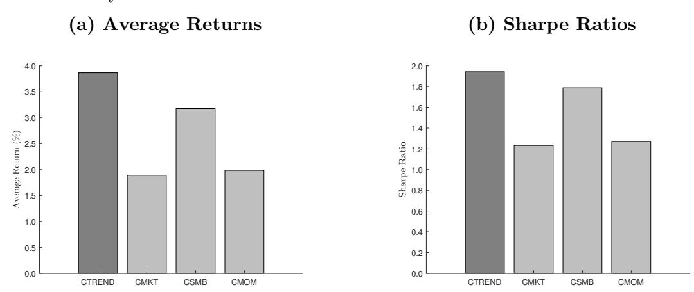
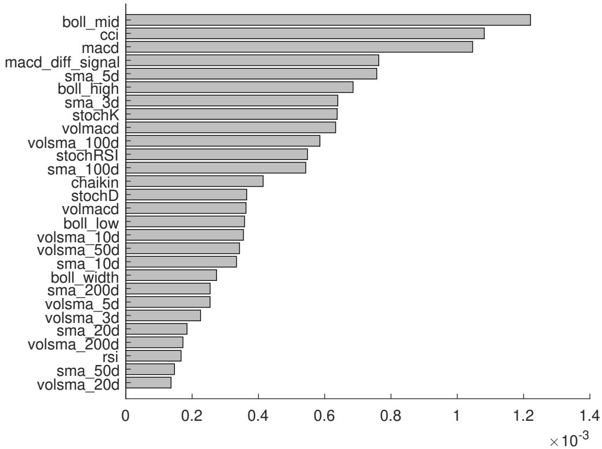
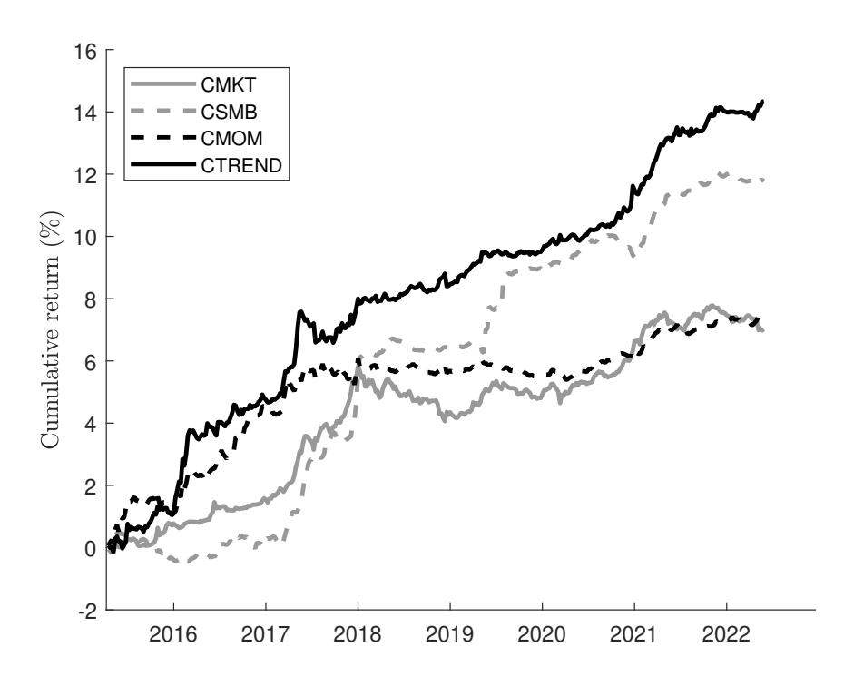
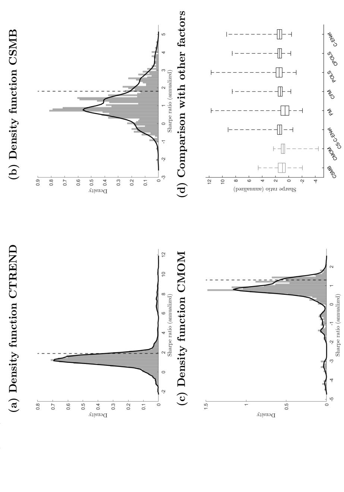
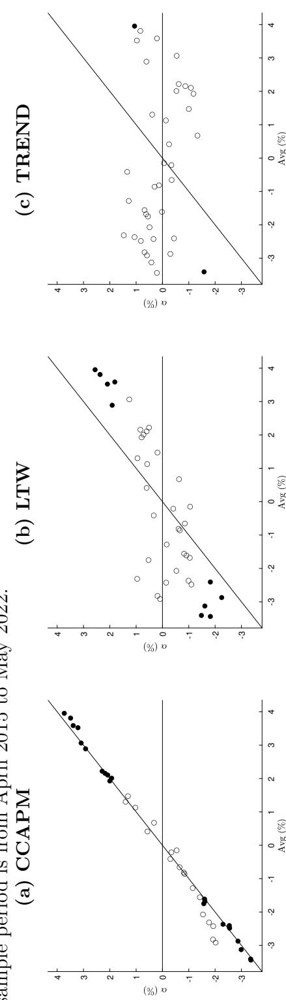

## A Trend Factor for the Cross-Section of Cryptocurrency Returns

Christian Fieberg1 , Gerrit Liedtke2 , Thorsten Poddig3 , Thomas Walker4 , Adam Zaremba5,∗

#### Abstract

We propose CTREND, a new trend factor for cryptocurrency returns, which aggregates price and volume information across various time horizons. Using data on more than 3,000 coins, we apply machine learning methods to exploit information from various technical indicators. The resulting signal reliably predicts the cross-section of cryptocurrency returns. The effect cannot be subsumed by known factors and remains remarkably robust across different sub-periods, market conditions, and alternative research designs. Moreover, it survives the impact of transaction costs and persists for large and liquid coins, paving the way for an effective trading strategy. Finally, an asset pricing model that incorporates CTREND outperforms competing factor models, providing a superior explanation of cryptocurrency returns.

Keywords: cryptocurrency markets, asset pricing, anomalies, return predictability, technical analysis, the cross-section of returns

∗Corresponding author.

1Christian Fieberg: 1) City University of Applied Sciences, Bremen, Germany, christian.fieberg@hsbremen.de; 2) University of Luxembourg, Luxembourg, Luxembourg, christian.fieberg@ext.uni.lu; 3) Concordia University, Montreal, Canada, christian.fieberg@concordia.ca.

2Gerrit Liedtke: University of Bremen, Bremen, Germany, gliedtke@uni-bremen.de.

3Thorsten Poddig: University of Bremen, Bremen, Germany, poddig@uni-bremen.de.

4Thomas Walker: Concordia University, John Molson Building, Montreal, Canada, thomas.walker@concordia.ca

5Adam Zaremba: 1) Montpellier Business School, 2300, avenue des Moulins, 34185 Montpellier cedex 4, France, a.zaremba@montpellier-bs.com; 2) Department of Investment and Financial Markets, Institute of Finance, Poznan University of Economics and Business, al. Niepodleg lo´sci 10, 61-875 Pozna´n, Poland, email: adam.zaremba@ue.poznan.pl; 3) Department of Finance and Tax, Faculty of Commerce, University of Cape Town, South Africa. Adam Zaremba acknowledges the support of the National Science Center of Poland, Grant No. 2019/33/B/HS4/01021.

#### 1. Introduction

Investing in cryptocurrencies is not a walk in the park. Traders lack a single widely accepted valuation model, and voices claiming that crypto assets are worthless are not uncommon ([\(Christopher, 2014;](#page-42-0) [Taleb, 2021\)](#page-50-0). The lack of fundamental data forces investors to rely largely on market prices, and to infer information about cryptocurrency adoption and valuation from their movements [\(Cong et al., 2021;](#page-43-0) [Sockin and Xiong, 2023\)](#page-50-1). This, in turn, can link price fluctuations to investor demand, leading to the emergence of trend-like behavior of cryptocurrency markets [\(Hackethal et al., 2022;](#page-45-0) [Kogan et al., 2023;](#page-47-0) [Weber et al.,](#page-51-0) [2023\)](#page-51-0).

Cross-sectional studies of the cryptocurrency market generally agree that past returns help predict future performance (e.g., [Liu and Tsyvinski, 2021;](#page-48-0) [Cong et al., 2022a;](#page-43-1) [Liu et al.,](#page-48-1) [2022;](#page-48-1) [Borri et al., 2022\)](#page-41-0). However, the information content of past prices can be much richer. Numerous studies of stocks, bonds, commodities, and exchange rates document the predictive abilities of technical signals (e.g., [Park and Irwin, 2007;](#page-49-0) [Neely et al., 2014;](#page-49-1) [Han](#page-46-0) [et al., 2016b;](#page-46-0) [Avramov et al., 2021\)](#page-40-0). Techniques using oscillators, moving averages, or even past volume or volatility effectively predict future payoffs [\(Sweeney, 1986;](#page-50-2) [Shynkevich, 2016;](#page-50-3) [Han and Kong, 2022\)](#page-45-1). Given the dearth of fundamental data, their information content may be essential to the cross-section of cryptoc returns. Ignoring them can lead to an incomplete understanding of the mechanisms that drive price dynamics in cryptocurrency markets.

In this study, we propose CTREND, a new cryptocurrency trend factor, which captures information on past prices and volume over different time horizons. Using data on more than 3,000 coins over the period from 2015 to 2022, we compute 28 popular technical signals, including momentum oscillators, moving averages, volume-based indicators, and volatility measures. Next, we employ machine learning methods to extract an aggregate signal that captures the unique information from different indicators. Rather than arbitrarily selecting specific predictors, our agnostic approach lets the data speak and automatically extracts information from multiple features. The resulting signal is a reliable predictor of the crosssection of cryptocurrency returns.

Figure [1](#page-52-0) illustrates the key findings. A long-short strategy that buys a value-weighted quintile of coins with the highest expected returns and sells those with the lowest returns earns 3.87% per week, clearly beating other prominent cryptocurrency factors. The abnormal returns cannot be subsumed by popular asset pricing models, such as the cryptocurrency capital asset pricing model (CCAPM) or the [Liu et al.](#page-48-1) [\(2022\)](#page-48-1) [\(LTW](#page-48-1) hereafter) three-factor model. Furthermore, the relationship between CTREND and future returns is confirmed by bivariate portfolio sorts and cross-sectional regressions, and other popular return predictors fail to explain it. Finally, it does not derive from a single technical indicator but aggregates information across multiple technical signals.

#### [Insert Figure [1](#page-52-0) about here]

The CTREND effect is remarkably robust. It holds across various subperiods and remains largely unaffected by different market states. Moreover, it survives several changes in research designs. In a separate experiment, we examine 36,864 implementations, considering alternative sample preparation methods, data cleaning procedures, forecast estimations, and portfolio designs. The CTREND delivers robust performance under most of them, consistently generating impressive risk-return profiles that dwarf other factors.

Notably, the significance of the CTREND signal goes beyond simply delivering impressive portfolio returns. A cross-sectional CTREND factor proves effective in pricing cryptocurrency returns. It renders the momentum effect insignificant while at the same time not being subsumed by any other factors. Furthermore, it explains the abnormal returns of prevailing anomalies and trading strategies much better than other prevailing models. In particular, a three-factor model that includes the CMKT, CSMB, and CTREND factors significantly outperforms the distinctive model proposed by [LTW:](#page-48-1) it produces lower pricing errors, explains anomalies more accurately, and reduces abnormal returns more effectively. Its superiority is also confirmed by the well-known [Gibbons et al.](#page-44-0) [\(1989\)](#page-44-0) test. As a result, the CTREND factor emerges as a strong contender for a new benchmark in asset pricing specifically tailored for cryptocurrency research.

Finally, we explore the practical implications of the CTREND effect from an investment perspective. The predictive power of this technical signal is not limited to some obscure segments of the cryptocurrency market, but is ubiquitous in even the largest and most liquid coins. Despite the short-term nature of the CTREND trading signal and significant portfolio turnover, the profits generated are resilient to transaction costs. Moreover, abnormal returns remain significant over longer holding periods, up to four weeks. Consequently, the CTREND effect can be translated into an effective trading strategy.

Our study contributes to three main strands of asset pricing research. First, we add to the rapidly growing body of evidence on the cross-sectional predictability of cryptocurrency returns [\(Liu et al., 2021;](#page-48-2) [Liu and Tsyvinski, 2021;](#page-48-0) [Borri and Shakhnov, 2022;](#page-41-1) [Liu et al.,](#page-48-1) [2022;](#page-48-1) [Zhang et al., 2021;](#page-51-1) [Babiak and Erdis, 2022;](#page-40-1) [Bianchi et al., 2022;](#page-41-2) [Borri et al., 2022\)](#page-41-0). In particular, our paper closely connects with studies proposing sparse factor pricing models to explain the cross-section of cryptocurrency returns (e.g., [Liu et al., 2022;](#page-48-1) [Bianchi and Babiak,](#page-41-3) [2021;](#page-41-3) [Cong et al., 2022a\)](#page-43-1). In the context of cryptocurrency pricing, our findings are consistent with models suggesting that crypto investors infer information about adoption and valuation from price behavior. [Kogan et al.](#page-47-0) [\(2023\)](#page-47-0) offers a model in which past price movements contain information about future adoption, consistent with the [\(Cong et al., 2021;](#page-43-0) [Sockin and Xiong,](#page-50-1) [2023\)](#page-50-1) perspectives. With this in mind, we offer a new cryptocurrency signal called CTREND that effectively captures the cross-sectional return variation in cryptocurrency markets and outperforms the most prominent cryptocurrency factor pricing models.

Second, we extend the long-standing debate on the effectiveness of technical analysis and its implications for market efficiency. [Schwager](#page-50-4) [\(1993,](#page-50-4) [2012\)](#page-50-5) and [Menkhoff](#page-49-2) [\(2010\)](#page-49-2) show that technical indicators belong to popular tools of investors and hedge fund managers, and [Avramov et al.](#page-40-2) [\(2018\)](#page-40-2) argue that analysts' recommendations based on technical analysis typically beat those relying on fundamental information. The extensive literature confirms the profitability of technical signals [\(Lo et al., 2000a;](#page-48-3) [Park and Irwin, 2007;](#page-49-0) [Zhu and Zhou, 2009;](#page-51-2) [Hung and Lai, 2022;](#page-46-1) [Brogaard and Zareei, 2023\)](#page-42-1). For example, [Brock et al.](#page-42-2) [\(1992\)](#page-42-2) demonstrate the effectiveness of moving averages and [Kwon and Kish](#page-47-1) [\(2002\)](#page-47-1) broaden the evidence to volume-based indicators. [Neely et al.](#page-49-1) [\(2014\)](#page-49-1) show that technical indicators successfully predict the market risk premium. Further analyses in [Shynkevich](#page-50-3) [\(2016\)](#page-50-3) and [Sweeney](#page-50-2) [\(1986\)](#page-50-2) document similar patterns in bond and foreign exchange markets. Although most studies consider technical analysis in a time-series context, its signals also help explain cross-sectional returns. As shown by [Han et al.](#page-46-2) [\(2013\)](#page-46-2), moving averages predict characteristic-sorted portfolios, and later [Han et al.](#page-45-2) [\(2016a\)](#page-45-2) and [Han and Kong](#page-45-1) [\(2022\)](#page-45-1) confirm their findings for an extended sample period and commodity markets. [Avramov et al.](#page-40-0) [\(2021\)](#page-40-0) find that the moving average distance is priced in the cross-section of stock returns. Finally, our paper is most closely related to [Han et al.](#page-46-0) [\(2016b\)](#page-46-0) and [Liu et al.](#page-48-4) [\(2023\)](#page-48-4)), who aggregate information from various moving averages to predict the cross-section of stock returns in the United States and China. To our knowledge, none of the studies have scrutinized the cross-section of cryptocurrency returns.

Lastly, we add to the emerging literature on technical analysis applications in the cryptocurrency market. In contrast to the efficient market hypothesis [\(Fama, 1970\)](#page-44-1), previous studies show that technical indicators effectively predict the returns of major cryptocurrencies [\(Corbet et al., 2019;](#page-43-2) [Hudson and Urquhart, 2021;](#page-46-3) [Ahmed et al., 2020;](#page-40-3) [Gerritsen et al.,](#page-44-2) [2020;](#page-44-2) [Goutte et al., 2023;](#page-44-3) [Grobys et al., 2020;](#page-45-3) [Anghel, 2021;](#page-40-4) [Detzel et al., 2021;](#page-43-3) [Svogun](#page-50-6) [and Baz´an-Palomino, 2022;](#page-50-6) [Baz´an-Palomino and Svogun, 2023;](#page-41-4) [Tan and Tao, 2023;](#page-50-7) [Wei](#page-51-3) [et al., 2023\)](#page-51-3). Nevertheless, those studies explore the time-series predictability of a handful of cryptocurrencies, typically with several pre-selected indicators. On the contrary, our study concentrates on cross-sectional returns and aggregate information from various trading signals; thus, our study provides a test of the efficient market hypothesis in the cross-section of cryptocurrency returns.

The remainder of the paper proceeds as follows. Section [2](#page-5-0) outlines our theoretical framework. Section [3](#page-7-0) discusses the data and the method. Section [4](#page-17-0) presents the baseline findings. Section [5](#page-20-0) provides additional insights and robustness checks. Section [6](#page-27-0) focuses on asset pricing tests. Section [7](#page-34-0) considers the practical investor perspective. Finally, Section [8](#page-37-0) concludes.

#### 2. Theoretical Framework

The asset pricing literature offers multiple theories linking past price and volume data to future price movements. Many of them consider the links between the momentum effect and investor behavior. [De Long et al.](#page-43-4) [\(1990\)](#page-43-4) state that noise traders who participate in positive feedback trading contribute to the return continuations. [Barberis et al.](#page-41-5) [\(1998\)](#page-41-5) argue that prices may trend slowly when investors underestimate the importance of new information in making decisions. The seminal work of [Hong and Stein](#page-46-4) [\(1999\)](#page-46-4) investigates the effects of information-based trading and suggests that the delayed adjustment of stock prices to private information creates momentum effects. Price trends may arise from a range of behavioral biases, although several models can justify expected trends in rational equilibriums; [Chan](#page-42-3) [et al.](#page-42-3) [\(1996\)](#page-42-3), [Grinblatt and Han](#page-45-4) [\(2005\)](#page-45-4), and [Daniel et al.](#page-43-5) [\(2023\)](#page-43-5) are examples of studies that examine behavioral biases. For instance, [Cespa and Vives](#page-42-4) [\(2012\)](#page-42-4) demonstrate that the existence of liquidity traders and uncertain asset payoff leads to logical price trends in the marketplace.

Building on [Wang](#page-51-4) [\(1993\)](#page-51-4), [Han et al.](#page-46-0) [\(2016b\)](#page-46-0) and [Liu et al.](#page-48-4) [\(2023\)](#page-48-4) present theoretical models that link signals derived from past price and volume information to future stock returns. They distinguish two classes of market participants: informed investors and uninformed traders. While the first group has access to fundamental information about the dividend process and economic conditions, uninformed traders do not. Therefore, they infer the long-term dividend growth rate from past price changes. In short, rising price trends suggest a solid dividend growth rate and, conversely, falling prices may signal a poor financial outlook. According to this reasoning, uninformed investors may rationally follow the trend, thus promoting the predictable price patterns in the stock market.

The proposed model takes into account the availability of fundamental information. If fundamental information were scarce, investors would naturally be driven to technical signals as the only source of rational inference. Notably, the cryptocurrency market can be considered unique in this context. To begin with, access to relevant fundamental information is more limited than in the equity universe. While some fundamental valuation approaches have been proposed [\(Hayes, 2017;](#page-46-5) [Biais et al., 2023;](#page-41-6) [Pagnotta and Buraschi, 2018;](#page-49-3) [Sockin](#page-50-1) [and Xiong, 2023\)](#page-50-1), they are not yet as widespread or broadly accepted as equity dividend or cash flow-based models. Some voices from both academia and industry even argue that cryptocurrencies may have no fundamental value at all [\(Christopher, 2014;](#page-42-0) [Taleb, 2021\)](#page-50-0). In addition, the nature of cryptocurrency valuation models tends to be structurally different from their stock market counterparts, relying on mining costs or currency characteristics rather than discounting future earnings. Moreover, unlike equities, crypto investors lack periodic cash flow information [\(Kogan et al., 2023\)](#page-47-0), which allows them to reassess their beliefs about the value of the asset (Luo et al., 2020). As a result, cryptocurrency traders are likely to base their investment decisions on past prices and technical indicators. In line with this view, this asset class is commonly referred to as "speculative investments" [\(Yermack, 2015\)](#page-51-5), prone to speculative bubbles [\(Cheah and Fry, 2015;](#page-42-5) [Cagli, 2019\)](#page-42-6), and characterized by a high degree of herding behavior [\(Bouri et al., 2019;](#page-42-7) [Almeida and Gon¸calves, 2023\)](#page-40-5).

Notably, a growing body of evidence suggests that the scarcity of fundamental information and, consequently, the reliance on price data, is reflected in the behavior of cryptocurrency traders. Investor characteristics in this asset class have been studied by [Pursiainen and](#page-49-4) [Toczynski](#page-49-4) [\(2022\)](#page-49-4), [Di Maggio et al.](#page-43-6) [\(2022\)](#page-43-6), and [Auer et al.](#page-40-6) [\(2023\)](#page-40-6), to name a few. [Hackethal](#page-45-0) [et al.](#page-45-0) [\(2022\)](#page-45-0), who examine data from a German online bank that caters to crypto traders, find that they are more risk-taking and even more biased than stock traders. [Kogan et al.](#page-47-0) [\(2023\)](#page-47-0), who examine a dataset of 200,000 retail traders from eToro, show that crypto investors are more prone to momentum-like strategies than their stock market counterparts. They explain this with a model where past price changes contain information about future adoption, which indirectly affects intrinsic value— consistent with [Cong et al.](#page-43-0) [\(2021\)](#page-43-0) or [Sockin and](#page-50-1) [Xiong](#page-50-1) [\(2023\)](#page-50-1). The uniqueness of cryptocurrency traders and their reliance on past prices is reflected in numerous studies. For example, [Weber et al.](#page-51-0) [\(2023\)](#page-51-0) show that information about historical returns leads individuals to increase their desired crypto holdings and makes them more likely to subsequently purchase cryptocurrency. [Hackethal et al.](#page-45-0) [\(2022\)](#page-45-0) show that cryptocurrency investors are much more likely to buy stocks with strong performance and lottery-like characteristics than in the stock market, consistent with naive trend following [\(Kumar et al., 2001;](#page-47-2) [Sapp and Tiwari, 2004;](#page-50-8) [Barber and Odean, 2008\)](#page-41-7) and certain forms of gambling in financial markets [\(Kumar, 2009\)](#page-47-3). In summary, due to the lack of easily accessible fundamental information, investors use a different model when forming beliefs about cryptocurrencies compared to stocks.

In conclusion, the limited availability of fundamental data highlights the role of past price and volume information in determining expected returns. As a result, the trend-based factors—such as those of [Han et al.](#page-46-0) [\(2016b\)](#page-46-0) and [Liu et al.](#page-48-4) [\(2023\)](#page-48-4), which aggregate past price information—may prove crucial in predicting and explaining the cross-section of returns. Moreover, not only moving averages but also other technical indicators, such as momentum oscillators and volatility indicators, suggest trend-following behavior in the cross-section of cryptocurrencies. We test these hypotheses in the empirical sections of this paper.

#### 3. Data and Methods

In this section, we introduce our data and our method, starting with the presentation of our data sample. Next, we continue with a discussion of the selected technical indicators considered in the study and an exploratory examination of their information content for future cryptocurrency returns. We then describe how we calculate the aggregate CTREND signal.

#### 3.1. Data Sources and Preparation

We collect price, volume, and market capitalization data from Coinmarketcap.com, where price information contains high, open, low, and close prices. Following [Liu et al.](#page-48-1) [\(2022\)](#page-48-1), for an observation to be valid, we require non-missing observations for the closing price, volume, and market capitalization. We remove all the cases for which the market capitalization exceeds that of Bitcoin, as this indicates erroneous observations.[1](#page-8-0) As it is common in the literature, we limit our sample to cryptocurrencies with a minimum market capitalization of USD 1 million [\(Liu and Tsyvinski, 2021;](#page-48-0) [Liu et al., 2022;](#page-48-1) [Garfinkel et al., 2023\)](#page-44-4). We further control for extreme outliers in returns by removing the 1% most extreme observations by truncating the returns at the 0.5% and 99.5% percentiles. Our sample period starts in April 2015 and ends in May 2022, yielding 423 weekly observations. Earlier data is discarded because we need earlier historical data to calculate cryptocurrency characteristics, technical indicators, and the aggregate CTREND signal (see Section [3.3\)](#page-13-0).

Table [1](#page-57-0) illustrates our filtered sample over time. The number of available cryptocurrencies varies from below 100 in 2015 to over 2,000 in 2021, and the overall number of unique coins is 3,245. The mean market capitalization ranges from USD 135 million (2015) to USD 1,38 billion (2021), markedly surpassing the median values. This signals a strongly concentrated market with few names accounting for most of the market capitalization. The liquidity measured by the aggregate trading volume reflects similar patterns.

#### [Insert Table [1](#page-57-0) about here]

#### 3.2. Technical Indicators

While the stock market literature shows that investors commonly employ moving averagebased strategies beyond fundamental analysis [\(Schwager, 1993;](#page-50-4) [Lo et al., 2000b\)](#page-48-5), no fundamental data are available to cryptocurrency investors. As a result, they are likely to employ

1Note that this filter eliminates a total of ten daily observations across the entire study period and cross-section.

a diverse set of technical indicators, beyond moving averages. Therefore, we consider a vast list of a) momentum oscillators, b) moving average indicators, c) volume indicators, and d) volatility indicators, previously studied in the literature and popular among market practitioners. In total, we calculate 28 signals that we use as input to construct an aggregate trend characteristic. Here, we provide a brief rationale for our selection of technical indicators. Note that we make two assumptions regarding the selection of technical indicators. First, we only consider indicators that allow the formation of a straightforward cross-sectional signal, and second, we calculate the indicators using the common estimation horizons suggested in the literature to avoid a data-snooping bias. The calculation of all technical indicators is comprehensively described in [Appendix A,](#page--1-0) but we briefly characterize them here.

#### 3.2.1. Sample Selection

Momentum oscillators, the first group of indicators, are widely embraced by practitioners (see, for example, [Ciana, 2011\)](#page-42-8). One of the most prominent signals in this category is the relative strength index (rsi), which quantifies the ratio of average gains to average losses over the preceding fourteen days. It is bounded in the interval [0, 100] and indicates—according to applications in time-series analyses—an overbought (oversold) signal if it is above (below) 70 (30). Next, we include the stochastics stochK and stochD, which compare the price of an asset to a range of prices over a 14-day period. The fast stochastic oscillator stochK is the difference between the current closing price and the lowest closing price over a 14-day period, scaled by the asset's price range. A three-day moving average of stochK is defined as the slow stochastic oscillator stochD. As the rsi, both indicators are bounded in the interval [0, 100], and higher values indicate a sell signal, while lower values indicate a buy signal. We also include an extension of the rsi, i.e., the stochRSI, which again is bounded in the [0, 100] interval. The stochRSI is defined as the difference between an asset's current rsi and its lowest rsi over a 14-day period, scaled by the range of rsi values. Lastly, we include the commodity channel index (cci), which compares the average deviation of the current price

to a moving average to determine whether the asset is overbought (> 100) or oversold (< -100).

The second category includes signals based on price moving averages. [Han et al.](#page-46-0) [\(2016b\)](#page-46-0) and references therein provide theoretical support for using simple moving averages (SMAs) as predictors for the cross-section of asset returns. [Han et al.](#page-46-2) [\(2013\)](#page-46-2) show that SMAs help predict returns on characteristic-sorted portfolios, and [Han et al.](#page-46-0) [\(2016b\)](#page-46-0) successfully aggregate SMAs of various lengths to predict stock returns. We add seven SMAs of different lengths (denoted by sma ∗d where ∗ denotes the number of days). Specifically, we include the 3-, 5-, 10-, 20-, 50-, 100-, and 200-day SMAs [\(Brock et al., 1992;](#page-42-2) [Han et al., 2016b;](#page-46-0) [Liu et al., 2023\)](#page-48-4).[2](#page-10-0) Following [Han et al.](#page-46-0) [\(2016b\)](#page-46-0), we scale the SMAs by their closing price to ensure their stationarity and mitigate the impact of high-priced cryptocurrencies. We augment the set of moving average indicators by including two indicators commonly used by practitioners (see, for example, [Ciana, 2011\)](#page-42-8) and also studied, for example, in [Neely](#page-49-1) [et al.](#page-49-1) [\(2014\)](#page-49-1), that is, the moving average convergence/divergence (macd) indicator and the difference of macd to a signal line (macd diff signal). The macd measures the difference between a slow (26-day) and a fast (12-day) exponential moving average (EMA) of daily closing prices. To mitigate the influence of size effects, we express the difference in the slow and fast EMAs as a percentage of the fast EMA.[3](#page-10-1) The macd diff signal is the difference of macd and a 9-day EMA of the macd.

The third class of variables comprises volume indicators. [Liu et al.](#page-48-4) [\(2023\)](#page-48-4) show that the SMAs of the past trading volume help to predict stock returns in China. We include the 3-, 5-, 10-, 20-, 50-, 100-, and 200-day SMAs of dollar trading volume (volsma ∗d) and normalize them by the current trading volume [\(Liu et al., 2023\)](#page-48-4). Analogous to the macd defined above, which measures the difference between two EMAs of past closing prices, we define volmacd

2Note that we omit longer SMAs as the 400-, 600-, 800-, or 1000-day SMAs studied in [Han et al.](#page-46-0) [\(2016b\)](#page-46-0) because the time-series of cryptocurrency data is relatively short.

3This normalization makes the macd equivalent to the percentage price oscillator (PPO).

as the difference between two EMAs of the past dollar trading volume. We again express this difference as the percentage of the fast EMA.[4](#page-11-0) We also include the difference of volmacd to the signal line (volmacd diff signal). Another popular volume indicator is the Chaikin money flow (chaikin) indicator, which measures the money flow volume over time. A high positive value of chaikin indicates buying pressure, while a high negative value indicates selling pressure.

The last group of technical signals consists of volatility-based indicators. This category comprises the lower (boll low), middle (boll mid), and upper (boll up) Bollinger band. The lower and upper Bollinger bands are calculated by adding (subtracting) two standard deviations of the previous closing prices to (from) the middle Bollinger band, defined as the 20-day moving average of past closing prices. Again, we scale the Bollinger bands by the current closing price to control for the impact of high-priced cryptocurrencies. Finally, we include the Bollinger bandwidth (boll width), which is the difference between the upper and lower bands, scaled by the middle Bollinger band. A small bandwidth indicates low volatility, while a high spread indicates high volatility.

#### 3.2.2. Performance of Technical Indicators

Table [2](#page-58-0) provides a brief overview of the information content of the technical indicators used in this study. Precisely, we follow the established literature on cryptocurrency return predictability and sort cryptocurrencies into quintile portfolios based on the cross-sectional rank of the respective technical indicator. The portfolios are value-weighted and rebalanced weekly [\(Liu et al., 2022\)](#page-48-1). Furthermore, we report the performance of long-short strategies buying (selling) the quintile of cryptocurrencies with the highest (lowest) technical indicator ranks. The performance of such a strategy offers an acid test for a monotonic relationship in the cross-section of returns.

### [Insert Table [2](#page-58-0) about here]

4This indicator is also known as the percentage volume oscillator (PVO).

To disentangle the contribution of exposure to common risk factors, we supplement the average weekly returns with multifactor alphas. Specifically, we calculate alphas from the one-factor CCAPM:

$$r_{pt} = \alpha + \beta_{CMKT} CMKT_t + \epsilon_t \quad (1)$$

and the three-factor model of [LTW:](#page-48-1)[5](#page-12-0)

$$r_{p,t} = \alpha + \beta_{CMKT} CMKT_t + \beta_{CSMB} CSMB_t + \beta_{CMOM} CMOM_t + \epsilon_t \quad (2)$$

rp,t in the equations above is the excess return on an examined portfolio p at time t and CMKTt , CSMBt , and CMOMt denote the returns on market, size, and momentum factors of [LTW](#page-48-1) at time t. The regression coefficients βCMKT , βCSMB, and βCMOM measure the factor exposures, α is the intercept (alpha), and ϵt is the residual return. For details on factor properties, see Table [B.1](#page--1-1) in the Appendix.

As seen in Table [2,](#page-58-0) more than half of the indicators generate reliable mean returns on the long-short portfolios, which are significant at the 5% level. Furthermore, in fourteen cases, these profits cannot be fully captured by the CCAPM; in eight of them, even the threefactor model cannot explain their performance. In other words, the return predictability by technical indicators is not simply the cryptocurrency size or momentum effect in disguise.

Significant alphas are concentrated mainly in the momentum oscillators group, where four indicators generate significant abnormal returns. Significant average returns and CCAPM alphas are also visible for moving average indicators. Still, in this case, most of them are subsumed by the three-factor model, which incorporates the momentum factor. Finally, abnormal returns in the volume and volatility categories are less prevalent.

Interestingly, the sign of abnormal returns on long-short cryptocurrency portfolios does not always align with the patterns known from the time-series literature in the equity uni-

5The factors are available from Yukun Liu's dropbox:

https://www.dropbox.com/s/ziyh9pjooroxali/LTW 3factor.xlsx?dl=0

verse. For example, the long-short strategy based on the rsi, which is supposed to be a reversal indicator, generates a significant positive abnormal return. That is, coins that are considered "overbought", following classical technical analysis, continue to generate large positive returns. Thus, the rsi—and all other oscillators—indicate a trend continuation rather than a reversal. Similarly, price moving averages also signal trend-following behavior. Note that [Han et al.](#page-46-0) [\(2016b\)](#page-46-0) show that moving averages indicate a trend-following or reversal depending on the fraction of technicians in the markets: a large fraction of technical analysts leads to the occurrence of trend-following patterns, while a low presence results in reversals. Because cryptocurrencies are a relatively new asset class commonly referred to as "speculative investments" [\(Yermack, 2015\)](#page-51-5), they may be prone to speculative bubbles [\(Cheah and Fry, 2015;](#page-42-5) [Cagli, 2019\)](#page-42-6) and characterized by a high degree of herding behavior [\(Bouri et al., 2019;](#page-42-7) [Almeida and Gon¸calves, 2023\)](#page-40-5). Consequently, cryptocurrency investors are likely to follow strong trends so that the trends will be further fueled, and technical indicators indicate trend continuation.

#### 3.3. The CTREND Factor

A single technical indicator may represent a noisy predictor of future market movements; therefore, technical analysts frequently enhance the quality of their forecasts by combining multiple signals. The construction of our trend factor follows the same philosophy: We integrate all variables in Table [2](#page-58-0) into a single trend measure, regardless of whether an indicator significantly predicts future cryptocurrency returns. Therefore, instead of sorting cryptocurrencies into portfolios based on a single technical indicator, which may be a noisy predictor of cryptocurrency returns, we follow the approach in [Han et al.](#page-46-0) [\(2016b\)](#page-46-0) and generate an aggregate measure of future returns using cross-sectional regressions. Specifically, the authors use cross-sectional regressions to summarize the information in moving averages of various lengths and create a trend factor based on their aggregate trend measure.

Although the approach of [Han et al.](#page-46-0) [\(2016b\)](#page-46-0) generates impressive results in the U.S.

market, two problems may arise. First, it may be subject to data snooping issues as the forecasts are based on an arbitrary pre-selection of technical indicators. Even though moving averages are common indicators used by practitioners, the information content of past market data may be much richer, and other indicators are used complementarily [\(Ciana, 2011;](#page-42-8) [Neely](#page-49-1) [et al., 2014\)](#page-49-1). Second, some signals may be uninformative or highly correlated with other signals, leading to inefficient forecasts from multivariate regressions. To overcome these problems and formulate predictions in a data-driven way, we build on the combined elastic net (C-ENet) as proposed in [Dong et al.](#page-44-5) [\(2022\)](#page-44-5), which combines the benefits of shrinkage and forecast combination. Specifically, we employ the cross-sectional combined elastic net estimator (CS-C-ENet) of [Han et al.](#page-45-5) [\(2023\)](#page-45-5).

Let ri,t denote the excess return of cryptocurrency i at time t and zi,j,t−1 the j-th technical indicator, with j = 1, . . . , J being the number of technical indicators available. [Han](#page-46-0) [et al.](#page-46-0) [\(2016b\)](#page-46-0) propose estimating the following cross-sectional multivariate regression over a sequence of M periods:

$$r_{i,t} = \alpha_t + \sum_{j=1}^J z_{i,j,t-1} \beta_{j,t} + u_{i,t} \quad \forall t \quad (3)$$

Using the Fama-MacBeth technique, the coefficients are smoothed over M periods, i.e.:

$$\bar{\alpha}_t = \frac{1}{M} \sum_{m=0}^{M-1} \hat{\alpha}_{t-m} \quad (4)$$

$$\bar{\beta}_{j,t} = \frac{1}{M} \sum_{m=0}^{M-1} \hat{\beta}_{t-m} \quad (5)$$

Smoothing the coefficients over time increases the efficiency of the estimation by stabilizing the coefficients, which yields more accurate estimates in noisy datasets. The t + 1 out-ofsample forecast is obtained by

$$\hat{r}_{i,t+1} = \bar{\alpha}_t + \sum_{j=1}^J \bar{\beta}_{j,t} z_{i,j,t} \quad (6)$$

The predictive regression in equation [\(3\)](#page-14-0) may be inefficient in noisy and high-dimensional data sets, such as cryptocurrency returns. Based on insights from time-series analyses (e.g., [Rapach et al., 2010\)](#page-49-5), [Han et al.](#page-45-5) [\(2023\)](#page-45-5) argue that the simple forecast combination of univariate return estimates often outperforms its multivariate counterpart because the forecast combination approach has a strong shrinkage effect (i.e., it shrinks the magnitude of each slope by 1/J) and improves the estimation efficiency. As a result, the forecast combination approach is less likely to be subject to overfitting, resulting in improved out-of-sample performance.

The combined Fama-MacBeth approach begins with estimating J univariate Fama-MacBeth regressions over a sequence of M periods as described in equation [\(7\)](#page-15-0):

$$r_{it} = \alpha_t + z_{i,jt-1}\beta_{jt} + u_{it} \quad \forall j, t \quad (7)$$

For each technical indicator j, a t + 1 return forecast is computed as

$$\hat{r}_{i,t+1}^j = \bar{\alpha}_t + \beta_{j,t} z_{i,j,t} \quad (8)$$

with ¯αt and β¯ j,t being the average coefficients from univariate Fama-MacBeth regressions analogous to equations [\(4\)](#page-14-1) and [\(5\)](#page-14-2), respectively. Note that in [Han et al.](#page-45-5) [\(2023\)](#page-45-5), the coefficients are not smoothed over time to adapt more quickly to changing characteristic rewards. However, as mentioned above, the Fama-MacBeth technique works particularly well in noisy datasets. As cryptocurrency returns are extremely noisy, we smooth the coefficients over time to stabilize the coefficient estimates [\(Haugen and Baker, 1996;](#page-46-6) [Lewellen, 2015;](#page-48-6) [Han](#page-45-5) [et al., 2023\)](#page-45-5).

A naive combined forecast for the t+1 return is computed as the equally weighted average of the J forecasts:

$$\hat{r}_{i,t+1} = \frac{1}{J} \sum_{j=1}^J \hat{r}_{i,t+1}^j \quad (9)$$

Although the equally weighted combined forecast in equation [\(9\)](#page-15-1) is theoretically suboptimal—

because not all technical indicators provide relevant and independent information for cryptocurrency returns—empirical studies report good performance of the equally weighted forecast combination [\(Clemen, 1989;](#page-42-9) [Diebold, 1989;](#page-44-6) [Rapach and Zhou, 2013\)](#page-49-6). However, by simply averaging over J forecasts as in equation [\(9\)](#page-15-1), noisy forecasts receive the same weight as informative forecasts. We follow [Dong et al.](#page-44-5) [\(2022\)](#page-44-5) and [Han et al.](#page-45-5) [\(2023\)](#page-45-5) and refine the simple forecast combination approach by using a machine learning technique, i.e., the elastic net, to select the most informative forecasts. Specifically, we run the following pooled multivariate regression [\(Granger and Ramanathan, 1984\)](#page-45-6):

$$r_{i,t} = \xi + \sum_{j=1}^J \theta_j \hat{r}_{i,t}^j + \eta_t \quad (10)$$

using the elastic net estimator that employs L 1 and L 2 shrinkage.[6](#page-16-0) In equation [\(10\)](#page-16-1), ξ denotes an intercept and θj denotes the optimal weight of the forecast j. Estimating equation [\(10\)](#page-16-1) using the elastic net results in coefficient estimates for which θj ̸= 0 or θj = 0, allowing to "select" the most informative forecasts, while shrinking the contribution of others to zero. [Diebold and Shin](#page-44-7) [\(2019\)](#page-44-7) show that selecting the relevant forecasts as described in equation [\(10\)](#page-16-1) and simply averaging over the surviving forecasts significantly improves the out-of-sample accuracy of the combined forecast. [Dong et al.](#page-44-5) [\(2022\)](#page-44-5) and [Han et al.](#page-45-5) [\(2023\)](#page-45-5) build on this insight and obtain the return forecast by averaging all univariate forecasts with a θj > 0, instead of weighting the forecasts with θj to an aggregate forecast. Note that the economic restriction θj > 0 implies that a return forecast should be positively correlated with the actual return. Thus, the t + 1 forecast of the cross-sectional combined elastic net (CS-C-ENet) is obtained by

$$r_{i,t+1} = \frac{1}{j} \sum_{j \in \mathcal{J}} \hat{r}_{i,t+1}^j \quad (11)$$

6Following [Dong et al.](#page-44-5) [\(2022\)](#page-44-5) and [Han et al.](#page-45-5) [\(2023\)](#page-45-5), we set the parameter that controls the tradeoff between L 1 and L 2 regularization to 0.5 and optimize the regularization strength λ according to the corrected akaike information criterion (AIC).

with ȷ denoting the set of forecasts obtained from univariate Fama-MacBeth as in equation [\(8\)](#page-15-2) regression with a θj > 0 (equation [\(10\)](#page-16-1)). In the remainder of the paper, we refer to the predictions from equation [\(11\)](#page-16-2) as the cryptocurrency trend signal, called CTREND. However, in Section [5.3,](#page-23-0) we also report the results when using alternative estimation methods, such as multivariate Fama-MacBeth or pooled regressions.

Before passing the data into the models, we mitigate the influence of potential outliers in cryptocurrency characteristics by transforming them into their cross-sectional ranks and mapping the ranks into the interval [-0.5, 0.5] [\(Kelly et al., 2019;](#page-47-4) [Gu et al., 2020\)](#page-45-7). All regressions are estimated by minimizing the value-weighted sum of squared residuals to mitigate the influence of micro-cap coins with minor economic significance [\(Hou et al., 2020;](#page-46-7) [Han et al., 2023\)](#page-45-5). The model parameters are estimated using a fixed rolling estimation window of M = 52 weeks (one year), and the one-week ahead returns are estimated using these parameters. We also test the robustness of the results regarding these settings in Section [5.3.](#page-23-0)

#### 4. Baseline Findings

We begin our empirical analysis by evaluating the return predictability of the CTREND signal using univariate portfolio sorts. We then continue with bivariate sorts and crosssectional regressions.

#### 4.1. Univariate Portfolio Sorts

To assess the predictability of the aggregate CTREND signal, we employ quintile portfolios, similar to those in Table [2.](#page-58-0) At the beginning of each week, we rank cryptocurrencies on the CTREND signal and group cryptocurrencies into five portfolios. The portfolios are value-weighted and rebalanced weekly. We construct the CTREND factor as a long-short strategy buying (selling) the baskets with the highest (lowest) expected return. Table [3](#page-60-0) reports the results of this exercise.

#### [Insert Table [3](#page-60-0) about here]

Sorting cryptocurrencies on CTREND reveals a clear pattern in portfolio payoffs: the high-CTREND quintiles markedly outperform the low ones. The return increases monotonically from the bottom to the top portfolio, and the spread between the extreme quintiles equals 3.87% (t-stat = 5.19). Furthermore, the annualized Sharpe ratio on the long-short strategy reaches 1.94, suggesting a remarkable risk-return profile.

The subsequent columns illustrate the risk exposures of the quintile portfolios. The spread portfolio does not exhibit major market or size exposure, and the respective betas are close to zero. However, the momentum beta is sizeable and significant, equaling 0.79. This indicates that the CTREND effect correlates closely with momentum. Nevertheless, despite its substantial exposure to CMOM, the long-short portfolio exhibits an impressive weekly alpha of 2.62% (t-stat = 4.22) against the [LTW](#page-48-1) three-factor model. In other words, while the momentum effect matters, it is far from fully capturing the CTREND alphas.

The rightmost section of Table [3](#page-60-0) displays additional portfolio characteristics such as the average market capitalization (mcap), the [Amihud](#page-40-7) [\(2002\)](#page-40-7) illiquidity measure (illiq), or idiosyncratic risk (idiovol). Table [B.3](#page--1-2) in [Appendix A](#page--1-0) provides a detailed explanation of these characteristics. All quintiles exhibit comparable portfolio characteristics, signaling that abnormal returns do not simply stem from some dusty corner of the cryptocurrency market, which is populated by small and illiquid coins. On the contrary, the CTREND premium may be effectively harvested via portfolio sorts, even in liquid and large coins. Section [7.1](#page-34-1) takes a closer look at this potential concern.

#### 4.2. Bivariate Portfolio Sorts

As seen in Table [3,](#page-60-0) the trend pattern in the returns is evident, but its source is yet uncertain. Theoretically, rather than representing an independent asset pricing phenomenon, the CTREND effect could be another anomaly in disguise, such as momentum. Hence, we now turn to bivariate portfolio sorts. Specifically, we sort the cryptocurrencies into halves based on different control variables and terciles of the CTREND signal. The selection of control variables includes popular predictors from the cryptocurrency literature, including market beta (beta), market capitalization (mcap), [Amihud](#page-40-7) [\(2002\)](#page-40-7) illiquidity ratio (illiq), idiosyncratic risk (idiovol), and momentum measures calculated over various horizons, ranging from one to four weeks of trailing data (ret \* 0 ). Table [B.3](#page--1-2) in [Appendix A](#page--1-0) provides a detailed explanation of all these control variables. Next, we calculate the average returns of portfolios with a consistent level of the control characteristics and different levels of the CTREND variable. The resulting portfolios capture the incremental effect of CTREND after controlling for other predictors. Table [4](#page-61-0) presents the findings of this exercise.

### [Insert Table [4](#page-61-0) about here]

The results confirm the strong return predictability by technical analysis. The effect of CTREND survives after controlling for other well-known variables. Specifically, the mean returns on the long-short bivariate portfolios are positive and significant in all cases, ranging from 1.43% to 3.08%. In other words, while other predictors capture between 20% and 63% of the abnormal returns, they cannot subsume them further. Importantly, it also applies to the double-sorts on momentum, which could be an ostensibly similar phenomenon. The abnormal returns on long-short bivariate portfolios also endure after accounting for factor exposure with the CCAPM and [LTW](#page-48-1) factors. In summary, the predictability of CTREND remains robust in bivariate sorts.

#### 4.3. Cross-Sectional Regressions

While bivariate portfolios are powerful in disentangling the impact of two features without imposing a linear functional form, they also face two shortcomings. First, they can only accommodate controlling for up to two or three variables, since fine triple or quadruple sorts are typically infeasible. Second, grouping coins into portfolios may lead to information loss. Therefore, we supplement our analyses with cross-sectional predictive regressions in the spirit of [Fama and MacBeth](#page-44-8) [\(1973\)](#page-44-8). Specifically, we examine whether the CTREND signal predicts the cross-section of next week's cryptocurrency returns after controlling for other variables.

Table [5](#page-62-0) presents the results of this analysis, which confirm the robust predictive ability of technical analysis. Observe first the univariate regressions in column (1). The average CTREND coefficient equals 2.36 and is strongly significant, with a t-statistic of five. The subsequent regressions incorporate different control variables from the same set as in Section [4.2.](#page-18-0) Specifications (2) to (7) also account for various combinations of the impacts of beta, market size, illiquidity, and idiosyncratic volatility. In all of these cases, the CTREND effect remains strong and significant. Furthermore, columns (8) to (11) report bivariate regressions that account for momentum effects measured over different estimation periods. None of these variables subsumes the CTREND signal; on the contrary, the CTREND variable typically renders most momentum signals insignificant—except two-week momentum, which remains significant at the 5% level. Finally, specification (12) pursues a "kitchen-sink" approach, jointly controlling for all individual control variables. The CTREND effect remains robust, asserting that even a combination of commonly known factors does not suffice to subsume it.

#### [Insert Table [5](#page-62-0) about here]

To conclude, cross-sectional regressions corroborate the predictive abilities of the CTREND variable. The aggregated technical signal provides reliable and incremental information about future cryptocurrency returns, which is not contained in other popular return predictors for the cryptocurrency market.

#### 5. Further Insights and Robustness Checks

This section provides additional insights and robustness checks. First, we explore the relative contribution of different technical signals to the overall CTREND performance. Second, we examine the CTREND performance in different subperiods and market states. Third, we investigate the role of non-standard errors in our findings.[7](#page-21-0)

#### 5.1. Variable Importance

The CTREND variable aggregates multiple technical signals into one aggregate measure of trend. However, does it extract the information from all of them? Or does the predictive performance depend on a handful of crucial variables? To shed light on this issue, we assess the contribution of particular technical indicators using partial dependence plots (PDPs), as suggested by [Greenwell et al.](#page-45-8) [\(2018\)](#page-45-8) and [Han et al.](#page-45-5) [\(2023\)](#page-45-5). That is, we analyze how the model's prediction changes as a result of marginally changing the values of a technical indicator, while keeping the other variables constant. [Appendix C](#page--1-0) describes the calculation of the variable importance scores.

Figure [2](#page-53-0) depicts the importance ranking. By far, the most important technical indicators are boll mid, cci, and macd; however, other indicators such as macd diff signal, sma 5d, boll high, sma 3d, or volmacd also have high importance scores. The findings reveal that the aggregate trend characteristic extracts information from the entire spectrum of technical indicators: momentum oscillators, moving averages, as well as price, volume, and volatility indicators.

#### [Insert Figure [2](#page-53-0) about here]

#### 5.2. Subperiod Analysis

In the equity market, numerous studies suggest that return predictability is not timeinvariant, which also applies to technical analysis and momentum signals. For example,

7Lastly, we also differentiate between cryptocurrency types by dividing them into coins and tokens. For example, [Ma et al.](#page-48-7) [\(2023\)](#page-48-7) shows that coins and tokens differ in their characteristics and, in particular, in their probability of default. [Cong and Xiao](#page-43-7) [\(2021\)](#page-43-7) propose an even more refined distinction between cryptocurrency types (i.e., general payment, platform tokens, product tokens, and security tokens), but this reduces the cross section for some groups excessively, making portfolio sorting no longer feasible. We report the results for the coin/token split in table [B.2](#page--1-1) in [Appendix B](#page--1-0) and note that the results are qualitatively unchanged from our main results in table [3.](#page-60-0)

whether due to investor learning or improving market efficiency [\(Schwert, 2003;](#page-50-9) [Chordia](#page-42-10) [et al., 2014;](#page-42-10) [Hanson and Sunderam, 2014;](#page-46-8) [McLean and Pontiff, 2016;](#page-48-8) [Zaremba et al., 2020\)](#page-51-6), the return predictability has been found to decline over time in certain markets.[8](#page-22-0) [Fieberg](#page-44-9) [et al.](#page-44-9) [\(2023b\)](#page-44-9) notice that a similar trend also haunts many cryptocurrency anomalies. Furthermore, the magnitude of mispricing fluctuates along with market sentiment and uncertainty and increases in times of high illiquidity or idiosyncratic risk, strengthening limits to arbitrage [\(Nagel, 2012;](#page-49-7) [Stambaugh et al., 2012;](#page-50-10) [Jacobs, 2015;](#page-46-9) [Avramov et al., 2019\)](#page-40-8). Do similar patterns also hold for the cryptocurrency CTREND factor?

Figure [3](#page-54-0) shows the cumulative return of the cryptocurrency factors CMKT, CSMB, CMOM, and CTREND over time. Overall, the performance of the long-short portfolio formed on CTREND is remarkably stable. During the period from April 2015 to mid-2017, the returns on the CTREND factor mirror those of CMOM. However, in 2017, the cumulative return of the CMOM factor began to flatten, while CTREND continued to thrive.

#### [Insert Figure [3](#page-54-0) about here]

Table [6](#page-63-0) offers a more formal look at the return dynamics over time. In particular, we split the sample in several ways. First, we divide it into two roughly equal subperiods: from April 2015 to the first week of November 2018 and November 2018 to May 2022. Second, we categorize the sample into periods of high and low market volatility and uncertainty, where market volatility is defined as the value-weighted average of the standard deviation of daily returns over the previous week, and uncertainty is proxied by the cryptocurrency uncertainty index [\(Lucey et al., 2022\)](#page-48-9). In both cases, we use the time-series median to differentiate between the "high" and "low" market states [\(Avramov et al., 2023;](#page-40-9) [Fieberg](#page-44-9) [et al., 2023b\)](#page-44-9). Lastly, we also assess the returns in bull and bear markets, interpreted as

8Notably, [Jacobs](#page-47-5) [\(2016\)](#page-47-5) and [Jacobs and M¨uller](#page-47-6) [\(2020\)](#page-47-6) observe no similar tendency of profitability decrease driven by investor learning in international markets.

the weeks in which the 12-month trailing return on the cryptocurrency market portfolio is below or above the sample median.

[Insert Table [6](#page-63-0) about here]

The CTREND anomaly generally does not depend on any particular period or market state, remaining significant during periods of high and low volatility and uncertainty (Panels B, C). In particular, abnormal returns do not originate solely from risky market phases. In fact, the returns are noticeably higher during stable market periods (5.54%) rather than volatile ones (2.27%). Furthermore, unlike the momentum effect in—for example—stocks, CTREND does not originate only from bullish markets. Although CTREND generates higher returns in bullish markets (4.49%), it also generates a high average weekly return of 3.25% in bearish markets. Lastly, although an inevitable decline in profitability over time is visible (Panel A), this trend is not critical. Even in recent years, the average long-short portfolio return remains sizeable and significant, amounting to 3.26% per week. Even though the raw returns are lower in the second half, the alphas against the [LTW](#page-48-1) three-factor model are almost unchanged.

#### 5.3. Accounting for Non-Standard Errors

The construction of trend factor portfolios in the previous analyses relied on certain assumptions regarding data and methodology, closely following the proposed design in [LTW.](#page-48-1) However, no research design is carved in stone, and various studies may resort to alternative approaches. In particular, even seemingly irrelevant methodological choices may lead to vastly differing conclusions—in the stock [\(Menkveld et al., 2023;](#page-49-8) [Walter et al., 2023;](#page-51-7) [Soebhag](#page-50-11) [et al., 2023\)](#page-50-11) and cryptocurrency [\(Fieberg et al., 2023a\)](#page-44-10) markets alike. [Menkveld et al.](#page-49-8) [\(2023\)](#page-49-8) christen this problem "non-standard errors".

To analyze the role of non-standard errors on the performance of the CTREND factor, we compute long-short CTREND portfolios using a variety of alternative research designs. Table [7](#page-64-0) lists possible methodological choices, divided into settings that affect the dataset preparation (Panel A) and trend factor construction (Panel B). We mark all default settings used in the primary analyses in bold. Our selection encompasses 36,864 combinations. The design choices in the first category—dataset preparation—include dealing with outliers (truncation or winsorization and the respective threshold), exclusion of stablecoins, and size and price filters. Trend factor-specific design choices include, in addition to issues concerning portfolio construction (i.e., weighting scheme, breakpoints, and whether to add an implementation lag of one day), the estimation method and the length of the estimation window. While the CS-C-ENet approach used in our main analyses combines both forecast combination and forecast selection, we now test the multivariate Fama-MacBeth approach (FM) as described in equation [\(3\)](#page-14-0) and used in [Han et al.](#page-46-0) [\(2016b\)](#page-46-0) and the combined Fama-MacBeth approach (CFM) as described in equation [\(9\)](#page-15-1). Furthermore, we test equivalents that use pooled instead of cross-sectional regressions, i.e., we test the pooled ordinary least squares regression (POLS), combined pooled ordinary least squares regression (CPOLS), and the combined elastic net (C-ENet) as proposed in [Dong et al.](#page-44-5) [\(2022\)](#page-44-5).[9](#page-24-0),[10](#page-24-1) Lastly, [Le Pennec et al.](#page-47-7) [\(2021\)](#page-47-7) and [Cong et al.](#page-43-8) [\(2022b\)](#page-43-8) raise awareness about using volume data from cryptocurrency platforms. The data may be biased due to wash volume; therefore, we additionally consider a research design choice that excludes all volume-based indicators from our analyses.

#### [Insert Table [7](#page-64-0) about here]

Panel A of Figure [4](#page-55-0) presents the distribution of Sharpe ratios of the CTREND factor across all 36,864 possible research design choices. Most of the specifications generate remarkably high risk-return profiles, with most Sharpe ratios varying between 0.5 and 2.5.

9See [Dong et al.](#page-44-5) [\(2022\)](#page-44-5) for a detailed description of these estimators.

10Note that we subtract the cross-sectional mean from the returns to ensure that the aggregate measure of expected returns best extracts the cross-sectional information from technical indicators. This is equivalent to controlling for time-fixed effects [\(Bali and Cakici, 2010\)](#page-41-8). This step is essential when pooling time series and cross-sectional observations.

The Sharpe ratio of the CTREND factor in the baseline setting, marked as the dashed vertical line, is at the upper edge of the distribution, but there are settings that produce much higher Sharpe ratios. Interestingly, we observe a long right tail of exceptionally high Sharpe ratios, originating from certain research designs emphasizing small and volatile coins, where return outliers—both positive and negative alike—are more common. To mitigate their impact–and for robustness–Figure [B.1](#page--1-3) in the Online Appendix reports analogous results for value-weighted portfolios only. This approach allows us to minimize the influence of the tiniest cryptocurrencies. The results remain consistent and most of the specifications are in the Sharpe ratio range of 0.5 to 2. Although many design choices introduce stress into the CTREND construction, for example, by reducing the cross section or using inefficient methods, we find that, using the [Lo](#page-48-10) [\(2002\)](#page-48-10) Sharpe ratio test, the CTREND factor achieves a significant positive Sharpe ratio (5% level) in 78% of all combinations. In other words, the CTREND performance is robust to various modifications in portfolio implementation.

Panels B and C show the respective probability densitity plots for the CSMB and CMOM factors. CSMB's Sharpe ratio under the baseline setting represents a "typical" result, while the performance of the CMOM factor is also located at the right side of the distribution. However, CMOM has a long left tail, which results in high negative Sharpe ratios. Furthermore, CMOM rarely reaches Sharpe ratios of 2, confirming the superiority of CTREND. Using the [Lo](#page-48-10) [\(2002\)](#page-48-10) Sharpe ratio test, the Sharpe ratio of CSMB is positive and significant in 56% of all research designs, while CMOM is only significant in 49% of all combinations.

#### [Insert Figure [4](#page-55-0) about here]

Panel D of Figure [4](#page-55-0) zooms further into the question of non-standard errors by displaying the plots for different CTREND estimation methods. In general, the results seem similar across different models. However, the performance of the simple FM approach used in [Han](#page-46-0) [et al.](#page-46-0) [\(2016b\)](#page-46-0) seems noticeably worse, showing a higher dispersion of potential outcomes. This highlights the risk of overfitting in the estimation process and the benefits of applying more advanced methods. Variable selection and penalized regressions prove superior in this regard.

The annualized Sharpe ratios for our baseline methodology—CS-C-ENet—range from - 0.62 to 9.14, and the median Sharpe ratio is 1.35. Notably, the distributions again encompass a certain number of extreme Sharpe ratios resulting from certain combinations that emphasize small and illiquid cryptocurrencies. In particular, the combination of equal-weighting and turning off the market capitalization filter of 1 million US\$ yields extreme Sharpe ratios as high as 9.14.

Both CSMB and CMOM typically exhibit worse risk-adjusted performance, but also a lower spread of the results. The CSMB factor attains a maximum Sharpe ratio of 4.60 and the median is 0.94. The maximum Sharpe ratio of the CMOM factor is 2.30, and the minimum is -4.47. The median Sharpe ratio of CMOM is only 0.83; thus considerably lower than that of CTREND.

How do specific design choices affect the performance of the cryptocurrency factors? Table [8](#page-65-0) reports the median annualized Sharpe ratios of the CTREND, CSMB, and CMOM factors under alternative research designs. For the CTREND factor estimated using the CS-C-ENet as in our primary analyses, the Sharpe ratio increases on average for higher levels of truncation or winsorization; however, the actual choice of whether to use truncation or winsorization does not substantially affect the performance. Including or excluding stablecoins does not change the results. Similarly, the research design choices that do not affect the results are the type of estimation window (i.e., rolling or expanding window), the number of in-sample observations, and the breakpoints used to create the factor. Excluding all volume-based indicators from our analysis improves the median Sharpe ratio from 1.25 to 1.45. Applying a price filter of 1 US\$ decreases the median Sharpe ratio of the CTREND factor from 1.69 to 1.14 and the performance of the CSMB and CMOM factors also decreases. However, this filter drastically reduces the size of the cross-section. Lastly, adding an implementation lag also decreases the profitability of the CTREND factor, but not for the CSMB and CTREND factors. However, regardless of the specific design choice considered, the median Sharpe ratio of CTREND is higher than that of the CMOM factor.

[Insert Table [8](#page-65-0) about here]

In summary, our analysis reveals that the relative performance of the CTREND factor, compared to other cryptocurrency factors, is robust against various considerations regarding research design choices.

#### 6. Asset Pricing Tests

In this section, we explore the ability of the CTREND factor to price other anomalies and factors in the cryptocurrency market. First, we embark on mean-variance spanning tests, comparing the CTREND factor with the other prominent factors in this asset class, and then extend our examinations to other anomalies.

#### 6.1. CTREND Versus Other Factors

To begin with, we juxtapose the CTREND factor with the most established factors from the cryptocurrency literature, i.e., CMKT, CSMB, and CMOM. Following [Han et al.](#page-46-0) [\(2016b\)](#page-46-0), we test whether a linear combination of these three factor portfolios can mimic the CTREND factor. To this end, we employ the mean-variance spanning test proposed in [Kan and Zhou](#page-47-8) [\(2012\)](#page-47-8), which involves running the following regression:

$$CTREND_t = \alpha + \beta_{CMKT}CMKT_t + \beta_{CSMB}CSMB_t + \beta_{CMOM}CMOM_t + \epsilon_t \quad (12)$$

with CT RENDt , CMKTt , CSMBt , and CMOMt denoting the returns of the trend and [LTW](#page-48-1) factors, βCMKT , βCSMB, and βCMOM being regression coefficients, α being the intercept, and ϵt being the residual return unexplained by the [LTW](#page-48-1) factors. Under the null hypothesis that the CTREND factor can be spanned by the benchmark factors, i.e., one can find a portfolio of the benchmark factors that spans the same mean-variance frontier as the CTREND factor [\(Huberman and Kandel, 1987\)](#page-46-10), the intercept equals zero, and the regression coefficients sum up to one:

| $H_0 : \alpha = 0, \beta_{CMKT} + \beta_{CSMB} + \beta_{CMOM} = 1$ | (13) |
|--------------------------------------------------------------------|------|
|--------------------------------------------------------------------|------|

As in [Kan and Zhou](#page-47-8) [\(2012\)](#page-47-8) and [Han et al.](#page-46-0) [\(2016b\)](#page-46-0), we run six spanning tests, i.e., 1) a Wald test under conditional homoscedasticity (W), 2) a Wald test under an independent and identically distributed (IID) elliptical distribution (We), 3) a Wald test under conditional heteroscedasticity (Wa), 4) the [Bekaert and Urias](#page-41-9) [\(1996\)](#page-41-9) spanning test with an errors-invariables (EIV) adjustment (J1), 5) the [Bekaert and Urias](#page-41-9) [\(1996\)](#page-41-9) spanning test without the EIV adjustment (J2), and the [De Santis](#page-43-9) [\(1993\)](#page-43-9) spanning test (J3).

Table [9,](#page-66-0) Panel A, reports the test statistics (all χ 2 distributed with 2N (N = 1) degrees of freedom) and the p-values (in %). The overall picture seems unequivocal: The [LTW](#page-48-1) factors cannot span the CTREND factor. Irrespective of the test, all p-values are below 1%.

#### [Insert Table [9](#page-66-0) about here]

From Table [B.1](#page--1-1) in the Online Appendix, we know that the CTREND factor correlates strongly with the CMOM factor, which is constructed based on three-week momentum. Hence, it is worth verifying whether the CTREND factor captures unique information not included in the three-week momentum anomaly and in other momentum strategies with formation periods from one to four weeks. Thus, in Panel B we replace the [LTW](#page-48-1) factors with the hedge portfolios from Table [11,](#page-68-0) i.e., ret 1 0, ret 2 0, ret 3 0, ret 4 0, and ret 4 1, to analyze whether technical indicators provide incremental information about average cryptocurrency returns that is not yet captured by known momentum signals. Panel B reports the results. Again, we find that the CTREND factor cannot be spanned by benchmark factors, suggesting that the CTREND factor captures new information about average cryptocurrency returns that is neglected by simple momentum strategies.

In summary, the results in Table [9](#page-66-0) indicate that the CTREND factor cannot be spanned by the [LTW](#page-48-1) factors and also not by hedge portfolios that exploit spreads in momentum characteristics, indicating that CTREND captures incremental information in cryptocurrency returns. However, is the CMOM factor redundant? Which asset pricing factors best span the mean-variance efficient frontier? Following the argument in [Barillas and Shanken](#page-41-10) [\(2018\)](#page-41-10), an asset pricing model can be considered as mean-variance efficient—and thus has the best asset pricing capabilities—if the Sharpe ratio of its tangency portfolio is larger than that of competing asset pricing models. Building on this, we perform a mean-variance frontier expansion test, which evaluates the pricing ability of a model without relying on specific test assets. As outlined in [Novy-Marx and Velikov](#page-49-9) [\(2016\)](#page-49-9) and [Soebhag et al.](#page-50-11) [\(2023\)](#page-50-11), if a factor captures incremental information about average returns, it will improve the efficient frontier's span when added to the model. Denote MV PM0,t as the return of the tangency portfolio obtained from the factor set M0 and MV PM1∪M0,t as the return of the tangency portfolio holding the factor set M1 and M0. If the factor set M1 adds information to M0, MV PM1∪M0,t will outperform MV PM0,t; therefore the factor set M0 is not mean-variance efficient and thus the additional factors M1 are relevant. Statistically, we run the following time-series regression:

$$MVP_{M_1 \cup M_0, t} = \alpha + \beta MVP_{M_0, t} + \epsilon_t \quad (14)$$

with α and β being regression coefficients and ϵt being regression residuals.[11](#page-29-0) If the alpha of this regression is positive and statistically significant, the factors M1 improve the span of the efficient frontier of factor set M0. We focus on out-of-sample mean-variance portfolios to mitigate potential overfitting. Specifically, we estimate the portfolio weights using data over

$$w = \frac{\Sigma^{-1}\mu}{1'\Sigma^{-1}\mu}$$

11Specifically, we estimate unrestricted maximum Sharpe ratio portfolios with weights w obtained by solving

with w denoting the K ×1 vector of factor weights, Σ being the K × K variance-covariance matrix of factor returns, and µ being the K × 1 vector of factor means. 1 is a K × 1 vector of ones.

the previous 52 weeks, calculate the realized portfolio return, and re-estimate the weights. To ensure comparability, we rescale the portfolio weights to target a weekly volatility of 10%, which approximately equals the volatility of the cryptocurrency market over the sample period.

Table [10](#page-67-0) reports the results of this experiment. In general, they emphasize the superiority of the CTREND-based asset pricing models. Adding the market factor to CTREND significantly boosts the return of the mean-variance portfolio by 0.91% (t-stat = 2.06), suggesting that both the market and the CTREND factor are relevant for spanning the mean-variance frontier. When adding the CSMB factor to the CMKT and CTREND model, the alpha is 1.50% and statistically significant at the 1% level (t-stat = 2.93). However, the CMOM factor is never significant. When added to the three-factor model consisting of CMKT, CSMB, and CTREND, the alpha is only 0.37% and insignificant (t-stat = 1.02), suggesting that the CMOM factor is no longer relevant when including the CTREND factor. In the last column, we test whether adding the CTREND factor to the three-factor [LTW](#page-48-1) model improves its span. The alpha is 2.77% (t-stat = 3.80), suggesting that the CTREND factor does; thus, the [LTW](#page-48-1) model alone is not mean-variance efficient, but a model including CMKT, CSMB, and CTREND is. To conclude, a three-factor model including the CMKT, CSMB, and CTREND factors best captures the variation in cryptocurrency returns, while CMOM does not improve the model further.

### [Insert Table [10](#page-67-0) about here]

#### 6.2. Pricing Cryptocurrency Anomalies

Having concluded that the CMOM factor is redundant and should be replaced by CTREND, we now extend the examinations to other patterns in cryptocurrency returns. Specifically, we verify the ability of CTREND-augmented models to price known cryptocurrency anomalies. To this end, in the first step, we form a sample of cryptocurrency characteristic-sorted portfolios. To be precise, we form two separate sets. The first group contains well-known

anomalies in the cross-section of cryptocurrency returns that were studied in [LTW.](#page-48-1) Specifically, we create long-short quintile portfolios from one-way sorts on market capitalization (mcap), price (prc), maximum daily price over the past week (maxdprc), one-week (ret 1 0 ), two-week (ret 2 0 ), three-week (ret 3 0 ), four-week (ret 4 0 ) momentum, four-week momentum skipping the most recent week (ret 4 1 ), price volume (prc volume), volume scaled by market capitalization (volscaled), and volatility of price volume (std prc volume).[12](#page-31-0) The portfolios are value weighted, held for one week, and then rebalanced. The performance of the anomaly portfolios is summarized in Table [11.](#page-68-0) Consistent with [LTW,](#page-48-1) all portfolios generate significant return spreads.

#### [Insert Table [11](#page-68-0) about here]

The second group comprises all long-short portfolios based on individual technical indicators outlined in Table [2.](#page-58-0) Finally, we also analyze the strategies in both groups pooled together. With these anomalies at hand, we examine their average returns with three different asset pricing models: CCAPM, the three-factor model of [LTW,](#page-48-1) and the three-factor model that replaces the [LTW](#page-48-1) momentum factor with the CTREND factor:

$$r_{pt} = \alpha + \beta_{CMKT} CMKT_t + \beta_{CSMB} CSMB_t + \beta_{CTREND} CTREND_t + \epsilon_t \quad (15)$$

For simplicity, we name the last model the TREND model.

To begin with a bird-eye overview of the model performance, we compare the average rates of returns on all characteristic-sorted portfolios with the alphas from different asset pricing models. Figure [5](#page-56-0) illustrates the results of this analysis. The CCAPM (Panel A) clearly does not cope well with abnormal returns. The anomaly alphas are close to the 45 degree line, indicating that the abnormal returns increase consistently with the average raw

12[LTW](#page-48-1) test further anomalies and the cryptocurrency literature provides a battery of additional patterns in the cross-section of cryptocurrency returns. However, we do not find that other strategies generate a significant spread in cryptocurrency returns. The results can be found in Table [B.4](#page--1-1) in [Appendix B.](#page--1-0)

returns and the model can hardly explain their payoffs. Furthermore, the black dots indicate that numerous alphas remain statistically significant at the 5% level. The three-factor model of [LTW](#page-48-1) seems to do a better job, but its performance is far from perfect. Overall, the alphas are rising steadily along with the average returns, and many are still significantly different from zero.

### [Insert Figure [5](#page-56-0) about here]

Finally, Panel C depicts the application of the TREND model, which appears to be the most effective. The abnormal returns—if any—are almost randomly scattered around the horizontal axis. No link between the average returns and alphas is evident anymore. This signals that the model explains well the known patterns in the cross-section of cryptocurrency returns. Lastly, only two portfolios continue to generate abnormal returns, which still significantly depart from zero. Table [12,](#page-69-0) which offers a glimpse into the alphas on individual portfolios, helps to identify these two exceptions: mcap and stockK, where stochK is borderline significant with a t-statistic of 1.98. Apart from these two portfolios, no other earns significant alphas after accounting for the TREND model factors. Interestingly, although the TREND model does not include a momentum factor, it successfully explains all returns on momentum-sorted portfolios. Meanwhile, as seen in Tables [11](#page-68-0) and [2,](#page-58-0) the [LTW](#page-48-1) model fails to explain the two-week momentum return and that of eight technical indicators.

### [Insert Table [12](#page-69-0) about here]

Table [13](#page-70-0) compares different asset pricing models more formally. Specifically, it reports several simple statistics that capture the performance of the model: average absolute alphas and t-statistics, weighted pricing errors ∆,[13](#page-32-0) and p-values from the GRS tests of [Gibbons](#page-44-0)

13[Following Shanken \(1992\) and Liu et al. \(2023\), weighted pricing errors are defined as ∆ =](#page-44-0) α ′ Σ−1α, with Σ [denoting the covariance matrix of regression residuals.](#page-44-0)

[et al.](#page-44-0) [\(1989\)](#page-44-0). The GRS test verifies the hypothesis that all alphas of a set of portfolios are equal to zero. In general, all tests point to the superiority of the TREND model. Let us first consider the pooled sample of portfolios based on anomalies and technical indicators (Panel C). The average absolute alpha for the CCAPM equals 2.67%, and then shrinks to 1.42% and 0.70% for the [LTW](#page-48-1) and TREND models, respectively. Likewise, the associated t-statistics record a similar drop, with the TREND model displaying the visibly lowest values. The average pricing error ∆ decreases remarkably when the CTREND factor is added, falling from 0.160 to 0.114. Lastly, the p-values from the GRS test signal that only the TREND model can explain the abnormal returns on the characteristic-sorted portfolios. The pvalues for both the CCAPM and the [LTW](#page-48-1) model are below 1%, indicating that abnormal returns significantly depart from zero. Meanwhile, the p-value for the TREND model is 7.08%, signaling that it summarizes the known patterns in the cross-section of coin returns relatively well.

Panels A and B report similar statistics for the subsets of anomalies of [Liu et al.](#page-48-1) [\(2022\)](#page-48-1) (Panel A) and the portfolios based on technical indicators (Panel B). All indicators in both analyses lead to similar conclusions: the TREND model visibly outperforms other models in terms of the average absolute alpha, t-statistics, pricing errors, and GRS p-value. Admittedly, no model passes the GRS p-value for the anomalies in Panel A. This finding is due to the CSMB factor—created from tercile portfolios—that fails to capture the returns of the mcap quintile portfolios, which produce a larger return spread than tercile portfolios. Yet, the explanatory power of the CTREND factor beats other approaches by producing lower pricing errors and absolute alphas.

To sum up, a three-factor model accounting for the CMKT, CSMB, and CTREND factors captures well the cross-section of cryptocurrency returns, significantly outperforming other prominent approaches from the literature.

[Insert Table [13](#page-70-0) about here]

#### 7. Practical Investment Considerations

Our analyses so far document a robust cross-sectional pattern in cryptocurrency returns. However, to what extent can it be harvested in practice? To shed light on the real-life implementability of a CTREND investment strategy, we explore three questions. First, we verify that the strategy does not originate solely from difficult-to-trade coins. Second, we consider the impact of transaction costs. Third, we look at more extended holding periods.

#### 7.1. Controlling for Difficult-to-Arbitrage Cryptocurrencies

Numerous stock market anomalies derive predictability from illiquid micro caps, which are hardly tradeable in practice [\(Hou et al., 2020\)](#page-46-7). Likewise, certain prominent cryptocurrency patterns, such as size or liquidity, tend to concentrate in the smallest cryptocurrencies with marginal economic significance [\(Fieberg et al., 2023b\)](#page-44-9). Should the CTREND factor stem from a similar environment, its practical implication would be limited.

To scrutinize this issue, we examine the performance of the CTREND strategy within the subsets of the largest and most liquid assets. Specifically, each week, we remove between 50% and 90% of the cryptocurrencies with the lowest market capitalization or liquidity, as measured by the [Amihud](#page-40-7) [\(2002\)](#page-40-7) ratio. Next, within each of these subsets, we apply the standard quintile sorts on CTREND to examine the magnitude of return predictability associated with this phenomenon. Table [14](#page-71-0) summarizes the findings.

#### [Insert Table [14](#page-71-0) about here]

The CTREND effect does not come from some shady corner of the cryptocurrency market. On the contrary, the return predictability remains robust in more liquid and larger assets. For example, the average weekly hedge portfolio return in the sample encompassing 50% of the biggest cryptocurrencies equals 3.83%, matching the result for the total sample (see Table [3\)](#page-60-0). Similarly, considering only the 10% largest cryptocurrencies each week, the average return is 2.48%, the alphas against the CCAPM and [LTW](#page-48-1) model exceed 2%, and are statistically significant at the 1% level. Panel B reveals a similar pattern for the most liquid cryptocurrencies. The mean long-short portfolio return in the top 50% of the sample reaches 4.34%, and in the 10% most liquid coins, the mean return is still large and statistically significant. In summary, the CTREND premium remains strong in tradeable cryptocurrencies, making it a good candidate for practical portfolio implementation.

#### 7.2. Transaction Costs

[Novy-Marx and Velikov](#page-49-9) [\(2016\)](#page-49-9) show that many equity anomalies are associated with substantial portfolio turnover, which prevents them from being forged into profitable investment strategies. In particular, momentum and technical analysis signals typically lead the ranking of trade-intensive signals. Not surprisingly, our aggregate measure, which combines many technical indicators, may also require high levels of portfolio turnover. To scrutinize the practical consequences, we assess the CTREND profits net of trading costs. To this end, first, we calculate the turnover of each portfolio p following the definition of [Gu et al.](#page-45-7) [\(2020\)](#page-45-7):

$$TO_{p,t} = \frac{1}{2} \sum_{i \in L} |w_{i,t} - \frac{w_{i,t-1}(1+r_{i,t})}{\sum_i w_{i,t-1}(1+r_{i,t})}| + \frac{1}{2} \sum_{j \in S} |w_{j,t} - \frac{w_{j,t-1}(1+r_{j,t})}{\sum_j w_{j,t-1}(1+r_{j,t})}| \quad (16)$$

where i ∈ L and j ∈ S indicate that a coin belongs to the long or short legs, respectively. We report the turnover for the long-short portfolios as the average of the long and short legs, thus representing the proportion of the portfolio that needs to be replaced each week. To estimate the profit adjusted for the trading costs, we follow [Bianchi et al.](#page-41-2) [\(2022\)](#page-41-2) and use a conservative transaction cost rate of 30 basis points (bpts) for the long and 40bpts for the short leg. We calculate the net anomaly return r net p,t of strategy p at time t as:

$$r_{p,t}^{net} = \left( \sum_{i \in L} w_{i,t} r_{i,t} - tc^l \sum_{i \in L} |w_{i,t} - w_{i,t-1}| \right) - \left( \sum_{j \in S} w_{j,t} r_{j,t} - tc^s \sum_{j \in S} |w_{j,t} - w_{j,t-1}| \right) \quad (17)$$

with tcl and tcs denoting the transaction cost rate for taking a long and short position, respectively. However, the assumed transaction cost rates of 30 and 40bpts may be conservative. [Bianchi et al.](#page-41-2) [\(2022\)](#page-41-2) use data from CryptoCompare, which tends to cover the larger cryptocurrencies, while our sample additionally includes many small coins. As a robustness check, we adopt two additional transaction cost rates, each of which is 10bpts higher. We also report two types of breakeven transaction cost (BETC) rates, i.e., a BETC rate that sets the return to exactly zero and a BETC rate for which the net return is no longer statistically significant at the 5% level (BETC 5%) [\(Grundy and Martin, 2001;](#page-45-9) [Han et al., 2016b\)](#page-46-0).

Table [15](#page-72-0) summarizes the impact of trading costs on the CTREND strategies. Overall, their performance seems relatively robust. Admittedly, the portfolio turnover is substantial reaching 68% per week, indicating that an investor must replace a substantial fraction weekly. However, the gross portfolio returns are substantially high above these implementation costs, and the net payoffs on the long-short CTREND strategy equal between 2.90% (t-stat = 3.89) and 2.35% (t-stat = 3.16), depending on the transaction cost rate assumed. Furthermore, the BETC rate, at which the mean net return is erased to zero, equals 1.41%. Even if the fee was as high as 0.88%, the strategy's profit would remain significant at the 5% level. Although the CTREND strategy requires intense trading and frequent portfolio rebalancing, it remains resilient despite high transaction costs.

### [Insert Table [15](#page-72-0) about here]

#### 7.3. Extended Holding Period

One of the common ways to handle trading cost problems is to extend the portfolio holding period. Less frequent rebalancing mechanically reduces portfolio turnover and, in consequence, transaction costs. However, this method may prove inefficient for short-lived trading signals, as it is the case for many anomalies. Does CTREND work well under more extended holding periods?

Table [16](#page-73-0) presents the performance of the long-short CTREND strategies with their holding period increased by up to six weeks. Overall, the impact of this change is substantial, and reducing the rebalancing frequency markedly affects the performance. Even with two-week rebalancing, the average weekly returns drop by nearly 1.5% to reach 2.43%. The mean returns remain significant at the 5% level as long as the holding periods do not exceed four weeks. Furthermore, for six weeks, the average returns become negative. In other words, while the CTREND strategy displays high turnover, it continues to generate reliable payoffs if it is rebalanced not earlier than roughly once a month.

#### [Insert Table [16](#page-73-0) about here]

Interestingly, while the CTREND signal may seem short-lived, it is more persistent than most momentum signals in the market. As seen in the bottom rows of Table [16,](#page-73-0) most cryptocurrency momentum strategies no longer produce significant profits at a three- or even two-week horizon. Only the momentum strategy based on the two-week sorting period displays a level of resilience similar to that of the CTREND factor. Moreover, the CTREND strategy beats all other momentum strategies within up to two-week horizons. Consequently, while seemingly trading intensive, its character fares favorably against the background of comparable trading signals in the cryptocurrency world.

#### 8. Conclusion

Our study comprehensively examines the cross-sectional return predictability in cryptocurrency markets using technical analysis signals. Using data on more than 3,000 coins from 2015 to 2022, we show that many signals capture information for future cryptocurrency returns that cannot be captured by prevailing cryptocurrency asset pricing models. Next, using machine learning techniques, we extract the incremental information content of the signals and aggregate them into CTREND, an overall measure of trends in the cross-section of cryptocurrencies. CTREND turns out to be an effective predictor of cryptocurrency returns.

A long-short strategy that buys the quintile of cryptocurrencies with the highest predicted return and shorts those with the lowest earns 3.87% per month. Returns cannot be captured by common factor models, such as the CCAPM or the three-factor model, nor subsumed by popular predictors of cryptocurrency returns. Furthermore, the return predictability is confirmed by other popular asset pricing tests, such as cross-sectional regressions. Also, it does not originate from a single cryptocurrency characteristic, but derives information from various technical signals.

The impact of CTREND is notably stable. The phenomenon holds across various subperiods and remains robust to fluctuations in market conditions. Additionally, its resilience is confirmed through a multitude of research design modifications. In a separate analysis, we examine 36,864 distinct implementations that consider alternative methods for sample preparation, data sanitization processes, forecasting models, and portfolio configurations. The CTREND delivers stellar performance across most scenarios, consistently delivering a remarkable risk-return profile.

The relevance of the CTREND signal goes beyond mere impressive portfolio returns. A cross-sectional factor based on the CTREND variable proves helpful in pricing cryptocurrency returns. This CTREND factor, as we call it, subsumes the classical momentum effect while not being subsumed by any other factors. Moreover, it explains the abnormal returns better than popular models. In particular, a three-factor model accounting for market, size, and CTREND effects clearly outperforms the popular model of [Liu et al.](#page-48-1) [\(2022\)](#page-48-1) in its ability to price characteristic-sorted portfolios. It consistently delivers lower pricing errors, leaves fewer anomalies unexplained, and reduces the magnitude of abnormal anomaly returns. In short, the resulting CTREND model presents a good candidate for a new benchmark asset pricing model for cryptocurrency research.

Lastly, we explore the practical implications of the CTREND effect. The outcomes are promising from an investor perspective. The return predictability of the aggregate technical signal does not come from difficult-to-arbitrage coins but remains strong in the market's biggest and most liquid coins. Furthermore, despite the short-term nature of the trading signal and substantial portfolio turnover, portfolio profits withstand the impact of transaction costs. Finally, they remain significant for longer holding periods of up to four weeks. In a nutshell, the CTREND effect could be potentially forged into an effective trading strategy.

One limitation of our study is the reliance on a number of preselected technical features. [Jiang et al.](#page-47-9) [\(2020\)](#page-47-9) and [Kaczmarek and Pukthuanthong](#page-47-10) [\(2023\)](#page-47-10) take an alternative approach and extract information directly from past price and their graphical representations. Subsequent research could extend our analysis in this direction. Furthermore, future studies of the topics discussed in this paper should focus on exploring the nature and sources of the CTREND effect. While the asset pricing literature offers a number of mechanisms contributing to the development of various price patterns, their examination in the cryptocurrency universe has been limited thus far. Scrutinizing them would help to better understand the origins of return patterns in this novel asset class.

#### References

Ahmed, S., Grobys, K., Sapkota, N., 2020. Profitability of technical trading rules among cryptocurrencies with privacy function. Finance Research Letters 35, 101495. Almeida, J., Gon¸calves, T.C., 2023. A systematic literature review of investor behavior in the cryptocurrency markets. Journal of Behavioral and Experimental Finance 37, 100785. Amihud, Y., 2002. Illiquidity and stock returns: Cross-section and time-series effects. Journal of Financial Markets 5, 31–56. Anghel, D.G., 2021. A reality check on trading rule performance in the cryptocurrency market: Machine learning vs. technical analysis. Finance Research Letters 39, 101655. Auer, R., Cornelli, G., Doerr, S., Frost, J., Gambacorta, L., 2023. Crypto trading and bitcoin prices: Evidence from a new database of retail adoption . Avramov, D., Cheng, S., Metzker, L., 2023. Machine learning vs. economic restrictions: Evidence from stock return predictability. Management Science 69, 2587–2619. Avramov, D., Chordia, T., Jostova, G., Philipov, A., 2019. Bonds, stocks, and sources of mispricing. Working Paper. Avramov, D., Kaplanski, G., Levy, H., 2018. Talking numbers: Technical versus fundamental investment recommendations. Journal of Banking & Finance 92, 100–114. Avramov, D., Kaplanski, G., Subrahmanyam, A., 2021. Moving average distance as a predictor of equity returns. Review of Financial Economics 39, 127–145. Babiak, M., Erdis, M.B., 2022. Variations in trading activity, costly arbitrage, and cryptocurrency returns. Working Paper.

Bali, T.G., Cakici, N., 2010. World market risk, country-specific risk and expected returns in international stock markets. Journal of Banking & Finance 34, 1152–1165. Barber, B.M., Odean, T., 2008. All that glitters: The effect of attention and news on the buying behavior of individual and institutional investors. The review of financial studies 21, 785–818. Barberis, N., Shleifer, A., Vishny, R., 1998. A model of investor sentiment. Journal of financial economics 49, 307–343. Barillas, F., Shanken, J., 2018. Comparing asset pricing models. Journal of Finance 73, 715–754. Baz´an-Palomino, W., Svogun, D., 2023. On the drivers of technical analysis profits in cryptocurrency markets: A distributed lag approach. International Review of Financial Analysis 86, 102516. Bekaert, G., Urias, M.S., 1996. Diversification, integration and emerging market closed-end funds. Journal of Finance 51, 835–869. Biais, B., Bisiere, C., Bouvard, M., Casamatta, C., Menkveld, A.J., 2023. Equilibrium bitcoin pricing. The Journal of Finance 78, 967–1014. Bianchi, D., Babiak, M., 2021. A risk-based explanation of cryptocurrency returns. Working Paper. Bianchi, D., Babiak, M., Dickerson, A., 2022. Trading volume and liquidity provision in cryptocurrency markets. Journal of Banking & Finance 142, 106547. Borri, N., Massacci, D., Rubin, M., Ruzzi, D., 2022. Crypto risk premia. Working Paper. Borri, N., Shakhnov, K., 2022. The cross-section of cryptocurrency returns. The Review of Asset Pricing Studies 12, 667–705.

Bouri, E., Gupta, R., Roubaud, D., 2019. Herding behaviour in cryptocurrencies. Finance Research Letters 29, 216–221. Brock, W., Lakonishok, J., LeBaron, B., 1992. Simple technical trading rules and the stochastic properties of stock returns. Journal of Finance 47, 1731–1764. Brogaard, J., Zareei, A., 2023. Machine learning and the stock market. Journal of Financial and Quantitative Analysis 58, 1431–1472. Cagli, E.C., 2019. Explosive behavior in the prices of Bitcoin and altcoins. Finance Research Letters 29, 398–403. Cespa, G., Vives, X., 2012. Dynamic trading and asset prices: Keynes vs. hayek. The Review of Economic Studies 79, 539–580. Chan, L.K., Jegadeesh, N., Lakonishok, J., 1996. Momentum strategies. The journal of Finance 51, 1681–1713. Cheah, E.T., Fry, J., 2015. Speculative bubbles in Bitcoin markets? An empirical investigation into the fundamental value of bitcoin. Economics Letters 130, 32–36. Chordia, T., Subrahmanyam, A., Tong, Q., 2014. Have capital market anomalies attenuated in the recent era of high liquidity and trading activity? Journal of Accounting and Economics 58, 41–58. Christopher, C.M., 2014. Why on earth to people use bitcoin. Bus. & Bankr. LJ 2, 1. Ciana, P., 2011. New Frontiers in Technical Analysis: Effective Tools and Strategies for Trading and Investing. Bloomberg Professional. Clemen, R.T., 1989. Combining forecasts: A review and annotated bibliography. International Journal of Forecasting 5, 559–583.

Cong, L.W., Karolyi, G.A., Tang, K., Zhao, W., 2022a. Value premium, network adoption, and factor pricing of crypto assets. Working Paper. Cong, L.W., Li, X., Tang, K., Yang, Y., 2022b. Crypto wash trading. Working Paper. Cong, L.W., Li, Y., Wang, N., 2021. Tokenomics: Dynamic adoption and valuation. The Review of Financial Studies 34, 1105–1155. Cong, L.W., Xiao, Y., 2021. Categories and functions of crypto-tokens, in: The Palgrave Handbook of FinTech and Blockchain, pp. 267–284. URL: <Springer>. Corbet, S., Eraslan, V., Lucey, B., Sensoy, A., 2019. The effectiveness of technical trading rules in cryptocurrency markets. Finance Research Letters 31, 32–37. Daniel, K., Klos, A., Rottke, S., 2023. The dynamics of disagreement. The Review of Financial Studies 36, 2431–2467. De Long, J.B., Shleifer, A., Summers, L.H., Waldmann, R.J., 1990. Positive feedback investment strategies and destabilizing rational speculation. the Journal of Finance 45, 379–395. De Santis, G., 1993. Volatility Bounds for Stochastic Discount Factors: Tests and Implications from International Financial Markets. University of Chicago, Department of Economics. Detzel, A., Liu, H., Strauss, J., Zhou, G., Zhu, Y., 2021. Learning and predictability via technical analysis: Evidence from bitcoin and stocks with hard-to-value fundamentals. Financial Management 50, 107–137. Di Maggio, M., Williams, E., Balyuk, T., 2022. Cryptocurrency investing: Stimulus checks and inflation expectations. Available at SSRN 4281330 .

Diebold, F.X., 1989. Forecast combination and encompassing: Reconciling two divergent literatures. International Journal of Forecasting 5, 589–592. Diebold, F.X., Shin, M., 2019. Machine learning for regularized survey forecast combination: Partially-egalitarian lasso and its derivatives. International Journal of Forecasting 35, 1679–1691. Dong, X.I., LI, Y.A., Rapach, D.E., Zhou, G., 2022. Anomalies and the expected market return. Journal of Finance 77, 639–681. Fama, E.F., 1970. Efficient capital markets: A review of theory and empirical work. The Journal of Finance 25, 383–417. Fama, E.F., MacBeth, J.D., 1973. Risk, return, and equilibrium: Empirical tests. Journal of Political Economy 81, 607–636. Fieberg, C., G¨unther, S., Poddig, T., Zaremba, A., 2023a. Non-standard errors in the cryptocurrency world. Working Paper. Fieberg, C., Liedtke, G., Zaremba, A., 2023b. Cryptocurrency anomalies and economic constraints. Working paper. Garfinkel, J.A., Hsiao, L., Hu, D., 2023. Disagreement and the cross section of cryptocurrency returns. Working Paper. Gerritsen, D.F., Bouri, E., Ramezanifar, E., Roubaud, D., 2020. The profitability of technical trading rules in the bitcoin market. Finance Research Letters 34, 101263. Gibbons, M.R., Ross, S.A., Shanken, J., 1989. A test of the efficiency of a given portfolio. Econometrica 57, 1121–1152. Goutte, S., Le, H.V., Liu, F., Von Mettenheim, H.J., 2023. Deep learning and technical analysis in cryptocurrency market. Finance Research Letters 54, 103809.

Granger, C.W.J., Ramanathan, R., 1984. Improved methods of combining forecasts. Journal of Forecasting 3, 197–204. Greenwell, B.M., Boehmke, B.C., McCarthy, A.J., 2018. A simple and effective model-based variable importance measure. Working Paper. Grinblatt, M., Han, B., 2005. Prospect theory, mental accounting, and momentum. Journal of financial economics 78, 311–339. Grobys, K., Ahmed, S., Sapkota, N., 2020. Technical trading rules in the cryptocurrency market. Finance Research Letters 32, 101396. Grundy, B.D., Martin, J.S., 2001. Understanding the nature of the risks and the source of the rewards to momentum investing. Review of Financial Studies 14, 29–78. Gu, S., Kelly, B.T., Xiu, D., 2020. Empirical asset pricing via machine learning. Review of Financial Studies 33, 2223–2273. Hackethal, A., Hanspal, T., Lammer, D.M., Rink, K., 2022. The characteristics and portfolio behavior of bitcoin investors: Evidence from indirect cryptocurrency investments. Review of Finance 26, 855–898. Han, Y., He, A., Rapach, D.E., Zhou, G., 2023. Cross-sectional expected returns: New Fama-MacBeth regressions in the era of machine learning. Working Paper. Han, Y., Hu, T., Yang, J., 2016a. Are there exploitable trends in commodity futures prices? Journal of Banking & Finance 70, 214–234. Han, Y., Kong, L., 2022. A trend factor in commodity futures markets: Any economic gains from using information over investment horizons? Journal of Futures Markets 42, 803–822.

Han, Y., Yang, K., Zhou, G., 2013. A new anomaly: The cross-sectional profitability of technical analysis. Journal of Financial and Quantitative Analysis 48, 1433–1461. Han, Y., Zhou, G., Zhu, Y., 2016b. A trend factor: Any economic gains from using information over investment horizons? Journal of Financial Economics 122, 352–375. Hanson, S.G., Sunderam, A., 2014. The growth and limits of arbitrage: Evidence from short interest. The Review of Financial Studies 27, 1238–1286. Haugen, R.A., Baker, N.L., 1996. Commonality in the determinants of expected stock returns. Journal of Financial Economics 41, 401–439. Hayes, A.S., 2017. Cryptocurrency value formation: An empirical study leading to a cost of production model for valuing bitcoin. Telematics and informatics 34, 1308–1321. Hong, H., Stein, J.C., 1999. A unified theory of underreaction, momentum trading, and overreaction in asset markets. The Journal of finance 54, 2143–2184. Hou, K., Xue, C., Zhang, L., 2020. Replicating anomalies. The Review of Financial Studies 33, 2019–2133. Huberman, G., Kandel, S., 1987. Mean-variance spanning. Journal of Finance 42, 873–888. Hudson, R., Urquhart, A., 2021. Technical analysis and cryptocurrencies. Annals of Operations Research 297, 191–220. Hung, C., Lai, H.N., 2022. Information asymmetry and the profitability of technical analysis. Journal of Banking & Finance 134, 106347. Jacobs, H., 2015. What explains the dynamics of 100 anomalies? Journal of Banking & Finance 57, 65–85.

Jacobs, H., 2016. Market maturity and mispricing. Journal of Financial Economics 122, 270–287. Jacobs, H., M¨uller, S., 2020. Anomalies across the globe: Once public, no longer existent? Journal of Financial Economics 135, 213–230. Jiang, J., Kelly, B.T., Xiu, D., 2020. (re-) imag (in) ing price trends. Chicago Booth Research Paper . Kaczmarek, T., Pukthuanthong, K., 2023. Animating stock markets. Available at https://www.kuntara.net/ . Kan, R., Zhou, G., 2012. Tests of mean-variance spanning. Annals of Economics and Finance 13, 139–187. Kelly, B.T., Pruitt, S., Su, Y., 2019. Characteristics are covariances: A unified model of risk and return. Journal of Financial Economics 134, 501–524. Kogan, S., Makarov, I., Niessner, M., Schoar, A., 2023. Are cryptos different? evidence from retail trading. Technical Report. National Bureau of Economic Research. Kumar, A., 2009. Who gambles in the stock market? The journal of finance 64, 1889–1933. Kumar, A., Dhar, R., et al., 2001. A non-random walk down the main street: Impact of price trends on trading decisions of individual investors. Technical Report. Yale School of Management. Kwon, K.Y., Kish, R.J., 2002. A comparative study of technical trading strategies and return predictability: An extension of using NYSE and NASDAQ indices. The Quarterly Review of Economics and Finance 42, 611–631. Le Pennec, G., Fiedler, I., Ante, L., 2021. Wash trading at cryptocurrency exchanges. Finance Research Letters 43, 101982.

Lewellen, J., 2015. The cross-section of expected stock returns. Critical Finance Review 4, 1–44. Liu, Y., Tsyvinski, A., 2021. Risks and returns of cryptocurrency. The Review of Financial Studies 34, 2689–2727. Liu, Y., Tsyvinski, A., Wu, X., 2021. Accounting for cryptocurrency value. Working Paper. Liu, Y., Tsyvinski, A., Wu, X., 2022. Common risk factors in cryptocurrency. Journal of Finance 77, 1133–1177. Liu, Y., Zhou, G., Zhu, Y., 2023. Trend factor in China: The role of large individual trading. Working Paper. Lo, A.W., 2002. The statistics of sharpe ratios. Financial Analysts Journal 58, 36–52. Lo, A.W., Mamaysky, H., Wang, J., 2000a. Foundations of technical analysis: Computational algorithms, statistical inference, and empirical implementation. The journal of finance 55, 1705–1765. Lo, A.W., Mamaysky, H., Wang, J., 2000b. Foundations of technical analysis: Computational algorithms, statistical inference, and empirical implementation. The Journal of Finance 55, 1705–1765. Lucey, B.M., Vigne, S.A., Yarovaya, L., Wang, Y., 2022. The cryptocurrency uncertainty index. Finance Research Letters 45, 102147. Ma, D., Tu, J., Zhu, Z., 2023. In search of cryptocurrency failure. Working Paper. McLean, R.D., Pontiff, J., 2016. Does academic research destroy stock return predictability? Journal of Finance 71, 5–32.

Menkhoff, L., 2010. The use of technical analysis by fund managers: International evidence. Journal of Banking & Finance 34, 2573–2586. Menkveld, A.J., Dreber, A., Holzmeister, F., Huber, J., Johanneson, M., Kirchler, M., Razen, M., Weitzel, U., Abad, D., Abudy, M.M., et al., 2023. Non-standard errors. Journal of Finance in press. Nagel, S., 2012. Evaporating liquidity. Review of Financial Studies 25, 2005–2039. Neely, C.J., Rapach, D.E., Tu, J., Zhou, G., 2014. Forecasting the equity risk premium: The role of technical indicators. Management Science 60, 1772–1791. Newey, W.K., West, K.D., 1987. A simple, positive semi-definite, heteroskedasticity and autocorrelation consistent covariance matrix. Econometrica 55, 703–708. Novy-Marx, R., Velikov, M., 2016. A taxonomy of anomalies and their trading costs. Review of Financial Studies 29, 104–147. Pagnotta, E., Buraschi, A., 2018. An equilibrium valuation of bitcoin and decentralized network assets. Available at SSRN 3142022 . Park, C.H., Irwin, S.H., 2007. What do we know about the profitability of technical analysis? Journal of Economic Surveys 21, 786–826. Pursiainen, V., Toczynski, J., 2022. Retail investors' cryptocurrency investments. Available at SSRN 4268236 . Rapach, D.E., Strauss, J.K., Zhou, G., 2010. Out-of-sample equity premium prediction: Combination forecasts and links to the real economy. Review of Financial Studies 23, 821–862. Rapach, D.E., Zhou, G., 2013. Forecasting stock returns, Elsevier. volume 2 of Handbook of Economic Forecasting, pp. 328–383.

Sapp, T., Tiwari, A., 2004. Does stock return momentum explain the "smart money" effect? The Journal of Finance 59, 2605–2622. Schwager, J.D., 1993. Market Wizards: Interviews with Top Traders. Collins, New York. Schwager, J.D., 2012. Market Wizards: Interviews with Top Traders. John Wiley & Sons. Schwert, G.W., 2003. Anomalies and market efficiency. Handbook of the Economics of Finance 1, 939–974. Shanken, J., 1992. On the estimation of beta-pricing models. Review of Financial Studies 5, 1–33. Shynkevich, A., 2016. Predictability in bond returns using technical trading rules. Journal of Banking & Finance 70, 55–69. Sockin, M., Xiong, W., 2023. A model of cryptocurrencies. Management Science . Soebhag, A., van Vliet, B., Verwijmeren, P., 2023. Non-standard errors in asset pricing: Mind your sorts. Working Paper. Stambaugh, R.F., Yu, J., Yuan, Y., 2012. The short of it: Investor sentiment and anomalies. Journal of Financial Economics 104, 288–302. Svogun, D., Baz´an-Palomino, W., 2022. Technical analysis in cryptocurrency markets: Do transaction costs and bubbles matter? Journal of International Financial Markets, Institutions and Money 79, 101601. Sweeney, R.J., 1986. Beating the foreign exchange market. Journal of Finance 41, 163–182. Taleb, N.N., 2021. Bitcoin, currencies, and fragility. Quantitative Finance 21, 1249–1255. Tan, X., Tao, Y., 2023. Trend-based forecast of cryptocurrency returns. Economic Modelling 124, 106323.

Walter, D., Weber, R., Weiss, P., 2023. Non-standard errors in portfolio sorts. Working Paper. Wang, J., 1993. A model of intertemporal asset prices under asymmetric information. The Review of Economic Studies 60, 249–282. Weber, M., Candia, B., Coibion, O., Gorodnichenko, Y., 2023. Do You Even Crypto, Bro? Cryptocurrencies in Household Finance. Technical Report. National Bureau of Economic Research. Wei, M., Kyriakou, I., Sermpinis, G., Stasinakis, C., 2023. Cryptocurrencies and lucky factors: The value of technical and fundamental analysis. International Journal of Finance & Economics . Yermack, D., 2015. Is Bitcoin a real currency? An economic appraisal, in: David Lee Kuo Chuen (Ed.), Handbook of Digital Currency. Academic Press, San Diego, pp. 31–43. Zaremba, A., Umutlu, M., Maydybura, A., 2020. Where have the profits gone? Market efficiency and the disappearing equity anomalies in country and industry returns. Journal of Banking & Finance 121, 105966. Zhang, W., Li, Y., Xiong, X., Wang, P., 2021. Downside risk and the cross-section of cryptocurrency returns. Journal of Banking & Finance 133, 106246. Zhu, Y., Zhou, G., 2009. Technical analysis: An asset allocation perspective on the use of moving averages. Journal of financial economics 92, 519–544.

#### Figure 1: Comparison of Cryptocurrency Factors

The figure shows average returns (a) and annualized Sharpe ratios (b) for cryptocurrency factors, encompassing the cryptocurrency market factor (CMKT), size factor (CSMB), momentum factor (CMOM), and trend factor (CTREND). The sample spans the period from April 2015 to May 2022.

**Figure 2: Average Variable Importance**

The figure shows the importance ranking for all 28 technical indicators within the aggregate CTREND signal. Importance is gauged according to Greenwell et al. (2018) and Han et al. (2023). Indicators are ranked in descending order from the most to the least important indicator. The sample period is from April 2015 to May 2022.

#### Figure 3: Comparison of Cumulative Factor Returns

The figure shows the cumulative factor returns of the CMKT, CSMB, CMOM, and CTREND factors over the period from April 2015 to May 2022. All values are expressed in percentage terms.

## Figure4:DistributionofSharpeRatiosunderAlternativeResearchDesigns

ThefigureshowsthedistributionofSharperatiosunderalternativeresearchdesigns.Specifically,Panel(a)showsthedensityplotoftheSharperatiosfortheCTRENDfactorforall36,864combinations,(b)showsthedensityplotoftheCSMBfactor,(c)showsthedensityplotoftheCMOMfactor,and(d)comparestheperformanceoftheCTRENDfactorestimatedwithCS-C-ENetwithalternativeestimationmethodsandtheCSMBandCMOMfactorsunder6,144alternativeresearchdesigns.TheCSMBandCMOMfactorsareconstructedassuggestedin[Liu](#page-48-1)etal.[\(2022\)](#page-48-1).

## Figure5:AnomalyAlphas

Thefigureshowsthealphas(α)fromatime-seriesregressionofanomalyandtechnicalindicatorreturnsonthe(a)CMKTfactor,(b)CMKT,CSMB,andCMOMfactors,and(c)theCMKT,CSMB,andCTRENDfactors.Thealphasontheverticalaxisarecomparedwiththeiraveragereturns(Avg.)onthehorizontalaxis.Allvaluesareinpercentageterms.Theblackdotsrepresentalphassignificantlydifferentfromzeroatthe5%level.ThesampleperiodisfromApril2015toMay2022.

Table 1: Research Sample

The table reports the number of cryptocurrencies in the sample, as well as their mean and median market capitalization and dollar trading volume by year. The number of cryptocurrencies refers to the total number of cryptocurrencies that have at least one weekly observation available within a given year. The statistics for the market capitalization and volume are pooled averages or medians within a year. The study period runs from April 2015 to May 2022.

| Year | Number | Market Mean | Cap ( \$ mil.) Median | Volume     | ( \$ thous.) Mean Median |
|------|--------|-------------|-----------------------|------------|--------------------------|
| 2015 | 74     | 135.12      | 2.53                  | 1,197.87   | 9.75                     |
| 2016 | 147    | 161.76      | 3.09                  | 1,834.47   | 21.68                    |
| 2017 | 773    | 436.60      | 9.08                  | 18,744.06  | 126.34                   |
| 2018 | 1,479  | 371.36      | 9.00                  | 21,725.04  | 120.43                   |
| 2019 | 1,237  | 269.22      | 5.32                  | 69,245.41  | 143.35                   |
| 2020 | 1,384  | 397.70      | 6.24                  | 143,747.28 | 233.49                   |
| 2021 | 2,213  | 1,382.02    | 13.71                 | 187,546.81 | 571.95                   |
| 2022 | 1,684  | 1,214.92    | 12.93                 | 113,512.85 | 540.95                   |
| Full | 3,245  | 746.54      | 8.48                  | 107,365.52 | 245.42                   |

#### Table 2: Technical Indicator Strategy Returns

The table reports the average weekly portfolio returns (in %) and t-statistics of quintile portfolios based on cryptocurrency technical indicators. Quintile portfolios are constructed by ranking cryptocurrencies by their technical indicators (from low to high) and assigning them into portfolios based on the quintile distribution. The portfolios are value-weighted and re-balanced weekly. A zero-investment portfolio takes a short position in cryptocurrencies in the low and a long position in cryptocurrencies in the high portfolio. The table also reports the risk-adjusted return against the CCAPM and the three-factor model proposed in [Liu](#page-48-1) [et al.](#page-48-1) [\(2022\)](#page-48-1). Statistical significance at the 5% level is indicated by bold numbers. The study period is from April 2015 to May 2022.

| Char     |         | L 2 3 4 H H L α |
|----------|---------|-----------------|
|          |         | CCAPM α         |
| Momentum |         | oscillators     |
| rsi      |         | 0.00            |
| stochRSI |         | 0.17            |
| stochK   |         | -0.24           |
| stochD   |         | 0.39            |
| cci      |         | -0.10           |
| Moving   | average | indicators      |
| sma      | 3d      | 1.69            |
| sma      | 5d      | 3.22            |
| sma      | 10d     | 2.83            |
| sma      | 20d     | 3.18            |
| sma      | 50d     | 3.64            |
| sma      | 100d    | 3.01            |
| sma      | 200d    | 2.48            |

Table 2: Technical Indicator Strategy Returns (Continued)

| Char       |             | L 2 3 4 H H L α |
|------------|-------------|-----------------|
|            |             | CCAPM α         |
| macd       |             | 1.02            |
| macd       | diff signal | 0.59            |
| Volume     | indicators  |                 |
| volsma     | 3d          | 1.72            |
| volsma     | 5d          | 1.99            |
| volsma     | 10d         | 2.00            |
| volsma     | 20d         | 2.42            |
| volsma     | 50d         | 2.68            |
| volsma     | 100d        | 2.76            |
| volsma     | 200d        | 2.77            |
| volmacd    |             | 1.36            |
| volmacd    | diff signal | 1.89            |
| chaikin    |             | 1.29            |
| Volatility | indicators  |                 |
| boll       | low         | 3.21            |
| boll       | mid         | 3.29            |
| boll       | high        | 3.18            |
| boll       | width       | 1.90            |

## Table3:UnivariatePortfolioSorts

Thetablereportstheaverageweeklyreturn(in%)andt-statisticsinparentheses,theweeklystandarddeviation(in%),andtheannualizedSharperatioofvalue-weightedquintileportfoliosthatholdcryptocurrenciesbasedontheirrankoftheaggregatetrendcharacteristic.Additionally,thealphaagainsttheCCAPMαCCAPM(in%)andtheportfolio'sexposuretothevalue-weightedmarketreturnβCMKTaswellasthealphaagainstthe[LTW](#page-48-1)model(αLTW)andtheexposurestothemarket(βCMKT),size(βCSMB),andmomentum(βCMOM)factorsarereported.ThetablealsoreportstheaveragemarketcapitalizationinmillionU.S.dollars,theaveragetradingvolumeinmillionU.S.dollars,theaverageidiosyncraticvolatilitywithrespecttothemarketportfolio(in%),andtheaveragecumulativereturnoverthepreviousthreeweeks.ThestudyperiodisfromApril2015toMay2022.

| characteristics Portfolio  | 0 113.20 123.79 37.87 51.68 51.22 3 ret idiovol 14.87 14.87 14.86 14.82 14.85 volume 517.34 810.89 800.78 794.13 733.81 516.80 649.63 543.45 438.41 482.61 mcap                                                                                                                                                                                         |
|----------------------------|---------------------------------------------------------------------------------------------------------------------------------------------------------------------------------------------------------------------------------------------------------------------------------------------------------------------------------------------------------|
| CCAPM                      | α                                                                                                                                                                                                                                                                                                                                                       |
| CMKT                       | β                                                                                                                                                                                                                                                                                                                                                       |
| LTW                        | α                                                                                                                                                                                                                                                                                                                                                       |
| CMKT                       | β                                                                                                                                                                                                                                                                                                                                                       |
| CSMB                       | β                                                                                                                                                                                                                                                                                                                                                       |
| CMOM performance Portfolio | β (10.75) (14.88) (-6.64) (-5.47) (-0.07) (3.54) (-1.79) (3.32) (4.24) (5.62) (2.63) (0.79) (23.21) (22.05) (25.94) (25.53) (18.61) (-0.49) (-3.23) (-1.74) (-2.63) (0.42) (1.94) (4.22) (23.87) (22.98) (29.01) (29.00) (18.73) (0.50) (-3.71) (-1.79) (-1.62) (1.59) (3.49) (5.03) Shp Std (0.16) (1.32) (1.79) (3.59) (4.80) (5.19) Avg Rank H-L H L |

#### Table 4: Bivariate Portfolio Sorts

The table reports the average weekly returns (in %) and t-statistics in parentheses of valueweighted CTREND portfolios from two-way independent sorts. Cryptocurrencies are sorted into two groups based on control variables indicated in the first column and three CTREND subsets. The intersection forms portfolios from independent double sorts. We report average returns on portfolios with a consistent level of CTREND but different levels of the control variables. The table also presents alphas from CCAPM and LTW models. The values significantly different from zero at the 5% level are in bold font. The study period is from April 2015 to May 2022.

|     | beta mcap idiovol | Trend α LTW Low Mid High α 0.78 1.03 3.87 3.08 2.99 1.97 (1.12) (1.78) (4.92) (4.72) (5.03) (3.64) 1.49 1.86 3.51 2.02 2.02 0.85 (2.25) (2.91) (4.66) (3.81) (3.78) (2.48) 1.45 1.56 2.88 1.43 1.45 0.63 (2.26) (2.51) (4.26) (2.92) (2.84) (1.70) 0.86 1.75 3.09 2.23 2.23 1.32 (1.22) (2.48) (3.72) (3.18) (3.55) (2.19) 0.77 1.55 3.87 3.11 3.00 2.40 |
|-----|-------------------|----------------------------------------------------------------------------------------------------------------------------------------------------------------------------------------------------------------------------------------------------------------------------------------------------------------------------------------------------------|
| ret | 1                 | 0                                                                                                                                                                                                                                                                                                                                                        |
| ret | 2                 | 0                                                                                                                                                                                                                                                                                                                                                        |
| ret | 3                 | 0                                                                                                                                                                                                                                                                                                                                                        |
| ret | 4                 | 0                                                                                                                                                                                                                                                                                                                                                        |

# Table5:Cross-SectionalRegressions

Thetablereportsaverageslopecoefficientsobtainedfrommarketcapitalization-weightedcross-sectionalregressionsofcryptocurrencyreturnsontheaggregatedtrendcharacteristicandcontrolcharacteristics.CTRENDistheaggregatetrendcharacteristic,betaistheCCAPMmarketbetacalculatedovertheprevious365days,mcapisthemarketcapitalization,illiqisthe[Amihud](#page-40-7)[\(2002\)](#page-40-7)measurecalculatedoverthepreviousweek,idiovolistheidiosyncraticvolatilitywithrespecttotheCCAPMcalculatedovertheprevious365days,andret∗0arecumulativereturnsoverthepreviousonetofourweeks.[Newey](#page-49-10)andWest([1987\)](#page-49-10)robustt-statisticsarereportedinparentheses.Statisticalsignificanceatthe5%levelisindicatedbyboldnumbers.ThestudyperiodisfromApril2015toMay2022.

|           | (1)         | (2)         | (3)         | (4)         | (5)         | (6)         | (7)         | (8)          | (9)         | (10)        | (11)         | (12)        |
|-----------|-------------|-------------|-------------|-------------|-------------|-------------|-------------|--------------|-------------|-------------|--------------|-------------|
| Intercept | <b>0.08</b> | <b>0.09</b> | 0.10        | 0.10        | 0.09        | 0.10        | 0.11        | <b>0.09</b>  | <b>0.05</b> | <b>0.07</b> | <b>0.08</b>  | 0.06        |
|           | (3.96)      | (3.58)      | (1.16)      | (1.31)      | (1.23)      | (1.37)      | (1.39)      | (4.17)       | (2.40)      | (3.25)      | (3.48)       | (0.80)      |
| CTREND    | <b>2.36</b> | <b>2.34</b> | <b>2.07</b> | <b>2.09</b> | <b>2.08</b> | <b>2.18</b> | <b>2.16</b> | <b>2.94</b>  | <b>2.00</b> | <b>2.56</b> | <b>2.74</b>  | <b>2.64</b> |
|           | (5.00)      | (4.82)      | (3.74)      | (3.90)      | (3.87)      | (4.28)      | (4.26)      | (4.67)       | (3.20)      | (4.27)      | (4.87)       | (4.04)      |
| beta      | -0.02       | -0.02       | -0.01       | -0.01       | -0.01       | -0.01       | -0.01       |              |             |             | -0.01        | -0.01       |
|           | (-1.35)     |             | (-0.86)     | (-0.84)     | (-1.04)     | (-1.07)     |             |              |             |             | (-1.71)      |             |
| mcap      |             |             | -0.01       | -0.01       | -0.01       | -0.01       | -0.01       |              |             |             | 0.01         |             |
|           |             | (-0.47)     | (-0.36)     | (-0.27)     | (-0.35)     | (-0.41)     |             |              |             |             | (0.64)       |             |
| illiq     |             |             |             |             | 0.99        |             | 1.21        |              |             |             | 0.91         |             |
|           |             |             |             | (1.88)      |             | (1.68)      |             |              |             |             | (1.43)       |             |
| idiovol   |             |             |             |             |             | -0.01       | -0.02       |              |             |             | 0.06         |             |
|           |             |             |             |             | (-0.06)     | (-0.28)     |             |              |             |             | (1.00)       |             |
| ret_1_0   |             |             |             |             |             |             |             | <b>-0.04</b> |             |             | <b>-0.06</b> |             |
|           |             |             |             |             |             |             |             | (-1.66)      |             |             | (-2.96)      |             |
| ret_2_0   |             |             |             |             |             |             |             | <b>0.04</b>  |             |             | 0.03         |             |
|           |             |             |             |             |             |             |             | (2.10)       |             |             | (1.41)       |             |
| ret_3_0   |             |             |             |             |             |             |             |              | 0.01        |             | 0.01         |             |
|           |             |             |             |             |             |             |             |              | (0.78)      |             | (0.47)       |             |
| ret_4_0   |             |             |             |             |             |             |             |              |             | 0.00        | 0.00         |             |
|           |             |             |             |             |             |             |             |              |             | (0.27)      | (0.08)       |             |

#### Table 6: Performance in Subperiods and Different Market States

The table reports the average weekly returns and abnormal returns of value-weighted CTREND quintile portfolios in subperiods by splitting the sample period into equal halves (Panel A), high and low cryptocurrency market volatility periods (Panel B), high and low cryptocurrency uncertainty periods (Panel C), and bull and bear markets (Panel D). The statistical significance of the average returns and alphas at the 5% level is indicated in bold font. All mean returns and alphas are reported in percentage terms. The study period is from April 2015 to May 2022.

|        |                   | L 2 3 4 H H-L α    |
|--------|-------------------|--------------------|
|        |                   | CCAPM α            |
| Panel  | A: Changes        | over time          |
| First  | half              | 0.94               |
| Second | half              | -0.72              |
| Panel  | B: Market         | volatility         |
| Low    | volatility        | -0.52              |
| High   | volatility        | 0.75               |
| Panel  | C: Cryptocurrency | market uncertainty |
| Low    | uncertainty       | 0.96               |
| High   | uncertainty       | -0.74              |
| Panel  | D: Past           | market performance |
| Bear   | market            | -0.81              |
| Bull   | market            | 1.05               |

Table 7: Research Design Choices

The table summarizes different research design choices considered in the tests of non-standard errors, which may affect the outcomes of factor portfolio returns. The bold font indicates the variant used in baseline calculations. In total, we have 36,864 possible combinations.

| Design choice Panel A: Dataset Outlier treatment method Outlier treatment level Stablecoins Market capitalization filter Price filter Panel B: Trend factor Estimation method Estimation window | Options truncation , winsorization 0.5% , 1% include, exclude no filter, 1 mio. US \$ , 2 mio. US \$ no filter , 1 \$ construction FM, CFM, CS-C-ENet , POLS, CPOLS, C-ENet expanding, rolling |
|-------------------------------------------------------------------------------------------------------------------------------------------------------------------------------------------------|------------------------------------------------------------------------------------------------------------------------------------------------------------------------------------------------|
| In-sample observations                                                                                                                                                                          | 26, 52 , 72, 104                                                                                                                                                                               |
| Weighting                                                                                                                                                                                       | equal-weighted, value-weighted                                                                                                                                                                 |
| Breakpoints                                                                                                                                                                                     | terciles, quintiles                                                                                                                                                                            |
| Return lead                                                                                                                                                                                     | 0 , 1                                                                                                                                                                                          |
| Volume indicators                                                                                                                                                                               | exclude, include                                                                                                                                                                               |

### Table 8: Factor Performance Depending on Research Design Choices

The table reports median annualized Sharpe ratios of the CTREND factor and the [LTW](#page-48-1) factors under alternative research designs. For each design choice listed in Table [7,](#page-64-0) we hold a specific choice fixed and calculate the Sharpe ratios when varying all other research designs. We then calculate the median over the possible outcomes. The study period is from April 2015 to May 2022.

| Choice         | Option     | FM   | CFM  | CS-C-ENet | CTREND POLS | CPOLS | C-ENet | CSMB | LTW CMOM |
|----------------|------------|------|------|-----------|-------------|-------|--------|------|----------|
| Truncation     | 0.50       | 0.59 | 1.22 | 1.31      | 1.41        | 1.30  | 1.32   | 0.95 | 0.83     |
| Truncation     | 1.00       | 0.65 | 1.22 | 1.36      | 1.48        | 1.36  | 1.42   | 0.41 | 0.81     |
| Winsorization  | 0.50       | 0.43 | 1.28 | 1.29      | 1.42        | 1.35  | 1.29   | 1.42 | 0.78     |
| Winsorization  | 1.00       | 0.55 | 1.30 | 1.41      | 1.47        | 1.44  | 1.45   | 1.02 | 0.91     |
| Stablecoins    | include    | 0.57 | 1.25 | 1.35      | 1.46        | 1.37  | 1.38   | 0.96 | 0.83     |
| Stablecoins    | exclude    | 0.53 | 1.25 | 1.35      | 1.44        | 1.37  | 1.37   | 0.90 | 0.83     |
| MCAP filter    | ≥ 0 mio \$ | 0.93 | 1.23 | 1.37      | 1.51        | 1.43  | 1.43   | 0.91 | 0.57     |
| MCAP filter    | ≥ 1 mio \$ | 0.53 | 1.19 | 1.30      | 1.43        | 1.30  | 1.33   | 1.01 | 0.82     |
| MCAP filter    | ≥ 2 mio \$ | 0.35 | 1.31 | 1.37      | 1.39        | 1.38  | 1.36   | 0.85 | 0.93     |
| Price filter   | ≥ 0        | 0.98 | 1.56 | 1.69      | 1.87        | 1.60  | 1.72   | 1.59 | 0.97     |
| Price filter   | ≥ 1        | 0.24 | 1.10 | 1.14      | 1.04        | 1.19  | 1.13   | 0.69 | 0.79     |
| Est. window    | expanding  | 0.12 | 1.25 | 1.38      | 1.57        | 1.40  | 1.42   |      |          |
| Est. window    | rolling    | 0.79 | 1.25 | 1.31      | 1.25        | 1.33  | 1.32   |      |          |
| In-sample obs. | 26         | 0.55 | 1.20 | 1.31      | 1.28        | 1.27  | 1.32   | 0.99 | 0.84     |
| In-sample obs. | 52         | 0.57 | 1.28 | 1.36      | 1.47        | 1.39  | 1.39   | 0.95 | 0.84     |
| In-sample obs. | 72         | 0.52 | 1.26 | 1.35      | 1.47        | 1.39  | 1.38   | 0.91 | 0.84     |
| In-sample obs. | 104        | 0.55 | 1.27 | 1.39      | 1.53        | 1.41  | 1.43   | 0.89 | 0.81     |
| Return lead    | lag days 1 | 0.67 | 1.30 | 1.41      | 1.69        | 1.49  | 1.52   | 0.89 | 0.78     |
| Return lead    | lag days 2 | 0.47 | 1.19 | 1.29      | 1.27        | 1.20  | 1.21   | 1.00 | 0.89     |
| Breakpoints    | quintile   | 0.53 | 1.23 | 1.34      | 1.45        | 1.33  | 1.36   |      |          |
| Breakpoints    | tertile    | 0.57 | 1.27 | 1.36      | 1.44        | 1.41  | 1.39   |      |          |
| Weights        | equal      | 0.89 | 1.18 | 1.31      | 1.59        | 1.19  | 1.24   | 1.31 | 0.80     |
| Weights        | value      | 0.29 | 1.34 | 1.41      | 1.32        | 1.50  | 1.49   | 0.79 | 0.87     |
| Vol indicators | exclude    | 0.59 | 1.32 | 1.45      | 1.60        | 1.43  | 1.47   |      |          |
| Vol indicators | include    | 0.52 | 1.17 | 1.25      | 1.26        | 1.26  | 1.25   |      |          |

#### Table 9: Mean-Variance Spanning Tests

The table reports the results of testing whether the CTREND factor can by spanned by benchmark factors. Panel A reports the spanning test results when the benchmark factors are the three [LTW](#page-48-1) factors. Panel B reports the results when using the hedge portfolios of momentum anomalies (i.e., ret 1 0, ret 2 0, ret 3 0, ret 4 0, ret 4 1) as benchmark factors. We run six spanning tests, i.e., 1) Wald test under conditional homoscedasticity (W), 2) Wald test under independent and identically distributed (IID) elliptical distribution (We), 3) Wald test under conditional heteroscedasticity (Wa), 4) the [Bekaert and Urias](#page-41-9) [\(1996\)](#page-41-9) spanning test with errors-in-variables (EIV) adjustment (J1), 5) [Bekaert and Urias](#page-41-9) [\(1996\)](#page-41-9) spanning test without the EIV adjustment (J2), and [De Santis](#page-43-9) [\(1993\)](#page-43-9) spanning test (J3). The p-values (in %) are shown in perentheses. The study period is from April 2015 to May 2022.

| W     | W e W a J 1 J 2              | J 3 |
|-------|------------------------------|-----|
| Panel | A: LTW factors               |     |
| Panel | B: Momentum hedge portfolios |     |

#### Table 10: Frontier Expansion Test

The table reports generalized alphas (in %) and t-statistics in parentheses from a regression of the returns of the tangency portfolio MV PM1∪M0 on the tangency portfolio return series MV PM0 , where M0 denotes a factor set (shown in the columns) and M1 denotes another set of factors (shown in the rows). [Newey and West](#page-49-10) [\(1987\)](#page-49-10) adjusted standard errors are used to calculate the t-statistics and p-values. The alphas statistically significant at the 5% level are marked in bold. A significant positive alpha indicates that the span of the efficient frontier of the MVE portfolio MV EM0 can be improved by adding the factors in the rows, i.e., the factors shown in the columns are not mean-variance efficient. All results are based on out-of-sample estimates over the period from April 2016 to May 2022.

|        | CT REND CMKT + CT REND CMKT + CSMB + CT REND LTW |
|--------|--------------------------------------------------|
| CMKT   | 0.91                                             |
| CSMB   | 1.70                                             |
| CMOM   | 0.20                                             |
| CTREND | 2.77                                             |

Table 11: Anomaly Strategy Returns

The table reports the average weekly portfolio returns (in %) and t-statistics of quintile portfolios based on cryptocurrency characteristics. Quintile portfolios are constructed by ranking cryptocurrencies by their characteristics (from low to high) and assigning them into portfolios based on the quintile distribution. The portfolios are value-weighted and rebalanced weekly. A zero-investment portfolio takes a short position in cryptocurrencies in the low and a long position in cryptocurrencies in the high portfolio. The table also reports the risk-adjusted return against the CCAPM and the three-factor model proposed in [Liu](#page-48-1) [et al.](#page-48-1) [\(2022\)](#page-48-1). Statistical significance at the 5% level is indicated by bold numbers. The sample period is from April 2015 to May 2022.

| prc        | Char Size mcap | α LTW L 2 3 4 H H L α 5.30 2.36 1.85 1.62 1.89 -3.41 -3.40 -1.48 (6.57) (3.10) (2.58) (2.34) (3.29) (-6.00) (-5.88) (-3.32) 4.78 2.18 2.19 1.96 1.86 -2.92 -2.03 0.09 (3.66) (2.38) (2.64) (2.38) (3.30) (-2.66) (-1.88) (0.09) 4.69 2.15 2.00 2.14 1.86 -2.82 -1.92 0.19 (3.59) (2.36) (2.42) (2.57) (3.29) (-2.58) (-1.79) (0.19) 0.85 1.01 1.75 3.14 2.78 1.93 1.96 0.79 |
|------------|----------------|-----------------------------------------------------------------------------------------------------------------------------------------------------------------------------------------------------------------------------------------------------------------------------------------------------------------------------------------------------------------------------|
| ret        | 1              | 0                                                                                                                                                                                                                                                                                                                                                                           |
| ret        | 2              | 0                                                                                                                                                                                                                                                                                                                                                                           |
| ret        | 3              | 0                                                                                                                                                                                                                                                                                                                                                                           |
| ret        | 4              | 0                                                                                                                                                                                                                                                                                                                                                                           |
| ret        | 4              | 1                                                                                                                                                                                                                                                                                                                                                                           |
| Volume     |                | strategy returns                                                                                                                                                                                                                                                                                                                                                            |
| prc        | volume         | 4.19                                                                                                                                                                                                                                                                                                                                                                        |
| volscaled  |                | 4.25                                                                                                                                                                                                                                                                                                                                                                        |
| Volatility |                | strategy returns                                                                                                                                                                                                                                                                                                                                                            |
| std        | prc            | volume 3.63                                                                                                                                                                                                                                                                                                                                                                 |

#### Table 12: TREND Model Alphas

The table reports alphas (in %) and t-statistics in parentheses from a regression of hedge portfolio returns on a three-factor model that includes the CMKT, CSMB, and CTREND factors. The study period is from April 2015 to May 2022.

| Panel A: Size anomalies mcap prc maxdprc | T REND α Anomaly alphas -1.58 (-3.40) 0.59 (0.56) 0.68 (0.65) | Momentum ret 1 0 ret 2 0 ret 3 0 | α T REND anomalies -1.18 (-1.74) 0.21 (0.29) -0.54 (-0.86) -1.08 | Volume prc volume volscaled std prc | anomalies volume | α T REND 1.47 (1.47) 0.34 (0.35) 0.55 (0.75) |
|------------------------------------------|---------------------------------------------------------------|----------------------------------|------------------------------------------------------------------|-------------------------------------|------------------|----------------------------------------------|
|                                          |                                                               | ret 4 0                          | (-1.69)                                                          |                                     |                  |                                              |
|                                          |                                                               | ret 4 1                          | (-1.42)                                                          |                                     |                  |                                              |
| Panel B:                                 | Technical indicator                                           | alphas                           |                                                                  |                                     |                  |                                              |
| Momentum                                 | oscillators                                                   | sma 50d                          | 0.82                                                             |                                     |                  |                                              |
|                                          |                                                               |                                  | (1.32)                                                           | volsma 100d                         |                  | 0.62                                         |
| rsi                                      | 0.97                                                          |                                  |                                                                  |                                     |                  |                                              |
|                                          | (1.85)                                                        | sma 100d                         | 1.28                                                             |                                     |                  |                                              |
|                                          |                                                               |                                  | (1.94)                                                           | volsma 200d                         |                  | 0.68                                         |
| stochRSI                                 | 0.39                                                          |                                  |                                                                  |                                     |                  |                                              |
|                                          | (0.51)                                                        | sma 200d                         | 1.39                                                             |                                     |                  |                                              |
|                                          |                                                               |                                  | (1.91)                                                           | pvo                                 |                  |                                              |
| stochK                                   | 1.06                                                          |                                  |                                                                  |                                     |                  |                                              |
|                                          | (1.98)                                                        | ppo                              |                                                                  |                                     |                  |                                              |
|                                          |                                                               |                                  | (-1.32)                                                          | pvo diff signal                     |                  | -0.35                                        |
| stochD                                   | 0.61                                                          |                                  |                                                                  |                                     |                  |                                              |
|                                          | (1.03)                                                        | ppo diff signal                  | -0.62                                                            |                                     |                  |                                              |
|                                          |                                                               |                                  | (-0.72)                                                          | cmf                                 |                  | -0.13                                        |
| cci                                      | 0.84 (1.36)                                                   |                                  |                                                                  |                                     |                  |                                              |
|                                          |                                                               | Volume                           | indicators                                                       | Volatility                          |                  | indicators                                   |
| Moving                                   | averages                                                      | volsma 3d                        | -0.34                                                            |                                     |                  |                                              |
|                                          |                                                               |                                  | (-0.49)                                                          | boll low                            |                  | 0.49                                         |
| sma 3d                                   | 0.30                                                          |                                  |                                                                  |                                     |                  |                                              |
|                                          | (0.37)                                                        | volsma 5d                        | -0.35                                                            |                                     |                  |                                              |
|                                          |                                                               |                                  | (-0.55)                                                          | boll mid                            |                  | 0.21                                         |
| sma 5d                                   | -0.30                                                         |                                  |                                                                  |                                     |                  |                                              |
|                                          | (-0.39)                                                       | volsma 10d                       | -0.06                                                            |                                     |                  |                                              |
|                                          |                                                               |                                  | (-0.08)                                                          | boll high                           |                  | -0.44                                        |
| sma 10d                                  | 1.06                                                          |                                  |                                                                  |                                     |                  |                                              |
|                                          | (1.78)                                                        | volsma 20d                       | 0.13                                                             |                                     |                  |                                              |
|                                          |                                                               |                                  | (0.16)                                                           | boll width                          |                  | -1.33                                        |
| sma 20d                                  | 0.42                                                          |                                  |                                                                  |                                     |                  |                                              |
|                                          | (0.74)                                                        | volsma 50d                       | 0.02 (0.03)                                                      |                                     |                  |                                              |

#### Table 13: Summary Statistics for the Factor Model Performance

The table compares the pricing ability of the CCAPM, the [LTW](#page-48-1) three-factor model, and a factor model that includes the CMKT, CSMB, and CTREND factor, in explaining significant anomalies and technical indicator strategies. For each model, the table shows the average absolute alphas (Avg |α|), average absolute t-statistics (Avg |t|), the number of abnormal returns significant at the 5% level (Nsig), the weighted pricing error (∆), defined as ∆ = α ′ Σ −1α [\(Shanken, 1992;](#page-50-12) [Liu et al., 2023\)](#page-48-4), with Σ denoting the variance-covariance matrix of the residuals from regressing hedge portfolio returns on risk factors, and the p-value of the [Gibbons et al.](#page-44-0) [\(1989\)](#page-44-0) (GRS) test for testing the null hypothesis that all alphas are mutually zero. All numbers are presented in percentage terms. The study period is from April 2015 to May 2022.

| CCAPM α Panel A: Anomalies Avg   α   2.79 Avg   t   3.55 | α LTW α from 1.19 1.89 | T REND LTW 0.92 1.60 |
|----------------------------------------------------------|------------------------|----------------------|
| N sig 7                                                  | 2                      | 1                    |
| ∆ 0.132                                                  | 0.061                  | 0.064                |
| GRS( p ) 0.00                                            | 0.20                   | 0.13                 |
| Panel B: Technical                                       | indicators             |                      |
| Avg   α   2.64                                           | 1.50                   | 0.63                 |
| Avg   t   3.33                                           | 2.16                   | 1.01                 |
| N sig 13                                                 | 8                      | 1                    |
| ∆ 0.122                                                  | 0.105                  | 0.061                |
| GRS( p ) 0.21                                            | 0.93                   | 26.05                |
| Panel C: All                                             | portfolios             |                      |
| Avg   α   2.67                                           | 1.42                   | 0.70                 |
| Avg   t   3.38                                           | 2.09                   | 1.16                 |
| N sig 20                                                 | 10                     | 2                    |
| ∆ 0.223                                                  | 0.160                  | 0.114                |
| GRS( p ) 0.00                                            | 0.35                   | 7.08                 |

#### Table 14: The CTREND Factor Performance in Big and Liquid Cryptocurrencies

The table reports the performance of quintile trend portfolios for the 50%, 30%, 20%, and 10% largest (Panel A) and most liquid (Panel B) cryptocurrencies. Specifically, at the beginning of each week t, cryptocurrencies are included in the portfolios only if their market capitalization [\(Amihud](#page-40-7) [\(2002\)](#page-40-7) illiquidity measure) is above (below) the p-th percentile in week t − 1. The table reports the average weekly return and t-statistics in parenthesis for the quintile portfolios as well as the average return of the hedge portfolio and the abnormal returns against the CCAPM and [LTW](#page-48-1) three-factor model. The study period is from April 2015 to May 2022.

|         | Panel | A: Market |     | capitalization |     | Panel B: | Liquidity |     |
|---------|-------|-----------|-----|----------------|-----|----------|-----------|-----|
|         | 50%   | 30%       | 20% | 10%            | 50% | 30%      | 20%       | 10% |
| Low     | -0.03 |           |     |                |     |          |           |     |
| High    | 3.80  |           |     |                |     |          |           |     |
| H-L     | 3.83  |           |     |                |     |          |           |     |
| CCAPM α | 3.69  |           |     |                |     |          |           |     |
| LTW α   | 2.63  |           |     |                |     |          |           |     |

#### Table 15: CTREND Portfolios and Transaction Costs

The table reports the average gross (Avggross) and net (Avgnet) returns and t-statistics in parentheses of trend quintile portfolios assuming fixed costs of (I) 40bps for the short and 30bps for the long leg [\(Bianchi et al., 2022\)](#page-41-2), (II) 50bps for the short and 40bps for the long leg, and (III) 60bps for the short and 50bps for the long leg. The table also reports the required portfolio turnover (in %) [\(Gu et al., 2020\)](#page-45-7), breakeven transaction costs (in %) that set the net return to exactly zero (BETC), and the breakeven transaction cost rate for which the net return is not statistically significant at the 5% level (BETC 5%). The study period is from April 2015 to May 2022.

| Avg gross Avg net (I) Avg net (II) Avg net 0.12 -0.33 -0.47 -0.62 | (III) TO | BETC | BETC 5% |
|-------------------------------------------------------------------|----------|------|---------|
| (-0.86) L (0.16) (-0.45) (-0.66)                                  | 74.09    | 0.08 | 0.00    |
| (0.18) (1.32) (0.64) (0.41)                                       | 79.89    | 0.58 | 0.00    |
| (0.55) (1.79) (1.05) (0.80)                                       | 77.30    | 0.72 | 0.00    |
| (2.60) (3.59) (2.99) (2.80)                                       | 75.21    | 1.80 | 0.82    |
| (4.03) H (4.80) (4.34) (4.19)                                     | 62.82    | 3.17 | 1.86    |
| H-L 3.87                                                          |          |      |         |
| (3.16) (5.19) (3.89) (3.53)                                       | 68.45    | 1.41 | 0.88    |

#### Table 16: Extended Portfolio Holding Periods

The table reports average weekly returns (in %) and t-statistics in parentheses of zeroinvestment portfolios for holding periods ranging from one to six weeks. The portfolios buy (sell) the quintile of cryptocurrencies with the highest expected return, as implied by the variable in the first column. The study period is from April 2015 to May 2022.

|        |   | 1 2 3 4 5 6 |
|--------|---|-------------|
| CTREND |   | 3.87        |
| ret    | 1 | 0           |
| ret    | 2 | 0           |
| ret    | 3 | 0           |
| ret    | 4 | 0           |