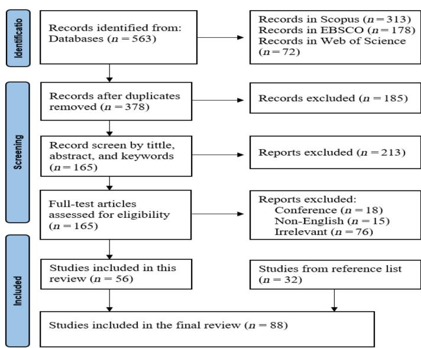
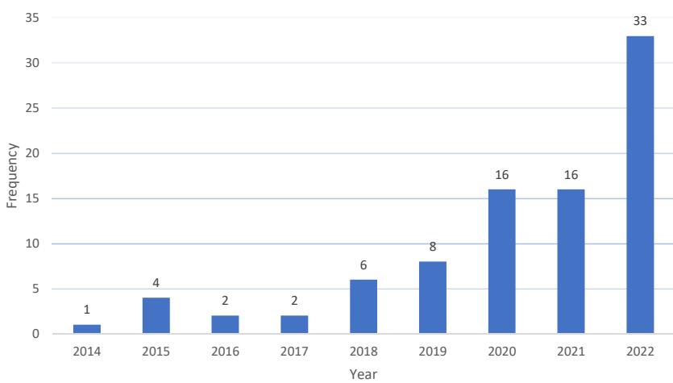

# A systematic literature review on the determinants of cryptocurrency pricing

Sanshao Peng, Catherine Prentice, Syed Shams and Tapan Sarker School of Business, University of Southern Queensland – Springfield Campus, Springfield Central, Australia

#### Abstract

Purpose – Given the cryptocurrency market boom in recent years, this study aims to identify the factors influencing cryptocurrency pricing and the major gaps for future research.

Design/methodology/approach – A systematic literature review was undertaken. Three databases, Scopus, Web of Science and EBSCOhost, were used for this review. The final analysis comprised 88 articles that met the eligibility criteria.

Findings – The influential factors were identified and categorized as supply and demand, technology, economics, market volatility, investors' attributes and social media. This review provides a comprehensive and consolidated view of cryptocurrency pricing and maps the significant influential factors.

Originality/value – This paper is the first to systematically and comprehensively review the relevant literature on cryptocurrency to identify the factors of pricing fluctuation. This research contributes to cryptocurrency research as well as to consumer behaviors and marketing discipline in broad.

Keywords Cryptocurrency, Systematic literature review, Influential factors

Paper type Literature review

#### Introduction

In recent years, cryptocurrencies have attracted more attention in the wider community, with market capitalization reaching a high level [\(Bouri, Shahzad, & Roubaud, 2019](#page-24-0); [Fry, 2018\)](#page-25-0). Cryptocurrency refers to a digital payment system that operates similarly to the standard monetary currency system and allows users to send and receive virtual payments outside of traditional financial institutions. These virtual payments offer low transaction costs and a peerto-peer system [\(Kim, Bock, & Lee, 2021\)](#page-26-0). The decentralization of cryptocurrencies has been a key factor in the enhancement of user privacy and provides various levels of anonymity ([Sarwar, Nisar, & Khan, 2019\)](#page-27-0). Bitcoin was the first decentralized blockchain-based cryptocurrency and continues to be the most well-known and widely used cryptocurrency in the market [\(Li & Wang, 2017](#page-26-1)). A blockchain is a distributed ledger technology that allows data to be recorded and shared across a network of computers or nodes. Each block in the blockchain contains a list of transactions, and once a block is added to the chain, it cannot be altered. The immutability of records is a key feature of blockchain technology and provides a high level of trust and security [\(Ferguson, 2018](#page-24-1)). Blockchain provides users with the promise of transaction trust and transparency. Blockchain technology, as demonstrated by cryptocurrency, is also widely considered to be a significant innovation with profound implications for the future of finance ([Liu, Tsyvinski, & Wu, 2022](#page-26-2)).

Determinants of cryptocurrency pricing

1

Received 26 May 2023 Revised 9 August 2023 Accepted 31 August 2023

China Accounting and Finance Review Vol. 26 No. 1, 2024 pp. 1-30 Emerald Publishing Limited e-ISSN: 2307-3055 p-ISSN: 1029-807X DOI [10.1108/CAFR-05-2023-0053](https://doi.org/10.1108/CAFR-05-2023-0053)

© Sanshao Peng, Catherine Prentice, Syed Shams and Tapan Sarker. Published in China Accounting and Finance Review. Published by Emerald Publishing Limited. This article is published under the Creative Commons Attribution (CC BY 4.0) licence. Anyone may reproduce, distribute, translate and create derivative works of this article (for both commercial and non-commercial purposes), subject to full attribution to the original publication and authors. The full terms of this licence may be seen at [http://](http://creativecommons.org/licences/by/4.0/legalcode) [creativecommons.org/licences/by/4.0/legalcode](http://creativecommons.org/licences/by/4.0/legalcode)

While cryptocurrency innovation brings benefits and potential advantages, it also poses significant challenges and issues for traditional financial systems. This is because cryptocurrencies diverge from traditional financial assets in their value determination. Instead of being reliant on tangible assets or governments, the value of cryptocurrencies is based on specific algorithms that record transactions within the underlying blockchain networks ([Corbet, Lucey, Urquhart, & Yarovaya, 2019](#page-24-2)). [Yermack \(2015\)](#page-28-0) highlighted the prevalence of speculative price bubbles in the cryptocurrency market. These bubbles arise from swift and sometimes irrational increases in cryptocurrency prices, often not supported by underlying fundamentals. Thus, the unique nature of cryptocurrencies, their decentralized structure and the influence of speculative factors pose distinct challenges for investors and policymakers. Understanding these characteristics is crucial when assessing the value and potential risks associated with cryptocurrency market investment.

Studies have shed light on the factors influencing the price of Bitcoin and other more notable cryptocurrencies. In the case of Bitcoin, its decentralized system and a unique combination of anonymous miners and profit-driven incentives have been the primary drivers of innovation. This innovation has encouraged investors to participate freely in the Bitcoin market and has motivated researchers to identify the various factors that affect returns [\(Leshno & Strack, 2020\)](#page-26-3). [Van Wijk](#page-28-1) [\(2013\)](#page-28-1) investigated the influence of macroeconomic factors on bitcoin price and suggested that factors such as the stock market index, exchange rates and oil prices impacted Bitcoin's value. [Polasik, Piotrowska, Wisniewski, Kotkowski, and Lightfoot \(2015\)](#page-27-1) observed that the Bitcoin price experienced exponential growth in July 2010, which was attributed to increased trading against the US dollar. [Bouoiyour and Selmi \(2015\)](#page-23-0) found that the long-term price increase in Bitcoin was influenced by a growing demand for Bitcoin trading and exchange transactions.[Kristoufek \(2013\)](#page-26-4) indicated that the increased interest, as measured by the number of Google searches for Bitcoin, had a positive impact on Bitcoin's price. The prices of common cryptocurrencies such as Bitcoin, Ethereum, Dash, Litecoin and Monero were significantly affected by factors related to the overall crypto market, the attractiveness of individual cryptocurrencies and movement in the S&P 500 Index [\(Sovbetov, 2018](#page-28-2)). Technological factors were also an important determinant influencing Bitcoin price in the early market [\(Li & Wang, 2017](#page-26-1)).

Studies have provided many determinants of cryptocurrency pricing within the existing financial market; however, research on cryptocurrency pricing is rather fragmented. This study systematically reviews the literature and identifies and synthesizes the factors that influence cryptocurrency pricing. This review contributes to the literature by providing a consolidated view of cryptocurrency pricing and systematically maps significant influential factors. This review also highlights the different research methods used in cryptocurrency pricing studies and identifies those commonly applied. This review provides a depth of understanding and a more comprehensive discussion of the determinants of cryptocurrency prices. This consolidation of the literature will inform investors and investment managers about the market dynamics of cryptocurrencies. Thus, it will guide the construction of more comprehensive cryptocurrency price prediction models and trading decisions within the cryptocurrency market.

The following presents the methodology, including the procedure used to conduct the systematic literature review, followed by the results of the review. The study highlights research gaps and offers direction for future research. The conclusion presents the implications of the study, and limitations are acknowledged.

# Method

To identify the influential factors of cryptocurrency pricing, this systematic literature review utilized the Preferred Reporting Items for Systematic Review and Meta-Analyses (PRISMA) approach. PRISMA is an evidence-based approach for reporting and evaluating the literature

([Saeed, Paolo, & Sarah NR, 2019](#page-27-2)) and is regarded as an appropriate methodology for reproducing data, especially when compared to narrative literature reviews [\(Rother, 2007\)](#page-27-3).

### Keywords and databases

This review followed a predetermined search strategy using the terms ("cryptocurrency" OR "encryption currency" OR "digital money" OR "digital currency") AND ("factor" OR "determine") AND "(price)". Three databases, Scopus, Web of Science and EBSCOhost, were used as most relevant studies can be sourced from these databases [\(Akyildirim, Aysan,](#page-23-1) [Cepni, & Darendeli, 2021;](#page-23-1) Liu et al.[, 2022;](#page-26-2) [Mohamed, 2021\)](#page-26-5). To maintain a consistent standard for analysis and to ensure high-quality findings, this review only considered peer-reviewed journal articles which provided reliable and accurate data (Li et al.[, 2019\)](#page-26-6). Articles published in English were chosen. This review included all relevant studies published before August 2022 when the search was conducted. The review followed the procedure described in the PRISMA checklist [\(Tricco](#page-28-3) et al., 2018).

#### Screening

Figure 1 presents the flow chart of the systematic literature review using the PRISMA approach. The initial search yielded a total of 563 articles: Scopus (313), Web of Science (72) and EBSCOhost (178). EndNote X9 software was utilized to screen the articles for duplication, with 185 articles discarded as duplicates. A further 213 articles were taken out after initial screening based on a comprehensive review of titles and abstracts. The remaining 165 articles were assessed for eligibility. In this assessment, 76 articles did not explicitly examine the factors of cryptocurrency pricing and were excluded. A further 18 peer-reviewed journal articles were removed as they were conference papers, and 15 articles were excluded as they were not in English. A total of 56 articles met the eligibility criteria for final analysis. The review conducted a thorough examination of the reference lists, which resulted in the inclusion of an additional 32

Figure 1. Flow chart of systematic literature review

articles. This resulted in 88 articles being selected for the review. This approach ensured the inclusion of a diverse and relevant body of literature for the review.

# Results

### Publishing trends and currency focus

Much of the literature focused on Bitcoin, suggesting that it remains the most popular and widely researched cryptocurrency. As a pioneer and the first cryptocurrency, Bitcoin has received significant attention from researchers, investors and the general public ([Wang &](#page-28-4) [Vergne, 2017](#page-28-4)). The earliest article on cryptocurrency pricing was published in 2014, indicating that research remains in the early stages of development. As cryptocurrencies gained traction and public attention over the last decade, academic interest in pricing dynamics also grew. The upward trend in the number of published studies on cryptocurrency pricing reflects increasing interest and recognition of the importance of this research topic. The development of the research is presented in Figure 2.

#### Journal outlets

Studies of cryptocurrency pricing have been published in journals across a wide range of disciplines, with a primary focus on finance. [Table 1](#page-4-0) highlights the 54 different journals that have published cryptocurrency pricing studies. The spread of interest indicates recognition of the importance of this research area. Finance Research Letters published a total of 27 articles, followed by the PLoS One journal (4), Financial Innovation (2), Journal of Risk and Financial Management (2), Journal of Behavioural Finance (2), Studies in Economics and Finance (2) and International Review of Financial Analysis (2). The distribution of the remaining 47 articles across journals from various disciplines highlights the wide-ranging interest and the multifaceted nature of cryptocurrencies. The journals covered disciplines such as electrical energy, technological innovation, social media, investor sentiment and macroeconomic policy.

#### Countries

Geographic analysis considered the location of data collection of the studies included in the review. An understanding of the geographic distribution of research and how different regions

**Source(s):** Figure created by the authors

Figure 2. Number of articles published between 2014 and August 2022

| Journal                                                            | Number of articles |           |      |      |      |      |      |      | Jan-Aug 2022 |              |
|--------------------------------------------------------------------|--------------------|-----------|------|------|------|------|------|------|--------------|--------------|
|                                                                    |                    | 2014      | 2015 | 2016 | 2017 | 2018 | 2019 | 2020 | 2021         | Jan-Aug 2022 |
| <i>Finance Research Letters</i>                                    |                    | <b>27</b> |      |      |      |      |      |      |              | <b>24</b>    |
| <i>Journal of Finance</i>                                          | 1                  | 1         |      |      |      |      | 1    | 1    |              | 1            |
| <i>PLoS One</i>                                                    | 4                  | 1         | 1    |      | 1    |      |      |      | 1            |              |
| <i>Journal of Network Theory in Finance</i>                        | 1                  |           |      |      |      | 1    |      |      |              | 1            |
| <i>International Review of Economics and Finance</i>               | 1                  |           |      |      |      |      |      |      | 1            | 1            |
| <i>The Quarterly Review of Economics and Finance</i>               | 1                  |           |      |      |      |      |      |      | 1            | 1            |
| <i>Mathematical Social Science</i>                                 | 1                  |           |      |      |      |      |      |      |              | 1            |
| <i>American Economic Review: Insight</i>                           | 1                  |           |      |      |      |      |      |      |              |              |
| <i>The North American Journal of Economics and Finance</i>         | 1                  |           |      |      |      |      | 1    |      |              |              |
| <i>Economic Modelling</i>                                          | 1                  |           |      |      |      |      |      |      |              |              |
| <i>Journal of The Royal Society Interface</i>                      | 1                  | 1         | 1    |      |      |      |      |      |              |              |
| <i>International Journal of Electronic Commerce</i>                | 1                  |           | 1    |      |      |      |      |      |              |              |
| <i>Applied Economics</i>                                           | 1                  |           | 1    |      |      |      |      |      |              |              |
| <i>Information Systems and e-Commerce Management</i>               | 1                  |           |      | 1    |      |      |      |      |              |              |
| <i>Decision Support Systems</i>                                    | 1                  | 1         | 1    |      |      |      |      |      |              |              |
| <i>Financial Innovation</i>                                        | 2                  |           |      | 1    |      |      |      |      |              |              |
| <i>Journal of Risk and Financial Management</i>                    | 2                  |           |      |      |      | 1    |      |      |              |              |
| <i>Procedia Computer Science</i>                                   | 1                  |           |      |      |      |      | 1    |      |              |              |
| <i>Malaysian Journal of Economic Studies</i>                       | 1                  |           |      |      |      |      |      | 1    |              |              |
| <i>Investment Management and Financial Innovations</i>             | 1                  |           |      |      |      |      | 1    |      |              |              |
| <i>Barasian Economic Review</i>                                    | 1                  |           |      |      |      | 1    |      |      |              |              |
| <i>ACM SIGMETRICS Performance Evaluation Review</i>                | 1                  |           |      |      |      | 1    |      |      |              |              |
| <i>International Journal of Scientific and Technology Research</i> | 1                  |           |      |      |      |      |      |      |              |              |
| <i>Frontiers in Artificial Intelligence</i>                        | 1                  |           |      |      |      |      |      | 1    |              |              |
| <i>Journal of Management Analytics</i>                             | 1                  |           |      |      |      |      |      |      | 1            |              |
| <i>EPJ Data Science</i>                                            | 1                  |           |      |      |      |      |      |      |              |              |

Table 1. Article distribution by journal and date of publication

| Journal                                                                                                                                                                                                                                                                                                                                    | Number of articles | 2014 | 2015 | 2016 | 2017 | 2018 | 2019 | 2020 | 2021 | Jan-Aug 2022 |
|--------------------------------------------------------------------------------------------------------------------------------------------------------------------------------------------------------------------------------------------------------------------------------------------------------------------------------------------|--------------------|------|------|------|------|------|------|------|------|--------------|
| <i>Financial Studies</i>                                                                                                                                                                                                                                                                                                                   | 1                  |      |      |      |      |      |      |      | 1    |              |
| <i>The European Journal of Finance</i>                                                                                                                                                                                                                                                                                                     | 1                  |      |      |      |      |      |      |      | 1    |              |
| <i>Journal of Industrial and Business Economics Resources Policy</i>                                                                                                                                                                                                                                                                       | 1                  |      |      |      |      |      | 1    |      | 1    |              |
| <i>Economic Letters</i>                                                                                                                                                                                                                                                                                                                    | 1                  |      |      |      |      |      | 1    |      | 1    |              |
| <i>Annals of Operations Research Mathematics</i>                                                                                                                                                                                                                                                                                           | 1                  |      |      |      |      |      | 1    |      | 1    |              |
| <i>Research in International Business and Finance Journal of Information Security and Applications</i>                                                                                                                                                                                                                                     | 1                  |      |      |      |      |      | 1    |      | 1    |              |
| <i>Journal of Energy Markets Journal of Behavioural Finance</i>                                                                                                                                                                                                                                                                            | 2                  |      |      |      |      | 1    | 1    |      | 1    |              |
| <i>Entropy Journal of Economics and Finance DLSU Business and Economic Reviews Organizations and Markets in Emerging Economies Journal of Behavioural and Experimental Finance Export Systems with Applications</i>                                                                                                                        | 1                  |      |      |      |      | 1    | 1    |      | 1    |              |
| <i>Studies in Economics and Finance Journal of Business Research Review of Behavioural Finance Applied Economics Letters Pamukbale University Journal of Social Sciences Institute International Review of Financial Analysis Journal of Computer Information Systems Computational Economics Journal of Risk and Financial Management</i> | 1                  |      |      |      |      | 1    | 1    |      | 1    |              |
| <i>Annals of Economics and Finance Journal of Banking and Finance</i>                                                                                                                                                                                                                                                                      | 1                  | 1    |      |      |      |      | 1    |      | 1    |              |

# CAFR 26,1

or countries contribute to the body of knowledge of cryptocurrency pricing is also included. The 88 studies were conducted in 18 different regions, with Europe accounting for 29 studies; followed by the United Kingdom (12), China (12), the United States (9), United Arab Emirates (4), Russia (3), India (3), Canada (3), Australia (3) and South Korea (2) (seeTable 2). The imposition of restrictions on cryptocurrency trading by the Chinese government in September 2017 had an impact on cryptocurrency pricing research [\(Chen & Liu, 2022](#page-24-3)). However, despite the regulatory challenges, 12 studies were conducted in China and contributed to the literature.

# Research methods

[Table 3](#page-7-0) presents the research methods used to analyze the determinants of cryptocurrency pricing. The most used model was the vector autoregression model (9), followed by the autoregressive distributed lag model (6), generalized autoregressive conditional heteroskedasticity model (5), three-factor model (4), the fixed-effect model (3), the wavelet coherence analysis (3), the ordinary least squares (L.S.) regression (2), the vector error correlation (2), the asset pricing model (2), the cost of production model (2) and the text analytic approach (2). The vector autoregression model is a statistical model used to reveal correlations between variables as they change over time [\(Garcia, Tessone, Mavrodiev, & Perony, 2014\)](#page-25-1) and generates a vector error correction model [\(Hakim das Neves, 2020](#page-25-2)). This model has achieved better performance in simulating past Bitcoin trading prices, in contrast to traditional autoregression models and Bayesian regression models [\(Ibrahim, Kashef, Li, Valencia, & Huang, 2020](#page-25-3)).

# Cryptocurrency pricing factors

The current review identified and categorized the factors that influence cryptocurrency pricing. These factors include (i) supply and demand, (ii) technology, (iii) economics, (iv) market volatility, (v) investors' attributes and (vi) social media, where the categories are not mutually exclusive. The following subsections present a discussion of each category.

|             | Number of                    | Jan-Aug                  |
|-------------|------------------------------|--------------------------|
| Location    | articles 2014 2015 2016      | 2017 2018 2019 2020 2021 |
| USA         | 9                            | 1 2 2 4                  |
| Europe      | 29 1 2 1                     | 4 1 6 2 11               |
| UK          | 12 1                         | 2 3 1 1 4                |
| Canada      | 3                            | 1 1 1                    |
| China       | 12 1                         | 1 1 3 6                  |
| South Korea | 2                            | 1 1                      |
| Taiwan      | 1                            | 1                        |
| UAE         | 4                            | 1 1 1 1                  |
| Russia      | 3                            | 1 1 1                    |
| Brazil      | 1                            | 1                        |
| India       | 3                            | 1 1 1                    |
| Philippines | 1                            | 1                        |
| Indonesia   | 1                            | 1                        |
| Australia   | 3                            | 1 2                      |
| Tunisia     | 1                            | 1                        |
| Japan       | 1                            | 1                        |
| Bangladesh  | 1                            | 1                        |
| Lebanon     | 1                            | 1                        |
| Source(s):  | Table created by the authors |                          |

Table 2. Article distribution by country and date of publication

|                 | Number                                                                |
|-----------------|-----------------------------------------------------------------------|
|                 | of articles 2014 2015 2016 2017 2018 2019 2020 2021 2022 Theory/Model |
| Vector          | autoregression                                                        |
| analysis        | 9 * * * *** * **                                                      |
| Wavelet         | coherence                                                             |
| analysis        | 3 * * *                                                               |
| distributed     | lag model                                                             |
|                 | 6 * * * * ** Autoregressive                                           |
| Ordinary        | least squares                                                         |
| regression      | 2 * * *                                                               |
| Long short-term | memory                                                                |
| model           | 3 * * *                                                               |
| Vector          | error correlation 2 * *                                               |
| Text analytic   | approach 2 * *                                                        |
| Tobit           | estimation                                                            |
| approach        | 1 *                                                                   |
| Modular         | Integrated                                                            |
| Distributed     | Analysis                                                              |
| System          | 1 *                                                                   |
| Least           | Absolute                                                              |
| Shrinkage       | and Selection                                                         |
| Operator        | 2 * * Generalized                                                     |
| Conditional     | 5 * **** AutoRegressive Heteroskedasticity                            |
| Dynamics        | Equi                                                                 |
| correlation     | Model                                                                 |
|                 | 2 **                                                                  |
| Overlapping     | generations                                                           |
| model           | 1 *                                                                   |
| Axiomatic       | approach 1 *                                                          |
| Impossibility   | theorem 1 *                                                           |
| Machine         | learning                                                              |
| approach        | 1 *                                                                   |
| Dynamic         | Bayesian                                                              |
| model           | 1 *                                                                   |
| Smooth          | Transition                                                            |
| Conditional     | Correlation                                                           |
| Model           | 1 *                                                                   |
| Quantile        | regression 1 * Quantile-on-quantile                                   |
| regression      | 2 **                                                                  |
| Rolling         | window                                                                |
| estimations     | 1 *                                                                   |
| Augmented       | version of                                                            |
| Barro ’         | s model                                                               |
|                 | 1 *                                                                   |
| Comparative     | analysis 1 *                                                          |
| Artificial      | recurrent                                                             |
| neural          | network model                                                         |
|                 | 1 *                                                                   |
| Bayesian        | structural time                                                       |
| series          | approach                                                              |
|                 | 1 *                                                                   |
| integrated      | moving                                                                |
| average         | model                                                                 |
|                 | 2 * * Autoregressive                                                  |
|                 | ( continued )                                                         |

(continued)

Table 3. Main theories or models in studies

# CAFR 26,1

#### Supply and demand

Studies in[Table 4](#page-9-0) have shown that the basic principles of supply and demand are fundamental factors which play a crucial role in determining cryptocurrency prices ([Ciaian, Rajcaniova, &](#page-24-4) [Kancs, 2016;](#page-24-4) [Lamothe-Fern](#page-26-7)[andez, Alaminos, Lamothe-L](#page-26-7)o[pez, & Fern](#page-26-7)[andez-G](#page-26-7)[amez, 2020\)](#page-26-7). Bitcoin was the most cited currency. The supply of Bitcoins has been asymptotically capped at 21 million ([Polasik](#page-27-1) et al., 2015) and is governed by a special cryptographic algorithm that determines the frequency, time and amount of Bitcoin supply [\(Ibrahim](#page-25-3) et al., 2020; [Sauer, 2016\)](#page-27-4). While the supply of Bitcoin works as a standard supply, the growth of supply leads to downtrend pressures being exerted on its price. This means that a negative relationship exists between the supply of Bitcoin and its price [\(Ciaian](#page-24-4) et al., 2016; [Dubey, 2022](#page-24-5); [Kristoufek, 2015\)](#page-26-8). However, it has been argued that growth in the cryptocurrency supply can drive up the price, based on a random-effect and fixed-effect analysis [\(Wang & Vergne, 2017](#page-28-4)), the rationale being that new cryptocurrencies appear to be more attractive than older competitors.

Although the literature provides evidence that the supply of cryptocurrency has a significant effect on the price, demand-side drivers have a stronger impact on cryptocurrency prices [\(Ciaian](#page-24-4) et al.[, 2016](#page-24-4), [Ciaian, Rajcaniova, & Kancs, 2016\)](#page-24-6). An increase in the number of Bitcoins available for

|               | Determinants Number of                                                               |
|---------------|--------------------------------------------------------------------------------------|
|               | of articles 2014 2015 2016 2017 2018 2019 2020 2021 2022 Theory/Model cryptocurrency |
| Fourier       | KPSS unit root                                                                       |
| test          | 1 * pricing                                                                          |
| Asymmetric    | nonlinear                                                                            |
| cointegration | approach                                                                             |
|               | 1 *                                                                                  |
| Negative      | coefficient of                                                                       |
| skewness      | analysis                                                                             |
|               | 1 *                                                                                  |
| Markov        | regime                                                                              |
| switching     | model                                                                                |
|               | 1 *                                                                                  |
| Asset         | pricing model 2 * *                                                                  |
| Robust        | least squares                                                                        |
| (L.S.)        | method                                                                               |
|               | 1 *                                                                                  |
| Sentiment     | index model 1 *                                                                      |
| Corpus        | linguistics                                                                          |
| approach      | 1 *                                                                                  |
| Value-at-risk | analysis 1 *                                                                         |
| Garman        | – Klass analysis 1 *                                                                 |
| Systematic    | review 1 *                                                                           |
| Quantile      | regression                                                                           |
| approach      | 1 *                                                                                  |
| Linear        | discriminant                                                                         |
| analysis      | 1 *                                                                                  |
| conditional   | jump                                                                                 |
| intensity     | model                                                                                |
|               | 1 * Autoregressive                                                                   |
| Structural    | break analysis 1 *                                                                   |
|               | autoregressive model                                                                 |
|               | 1 * Heterogeneous                                                                    |
|               | Random-effect analysis 2 * *                                                         |
| Deep          | learning                                                                             |
| integration   | method                                                                               |
|               | 1 *                                                                                  |
| Portfolio     | analysis 2 * *                                                                       |
| Cost of       | production model 2 * *                                                               |
| Fixed-effect  | analysis 3 * * *                                                                     |
| Three-factor  | model 4 * * **                                                                       |
| Source(s):    | Table created by the authors Table 3.                                                |

transactions may result in Bitcoin price volatility and a massive speculative price bubble [\(Ciaian](#page-24-4) et al.[, 2016\)](#page-24-4). The growth of a transactional need for Bitcoin leads to an increase in price [\(Kara](#page-25-4)O[Mer,](#page-25-4) € [2022\)](#page-25-4). For example, Bitcoin trading against the US dollar has increased exponentially since July 2010 [\(Polasik](#page-27-1) et al., 2015). Additionally, Bitcoin as a payment method has had a positive effect on Bitcoin price [\(Polasik](#page-27-1) et al., 2015) as many people in developing countries have limited access to traditional bank transfer systems [\(Schuh & Stavins, 2011\)](#page-27-5). Network factors including wallet users, payment accounts and transaction accounts were the main demand for cryptocurrencies and contributed to the volatility of their returns [\(Liu & Tsyvinski, 2021;](#page-26-9)[Nakagawa & Sakemoto, 2022](#page-26-10)). [Bouri, Vo, and Saeed \(2021\)](#page-24-7) highlighted the importance of trading volume in shaping the dynamics of the cryptocurrency market and its impact on returns and correlations. A Garman–Klass analysis also demonstrated that the emergence of other cryptocurrencies positively affected Bitcoin returns [\(Be](#page-23-2)˛[dowska-S](#page-23-2)[ojka, Kliber, & Rutkowska, 2021\)](#page-23-2). Although Bitcoin is governed by a cryptographic algorithm, its usage in transactions, supply and price level are consistent with standard economic theory, especially the quantity theory of money [\(Kristoufek, 2015](#page-26-8)).

| No | Authors         | Location                 | Methodology          | Influential factor | Relationship | Currency types  |
|----|-----------------|--------------------------|----------------------|--------------------|--------------|-----------------|
| 1  | Kristoufek      |                          |                      |                    |              |                 |
|    |                 | UK                       | Wavelet coherence    |                    |              |                 |
|    |                 |                          |                      | Bitcoin supply     | Negative     | Bitcoin price   |
| 2  | Ciaian et al.   |                          |                      |                    |              |                 |
|    |                 | Europe                   | Vector               |                    |              |                 |
|    |                 |                          |                      | Bitcoin supply     | Negative     | Bitcoin price   |
| 3  | Dubey           |                          |                      |                    |              |                 |
|    |                 | India                    | Random-effect        |                    |              |                 |
|    |                 |                          | regression model     |                    |              |                 |
|    |                 |                          |                      | Bitcoin supply     | Negative     | Bitcoin price   |
| 4  | Wang and        |                          |                      |                    |              |                 |
|    |                 | Canada                   | Random-effect and    |                    |              |                 |
|    |                 |                          |                      |                    | Positive     | Cryptocurrency  |
| 5  | Polasik et al.  |                          |                      |                    |              |                 |
|    |                 | Europe                   | Ordinary least       |                    |              |                 |
|    |                 |                          | squares and tobit    |                    |              |                 |
|    |                 |                          |                      |                    | Positive     | Bitcoin price   |
| 6  | Ciaian et al.   |                          |                      |                    |              |                 |
|    |                 | Europe                   | Augmented            |                    |              |                 |
|    |                 |                          | version of Barro ’ s |                    |              |                 |
|    |                 |                          |                      |                    | Positive     | Bitcoin price   |
| 7  | KaraOMer €      |                          |                      |                    |              |                 |
|    |                 | Europe                   | Autoregressive       |                    |              |                 |
|    |                 |                          | distributed lag      |                    |              |                 |
|    |                 |                          |                      |                    | Positive     | Bitcoin price   |
| 8  | Polasik et al.  |                          |                      |                    |              |                 |
|    |                 | Europe                   | Ordinary least       |                    |              |                 |
|    |                 |                          | squares and tobit    |                    |              |                 |
|    |                 |                          |                      | Bitcoin payment    | Positive     | Bitcoin price   |
| 9  | B e ˛ dowska   |                          |                      |                    |              |                 |
|    | S  ojka et al. |                          |                      |                    |              |                 |
|    |                 | Europe                   | Garman – Klass       |                    |              |                 |
|    |                 |                          |                      |                    | Positive     | Bitcoin returns |
| 10 | Bouri et al.    |                          |                      |                    |              |                 |
|    |                 | Lebanon                  | The dynamic equi    |                    |              |                 |
|    |                 |                          | corelation model     |                    |              |                 |
|    |                 |                          |                      |                    | Positive     | Cryptocurrency  |
| 11 | Nakagawa        |                          |                      |                    |              |                 |
|    |                 | Japan                    | The machine          |                    |              |                 |
|    |                 |                          | learning approach    |                    |              |                 |
|    |                 |                          |                      |                    | Positive     | Cryptocurrency  |
| 12 | Liu and         |                          |                      |                    |              |                 |
|    |                 | USA                      | The Capital Asset    |                    |              |                 |
|    |                 |                          | Pricing Model and    |                    |              |                 |
|    |                 |                          | Fama – French        |                    |              |                 |
|    |                 |                          | three-factor model   |                    |              |                 |
|    |                 |                          |                      |                    | Positive     | Cryptocurrency  |
|    | Source(s):      | Tablecreatedbytheauthors |                      |                    |              |                 |

Source(s): Table created by the authors Table 4. Fundamental factors

# CAFR 26,1

# Technology

As can be seen inTable 5, the literature suggests that Bitcoin mining is one of the main factors driving the supply and pricing of Bitcoin ([Bouoiyour & Selmi, 2016](#page-24-8); [Garcia](#page-25-1) et al., 2014; [Ibrahim](#page-25-3) et al., 2020). Bitcoin supply is determined by a mathematical algorithm for blockchain hashing ([Ibrahim](#page-25-3) et al., 2020), where any attempt to modify the amount of issuance is rejected

|                      | Influential                                                                    |
|----------------------|--------------------------------------------------------------------------------|
| No Authors Location  | Methodology                                                                    |
|                      | factor Relationship Currency type                                              |
| 1 KaraOMer €         |                                                                                |
| Europe               | Autoregressive                                                                 |
|                      | distributed lag                                                                |
| (2022)               | Hash rate Positive Bitcoin returns model                                       |
| 2 Kjaerland          |                                                                                |
| et al. (2018)        |                                                                                |
| Europe               | Autoregressive                                                                 |
|                      | distributed lag                                                                |
|                      | Hash rate N/A Bitcoin returns model                                            |
| 3 Fantazzini         |                                                                                |
| and Kolodin          |                                                                                |
| Russia               | Cost of                                                                        |
|                      | production model                                                               |
| (2020)               | Hash rate N/A Bitcoin price                                                    |
| 4 Li and Wang        |                                                                                |
| China                | Autoregressive                                                                 |
|                      | distributed lag                                                                |
| (2017)               | Positive Bitcoin price Mining difficulty model                                 |
| 5 Kristoufek         |                                                                                |
| UK                   | Wavelet                                                                        |
| (2015)               | Positive Bitcoin price Mining coherence difficulty analysis                    |
| 6 Guizani and        |                                                                                |
| Nafti (2019)         |                                                                                |
| Tunisia              | Autoregressive                                                                 |
|                      | distributed lag                                                                |
|                      | Positive Bitcoin price Mining difficulty model                                 |
| 7 Meynkhard          |                                                                                |
| Russia               | Comparative                                                                    |
| (2019)               | Halving Positive Cryptocurrency analysis price                                 |
| 8 Ibrahim et al.     |                                                                                |
| Canada               | Vector                                                                         |
| (2020)               | Halving Positive Bitcoin price autoregression model                            |
| 9 Fantazzini         |                                                                                |
| and Kolodin          |                                                                                |
| Russia               | Cost of                                                                        |
|                      | production model                                                               |
| (2020)               | Halving Positive Bitcoin price                                                 |
| 10 Sapkota and       |                                                                                |
| Europe Grobys (2020) | Portfolio analysis Mining cost Positive Cryptocurrency price                   |
| 11 Chico-Frias       |                                                                                |
| Philippines          | Cost of                                                                        |
|                      | production model                                                               |
| (2021)               | Mining cost Positive Cryptocurrency price                                      |
| 12 Baldan and        |                                                                                |
| Zen (2020)           |                                                                                |
| Europe               | Vector                                                                         |
|                      | Mining cost N/A Bitcoin price autoregression model                             |
| 13 Chen (2021) USA   | Vector error                                                                   |
|                      | correction model                                                               |
|                      | Positive Bitcoin price Blockchain technology                                   |
| 14 Kim et al.        |                                                                                |
|                      | moving average                                                                 |
| South Korea (2021)   | Positive Ethereum price Autoregressive Blockchain integrated information model |
| 15 Wang and          |                                                                                |
| Canada               | Random-effect                                                                  |
|                      | and fixed-effect                                                               |
| Vergne (2017)        | Positive Cryptocurrency Other technological returns analysis factors           |
| 16 Chowdhury         |                                                                                |
| et al. (2022)        |                                                                                |
| USA                  | Quantile vector                                                                |
|                      | The consensus                                                                  |
|                      | Positive Cryptocurrency autoregressive protocol returns model technologies     |

Source(s): Table created by the authors

Table 5. Technological factors

([Nelson, 2018\)](#page-27-7). The term hash rate refers to the speed of computer processing power in the Bitcoin network [\(Lopatin, 2019](#page-26-14)). There are indications that growth in the hash rate has a significant and positive effect on Bitcoin returns ([Kara](#page-25-4)O[Mer, 2022](#page-25-4) € ). However, [Kjaerland,](#page-26-12) [Khazal, Krogstad, Nordstrom, and Oust \(2018\)](#page-26-12) argued that the hash rate is an irrelevant technological factor for modeling Bitcoin return dynamics, the reason being that the underlying code makes the supply of Bitcoins deterministic, which contrasts with previous studies. This finding was supported by [Fantazzini and Kolodin \(2020\)](#page-24-9) who demonstrated that the hash rate had no direct effect on the Bitcoin price from the energy efficiency effect of Bitcoin mining equipment, based on the cost of production model.

Mining difficulty is also an important determinant influencing the supply and pricing of Bitcoin ([Kristoufek, 2015](#page-26-8)). The term "mining difficulty" refers to a measurement unit used in the process of Bitcoin mining to maintain the speed of block generation and the hash rate criterion [\(Zhang, Qin, Yuan, & Wang, 2018\)](#page-28-5). The unique Bitcoin mining process has a significant effect on the Bitcoin price ([Kristoufek, 2015](#page-26-8)). In other words, an increase in mining difficulty leads to an increase in the Bitcoin price [\(Guizani & Nafti, 2019\)](#page-25-5). This is in line with [Li](#page-26-1) [and Wang \(2017\)](#page-26-1) who used the autoregressive distributed lag model to confirm that the growth of mining difficulty would increase the Bitcoin price in the early market. The rationale for this is that the short-term adjustment in the Bitcoin price is the response to the growth of mining difficulty, although mining difficulty has a weak impact on the Bitcoin price in the long term ([Guizani & Nafti, 2019](#page-25-5)).

Halving is another technical factor that influences the supply and pricing of Bitcoin ([Ibrahim](#page-25-3) et al., 2020; [Meynkhard, 2019](#page-26-13)). The term Bitcoin halving refers to a process in which the reward for mining Bitcoin transactions is reduced by half [\(Ramos & Zanko, 2020\)](#page-27-8). Miners can earn new Bitcoins as remuneration for their work, but the block subsidy will decrease by 50% every four years. Reducing the supply of Bitcoins every four years leads to the growth of Bitcoin capitalization ([Fantazzini & Kolodin, 2020\)](#page-24-9). [Ramos and Zanko \(2020\)](#page-27-8) demonstrated that the first halving occurrence caused increases in the Bitcoin price, market capitalization and average transaction fees. [Meynkhard \(2019\)](#page-26-13) utilized comparative analysis to show that halving positively affected the cryptocurrency price.

The theoretical literature has considered the cost of cryptocurrency mining as a crucial factor that influences cryptocurrency pricing. [Sapkota and Grobys \(2020\)](#page-27-6) employed portfolio analysis to explore the relationship between mining cost and cryptocurrency pricing. Results indicated that the mining cost from an energy aspect positively impacted cryptocurrency pricing. [Chico-Frias \(2021\)](#page-24-10) confirmed this impact by demonstrating that mining costs were positively related to cryptocurrency pricing, as Bitcoin mining consumes electricity ([Lamothe-Fern](#page-26-7)andez et al.[, 2020\)](#page-26-7). Nevertheless, [Baldan and Zen \(2020\)](#page-23-3) argued that profits and costs were not the factors driving Bitcoin pricing. One possible explanation is that there is insufficient evidence to support the association between Bitcoin price and mining costs. [Liu](#page-26-9) [and Tsyvinski \(2021\)](#page-26-9) confirmed that electricity and computing costs (mining costs) did not drive cryptocurrency returns. However, transaction costs can be an important determinant driving cryptocurrency pricing [\(Crettez & Morhaim, 2022](#page-24-13)) because the impact of volatility in cryptocurrency pricing can be driven by the transaction costs that individuals incur when purchasing cryptocurrency.

Empirical studies indicate that other technologies may also contribute to the volatility of the cryptocurrency price. [Chen \(2021\)](#page-24-11) argued that blockchain technology factors only demonstrated a small impact on the Bitcoin price. Kim et al. [\(2021\)](#page-26-0) showed that blockchain information was an important determinant influencing Ethereum prices. [Wang and Vergne](#page-28-4) [\(2017\)](#page-28-4) found that the drivers of cryptocurrency returns were the number of unique collaborators and proposals emerging. [Chowdhury, Damianov, and Elsayed \(2022\)](#page-24-12) indicated that the price dynamics of cryptocurrencies, particularly Rapple, were influenced by the technologies related to the consensus protocol used in these cryptocurrencies. However, Vo et al. [\(2022\)](#page-28-6) showed that cryptocurrency pricing, while changeable in the short term, may be less sensitive to technological factors and more responsive to underlying economic factors in the long term.

Economic factors. This study shows that economic factors significantly affect cryptocurrency pricing. For example, [Van Wijk \(2013\)](#page-28-1) examined the impact of Bitcoin price on macroeconomic factors, such as the stock market index, exchange rates and oil prices. [Polasik](#page-27-1) et al. (2015) showed an exponential increase in the Bitcoin price due to increased trading against the US dollar in July 2010. Similarly, [Bouoiyour and Selmi \(2015\)](#page-23-0) found that demand for Bitcoin trading and exchange transactions will drive up prices. The correlation between variables is shown in [Table 6.](#page-13-0) The economic factors most commonly examined in this research are now discussed.

Exchange rates. Exchange rates appear to have a significant effect on cryptocurrency pricing. Previous studies have demonstrated that the exchange rate has a significant and negative relationship with the Bitcoin price [\(KaraOMer, 2022](#page-25-4) € ; [Zhu, Dickinson, & Li, 2017\)](#page-28-7). [Polasik](#page-27-1) et al. (2015) demonstrated that both the US dollar and the Euro had a strong negative relationship with the Bitcoin price. These findings were consistent with [Poyser \(2019\)](#page-27-9) who suggested that the exchange rate of the Chinese yuan was negatively associated with the Bitcoin price. [Panagiotidis, Stengos, and Vravosinos \(2018\)](#page-27-10), through a Least Absolute Shrinkage and Selection Operator (LASSO) approach, revealed that the exchange rates including JPY/USD, CNY/USD, USD/EUR, and GBP/USD positively affected Bitcoin returns in order to have a positive impact. This was supported by [Huang, Gau, and Wu \(2022\)](#page-25-6) who found that the exchange rates of EUR/USD, GBP/USD and JPY/USD affected Bitcoin returns. However, it has also been argued that Bitcoin returns are not significantly affected by exchange rates USD/JPY, USD/GBP, USD/GBP and USD/AU when confidence was measured at a 95% level [\(Almansour, Almansour, & In](#page-23-4)'airat, 2020). When the confidence level was 90%, however, the exchange rate of the GBP was found to be significant.

Interest rates. Studies indicate that interest rates are also an important determinant of cryptocurrency pricing. [Nguyen, Nguyen, Nguyen, Pham, and Nguyen \(2022\)](#page-27-11) investigated the Federal rate of the US and the Chinese interbank rate on the stablecoins and cryptocurrencies, based on the Generalized AutoRegressive Conditional Heteroskedasticity (GARCH), EGARCH and the fixed-effect model. The results suggested that higher federal fund rates and Chinese interbank rates had a significant impact on both stablecoins and cryptocurrencies, leading to increased price volatility in these markets. [Havidz, Karman, and](#page-25-7) [Mambea \(2021\)](#page-25-7) also found that the Federal Reserve interest rate negatively affected the price of Bitcoin, with the negative relationship being that a higher Federal Reserve interest rate discouraged investors from investing in Bitcoin as a speculative asset. This finding was consistent with Zhu et al. [\(2017\)](#page-28-7) who stated that an increased interest rate may result in reduced speculative investment by investors. In addition, an increase in interest rates was found to reduce the demand for Bitcoin as well as its returns ([Jareno, Gonz](#page-25-8) ~ a[lez, Tolentino, &](#page-25-8) [Sierra, 2020](#page-25-8)). However, [Panagiotidis](#page-27-10) et al. (2018) found a positive effect on Bitcoin returns from interest rates through a LASSO approach.

Consumer price index (CPI). Studies have indicated that the consumer price index (CPI) is an important determinant influencing the Bitcoin price. Empirical results have suggested that the CPI had a long-term negative influence on the Bitcoin price (Zhu et al.[, 2017\)](#page-28-7). In contrast with previous findings, [Wang, Sarker, and Bouri \(2022\)](#page-28-8) argued that the CPI had a positive correlation with Bitcoin in the short term as Bitcoin can be a hedging asset. However, [Corbet, Larkin, Lucey, Meegan, and Yarovaya \(2020\)](#page-24-14) utilized a sentiment index to explore the relationship between macroeconomic news regarding the CPI and Bitcoin pricing. The results indicated that CPI news had no significant relationship with the Bitcoin price.

Gold and oil. Several studies have demonstrated that gold, as a macro-financial factor, has a significant and positive effect on the Bitcoin price. Based on deep learning methods,

| No Authors Location    | Methodology    | Influential factor Relationship Currency type           |
|------------------------|----------------|---------------------------------------------------------|
| 1 Polasik et al.       |                |                                                         |
| Europe                 | Ordinary       | least squares                                           |
|                        | and            | tobit estimation                                        |
|                        |                | US dollars Negative Bitcoin price                       |
| 2 Zhu et al.           |                |                                                         |
| China                  | Vector         | error correction                                        |
|                        |                | US dollars Negative Bitcoin price                       |
| 3 KaraOMer €           |                |                                                         |
| Europe                 | Autoregressive |                                                         |
|                        | distributed    | lag model                                               |
|                        |                | Exchange rate Negative Bitcoin price                    |
| 4 Poyser (2019) Europe | Bayesian       | structural                                              |
|                        | time           | series approach                                         |
|                        |                | Exchange rate Negative Bitcoin price                    |
| 5 Panagiotidis         |                |                                                         |
| et al. (2018)          |                |                                                         |
| Europe                 | Least          | Absolute                                                |
|                        | Shrinkage      | and                                                     |
|                        | Selection      | Operator                                                |
|                        |                | Exchange rate Positive Bitcoin returns                  |
| 6 Huang et al.         |                |                                                         |
| China                  | The            | lens of empirical                                       |
|                        | asset          | pricing analysis                                        |
|                        |                | Exchange rate Positive Bitcoin returns                  |
| 7 Nguyen et al.        |                |                                                         |
| UK                     | Fixed-effect   | model,                                                  |
|                        |                | Federal rate and                                        |
|                        |                | Chinese interbank                                       |
|                        |                | N/A Cryptocurrency                                      |
| 8 Panagiotidis         |                |                                                         |
| et al. (2018)          |                |                                                         |
| Europe                 | Least          | Absolute                                                |
|                        | Shrinkage      | and                                                     |
|                        | Selection      | Operator                                                |
|                        |                | Interest rate Positive Bitcoin returns                  |
| 9 Zhu et al.           |                |                                                         |
| China                  | Vector         | error correction                                        |
|                        |                | Interest rate Negative Bitcoin price                    |
| 10 Havidz et al.       |                |                                                         |
| Indonesia              | Fixed-effect   | model and                                               |
|                        | generalized    | method of                                               |
|                        |                | Interest rate Negative Bitcoin price                    |
| 11 Zhu et al.          |                |                                                         |
| China                  | Vector         | error correction                                        |
|                        |                | Consumer Price                                          |
|                        |                | Negative Bitcoin price                                  |
| 12 Wang et al.         |                |                                                         |
| China                  | Wavelet-based  |                                                         |
|                        |                | Consumer Price                                          |
|                        |                | Positive Bitcoin price                                  |
| 13 Corbet et al.       |                |                                                         |
| Europe                 | Sentiment      | Index News related to                                   |
|                        |                | Consumer Price                                          |
|                        |                | N/A Bitcoin price                                       |
| 14 Jare no ~ et al.    |                |                                                         |
| Europe                 | Asymmetric     | nonlinear                                               |
|                        | cointegration  | approach                                                |
|                        |                | Gold Positive Bitcoin price                             |
| 15 Lamothe            |                |                                                         |
| Fern  andez           |                |                                                         |
| et al. (2020)          |                |                                                         |
| Europe                 | Deep           | learning methods Gold Positive Bitcoin price            |
| 16 Pogudin et al.      |                |                                                         |
| UK                     | Wavelet        | coherence                                               |
|                        |                | Gold and oil Positive Bitcoin price                     |
| 17 Ciaian et al.       |                |                                                         |
| Europe                 | Augmented      | version of                                              |
|                        | Barro          | ’ s model                                               |
|                        |                | Gold and oil Positive Bitcoin price                     |
| 18 Panagiotidis        |                |                                                         |
| et al. (2018)          |                |                                                         |
| Europe                 | Least          | Absolute                                                |
|                        | Shrinkage      | and                                                     |
|                        | Selection      | Operator                                                |
|                        |                | Gold and oil Positive Bitcoin returns                   |
| 19 Jare no ~ et al.    |                |                                                         |
| Europe                 | Asymmetric     | nonlinear                                               |
|                        | cointegration  | approach                                                |
|                        |                | Oil price Negative Bitcoin price                        |
| 20 Ciaian et al.       |                |                                                         |
| Europe                 | Vector         | autoregressive                                          |
|                        |                | Oil price Negative Bitcoin price                        |
| 21 Ciaian et al.       |                |                                                         |
| Europe                 | Vector         | autoregressive                                          |
|                        |                | Dow Jones Index Positive Bitcoin price                  |
| 22 Lamothe            |                |                                                         |
| Fern  andez           |                |                                                         |
| et al. (2020)          |                |                                                         |
| Europe                 | Deep           | learning methods Dow Jones Index Positive Bitcoin price |
| 23 Zhu et al.          |                |                                                         |
| China                  | Vector         | error correction                                        |
|                        |                | Dow Jones Index Negative Bitcoin price                  |

(continued)

Table 6. Economic factors

# CAFR 26,1

[Lamothe-Fern](#page-26-7)andez et al. [\(2020\)](#page-26-7) showed that gold positively affected Bitcoin pricing. This finding was supported by [Ciaian](#page-24-6) et al. (2016) and [Pogudin, Chakrabati, and Di Matteo \(2019\)](#page-27-12) where it was found that gold and oil were positively correlated with the Bitcoin price. [Panagiotidis](#page-27-10) et al. (2018) utilizing a LASSO framework, also supported that Bitcoin returns were positively affected by gold and oil. Nevertheless, [Jaren](#page-25-8)o~ et al. [\(2020\)](#page-25-8) used the asymmetric nonlinear cointegration approach and [Ciaian](#page-24-4) et al. (2016) utilized the vector autoregressive model to reveal a negative relationship between oil price and the Bitcoin price. It was considered that as oil prices increase, available budgets (consumer and company) decrease, resulting in less expenditure on investment assets, including Bitcoin.

Stock market. Many studies in [Table 6](#page-13-0) suggest that economic indicators have a significant impact on cryptocurrency pricing. For example, the Dow Jones Index was found to be positively associated with the Bitcoin price [\(Ciaian](#page-24-4) et al., 2016; [Lamothe-Fern](#page-26-7)andez [et al.](#page-26-7), [2020\)](#page-26-7). However, Zhu et al. [\(2017\)](#page-28-7) demonstrated that the Dow Jones Index had a long-term negative effect on the price of Bitcoin. The S&P 500 Index was found to have a significant and

| No Authors Location Methodology Influential    | factor Relationship Currency type |
|------------------------------------------------|-----------------------------------|
| 24 Jaren o ~ et al.                            |                                   |
| Europe Asymmetric nonlinear                    |                                   |
| cointegration approach                         |                                   |
| S&P                                            | Index and                         |
| Chinese                                        | Stock                             |
|                                                | Positive Bitcoin price            |
| 25 Bouoiyour and                               |                                   |
| Selmi (2015)                                   |                                   |
| Europe Autoregressive                          |                                   |
| distributed lag model                          |                                   |
| S&P                                            | Index and                         |
| Chinese                                        | Stock                             |
|                                                | Positive Bitcoin price            |
| 26 Vo et al. (2022) USA Ordinary least squares |                                   |
| S&P                                            | 500 Index Positive Bitcoin price  |
| 27 Panagiotidis                                |                                   |
| et al. (2018)                                  |                                   |
| Europe Least Absolute                          |                                   |
| Shrinkage and                                  |                                   |
| Selection Operator                             |                                   |
| Nikkei                                         | Index Positive Bitcoin returns    |
| 28 Havidz et al.                               |                                   |
| Indonesia Fixed-effect model and               |                                   |
| generalized method of                          |                                   |
| Stock                                          | Market                            |
|                                                | Negative Bitcoin price            |
| 29 KaraOMer €                                  |                                   |
| Europe Autoregressive                          |                                   |
| distributed lag model                          |                                   |
| Economic                                       | Policy                            |
| Uncertainty                                    | Index                             |
|                                                | Negative Bitcoin price            |
| 30 Wang et al.                                 |                                   |
| China Wavelet-based                            |                                   |
| Economic                                       | Policy                            |
| Uncertainty                                    | Index                             |
|                                                | Negative Bitcoin price            |
| 31 Hasan et al.                                |                                   |
| Bangladesh Ordinary least square,              |                                   |
| quantile regression and                        |                                   |
| regression approaches                          |                                   |
| Uncertainty                                    | Index                             |
|                                                | Negative Bitcoin returns          |
| 32 Wu et al. (2022) China Modular Integrated   |                                   |
| Distributed Analysis                           |                                   |
| Economic                                       | Policy                            |
| Uncertainty                                    | Index                             |
|                                                | N/A Bitcoin returns               |
| 33 Panagiotidis                                |                                   |
| et al. (2018)                                  |                                   |
| Europe Least Absolute                          |                                   |
| Shrinkage and                                  |                                   |
| Selection Operator                             |                                   |
| Economic                                       | Policy                            |
| Uncertainty                                    | Index                             |
|                                                | Negative Bitcoin returns          |
| 34 Kalyvas et al.                              |                                   |
| UK Negative coefficient of                     |                                   |
| skewness analysis                              |                                   |
| Economic                                       | Policy                            |
| Uncertainty                                    | Index                             |
|                                                | Negative Bitcoin price            |
| 35 Jaren o ~ et al.                            |                                   |
| Europe Asymmetric nonlinear                    |                                   |
| cointegration approach                         |                                   |
| Economic                                       | Policy                            |
| Uncertainty                                    | Index                             |
|                                                | Negative Bitcoin price            |
| 36 Anamika et al.                              |                                   |
| India Robust least squares                     |                                   |
| Fear                                           | in the equity                     |
|                                                | Positive Bitcoin, Ethereum        |
|                                                | and Litecoin                      |
| 37 Scharnowski                                 |                                   |
| UK The fixed-effect model Central              | bank                              |
| digital                                        | currency                          |
|                                                | Positive Cryptocurrency           |

Source(s): Table created by the authors Table 6.

positive effect on the price of Bitcoin [\(Bakas, Magkonis, & Oh, 2022](#page-23-6); Francisco. [Jare](#page-25-8)no~ [et al.](#page-25-8), [2020;](#page-25-8) [Nguyen, 2022](#page-27-14)), while it also moved in tandem with Bitcoin returns (Vo et al.[, 2022\)](#page-28-6). The Chinese Stock Market Index also had a positive and significant effect on the Bitcoin price ([Bouoiyour & Selmi, 2015\)](#page-23-0). This was also consistent with [Panagiotidis](#page-27-10) et al. (2018), who showed that the Nikkei index emerged as a determinant that positively affected Bitcoin returns. [Anamika, Chakraborty, and Subramaniam \(2021\)](#page-23-5) also indicated that fear in the equity market had a positive correlation with Bitcoin, Ethereum and Litecoin returns. When the equity market was experiencing bearish sentiment, this may lead investors to consider cryptocurrency as an alternative asset as a result of the increase in cryptocurrency prices. These findings were supported by [Dyhrberg \(2016\)](#page-24-15) who studied which stock markets had an impact on the Bitcoin price. However, [Havidz](#page-25-7) et al. (2021) argued that the Stock Market Index had a negative but insignificant effect on the Bitcoin price, which contrasted with previous findings. Other factors such as government bond indices and small company stock returns significantly impacted the cryptocurrency returns ([Ciner, Lucey, & Yarovaya, 2022\)](#page-24-16).

Empirical studies have provided evidence that the cryptocurrency price may also be affected by the Economic Uncertainty Index. A number of studies conducted by [Hasan, Hassan, Karim,](#page-25-9) [and Rashid \(2022\)](#page-25-9) and [Wu, Ho, and Wu \(2022\)](#page-28-9) showed a negative relationship between the Cryptocurrency Policy Uncertainty Index and the Bitcoin price. This means that when the cryptocurrency policy uncertainty increases, the Bitcoin price will decrease, when all other variables are kept constant [\(KaraOMer, 2022](#page-25-4) € ). Similarly, the Economic Uncertainty Index displayed the same negative and significant association with the Bitcoin price [\(Kalyvas,](#page-25-10) [Papakyriakou, Sakkas, & Urquhart, 2020;](#page-25-10) [Wang, Sarker, & Bouri, 2022](#page-28-8)). These results were consistent with [Jaren](#page-25-8)o~ et al. [\(2020\)](#page-25-8), who demonstrated that fear in the Financial Market Index and the St Louis Fed's Financial Stress Index had a negative and significant effect on Bitcoin returns. European economic policy uncertainty was the most important variable for Bitcoin returns [\(Panagiotidis](#page-27-10) et al., 2018). The possible explanation is that when the economy has suffered a crisis or was under stress, cryptocurrency was more likely to be considered by investors as a hedging asset [\(Nakagawa & Sakemoto, 2022\)](#page-26-11). [Scharnowski \(2022\)](#page-27-13) indicated that economic policies related to central bank digital currencies (CBDC) have had a positive effect on cryptocurrency prices, the rationale being that the introduction and development of CBDC can be perceived as a favorable signal for other forms of digital currencies, including cryptocurrencies.

### Market volatility

[Table 7](#page-16-0) presents that the systematic risk of cryptocurrencies is an important factor driving returns. [Zhang, Li, Xiong, and Wang \(2021\)](#page-28-10) showed a positive cross-sectional relationship existed between downside risk and future returns in the cryptocurrency market. [Liu, Liang,](#page-26-15) [and Cui \(2020\)](#page-26-15) demonstrated that cryptocurrency returns were driven by three common risk factors: cryptocurrency market returns, market capitalization (size) and the momentum of cryptocurrencies. These findings were supported by Liu et al. [\(2022\)](#page-26-2) who found that cryptocurrency returns were captured by the cryptocurrency market, size and momentum. Similarly, size, momentum and the value to the growth of cryptocurrency also affected cryptocurrency returns ([Wang & Chong, 2021](#page-28-11)). The combined effect of size and momentum factors can effectively capture the cross-sectional variation observed in cryptocurrency returns (Liu et al.[, 2020](#page-26-15)). Other factors specific to the cryptocurrency market, such as MAX momentum [\(Li, Urquhart, Wang, & Zhang, 2021](#page-26-16)), reversal factors [\(Jia, Goodell, & Shen, 2022\)](#page-25-11), idiosyncratic volatility [\(Leirvik, 2022;](#page-26-17) [Liu & Tsyvinski, 2021](#page-26-9)) and liquidity ([Zhang & Li,](#page-28-12) [2020\)](#page-28-12), were also important for predicting cryptocurrency returns. Furthermore, [Ciaian](#page-24-4) et al. [\(2016\)](#page-24-4) showed that risk and uncertainty related to the Bitcoin system negatively affected the Bitcoin price. [Nadler and Guo \(2020\)](#page-26-18) added that specific risk associated with blockchain had a stronger effect on cryptocurrency pricing.

|                                         | Determinants                                                                      |
|-----------------------------------------|-----------------------------------------------------------------------------------|
| No Authors Location                     | Methodology Influential factor Relationship Currency type of                      |
| 1 Zhang et al.                          |                                                                                   |
| China Univariate                        | portfolio                                                                         |
| (2021) analysis                         | Downside risk Positive Cryptocurrency cryptocurrency returns pricing              |
| 2 Liu et al.                            |                                                                                   |
| USA                                     | Three-factor model Cryptocurrency                                                 |
|                                         | market return                                                                     |
| (2022)                                  | Positive Cryptocurrency returns                                                   |
| 3 Liu et al.                            |                                                                                   |
| USA                                     | Three-factor model Market                                                         |
| (2022)                                  | Positive Cryptocurrency capitalisation returns                                    |
| 4 Liu et al.                            |                                                                                   |
| USA (2022)                              | Three-factor model Momentum Positive Cryptocurrency returns                       |
| 5 Wang and                              |                                                                                   |
| Chong (2021)                            |                                                                                   |
| China Fama                              | – French three                                                                    |
| factor                                  | model                                                                             |
|                                         | Risk factor N/A Cryptocurrency prices                                             |
| 6 Liu et al.                            |                                                                                   |
| China Fama                              | – MacBeth                                                                         |
|                                         | Common risk                                                                       |
| (2020) method                           | Negative Cryptocurrency factor returns                                            |
| 7 Jia et al. (2022) China Market,       | size and                                                                          |
| momentum                                | factors                                                                           |
| (MSM                                    | three-factors                                                                     |
| model                                   | Reversal factors N/A Cryptocurrency returns                                       |
| 8 Ciaian et al.                         |                                                                                   |
| Europe Vector                           | autoregressive                                                                    |
|                                         | Risk and                                                                          |
|                                         | uncertainty of                                                                    |
|                                         | bitcoin system                                                                    |
| (2016) model                            | Negative Bitcoin price                                                            |
| 9 Nadler and                            |                                                                                   |
| Guo (2020)                              |                                                                                   |
| UK Asset                                | pricing model Blockchain risk Positive Cryptocurrency price                       |
| 10 Koutmos                              |                                                                                   |
| USA Markov                              | regime                                                                           |
| switching                               | model                                                                             |
|                                         | Asset pricing                                                                     |
| (2020)                                  | Positive Bitcoin returns risk                                                     |
| 11 ÇElik et al.                         |                                                                                   |
| Europe Fourier                          | KPSS unit                                                                         |
| root                                    | test and Fourier –                                                                |
| SHIN                                    | cointegration                                                                     |
| (2020) test                             | Positive Bitcoin price COVID-19 pandemic                                          |
| 12 Lee et al.                           |                                                                                   |
| USA Structural                          | break                                                                             |
| (2022) analysis                         | Positive Bitcoin price COVID-19 pandemic                                          |
| 13 Corbet et al.                        |                                                                                   |
| Europe Vector                           | autoregression                                                                    |
| analysis                                | and                                                                               |
| (2022) Generalized Conditional          | Positive Cryptocurrency COVID-19 pandemic price AutoRegressive Heteroskedasticity |
| 14 Sarkodie et al.                      |                                                                                   |
| Europe A                                | polynomial                                                                        |
| (2022) regression                       | Positive Cryptocurrency COVID-19 pandemic returns                                 |
| 15 Burke, Fry,                          |                                                                                   |
| Kemp, and                               |                                                                                   |
| UK A                                    | time-series                                                                       |
| regression Woodhouse (2022)             | Positive Cryptocurrency COVID-19 pandemic returns                                 |
| 16 Nguyen                               |                                                                                   |
| Australia A                             | VAR-GARCH                                                                         |
| (2022) model                            | Positive Bitcoin returns COVID-19 pandemic                                        |
| 17 Apergis                              |                                                                                   |
| Europe An                               | asymmetric                                                                        |
| GARCH                                   | modeling                                                                          |
| (2022)                                  | Positive Cryptocurrency COVID-19 pandemic returns                                 |
| 18 Demiralay                            |                                                                                   |
| and Golitsis                            |                                                                                   |
| UK Dynamic                              |                                                                                   |
| GARCH                                   | (DECO                                                                            |
| GARCH)                                  | model                                                                             |
|                                         | Hacker attacks                                                                    |
|                                         | and COVID-19                                                                      |
|                                         | N/A Cryptocurrency                                                                |
| (2021)                                  | trading volume Equicorrelation                                                    |
| 19 Almaqableh                           |                                                                                   |
| et al. (2022)                           |                                                                                   |
| Australia Asset                         | pricing model                                                                     |
| and                                     | ARCH model                                                                        |
|                                         | Terrorist attack Positive Cryptocurrency returns                                  |
| 20 Corbet et al.                        |                                                                                   |
| Europe Systematic (2019)                | review Hacking events Negative Cryptocurrency price                               |
| 21 Zhu et al.                           |                                                                                   |
| China Vector                            | error                                                                             |
| correction                              | model                                                                             |
| (2017)                                  | Negative Bitcoin price Exchange platform                                          |
| Source(s): Table created by the authors |                                                                                   |
|                                         | Table 7.                                                                          |
|                                         | Market volatility                                                                 |

Studies have also provided evidence that unsystematic risk can be a determinant of cryptocurrency price. [Koutmos \(2020\)](#page-26-19), unitizing the Markov regime switching model, stated that other asset pricing risk factors were important determinants of Bitcoin returns. [Corbet](#page-24-2) et al. [\(2019\)](#page-24-2) found that hacking events are drivers of price volatility in cryptocurrencies. [Almaqableh](#page-23-8) et al. (2022) indicated that terrorist attacks positively affected cryptocurrency returns, while these attacks also resulted in short-term risk shifting behavior for different cryptocurrencies. The COVID-19 pandemic has had a positive and significant effect on the Bitcoin price in the short term [\(ÇElik, Yilmaz, Emir, & Sak, 2020](#page-24-17); [Lee, Vo, &](#page-26-20) [Chapman, 2022\)](#page-26-20). The pandemic had a notable impact on the conditional volatility of cryptocurrency returns ([Apergis, 2022;](#page-23-7) [Nguyen, 2022](#page-27-14); [Sarkodie, Ahmed, & Owusu, 2022\)](#page-27-15). The heightened uncertainty and market disruptions caused by the pandemic have led to increased cryptocurrency price fluctuations and volatility. Additionally, increased COVID-19 cases/deaths were positively linked to cryptocurrency returns. [Demiralay and Golitsis \(2021\)](#page-24-20) also found that cryptocurrency returns exhibit time-varying patterns and were highly correlated with major events such as hacker attacks and the COVID-19 pandemic. These events can significantly affect investor sentiment and market dynamics as a result of cryptocurrency price fluctuation [\(Corbet](#page-24-18) et al., 2022). Zhu et al. [\(2017\)](#page-28-7) further indicated that cryptocurrency exchange platforms are a potential risk that could influence cryptocurrency pricing. For example, Mt. Gox, a Bitcoin exchange platform, saw both the website and trading engine disappear without official comment, leading to a decline in the Bitcoin price.

### Investors' attributes

Investors' attention has been argued to be an important determinant of cryptocurrency pricing. [Smales \(2021\)](#page-28-13) showed that investors' attention had a positive relationship with the cryptocurrency price. Similarly, others have highlighted that investors' attention had the potential to improve prediction accuracy for Bitcoin returns. [Zhu, Zhang, Wu, Zheng, and](#page-28-14) [Zhang \(2021\)](#page-28-14) and [Mohamed \(2021\)](#page-26-5) also confirmed that investor attention predicts future cryptocurrency volatility through a vector autoregression framework. Attractiveness indicators were also found to be important determinants of Bitcoin pricing, with variations over time [\(Guizani & Nafti, 2019\)](#page-25-5). These findings suggest that a strong relationship exists between investors' interest and the Bitcoin price [\(Hakim das Neves, 2020](#page-25-2)). Cryptocurrency popularity is one of the main factors that determine returns. [KaraOMer \(2022\)](#page-25-4) € demonstrated that popularity had a significant and positive relationship with Bitcoin in the short term. The growth of Bitcoin's popularity has been predicted to exert upward pressure on the Bitcoin price [\(Garcia](#page-25-1) et al., 2014; [Nepp & Karpeko, 2022\)](#page-27-16). With cryptocurrency's growing popularity leading to higher search volume and social media activity, the implications are that there is increasing investor interest in cryptocurrencies, which drives higher prices.

The literature has demonstrated evidence of a wide range of volatility within cryptocurrency prices (see [Table 8\)](#page-18-0), which is significantly affected by investors' sentiment. Positive investor opinion or sentiment has a positive correlation with pricing ([Kjaerland](#page-26-12) et al., [2018;](#page-26-12) [Patel, Tanwar, Gupta, & Kumar, 2020\)](#page-27-17). Social media as a platform where investors can express psychological and financial sentiments plays a significant role in Bitcoin volatility ([Gurrib & Kamalov, 2022](#page-25-12); [Sapkota, 2022](#page-27-18)). These findings were consistent with those of [Garcia](#page-25-1) et al. (2014) who stated that positive word of mouth contributes to Bitcoin price bubbles. Positive feedback associated with Bitcoin trading behavior also increased its volatility [\(Wang, Lee, Liu, & Lee, 2022\)](#page-28-15). [Huynh \(2021\)](#page-25-13) also showed that negative sentiment had a significant impact on Bitcoin return and trading volume. This was supported by [Wang and Vergne \(2017\)](#page-28-4) who demonstrated that the "buzz" surrounding cryptocurrencies was negatively associated with returns. [Shahzad, Anas, and Bouri \(2022\)](#page-28-16) emphasized the influential role of key individuals, such as Elon Musk, and social media tweets that led

|    |                |           |                                                     | Influential                |              | Determinants of              |
|----|----------------|-----------|-----------------------------------------------------|----------------------------|--------------|------------------------------|
| No | Authors        | Location  | Methodology                                         |                            |              |                              |
|    |                |           |                                                     | factor                     | Relationship | Currency type cryptocurrency |
| 1  | Smales         |           |                                                     |                            |              |                              |
|    |                | Australia | Quantile regression                                 |                            |              |                              |
|    | (2021)         |           | approach                                            | Attention                  | Positive     | Cryptocurrency pricing price |
| 2  | Zhu et al.     |           |                                                     |                            |              |                              |
|    | (2021)         | China     | Value-at-risk analysis                              | Attention                  | Positive     | Cryptocurrency price         |
| 3  | Al Guindy      |           |                                                     |                            |              |                              |
|    |                | Canada    | Vector autoregression                               |                            |              |                              |
|    | (2021)         |           | framework                                           | Investor attention         | Positive     | Cryptocurrency returns       |
| 4  | Guizani and    |           |                                                     |                            |              |                              |
|    | Nafti (2019)   |           |                                                     |                            |              |                              |
|    |                | Tunisia   | Autoregressive                                      |                            |              |                              |
|    |                |           | distributed lag model                               |                            |              |                              |
|    |                |           |                                                     | Attractiveness             | Positive     | Bitcoin price                |
| 5  | KaraOMer €     |           |                                                     |                            |              |                              |
|    |                | Europe    | Autoregressive                                      |                            |              |                              |
|    |                |           | distributed lag model                               |                            |              |                              |
|    | (2022)         |           |                                                     | Popularity                 | Positive     | Bitcoin returns              |
| 6  | Polasik et al. |           |                                                     |                            |              |                              |
|    |                | Europe    | Ordinary least squares                              |                            |              |                              |
|    |                |           | and tobit estimation                                |                            |              |                              |
|    | (2015)         |           | approaches                                          | Popularity                 | Positive     | Bitcoin return               |
| 7  | Garcia et al.  |           |                                                     |                            |              |                              |
|    |                | Europe    | Vector autoregression                               |                            |              |                              |
|    | (2014)         |           | model                                               | Popularity                 | Positive     | Bitcoin return               |
| 8  | Nepp and       |           |                                                     |                            |              |                              |
|    |                | Russia    | Autoregressive                                      |                            |              |                              |
|    |                |           | distributed lag model                               |                            |              |                              |
|    |                |           | and generalized                                     |                            |              |                              |
|    | Karpeko (2022) |           | autoregressive conditional heteroscedasticity model | Popularity                 | Positive     | Bitcoin return               |
| 9  | Patel et al.   |           |                                                     |                            |              |                              |
|    |                | India     | Long short-term                                     |                            |              |                              |
|    |                |           | memory model and                                    |                            |              |                              |
|    |                |           | gated recurrent unit                                |                            |              |                              |
|    |                |           |                                                     | Investors ’                |              |                              |
|    | (2020)         |           | model                                               | sentiment                  | Positive     | Cryptocurrency price         |
| 10 | Sapkota        |           |                                                     |                            |              |                              |
|    |                | Europe    | Heterogeneous                                       |                            |              |                              |
|    |                |           | autoregressive model                                |                            |              |                              |
|    |                |           |                                                     | Investors ’                |              |                              |
|    | (2022)         |           |                                                     | sentiment                  | Positive     | Cryptocurrency price         |
| 11 | Gurrib and     |           |                                                     |                            |              |                              |
|    |                | UAE       | Linear discriminant                                 |                            |              |                              |
|    |                |           | analysis and sentiment                              |                            |              |                              |
|    |                |           |                                                     | Investors ’                |              |                              |
|    | Kamalov (2022) |           | analysis                                            | sentiment                  | Positive     | Cryptocurrency price         |
| 12 | Garcia et al.  |           |                                                     |                            |              |                              |
|    |                | Europe    | Vector autoregression                               |                            |              |                              |
|    |                |           |                                                     | Investors ’                |              |                              |
|    | (2014)         |           | model                                               | sentiment                  | Positive     | Cryptocurrency price         |
| 13 | Huynh          |           |                                                     |                            |              |                              |
|    |                | Europe    | Textual analysis                                    | Negative                   |              |                              |
|    | (2021)         |           |                                                     | sentiment                  | Negative     | Cryptocurrency returns       |
| 14 | Wang and       |           |                                                     |                            |              |                              |
|    |                | Canada    | Random-effect and                                   |                            |              |                              |
|    |                |           | fixed-effect analysis                               |                            |              |                              |
|    | Vergne (2017)  |           |                                                     | Negative sentiment         | Negative     | Cryptocurrency returns       |
| 15 | Wang et al.    |           |                                                     |                            |              |                              |
|    |                | China     | Combining rolling                                   |                            |              |                              |
|    |                |           | window estimations                                  |                            |              |                              |
|    |                |           | with regression                                     |                            |              |                              |
|    | (2022)         |           | analysis                                            | Positive trading behaviors | Positive     | Bitcoin returns              |
| 16 | Barth et al.   |           |                                                     |                            |              |                              |
|    |                | USA       | Text analytic approach                              | Unethical                  |              |                              |
|    | (2020)         |           |                                                     | discussion                 | Negative     | Bitcoin price                |
| 17 | Shahzad        |           |                                                     |                            |              |                              |
|    | et al. (2022)  |           |                                                     |                            |              |                              |
|    |                | Europe    | A crisis-dating and a                               |                            |              |                              |
|    |                |           | timely cautionary alert                             |                            |              |                              |
|    |                |           |                                                     | Influential role           |              |                              |
|    |                |           |                                                     | of key                     |              |                              |
|    |                |           | method                                              | individuals                | N/A          | Cryptocurrency price         |
| 18 | Rubbaniy       |           |                                                     |                            |              |                              |
|    | et al. (2022)  |           |                                                     |                            |              |                              |
|    |                | UAE       | A quantile-on-quantile                              |                            |              |                              |
|    |                |           |                                                     | Investors ’                |              |                              |
|    |                |           | regression                                          | mood                       | N/A          | Cryptocurrency price         |
| 19 | Bartolucci     |           |                                                     |                            |              |                              |
|    | et al. (2020)  |           |                                                     |                            |              |                              |
|    |                | UK        | Artificial recurrent                                |                            |              |                              |
|    |                |           | neural network model                                |                            |              |                              |
|    |                |           |                                                     | Developers ’               |              |                              |
|    |                |           |                                                     |                            | Positive     | Bitcoin price and            |
|    |                |           |                                                     | emotions                   |              | Ethereum price               |
| 20 | Ahn and        |           |                                                     |                            |              |                              |
|    | Kim (2021)     |           |                                                     |                            |              |                              |
|    |                | Korea     | Corpus linguistics                                  |                            |              |                              |
|    |                |           | approach                                            | Emotional factors          | Positive     | Bitcoin return               |
|    |                |           |                                                     |                            |              | Table 8.                     |

Source(s): Table created by the authors

Investors' attributes

# Determinants of cryptocurrency

to the formation of bubbles, which significantly affected cryptocurrency prices. Similarly, [Gerritsen, Lugtigheid, and Walther \(2022\)](#page-25-14)revealed that crypto experts have had a significant effect on Bitcoin returns. [Barth, Herath, Herath, and Xu \(2020\)](#page-23-10) highlighted a negative association between the frequency of discussions of unethical practices related to Bitcoin and its price. [Bartolucci](#page-23-11) et al. (2020) showed that developers' emotions were also the drivers of the price volatility within Bitcoin and Ethereum. [Ahn and Kim \(2021\)](#page-23-12) agreed that emotional factors played a significant role in predicting Bitcoin trading volume and return volatility. [Rubbaniy, Tee, Iren, and Abdennadher \(2022\)](#page-27-19) also supported the notion that investors' mood is linked to the volatility of the cryptomarket.

# Social media

Empirical evidence has demonstrated that cryptocurrency pricing was significantly affected by online activities (see Table 9). Wikipedia views, which represented online information queries, had a positive and statistically significant effect on the Bitcoin price ([Fig](#page-25-15)a[-Talamanca & Patacca, 2020](#page-25-15)). [Ciaian](#page-24-6) et al. (2016) also suggested that Wikipedia exercised a strong impact on the Bitcoin price. Growth in the volume of Google Trends or Google Search also led to high Bitcoin returns [\(Polasik](#page-27-1) et al., 2015). [Aslanidis, Bariviera and](#page-23-13) [L](#page-23-13)[opez \(2022\)](#page-23-13) suggested a positive relationship between cryptocurrency returns and the attention received on Google Trends, particularly when measuring attention specific to the cryptomarket. Additionally, [Panagiotidis](#page-27-10) et al. (2018) identified Google Search as the most important variable for explaining Bitcoin returns, and it was found to be a good predictor of cryptocurrency prices [\(Chuffart, 2022\)](#page-24-21). This indicated that increased interest and search

|                             |             | Influential                                                  |
|-----------------------------|-------------|--------------------------------------------------------------|
| No Authors Location         | Methodology |                                                              |
|                             |             | factor Relationship Currency type                            |
| 1 Ciaian et al.             |             |                                                              |
| Europe                      | Augmented   | version                                                      |
|                             | of Barro    | ’ s model                                                    |
| (2016)                      |             | Wikipedia Positive Bitcoin price                             |
| 2 Phillips and              |             |                                                              |
| Gorse (2018)                |             |                                                              |
| UK                          | Wavelet     | coherence                                                    |
|                             | analysis    | Wikipedia Positive Bitcoin price                             |
| 3 Phillips and              |             |                                                              |
| Gorse (2018)                |             |                                                              |
| UK                          | Wavelet     | coherence                                                    |
|                             | analysis    | Positive Bitcoin returns Google Search                       |
| 4 Panagiotidis              |             |                                                              |
| et al. (2018)               |             |                                                              |
| Europe                      | Least       | Absolute Google                                              |
|                             | Shrinkage   | and                                                          |
|                             | Selection   | Operator                                                     |
|                             | approach    | Positive Bitcoin returns Search                              |
| 5 Chuffart (2022) Europe    | Smooth      | transition                                                   |
|                             | correlation | model                                                        |
|                             |             | Positive Cryptocurrency Google conditional Search price      |
| 6 Bakas et al.              |             |                                                              |
| UK                          | A dynamic   |                                                              |
|                             | Bayesian    | model                                                        |
| (2022)                      |             | Positive Cryptocurrency Google Search returns                |
| 7 Ciaian et al.             |             |                                                              |
| Europe                      | Augmented   | version                                                      |
|                             | of Barro    | ’ s model                                                    |
| (2016)                      |             | Positive Bitcoin returns Google Search                       |
| 8 Polasik et al.            |             |                                                              |
| Europe                      | Ordinary    | least                                                        |
|                             | squares     | and tobit                                                    |
| (2015)                      |             | Positive Bitcoin returns Google Search estimation approaches |
| 9 Smuts (2019) UK           | Long        | short-term                                                   |
|                             | memory      | model                                                        |
|                             |             | Negative Bitcoin price and Google                            |
|                             |             | Ethereum price Trends                                        |
| 10 Aslanidis et al.         |             |                                                              |
| Europe                      | Shannon     | transfer                                                     |
|                             | entropy     | approach                                                     |
| (2022)                      |             | Positive Cryptocurrency Google Trends returns                |
| Source(s): Table created by | the authors |                                                              |

Table 9. Social media

volume for cryptocurrencies on Google can be associated with higher cryptocurrency returns ([Bakas](#page-23-6) et al., 2022). Increased investors' curiosity and attention imply that demand for Bitcoin will also likely increase [\(Kjaerland](#page-26-12) et al., 2018). Online factors, such as online activities, social media, Google Search and Wikipedia, have had a long-term positive relationship with the cryptocurrency price [\(Phillips & Gorse, 2018\)](#page-27-20). However, it has also been reported that Bitcoin and Ethereum price movements were negatively affected by search volume obtained via Google Trends [\(Smuts, 2019\)](#page-28-17).

#### Discussion

This study employs a systematic literature review to identify the influential factors of cryptocurrency pricing and to determine the major gaps for future research. This review included all peer-reviewed journal articles that met the selection criteria and were published before September 2022. The final analysis included a total of 88 articles, 56 articles that met the eligibility criteria and 32 articles from reference lists of the eligible articles. The earliest article was published in 2014, with most articles being published in 2022, indicating that the field of cryptocurrency pricing is still emerging. The overall upward trend in the number of published studies on cryptocurrency pricing reflects increasing interest and recognition of the importance of this research topic. Empirical cryptocurrency pricing studies focused on Bitcoin, suggesting that it remains the most popular and widely researched cryptocurrency in the market. As a pioneer and the first cryptocurrency, Bitcoin has received significant attention from researchers, investors and the public [\(Wang & Vergne, 2017\)](#page-28-4). Future studies could explore factors that influence other cryptocurrencies, such as Dogecoin or Litecoin, to offer a comprehensive overview of cryptocurrency pricing.

The peer-reviewed articles on the influential factors of cryptocurrency pricing were published in 54 different journals. The majority of articles (27) were published in Finance Research Letters. The remaining 47 articles were distributed across journals from various disciplines and highlight the wide-ranging interest and multi-faceted nature of cryptocurrencies. Finance Research Letters presents as the leading journal in cryptocurrency pricing research. Thus, future studies may consider other high-quality journals to allow investors or policymakers to obtain a more comprehensive understanding of cryptocurrency pricing. Future studies could also research the connections between traditional finance and the cryptocurrency market to improve the depth of research.

The geographic analysis conducted in this review offered another layer of insight into the research on cryptocurrency pricing. A total of 88 studies were conducted in 18 different regions, with Europe accounting for 29 studies. Cryptocurrency pricing research appears to be more active in Europe than in other locations, suggesting significant academic interest in the region. Extending the geographic coverage by encouraging research to focus on developing countries and perhaps exploring the development of financial technologies and their effect on the cryptocurrency market could be useful for the field.

A total of 48 different research methods were applied across the research to analyze the determinants of cryptocurrency pricing. The most used model was the vector autoregression model (9), followed by the autoregressive distributed lag model (6), generalized autoregressive conditional heteroskedasticity (5), three-factor model (4), the fixed-effect model (3) and the wavelet coherence analysis (3). Ordinary least squares regression, vector error correlation, the asset pricing model, the cost of production model, fixed-effect analysis and the text analytic approach were applied twice each. Future studies could apply other methods or combine existing research methods in the construction of cryptocurrency pricing models to improve their predictions.

This review has revealed the factors that influence cryptocurrency pricing and has been classified into six categories: (i) fundamental factors, (ii) technological factors, (iii) economic factors, (iv) market volatility, (v) investors' attributes and (vi) social media. Although studies have mentioned that cryptocurrency pricing can be explained by many factors, Bitcoin continues to be the most studied. Future studies could examine the impact of other coins on cryptocurrency pricing. As cryptocurrency is the result of financial innovation, future research could also consider the technological dimensions of cryptocurrency. This exploration might include whether it is more explicit and dynamic than traditional currency. The rationale for this focus is that cryptocurrency needs to continually update its underlying software to maintain its technological advantage [\(Wang & Vergne, 2017\)](#page-28-4). Cryptocurrency could be an alternative way to reshape the existing financial system. Research could consider cryptocurrency connection with the existing financial market and examine the impact of economic policies on the cryptocurrency market. The role of financial technologies is evolving within existing financial systems. These technologies can improve efficiency and service quality but may also lead to new challenges for the financial market. Research that examines the potential challenges faced by cryptocurrency pricing or value would be of value. The research selected for this study has provided evidence to suggest that investors' sentiment is a key factor influencing cryptocurrency pricing. Future studies could quantify these sentiment factors or examine the potential factors affecting investors' sentiment towards cryptocurrency. Although many determinants have been identified in this review, several important factors continue to be neglected in the literature, such as cultural and political factors, and the development of financial technologies. These research gaps are areas of interest to the field.

#### Implications

This systematic literature review identified factors influencing cryptocurrency pricing and highlighted major gaps in the research. The findings generated from this research offer important contributions to the literature and practitioners.

#### Theoretical implications

This study contributes to the cryptocurrency literature in several ways. Firstly, this research provides a comprehensive overview of the existing literature and categorizes the significant factors that influence cryptocurrency pricing. Within this field, there has been a lack of systematic reviews that may guide future research by identifying factors that may affect the determinants of cryptocurrency pricing.

The review also highlights the varying research methods used to identify the determinants of cryptocurrency pricing. In total, 48 different research methods have been employed to analyze the determinants of cryptocurrency pricing. The most common research methods applied were the vector autoregression model and the autoregressive distributed lag model, with other types of models used in various studies. This study therefore informs future studies of the commonly used methods and theories that could be considered for theoretical frameworks to underpin cryptocurrency pricing research.

This review provides evidence that cryptocurrency can be considered an alternative currency that complements the existing financial industry. Prior studies have shown that cryptocurrency usage in transactions, its supply and price levels are consistent with monetary economics and the quantity theory of money [\(Wang & Vergne, 2017\)](#page-28-4). Moreover, cryptocurrency offers a low transaction cost, decentralization and a peer-to-peer system [\(Kim](#page-26-0) et al.[, 2021](#page-26-0)). This makes it possible for users to use a cost-effective remittance system in developing countries where banking systems are underdeveloped or unsecure [\(Ciaian](#page-24-4) et al., [2016\)](#page-24-4). Therefore, cryptocurrency has the potential to serve as a medium of exchange for the global economy [\(Ciaian](#page-24-6) et al., 2016). In addition, [Kristoufek \(2015\)](#page-26-8) has stated that although the Bitcoin price was mainly driven by speculative opportunities due to its high volatility and decentralization, its unique asset-possessing property is that it is both a standard financial asset and a speculative asset. [Jare](#page-25-8)no~ et al. [\(2020\)](#page-25-8) also revealed a positive connection between Bitcoin and gold price returns during times of economic turmoil. Bitcoin was found to have the properties similar to gold in that it could serve as a financial haven during periods of high economic uncertainty. [Kjaerland](#page-26-12) et al. (2018) suggested that Bitcoin price volatility could be explained by investment theories such as the greater fool theory and momentum theory. Therefore, it can be concluded that cryptocurrencies have the potential to complement the existing financial industry, with this information having significance for practical applications.

#### Practical implications

This research has implications for multiple stakeholders. Firstly, this study brings together the literature and synthesizes multiple elements of the cryptocurrency market. The systematic review of this literature adds a depth of understanding through a discussion of the determinants of cryptocurrency prices. This information is useful for investors and investment managers when making trading decisions in relation to the cryptocurrency market. A large number of Bitcoin users are considered to be young and inexperienced [\(Baur,](#page-23-14) [Dimpfl, & Kuck, 2018\)](#page-23-14) and are more likely to require potential indicators of cryptocurrency pricing to make appropriate investment decisions. Thus, investors will benefit from this review when seeking to diversify their portfolios with cryptocurrencies or by designing better trading strategies. The review may also benefit more experienced investors, such as investment managers. This study provides a consolidated discussion of the determinants of cryptocurrency prices and may assist investors to construct cryptocurrency price prediction models. Portfolio managers can effectively trace cryptocurrency price movements, thus avoiding large change events in cryptocurrency prices, which may have a significant effect on the risk and return of individual risky assets.

Secondly, the review has a series of policy implications. From the consolidated technological aspects, regulators may utilize cryptocurrency technologies to update their financial systems, thus being able to offer lower costs, higher efficiency and greater convenience for their consumers, as per their profiles and needs. Given the safe haven characteristics of cryptocurrencies, many investors are more likely to buy cryptocurrency to minimize financial risk during times of economic stress or crisis [\(Jare](#page-25-8)no~ et al.[, 2020](#page-25-8)). Thus, policymakers could monitor these financial activities or establish alternatives to avoid the depreciation of their currencies. The review also assists regulatory bodies in assessing the determinants of cryptocurrency returns as an alternative investment, thus enriching their knowledge [\(Gurrib, Kweh, Nourani, & Ting, 2019\)](#page-25-16). It is well known that the cryptocurrency market is unregulated and highly speculative [\(Hameed & Farooq, 2017\)](#page-25-17). If private cryptocurrencies widely enter the market as public forms of currency, this will likely encourage money laundering and financial crimes that will significantly affect monetary policy and financial stability [\(Baldan & Zen, 2020](#page-23-3)). Therefore, regulators have a requirement to understand the potential factors that would induce economic crisis, expressed as the influential factors of cryptocurrency pricing. The understanding of these factors may assist regulators to effectively formulate monetary policy in response to these challenges.

Thirdly, this review also has important implications for companies that consider cryptocurrency as a means of payment in cross-border transactions. This may especially be the case between countries without a coherent and reliable payment infrastructure. Cryptocurrency offers characteristics such as low transaction costs and decentralization and offers a peer-to-peer payment system. In addition, the information from this review may allow individuals to access international business when there is a lack of access to traditional financial institutions or when they have less access to credit from within the banking system.

# Limitations of the study and future research

Several limitations are acknowledged within this study. Firstly, this review only considered peer-reviewed articles. Future studies could consider other sources in the literature such as conference papers, government reports and theses to review a larger number of studies. Secondly, this review used only three databases to collect the selected articles. Studies not written in English and published in other databases may provide further insights. Future research that draws on more databases and other relevant search items may provide a more comprehensive review. Thirdly, some relevant articles may have been missed given the arbitrary nature of inclusion and exclusion criteria in the keywords, title and abstract. Future research could adjust the search strategies, the intervals and reading sources to collect relevant studies. Studies that included the design of a measurement scale of the influential factors with statistical validation would also improve insights into the literature.

#### References

Ahn, Y., & Kim, D. (2021). Emotional trading in the cryptocurrency market. Finance Research Letters, 42, 101912. doi: [10.1016/j.frl.2020.101912](https://doi.org/10.1016/j.frl.2020.101912). Akyildirim, E., Aysan, A. F., Cepni, O., & Darendeli, S. P. C. (2021). Do investor sentiments drive cryptocurrency prices?. Economics Letters, 206, 109980. Al Guindy, M. (2021). Cryptocurrency price volatility and investor attention. International Review of Economics and Finance, 76, 556–570. Almansour, B. Y., Almansour, A. Y., & In'airat, M. (2020). The impact of exchange rates on bitcoin returns: Further evidence from a time series framework. International Journal of Scientific and Technology Research, 9(2), 4577–4581. Available from: [https://www.scopus.com/inward/record.](https://www.scopus.com/inward/record.uri?eid=2-s2.0-85080909513&partnerID=40&md5=3495ee9728d180c678a8e59e1cd5786c) [uri?eid](https://www.scopus.com/inward/record.uri?eid=2-s2.0-85080909513&partnerID=40&md5=3495ee9728d180c678a8e59e1cd5786c)5[2-s2.0-85080909513&partnerID](https://www.scopus.com/inward/record.uri?eid=2-s2.0-85080909513&partnerID=40&md5=3495ee9728d180c678a8e59e1cd5786c)5[40&md5](https://www.scopus.com/inward/record.uri?eid=2-s2.0-85080909513&partnerID=40&md5=3495ee9728d180c678a8e59e1cd5786c)5[3495ee9728d180c678a8e59e1cd5786c](https://www.scopus.com/inward/record.uri?eid=2-s2.0-85080909513&partnerID=40&md5=3495ee9728d180c678a8e59e1cd5786c) Almaqableh, L., Reddy, K., Pereira, V., Ramiah, V., Wallace, D., & Francisco Veron, J. (2022). An investigative study of links between terrorist attacks and cryptocurrency markets. Journal of Business Research, 147, 177–188. doi: [10.1016/j.jbusres.2022.04.019.](https://doi.org/10.1016/j.jbusres.2022.04.019) Anamika, Chakraborty, M., & Subramaniam, S. (2021). Does sentiment impact cryptocurrency?. Journal of Behavioral Finance. doi: [10.1080/15427560.2021.1950723](https://doi.org/10.1080/15427560.2021.1950723). Apergis, N. (2022). COVID-19 and cryptocurrency volatility: Evidence from asymmetric modelling. Finance Research Letters, 47, 102659. Aslanidis, N., Bariviera, A. F., & Lopez, O. G. (2022). The link between cryptocurrencies and Google Trends attention. Finance Research Letters, 47, 102654. Bakas, D., Magkonis, G., & Oh, E. Y. (2022). What drives volatility in Bitcoin market?. Finance Research Letters, 50, 103237. Baldan, C., & Zen, F. (2020). The bitcoin as a virtual commodity: Empirical evidence and implications. Frontiers in Artificial Intelligence, 3, 21. doi: [10.3389/frai.2020.00021.](https://doi.org/10.3389/frai.2020.00021) Barth, J. R., Herath, H. S. B., Herath, T. C., & Xu, P. (2020). Cryptocurrency valuation and ethics: A text analytic approach. Journal of Management Analytics, 367–388. doi: [10.1080/23270012.2020.1790046](https://doi.org/10.1080/23270012.2020.1790046). Bartolucci, S., Destefanis, G., Ortu, M., Uras, N., Marchesi, M., & Tonelli, R. (2020). The butterfly 'affect': Impact of development practices on cryptocurrency prices. EPJ Data Science, 9(1), 1–18. doi: [10.1140/epjds/s13688-020-00239-6.](https://doi.org/10.1140/epjds/s13688-020-00239-6) Baur, D. G., Dimpfl, T., & Kuck, K. (2018). Bitcoin, gold and the US dollar–A replication and extension. Finance Research Letters, 25, 103–110. Be˛dowska-Sojka, B., Kliber, A., & Rutkowska, A. (2021). Is bitcoin still a king? Relationships between prices, volatility and liquidity of cryptocurrencies during the pandemic. Entropy, 23(11), 1386. doi: [10.3390/e23111386](https://doi.org/10.3390/e23111386). Bouoiyour, J., & Selmi, R. (2015). What does Bitcoin look like?. Annals of Economics and Finance, 16(2).

Bouoiyour, J., & Selmi, R. (2016). Bitcoin: A beginning of a new phase. Economics Bulletin, 36(3), 1430–1440. Bouri, E., Shahzad, S. J. H., & Roubaud, D. (2019). Co-explosivity in the cryptocurrency market. Finance Research Letters, 29, 178–183. Bouri, E., Vo, X. V., & Saeed, T. (2021). Return equicorrelation in the cryptocurrency market: Analysis and determinants. Finance Research Letters, 38, 101497. Burke, M., Fry, J., Kemp, S., & Woodhouse, D. (2022). Attention to authority: The behavioural finance of covid-19. Finance Research Letters, 49, 103081. ÇElik, I., Yilmaz, T., Emir, S., & Sak, A. F. (2020). THE effects of COVID-19 outbreak on financial markets. Financial Studies, 24(4), 6–28. Available from: [http://ezproxy.usq.edu.au/login?url](http://ezproxy.usq.edu.au/login?url=https://search.ebscohost.com/login.aspx?direct=true&db=bsu&AN=148016347&site=ehost-live)5[https://search.](http://ezproxy.usq.edu.au/login?url=https://search.ebscohost.com/login.aspx?direct=true&db=bsu&AN=148016347&site=ehost-live) [ebscohost.com/login.aspx?direct](http://ezproxy.usq.edu.au/login?url=https://search.ebscohost.com/login.aspx?direct=true&db=bsu&AN=148016347&site=ehost-live)5[true&db](http://ezproxy.usq.edu.au/login?url=https://search.ebscohost.com/login.aspx?direct=true&db=bsu&AN=148016347&site=ehost-live)5[bsu&AN](http://ezproxy.usq.edu.au/login?url=https://search.ebscohost.com/login.aspx?direct=true&db=bsu&AN=148016347&site=ehost-live)5[148016347&site](http://ezproxy.usq.edu.au/login?url=https://search.ebscohost.com/login.aspx?direct=true&db=bsu&AN=148016347&site=ehost-live)5[ehost-live](http://ezproxy.usq.edu.au/login?url=https://search.ebscohost.com/login.aspx?direct=true&db=bsu&AN=148016347&site=ehost-live) Chen, Y. (2021). Empirical analysis of bitcoin price. Journal of Economics and Finance, 45(4), 692–715. doi: [10.1007/s12197-021-09549-5](https://doi.org/10.1007/s12197-021-09549-5). Chen, C., & Liu, L. (2022). How effective is China's cryptocurrency trading ban?. Finance Research Letters, 46, 102429. Chico-Frias, A. E. (2021). Bitcoin, intrinsic value, and herd effect. DLSU Business and Economics Review, 31(1), 55–71. Available from: [https://www.scopus.com/inward/record.uri?eid](https://www.scopus.com/inward/record.uri?eid=2-s2.0-85116401798&partnerID=40&md5=460456b5da1414f16044ff75072880e2)5[2-s2.0-](https://www.scopus.com/inward/record.uri?eid=2-s2.0-85116401798&partnerID=40&md5=460456b5da1414f16044ff75072880e2) [85116401798&partnerID](https://www.scopus.com/inward/record.uri?eid=2-s2.0-85116401798&partnerID=40&md5=460456b5da1414f16044ff75072880e2)5[40&md5](https://www.scopus.com/inward/record.uri?eid=2-s2.0-85116401798&partnerID=40&md5=460456b5da1414f16044ff75072880e2)5[460456b5da1414f16044ff75072880e2](https://www.scopus.com/inward/record.uri?eid=2-s2.0-85116401798&partnerID=40&md5=460456b5da1414f16044ff75072880e2) Chowdhury, M. S. R., Damianov, D. S., & Elsayed, A. H. (2022). Bubbles and crashes in cryptocurrencies: Interdependence, contagion, or asset rotation?. Finance Research Letters, 46, 102494. Chuffart, T. (2022). Interest in cryptocurrencies predicts conditional correlation dynamics. Finance Research Letters, 46, 102239. Ciaian, P., Rajcaniova, M., & Kancs, D. A. (2016). The digital agenda of virtual currencies: Can BitCoin become a global currency?. Information Systems and E-Business Management, 14(4), 883–919. Ciaian, P., Rajcaniova, M., & Kancs, D. A. (2016). The economics of BitCoin price formation. Applied Economics, 48(19), 1799–1815. Ciner, C., Lucey, B., & Yarovaya, L. (2022). Determinants of cryptocurrency returns: A lasso quantile regression approach. Finance Research Letters, 49, 102990. Corbet, S., Lucey, B., Urquhart, A., & Yarovaya, L. (2019). Cryptocurrencies as a financial asset: A systematic analysis. International Review of Financial Analysis, 62, 182–199. Corbet, S., Larkin, C., Lucey, B. M., Meegan, A., & Yarovaya, L. (2020). The impact of macroeconomic news on Bitcoin returns. European Journal of Finance. doi: [10.1080/1351847X.2020.1737168.](https://doi.org/10.1080/1351847X.2020.1737168) Corbet, S., Hou, Y. G., Hu, Y., Larkin, C., Lucey, B., & Oxley, L. (2022). Cryptocurrency liquidity and volatility interrelationships during the COVID-19 pandemic. Finance Research Letters, 45, 102137. Crettez, B., & Morhaim, L. (2022). General equilibrium cryptocurrency pricing in an OLG model. Mathematical Social Sciences, 117, 13–19. Demiralay, S., & Golitsis, P. (2021). On the dynamic equicorrelations in cryptocurrency market. The Quarterly Review of Economics and Finance, 80, 524–533. Dubey, P. (2022). Short-run and long-run determinants of bitcoin returns: Transnational evidence. Available from: [https://www.scopus.com/inward/record.uri?eid](https://www.scopus.com/inward/record.uri?eid=2-s2.0-85131570719&doi=10.1108%2fRBF-02-2022-0040&partnerID=40&md5=e3e368bb2076b0bd285510bcaa2b20f2)5[2-s2.0-85131570719&doi](https://www.scopus.com/inward/record.uri?eid=2-s2.0-85131570719&doi=10.1108%2fRBF-02-2022-0040&partnerID=40&md5=e3e368bb2076b0bd285510bcaa2b20f2)5[10.](https://www.scopus.com/inward/record.uri?eid=2-s2.0-85131570719&doi=10.1108%2fRBF-02-2022-0040&partnerID=40&md5=e3e368bb2076b0bd285510bcaa2b20f2) [1108%2fRBF-02-2022-0040&partnerID](https://www.scopus.com/inward/record.uri?eid=2-s2.0-85131570719&doi=10.1108%2fRBF-02-2022-0040&partnerID=40&md5=e3e368bb2076b0bd285510bcaa2b20f2)5[40&md5](https://www.scopus.com/inward/record.uri?eid=2-s2.0-85131570719&doi=10.1108%2fRBF-02-2022-0040&partnerID=40&md5=e3e368bb2076b0bd285510bcaa2b20f2)5[e3e368bb2076b0bd285510bcaa2b20f2](https://www.scopus.com/inward/record.uri?eid=2-s2.0-85131570719&doi=10.1108%2fRBF-02-2022-0040&partnerID=40&md5=e3e368bb2076b0bd285510bcaa2b20f2) Dyhrberg, A. H. (2016). Bitcoin, gold and the dollar–A GARCH volatility analysis. Finance Research Letters, 16, 85–92. Fantazzini, D., & Kolodin, N. (2020). Does the hashrate affect the bitcoin price?. Journal of Risk and Financial Management, 13(11), 263. Ferguson, M. (2018). Preparing for a blockchain future. MIT Sloan Management Review, 60(1), 1–4.

Figa-Talamanca, G., & Patacca, M. (2020). Disentangling the relationship between Bitcoin and market attention measures. Journal of Industrial and Business Economics, 47(1), 71–91. doi: [10.1007/](https://doi.org/10.1007/s40812-019-00133-x) [s40812-019-00133-x](https://doi.org/10.1007/s40812-019-00133-x). Fry, J. (2018). Booms, busts and heavy-tails: The story of Bitcoin and cryptocurrency markets?. Economics Letters, 171, 225–229. Garcia, D., Tessone, C. J., Mavrodiev, P., & Perony, N. (2014). The digital traces of bubbles: Feedback cycles between socio-economic signals in the Bitcoin economy. Journal of the Royal Society Interface, 11(99), 0623. doi: [10.1098/rsif.2014.0623](https://doi.org/10.1098/rsif.2014.0623). Gerritsen, D. F., Lugtigheid, R. A., & Walther, T. (2022). Can bitcoin investors profit from predictions by crypto experts?. Finance Research Letters, 46, 102266. Guizani, S., & Nafti, I. K. (2019). The determinants of bitcoin price volatility: An investigation with ARDL model. Procedia Computer Science, 164(1), 233–238. Available from: [http://ezproxy.usq.edu.au/login?](http://ezproxy.usq.edu.au/login?url=https://search.ebscohost.com/login.aspx?direct=true&db=eoah&AN=52335366&site=ehost-live) [url](http://ezproxy.usq.edu.au/login?url=https://search.ebscohost.com/login.aspx?direct=true&db=eoah&AN=52335366&site=ehost-live)5[https://search.ebscohost.com/login.aspx?direct](http://ezproxy.usq.edu.au/login?url=https://search.ebscohost.com/login.aspx?direct=true&db=eoah&AN=52335366&site=ehost-live)5[true&db](http://ezproxy.usq.edu.au/login?url=https://search.ebscohost.com/login.aspx?direct=true&db=eoah&AN=52335366&site=ehost-live)5[eoah&AN](http://ezproxy.usq.edu.au/login?url=https://search.ebscohost.com/login.aspx?direct=true&db=eoah&AN=52335366&site=ehost-live)5[52335366&site](http://ezproxy.usq.edu.au/login?url=https://search.ebscohost.com/login.aspx?direct=true&db=eoah&AN=52335366&site=ehost-live)5[ehost-live](http://ezproxy.usq.edu.au/login?url=https://search.ebscohost.com/login.aspx?direct=true&db=eoah&AN=52335366&site=ehost-live) Gurrib, I., & Kamalov, F. (2022). Predicting bitcoin price movements using sentiment analysis: A machine learning approach. Studies in Economics and Finance. Available from: [https://www.](https://www.scopus.com/inward/record.uri?eid=2-s2.0-85121050169&doi=10.1108%2fSEF-07-2021-0293&partnerID=40&md5=a33ae8f402f0377d833a572a493a44e5) [scopus.com/inward/record.uri?eid](https://www.scopus.com/inward/record.uri?eid=2-s2.0-85121050169&doi=10.1108%2fSEF-07-2021-0293&partnerID=40&md5=a33ae8f402f0377d833a572a493a44e5)5[2-s2.0-85121050169&doi](https://www.scopus.com/inward/record.uri?eid=2-s2.0-85121050169&doi=10.1108%2fSEF-07-2021-0293&partnerID=40&md5=a33ae8f402f0377d833a572a493a44e5)5[10.1108%2fSEF-07-2021-](https://www.scopus.com/inward/record.uri?eid=2-s2.0-85121050169&doi=10.1108%2fSEF-07-2021-0293&partnerID=40&md5=a33ae8f402f0377d833a572a493a44e5) [0293&partnerID](https://www.scopus.com/inward/record.uri?eid=2-s2.0-85121050169&doi=10.1108%2fSEF-07-2021-0293&partnerID=40&md5=a33ae8f402f0377d833a572a493a44e5)5[40&md5](https://www.scopus.com/inward/record.uri?eid=2-s2.0-85121050169&doi=10.1108%2fSEF-07-2021-0293&partnerID=40&md5=a33ae8f402f0377d833a572a493a44e5)5[a33ae8f402f0377d833a572a493a44e5](https://www.scopus.com/inward/record.uri?eid=2-s2.0-85121050169&doi=10.1108%2fSEF-07-2021-0293&partnerID=40&md5=a33ae8f402f0377d833a572a493a44e5) Gurrib, I., Kweh, Q. L., Nourani, M., & Ting, I. W. K. (2019). Are cryptocurrencies affected by their asset class movements or news announcements?. Malaysian Journal of Economic Studies, 56(2), 201–225. doi: [10.22452/MJES.vol56no2.2.](https://doi.org/10.22452/MJES.vol56no2.2) Hakim das Neves, R. (2020). Bitcoin pricing: Impact of attractiveness variables. Financial Innovation, 6(1), 21. doi: [10.1186/s40854-020-00176-3.](https://doi.org/10.1186/s40854-020-00176-3) Hameed, S., & Farooq, S. (2017). The art of crypto currencies: A comprehensive analysis of popular crypto currencies. arXiv preprint arXiv:1711.11073. Hasan, M. B., Hassan, M. K., Karim, Z. A., & Rashid, M. M. (2022). Exploring the hedge and safe haven properties of cryptocurrency in policy uncertainty. Finance Research Letters, 46, 102272. Havidz, S. A. H., Karman, V. E., & Mambea, I. Y. (2021). Is bitcoin price driven by macro-financial factors and liquidity? A global consumer survey empirical study. Organizations and Markets in Emerging Economies, 12(2), 399–414. doi: [10.15388/omee.2021.12.62.](https://doi.org/10.15388/omee.2021.12.62) Huang, G. -Y., Gau, Y. -F., & Wu, Z. -X. (2022). Price discovery in fiat currency and cryptocurrency markets. Finance Research Letters, 47, 102615. Huynh, T. L. D. (2021). Does bitcoin react to Trump's tweets?. Journal of Behavioral and Experimental Finance, 31(1). Available from: [http://ezproxy.usq.edu.au/login?url](http://ezproxy.usq.edu.au/login?url=https://search.ebscohost.com/login.aspx?direct=true&db=eoah&AN=57023431&site=ehost-live)5[https://search.ebscohost.](http://ezproxy.usq.edu.au/login?url=https://search.ebscohost.com/login.aspx?direct=true&db=eoah&AN=57023431&site=ehost-live) [com/login.aspx?direct](http://ezproxy.usq.edu.au/login?url=https://search.ebscohost.com/login.aspx?direct=true&db=eoah&AN=57023431&site=ehost-live)5[true&db](http://ezproxy.usq.edu.au/login?url=https://search.ebscohost.com/login.aspx?direct=true&db=eoah&AN=57023431&site=ehost-live)5[eoah&AN](http://ezproxy.usq.edu.au/login?url=https://search.ebscohost.com/login.aspx?direct=true&db=eoah&AN=57023431&site=ehost-live)5[57023431&site](http://ezproxy.usq.edu.au/login?url=https://search.ebscohost.com/login.aspx?direct=true&db=eoah&AN=57023431&site=ehost-live)5[ehost-live](http://ezproxy.usq.edu.au/login?url=https://search.ebscohost.com/login.aspx?direct=true&db=eoah&AN=57023431&site=ehost-live) Ibrahim, A., Kashef, R., Li, M., Valencia, E., & Huang, E. (2020). Bitcoin network mechanics: Forecasting the BTC closing price using vector auto-regression models based on endogenous and exogenous feature variables. Journal of Risk and Financial Management, 13(9), 1–21. Available from: <https://www.mdpi.com/journal/jrfm> Jareno, F., de la O Gonz ~ alez, M., Tolentino, M., & Sierra, K. (2020). Bitcoin and gold price returns: A quantile regression and NARDL analysis. Resources Policy, 67(1), 101666. Available from: [http://ezproxy.usq.edu.au/login?url](http://ezproxy.usq.edu.au/login?url=https://search.ebscohost.com/login.aspx?direct=true&db=eoah&AN=52798608&site=ehost-live)5[https://search.ebscohost.com/login.aspx?direct](http://ezproxy.usq.edu.au/login?url=https://search.ebscohost.com/login.aspx?direct=true&db=eoah&AN=52798608&site=ehost-live)5 [true&db](http://ezproxy.usq.edu.au/login?url=https://search.ebscohost.com/login.aspx?direct=true&db=eoah&AN=52798608&site=ehost-live)5[eoah&AN](http://ezproxy.usq.edu.au/login?url=https://search.ebscohost.com/login.aspx?direct=true&db=eoah&AN=52798608&site=ehost-live)5[52798608&site](http://ezproxy.usq.edu.au/login?url=https://search.ebscohost.com/login.aspx?direct=true&db=eoah&AN=52798608&site=ehost-live)5[ehost-live](http://ezproxy.usq.edu.au/login?url=https://search.ebscohost.com/login.aspx?direct=true&db=eoah&AN=52798608&site=ehost-live) Jia, B., Goodell, J. W., & Shen, D. (2022). Momentum or reversal: Which is the appropriate third factor for cryptocurrencies?. Finance Research Letters, 45, 102139. Kalyvas, A., Papakyriakou, P., Sakkas, A., & Urquhart, A. (2020). What drives bitcoin's price crash risk?. Economics Letters, 191, 108777. doi: [10.1016/j.econlet.2019.108777](https://doi.org/10.1016/j.econlet.2019.108777). KaraOMer, Y. (2022). IS the cryptocurrency policy uncertainty a determinant of BITCOIN € 'S price?. KR\_ IPTO PARA POL\_ IT\_ IKASI BEL\_ IRS\_ IZL\_ IG \_ IB\_ ITCO\_ IN'\_ IN F\_ IYATININ B\_ IR BEL\_ IRLEY\_ IC\_ IS\_ I M\_ ID\_ IR?, 50, 369–378. doi: [10.30794/pausbed.1027845.](https://doi.org/10.30794/pausbed.1027845)

Kim, H. M., Bock, G. W., & Lee, G. (2021). Predicting Ethereum prices with machine learning based on Blockchain information. Expert Systems with Applications, 184, 115480. doi: [10.1016/j.eswa.2021.](https://doi.org/10.1016/j.eswa.2021.115480) [115480.](https://doi.org/10.1016/j.eswa.2021.115480) Kjaerland, F., Khazal, A., Krogstad, E. A., Nordstrom, F. B. G., & Oust, A. (2018). An analysis of bitcoin's price dynamics. Journal of Risk and Financial Management, 11(4). Available from: <https://www.mdpi.com/journal/jrfm> Koutmos, D. (2020). Market risk and bitcoin returns. Annals of Operations Research, 294(1-2), 453–477. doi: [10.1007/s10479-019-03255-6](https://doi.org/10.1007/s10479-019-03255-6). Kristoufek, L. (2013). BitCoin meets google trends and Wikipedia: Quantifying the relationship between phenomena of the internet era. Scientific Reports, 3(1), 1–7. Kristoufek, L. (2015). What are the main drivers of the bitcoin price? Evidence from wavelet coherence analysis. PLoS ONE, 10(4), e0123923. doi: [10.1371/journal.pone.0123923.](https://doi.org/10.1371/journal.pone.0123923) Lamothe-Fernandez, P., Alaminos, D., Lamothe-Lopez, P., & Fernandez-Gamez, M. A. (2020). Deep learning methods for modeling bitcoin price. Mathematics, 8(8), 1245. doi: [10.3390/](https://doi.org/10.3390/MATH8081245) [MATH8081245](https://doi.org/10.3390/MATH8081245). Lee, Y. S., Vo, A., & Chapman, T. A. (2022). Examining the maturity of bitcoin price through a catastrophic event: The case of structural break analysis during the COVID-19 pandemic. Finance Research Letters, 49, 103165. doi: [10.1016/j.frl.2022.103165.](https://doi.org/10.1016/j.frl.2022.103165) Leirvik, T. (2022). Cryptocurrency returns and the volatility of liquidity. Finance Research Letters, 44, 102031. Leshno, J. D., & Strack, P. (2020). Bitcoin: An axiomatic approach and an impossibility theorem. American Economic Review: Insights, 2(3), 269–286. Li, X., & Wang, C. A. (2017). The technology and economic determinants of cryptocurrency exchange rates: The case of Bitcoin. Decision Support Systems, 95, 49–60. Li, Z., Sha, Y., Song, X., Yang, K., ZHao, K., Jiang, Z., & Zhang, Q. (2019). Impact of risk perception on customer purchase behavior: A meta-analysis. Journal of Business and Industrial Marketing. Li, Y., Urquhart, A., Wang, P., & Zhang, W. (2021). MAX momentum in cryptocurrency markets. International Review of Financial Analysis, 77, 101829. Liu, Y., & Tsyvinski, A. (2021). Risks and returns of cryptocurrency. The Review of Financial Studies, 34(6), 2689–2727. Liu, W., Liang, X., & Cui, G. (2020). Common risk factors in the returns on cryptocurrencies. Economic Modelling, 86, 299–305. Liu, Y., Tsyvinski, A., & Wu, X. (2022). Common risk factors in cryptocurrency. Journal of Finance, 77(2), 1133–1177. Available from: [http://ezproxy.usq.edu.au/login?url](http://ezproxy.usq.edu.au/login?url=https://search.ebscohost.com/login.aspx?direct=true&db=eoah&AN=59207341&site=ehost-live)5[https://search.ebscohost.](http://ezproxy.usq.edu.au/login?url=https://search.ebscohost.com/login.aspx?direct=true&db=eoah&AN=59207341&site=ehost-live) [com/login.aspx?direct](http://ezproxy.usq.edu.au/login?url=https://search.ebscohost.com/login.aspx?direct=true&db=eoah&AN=59207341&site=ehost-live)5[true&db](http://ezproxy.usq.edu.au/login?url=https://search.ebscohost.com/login.aspx?direct=true&db=eoah&AN=59207341&site=ehost-live)5[eoah&AN](http://ezproxy.usq.edu.au/login?url=https://search.ebscohost.com/login.aspx?direct=true&db=eoah&AN=59207341&site=ehost-live)5[59207341&site](http://ezproxy.usq.edu.au/login?url=https://search.ebscohost.com/login.aspx?direct=true&db=eoah&AN=59207341&site=ehost-live)5[ehost-live](http://ezproxy.usq.edu.au/login?url=https://search.ebscohost.com/login.aspx?direct=true&db=eoah&AN=59207341&site=ehost-live) Lopatin, E. (2019). Assessment of Russian banking system performance and sustainability. Banks and Bank Systems, 14(3), 202. Meynkhard, A. (2019). Fair market value of bitcoin: Halving effect. Investment Management and Financial Innovations, 16(4), 72–85. doi: [10.21511/imfi.16\(4\).2019.07](https://doi.org/10.21511/imfi.16(4).2019.07). Mohamed, A. G. (2021). Cryptocurrency price volatility and investor attention. International Review of Economics and Finance, 76, 556–570. Nadler, P., & Guo, Y. (2020). The fair value of a token: How do markets price cryptocurrencies?. Research in International Business and Finance, 52, 101108. doi: [10.1016/j.ribaf.2019.101108.](https://doi.org/10.1016/j.ribaf.2019.101108) Nakagawa, K., & Sakemoto, R. (2022). Cryptocurrency network factors and gold. Finance Research Letters, 46, 102375. Nakagawa, K., & Sakemoto, R. (2022). Market uncertainty and correlation between bitcoin and ether. Finance Research Letters, 50, 103216.

Nelson, B. (2018). Financial stability and monetary policy issues associated with digital currencies. Journal of Economics and Business, 100, 76–78. Nepp, A., & Karpeko, F. (2022). Hype as a factor on the global market: The case of bitcoin. Journal of Behavioral Finance,1–14. doi: [10.1080/15427560.2022.2073593](https://doi.org/10.1080/15427560.2022.2073593). Nguyen, K. Q. (2022). The correlation between the stock market and Bitcoin during COVID-19 and other uncertainty periods. Finance Research Letters, 46, 102284. Nguyen, T. V., Nguyen, T. V. H., Nguyen, T. C., Pham, T. T. A., & Nguyen, Q. M. (2022). Stablecoins versus traditional cryptocurrencies in response to interbank rates. Finance Research Letters, 47, 102744. Panagiotidis, T., Stengos, T., & Vravosinos, O. (2018). On the determinants of bitcoin returns: A LASSO approach. Finance Research Letters, 27, 235–240. Patel, M. M., Tanwar, S., Gupta, R., & Kumar, N. (2020). A deep learning-based cryptocurrency price prediction scheme for financial institutions. Journal of Information Security and Applications, 55, 102583. doi: [10.1016/j.jisa.2020.102583](https://doi.org/10.1016/j.jisa.2020.102583). Phillips, R. C., & Gorse, D. (2018). Cryptocurrency price drivers: Wavelet coherence analysis revisited. PLoS ONE, 13(4), 1–21. doi: [10.1371/journal.pone.0195200](https://doi.org/10.1371/journal.pone.0195200). Pogudin, A., Chakrabati, A. S., & Di Matteo, T. (2019). Universalities in the dynamics of cryptocurrencies: Stability, scaling and size. Journal of Network Theory in Finance, 5(4), 63–95. doi: [10.21314/JNTF.2019.057](https://doi.org/10.21314/JNTF.2019.057). Polasik, M., Piotrowska, A. I., Wisniewski, T. P., Kotkowski, R., & Lightfoot, G. (2015). Price fluctuations and the use of bitcoin: An empirical inquiry. International Journal of Electronic Commerce, 20(1), 9–49. doi: [10.1080/10864415.2016.1061413.](https://doi.org/10.1080/10864415.2016.1061413) Poyser, O. (2019). Exploring the dynamics of Bitcoin's price: A bayesian structural time series approach. Eurasian Economic Review, 9(1), 29–60. doi: [10.1007/s40822-018-0108-2.](https://doi.org/10.1007/s40822-018-0108-2) Ramos, D., & Zanko, G. (2020). BTC halving: A review of its consequences in the environment of cryptocurrency trading. Rother, E. T. (2007). Systematic literature review X narrative review. Acta Paulista de Enfermagem, 20, v-vi. Rubbaniy, G., Tee, K., Iren, P., & Abdennadher, S. (2022). Investors' mood and herd investing: A quantileon-quantile regression explanation from crypto market. Finance Research Letters, 47, 102585. Saeed, P., Paolo, M., & Sarah, N. R. W. (2019). A systematic review of systematic reviews in tourism. Journal of Hospitality and Tourism Management, 39, 158–165. Sapkota, N. (2022). News-based sentiment and bitcoin volatility. International Review of Financial Analysis, 82, 102183. doi: [10.1016/j.irfa.2022.102183.](https://doi.org/10.1016/j.irfa.2022.102183) Sapkota, N., & Grobys, K. (2020). Blockchain consensus protocols, energy consumption and cryptocurrency prices. Journal of Energy Markets, 13(4), 117–139. doi: [10.21314/JEM.2020.221](https://doi.org/10.21314/JEM.2020.221). Sarkodie, S. A., Ahmed, M. Y., & Owusu, P. A. (2022). COVID-19 pandemic improves market signals of cryptocurrencies–evidence from Bitcoin, Bitcoin Cash, Ethereum, and Litecoin. Finance Research Letters, 44, 102049. Sarwar, M. I., Nisar, K., & Khan, A. (2019). Blockchain-from cryptocurrency to vertical industries-a deep shift. 2019 IEEE International Conference on Signal Processing, Communications and Computing (ICSPCC). Sauer, B. (2016). Virtual currencies, the money market, and monetary policy. International Advances in Economic Research, 22(2), 117–130. Scharnowski, S. (2022). Central bank speeches and digital currency competition. Finance Research Letters, 49, 103072. Schuh, S. D., & Stavins, J. (2011). How consumers pay: Adoption and use of payments.

Shahzad, S. J. H., Anas, M., & Bouri, E. (2022). Price explosiveness in cryptocurrencies and Elon Musk's tweets. Finance Research Letters, 47, 102695. Smales, L. A. (2021). Investor attention and cryptocurrency price crash risk: A quantile regression approach. Studies in Economics and Finance, 39(3), 490–505. Available from: [http://ezproxy.usq.edu.au/login?](http://ezproxy.usq.edu.au/login?url=https://search.ebscohost.com/login.aspx?direct=true&db=eoah&AN=59469840&site=ehost-live) [url](http://ezproxy.usq.edu.au/login?url=https://search.ebscohost.com/login.aspx?direct=true&db=eoah&AN=59469840&site=ehost-live)5[https://search.ebscohost.com/login.aspx?direct](http://ezproxy.usq.edu.au/login?url=https://search.ebscohost.com/login.aspx?direct=true&db=eoah&AN=59469840&site=ehost-live)5[true&db](http://ezproxy.usq.edu.au/login?url=https://search.ebscohost.com/login.aspx?direct=true&db=eoah&AN=59469840&site=ehost-live)5[eoah&AN](http://ezproxy.usq.edu.au/login?url=https://search.ebscohost.com/login.aspx?direct=true&db=eoah&AN=59469840&site=ehost-live)5[59469840&site](http://ezproxy.usq.edu.au/login?url=https://search.ebscohost.com/login.aspx?direct=true&db=eoah&AN=59469840&site=ehost-live)5[ehost-live](http://ezproxy.usq.edu.au/login?url=https://search.ebscohost.com/login.aspx?direct=true&db=eoah&AN=59469840&site=ehost-live) Smuts, N. (2019). What drives cryptocurrency prices? An investigation of Google trends and telegram sentiment. ACM SIGMETRICS Performance Evaluation Review, 46(3), 131–134. Sovbetov, Y. (2018). Factors influencing cryptocurrency prices: Evidence from bitcoin, ethereum, dash, litcoin, and monero. Journal of Economics and Financial Analysis, 2(2), 1–27. Tricco, A. C., Lillie, E., Zarin, W., O'Brien, K. K., Colquhoun, H., Levac, D., Weeks, L. (2018). PRISMA extension for scoping reviews (PRISMA-ScR): Checklist and explanation. Annals of Internal Medicine, 169(7), 467–473. Van Wijk, D. (2013). What can be expected from the BitCoin (pp. 18). Rotterdam: Erasmus Universiteit. Vo, A., Chapman, T. A., & Lee, Y. -S. (2022). Examining bitcoin and economic determinants: An evolutionary perspective. Journal of Computer Information Systems, 62(3), 572–586. Wang, Q., & Chong, T. T. -L. (2021). Factor pricing of cryptocurrencies. The North American Journal of Economics and Finance, 57, 101348. Wang, S., & Vergne, J. -P. (2017). Buzz factor or innovation potential: What explains cryptocurrencies' returns?. PLoS ONE, 12(1), 1–17. doi: [10.1371/journal.pone.0169556](https://doi.org/10.1371/journal.pone.0169556). Wang, L., Sarker, P. K., & Bouri, E. (2022). Short- and long-term interactions between bitcoin and economic variables: Evidence from the US. Computational Economics. doi: [10.1007/s10614-022-10247-5.](https://doi.org/10.1007/s10614-022-10247-5) Wang, J. -N., Lee, Y. -H., Liu, H. -C., & Lee, M. -C. (2022). The determinants of positive feedback trading behaviors in Bitcoin markets. Finance Research Letters, 45, 102120. Wu, C. -C., Ho, S. -L., & Wu, C. -C. (2022). The determinants of Bitcoin returns and volatility: Perspectives on global and national economic policy uncertainty. Finance Research Letters, 45, 102175. Yermack, D. (2015). Is bitcoin a real currency? An economic appraisal. In Handbook of digital currency (pp. 31–43). Elsevier. Zhang, W., & Li, Y. (2020). Is idiosyncratic volatility priced in cryptocurrency markets?. Research in International Business and Finance, 54, 101252. Zhang, X., Qin, R., Yuan, Y., & Wang, F. -Y. (2018). An analysis of blockchain-based bitcoin mining difficulty: Techniques and principles. 2018 Chinese Automation Congress (CAC). Zhang, W., Li, Y., Xiong, X., & Wang, P. (2021). Downside risk and the cross-section of cryptocurrency returns. Journal of Banking and Finance, 133, 106246. Zhu, Y., Dickinson, D., & Li, J. (2017). Analysis on the influence factors of Bitcoin's price based on VEC model. Financial Innovation, 3(1), 3. doi: [10.1186/s40854-017-0054-0.](https://doi.org/10.1186/s40854-017-0054-0) Zhu, P. P., Zhang, X., Wu, Y., Zheng, H., & Zhang, Y. P. (2021). Investor attention and cryptocurrency: Evidence from the Bitcoin market. PLoS ONE, 16(2), e0246331. doi: [10.1371/journal.pone.](https://doi.org/10.1371/journal.pone.0246331) [0246331.](https://doi.org/10.1371/journal.pone.0246331)

#### About the authors

Sanshao Peng is Ph.D. candidate in the Business School at the University of Southern Queensland. His research interests include financial technologies and cryptocurrency pricing. Sanshao has published few papers, including two conference papers and a paper under review in Q1 Journal, since she began her Ph.D.

Dr Catherine Prentice is Professor of Marketing at the University of Southern Queensland and Director of Asia Pacific Association for Gambling Studies. She currently serves as Associate Editor for three journals, including Service Industries Journal (Q1), Tourism Review (Q1) and Journal of Global Scholars of Marketing Science (B-ABDC). Catherine has published extensively in marketing and management journals as the first or solo author. She is one of the world-leading experts in emotional

intelligence and artificial intelligence and has chaired several international conferences as well as delivering keynote speeches for various conferences. Her main research interests include artificial intelligence, emotional intelligence, service research, consumer psychology, consumer behavior, services and relationship marketing and gambling studies. Catherine Prentice is the corresponding author and can be contacted at: [cathyjournalarticles@gmail.com](mailto:cathyjournalarticles@gmail.com)

Syed Shams has more than 15 years of corporate and academic leadership in various finance and academic roles. He is former Associate Head of Research at the School of Business. He is the guest editor of the Sustainability (Q1) journal. Shams has extensively published articles in prestigious finance journals relating to climate finance, mergers and acquisitions, especially concentrating on corporate climate finance disclosures, such as Economics and Finance, Accounting and Finance Journal, Australian Journal of Management, Pacific Basin Finance Journal, Journal of Contemporary Accounting and Economics, International Journal of Managerial Finance, Journal of Behavioral and Experimental Finance and International Review of Financial Analysis.

Dr Tapan Sarker has more than 20 years of teaching and training, research, administrative and consulting experience. Within the industry, he has been Consultant for leading MNCs such as BHP Billiton, Rio Tinto and Mahindra and Mahindra Ltd, India. His interdisciplinary research expertise is in the areas of sustainable and green finance, public financial management, financing for the SDGs, business responses to climate change and circular economy. His research has been published in leading journals including Finance Research Letters, International Review of Economics and Finance, Australian Tax Forum, Global Finance Journal, Economic Modelling, among others.