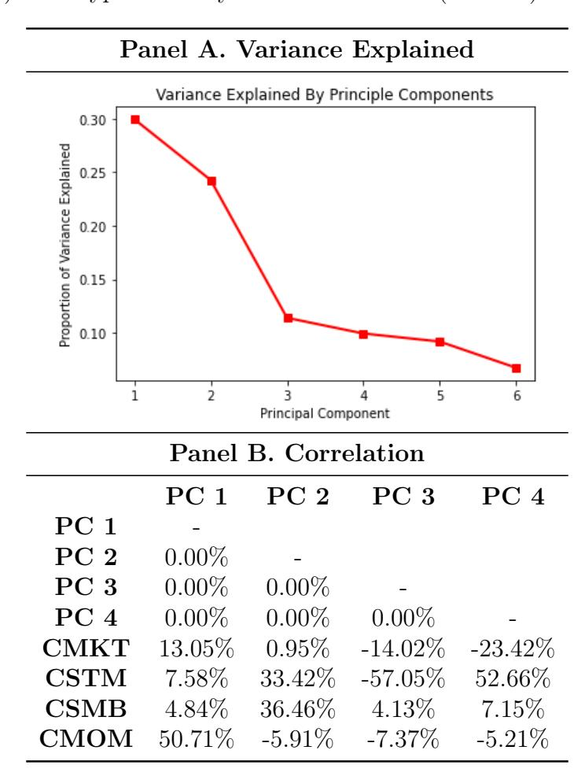
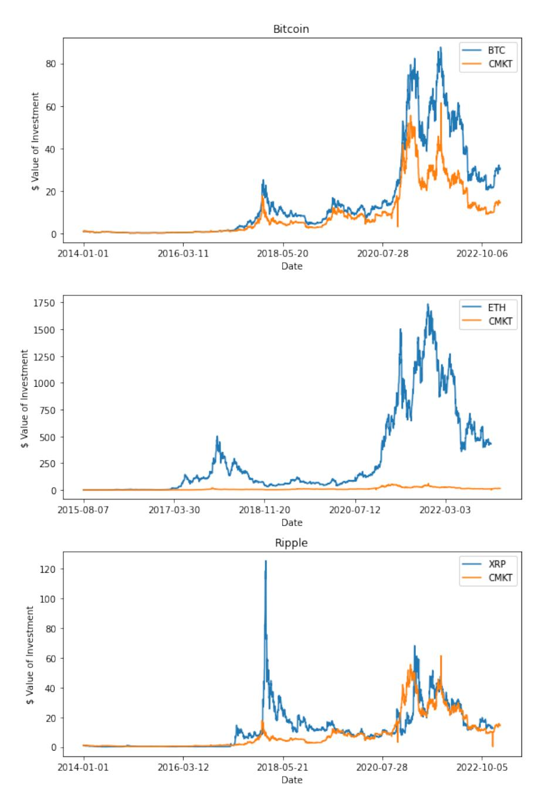
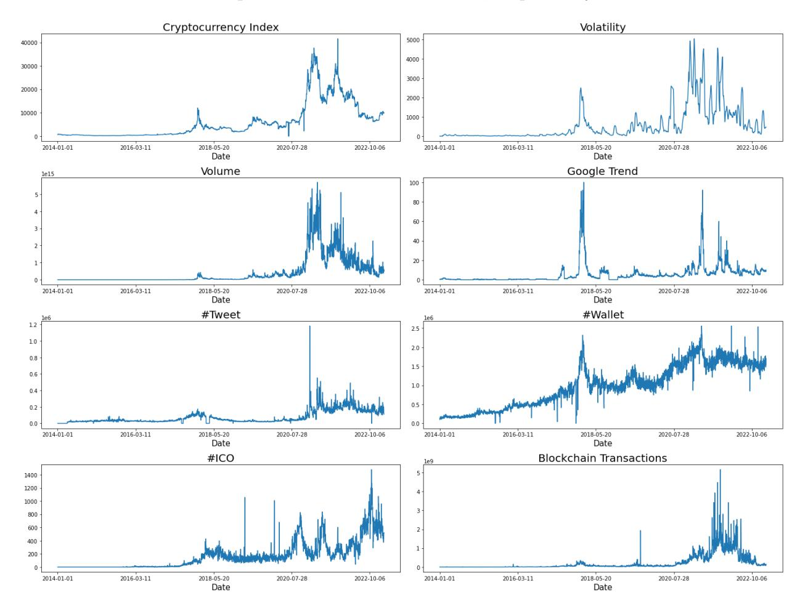
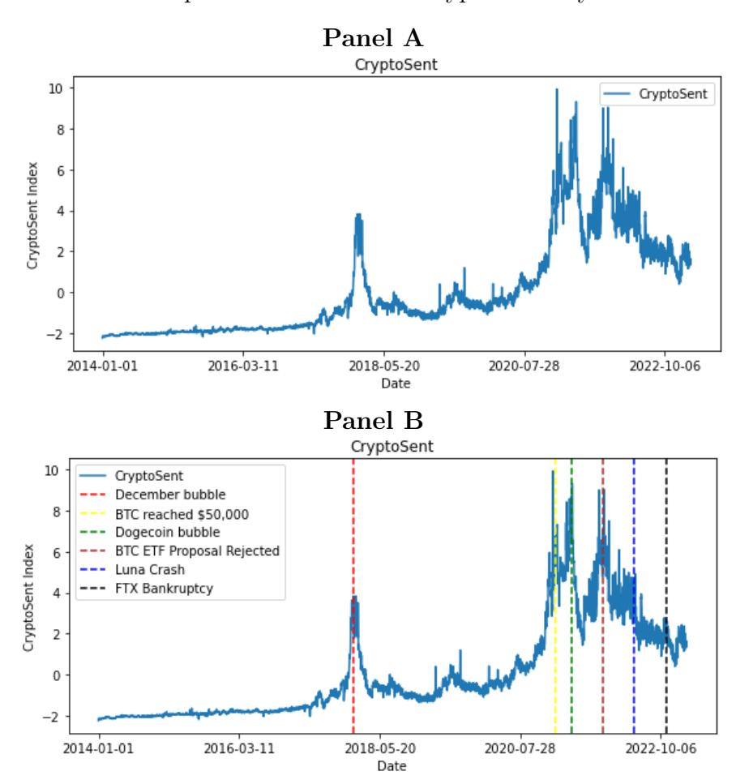
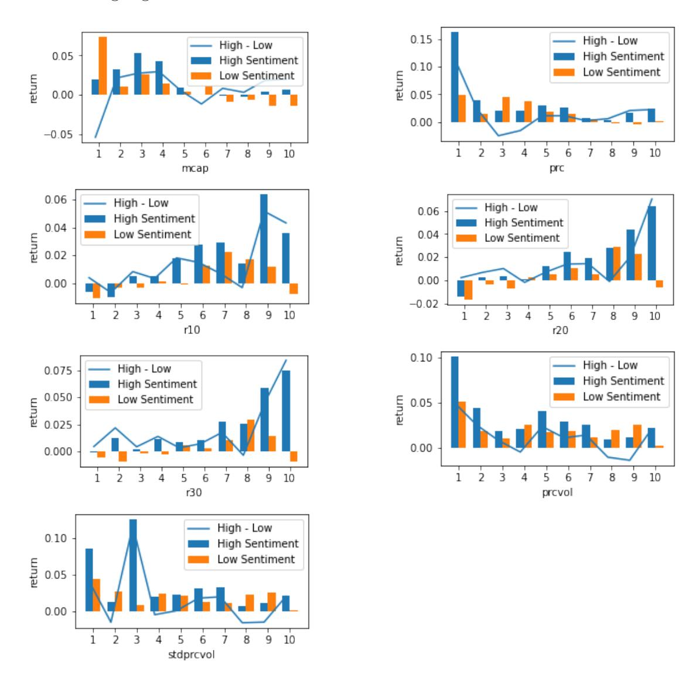
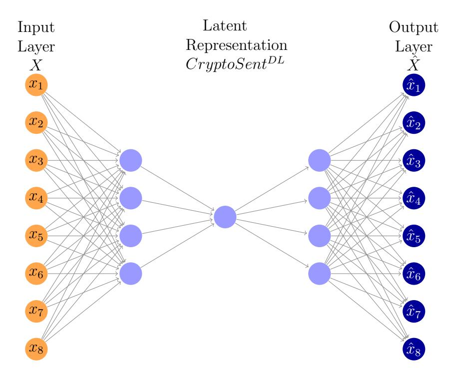

## Sentiment in the Cross Section of Cryptocurrency Returns

Kose John∗ Jingrui Li† Ruming Liu‡

First draft: August 29, 2024

This version: April 6, 2026

#### Abstract

In this paper, we analyze sentiment in the cross-section of cryptocurrency returns. We construct a cryptocurrency sentiment index, CryptoSent, and find that cryptocurrencies with high absolute sensitivities to CryptoSent innovations tend to yield lower average returns in the subsequent week and month. We further validate the robustness of CryptoSent by reconstructing the index using a nonlinear deep-learning autoencoder, which yields consistent cross-sectional return patterns. We introduce a sentiment factor as a mispricing factor alongside market, size, and momentum factors. Incorporating this sentiment-based mispricing factor increases the explanatory power of the three-factor model by 13% and substantially reduces alphas across eleven characteristic-based longshort portfolios.

Keywords: Cryptocurrency, Sentiment, Factor Model, Deep Learning, Autoencoder, Cross Section, Return Prediction.

JEL Classification: G12, G40.

∗Leonard N. Stern School of Business, New York University. Email: kj1@stern.nyu.edu.

†Corresponding author. School of Business, Stevens Institute of Technology. Email: jli264@stevens.edu.

‡School of Business, Stevens Institute of Technology. Email: rliu38@stevens.edu.

We thank Robert Whitelaw and seminar participants at Stevens Institute of Technology, FMA 2024 Annual Meetings and TFA 2024 Annual Meetings for helpful comments and suggestions.

### 1 Introduction

Cryptocurrencies are decentralized digital assets that rely on cryptographic protocols and blockchain technology. Since the introduction of Bitcoin by [Nakamoto \(2008\),](#page-32-0) the cryptocurrency market has evolved into a major asset class characterized by high volatility and strong retail participation. At the outset of 2021, the global cryptocurrency market capitalization exceeded \$1 trillion,[1](#page-0-0) and it is projected to continue growing at an annual rate of approximately 12.5%.[2](#page-0-0) Unlike traditional currencies issued by central authorities, cryptocurrencies operate in a decentralized environment, where prices are largely determined by market forces and investor demand.

Investor sentiment plays a pivotal role in finance, significantly influencing financial markets and investment strategies. It comprises the collective mood, emotions, and attitudes of investors and market participants toward specific assets, markets, or the entire economy. Notably, [Shiller \(2014\)](#page-32-0) observed that asset prices are often driven by investor emotions, which are susceptible to amplification through news and media. Cryptocurrencies, in particular, demonstrate heightened sensitivity to changes in investor sentiment due to their volatility. In this setting, cryptocurrencies with greater exposure to aggregate sentiment innovations are more likely to attract demand from sentiment-driven investors, leading to temporary overvaluation and subsequently lower expected returns. This mechanism suggests that sentiment exposure reflects a form of mispricing rather than compensation for fundamental risk.

In recent years, the impact of sentiment on the cryptocurrency market has garnered extensive academic interest. Research indicates that media outlets and social media platforms substantially shape market sentiment. Studies by [Makarov and Schoar \(2021\),](#page-32-0) [Canayaz,](#page-32-0) [Cao, Nguyen, and Wang \(2023\),](#page-32-0) [Philippas, Rjiba, Guesmi, and Goutte \(2019\),](#page-32-0) and [Liu and](#page-32-0) [Tsyvinski \(2021\)](#page-32-0) have all highlighted the significant influence of news articles and social

1See [https://www.coingecko.com/en/global-charts#:~:text=The%20global%20cryptocurrency%](https://www.coingecko.com/en/global-charts#:~:text=The%20global%20cryptocurrency%20market%20cap,a%20Bitcoin%20dominance%20of%2047.39%25) [20market%20cap,a%20Bitcoin%20dominance%20of%2047.39%25](https://www.coingecko.com/en/global-charts#:~:text=The%20global%20cryptocurrency%20market%20cap,a%20Bitcoin%20dominance%20of%2047.39%25)

2See [https://www.grandviewresearch.com/industry-analysis/cryptocurrency-market-report#:](https://www.grandviewresearch.com/industry-analysis/cryptocurrency-market-report#:~:text=The%20global%20cryptocurrency%20market%20is,USD%2011.71%20billion%20by%202030) [~:text=The%20global%20cryptocurrency%20market%20is,USD%2011.71%20billion%20by%202030](https://www.grandviewresearch.com/industry-analysis/cryptocurrency-market-report#:~:text=The%20global%20cryptocurrency%20market%20is,USD%2011.71%20billion%20by%202030)

media on market sentiment. These findings demonstrate that trading in cryptocurrencies, especially Bitcoin, is profoundly influenced by investor sentiment. Nonetheless, there remains a critical need for further research to decipher the complex dynamics between sentiment and cryptocurrency market returns more thoroughly.

Cryptocurrencies are not only utilized as a means of payment goods and services, but they are also used as a speculative asset, mirroring commodities such as gold. Among the most recognized names in this domain are Bitcoin, Ethereum, Litecoin, Ripple, and Dogecoin. Nevertheless, the market is vast, with thousands of unique cryptocurrencies, each with its own set of features and attributes. In this paper, we conduct a detailed examination of over 2,000 cryptocurrencies over the period from January 2014 to February 2023. Our daily dataset, comprising market snapshots, is sourced from CoinMarketCap, a leading cryptocurrency vendor. This data provides various metrics, including price, total supply, 24-hour trading volume, and descriptive keywords related to the sentiment towards each cryptocurrency.

This paper makes its contribution in three important ways. First, we construct a cryptocurrency sentiment index called CryptoSent, capturing essential dynamics of sentiment's influence on cryptocurrency markets. [Canayaz, Cao, Nguyen, and Wang \(2023\)](#page-32-0) use social media sentiment to predict cryptocurrency returns, while [Han, Liu, and Sui \(2023\)](#page-32-0) document sentiment contagion among Bitcoin investors. [Liu and Tsyvinski \(2021\)](#page-32-0) construct proxies for investor attention using Google searches and show that high attention predicts high future cryptocurrency returns. [Chen, Guo, and Renault \(2019\)](#page-32-0) observe that cryptocurrency social media sentiment contributes to market bubbles. In stock markets, [Baker and Wurgler](#page-32-0) [\(2006\)](#page-32-0) form a top-down market sentiment index using macroeconomic conditions. Following [Baker and Wurgler \(2006\),](#page-32-0) we construct CryptoSent from a broad set of marketwide indicators—including market performance, volatility, trading volume, Google search trends, tweet discussions, and blockchain activity—intended to capture aggregate sentiment across the cryptocurrency ecosystem.

To further validate the robustness of this sentiment index, we also reconstruct CryptoSent using a nonlinear deep-learning autoencoder, following the representation-learning framework of [Hinton and Zemel \(1993\)](#page-32-0) and its recent application in asset pricing by [Gu, Kelly, and Xiu](#page-32-0) [\(2021\).](#page-32-0) The deep-learning-based sentiment index closely mirrors the PCA-based CryptoSent and yields consistent cross-sectional predictions, reinforcing the stability and reliability of our sentiment measure.

Secondly, we study CryptoSent's predictive capabilities within the cross-section of cryptocurrency returns. [Ang, Hodrick, Xing, and Zhang \(2006\)](#page-32-0) show that stocks with high sensitivities to innovations in aggregate volatility earn lower average returns; following their methodology, we sort cryptocurrencies by their sensitivity to innovations in CryptoSent. We find that cryptocurrencies with high sentiment sensitivities exhibit significantly lower expected returns in the subsequent week and month. This pattern resonates with [Frazzini](#page-32-0) [and Lamont \(2008\),](#page-32-0) who show that retail investors tend to hold sentiment-driven stocks and subsequently earn lower returns. Consistent with this intuition, cryptocurrencies with greater exposure to sentiment innovations appear to attract disproportionate demand from sentiment-driven investors, leading to temporary overvaluation and subsequent underperformance as prices revert. Sentiment-sensitive cryptocurrencies underperform their sentimentneutral counterparts by 2.5% per week,[3](#page-0-0) and by 5.1% over the subsequent month.[4](#page-0-0) Importantly, these return differentials remain virtually unchanged when portfolios are constructed using equal weights rather than value weights, demonstrating that the predictive power of sentiment sensitivity is not driven by the influence of large-cap cryptocurrencies. Together with the deep-learning robustness analysis, these findings indicate that sentiment exposure captures a systematic source of mispricing in cryptocurrency markets, exerting a consistently negative influence on expected returns across weighting schemes and sentiment-index constructions.

3Weekly return difference of 2.5% is reported in raw total return. This equates to an annualized total return of 260.11% using weekly compounding.

4This equates to an annualized total return of 81.64% using monthly compounding.

Thirdly, and importantly, we introduce the sentiment factor as a systematic mispricing factor in cross-sectional cryptocurrency returns. In the stock market, [Kumar and Lee](#page-32-0) [\(2006\)](#page-32-0) construct a sentiment factor based on retail trading imbalances and show that stocks heavily traded by retail investors exhibit predictable return patterns, while [Stambaugh and](#page-32-0) [Yuan \(2017\)](#page-32-0) construct mispricing factors by combining information from multiple anomalies and demonstrate that these factors are closely related to investor sentiment. Regarding the cryptocurrency market, [Assamoi, Ekponon, and Guo \(2023\)](#page-32-0) verify that cryptocurrency portfolios are exposed to common risk factors in equity, currency, and commodity markets, and [Liu, Tsyvinski, and Wu \(2022\)](#page-32-0) document that market, size, and momentum factors jointly explain variation in cryptocurrency returns during the sample period from January 2014 to August 2018.[5](#page-0-0) [John and Li \(2025\)](#page-32-0) find that innovations in Bitcoin Google search sentiment are positively and significantly associated with both the continuous and jump components of Bitcoin's realized volatility, underscoring the pivotal role of investor sentiment in driving cryptocurrency market dynamics. Building on this literature, our sentiment factor captures systematic variation in expected returns arising from sentiment-driven demand rather than compensation for fundamental risk, reflecting the tendency of sentiment-sensitive cryptocurrencies to become temporarily overvalued and subsequently underperform, and thereby providing a direct measure of sentiment-driven mispricing in cryptocurrency markets.

Building on the three-factor model of [Liu, Tsyvinski, and Wu \(2022\),](#page-32-0) we introduce an additional sentiment factor and propose a four-factor model that incorporates market, sentiment, size, and momentum factors. Our analysis demonstrates that the cryptocurrency sentiment factor captures a distinct source of cross-sectional variation in expected returns and, consistent with the broader asset-pricing literature (e.g., [Baker and Wurgler \(2006\);](#page-32-0) [Stambaugh and Yuan \(2017\)\)](#page-32-0), operates as a systematic mispricing factor rather than compen-

5[Cong, Karolyi, Tang, and Zhao \(2022\)](#page-32-0) extend the three-factor model of [Liu, Tsyvinski, and Wu \(2022\)](#page-32-0) by introducing additional value and network adoption factors. In contrast, our sentiment factor captures systematic variation in expected returns driven by investor sentiment—derived from social media, search trends, and blockchain engagement—and exhibits low correlation with these factors while delivering incremental explanatory power in cross-sectional tests.

sation for fundamental risk. Incorporating the sentiment factor increases the cross-sectional explanatory power by approximately 13% and substantially improves the model's ability to account for returns across both cross-sectional tests and characteristics-based long-short strategies. In summary, our findings highlight that sentiment is a key common driver of cryptocurrency returns, operating primarily through a mispricing channel.

The rest of this paper is organized as follows. Section 2 provides an overview of the cryptocurrency market. Section 3 describes the construction of our cryptocurrency sentiment index and its return-predictive properties. Section 4 presents the cryptocurrency four-factor model and the corresponding cross-sectional asset pricing results. Section 5 reports a series of robustness tests, including a deep-learning reconstruction of the sentiment index and alternative portfolio-weighting schemes. Section 6 concludes the paper.

### 2 Cryptocurrency Market Overview

#### 2.1 Data

We collect the data from CoinMarketCap's daily snapshots, where cryptocurrency data has been available since 2013. Our dataset covers the period from January 2014 to February 2023. CoinMarketCap is a website that offers market capitalization, price, volume, and additional data for thousands of cryptocurrencies. Launched in 2013, it has become one of the leading platforms for cryptocurrency market data, providing real-time information on prices, trading volumes, and market capitalizations of cryptocurrencies across various exchanges.

For each cryptocurrency listed on the website, its price is calculated by taking the volumeweighted average of all prices reported for each market. To be listed, a cryptocurrency must meet specific criteria, such as being traded on a public exchange with an application programming interface that reports the last traded price and the last 24-hour trading volume. Moreover, it must have non-zero trading volume on at least one supported exchange to ensure that a price can be determined.

#### 2.2 Overview of Cryptocurrency Market

We use daily close prices to construct weekly coin returns. Specifically, we divide each year into 52 weeks. The first week of the year consists of the first seven days of the year. The first 51 weeks of the year consist of seven days each and the last week (52nd week) of the year consists of the last eight days of the year. Our data sample starts from January 2014 and ends in March 2023. We require that the coins have information on price, volume, and market capitalization. To address the issue of illiquidity in cryptocurrency trading, we have excluded coins from our dataset that have a market capitalization of less than \$100,000.[6](#page-0-0) Our results are robust to additional liquidity controls and are not driven by illiquid or micro-cap cryptocurrencies. We present summary statistics in the following Table 1.

#### [\[Insert Table 1 Here\]](#page-35-0)

The number of coins in our sample increases from 417 in 2014 to 2981 in 2021, then decreases to 2096 in 2023. The mean (median) market capitalization ranges from 34 (0.34) million to 981 (7.5) million dollars. Mean (median) dollar price volume ranges from 305 (0.82) thousand to 288,551 (244.39) thousand dollars. All three indicators exhibit a consistent pattern, indicating that the cryptocurrency market experienced robust growth from 2014, peaked in 2021, and subsequently entered a period of cooling.

We next construct a cryptocurrency market return as the value-weighted return of all underlying available coins. The cryptocurrency excess market return (CMKT) is constructed as the difference between the cryptocurrency market return and the risk-free rate measured by the one-month Treasury bill rate. We present a time-series graph that tracks the performance of the CMKT and three major cryptocurrencies in the market: Bitcoin, Ripple,

6Given the market capitalization characteristics of cryptocurrencies, applying this filter minimally affects the representativeness of our dataset. By restricting the sample to cryptocurrencies with a market capitalization over \$100,000, we also mitigate potential liquidity and microstructure issues associated with smaller, less liquid assets.

and Ethereum (noting that Ethereum was introduced in 2015). To facilitate comparison, the values are reported in terms of the U.S. dollar value of an initial one-dollar investment from the inception of each cryptocurrency.

[\[Insert Figure 1 Here\]](#page-54-0)

Figure 1 illustrates the cumulative dollar wealth generated from 1-dollar investments in the cryptocurrency market index, Bitcoin, Ripple, and Ethereum. Bitcoin saw a return exceeding 80-fold in 2021, showing a high correlation with the cryptocurrency market index. Ripple peaked at the beginning of 2018, while Ethereum generated the most significant abnormal returns in 2021, largely attributed to the rising popularity of Web 3.0 technologies.

## 3 Sentiment Index and Expected Returns on Cryptocurrencies

In this section, we outline the methodology employed to develop our cryptocurrency sentiment index. Additionally, we present evidence demonstrating the index's substantial predictive ability regarding the expected returns of cryptocurrencies in the following week and subsequent month.

### 3.1 Components of Cryptocurrency Sentiment Index

In this subsection, we describe the components of our cryptocurrency sentiment index. Our CryptoSent encompasses various components, including the cryptocurrency market index, market volatility, market volume, google trends of "cryptocurrency", tweets discussion, the number of active wallets on blockchain, initial coin offerings on the Ethereum blockchain, and blockchain transactions. All these components are reported at a daily level and they are available from January 2014 to March 2023.

We gather the original data for various components, sourcing some from CoinmarketCap's dataset while obtaining the rest from sources such as Twitter (X), Blockchain explorer, and Google. Following the methodology outlined by [Liu, Tsyvinski, and Wu \(2022\),](#page-32-0) we construct a cryptocurrency market portfolio weighted by market capitalization. Subsequently, we calculate the daily values and the 30-day historical volatility of this cryptocurrency market portfolio. To assess the trading activity across exchanges, we utilize the same dataset from CoinmarketCap to compute the daily trading dollar volume.

Additionally, we incorporate daily Google trends data related to the keyword "Cryptocurrency." It is important to note that Google daily trends are presented as relative values. To ensure accurate comparisons from 2014 to 2023, we adjust these trends data by considering the overall trends value for each respective month. This adjustment allowed us to make meaningful comparisons across the entire period under investigation. Furthermore, in our study, we approximate the daily social media discussions by tracking the number of tweets and posts related to prominent cryptocurrencies such as Bitcoin, Ethereum, and Dogecoin. These cryptocurrencies are frequently discussed on Twitter, making them suitable proxies for gauging social media sentiment. Additionally, we gather daily data on active wallets from both the Bitcoin and Ethereum blockchains. Specifically, we record the number of wallets engaged in cryptocurrency trading activities on each respective date, this on-chain data provides complementary insights to market sentiment, particularly those aspects that might not be readily visible on centralized exchanges.

[Baker and Wurgler \(2006\)](#page-32-0) suggest that the IPO market is viewed as a measure of investor enthusiasm and sentiment. Similarly, [Howell, Niessner, and Yermack \(2020\)](#page-32-0) activities are related to cryptocurrency market sentiment. Following [Howell, Niessner, and Yermack \(2020\),](#page-32-0) we include the number of ICOs on the Ethereum Blockchain. Specifically, we record the number of new verified ERC-20 smart contracts on each respective date. Finally, the transactions on the blockchain measure the dollar value of Bitcoin transferred in the blockchain network on each respective date. Such data can capture the payment activities that occur in a decentralized network.

We next examine the eight essential components in our CryptoSent sentiment index and report their trend over time in the following Figure 2.

#### [\[Insert Figure 2 Here\]](#page-55-0)

In Figure 2, all eight components are reported, each originating at a low level in 2014 when the cryptocurrency market had not yet garnered significant investments. These components exhibit similar upward trends until 2021, where they collectively peak before gradually cooling down. The initial three components display strikingly similar patterns as they originate from the same dataset. In contrast, the remaining components occasionally capture additional sentiment changes that are not reflected in the data from exchanges. This supplementary data helps enhance the overall sentiment analysis of the entire cryptocurrency market.

To further study the components of CryptoSent and their interactions, we present the following Table 2, which contains a correlation matrix detailing the relationships among all components.

#### [\[Insert Table 2 Here\]](#page-36-0)

The correlations among these components range from 25.26% to 91.82%. Notably, the Crypto Index, Volatility, and Volume exhibit high correlations, indicating strong interconnections between these aspects of the market. However, the tweets discussion, number of active wallets, and ICO display lower correlations with other components.

### 3.2 Construction of Cryptocurrency Sentiment Index

[Makarov and Schoar \(2021\),](#page-32-0) [Canayaz, Cao, Nguyen, and Wang \(2023\),](#page-32-0) [Philippas, Rjiba,](#page-32-0) [Guesmi, and Goutte \(2019\),](#page-32-0) as well as [Liu and Tsyvinski \(2021\)](#page-32-0) have documented the role of investor sentiment in influencing cryptocurrency returns. Given the role that sentiment plays in the cryptocurrency market, it's natural for investors and traders to monitor indicators

such as news, social media discussions, and other market sentiment analysis tools. By understanding and analyzing sentiment, they can gain insights into market trends, anticipate shifts in investor behavior, and make more informed trading decisions in the crypto market.

Existing literature on the role of sentiment has focused on Bitcoin and Ethereum. One of our contributions is constructing a comprehensive index, denoted as CryptoSent, designed to represent the sentiment across the entire cryptocurrency market.

We compute the overall CryptoSent[7](#page-0-0) following the methodology of [Baker and Wurgler](#page-32-0) [\(2006\).](#page-32-0) We form a composite index that captures the common component among the eight components and accounts for the fact that some variables take longer to reflect the same sentiment. We begin by estimating the first principal component of the eight components and their lags. This yields a first-stage index with 16 loadings, one for each of the current and lagged components. We then compute the correlation between the first-stage index and the current and lagged values of each proxy. Finally, we define "CryptoSent" as the first principal component of the correlation matrix of eight variables – each respective proxy's lead or lag, whichever has a higher correlation with the first-stage index – rescaling the coefficients to ensure the index has unit variance. This procedure results in the index:

|                                                                                                           |  |  |
|------------------------------------------------------------------------------------------------------------------------|--|---------------|
| 
<math display="block">CryptoSent_t = 0.4095 \times Crypto Index_{t-1} + 0.2701 \times Google Trend_t</math>
 |  |               |
| 

                                                                                                            |  |               |
| 
<math>+ 0.3759 \times \#Tweet_{t-1} + 0.3678 \times Volatility_t</math>
                                     |  | (1)           |
| 
<math>+ 0.3882 \times Volume_{t-1} + 0.3840 \times \#Wallet_t</math>
                                        |  |               |
| 
<math>+ 0.3451 \times Blockchain Transcations_{t-1} + 0.2554 \times \#ICO_t</math>
                          |  |               |

where each of the index components has first been standardized. The first principal component explains 80% of the sample variance, so we conclude that one factor captures much of the common variation. We present the correlations between the overall CryptoSent and its

7The data is available at [https://github.com/ronming1303/CryptoSent/blob/main/sentiment%](https://github.com/ronming1303/CryptoSent/blob/main/sentiment%20score.csv) [20score.csv](https://github.com/ronming1303/CryptoSent/blob/main/sentiment%20score.csv).

individual components in Table 2, all of which are significantly correlated. Additionally, we plot CryptoSent from January 2014 to March 2023 as in the following Figure 3 Panel A.

#### [\[Insert Figure 3 Here\]](#page-56-0)

The CryptoSent constructed in [Equation \(1\)](#page-10-0) captures major cryptocurrency events, shocks, and crashes in the cryptocurrency market. This is reflected in Figure 3, Panel B which includes some events in cryptocurrency market. The vertical lines represent the shocks in cryptocurrency market.

We can see that CryptoSent starts at a low level in 2014 when the cryptocurrency market had not yet garnered significant investments. It exhibits upward trends until 2021, reaching a peak before starting to decline gradually. The index effectively captures several major shocks to the cryptocurrency market. For instance, on December 17, 2017, Bitcoin hit a new all-time high of \$19,783, only to fall by 45% from its peak within a week. On February 16, 2021, Bitcoin reached \$50,000 for the first time. Prior to May 19, 2021, the market was buoyant, fueled by positive developments such as Coinbase going public on NASDAQ and the surging popularity of meme tokens, with Dogecoin's value skyrocketing by 20,000% within a year. On May 19, the Dogecoin bubble burst. This was partly in response to Elon Musk's announcement that Tesla would suspend payments using the Bitcoin network due to environmental concerns, along with an announcement from the People's Bank of China reiterating that digital currencies cannot be used for payments. In 2021 November, there was some rumor that SEC would approve Bitcoin ETF, but on November 11, SEC confirmed the rejection of Bitcoin ETF. In May 2022, the algorithmic stable coin TerraUSD was unpegged to the U.S dollar, which finally lead its collateral assets Luna crashed. In November 2022, the third-largest cryptocurrency exchange FTX collapsed due to a surge in customer withdrawals, revealing an \$8 billion shortfall in FTX's accounts. All these major shocks are captured by our CryptoSent in the figure.

#### 3.3 Sentiment and Expected Returns in Cryptocurrency Market

We proceed to conduct a rigorous empirical analysis of how sentiment-driven mispricing affects expected returns in cryptocurrency markets. In this section, we examine whether exposure to innovations in aggregate sentiment predicts subsequent returns, consistent with the view that sentiment-sensitive cryptocurrencies become temporarily overvalued due to investor demand and subsequently underperform as prices revert toward fundamentals.

We follow the portfolio sort methodology of [Ang, Hodrick, Xing, and Zhang \(2006\).](#page-32-0) Our goal is to test whether cryptocurrencies with different sensitivities to sentiment (proxied by ∆CryptoSent) have different average returns in the following period.[8](#page-0-0) While sentiment may be influenced by contemporaneous price movements, our use of innovations in the sentiment index, ∆CryptoSentt , helps mitigate concerns about reverse causality by isolating unexpected changes in aggregate sentiment.

The key intuition is that cryptocurrencies that are more sensitive to aggregate sentiment shocks are more likely to be subject to sentiment-driven demand pressures. If sentiment leads to temporary overvaluation, such assets should exhibit lower subsequent returns as prices revert toward fundamentals.

To measure the sensitivity to sentiment, we examine the following regression:

$$r_i^i - r_i^i = \beta_0 + \beta_{CMKT} CM K T_t + \beta_{\Delta CryptoSent} \Delta CryptoSent_t + \epsilon_i^i, \quad (2)$$

where CMKTt is the market excess return, ∆CryptoSentt is the first-order change in our sentiment index, and β i CMKT and β i ∆CryptoSent capture exposure to cryptocurrency market returns and to innovations in aggregate sentiment, the latter reflecting sensitivity to sentimentdriven mispricing.

We analyze the performance of a zero-investment long–short strategy based on the

8We take the first difference of CryptoSent to make the time series stationary.

sentiment-related characteristic |β i ∆CryptoSent|. We focus on the absolute value of sentiment exposure because both positively and negatively sentiment-sensitive cryptocurrencies are subject to sentiment-driven trading. In particular, assets that strongly comove with sentiment shocks—regardless of direction—are more likely to attract attention and demand from sentiment-driven investors. Consistent with this interpretation, we find that both high positive and high negative sentiment exposures are associated with lower subsequent returns. This motivates our use of absolute sentiment sensitivity as a measure of exposure to sentiment-driven mispricing.

To implement the strategy, we first estimate sentiment betas using returns over the past 28 days. Cryptocurrencies are then ranked based on their |β i ∆CryptoSent| values and sorted into five quintiles. We compute the value-weighted excess return of each quintile portfolio in the subsequent week. We construct a long–short portfolio that takes a long position in the lowest-sensitivity quintile and a short position in the highest-sensitivity quintile. We find that this strategy yields a statistically significant negative return, indicating that cryptocurrencies with greater exposure to sentiment innovations subsequently underperform.

#### [\[Insert Table 3 Here\]](#page-37-0)

In Panel A (weekly horizon), cryptocurrencies are sorted into five quintiles by their absolute sentiment beta, |β i ∆CryptoSent|, estimated over the preceding 28 days. The highestsensitivity quintile (Group 5) yields an insignificant mean return in the subsequent week, while the lowest-sensitivity quintile (Group 1) delivers a significant mean return of 1.5% (99% confidence). Quintiles 2–4 show intermediate sensitivities and also produce significant returns. The corresponding long–short strategy (long Group 1, short Group 5) produces a significant negative weekly return of –2.5%.[9](#page-0-0) The sentiment-related long–short strategy yields a statistically significant negative return. The magnitude of this return spread is economically large: the weekly differential of 2.5% implies an annualized return exceeding 250%,

9We also replicate our analysis excluding stablecoins, and our results in Table 3 remain consistent, indicating that the findings in our paper are robust to the inclusion of stablecoins.

highlighting the substantial economic significance of sentiment exposure in cryptocurrency markets. In Panel B (monthly, 4-week horizon), Group 5 again posts an insignificant mean return, whereas Group 1 achieves a 6.7% mean return (99% confidence). The sentimentbased long–short portfolio records a significant negative monthly return of –5.1%.

These findings indicate that cryptocurrencies with larger absolute exposures to sentiment innovations tend to earn lower subsequent returns at both weekly and monthly horizons. Consequently, a strategy that is long low-sensitivity assets and short high-sensitivity assets yields statistically significant positive returns over these periods.

Risk versus Mispricing Interpretation. An important question is whether the negative return premium associated with sentiment exposure reflects compensation for systematic risk or instead arises from mispricing. Our evidence is not easily reconciled with a standard risk-based explanation. In particular, we find that cryptocurrencies with both positive and negative sensitivities to sentiment innovations earn lower subsequent returns when their absolute exposure is high. This symmetric pattern is difficult to interpret within traditional asset pricing frameworks, where exposure to priced risk factors typically carries a directional return premium.

Instead, our findings are more consistent with a mispricing-based interpretation. Cryptocurrencies with high sensitivity to aggregate sentiment shocks are more likely to be subject to sentiment-driven demand from retail investors, leading to temporary overvaluation. As sentiment fluctuates and prices revert toward fundamentals, these assets subsequently underperform. These results suggest that the sentiment factor operates as a systematic mispricing factor in cryptocurrency markets, rather than compensation for bearing fundamental risk.

## 4 Sentiment as a Mispricing Factor in the Cross Section of Cryptocurrency Returns

In this section, we develop the cryptocurrency sentiment factor and subsequently demonstrate its predictive power in explaining the returns of portfolio strategies. Additionally, we illustrate its significance as a priced common risk factor across the cross-section of cryptocurrency returns.

## 4.1 Sentiment Factor in Explaining Return-based Long Short Strategies

In addition to the sentiment long-short strategy (denoted as |βSENT |) identified in Section 3.2, [Liu, Tsyvinski, and Wu \(2022\)](#page-32-0) have identified several other long-short strategies in the cryptocurrency market, over the period from 2014 to 2020. These strategies are distinguished based on factors such as size, momentum, volume, and volatility. Our analysis, extended to March 2023, corroborates that these well-established long-short strategies continue to generate significant returns, affirming their validity and effectiveness over a broader temporal scope. We present the performance of long-short portfolios, crafted based on size, momentum, volume, and volatility strategies as [Liu, Tsyvinski, and Wu \(2022\)](#page-32-0) described, in Table 4.

#### [\[Insert Table 4 Here\]](#page-38-0)

Table 4 provides statistics for size, momentum, volume, and volatility-related strategies spanning the period from 2014 to 2023. Panel A details the mean returns of quintile portfolios based on market capitalization (MCAP) and the last-day price (PRC). Panel B illustrates the mean returns of quintile portfolios derived from one-week (R 1,0), two-week (R 2,0), and three-week (R 3,0) return measures. Panel C provides insights into the mean returns of quintile portfolios according to the price volume (PRCVOL) measure. Finally, Panel D offers

data on the mean returns of quintile portfolios calculated based on the standard deviation of price volume (STDPRCVOL). The results confirm that these long-short strategies remain statistically significant throughout the observed period from 2014 to 2023.

Next, we introduce the construction of four cryptocurrency factors. The construction of the cryptocurrency market excess returns (CMKT) is described previously in Section 2.2. Following a methodology akin to that of [Fama and French \(2015\)](#page-32-0) and [Liu, Tsyvinski, and Wu](#page-32-0) [\(2022\),](#page-32-0) we proceed to construct factors for cryptocurrency sentiment, size, and momentum. Specifically for sentiment, we categorize cryptocurrencies weekly into three groups based on the absolute value of their sentiment beta |β i ∆CryptoSent|: the bottom 15% (labeled "neutral", N), the middle 70% ("middle", M), and the top 15% ("sensitive", S).[10](#page-0-0) Value-weighted portfolios are then formed for each group. The sentiment factor (CSTM) is derived from the return difference between the "sensitive" and "neutral" portfolios.

For the momentum factor (CMOM), we adopt a three-week momentum approach, organizing cryptocurrencies into 2 × 3 portfolios based on their sentiment exposure and past three-week returns. Specifically, cryptocurrencies are initially sorted into two groups according to their sentiment exposure |β i ∆CryptoSent|. Within each sentiment group, we then classify cryptocurrencies into three momentum portfolios—bottom 15%, middle 70%, and top 15%—based on their performance over the past three weeks. The momentum factor is constructed as

---

$$CMOM = \frac{1}{2}(Neutral\ High + Sensitive\ High) - \frac{1}{2}(Neutral\ Low + Sensitive\ Low). \quad (3)$$

Following the same methodology, we construct the size factor (CSMB) using market capitalization and form the size factor portfolio based on the intersection of 2 × 3 portfolios. For each week, we first sort cryptocurrencies into two portfolios based on sentiment exposure

10Consistent with [Stambaugh and Yuan \(2017\),](#page-32-0) we use the 15th and 85th percentiles. This method reflects the notion that relative mispricing in the cross-section is more likely a property of the extremes than of the middle.

|β i ∆CryptoSent|. Subsequently, within each sentiment-based grouping, cryptocurrencies are further divided into three size-based portfolios determined by their market capitalization: the bottom 15% ("small", S), the middle 70% ("medium", M), and the top 15% ("big", B). These classifications allow us to observe the impact of size in conjunction with sentiment on cryptocurrency returns. The Size factor is constructed as

---

$$CSMB = \frac{1}{2}(\text{Neutral Small} + \text{Sensitive Small}) - \frac{1}{2}(\text{Neutral Big} + \text{Sensitive Big}). \quad (4)$$

With the market, sentiment, size, and momentum factors constructed, we report the correlation matrix of these four factors in Table 5.

[\[Insert Table 5 Here\]](#page-40-0)

The correlation matrix in Table 5 reveals weak relationships among the four factors: CMKT, CSTM, CSMB, and CMOM. The correlation coefficients between these variables range from -7.97% to 8.65%, indicating very weak linear relationships among them. This suggests minimal overlap across factors, supporting their inclusion as distinct components in the analysis. The sentiment factor captures a dimension of sentiment-driven mispricing that is distinct from traditional cryptocurrency factors. Its low correlation with market, size, and momentum factors indicates that sentiment reflects an independent source of return variation rather than a proxy for existing factors, reinforcing its role as a separate mispricing channel in cryptocurrency markets. This underscores the unique influence of sentiment on market behavior and enhances the explanatory power of our model.

We next employ two-factor, three-factor, and four-factor models to explain the excess returns of the eight long-short strategies identified earlier. Subsequently, we will integrate our sentiment factor alongside the other established factors to further elucidate the returns of these long-short portfolio strategies.

Model (1), (2) and (3) of Table 6 presents different two-factor models with the CSTM, CSMB or CMOM respectively. Model (4) presents three-factor model proposed by [Liu,](#page-32-0) [Tsyvinski, and Wu \(2022\).](#page-32-0) Model (5) introduces four-factor model we propose, incorporating CMKT, CSTM, CSMB and CMOM.

Initially, we assess two-factor models, labeled as (1), (2), and (3), to understand their efficacy in explaining various long-short strategy returns. Model (1), presented in Table 6, combines the market factor (CMKT) and the size factor (CSMB). This model finds limited success; it fails to maintain significant alphas for sentiment and momentum-based strategies, despite revealing substantial exposure to the size factor across most strategies. Particularly, exposure to CSMB ranges from 0.018 in sentiment strategies to -0.614 in market capitalization-based strategies. The inadequacy of this model is especially apparent in explaining sentiment and momentum-based strategies due to the low and insignificant loading on size factor.

Subsequently, we explore an alternative two-factor model by combining the cryptocurrency market factor (CMKT) and the cryptocurrency momentum factor (CMOM) in Model (2) of Table 6. This model effectively captures the excess returns of momentum-related strategies. After incorporating the CMOM factor, the alphas for two and three-week momentum strategies cease to be statistically significant. These two strategies displayed significant exposures to CMOM, their loadings are 0.727 and 0.818, respectively. An exception arises in explaining the alpha of the one-week return momentum strategy. One possible explanation is that post-2020, the cryptocurrency market has more popularity, leading to more frequent changes in momentum patterns. And this model struggles to explain the return variation of the sentiment strategy (|βSENT |) and the size strategy (MCAP). The alphas for these two strategies remain unexplained by Model (2).

In Model (3) of Table 6, the sentiment factor (CSTM) and the market factor (CMKT) significantly address the excess returns of sentiment-related strategies, reducing their alphas to insignificant values. While this model shows some limitations in fully capturing strategy alphas, it confirms substantial exposure to the sentiment factor CSTM for all non-momentum strategies.

Upon reviewing these two-factor models, it becomes evident that they could not comprehensively explain the alphas for all eight long-short strategies. Thus, we proceed to evaluate the three-factor model proposed by [Liu, Tsyvinski, and Wu \(2022\),](#page-32-0) extending our dataset to include 2020 to 2023. Model (4) in Table 6, which incorporates market, size, and momentum factors, demonstrated improved explanatory power for most long-short strategies. Nonetheless, it falls short of explaining the alphas for the sentiment strategy and the oneand two-week momentum strategies.

Crucially, we introduce a four-factor model that integrates the CMKT, CSTM, CSMB, and CMOM factors. Model (5) offers insights across all eight strategies and demonstrates a notable improvement over the three-factor models, particularly in addressing the significant alpha associated with the sentiment strategy. This alpha diminishes from -2% to an insignificant -0.03%. Except for the sentiment strategy, the model also reveals that exposures to CSTM for other non-momentum strategies are statistically significant, ranging from -0.105 to -0.369, indicating a pronounced impact of sentiment on these strategies. After adding sentiment factor, all strategies exhibit significant loadings on CMOM, varying between -0.314 and 0.835. In this model, CSMB is essential for explaining the alphas of strategies focused on size, volume, and volatility. The exception within this model is the one-week return momentum strategy, whose alpha cannot be fully explained by our four factor model, mirroring the challenges faced by Model (2). This persistence might be attributed to the cryptocurrency market's increased dynamism post-2020, characterized by more rapid shifts in momentum patterns. Relative to the preceding models, the four-factor model significantly reduces mean absolute pricing errors, particularly enhancing the accuracy of sentiment-related strategy predictions.

## 4.2 Sentiment Factor in Explaining Double-sort Return Portfolio Excess Returns

In the previous Section 4.1, we evaluated the explanatory power of our four-factor model. Following the methodology of [Fama and French \(2015\),](#page-32-0) we extend our analysis to examine the four-factor model's regression results for both 5 × 5 Sentiment-Size and 5 × 5 Sentiment-Momentum portfolios. Specifically, each week, we categorize all available cryptocurrencies into five sentiment groups, ranging from Neutral to Sensitive, based on their sentiment exposure over the last 28 days (|β i ∆CryptoSent|). Cryptocurrencies are also separately sorted into five size groups, from Small to Big, according to their market capitalizations. The combination of these two sorting criteria results in the formation of 25 value-weighted Sentiment-Size portfolios. Similarly, we create 5 × 5 Sentiment-Momentum portfolios, employing the same sentiment grouping, but the second sort is based on the past three-week return momentum. Subsequently, we apply the four-factor model to regress the returns of these Sentiment-Size and Sentiment-Momentum strategies, testing the model's robustness in explaining variations across these diversified portfolios.

#### [\[Insert Table 7 Here\]](#page-43-0)

Panel A of Table 7 displays intercepts from the three-factor regressions for the 5 × 5 Sentiment-Momentum portfolios. The extreme low momentum cryptocurrency portfolios (left column of the intercept matrix) are not adequately explained by the three-factor model. Similarly, portfolios containing cryptocurrencies highly sensitive to sentiment (bottom row of the intercept matrix) also present challenges for this model. For instance, the portfolio that is highly sensitive to sentiment and with strong momentum (located in the bottom right corner of the intercept matrix) exhibits an alpha of -1.8% per week (t = −1.723) under the three-factor framework.

However, Panel B of Table 7 demonstrates how the introduction of the four-factor regression addresses these challenges. The alpha of the portfolio, consisting of highly momentumdriven and sentiment-sensitive cryptocurrencies, rises to a statistically insignificant -0.3% (t = −0.326). In comparison with other portfolios having βsentiment less than 0.304, this portfolio exhibits significant sentiment exposure, amounting to 0.529 (t = 9.131). This implies that the introduced sentiment factor effectively addresses the challenges faced by the portfolio comprising highly momentum-driven and sentiment-sensitive cryptocurrencies. Additionally, the alphas for portfolios in both the left column and bottom row tend toward zero, becoming insignificant or less significant. Furthermore, the average R2 of the fourfactor model for the 5 × 5 Sentiment-Momentum portfolios shows a 8% improvement over the three-factor model.

In Panel C of Table 7, we report the sentiment-sensitivity concentration in each momentum quintile portfolios. By calculating the value-weighted average sentiment sensitivities in each portfolio, we observe that sentiment-sensitive cryptocurrencies are predominantly found in quintile portfolios that experienced significant returns or losses over the past three weeks.[11](#page-0-0)

[\[Insert Table 8 Here\]](#page-46-0)

Similar to Table 7, Panel A of Table 8 displays intercepts from the three-factor regressions for the 5 × 5 Sentiment-Size portfolios. The three-factor model is effective in explaining the weekly excess returns for most portfolios. However, portfolios constructed from cryptocurrencies that are both large in size and highly sensitive to sentiment (located in the bottom right corner of the intercept matrix) are not well-explained by the three-factor model. Under this model, the alpha for such a portfolio stands at -3.0% (t = −3.777) per week .

Upon introducing the sentiment factor into the regression, as shown in Panel B of Table 8, the alpha of the portfolio improves to -0.8% (t = −1.291), becoming insignificant. Compared to other portfolios which are not at corners, predominantly with βsentiment less than 0.208, this portfolio demonstrates significant sentiment exposure at 0.743 (t = 19.168). This suggests

11In the stock market, [Kumar and Lee \(2006\)](#page-32-0) find that retail sentiment tends to be concentrated in hardto-value stocks, using the buy-sell imbalance as a proxy of sentiment.

that the addition of the sentiment factor helps to mitigate the abnormal excess returns from portfolios consisting of large-size and sentiment-sensitive cryptocurrencies. Additionally, the average R2 of the four-factor model for the 5 × 5 Sentiment-Size portfolios shows a 18% improvement over the three-factor model.

In Panel C of Table 8, we detail the concentration of sentiment sensitivity within each size quintile portfolio. By calculating the value-weighted average sentiment sensitivities for each portfolio, we find that sentiment-sensitive cryptocurrencies are predominantly concentrated in quintile portfolios with smaller market capitalizations.

In summary, the incorporation of the sentiment factor (CSTM) into our analysis has been instrumental in addressing the significant alphas associated with portfolios characterized by high momentum, strong sentiment sensitivity, or large size in cryptocurrencies. This underscores the critical role of sentiment in the dynamics of cryptocurrency markets and enhances our model's explanatory power.

### 4.3 Fama-MacBeth (1973) Regression Analysis

In this section, we conduct a Fama-MacBeth cross-sectional regression analysis. We begin by categorizing each cryptocurrency into one of five portfolios based on their respective characteristics. These characteristics include |β i ∆CryptoSent|, MCAP, and R 3,0, as introduced earlier. The final characteristic, βCMKT , represents the market risk exposure of each cryptocurrency and is computed using the cryptocurrency CAPM model. Subsequently, we utilize the portfolio rank number as the explanatory variable.

#### [\[Insert Table 9 Here\]](#page-49-0)

Panel A of Table 9 presents the results of the Fama-MacBeth regression analysis, focusing on individual characteristics. Models (1) to (3) demonstrate statistically significant slopes with expected signs, indicating that these specific factors have explanatory power for crosssectional returns in the cryptocurrency market. In Panel B, models (4) to (6) incorporate the market beta (βCMKT ) in two-characteristic regressions. The outcomes are closely aligned with those in Panel A, where sentiment-sensitivity (|β i ∆CryptoSent|), market capitalization (MCAP), and the 3-day return (R 3,0) continue to exhibit significant slopes.

Transitioning to Panel C, models (7) to (11) delve into more comprehensive Fama-MacBeth regressions that involve more than three characteristics. All slopes associated with |β i ∆CryptoSent| are statistically significant, showcasing t-statistics higher than 5.04. This emphasizes the critical role of sentiment in explaining the cross-sectional returns in the cryptocurrency market. Notably, the significance of βCMKT diminishes across all models in Panel C, diverging from previous findings that utilized value-weighted portfolio strategies. This discrepancy might stem from the Fama-MacBeth regression's approach of treating each observation equally, mirroring the effect of equally weighted portfolios, thereby explaining the variation in results.

Model (10) revisits the three-factor model proposed by [Liu, Tsyvinski, and Wu \(2022\),](#page-32-0) highlighting significant alpha in the Fama-MacBeth regression analysis. In contrast, model (11) introduces our four-factor model, incorporating the sentiment factor. Our model explains additional 0.52% for cross-sectional variation in expected returns, underscoring the substantial influence of sentiment in the weekly cross-sectional Fama-MacBeth regression.

In summary, the sentiment factor significantly improves the cross-sectional regression fit, proving to be a pivotal element in explaining the variations in cross-sectional returns within the cryptocurrency market.

### 4.4 PCA Analysis of Cryptocurrency Returns

In this section, we undertake a principal component analysis (PCA) on the eight significant long-short strategies previously discussed. We test whether a small number of principal components can capture the variation of the strategies' returns. Our analysis reveals that four principal components account for the majority of the variation in the returns of these strategies. Further, we explore the correlations between these four principal components and the four identified cryptocurrency factors, aiming to understand the relationships and influences among them.

[\[Insert Table 10 Here\]](#page-50-0)

Table 10 presents results of the principal component analysis (PCA) conducted on eight significant long-short strategies. In Panel A, the table outlines the proportion of variance each principal component accounts for. Specifically, the first four principal components explain 30%, 24%, 11%, and 10% of the variance, respectively, cumulatively accounting for over 75% of the variation in the returns of the eight long-short strategies.

Panel B presents a correlation matrix between these first four principal components and the four cryptocurrency factors identified in our model. Notably, the first principal component exhibits a strong positive correlation (50.71%) with the cryptocurrency momentum factor. The second principal component is significantly linked (36.46%) to the size factor within the cryptocurrency market. The third principal component shows a robust correlation (-57.05%) with the cryptocurrency sentiment factor. Conversely, the fourth principal component is correlated with the market factor (-23.42%) and the sentiment factor (52.66%).

In conclusion, the PCA reveals that a substantial portion of the variation in the eight longshort strategies is captured by the first four principal components. Moreover, the correlation patterns between these components and the cryptocurrency market factors align closely with our theoretical expectations, underscoring the consistency of our model with the observed market dynamics.

#### 4.5 Strategies Conditional on Sentiment Index

Another important application of our sentiment index is that it can be a signal of some specific long trading strategies. Drawing on the findings of [Stambaugh, Yu, and Yuan \(2012\),](#page-32-0) which highlight the susceptibility of the short leg in long-short strategies to market sentiment, our study extends this analysis to the realm of cryptocurrencies. Similarly, [Baker and](#page-32-0) [Wurgler \(2006\)](#page-32-0) demonstrate that stocks characterized by certain features—such as being small, young, high volatility, unprofitable, non-dividend-paying, extremely growth-oriented, or distressed—tend to perform differently based on the prevailing market sentiment at the beginning of the period. Specifically, these categories of stocks generally yield higher subsequent returns when initial sentiment is low and lower returns when sentiment is high. Applying the sentiment index constructed in our paper, we explore the conditional returns of various cryptocurrencies, categorized by distinct characteristics, in response to sentiment levels. We presents our results in the following Figure 4.

#### [\[Insert Figure 4 Here\]](#page-57-0)

Figure 4 presents an analysis of sentiment conditional returns across various cryptocurrency portfolios, categorized based on the characteristics previously discussed. Specifically, the first sub-figure focuses on the impact of market capitalization (MCAP) on portfolio performance. At the start of each week, cryptocurrencies are divided into ten groups according to their MCAP values. The week is deemed a "high sentiment week" if the ∆CryptoSent at the week's beginning is above the median ∆CryptoSent value; otherwise, it is considered a "low sentiment week." We then track the performance of these portfolios over the following week to calculate the conditional return based on sentiment for each group.

The blue bars represent the average return of portfolios during high sentiment weeks, while the orange bars indicate average returns under low sentiment conditions. The blue line highlights the difference in mean returns between high and low sentiment scenarios. Notably, portfolios not driven by momentum show a significant return differential between group 1 and group 10, indicating a pronounced sentiment effect. In contrast, for momentum-based portfolios, the most substantial sentiment-driven return disparity occurs predominantly in group 10.

This analysis underscores the significant impact of market sentiment on the performance of cryptocurrency investment strategies, affirming the significance of our constructed sentiment index in predicting conditional returns based on distinct cryptocurrency characteristics.

### 5 Robustness Tests

In this section, we conduct two sets of robustness analyses. The first evaluates the robustness of our cryptocurrency sentiment index by replacing the PCA-based construction with a nonlinear deep-learning representation. The second examines whether our sentiment-based long-short strategy remains valid under equal-weighted portfolio construction methodologies. Specifically, we substitute the original linear PCA index with a deep-learning autoencoder—an architecture capable of capturing nonlinear interactions among sentiment-related variables—and reassess both portfolio returns and factor-model performance. We then test whether the sentiment–return relation persists when portfolios are formed using equal weights rather than the value-weighted methodology used throughout the baseline analysis.

## 5.1 A Deep-Learning Alternative to the PCA-Based Sentiment Index

A crucial robustness check concerns the construction of the sentiment index itself. Our baseline measure, CryptoSent, is derived from a linear PCA procedure (Equation [1\)](#page-10-0), which imposes a linear structure on the way sentiment-related variables interact. To ensure that our findings are not driven by this specific linear methodology, we reconstruct the sentiment index using a nonlinear deep-learning approach. This analysis evaluates whether the predictive relation between sentiment sensitivity and future cryptocurrency returns remains intact under alternative representations of aggregate market sentiment.

We employ an autoencoder, a deep-learning architecture originally introduced by [Hinton](#page-32-0) [and Zemel \(1993\),](#page-32-0) which is designed to learn low-dimensional latent representations that preserve the essential structure of the underlying high-dimensional input. In recent finance applications, [Gu, Kelly, and Xiu \(2021\)](#page-32-0) demonstrate that autoencoders are effective for extracting latent risk factors and asset-specific exposures, making them a natural tool for robust sentiment-index construction.

#### [\[Insert Figure 5 Here\]](#page-58-0)

As shown in Figure 5, we implement a symmetric 8-4-1-4-8 autoencoder to learn a nonlinear representation of the sentiment-related input vector:

| $X =$ | [ <i>Crypto Index</i> , <i>Google Trend</i> , <i>#Tweet</i> , <i>Volatility</i> , <i>Volume</i> , <i>#Wallet</i> , <i>Blockchain Transactions</i> , <i>#ICO</i> ]. |
|-------|--------------------------------------------------------------------------------------------------------------------------------------------------------------------|
|-------|--------------------------------------------------------------------------------------------------------------------------------------------------------------------|

The encoder compresses this eight-dimensional vector into a four-unit hidden layer and then further into a one-dimensional bottleneck layer. This bottleneck forces the neural network to distill the dominant nonlinear feature that best summarizes the joint variation across sentiment proxies. The decoder reconstructs the eight inputs by minimizing the meansquared reconstruction error, ensuring that the latent factor retains as much information as possible. We denote the resulting deep-learning-based sentiment index by CryptoSentDL .

#### [\[Insert Table 11 Here\]](#page-51-0)

Table 11 reports weekly portfolio returns sorted by |βi,∆CryptoSentDL |, where sentiment exposure is measured using the autoencoder-derived index. The results closely parallel those obtained using the original PCA-based index in Table 3. Cryptocurrencies with large absolute sentiment exposures continue to earn lower subsequent returns, while those with minimal sentiment exposure generate higher returns. The long-short strategy constructed from these portfolios again produces statistically significant positive returns, confirming that the sentiment-return relation is not sensitive to the method used to construct the sentiment index.

#### [\[Insert Table 12 Here\]](#page-52-0)

Table 12 further examines whether the factor-model results in Table 6 are robust when the sentiment factor is reconstructed using CryptoSentDL. The long-short portfolio of the sentiment strategy can not be explained by the existing three-factor model, the sentiment strategy has a significant -2.4% unexplained alpha. However, when the sentiment factor derived from the deep-learning index is added to the model, this alpha becomes statistically insignificant. Thus, the sentiment factor extracted from the autoencoder retains strong explanatory power, successfully accounting for the cross-sectional variation in sentimentsorted portfolio returns.

These results demonstrate that neither the sentiment-sorted portfolio strategy nor the sentiment factor in the factor model depends on the PCA-based construction of the sentiment index. The nonlinear deep-learning method yields qualitatively identical conclusions, reinforcing the central role of sentiment in cryptocurrency return dynamics and validating the robustness of our empirical framework.

## 5.2 From Value-weighted to Equal-weighted: Testing the Stability of the Sentiment Strategy

Our baseline empirical results throughout the paper—including the portfolio sorts in Table 3 and the factor-model estimations—are all constructed using value-weighted cryptocurrency portfolios.[12](#page-0-0) To ensure that our findings are not driven by the value-weighting scheme, we first examine whether the sentiment-based long–short strategy remains valid when portfolios are instead formed using equal weights.

#### [\[Insert Table 13 Here\]](#page-53-0)

Table 13 reports results for equal-weighted portfolios sorted into quintiles based on the magnitude of their sentiment exposure |βi,∆CryptoSent|. Consistent with our baseline valueweighted findings in Table 3, we continue to observe a strong monotonic pattern: cryptocurrencies with low sentiment sensitivity (Group 1) earn higher subsequent weekly returns than those with high sensitivity (Group 5). The equal-weighted long-short portfolio (Group 5

12To mitigate the influence of extreme return observations, we apply a price filter requiring that a cryptocurrency's price exceed \$0.10. This removes micro-priced tokens that often exhibit mechanical jumps unrelated to economic information.

minus Group 1) yields a weekly return of −1.1%, statistically significant at the 5% level. This demonstrates that the negative relation between sentiment sensitivity and expected returns is not an artifact of value weighting but persists under an alternative equal-weighted portfolio formation approach.

Overall, the robustness tests presented in this section demonstrate that our core findings are highly stable across both alternative sentiment-index construction methods and alternative portfolio-weighting schemes. Whether sentiment is measured using a linear PCA-based index or a nonlinear deep-learning autoencoder, and whether returns are aggregated using value-weighted or equal-weighted portfolios, the same central pattern emerges: cryptocurrencies with greater sensitivity to innovations in aggregate sentiment systematically earn lower subsequent returns. Moreover, the sentiment factor constructed from either index consistently explains the return spread across sentiment-sorted portfolios, eliminating the large alphas observed under the baseline three-factor model. These results confirm that sentimentdriven mispricing is a pervasive and robust feature of cryptocurrency markets, rather than an artifact of methodological choices.

### 6 Conclusion

The rapid growth of blockchain technologies and cryptocurrency markets has heightened the importance of understanding how investor sentiment shapes asset prices in this emerging domain. In this paper, we examine the role of sentiment in explaining the cross-sectional variation of cryptocurrency returns and provide new evidence that sentiment is a systematic driver of expected returns through a mispricing channel.

Our first contribution is the construction of CryptoSent, a comprehensive sentiment index that synthesizes information from price dynamics, trading activity, social media discussions, and on-chain usage. We show that CryptoSent effectively captures marketwide shifts in cryptocurrency sentiment and aligns closely with major industry events. Using this measure, we document a strong and economically meaningful pattern: cryptocurrencies with high absolute sensitivities to innovations in CryptoSent earn significantly lower returns in subsequent weeks and months. A long-short strategy exploiting this return spread yields an average weekly premium of 2.5% and a monthly premium of 5.1%, indicating that sentiment exposure is an important predictor of cross-sectional performance.

We interpret this pattern as evidence of sentiment-driven mispricing. Cryptocurrencies that are more sensitive to aggregate sentiment shocks tend to attract disproportionate demand from sentiment-driven investors, leading to temporary overvaluation and subsequent underperformance as prices revert toward fundamentals. Consistent with this mechanism, we show that the sentiment factor we construct captures a distinct and systematic component of cross-sectional return variation that is not explained by traditional cryptocurrency factors. Incorporating this sentiment-based mispricing factor into a four-factor model alongside market, size, and momentum substantially improves explanatory power and eliminates the large alphas associated with sentiment-sorted portfolios and other characteristic-based strategies.

A series of robustness tests strengthens these conclusions. We reconstruct the sentiment index using a nonlinear deep-learning autoencoder and obtain qualitatively identical results, confirming that our findings are not driven by the linear PCA construction. In addition, the negative relation between sentiment sensitivity and expected returns remains robust under equal-weighted portfolio formation, indicating that our results are not driven by large-cap cryptocurrencies or weighting schemes. These findings demonstrate that the pricing effects we document are pervasive and not an artifact of model specification or sample construction.

Our results have important implications for investors, exchanges, and policymakers. Portfolio managers may use sentiment exposure as a tool to identify overvalued assets and manage return predictability. Exchanges and liquidity providers may anticipate sentiment-driven trading flows to better manage market-making and liquidity provision. Regulators may monitor aggregate sentiment as an indicator of market overheating, herding behavior, or instability. Overall, our findings highlight that investor sentiment is a central force shaping cryptocurrency prices, primarily through a systematic mispricing channel, and should be incorporated into both empirical asset pricing models and practical investment strategies.

Our findings also open several avenues for future research. First, further work could develop structural models that explicitly link sentiment-driven demand, limited arbitrage, and price dynamics in cryptocurrency markets. Second, exploring the interaction between sentiment and market microstructure—such as liquidity provision, order flow, and exchange fragmentation—may provide deeper insight into how mispricing arises and dissipates. Third, the role of institutional participation in mitigating or amplifying sentiment-driven mispricing remains an open question, particularly as cryptocurrency markets continue to mature. Finally, extending sentiment-based mispricing measures to other digital assets, such as NFTs or tokenized real-world assets, may help to better understand the broader implications of investor sentiment in decentralized financial systems.

### Reference

Ang, A., Hodrick, R.J., Xing, Y. and Zhang, X., 2006. The Cross-Section of Volatility and Expected Returns. The Journal of Finance, 61(1), pp.259-299. Baig, A., Blau, B.M. and Sabah, N., 2019. Price clustering and sentiment in Bitcoin. Finance Research Letters, 29, pp.111-116. Baker, M. and Wurgler, J., 2006. Investor sentiment and the cross-section of stock returns. The Journal of Finance, 61(4), pp.1645-1680. Baker, M. and Wurgler, J., 2007. Investor sentiment in the stock market. Journal of economic perspectives, 21(2), pp.129-151. Cong, L.W., He, Z. and Li, J., 2021. Decentralized mining in centralized pools. The Review of Financial Studies, 34(3), pp.1191-1235. Cong, L.W., Karolyi, G.A., Tang, K. and Zhao, W., 2022. Value premium, network adoption, and factor pricing of crypto assets. Network Adoption, and Factor Pricing of Crypto Assets (April 1, 2022). Canayaz, M., Cao, C., Nguyen, G. and Wang, Q., 2023. An Anatomy of Cryptocurrency Sentiment. Available at SSRN. Fama, E.F. and MacBeth, J.D., 1973. Risk, return, and equilibrium: Empirical tests. Journal of Political Economy, 81(3), pp.607-636. Fama, E.F. and French, K.R., 1993. Common risk factors in the returns on stocks and bonds. Journal of Financial Economics, 33(1), pp.3-56. Fama, E.F. and French, K.R., 2015. A five-factor asset pricing model. Journal of financial economics, 116(1), pp.1-22.

Gu, Shihao, Bryan Kelly, and Dacheng Xiu. "Autoencoder asset pricing models." Journal

of Econometrics 222, no. 1 (2021): 429-450. Hinton, G.E. and Zemel, R., 1993. Autoencoders, minimum description length and Helmholtz free energy. Advances in neural information processing systems, 6. John, K. and Li, J., 2025. Bitcoin price volatility: Effects of retail traders, illegal users, and sentiment. Journal of Corporate Finance, p.102837. Kumar, A. and Lee, C.M., 2006. Retail Investor Sentiment and Return Comovements. The Journal of Finance, 61(5), pp.2451-2486. Liu, Y. and Tsyvinski, A., 2021. Risks and returns of cryptocurrency. The Review of Financial Studies, 34(6), pp.2689-2727. Liu, Y., Tsyvinski, A. and Wu, X., 2022. Common risk factors in cryptocurrency. The Journal of Finance, 77(2), pp.1133-1177. Makarov, I. and Schoar, A., 2021. Blockchain analysis of the Bitcoin market (No. w29396). National Bureau of Economic Research. Nakamoto, S., 2008. Bitcoin: A peer-to-peer electronic cash system. Decentralized Business Review, p.21260. Philippas, D., Rjiba, H., Guesmi, K. and Goutte, S., 2019. Media attention and Bitcoin prices. Finance Research Letters, 30, pp.37-43. Shiller, R.J., 2014. Speculative asset prices. American Economic Review, 104(6), pp.1486- 1517. Stambaugh, R.F., Yu, J. and Yuan, Y., 2012. The short of it: Investor sentiment and anomalies. Journal of financial economics. Frazzini, A. and Lamont, O.A., 2008. Dumb money: Mutual fund flows and the cross-section

of stock returns. Journal of financial economics, 88(2), pp.299-322.

Assamoi, K., Ekponon, A. and Guo, Z., 2023. Are Cryptocurrencies Exposed to Factor Risk?. Available at SSRN. Chen, C.Y.H., Guo, L. and Renault, T., 2019. What Makes Cryptocurrencies Special? Investor Sentiment and Return Predictability. Investor Sentiment and Return Predictability (June 3, 2019). Han, B., Liu, H. and Sui, P., 2023. Social Learning and Sentiment Contagion in the Bitcoin Market. Available at SSRN 4543326. Howell, S.T., Niessner, M. and Yermack, D., 2020. Initial coin offerings: Financing growth with cryptocurrency token sales. The Review of Financial Studies, 33(9), pp.3925-3974. Stambaugh, R.F. and Yuan, Y., 2017. Mispricing factors. The review of financial studies, 30(4), pp.1270-1315.

#### Table 1: Summary Statistics.

Table 1 reports in each year, the number of coins whose market capitalization is over \$100,000, the mean and median of those coins. It also reports the mean and median of daily trading price volume of those coins. The number of coins in our sample increase from 417 to in 2014 to 2981 in 2021, then decreases to 2096 in 2023. The mean (median) market capitalization ranges from 34 (0.34) million to 981 (7.5) million dollars. Mean (median) dollar price volume ranges from 305 (0.82) thousand to 288,551 (174.35) thousand dollars. All three indicators exhibit a consistent pattern, indicating that the cryptocurrency market experienced robust growth from 2014, peaked in 2021, and subsequently entered a period of cooling.

| Year | Number | Mean   | Market Cap (million) Median | Mean     | Volume (thousand) Median |
|------|--------|--------|-----------------------------|----------|--------------------------|
| 2014 | 417    | 70.42  | 0.43                        | 342.05   | 3.46                     |
| 2015 | 291    | 34.67  | 0.34                        | 305.44   | 0.82                     |
| 2016 | 417    | 54.5   | 0.5                         | 619.1    | 1.55                     |
| 2017 | 1090   | 256.85 | 2.09                        | 11342.67 | 15.29                    |
| 2018 | 1942   | 251.13 | 3.68                        | 14660.19 | 27.32                    |
| 2019 | 1985   | 160.78 | 1.98                        | 41015.14 | 29.3                     |
| 2020 | 2384   | 238.19 | 2.57                        | 83654.86 | 59.49                    |
| 2021 | 2981   | 981.87 | 7.5                         | 158966.4 | 244.39                   |
| 2022 | 2702   | 668    | 4.65                        | 288551   | 174.35                   |
| 2023 | 2096   | 541.6  | 4.32                        | 50796.58 | 159.72                   |

#### Table2:CryptocurrencySentimentIndexCryptoSentComponentsCorrelationMatrix.

Table2presentsthecorrelationmatrixamongallcomponents:Cryptocurrencymarketindex,marketvolatility,markettradingvolume,googletrendsof"cryptocurrency",numberoftweetsdiscussionabout"cryptocurrency",numberofactivewalletsonblockchain,initialcoinoffering,andtransactionsonblockchain.CryptoSentisconstructedasCryptoSentt0.4095×CryptoIndext−1+0.2701×GoogleTrendt+0.3759×#Tweett−1+0.3678×Volatilityt+0.3882×Volumet−1+0.3840×#Wallett+0.3451×BlockchainTranscationst−1+0.2554×#ICOtaccordingto[Equation](#page-10-1)(1).AllthesecomponentsarereportedindailylevelandavailablefromJanuary2014toMarch2023,exceptfortweetsdiscussionandICOdata,whichisaccessiblefromApril2014andNovember2015,respectively.

| Weekly Sentiment Component Correlation |                      |            |        |              |        |         |        |                         |
|----------------------------------------|----------------------|------------|--------|--------------|--------|---------|--------|-------------------------|
|                                        | Cryptocurrency Index | Volatility | Volume | Google Trend | #Tweet | #Wallet | #ICO   | Blockchain Transactions |
| Cryptocurrency Index                   | -                    | -          | -      | -            | -      | -       | -      | -                       |
| Volatility                             | 82.38%               | -          | -      | -            | -      | -       | -      | -                       |
| Volume                                 | 91.82%               | 77.69%     | -      | -            | -      | -       | -      | -                       |
| Google Trend                           | 44.60%               | 53.42%     | 44.67% | -            | -      | -       | -      | -                       |
| #Tweet                                 | 74.70%               | 59.43%     | 73.83% | 50.42%       | -      | -       | -      | -                       |
| #Wallet                                | 78.71%               | 69.19%     | 66.88% | 57.22%       | 69.64% | -       | -      | -                       |
| #ICO                                   | 44.84%               | 32.53%     | 35.89% | 25.26%       | 52.99% | 67.84%  | -      | -                       |
| Blockchain Transactions                | 74.67%               | 57.97%     | 69.03% | 35.93%       | 71.39% | 59.30%  | 32.34% | -                       |
| CryptoSent                             | 93.54%               | 84.21%     | 87.43% | 61.84%       | 84.15% | 87.92%  | 58.48% | 77.03%                  |

#### Table 3: Portfolios Sorted by Exposure to CryptoSent

Table 3 displays the weekly result for portfolios categorized into five quintiles based on their unsigned exposure to sentiment, represented as |β i ∆CryptoSent| . The β i ∆CryptoSent is estimated from r i t−r f t = β0+β i CMKT CMKTt+β i ∆CryptoSent∆CryptoSentt+ϵ i t from [Equation \(2\).](#page-12-0) Each week, group 5 comprises cryptocurrencies highly responsive to ∆CryptoSent in the preceding 28 days. Group 1 consists of cryptocurrencies exhibiting a neutral response to ∆CryptoSent during the same period, Lastly, group 5-1 represents long-short sentiment portfolio. Panel B, displays the monthly (4-week) result for the portfolios categorized into five quintiles based on their unsigned exposure to sentiment. \*, \*\*, and \*\*\* denote significance at the 10%, 5%, and 1% levels.

| Panel        | A.        | Sentiment | Strategy Weekly Quintiles | Excess    | Return  |            |
|--------------|-----------|-----------|---------------------------|-----------|---------|------------|
| i            | 1         | 2         | 3                         | 4         | 5       | 5-1        |
| β            |           |           |                           |           |         |            |
| ∆ CryptoSent | Low       |           |                           |           | High    |            |
| Mean         | 0.015     | 0.015     | 0.017                     | 0.013     | -0.011  | -0.025     |
| t(mean)      | (2.68)*** | (2.21)**  | (2.41)**                  | (1.66)*   | (-1.43) | (-3.75)*** |
| Panel        | B.        | Sentiment | Strategy Monthly          | Excess    | Return  |            |
| i            | 1         | 2         | 3                         | 4         | 5       | 5-1        |
| β            |           |           |                           |           |         |            |
| ∆ CryptoSent | Low       |           |                           |           | High    |            |
| Mean         | 0.067     | 0.080     | 0.077                     | 0.076     | 0.016   | -0.051     |
| t(mean)      | (4.98)*** | (4.05)*** | (3.18)***                 | (3.23)*** | (0.82)  | (-3.28)*** |

#### Table 4: Size, Momentum, Volume and Volatility Strategies

This table provides statistics for size, momentum, volume, and volatility-related strategies spanning the period from 2014 to 2023. Panel A reports the mean quintile portfolio returns based on the market capitalization (MCAP), last-day price (PRC). Panel B reports the mean quintile portfolio returns based on the past one-week (R 1,0), two-week (R 2,0) and threeweek (R 3,0) return measures. Panel C reports the mean quintile portfolio returns based on the price volume (PRCVOL) measure. Panel D reports the mean quintile portfolio returns based on the standard deviation of price volume (STDPRCVOL). The mean returns are the time-series averages of weekly value-weighted portfolio excess returns. \*, \*\*, and \*\*\* denote significance at the 10%, 5%, and 1% levels.

|         |           | Panel     | A. Size   | Strategy Quintiles |           |            |
|---------|-----------|-----------|-----------|--------------------|-----------|------------|
|         | 1         | 2         | 3         | 4                  | 5         | 5-1        |
| MCAP    | Low       |           |           |                    | High      |            |
| Mean    | 0.042     | 0.043     | 0.023     | 0.013              | 0.012     | -0.03      |
| t(mean) | (4.82)*** | (3.01)*** | (2.96)*** | (1.94)**           | (2.43)**  | (-4.01)*** |
| PRC     | Low       |           |           |                    | High      |            |
| Mean    | 0.049     | 0.036     | 0.022     | 0.002              | 0.012     | -0.038     |
| t(mean) | (2.54)**  | (2.85)*** | (2.45)**  | (0.23)             | (2.37)**  | (-2.11)*   |
|         |           | Panel B.  | Momentum  | Strategy           |           |            |
|         | 1         | 2         | 3         | 4                  | 5         | 5-1        |
| R 1,0   | Low       |           |           |                    | High      |            |
| Mean    | -0.009    | 0.001     | 0.013     | 0.024              | 0.026     | 0.035      |
| t(mean) | (-1.20)   | (0.16)    | (2.23)**  | (2.55)**           | (2.28)**  | (3.11)***  |
| R 2,0   | Low       |           |           |                    | High      |            |
| Mean    | -0.009    | -0.001    | 0.014     | 0.02               | 0.028     | 0.037      |
| t(mean) | (-1.29)   | (-0.13)   | (1.91)*   | (2.73)***          | (2.59)*** | (3.41)***  |
| R 3,0   | Low       |           |           |                    | High      |            |
| Mean    | -0.005    | 0.001     | 0.008     | 0.023              | 0.03      | 0.035      |
| t(mean) | (-0.67)   | (0.13)    | (1.35)    | (3.01)***          | (3.13)*** | (3.49)***  |
|         |           | Panel C.  | Volume    | Strategy           |           |            |
|         | 1         | 2         | 3         | 4                  | 5         | 5-1        |
| PRCVOL  | Low       |           |           |                    | High      |            |
| Mean    | 0.042     | 0.021     | 0.026     | 0.017              | 0.012     | -0.030     |
| t(mean) | (3.11)*** | (2.09)**  | (2.68)*** | (2.27)**           | (2.43)**  | (-2.46)**  |

|                   |   | Panel D. | Volatility | Strategy Quintiles |          |           |
|-------------------|---|----------|------------|--------------------|----------|-----------|
| 1                 | 2 |          | 3          | 4                  | 5        | 5-1       |
| STDPRCVOL Low     |   |          |            |                    | High     |           |
| Mean 0.036        |   | 0.048    | 0.024      | 0.021              | 0.012    | -0.024    |
| t(mean) (2.85)*** |   | (1.90)*  | (2.61)***  | (2.71)***          | (2.39)** | (-2.19)** |

Table 5: Correlation Matrix of Cryptocurrency Factors.

Table 5 reports correlation matrix of the cryptocurrency market portfolio excess return (CMKT), cryptocurrency size factor (CSMB), cryptocurrency momentum factor (CMOM), and cryptocurrency sentiment factor (CSTM). CMKT is calculated as the difference between the cryptocurrency market return and the risk-free rate measured by the one-month Treasury bill rate. CMOM, CSMB, and CSTM are calculated by equation (3), (4), and (5), respectively.

| Correlation | Matrix | Correlation | Matrix | Correlation |
|-------------|--------|-------------|--------|-------------|
|             | CMKT   | CSTM        | CSMB   | CMOM        |
| CMKT        | -      |             |        |             |
| CSTM        | -0.38% | -           |        |             |
| CSMB        | -0.59% | -0.62%      | -      |             |
| CMOM        | -5.06% | 8.65%       | -7.97% | -           |

#### Table6:CryptocurrencyFactorsModelwithSentimentFactor.

Table6reportsresultsonthecryptocurrencyfactoradjustmentsofthesuccessfullong-shortstrategies.CMKTisthecryptocurrencyexcessmarketreturn,CSTMisthecryptocurrencysentimentfactor,CSMBisthecryptocurrencysizefactor,andCMOMisthecryptocurrencymomentumfactor.t-Statisticsarereportedinparentheses.\*,\*\*,and\*\*\*denotesignificanceatthe10%,5%,and1%levels.Model(1),(2)and(3)oftable4presentsdifferenttwo-factormodelswiththeCSTM,CSMBorCMOMrespectively.Model(4)presentsthree-factormodelproposedbyLiu,Tsyvinski,andWu(2022).Model(5)introducesfour-factormodelwepropose,incorporatingCMKT,CSTM,CSMBandCMOM.

| Strategy         | Model | Cons   | Cons t     | CMKT   | CMKT t     | CSMB   | CSMB t      | CSMOM  | CSMOM t    | CSTM   | CSTM t     | R 2 | M.A.E |
|------------------|-------|--------|------------|--------|------------|--------|-------------|--------|------------|--------|------------|----------------|-------|
| $ \beta_{SENT} $ | 1     | -0.024 | (-3.57)*** | -0.068 | (-1.33)    | 0.018  | (0.41)      |        |            |        |            | 0.004          | 0.095 |
|                  | 2     | -0.025 | (-3.62)*** | -0.066 | (-1.3)     |        |             | 0.025  | (0.62)     |        |            | 0.005          | 0.096 |
|                  | 3     | -0.003 | (-1.09)    | -0.064 | (-2.81)*** |        |             |        |            | 0.813  | (43.19)*** | 0.800          | 0.039 |
|                  | 4     | -0.025 | (-3.63)*** | -0.066 | (-1.3)     | 0.02   | (0.46)      | 0.027  | (0.65)     |        |            | 0.005          | 0.096 |
|                  | 5     | -0.003 | (-0.81)    | -0.067 | (-2.94)*** | 0.019  | (1.00)      | -0.042 | (-2.29)**  | 0.816  | (43.44)*** | 0.803          | 0.040 |
| MCAP             | 1     | -0.01  | (-1.6)     | 0.042  | (0.91)     | -0.614 | (-15.7)***  |        |            |        |            | 0.346          | 0.071 |
|                  | 2     | -0.028 | (-3.69)*** | 0.043  | (0.74)     |        |             | -0.062 | (-1.35)    |        |            | 0.005          | 0.094 |
|                  | 3     | -0.033 | (-4.34)*** | 0.046  | (0.81)     |        |             |        |            | -0.11  | (-2.35)**  | 0.013          | 0.094 |
|                  | 4     | -0.006 | (-1.0)     | 0.035  | (0.76)     | -0.623 | (-16.02)*** | -0.11  | (-2.96)*** |        |            | 0.038          | 0.070 |
|                  | 5     | -0.009 | (-1.46)    | 0.035  | (0.77)     | -0.623 | (-16.13)*** | -0.101 | (-2.73)*** | -0.105 | (-2.78)*** | 0.036          | 0.069 |
| PRC              | 1     | -0.022 | (-1.21)    | -0.606 | (-4.51)*** | -0.095 | (-0.84)     |        |            |        |            | 0.042          | 0.131 |
|                  | 2     | -0.018 | (-0.99)    | -0.62  | (-4.63)*** |        |             | -0.236 | (-2.2)**   |        |            | 0.051          | 0.136 |
|                  | 3     | -0.03  | (-1.68)*   | -0.606 | (-4.53)*** |        |             |        |            | -0.195 | (-1.77)*   | 0.048          | 0.131 |
|                  | 4     | -0.014 | (-0.75)    | -0.622 | (-4.64)*** | -0.116 | (-1.02)     | -0.245 | (-2.27)**  |        |            | 0.054          | 0.135 |
|                  | 5     | -0.019 | (-1.0)     | -0.622 | (-4.65)*** | -0.115 | (-1.02)     | -0.23  | (-2.13)**  | -0.176 | (-1.59)*   | 0.059          | 0.133 |
| R 1, 0           | 1     | 0.039  | (3.31)***  | 0.12   | (1.38)     | -0.143 | (-1.95)*    |        |            |        |            | 0.018          | 0.134 |
|                  | 2     | 0.018  | (1.66)*    | 0.154  | (1.87)*    |        |             | 0.516  | (7.82)***  |        |            | 0.019          | 0.121 |
|                  | 3     | 0.033  | (2.88)***  | 0.121  | (1.39)     |        |             |        |            | -0.023 | (-0.32)    | 0.004          | 0.134 |
|                  | 4     | 0.022  | (1.94)*    | 0.152  | (1.86)*    | -0.1   | (-1.44)     | 0.508  | (7.69)***  |        |            | 0.023          | 0.121 |
|                  | 5     | 0.02   | (1.74)*    | 0.153  | (1.86)*    | -0.1   | (-1.44)     | 0.514  | (7.75)***  | -0.069 | (-1.02)    | 0.022          | 0.122 |

| Strategy   | Model | Cons   | Cons t     | CMKT   | CMKT t     | CSMB   | CSMB t     | CMOM   | CMOM t     | CSTM   | CSTM t     | R 2 | M.A.E |
|------------|-------|--------|------------|--------|------------|--------|------------|--------|------------|--------|------------|----------------|-------|
| R 2,0      | 1     | 0.041  | (3.63)***  | 0.119  | -1.42      | -0.107 | (-1.53)    |        |            |        |            | 0.009          | 0.001 |
|            | 2     | 0.015  | -1.54      | 0.165  | (2.28)**   |        |            | 0.727  | (12.48)*** |        |            | 0.253          | 0.004 |
|            | 3     | 0.038  | (3.41)***  | 0.12   | -1.43      |        |            |        |            | 0.033  | -0.47      | 0.005          | 0.010 |
|            | 4     | 0.017  | (1.67)*    | 0.165  | (2.27)**   | -0.047 | (-0.76)    | 0.723  | (12.37)*** |        |            | 0.254          | 0.014 |
|            | 5     | 0.016  | -1.56      | 0.165  | (2.27)**   | -0.047 | (-0.76)    | 0.726  | (12.36)*** | -0.032 | (-0.53)    | 0.254          | 0.105 |
| R 3,0      | 1     | 0.036  | (3.45)***  | 0.036  | -0.46      | -0.038 | (-0.58)    |        |            |        |            | 0.001          | 0.132 |
|            | 2     | 0.01   | -1.18      | 0.088  | -1.41      |        |            | 0.818  | (16.4)***  |        |            | 0.365          | 0.089 |
|            | 3     | 0.032  | (3.1)***   | 0.036  | -0.46      |        |            |        |            | -0.108 | (-1.69)*   | 0.007          | 0.133 |
|            | 4     | 0.009  | -1.02      | 0.088  | -1.42      | 0.031  | -0.59      | 0.82   | (16.38)*** |        |            | 0.366          | 0.089 |
|            | 5     | 0.004  | -0.43      | 0.088  | -1.44      | 0.031  | -0.6       | 0.835  | (16.84)*** | -0.182 | (-3.59)*** | 0.383          | 0.092 |
| PRCVOL     | 1     | -0.014 | (-1.13)    | -0.144 | (-1.6)     | -0.382 | (-5.03)*** |        |            |        |            | 0.056          | 0.124 |
|            | 2     | -0.018 | (-1.46)    | -0.159 | (-1.74)*   |        |            | -0.277 | (-3.77)*** |        |            | 0.034          | 0.130 |
|            | 3     | -0.036 | (-3.02)*** | -0.143 | (-1.59)    |        |            |        |            | -0.391 | (-5.27)*** | 0.061          | 0.130 |
|            | 4     | -0.003 | (-0.92)    | -0.164 | (-1.85)*   | -0.408 | (-5.45)*** | -0.308 | (-4.31)*** |        |            | 0.092          | 0.126 |
|            | 5     | -0.014 | (-1.15)    | -0.163 | (-1.89)*   | -0.408 | (-5.59)*** | -0.277 | (-3.97)*** | -0.369 | (-5.17)*** | 0.141          | 0.126 |
| STD-PRCVOL | 1     | -0.007 | (-0.6)     | -0.204 | (-2.51)**  | -0.395 | (-5.78)*** |        |            |        |            | 0.078          | 0.124 |
|            | 2     | -0.01  | (-0.94)    | -0.22  | (-2.68)*** |        |            | -0.301 | (-4.56)*** |        |            | 0.054          | 0.121 |
|            | 3     | -0.026 | (-2.37)**  | -0.202 | (-2.45)**  |        |            |        |            | -0.259 | (-3.8)***  | 0.042          | 0.119 |
|            | 4     | 0.005  | -0.42      | -0.225 | (-2.85)*** | -0.423 | (-6.35)*** | -0.334 | (-5.25)*** |        |            | 0.129          | 0.118 |
|            | 5     | -0.002 | (-0.18)    | -0.225 | (-2.88)*** | -0.423 | (-6.43)*** | -0.314 | (-4.98)*** | -0.234 | (-3.63)*** | 0.193          | 0.118 |

Table7:AverageWeeklyPercentExcessReturnsforPortfoliosFormedonSentimentandMomentum.Eachweek,allavailablecryptocurrenciesareallocatedtofivesentimentgroups(NeutraltoSensitive)basedontheirlast28days'unsignedexposuresonsentiment(|β∆CryptoSent|).Cryptocurrenciesarealsoallocatedindependentlytofivemomentumgroups(LowtoHigh)basedontheirpast3-weekreturns.Theintersectionsofthetwosortsproduce5×5value-weightSentiment-Momentumportfolios.Wetestthethree-factorandfour-factormodelregressionresultsofalltheseSentiment-MomentuminPanelAandPanelB.PanelCreportsthesentiment-sensitivityconcentrationinmomentum(R3,0)strategies.Wereportthemeanofeachquantileportfolios'averageexposureonsentiment(|β∆CryptoSent|)weightedbymarketcapitalization.

| R ( t ) |  |  |          |
|---------|--|--|----------|
| R       |  |  | f        |
| ( t )   |  |  |          |
| β CMKT  |  |  | cmkt     |
| β CSMB  |  |  | size     |
| β CMOM  |  |  | momentum |
| e ( t ) |  |  |          |
|         |  |  | t ( α )  |
|         |  |  | R 2      |
|         |  |  | S ( e )  |

| R ( t ) |  |           |
|---------|--|-----------|
| R       |  | f         |
| ( t )   |  |           |
| β CSTM  |  | sentiment |
| β CMKT  |  | cmkt      |
| β CSMB  |  | size      |
| β CMOM  |  | momentum  |
| e ( t ) |  |           |
|         |  | t ( α )   |

| 10.856 11.628 11.791 7.737 1.847 3.160 2.470 9.692 2.672 9.131 11.864 15.839 13.263 10.513 14.005 2.123 2.252 4.335 0.761 1.261 | -0.014 -3.042 5.857 3.476 0.073 4.338 6.416 4.093 0.258 0.209 0.179 0.198 5.205 0.182 6.681 -0.088 1.957 1.187 0.144 2.359 1.816 0.203 0.169 2.278 0.118 0.155 1.662 1.612 0.422 0.821 |
|---------------------------------------------------------------------------------------------------------------------------------|----------------------------------------------------------------------------------------------------------------------------------------------------------------------------------------|
| β cmkt                                                                                                                          |                                                                                                                                                                                        |
| t ( β cmkt )                                                                                                                    |                                                                                                                                                                                        |
| β sentiment                                                                                                                     |                                                                                                                                                                                        |
| t ( β sentiment )                                                                                                               |                                                                                                                                                                                        |
| β                                                                                                                               | size                                                                                                                                                                                   |
| t ( β )                                                                                                                         | size                                                                                                                                                                                   |
|                                                                                                                                 | β momentum                                                                                                                                                                             |
|                                                                                                                                 | t ( β momentum )                                                                                                                                                                       |
|                                                                                                                                 | R 2                                                                                                                                                                                    |
| ↓ ↓ Sensitive Sensitive Sentiment Sentiment Neutral Neutral                                                                     | S ( e ) ↓ ↓ ↓ Sensitive Sensitive Sensitive Sentiment Sentiment Sentiment Neutral Neutral Neutral                                                                                      |

Panel C. Momentum Quintiles' Weighted Average Exposures on Sentiment |β i ∆CryptoSent|

|       |      |      |       | Quintiles |       |
|-------|------|------|-------|-----------|-------|
|       | 1    | 2    | 3     | 4         | 5     |
| R 3,0 | Low  |      |       |           | High  |
| Mean  | 0.21 | 0.11 | 0.009 | 0.089     | 0.210 |

# Table8:AverageWeeklyPercentExcessReturnsforPortfoliosFormedonSentimentandSize.

Eachweek,allavailablecryptocurrenciesareallocatedtofivesentimentgroups(NeutraltoSensitive)basedontheirlast28days'unsignedexposuresonsentiment(|β∆CryptoSent|).Cryptocurrenciesarealsoallocatedindependentlytofivesizegroups(SmalltoBig)basedontheirmarketcapitalizations.Theintersectionsofthetwosortsproduce5×5value-weightSentiment-Sizeportfolios.Wetestthethree-factorandfour-factormodelregressionresultsofalltheseSentiment-SizeinPanelAandPanelB.PanelCreportsthesentiment-sensitivityconcentrationinsize(MCAP)strategies.Wereportthemeanofeachquintileportfolios'averageexposureonsentiment(|βi∆CryptoSent|)weightedbymarketcapitalization.

| R ( t ) |  |  |          |
|---------|--|--|----------|
| R       |  |  | f        |
| ( t )   |  |  |          |
| β CMKT  |  |  | cmkt     |
| β CSMB  |  |  | size     |
| β CMOM  |  |  | momentum |
| e ( t ) |  |  |          |
|         |  |  | t ( α )  |
|         |  |  | R 2      |
|         |  |  | S ( e )  |

| R ( t ) |  |           |
|---------|--|-----------|
| R       |  | f         |
| ( t )   |  |           |
| β CSTM  |  | sentiment |
| β CMKT  |  | cmkt      |
| β CSMB  |  | size      |
| β CMOM  |  | momentum  |
| e ( t ) |  |           |
|         |  | t ( α )   |

| 25.484 19.406 12.923 15.550 13.433 19.168 -4.342 2.528 4.278 1.241 15.327 14.984 17.276 17.475 2.157 8.793 4.328 1.513 9.939 3.562 | -0.864 -0.860 -1.230 -0.728 -0.242 -0.651 -2.821 0.074 2.593 1.769 0.148 0.112 0.145 0.116 0.035 -1.335 -0.985 0.997 0.127 3.846 2.943 2.308 2.559 0.108 0.119 0.260 3.752 4.382 0.955 0.122 |
|------------------------------------------------------------------------------------------------------------------------------------|----------------------------------------------------------------------------------------------------------------------------------------------------------------------------------------------|
| β cmkt                                                                                                                             |                                                                                                                                                                                              |
| t ( β cmkt )                                                                                                                       |                                                                                                                                                                                              |
| β sentiment                                                                                                                        |                                                                                                                                                                                              |
| t ( β sentiment )                                                                                                                  |                                                                                                                                                                                              |
| β                                                                                                                                  | size                                                                                                                                                                                         |
| t ( β )                                                                                                                            | size                                                                                                                                                                                         |
|                                                                                                                                    | β momentum                                                                                                                                                                                   |
|                                                                                                                                    | t ( β momentum )                                                                                                                                                                             |
|                                                                                                                                    | R 2                                                                                                                                                                                          |
| ↓ ↓ Sensitive Sensitive Sentiment Sentiment Neutral Neutral                                                                        | S ( e ) ↓ ↓ ↓ Sensitive Sensitive Sensitive Sentiment Sentiment Sentiment Neutral Neutral Neutral                                                                                            |

Panel C. Size Quintiles' Weighted Average Exposures on Sentiment |β i ∆CryptoSent|

|      |       |       | Quintiles |       |       |
|------|-------|-------|-----------|-------|-------|
|      | 1     | 2     | 3         | 4     | 5     |
| MCAP | Low   |       |           |       | High  |
| Mean | 0.289 | 0.287 | 0.262     | 0.225 | 0.050 |

#### Table 9: Fama and Macbeth (1973) Cross-Sectional Regression.

Table 9 reports Fama-MacBeth regression results. For each cryptocurrency, each of its characteristics is first sorted into five portfolios at the end of each week, and the portfolio rank numbers are used as explanatory variables. These characteristics are market beta (βCMKT ), sentiment beta (|β i ∆CryptoSent|), market capitalization (MCAP), last-day price (PRC), and three-week (R 3,0) return.

| Model | Intercept | Panel A: β CMKT | One-Factor ∆ CryptoSent   i   β | Model MCAP | R 3,0  | R ¯ 2 |
|-------|-----------|-----------------|---------------------------------|------------|--------|-------|
| (1)   | 0.013     |                 | -0.003                          |            |        | 0.62% |
|       | (2.39)    |                 | (-4.78)                         |            |        |       |
| (2)   | 0.011     |                 |                                 | -0.002     |        | 1.04% |
|       | (1.94)    |                 |                                 | (-2.53)    |        |       |
| (3)   | 0.001     |                 |                                 |            | 0.002  | 1.16% |
|       | (0.09)    |                 |                                 |            | (1.60) |       |
|       |           | Panel B:        | Two-Factor                      | Model      |        |       |
| Model | Intercept | β CMKT          | β                               |            |        |       |
|       |           |                 | ∆ CryptoSent   i                | MCAP       | R 3,0  | R ¯ 2 |
| (4)   | 0.013     | 0.001           | -0.003                          |            |        | 1.39% |
|       | (2.48)    | (0.24)          | (-4.91)                         |            |        |       |
| (5)   | 0.012     | -0.001          |                                 | -0.002     |        | 1.83% |
|       | (2.23)    | (-0.32)         |                                 | (-2.48)    |        |       |
| (6)   | 0.001     | 0.001           |                                 |            | 0.002  | 1.95% |
|       | (0.02)    | (0.13)          |                                 |            | (1.65) |       |
|       |           | Panel C:        | Multiple-Factor                 | Model      |        |       |
| Model | Intercept | β CMKT          | β                               |            |        |       |
|       |           |                 | ∆ CryptoSent   i                | MCAP       | R 3,0  | R ¯ 2 |
| (7)   | 0.023     | -0.001          | -0.003                          | -0.003     |        | 2.41% |
|       | (4.38)    | (-0.42)         | (-5.76)                         | (-3.38)    |        |       |
| (8)   | 0.008     | 0.001           | -0.003                          |            | 0.002  | 2.51% |
|       | (1.43)    | (0.12)          | (-5.04)                         |            | (1.70) |       |
| (9)   | 0.020     |                 | -0.003                          | -0.003     | 0.002  | 2.70% |
|       | (3.03)    |                 | (-6.18)                         | (-4.33)    | (2.19) |       |
| (10)  | 0.008     | -0.001          |                                 | -0.003     | 0.002  | 2.95% |
|       | (1.37)    | (-0.38)         |                                 | (-3.28)    | (1.99) |       |
| (11)  | 0.021     | -0.001          | -0.003                          | -0.003     | 0.002  | 3.47% |
|       | (3.37)    | (-0.46)         | (-6.29)                         | (-4.28)    | (2.24) |       |

#### Table 10: PCA Analysis of Cryptocurrency Returns.

Table 10 reports results of principle component analysis of the 8 long-short strategies. Panel A plots the variance explained by the first 6 principal components respectively. Panel B reports the correlation matrix of the first 4 principal components, the cryptocurrency market portfolio excess return (CMKT), cryptocurrency sentiment factor (CSTM), cryptocurrency size factor (CSMB) and cryptocurrency momentum factor (CMOM).

Table 11: Portfolios Sorted by Exposure to CryptoSentDL in Autoencoder Table 11 displays the weekly result for value-weighted portfolios categorized into five quintiles based on their unsigned exposure to sentiment from Autoencoder, represented as |β i ∆CryptoSentDL |. The β i ∆CryptoSentDL is estimated from r i t − r f t = β0 + β i CMKT CMKTt + β i ∆CryptoSentDL ∆CryptoSentDL t + ϵ i t . Each week, group 5 comprises cryptocurrencies highly responsive to ∆CryptoSentDL in the preceding 28 days. Group 1 consists of cryptocurrencies exhibiting a neutral response to ∆CryptoSentDL during the same period, Lastly, group 5-1 represents long-short sentiment portfolio. Panel B, displays the result for the value-weighted portfolios categorized into five quintiles based on their unsigned exposure to sentiment, where the sentiment is is calculated by autoencoder neural network. \*, \*\*, and \*\*\* denote significance at the 10%, 5%, and 1% levels.

| Sentiment       | Strategy  | Weekly | Excess | Return Quintiles | (Autoencoder) |          |
|-----------------|-----------|--------|--------|------------------|---------------|----------|
| i               | 1         | 2      | 3      | 4                | 5             | 5-1      |
| β               |           |        |        |                  |               |          |
| ∆ CryptoSent DL | Low       |        |        |                  | High          |          |
| Mean            | 0.013     | 0.008  | 0.008  | 0.017            | 0.001         | -0.012   |
| t(mean)         | (2.68)*** | (1.26) | (1.26) | (2.12)**         | (0.06)        | (-1.81)* |

Table12:CryptocurrencyFactorsModelwithSentimentFactorConstructedBasedonAutoencoder.

Table13reportsresultsonthecryptocurrencyfactoradjustmentsofthesuccessfullong-shortstrategies.CMKTisthecryptocurrencyexcessmarketreturn,CSTMDListhecryptocurrencysentimentfactorconstructedbasedondeep-learningautoencoder,CSMBisthecryptocurrencysizefactor,andCMOMisthecryptocurrencymomentumfactor.t-Statisticsarereportedinparentheses.\*,\*\*,and\*\*\*denotesignificanceatthe10%,5%,and1%levels.Model(1),(2)and(3)oftable4presentsdifferenttwo-factormodelswiththeCSTM,CSMBorCMOMrespectively.Model(4)presentsthree-factormodelproposedbyLiu,Tsyvinski,andWu(2022).Model(5)introducesfour-factormodelwepropose,incorporatingCMKT,CSTM,CSMBandCMOM.

| Strategy              | Model | Cons   | Cons t     | CMKT   | CMKT t    | CSMB   | CSMB t  | CMOM  | CMOM t    | CSTM DL | CSTM DL t | R 2 | M.A.F. |
|-----------------------|-------|--------|------------|--------|-----------|--------|---------|-------|-----------|--------------------|----------------------|----------------|--------|
| $ \beta_{SENT}^{DL} $ | 1     | -0.015 | (-2.08)**  | 0.156  | (2.87)*** | -0.013 | (-0.29) |       |           |                    | 0.017                | 0.095          |        |
|                       | 2     | -0.023 | (-3.25)*** | 0.149  | (2.84)*** |        |         | 0.025 | (5.93)*** |                    | 0.085                | 0.096          |        |
|                       | 3     | -0.004 | (-1.26)    | -0.047 | (-2.02)** |        |         |       |           | 0.837              | (46.62)***           | 0.825          |        |
|                       | 4     | -0.024 | (-3.33)*** | 0.148  | (2.82)*** | 0.034  | (0.74)  | 0.253 | (5.97)*** |                    | 0.087                | 0.096          |        |
|                       | 5     | -0.005 | (-1.50)    | -0.047 | (-2.00)** | 0.014  | (0.72)  | 0.016 | (0.85)    | 0.833              | (44.53)***           | 0.826          |        |

53

#### Table 13: Equal-weighted Portfolios Sorted by Exposure to CryptoSent

Table 13 displays the weekly result for equal-weighted portfolios categorized into five quintiles based on their unsigned exposure to sentiment, represented as |β i ∆CryptoSent|. The β i ∆CryptoSent is estimated from r i t −r f t = β0 +β i CMKT CMKTt +β i ∆CryptoSent∆CryptoSentt +ϵ i t from [Equa](#page-12-0)[tion \(2\).](#page-12-0) Each week, group 5 comprises cryptocurrencies highly responsive to ∆CryptoSent in the preceding 28 days. Group 1 consists of cryptocurrencies exhibiting a neutral response to ∆CryptoSent during the same period, Lastly, group 5-1 represents long-short sentiment portfolio. Panel B, displays the result for the value-weighted portfolios categorized into five quintiles based on their unsigned exposure to sentiment, where the sentiment is is calculated by autoencoder neural network. \*, \*\*, and \*\*\* denote significance at the 10%, 5%, and 1% levels.

| Sentiment    | Strategy | Weekly | Excess  | Return Quintiles | (Equal-weighted | Portfolio) |
|--------------|----------|--------|---------|------------------|-----------------|------------|
| i            | 1        | 2      | 3       | 4                | 5               | 5-1        |
| β            |          |        |         |                  |                 |            |
| ∆ CryptoSent | Low      |        |         |                  | High            |            |
| Mean         | 0.012    | 0.007  | 0.012   | 0.016            | 0.001           | -0.011     |
| t(mean)      | (2.22)** | (1.21) | (1.94)* | (2.14)**         | (0.25)          | (-2.28)**  |

#### Figure 1: Main Cryptocurrencies.

Figure 1 plots the cumulative dollar values of 1-dollar investments in cryptocurrency market index, Bitcoin, Ripple and Ethereum. Bitcoin and Ripple are plotted from the beginning of 2014. Ethereum is plotted from August 2015.

#### Figure 2: Cryptocurrency Sentiment Index CryptoSent Components.

Figure 2 plots the components of Sentiment Index CryptoSent, including the Cryptocurrency market index, market volatility, market trading volume, google trends of "cryptocurrency", number of tweets discussion about "cryptocurrency", number of active wallets on blockchain, transactions on blockchain. All these components are reported in daily level and available from January 2014 to March 2023, except for tweets discussion and initial coin offering data, which is accessible from April 2014 and November 2015, respectively.

Figure 3: Cryptocurrency Sentiment Index CryptoSent Time Series Plot. Figure 3 Panel A plots the time series of Sentiment Index CryptoSent, including the Cryptocurrency market index, market volatility, market trading volume, google trends of "cryptocurrency", number of tweets discussion about "cryptocurrency", number of active wallets on blockchain, transactions on blockchain. The CryptoSent is constructed as CryptoSentt = 0.4095 × Crypto Indext−1 + 0.2701 × Google T rendt + 0.3759 × #Tweett−1 + 0.3678 × V olatilityt+0.3882×V olumet−1+0.3840×#W allett+0.3451×Blockchain T ranscationst−1+ 0.2554×#ICOt according to [Equation \(1\).](#page-10-0) The Cryptosent is daily level and available from January 2014 to March 2023. Figure 2 Panel B also includes some events in cryptocurrency market. The vertical lines represent the shocks in cryptocurrency market.

#### Figure 4: Long Short Portfolio Strategy Conditional on Long-Short Leg.

Figure 4 presents the future weekly return by sentiment index and firm characteristics. Each week, we categorize the sentiment index as high or low based on whether the latest ∆CryptoSent is above or below its median, respectively. Cryptocurrencies are then sorted into 10 quintiles according to their characteristics. These characteristics are market capitalization (MCAP), last-day price (PRC), past one-week (R 1,0), two-week (R 2,0) and three-week (R 3,0) return, price volume (PRCVOL) and standard deviation of price volume (STDPRCVOL). The orange bars are returns following low sentiment, and the blue bars are returns following high sentiment. The solid blue line is the difference.

Figure 5: Autoencoder

