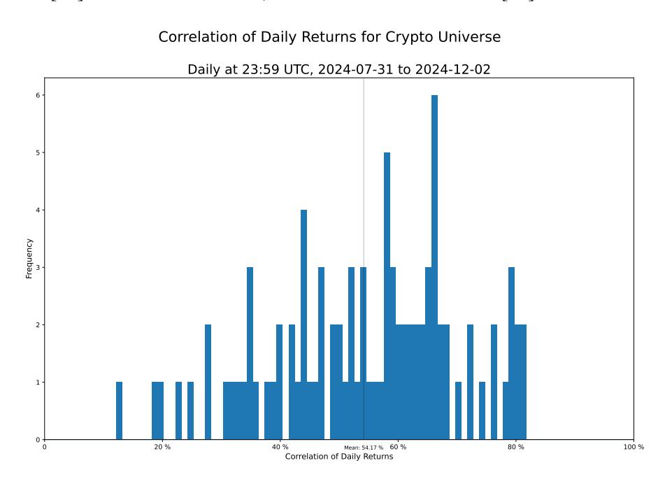
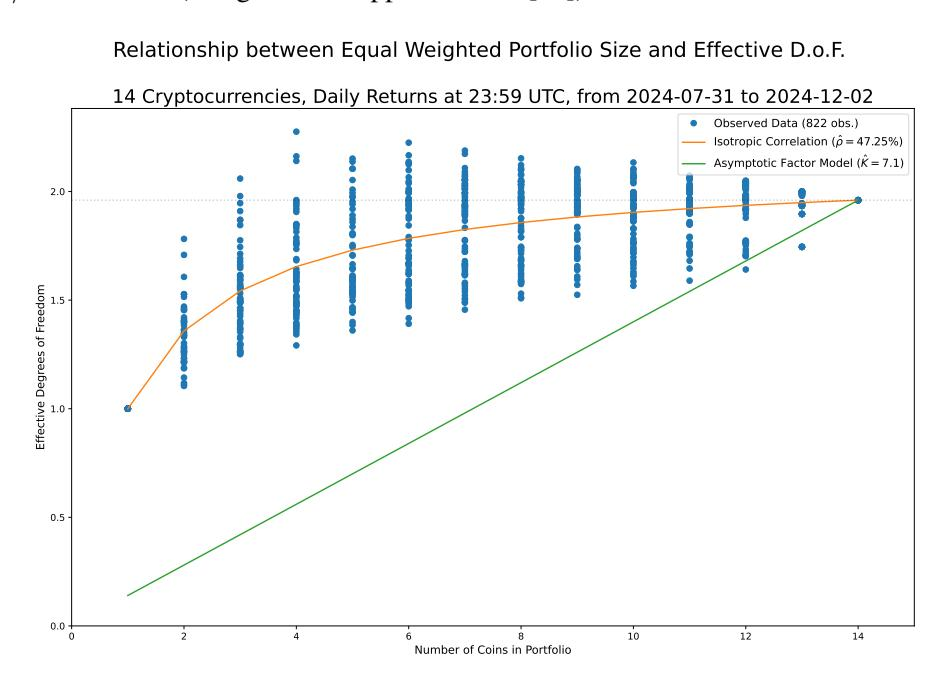
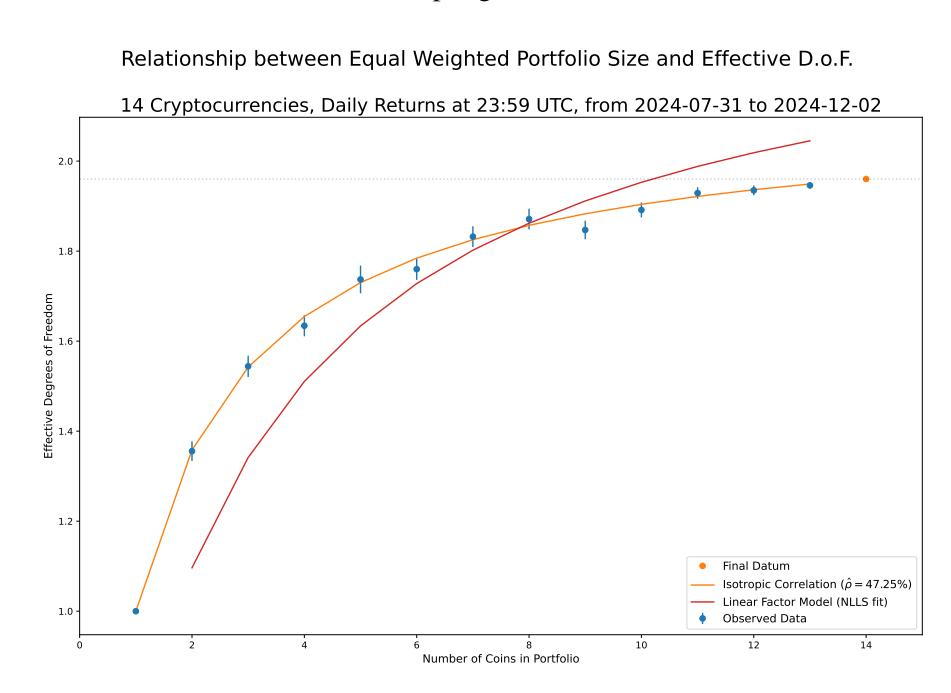
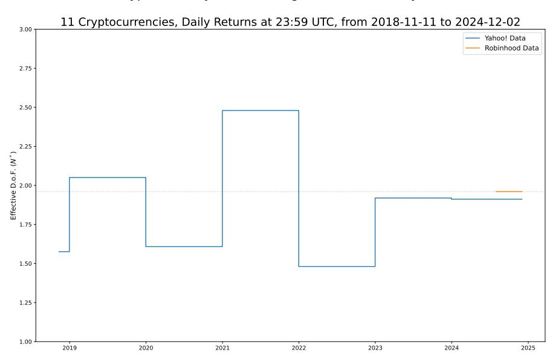

# CORRELATION WITHOUT FACTORS IN RETAIL CRYPTOCURRENCY MARKETS

GRAHAM L. GILLER

ABSTRACT. A simple model-free and distribution-free statistic, the functional relationship between the number of "effective" degrees of freedom and portfolio size or N ∗ (N), is used to discriminate between two alternative models for the correlation of daily cryptocurrency returns within a retail universe of defined by the list of tradable assets available to account holders at the *Robinhood* brokerage. The average pairwise correlation between daily cryptocurrency returns is found to be high (of order 60%) and the data collected supports description of the cross-section of returns by a simple isotropic correlation model distinct from a decomposition into a linear factor model with additive noise with high confidence. This description appears to be relatively stable through time.

### 1. INTRODUCTION

The emergence of cryptocurrencies (see "Nakamoto"[\[33\]](#page-14-0), Buterin[\[7\]](#page-12-0) et al.) as an asset class available to traders and investors has prompted researchers and practitioners in quantitative finance to seek to deploy the factor model frameworks developed using the *Arbitrage Portfolio Theory* of Ross[\[37\]](#page-14-1), and that have gained widespread adoption in equity markets (see Asness[\[3\]](#page-12-1), Muller[\[32,](#page-14-2) [31\]](#page-14-3) and many others), to the returns of this new class of synthetic commodities. It is readily apparent that the intertemporal returns of many different cryptocurrencies exhibit strong correlation cross-sectionally. This has lead to a series of studies in which methods such as *Principal Components Analysis*[\[26\]](#page-13-0) and *Factor Analysis*[\[18\]](#page-13-1) have been applied to data over a variety of horizons. Much of this work, such as that in Li[\[24\]](#page-13-2), Liu[\[25\]](#page-13-3), Peng[\[34\]](#page-14-4) and others, reproduces the approach pioneered by Fama and French[\[11\]](#page-13-4), constructing "factors" as the returns of portfolios composed by the author of the study by stratifying assets according to some *ex ante* property, such as "size" or "book value" etc. in the equity world, and forming a panel regression of asset returns on to these synthetic time-series. These panel regressions extract the *risk premium* attributable to each factor via the Fama-MacBeth two stage regression procedure[\[12\]](#page-13-5), and has given rise to the concept of *Factor Investing* which is implemented by active managers throughout the finance industry[\[4\]](#page-12-2).

It is such a common practice for authors to invent a new, ad hoc, asset stratification rule and demonstrate that returns regress onto it without much consideration as to whether there is sufficient available residual variance to be explained by this new "factor," or whether it is statistically independent of other known factors as

it should be under the proper definition of a factor model, that the confusion arising from all of this work has generated a situation known to those who study the cross-section of equity returns as "the Factor Zoo."[\[20\]](#page-13-6)

In this article a different approach to understanding the cross-section of cryptocurrency returns is taken. Following the method developed in Giller[\[16\]](#page-13-7), a systematic study of the manner in which the variance of daily returns accumulates in equal-weighted portfolios of cryptocurrencies is made via random sampling. This produces a signature function, N∗ (N), which represents the "effective" degrees of freedom, N∗ , as a function of the number of assets in the portfolio, N. This function is known to have very specific forms for both linear factor models, such as the A.P.T. models of Ross discussed above, and for a simpler isotropic covariance model presented by authors such as Grinold and Kahn[\[17\]](#page-13-8), mostly as a didactic tool. These forms differ and it will be shown that the data extracted from cryptocurrency markets favours strongly the latter over the former.

#### 2. ISOTROPIC RETURNS AND LINEAR FACTOR MODELS

2.1. Effective Degrees of Freedom in the Cross-Section of Asset Returns. The concept of "effective" degrees of freedom is extremely straightforward to understand and very simple to compute. It is well known from the *Law of Large Numbers*[\[21\]](#page-13-9) that the variance of a mean of i.i.d. random variables, x, is simply given by σ 2/N, where σ 2 is their common individual variance and N is the sample size. If, alternatively, the variables have different variances, {σ 2 i } for i ∈ [1, N], while still being independent, then

| (1) | $\mathbb{V}[\bar{x}] = \frac{\bar{\sigma}^2}{N},$ |
|-----|---------------------------------------------------|
|-----|---------------------------------------------------|

where σ 2 is the mean of the variances of the variables. In the case of positive (negative) correlation between the variables the variance of the mean will be more (less) than that expected under the false assumption that the variables were independent. This can be expressed in terms of an adjusted expression

$$(2) \quad \mathbb{V}[\bar{x}] = \frac{\sigma^2}{N^*},$$

where N∗ is the "effective" degrees of freedom.

The precise form of N∗ (N) depends on the specific correlation matrix that describes the variables. However, when the variables are the returns of assets that are collected into an equal-weighted portfolio, it is simple to show that

| (3) | $N^* = N \frac{V_I}{V_P}.$ |
|-----|----------------------------|
|-----|----------------------------|

Here VI represents the variance expected for the portfolio if the assets were independent, which may be computed from the individual sample variances of the asset returns, and VP represents the actual sample variance of an equal-weighted portfolio formed from the assets.

# 3. MEASURING THE EFFECTIVE DEGREES OF FREEDOM

3.1. Experimental Design. An *elementary* random sampling experiment may be constructed to investigate the form of the N∗ (N) function for a given set of assets. Importantly, this experiment is entirely *independent* of any specific models for asset returns and so its results are not biased due to mis-specification errors.

For a given set of Nmax assets, U, and sample period, T = [1, T], the following is performed repeatedly:

- (1) set the iteration to j ∈ [1, Niter], for Niter total iterations;
- (2) choose Nj uniformly from [1, Nmax];
- (3) choose a unique subset Sj of Nj assets uniformly from within the available universe, Sj ⊆ U where |Sj | = Nj ;
- (4) from the sets of returns selected, {rit} : i ∈ S, t ∈ T , compute the equalweighted portfolio variance, VP , and the portfolio variance expected for independence, VI ;
- (5) compute N∗ (Nj ) = Nj × VI/VP ;
- (6) repeat until a sufficiently large sample of data is collected.

The collected data may then be analyzed to compare it with various hypotheses regarding the structure of the cross-section of returns in a manner independent of any distributional assumptions. For Nmax assets there are 2 Nmax −1 ways of picking a portfolio with between 1 and Nmax assets in it. This can rapidly become a very large number and, due to the random sampling nature of the experiment described, it is not necessary to exhaustively enumerate every possible portfolio. i.e. The set of portfolios studied, {Sj}, may be (much) smaller than the power set 2 U and statistical inference may be applied to this data.[1](#page-2-0)

3.2. Independent Returns. For fully independent returns

(4) 
$$N^*(N) = N$$
.

It is unlikely that this is the outcome of the experiment.[2](#page-2-1)

3.3. Isotropic Returns. For homoskedastic isotropic covariance, the covariance matrix of returns may be written[3](#page-2-2)

$$(5) \quad \mathbb{V}[\mathbf{r}_t] = \sigma^2 \begin{pmatrix} 1 & \rho & \cdots & \rho \\ \rho & 1 & \cdots & \rho \\ \vdots & & \ddots & \vdots \\ \rho & \rho & \cdots & 1 \end{pmatrix},$$

where rt is a vector of asset returns for Nmax assets over the period (s, t]. It is easy to generalize this model to the case of heteroskedastic returns by removing the scalar σ 2 and, instead, multiplying the given correlation matrix, on the left and

1Technically the empty-set is excluded so {Sj} ⊆ (2U \ ∅).

2Based on the author's experience in financial markets.

3The notations E[x] and V[x] is used to denote the expectation and covariance matrix of x, respectively.

on the right, by a diagonal matrix with the individual volatility of each asset along the diagonal. This generates a system suitable for use in the "Dynamic Conditional Correlation," or DCC, models of Engle and Sheppard[\[10\]](#page-12-3).

For the homoskedastic structure of equation [5 on the preceding page](#page-2-3)

$$(6) \quad N^*(N) = \frac{N}{1 + (N - 1)\rho}.$$

If this model is true it is necessary that ρ ∈ [1/(1 − N), 1] and[4](#page-3-0)

| (7) | $\lim_{N \rightarrow \infty} N^*(N) = \frac{1}{\rho}.$ |
|-----|--------------------------------------------------------|
|-----|--------------------------------------------------------|

3.4. Linear Factor Models. A linear K-factor model for returns is the structure

(8) 
$$r_t = \mu + Bf_t + \epsilon_t$$

| (9) | where $\mathbb{E}[\mathbf{f}_t] = \mathbf{0}_K$ , $\mathbb{E}[\boldsymbol{\varepsilon}_t] = \mathbf{0}_N$ |
|-----|-----------------------------------------------------------------------------------------------------------|
|-----|-----------------------------------------------------------------------------------------------------------|

| (10) | and $\mathbb{V}[\mathbf{f}] = I_K, \mathbb{V}[\boldsymbol{\varepsilon}] = (\text{diag } \mathbf{s})^2, \mathbb{V}[\mathbf{f}, \boldsymbol{\varepsilon}] = 0$ |
|------|--------------------------------------------------------------------------------------------------------------------------------------------------------------|
|------|--------------------------------------------------------------------------------------------------------------------------------------------------------------|

$$(11) \quad \Rightarrow \mathbb{E}[r_t] = \boldsymbol{\mu} \text{ and } \mathbb{V}[r_t] = B \mathbb{V}[\boldsymbol{f}] B^T + (\text{diag } \boldsymbol{s})^T.$$

With this cross-sectional model, the effective degrees of freedom is given by[5](#page-3-1)

| (12) | $N^*(N) = N \frac{\overline{b^2} N + \overline{s^2}}{\overline{b^T} \overline{b} N + \overline{s^2}}$ |
|------|-------------------------------------------------------------------------------------------------------|
|------|-------------------------------------------------------------------------------------------------------|

where b 2 is the mean-squared element of the factor loadings matrix, B, and b is the mean factor loadings vector. s 2 = s T s/N is the mean residual variance. All of the terms in equation [12](#page-3-2) are non-negative.[6](#page-3-3)

3.5. Discrimination Between Covariance Models. It can be seen that equations [4,](#page-2-4) [6](#page-3-4) and [12](#page-3-2) exhibit *different* functional forms for the measure N∗ (N) and that, to discriminate fully between them, it is important to explore the shapes of the functions not merely the specific values for a given portfolio size.

In particular, the asymptotic properties of the expressions are quite different: for isotropic correlation the function converges to single value, 1/ρ, whereas for both independence and factor models it diverges linearly as N. For a model containing K independent factors the coefficient of N is scaled by b 2/b T b which may be approximated by 1/K when the elements of the factor loading matrix, B, are all similar in value. However, such asymptotics are not possible in the analysis presented here because the total number of assets studied (see section [4 on the facing](#page-4-0) [page\)](#page-4-0) is low. However, such an analysis is feasible for equity indices, such as the S& P 500 or RUSSELL 3000.

4The former condition is derived in Giller[\[16\]](#page-13-7) and the latter limit in Grinold and Kahn[\[17\]](#page-13-8).

5 Ibid.

6 In addition, N is a positive integer.

# 4. ANALYSIS OF DATA COLLECTED FROM ROBINHOOD

Robinhood Markets, Inc. (hereafter "Robinhood") is a publicly traded retail brokerage. Robinhood also operates a cryptocurrency trading platform for its clients in the U.S.A., under a subsidiary Robinhood Crypto, LLC. This platform offers a REST[\[28\]](#page-13-10) API for clients to use, which is documented online[\[35\]](#page-14-5).[7](#page-4-1)

FIGURE 1. Distribution of all possible pairwise correlation coefficients, ρij , for the daily returns (UTC midnight to UTC midnight) of cryptocurrency prices collected from the *Robinhood* retail brokerage.

4.1. Data Collection. At the time of writing, Robinhood provided retail clients trading access to fourteen cryptocurrencies via their API. These are: AAVE[\[14\]](#page-13-11), AVAX[\[8\]](#page-12-4), BCH,[8](#page-4-2) BTC[\[33\]](#page-14-0), COMP[\[23\]](#page-13-12), DOGE[\[27\]](#page-13-13), ETC[9](#page-4-3) , ETH[\[7\]](#page-12-0), LINK[\[5\]](#page-12-5), LTC[\[22\]](#page-13-14), SHIB[\[38\]](#page-14-6), UNI[\[1\]](#page-12-6), XLM[\[29\]](#page-13-15), XTZ[\[6\]](#page-12-7). Data has been collected by sampling the best bid and ask quotes offered to Robinhood clients, every ten minutes, for every day, since the end of July, 2024. From this mid-price returns are computed. Data is naturally timestamped in Coordinated Universal Time (UTC) and all dates and times in this article are quoted in UTC. Only daily data will be

7The author holds several accounts at Robinhood and applied for access to the API as any other client would. See the appendix for fuller disclosures and descriptions of data and code access.

8 "Bitcoin Cash": a fork of the original bitcoin blockchain with a modified block size.

9 "Ethereum Classic": a copy of the original ethereum blockchain retaining the "proof-of-work" validation scheme.

analyzed herein, which is represented by the last print collected at 23:59 UTC on every date sampled. This data collection is ongoing and the data is available at the URL given by the reference cited in the appendix. Robinhood provides price data for a wider range of cryptocurrencies on its website, but these are not available within the API and analysis here is restricted to those that are tradable via the API by clients.

4.2. Distribution of Pairwise Correlation. Prior to executing the main experiment, as described in section [3.1 on page 3,](#page-2-5) a study of the pairwise correlations between daily returns of the selected universe of cryptocurrencies was made. As there are just 14×13/2 = 91 possible correlation coefficients to sample, the values for the entire population may be enumerated. This data is presented as a histogram in figure [1 on the preceding page.](#page-4-4) Qualitatively, the data shows a left-skewed distribution with a mean of 54.17%. There are only three pairs of cryptocurrencies with correlations below 20% and four above 80%. With a sample size of 125 daily returns, the standard error of these correlation coefficients should be of order 1/ √ 122 ≈ 9% (using Fisher's approximation[\[13\]](#page-13-16)).

FIGURE 2. A random sample of values (blue dots) of N∗ (N) for equal-weighted portfolios formed from the daily returns (UTC midnight to UTC midnight) of cryptocurrency prices collected from the *Robinhood* retail brokerage. The orange curve represents the expected relationship for an isotropic correlation structure and the green line the asymptotic relationship expected for a linear factor model in a "large" portfolio.

4.3. Scaling of Effective Degrees of Freedom with Portfolio Size. One thousand trials of the experiement described above were performed. For a universe size of Nmax = 14 there are 2 Nmax − 1 ways of composing a portfolio with between one and fourteen assets. This is 16,383 and, in a thousand trials, the probability of picking the same asset mix more than once is non-negligible. To correct for this, the list of assets used for each portfolio is retained in the analysis and any duplicates are removed. The result is 822 distinct portfolio pairs of(N∗ , N), which are plotted in figure [2 on the preceding page](#page-5-0) as blue dots.

Also plotted is an orange curve which describes the relationship N∗ (N) expected under an isotropic correlation model when the free parameters, N∗ (14) = 1.96 and ρ = 47.25%, are fixed by the "final" datum, which is the portfolio in which all assets are present. It is important to note that this curve is entirely determined by these two values *and* it must pass through (1, 1). It is not a "curve fit," adapted to the trend within the data, but an extrapolation from the final datum. As such, by eye, it appears to describe the data very well, and this statement will be made quantitative below.

Finally, the asymptotic limiting portfolio trend N∗ (N) ≈ N/K for an homogenously weighted K factor model is plotted as a green line. This is also required to pass through the final datum and is an extrapolation from that value. The imputed value is K = 7 and it it can be seen to be a poor description of the data, qualitatively. This is a "large" portfolio limiting behaviour, so it is not entirely surprising that it fails to capture the measurements made as the maximum portfolio size of fourteen could hardly be described as large.

4.4. Hypothesis Tests for Isotropic Correlation Versus Linear Factor Models. A summary statistic that may be computed from much of the collected data is needed to make the analysis of the fit of the various models for N∗ (N) quantitative. As the degrees of freedom in the portfolios formed from just one asset must be one, regardless of which of the fourteen cryptocurrencies this datum is computed from, this lower end point of the data should be excluded from the analysis. It also makes sense to excluded the upper end point as that is the value used to extrapolate the N∗ (N) curve from under the isotropic correlation model.

The number of ways of picking N assets from Nmax is given by the binomial coefficient Nmax N and is 91 for a portfolios of two (or twelve) assets and fourteen for a portfolio of thirteen assets. In between these extrema it becomes as large as 3,432. Therefore, it is possible to summarize this data via its sample mean and standard error in that mean and to then compare this data to the extrapolation from an isotropic correlation model computed for the full portfolio (the "final datum") via a χ 2 statistic. The usual assumption of normality in the residuals for samples over thirty in size is made and is valid for all except the portfolios of size thirteen assets. A similar statistic can be computed for fitted curves, with the degrees of freedom for the χ 2 statistic reduced by the number of free parameters in the fit. The data for portfolios of one asset cannot be included in these statistics as the value of N∗

AssetsSampleIsotropicCorrelationLinearFactorModelMeanSt.Dev.CountStd.Err.ModelErrorZScoreChiSq.ModelErrorZScoreChiSq.

|    | Mean  | St.Dev. | Count | Std.Err. | Model | Error  | Z Score | Chi Sq. | Model | Error  | Z Score | Chi Sq. |
|----|-------|---------|-------|----------|-------|--------|---------|---------|-------|--------|---------|---------|
| 1  | 1.000 | 0.000   | 75    | 0.000    | 1.000 | 0.000  |         |         | 0.708 | 0.292  |         |         |
| 2  | 1.306 | 0.143   | 71    | 0.017    | 1.358 | -0.052 | -3.085  | 9.515   | 1.096 | 0.210  | 12.391  | 153.542 |
| 3  | 1.506 | 0.208   | 77    | 0.024    | 1.542 | -0.037 | -1.549  | 2.400   | 1.342 | 0.164  | 6.909   | 47.735  |
| 4  | 1.642 | 0.239   | 64    | 0.030    | 1.655 | -0.013 | -0.421  | 0.177   | 1.510 | 0.132  | 4.399   | 19.354  |
| 5  | 1.778 | 0.221   | 70    | 0.026    | 1.730 | 0.048  | 1.809   | 3.273   | 1.634 | 0.144  | 5.450   | 29.699  |
| 6  | 1.777 | 0.222   | 71    | 0.026    | 1.784 | -0.007 | -0.264  | 0.070   | 1.728 | 0.050  | 1.879   | 3.530   |
| 7  | 1.777 | 0.194   | 82    | 0.021    | 1.825 | -0.048 | -2.256  | 5.089   | 1.802 | -0.025 | -1.168  | 1.365   |
| 8  | 1.853 | 0.193   | 50    | 0.027    | 1.857 | -0.004 | -0.141  | 0.020   | 1.862 | -0.009 | -0.312  | 0.097   |
| 9  | 1.880 | 0.160   | 65    | 0.020    | 1.883 | -0.003 | -0.171  | 0.029   | 1.911 | -0.032 | -1.610  | 2.591   |
| 10 | 1.902 | 0.135   | 82    | 0.015    | 1.904 | -0.002 | -0.111  | 0.012   | 1.953 | -0.051 | -3.401  | 11.569  |
| 11 | 1.928 | 0.098   | 70    | 0.012    | 1.921 | 0.007  | 0.587   | 0.344   | 1.988 | -0.060 | -5.092  | 25.933  |
| 12 | 1.937 | 0.096   | 71    | 0.011    | 1.936 | 0.001  | 0.075   | 0.006   | 2.019 | -0.081 | -7.130  | 50.844  |
| 13 | 1.951 | 0.057   | 83    | 0.006    | 1.949 | 0.002  | 0.330   | 0.109   | 2.045 | -0.094 | -15.048 | 226.454 |

TABLE

1.

Mean

and

standard

deviation

ofthe

measured

effective

degrees

of

freedom

by

portfolio

sizefor

randomly

selected

portfolios

within

the

Robinhood

universe

of

tradable

cryptocurrencies.

These

are

compared

tothe

values

imputed

from

the

final

datum

(the

portfolio

withall

assets,

not

included

inthis

table)

foran

isotropic

correlation

model

andforthebest

fitting

linear

factor

model.

Dataisfrom

Robinhood

fromtheendofJuly,

2024todate. is always unity for a portfolio of this size; the data for portfolio's of all assets is excluded from the analysis as these are the portfolios from which N∗ and ρ are estimated and so the data must fit this final datum with zero error for the isotropic correlation model and including it would bias the χ 2 statistic downwards.

The individual data are summarized in table [1 on the facing page](#page-7-0) and illustrated in figure [3.](#page-8-0) A non-linear least squares procedure is used to fit the curve generated by a linear factor model to the observed data.[10](#page-8-1) In equation [12 on page 4,](#page-3-2) the terms b 2, b T b and s 2 are treated as *holistically* as independent, non-negative, coefficients in the regression, rather than estimating the underlying matrix elements they are summaries of, and the estimates of them are 0.000 ± 0.165, 7.24 ± 1.80 × 107 , and 17.58 ± 4.36 × 107 , respectively. On the basis of these estimates alone, the model is poorly constrained by the data and inspection of the figure shows that the curve defined by them misses the means of the measurements almost everywhere. Mostly, it does not lie within the sampling error defined by the standard errors of the means. In contrast, the isotropic correlation model is clearly, visually, a good fit to the data and lies within the sampling error for most of the data.

FIGURE 3. Mean values of a random sample of values (blue dots with error bars) of N∗ (N) for equal weighted portfolios formed from the daily returns (UTC midnight to UTC midnight) of cryptocurrency prices collected from the *Robinhood* retail brokerage and the curves expected for an isotropic correlation structure (orange curve) and the best fitting curve consistent with a linear factor model (red curve).

10The fit curve function in the package scipy.optimize is used[\[41\]](#page-14-7).

The total χ 2 for the linear factor model is 572.7 with 9 d.o.f., giving a vanishingly small p value. In contrast, the total χ 2 for the isotropic correlation model is 21.0 with 12 d.o.f. and a p value of 0.0497. Thus the linear factor model fails to describe the data with high confidence and the isotropic correlation model fails to describe the data with barely over 95% confidence. The quality of the curve fit relative to the alternate isotropic model may be assessed through the F statistic that is the ratio of their reduced χ 2 values. This is (572.7/9)/(21.0/12) = 36.3 which should be distributed as F with 9 and 12 degrees of freedom. The associated p value is vanishingly small at 4.8 × 10−7 , indicating that the equivalence of the models as descriptions of the data may be rejected with a high degree of confidence.

# 5. ANALYSIS OF DATA COLLECTED FROM COINMARKETCAP

The analysis presented in the prior section appears to strongly reject the description of the collected cryptocurrency returns data as described by a standard linear factor model in favour of an isotropic correlation model. On the assumption that that description of the data is correct, it is interesting to examine how stable the parameters extracted from the model are through time — especially since the data presented is for *just* the five months prior to the date of writing.

5.1. Data Collection. The Robinhood data use for analysis has been collected "live," by calling the API a minute before UTC midnight, and so does not extend in time before the first date in the analysis presented here. Of course, the prices for the cryptocurrencies considered do have longer history, and so that data must be acquired from another source. This data is readily available via *Yahoo! Finance* and the python package yfinance[\[2\]](#page-12-8). The data displayed is originally sourced via CoinMarketCap[\[9\]](#page-12-9), a cryptocurrency data vendor.

Data capture is straightforward using the provided API's, but the universe of cryptocurrencies is reduced as follows:

- (i) *Compound* (COMP-USD) is removed as the data series available terminates prior to the current year;
- (ii) *Shiba Inu* (SHIB-USD) has very low nominal values quoted which causes numerical precision issues; and,
- (iii) *Uniswap* (UNI-USD) exhibits an abrupt change in value by many orders of mangnitude within the middle of the data.

Within the remaining data set *Aave* (AAVE-USD) and *Avalanche* (AVAX-USD) were not in existence at the beginning of the data set. Finally, in all cases, the first year of the data is arbitrarily removed to exclude high-volatility associated with initial issuance.

5.2. Stability of Effective Degrees of Freedom Through Time. After the data is extracted the same experiment is performed, with the additional step that the data is also stratified by year. The results of the analysis, the set of asset and portfolio variances and the values {(N∗ y , ρy)} indexed by year y ∈ [2018, 2024], are presented in table [2.](#page-10-0) The time-series of N∗ y is plotted in figure [4 on the following](#page-11-0) [page.](#page-11-0)

For first six years studied,[11](#page-10-1) the mean value of N∗ y is 1.85 with a standard deviation of 0.38, leading to a standard error of 0.15. The value computed for the Robinhood data lies within the 68% confidence region defined by these values: 1.96 ∈ [1.60, 2.00]. These separate measurements are consistent on this basis are there seems to be little reason to suspect gross non-stationarity within this small sample of data.

|                           | 2018   | 2019  | 2020  | 2021   | 2022  | 2023  | 2024  |
|---------------------------|--------|-------|-------|--------|-------|-------|-------|
| AAVE-USD                  |        |       |       | 26.34  | 40.18 | 14.93 | 24.26 |
| AVAX-USD                  |        |       |       | 64.15  | 32.58 | 19.36 | 23.59 |
| BCH-USD                   | 138.10 | 28.68 | 29.95 | 48.77  | 19.11 | 17.63 | 28.42 |
| BTC-USD                   | 25.60  | 12.69 | 14.22 | 17.72  | 11.06 | 5.25  | 8.04  |
| DOGE-USD                  | 22.74  | 11.80 | 28.86 | 486.13 | 31.67 | 10.64 | 29.57 |
| ETC-USD                   | 50.77  | 19.13 | 27.41 | 65.96  | 36.80 | 11.24 | 17.38 |
| ETH-USD                   | 48.37  | 16.92 | 24.39 | 31.36  | 20.45 | 5.98  | 11.65 |
| LINK-USD                  | 69.62  | 48.14 | 44.24 | 53.56  | 26.50 | 14.99 | 20.37 |
| LTC-USD                   | 39.79  | 23.73 | 26.03 | 37.26  | 20.25 | 11.61 | 14.48 |
| XLM-USD                   | 41.82  | 18.44 | 37.07 | 54.79  | 16.13 | 18.61 | 30.06 |
| XTZ-USD                   | 50.24  | 33.48 | 35.58 | 60.44  | 23.12 | 11.13 | 25.13 |
| Portfolio ( V P )         | 30.91  | 10.39 | 16.65 | 31.81  | 15.64 | 6.14  | 10.15 |
| Independent ( V I )       | 4.87   | 2.13  | 2.68  | 6.57   | 1.93  | 0.98  | 1.62  |
| Total Assets ( N max )    | 10     | 10    | 10    | 12     | 12    | 12    | 12    |
| Effective D.o.F. ( N ∗    |        |       |       |        |       |       |       |
| )                         | 1.58   | 2.05  | 1.61  | 2.48   | 1.48  | 1.92  | 1.91  |
| Imputed Correlation ( ρ ) | 59.40  | 43.07 | 57.98 | 34.90  | 64.59 | 47.74 | 47.97 |

TABLE 2. Individual cryptocurrency variances, actual equalweighted portfolio variance and expected portfolio variance "as if" the assets were indepedent, by year, together with the effective degrees of freedom, N∗ , and imputed common pairwise correlation, ρ, for the reduced sample of cryptocurrencies taken from *CoinMarketCap* via *Yahoo! Finance*. Data for 2024 is for the partial year to the time of writing.

### 6. CONCLUSIONS

In this article, the author's prior work on isotropic correlation is applied to the emergent space of cryptocurrencies. The focus is on a very "mainstream," "retail," oriented set of assets: those made available to trade by clients of the popular brokerage Robinhood. The characteristic form of N∗ (N) is shown to be consistent

11i.e. Excluding the overlap with the Robinhood data.

FIGURE 4. Effective degrees of freedom from year-by-year samples of daily returns of cryptocurrencies collected from the data vendor *CoinMarketCap* (blue lines). The orange line indicates the equivalent quantity extracted from the data from the retail brokerage *Robinhood*.

with that which would be expected for a cross-section of returns described by a homoskedastic isotropic covariance structure and *not* having the form that would arise from a linear factor model; not even a single factor model. Furthermore, there is evidence to support this description of the data being valid for at least the past five years.

Homoskedastic isotropic covariance is an interesting structure as, although it appears to support a "market factor," there is in fact no common *exogenous* driving force for returns. They just happen to be similar a lot of the time. A critical feature of this structure is that the asymptotic contribution of residual returns to a "large" portfolio does not vanish and it is, therefore, still possible for portfolio returns to be dominated by an individual asset. As the level of pairwise correlation is very high, at around 50%, a mean-variance optimal asset allocator should allocate not proportional to the alpha over variance but proportional to a "mostly centered" Z-score of the alpha and inversely with respect to volatility.

### APPENDIX A. AUTHOR'S STATEMENT ON THE AVAILABILITY OF DATA AND CODE TO EXECUTE THE ANALYSIS PRESENTED HEREIN

Empirical work presented here is executed in *Python* code[\[40\]](#page-14-8) using the standard "open source" toolkit (*Pandas*[\[30\]](#page-14-9), *Numpy*[\[19\]](#page-13-17), *SciPy*[\[41\]](#page-14-7)) as found on Google's *Colab* system[\[39\]](#page-14-10). Analytical notebooks are archived on the author's personal *GitHub* repository[\[15\]](#page-13-18) and the notebook Longer Term Crypto Degrees of Freedom.ipynb, which may be found in the folder Financial-Data-Sciencein-Python, is used for the analysis presented herein. This code base is under development, but the version control system presented by the *GitHub* website permits the specific version in use to generate the figures and tables incorporated in this document to be extracted by users. Data from the *Robinhood* retail brokerage was collected via custom written code to access their provided API which is documented online[\[35\]](#page-14-5). Proprietary code is used which is part of a trading system operated privately by the author and which is not available in the above repository. The data itself is written to a publicly available file available online[\[36\]](#page-14-11). Data from *CoinMarketCap* is extracted extracted programatically via the yfinance package[\[2\]](#page-12-8) from data made available to the general public by *Yahoo! Inc.*. Code to extract this data is included in the notebook given above. In both cases data updates frequently and is believed to be reliable as of the date of writing (November, 2024).

#### REFERENCES

[1] Hayden Adams. A Short History of Uniswap. Available online at [https:](https://uniswap.org/blog/uniswap-history) [//uniswap.org/blog/uniswap-history](https://uniswap.org/blog/uniswap-history), 2019. [2] Ran Aroussi. yfinance GitHub Repository. [https://github.com/](https://github.com/ranaroussi/yfinance) [ranaroussi/yfinance](https://github.com/ranaroussi/yfinance), 2019. [3] Clifford S. Asness, Tobias J. Moskowitz, and Lasse Heje Pedersen. Value and Momentum Everywhere. *The Journal of Finance*, 68(3):929–985, 2013. [4] Jennifer Bender, Remy Briand, Dimitris Melas, and Raman Aylur Subramanian. Foundations of Factor Investing. *Available at SSRN 2543990*, 2013. [5] Lorenz Breidenback, Christian Cachin, Benedict Chan, Alex Coventry, Steve Ellis, Ari Juels, Farinaz Koushanfar, Andrew Miller, Brendan Magauran, Daniel Moroz, Sergey Nazarov, Alexandru Topliceanu, Florian Tramer, and ` Fan Zhang. Chainlink 2.0: Next Steps in the Evolution of Decentralized Oracle Networks. Available online at [https://research.chain.link/](https://research.chain.link/whitepaper-v2.pdf) [whitepaper-v2.pdf](https://research.chain.link/whitepaper-v2.pdf), 2021. [6] Arthur Breitman and Kathleen Breitman. Tezos – A Self-Amending Crypto-Ledger. Available online at <https://tezos.com/whitepaper.pdf>, 2018. Attributed to "L.M. Goodman". [7] Vitalik Buterin et al. A Next-Generation Smart Contract and Decentralized Application Platform. Available online, 2014. [8] Stephen Buttolph, Amani Moin, Kevin Sekniqi, and Emun Gun Sirer. ¨ Avalance Native Token (\$AVAX) Dynamics. Available online at [https:](https://www.avalabs.com/whitepapers) [//www.avalabs.com/whitepapers](https://www.avalabs.com/whitepapers), 2020. [9] Brandon Chez. CoinMarketCap. Commerical data vendor, online at [https:](https://coinmarketcap.com/about) [//coinmarketcap.com/about](https://coinmarketcap.com/about), 2013. [10] Robert F Engle and Kevin Sheppard. Theoretical and Empirical Properties of Dynamic Conditional Correlation Multivariate GARCH. *NBER Working Paper Series*, 2001.

[11] Eugene F. Fama and Kenneth R. French. The Cross-Section of Expected Stock Returns. *The Journal of Finance*, 47(2):427–465, 1992. [12] Eugene F Fama and James D MacBeth. Risk, return, and equilibrium: Empirical tests. *Journal of political economy*, 81(3):607–636, 1973. [13] Ronald A Fisher. Frequency Distribution of the Values of the Correlation Coefficient in Samples of an Indefinitely Large Population. *Biometrika*, 10(4):507–521, 1915. [14] Emilio Frangella and Lasse Herskind. Aave v3 Technical Paper. Available online at <https://github.com/aave/aave-v3-core>, 2022. [15] Graham L. Giller. *GitHub* Repository, 2022. [https://www.github.](https://www.github.com/Farmhouse121) [com/Farmhouse121](https://www.github.com/Farmhouse121). [16] Graham L Giller. Isotropic Correlation Models for the Cross-Section of Equity Returns. *arXiv preprint arXiv:2411.08864*, 2024. [17] Richard C Grinold and Ronald N Kahn. *Active Portfolio Management*. Mc-Graw Hill New York, NY, 2000. [18] H. H. Harmon. *Modern Factor Analysis*. University of Chiacago Press, 1976. [19] Charles R. Harris, K. Jarrod Millman, Stefan J. van der Walt, Ralf Gom- ´ mers, Pauli Virtanen, David Cournapeau, Eric Wieser, Julian Taylor, Sebastian Berg, Nathaniel J. Smith, Robert Kern, Matti Picus, Stephan Hoyer, Marten H. van Kerkwijk, Matthew Brett, Allan Haldane, Jaime Fernandez ´ del R´ıo, Mark Wiebe, Pearu Peterson, Pierre Gerard-Marchant, Kevin Shep- ´ pard, Tyler Reddy, Warren Weckesser, Hameer Abbasi, Christoph Gohlke, and Travis E. Oliphant. Array programming with NumPy. *Nature*, 585(7825):357–362, September 2020. [20] Campbell R Harvey and Yan Liu. A Census of the Factor Zoo. *Available at SSRN 3341728*, 2019. [21] M Kendall, A Stuart, J Ord, and S Arnold. *Kendall's Advanced Theory of Statistics*, volume 1: Distribution theory. Arnold, 1999. [22] Charlie Lee. Litecoin — a New Decentralized Currency. Available online at <https://github.com/litecoin-project/litecoin>, 2011. [23] Robert Leshner and Geoffrey Hayes. Compound: The Money Market Protocol. Available online at <arweave.net>, 2019. [24] Jiasun Li and Guanxi Yi. Toward a Factor Structure in Crypto Asset Returns. *Available at SSRN 3258231*, 2018. [25] Jiatao Liu, Ian W Marsh, Paolo Mazza, and Mikael Petitjean. Factor Structure in Cryptocurrency Returns and Volatility. *Available at SSRN 3389152*, 2019. [26] KV Mardia, JT Kent, and JM Bibby. *Multivariate Analysis*. Academic Press, 1979. [27] Billy Markus, Michi Lumin, and Ross Nicoll. Dogecoin. Available online at <https://dogecoin.com>, 2013. [28] Mark Masse. *REST API Design Rulebook*. O'Reilly Media, 2011. [29] David Mazieres. The Stellar Consensus Protocol: A Federated Model for Internet-level Consensus. Available online at [https://www.stellar.](https://www.stellar.org/papers/stellar-consensus-protocol.pdf) [org/papers/stellar-consensus-protocol.pdf](https://www.stellar.org/papers/stellar-consensus-protocol.pdf), 2016.

[30] Wes McKinney et al. Data Structures for Statistical Computing in Python. In *Proceedings of the 9th. Python in Science Conference*, volume 445, pages 51–56, 2010. [31] P Muller. Proprietary trading: truth and fiction. *Quantitative Finance*, 1(1):6– 8, 2001. [32] Peter Muller. personal communication, 1999. [33] Satoshi Nakamoto. Bitcoin: a Peer-to-Peer Electronic Cash System. Available at [https://www.zouantcha.com/blog/](https://www.zouantcha.com/blog/bitcoin-whitepaper) [bitcoin-whitepaper](https://www.zouantcha.com/blog/bitcoin-whitepaper), 2008. [34] Sanshao Peng, Syed Shams, Catherine Prentice, and Tapan Sarker. Composite Leading Indicator and Cryptocurrency Returns: A Three-Factor Model. *Available at SSRN 4808040*, 2024. [35] Robinhood Markets, Inc. Available online at [https://docs.](https://docs.robinhood.com/crypto/trading) [robinhood.com/crypto/trading](https://docs.robinhood.com/crypto/trading), 2024. [36] Robinhood Markets, Inc. Available online at [https://s3.amazonaws.](https://s3.amazonaws.com/public.gillerinvestments.com/crypto_returns.txxt) [com/public.gillerinvestments.com/crypto\\_returns.](https://s3.amazonaws.com/public.gillerinvestments.com/crypto_returns.txxt) [txxt](https://s3.amazonaws.com/public.gillerinvestments.com/crypto_returns.txxt), 2024 onwards. [37] Stephen A Ross. The Arbitrage Theory of Capital Asset Pricing. In *Handbook of the Fundamentals of Financial Decision Making: Part I*, pages 11–30. World Scientific, 2013. [38] "Ryoshi". Shiba Inu Ecosystem. Available online at [https://github.](https://github.com/shytoshikusama/woofwoofpaper) [com/shytoshikusama/woofwoofpaper](https://github.com/shytoshikusama/woofwoofpaper), 2020. [39] The Google Colab team. Colab. [https://colab.research.google.](https://colab.research.google.com) [com](https://colab.research.google.com). [40] G. van Rossum. Python Tutorial. Technical Report CS-R9526, Centrum voor Wiskunde en Informatica (CWI), Amsterdam, May 1995. [41] Pauli Virtanen, Ralf Gommers, Travis E. Oliphant, Matt Haberland, Tyler Reddy, David Cournapeau, Evgeni Burovski, Pearu Peterson, Warren Weckesser, Jonathan Bright, Stefan J. van der Walt, Matthew Brett, Joshua ´ Wilson, K. Jarrod Millman, Nikolay Mayorov, Andrew R. J. Nelson, Eric Jones, Robert Kern, Eric Larson, C J Carey, ˙Ilhan Polat, Yu Feng, Eric W. Moore, Jake VanderPlas, Denis Laxalde, Josef Perktold, Robert Cimrman, Ian Henriksen, E. A. Quintero, Charles R. Harris, Anne M. Archibald, Antonio H. ˆ Ribeiro, Fabian Pedregosa, Paul van Mulbregt, and SciPy 1.0 Contributors. SciPy 1.0: Fundamental Algorithms for Scientific Computing in Python. *Nature Methods*, 17:261–272, 2020.