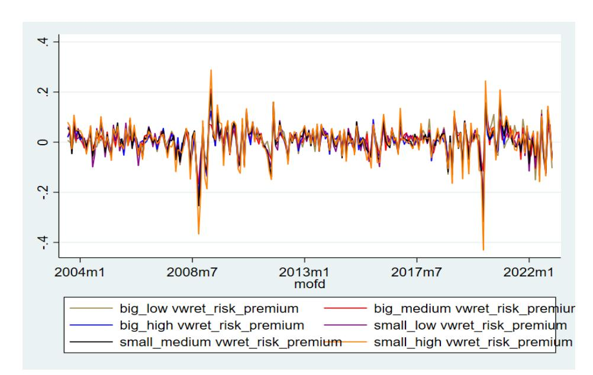
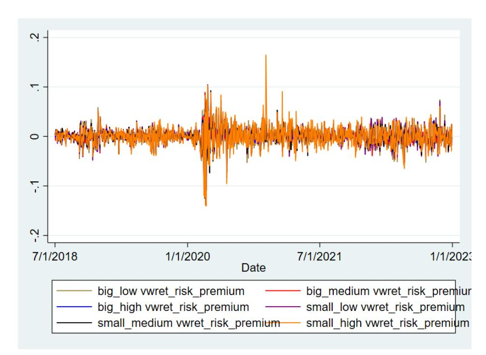
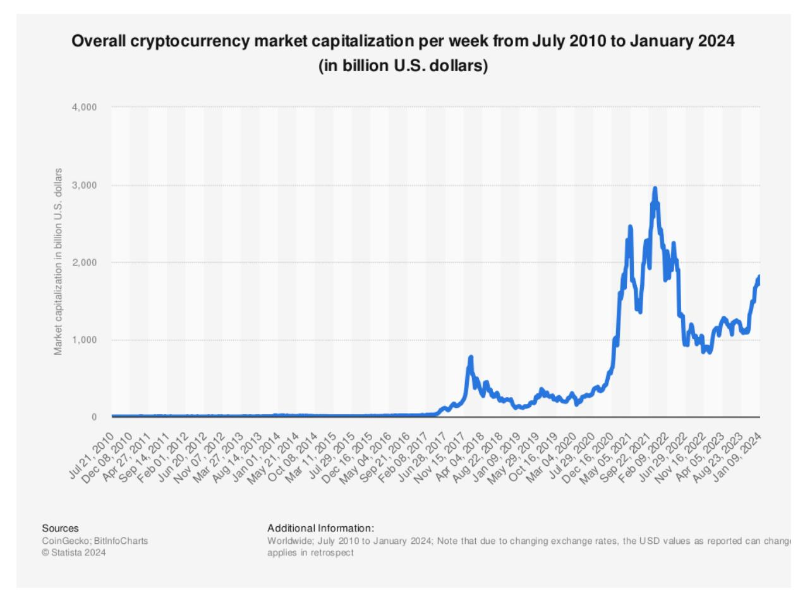

# **Implementation of the Fama-French factors**

Mohammadreza Malekan[\\*](#page-0-0)

Submission date (02.04.2024)

Master's Thesis

At the Chair of Business Administration, especially Banking and Financial Controlling

Of the Otto-Friedrich-Universität Bamberg

Under the supervision of Prof. Dr. Matthias Muck

<span id="page-0-0"></span><sup>\*</sup> Email: mohammadreza.malekan.student@gmail.com

# **Table of Contents**

|        | Table of Contents............................................................................................................................II List of Tables................................................................................................................................. List of Figures List of Abbreviations.................................................................................................................... List of Symbols............................................................................................................................VII | IV .................................................................................................................................V VI |
|--------|----------------------------------------------------------------------------------------------------------------------------------------------------------------------------------------------------------------------------------------------------------------------------------------------------------------------------------------------------------------------------------------------------------------------------------------------------------------------------------------------------------------------------------------------------------------------------------------------------------|------------------------------------------------------------------------------------------------------------------------------------------|
| 1.     | Introduction.............................................................................................................................                                                                                                                                                                                                                                                                                                                                                                                                                                                                | 1                                                                                                                                        |
| 2.     | Literature Review                                                                                                                                                                                                                                                                                                                                                                                                                                                                                                                                                                                        | 4                                                                                                                                        |
| 2.1.   |                                                                                                                                                                                                                                                                                                                                                                                                                                                                                                                                                                                                          | Fama and French Studies in the USA............................................................................. 4                        |
| 2.2.   | Fama and French Studies out of the USA                                                                                                                                                                                                                                                                                                                                                                                                                                                                                                                                                                   | 7                                                                                                                                        |
| 2.3.   |                                                                                                                                                                                                                                                                                                                                                                                                                                                                                                                                                                                                          | Cryptocurrency and Equity Market Studies................................................................... 8                            |
| 3.     | Theoretical Framework                                                                                                                                                                                                                                                                                                                                                                                                                                                                                                                                                                                    | 10                                                                                                                                       |
| 3.1.   | Key Asset Pricing Theories...........................................................................................                                                                                                                                                                                                                                                                                                                                                                                                                                                                                    | 10                                                                                                                                       |
| 3.1.1. | Capital Asset Pricing Model (CAPM)..........................................................................                                                                                                                                                                                                                                                                                                                                                                                                                                                                                             | 10                                                                                                                                       |
| 3.1.2. | Fama-French Three-Factor Model................................................................................                                                                                                                                                                                                                                                                                                                                                                                                                                                                                           | 10                                                                                                                                       |
| 3.2.   | Factor-Portfolio Construction                                                                                                                                                                                                                                                                                                                                                                                                                                                                                                                                                                            | 12                                                                                                                                       |
| 3.3.   | Bitcoin and Cryptocurrency                                                                                                                                                                                                                                                                                                                                                                                                                                                                                                                                                                               | 13                                                                                                                                       |
| 4.     | Data and Methodology                                                                                                                                                                                                                                                                                                                                                                                                                                                                                                                                                                                     | 15                                                                                                                                       |
| 4.1.   | Data.................................................................................................................................                                                                                                                                                                                                                                                                                                                                                                                                                                                                    | 15                                                                                                                                       |
| 4.2.   | Variables and their Operational and Conceptual Definitions in the Research...........                                                                                                                                                                                                                                                                                                                                                                                                                                                                                                                    | 16                                                                                                                                       |
| 4.3.   | Research Questions and Hypotheses............................................................................                                                                                                                                                                                                                                                                                                                                                                                                                                                                                            | 21                                                                                                                                       |
| 4.4.   | Methodology                                                                                                                                                                                                                                                                                                                                                                                                                                                                                                                                                                                              | 22                                                                                                                                       |
| 4.4.1. | Descriptive Statistics                                                                                                                                                                                                                                                                                                                                                                                                                                                                                                                                                                                   | 22                                                                                                                                       |
| 4.4.2. | Data Analysis.................................................................................................................                                                                                                                                                                                                                                                                                                                                                                                                                                                                           | 22                                                                                                                                       |
| 4.4.3. | Diagnostic Tests.............................................................................................................                                                                                                                                                                                                                                                                                                                                                                                                                                                                            | 24                                                                                                                                       |
| 5.     | Research Results and Findings............................................................................................                                                                                                                                                                                                                                                                                                                                                                                                                                                                                | 28                                                                                                                                       |
| 5.1.   | First step: Results of the Monthly Returns from July 2003 to December 2022                                                                                                                                                                                                                                                                                                                                                                                                                                                                                                                               | 29                                                                                                                                       |
| 5.1.1. | Descriptive Statistics                                                                                                                                                                                                                                                                                                                                                                                                                                                                                                                                                                                   | 29                                                                                                                                       |
| 5.1.2. | Time-series Regressions................................................................................................                                                                                                                                                                                                                                                                                                                                                                                                                                                                                  | 32                                                                                                                                       |
| 5.1.3. | Compare with Kenneth R. French                                                                                                                                                                                                                                                                                                                                                                                                                                                                                                                                                                           | 33                                                                                                                                       |
| 5.1.4. | GRS Test                                                                                                                                                                                                                                                                                                                                                                                                                                                                                                                                                                                                 | 34                                                                                                                                       |
| 5.1.5. | Regression for Panel Data                                                                                                                                                                                                                                                                                                                                                                                                                                                                                                                                                                                | 35                                                                                                                                       |
| 5.1.6. | Diagnostic Tests for Time-series and Panel Data Regressions...................................                                                                                                                                                                                                                                                                                                                                                                                                                                                                                                           | 36                                                                                                                                       |

| 5.2.   | Second step: Results of the Daily Returns from July 2018 to December 2022.........                                                                                                                                                          | 38                                                                               |
|--------|---------------------------------------------------------------------------------------------------------------------------------------------------------------------------------------------------------------------------------------------|----------------------------------------------------------------------------------|
| 5.2.1. | Descriptive Statistics                                                                                                                                                                                                                      | 38                                                                               |
| 5.2.2. | Time-series Regressions................................................................................................                                                                                                                     | 40                                                                               |
| 5.2.3. | Compare with Kenneth R. French                                                                                                                                                                                                              | 41                                                                               |
| 5.2.4. | GRS Test                                                                                                                                                                                                                                    | 42                                                                               |
| 5.2.5. | Regression for Panel Data                                                                                                                                                                                                                   | 43                                                                               |
| 5.2.6. | Diagnostic Tests for Time-series and Panel Regressions............................................                                                                                                                                          | 43                                                                               |
| 5.3.   |                                                                                                                                                                                                                                             | Third step: Results of the Daily Returns with Bitcoin from July 2018 to December |
|        | 2022….......................................................................................................................................                                                                                                | 46                                                                               |
| 5.3.1. | Descriptive Statistics                                                                                                                                                                                                                      | 46                                                                               |
| 5.3.2. | GRS Test                                                                                                                                                                                                                                    | 46                                                                               |
| 5.3.3. | Regression for Panel Data                                                                                                                                                                                                                   | 46                                                                               |
| 5.3.4. | Diagnostic Tests for Panel Data Regression                                                                                                                                                                                                  | 48                                                                               |
| 6.     | Conclusion and Limitations of Research                                                                                                                                                                                                      | 48                                                                               |
| 6.1.   | Conclusion......................................................................................................................                                                                                                            | 49                                                                               |
| 6.2.   | Limitations of Research.................................................................................................                                                                                                                    | 50                                                                               |
|        | Appendix........................................................................................................................................                                                                                            | 52                                                                               |
| A      | Overall Cryptocurrency Market Capitalization per Week                                                                                                                                                                                       | 52                                                                               |
| B      | Market Capitalization per Currency as of 5. December 2023                                                                                                                                                                                   | 53                                                                               |
| C      | List of Blockchain Stocks....................................................................................................                                                                                                               | 59                                                                               |
| D      | Statistical Outputs (monthly data from July 2003 to December 2022).............................                                                                                                                                             | 60                                                                               |
| E      | Statistical Outputs (daily data from July 2018 to December 2022)                                                                                                                                                                            | 80                                                                               |
| F      | Statistical Outputs (daily data with Bitcoin from July 2018 to December 2022)............. List of Sources..............................................................................................................................VII | 98                                                                               |
|        | Eidesstattliche Erklärung.....................................................                                                                                                                                                              | Fehler! Textmarke nicht definiert.                                               |

## List of Tables

| Table 1 Descriptive statistics for 6 stock portfolios formed on size and book-to-market equity from 2003 to 2022. The average annual market capitalization is in million U.S. dollars .....                                    | 28 |
|--------------------------------------------------------------------------------------------------------------------------------------------------------------------------------------------------------------------------------|----|
| Table 2 Total number of firms from 2003 to 2022 .....                                                                                                                                                                          | 29 |
| Table 3 Descriptive statistics of portfolios' value-weighted average returns (monthly data). The values of mean and standard deviation are not in percentage. To convert the values to percentages, multiply them by 100 ..... | 31 |
| Table 4 Descriptive statistics of risk factors (monthly data). The mean, standard deviation, minimum, and maximum values are not in percentage. To convert the values to percentages, multiply them by 100 .....               | 32 |
| Table 5 Summary results of time-series regressions for each portfolio (monthly data).....                                                                                                                                      | 33 |
| Table 6 Summary results of time-series regressions for each portfolio for Kenneth R. French data (monthly data) .....                                                                                                          | 34 |
| Table 7 Descriptive statistics of portfolios' value-weighted average returns (daily data). The values of mean and standard deviation are not in percentage. To convert the values to percentages, multiply them by 100 .....   | 39 |
| Table 8 Descriptive statistics of risk factors (daily data). The mean, standard deviation, minimum, and maximum values are not in percentage. To convert the values to percentages, multiply them by 100 .....                 | 40 |
| Table 9 Summary results of time-series regressions for each portfolio (daily data) .....                                                                                                                                       | 41 |
| Table 10 Summary results of time-series regressions for each portfolio for Kenneth R. French data (daily data).....                                                                                                            | 42 |
| Table 11 Descriptive statistics of Bitcoin return (daily data). The values of mean, standard deviation, minimum, and maximum are not in percentage. To convert the values to percentages, multiply them by 100 .....           | 46 |

# **List of Figures**

Figure 1 Fluctuation of the monthly portfolio excess returns. In this study,

vwret\_risk\_premium stands for portfolio value-weighted average returns minus the risk-free rate.................................................................................................................................................. 30 Figure 2 Fluctuation of the daily portfolio excess returns. In this study, vwret\_risk\_premium stands for portfolio value-weighted average returns minus the risk-free rate........................... 39

# **List of Abbreviations**

| ADF                  | Augmented Dickey-Fuller                                         |
|----------------------|-----------------------------------------------------------------|
| AMEX                 | American Stock Exchange                                         |
| BE/ME                | Book Equity to Market Equity                                    |
| BTC                  | Bitcoin                                                         |
| CAPM                 | Capital Asset Pricing Model                                     |
| C-CAPM               | Conventional Capital Asset Pricing Model                        |
| F&F                  | Fama and French                                                 |
| FGLS                 | Feasible Generalized Least Squares                              |
| GRS                  | Gibbons-Ross-Shanken                                            |
| HML                  | High Minus Low                                                  |
| IMI                  | Institutional Minus Individual                                  |
| IRS                  | Internal Revenue Service                                        |
| ISMS                 | Istanbul Stock Market Sustainability                            |
| JB                   | Jarque-Bera                                                     |
| Lbitcoin return      | Logarithm of Bitcoin return                                     |
| LHML                 | Logarithm of High Minus Low                                     |
| Lmarket risk premium | Logarithm of market risk premium                                |
| LSMB                 | Logarithm of Small Minus Big                                    |
| Lvwret_risk_premium  | Logarithm of value-weighted average return minus risk-free rate |
| NASDAQ               | National Association of Securities Dealers Automated Quotations |
| NYSE                 | New York Stock Exchange                                         |
| OLS                  | Ordinary Least Squares                                          |
| RIC                  | Refinitiv Instrument Code                                       |
| S&P                  | Standard and Poor’s                                             |
| SMB                  | Small Minus Big                                                 |
| VIF                  | Variance Inflation Factor                                       |
| vwret                | Value-weighted average return                                   |

## List of Symbols

| $\hat{\beta}_k$        | the estimated regression coefficient of the $k^{\text{th}}$ independent variable                            |
|------------------------|-------------------------------------------------------------------------------------------------------------|
| $\widehat{\Omega}$     | covariance matrix of factors                                                                                |
| $P_{\text{bitcoin},t}$ | closing price of Bitcoin at the end of time $t$                                                             |
| $P_t$                  | closing price of stock at the end of time $t$                                                               |
| $R^2$                  | R-squared. Measure of how well the data is fitted by a model                                                |
| $R_f$                  | risk free-rate                                                                                              |
| $R_{it}$               | return of asset/portfolio $i$ at the time $t$                                                               |
| $R_m$                  | market return                                                                                               |
| $X_i$                  | the dependent variable                                                                                      |
| $d_L$                  | lower critical value                                                                                        |
| $d_U$                  | upper critical value                                                                                        |
| $\hat{e}$              | vector of residuals                                                                                         |
| $m_t$                  | the stock price at the time $t$                                                                             |
| $\hat{\alpha}$         | intercepts during the estimation process                                                                    |
| $\varepsilon_{it}$     | residual component of the regression model for the asset $i$ at the time $t$                                |
| $\bar{\mu}$            | the vector representing the means of factor portfolios                                                      |
| $\mu_{it}$             | expected return of asset $i$ at the time $t$                                                                |
| $h$                    | factor sensitivity to book-to-market ratio factor                                                           |
| $E(D_{t+\tau})$        | expected dividends of the stock during the period $t + \tau$                                                |
| $ESS$                  | explained the sum of squares                                                                                |
| $F$                    | matrix of factors derived from excess returns in portfolios                                                 |
| $K$                    | sample kurtosis                                                                                             |
| $L$                    | quantity of factors incorporated in the model                                                               |
| $N$                    | number of portfolios                                                                                        |
| $RSS$                  | residual sum of squares                                                                                     |
| $S$                    | sample skewness                                                                                             |
| $SE(\hat{\beta}_k)$    | estimated standard error (the square root of the estimated variance of the distribution) of $\hat{\beta}_k$ |
| $T$                    | count of return observations                                                                                |
| $TSS$                  | the total sum of squares                                                                                    |
| $b$                    | coefficient of predictor                                                                                    |
| $c$                    | factor sensitivity to investment                                                                            |

| $n$      | number of observations              |
|----------|-------------------------------------|
| $s$      | factor sensitivity to size factor   |
| $v$      | factor sensitivity to profitability |
| $\beta$  | factor sensitivity to market factor |
| $\delta$ | standardized factor loading         |

# **1. Introduction**

To attract savings towards the equity market, it is imperative to cultivate the confidence of investors. Investors endeavor to designate their savings in a local that presents the utmost return. Nonetheless, they must also consider the risks linked to investment. Considering that most investors are risk-averse, they only invest in securities when they can obtain the best returns possible relative to the risk they take.

On the other hand, investors and market participants now need tools, methods, and models that can assist them in choosing the most optimal portfolio considering the development and growth of marketplaces and instruments for finance, the complexity of financial markets, as well as the specialization of investment. As a result, many theories, models, and techniques for asset pricing and predicting stock returns have grown; these are constantly evolving and continuously shifting. A lot of research that was done until now after the introduction of the Fama-French three-factor model in 1993 shows the popularity and usefulness of this model[1.](#page-8-0) Fama and French in 1993 found that the three factors of size, book-to-market ratio, and market risk premium have a high power to explain the changes in stock excess returns.

Furthermore, after the emergence of the cryptocurrency market, many investors thought of investing in this market, and the level of progress and investment in this market was such that the market capitalization of this market increased from 11.26 billion dollars in January 2014 to nearly 3000 billion dollars in November 2021 (see [Appendix A, Figure 1\)](#page-59-0). The most popular and traded cryptocurrency is Bitcoin[2](#page-8-1), which has a market capitalization of 813.96 billion dollars as of 5. December 2023, that is 54.39% of the cryptocurrency market (see [Appendix B,](#page-65-0)  [Table 1\)](#page-65-0). Bitcoin is the leader of this market, and this has led to plenty of articles that studied the relationship between Bitcoin and other financial markets.

What all past studies have in common is that they calculated the relationship between Bitcoin returns and stock returns by measuring the relationship between Bitcoin returns and stock indices, such as [Nguyen \(2022\),](#page-122-0) [Matkovskyy and Jalan \(2019\),](#page-121-0) [Wang et al. \(2022\),](#page-123-0) [Lopez-](#page-121-1)[Cabarcos et al. \(2021\),](#page-121-1) and [Mizerka et al. \(2020\).](#page-121-2) According to my knowledge, only [Cahill et](#page-115-0)  [al. \(2020\)](#page-115-0) and [Cheng et al. \(2019\)](#page-116-0) have devoted part of their study to measuring thisrelationship at the Fama and French (F&F) stock portfolio level. In this thesis, I want to measure the correlation between the return of Bitcoin and the excess return of portfolios formed according to Fama-French three-factor model instructions. To be more precise, the study first investigates

<span id="page-8-0"></span><sup>1</sup>  [Anuno et al. \(2023\), p. 1.](#page-114-0)

<span id="page-8-1"></span><sup>2</sup> [Lopez-Cabarcos \(2021\), p. 1,](#page-121-1) [Wang et al. \(2022\), p. 4.](#page-123-0)

whether factors of market risk premium, size, and value have a notable impact on determining the excess return of stock portfolios. Then I compare my results with the results extracted from the literature. So, the study is based on the [Fama and French \(1993\)](#page-117-0) factor model. After that, I add the return of Bitcoin as an external factor to the model to analyze, whether it has enough power to explain the portfolio excess returns[3](#page-9-0), how the correlation between these two variables is, and how the adjusted R-squared of the model changes after adding the return of Bitcoin. According to modern portfolio theory, investors should not choose assets solely based on their unique characteristics. Rather, they must assess the relative movements of every asset concerning every other asset. Considering these interactions allows investors to build portfolios with similar expected returns but lower risk compared to portfolios that ignore the relationships between assets*4F* 4. Therefore, the correlation or covariance between the portfolio of stock returns and Bitcoin return should be taken into consideration.

I choose the S&P Composite 1500 as my reference market to implement the Fama and French factors and study the relationship between Bitcoin and stocks. The reason why I chose the S&P Composite 1500 is that this index has never been used for asset pricing models in past studies. Furthermore, this index has enough companies for my research, and it contains a good combination of large-, mid-, and small-cap entities (S&P 500, S&P Mid-cap 400, S&P Smallcap 600), and it covers 90% of the U.S. market capitalization. The launch date of this index is 18th May 1995, which is before the research period in this thesis, so the information on stocks is well available*5F* 5.

In this thesis, stocks are divided into six portfolios according to their size and book-to-market ratio. To analyze the explanatory power of the time series factors in each portfolio, Ordinary Least Squares (OLS) regressions are employed. The reason why I use this method is that for each portfolio I have variables that change over time and the fact is that I analyze each portfolio separately. After running the OLS regressions, I analyze the portfolios jointly as panel data. Panel data is a combination of time series and cross-sectional data[6](#page-9-1). As in my study, there are several portfolios with variables that change over time, so the panel data analysis would be a better model and it is utilized to analyze different factors and their influence on pricing within the cross-section of asset returns over time. The discoveries outlined in this thesis will be valuable for both academics and professionals such as investors, financial institutions, asset management companies, and portfolio and risk managers, aiding them in recognizing crucial

<span id="page-9-0"></span><sup>3</sup> [Cahill et al. \(2020\), p. 12.](#page-115-0)

<sup>4</sup> [Elton and Gruber \(1997\), p. 1744.](#page-117-1)

<sup>5</sup> Se[e the S&P Composite 1500 factsheet as of 30. November 2023.](#page-123-1) <sup>6</sup> [Brooks \(2019\), p. 487.](#page-115-1)

<span id="page-9-1"></span>

pricing elements within both the U.S. and cryptocurrency markets. This, in turn, enhances their ability to make more accurate predictions about future equity returns.

The period of the study is July 2003 - December 2022. To make meaningful conclusions, it is necessary to examine asset pricing studies for at least 20 years[7](#page-10-0) . But the Bitcoin price data in both Refinitiv (Thomson Reuters) and other databases used in previous studies like [Nguyen](#page-122-0)  [\(2022\),](#page-122-0) [Wang et al. \(2022\),](#page-123-0) and [Lopez-Cabarcos \(2021\)](#page-121-1)[8](#page-10-1) is available from the beginning of 2014 onwards. Therefore, I must divide my research into three parts: First, as explained, I will examine the Fama and French three-factor model in the S&P Composite 1500 over twenty years (long term) and check whether the three factors can explain the fluctuations in excess returns of stocks. In the next step, I will perform the same procedure for the period from July 2018 to December 2022 (short term) and check how the results are different in the two periods and finally, I will add the return of Bitcoin. Therefore, one of the limitations of the research is that the review period for the implementation of the asset pricing model and the price of Bitcoin in the second and third phases is shorter than twenty years. To tackle this issue, I use daily intervals instead of monthly. The reason why I started in 2018 is because the number of blockchainbased companies in 2018 is more than in previous years. [Benedetti and Kostovetsky \(2021\)](#page-115-2) mentioned in their paper that [www.coinmarketcap.com](http://www.coinmarketcap.com/) is the best database for collecting cryptocurrency data, so, I provide the Bitcoin prices from this website. Refinitiv Eikon is used for collecting the stock market and accounting data, and further calculations regarding factors calculation, portfolio constructions, and statistical tests are done with Stata.

The overall findings of the study show that the market risk premium, size, and value factors can explain the changes in excess return both in daily and monthly intervals. The adjusted Rsquared in both models is above 70% and all coefficients are statistically significant. In this thesis, the results of the Fama and French study in 1993 have been proven. After including the return of Bitcoin, I observed that the explanatory power of the model reduced massively to 19.31% and the logarithm of HML became redundant. The coefficients of the other three factors are statistically significant, which means that the logarithm of market risk premium, size, and Bitcoin return can explain the fluctuations in the logarithm of portfolio excess returns, and the logarithm of Bitcoin return has a positive coefficient, which means that Bitcoin diversifies the stock portfolios.

The remainder of this thesis is structured in the following manner. In the second chapter, I discuss the results from past studies. In the next chapter, I provide a theoretical framework and

<span id="page-10-0"></span>

<span id="page-10-1"></span><sup>7</sup> [Cochrane \(2005\), p. 287,](#page-116-1) [Ben Ammar et al. \(2018\), p. 294.](#page-115-3) [8](#page-116-1) These databases are: [www.coingecko.com,](http://www.coingecko.com/) [https://cn.investing.com/,](https://cn.investing.com/) [www.coindesk.com.](http://www.coindesk.com/)

introduction to asset pricing models and cryptocurrency, especially Bitcoin. Chapter four provides a brief analysis of the research methodology and introducesthe data used in this thesis. In Chapter Five, I construct models for the study, conduct an empirical assessment, and offer quantitative and qualitative analysis. The final chapter, chapter six, concludes the thesis, offering a summary of the entire study. Additionally, I discuss and acknowledge limitations, while suggesting potential areas for future research.

# **2. Literature Review**

# **2.1. Fama and French Studies in the USA**

Previous studies have found that certain variables have a significant impact on stock excess returns. These variables include market risk premium, market capitalization (size), and bookto-market equity ratio (BE/ME). Some of these studies are as follows:

As mentioned earlier, in their research[, Fama and French \(1993\)](#page-117-0) introduced a three-factor model that incorporated excess market return, company size, and the book-to-market ratio. Their study built upon the findings from [Fama and French](#page-117-2) (1992a), which revealed a significant positive correlation between stock excess returns and both the size and book-to-market ratio, indicating the presence of size and value effects. Fama and French constructed portfolios aimed at capturing risk factors linked to size and BE/ME, and these portfolios effectively capture considerable variability in stock excess returns. One of the noteworthy conclusions from their research is that when stock betas exhibit no correlation with company size, the relationship between beta and stock excess returns remains consistent. This phenomenon diminished the explanatory power of market risk premium, highlighting the significance of the size effect. Moreover, their study underscores that the value effect remains more pronounced than the size effect, as demonstrated by their analysis. In their study, the R2 of the time-series regressions for each portfolio ranges from 83% to 97%. They assert that a portfolio constructed from market risk premium, size, and book-to-market ratio factors substantially better explains the variations in stock returns than the Capital Asset Pricing Model (CAPM), which has only one factor. According to their findings, the beta of market risk premium alone could account for only 70% of the returns in a diversified portfolio, whereas their three-factor model exhibited a remarkable explanatory power of 95%.

Another study in 2011 by [Kang et al.,](#page-120-0) developed a conditional version of the Conventional Capital Asset Pricing Model (C-CAPM) to investigate the link between macroeconomic factors and equity pricing from 1963 to 2005. They use a unique conditioning variable derived from cointegrated macroeconomic variables, including dividend yield, term spread, default spread, and short-term interest rate, to predict market excess returns. Their conditional C-CAPM performs impressively, nearly matching Fama and French's three-factor model in explaining the cross-section of stock excess returns, particularly for size and book-to-market sorted portfolios. Their findings support a risk-based interpretation of size and book-to-market effects by showing that value equities are riskier than growth stocks during economic downturns.

[Fama and French in 2015](#page-118-0) tried to extend their three-factor model and introduced a five-factor model aimed at capturing size, value, profitability, and investment patterns in stock returns. Despite the performance of the factors being relatively insensitive to their definitions, the inclusion of profitability and investment factors renders the value factor redundant. Empirical tests show that the five-factor model can explain a substantial portion of cross-sectional variance in expected returns for various portfolios. However, the study also discusses the difficulty in choosing between different sets of factors and the potential limitations of overcontrolling for too many factors. In conclusion, Fama and French's study highlights the importance of the new factors in explaining stock returns and provides insights into the complex interplay between size, value, profitability, and investment patterns in asset pricing models. The high average return of HML stocks could be fully explained by their relationships with the market risk premium (�������� − ��������), small minus big (SMB), and, especially, two other factors. This discovery suggests that HML might not be as crucial as previously thought. Another significant result from the study is that the companies that are smaller in size and have a greater book-to-market ratio tend to produce elevated average returns.

In 2020, [Ang and colleagues](#page-114-1) conducted a similar study on the New York Stock Exchange (NYSE). The results show that the market risk premium and SMB have significant and positive impacts on the changes in stock values. However, the HML factor was found to be unable to significantly explain this variation.

The research paper written by [Bera et al.](#page-115-4) in 2020 explores the relationship between average stock returns and risk factors using a wavelet multi-scaling approach, allowing for the investigation of this relationship across different time scales. The study uses data from July 1963 to February 2018 collected from the Kenneth R. French website. The data includes various portfolios categorized by size, book-to-market, operating profitability, and investment. Each portfolio is further analyzed at five different time scales. The findings reveal several important insights. First, the relationship between risk factors and average returns varies across different time scales. Second, when assessing the intercepts in asset pricing models, the study indicates that there are abnormal returns in raw-data models, but not in scale-basis models. Third, the study uncovers a period of unexpectedly higher cash flows for big-value portfolios at higher scales. Fourth, the research challenges the notion that mispricing is a short-term phenomenon, as it appears to have a stronger impact on long-term investment horizons and robust portfolios. Analogous to the F&F results, the study by [Bera et al.](#page-115-4) demonstrates that groups of small stocks are more volatile than groups of big stocks. Furthermore, the average returns on small stocks are higher than those on large stocks. They demonstrated that while the small-size high-BE/ME portfolio has the highest return, the small-size low-BE/ME portfolio has the highest standard deviation. The market factor is the most effective factor for average returns as measured by its coefficient magnitudes for all time scales and raw data estimates. As the time scale increases, the coefficients of the SMB factor do not increase, except for the small-size high-BE/ME model. Likewise, the coefficients of the HML factor do not increase, except for the large portfolios at high scales. The results show that the explanatory power of the models depends on the scale basis. Finally, this study proved that the HML, SMB, and market risk factors in the five-factor model can significantly explain the variations in the average returns of portfolios.

[Horvath and Wang](#page-119-0) conducted a study in 2021 for the period January 1990 – March 2020 which assesses the Fama-French model's efficacy on U.S. stock markets during significant events (Dotcom bubble in 19999-2002, Financial crisis in 2007-2010, and Debt crisis in 2009-2013), specifically focusing on the COVID-19 pandemic's impact. In this study, they constructed six value-weighted portfolios based on size and BE/ME, six value-weighted portfolios based on size and investment, and six value-weighted portfolios based on size and operating profitability for each month. Interestingly, they observed a decline in beta values for all five factors before the financial crisis. During this period, there was a notable distinction between the beta values of the market risk premium factor and the other four factors. Rolling beta coefficients display variations, with COVID-19 notably reducing all beta coefficients. According to their findings, R2 changes a lot during different crises, for example, the R2 of the regression model increased in financial crisis from 55.35% in July 2007 to 94.83% in June 2008. Notably, the SMB and HML factors were not statistically significant in this study.

Many studies tried to expand the Fama and French models to understand whether more factors can explain the excess return of stocks. In their research in 2019, [Gonzalez and Jareno](#page-119-1) conducted a comprehensive study comparing twelve different factor models to explain variations in U.S. sector stock returns using the S&P 500 between November 1989 and February 2014. The research built upon the Fama and French three-factor and five-factor models, expanding them by including additional factors such as nominal interest rates, real interest rates, and expected inflation rates. The results of the three-factor model show that the coefficients of market risk and value are significantly positive, however, it is significantly negative for the size factor. The utility sector consistently displayed the lowest explanatory power across all models, quantiles, and periods. Moreover, the study reveals that by adding more factors the explanatory power of the models increases Another important result obtained in this study, and which can affect the results of my research is that the explanatory power of variables changes during recession and expansion.

[Ugurlu-Yildirim and Sendeniz-Yuncu's](#page-123-2) paper (2021) explores the impact of institutional investors on asset pricing models in the NYSE, American Stock Exchange (AMEX), and NASDAQ. Their study used time-series regression analysis, utilizing information from nonfinancial companies that were listed between January 1980 and December 2016. The results show that the Institutional minus Individual (IMI) component, added to the Fama-French fivefactor model, provides a more comprehensive explanation for typical return differences, particularly in portfolios with different amounts of institutional ownership. Additional research reveals that substantial common variances in returns are captured by the market factor and portfolios that are built to replicate size, book-to-market equity, and institutional ownership factors. By showing that size, book-to-market, and momentum are good proxies for common risk elements in stock returns and by adding institutional ownership as an additional representation of a shared risk element, the research validates the conclusions of [Fama and](#page-117-0)  [French \(1993\).](#page-117-0) In alignment with what [Fama and French \(1993\)](#page-117-0) discovered, the adjusted R2 values, which indicate how well the model explains the data, are only approximately 70 percent for portfolios consisting of larger stocks with low book-to-market equity ratios.

# **2.2. Fama and French Studies out of the USA**

In addition to U.S. financial markets, many researchers examined the effectiveness of the Fama and French models in markets outside the United States. Most of these experiments showed different results from what was done in the U.S. markets. In 2019, [Feyyaz et al.](#page-118-1) examined the applicability of Fama and French's Five Factor Asset Pricing Model (F&F5) on firms listed in the Istanbul Stock Market Sustainability (ISMS) Index. The research found that while higher market value correlated with greater returns, the influence of the book-to-market ratio is not statistically significant. Ultimately, the study concluded that there's limited evidence supporting F&F5's validity for the listed companies, aligning with prior research.

[Gonzalez-Sanchez \(2022\)](#page-119-2) shows that factorial asset pricing models generally don't work very well across a set of twenty-six emerging equity markets.

The study of [Mosoeu and Kodongo](#page-122-1) in 2022 in emerging and developed equity markets reveals a notable weakness in the applicability of the Fama-French five-factor model based on the Gibbons-Ross-Shanken (GRS) tests, particularly when applied to country-specific and geographically diversified portfolios.

# **2.3. Cryptocurrency and Equity Market Studies**

The idea of adding the Bitcoin return as a fourth factor to the F&F3 model in this thesis comes from the following two studies by [Cahill et al. \(2020\)](#page-115-0) and [Cheng et al. \(2019\):](#page-116-0) [Cahill et al. \(2020\)](#page-115-0) explored how publicly listed blockchain-related stocks responded to announcements about blockchain in the USA using 8-K reports. In a global study encompassing 713 firm announcements, they found that, on average, there was an abnormal return of about 5% on the day of the announcement. The research questions in this study are whether Bitcoin can explain abnormal returns and whether some factors cause these abnormal returns. Upon introducing Bitcoin returns as an additional factor to Fama and French five-factor model to elucidate portfolio returns, the results revealed positive, albeit insignificant, Bitcoin returns across the entire sample. The low R2 of the regression indicates that the factors do not capture completely the variations in portfolio excess return. The main goal of another study by [Cheng](#page-116-0)  [et al. \(2019\),](#page-116-0) which implements the Fama-French three-factor model, was to analyze how the stock prices react to initial 8-K disclosures categorizing the companies in Speculative and Existing. The authors expect a company to be exposed to blockchain technology if its stock returns move with Bitcoin returns. The results show that Bitcoin has a significantly positive coefficient, both in the case of Speculative and Existing stocks. The coefficients are respectively 0.04 and 0.09. In addition, the coefficient of SMB, HML, and market risk premium in this study are statistically significant.

As stated in the introduction section, many other studies have investigated the impact of digital currencies on stock returns or vice versa using stock market indices. For instance, [Gil-Alana et](#page-119-3)  [al. \(2020\)](#page-119-3) determined that the world of cryptocurrencies is turning out to be a more significant factor in financial markets than initially thought. This is mainly because it provides investors with a valuable diversification option, given its limited correlation with traditional assets. This lack of correlations between Bitcoin returns and the stock market indexes means that Bitcoin plays either a hedging or diversifying role for investors in their portfolios depending on the sign of the coefficient[9](#page-15-0) . Furthermore, [Baur et al. \(2018\)](#page-114-2) discovered that the return of Bitcoin does not have a significant correlation with conventional assets like stocks, bonds, and commodities. This holds true in both stable market conditions and during financial crises in the USA. The investigation into Bitcoin account transaction data reveals that Bitcoin is predominantly utilized

<span id="page-15-0"></span><sup>9</sup> [Chan et al. \(2019\), p. 113,](#page-116-2) [Caferra and Vidal-Tomas \(2021\), p. 8,](#page-115-5) [Gil-Alana \(2020\), p. 9.](#page-119-3)

as a speculative investment rather than being embraced as an alternative currency or medium of exchange.

In her paper[, Dyhrberg \(2016\)](#page-117-3) examined how Bitcoin returns relate to the Financial Times Stock Exchange (FTSE) index using an asymmetric GARCH model. She aimed to analyze whether Bitcoin can be a hedge against the companies. The research investigates the potential of Bitcoin to act as a hedge alongside gold, effectively mitigating specific market risks, particularly against the FTSE. In this study, Bitcoin was uncorrelated with the stocks in the FTSE Index. In conclusion, the findings indicate that Bitcoin does possess important hedging capabilities against the FTSE Index.

Another study by [Chan et al.,](#page-116-2) which was conducted in 2019, showed that there is a negative correlation between monthly Bitcoin returns and five indices, namely the Euro STOXX, NIKKEI, Shanghai A-Share, S&P 500, and the TSX Index. Therefore, Bitcoin has the role of hedger under monthly data frequency and weak hedger under weekly and daily data frequency. For the monthly frequency, the correlations between Bitcoin return and the S&P 500, NIKKEI, Shanghai A-Share, TSX, and STOXX are respectively -0.0202, -.0089, -0.0054, -.0228, and - 0.0143.

In a comprehensive study, [Huang et al. \(2021\)](#page-120-1) investigated whether Bitcoin could serve as a safe haven during the COVID-19 bear market in five major economies. The findings indicate that, in Australia, Bitcoin is primarily an effective portfolio diversifier for local stocks, while in Canada, it acts as a weak safe haven. In Europe, the UK, and the US, Bitcoin is identified as a weak safe haven.

In a study by [Mariana et al. \(2021\),](#page-121-3) the suitability of Bitcoin and Ethereum as short-term safe havens for stocks was examined. The findings reveal that the two major cryptocurrencies exhibit characteristics of short-term safe-havens, particularly evident during the pandemic where their daily returns tend to inversely correlate with those of the S&P500. The results of the study consistently support these safe-haven attributes and suggest that Ethereum might even be a more effective safe haven than Bitcoin. Throughout the pandemic, the correlation between S&P500 and Bitcoin was -0.38, while for Ethereum, it was -0.37. These findings suggest that both cryptocurrencies show early indications of being potential safe havens during periods of stock market uncertainty. Additionally, the study notes that the dynamic correlations between S&P500 and Bitcoin before the pandemic were not consistently negative, varying between - 0.07 and 0.10, with a median of -0.0047.

After reviewing past studies, some researchers believe that the return of Bitcoin does not have a significant correlation with the fluctuations of stock returns. Another group believes that there is a significant relationship between these two variables. In this thesis, I will discuss whether the return of Bitcoin is related to the excess return of the portfolios formed from the companies in the S&P Composite 1500 based on the Fama and French three-factor model. More precisely I examine whether the coefficient of Bitcoin is significant and how the four factors can jointly explain the variations in stock excess returns.

# **3. Theoretical Framework**

# **3.1. Key Asset Pricing Theories**

Many studies were carried out on the behavior of stock returns during the 1900s, which resulted in the creation of important ideas. The most crucial among them is the Capital Asset Pricing Model (CAPM). This model faced criticisms, some of which were articulated in studies by [Banz](#page-114-3)  [\(1981\),](#page-114-3) [Basu \(1983\),](#page-114-4) De Bondt [and Thaler \(1985\),](#page-117-4) and [Bhandari \(1988\).](#page-115-6) However, it wasn't until [Fama and French \(1993\)](#page-117-0) that confirmation emerged.

The following reference is made to some of the asset pricing models.

## **3.1.1. Capital Asset Pricing Model (CAPM)**

The most used model in the field of capital markets for measuring risk and return is the Capital Asset Pricing Model (CAPM). This model comprises a set of predictions about the expected returns of risky assets in equilibrium, which was simultaneously and independently developed twelve years after [Markowitz's](#page-121-4) (1952) pioneering work, by [Sharpe \(1964\),](#page-123-3) and [Lintner \(1965\).](#page-120-2) By combining borrowing or lending against a portfolio with a certain amount of risk, the Sharpe model adjusts for risk. This portfolio, which comprises all stocks proportionately weighted by their coefficients, is the market portfolio, according to Sharpe. There are two presumptions in this model: 1) In a symmetric environment, beta reflects risk; that is, an investor will earn returns commensurate with the risk they assume. 2) In other words, beta is the only explanatory factor for returns.

## **3.1.2. Fama-French Three-Factor Model**

The model proposed by [Fama and French \(1993\)](#page-117-0) which is appropriate for the panel data, is as follows:

$$R_{it} - R_{ft} = \alpha_i + \beta_i(R_{mt} - R_{ft}) + s_iSMB_t + h_iHML_t + \varepsilon_{it}, \quad (3.1)$$

 $R_{it} - R_{ft}$ : Excess stock/portfolio return.  $R_{it}$  is the stock/portfolio return at the time  $t$  and  $R_{ft}$  is the risk-free rate at the time  $t$ .

 $R_{mt} - R_{ft}$ : Excess market return, also known as market risk premium.  $R_{mt}$  is the market return of the S&P Composite 1500 at the time  $t$ .

 $SMB_t$ : The size factor is the difference between the average returns of portfolios of large companies and the average returns of portfolios of small companies.

 $HML_t$ : The book-to-market ratio factor is equal to the difference between the average returns of stocks with high book-to-market ratios (value) and the average returns of stocks with low book-to-market ratios (growth).

 $\alpha_i$  is the intercept of the model which shows how much of the portfolio's excess return variations are not explained by the independent variables.

 $\beta_i, s_i, h_i$  are, in order, factor sensitivities to market, size, and book-to-market factors.

 $\varepsilon_{it}$ : The residual of the regression.

For the time-series regressions for each portfolio, I use the following model:

$$R_i - R_f = \alpha_i + \beta_i(R_m - R_f) + s_i SMB + h_i HML + \varepsilon_i. \quad (3.2)$$

As it is known, the difference between equations 3.1 and 3.2 is in index  $t$ . When we have panel data, regression will be done every month or every day, but in time series data, we only have a general regression for the entire period.

The Dividend Discount Model explains the rationale behind linking the book-to-market ratio to average stock returns. According to this approach, a stock's market value is equal to the present value of its anticipated dividends over a given period, as expressed below:

$$M_t = \frac{\sum_{t=1}^{\infty} E(D_{t+\tau})}{(1+r)^\tau}. \quad (3.3)$$

In this equation,  $M_t$  represents the stock price at time  $t$ ,  $E(D_{t+\tau})$  is the expected dividends of the stock during the period  $t + \tau$ , and  $r$  is the long-term average return or, more precisely, the expected internal rate of return on dividends. After dividing the equation 3.3 by book value at time  $t$  ( $B_t$ ) and inverting the fraction, the following formula is obtained:

$$\frac{B_t}{M_t} = \frac{B_t(1+r)^\tau}{\sum_{t=1}^{\infty} E(D_{t+\tau})}. \quad (3.4)$$

According to equation 3.4, there is a relationship between the book-to-market ratio of stocks and their expected returns[10](#page-19-0). This is the main reason for including the HML factor as a variable that might explain the variations in stock excess return. According to equation 3.4, stocks with higher BE/ME have higher returns.

Fama and French also mentioned in their papers [\(1992a](#page-117-2) and [1993\)](#page-117-0) that size has a relation with profitability. They checked all the companies in their sample and concluded that the small firms have lower earnings on assets than big firms, therefore they came up with the hypothesis that the size should have a relation with the stock returns[11.](#page-19-1)

# **3.2. Factor-Portfolio Construction**

In the literature (e.g., [Fama and French \(1993\),](#page-117-0) [Fama and French \(2015\),](#page-117-5) [Mosoeu and Kodongo](#page-122-1)  [\(2022\),](#page-122-1) Ugurlu-Yildirim [and Sendeniz-Yuncu](#page-123-2) (2021), [Horvath and Wang \(2021\),](#page-119-0) [Bera et al.](#page-115-4)  [\(2020\)\)](#page-115-4), there are two widely used methods for constructing factor portfolios, as outlined in the following:

## **1) The Method of Forming Factors as a 2×2 Matrix:**

For this purpose, companies are first ranked based on various degrees of size and the ratio of book value to the market value of equity. Then, using the median of all stocks in the S&P Composite 1500, they are divided into two groups. Subsequently, a 2×2 matrix is formed, where one component represents the size of the company, namely small and big companies, and the second component represents the ratio of book value to market value of equity, namely low book-to-market, and high book-to-market. As a result, from the intersection of these groups, four portfolios are created. Finally, the formation of factors is addressed.

# **2) The Method of Forming Factors as a 2×3 Matrix:**

For this purpose, companies are categorized based on various degrees of size and the ratio of book value to market value. They are divided into two sizes using the median of stock market capitalizations and further divided into three sections using the 30th percentile and 70th percentile of the ratio of book value to market value. Here are also the portfolios sorted based on the median and percentile of all stocks in the S&P Composite 1500. Subsequently, a 2×3 matrix is formed where one component represents company size, and the second component represents the ratio of book equity to market equity. The intersection of all groups yields six portfolios, and finally, the factors are calculated.

<span id="page-19-0"></span>

<span id="page-19-1"></span><sup>10</sup> [Fama and French \(2006\), p. 492.](#page-118-2) <sup>11</sup> [Fama and French \(1993\), p. 8.](#page-117-0)

Regarding diversification, the portfolios, which use only median, are more diversified in comparison to the 2×3 version because the 2×2 version considers all the stocks of HML, but the 2×3 version excludes 40% of stocks. Based on the F&F article [12](#page-20-0), there are very few differences between the results of these two methods, and since in many past studies and on the Kenneth R. French website*13F* 13, the 2×3 method is used, I constructed 2×3 sorts on size using the median and BE/ME using the 30th and 70th percentiles as breakpoints. The other method (2×2) is not available on this website.

There are also more portfolio construction methods, such as 5×5 and 10×10. However, the two methods explained earlier were mostly used in past studies.

# **3.3. Bitcoin and Cryptocurrency**

It was around 2008 that many individual and institutional investors started to get acquainted with cryptocurrency[14](#page-20-1). Bitcoin is a digital currency and, therefore, has no physical existence. The Bitcoin blockchain is a database of all Bitcoin transactions. This database also contains information about the production of new Bitcoins. From the beginning, there has been much debate about the nature of Bitcoin, whether it can truly be considered a type of currency, a form of capital, or a commodity, or if Bitcoin has no intrinsic value. After several years, the acceptability of Bitcoin and digital currencies in general has reached such a level that the most well-known stock exchanges of the world created various indices for them, and even their derivative instruments are being traded. Some of these indices are the S&P Bitcoin Index, the FTSE Bitcoin Index, the S&P CME Bitcoin Futures Index, the National Association of Securities Dealers Automated Quotations (NASDAQ) Crypto Index, etc. Cryptocurrencies represent a novel form of assets[15](#page-20-2) that are actively traded across various platforms. Also, on 10.01.2024, the U.S. Securities and Exchange Commission (SEC) approved Bitcoin tradable fund[s16](#page-20-3), which is formally a confirmation of the acceptability of Bitcoin and digital currencies in the financial world. However, they differ from stocks in terms of their unique characteristics. For example, the price volatility of cryptocurrencies distinguishes them from traditional financial assets[17.](#page-20-4) Cryptocurrencies are categorized under the heading of digital assets, which, unlike stocks and bonds, have no intrinsic value[18.](#page-20-5)

<span id="page-20-0"></span>

<sup>12</sup> [Fama and French \(2015\), p. 19.](#page-118-0) <sup>13</sup> See [https://mba.tuck.dartmouth.edu/pages/faculty/ken.french/data\\_library.html](https://mba.tuck.dartmouth.edu/pages/faculty/ken.french/data_library.html) [last accessed on 23.02.2024]. 14 See [Nakamoto, 2008.](#page-122-2) <sup>15</sup> [Gil-Alana et al. \(2020\), p. 1.](#page-119-3) <sup>16</sup> See <https://www.sec.gov/news/statement/gensler-statement-spot-Bitcoin-011023> [last accessed on

<span id="page-20-1"></span>

<span id="page-20-3"></span><span id="page-20-2"></span><sup>23.02.2024].</sup> 

<span id="page-20-5"></span><span id="page-20-4"></span><sup>17</sup> [Wang \(2022\), p](#page-123-0). 1 <sup>18</sup> [Glas \(2022\), p. 47,](#page-119-4) [Goutte et al. \(2019\), p. 70.](#page-119-5)

In March 2014, the [Internal Revenue Service \(IRS\)](#page-124-0) in the United States declared that all virtual currencies, including Bitcoin, are subject to asset taxation and are not considered actual currency. Additionally, any gains or losses resulting from holding Bitcoin as an investment are treated as capital gains and losses, whereas if held as inventory, they will be considered ordinary gains and losses[19,](#page-21-0) and these gains and losses are reflected in the financial statements of the firms. When adding the returns of Bitcoin to my model, I select companies from the S&P Composite 1500 that are somehow related to blockchain technology or cryptocurrencies, especially Bitcoin. This relation could be in product or service offerings, company strategies, way of transactions and payments, or an item in the firm's balance sheet or investment portfolio[20](#page-21-1). Because investors may use pricing data from the cryptocurrency market to predict the stock prices of firms that have implemented blockchain technology or hold cryptocurrencies on their balance sheets, these companies are now more susceptible to swings in the market. However, as seen by the jumpy nature of their returns, cryptocurrencies have experienced regular and significant price discontinuities[21.](#page-21-2) Therefore, it is expected that there is a correlation between the price of Bitcoin and the stock price of companies related to blockchain and cryptocurrencies. Furthermore, the gains and losses from holding cryptocurrencies or activity based on blockchain technology affect the profitability of the firms which can be subject to changes in stock prices.

When investors decide to invest in stocks, they simultaneously consider a set of variables and financial and non-financial factors. Decision-makers, with an awareness of the factors influencing stock performance, can more accurately assess the behavior of stock prices and consequently make more informed decisions.

Adding the return of Bitcoin to the model has a particular role in financial analysis and managing risk. Here are two possible reasons for including the returns of Bitcoin in the model:

1- Diversification Analysis: Spreading their investments helps investors reduce risk. Analysts can assess whether incorporating Bitcoin into a portfolio of stocks from the S&P Composite 1500 can provide benefits in terms of diversification by including the return of Bitcoin into the model. Compared to traditional assets like stocks and bonds, Bitcoin acts as a portfolio diversifier when the coefficient is noticeably positive but

<span id="page-21-0"></span><sup>19</sup> The information can be found on the official website of the IRS: [https://www.irs.gov/individuals/international](https://www.irs.gov/individuals/international-taxpayers/frequently-asked-questions-on-virtual-currency-transactions)[taxpayers/frequently-asked-questions-on-virtual-currency-transactions \[](https://www.irs.gov/individuals/international-taxpayers/frequently-asked-questions-on-virtual-currency-transactions)last accessed on 23.02.2024]. [20](https://www.irs.gov/individuals/international-taxpayers/frequently-asked-questions-on-virtual-currency-transactions) [Xu et al. \(2022\), p. 1.](#page-124-1) 21 [Xu et al. \(2022\), p. 1.](#page-124-1)

<span id="page-21-1"></span>

<span id="page-21-2"></span>

weak[22.](#page-22-0) If the coefficient is not substantially different from zero, Bitcoin may be considered a limited safe haven against stocks and bonds during financial crises[23](#page-22-1).

2- Hedging Strategy: By examining the model's sensitivity to Bitcoin returns, we can determine whether the cryptocurrency can serve as a hedge against specific risks in the S&P Composite 1500. Should Bitcoin exhibit a robust negative coefficient, it may serve as a hedge, meaning it can rise in value when more traditional assets fall in value.[24](#page-22-2) Additionally, an insignificant coefficient indicates a weak hedge[25](#page-22-3).

# **4. Data and Methodology**

# **4.1. Data**

I acquired all the market and accounting data from Refinitiv Eikon (formerly Thomson Reuters) from January 2002 to December 2022 (I need yearly accounting data from 2002, but the monthly stock price from July 2003). I use Stata for data processing, portfolio construction, and statistics tests. The reference index is S&P Composite 1500. This index contains Large-cap, Mid-cap, and small-cap companies. The number of constituents is 1505, and the launch date of the index was on 18th May 1995[26.](#page-22-4)

Both the Bitcoin price and the stock closing price for the period from July 2018 to December 2022 are daily when I integrate the Bitcoin and Fama-French three-factor model, as other researchers such as [Matkovskyy and Jalan \(2019\),](#page-121-0) [Wang et al. \(2022\),](#page-123-0) [Lopez-Cabarcos et al.](#page-121-1)  [\(2021\),](#page-121-1) and [Mizerka et al. \(2020\)](#page-121-2) did in their studies. I use daily data because the period is less than twenty years, and this offers increased flexibility in evaluating Fama and French factors within shorter periods that would be challenging with monthly dat[a27](#page-22-5).

According to [Fama and French \(1992a\),](#page-117-2) [Hou et al. \(2015a\),](#page-120-3) [Ugurlu-Yildirim](#page-123-2) and Sendeniz-Yuncu [\(2021\),](#page-123-2) [Walkshäusl \(2021\),](#page-123-4) and [Huang et al. \(2021\),](#page-120-1) I include all nonfinancial companies in my analysis while deliberately leaving out financial firms (with 4-digit SIC codes 6000 - 6999[\)28](#page-22-6). This choice was made because the substantial debt levels typically found in financial firms might not carry the same implications as they do for nonfinancial firms. In the case of nonfinancial companies, high leverage often signifies financial troubles and distress.

<span id="page-22-0"></span>

<span id="page-22-2"></span><span id="page-22-1"></span>

<span id="page-22-3"></span>

<sup>22</sup> [Huang et al. \(2021\), p.5,](#page-120-1) [Chan et al. \(2019\), p. 111.](#page-116-2) <sup>23</sup> [Huang et al. \(2021\), p.5.](#page-120-1) <sup>24</sup> [Huang et al. \(2021\), p.5,](#page-120-1) [Chan et al. \(2019\), p. 111.](#page-116-2) <sup>25</sup> [Chan et al. \(2019\), p. 111.](#page-116-2) 26 [S&P Composite 1500 factsheet as of 30. November 2023.](#page-123-1) <sup>27</sup> [Faff \(2003\), p. 312.](#page-117-6) <sup>28</sup> [Yu \(2022\), p. 2,](#page-124-2) [Nichols \(2017\), p. 1388.](#page-122-3)

<span id="page-22-5"></span><span id="page-22-4"></span>

<span id="page-22-6"></span>

Furthermore, I exclude the utility firms (with 4-digit SIC codes 4900 - 4999)[29,](#page-23-0) because these firms are highly regulated[30](#page-23-1). To minimize the impact of unwanted data fluctuations and potential skewing or outliers[31](#page-23-2), I adjust all the variables by capping extreme values at their 5th and 95th percentiles (winsorization)[32](#page-23-3).

To find the blockchain and cryptocurrency-related companies, I used the 10-K filings (disclosures) from the SEC's Electronic Data Gathering, Analysis and Retrieval (EDGAR)[33](#page-23-4). The keywords in my research were "Bitcoin", "Cryptocurrency", and "Blockchain["34](#page-23-5). I use 10- K filings instead of 8-K filings, while 10-K filings give complete information regarding the financial statements of firms and the past activities and investments as well as the projects and decisions in the future.

The reason why I started the study period at this stage in 2018 is that many companies have shown their interest in blockchain technology since 2018[35](#page-23-6). After searching through the 10-K reports, it was found that the number of companies that have incorporated blockchain technology or cryptocurrencies before 2018 is too small.

The total number of companies in each year that can be investigated in the period from 2018 and are related to blockchain and cryptocurrency is 29. These companies can be seen in [Appendix C, Table 1.](#page-66-0)

# **4.2. Variables and their Operational and Conceptual Definitions in the Research**

In this research, the dependent variable is the portfolio excess return, and the independent variables are market excess return (market risk premium), company size, book-to-market ratio, and Bitcoin return.

������������**: The return of stock or portfolio** ���� **in period**  To get the continuously compounded returns for the stocks, I calculate the natural logarithmic changes in value[36](#page-23-7) according to equation 4.1. This calculation is based on the closing stock price at the end of the current month/day compared to those at the end of the previous

<span id="page-23-0"></span><sup>29</sup> The utility industry consistently demonstrates the least ability to explain variations (as measured by Adj. R2 ) in

<span id="page-23-1"></span>

<span id="page-23-2"></span>

<span id="page-23-3"></span>

<span id="page-23-4"></span>

<span id="page-23-5"></span>

<span id="page-23-7"></span><span id="page-23-6"></span>

the Fama-French models compared to other industries [\(Gonzalez and Jareno \(2019\), p. 188\)](#page-119-1). <sup>30</sup> [Yu \(2022\), p. 2.](#page-124-2) <sup>31</sup> [Yu \(2022\), p. 2,](#page-124-2) [Huang et al. \(2021\), p. 2.](#page-120-1) <sup>32</sup> [Bank and Insam \(2021\),](#page-114-5) p. 3. <sup>33</sup> See [https://www.sec.gov/edgar/searchedgar/companysearch \[](https://www.sec.gov/edgar/searchedgar/companysearch)last accessed on 23.02.2024]. 34 [Cheng et al. \(2019\), p. 5902,](#page-116-0) [Cahill et al. \(2020\), p. 8.](#page-115-0) <sup>35</sup> [Cahill et al. \(2020\), p. 3-4,](#page-115-0) [Xu et al. \(2022\), p. 3.](#page-124-1) 36 [Gonzalez and Jareno, \(2019\), p. 189,](#page-119-1) [Curto and Serrasqueiro \(2022\), p. 3,](#page-116-3) [Chatzitzisi et al. \(2021\), p. 829,](#page-116-4) [Pati](#page-122-4)  [et al. \(2019\), p. 339,](#page-122-4) [Bertone et al. \(2015\), p. 74.](#page-115-7)

month/day. Because the closing price has already been modified to account for dividends and stock splits, there is no need to factor in dividends and splits when calculating the returns.

$$R_{it} = 100 \times [\ln(P_{it}) - \ln(P_{it-1})], \quad (4.1)$$

where  $P_{it}$  is the closing price for each stock at the end of the month  $t$ .

### **$R_{ft}$ : Risk-free rate of return**

The one-month U.S. Treasury bill rate with the Refinitiv Instrument Code (RIC = “US1MFRB=RR”) is considered the risk-free rate of return<sup>37</sup>.

### **$R_{it} - R_{ft}$**

It represents the company's excess return (the difference between the company's or portfolio's return rate and the risk-free rate of return). This excess return is related to the following three factors in this study. Essentially, these three factors are the main independent variables in the model.

### **First factor: $R_{mt} - R_{ft}$**

The market risk premium is the same as the factor presented in the CAPM model and is referred to as the market factor. It represents the difference between the market portfolio's return rate and the risk-free rate in each period. In this context,  $R_m$  represents the market return rate, and  $R_f$  represents the risk-free rate. The market return is the monthly/daily return of the S&P Composite 1500 index. The RIC of the S&P Composite 1500 is “SPSUP”.

 $\beta$ : Beta indicates the sensitivity of security returns to market portfolio return fluctuations and is derived from the division of the covariance of security returns with market portfolio returns by the variance of market portfolio returns.

$$\beta_{it} = \frac{\text{Cov}(R_{it}, R_{mt})}{\text{Var}(R_{mt})}. \quad (4.2)$$

### **Second factor: Size (SMB: Small Minus Big)**

This indicates the difference between the average monthly/daily return of portfolios consisting of small-sized stocks and the average monthly/daily return of portfolios consisting of big-sized

<span id="page-24-0"></span>

<sup>37</sup> Fama and French (1993, 2015, 2017), Bera et al. (2020), p. 416, Ugurlu-Yildirim and Sendeniz-Yuncu (2021), p. 5.

stocks, which is referred to as the size factor. Based on theoretical foundations and previous studies like [Dang et al. \(2018\)](#), various criteria are considered for determining the size of a company. These criteria include asset value, sales volume, and market capitalization. In this study, the company's size will be determined by the product of the stock closing price and the number of shares held by shareholders<sup>38</sup>. Since the companies need to be categorized into big and small firms according to the model's requirements, Fama and French's research approach is followed, using the median criterion of the size of sample companies in the S&P Composite 1500 for this categorization<sup>39</sup>. In other words, if a company's size is smaller than this criterion, it falls into the category of small companies, and if it is larger, it falls into the category of big companies.

In various studies<sup>40</sup>, the researchers rank at the end of each June year  $t$  all the stocks on size using the market capitalization for June of the year  $t$ . I follow the same process.

The size factor calculation formula is as follows:

$$SMB_{B/M} = \frac{\left(\frac{S}{L} + \frac{S}{M} + \frac{S}{H}\right)}{3} - \frac{\left(\frac{B}{L} + \frac{B}{M} + \frac{B}{H}\right)}{3}. \quad (4.3)$$

 $S/L$ : Represents the value-weighted average return of companies with small sizes and low book-to-market ratios.

 $S/M$ : Represents the value-weighted average return of companies with small sizes and medium book-to-market ratios.

 $S/H$ : Represents the value-weighted average return of companies with small sizes and high book-to-market ratios.

 $B/L$ : Represents the value-weighted average return of companies with big sizes and low book-to-market ratios.

 $B/M$ : Represents the value-weighted average return of companies with big sizes and medium book-to-market ratios.

 $B/H$ : Represents the value-weighted average return of companies with big sizes and high book-to-market ratios.

<span id="page-25-0"></span>

<sup>38</sup> [F&F \(1993\), p. 8](#), [F&F \(1995\), p. 131](#), [F&F \(2015\), p. 5](#), [Mosoeu and Kodongo \(2022\), p. 58](#), [Gonzalez-Sanchez \(2022\), p. 1](#).

<span id="page-25-1"></span>

<sup>39</sup> [F&F \(1993\), p. 8](#), [F&F \(1995\), p. 133](#), [F&F \(2015\), p. 9](#), [Bera et al. \(2020\), p. 417](#), [Mosoeu and Kodongo \(2022\), p. 58](#).

<span id="page-25-2"></span>

<sup>40</sup> [F&F \(1995\), F&F \(1993\), p. 8](#), [Lam \(2002\), p. 166](#), [F&F \(2015\), p. 34](#), [Rath and Durand \(2015\), p. 140](#), [Kenneth R. French database](#).

# **Third factor: Value (HML: High BE/ME Minus Low BE/ME)**

Fama and French introduce book common equity (BE) as the book value of stockholders' equity, plus balance-sheet deferred taxes and investment tax credit, minus the book value of the preferred stock[s41](#page-26-0). However, according to the update on the Kenneth R. French website, I exclude the deferred taxes and investment tax credits[42.](#page-26-1) If redemption value accordingly is available, I use it to estimate the value of preferred stock[43](#page-26-2). The book-to-market equity ratio is book common equity for the fiscal year ending in calendar year ���� − 1, divided by market equity at the end of December of ���� − 144F 44. I do not use negative-BE firms[45](#page-26-3). As I mentioned in the SMB section, the previous studies lined up the financial data from the end of each fiscal year in the previous calendar year with the returns from July of the current year to June of the next year. This approach allows for at least a six-month gap[46](#page-26-4) between the fiscal year's end and when testing the returns, which ensures that the stock market has accurately mirrored the accounting information in annual reports like 10-K. This practice helps prevent a forward-looking approach[47](#page-26-5).

The HML (High Minus Low) portfolio is designed to reflect the risk associated with the bookto-market equity factor in investment returns. It is calculated by taking the monthly/daily average returns of two groups of companies, those with high book-to-market ratios ( /���� and /����) and those with low book-to-market ratios ( /���� and /����). The difference between the average returns of these two groups is what makes up the HML portfolio. Based on the research background and following the approach of Fama and French, companies are sorted into three categories: low, medium, and high, based on this ratio. Accordingly, 30% of companies are classified as low, 40% as medium, and 30% as high based on their ranking from low to high. The important point is that the high and low book-to-market portfolios have companies with similar average sizes. This means that the size factor's influence on returns is minimized, allowing me to focus on how firms with high and low book-to-market perform differently in terms of returns. Therefore, the purpose of grouping and creating portfolios based on two

<span id="page-26-0"></span>

<span id="page-26-1"></span><sup>41</sup> [Fama and French \(1993\), p. 8,](#page-117-0) [Aretz et al. \(2010\), p. 1386,](#page-114-6) [Hou et al. \(2019\), p. 3.](#page-120-5) 42 The explanation on the Kenneth R. French database: "Because of changes in the treatment of deferred taxes described in FASB 109, files produced after August 2016 no longer add Deffered Taxes and Investment Tax Credit to BE for fiscal years ending in 1993 or later.":

<span id="page-26-2"></span>

[https://mba.tuck.dartmouth.edu/pages/faculty/ken.french/data\\_library.html](https://mba.tuck.dartmouth.edu/pages/faculty/ken.french/data_library.html) [last accessed on 23.02.2024]. [43](https://mba.tuck.dartmouth.edu/pages/faculty/ken.french/data_library.html) See [Kenneth R. French database.](#page-124-3) 44 [F&F \(1995\), p. 133,](#page-117-5) [Lam \(2002\), p. 166,](#page-120-4) [F&F \(2015\), p. 34,](#page-118-0) [Boons \(2016\), p. 501,](#page-115-8) [Hou et al. \(2019\), p.4.](#page-120-5) 45 [F&F \(1995\), p. 133,](#page-117-5) [Davis et al. \(2000\), p. 393,](#page-117-7) [Mosoeu and Kodongo \(2020\), p. 59,](#page-122-1) [Pati et al. \(2019\), p. 339,](#page-122-4)

<span id="page-26-3"></span>[Hou et al. \(2015a\), p. 659,](#page-120-3) [Boons \(2016\), p. 494.](#page-115-8) [46](#page-120-3) [Noh and Zhou \(2022\), p. 17,](#page-122-6) [F&F \(1992a\), p. 429,](#page-117-2) [Lam \(2002\), p. 166,](#page-120-4) [Cheng and Wu \(2010\), p. 530,](#page-116-6) [Hou et](#page-120-3) 

<span id="page-26-5"></span><span id="page-26-4"></span>[al. \(2015a\), p. 660.](#page-120-3) [47](#page-120-3) [Noh and Zhou \(2022\), p. 17](#page-122-6) 

factors, size, and value, is to minimize the impact of one factor on returns while analyzing the other factor. Equation 4.4 is the formula of HML calculation.

$$HML = \frac{\frac{S}{H+H}}{2} - \frac{\frac{S}{L+L}}{2}. \quad (4.4)$$

Several studies<sup>48</sup> suggested that all companies with fiscal years other than December should be excluded from the sample to facilitate the calculation of risk factors and the formation of portfolios. After extracting the required data, I realized that many of the companies in the S&P 1500 have fiscal years other than the end of December. So, I could not remove these companies from my sample because my final sample will include a small number of companies that will not be suitable for conducting statistical tests, and wrong results may be obtained. Therefore, I implemented the same method as Fama and French, and other researchers, who did not exclude the companies with fiscal years other than the end of December from the sample.

There are two methods for calculating the return of each size-value portfolio, equally weighted and value-weighted. In this thesis, the second method will be used. Fama and French mentioned in their paper in 2015 that value-weighted portfolios decrease the volatility of the factors in asset pricing. Additionally, this process obtains the size and value effects, which aligns with the investment prospects<sup>49</sup>.

After providing the daily closing price of Bitcoin, I calculate the return as follows:

$$R_{bitcoin,t} = 100 \times [\ln(P_{bitcoin,t}) - \ln(P_{bitcoin,t-1})], \quad (4.5)$$

where  $P_{bitcoin,t}$  is the closing value (price) for Bitcoin at the end of day  $t$ .

The potential variation in the correlation between Bitcoin and stock markets implies the unsuitability of employing conventional linear models<sup>50</sup>. As OLS is appropriate for linear relations, one option is to make some transformations in the variables to make the nonlinear relation linear. One of the methods is using logarithms of variables to transform them into linear relations so we can use OLS regression models<sup>51</sup>. For example, [Gil-Alana et al. \(2020\)](#) used the

<span id="page-27-0"></span>

<sup>48</sup> [Walkshäusl \(2021\), p. 254](#), [Nichols et al. \(2017\), p. 1388](#).

<span id="page-27-1"></span>

<sup>49</sup> [Fama and French \(1993\), p. 10](#).

<span id="page-27-2"></span>

<sup>50</sup> [Bouri et al. \(2020\), p. 157](#), [Tong et al \(2022\), p. 1](#).

<span id="page-27-3"></span>

<sup>51</sup> [Clements and Preve \(2021\), p. 4](#), [Kamberi et al. \(2022\), p. 3](#).

logarithm of Bitcoin and stock market returns in the OLS model<sup>52</sup>. Furthermore, they mention, that Bitcoin and S&P both have linear time trends<sup>53</sup>. Equation 4.6 is what I use for testing the joint explanatory power of the four variables in a variation of portfolios' excess returns. Additionally, as Bitcoin and stock have different levels of price volatility it is necessary to use the logarithm of the variables as Cahill et al. did for the size and Bitcoin return<sup>54</sup>. The extended Fama-French three-factor model for the panel data is as follows:

$$\begin{aligned} \log (R_{it} - R_{ft}) = & \alpha_i + \beta_i (\log (R_{mt} - R_{ft})) + s_i \log (SMB_t) + h_i \log (HML_t) + \\ & b_i \log (R_{bitcoin,t}) + \varepsilon_{it}. \end{aligned} \quad (4.6)$$

### 4.3. Research Questions and Hypotheses

After reviewing the research literature and the results extracted from it, the questions and hypotheses of this research can be stated as follows:

#### Research Questions

1. 1- Can the risk factors (market, size, and book-to-market ratio) collectively explain and significantly capture the monthly stock/portfolio excess returns within the S&P Composite 1500 from July 2003 to December 2022?
2. 2- Can the risk factors (market, size, and book-to-market ratio) collectively explain and significantly capture the daily stock/portfolio excess returns within the S&P Composite 1500 from July 2018 to December 2022?
3. 3- Which portfolio can achieve a higher average return in both periods?
4. 4- Can the return of Bitcoin and the other three factors significantly explain the variations in stock/portfolio excess returns within the Fama and French three-factor model from July 2018 to December 2022?

#### Research Hypotheses

1. 1- The risk factors of market, size, and book-to-market ratio can collectively explain and significantly capture the monthly stock/portfolio excess returns within the S&P Composite 1500 exchange from July 2003 to December 2022.

<span id="page-28-0"></span>

<sup>52</sup> Gil-Alana et al. (2020), p. 7-8.

<span id="page-28-1"></span>

<sup>53</sup> Gil-Alana et al. (2020), p. 5.

<span id="page-28-2"></span>

<sup>54</sup> Cahill et al. (2020), p. 6 & 8.

2- The risk factors of market, size, and book-to-market ratio can collectively explain and significantly capture the daily stock/portfolio excess returns within the S&P Composite 1500 exchange from July 2018 to December 2022. 3- According to studies by Fama and French (1992a, 1995, 2006, 2015), firms with smaller sizes and higher book-to-market ratios can generate higher average returns among other portfolios. 4- There is a significantly weak relationship between Bitcoin and excess stock returns. The other three factors have still significant coefficients and the adjusted R2 decreases within the Fama and French three-factor model[.55](#page-29-0)

# **4.4. Methodology**

## **4.4.1. Descriptive Statistics**

In this section, to gain a comprehensive overview of the research variables, some characteristics related to them, including their values such as minimum, maximum, mean, standard deviation, and t-statistics, are summarized.

## **4.4.2. Data Analysis**

In 2015, Fama and French proposed the idea that a reliable model for forecasting expected returns should ideally yield an intercept, often referred to as alpha, that's close to zero. So, when I introduce new factors into the model and notice a significant drop in this alpha value (bringing it closer to zero), it's a sign that these extra factors are improving the model's capacity to make sense of returns of the U.S. economy. Simply put, a smaller alpha suggests that the model performs better when these new factors are included in the analysis. This means that the model effectively explains the returns, leaving no unexplained portion[56.](#page-29-1) In my thesis, I examine the performance of the asset pricing models using a statistical test called the Gibbon, Ross and Shanken (GRS) test, similar to the approach used by [Fama and French \(2015\),](#page-118-0) [Aretz et al.](#page-114-6)  [\(2010\),](#page-114-6) [Kang et al. \(2011\),](#page-120-0) [Cakici \(2014\),](#page-116-8) [Bank and Insam \(2021\),](#page-114-5) [Skocir and Loncarski \(2018\),](#page-123-6) [Gonzalez and Jareno \(2019\),](#page-119-1) [Pati et al. \(2019\),](#page-122-4) [Mosoeu and Kodongo \(2022\),](#page-122-1) and [Bera et al.](#page-115-4)  [\(2020\).](#page-115-4)

The GRS test, in the realm of finance, is essentially a statistical test known as an F-test. It helps me determine whether all the alpha values (which come from a series of regression analyses

<span id="page-29-1"></span><span id="page-29-0"></span>

<sup>55</sup> This is based on the results o[f Cheng et al. \(2019\), p. 5910.](#page-116-0) 56 [Ugurlu-Yildirim and Sendeniz-Yuncu \(2021\), p. 12.](#page-123-2)

conducted over time) are significantly equal to zero or not. The null hypothesis is stated as  $H_0: \alpha = 0$ <sup>57</sup>, this implies that the starting points (intercepts) for the investment portfolios collectively amount to zero<sup>58</sup>. If the null hypothesis is not accepted, the intercept is statistically significantly different from zero, and the model has cross-sectional pricing errors. To run this test, we do not need to check whether the error terms are normally distributed<sup>59</sup>.

According to [Mosoeu and Kodongo \(2022\)](#), the GRS test statistics can be expressed using the following equation:

$$GRS = \left(\frac{T}{N}\right) \left(\frac{T-N-L}{T-L-1}\right) \left[\frac{\hat{\alpha}' \hat{\Sigma}^{-1} \hat{\alpha}}{1+\bar{\mu}' \hat{\Omega}^{-1} \bar{\mu}}\right] \sim F(N, T-N-L), \quad (4.7)$$

where:

 $T$ : Represents the count of return observations.

 $N$ : Denotes the number of portfolios.

 $L$ : Signifies the number of factors incorporated in the model.

 $\hat{\alpha}$ : Comprises intercepts obtained during the estimation process.

 $\bar{\mu}$ : Constitutes a vector representing the means of factor portfolios.

 $\hat{\Omega}$ : Is the covariance matrix of factors, estimated as  $\frac{(F-\bar{F})'(F-\bar{F})}{T-1}$ , where  $F$  denotes the matrix of factors derived from excess returns in portfolios.

 $\hat{\Sigma} = \frac{\hat{e}' \hat{e}}{T-L-1}$ , where  $\hat{e}$  is a vector of residuals.

A decreased regression intercept value indicates an increased likelihood that the GRS test will not reject the factor model<sup>60</sup>. If the p-value of the GRS test is less than the significance level, it shows that the intercepts of models deviate from zero, and the model lacks explanatory power<sup>61</sup>.

### Goodness of Fit Statistic ( $R^2$ )

The  $R^2$ , also known as "R-squared", is regarded as a measure of how well a model fits the data. With the dependent variable positioned on the left-hand side and the independent (explanatory) variables on the right-hand side, the extent to which the regression model can account for the variance in the data is quantified by  $R^2$ .  $R^2$  falls within the range of 0 to 1, with interpretation

<sup>57</sup> [Bera et al. \(2020\), p. 418.](#)

<span id="page-30-0"></span>

<sup>58</sup> [Ahmed et al. \(2019\), p. 1721.](#)

<span id="page-30-1"></span>

<sup>59</sup> [Groot and Huij \(2018\), p. 64.](#)

<span id="page-30-2"></span>

<sup>60</sup> [Mosoeu and Kodongo \(2022\), p. 58.](#)

<span id="page-30-3"></span>

<sup>61</sup> [Bera et al. \(2020\), p. 422.](#)

in terms of a percentage. A high  $R^2$  value, close to 1, signifies that most of the variance in the data is captured by the model, whereas a low  $R^2$  value indicates that the data is poorly accommodated by the model, explaining only a limited portion of the variance.

The goodness of fit statistic is given by:

$$R^2 = \frac{ESS}{TSS} = \frac{TSS - RSS}{TSS} = 1 - \frac{RSS}{TSS}, \quad (4.8)$$

where:

 $TSS = ESS + RSS$ ,  $TSS$  = Total sum of squares,  $ESS$  = Explained sum of squares,  $RSS$  = Residual sum of squares

In the estimation process, I will use OLS for time-series data for each portfolio and Pooled Ordinary Least Squares (POLS) for panel data. Standard statistical and econometrical tests are implemented to test the reliability of models. To evaluate the linear regression equation, I require certain statistical metrics. One commonly used method is the t-test, which assesses hypotheses related to each specific regression slope coefficient<sup>62</sup>. Additionally, I will employ a t-value to assess the significance of the intercept term. The t-test is a sensible choice because it considers the standard deviation of the estimated coefficients. To examine whether the value-weighted average returns of the portfolios are other than zero, I use t-tests, too. A critical t-value is the threshold that helps me determine whether to accept or reject a hypothesis.

The t-value of the  $k^{\text{th}}$  coefficient can be computed by the formula:

$$t_k = \frac{\hat{\beta}_k}{SE(\hat{\beta}_k)} \quad (k = 1, 2, 3, \dots, k), \quad (4.9)$$

where:

The null hypothesis is:  $H_0: \beta = 0$ , and the alternative hypothesis is  $H_1: \beta \neq 0$ . I use this hypothesis for the intercept and each factor.

 $\hat{\beta}_k$ : Is the estimated regression coefficient of the  $k^{\text{th}}$  independent variable.

 $SE(\hat{\beta}_k)$ : Is the estimated standard error (the square root of the estimated variance of the distribution) of  $\hat{\beta}_k$ .

#### 4.4.3. Diagnostic Tests

Before proceeding with any additional testing for the F&F factor model, it's essential to verify if the time-series and panel data regressions meet the necessary assumptions. Specifically, I

<span id="page-31-0"></span>

<sup>62</sup> Studenmund (2014), p. 128.

need to assess whether the error terms exhibit signs of heteroskedasticity, whether there is a serial correlation, and whether the independent variables suffer from multicollinearity. Should any of these assumptions be violated, it could introduce bias into the estimates, affecting coefficients and standard errors. Consequently, it's crucial to conduct tests to evaluate these assumptions. The following section will outline the methods used to identify these potential characteristics. If I find heteroskedasticity or autocorrelation in my panel regressions, I use the Feasible Generalized Least Squares (FGLS) model, which solves these two problems[63,](#page-32-0) then we can rely on the coefficients and standard error[s64](#page-32-1). Diagnostic tests are as follows:

### 1- The Variance Inflation Factor (VIF) (Multicollinearity Test)

One way to identify severe multicollinearity is to examine the variance inflation factors (VIFs) among the independent variables. This involves assessing how much one independent variable can be explained by all the other independent variables in the regression equation. The purpose of VIF is to determine whether multicollinearity is significant enough to inflate the estimated variance of a coefficient (and its standard error). High VIF values for estimated coefficients suggest a higher likelihood of substantial multicollinearity among these explanatory variables. According to [Gomez](#page-119-7) et al. (2020)[65](#page-32-2), low or moderate multicollinearity exists if the VIF is less than 10, which is acceptable for the regressions.

$$VIF = \frac{1}{(1-R_t^2)}. \quad (4.10)$$

## 2- The Durbin-Watson d Test (Autocorrelation Test)

Autocorrelation indicates that error terms exhibit correlations with each other over different observations[66](#page-32-3). When autocorrelation is present in a series, it leads to incorrect standard error calculations, which means that while the estimates remain unbiased, they lose efficiency. As a result, T-tests and F-tests become unreliable. Moreover, the R-squared tends to be overstated in the presence of autocorrelation.

The Durbin-Watson d statistic is used to check for the presence of first-order serial correlation in the residuals[67](#page-32-4), which are derived from the regression analysis. In this case, the hypothesis tests I conduct is one-sided:

<span id="page-32-0"></span><sup>63</sup> [Williams \(2016\), p. 21.](#page-124-4) <sup>64</sup> [Gullo and Montalbano \(2022\), p. 15,](#page-119-8) [Sun et al. \(2021\), p. 3,](#page-123-8) [Gavazzoni and Santacreu \(2020\), p. 353.](#page-118-4) 65 Gomez [et al. \(2020\), p. 5.](#page-119-7) <sup>66</sup> [Brooks \(2019\), p. 139.](#page-115-1) <sup>67</sup> [King \(1981\), p. 51.](#page-120-7)

<span id="page-32-2"></span><span id="page-32-1"></span>

<span id="page-32-3"></span>

<span id="page-32-4"></span>

 $H_0: \rho \leq 0$  (no positive serial correlation)

 $H_1: \rho > 0$  (positive serial correlation),

where:

If  $d < d_L$  Reject  $H_0$ 

If  $d > d_U$  Do not reject  $H_0$ ; we have a negative serial correlation.

If  $d_L \leq d \leq d_U$  Inconclusive.

The formula for the d-value is:

$$d = \frac{\sum_2^T (e_t - e_{t-1})^{\wedge 2}}{\sum_1^T e_t^2}. \quad (4.11)$$

### 3- Breusch-Pagan (Heteroskedasticity Test)

According to the Ordinary Least Squares assumption, the error terms should have consistent variance<sup>68</sup>, a condition known as homoscedasticity. If the error terms exhibit heteroskedasticity (varying variance), it won't affect the unbiasedness of the OLS estimated coefficients but could introduce bias in their standard errors. This, in turn, can result in unreliable hypothesis tests. Consequently, this affects the validity of statistical tests like the t-test and F-test. In my thesis, I use Breusch-Pagan with the hypotheses below:

 $H_0$ : No heteroskedasticity

 $H_1$ : Heteroskedasticity.

If the p-value is greater than the significance level, the null hypothesis cannot be rejected, and it will be concluded that homoscedasticity is present, and thus, t-test results can be trusted.

### 4- Unit root (stationarity) Test

This test is done for dependent and independent variables. When working with time series data, it's crucial to investigate whether there's a unit root in the data series. If a variable isn't stationary (meaning its statistical properties change over time), it can lead to misleadingly high R-squared values, even when there isn't a meaningful relationship between the variables. Non-stationary data can result in what's known as a "spurious regression"<sup>69</sup>, where unrelated variables appear to be related. To avoid this issue, it's essential to check for a unit root and ensure that the data

<span id="page-33-0"></span>

<sup>68</sup> [Brooks \(2019\), p. 132.](#)

<span id="page-33-1"></span>

<sup>69</sup> [Brooks \(2019\), p. 319.](#)

is stationary before using it in linear regressions. I use the Augmented Dickey-Fuller (ADF) test as [Gonzalez and Jareno \(2019\),](#page-119-1) [Chatzitzisi \(2021\)](#page-116-4) did in their works.

The hypotheses are as follows:

| <span></span>                                                                              | <span></span>                                          |
|--------------------------------------------------------------------------------------------|--------------------------------------------------------|
| <i>H<sub>0</sub>: </i> $\rho = 1$ Unit root <i>H<sub>1</sub>: </i> $\rho < 1$ No unit root | [Variable is not stationary] [Variable is stationary]. |

If a coefficient significantly differs from one (specifically, if it is less than one), the hypothesis suggesting the presence of a unit root is rejected. This rejection implies stationarity in the series. Conversely, if the null hypothesis cannot be rejected, it is concluded that a unit root exists. When the p-value for a variable exceeds the significance level, it signifies the inability to reject the null hypothesis, indicating that the variable is non-stationary[70.](#page-34-0)

### 5- Normality test

I use the normality test to examine whether the residuals conform to a normal distribution. To do this, I apply the [Jarque-Bera test \(1987\)](#page-120-8) according to [Gonzalez and Jareno \(2019\),](#page-119-1) [Chatzitzisi](#page-116-4)  [et al. \(2021\),](#page-116-4) [Horvath and Wang \(2021\),](#page-119-0) [Konstantinov and Fabozzi \(2021\),](#page-120-9) [Curto and](#page-116-3)  [Serrasqueiro \(2022\),](#page-116-3) and [Bera et al. \(2020\)](#page-115-4) to assess whether the data supports the following null hypothesis compared to the alternative hypothesis:

> ����0: Residuals are normally distributed. ����1: Residuals are not normally distributed.

I depended on the p-value to guide my decisions on whether to reject the null hypothesis at the significance level. If the p-value was lower than the selected significance level, I rejected the null hypothesis and supported the alternative hypothesis at that specific significance leve[l71](#page-34-1). The Jarque-Bera test statistic is mathematically represented as follows[72:](#page-34-2)

$$JB = \frac{n}{6}(S^2 + \frac{1}{4}(K - 3)^2). \quad (4.12)$$

<span id="page-34-0"></span><sup>70</sup> [Mohamadi and Lattanzi \(2019\), p. 9.](#page-121-5) <sup>71</sup> [Poitras \(2006\), p. 307.](#page-122-7) <sup>72</sup> [Poitras \(2006\), p. 305.](#page-122-7)

<span id="page-34-1"></span>

<span id="page-34-2"></span>

Where ���� referred to the Jarque-Bera test statistic, ���� is the number of observations, is the sample skewness, ���� is the sample kurtosis. The Jarque-Bera test statistics follow a chi-squared distribution that contains two degrees of freedom.

# **5. Research Results and Findings**

The performance of the asset pricing models, and the descriptive analysis are evaluated in this section.

[Table 1](#page-35-0) shows that the six portfolios have, on average, an almost equal number of firms over 20 years. Still, as we can see, the big portfolios have the largest fraction of value (market capitalization). The average market capitalization decreases from low to high BE/ME in each size quantile. Small portfolios have, on average, greater BE/ME than large portfolios. One reason could be that the market capitalization (market valuation), which is in the denominator, is lower for small stocks compared with big stocks. This ratio proves that the market mostly undervalues small firms [73.](#page-35-1) Two other reasons could be information asymmetry and financial constraint[s74](#page-35-2). The lack of disclosure of sufficient information by small companies causes uncertainty among investors, and this causes investors to turn to large companies automatically. Additionally, larger firms have more bargaining power[75](#page-35-3) to fund their projects.

|       | The average annual market capitalization low medium high |       | low  | The average annual BE/ME medium | high |
|-------|----------------------------------------------------------|-------|------|---------------------------------|------|
| small | 1,840 1,570 1,240                                        | small | 0.20 | 0.45                            | 1.34 |
| big   | 49,500 36,400 23,900                                     | big   | 0.11 | 0.29                            | 0.71 |
|       | The average annual number of firms                       |       |      |                                 |      |
|       | low medium high                                          |       |      |                                 |      |
| small | 776.60 762.50 772.93                                     |       |      |                                 |      |
| big   | 733.59 720.53 781.84                                     |       |      |                                 |      |

<span id="page-35-0"></span>**Table 1** Descriptive statistics for 6 stock portfolios formed on size and book-to-market equity from 2003 to 2022. The average annual market capitalization is in million U.S. dollars

<span id="page-35-1"></span><sup>73</sup> [Fontaine and Zhao \(2021\), p. 10.](#page-118-5) <sup>74</sup> [Fontaine and Zhao \(2021\), p. 14.](#page-118-5) <sup>75</sup> [Fontaine and Zhao \(2021\), p. 14.](#page-118-5)

<span id="page-35-3"></span><span id="page-35-2"></span>

| Year | Total number of firms | Year | Total number of firms | Year | Total number of firms | Year | Total number of firms |
|------|-----------------------|------|-----------------------|------|-----------------------|------|-----------------------|
| 2003 | 662                   | 2008 | 773                   | 2013 | 845                   | 2018 | 941                   |
| 2004 | 666                   | 2009 | 746                   | 2014 | 866                   | 2019 | 961                   |
| 2005 | 688                   | 2010 | 765                   | 2015 | 867                   | 2020 | 965                   |
| 2006 | 717                   | 2011 | 808                   | 2016 | 894                   | 2021 | 952                   |
| 2007 | 744                   | 2012 | 816                   | 2017 | 921                   | 2022 | 1,001                 |

**Table 2** Total number of firms from 2003 to 2022

<span id="page-36-0"></span>[Table 2](#page-36-0) shows how many companies remain each year after data processing, for instance, removing the financials and utilities, removing the companies with negative BE, etc. The number of eligible companies increases constantly from 2003 to 2022.

# **5.1. First step: Results of the Monthly Returns from July 2003 to December 2022**

This section examines monthly data from July 2003 to December 2022.

## **5.1.1. Descriptive Statistics**

The correlations between my factors and those from Kenneth R. French's website show how close my variables are to Fama and French. As it is obvious from [Table 1, Appendix D,](#page-67-0) there are strong correlations between my factors and those from the Kenneth R. French website. The correlation of SMB, HML, and market risk premium factors are 79.47%, 80.34%, and 99.60%. The reason for these high correlations is that this study was conducted in the U.S. market same as Fama and French did, and I followed the same method for factor calculation.

[Figure 1](#page-37-0) shows the fluctuation of the excess return of each portfolio from July 2003 to December 2022. All the portfolios have the same trend, and the spikes and the dips take place simultaneously in this period. The small-high portfolio has the highest fluctuations among all six portfolios. Small stocks have less liquidity. Therefore, the low level of liquidity makes small stocks more sensitive to market changes and experience larger price fluctuations with the increase of buyers and sellers[76](#page-36-1). In addition, stocks with a higher book-to-market ratio may have higher returns because investors think that the market price of these stocks is lower than their book value, and in the future, their prices will increase and they will buy them, which leads to

<span id="page-36-1"></span><sup>76</sup> [Lof and Bommel \(2023\), p. 9.](#page-121-6)

an increase in demand for stocks. Finally, we observe the increase in stock prices and returns. Another reason was explained in capital 3.1.2. with equation 3.4.



<span id="page-37-0"></span>**Figure 1** Fluctuation of the monthly portfolio excess returns. In this study, vwret\_risk\_premium stands for portfolio value-weighted average returns minus the risk-free rate

Figure 1 also illustrates that the portfolios have major spikes and drops in 2008-2009 and 2020- 2021. As [Horvath and Wang \(2021\)](#page-119-0) proved that significant events like financial events and economic conditions affect the stock market, we can see in the graph that the well-known financial crisis in 2008-2009 and the COVID-19 pandemic in 2020-2021 influenced the fluctuation of the stock prices, and the portfolios record the highest and lowest returns during these two events. Ugurlu-Yildirim [and Sendeniz-Yuncu](#page-123-2) (2021) and [Galsband \(2012\)](#page-118-6) mention in their studies that during certain events, such as 2008 and 2020, the returns of low BE/ME stocks and high BE/ME stocks have the largest gap with each other. As [Figure 1](#page-37-0) indicates, the stocks with high BE/ME are more sensitive to downside risk than stocks with low BE/ME. [Table 3](#page-38-0) shows the descriptive statistics (Mean and standard deviation) of each portfolio's valueweighted average return from July 2003 to December 2022. As it is known, when we go from the side of small-sized to large-sized portfolios, the average return of the portfolios decreases. So, we can assume that the size has an inverse relationship with the average portfolio return. This is a confirmation of Fama and French studies in [1993](#page-117-0) and [2015,](#page-118-0) [Groot and Huij \(2018\),](#page-119-6) Ugurlu-Yildirim [and Sendeniz-Yuncu](#page-123-2) (2021), and [Mosoeu and Kodongo \(2022\).](#page-122-1) One of the reasons why small portfolios or generally small stocks have higher average returns than big portfolios is that they have higher fluctuations (standard deviations[\)77](#page-37-1) than big stocks, so they

<span id="page-37-1"></span><sup>77</sup> [Bera et al. \(2020\), p. 417.](#page-115-4)

could reach higher peaks. Small firms have a higher cost of capital than larger companies[78;](#page-38-1) in other words, they are riskier, and because of their high-risk tolerance, compared to large companies, they have more returns[79.](#page-38-2) This result is consistent with [Bera et al. \(2020\).](#page-115-4) In small portfolios, we can see that the portfolios with higher BE/ME have higher portfolio returns, but in big portfolios, we can see that the average return decreases from low to high book-to-market ratio, which confirms the results of [Feyyaz et al. \(2019\)](#page-118-1) and [Mosoeu and Kodongo \(2022\).](#page-122-1) So, the BE/ME negatively relates to average return in big portfolios and positively in small portfolios. Furthermore, big-high portfolio has a lower average return than small-low portfolio, as [Mosoeu and Kodongo \(2022\)](#page-122-1) concluded in their study.

| portfolio   | Summary of value-weighted average return of each portfolio |           |       |
|-------------|------------------------------------------------------------|-----------|-------|
|             | Mean                                                       | Std. dev. | Freq. |
| big high    | .00442312                                                  | .04317942 | 234   |
| big low     | .00628555                                                  | .04124673 | 234   |
| big medium  | .00573318                                                  | .03796966 | 234   |
| small high  | .00727111                                                  | .06035309 | 234   |
| small low   | .00719809                                                  | .04969353 | 234   |
| small med.. | .00751349                                                  | .049616   | 234   |
| Total       | .00640409                                                  | .04750394 | 1.404 |

<span id="page-38-0"></span>**Table 3** Descriptive statistics of portfolios' value-weighted average returns (monthly data). The values of mean and standard deviation are not in percentage. To convert the values to percentages, multiply them by 100

The t-tests (see [Appendix D, Table 2\)](#page-68-0) show that the mean value-weighted average returns of small-low, small-medium, big-low, and big-medium portfolios with t-statistics of 2.21, 2.31, 2.33, and 2.31 significantly differentiate from zero, but testing the mean value-weighted average returns of small-high and big-high portfolios, which is the lowest return among all portfolios, with t-statistics of 1.84 and 1.57 illustrates that we cannot refuse the null hypothesis that is the average return is equal zero. The small-medium portfolio has the highest average return. After that, small-high has the highest average return; finally, one of the hypotheses of this study, which is that firms with smaller sizes and higher book-to-market ratios can generate higher average returns among other portfolios, has been proved. The average return of all portfolios is positive, and small portfolios have higher volatilities [\(Bera et al. \(2020\)\)](#page-115-4). [Table 4](#page-39-0) shows the descriptive statistics of the three factors. The mean of market risk and SMB factors are positive. However, this value is for the HML factor negative. This means that, on

<span id="page-38-2"></span><span id="page-38-1"></span>

<sup>78</sup> [Yang et al. \(2023\), p. 7.](#page-124-5) <sup>79</sup> [Fama and French \(1996\).](#page-117-5)

average, small stocks (portfolios) outperform big stocks (portfolios) over the given period. Additionally, portfolios with low book-to-market ratios have higher returns than portfolios with high book-to-market ratios, which [Bera et al. \(2020\)](#page-115-4) concluded the same. Value stocks are riskier than growth stocks[80,](#page-39-1) and investors who buy this type of stock believe that the stock still has the potential to grow. The average market risk premium is 0.51%, which means that, on average, the market return is 0.51% above the risk-free rate. The market risk premium has the highest volatility and average return among these three factors.

|             | Variable | Obs | Mean              | Std. dev.        | Min               | Max               |
|-------------|----------|-----|-------------------|------------------|-------------------|-------------------|
| Market_Rism |          | 234 | <b>-0.050186</b>  | <b>-0.083527</b> | <b>-0.0844984</b> | <b>-0.066156</b>  |
|             | SMB      | 234 | <b>-0.020485</b>  | <b>-0.024426</b> | <b>-0.0427172</b> | <b>-0.0459362</b> |
|             | HML      | 234 | <b>-0.0009901</b> | <b>-0.024324</b> | <b>-0.0440673</b> | <b>-0.0462173</b> |

<span id="page-39-0"></span>**Table 4** Descriptive statistics of risk factors (monthly data). The mean, standard deviation, minimum, and maximum values are not in percentage. To convert the values to percentages, multiply them by 100

### **5.1.2. Time-series Regressions**

After introducing and analyzing the variablesstatistically, I used the time-series OLS regression model introduced in equation 3.2 to understand how significantly the SMB, HML, and market risk premium can explain the variations of each portfolio's excess return. [Table 5](#page-40-0) contains the coefficients of the variables with the t-statistics in parenthesis and the adjusted R-squared of each portfolio, indicating the explanatory power of the risk factors. The regression outputs are available in Appendix [D, Table 3.](#page-70-0)

The adjusted R-squared of the portfolios ranges from 93.13% to 96.38% and is very close to the outputs of [Bera et al. \(2020\)](#page-115-4) and Kenneth R. French. The small-high portfolio has the highest explanatory power, unlike the big-medium with the lowest explanatory power. The coefficients of all factors for all portfolios are statistically significant (the significance level in this study is 5%) except for SMB in the big-high portfolio. [Bera et al. \(2020\)](#page-115-4) mention that getting an insignificant SMB coefficient in the Fama and French models is common. Overvalued firms with high book-to-market ratios and substantial market capitalizations are included in big-high portfolio. Thus, it is probable that overpriced companies' returns are unaffected by SMB[81](#page-39-2). Additionally, HML in small-medium and big-medium portfolios is insignificant. The market risk factor has the most significant coefficient. It has the highest correlations in all six portfolios' excess returns [\(Bera et al. \(2020\)\)](#page-115-4), and the relation between the market factor and

<span id="page-39-1"></span>

<span id="page-39-2"></span><sup>80</sup> [Kang et al. \(2011\),](#page-120-0) p. 3158. <sup>81</sup> [Bera et al. \(2020\), p. 419.](#page-115-4)

the average excess return of the portfolios is positive. It means the market risk premium captures the changes in stock return more than SMB and HML. This finding is consistent with Fama and French [\(1993,](#page-117-0) [2015,](#page-118-0) [2016\)](#page-118-7) and [Bera et al. \(2020\).](#page-115-4) As discussed in the descriptive analysis section, we expect that SMB has a negative correlation with the excess return of big portfolios and a positive correlation with small portfolios [\(Fama and French 1993\)](#page-117-0). In addition, the HML factor should have a negative correlation with the average excess returns of lower book-tomarket ratio portfolios and a positive correlation with the average excess returns of high bookto-market ratios [\(Fama and French 1993\)](#page-117-0). The results of this study in [Table 5](#page-40-0) support these hypotheses. In each size group, the coefficient of the HML increases from low to high book-tomarket ratio portfolios. In each value group, the coefficient of SMB decreases from small to big portfolios due to the method of the factors' calculation and portfolios' construction[82.](#page-40-1)

| small big | Coefficient (SMB) low medium 0.97 0.85 (30.20) (25.89) -0.08 -0.12 (-2.51) (-3.53) Coefficient premium) low medium | high 0.90 small (23.42) -0.00 big (-0.15) (market risk high | Coefficient (HML) low -0.43 (-14.24) -0.41 (-12.96) Adj. R-squared low | medium -0.01 (-0.40) -0.00 (-0.14) medium high | high 0.48 (13.24) 0.56 (16.71) |
|-----------|--------------------------------------------------------------------------------------------------------------------|-------------------------------------------------------------|------------------------------------------------------------------------|------------------------------------------------|--------------------------------|
| small     | 0.98                                                                                                               |                                                             |                                                                        |                                                |                                |
|           |                                                                                                                    | small (49.21)                                               | 96.23%                                                                 | 96.06%                                         | 96.38%                         |
| big       | 1.09                                                                                                               |                                                             |                                                                        |                                                |                                |
|           |                                                                                                                    | big (47.30)                                                 | 93.92%                                                                 | 93.13%                                         | 93.88%                         |

**Table 5** Summary results of time-series regressions for each portfolio (monthly data)

### <span id="page-40-0"></span>**5.1.3. Compare with Kenneth R. French**

To determine how close my results are to the Fama-French studies, I ran the same regressions in the previous section for the collected data from the Kenneth R. French database. The results can be seen in [Table 6.](#page-41-0) We can see that the results of this table are very close to the results of extracted data from S&P Composite 1500. The R-squared ranges from 89.17% to 95.35%. The

<span id="page-40-1"></span><sup>82</sup> [Bera et al. \(2020\), p. 419.](#page-115-4)

coefficient of the SMB factor in big-medium and big-high portfolios is insignificant. SMB in small portfolios has a positive relation (coefficient) with the portfolio excess returns, and in the big portfolios, a negative relation (coefficient). Furthermore, the HML factor in portfolios with higher BE/ME has a higher coefficient. The coefficients of the market factor show the highest correlation with the average excess return. You find the outputs of the regressions of this section in [Appendix D, Table 6.](#page-75-0)

The few differences between the results of this thesis in [Table 5](#page-40-0) and the Kenneth R. French database in [Table 6](#page-41-0) are because I have a different reference market from that the Fama and French use in their studies. They use all the companies on NASDAQ, AMEX, and NYSE, but I use the S&P Composite 1500, which contains only 1500 companies from NASDAQ and NYSE.

| small big | Coefficient (SMB) low medium 1.24 0.94 (25.59) (25.31) -0.08 -0.00 (-2.87) (0.03) Coefficient premium) low medium | high 1.01 small (23.17) 0.09 big (1.53) (market risk high | Coefficient (HML) low -0.26 (-6.25) -0.29 (-11.56) Adj. R-squared low | medium 0.35 (10.78) 0.30 (7.91) medium | high 0.87 (22.98) 0.94 (18.21) high |
|-----------|-------------------------------------------------------------------------------------------------------------------|-----------------------------------------------------------|-----------------------------------------------------------------------|----------------------------------------|-------------------------------------|
| small     | 1.15                                                                                                              |                                                           |                                                                       |                                        |                                     |
|           |                                                                                                                   | small (44.22)                                             | 93.50%                                                                | 95.35%                                 | 94.94%                              |
| big       | 1.07                                                                                                              |                                                           |                                                                       |                                        |                                     |
|           |                                                                                                                   | big (35.22)                                               | 95.00%                                                                | 89.95%                                 | 89.17%                              |

<span id="page-41-0"></span>**Table 6** Summary results of time-series regressions for each portfolio for Kenneth R. French data (monthly data)

### **5.1.4. GRS Test**

As mentioned in Section 4.4.2, if the p-value of the GRS test is above the significance level, we cannot conclude that the intercepts of regression models are jointly and significantly different from zero; therefore, we cannot reject the null hypothesis. The results of the GRS test i[n Appendix](#page-72-0) D, Table 4 are prepared for the one-factor model (only market risk premium), twofactor models (market risk premium and SMB, market risk premium and HML), and the threefactor model (market risk premium, SMB, and HML). The p-values of the GRS tests are subsequently 0.62, 0.58, 0.74, and 0.65, which means that the GRS test cannot reject that the alphas in the three-factor model are jointly different from zero. Therefore, we cannot reject the null hypothesis. This means that the three factors significantly capture all the variations in average return. This is a confirmation o[f Fama and French \(1993\),](#page-117-0) [Liu et al. \(2019\),](#page-121-7) [Bera et al.](#page-115-4) [\(2020\),](#page-115-4) Ugurlu-Yildirim [and Sendeniz-Yuncu](#page-123-2) (2021), and [Horvath and Wang \(2021\)](#page-119-0) studies. As we can see from [Appendix D, Table 4,](#page-72-0) the adjusted R-squared of the tests increases by adding the factors. So, the three-factor model is the best model among the four models in effectively explaining the excess returns of portfolios.

## **5.1.5. Regression for Panel Data**

The next step is to run the regression for the panel data for the whole period to test whether our three risk factors can explain the variations in all six portfolios' excess returns together. Panel data analysis has three models: 1- Pooled OLS Model (POLS), 2- Fixed Effect Model (FE), and 3- Random Effect Model (RE)[83.](#page-42-0) To determine which model is suitable for data analysis and regression; it is necessary to perform the Breusch and Pagan Lagrangian multiplier test [84.](#page-42-1) The null hypothesis in this test is no panel effect, and if the p-value is above the significance level, then POLS is preferred. If the p-value is less than the significance level, then I will run the Hausman test to decide between a fixed or a random effect model[85.](#page-42-2) In this study, the p-value of this test is 1.00 (see Appendix [D, Table 7\)](#page-76-0), which is much more than 5%, therefore, the POLS would suffice, and we don't need FE and RE anymore. In Appendix [D, Table 8,](#page-76-1) you can see the regression output of the monthly data. The overall Rsquared of the regression is 0.7958, which means that the SMB, HML, and market risk premium can jointly explain 79.58% of the variations in portfolios' excess returns, which is a good result. The coefficient of market risk premium, SMB, and HML are respectively 1.16, 0.50, and 0.13, and they are all statistically significant, which is consistent with the results o[f Fama and French](#page-117-0)  [\(1993\),](#page-117-0) Ugurlu-Yildirim [and Sendeniz-Yuncu](#page-123-2) (2021), [Feyyaz et al. \(2019\),](#page-118-1) [Hanauer et al.](#page-119-9)  [\(2024\),](#page-119-9) [Liu et al. \(2019\).](#page-121-7) These factors have positive relations with the changes in portfolios' excess returns. The intercept of the regression model is significant and very close to zero. The intercept shows that only a small part of the volatility in portfolio excess return is not explained by the independent variables, and the model has no abnormal return.

<span id="page-42-1"></span><span id="page-42-0"></span><sup>83</sup> [Brooks \(2019\), p 490-501.](#page-115-1) <sup>84</sup> [Mia \(2022\), p. 2,](#page-121-8) [Melo and Graham \(2014\), p. 43,](#page-121-9) [Sequeira and Morao \(2020\), p. 73.](#page-122-8) <sup>85</sup> [Peng et al. \(2017\), p. 5.](#page-122-9)

<span id="page-42-2"></span>

In the next section, it will be explained that this regression suffers from heteroskedasticity. Therefore, the FGLS model was used to solve this problem. The output of this regression can be seen in [Appendix D, Table 9.](#page-76-2)

## **5.1.6. Diagnostic Tests for Time-series and Panel Data Regressions**

In this part, I interpret the results of diagnostic tests for each time-series regression, then for POLS:

I start with the stationary test (ADF test) for each variable. As you can see from the results of the ADF test in [Appendix D, Table 10,](#page-79-0) all the variables in this study are stationary because the absolute value of the test statistic from the ADF test is greater than the absolute value of the critical value. So, there is no problem running the regressions. Furthermore, The VIF for each variable is far less than 10 (see [Appendix D, Table 11\)](#page-80-0). Therefore, there is no multicollinearity among the independent variables.

## OLS regression portfolio small-low:

The p-value of the Breusch-Pagan test is 0.19, which is above 0.05. Therefore, we cannot reject the null hypothesis, which stands for no heteroskedasticity. The boundaries of the Durbin-Watson test (�������� and ��������) are respectively 1.75 and 1.80[86.](#page-43-0) The Durbin-Watson statistic is 2.06 which is greater than the upper critical value, therefore, there is a negative autocorrelation in the model. The p-value of the JB test is 0.22 which is above the significance level, so the regression residuals are normally distributed.

## OLS regression portfolio small-medium:

The p-value of the Breusch-Pagan test is 0.17 which is above 0.05, therefore, we cannot reject the null hypothesis which stands for no heteroskedasticity. The Durbin-Watson statistic is 2.01 which is greater than the upper critical value, therefore, there is a negative autocorrelation in the model. The p-value of the JB test is 0.66, which is above the significance level, so the regression residuals are normally distributed.

## OLS regression portfolio small-high:

The p-value of the Breusch-Pagan test is 0.16, which is above 0.05. Therefore, we cannot reject the null hypothesis, which stands for no heteroskedasticity. The Durbin-Watson statistic is 2.29, which is greater than the upper critical value. Therefore, there is a negative autocorrelation in

<span id="page-43-0"></span><sup>86</sup> See<https://real-statistics.com/statistics-tables/durbin-watson-table/>[last accessed on 23.02.2024].

the model. The p-value of the JB test is less than the significance level, so the regression residuals are not normally distributed.

### OLS regression portfolio big-low:

The p-value of the Breusch-Pagan test is 0.30, which is above 0.05. Therefore, we cannot reject the null hypothesis, which stands for no heteroskedasticity. The Durbin-Watson statistic is 2.12, which is greater than the upper critical value. Therefore, there is a negative autocorrelation in the model. The p-value of the JB test is 0.16, which is above the significance level, so the regression residuals are normally distributed.

## OLS regression portfolio big-medium:

The p-value of the Breusch-Pagan test is 0.19, which is above 0.05. Therefore, we cannot reject the null hypothesis, which stands for no heteroskedasticity. The Durbin-Watson statistic is 2.17, which is greater than the upper critical value. Therefore, there is a negative autocorrelation in the model. The p-value of the JB test is 0.16, which is above the significance level, so the regression residuals are normally distributed.

### OLS regression portfolio big-high:

The p-value of the Breusch-Pagan test is 0.01, which is less than 0.05 and shows heteroskedasticity in the model. The Durbin-Watson statistic is 2.13 which is greater than the upper critical value, therefore, there is a negative autocorrelation in the model. The p-value of the JB test is less than the significance level, so the regression residuals are not normally distributed.

## POLS regression for panel data:

Some diagnostic tests for panel data are different than ones for time-series data, so to obtain more accurate results, tests that are appropriate to the panel data should be applied in this section. The Levin-Lin-Chu unit root test[87](#page-44-0) shows that all the variables in this study are stationary, so we can run the POLS regression. In this test, the null hypothesis indicates that panels contain unit roots, and the alternative hypothesis shows that the panels are stationary. We can reject the null hypothesis if the p-value is less than the significance level. You can see the results of this test in [Appendix D, Table 30.](#page-85-0) The VIF test shows no multicollinearity in the model because the VIF is less than 10 for each variable. For testing the autocorrelation in my

<span id="page-44-0"></span><sup>87</sup> There are plenty of studies that used this test, such as [Ahmad et al. \(2022\) a](#page-114-8)nd [Szyszko \(2022\).](#page-123-9) 

panel data, I use the Wooldridge test as [Fier et al. \(2013\)](#page-118-8) did in their study. In this test, the null hypothesis is no panel autocorrelation among the residuals. We cannot reject the null hypothesis if the p-value is above the significance level. In this study, the p-value of the test is 0.38, which is well above 0.05, so we have no autocorrelation in the panel data. The Breusch Pagan test shows that we have heteroskedasticity. To tackle this problem, I use the FGLS model so that we can rely on the coefficients and the p-values. It is to be mentioned that in this method, the standard errors will be corrected without changing the coefficients and the R-squared. The Jarque Bera test shows that the residuals are not normally distributed.

# **5.2. Second step: Results of the Daily Returns from July 2018 to December 2022**

This section examines daily data from July 2018 to December 2022. Since many of the results obtained from daily data are the same as those obtained from monthly data, additional interpretations and reasonings have been avoided in some of the following parts to prevent repetition.

## **5.2.1. Descriptive Statistics**

The daily risk factors, just like the monthly data show high correlations with the daily factors extracted from the Kenneth R. French database. As it is obvious from [Table 1 in Appendix E,](#page-87-0) the correlations of SMB, HML, and market risk premium factors are 78.69%, 83.66%, and 99.62%.

[Figure 2](#page-46-0) shows the fluctuation of the excess return of each portfolio from July 2018 to December 2022. All portfolios have the same trend, and the spikes and the dips take place simultaneously. The small-high portfolio has the highest fluctuations among all six portfolios. The graph also illustrates that the portfolios have major spikes and drops (volatility) during the COVID-19 pandemic in 2020.

[Table 7](#page-46-1) shows the descriptive statistics (Mean and standard deviation) of each portfolio's valueweighted average return from July 2018 to December 2022. As it is known, when we go from the side of small-sized portfolios to large-sized portfolios, the average return of the portfolios decreases. As a result, the size factor has an inverse relationship with the average return. This is a confirmation of Fama and French studies in [1993](#page-117-0) and [2015,](#page-118-0) [Groot and Huij \(2018\),](#page-119-6) [Ugurlu-](#page-123-2)Yildirim [and Sendeniz-Yuncu](#page-123-2) (2021), and [Mosoeu and Kodongo \(2022\).](#page-122-1) In small portfolios, by increasing the BE/ME, the average portfolio return increases, but in big portfolios, we can see that the average portfolio return decreases from a low to a high book-to-market ratio, which confirms the results of [Feyyaz et al. \(2019\)](#page-118-1) and [Mosoeu and Kodongo \(2022\).](#page-122-1) So, the value factor has a negative relation with the average return in big portfolios and a positive relation in small portfolios.



<span id="page-46-0"></span>**Figure 2** Fluctuation of the daily portfolio excess returns. In this study, vwret\_risk\_premium stands for portfolio value-weighted average returns minus the risk-free rate

| portfolio   | Summary of value-weighted average return of each portfolio |           | Freq. |
|-------------|------------------------------------------------------------|-----------|-------|
|             | Mean                                                       | Std. dev. |       |
| big high    | .00049383                                                  | .01102599 | 1,134 |
| big low     | .00070139                                                  | .01282643 | 1,134 |
| big medium  | .0005204                                                   | .01012014 | 1,134 |
| small high  | .00118132                                                  | .0161701  | 1,134 |
| small low   | .00083891                                                  | .01374667 | 1,134 |
| small med.. | .00093462                                                  | .01362348 | 1,134 |
| Total       | .00077841                                                  | .01306484 | 6,804 |

<span id="page-46-1"></span>**Table 7** Descriptive statistics of portfolios' value-weighted average returns (daily data). The values of mean and standard deviation are not in percentage. To convert the values to percentages, multiply them by 100

The t-tests (see [Appendix E, Table 2\)](#page-89-0) show that the mean value-weighted average return of small-low, small-medium, and small-high portfolios with t-statistics of 2.05, 2.31, and 2.46 significantly differentiate from zero, but testing the mean value-weighted average returns of big-low, big-medium, and big-high portfolios with t-statistics of 1.84, 1.73, and 1.51 illustrates that we cannot refuse the null hypothesis that is the average return is equal zero. The small-high

portfolio has the highest average return; after that,small-medium has the highest average return. In the previous part related to the monthly data from July 2003 to December 2022, we observed that these two portfolios also had the highest value-weighted average returns too. Finally, one hypothesis of this study, which is that firms with smaller sizes and higher book-to-market ratios can generate higher average returns among other portfolios, has been proved.

[Table 7](#page-46-1) and [Table 8](#page-47-0) indicate that all series' means are positive; this indicates that the investors will benefit by taking on the risk[88.](#page-47-1) This means that, on average, small stocks (portfolios) outperform big stocks (portfolios). Additionally, portfolios with higher book-to-market ratios have higher returns than portfolios with low book-to-market ratios. According to Fama and French (2007), value stocks (low BE/ME) could be subject to extraordinary financial pressure that only appears in the most extreme financial crises. The average market risk premium is 0.03%, which means that on average the market return of the S&P Composite 1500 is 0.03% above the risk-free rate. Among these three factors, the market risk premium has the highest volatility and average return.

|  | Variable      | Obs   | Mean            | Std. dev.       | Min              | Max             |
|--|---------------|-------|-----------------|-----------------|------------------|-----------------|
|  | Market_Risrwn | 1,134 | <b>.0003552</b> | <b>.0102215</b> | <b>-.0219761</b> | <b>.0189833</b> |
|  | SMB           | 1,134 | <b>.0002246</b> | <b>.0067985</b> | <b>-.0125003</b> | <b>.0131595</b> |
|  | HML           | 1,134 | <b>.0000214</b> | <b>.008017</b>  | <b>-.0149415</b> | <b>.0195979</b> |

<span id="page-47-0"></span>**Table 8** Descriptive statistics of risk factors (daily data). The mean, standard deviation, minimum, and maximum values are not in percentage. To convert the values to percentages, multiply them by 100

# **5.2.2. Time-series Regressions**

[Table 9](#page-48-0) contains the coefficient of the variables with the t-statistics in parenthesis as well as the adjusted R-squared of each portfolio, which is an indicator of the explanatory power of the risk factors. The regression outputs are available in [Appendix E, Table 3.](#page-91-0)

The adjusted R-squared of the portfolios ranges from 93.01% to 95.43% and is very close to the outputs o[f Bera et al. \(2020\)](#page-115-4) and Kenneth R. French. Unlike the monthly data, where the small-high portfolio had the most explanatory power, in this section, the daily factors of the small-low portfolio have the highest explanatory power. In general, it can be concluded from the monthly and daily data outputs that smaller portfolios have higher explanatory power. The coefficients of all factors for all portfolios are statistically significant except for SMB in the big-high portfolio and HML in the small-medium portfolio. The market risk factor has the most significant and highest coefficients in all six portfolios, and the relation between the market

<span id="page-47-1"></span><sup>88</sup> [Bera et al. \(2020\), p](#page-115-4). 417.

factor and the excess return of the portfolios is positive. So, it means that the market risk premium captures the changes in stock return more than SMB and HML This finding is consistent with Fama and French [\(1993,](#page-117-0) [2015,](#page-118-0) [2017\)](#page-118-3) an[d Bera et al. \(2020\).](#page-115-4) As discussed in the descriptive analysis section, we expect that SMB has a negative correlation with the excess return of big portfolios and a positive correlation with small portfolios. In addition, the HML factor should have a negative correlation with lower book-to-market ratio portfolios and a positive correlation with high book-to-market ratios. The results of this study in [Table 9](#page-48-0) support these hypotheses. In each size group, the coefficient of the HML increases from low to high book-to-market ratio portfolios, and in each value group, the coefficient of SMB decreases from small to big portfolios.

| small big | Coefficient (SMB) low medium 0.95 0.91 (59.15) (51.87) -0.05 -0.089 (-3.26) (-6.66) Coefficient premium) low medium | high 0.94 small (40.08) 0.03 big (1.87) (market risk high | Coefficient (HML) low -0.34 (-25.48) -0.42 (-30.50) Adj. R-squared low | medium -0.014 (-1.00) -0.04 (-3.72) medium | high 0.53 (27.33) 0.55 (41.76) High |
|-----------|---------------------------------------------------------------------------------------------------------------------|-----------------------------------------------------------|------------------------------------------------------------------------|--------------------------------------------|-------------------------------------|
| small     | 1.03                                                                                                                |                                                           |                                                                        |                                            |                                     |
|           |                                                                                                                     | small (84.51)                                             | 95.43%                                                                 | 94.53%                                     | 93.01%                              |
| big       | 1.14                                                                                                                |                                                           |                                                                        |                                            |                                     |
|           |                                                                                                                     | big (110.56)                                              | 94.32%                                                                 | 94.19%                                     | 93.21%                              |

**Table 9** Summary results of time-series regressions for each portfolio (daily data)

# <span id="page-48-0"></span>**5.2.3. Compare with Kenneth R. French**

We can see that the results of [Table](#page-49-0) 10 are very close to the results of extracted data from the S&P Composite 1500. The R-squared ranges from 90.75% to 98.17%. The coefficients of all factors in all portfolios are statistically significant. The SMB factor has a negative correlation with the excess return of portfolios, which means that smaller portfolios have higher coefficients than big portfolios. Furthermore, the HML factor has a positive relation with the excess return which means in every size quantile the portfolios with higher book-to-market ratios have higher and positive coefficients than portfolios with lower book-to-market ratios. The coefficients of the market factor show the highest correlation with the average excess return. To see the output of the regressions of this section, you can see [Appendix E, Table 6.](#page-95-0) By comparing [Table 5](#page-40-0) with [Table 6,](#page-41-0) and [Table 9](#page-48-0) with [Table 10,](#page-49-0) we can conclude that there are really small differences between the results from the S&P Composite 1500 and Kenneth R. French database. Because Kenneth R. French is a very reliable source and besides the fact that the results of this research so far prove the results of Fama and French in 1993, the factors and results of this master's thesis can be reliable.

| small big | Coefficient (SMB) low medium 1.09 0.85 (57.17) (54.62) -0.14 0.03 (-18.31) (2.20) Coefficient premium) low medium | high 0.84 small (49.71) 0.06 big (3.15) (market risk high | Coefficient (HML) low -0.17 (-14.21) -0.22 (-46.05) Adj. R-squared low | medium 0.32 (33.02) 0.32 (37.53) medium | high 0.70 (64.38) 0.75 (61.58) high |
|-----------|-------------------------------------------------------------------------------------------------------------------|-----------------------------------------------------------|------------------------------------------------------------------------|-----------------------------------------|-------------------------------------|
| small     | 1.10                                                                                                              |                                                           |                                                                        |                                         |                                     |
|           |                                                                                                                   | small (95.58)                                             | 94.28%                                                                 | 94.60%                                  | 93.87%                              |
| big       | 1.04                                                                                                              |                                                           |                                                                        |                                         |                                     |
|           |                                                                                                                   | big (90.58)                                               | 98.17%                                                                 | 92.32%                                  | 90.75%                              |

<span id="page-49-0"></span>**Table 10** Summary results of time-series regressions for each portfolio for Kenneth R. French data (daily data)

### **5.2.4. GRS Test**

The results of the GRS test in [Appendix E, Table 4](#page-91-1) are prepared for the one-factor model (only market risk premium), two-factor models (market risk premium and SMB, market risk premium and HML), and the three-factor model (market risk premium, SMB, and HML). As "grsftest" syntax does not work for databases with more than 800 observations in Stata, I use "grstest2" syntax, therefore, we should consider the mean absolute alpha. After adding more factors to the models, we see that the mean absolute alpha, which is an indication of intercept, reduces and it is very close to zero. This means that the three-factor model significantly captures all variations in the portfolio excess returns and performs better than CAPM which has the least power to capture the variations among these three models. This a confirmation of [Fama and French](#page-117-0)  [\(1993\),](#page-117-0) [Liu et al. \(2019\),](#page-121-7) [Bera et al. \(2020\),](#page-115-4) Ugurlu-Yildirim [and Sendeniz-Yuncu](#page-123-2) (2021), and [Horvath and Wang \(2021\)](#page-119-0) studies.

## **5.2.5. Regression for Panel Data**

The p-value of the Breusch and Pagan Lagrangian multiplier test is 1.00 (see [Appendix E, Table](#page-95-1)  [7\)](#page-95-1) which is greater than 5%, therefore, the POLS would suffice, and we don't need the FE model and RE model anymore.

In [Appendix E, Table 8](#page-96-0) you can see the regression output of the daily data. The overall Rsquared of the regression is 0.7115, which means that the SMB, HML, and market risk premium can jointly explain 71.15% of the variation in all portfolios' excess returns, which is a good result. The coefficient of market risk premium, SMB, and HML are respectively 1.29, 0.52, and 0.13 and they are all statistically significant and have positive relation with the changes in portfolio excess returns, which is consistent with the results of [Fama and French \(1993\),](#page-117-0) Ugurlu-Yildirim [and Sendeniz-Yuncu](#page-123-2) (2021), [Feyyaz et al. \(2019\),](#page-118-1) [Hanauer et al. \(2024\),](#page-119-9) [Liu](#page-121-7) [et al. \(2019\).](#page-121-7) According to [Bera et al.'](#page-115-4)s study in 2020, by increasing the time horizons the coefficient between market risk premium and average stock returns shows a stronger relationship, which is rejected in my research, because the related coefficient in daily intervals, which has the shorter period than monthly interval, is statistically more significant and has a higher correlation with the excess returns. However, this study proves the explanation o[f Bera](#page-115-4)  [et al. \(2020\)](#page-115-4) that adjusted R2 has higher power at higher time scales (in my thesis the monthly data), and it is an indication of a strong relationship between risk and return in longer periods. In the next section, it will be explained that this regression suffers from heteroskedasticity. Therefore, the FGLS model was used to solve this problem. The output of this regression can be seen in [Appendix E, Table 9.](#page-96-1)

## **5.2.6. Diagnostic Tests for Time-series and Panel Regressions**

In this part, I interpret the results of diagnostic tests for each time-series regression and after that for the panel regression:

As you can see from the results of the ADF test in [Appendix E, Table 10,](#page-98-0) all the variables in this study are stationary, because the absolute value of the test statistic from the ADF test is greater than the absolute value of the critical value. So, there is no problem running the regressions. Furthermore, [Table 11 in Appendix E](#page-99-0) indicates that the VIF for each variable is far less than 10. Therefore, there is no multicollinearity among the independent variables.

## OLS regression portfolio small-low:

The p-value of the Breusch-Pagan test is 0.11 which is above 0.05, therefore, we cannot reject the null hypothesis which stands for no heteroskedasticity. The boundaries of the Durbin-Watson test (�������� and ��������) are respectively 1.90 and 1.91. The Durbin-Watson statistic is 1.69 which is less than the lower critical value, therefore, there is a positive autocorrelation in the model. The p-value of the JB test is almost 0.00 which is less than the significance level, so the regression residuals are not normally distributed.

## OLS regression portfolio small-medium:

The p-value of the Breusch-Pagan test is 0.07 which is above 0.05, therefore, we cannot reject the null hypothesis which stands for no heteroskedasticity. The Durbin-Watson statistic is 1.53 which is less than the lower critical value, therefore, there is a positive autocorrelation in the model. The p-value of the JB test is almost 0.00 which is less than the significance level, so the regression residuals are not normally distributed.

## OLS regression portfolio small-high:

The p-value of the Breusch-Pagan test is 0.00 which is less than 0.05 and shows heteroskedasticity in the model. The Durbin-Watson statistic is 1.57 which is lessthan the lower critical value, therefore, there is positive autocorrelation in the model. The p-value of the JB test is 0 and less than the significance level, so the regression residuals are not normally distributed.

## OLS regression portfolio big-low:

The p-value of the Breusch-Pagan test is 0.39 which is above 0.05, therefore, we cannot reject the null hypothesis which stands for no heteroskedasticity. The Durbin-Watson statistic is 1.53 which is lower than the lower critical value, therefore, we reject the null hypothesis and there is positive autocorrelation in the model. The p-value of the JB test is almost 0.00 which is less than the significance level, so the regression residuals are not normally distributed.

## OLS regression portfolio big-medium:

The p-value of the Breusch-Pagan test is 0.06 which is greater than 0.05, therefore, we cannot reject the null hypothesis which stands for no heteroskedasticity. The Durbin-Watson statistic is 1.47 which is less than the lower critical value, therefore, we reject the null hypothesis and there is a positive autocorrelation in the model. The p-value of the JB test is almost 0.00 which is less than the significance level, so the regression residuals are not normally distributed.

### OLS regression portfolio big-high:

The p-value of the Breusch-Pagan test is 0.84 which is above 0.05, therefore, we cannot reject the null hypothesis which stands for no heteroskedasticity. The Durbin-Watson statistic is 1.67 which is less than the lower critical value, therefore, we reject the null hypothesis and there is a positive autocorrelation in the model. The p-value of the JB test is almost 0.00 and less than the significance level, so the regression residuals are not normally distributed.

## POLS regression for panel data:

The Levin-Lin-Chu unit root test shows that all the variables in this study are stationary, so, we can run the POLS regression. You can see the results of this test in [Appendix E, Table](#page-103-0) 30. The VIF test shows that there is no multicollinearity in the model because the VIF for each independent variable is less than 10. The p-value of the Wooldridge test is 0.07 which is above 0.05, so, we have no autocorrelation in the panel data. The Breusch Pagan test shows that we have heteroskedasticity. To tackle this problem, I use the FGLS model, so that we can rely on the coefficients and the p-values. The JB test indicates that the error terms are not normally distributed.

The comparison between the results of two POLS models (monthly and daily) illustrates that both models prove the results of the Fama and French three-factor model in 1993. The R2 of daily panel regression is 8.43% less than monthly panel regression. The factor coefficients of daily intervals are generally a little above the factor coefficients of monthly intervals and they are more significant for the daily interval. [Fama and French \(1997\)](#page-118-9) state that a period of unexpectedly greater cash flows may arise if the coefficients of SMB and HML factors at longterm investment horizons are fewer than those at short-term. [Bera et al. \(2020\)](#page-115-4) and [Fama and](#page-118-9)  [French \(1997\)](#page-118-9) also concluded in their study that the coefficients and R-squared change over different time scales. The intercept of the monthly regression model is statistically significant and very close to zero, which means that there is no evidence of abnormal return in the model and the three factors can perfectly explain the fluctuations in the portfolio excess returns. On the other hand, the alpha of the daily panel regression is closer to zero than the monthly intercept but insignificant. It implies that given the portfolio's exposure to size, value, and market risk, its returns are consistent with expectations. In this instance, the absence of statistical significance suggests that there is no discernible difference between the observed intercept and zero, and any variation from zero may be the result of random chance rather than a regular trend. So, we can take this conclusion that the three factors can perfectly explain the fluctuations in the portfolio excess returns in both monthly and daily intervals.

# **5.3. Third step: Results of the Daily Returns with Bitcoin from July 2018 to December 2022**

In this section, I add the return of Bitcoin to the daily model for the period from July 2018 to December 2022. The number of firms is 29, which contains all the blockchain-based companies in the S&P Composite 1500.

# **5.3.1. Descriptive Statistics**

[Table 11](#page-53-0) shows the descriptive statistics of Bitcoin return. The average return of Bitcoin return is positive and very close to zero. The table also indicates that the volatility of Bitcoin return is greater than the other three factors in [Table 8.](#page-47-0)

| Variable     | Obs   | Mean     | Std. dev. | Min       | Max     |
|--------------|-------|----------|-----------|-----------|---------|
| bitcoin revn | 1,134 | .0003125 | .0302467  | -.0618378 | .059904 |

<span id="page-53-0"></span>**Table 11** Descriptive statistics of Bitcoin return (daily data). The values of mean, standard deviation, minimum, and maximum are not in percentage. To convert the values to percentages, multiply them by 100

# **5.3.2. GRS Test**

The results of the GRS test in [Appendix F, Table 2](#page-105-0) are prepared for the four-factor model (logarithm of market risk premium (Lmarket risk premium), the logarithm of SMB (LSMB), the logarithm of HML (LHML), and the logarithm of Bitcoin return (Lbitcoin return)). The mean absolute alpha, which is an indication of intercept, is greater than zero and statistically significant. This means that the four-factor model cannot capture all the variations of the portfolio excess returns, and it suggests that there are abnormal returns in the model[89.](#page-53-1) Based on the GRS test, the Fama-French three-factor model works better than the four-factor model in this research.

# **5.3.3. Regression for Panel Data**

The next step is to run the regression for the panel data containing 29 firms for the period from July 2018 to December 2022 to test the effect of adding the return of Bitcoin on the model. The

<span id="page-53-1"></span><sup>89</sup> [Bera et al. \(2020\), p. 418.](#page-115-4)

p-value of the Breusch and Pagan Lagrangian multiplier test is above 0.05, therefore the POLS

model is preferred. The output of the test is in [Appendix F, Table 1.](#page-105-1) In [Appendix F, Table 3,](#page-105-2) you can see the regression output of the POLS model. The overall Rsquared of the regression is 0.1931, which means that the factors can jointly explain 19.31% of the variations in portfolios' excess returns. As mentioned in section 3.3 the main reason for the reduction in the explanatory power is that cryptocurrencies differ from stocks in terms of their unique characteristics such as volatility. Furthermore, we have only 29 firms in this stage which is less than the sample size in steps one and two. The coefficient of Lmarket risk premium, LSMB, and Lbitcoin return are statistically significant, but the coefficient of the LHML with the value of -0.4 is statistically insignificant and appears to be redundant in the model. As it is explained in the next section, this regression model faces heteroskedasticity. To have a homoscedastic model without autocorrelation I used FGLS, which gives us reliable coefficients. [Table 3 in Appendix F](#page-105-2) indicates that the coefficients of Lmarket risk premium, LSMB, and Lbitcoin return are respectively 0.37, 0.21, and 0.13 and significant after running FGLS. According to the results, Bitcoin has the role of diversifier for stock portfolios and investors can add Bitcoin to their stock portfolios to diversify their portfolios because the coefficient of Bitcoin return is positive and weak. [Gil-Alana et al. \(2020\)](#page-119-3) also concluded that Bitcoin has a diversifying role, however, some of the previous researchers such as [Dyhrberg \(2016\),](#page-117-3) [Huang](#page-120-1)  [et al. \(2021\),](#page-120-1) and [Mariana \(2021\)](#page-121-3) confirm that Bitcoin has a hedging and save haven role in the USA. Generally, depending on the stock market types, time spans, and investment horizons, Bitcoin has different roles in stock portfolios[90](#page-54-0). Finally, only market risk, size, and Bitcoin return in the four-factor model can explain the portfolio excess return, and HML appears to be redundant because it is probably explained by the other three factors in the model. It would be better to have only three factors (market risk premium, SMB, and bitcoin return) if we want to examine the power of bitcoin in explaining the variations of stock portfolios' excess returns in the context of the Fama and French three-factor model. After removing the value factor from the model, we can see that the joint explanatory power (adjusted R2 ) of other factors is reduced by only 0.14%. That shows that the value factor is practically ineffective in the four-factor model in this research. The coefficients of Lmarket risk premium, LSMB, and Lbitcoin return change respectively to 0.41, 0.10, and 0.11. The output of the POLS and FGLS of the new model is in [Appendix F, Tables](#page-109-0) 10 and [11.](#page-109-1)

The results of this research are more like the results of Cheng [et al \(2019\)](#page-116-0) rather than [Cahill et](#page-115-0)  [al. \(2020\)](#page-115-0) except that HML is insignificant in my model. One of the reasons why Cahill et al.

<span id="page-54-0"></span><sup>90</sup> [Mariana et al. \(2021\), p. 2.](#page-121-3)

have different results is that they used the Fama-French five-factor model in their study, but Cheng et al. and I used the three-factor model, and this difference in the number of factors can subject to different result[s91](#page-55-0). Another reason is the different number of firms in the samples among these two studies and my thesis as Cahill et al. mention in their study.

## **5.3.4. Diagnostic Tests for Panel Data Regression**

The Levin-Lin-Chu unit root test shows that all the variables in this study are stationary, so, we can run the panel data regression. The VIF test shows that there is no multicollinearity in the model because the VIF is for each independent variable less than 10. We have no autocorrelation, but heteroskedasticity appearsin the model. To tackle this problem, I use FGLS regression in Stata, so that we can rely on the coefficients and the p-values.

To know how Fama and French's three-factor model works before adding Bitcoin returns only for these 29 companies, the following additional analyses are performed from July 2018 to December 2022. The GRS test in [Appendix F, Table 13,](#page-110-0) shows that the mean absolute alpha is very close to zero, and there is no abnormal return in the regression model and the three factors can capture all the variations in the excess returns of the portfolios. The panel regression shows that the coefficients of all three factors are statistically significant and positive, and the adjusted R-squared of the model is 27.39% which is far less than the explanatory powers in step one (monthly intervals from 2003 to 2022) and step two (daily intervals for all firms from 2018 to 2022). In the first and second steps, the number of firms in the samples was large enough to get more reliable results, but we have only 29 companies in this section and these companies may have the same characteristics. In addition, COVID-19, which covers a fifth of the research period, can have an impact on the regression output. These could be the main reasons why the explanatory power decreases sharply. The regression output is in [Appendix F, Table 14.](#page-110-1) The variables are stationary, and no multicollinearity is detected. To solve the autocorrelation and heteroskedasticity problems I used the FGLS model which can be seen in [Appendix F, Table](#page-111-0)  [15.](#page-111-0)

# **6. Conclusion and Limitations of Research**

In this capital, I summarize the most important results of my thesis and the data which I used. In addition, I will mention the limitations, which I faced in this study.

<span id="page-55-0"></span><sup>91</sup> [Cahill et al. \(2020\), p. 15.](#page-115-0)

# **6.1. Conclusion**

In this thesis, I answer four questions:

1- Can the risk factors (market, size, and book-to-market ratio) collectively explain and significantly capture the monthly stock/portfolio excess returns within the S&P Composite 1500 from July 2003 to December 2022? 2- Can the risk factors (market, size, and book-to-market ratio) collectively explain and significantly capture the daily stock/portfolio excess returns within the S&P Composite 1500 from July 2018 to December 2022? 3- Which portfolio can achieve a higher average return in both periods? 4- Can the return of Bitcoin and the other three factors significantly explain the variations in stock/portfolio excess returns within the Fama and French three-factor model from July 2018 to December 2022?

To answer these questions, I performed time-series cross-sectional regressions for the panel data, namely Pooled Ordinary Least Squares (POLS). The period of study is divided into longterm with monthly intervals from July 2003 to December 2022, and short-term daily intervals from July 2018 to December 2022. The selected companies are from the S&P Composite 1500 which covers 90% of the U.S. market capitalization, and all the constructed portfolios in this study are value-weighted. For the fourth research question, I selected only blockchain-based firms to prevent probable biases, which resulted in 29 firms.

The size, value, and market risk premium factors have been proven to explain the excess returns of stocks both in the long term and the short term. The coefficients of the factors were highly significant, and the Gibbons-Ross-Shanken (GRS) test indicated that these three risk factors capture all the variations in stock portfolio excess returns both in the long term and short term. The explanatory power of the factors for the monthly data in the period from July 2003 to December 2022 was 79.58% and for the daily data in the period from July 2018 to December 2022 was 71.15%. Furthermore, from the regression outputs, I figured out that the coefficients and R-squared in asset pricing models change in various intervals and periods. This result is consistent with the results of [Fama and French 1993](#page-117-0) and [Bera et al. \(2020\).](#page-115-4) Generally, the smaller portfolios have on average higher returns than big portfolios. In the long- and short-run, small-medium and small-high portfolios had respectively the highest average portfolio returns. Small stocks have less liquidity. Therefore, the low level of liquidity makes small stocks more sensitive to market changes and experience larger price fluctuations with the increase of buyers and sellers. Additionally, small firms have a higher cost of capital than larger companies; in other words, they are riskier, and because of their high-risk tolerance, compared to large companies, they have more returns. Stocks with a higher book-to-market ratio may have higher returns because investors think that the market price of these stocks is lower than their book value, and in the future, their prices will increase and they will buy them, which leads to an increase in demand for stocks. Finally, we observe the increase in stock prices and returns. We concluded from equation 3.4, that stocks with higher BE/ME have higher returns.

In the test for the 29 blockchain-based firms, value appeared to be not a significant factor in explaining the variations of portfolio excess returns after adding the returns of Bitcoin to the model. However, like [Cheng et al. \(2019\)](#page-116-0) and in contrast to [Cahill et al. \(2020\),](#page-115-0) the other three factors had statistically significant coefficients. The adjusted R-squared of the model was 19.31% and the coefficient of the Bitcoin return was 0.13 which is a sign of the diversification role of Bitcoin in stock portfolios according to [Huang et al. \(2021\)](#page-120-1) and [Chan et al. \(2019\).](#page-116-2) The interpretation of the coefficients of the four-factor model is as follows:

**The logarithm of SMB (Small Minus Big):** A one-unit increase in the logarithm of SMB is associated with a 0.21 increase in the logarithm of portfolio excess returns, ceteris paribus.

**The Logarithm of Market Risk Premium:** A one-unit increase in the logarithm of the market risk premium is associated with a 0.37 increase in the logarithm of portfolio excess returns, ceteris paribus.

**The logarithm of Bitcoin Return:** A one-unit increase in the logarithm of Bitcoin return is associated with a 0.13 increase in the logarithm of portfolio excess returns, ceteris paribus.

**The Logarithm of HML (High Minus Low):** The coefficient is -0.04, and as it is statistically not significant, it is impossible to meaningfully interpret HML in this model. In this specific analysis, its effect on the logarithm of portfolio excess returns may not be statistically significant.

According to the results, it can be concluded that all four hypotheses of the study have been proven and accepted.

# **6.2. Limitations of Research**

This research has several limitations. First, I did not exclude the effect of important events like the financial crisis and the COVID-19 pandemic which affect the results according to [Horvath](#page-119-0)  [and Wang \(2021\),](#page-119-0) who concluded in their study that R2 and the coefficients change due to these events.

Second, it should be noted that the cryptocurrency market is relatively new and has different behaviors from the stock market which is a mature market. As this market, especially Bitcoin, becomes more accepted in the upcoming years different results might be achieved if this research is conducted again in the future.

Third, the number of blockchain firms is relatively low. We know that more accurate results are obtained by increasing the number of observations in research. However, in this research, there was no solution for this issue.

For future studies, I recommend that the researchers choose another reference market both in the U.S. and out of the U.S. market to compare the results of their study with my thesis. The researchers can also use cryptocurrencies other than Bitcoin, like Ethereum, Tether, Binance Coin, etc.

# **Appendix**

# **A Overall Cryptocurrency Market Capitalization per Week**



<span id="page-59-0"></span>**Figure A1** Overall cryptocurrency market capitalization per week from July 2010 to January 2024 (in billion U.S. dollars). Se[e https://www.statista.com/statistics/730876/cryptocurrency-maket-value/](https://www.statista.com/statistics/730876/cryptocurrency-maket-value/) [last accessed on 23.02.2024]

# **B Market Capitalization per Currency as of 5. December 2023**

| Bitcoin (BTC) Ethereum (ETH) Tether USDt (USDT) | Crypto category Store of value Smart contracts Stablecoin | Market cap in billion U.S. dollars 813.96 264.80 89.80 | Market cap ratio 54.39% 17.69% 6.00% |
|-------------------------------------------------|-----------------------------------------------------------|--------------------------------------------------------|--------------------------------------|
| Binance Coin (BNB)                              | Exchange                                                  | token                                                  |                                      |
|                                                 | (centralized)                                             | 34.83                                                  | 2.33%                                |
| Ripple (XRP)                                    | Payments/digital currency                                 | 32.99                                                  | 2.20%                                |
| Solana (SOL)                                    | Smart contracts                                           | 25.44                                                  | 1.70%                                |
| USDC (USDC)                                     | Stablecoin                                                | 24.31                                                  | 1.62%                                |
| Cardano (ADA)                                   | Smart contracts                                           | 14.13                                                  | 0.94%                                |
| Dogecoin (DOGE)                                 | Memecoin                                                  | 12.54                                                  | 0.84%                                |
| TRON (TRX)                                      | Payments/digital currency                                 | 9.09                                                   | 0.61%                                |
| Chainlink (LINK)                                | Exchange                                                  | token                                                  |                                      |
|                                                 | (decentralized)/DeFi                                      | 8.53                                                   | 0.57%                                |
| Toncoin (TON)                                   | Payments/digital currency                                 | 8.18                                                   | 0.55%                                |
| Avalanche (AVAX)                                | Exchange                                                  | token                                                  |                                      |
|                                                 | (decentralized)/DeFi                                      | 8.10                                                   | 0.54%                                |
| Polkadot (DOT)                                  | Smart contracts                                           | 7.36                                                   | 0.49%                                |
| Polygon (MATIC)                                 | Payments/digital currency                                 | 7.33                                                   | 0.49%                                |
| Dai (DAI)                                       | Stablecoin                                                | 5.34                                                   | 0.36%                                |
| Litecoin (LTC)                                  | Payments/digital currency                                 | 5.32                                                   | 0.36%                                |
| Shiba Inu (SHIB)                                | Memecoin                                                  | 5.28                                                   | 0.35%                                |
| Bitcoin Cash (BCH)                              | Payments/digital currency                                 | 4.71                                                   | 0.31%                                |
| Cosmos (ATOM)                                   | Interoperability                                          | 3.62                                                   | 0.24%                                |
| Uniswap (UNI)                                   | Exchange                                                  | token                                                  |                                      |
|                                                 | (decentralized)/DeFi                                      | 3.55                                                   | 0.24%                                |
| OKB (OKB)                                       | Exchange                                                  | token                                                  |                                      |
|                                                 | (centralized)                                             | 3.47                                                   | 0.23%                                |
| UNUS SED                                        | LEO                                                       |                                                        |                                      |
|                                                 | Exchange                                                  | token                                                  |                                      |
| (LEO)                                           | (centralized)                                             | 3.45                                                   | 0.23%                                |

| Stellar (XLM)     | Exchange                  | token |      |       |
|-------------------|---------------------------|-------|------|-------|
|                   | (decentralized)/DeFi      |       | 3.39 | 0.23% |
| Monero (XMR)      | Payments/digital currency |       | 3.11 | 0.21% |
| Kaspa (KAS)       | Store of value            |       | 3.06 | 0.20% |
| TrueUSD (TUSD)    | Stablecoin                |       | 2.85 | 0.19% |
| Ethereum Classic  |                           |       |      |       |
| (ETC)             | Smart contracts           |       | 2.82 | 0.19% |
| Cronos (CRO)      | Exchange                  | token |      |       |
|                   | (centralized)             |       | 2.38 | 0.16% |
| Internet Computer |                           |       |      |       |
| (ICP)             | Distributed computing     |       | 2.25 | 0.15% |
| NEAR Protocol     |                           |       |      |       |
| (NEAR)            | Smart contracts           |       | 2.21 | 0.15% |
| Filecoin (FIL)    | Smart contracts           |       | 2.19 | 0.15% |
| Hedera (HBAR)     | Payments/digital currency |       | 2.16 | 0.14% |
| THORChain (RUNE)  | Exchange                  | token |      |       |
|                   | (decentralized)/DeFi      |       | 2.13 | 0.14% |
| Lido DAO (LDO)    | Exchange                  | token |      |       |
|                   | (decentralized)/DeFi      |       | 2.10 | 0.14% |
| Aptos (APT)       | Smart contracts           |       | 2.07 | 0.14% |
| Immutable (IMX)   | Exchange                  | token |      |       |
|                   | (centralized)             |       | 1.85 | 0.12% |
| Mantle (MNT)      | Interoperability          |       | 1.77 | 0.12% |
| VeChain (VET)     | Smart contracts           |       | 1.70 | 0.11% |
| BUSD (BUSD)       | Stablecoin                |       | 1.62 | 0.11% |
| Optimism (OP)     | Interoperability          |       | 1.58 | 0.11% |
| Stacks (STX)      | Exchange                  | token |      |       |
|                   | (decentralized)/DeFi      |       | 1.57 | 0.10% |
| FTX Token (FTT)   | Exchange                  | token |      |       |
|                   | (centralized)             |       | 1.43 | 0.10% |
| Aave (AAVE)       | Exchange                  | token |      |       |
|                   | (decentralized)/DeFi      |       | 1.42 | 0.09% |

| The Graph (GRT)     | Exchange                  | token |      |       |
|---------------------|---------------------------|-------|------|-------|
|                     | (decentralized)/DeFi      |       | 1.41 | 0.09% |
| Terra Classic       |                           |       |      |       |
| (LUNC)              | Stablecoin                |       | 1.39 | 0.09% |
| Injective (INJ)     | Exchange                  | token |      |       |
|                     | (decentralized)/DeFi      |       | 1.36 | 0.09% |
| Arbitrum (ARB)      | Distributed computing     |       | 1.36 | 0.09% |
| Maker (MKR)         | Exchange                  | token |      |       |
|                     | (decentralized)/DeFi      |       | 1.35 | 0.09% |
| Render (RNDR)       | NFT tokens                |       | 1.31 | 0.09% |
| MultiversX (EGLD)   | Smart contracts           |       | 1.31 | 0.09% |
| Celestia (TIA)      | Interoperability          |       | 1.27 | 0.08% |
| Quant (QNT)         | Interoperability          |       | 1.22 | 0.08% |
| Algorand (ALGO)     | Exchange                  | token |      |       |
|                     | (centralized)             |       | 1.21 | 0.08% |
| Flow (FLOW)         | Payments/digital currency |       | 1.20 | 0.08% |
| Theta Network       |                           |       |      |       |
| (THETA)             | NFT tokens                |       | 1.13 | 0.08% |
| Synthetix (SNX)     | Exchange                  | token |      |       |
|                     | (decentralized)/DeFi      |       | 1.07 | 0.07% |
| ORDI (ORDI)         | NFT tokens                |       | 1.04 | 0.07% |
| Bitcoin SV (BSV)    | Store of value            |       | 0.98 | 0.07% |
| First Digital USD   |                           |       |      |       |
| (FDUSD)             | Stablecoin                |       | 0.97 | 0.06% |
| IOTA (IOTA)         | Exchange                  | token |      |       |
|                     | (decentralized)/DeFi      |       | 0.96 | 0.06% |
| The Sandbox         |                           |       |      |       |
| (SAND)              | NFT tokens                |       | 0.93 | 0.06% |
| KuCoin Token (KCS)  | Exchange                  | token |      |       |
|                     | (centralized)             |       | 0.92 | 0.06% |
| Axie Infinity (AXS) | NFT tokens                |       | 0.92 | 0.06% |
| Fantom (FTM)        | Memecoin                  |       | 0.89 | 0.06% |

| Decentraland (MANA) | Payments/digital currency |       | 0.88 | 0.06% |
|---------------------|---------------------------|-------|------|-------|
| Neo (NEO)           | Smart contracts           |       | 0.84 | 0.06% |
| Tezos (XTZ)         | Exchange                  | token |      |       |
|                     | (decentralized)/DeFi      |       | 0.84 | 0.06% |
| Kava (KAVA)         | Exchange                  | token |      |       |
|                     | (decentralized)/DeFi      |       | 0.81 | 0.05% |
| Gala (GALA)         | Exchange                  | token |      |       |
|                     | (centralized)             |       | 0.80 | 0.05% |
| EOS (EOS)           | Smart contracts           |       | 0.80 | 0.05% |
| Mina (MINA)         | Smart contracts           |       | 0.75 | 0.05% |
| Conflux (CFX)       | Interoperability          |       | 0.75 | 0.05% |
| Bitget Token (BGB)  | Exchange                  | token |      |       |
|                     | (decentralized)/DeFi      |       | 0.72 | 0.05% |
| USDD (USDD)         | Stablecoin                |       | 0.72 | 0.05% |
| XDC Network         |                           |       |      |       |
|                     | Exchange                  | token |      |       |
| (XDC)               | (decentralized)/DeFi      |       | 0.69 | 0.05% |
| Klaytn (KLAY)       | Exchange                  | token |      |       |
|                     | (centralized)             |       | 0.67 | 0.04% |
| Terra (LUNA)        | Exchange                  | token |      |       |
|                     | (decentralized)/DeFi      |       | 0.66 | 0.04% |
| Sui (SUI)           | Smart contracts           |       | 0.65 | 0.04% |
| Frax Share (FXS)    | Interoperability          |       | 0.64 | 0.04% |
| Sei (SEI)           | Exchange                  | token |      |       |
|                     | (decentralized)/DeFi      |       | 0.64 | 0.04% |
| Blur (BLUR)         | NFT tokens                |       | 0.61 | 0.04% |
|                     | Exchange                  | token |      |       |
| PancakeSwap (CAKE)  | (decentralized)/DeFi      |       | 0.60 | 0.04% |
| Rocket Pool (RPL)   | Exchange                  | token |      |       |
|                     | (decentralized)/DeFi      |       | 0.60 | 0.04% |
| eCash (XEC)         | Store of value            |       | 0.60 | 0.04% |
| Chiliz (CHZ)        | Payments/digital currency |       | 0.60 | 0.04% |
| ApeCoin (APE)       | NFT tokens                |       | 0.60 | 0.04% |

| Pepe (PEPE)              | Memecoin                  | 0.57 | 0.04% |
|--------------------------|---------------------------|------|-------|
| dYdX (ethDYDX)           |                           |      |       |
|                          | Exchange token            |      |       |
| (ETHDYDX)                | (decentralized)/DeFi      | 0.57 | 0.04% |
|                          | Exchange token            |      |       |
| Curve DAO Token (CRV)    | (decentralized)/DeFi      | 0.55 | 0.04% |
| Oasis Network            |                           |      |       |
|                          | Exchange token            |      |       |
| (ROSE)                   | (decentralized)/DeFi      | 0.54 | 0.04% |
| Arweave (AR)             | Distributed computing     | 0.53 | 0.04% |
| Gnosis (GNO)             | Exchange token            |      |       |
|                          | (decentralized)/DeFi      | 0.51 | 0.03% |
| Gas (GAS)                | Payments/digital currency | 0.51 | 0.03% |
| Beam (BEAM)              | Exchange token            |      |       |
|                          | (decentralized)/DeFi      | 0.51 | 0.03% |
| Tether Gold (XAUt)       | Stablecoin                | 0.50 | 0.03% |
| Zcash (ZEC)              | Smart contracts           | 0.50 | 0.03% |
| Trust Wallet Token (TWT) | Smart contracts           | 0.50 | 0.03% |
| TerraClassicUSD (USTC)   | Stablecoin                | 0.48 | 0.03% |
| BitTorrent (New)         |                           |      |       |
| (BTT)                    | Smart contracts           | 0.47 | 0.03% |
| PAX Gold (PAXG)          | Smart contracts           | 0.47 | 0.03% |
| GMX (GMX)                | Exchange token            |      |       |
|                          | (centralized)             | 0.46 | 0.03% |
| Nexo (NEXO)              | Exchange token            |      |       |
|                          | (decentralized)/DeFi      | 0.46 | 0.03% |
| Huobi Token (HT)         | Exchange token            |      |       |
|                          | (centralized)             | 0.45 | 0.03% |
| Pax Dollar (USDP)        | Stablecoin                | 0.44 | 0.03% |
| Fetch.ai (FET)           | NFT tokens                | 0.43 | 0.03% |
| GateToken (GT)           | Exchange token            |      |       |
|                          | (centralized)             | 0.42 | 0.03% |

| Compound (COMP)       | Exchange token            |      |       |
|-----------------------|---------------------------|------|-------|
|                       | (decentralized)/DeFi      | 0.42 | 0.03% |
| Casper (CSPR)         | Smart contracts           | 0.41 | 0.03% |
| WOO Network           |                           |      |       |
|                       | Exchange token            |      |       |
| (WOO)                 | (centralized)             | 0.41 | 0.03% |
| aelf (ELF)            | Smart contracts           | 0.41 | 0.03% |
| Flare (FLR)           | Payments/digital currency | 0.41 | 0.03% |
| STEPN (GMT)           | Smart contracts           | 0.41 | 0.03% |
| IoTeX (IOTX)          | Smart contracts           | 0.41 | 0.03% |
| Illuvium (ILV)        | NFT tokens                | 0.40 | 0.03% |
| Zilliqa (ZIL)         | Payments/digital currency | 0.40 | 0.03% |
| Helium (HNT)          | Distributed computing     | 0.39 | 0.03% |
| Akash Network         |                           |      |       |
| (AKT)                 | Distributed computing     | 0.39 | 0.03% |
| 1inch Network         |                           |      |       |
|                       | Exchange token            |      |       |
| (1INCH)               | (decentralized)/DeFi      | 0.39 | 0.03% |
| SingularityNET (AGIX) | Payments/digital currency | 0.38 | 0.03% |

<span id="page-65-0"></span>**Table B1** Biggest cryptocurrencies in the world - both coins and tokens - based on market capitalization on December 5, 2023 (in billion U.S. dollars) – Source[: https://www.statista.com/statistics/1269013/biggest-crypto](https://www.statista.com/statistics/1269013/biggest-crypto-per-category-worldwide/)[per-category-worldwide/](https://www.statista.com/statistics/1269013/biggest-crypto-per-category-worldwide/) [last accessed on 06.12.2023]

# **C List of Blockchain Stocks**

| Ticker | Name of Compnay                    | Ticker | Name of Compnay               |
|--------|------------------------------------|--------|-------------------------------|
| AMD    | Advanced Micro Devices Inc         | INTU   | Intuit Inc                    |
| PLXS   | Plexus Corp                        | FIS    | Fidelity National Information |
| CTSH   | Cognizant Technology Solutions     |        |                               |
|        |                                    | NDAQ   | Nasdaq Inc                    |
| DLX    | Deluxe Corp                        | MAT    | Mattel Inc                    |
| VMI    | Valmont Industries Inc             | DGX    | Quest Diagnostics Inc         |
| ORCL   | Oracle Corp                        | NVDA   | NVIDIA Corp                   |
| MA     | Mastercard Inc                     | AKAM   | Akamai Technologies Inc       |
| BR     | Broadridge Financial Solutions Inc | NEM    | Newmont Corporation           |
| NSIT   | Insight Enterprises Inc            | VYX    | NCR Voyix Corp                |
| PLAB   | Photronics Inc                     | PYPL   | PayPal Holdings Inc           |
| ACN    | Accenture PLC                      | GME    | GameStop Corp                 |
| NKE    | Nike Inc                           | MMM    | 3M Co                         |
| V      | Visa Inc                           | PAYC   | Paycom Software Inc           |
| BFH    | Bread Financial Holdings Inc       | TSLA   | Tesla Inc                     |
| IBM    | International Business Machines    |        |                               |

<span id="page-66-0"></span>**Table C1** U.S. blockchain stocks in S&P Composite 1500 according to 10-K filings

# **D Statistical Outputs (monthly data from July 2003 to December 2022)**

| <p><b>. corr SMB smb_ff</b><br/>(obs=234)</p> | <p><b>. corr HML hml_ff</b><br/>(obs=234)</p> |        |        |        |        |
|-----------------------------------------------|-----------------------------------------------|--------|--------|--------|--------|
|                                               | SMB                                           | smb_ff |        | HML    | hml_ff |
|                                               | SMB                                           | 1.0000 |        | HML    | 1.0000 |
|                                               | smb_ff                                        | 0.7947 | 1.0000 | hml_ff | 0.8034 |
|                                               |                                               |        |        |        |        |
|                                               | . corr Market_RiskPremium mktrf_ff            |        |        |        |        |
|                                               | (obs=234)                                     |        |        |        |        |
|                                               |                                               |        |        |        |        |
|                                               | Market~m mktrf_ff                             |        |        |        |        |
|                                               |                                               |        |        |        |        |
|                                               | Market_Ris~m                                  | 1.0000 |        |        |        |
|                                               | mktrf_ff                                      | 0.9960 | 1.0000 |        |        |

<span id="page-67-0"></span>**Table D1** Correlations between the risk factors calculated based on the data from S&P Composite 1500 and the risk factors from Kenneth R. French database (monthly data). The factors on Kenneth R. French website are smb\_ff, hml\_ff, and mktrf\_ff.

| Variable           | Obs | Mean                   | Std. err.     | Std. dev.            | [95% conf. intervall |          |
|--------------------|-----|------------------------|---------------|----------------------|----------------------|----------|
| vwret              | 234 | .0071981               | .0032486      | .0496935             | .0007978             | .0135984 |
| mean = mean(vwret) |     |                        |               |                      | t = 2.2158           |          |
| H0: mean = 0       |     |                        |               | Degrees of freedom = | 233                  |          |
| Ha: mean < 0       |     |                        | Ha: mean != 0 |                      | Ha: mean > 0         |          |
| Pr(T < t) = 0.9862 |     | Pr( T  >  t ) = 0.0277 |               |                      | Pr(T > t) = 0.0138   |          |

| Variable           | Obs | Mean                   | Std. err. | Std. dev.            | [95% conf. interval] |          |
|--------------------|-----|------------------------|-----------|----------------------|----------------------|----------|
| vwret              | 234 | .0075135               | .0032435  | .049616              | .0011232             | .0139038 |
| mean = mean(vwret) |     |                        |           |                      | t = 2.3165           |          |
| H0: mean = 0       |     |                        |           | Degrees of freedom = | 233                  |          |
| Ha: mean < 0       |     |                        |           | Ha: mean != 0        | Ha: mean > 0         |          |
| Pr(T < t) = 0.9893 |     | Pr( T  >  t ) = 0.0214 |           |                      | Pr(T > t) = 0.0107   |          |

```
. ttest vwret == 0 if portfolio == "small high"
```

One-sample t test

| Variable                                                                                                                                                                              | Obs | Mean     | Std. err. | Std. dev. | [95% conf. interval] |
|---------------------------------------------------------------------------------------------------------------------------------------------------------------------------------------|-----|----------|-----------|-----------|----------------------|
| vwret                                                                                                                                                                                 | 234 | .0072711 | .0039454  | .0603531  | -.0005021 .0150443   |
| mean = mean(vwret) t = 1.8429<br>H0: mean = 0 Degrees of freedom = 233<br><br>Ha: mean < 0 Ha: mean != 0 Ha: mean > 0<br>Pr(T < t) = 0.9667 Pr( T  >  t ) = 0.0666 Pr(T > t) = 0.0333 |     |          |           |           |                      |

```
. ttest vwret == 0 if portfolio == "big low"
```

One-sample t test

| Variable                                                                                                                                                                              | Obs | Mean     | Std. err. | Std. dev. | [95% conf. interval] |
|---------------------------------------------------------------------------------------------------------------------------------------------------------------------------------------|-----|----------|-----------|-----------|----------------------|
| vwret                                                                                                                                                                                 | 234 | .0062855 | .0026964  | .0412467  | .0009731 .011598     |
| mean = mean(vwret) t = 2.3311<br>H0: mean = 0 Degrees of freedom = 233<br><br>Ha: mean < 0 Ha: mean != 0 Ha: mean > 0<br>Pr(T < t) = 0.9897 Pr( T  >  t ) = 0.0206 Pr(T > t) = 0.0103 |     |          |           |           |                      |

```
. ttest vwret == 0 if portfolio == "big medium"
```

One-sample t test

| Variable                                                                                                                                                                              | Obs | Mean     | Std. err. | Std. dev. | [95% conf. interval] |
|---------------------------------------------------------------------------------------------------------------------------------------------------------------------------------------|-----|----------|-----------|-----------|----------------------|
| vwret                                                                                                                                                                                 | 234 | .0057332 | .0024822  | .0379697  | .0008428 .0106235    |
| mean = mean(vwret) t = 2.3098<br>H0: mean = 0 Degrees of freedom = 233<br><br>Ha: mean < 0 Ha: mean != 0 Ha: mean > 0<br>Pr(T < t) = 0.9891 Pr( T  >  t ) = 0.0218 Pr(T > t) = 0.0109 |     |          |           |           |                      |

```
. ttest vwret == 0 if portfolio == "big high"
```

One-sample t test

| Variable                                                                                                                                                                              | Obs | Mean     | Std. err. | Std. dev. | [95% conf. interval] |
|---------------------------------------------------------------------------------------------------------------------------------------------------------------------------------------|-----|----------|-----------|-----------|----------------------|
| vwret                                                                                                                                                                                 | 234 | .0044231 | .0028227  | .0431794  | -.0011382 .0099845   |
| mean = mean(vwret) t = 1.5670<br>H0: mean = 0 Degrees of freedom = 233<br><br>Ha: mean < 0 Ha: mean != 0 Ha: mean > 0<br>Pr(T < t) = 0.9408 Pr( T  >  t ) = 0.1185 Pr(T > t) = 0.0592 |     |          |           |           |                      |

<span id="page-68-0"></span>

**Table D2** T-statistics of value-weighted average return for each portfolio (monthly data). The vwret stands for value-weighted average return

| Source   | SS         | df  | MS         | Number of obs | = | 234           |
|----------|------------|-----|------------|---------------|---|---------------|
|          |            |     |            | F(3, 230)     | = | 1984.43       |
| Model    | .554399069 | 3   | .18479969  | Prob > F      | = | <b>0.0000</b> |
| Residual | .021418684 | 230 | .000093125 | R-squared     | = | <b>0.9628</b> |
|          |            |     |            | Adj R-squared | = | <b>0.9623</b> |
| Total    | .575817753 | 233 | .002471321 | Root MSE      | = | .00965        |

| small_low          | Coefficient | Std. err. | t      | P> t  | [95% conf. interval] |           |
|--------------------|-------------|-----------|--------|-------|----------------------|-----------|
| Market_RiskPremium | .9826519    | .0181105  | 54.26  | 0.000 | .9469682             | 1.018336  |
| SMB                | .975608     | .0323005  | 30.20  | 0.000 | .9119652             | 1.039251  |
| HML                | -.4345282   | .0305079  | -14.24 | 0.000 | -.4946389            | -.3744175 |
| _cons              | -.0011723   | .0006401  | -1.83  | 0.068 | -.0024336            | .000089   |

| Source   | SS         | df  | MS         | Number of obs | = | 234           |
|----------|------------|-----|------------|---------------|---|---------------|
|          |            |     |            | F(3, 230)     | = | 1894.14       |
| Model    | .549832909 | 3   | .183277636 | Prob > F      | = | <b>0.0000</b> |
| Residual | .02225492  | 230 | .000097661 | R-squared     | = | <b>0.9611</b> |
|          |            |     |            | Adj R-squared | = | <b>0.9606</b> |
| Total    | .572087828 | 233 | .002455313 | Root MSE      | = | <b>.00984</b> |

|                    | small_medium | Coefficient      | Std. err.       | t            | P> t         | [95% conf. interval] |                 |
|--------------------|--------------|------------------|-----------------|--------------|--------------|----------------------|-----------------|
| Market_RiskPremium |              | <b>.9456662</b>  | <b>.0184607</b> | <b>51.23</b> | <b>0.000</b> | <b>.9092892</b>      | <b>.9820364</b> |
|                    | SMB          | <b>.8523585</b>  | <b>.0329251</b> | <b>25.89</b> | <b>0.000</b> | <b>.7874852</b>      | <b>.9172317</b> |
|                    | HML          | <b>-.0123566</b> | <b>.0310977</b> | <b>-0.40</b> | <b>0.691</b> | <b>-.0736295</b>     | <b>.0489163</b> |
|                    | _cons        | <b>-.0001299</b> | <b>.0006255</b> | <b>-0.20</b> | <b>0.842</b> | <b>-.0014155</b>     | <b>.0011558</b> |

| Source   | SS         | df  | MS         | Number of obs | = | 234     |
|----------|------------|-----|------------|---------------|---|---------|
|          |            |     |            | F(3, 230)     | = | 2071.59 |
| Model    | .822505728 | 3   | .274168576 | Prob > F      | = | 0.0000  |
| Residual | .030439731 | 230 | .000132347 | R-squared     | = | 0.9643  |
|          |            |     |            | Adj R-squared | = | 0.9638  |
| Total    | .852945459 | 233 | .00366071  | Root MSE      | = | .0115   |

|                    | small_high | Coefficient      | Std. err.       | t            | P> t         | [95% conf. interval] |                 |
|--------------------|------------|------------------|-----------------|--------------|--------------|----------------------|-----------------|
| Market_RiskPremium |            | <b>1.062493</b>  | <b>.0215901</b> | <b>49.21</b> | <b>0.000</b> | <b>1.019953</b>      | <b>1.105032</b> |
|                    | SMB        | <b>.9016831</b>  | <b>.0385065</b> | <b>23.42</b> | <b>0.000</b> | <b>.8258126</b>      | <b>.9775537</b> |
|                    | HML        | <b>.4816309</b>  | <b>.0363694</b> | <b>13.24</b> | <b>0.000</b> | <b>.4099711</b>      | <b>.5532907</b> |
|                    | _cons      | <b>-.0005388</b> | <b>.0007631</b> | <b>-0.71</b> | <b>0.481</b> | <b>-.0020425</b>     | <b>.0009648</b> |

| Source   | SS                | df  | MS                | Number of obs | = | 234            |
|----------|-------------------|-----|-------------------|---------------|---|----------------|
|          |                   |     |                   | F(3, 230)     | = | <b>1201.44</b> |
| Model    | <b>.374526617</b> | 3   | <b>.124842206</b> | Prob > F      | = | <b>0.0000</b>  |
| Residual | <b>.023899353</b> | 230 | <b>.00010391</b>  | R-squared     | = | <b>0.9400</b>  |
|          |                   |     |                   | Adj R-squared | = | <b>0.9392</b>  |
| Total    | <b>.39842597</b>  | 233 | <b>.001709983</b> | Root MSE      | = | <b>.01019</b>  |

| big_low            | Coefficient | Std. err. | t      | P> t  | [95% conf. interval] |           |
|--------------------|-------------|-----------|--------|-------|----------------------|-----------|
| Market_RiskPremium | 1.094493    | .0191305  | 57.21  | 0.000 | 1.0568               | 1.132187  |
| SMB                | -.0854822   | .0341198  | -2.51  | 0.013 | -.1527095            | -.0182549 |
| HML                | -.4175723   | .0322262  | -12.96 | 0.000 | -.4810686            | -.354076  |
| _cons              | -.00048     | .0006762  | -0.71  | 0.479 | -.0018123            | .0008523  |

| Source   | SS         | df  | MS          | Number of obs | $\sigma = 1053.45$ |
|----------|------------|-----|-------------|---------------|--------------------|
|          |            |     |             | F(3, 230)     |                    |
| Model    | .315090695 | 3   | .1050303232 | Prob > F      | <b>0.0000</b>      |
| Residual | .022931244 | 230 | .000099701  | R-squared     | <b>0.9322</b>      |
|          |            |     |             | Adj R-squared | <b>0.9313</b>      |
| Total    | .338021939 | 233 | .001450738  | Root MSE      | <b>0.00999</b>     |

|                    | big_medium | Coefficient      | Std. err.       | t            | P> t         | [95% conf. interval] |                  |
|--------------------|------------|------------------|-----------------|--------------|--------------|----------------------|------------------|
| Market_RiskPremium |            | <b>.987951</b>   | <b>.0187391</b> | <b>52.72</b> | <b>0.000</b> | <b>.9510288</b>      | <b>1.024873</b>  |
|                    | SMB        | <b>-.1179085</b> | <b>.0334216</b> | <b>-3.53</b> | <b>0.001</b> | <b>-.1837601</b>     | <b>-.0520568</b> |
|                    | HML        | <b>-.0043545</b> | <b>.0315667</b> | <b>-0.14</b> | <b>0.890</b> | <b>-.0665514</b>     | <b>.0578425</b>  |
|                    | _cons      | <b>-.00002</b>   | <b>.0006624</b> | <b>-0.03</b> | <b>0.976</b> | <b>-.0013251</b>     | <b>.0012851</b>  |

| Source   | SS         | df  | MS         | Number of obs | = | 234           |
|----------|------------|-----|------------|---------------|---|---------------|
|          |            |     |            | F(3, 230)     | = | 1193.26       |
| Model    | .407874271 | 3   | .13595809  | Prob > F      | = | <b>0.0000</b> |
| Residual | .026205748 | 230 | .000113938 | R-squared     | = | <b>0.9396</b> |
|          |            |     |            | Adj R-squared | = | <b>0.9388</b> |
| Total    | .43408002  | 233 | .001863004 | Root MSE      | = | .01067        |

|                    | big_high | Coefficient      | Std. err.       | t            | P> t         | [95% conf. interval] |                 |
|--------------------|----------|------------------|-----------------|--------------|--------------|----------------------|-----------------|
| Market_RiskPremium |          | <b>.9475342</b>  | <b>.0200324</b> | <b>47.30</b> | <b>0.000</b> | <b>.9080638</b>      | <b>.9870047</b> |
|                    | SMB      | <b>-.0055158</b> | <b>.0357282</b> | <b>-0.15</b> | <b>0.877</b> | <b>-.0759123</b>     | <b>.0648807</b> |
|                    | HML      | <b>.5637371</b>  | <b>.0337454</b> | <b>16.71</b> | <b>0.000</b> | <b>.4972476</b>      | <b>.6302267</b> |
|                    | _cons    | <b>-.0007385</b> | <b>.0007081</b> | <b>-1.04</b> | <b>0.298</b> | <b>-.0021336</b>     | <b>.0006566</b> |

<span id="page-70-0"></span>**Table D3** Time-series regression outputs for each portfolio (monthly data). Variables small\_low, small\_medium, small\_high, big\_low, big\_medium, and big\_high are portfolios excess returns

```
. grsftest big_high-small_medium, factor(Market_RiskPremium) d
```

---

GRS Test Results

---

Number of Obs. : 234

Number of Asset : 6

Number of Factor: 1

Results

GRS\_F-test = 0.738132

GRS\_pvalue = 0.619416

---

Amean[1,4]: Factor Model Results (On Average)

|          | Mean alpha | Mean SE  | Mean R2  | Mean R2_adj |
|----------|------------|----------|----------|-------------|
| 6 Assets | -0.000269  | 0.001259 | 0.839297 | 0.838605    |

```
. grsftest big_high-small_medium, factor(Market_RiskPremium SMB) d
```

---

GRS Test Results

---

Number of Obs. : 234

Number of Asset : 6

Number of Factor: 2

Results

GRS\_F-test = 0.789378

GRS\_pvalue = 0.579062

---

Amean[1,4]: Factor Model Results (On Average)

|          | Mean alpha | Mean SE  | Mean R2  | Mean R2_adj |
|----------|------------|----------|----------|-------------|
| 6 Assets | -0.000577  | 0.000852 | 0.920488 | 0.919799    |

```
. grsftest big_high-small_medium, factor(Market_RiskPremium HML) d
```

---

GRS Test Results

---

Number of Obs. : 234

Number of Asset : 6

Number of Factor: 2

Results

GRS\_F-test = 0.583634

GRS\_pvalue = 0.743228

---

Amean[1,4]: Factor Model Results (On Average)

|          | Mean alpha | Mean SE  | Mean R2  | Mean R2_adj |
|----------|------------|----------|----------|-------------|
| 6 Assets | 0.000123   | 0.001027 | 0.891455 | 0.890516    |

grsftest big\_high-small\_medium, factor(SMB HML Market\_RiskPremium) d

| Number  | of         | Obs.    | :        | 234 |
|---------|------------|---------|----------|-----|
| Number  | of         | Asset   | :        | 6   |
| Number  | of         | Factor: | :        | 3   |
| Results |            |         |          |     |
|         | GRS_F-test | =       | 0.697097 |     |
|         | GRS_pvalue | =       | 0.652217 |     |

**Table D4** GRS-test outputs (monthly data)

### <span id="page-72-0"></span>**Outputs of data from Kenneth R. French database:**

| Variable | Obs | Mean             | Std. err.         | Std. dev.       | [95% conf. interval] |                 |
|----------|-----|------------------|-------------------|-----------------|----------------------|-----------------|
| vwre     | 234 | <b>-0.387703</b> | <b>-0.3337457</b> | <b>5.105327</b> | <b>-0.181854</b>     | <b>1.496275</b> |

| Variable | Obs | Mean     | Std. err. | Std. dev. | [95% conf. interval] |          |
|----------|-----|----------|-----------|-----------|----------------------|----------|
| vwre     | 234 | 1.008071 | .3145673  | 4.811954  | .3883113             | 1.627831 |

```
. ttest vwre == 0 if portfolio == "SMALL HIBM"
```

One-sample t test

| Variable           | Obs | Mean     | Std. err.              | Std. dev.            | [95% conf. interval] |
|--------------------|-----|----------|------------------------|----------------------|----------------------|
| vwre               | 234 | 1.057842 | .3483457               | 5.328665             | .371532 1.744152     |
| mean = mean(vwre)  |     |          |                        |                      | t = 3.0368           |
| H0: mean = 0       |     |          |                        | Degrees of freedom = | 233                  |
| Ha: mean < 0       |     |          | Ha: mean != 0          |                      | Ha: mean > 0         |
| Pr(T < t) = 0.9987 |     |          | Pr( T  >  t ) = 0.0027 |                      | Pr(T > t) = 0.0013   |

```
. ttest vwre == 0 if portfolio == "BIG LoBM"
```

One-sample t test

| Variable           | Obs | Mean     | Std. err.              | Std. dev.            | [95% conf. interval] |
|--------------------|-----|----------|------------------------|----------------------|----------------------|
| vwre               | 234 | .9240671 | .2456325               | 3.757454             | .4401226 1.408012    |
| mean = mean(vwre)  |     |          |                        |                      | t = 3.7620           |
| H0: mean = 0       |     |          |                        | Degrees of freedom = | 233                  |
| Ha: mean < 0       |     |          | Ha: mean != 0          |                      | Ha: mean > 0         |
| Pr(T < t) = 0.9999 |     |          | Pr( T  >  t ) = 0.0002 |                      | Pr(T > t) = 0.0001   |

```
. ttest vwre == 0 if portfolio == "BIG MeBM"
```

One-sample t test

| Variable           | Obs | Mean     | Std. err.              | Std. dev.            | [95% conf. interval] |
|--------------------|-----|----------|------------------------|----------------------|----------------------|
| vwre               | 234 | .8590436 | .2426766               | 3.712239             | .3809227 1.337165    |
| mean = mean(vwre)  |     |          |                        |                      | t = 3.5399           |
| H0: mean = 0       |     |          |                        | Degrees of freedom = | 233                  |
| Ha: mean < 0       |     |          | Ha: mean != 0          |                      | Ha: mean > 0         |
| Pr(T < t) = 0.9998 |     |          | Pr( T  >  t ) = 0.0005 |                      | Pr(T > t) = 0.0002   |

```
. ttest vwre == 0 if portfolio == "BIG HiBM"
```

One-sample t test

| Variable           | Obs | Mean     | Std. err.              | Std. dev.            | [95% conf. interval] |
|--------------------|-----|----------|------------------------|----------------------|----------------------|
| vwre               | 234 | 1.026073 | .2985585               | 4.567067             | .4378539 1.614292    |
| mean = mean(vwre)  |     |          |                        |                      | t = 3.4368           |
| H0: mean = 0       |     |          |                        | Degrees of freedom = | 233                  |
| Ha: mean < 0       |     |          | Ha: mean != 0          |                      | Ha: mean > 0         |
| Pr(T < t) = 0.9997 |     |          | Pr( T  >  t ) = 0.0007 |                      | Pr(T > t) = 0.0003   |

**Table D5** T-statistics of value-weighted average return for each portfolio (monthly data from Kenneth R. French database). The vwre stands for value-weighted average return

| Source   | SS         | df  | MS         | Number of obs | = | 234     |
|----------|------------|-----|------------|---------------|---|---------|
|          |            |     |            | F(3, 230)     | = | 1118.38 |
| Model    | 8295.47728 | 3   | 2765.15909 | Prob > F      | = | 0.0000  |
| Residual | 568.669642 | 230 | 2.47247671 | R-squared     | = | 0.9358  |
|          |            |     |            | Adj R-squared | = | 0.9350  |
| Total    | 8864.14692 | 233 | 38.043549  | Root MSE      | = | 1.5724  |

| vwreRF | Coefficient | Std. err. | t     | P> t         | [95% conf. interval] |                 |
|--------|-------------|-----------|-------|--------------|----------------------|-----------------|
| MktRF  | 1.152217    | .0278617  | 41.35 | <b>0.000</b> | <b>1.097321</b>      | <b>1.207714</b> |
| SMB    | 1.241022    | .0484878  | 25.59 | <b>0.000</b> | <b>1.145485</b>      | <b>1.336559</b> |
| HML    | -.2637506   | .0422109  | -6.25 | <b>0.000</b> | -.3469202            | -.1805811       |
| _cons  | -.1514978   | .1048471  | -1.44 | <b>0.150</b> | -.3580815            | .0550858        |

| Source   | SS         | df  | MS         | Number of obs | = | 234           |
|----------|------------|-----|------------|---------------|---|---------------|
|          |            |     |            | F(3, 230)     | = | 1593.14       |
| Model    | 7016.94046 | 3   | 2338.98015 | Prob > F      | = | <b>0.0000</b> |
| Residual | 337.676374 | 230 | 1.46815815 | R-squared     | = | <b>0.9541</b> |
|          |            |     |            | Adj R-squared | = | <b>0.9535</b> |
| Total    | 7354.61683 | 233 | 31.5648791 | Root MSE      | = | <b>1.2117</b> |

| vwreRF | Coefficient | Std. err. | t     | P> t  | [95% conf. interval] |          |
|--------|-------------|-----------|-------|-------|----------------------|----------|
| MktRF  | 1.085643    | .0214698  | 50.57 | 0.000 | 1.043341             | 1.127946 |
| SMB    | .9458143    | .0373639  | 25.31 | 0.000 | .872195              | 1.019434 |
| HML    | .3505759    | .0325271  | 10.78 | 0.000 | .2864868             | .4146651 |
| _cons  | -.0276769   | .0807936  | -0.34 | 0.732 | -.1868671            | .1315133 |

| Source   | SS         | df  | MS         | Number of obs | = | 234            |
|----------|------------|-----|------------|---------------|---|----------------|
|          |            |     |            | F(3, 230)     | = | <b>1458.49</b> |
| Model    | 8744.31255 | 3   | 2914.77085 | Prob > F      | = | <b>0.0000</b>  |
| Residual | 459.65128  | 230 | 1.99848383 | R-squared     | = | <b>0.9501</b>  |
|          |            |     |            | Adj R-squared | = | <b>0.9494</b>  |
| Total    | 9203.96383 | 233 | 39.5019907 | Root MSE      | = | <b>1.4137</b>  |

| vwreRF | Coefficient | Std. err. | t     | P> t  | [95% conf. interval] |          |
|--------|-------------|-----------|-------|-------|----------------------|----------|
| MktRF  | 1.107748    | .0250491  | 44.22 | 0.000 | 1.058393             | 1.157103 |
| SMB    | 1.009843    | .043593   | 23.17 | 0.000 | .9239501             | 1.095735 |
| HML    | .8722088    | .0379498  | 22.98 | 0.000 | .7974352             | .9469824 |
| _cons  | -.0701227   | .0942629  | -0.74 | 0.458 | -.2558519            | .1156065 |

| Source   | SS                | df         | MS                | Number of obs | = | 234            |
|----------|-------------------|------------|-------------------|---------------|---|----------------|
|          |                   |            |                   | F(3, 230)     | = | <b>1477.20</b> |
| Model    | <b>3991.61781</b> | 3          | <b>1330.53927</b> | Prob > F      | = | <b>0.0000</b>  |
| Residual | <b>207.164516</b> | <b>230</b> | <b>1900715288</b> | R-squared     | = | <b>0.9507</b>  |
|          |                   |            |                   | Adj R-squared | = | <b>0.9500</b>  |
| Total    | <b>4198.78233</b> | <b>233</b> | <b>18.020525</b>  | Root MSE      | = | <b>.94906</b>  |

| vwreRF | Coefficient | Std. err. | t      | P> t  | [95% conf. interval] |           |
|--------|-------------|-----------|--------|-------|----------------------|-----------|
| MktRF  | 1.075019    | .0168165  | 63.93  | 0.000 | 1.041885             | 1.108153  |
| SMB    | -.0838479   | .0292658  | -2.87  | 0.005 | -.1415112            | -.0261846 |
| HML    | -.2946187   | .0254773  | -11.56 | 0.000 | -.3448173            | -.24442   |
| _cons  | .0342002    | .0632826  | 0.54   | 0.589 | -.0904875            | .1588879  |

| Source   | SS                | df         | MS                | Number of obs | = | 234           |
|----------|-------------------|------------|-------------------|---------------|---|---------------|
|          |                   |            |                   | F(3, 230)     | = | <b>695.91</b> |
| Model    | <b>4179.13328</b> | 3          | <b>1393.04443</b> | Prob > F      | = | <b>0.0000</b> |
| Residual | <b>460.406128</b> | <b>230</b> | <b>2.00176757</b> | R-squared     | = | <b>0.9008</b> |
|          |                   |            |                   | Adj R-squared | = | <b>0.8995</b> |
| Total    | <b>4639.53941</b> | <b>233</b> | <b>19.9121863</b> | Root MSE      | = | <b>1.4148</b> |

|       | vwreRF    | Coefficient | Std. err. | t     | P> t      | [95% conf. interval] |
|-------|-----------|-------------|-----------|-------|-----------|----------------------|
|       |           |             |           |       |           |                      |
| MktRF | 1.044484  | .0250697    | 41.66     | 0.000 | .9950886  | 1.09388              |
| SMB   | .0012608  | .0436288    | 0.03      | 0.977 | -.0847024 | .0872239             |
| HML   | .3004265  | .0379809    | 7.91      | 0.000 | .2255915  | .3752615             |
| _cons | -.1462124 | .0943403    | -1.55     | 0.123 | -.3320041 | .0397592             |

| Source   | SS         | df  | MS         | Number of obs | = | 234           |
|----------|------------|-----|------------|---------------|---|---------------|
|          |            |     |            | F(3, 230)     | = | 640.58        |
| Model    | 7150.92871 | 3   | 2383.6429  | Prob > F      | = | <b>0.0000</b> |
| Residual | 855.840234 | 230 | 3.7210445  | R-squared     | = | <b>0.8931</b> |
|          |            |     |            | Adj R-squared | = | <b>0.8917</b> |
| Total    | 8006.76895 | 233 | 34.3638152 | Root MSE      | = | <b>1.929</b>  |

| vwreRF | Coefficient | Std. err. | t     | P> t         | [95% conf. interval] |                 |
|--------|-------------|-----------|-------|--------------|----------------------|-----------------|
| MktRF  | 1.203817    | .0341802  | 35.22 | <b>0.000</b> | <b>1.13647</b>       | <b>1.271163</b> |
| SMB    | .0910105    | .0594838  | 1.53  | <b>0.127</b> | <b>-.0261923</b>     | <b>.2082133</b> |
| HML    | .9430967    | .0517835  | 18.21 | <b>0.000</b> | <b>.8410661</b>      | <b>1.045127</b> |
| _cons  | -.1733229   | .1286243  | -1.35 | <b>0.179</b> | <b>-.4267554</b>     | <b>.0801096</b> |

<span id="page-75-0"></span>**Table D6** Time-series regression outputs for each portfolio (Kenneth R. French monthly data). The vwreRF and MktRF are respectively portfolio value-weighted average return minus risk-free rate and market return minus risk-free rate

**Table D7** Breusch and Pagan Lagrangian multiplier test for random effects (monthly data)

<span id="page-76-0"></span>

| Source   | SS         | df    | MS         | Number of obs | = | 1,404   |
|----------|------------|-------|------------|---------------|---|---------|
|          |            |       |            | F(3, 1400)    | = | 1824.11 |
| Model    | 3.77639344 | 3     | 1.25879781 | Prob > F      | = | 0.0000  |
| Residual | .96612308  | 1,400 | .000690088 | R-squared     | = | 0.7963  |
|          |            |       |            | Adj R-squared | = | 0.7958  |
| Total    | 4.74251652 | 1,403 | .00338026  | Root MSE      | = | .02627  |

| wvret_risk_premium | Coefficient | Std. err. | t     | P> t  | [95% conf. interval] |           |
|--------------------|-------------|-----------|-------|-------|----------------------|-----------|
| Market_RiskPremium | 1.161442    | .0201268  | 57.71 | 0.000 | 1.12196              | 1.200924  |
| SMB                | .4975092    | .0358967  | 13.86 | 0.000 | .4270922             | .5679262  |
| HML                | .1327445    | .0339044  | 3.92  | 0.000 | .0662356             | .1992535  |
| _cons              | -.0017516   | .0007114  | -2.46 | 0.014 | -.0031471            | -.0003561 |

**Table D8** Panel regression output (monthly data)

<span id="page-76-1"></span>

| Estimated covariances      | = | 1        | Number of obs    | = | 1,404   |
|----------------------------|---|----------|------------------|---|---------|
| Estimated autocorrelations | = | 0        | Number of groups | = | 6       |
| Estimated coefficients     | = | 4        | Time periods     | = | 234     |
|                            |   |          | Wald chi2(3)     | = | 5487.97 |
| Log likelihood             | = | 3119.455 | Prob > chi2      | = | 0.000   |

<span id="page-76-2"></span>

| wvret_risk_premium | Coefficient | Std. err. | z     | P> z  | [95% conf. interval] |           |
|--------------------|-------------|-----------|-------|-------|----------------------|-----------|
| Market_RiskPremium | 1.161442    | .0200981  | 57.79 | 0.000 | 1.122051             | 1.200834  |
| SMB                | .4975092    | .0358455  | 13.88 | 0.000 | .4272534             | .5677651  |
| HML                | .1327445    | .0338561  | 3.92  | 0.000 | .0663878             | .1991012  |
| _cons              | -.0017516   | .0007104  | -2.47 | 0.014 | -.0031439            | -.0003593 |

## Diagnostic tests for time-series regressions:

. dfuller SMB, noconstant lags(1)

. dfuller SMB, noconstant lags(1)

Augmented Dickey-Fuller test for unit root

Variable: SMB

 $\text{H}_0$ : Random walk without drift,  $a = 0$ ,  $d = 0$ 

. dfuller HML, noconstant lags(1)

Augmented Dickey-Fuller test for unit root

Variable: HML

Number of obs = 232
Number of lags = 1**H0: Random walk without drift, a = 0, d = 0**

. dfuller Market\_RiskPremium, noconstant lags(1)

Augmented Dickey-Fuller test for unit root

Variable: Market\_RiskPrem

| Variable: <b>Market_RiskPrem</b> | Number of obs = 232 | Number of lags = 1 |
|----------------------------------|---------------------|--------------------|
|                                  |                     |                    |

Number of lags = 1

**H0: Random walk without drift, a = 0, d = 0**

. dfuller small\_low, noconstant lags(1)

Augmented Dickey-Fuller test for unit root

Variable: small low

**H0: Random walk without drift, a = 0, d = 0**

. dfuller small\_medium, noconstant lags(1)

Augmented Dickey-Fuller test for unit root

Variable: small medium

Number of lags = 1

 $\text{H}_0$ : Random walk without drift,  $a = 0$ ,  $d = 0$ 

. dfuller small\_high, noconstant lags(1)

Augmented Dickey-Fuller test for unit root

Variable: small\_high

 $\text{H}_0$ : Random walk without drift,  $a = 0$ ,  $d = 0$ 

. dfuller big\_low, noconstant lags(1)

Augmented Dickey-Fuller test for unit root

Variable: **big\_low**

Number of obs = 232
Number of lags = 1**H0: Random walk without drift, a = 0, d = 0**

. dfuller big\_medium, noconstant lags(1)

Augmented Dickey-Fuller test for unit root

Variable: **big\_medium**

Number of obs = 232

Number of lags = 1

**H0: Random walk without drift, a = 0, d = 0**

. dfuller big\_high, noconstant lags(1)

Augmented Dickey-Fuller test for unit root

Number of obs = 232

Variable: big\_high

Number of lags = 1

**H0: Random walk without drift, a = 0, d = 0**

<span id="page-79-0"></span>**Table D10** Augmented Dickey-Fuller test for stationary (unit root) test (monthly data)

| Variable     | VIF         | 1/VIF           |
|--------------|-------------|-----------------|
|              |             |                 |
| SMB          | 1.56        | <b>0.642052</b> |
| HML          | 1.38        | <b>0.725771</b> |
| Market_Ris∾m | 1.21        | <b>0.828432</b> |
|              |             |                 |
| Mean VIF     | <b>1.38</b> |                 |

**Table D11** Variance Inflation Factor test for Multicollinearity (monthly data)

## <span id="page-80-0"></span>**Small-low portfolio:**

Breusch-Pagan/Cook-Weisberg test for heteroskedasticity  
Assumption: i.i.d. error terms  
Variables: All independent variables

**Table D12** Breusch-Pagan test for Heteroskedasticity (small-low portfolio-monthly data)

**Table D13** Durbin-Watson test for Autocorrelation (small-low portfolio-monthly data)

**Table D14** Jarque-Bera test for Normality (small-low portfolio-monthly data)

## **Small-medium portfolio:**

**Table D15** Breusch-Pagan test for Heteroskedasticity (small-medium portfolio-monthly data)

**Table D16** Durbin-Watson test for Autocorrelation (small-medium portfolio-monthly data)

. jb resid  
Jarque-Bera normality test: .8397 Chi(2) .6571  
Jarque-Bera test for Ho: normality:

**Table D17** Jarque-Bera test for Normality (small-medium portfolio-monthly data)

## **Small-high portfolio:**

Breusch-Pagan/Cook-Weisberg test for heteroskedasticity  
Assumption: i.i.d. error terms  
Variables: All independent variables

**Table D18** Breusch-Pagan test for Heteroskedasticity (small-high portfolio-monthly data)

. jb resid  
Jarque-Bera normality test: 38.57 Chi(2) 4.2e-09  
Jarque-Bera test for Ho: normality:

**Table D20** Jarque-Bera test for Normality (small-high portfolio-monthly data)

### **Big-low portfolio:**

**Table D21** Breusch-Pagan test for Heteroskedasticity (big-low portfolio-monthly data) **Table D22** Durbin-Watson test for Autocorrelation (big-low portfolio-monthly data) **Table D23** Jarque-Bera test for Normality (big-low portfolio-monthly data)

### **Big-medium portfolio:**

| <ul><li>hettest, rhs fstat</li></ul>                                                                                                             |  |
|--------------------------------------------------------------------------------------------------------------------------------------------------|--|
| <p>Breusch-Pagan/Cook-Weisberg test for heteroskedasticity</p> <p>Assumption: i.i.d. error terms</p> <p>Variables: All independent variables</p> |  |
| <p>H0: Constant variance</p>                                                                                                                     |  |
| <p>F(3, 230) = 1.58</p> <p>Prob &gt; F = 0.1946</p>                                                                                              |  |

**Table D24** Breusch-Pagan test for Heteroskedasticity (big-medium portfolio-monthly data)

**Table D25** Durbin-Watson test for Autocorrelation (big-medium portfolio-monthly data)

**Table D26** Jarque-Bera test for Normality (big-medium portfolio-monthly data)

### **Big-high portfolio:**

**Table D27** Breusch-Pagan test for Heteroskedasticity (big-high portfolio-monthly data)

**Table D28** Durbin-Watson test for Autocorrelation (big-high portfolio-monthly data)

. jb resid  
Jarque-Bera normality test: 7.856 Chi(2) .0197  
Jarque-Bera test for Ho: normality:

**Table D29** Jarque-Bera test for Normality (big-high portfolio-monthly data)

## Diagnostic tests for panel regression (POLS):

Levin-Lin-Chu unit-root test for Market\_RiskPremium

H0: Panels contain unit roots

Number of panels = 6

Number of periods = 234

Ha: Panels are stationary

Asymptotics:  $N/T \rightarrow 0$ 

AR parameter: Common

Panel means: Included

Time trend: Not included

ADF regressions: 1 lag

LR variance: Bartlett kernel, 19.00 lags average (chosen by LLC)

Levin-Lin-Chu unit-root test for SMB

Levin-Lin-Chu unit-root test for SMB

H0: Panels contain unit roots

Number of panels = 6

Number of periods = 234

Ha: Panels are stationary

Asymptotics:  $N/T \rightarrow 0$ 

AR parameter: Common

Panel means: Included

Time trend: Not included

ADF regressions: 1 lag

LR variance: Bartlett kernel, 19.00 lags average (chosen by LLC)

Levin-Lin-Chu unit-root test for HML

Levin-Lin-Chu unit-root test for HML

**H0:** Panels contain unit roots

Ha: Panels are stationary

Asymptotics:  $N/T \rightarrow 0$ 

AR parameter: Common

An particle cell: Common Panel means: Included

Time trend: Not included

ADF regressions: 1 lag

LR variance: Bartlett kernel, 19.00 lags average (chosen by LLC)

| <b>H0: Panels contain unit roots</b> | <b>Number of panels</b>  | <b>=</b> | <b>6</b>   |
|--------------------------------------|--------------------------|----------|------------|
| <b>Ha: Panels are stationary</b>     | <b>Number of periods</b> | <b>=</b> | <b>234</b> |

<span id="page-85-0"></span>

|              | <b>Statistic</b> | <b>p-value</b> |  |
|--------------|------------------|----------------|--|
| Unadjusted t | -27.4685         |                |  |
| Adjusted t*  | -24.9714         | <b>0.0000</b>  |  |

### **Table D30** Levin-Lin-Chu test for stationary (unit root) test (monthly data)

| Variable     | VIF  | 1/VIF           |
|--------------|------|-----------------|
|              |      |                 |
| SMB          | 1.56 | <b>0.642052</b> |
| HML          | 1.38 | <b>0.725771</b> |
| Market_Ris∾m | 1.21 | <b>0.828432</b> |
|              |      |                 |
| Mean VIF     | 1.38 |                 |

**Table D31** Variance Inflation Factor test for Multicollinearity (monthly data)

**Table D32** Breusch-Pagan test for Heteroskedasticity (monthly data)

Wooldridge test for autocorrelation in panel data  
 H0: no first order autocorrelation  
 F( 1, 5) = 0.914  
 Prob > F = 0.3830

**Table D34** Wooldridge test for panel data Autocorrelation (monthly data)

# **E Statistical Outputs (daily data from July 2018 to December 2022)**

|  | SMB          | smb_ff |        |          |          |        |
|--|--------------|--------|--------|----------|----------|--------|
|  |              |        |        |          | HML      | hml_ff |
|  | SMB          | 1.0000 |        | HML      | 1.0000   |        |
|  | smb_ff       | 0.7869 | 1.0000 | hml_ff   | 0.8366   | 1.0000 |
|  |              |        |        | Market~m | mktrf_ff |        |
|  | Market_Ris~m | 1.0000 |        |          |          |        |
|  | mktrf_ff     | 0.9962 | 1.0000 |          |          |        |

<span id="page-87-0"></span>**Table E1** Correlations between the risk factors calculated based on the data from S&P Composite 1500 and the risk factors from Kenneth R. French database (dailz data). The factors on Kenneth R. French website are smb\_ff, hml\_ff, and mktrf\_ff.

| Variable           | Obs   | Mean                   | Std. err. | Std. dev.                 | [95% conf. interval] |
|--------------------|-------|------------------------|-----------|---------------------------|----------------------|
| vwret              | 1,134 | .0008389               | .0004082  | .0137467                  | .000038 .0016399     |
| mean = mean(vwret) |       |                        |           |                           | t = 2.0550           |
| H0: mean = 0       |       |                        |           | Degrees of freedom = 1133 |                      |
| Ha: mean < 0       |       |                        |           | Ha: mean != 0             | Ha: mean > 0         |
| Pr(T < t) = 0.9799 |       | Pr( T  >  t ) = 0.0401 |           | Pr(T > t) = 0.0201        |                      |

| Variable           | Obs   | Mean                   | Std. err.     | Std. dev.                 | [95% conf. interval] |          |
|--------------------|-------|------------------------|---------------|---------------------------|----------------------|----------|
| vwret              | 1,134 | .0009346               | .0004046      | .0136235                  | .0001408             | .0017284 |
| mean = mean(vwret) |       |                        |               |                           | t = 2.3102           |          |
| H0: mean = 0       |       |                        |               | Degrees of freedom = 1133 |                      |          |
| Ha: mean < 0       |       |                        | Ha: mean != 0 |                           | Ha: mean > 0         |          |
| Pr(T < t) = 0.9895 |       | Pr( T  >  t ) = 0.0211 |               |                           | Pr(T > t) = 0.0105   |          |

```
. ttest vwret == 0 if portfolio == "small high"
```

One-sample t test

| Variable                                                                                                                                                                               | Obs   | Mean     | Std. err. | Std. dev. | [95% conf. interval] |
|----------------------------------------------------------------------------------------------------------------------------------------------------------------------------------------|-------|----------|-----------|-----------|----------------------|
| vwret                                                                                                                                                                                  | 1,134 | .0011813 | .0004802  | .0161701  | .0002392 .0021235    |
| mean = mean(vwret) t = 2.4602<br>H0: mean = 0 Degrees of freedom = 1133<br><br>Ha: mean < 0 Ha: mean != 0 Ha: mean > 0<br>Pr(T < t) = 0.9930 Pr( T  >  t ) = 0.0140 Pr(T > t) = 0.0070 |       |          |           |           |                      |

```
. ttest vwret == 0 if portfolio == "big low"
```

One-sample t test

| Variable                                                                                                                                                                               | Obs   | Mean     | Std. err. | Std. dev. | [95% conf. interval] |
|----------------------------------------------------------------------------------------------------------------------------------------------------------------------------------------|-------|----------|-----------|-----------|----------------------|
| vwret                                                                                                                                                                                  | 1,134 | .0007014 | .0003809  | .0128264  | -.0000459 .0014487   |
| mean = mean(vwret) t = 1.8415<br>H0: mean = 0 Degrees of freedom = 1133<br><br>Ha: mean < 0 Ha: mean != 0 Ha: mean > 0<br>Pr(T < t) = 0.9671 Pr( T  >  t ) = 0.0658 Pr(T > t) = 0.0329 |       |          |           |           |                      |

```
. ttest vwret == 0 if portfolio == "big medium"
```

One-sample t test

| Variable                                                                                                                                                                               | Obs   | Mean     | Std. err. | Std. dev. | [95% conf. interval] |
|----------------------------------------------------------------------------------------------------------------------------------------------------------------------------------------|-------|----------|-----------|-----------|----------------------|
| vwret                                                                                                                                                                                  | 1,134 | .0005204 | .0003005  | .0101201  | -.0000692 .00111     |
| mean = mean(vwret) t = 1.7316<br>H0: mean = 0 Degrees of freedom = 1133<br><br>Ha: mean < 0 Ha: mean != 0 Ha: mean > 0<br>Pr(T < t) = 0.9582 Pr( T  >  t ) = 0.0836 Pr(T > t) = 0.0418 |       |          |           |           |                      |

| Variable           | Obs   | Mean                   | Std. err.     | Std. dev.            | [95% conf. interval] |          |
|--------------------|-------|------------------------|---------------|----------------------|----------------------|----------|
| vwret              | 1,134 | .0004938               | .0003274      | .011026              | -.0001486            | .0011363 |
| mean = mean(vwret) |       |                        |               |                      | t = 1.5082           |          |
| H0: mean = 0       |       |                        |               | Degrees of freedom = | 1133                 |          |
| Ha: mean < 0       |       |                        | Ha: mean != 0 |                      | Ha: mean > 0         |          |
| Pr(T < t) = 0.9341 |       | Pr( T  >  t ) = 0.1318 |               |                      | Pr(T > t) = 0.0659   |          |

<span id="page-89-0"></span>**Table E2** T-statistics of value-weighted average return for each portfolio (daily data). The vwret stands for value-weighted average return

| Source   | SS         | df    | MS          | Number of obs | =          | 1,134         |         |
|----------|------------|-------|-------------|---------------|------------|---------------|---------|
|          |            |       |             |               | F(3, 1130) | =             | 7887.50 |
| Model    | .204316135 | 3     | .068105378  | Prob > F      | =          | <b>0.0000</b> |         |
| Residual | .009757099 | 1,130 | 8.6346e-06  | R-squared     | =          | <b>0.9544</b> |         |
|          |            |       |             | Adj R-squared | =          | <b>0.9543</b> |         |
| Total    | .214073234 | 1,133 | .0001888944 | Root MSE      | =          | <b>.00294</b> |         |

| small_low          | Coefficient | Std. err. | t      | P> t  | [95% conf. interval] |           |
|--------------------|-------------|-----------|--------|-------|----------------------|-----------|
| Market_RiskPremium | 1.03433     | .0091507  | 113.03 | 0.000 | 1.016376             | 1.052284  |
| SMB                | .9560339    | .0161634  | 59.15  | 0.000 | .9243202             | .9877476  |
| HML                | -.3422835   | .013436   | -25.48 | 0.000 | -.3686458            | -.3159211 |
| _cons              | .0002201    | .0000873  | 2.52   | 0.012 | .0000487             | .0003951  |

| Source   | SS         | df    | MS         | Number of obs | = | 1,134         |
|----------|------------|-------|------------|---------------|---|---------------|
|          |            |       |            | F(3, 1130)    | = | 6524.06       |
| Model    | .199177661 | 3     | .066392554 | Prob > F      | = | <b>0.000</b>  |
| Residual | .011499519 | 1,130 | .000010177 | R-squared     | = | 0.0054        |
|          |            |       |            | Adj R-squared | = | <b>0.9453</b> |
| Total    | .21067718  | 1,133 | .000185946 | Root MSE      | = | <b>.00319</b> |

| small_medium       | Coefficient      | Std. err.       | t             | P> t         | [95% conf. interval] |                 |
|--------------------|------------------|-----------------|---------------|--------------|----------------------|-----------------|
| Market_RiskPremium | <b>1.019945</b>  | <b>.0099343</b> | <b>102.67</b> | <b>0.000</b> | <b>1.000453</b>      | <b>1.039437</b> |
| SMB                | <b>.910175</b>   | <b>.0175474</b> | <b>51.87</b>  | <b>0.000</b> | <b>.8757458</b>      | <b>.9446042</b> |
| HML                | <b>-.0146194</b> | <b>.0145865</b> | <b>-1.00</b>  | <b>0.316</b> | <b>-.043239</b>      | <b>.0140002</b> |
| _cons              | <b>.0003185</b>  | <b>.0000948</b> | <b>3.36</b>   | <b>0.001</b> | <b>.0001324</b>      | <b>.0005045</b> |

| Source   | SS         | df    | MS         | Number of obs | = | 1,134   |
|----------|------------|-------|------------|---------------|---|---------|
|          |            |       |            | F(3, 1130)    | = | 5025.15 |
| Model    | .275776615 | 3     | .091925538 | Prob > F      | = | 0.0000  |
| Residual | .020671205 | 1,130 | .000018293 | R-squared     | = | 0.9303  |
|          |            |       |            | Adj R-squared | = | 0.9301  |
| Total    | .29644782  | 1,133 | .000261649 | Root MSE      | = | .00428  |

|                    | small_high | Coefficient | Std. err. | t     | P> t  | [95% conf. interval] |          |
|--------------------|------------|-------------|-----------|-------|-------|----------------------|----------|
| Market_RiskPremium |            | 1.125547    | .0133192  | 84.51 | 0.000 | 1.099414             | 1.15168  |
|                    | SMB        | .9429038    | .0235264  | 40.08 | 0.000 | .8967434             | .9890642 |
|                    | HML        | .534494     | .0195566  | 27.33 | 0.000 | .4961226             | .5728653 |
|                    | _cons      | .000512     | .0001271  | 4.03  | 0.000 | .0002626             | .0007615 |

| Source   | SS         | df    | MS         | Number of obs | = | 1,134         |
|----------|------------|-------|------------|---------------|---|---------------|
|          |            |       |            | F(3, 1130)    | = | 6272.94       |
| Model    | .175958988 | 3     | .058652996 | Prob > F      | = | <b>0.0000</b> |
| Residual | .010565689 | 1,130 | 9.3502e-06 | R-squared     | = | <b>0.9434</b> |
|          |            |       |            | Adj R-squared | = | <b>0.9432</b> |
| Total    | .186524677 | 1,133 | .000164629 | Root MSE      | = | .00306        |

| big_low            | Coefficient | Std. err. | t      | P> t  | [95% conf. interval] |           |
|--------------------|-------------|-----------|--------|-------|----------------------|-----------|
| Market_RiskPremium | 1.13686     | .0095224  | 119.39 | 0.000 | 1.118177             | 1.155544  |
| SMB                | -.0547823   | .0168199  | -3.26  | 0.001 | -.0877839            | -.0217806 |
| HML                | -.4264432   | .0139817  | -30.50 | 0.000 | -.4538762            | -.399003  |
| _cons              | .0002749    | .0000909  | 3.02   | 0.003 | .0000966             | .0004533  |

| Source   | SS         | df    | MS         | Number of obs | $\chi^2$ | 1,134         |
|----------|------------|-------|------------|---------------|----------|---------------|
|          |            |       |            | F(3, 1130)    |          | 6126.98       |
| Model    | .109337449 | 3     | .036445816 | Prob > F      |          | <b>0.000</b>  |
| Residual | .006721705 | 1,130 | 5.9484e-06 | R-squared     |          | <b>0.9421</b> |
|          |            |       |            | Adj R-squared |          | <b>0.9419</b> |
| Total    | .116059155 | 1,133 | .000102435 | Root MSE      |          | <b>.00244</b> |

| big_medium         | Coefficient | Std. err. | t      | P> t  | [95% conf. interval] |           |
|--------------------|-------------|-----------|--------|-------|----------------------|-----------|
| Market_RiskPremium | .9674493    | .0075951  | 127.38 | 0.000 | .9525471             | .9823541  |
| SMB                | -.0893542   | .0134157  | -6.66  | 0.000 | -.1156766            | -.0630317 |
| HML                | -.0414654   | .0111519  | -3.72  | 0.000 | -.0633462            | -.0195846 |
| _cons              | .0001552    | .0000725  | 2.14   | 0.032 | .000013              | .0002975  |

. regress big\_high Market\_RiskPremium SMB HML

| Source   | SS         | df    | MS         | Number of obs | = | 1,134   |
|----------|------------|-------|------------|---------------|---|---------|
|          |            |       |            | F(3, 1130)    | = | 5185.93 |
| Model    | .128311915 | 3     | .042770638 | Prob > F      | = | 0.0000  |
| Residual | .009319603 | 1,130 | 8.2474e-06 | R-squared     | = | 0.9323  |
|          |            |       |            | Adj R-squared | = | 0.9321  |
| Total    | .137631519 | 1,133 | .000121475 | Root MSE      | = | .00287  |

| big_high           | Coefficient | Std. err. | t      | P> t  | [95% conf. interval] |          |
|--------------------|-------------|-----------|--------|-------|----------------------|----------|
| Market_RiskPremium | .9887584    | .0089432  | 110.56 | 0.000 | .9712112             | 1.006306 |
| SMB                | .0295087    | .0157969  | 1.87   | 0.062 | -.0014858            | .0605033 |
| HML                | .5483526    | .0131313  | 41.76  | 0.000 | .522588              | .5741172 |
| _cons              | .0000711    | .0000854  | 0.83   | 0.405 | -.0000964            | .0002386 |

<span id="page-91-0"></span>

**Table E3** Time-series regression outputs for each portfolio (daily data). Variables small\_low, small\_medium, small\_high, big\_low, big\_medium, and big\_high are portfolios excess returns

. grstest2 big\_high-small\_medium, flist(Market\_RiskPremium) alphas

R[2,7]

|    | Mean alpha | Test stati~c | P-value   | Mean adj R2 | Mean SE   | Mean abs a~a | SR        |
|----|------------|--------------|-----------|-------------|-----------|--------------|-----------|
| J0 | .0003377   | 28.153485    | .00008791 | .78709314   | .00017687 | .0003377     | 0         |
| J1 | .0003377   | 4.663283     | .00010761 | .78709314   | .00017687 | .0003377     | .15766005 |

. grstest2 big\_high-small\_medium, flist(Market\_RiskPremium SMB) alphas

R[2,7]

|    | Mean alpha | Test stati~c | P-value   | Mean adj R2 | Mean SE   | Mean abs a~a | SR        |
|----|------------|--------------|-----------|-------------|-----------|--------------|-----------|
| J0 | .00025581  | 33.738695    | 7.556e-06 | .90377634   | .00011663 | .00025581    | 0         |
| J1 | .00025581  | 5.5834467    | .00001016 | .90377634   | .00011663 | .00025581    | .17264909 |

. grstest2 big\_high-small\_medium, flist(Market\_RiskPremium HML) alphas

R[2,7]

|    | Mean alpha | Test stati~c | P-value   | Mean adj R2 | Mean SE   | Mean abs a~a | SR        |
|----|------------|--------------|-----------|-------------|-----------|--------------|-----------|
| J0 | .00032394  | 28.147922    | .00008812 | .87889101   | .00013318 | .00032394    | 0         |
| J1 | .00032394  | 4.6582246    | .00010902 | .87889101   | .00013318 | .00032394    | .15764798 |

. grstest2 big\_high-small\_medium, flist(Market\_RiskPremium SMB HML) alphas

R[2,7]

<span id="page-91-1"></span>

|    | Mean alpha | Test stati~c | P-value   | Mean adj R2 | Mean SE   | Mean abs a~a | SR        |
|----|------------|--------------|-----------|-------------|-----------|--------------|-----------|
| J0 | .00025864  | 34.278245    | 5.944e-06 | .94114968   | .00009301 | .00025864    | 0         |
| J1 | .00025864  | 5.6676992    | 8.174e-06 | .94114968   | .00009301 | .00025864    | .17403303 |

**Table E4** GRS-test outputs (daily data)

Outputs of data from Kenneth R. French database:

```
. ttest vwre == 0 if portfolio == "SMALL LoBM"
```

One-sample t test

| Variable           | Obs   | Mean     | Std. err.              | Std. dev.            | [95% conf. interval] |
|--------------------|-------|----------|------------------------|----------------------|----------------------|
| vwre               | 1,134 | .0367108 | .0572252               | 1.927055             | -.0755686            |
| mean = mean(vwre)  |       |          |                        |                      | t = 0.6415           |
| H0: mean = 0       |       |          |                        | Degrees of freedom = | 1133                 |
| Ha: mean < 0       |       |          | Ha: mean != 0          |                      | Ha: mean > 0         |
| Pr(T < t) = 0.7393 |       |          | Pr( T  >  t ) = 0.5213 |                      | Pr(T > t) = 0.2607   |

```
. ttest vwre == 0 if portfolio == "SMALL MeBM"
```

One-sample t test

| Variable           | Obs   | Mean    | Std. err.              | Std. dev.            | [95% conf. interval] |
|--------------------|-------|---------|------------------------|----------------------|----------------------|
| vwre               | 1,134 | .032231 | .0520771               | 1.753692             | -.0699473            |
| mean = mean(vwre)  |       |         |                        |                      | t = 0.6189           |
| H0: mean = 0       |       |         |                        | Degrees of freedom = | 1133                 |
| Ha: mean < 0       |       |         | Ha: mean != 0          |                      | Ha: mean > 0         |
| Pr(T < t) = 0.7319 |       |         | Pr( T  >  t ) = 0.5361 |                      | Pr(T > t) = 0.2681   |

```
. ttest vwre == 0 if portfolio == "SMALL HiBM"
```

One-sample t test

| Variable           | Obs   | Mean     | Std. err.              | Std. dev.            | [95% conf. interval] |
|--------------------|-------|----------|------------------------|----------------------|----------------------|
| vwre               | 1,134 | .0396032 | .0556083               | 1.872603             | -.0695036            |
| mean = mean(vwre)  |       |          |                        |                      | t = 0.7122           |
| H0: mean = 0       |       |          |                        | Degrees of freedom = | 1133                 |
| Ha: mean < 0       |       |          | Ha: mean != 0          |                      | Ha: mean > 0         |
| Pr(T < t) = 0.7618 |       |          | Pr( T  >  t ) = 0.4765 |                      | Pr(T > t) = 0.2382   |

```
. ttest vwre == 0 if portfolio == "BIG LoBM"
```

One-sample t test

| Variable           | Obs   | Mean   | Std. err.              | Std. dev.            | [95% conf. interval] |
|--------------------|-------|--------|------------------------|----------------------|----------------------|
| vwre               | 1,134 | .05194 | .0447136               | 1.505725             | -.0357906            |
| mean = mean(vwre)  |       |        |                        |                      | t = 1.1616           |
| H0: mean = 0       |       |        |                        | Degrees of freedom = | 1133                 |
| Ha: mean < 0       |       |        | Ha: mean != 0          |                      | Ha: mean > 0         |
| Pr(T < t) = 0.8772 |       |        | Pr( T  >  t ) = 0.2456 |                      | Pr(T > t) = 0.1228   |

| Variable           | Obs   | Mean                   | Std. err.     | Std. dev.            | [95% conf. interval] |
|--------------------|-------|------------------------|---------------|----------------------|----------------------|
| vwre               | 1,134 | .0341623               | .0426632      | 1.436681             | -.0495456 .1178701   |
| mean = mean(vwre)  |       |                        |               |                      | t = 0.8007           |
| H0: mean = 0       |       |                        |               | Degrees of freedom = | 1133                 |
| Ha: mean < 0       |       |                        | Ha: mean != 0 |                      | Ha: mean > 0         |
| Pr(T < t) = 0.7883 |       | Pr( T  >  t ) = 0.4234 |               |                      | Pr(T > t) = 0.2117   |

| Variable           | Obs   | Mean                   | Std. err.     | Std. dev.                 | [95% conf. interval] |          |
|--------------------|-------|------------------------|---------------|---------------------------|----------------------|----------|
| vwre               | 1,134 | .055485                | .0537276      | 1.809272                  | -.0499318            | .1609018 |
| mean = mean(vwre)  |       |                        |               |                           | t = 1.0327           |          |
| H0: mean = 0       |       |                        |               | Degrees of freedom = 1133 |                      |          |
| Ha: mean < 0       |       |                        | Ha: mean != 0 |                           | Ha: mean > 0         |          |
| Pr(T < t) = 0.8490 |       | Pr( T  >  t ) = 0.3020 |               |                           | Pr(T > t) = 0.1510   |          |

**Table E5** T-statistics of value-weighted average return for each portfolio (daily data from Kenneth R. French database). The vwre stands for value-weighted average return

| Source   | SS         | df    | MS         | Number of obs | = | 1,134         |
|----------|------------|-------|------------|---------------|---|---------------|
|          |            |       |            | F(3, 1130)    | = | 6226.02       |
| Model    | 2702.82543 | 3     | 900.941809 | Prob > F      | = | <b>0.0000</b> |
| Residual | 163.517612 | 1,130 | 1.44705852 | R-squared     | = | <b>0.9430</b> |
|          |            |       |            | Adj R-squared | = | <b>0.9428</b> |
| Total    | 2866.34304 | 1,133 | 2.52987029 | Root MSE      | = | .3804         |

| vwreRF | Coefficient | Std. err. | t      | P> t  | [95% conf. interval] |           |
|--------|-------------|-----------|--------|-------|----------------------|-----------|
| MktRF  | 1.103126    | .0112694  | 97.89  | 0.000 | 1.081015             | 1.125237  |
| SMB    | 1.091636    | .0190948  | 57.17  | 0.000 | 1.054171             | 1.129101  |
| HML    | -.1692996   | .0119163  | -14.21 | 0.000 | -.1926802            | -.1459189 |
| _cons  | .0051672    | .0113147  | 0.46   | 0.648 | -.017033             | .027364   |

| Source   | SS         | df    | MS         | Number of obs | = | 1,134         |
|----------|------------|-------|------------|---------------|---|---------------|
|          |            |       |            | F(3, 1130)    | = | 6621.93       |
| Model    | 1902.67151 | 3     | 634.223836 | Prob > F      | = | <b>0.0000</b> |
| Residual | 108.227167 | 1,130 | 0.95776254 | R-squared     | = | <b>0.9462</b> |
|          |            |       |            | Adj R-squared | = | <b>0.9460</b> |
| Total    | 2010.89868 | 1,133 | 1.77484437 | Root MSE      | = | <b>.30948</b> |

| wvreRF | Coefficient | Std. err. | t      | P> t  | [95% conf. interval] |          |
|--------|-------------|-----------|--------|-------|----------------------|----------|
| MktRF  | 1.002779    | .0091683  | 109.38 | 0.000 | .9847905             | 1.020768 |
| SMB    | .8485677    | .0155346  | 54.62  | 0.000 | .8180878             | .8790476 |
| HML    | .3200705    | .0096946  | 33.02  | 0.000 | .3010491             | .3390919 |
| _cons  | .0097486    | .0092051  | 1.06   | 0.290 | -.0083125            | .0278096 |

| Source   | SS         | df    | MS         | Number of obs | = | 1,134   |
|----------|------------|-------|------------|---------------|---|---------|
|          |            |       |            | F(3, 1130)    | = | 5779.33 |
| Model    | 2129.03604 | 3     | 709.67868  | Prob > F      | = | 0.0008  |
| Residual | 138.759489 | 1,130 | 1122796008 | R-squared     | = | 0.9382  |
|          |            |       |            | Adj R-squared | = | 0.9387  |
| Total    | 2267.79553 | 1,133 | 2.00158476 | Root MSE      | = | .35042  |

| vwreRF | Coefficient | Std. err. | t     | P> t  | [95% conf. interval] |          |
|--------|-------------|-----------|-------|-------|----------------------|----------|
| MktRF  | .9922723    | .0103813  | 95.58 | 0.000 | .9719036             | 1.012641 |
| SMB    | .8743132    | .0175899  | 49.71 | 0.000 | .8398007             | .9088257 |
| HML    | .7067371    | .0109772  | 64.38 | 0.000 | .6851991             | .7282751 |
| _cons  | .0126692    | .010423   | 1.22  | 0.224 | -.0077814            | .0331198 |

| Source   | SS         | df    | MS         | Number of obs | = 1,134    |
|----------|------------|-------|------------|---------------|------------|
|          |            |       |            | F(3, 1130)    | = 20264.59 |
| Model    | 1478.37369 | 3     | 492.791229 | Prob > F      | = 0.0000   |
| Residual | 27.4791734 | 1,130 | 0.24317853 | R-squared     | = 0.9818   |
|          |            |       |            | Adj R-squared | = 0.9817   |
| Total    | 1505.85286 | 1,133 | 1.32908461 | Root MSE      | = .15594   |

| vwreRF | Coefficient | Std. err. | t      | P> t  | [95% conf. interval] |           |
|--------|-------------|-----------|--------|-------|----------------------|-----------|
| MktRF  | 1.041952    | .0046198  | 225.54 | 0.000 | 1.032887             | 1.051016  |
| SMB    | -.1433331   | .0078277  | -18.31 | 0.000 | -.1586916            | -.1279747 |
| HML    | -.2249739   | .004885   | -46.05 | 0.000 | -.2345585            | -.2153892 |
| _cons  | -.0063668   | .0046383  | -1.37  | 0.170 | -.0154675            | .002734   |

| Source   | SS         | df    | MS         | Number of obs | = | 1,134         |
|----------|------------|-------|------------|---------------|---|---------------|
|          |            |       |            | F(3, 1130)    | = | 4543.03       |
| Model    | 1045.11744 | 3     | 348.372479 | Prob > F      | = | <b>0.0000</b> |
| Residual | 86.6516379 | 1,130 | .076682865 | R-squared     | = | <b>0.9234</b> |
|          |            |       |            | Adj R-squared | = | <b>0.9232</b> |
| Total    | 1131.76908 | 1,133 | .998913571 | Root MSE      | = | .27692        |

| vwreRF | Coefficient | Std. err. | t      | P> t  | [95% conf. interval] |          |
|--------|-------------|-----------|--------|-------|----------------------|----------|
| MktRF  | .9050456    | .0082036  | 110.32 | 0.000 | .8889496             | .9211417 |
| SMB    | .0306078    | .0139002  | 2.20   | 0.028 | .0033347             | .0578809 |
| HML    | .3252524    | .0086746  | 37.53  | 0.000 | .3085053             | .3425455 |
| _cons  | -.0101792   | .0082366  | -1.24  | 0.217 | -.02634              | .0059817 |

| Source   | SS         | df    | MS         | Number of obs | = | 1,134         |
|----------|------------|-------|------------|---------------|---|---------------|
|          |            |       |            | F(3, 1130)    | = | 3704.56       |
| Model    | 1682.39257 | 3     | 560.797522 | Prob > F      | = | <b>0.000</b>  |
| Residual | 171.059753 | 1,130 | 1.51538031 | R-squared     | = | <b>0.9077</b> |
|          |            |       |            | Adj R-squared | = | <b>0.9075</b> |
| Total    | 1853.45232 | 1,133 | 1.63588025 | Root MSE      | = | <b>.38908</b> |

| vwreRF | Coefficient      | Std. err.       | t            | P> t         | [95% conf. interval] |                 |
|--------|------------------|-----------------|--------------|--------------|----------------------|-----------------|
| MktRF  | <b>1.0444091</b> | <b>.0115264</b> | <b>90.58</b> | <b>0.000</b> | <b>1.021475</b>      | <b>1.066706</b> |
| SMB    | <b>.0614881</b>  | <b>.0195302</b> | <b>3.15</b>  | <b>0.002</b> | <b>.0231686</b>      | <b>.0998076</b> |
| HML    | <b>.7505732</b>  | <b>.0121881</b> | <b>61.58</b> | <b>0.000</b> | <b>.7266595</b>      | <b>.774487</b>  |
| _cons  | <b>.0007219</b>  | <b>.0115727</b> | <b>0.06</b>  | <b>0.950</b> | <b>-.0219846</b>     | <b>.0234283</b> |

<span id="page-95-0"></span>**Table E6** Time-series regression outputs for each portfolio (Kenneth R. French daily data). The vwreRF and MktRF are respectively portfolio value-weighted average return minus risk-free rate and market return minus risk-free rate

<span id="page-95-1"></span>

|           | Var      | SD = sqrt(Var) |
|-----------|----------|----------------|
| vwret_rwm | .0002964 | .0172157       |
| e         | .0000855 | .0092472       |
| u         | <b>0</b> | <b>0</b>       |

| Source   | SS         | df    | MS         | Number of obs | = | 6,804         |
|----------|------------|-------|------------|---------------|---|---------------|
|          |            |       |            | F(3, 6800)    | = | 5593.88       |
| Model    | 1.43486067 | 3     | .47828689  | Prob > F      | = | <b>0.0000</b> |
| Residual | .581412607 | 6,800 | .000085502 | R-squared     | = | <b>0.7161</b> |
|          |            |       |            | Adj R-squared | = | <b>0.7115</b> |
| Total    | 2.01627328 | 6,803 | .00029638  | Root MSE      | = | .00925        |

| wvret_risk_premium | Coefficient  | Std. err.       | t               | P> t         | [95% conf. interval] |                  |
|--------------------|--------------|-----------------|-----------------|--------------|----------------------|------------------|
| Market_RiskPremium | 1.295578     | .0117557        | <b>110.21</b>   | <b>0.000</b> | <b>1.272534</b>      | <b>1.318623</b>  |
|                    | <b>SMB</b>   | <b>.5202356</b> | <b>.0207647</b> | <b>25.05</b> | <b>0.000</b>         | <b>.4795304</b>  |
|                    | <b>HML</b>   | <b>.1317942</b> | <b>.0172608</b> | <b>7.64</b>  | <b>0.000</b>         | <b>.0979576</b>  |
|                    | <b>_cons</b> | <b>.0000527</b> | <b>.0001122</b> | <b>0.47</b>  | <b>0.639</b>         | <b>-.0001673</b> |

### **Table E8** Panel regression output (daily data)

<span id="page-96-0"></span>

Coefficients: generalized least squares  
Panels: homoskedastic  
Correlation: no autocorrelation

| Estimated covariances      | = | 1        | Number of obs    | = | 6,804    |
|----------------------------|---|----------|------------------|---|----------|
| Estimated autocorrelations | = | 0        | Number of groups | = | 6        |
| Estimated coefficients     | = | 4        | Time periods     | = | 1134     |
|                            |   |          | Wald chi2(3)     | = | 16791.50 |
| Log likelihood             | = | 22213.98 | Prob > chi2      | = | 0.0000   |

| wvret_risk_premium | Coefficient | Std. err. | z             | P> z         | [95% conf. interval] |                   |                 |
|--------------------|-------------|-----------|---------------|--------------|----------------------|-------------------|-----------------|
| Market_RiskPremium | 1.295578    | .0117522  | <b>110.24</b> | <b>0.000</b> | <b>1.272544</b>      | <b>1.318612</b>   |                 |
|                    | SMB         | .5202356  | .0207585      | 25.06        | 0.000                | .4795946          | .5609216        |
|                    | HML         | .1317942  | .0172558      | 7.64         | 0.000                | .0979735          | .1656149        |
|                    | _cons       | .0000527  | .0001122      | 0.47         | 0.639                | - <b>.0001672</b> | <b>.0002726</b> |

### **Table E9** FGLS model (daily data)

## <span id="page-96-1"></span>**Diagnostic tests for time-series regressions:**

|        | Test statistic | Dickey-Fuller critical value |        |        |
|--------|----------------|------------------------------|--------|--------|
|        |                |                              | 10%    |        |
| $Z(t)$ | -18.947        | -2.580                       | -1.950 | -1.620 |

Augmented Dickey-Fuller test for unit root

Augmented Dickey-Fuller test for unit root

Number of obs = 648  
Number of lags = 1

Variable: HML

 $\text{H}_0$ : Random walk without drift,  $a = 0$ ,  $d = 0$ 

Augmented Dickey-Fuller test for unit root

Augmented Dickey-Fuller test for unit root

Variable: Market\_RiskPre∾m

Number of obs = 648
Number of lags = 1**H0: Random walk without drift, a = 0, d = 0**

Augmented Dickey-Fuller test for unit root

| Variable: <b>small_low</b> | Number of obs = <b>648</b> |
|----------------------------|----------------------------|
|                            | Number of lags = <b>1</b>  |

**H0: Random walk without drift, a = 0, d = 0**

Augmented Dickey-Fuller test for unit root

Variable: small medium

Number of obs = 648  
Number of lags = 1

**H0: Random walk without drift, a = 0, d = 0**

Augmented Dickey-Fuller test for unit root

Variable: small\_high

Number of obs = 648
Number of lags = 1**H0: Random walk without drift, a = 0, d = 0**

Augmented Dickey-Fuller test for unit root

Variable: big\_low

**H0: Random walk without drift, a = 0, d = 0**

Augmented Dickey-Fuller test for unit root

Variable: **big\_medium**

**H0: Random walk without drift, a = 0, d = 0**

Augmented Dickey-Fuller test for unit root

| Variable: <b>big_high</b> | Number of obs = <b>648</b> |
|---------------------------|----------------------------|
|                           | Number of lags = <b>1</b>  |

Variable: big\_high

<span id="page-98-0"></span>**H0: Random walk without drift, a = 0, d = 0**

**Table E10** Augmented Dickey-Fuller test for stationary (unit root) test (daily data)

| Variable     | VIF         | 1/VIF           |
|--------------|-------------|-----------------|
|              |             |                 |
| SMB          | 1.58        | <b>0.631129</b> |
| HML          | 1.52        | <b>0.656820</b> |
| Market_Ris∾m | 1.15        | <b>0.871111</b> |
|              |             |                 |
| Mean VIF     | <b>1.42</b> |                 |

**Table E11** Variance Inflation Factor test for Multicollinearity (daily data)

### <span id="page-99-0"></span>**Small-low portfolio:**

**Table E12** Breusch-Pagan test for Heteroskedasticity (small-low portfolio-daily data)

**Table E13** Durbin-Watson test for Autocorrelation (small-low portfolio-daily data)

**Table E14** Jarque-Bera test for Normality (small-low portfolio-daily data)

### **Small-medium portfolio:**

**Table E16** Durbin-Watson test for Autocorrelation (small-medium portfolio-daily data)

. jb resid  
Jarque-Bera normality test: 799.4 Chi(2) 3.e-174  
Jarque-Bera test for Ho: normality:

**Table E17** Jarque-Bera test for Normality (small-medium portfolio-daily data)

### **Small-high portfolio:**

| Breusch-Pagan/Cook-Weisberg test for heteroskedasticity |
|---------------------------------------------------------|
| Assumption: i.i.d. error terms                          |
| Variables: All independent variables                    |
|                                                         |
| H0: Constant variance                                   |
|                                                         |
| F(3, 1130) = 4.15                                       |
| Prob > F = <b>0.0061</b>                                |

**Table E18** Breusch-Pagan test for Heteroskedasticity (small-high portfolio-daily data)

**Table E19** Durbin-Watson test for Autocorrelation (small-high portfolio-daily data)

. jb resid  
Jarque-Bera normality test: 5282 Chi(2) 0  
Jarque-Bera test for Ho: normality:

**Table E20** Jarque-Bera test for Normality (small-high portfolio-daily data)

### **Big-low portfolio:**

```
Breusch-Pagan/Cook-Weisberg test for heteroskedasticity
Assumption: i.i.d. error terms
Variables: All independent variablesH0: Constant varianceF(3, 1130) =    1.00
  Prob > F = 0.3940
```

**Table E22** Durbin-Watson test for Autocorrelation (big-low portfolio-daily data)

**Table E23** Jarque-Bera test for Normality (big-low portfolio-daily data)

## **Big-medium portfolio:**

**Table E24** Breusch-Pagan test for Heteroskedasticity (big-medium portfolio-daily data)

**Table E25** Durbin-Watson test for Autocorrelation (big-medium portfolio-daily data)

**Table E26** Jarque-Bera test for Normality (big-medium portfolio-daily data)

### **Big-high portfolio:**

**Table E28** Durbin-Watson test for Autocorrelation (big-high portfolio-daily data)

**Table E29** Jarque-Bera test for Normality (big-high portfolio-daily data)

### **Diagnostic tests or panel regression (POLS)**

|              | <b>Statistic</b> | <b>p-value</b> |  |
|--------------|------------------|----------------|--|
| Unadjusted t | <b>-58.4641</b>  |                |  |
| Adjusted t*  | <b>-62.5999</b>  | <b>0.0000</b>  |  |

|              | Statistic | p-value |
|--------------|-----------|---------|
| Unadjusted t | -57.6854  |         |
| Adjusted t*  | -61.7269  | 0.0000  |

LR variance: Bartlett kernel, 33.00 lags average (chosen by LLC)

|              | Statistic | p-value |
|--------------|-----------|---------|
| Unadjusted t | -57.1884  |         |
| Adjusted t*  | -61.5941  | 0.0000  |

LR variance: Bartlett kernel, 33.00 lags average (chosen by LLC)

<span id="page-103-0"></span>

|              | <b>Statistic</b> | <b>p-value</b> |  |
|--------------|------------------|----------------|--|
| Unadjusted t | -55.5635         |                |  |
| Adjusted t*  | -57.3292         | <b>0.0000</b>  |  |

**Table E30** Levin-Lin-Chu test for stationary (unit root) test (daily data)

| Variable     | VIF         | 1/VIF           |
|--------------|-------------|-----------------|
|              |             |                 |
| SMB          | 1.58        | <b>0.631129</b> |
| HML          | 1.52        | <b>0.656820</b> |
| Market_Ris∾m | 1.15        | <b>0.871111</b> |
|              |             |                 |
| Mean VIF     | <b>1.42</b> |                 |

**Table E31** Variance Inflation Factor test for Multicollinearity (daily data)

Breusch-Pagan/Cook-Weisberg test for heteroskedasticity  
Assumption: i.i.d. error terms  
Variables: All independent variables

**Table E32** Breusch-Pagan test for Heteroskedasticity (daily data)

| . jb resid                                 |   |
|--------------------------------------------|---|
| Jarque-Bera normality test: 4.9e+05 Chi(2) | 0 |
| Jarque-Bera test for Ho: normality:        |   |

**Table E33** Jarque-Bera test for Normality (daily data)

Wooldridge test for autocorrelation in panel data  
H0: no first order autocorrelation

**Table E34** Wooldridge test for panel data Autocorrelation (daily data)

# **F Statistical Outputs (daily data with Bitcoin from July 2018 to December 2022)**

|           | Var      | SD = sqrt(Var) |
|-----------|----------|----------------|
| Lvwret_~m | 1.336277 | 1.155974       |
| e         | .7969871 | .8927414       |
| u         | 0        | 0              |

<span id="page-105-1"></span>**Table F1** Breusch and Pagan Lagrangian multiplier test for random effects (daily data with Bitcoin). Lvwret\_risk\_premium stands for log(vwret\_risk\_premium)

grstet2 lbig\_high-lsmall\_medium, flist(LMarket\_RiskPremium LSMB LHML Lbitcoin\_return) alphas

<span id="page-105-0"></span>**Table F2** GRS-test outputs (daily data with Bitcoin). LMarket\_RiskPremium, LSMB, LHML, and Lbitcoin\_retun stand for log (market risk premium), log (SMB), log (HML), and log (Bitcoin return)

regress Lwwret\_risk\_premium LMarket\_RiskPremium LSMB LHML Lbitcoin\_return

regress Lwwret\_risk\_premium LMarket\_RiskPremium LSMB LHML Lbitcoin\_return

| Source   | SS                | df         | MS                | Number of obs | = | 373           |
|----------|-------------------|------------|-------------------|---------------|---|---------------|
|          |                   |            |                   | F(4, 368)     | = | 23.26         |
| Model    | <b>100.324115</b> | <b>4</b>   | <b>25.0810287</b> | Prob > F      | = | <b>0.0000</b> |
| Residual | <b>396.770856</b> | <b>368</b> | <b>1.07818167</b> | R-squared     | = | <b>0.2018</b> |
|          |                   |            |                   | Adj R-squared | = | <b>0.1931</b> |
| Total    | <b>497.094971</b> | <b>372</b> | <b>1.3362768</b>  | Root MSE      | = | <b>1.0384</b> |

| Lwvret_risk_premium | Coefficient | Std. err. | t        | P> t  | [95% conf. interval] |           |           |
|---------------------|-------------|-----------|----------|-------|----------------------|-----------|-----------|
| LMarket_RiskPremium | .368293     | .049245   | 7.48     | 0.000 | .2714562             | .4651299  |           |
|                     | LSMB        | .2120203  | .0532564 | 3.98  | 0.000                | .1072952  | .3167454  |
|                     | LHML        | -.0462344 | .0575878 | -0.80 | 0.423                | -.159477  | .0670081  |
| Lbitcoin_return     | .1344388    | .0440313  | 3.05     | 0.002 | .0478543             | .2210233  |           |
|                     | _cons       | -1.30372  | .394977  | -3.30 | 0.001                | -2.080415 | -.5270251 |

<span id="page-105-2"></span>**Table F3** Panel regression output – POLS model (daily data with Bitcoin). LMarket\_RiskPremium, LSMB, LHML, and Lbitcoin\_retun stand for log (market risk premium), log (SMB), log (HML), and log (Bitcoin return)

Cross-sectional time-series FGLS regressionCoefficients: generalized least squaresPanels: homoskedasticCorrelation: no autocorrelation

| Estimated covariances      | = | 1         | Number of obs    | = | 373      |
|----------------------------|---|-----------|------------------|---|----------|
| Estimated autocorrelations | = | 0         | Number of groups | = | 6        |
| Estimated coefficients     | = | 5         | Obs per group:   |   |          |
|                            |   |           | min =            |   | 44       |
|                            |   |           | avg =            |   | 62.16667 |
|                            |   |           | max =            |   | 78       |
|                            |   |           | Wald chi2(4)     | = | 94.31    |
| Log likelihood             | = | -540.7861 | Prob > chi2      | = | 0.0000   |

| Lwwret_risk_premium | Coefficient     | Std. err. | z        | P> z  | [95% conf. interval] |           |           |
|---------------------|-----------------|-----------|----------|-------|----------------------|-----------|-----------|
| LMarket_RiskPremium | .368293         | .0489138  | 7.53     | 0.000 | .2724237             | .4641623  |           |
|                     | LSMB            | .2120203  | .0528983 | 4.01  | 0.000                | .1083416  | .315699   |
|                     | LHML            | -.0462344 | .0572006 | -0.81 | 0.419                | -.1583455 | .0658766  |
|                     | Lbitcoin_return | .1344388  | .0437352 | 3.07  | 0.002                | .0487195  | .2201581  |
|                     | _cons           | -1.30372  | .3923207 | -3.32 | 0.001                | -2.072655 | -.5347857 |

**Table F4** FGLS model for correcting the Heteroskedasticity and Autocorrelation (daily data with Bitcoin).  
 LMarket\_RiskPremium, LSMB, LHML, and Lbitcoin\_return stand for log (market risk premium), log (SMB), log (HML), and log (Bitcoin return)

Diagnostic tests for panel regression (Random Effect Model):Levin-Lin-Chu unit-root test for LMarket\_RiskPremiumH0: Panels contain unit rootsNumber of panels = 6Ha: Panels are stationaryNumber of periods = 606AR parameter: CommonAsymptotics: N/T -> 0Panel means: IncludedTime trend: Not includedADF regressions: 1 lagLR variance: Bartlett kernel, 33.00 lags average (chosen by LLC)

|              | Statistic | p-value |
|--------------|-----------|---------|
| Unadjusted t | -17.8074  |         |
| Adjusted t*  | -8.2515   | 0.0000  |

. xtunitroot llc LSMB

. xtunitroot llc LSMB

Levin-Lin-Chu unit-root test for LSMB

Levin-Lin-Chu unit-root test for LSMB

**H0:** Panels contain unit roots

Asymptotics: N/T -> 0

AR parameter: Common

Panel means: Included

Time trend: Not included

ADF regressions: 1 lag

LR variance: Bartlett kernel, 33.00 lags average (chosen by LLC)

Levin-Lin-Chu unit-root test for LHML

Levin-Lin-Chu unit-root test for LHML

H0: Panels contain unit roots

Asymptotics: N/T  $\rightarrow 0$ 

AR parameter: Common

Panel means: Included

Time trend: Not included

ADF regressions: 1 lag

LR variance: Bartlett kernel, 33.00 lags average (chosen by LLC)

levin-Lin-Chu unit-root test for lbitcoin\_return

**H0:** Panels contain unit roots

Ha: Panels are stationary

Asymptotics: N/T -> 0

AR parameter: Common

Panel means: Included

Time trend: Not included

ADF regressions: 1 lag

LR variance: Bartlett kernel, 33.00 lags average (chosen by LLC)

| Variable     | VIF  | 1/VIF           |
|--------------|------|-----------------|
|              |      |                 |
| LSMB         | 1.37 | <b>0.727758</b> |
| LHML         | 1.35 | <b>0.738170</b> |
| LMarket_Rirm | 1.04 | <b>0.959093</b> |
| Lbitcoin_rrm | 1.01 | <b>0.986368</b> |
|              |      |                 |
| Mean VIF     | 1.20 |                 |

**Table F6** Variance Inflation Factor test for Multicollinearity (daily data with Bitcoin)

$$F(4, 368) = 4.79$$
  
 $\text{Prob} > F = 0.0009$ 

| <span>–</span> Lagrange Multiplier LM Test | <b>=9143.7779</b> | P-Value > Chi2(5) | <b>0.0000</b> |
|--------------------------------------------|-------------------|-------------------|---------------|
| <span>–</span> Likelihood Ratio LR Test    | <b>= 426.0342</b> | P-Value > Chi2(5) | <b>0.0000</b> |
| <span>–</span> Wald Test                   | <b>= 2.27e+04</b> | P-Value > Chi2(6) | <b>0.0000</b> |

**Table F7** Wald and Breusch-Pagan test for Heteroskedasticity (daily data with Bitcoin). Both tests show Heteroskedasticity

**Table F8** Jarque-Bera test for Normality (daily data with Bitcoin)

**Table F9** Wooldridge test for panel data Autocorrelation (daily data with Bitcoin)

| Source   | SS                | df         | MS                | Number of obs | = | 703           |
|----------|-------------------|------------|-------------------|---------------|---|---------------|
|          |                   |            |                   | F(3, 699)     | = | 56.51         |
| Model    | <b>168.825957</b> | <b>3</b>   | <b>56.2753191</b> | Prob > F      | = | <b>0.0000</b> |
| Residual | <b>696.11082</b>  | <b>699</b> | <b>.995866695</b> | R-squared     | = | <b>0.1952</b> |
|          |                   |            |                   | Adj R-squared | = | <b>0.1917</b> |
| Total    | <b>864.936777</b> | <b>702</b> | <b>1.23210367</b> | Root MSE      | = | <b>.99793</b> |

| Lwvret_risk_premium | Coefficient     | Std. err. | t        | P> t  | [95% conf. interval] |           |           |
|---------------------|-----------------|-----------|----------|-------|----------------------|-----------|-----------|
| LMarket_RiskPremium | .4102079        | .0348896  | 11.76    | 0.000 | .3417069             | .4787088  |           |
|                     | LSMB            | .1060771  | .0311681 | 3.40  | 0.001                | .0448827  | .1672744  |
|                     | Lbitcoin_return | .1092264  | .0305499 | 3.58  | 0.000                | .0492458  | .169207   |
|                     | _cons           | -1.489979 | .2782129 | -5.36 | 0.000                | -2.036212 | -.9437456 |

<span id="page-109-0"></span>**Table F10** The POLS output (daily data with Bitcoin) after removing the LHML. LMarket\_RiskPremium, LSMB, and Lbitcoin\_retun stand for log (market risk premium), log (SMB), and log (Bitcoin return)

Coefficients: generalized least squares  
Panels: homoskedastic  
Correlation: no autocorrelation

| Estimated covariances      | = | 1         | Number of obs    | = | 703      |
|----------------------------|---|-----------|------------------|---|----------|
| Estimated autocorrelations | = | 0         | Number of groups | = | 6        |
| Estimated coefficients     | = | 4         | Obs per group:   |   |          |
|                            |   |           | min =            |   | 97       |
|                            |   |           | avg =            |   | 117.1667 |
|                            |   |           | max =            |   | 133      |
|                            |   |           | Wald chi2(3)     | = | 170.50   |
| Log likelihood             | = | -994.0522 | Prob > chi2      | = | 0.0000   |

| Lwvret_risk_premium | Coefficient | Std. err. | z        | P> z  | [95% conf. interval] |           |           |
|---------------------|-------------|-----------|----------|-------|----------------------|-----------|-----------|
| LMarket_RiskPremium | .4102079    | .0347902  | 11.79    | 0.000 | .3420203             | .4783954  |           |
|                     | LSMB        | .1060771  | .0310793 | 3.41  | 0.001                | .0451627  | .1669944  |
| Lbitcoin_return     | .1092264    | .0304629  | 3.59     | 0.000 | .0495203             | .1689355  |           |
|                     | _cons       | -1.489979 | .2774203 | -5.37 | 0.000                | -2.033712 | -.9462449 |

<span id="page-109-1"></span>**Table F11** The FGLS output (daily data with Bitcoin) after removing the LHML. LMarket\_RiskPremium, LSMB, and Lbitcoin\_retun stand for log (market risk premium), log (SMB), and log (Bitcoin return)

| Estimated results: |                  |                |
|--------------------|------------------|----------------|
|                    | Var              | SD = sqrt(Var) |
| vwret_rrm          | .0007646         | .027651        |
| e                  | .0005554         | .0235669       |
| u                  | 0                | 0              |
| Test: Var(u) = 0   |                  |                |
|                    | chibar2(01) =    | 0.00           |
|                    | Prob > chibar2 = | 1.0000         |

**Table F12** Breusch and Pagan Lagrangian multiplier test for random effects (daily data without Bitcoin for 29 firms). The vwret\_risk\_premium stands for value-weighted average return minus risk-free rate

<span id="page-110-0"></span>**Table F13** GRS-test outputs (daily data without Bitcoin for 29 firms)

| Source   | SS         | df    | MS         | Number of obs | = | 6,804         |
|----------|------------|-------|------------|---------------|---|---------------|
|          |            |       |            | F(3, 6800)    | = | 856.32        |
| Model    | 1.4262256  | 3     | .475408535 | Prob > F      | = | <b>0.0000</b> |
| Residual | 3.77520707 | 6,800 | .000555178 | R-squared     | = | <b>0.2742</b> |
|          |            |       |            | Adj R-squared | = | <b>0.2739</b> |
| Total    | 5.20143268 | 6,803 | .000764579 | Root MSE      | = | <b>.02356</b> |

| wvret_risk_premium | Coefficient | Std. err. | t     | P> t  | [95% conf. interval] |          |
|--------------------|-------------|-----------|-------|-------|----------------------|----------|
| Market_RiskPremium | 1.405855    | .0282307  | 49.80 | 0.000 | 1.350514             | 1.461196 |
| SMB                | .2471433    | .0346331  | 7.14  | 0.000 | .1792516             | .315035  |
| HML                | .1320404    | .0244052  | 5.41  | 0.000 | .0841986             | .1798822 |
| _cons              | .0002147    | .0002859  | 0.75  | 0.453 | -.0003457            | .0007751 |

<span id="page-110-1"></span>**Table F14** Panel regression output – POLS model (daily data without Bitcoin for 29 firms)

Cross-sectional time-series FGLS regressionCoefficients: generalized least squaresPanels: homoskedasticCorrelation: no autocorrelation

| Estimated covariances      | = | 1        | Number of obs    | = | 6,804   |
|----------------------------|---|----------|------------------|---|---------|
| Estimated autocorrelations | = | 0        | Number of groups | = | 6       |
| Estimated coefficients     | = | 4        | Time periods     | = | 1134    |
|                            |   |          | Wald chi2(3)     | = | 2570.47 |
| Log likelihood             | = | 15849.69 | Prob > chi2      | = | 0.0000  |

| vwret_risk_premium | Coefficient | Std. err. | z        | P> z  | [95% conf. interval] |           |          |
|--------------------|-------------|-----------|----------|-------|----------------------|-----------|----------|
| Market_RiskPremium | 1.405855    | .0282224  | 49.81    | 0.000 | 1.35054              | 1.46117   |          |
|                    | SMB         | .2471433  | .0346229 | 7.14  | 0.000                | .1792837  | .3150029 |
|                    | HML         | .1320404  | .024398  | 5.41  | 0.000                | .0842212  | .1798596 |
|                    | _cons       | .0002147  | .0002858 | 0.75  | 0.453                | -.0003455 | .0007748 |

<span id="page-111-0"></span>

Table F15 FGLS model for correcting the Heteroskedasticity and Autocorrelation (daily data without Bitcoin for 29 firms)Levin-Lin-Chu unit-root test for Market\_RiskPremium

| H0: Panels contain unit roots | Number of panels      | = | 6    |
|-------------------------------|-----------------------|---|------|
| Ha: Panels are stationary     | Number of periods     | = | 1134 |
| AR parameter: Common          | Asymptotics: N/T -> 0 |   |      |
| Panel means: Included         |                       |   |      |
| Time trend: Not included      |                       |   |      |

ADF regressions: 1 lagLR variance: Bartlett kernel, 33.00 lags average (chosen by LLC)

|              | Statistic | p-value |
|--------------|-----------|---------|
| Unadjusted t | -58.4641  |         |
| Adjusted t*  | -62.5999  | 0.0000  |

Levin-Lin-Chu unit-root test for SMB

| H0: Panels contain unit roots | Number of panels      | = | 6    |
|-------------------------------|-----------------------|---|------|
| Ha: Panels are stationary     | Number of periods     | = | 1134 |
| AR parameter: Common          | Asymptotics: N/T -> 0 |   |      |
| Panel means: Included         |                       |   |      |
| Time trend: Not included      |                       |   |      |

ADF regressions: 1 lagLR variance: Bartlett kernel, 33.00 lags average (chosen by LLC)

|              | Statistic | p-value |
|--------------|-----------|---------|
| Unadjusted t | -57.5066  |         |
| Adjusted t*  | -61.5407  | 0.0000  |

Levin-Lin-Chu unit-root test for HML

| H0: Panels contain unit roots | Number of panels =  | 6    |
|-------------------------------|---------------------|------|
| Ha: Panels are stationary     | Number of periods = | 1134 |

| AR parameter: Common     | Asymptotics: N/T -> 0 |
|--------------------------|-----------------------|
| Panel means: Included    |                       |
| Time trend: Not included |                       |

ADF regressions: 1 lag

LR variance: Bartlett kernel, 33.00 lags average (chosen by LLC)

|              | Statistic | p-value |
|--------------|-----------|---------|
| Unadjusted t | -58.6904  |         |
| Adjusted t*  | -63.1196  | 0.0000  |

Levin-Lin-Chu unit-root test for bitcoin\_return

| H0: Panels contain unit roots | Number of panels =  | 6    |
|-------------------------------|---------------------|------|
| Ha: Panels are stationary     | Number of periods = | 1134 |

| AR parameter: Common     | Asymptotics: N/T -> 0 |
|--------------------------|-----------------------|
| Panel means: Included    |                       |
| Time trend: Not included |                       |

ADF regressions: 1 lag

LR variance: Bartlett kernel, 33.00 lags average (chosen by LLC)

|              | Statistic | p-value |
|--------------|-----------|---------|
| Unadjusted t | -57.4550  |         |
| Adjusted t*  | -61.1996  | 0.0000  |

Table F16 Levin-Lin-Chu test for stationary (unit root) test (daily data for 29 firms)

| Variable     | VIF  | 1/VIF    |
|--------------|------|----------|
| HML          | 1.40 | 0.716700 |
| SMB          | 1.37 | 0.728565 |
| Market_Ris~m | 1.02 | 0.980806 |
| Mean VIF     | 1.26 |          |

Table F17 Variance Inflation Factor test for Multicollinearity (daily data without Bitcoin for 29 firms)

Wooldridge test for autocorrelation in panel data

H0: no first order autocorrelation

| F( 1, 5) = | 10.709 |
|------------|--------|
| Prob > F = | 0.0221 |

Table F18 Wooldridge test for panel data Autocorrelation (daily data without Bitcoin for 29 firms)

Breusch-Pagan/Cook-Weisberg test for heteroskedasticity  
Assumption: i.i.d. error terms  
Variables: All independent variables

**Table F19** Breusch-Pagan test for Heteroskedasticity (daily data without Bitcoin for 29 firms)

**Table F20** Jarque-Bera test for Normality (daily data without Bitcoin for 29 firms)

# **List of Sources**

<span id="page-114-8"></span>Ahmad, N., Rehman, M. U., Vo, X. V., and Kang, S. H. (2022), "Does inter-region portfolio diversification pay more than the international diversification?", *The Quarterly Review of Economics and Finance*, Volume 83, pp. 26-35.

<span id="page-114-7"></span>Ahmed, S., Bu, Z., and Tsvetanov, D. (2019), "Best of the Best: A Comparison of Factor Models", *Journal of Financial and Quantitative Analysis*, Volume 54, No. 4, pp. 1713-1758.

<span id="page-114-1"></span>Ang, A. Liu, J., and Schwarz, K. (2020), "Using Stocks or Portfolios in Tests of Factor Models", *Journal of Financial and Quantitative Analysis*, Volume 55, No. 3, pp. 709-750.

<span id="page-114-0"></span>Anuno, F., Madaleno, M., and Vieira, E. (2023), "Using the Capital Asset Pricing Model and the Fama–French Three-Factor and Five-Factor Models to Manage Stock and Bond Portfolios: Evidence from Timor-Leste" *Journal Risk and Financial Management,* Volume 16, No. 11.

<span id="page-114-6"></span>Aretz, K., Bartram, S. M., and Pope, P. F. (2010), "Macroeconomic risks and characteristic-based factor models", *Journal of Banking & Finance*, Volume 34, Issue 6, pp. 1383-1399.

<span id="page-114-5"></span>Bank, M. and Insam, F. (2021), "Corporate aging and changes in the pricing of stock characteristics", *Finance Research Letters*, Volume 42.

<span id="page-114-3"></span>Banz, R. W. (1981), "The relationship between return and market value of common stocks", *Journal of Financial Economics*, Volume 9, Issue 1, pp. 3-18.

<span id="page-114-4"></span>Basu, S. (1983), "The relationship between earnings' yield, market value and return for NYSE common stocks: Further evidence", *Journal of Financial Economics*, Volume 12, Issue 1, pp. 129-156.

<span id="page-114-2"></span>Baur, D. G., Hong, K., and Lee, A. D. (2018), "Bitcoin: Medium of exchange or speculative assets?", *Journal of International Financial Markets, Institutions and Money*, Volume 54, pp. 177-189.

<span id="page-115-3"></span>Ben Ammar, S., Eling, M., and Milidonis, A. (2018), "The cross-section of expected stock returns in the property/liability insurance industry", *Journal of Banking & Finance*, Volume 96, pp. 292-321.

<span id="page-115-2"></span>Benedetti, H. and Kostovetsky, L. (2021), "Digital Tulips? Returns to investors in initial coin offerings", *Journal of Corporate Finance*, Volume 66.

<span id="page-115-4"></span>Bera, A. K., Uyar, U., Uyar, S. G. K. (2020), "Analysis of the five-factor asset pricing model with wavelet multiscaling approach", *The Quarterly Review of Economics and Finance*, Volume 76, pp. 414-423.

<span id="page-115-7"></span>Bertone, S., Paeglis, I., and Ravi, R. (2015), "(How) has the market become more efficient?", *Journal of Banking & Finance*, Volume 54, pp. 72-86.

<span id="page-115-6"></span>Bhandari, L. C. (1988), "Debt/Equity Ratio and Expected Common Stock Returns: Empirical Evidence", Volume 43, Issue 2, pp. 507-528.

<span id="page-115-8"></span>Boons, M. (2016), "State variables, macroeconomic activity, and the cross section of individual stocks", *Journal of Financial Economics*, Volume 119, Issue 3, pp. 489-511.

<span id="page-115-9"></span>Bouri, E, Shahzad, S. J. H., Roubaud, D., Kristoufek, L., and Lucey, B. (2020), "Bitcoin, gold, and commodities as safe havens for stocks: New insight through wavelet analysis", *The Quarterly Review of Economics and Finance*, Volume 77, pp. 156-164.

<span id="page-115-1"></span>Brooks, C. (2019), "*Introductory econometrics for finance"*, Cambridge University Press.

<span id="page-115-5"></span>Caferra, R. and Vidal-Tomas, D. (2021), "Who raised from the abyss? A comparison between cryptocurrency and stock market dynamics during the COVID-19 pandemic", *Finance Research Letters*, Volume 43.

<span id="page-115-0"></span>Cahill, D., Baur, D. G., Liu, Z. and Yang, J. W. (2020), "I am a blockchain too: How does the market respond to companies' interest in blockchain?", *Journal of Banking & Finance*, Volume 113.

<span id="page-116-8"></span>Cakici, N. and Tan, S. (2014), "Size, value, and momentum in developed country equity returns: Macroeconomic and liquidity exposures", *Journal of International Money and Finance*, Volume 44, pp. 179-209.

Carhart, M. M. (1997), "On Persistence in Mutual Fund Performance", *The Journal of Finance*, Volume 52, No. 1, pp. 57-82.

<span id="page-116-2"></span>Chan, W. H., Le, M. and Wu, Y. W. (2019), "Holding Bitcoin longer: The dynamic hedging abilities of Bitcoin", *The Quarterly Review of Economics and Finance*, Volume 71, pp. 107-113.

<span id="page-116-4"></span>Chatzitzisi, E., Fountas, S., and Panagiotidis, T. (2021), "Another look at calendar anomalies", *The Quarterly Review of Economics and Finance*, Volume 80, pp. 823-840.

<span id="page-116-6"></span>Cheng, J. W. and Wu, H. (2010), "The profitability of momentum trading strategies: Empirical evidence from Hong Kong", *International Review of Economics & Finance*, Volume 19, Issue 4, pp. 527-538.

<span id="page-116-0"></span>Cheng, S. F., De Franco, G., Jiang, H., and Lin, P. (2019), "Riding the Blockchain Mania: Public Firms' Speculative 8-K Disclosures", *Management Science*, Volume 65, No. 12, pp. 5901-5913.

<span id="page-116-7"></span>Clements, A. and Preve, D. P. A. (2021), "A Practical Guide to harnessing the HAR volatility model", *Journal of Banking & Finance*, Volume 133.

<span id="page-116-1"></span>Cochrane, J. H. (2005), "*Asset Pricing: Revised Edition*", Princeton university press.

<span id="page-116-3"></span>Curto, J. D. and Serrasqueiro, P (2022), "The impact of COVID-19 on S&P500 sector indices and FATANG stocks volatility: An expanded APARCH model", *Finance Research Letters*, Volume 46, Part A.

<span id="page-116-5"></span>Dang, C., Li, Z., and Yang, C. (2018), "Measuring firm size in empirical corporate finance", *Journal of Banking & Finance*, Volume 86, pp. 159-176.

<span id="page-117-7"></span>Davis, J. L., Fama, E. F., and French, K. R. (2000), "Characteristics, Covariances, and Average Returns: 1929 to 1997", *The Journal of Finance*, Volume 55, No. 1, pp. 389–406.

<span id="page-117-4"></span>De Bondt, W. F. M. and Thaler, R. (1985), "Does the Stock Market Overreact?", *The Journal of Finance*, Volume 40, No. 3, pp. 793–805.

<span id="page-117-3"></span>Dyhrberg, A. H. (2016), "Hedging capabilities of Bitcoin. Is it the virtual gold?", *Finance Research Letters*, Volume 16, pp. 139-144.

<span id="page-117-1"></span>Elton, E. J. and Gruber, M. J. (1997), "Modern portfolio theory, 1950 to date", *Journal of Banking & Finance*, Volume 21, Issues 11–12, pp. 1743-1759.

<span id="page-117-6"></span>Faff, W. R. (2003), "Creating Fama and French Factors with Style", *The Financial Review*, Volume 38, Issue 2, pp. 311-322.

Fama, E. F. (1965), "The Behavior of Stock-Market Prices", *The Journal of Business*, Volume 38, No. 1. pp. 34–105.

Fama, E. F. (1970), "Efficient Capital Markets: A Review of Theory and Empirical Work" *The Journal of Finance*, Volume 25, No. 2, pp. 383–417.

<span id="page-117-2"></span>Fama, E. F. and French, K. R. (1992a). "The Cross-Section of Expected Stock Returns", *The Journal of Finance*, Volume 47, No. 2, pp. 427–465.

<span id="page-117-0"></span>Fama, E. F. and French, K. R. (1993), "Common risk factors in the returns on stocks and bonds", *Journal of Financial Economics*, Volume 33, Issue 1, pp. 3-56.

<span id="page-117-5"></span>Fama, E. F. and French, K. R. (1995), "Size and Book-to-Market Factors in Earnings and Returns", *The Journal of Finance*, Volume 50, Issue 1, pp. 131-155.

Fama, E. F. and French, K. R. (1996), "Multifactor Explanations of Asset Pricing Anomalies", *The Journal of Finance*, Volume 51, Issue 1, pp. 55-84.

<span id="page-118-9"></span>Fama, E. F. and French, K. R. (1997), "Industry costs of equity", *Journal of Financial Economics*, Volume 43, Issue 2, pp. 153-193.

<span id="page-118-2"></span>Fama, E. F. and French, K. R. (2006), "Profitability, investment and average returns", *Journal of Financial Economics*, Volume 82, Issue 3, pp. 491-518.

Fama, E. F. and French, K. R. (2007), "Disagreement, tastes, and asset prices", *Journal of Financial Economics*, Volume 83, Issue 3, pp. 667-689.

<span id="page-118-0"></span>Fama, E. F. and French, K. R. (2015), "A five-factor asset pricing model", *Journal of Financial Economics*, Volume 116, Issue 1, pp. 1-22.

<span id="page-118-7"></span>Fama, E. F. and French, K. R. (2016), "Dissecting Anomalies with a Five-Factor Model", *The Review of Financial Studies*, Volume 29, Issue 1, pp. 69–103.

<span id="page-118-3"></span>Fama, E. F. and French, K. R. (2017), "International tests of a five-factor asset pricing model", *Journal of Financial Economics*, Volume 123, Issue 3, pp. 441-463.

<span id="page-118-1"></span>Feyyaz, Z., Tayfun, Y., and Murat, B. (2019), ["Testing The Validity Of Fama French](https://ideas.repec.org/a/vls/finstu/v23y2019i2p97-113.html)  Five-Factor [Asset Pricing Model: Evidence From Turkey"](https://ideas.repec.org/a/vls/finstu/v23y2019i2p97-113.html), *[Financial Studies](https://ideas.repec.org/s/vls/finstu.html)*, Centre of Financial and Monetary Research, Volume 23, Issue 2, pp. 97-113.

<span id="page-118-8"></span>Fier, S. G., McCullough, K. A., and Carson, J. M. (2013), "Internal capital markets and the partial adjustment of leverage", *Journal of Banking & Finance*, Volume 37, Issue 3, pp. 1029-1039.

<span id="page-118-5"></span>Fontaine, P. and Zhao, S. (2021), "Suppliers as financial intermediaries: Trade credit for undervalued firms", *Journal of Banking & Finance*, Volume 124.

<span id="page-118-6"></span>Galsband, V. (2012), "Downside risk of international stock returns", *Journal of Banking & Finance*, Volume 36, Issue 8, pp. 2379-2388.

<span id="page-118-4"></span>Gavazzoni, F and Santacreu, A. M. (2020), "International R&D spillovers and asset prices", *Journal of Financial Economics*, Volume 136, Issue 2, pp. 330-354.

<span id="page-119-3"></span>Gil-Alana, L. A., Abakah, E. J. A., and Rojo, M. F. R. (2020), "Cryptocurrencies and stock market indices. Are they related?", *Research in International Business and Finance*, Volume 51.

<span id="page-119-4"></span>Glas, T. (2022), "Asset Pricing and Investment Styles in Digital Assets – A Comparison with Traditional Asset Classes", *Springer*.

<span id="page-119-7"></span>Gomez, S., Sanchez, R. A. R., García, C. G., and Pérez, J. G. (2020). "The VIF and MSE in Raise Regression", *Mathematics*, Volume 8, No. 4.

<span id="page-119-1"></span>Gonzalez, M. and Jareno, F. (2019), "Testing extensions of Fama & French models: A quantile regression approach", *The Quarterly Review of Economics and Finance*, Volume 71, pp. 188-204.

<span id="page-119-2"></span>Gonzalez-Sanchez, M. (2022), "Asset pricing models in emerging markets: Factorial approaches vs. information stochastic discount factor", *Finance Research Letters*, Volume 46, Part B.

<span id="page-119-5"></span>Goutte, S., Guesmi, K., and Saadi, S. (2019), "Cryptofinance and Mechanisms of Exchnge – The Making of Virtual Currency", *Springer*.

<span id="page-119-6"></span>Groot, W., and Huij, J. (2018), "Are the Fama-French factors really compensation for distress risk?", *Journal of International Money and Finance*, Volume 86, pp. 50-69.

<span id="page-119-8"></span>Gullo, V. and Montalbano, P. (2022), "Financial transparency and anomalous portfolio investment flows: A gravity analysis", *Journal of International Money and Finance*, Volume 128.

<span id="page-119-9"></span>Hanauer, M. X., Jansen, M., Swinkels, L., and Zhou, W. (2024), "Factor models for Chinese A-shares", *International Review of Financial Analysis*, Volume 91.

<span id="page-119-0"></span>Horvath, D. and Wang Y. L. (2021), The examination of Fama-French Model during the COVID-19, *Finance Research Letters*, Volume 41.

<span id="page-120-5"></span>Hou, K., Mo, H., Xue, C., and Zhang, L. (2019), "Which Factors?", *Review of Finance*, Volume 23, Issue 1, pp. 1-35.

<span id="page-120-3"></span>Hou, K., Xue, C., and Zhang, L. (2015a), "Digesting Anomalies: An Investment Approach", *The Review of Financial Studies*, Volume 28, Issue 3, pp. 650-705.

<span id="page-120-1"></span>Huang, Y., Duan, K., and Mishra, Y. (2021), "Is Bitcoin really more than a diversifier? A pre- and post-COVID-19 analysis", *Finance Research Letters*, Volume 43.

<span id="page-120-8"></span>Jarque, C. M., and Bera, A. K. (1987), "A Test for Normality of Observations and Regression Residuals", *International Statistical Review*, Volume 55, No. 2, pp. 163–172.

<span id="page-120-6"></span>Kamberi, L., Alimi, A., and Orhani, S. (2022). "Nonlinear Models by Parameters and their Transformation", *Innovative Journal of Mathematics*, Volume 1.

<span id="page-120-0"></span>Kang, J., Kim, T. S., Lee, C., and Min, B. K. (2011), "Macroeconomic risk and the cross-section of stock returns", *Journal of Banking & Finance*, Volume 35, Issue 12, pp. 3158- 3173.

<span id="page-120-7"></span>King, M. L. (1981), "The alternative Durbin-Watson test: An assessment of Durbin and Watson's choice of test statistic", *Journal of Econometrics*, Volume 17, Issue 1, pp. 51-66.

<span id="page-120-9"></span>Konstantinov, G. S. and Fabozzi, F. J. (2021), "Towards a dead end? EMU bond market exposure and manager performance", *Journal of International Money and Finance*, Volume 116.

<span id="page-120-4"></span>Lam, K. S. K. (2002), "The relationship between size, book-to-market equity ratio, earnings–price ratio, and return for the Hong Kong stock market", *Global Finance Journal*, Volume 13, Issue 2, pp. 163-179.

<span id="page-120-2"></span>Lintner, J. (1965). "The Valuation of Risk Assets and the Selection of Risky Investments in Stock Portfolios and Capital Budgets", *The Review of Economics and Statistics*, Volume 47, No. 1, pp. 13–37.

<span id="page-121-7"></span>Liu, J., Stambaugh, R. F., and Yuan, Y (2019), "Size and value in China", *Journal of Financial Economics*, Volume 134, Issue 1, pp. 48-69.

<span id="page-121-6"></span>Lof, M. and van Bommel, J. (2023), "Asymmetric information and the distribution of trading volume", *Journal of Corporate Finance*, Volume 82.

<span id="page-121-1"></span>Lopez-Cabarcos, M. A., Perez-Pico, A. M., Pineiro-Chousa, J., and Sevic, A. (2021), "Bitcoin volatility, stock market and investor sentiment. Are they connected?", *Finance Research Letters*, Volume 38.

<span id="page-121-3"></span>Mariana, C. D., Ekaputra, I. A., and Husodo, Z. A. (2021), "Are Bitcoin and Ethereum safe-havens for stocks during the COVID-19 pandemic?", *Finance Research Letters*, Volume 38.

<span id="page-121-4"></span>Markowitz, H. (1952). "Portfolio Selection", *The Journal of Finance*, Volume 7, No. 1, pp. 77–91.

<span id="page-121-0"></span>Matkovskyy, R. and Jalan, A (2019), "From financial markets to Bitcoin markets: A fresh look at the contagion effect", *Finance Research Letters*, Volume 31, pp. 93-97.

<span id="page-121-9"></span>Melo, P. C. and Graham, D. J. (2014), "Testing for labour pooling as a source of agglomeration economies: Evidence for labour markets in England and Wales", *Papers in Regional Science*, Volume 93, Issue 1, pp. 31-53.

<span id="page-121-8"></span>Mia, M. A. (2022), "Do women on boards affect employee benefits? Evidence from the global microfinance industry", *Economics Letters*, Volume 210.

<span id="page-121-2"></span>Mizerka, J, Strozybska-Szajek, A., and Mizerka, P. (2020), "The role of Bitcoin on developed and emerging markets – on the basis of a Bitcoin users graph analysis ", *Finance Research Letters,* Volume 35.

<span id="page-121-5"></span>Mohamadi, S. and Lattanzi, D. (2019), "Life-Cycle Modeling of Structural Defects via Computational Geometry and Time-Series Forecasting", *Sensors*, Volume 19.

<span id="page-122-1"></span>Mosoeu, S. and Kodongo, O. (2022), "The Fama-French five-factor model and emerging market equity returns", *The Quarterly Review of Economics and Finance*, Volume 85, pp. 55-76.

<span id="page-122-2"></span>Nakamoto, S. (2008), "Bitcoin: A Peer-to-Peer Electronic Cash System".

<span id="page-122-0"></span>Nguyen, K. Q. (2022), "The correlation between the stock market and Bitcoin during COVID-19 and other uncertainty periods", *Finance Research Letters*, Volume 46, Part A.

<span id="page-122-3"></span>Nichols, D. C., Wahlen, J. M., and Wieland, M. M. (2017), "Pricing and Mispricing of Accounting Fundamentals in the Time-Series and in the Cross Section ", *Contemporary Accounting Research*, Volume 34, No. 3, pp. 1378-1417.

<span id="page-122-6"></span>Noh, J. and Zhou, D. (2022), "Executives' Blaming external factors and market reactions: Evidence from earnings conference calls", *Journal of Banking & Finance*, Volume 134.

<span id="page-122-4"></span>Pati, C. P., Rajib, P., and Barai, P. (2019), "The role of the volatility index in asset pricing: The case of the Indian stock market", *The Quarterly Review of Economics and Finance*, Volume 74, pp. 336-346.

<span id="page-122-9"></span>Peng, J. L., Jeng, V., Wang, J. L., and Chen, Y. C. (2017), "The impact of bancassurance on efficiency and profitability of banks: Evidence from the banking industry in Taiwan", *Journal of Banking & Finance*, Volume 80, pp. 1-13.

<span id="page-122-7"></span>Poitras, G. (2006), "More on the correct use of omnibus tests for normality", *Economics Letters*, Volume 90, Issue 3, pp. 304-309.

<span id="page-122-5"></span>Rath, S. and Durand, R. B. (2015), "Decomposing the size, value and momentum premia of the Fama–French–Carhart four-factor model", *Economics Letters*, Volume 132, pp. 139-141.

<span id="page-122-8"></span>Sequeira, T. and Morao, H. (2020), "Growth accounting and regressions: New approach and results", *International Economics*, Volume 162, pp. 67-79.

<span id="page-123-3"></span>Sharpe, W. F. (1964), "Capital Asset Prices: A Theory of Market Equilibrium under Condition of Risk", *The Journal of Finance*, Volume 19, Issue 3, pp. 425-442.

<span id="page-123-6"></span>Skocir, M. and Loncarski, I. (2018), "Multi-factor asset pricing models: Factor construction choices and the revisit of pricing factors", *Journal of International Financial Markets*, *Institutions and Money*, Volume 55, pp. 65-80.

<span id="page-123-7"></span>Studenmund, A. H. (2014), "Using econometrics a practical guide", *Pearson education limited*.

<span id="page-123-8"></span>Sun, Y., Wu, M., Zeng, X. and Peng, Z. (2021), "The impact of COVID-19 on the Chinese stock market: Sentimental or substantial?", *Finance Research Letters*, Volume 38.

<span id="page-123-9"></span>Szyszko, M., Rutkowska, A., and Kliber, A. (2022), "Do words affect expectations? The effect of central banks communication on consumer inflation expectations", *The Quarterly Review of Economics and Finance*, Volume 86, pp. 221-229.

<span id="page-123-1"></span>The S&P Composite 1500 factsheet as of 30. November 2023: [https://www.spglobal.com/spdji/en/indices/equity/sp-composite-1500/#overview.](https://www.spglobal.com/spdji/en/indices/equity/sp-composite-1500/#overview)

<span id="page-123-5"></span>Tong, Z., Chen, Z., and Chen,Z. (2022)," Nonlinear dynamics analysis of cryptocurrency price fluctuations based on Bitcoin", *Finance Research Letters*,Volume 47, Part B.

<span id="page-123-2"></span>Ugurlu-Yildirim, E. and Sendeniz-Yuncu, I. (2021), "Additional factor in asset-pricing: Institutional ownership", *Finance Research Letters*, Volume 40.

<span id="page-123-4"></span>Walkshäusl, C. (2021), "Predicting stock returns from the pricing and mispricing of accounting fundamentals", *The Quarterly Review of Economics and Finance*, Volume 81, pp. 253-260.

<span id="page-123-0"></span>Wang, H., Wang, X., Yin, S., and Ji, H. (2022), "The asymmetric contagion effect between stock market and cryptocurrency market", *Finance Research Letters*, Volume 46, Part A.

<span id="page-124-4"></span>Williams, B. (2016), "The impact of non-interest income on bank risk in Australia", *Journal of Banking & Finance*, Volume 73, pp. 16-37.

<span id="page-124-1"></span>Xu, F., Bouri, E., and Cepni, O. (2022), "Blockchain and crypto-exposed US companies and major cryptocurrencies: The role of jumps and co-jumps", *Finance Research Letters*, Volume 50.

<span id="page-124-5"></span>Yang, B., An, Z., Gao, X., and Li, D. (2023), "Trademarks and the cost of equity capital", *Journal of Corporate Finance*, Volume 83.

<span id="page-124-2"></span>Yu, H. (2022), "Does sustainable competitive advantage make a difference in stock performance during the COVID-19 pandemic?", *Finance Research Letters*, Volume 48.

## **Web sources:**

Durbin-Watson Table:

<https://real-statistics.com/statistics-tables/durbin-watson-table/> [last accessed on 23.02.2024].

<span id="page-124-0"></span>Internal Revenue Service (IRS) as of 20. December 2023: [https://www.irs.gov/individuals/international-taxpayers/frequently-asked-questions-on](https://www.irs.gov/individuals/international-taxpayers/frequently-asked-questions-on-virtual-currency-transactions)[virtual-currency-transactions](https://www.irs.gov/individuals/international-taxpayers/frequently-asked-questions-on-virtual-currency-transactions) [last accessed on 23.02.2024].

## <span id="page-124-3"></span>Kenneth R. French database:

[https://mba.tuck.dartmouth.edu/pages/faculty/ken.french/data\\_library.html](https://mba.tuck.dartmouth.edu/pages/faculty/ken.french/data_library.html) [last accessed on 23.02.2024].

## SEC's Electronic Data Gathering, Analysis and Retrieval (EDGAR):

<https://www.sec.gov/edgar/searchedgar/companysearch> [last accessed on 23.02.2024].

## U.S. Securities and Exchange Commission:

[https://www.sec.gov/news/statement/gensler-statement-spot-Bitcoin-011023](https://www.sec.gov/news/statement/gensler-statement-spot-bitcoin-011023) [last accessed on 23.02.2024].