# **Predicting cryptocurrency returns with machine learning: Evidence from high-dimensional factor modeling**

**Xingyi Li** a , **Zhuang Liu**b , **Yujun Liu**c , **Shushang Zhu**d , **Jingzhou Yan**e, \*

a College of Economics, Shenzhen University, Shenzhen 518055, China

b Digital Economics and Business School, Wuxi University, Wuxi 214105, China

c School of Finance, Lanzhou University of Finance and Economics, Lanzhou 730101, China

d School of Business, Sun Yat-sen University, Guangzhou 510275, China

e School of Economics, Sichuan University, Chengdu 610065, China

**Abstract:** We investigate the predictability of cryptocurrency returns using a comprehensive set of macroeconomic and cryptocurrency-specific factors and a set of 12 machine learning models. To enhance interpretability, we employ SHAP analysis to quantify the marginal contribution of each factor to model outputs. We further assess the economic value of predictive signals by constructing long-short and long-only portfolios. Empirically, tree-based methods, particularly random forests, deliver the highest predictive accuracy and outperform neural network and linear benchmarks, with predictability substantially stronger than that documented in equity markets. Across models, the market-to-realized-value ratio, new addresses, and active addresses consistently emerge as the most influential predictors, with higher values associated with higher expected returns. Portfolio results show that neural network-based strategies achieve the highest cumulative performance, indicating meaningful investment gains. Overall, our findings demonstrate the value of machine learning for return forecasting in the cryptocurrency market and provide practical insights for investors and financial analysts operating in highly volatile and evolving cryptocurrency environments. Preprint not peer reviewed

**Keywords:** Cryptocurrency return predicting; Machine learning; SHAP interpretability; Crosssectional factors; Portfolio performance

JEL classification: C52; C55; C58; G12; G17

\* Corresponding author.

Email: jingzhouyan@scu.edu.cn (J. Yan)

## **Acknowledgment**

This work is supported by the Key Program of the National Natural Science Foundation of China (No. 72432005); the Guangdong Provincial Program for Philosophy and Social Sciences (No. GD25YYJ13), and the Young Teachers Research Start-up Fund of Shenzhen University (RC20240283).

# **Predicting cryptocurrency returns with machine learning: Evidence from high-dimensional factor modeling**

**Abstract:** We investigate the predictability of cryptocurrency returns using a comprehensive set of macroeconomic and cryptocurrency-specific factors and a set of 12 machine learning models. To enhance interpretability, we employ SHAP analysis to quantify the marginal contribution of each factor to model outputs. We further assess the economic value of predictive signals by constructing long-short and long-only portfolios. Empirically, tree-based methods, particularly random forests, deliver the highest predictive accuracy and outperform neural network and linear benchmarks, with predictability substantially stronger than that documented in equity markets. Across models, the market-to-realized-value ratio, new addresses, and active addresses consistently emerge as the most influential predictors, with higher values associated with higher expected returns. Portfolio results show that neural network-based strategies achieve the highest cumulative performance, indicating meaningful investment gains. Overall, our findings demonstrate the value of machine learning for return forecasting in the cryptocurrency market and provide practical insights for investors and financial analysts operating in highly volatile and evolving cryptocurrency environments. Preprint not peer reviewed

**Keywords:** Cryptocurrency return predicting; Machine learning; SHAP interpretability; Crosssectional factors; Portfolio performance

JEL classification: C52; C55; C58; G12; G17

### **1. Introduction**

Cryptocurrencies have attracted substantial attention from investors, regulators, and the media ever since the introduction of Bitcoin by Nakamoto (2008). Functioning as peer-to-peer electronic cash systems, cryptocurrencies facilitate direct online payments between parties without the need for intermediaries such as financial institutions. This distinctive characteristic sets them apart from the majority of traditional financial assets, as they lack ties to higher authorities and physical representation and are infinitely divisible. Unlike conventional financial assets, the value of cryptocurrencies is not anchored in tangible assets, a country's economy, or a specific firm. Instead, their valuation is rooted in the security of an algorithm that traces all transactions. The widespread adoption of cryptocurrencies can be attributed to low transaction costs, a peer-to-peer system, and government-free design. Consequently, this surge in adoption has led to increased trading volume, heightened volatility, and notable fluctuations in the prices of cryptocurrencies.

In the field of cryptocurrencies, studies have focused mainly on cryptocurrency market efficiency. One branch of literature has investigated cryptocurrency's price efficiency. Urquhart (2016) is noteworthy for being the first to demonstrate the inefficiency of the Bitcoin market, a conclusion subsequently supported by Zhang et al. (2018). However, contrasting findings emerge from the studies of Tiwari et al. (2018), who argue that Bitcoin returns exhibit market efficiency. Grobys and Sapkota (2019) state that the cryptocurrency market is efficient. Schilling and Uhlig (2019) propose that the trajectory of cryptocurrency prices should adhere to a martingale, suggesting a lack of predictability in cryptocurrency returns.

Another branch of literature has examined return predictability in the cryptocurrency market. In this branch, some studies endeavor to identify risk factors that can predict or explain cryptocurrency returns. Bianchi and Babiak (2021) and Borri et al. (2022) examine risk premiums in a cross-section of cryptocurrencies. The former identifies liquidity, size, reversal, market, and downside risks as the main driving factors, while the latter asserts that macroeconomic risk is a priced element in the cryptocurrency market. Within dynamic valuation frameworks, both Cong et al. (2021) and Sockin and Xiong (2023) find that cryptocurrency returns can be forecasted by incorporating momentum and investor attention. Biais et al. (2023) argue that the fundamental value of a cryptocurrency lies in its stream of net transactional benefits, depending on its future prices. Liu et al. (2022) draw the conclusion that market, size, and momentum factors effectively capture cross-sectional expected cryptocurrency returns. Adding to this discourse, Liu and Tsyvinski (2021) demonstrate that network factors influence cryptocurrency returns, with momentum as a critical determinant of future cryptocurrency returns. Additionally, Yae and Tian (2022) forecast the returns of Bitcoin, Ethereum, and Ripple using correlation with stock markets. Bouri et al. (2022) employ the regression filter techniques to predict the returns of the top five cryptocurrencies. Babiak et al. (2022) find that the interaction between lagged returns and trading volume contains substantial predictive information for understanding the dynamics of cryptocurrency returns. Cai and Zhao (2024) examine the salience effect in the cryptocurrency market and identify it as a significant risk factor in explaining cryptocurrency returns. Preprint not peer reviewed

In recent years, some studies have departed from conventional models and instead embraced machine learning to predict the prices or returns of Bitcoin and other cryptocurrencies. McNally et al. (2018) employ a long short-term memory (LSTM) model to predict Bitcoin prices, while Jakubik et al. (2023) use LSTM networks to extract unstructured information from financial news and subsequently use machine learning models to enhance Bitcoin price forecasting and trading. Liu et al. (2021) adopt a stacked denoising autoencoders approach to predict Bitcoin prices. Chowdhury et al. (2020) employ neural networks, K-nearest neighbors, and gradient boosting trees to forecast the Cryptocurrency Index 30 and 9 cryptocurrencies included in this index. Sun et al. (2020) leverage the light gradient boosting machine method for predicting the prices of 41 cryptocurrencies within a given market. Akyildirim et al. (2021) explore the prediction of price trends for the 12 most liquid cryptocurrencies using logistic regression, support vector machines, artificial neural networks, and random forests. Liu et al. (2023) utilize both ordinary least squares regression and the extreme gradient boosting model to predict cryptocurrency returns. Bouteska et al. (2024) forecast 4 popular cryptocurrencies through the application of ensemble learning and deep learning models. It is noteworthy that these studies mainly focus on major popular cryptocurrencies and rely on a few machine learning methods. This underscores a gap in the existing literature, suggesting a need for more comprehensive investigations that encompass a diverse range of cryptocurrencies and employ a broader range of machine learning methodologies.

In addition to cryptocurrency prediction, a body of literature has been dedicated to the portfolio diversification of cryptocurrencies. Some studies delve into the role of Bitcoin in well-diversified portfolios. Wu and Pandey (2014) argue that Bitcoin provides the potential to enhance the performance of an investor's portfolio. Briere et al. (2015) further posit that the inclusion of Bitcoin significantly improves the risk-adjusted returns of portfolios. Kajtazi and Moro (2019) provide additional support, suggesting that Bitcoin enhances portfolio performance by increasing returns rather than reducing risk. Notably, Platanakis and Urquhart (2020) demonstrate substantial benefits by adding Bitcoin to a traditional portfolio, revealing significantly higher risk-adjusted returns. Other studies explore the diversification benefits of cryptocurrencies. Platanakis et al. (2018) find little difference between naïve and optimal diversification for four popular cryptocurrencies. Liu (2019) emphasizes the potential advantages of diversifying across ten major cryptocurrencies, significantly improving investment results. Platanakis and Urquhart (2019) show that in the cryptocurrency market, the Black-Litterman model exhibits superior out-of-sample risk-adjusted returns and lower risks compared to naïve and Markowitz models. Additionally, Brauneis and Mestel (2019) find that combining cryptocurrencies enriches the spectrum of low-risk cryptocurrency investment opportunities. However, the studies mentioned above only examine Bitcoin or a small number of cryptocurrencies over a short period, relying on in-sample estimation and utilizing traditional portfolio techniques. This implies the necessity for more expansive examinations that span a diverse array of cryptocurrencies and leverage advanced machine learning techniques. Preprint not peer reviewed

This study makes significant contributions to the existing literature on cryptocurrency return prediction. First, we pioneer the construction of a comprehensive factor set comprising 8 macroeconomic and 17 characteristic factors. This unique dataset captures the multifaceted nature of the cryptocurrency landscape by spanning diverse economic and crypto-intrinsic dimensions. Second, we employ a comprehensive battery of 12 machine learning models alongside 2 linear models, representing the most extensive approach in the literature. Through the analysis of the outof-sample predictability and factor importance, we identify tree models as superior in predictive performance and pinpoint specific factors exerting substantial influence on returns. Third, we leverage the SHAP (SHapley Additive exPlanations) method, a novel approach for black-box model interpretability, to delve into the impact of cryptocurrency factors on model output. This enables us to explain the decision-making processes within machine learning models and identify the factors that positively or negatively contribute most to the predictive outcomes. Fourth, we construct both long-short and long-only cryptocurrency portfolios informed by the models and factors. Evaluating the out-of-sample performance of these portfolios and examining the dynamics of their cumulative returns provide a holistic understanding of the practical implications and real-world efficacy of our framework.

The remainder of this paper is organized as follows. In Section 2, we describe our data and the methodologies employed for prediction. We present our empirical analysis in Section 3. We look at the out-of-sample predictability and discuss which factors matter most. We also examine the impact of factors on model output. Section 4 analyzes portfolios based on model predictabilities and discusses portfolio gains. In Section 5, we conclude our study. Detailed discussions of the methods used and factor construction are in the Appendix.

### **2. Data and methodology**

### 2.1 Data

We collect daily trading data of all cryptocurrencies available from Coinmarketcap.com. This website aggregates information from over 200 major exchanges and provides comprehensive data, including daily opening and closing prices, high and low prices, market capitalization, and trading volumes for most cryptocurrencies. For each cryptocurrency on the website, its price is computed via a volume-weighted average of individual exchange prices. To alleviate concerns about survivorship bias, Coinmarketcap.com lists both active and defunct cryptocurrencies.

We utilize daily closing prices of cryptocurrencies to calculate corresponding weekly returns.1 We require that cryptocurrencies have complete information on price, market capitalization, and trading volume. In addition, we exclude small-cap cryptocurrencies with market capitalizations below \$10,000,000. The selected sample period for trading data spans from January 1, 2014, to March 31, 2023. The choice of starting on January 1, 2014, is driven by the limited liquidity and trading volume of cryptocurrencies before this date.

We gather fundamental data on characteristic factors of cryptocurrencies from App.intotheblock.com, a platform that provides exclusive paid data for a wide range of cryptocurrencies. The platform collaborates with over 200 leading companies in the industry, including Coinmarketcap.com. These data are used to construct characteristic factors. The trading data of financial markets is obtained from the WIND database, while Google search data is collected from the Google Trends website. The search data is initially presented in daily format and is subsequently transformed into weekly data to align with the trading dates of cryptocurrencies. Preprint not peer reviewed

Our cryptocurrency factors are composed of macroeconomic and characteristic factors.2 Based on the fundamental data, we build 17 cryptocurrency characteristic factors spanning 8 dimensions, including network, financial, ownership, exchange, and social. The details of these predictors are provided in the Appendix. These various dimensions can encapsulate distinct attributes of cryptocurrencies, each of which can exert an influence on the returns of cryptocurrencies. We also construct 8 macroeconomic factors by uncertainty indices, market indices, commodity prices, and

1 We predict cryptocurrencies' weekly returns since the fundamental data available is only weekly.

2 Inspired by Gu et al. (2020), we classify cryptocurrency factors into characteristic factors and macroeconomic factors.

**Table 1**

| Table 1 Cryptocurrency factors. Characteristic factors |                                                                                                            |
|--------------------------------------------------------|------------------------------------------------------------------------------------------------------------|
| Dimension 1: Network                                   | Change rates of new addresses (NA), active addresses volume (TV)                                           |
| Dimension 2: Finance                                   | Change rates of market value to realized value ratio (MRR) and network value to transaction ratio (NTR)    |
| Dimension 3: Ownership                                 | Change rates of large holders netflow (LHN), large holders inflow (LHI), and large holders outflow (LHO)   |
| Dimension 4: Exchange                                  | Change rates of net flows (NF) and total flow (TF)                                                         |
| Dimension 5: Social                                    | Change rates of Bitcoin’s Google Trends (GT)                                                               |
| Dimension 6: Market                                    | Market excess return (RMRF)                                                                                |
| Dimension 7: Size                                      | Small minus big (SMB)                                                                                      |
| Dimension 8: Momentum Macroeconomic factors            | Up minus down (UMD)                                                                                        |
| Uncertainty indices                                    | Returns of EPU and Twitter-based economic uncertainty (TEU) indices                                        |
| Financial market indices                               | Returns of S&P500 (SPX), volatility index (VIX), and US dollar index (USDX)                                |
| Commodity prices                                       | Returns of the gold price (GLD) from COMEX and the crude oil price (WTI) from NYMEX                        |
| Cryptocurrency index                                   | Return of Google Trends cryptocurrency index (GTCX) (Bitcoin, BTC, cryptocurrency, blockchain, and crypto) |
| is exceptionally high at                               | 0.91 . AAR and NT have a moderate correlation of 0.74 , while SPX and                                      |
| VIX exhibit a negative correlation of                  | ― 0.39                                                                                                     |

**Table 2**

| Table 2                          | Mean    | Std    |                       | Min   | Max     | Skewness | Kurtosis | ADF      |
|----------------------------------|---------|--------|-----------------------|-------|---------|----------|----------|----------|
| EPU                              | 0.181   | 0.990  | ―                     | 0.848 | 14.425  | 8.597    | 114.114  | ― 25.306 |
| TEU                              | 0.154   | 0.745  | ―                     | 0.941 | 24.098  | 8.293    | 208.271  | ― 19.979 |
| SPX                              | 0.002   | 0.048  | ―                     | 1.000 | 1.967   | ― 6.970  | 412.010  | ― 14.119 |
| VIX                              | 0.020   | 0.187  | ―                     | 0.427 | 1.348   | 2.017    | 9.870    | ― 32.810 |
| USDX                             | 0.001   | 0.018  | ―                     | 0.391 | 0.679   | 11.474   | 423.751  | ― 19.923 |
| GLD                              | 0.002   | 0.020  | ―                     | 0.087 | 0.102   | ― 0.029  | 3.349    | ― 28.253 |
| WTI                              | 0.008   | 0.067  | ―                     | 0.317 | 0.328   | 0.051    | 6.866    | ― 26.747 |
| GTCX                             | 0.018   | 0.205  | ―                     | 0.615 | 1.365   | 1.325    | 4.427    | ― 26.342 |
| NA                               | 0.239   | 2.414  | ―                     | 4.275 | 94.930  | 20.666   | 623.985  | ― 33.848 |
| AA                               | 0.121   | 1.234  | ―                     | 1.000 | 57.080  | 21.946   | 749.032  | ― 23.725 |
| ZBA                              | 0.218   | 1.794  | ―                     | 1.000 | 87.247  | 20.277   | 656.629  | ― 23.789 |
| AAR                              | 0.101   | 1.143  | ―                     | 1.000 | 52.667  | 20.750   | 685.360  | ― 25.344 |
| NT                               | 0.191   | 1.565  | ―                     | 1.000 | 99.461  | 20.913   | 830.092  | ― 23.996 |
| TV                               | 0.779   | 4.278  | ―                     | 1.000 | 98.909  | 11.004   | 164.307  | ― 18.765 |
| MRR                              | 0.017   | 0.616  | ―                     | 1.000 | 61.996  | 28.157   | 620.598  | ― 16.271 |
| NTR                              | 0.947   | 5.238  | ―                     | 1.000 | 99.728  | 10.414   | 136.690  | ― 17.787 |
| LHI                              | 1.064   | 5.368  | ―                     | 1.000 | 99.709  | 9.212    | 112.069  | ― 23.722 |
| LHO                              | 1.028   | 5.402  | ―                     | 2.353 | 98.675  | 9.415    | 114.249  | ― 19.806 |
| LHN                              | 0.148   | 10.593 | ―                     | 9.945 | 99.609  | 0.710    | 31.625   | ― 37.739 |
| NF                               | ― 0.400 | 8.010  | ―                     | 9.948 | 99.835  | ― 0.336  | 57.514   | ― 33.798 |
| TF                               | 0.623   | 4.265  | ―                     | 7.168 | 99.270  | 11.040   | 174.474  | ― 17.813 |
| GT                               | 0.089   | 2.879  | ―                     | 1.000 | 100.000 | 20.609   | 521.744  | ― 9.524  |
| RMRF                             | 0.02 9  | 0.955  | ―                     | 10.61 | 55.838  |          |          |          |
|                                  |         |        |                       |       |         | 6.065    | 5 41.834 |          |
| SMB                              | 0.048   | 0.949  | ―                     | 9.308 | 60.047  |          |          |          |
|                                  |         |        |                       |       |         | 7.450    | 3 63.252 |          |
| UMD                              | 0.110   | 0.667  | ―                     | 0.969 | 67.000  | 5 .972   | 3 82.549 |          |
| Notes: The critical value at the |         | 1%     | significance level is |       | ―       | 3.431    |          |          |

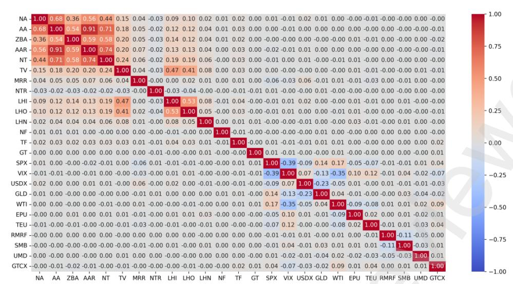

**Figure 1.** The correlation heat map of cryptocurrency factors.

### 2.2 Methodology

Throughout our analysis, we utilize a general additive prediction error model to describe the relation between a cryptocurrency's return and its corresponding predictors,

$$r_{i,t+1} = \mathbb{E}_t[r_{i,t+1}] + \epsilon_{i,t+1}. \quad (1)$$

Furthermore, we assume the conditional expectation of cryptocurrency ��'s return, ����,��+1, given the information available at period ��, is a constant function of a specified set of predictors:

$$\mathbb{E}[r_{i,t+1}] = g(z_{i,t}), \quad (2)$$

where ����,�� is a ��-dimensional vector of predictors, cryptocurrencies are indexed by �� = 1,2,…,��, weeks are indexed by �� = 1,...,��. The functional form of ��(·) is left unspecified. We aim to search for the prediction model that gives the best prediction performance from a set of candidates.

Our analysis incorporates 12 machine learning methodologies alongside 2 linear models. Specifically, we employ the ordinary least squares (OLS) regression, OLS using only market, size, and momentum (OLS-3), partial least squares (PLS), least absolute shrinkage and selection operator (LASSO), ridge (Ridge), elastic net (ENet), random forest (RF), gradient boosted regression trees (GBRT), K-nearest neighbor (KNN), and neural networks with one to five layers (NN1-NN5).

We follow the standard method in the literature for hyperparameter selection, model estimation, and performance evaluation. Specifically, we divide our data into three disjoint periods while maintaining chronological order: the training sample (2014-2017), the validation sample (2018- 2020), and the testing sample (2021-2023). In the training sample, we estimate the model parameters subject to the prespecified hyperparameters for a given machine learning model. Subsequently, we utilize the validation sample to tune the hyperparameters of the machine learning models. The objective is to select the hyperparameters that minimize the loss function based on the observations in this sample. The testing sample serves the purpose of evaluating the predictive performance of the machine learning model. Notably, these data have not been used in either the model estimation or tuning, ensuring an unbiased assessment of the models' predictabilities. We standardize the inputs across the training, validation, and testing samples to facilitate comparability and robustness using the Z-score. Preprint not peer reviewed

## **3. Empirical analysis**

We commence our analysis by examining the prediction performance of all models through the out-of-sample  $R^2$  and delve into predictability across different subsamples.

### 3.1 Out-of-sample predictability

To assess predictive performance for individual cryptocurrency return forecasts, we calculate the out-of-sample  $R^2$  as

$$R_{oos}^2 = 1 - \frac{\sum_{(i,t) \in \mathcal{T}_3} (r_{i,t} - \hat{r}_{i,t})^2}{\sum_{(i,t) \in \mathcal{T}_3} r_{i,t}^2}, \quad (3)$$

where  $\mathcal{T}_3$  indicates that fits are only assessed on the testing sample, whose data never enter model estimation or tuning;  $\hat{r}_{i,t}$  is predicted weekly return. The results for different models and subsamples are summarized in Table 3.

#### 3.1.1 Full sample analysis

When we include all cryptocurrencies, a majority of machine learning models exhibit excellent predictive capabilities. Notably, tree models, particularly RF, outperform other machine learning models. OLS achieves an  $R_{oos}^2$  of 3.901%, suggesting that even a simple linear model retains certain predictability. It is noteworthy that the  $R_{oos}^2$  of OLS-3 is significantly lower than that of OLS (0.044% vs. 3.901%), indicating that relying only on market, size, and momentum factors is insufficient to account for the entire predictive power in the linear model.

The regularized models do not demonstrate an improvement in their  $R_{oos}^2$  compared to the linear models, suggesting that the factors used are all important and do not need dimension reduction. In the regularized models, both PLS and Ridge share an identical  $R_{oos}^2$  (3.901%), mirroring that of OLS. However, both LASSO and ENet show no predictive power, recording zero  $R_{oos}^2$  values.3

The tree models, RF and GBRT, exhibit formidable predictive capabilities that elevate the  $R_{oos}^2$  to surpass 20%. Notably, RF slightly outperforms GBRT, boasting a higher  $R_{oos}^2$  (25.265 v.s. 24.911). Such improvement demonstrates the superiority of machine learning in capturing intricate interactions among predictors in the cryptocurrency market. This advantage aligns with similar findings for stock markets, as highlighted in both Gu et al. (2020) and Leippold et al. (2022).

Although the neural network models also raise their  $R_{oos}^2$  to exceed 15%, they are inferior to the tree models. Among the five neural network models, NN4 demonstrates the highest  $R_{oos}^2$  at 18.704%, suggesting that the model with four hidden layers has the best predictive performance. Note that increasing the number of hidden layers in neural networks tends to increase the  $R_{oos}^2$ . However, this improvement is limited to models with three and five hidden layers, indicating that the benefits of deep learning do not extend to NN3 and NN5. Furthermore, the predictabilities of neural network models exhibit notable stability, with their  $R_{oos}^2$  consistently ranging from 15% to 19%. KNN performs less effectively than tree and neural network models but exceeds the regularized and linear models. The  $R_{oos}^2$  of KNN is 15.831%, slightly lower than NN1 (15.837 %).

In addition to the out-of-sample  $R^2$ , we also employ the test of Diebold and Mariano (1995) to conduct comparisons of methods, evaluating the differences in out-of-sample predictive accuracy between two models. The results of the Diebold-Mariano test are presented in Table 4. Our findings

---

3 Indeed, the  $R_{oos}^2$  values for both LASSO and ENet are nearly zero, i.e.  $-0.0000032733$ .

**Table 3** 2

| 2 sample �� Table 3 | Weekly out-of-sample predictive �� All | 2 in percentage. Mega-cap | 2 �� Large-cap | , indicating that utilizing the out-of Mid-cap |
|---------------------|----------------------------------------|---------------------------|----------------|-------------------------------------------------|
| OLS                 | 3.901                                  | 17.884                    | 8.089          | 3.977                                           |
| OLS-3               | 0.044                                  | 14.035                    | 0.625          | ― 0.145                                         |
| PLS                 | 3.901                                  | 17.884                    | 8.089          | 3.977                                           |
| LASSO               | 0.000                                  | ― 0.308                   | 0.000          | ― 0.017                                         |
| Ridge               | 3.901                                  | 17.887                    | 8.100          | 3.977                                           |
| ENet                | 0.000                                  | ― 0.308                   | 0.000          | ― 0.017                                         |
| RF                  | 25.265                                 | 42.762                    | 27.372         | 18.277                                          |
| GBRT                | 24.911                                 | 41.146                    | 21.476         | 13.624                                          |
| KNN                 | 15.831                                 | 21.762                    | 17.467         | 13.726                                          |
| NN1                 | 15.837                                 | 32.488                    | 18.593         | 13.170                                          |
| NN2                 | 17.435                                 | 31.495                    | 18.352         | 15.326                                          |
| NN3                 | 15.877                                 | 32.032                    | 13.706         | 13.544                                          |
| NN4                 | 18.704                                 | 36.090                    | 13.503         | 12.053                                          |
| NN5                 | 18.478                                 | 31.527                    | 19.265         | 14.855                                          |

Notes: This table reports weekly out-of-sample predictive �� 2 of all models. The models considered include the ordinary least squares (OLS), OLS using only market, size, and momentum (OLS-3), partial least squares regression (PLS), least absolute shrinkage and selection operator (LASSO), ridge (Ridge), elastic network (ENet), random forest (RF), gradient boosted regression tree (GBRT), K-nearest neighbor (KNN), and neural networks with 1 to 5 layers (NN1-NN5). All the numbers are expressed as a percentage.

### 3.1.2 Mega-cap cryptocurrencies

To explore potential heterogeneity in the model predictability, we conduct subgroup analysis on mega-cap (cryptocurrencies with market capitalizations above \$1,000,000,000 each week), largecap (cryptocurrencies with market capitalizations between \$100,000,000 and \$1,000,000,000 each week), and mid-cap (cryptocurrencies with market capitalizations between \$10,000,000 and \$100,000,000 each week).

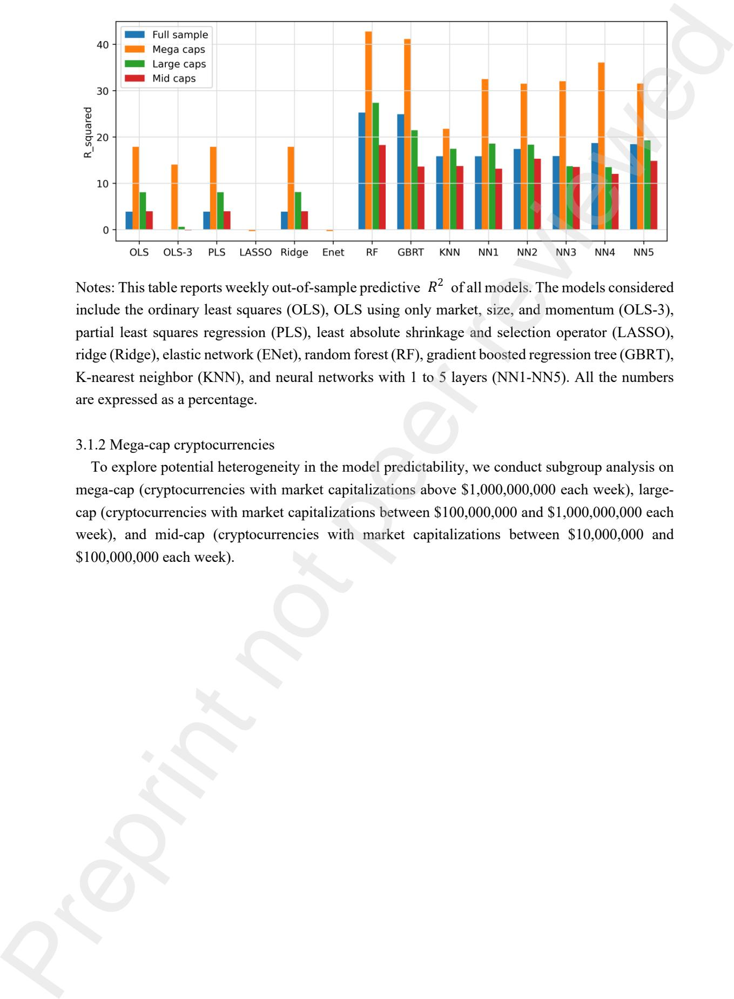

**Table 4**

| Table 4 OLS-3 PLS LASSO OLS |   | Ridge ENet RF GBRT KNN NN1 NN2 NN3 NN4 NN5                                          |
|-----------------------------|---|-------------------------------------------------------------------------------------|
| 0.677 0 .000                |   |                                                                                     |
| 0.684                       | 0 | .000                                                                                |
|                             |   | 0.684 3 .748 * 3 .686 * 2 .093 * 2 .094 * 2 .374 * 2 .101 * 2 .597 * 2 .557 *       |
| OLS-3 0 .677                |   |                                                                                     |
| 0.008                       | 0 | .677                                                                                |
| PLS                         |   | 0.008 4 .425 * 4 .363 * 2 .770 * 2 .771 * 3 .051 * 2 .778 * 3 .274 * 3 .234 *       |
| 0.684                       | 0 | .000                                                                                |
|                             |   | 0.684 3 .748 * 3 .686 *                                                             |
|                             |   | 2 .093 * 2 .094 * 2 .374 * 2 .101 * 2 .597 * 2 .557 *                               |
| LASSO Ridge                 | 0 | .684 0 .000 4 .432 * 4 .370 * 2 .777 * 2 .778 * 3 .059 * 2 .785 * 3 .281 * 3 .242 * |
|                             |   | 0.684 3 .748 * 3 .686 * 2 .093 * 2 .094 * 2 .374 * 2 .101 * 2 .597 * 3 .234 *       |
| ENet RF GBRT                |   | 4 .432 * 4 .370 * 2 .777 * 2 .778 * 3 .059 * 2 .778 * 3 .281 * 3 .242 *             |
| KNN                         |   | 0 .001 0 .281 0 .008 0 .504 0 .464                                                  |
| NN1 NN2                     |   | 0 .280 0 .007 0 .503 0 .463                                                         |
|                             |   | 0.273 0 .223 0 .183                                                                 |
| NN3 NN4                     |   | 0 .496 0.456                                                                        |

The third column of Table 3 summarizes the  $R_{oos}^2$  for mega-cap cryptocurrencies. The results suggest that all models have a much better predictive performance compared to the full sample. Linear models nearly double their performance, with OLS achieving a larger  $R_{oos}^2$  than OLS-3 (17.884% vs. 14.035%). This means that the inclusion of only three factors (market, size, and momentum) remains insufficient to explain all predictive power. Regularized models, including PLS and Ridge, experience an increase in  $R_{oos}^2$  (17.884% vs. 17.887%) to surpass 15%. It is worth noting that the  $R_{oos}^2$  of Ridge is slightly larger than that of OLS, indicating redundancy in certain factors for predicting weekly returns of mega-cap cryptocurrencies.

Tree and neural network models maintain their most dominance among machine learning models, yielding  $R_{oos}^2$  to above 40% and 30%, respectively. Notably, RF remains an advantage over GBRT and NN1-NN5, boasting the highest  $R_{oos}^2$  of 42.762%. GBRT follows closely with an  $R_{oos}^2$  of 41.146%. In neural network models, NN4 continues to exhibit exceptional predictive performance, recording the largest  $R_{oos}^2$  (36.090%). The improvement in  $R_{oos}^2$  is limited to the first four hidden layers. In addition, the predictive performance of neural network models is still stable, with  $R_{oos}^2$  ranging from 31% to 37%.

The  $R_{oos}^2$  of KNN stands at 21.762%, higher than linear and regularized models but significantly lower than tree and neural network models. Furthermore, it is observed that KNN's  $R_{oos}^2$  is much higher than that in the full sample. Finally, the Diebold-Mariano tests for mega-cap cryptocurrencies are presented in the Appendix. The corresponding results align with those obtained from the out-of-sample  $R^2$ .

### 3.1.3 Large-cap cryptocurrencies

The  $R_{oos}^2$  for large-cap cryptocurrencies is presented in the fourth column of Table 3, indicating that most models have a better predictive performance compared to the full sample. However, their predictabilities are markedly inferior to those for mega-cap cryptocurrencies. The  $R_{oos}^2$  of OLS is 8.089%, which is twice that of the full sample but less than half of mega-cap cryptocurrencies. Surprisingly, the  $R_{oos}^2$  of OLS-3 experiences a substantial drop to 0.625%, still larger than the full sample. In regularized models, the  $R_{oos}^2$  of Ridge is slightly larger than that of PLS (8.100% vs. 8.089%), with both  $R_{oos}^2$  being twice that of the full sample but less than half of mega-cap cryptocurrencies.

Tree and neural network models are still excellent machine learning models, but their performance has dropped significantly compared to mega-cap cryptocurrencies. In tree models, the  $R_{oos}^2$  of RF consistently exceeds that of GBRT (27.372% vs. 21.476%), indicating the superiority of RF. The expanding advantage of RF over GBRT suggests an increasing disparity in their predictabilities. In neural network models, NN5 attains the largest  $R_{oos}^2$  of 19.265%, while NN4 records the smallest. This means that increasing hidden layers does not increase the  $R_{oos}^2$ . The  $R_{oos}^2$  of neural network models ranges from 13 to 20%, suggesting that the difference in their predictabilities increase slightly.

It is noteworthy that the predictability of KNN surpasses that of NN3 and NN4 for the first time. The  $R_{oos}^2$  of KNN stands at 17.467%, slightly smaller than NN1 and NN2. Finally, the Diebold-Mariano tests for large-cap cryptocurrencies are provided in the Appendix. The corresponding results align with those obtained from the out-of-sample  $R^2$ .

The last column of Table 3 shows the �� 2 ������ for mid-cap cryptocurrencies. The predictive performance of all models continues to decline. The �� 2 ������ of OLS (3.977%) is marginally larger than that of the full sample but only half of large-cap cryptocurrencies and one-fifth of mega-cap cryptocurrencies. Notably, the �� 2 ������ ( ―0.145%) of OLS-3 turns to negative for the first time, indicating that OLS using only three factors has no predictive power for mid-cap cryptocurrencies. In regularized models, PLS and Ridge maintain the same �� 2 ������ (3.977%), slightly larger than that of the full sample. The �� 2 ������ of LASSO and ENet ( ―0.017%) is slightly lower than that of the full sample.

Surprisingly, the predictive performance of tree and neural network models demonstrates a significant drop, even lower than that of the full sample. The �� 2 ������ of RF (18.277%) continues to exceed that of GBRT (13.624%), with a smaller gap between them. Among neural network models, NN2 has the largest �� 2 ������ (15.326%), while NN4 has the smallest (12.053%). This implies that increasing hidden layers in neural networks does not enhance the �� 2 ������ of the model. Compared to mega-cap and large-cap cryptocurrencies, the difference in the predictabilities of neural network models becomes smaller, with �� 2 ������ ranging from 12% to 16%.

Achieving �� 2 ������ of 13.726%, the predictive performance of KNN outperforms GBRT, NN1, NN3, and NN4. The predictability of KNN experiences a notable decrease compared to mega-cap and large-cap cryptocurrencies. Notably, the �� 2 ������ of KNN is smaller than that of the full sample. The Diebold-Mariano tests for mid-cap cryptocurrencies are summarized in the Appendix. The findings are consistent with those obtained from the out-of-sample �� 2 .

### 3.2 Cryptocurrency market vs. stock markets

We conduct a comparative analysis of the disparities in predictabilities of machine learning and linear models across the cryptocurrency and stock markets. To establish benchmarks for our evaluation, we leverage the findings of Gu et al. (2020) and Leippold et al. (2022) regarding the predictabilities of these models in the U.S. and Chinese stock markets, respectively.

When predicting return for the full sample of the U.S. and Chinese stock markets, OLS achieves �� 2 ������ of ―3.46% and 0.81%, respectively. Notably, this value rises to 3.90% for the full sample of the cryptocurrency market. This suggests that OLS exhibits significantly superior predictive power within the cryptocurrency market compared to both stock markets, indicating a higher level of inefficiency within the former. In the cryptocurrency market and the U.S. and Chinese stock markets, the �� 2 ������ for PLS (ENet) are 3.90% (0.00%), 0.27% (0.11%), and 1.28% (1.42%), respectively. This underscores the significantly superior predictability of PLS within the cryptocurrency market. Conversely, ENet demonstrates no predictive power in the cryptocurrency market and weak (certain) predictive power in the U.S. (Chinese) stock market. Preprint not peer reviewed

The �� 2 ������ for RF and GBRT in the cryptocurrency market are 25.27% and 24.91%, respectively. In the U.S. (Chinese) stock market, the corresponding values are 0.33% (2.44%) for RF and 0.34% (2.71%) for GBRT. In the cryptocurrency market, NN4 emerges as the optimal neural network model, achieving an �� 2 ������ of 18.70%. However, for the U.S. (Chinese) stock market, NN3 (NN5) stands out as the optimal neural network model, with an �� 2 ������ of 0.40% (2.58%). Thus, in the cryptocurrency (stock) market, tree (neural network) models demonstrate superior predictive power compared to neural network (tree) models, suggesting a divergence in model efficacy across asset classes. Tree-based models appear to excel in predicting cryptocurrency returns, while neural networks demonstrate superior performance in stock market prediction.

When predicting mega-cap cryptocurrencies, RF and GBRT achieve �� 2 ������ of 42.76% and 41.15%, respectively. This contrasts with their performance for U.S. large-cap stocks, where the �� 2 ������ fall to 0.63% (RF) and 0.52% (GBRT), and Chinese large-cap stocks, where both models exhibit negative �� 2 ������ ( ―0.04% and ―0.38%), indicating no predictive power. These findings suggest that tree models demonstrate powerful and robust predictabilities for mega-cap cryptocurrencies, whereas their efficacies in predicting large-cap stocks are considerably weaker. The optimal neural network model for mega-cap cryptocurrencies, NN4, also demonstrates strong performance, achieving an �� 2 ������ of 36.09%. However, the optimal neural network models for U.S. and Chinese large-cap stocks, NN3, yield significantly lower �� 2 ������ (0.70% and 0.74%, respectively), indicating their limited predictive power in stock markets. This pattern reinforces the observations made with tree models, suggesting that neural networks also excel in predicting megacap cryptocurrencies but struggle with large-cap stocks. Further analysis for large-cap cryptocurrencies reveals similar trends. RF and GBRT attain �� 2 ������ of 27.37% and 21.48%, respectively. For the optimal neural network model, NN5, the �� 2 ������ is 19.27%. These findings suggest that both tree and neural network models exhibit strong predictive performance for largecap cryptocurrencies compared to large-cap stocks. Preprint not peer reviewed

In summary, our analysis reveals a substantial divergence in the predictabilities of machine learning and linear models across asset classes and capitalization segments. While demonstrating excellent predictive performance for cryptocurrencies, both tree-based models and neural networks show significantly weaker predictability for stocks in both the U.S. and Chinese markets.

# 3.3 Factor importance

We employ the SHAP method to investigate the importance of cryptocurrency factors in the full sample.4 Given the superior predictive performance of tree and neural network models, our emphasis is directed toward these particular model types. Furthermore, we conduct an analysis of the resemblances and variations in the factor importance across distinct tree or neural network models. The results of factor importance for mega-cap, large-cap, and mid-cap cryptocurrencies are provided in the Appendix. Figure 2 shows the importance of factors in tree and neural network models. Overall, the change rates of market value to realized value ratio (MRR), new addresses (NA), and active addresses (AA) are the three most influential factors for predicting weekly returns in the cryptocurrency market.

For tree models, MRR stands out as the most important factor, with a significantly higher level of importance compared to other factors. Following is NA, whose importance is approximately onethird and half that of MRR for RF and GBRT, respectively. Moreover, the change rates of up minus down (UMD), Google Trends cryptocurrency index (GTCX), crude oil price (WTI), US dollar index (USDX), market return (RMRF), and active addresses ratio (AAR) exhibit lower degrees of importance. In RF, AA holds slightly larger importance than UMD, while GTCX is a little higher than WTI. Meanwhile, USDX, RMRF, and AAR demonstrate nearly equivalent levels of importance. In GBRT, WTI surpasses UMD in importance, while USDX and transactions volume (TV) exhibit comparable importance.

4 SHAP is a game theoretic approach to explain the output of any machine learning model. The details of the SHAP method are provided in the Appendix.

**Figure 2.** The importance of cryptocurrency factors in each tree and neural network model. Notes: The horizontal axis denotes the average absolute value of the SHAP values, serving as a metric for factor importance. The larger the value, the more important the factor. The vertical axis represents the factors' names, arranged in descending order based on their importance levels.

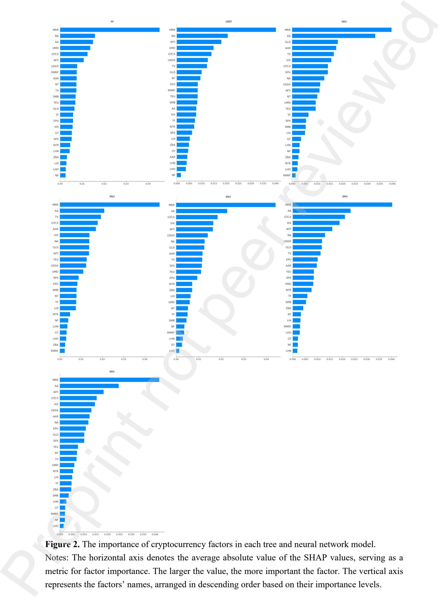

MRR is also the most important factor in neural network models, and its importance is markedly higher than others, except for NN1. In contrast to tree models, neural network models exhibit a pronounced preference for AA, especially for NN1. Notably, the importance of NA is significantly decreased in neural network models. Given the superior performance of NN4 compared to other neural network models, we mainly focus on discussing the importance of factors in this model. In NN4, AA takes precedence as the second crucial factor, with its importance being nearly half of that assigned to MRR. Some factors, such as the change rates of GTCX, volatility index (VIX), WTI, USDX, NA, and gold price (GLD), also obtain considerable priority in NN4. Furthermore, VIX and WTI have comparable importance, while GTCX shows lower importance to AA.

To provide a comprehensive overview, Figure 3 shows the overall importance of all factors in both tree and neural network models based on the full sample.

**Figure 3.** The overall importance of cryptocurrency factors for tree and neural network models.

Notes: This figure illustrates the ranking of all factors based on their overall contribution to the model. Factors on the vertical axis are ordered based on the average absolute value of the SHAP values, with the most influential characteristics on the top and the least influential on the bottom. Columns correspond to the individual models, and the color gradients within each column indicate the most influential (dark blue) to the least influential (white) factors.

### 3.4 Factor effects on model output

We also apply the SHAP method to understand the decision-making processes of tree and neural network models in the full sample. This methodology enables the examination of the impact of cryptocurrency factors on model output, as illustrated in Figure 4. The corresponding results for mega-cap, large-cap, and mid-cap cryptocurrencies are provided in the Appendix.

As the three most important factors, MRR, NA, and AA positively influence the output of all models. The magnitudes of their values correlate positively with SHAP values, consequently increasing the predicted returns. Interestingly, the effect of MRR and NA are notably more significant than other factors in tree models, while the impact of AA slightly exceeds MRR in neural network models.

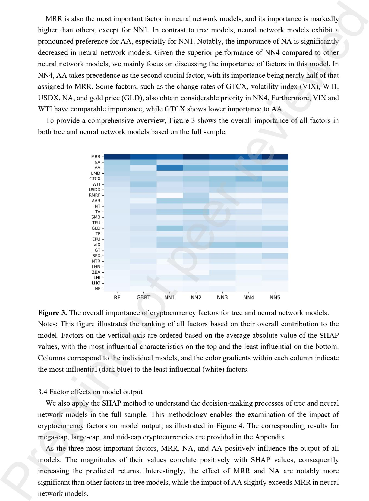

In the case of tree models, WTI, USDX, and TV also positively contribute to the output, whereas GLD and total flow (TF) have a negative impact. The impacts of NA and AA are almost identical in RF, and those of NA and TV are nearly the same in GBRT. Notably, the influence of AA in RF is slightly greater than that in GBRT, while the impact of NA in GBRT is more substantial than that in RF. Furthermore, the adverse effect of TF in GBRT is also more significant than that in RF.

In the context of NN4, factors such as USDX and UMD also have a positive influence on model output, although their impact is notably smaller compared to MRR and AA. However, VIX, network value to transaction ratio (NTR), and TF negatively contribute to model output, with VIX exhibiting a significantly larger influence. It is noteworthy that the impacts of GTCX, WTI, NA, GLD, and TV on the output are unclear.

Figure 5 visualizes the contribution of cryptocurrency factors to model prediction, utilizing RF, GBRT, and NN4 as representative examples. These instances offer valuable insights into how each factor drives the forecast toward its final value.

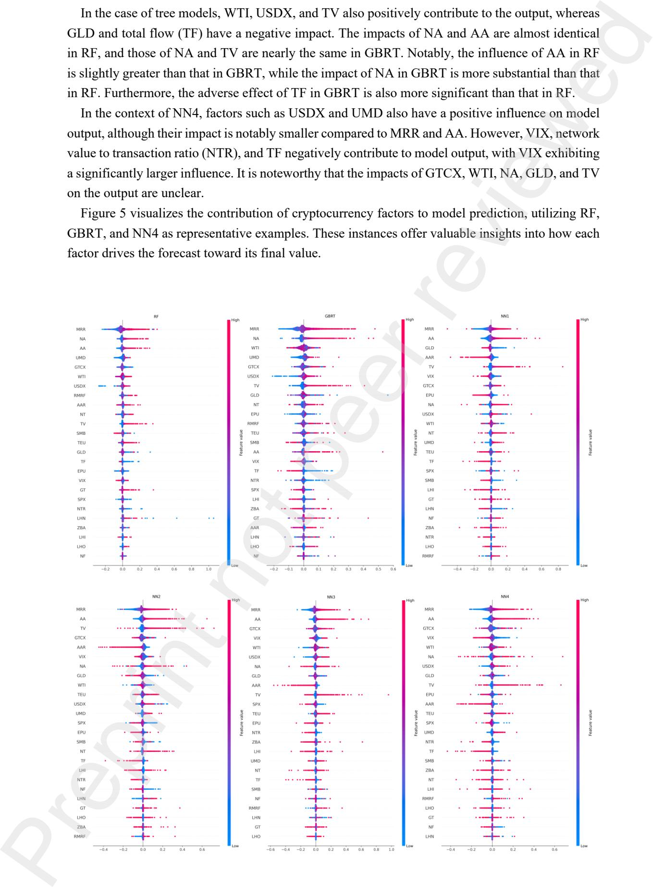

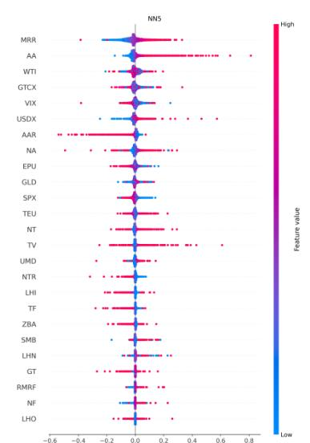

**Figure 4.** The impact of cryptocurrency factors on tree and neural network models.

Notes: The horizontal axis signifies the SHAP value, reflecting the impact of factors on the model output. A larger SHAP value denotes a more substantial influence on the model output. The vertical axis represents the factors' names, arranged in descending order based on their relative importance. Additionally, the color gradient indicates the factor values; a redder hue corresponds to a higher factor value, while a bluer shade indicates a lower factor value.

**Figure 5.** Examples of cryptocurrency factors' contribution to machine learning models.

Notes: The horizontal axis denotes the factor, while the vertical axis represents the cumulative impact of the factor originating from the base value (the average prediction of the model). Arrows are employed to signify the contribution of individual factors, with arrow length and color indicating the magnitude and direction of the factor's influence, respectively. A red hue denotes a positive impact, pushing forecasts higher, whereas blue signifies a negative impact, driving forecasts lower. Black bold indicates the final predicted value for a specific case.

### **4. Portfolio analysis**

So far, our evaluation of predictive performance has been grounded in statistical comparisons, utilizing the out-of-sample predictive �� 2 and Diebold-Mariano test. Next, we analyze whether this predictability can be implemented at portfolio level by assessing the out-of-sample performance of

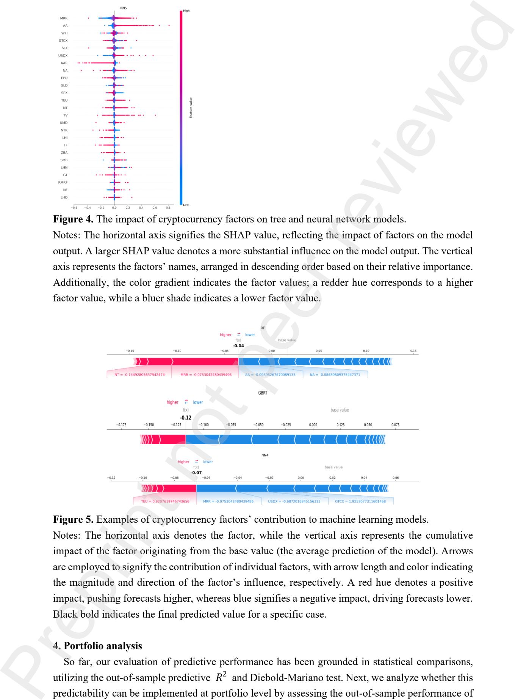

value-weighted portfolios and tracking the evolution of their cumulative returns over time.5 While we also consider equal-weighted portfolios, it is noteworthy that they exhibit inferior performance compared to the value-weighted portfolios. Thus, the detailed results of the equal-weighted portfolios are presented in the Appendix. The benefit of investigating predictability at the portfolio level lies in the ability to evaluate the economic impact of each method through its contribution to risk-adjusted portfolio return performance.

We consider two types of portfolios. The first type is long-short portfolios, which are constructed by following the schemes of Gu et al. (2020) who evaluate machine learning portfolios in the U.S. stock market.6 Specifically, we employ each method at the end of each week to predict the out-ofsample returns of cryptocurrencies for the next week. The cryptocurrencies are then divided into deciles based on the predicted returns, and both value-weighted and equal-weighted portfolios are constructed. Thus, a zero-net-investment portfolio is built by buying the cryptocurrencies with the highest expected returns (decile 10) and selling those with the lowest (decile 1). It is noteworthy that implementing long-short portfolios is difficult in the current cryptocurrency market due to the absence of a short-selling mechanism, although they are a useful tool for assessing the portfoliolevel performance of machine learning methods. Hence, we also consider long-only portfolios, which only buy the cryptocurrencies in the top decile.

Table 5 reports the out-of-sample performance for value-weighted long-short and long-only portfolios, suggesting that machine learning portfolios dominate linear ones. Overall, machine learning techniques, especially PLS and NNs, are beneficial for portfolio-level predictions. In longshort portfolios, linear portfolios exhibit inferior performance compared to their machine-learning counterparts. The OLS-3 portfolio stands out with the smallest mean and the largest maximum drawdown, indicating that OLS utilizing only three factors is unfavorable for predicting portfolio returns. The NN5-based portfolio records the largest mean, followed by the NN4-based portfolio. Thus, the deep neural network portfolio is the most proficient when evaluating investment returns. Notably, the Sharpe ratios of neural network portfolios are not the highest, whereas the PLS-based portfolio surprisingly achieves the largest Sharpe ratio and the smallest standard deviation. Furthermore, the NN1-based portfolio exhibits the smallest maximum drawdown, trailed by the RFbased portfolio. Preprint not peer reviewed

In the context of long-only portfolios, the neural network portfolio demonstrates the best return and investment efficiency. Specifically, portfolios based on NN4 and NN3 reach the largest mean and Sharpe ratio, respectively. NN5-based portfolio secures the second-largest mean. In addition, the RF-based portfolio exhibits the second largest Sharpe ratio, while the GBRT-based portfolio attains the smallest maximum drawdown. The PLS-based portfolio maintains its low variation by having the smallest standard deviation.

5 We construct the value-weighted portfolios by weighting the market capitalizations of the cryptocurrencies in each portfolio.

6 Leippold et al. (2022) also adopt the methodologies outlined by Gu et al. (2020) to construct machine learning portfolios in the Chinese stock market.

**Table 5**

| Table 5 Long-short | Mean                                        | Std                                                                 | Sharpe | Skewness                                             | Kurtosis | MaxDD                         |
|--------------------|---------------------------------------------|---------------------------------------------------------------------|--------|------------------------------------------------------|----------|-------------------------------|
| OLS                | 11.375                                      | 17.528                                                              | 63.698 | 0.506                                                | ― 0.572  | 90.064                        |
| OLS-3              | 6.829                                       | 19.395                                                              | 34.012 | ― 0.193                                              | 2.571    | 97.327                        |
| PLS                | 14.393                                      | 17.372                                                              | 81.258 | 0.428                                                | ― 0.570  | 88.985                        |
| LASSO              | 13.132                                      | 21.737                                                              | 59.314 | 4.152                                                | 25.542   | 89.378                        |
| ENet               | 13.616                                      | 21.298                                                              | 62.139 | 4.173                                                | 25.801   | 89.463                        |
| Ridge              | 19.847                                      | 25.449                                                              | 59.821 | 1.451                                                | 2.875    | 89.763                        |
| RF                 | 26.369                                      | 34.395                                                              | 75.566 | 1.733                                                | 3.430    | 88.552                        |
| GBRT               | 28.531                                      | 36.297                                                              | 77.406 | 1.722                                                | 3.270    | 88.636                        |
| KNN                | 20.972                                      | 29.398                                                              | 70.853 | 1.654                                                | 3.806    | 89.642                        |
| NN1                | 24.528                                      | 34.426                                                              | 70.842 | 1.820                                                | 3.627    | 87.879                        |
| NN2                | 24.394                                      | 36.755                                                              | 65.486 | 2.640                                                | 10.113   | 89.546                        |
| NN3                | 26.781                                      | 38.573                                                              | 68.924 | 2.293                                                | 6.458    | 89.243                        |
| NN4                | 28.249                                      | 42.124                                                              | 66.450 | 2.328                                                | 7.225    | 89.431                        |
| NN5 Long-only      | 29.883                                      | 43.362                                                              | 67.519 | 2.314                                                | 6.623    | 89.352                        |
| OLS                | 9.372                                       | 16.472                                                              | 55.897 | 0.251                                                | 3.489    | 87.357                        |
| OLS-3              | 5.484                                       | 28.356                                                              | 18.340 | 1.298                                                | 8.416    | 95.435                        |
| PLS                | 11.241                                      | 16.247                                                              | 68.188 | 0.922                                                | 2.696    | 89.472                        |
| LASSO              | 10.365                                      | 20.343                                                              | 49.951 | 0.197                                                | 6.334    | 98.455                        |
| ENet               | 10.385                                      | 20.462                                                              | 49.753 | 0.545                                                | 6.313    | 95.378                        |
| Ridge              | 14.836                                      | 21.473                                                              | 68.235 | ― 0.190                                              | 5.604    | 90.425                        |
| RF                 | 22.242                                      | 31.352                                                              | 69.043 | 1.607                                                | 3.676    | 82.782                        |
| GBRT               | 24.081                                      | 34.546                                                              | 68.782 | 2.419                                                | 7.405    | 79.386                        |
| KNN                | 17.384                                      | 25.463                                                              | 67.272 | 0.355                                                | 4.040    | 90.535                        |
| NN1                | 21.537                                      | 35.354                                                              | 59.918 | 1.844                                                | 3.937    | 84.536                        |
| NN2                | 22.524                                      | 31.978                                                              | 65.890 | 1.237                                                | 4.064    | 86.643                        |
| NN3                | 23.390                                      | 33.275                                                              | 69.989 | 0.828                                                | 2.253    | 89.264                        |
| NN4                | 25.138                                      | 38.472                                                              | 64.341 | 1.663                                                | 3.070    | 85.543                        |
| NN5                | 24.347                                      | 38.573                                                              | 61.045 | 1.540                                                | 2.643    | 86.744                        |
|                    |                                             | March 2023. “Mean” represents the average predicted weekly return ( |        | %                                                    |          | ). “Std” denotes the standard |
|                    | deviation of the predicted weekly returns ( |                                                                     | %      | ). “Sharpe” represents the annualized Sharpe ratio ( |          | % ).                          |
|                    | “MaxDD” denotes the maximum drawdown (      |                                                                     | %      | ) of the portfolio.                                  |          |                               |

performance among neural network portfolios for each respective strategy. The dynamics of cumulative returns for long-short and long-only portfolios based on NN1-NN5 will be discussed later.

The cumulative return performance shows that long-short portfolios can be divided into 4 tiers. The first tier contains portfolios based on NN5, GBRT, and RF, demonstrating significantly higher cumulative returns than other portfolios. Within this tier, the NN5-based portfolio achieves the largest cumulative return, followed by the GBRT-based portfolio. The second tier comprises portfolios based on KNN and Ridge, with the former's cumulative return notably exceeding the latter's. Notably, there is a substantial gap between the first and second tiers. Portfolios based on PLS, OLS, LASSO, and ENet are composed of the third tier, with a certain gap between the second and third tiers. Among these portfolios, the PLS-based portfolio attains the largest cumulative return, trailed by the OLS-based portfolio. The cumulative returns of portfolios based on LASSO and ENet are nearly the same. Finally, the OLS-3 portfolio forms the fourth tier and exhibits the smallest cumulative return. The gap between the last two tiers has increased markedly since the third quarter of 2021. Preprint not peer reviewed

On the other hand, long-only portfolios can be classified into 5 tiers. The first tier includes portfolios based on NN4, GBRT, and RF, whose cumulative returns are notably larger than those of other portfolios. Notably, the NN4-based portfolio attains the largest cumulative return, followed by the GBRT-based portfolio. In addition, the RF-based portfolio is comparable to the GBRT-based portfolio. The KNN-based portfolio forms the second tier, exhibiting an obvious gap from the first tier, especially after the fourth quarter of 2021. The third tier comprises portfolios based on Ridge and OLS, with the former having higher cumulative returns. A substantial gap emerges between the second and third tiers, particularly pronounced after November 2021. The PLS-based portfolio builds the fourth tier, maintaining a distinct separation from the OLS-based portfolio. Finally, portfolios based on LASSO, ENet, and OLS-3 are the fifth tier, sharing the lowest cumulative returns with minimal variations among them.

It is noteworthy that regardless of long-short or long-only, machine learning portfolios exhibited robust performance during the cryptocurrency market crash spanning from November 2021 to June 2022. Interestingly, the shock caused by the market crash did not lead to a universal decline across all portfolios. Machine learning portfolios, especially those based on neural networks and trees, demonstrated exceptional resilience during this period. Their cumulative returns experienced a substantial upswing, contrasting the prevailing market trend. This resilience underscores the potential advantages and effectiveness of both neural network and tree models in adapting to and thriving in volatile market scenarios.

**Figure 6.** Cumulative returns of value-weighted portfolios based on the full sample.

Figure 7 illustrates the dynamics of cumulative returns for five neural network portfolios. Longshort neural network portfolios can be split into 3 tiers. Portfolios based on NN4 and NN5 compose the first tier, boasting significantly higher cumulative returns. However, the former exhibits a marginally higher cumulative return. The second tier includes portfolios based on NN1 and NN3, demonstrating comparable cumulative returns. The NN1-based portfolio shows a slightly higher cumulative return. The NN2-based portfolio forms the third tier, with the smallest cumulative return. Notably, significant gaps separate each tier. On the other hand, short-only neural network portfolios also exhibit a three-tier classification. The first tier contains only the NN4-based portfolio, while the second maintains portfolios based on NN1 and NN3. It is noteworthy that the NN5-based portfolio experiences a significant decline, placing it in the third tier alongside the NN2-based portfolio. The former shows a slightly higher cumulative return within this tier. During the market crash, neural network portfolios performed well, with their cumulative returns rising against the trend. Long-short portfolios displayed a steady upward trajectory, while long-only portfolios experienced small fluctuations. The cumulative returns of neural network portfolios have demonstrated a slow increase since August 2022.

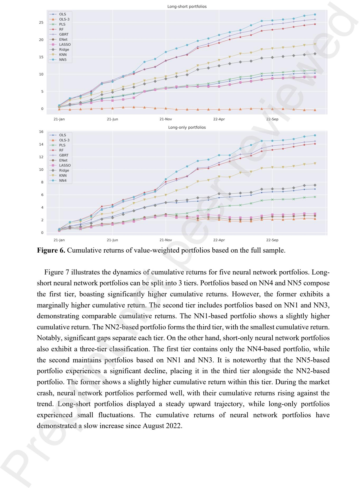

**Figure 7.** Cumulative returns of neural network portfolios (value-weighted) based on the full sample.

# **5. Conclusion**

In this study, we construct a comprehensive set comprising 8 macroeconomic and 17 characteristic factors to predict cryptocurrency returns. Leveraging this extensive set of factors, we systematically explore the predictive power of 12 distinct machine learning methods in conjunction with 2 linear methods in the cryptocurrency market. Furthermore, we also examine which factors matter the most in specific models and assess how factors influence the output of the models. Finally, we investigate the predictive performance of long-short and long-only portfolios constructed by these diverse methodologies. Our study allows for an exhaustive evaluation of the predictabilities and practical implications of machine learning techniques within the cryptocurrency domain.

We find that both tree and neural network models exhibit exceptional predictabilities, with the random forest model demonstrating the best predictive performance. Notably, most models achieve their best predictive performance when applied to mega-cap cryptocurrencies, whereas the worst when applied to mid-cap ones. Surprisingly, all models show a slightly superior performance on the full sample compared to their performance on mid-cap cryptocurrencies. Our findings also show that the change rates of market value to realized value ratio, new addresses, and active addresses are the most important factors for tree and neural network models. By exploring the decision-making processes of black-box models, these factors demonstrate a significantly positive impact on model outputs. This examination not only underscores the importance of specific factors but also sheds light on the nuanced mechanism influencing the predictabilities of machine learning models in the cryptocurrency market.

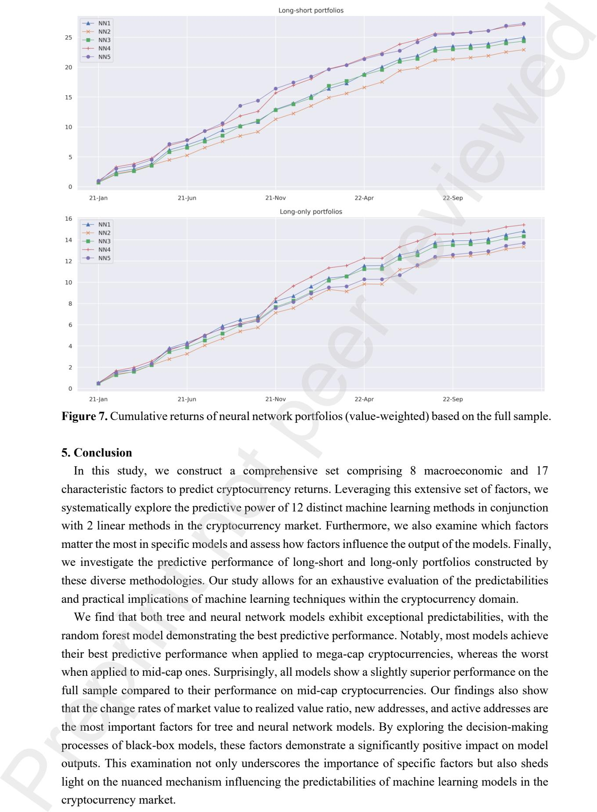

Our portfolio analysis reveals a clear dominance of long-short and long-only machine learning portfolios over their linear counterparts. When considering the out-of-sample performance metrics, portfolios based on PLS and NNs are superior to other machine learning portfolios. Moreover, the long-short and long-only portfolios based on NN4, NN5, RF, and GBRT demonstrate significantly higher cumulative returns compared to other portfolios. Notably, cumulative returns of machine learning portfolios, especially those derived from neural networks and tree models, experienced a substantial increase during the cryptocurrency market crash. This resilience and positive performance during adverse market conditions underscore the robustness and adaptability of machine learning portfolios.

In summary, machine learning methods can be successfully employed in the cryptocurrency market. The SHAP method allows for a transparent illustration of the internal mechanisms of these black-box models. We provide valuable insights for investors, traders, and financial analysts, offering guidance for the pricing of cryptocurrency assets.

### **References**

Akyildirim, E., Goncu, A., Sensoy, A., 2021. Prediction of cryptocurrency returns using machine learning. Annals of Operations Research, 297, 3-36. Babiak, M., Bianchi, D. and Dickerson, A., 2022. Trading volume and liquidity provision in cryptocurrency markets. Journal of Banking & Finance, 142, 106547. Biais, B., Bisiere, C., Bouvard, M., Casamatta, C., Menkveld, A.J., 2023. Equilibrium bitcoin pricing. The Journal of Finance, 78(2), 967-1014. Bianchi, D., Babiak, M., 2021. A factor model for cryptocurrency returns. CERGE-EI Working Paper Series, 710. Borri, N., Massacci, D., Rubin, M., Ruzzi, D., 2022. Crypto risk premia. Available at SSRN. Bouri, E., Christou, C., Gupta, R., 2022. Forecasting returns of major cryptocurrencies: Evidence from regime-switching factor models. Finance Research Letters, 49, 103193. Bouteska, A., Abedin, M.Z., Hajek, P., Yuan, K., 2024. Cryptocurrency price forecasting - A comparative analysis of ensemble learning and deep learning methods. International Review of Financial Analysis, 92, 103055. Brauneis, A., Mestel, R., 2019. Cryptocurrency-portfolios in a mean-variance framework. Finance Research Letters, 28, 259-264. Briere, M., Oosterlinck, K., Szafarz, A., 2015. Virtual currency, tangible return: Portfolio diversification with bitcoin. Journal of Asset Management, 16, 365-373. Cai, C.X., Zhao, R., 2024. Salience theory and cryptocurrency returns. Journal of Banking & Finance, 159, 107052. Chowdhury, R., Rahman, M.A., Rahman, M.S., Mahdy, M.R.C., 2020. An approach to predict and forecast the price of constituents and index of cryptocurrency using machine learning. Physica A: Statistical Mechanics and its Applications, 551, 124569. Cong, L.W., Li, Y., Wang, N., 2021. Tokenomics: Dynamic adoption and valuation. The Review of Financial Studies, 34(3), 1105-1155. Diebold, F.X., Mariano, R.S., 1995. Comparing predictive accuracy, Journal of Business & Economic Statistics, 13(3), 253-264. Grobys, K., Sapkota, N., 2019. Cryptocurrencies and momentum. Economics Letters, 180, 6-10. Gu, S., Kelly, B., Xiu, D., 2020. Empirical asset pricing via machine learning. The Review of Preprint not peer reviewed

- Financial Studies, 33(5), 2223-2273. Kajtazi, A., Moro, A., 2019. The role of bitcoin in well diversified portfolios: A comparative global study. International Review of Financial Analysis, 61, 143-157. Jakubik, J., Nazemi, A., Geyer-Schulz, A., Fabozzi, F.J., 2023. Incorporating financial news for forecasting Bitcoin prices based on long short-term memory networks. Quantitative Finance, 23(2), 335-349. Leippold, M., Wang, Q., Zhou, W., 2022. Machine learning in the Chinese stock market. Journal of Financial Economics, 145(2), 64-82. Liu, W., 2019. Portfolio diversification across cryptocurrencies. Finance Research Letters, 29, 200-
- 205. Liu, M., Li, G., Li, J., Zhu, X., Yao, Y., 2021. Forecasting the price of Bitcoin using deep learning. Finance Research Letters, 40, 101755 Liu, Y., Li, Z., Nekhili, R., Sultan, J., 2023. Forecasting cryptocurrency returns with machine learning. Research in International Business and Finance, 64, 101905. Liu, Y., Tsyvinski, A., 2021. Risks and returns of cryptocurrency. The Review of Financial Studies, 34, 2689-2727. Liu, Y, Tsyvinski, A., Wu, X., 2022. Common risk factors in cryptocurrency. The Journal of Finance, 77(2), 1133-1177. McNally, S., Roche, J., Caton, S., 2018. Predicting the price of Bitcoin using machine learning. In 2018 26th euromicro international conference on parallel, distributed and network-based processing (PDP). IEEE. Nakamoto, S., 2008. Bitcoin: A peer-to-peer electronic cash system. Dec. Bus. Rev. 21260. Platanakis, E., Urquhart, A., 2019. Portfolio management with cryptocurrencies: The role of estimation risk. Economics Letters, 177, 76-80. Platanakis, E., Urquhart, A., 2020. Should investors include Bitcoin in their portfolios? A portfolio theory approach. The British Accounting Review, 52(4), 100837. Platanakis, E., Sutcliffe, C., Urquhart, A., 2018. Optimal vs naïve diversification in cryptocurrencies. Economics Letters, 171, 93-96. Schilling, L., Uhlig, H., 2019. Some simple Bitcoin economics. Journal of Monetary Economics, 106,16-26. Sockin, M., Xiong, W., 2023. A model of cryptocurrencies. Management Science, 69(11), 6417- 7150. Sun, X., Liu, M., Sima, Z., 2020. A novel cryptocurrency price trend forecasting model based on LightGBM. Finance Research Letters, 32, 101084. Tiwari, A.K., Jana, R.K., Das, D., Roubaud, D, 2018. Informational efficiency of Bitcoin—an extension. Economics Letters, 163, 106-109. Urquhart, A., 2016. The inefficiency of Bitcoin. Economics Letters, 148, 80-82. Wu, C.Y., Pandey, V.K., Dba, C., 2014. The value of Bitcoin in enhancing the efficiency of an investor's portfolio. Journal of Financial Planning, 27(9), 44-52. Yae, J., Tian, G.Z., 2022. Out-of-sample forecasting of cryptocurrency returns: A comprehensive comparison of predictors and algorithms. Physica A: Statistical Mechanics and its Applications, 598, 127379. Zhang, W., Wang, P., Li, X., Shen, D., 2018. The inefficiency of cryptocurrency and its cross-Preprint not peer reviewed

correlation with Dow Jones Industrial Average. Physica A: Statistical Mechanics and its Applications, 510, 658-670.

## Internet Appendix

### A Methodology

#### A.1 Ordinary least squares (OLS) model

The OLS model is a simple linear model and assumes that the conditional expectation can be approximated by a linear function of predictor variables and parameter vectors, that is

$$g(z_{i,t}; \theta) = z'_{i,t} \theta,$$

where  $g(\cdot)$  represents the conditional expectation,  $z_{i,t}$  denotes predictor variables, and  $\theta$  represents parameter vector. The model uses simple regression and does not allow for nonlinear effects or interactions between predictor variables. The standard least squares method is used to estimate the above model, and the objective function is

$$\mathcal{L}(\theta) = \frac{1}{NT} \sum_{i=1}^N \sum_{t=1}^T [(r_{i,t+1} - g(z_{i,t}; \theta))]^2,$$

where  $\mathcal{L}(\theta)$  represents the loss function. The above objective function is called  $l_2$ , which can provide analytical estimates, thus avoiding complex optimization and calculations. Finally, minimizing  $\mathcal{L}(\theta)$  yields the combined OLS estimator.

#### A.2 Partial least squares (PLS) model

The PLS model combines the features of principal component analysis and multivariate regression and is suitable for predicting a set of dependent variables (prediction targets) from a set of high-dimensional independent variables (predictors). The model utilizes the covariance of predictors and prediction targets for dimensionality reduction. For each predictor  $j$ , its univariate return prediction coefficient  $\varphi_j$  is estimated through OLS regression, which reflects the partial sensitivity of returns to each predictor  $j$ . All predictors are then averaged to obtain a single composite component weighted proportionally to the coefficient  $\varphi_j$  placing the greatest (minimum) weight on the strongest (weakest) univariate predictor. In this way, PLS performs dimensionality reduction considering the final prediction goal. To form multiple prediction components, the prediction target and all predictors are orthogonalized to the previously constructed components, and the above process is iterated on the orthogonalized data set until the required number of PLS components is reached.

Rewrite the linear regression model,  $r_{i,t+1} = z'_{i,t} \theta + \varepsilon_{i,t+1}$ , in matrix form

$$R = Z\theta + E,$$

where  $R$  is an  $NT \times 1$  dimensional vector of returns  $r_{i,t+1}$ ,  $Z$  is an  $NT \times P$  dimensional matrix of stacked predictors  $z_{i,t}$ , and  $E$  is the error  $\varepsilon_{i,t+1}$  is an  $NT \times 1$  dimensional vector. The PLS model uses a general method to reduce the dimensionality, compressing the  $P$  dimensional predictor set into  $K$  (much smaller than  $P$ ) linear combinations of predictors. Thus, the above model can be written as

$$R = (Z\Omega_K)\theta_K + E,$$

where  $\Omega_K$  is a  $P \times K$  dimensional matrix, and each column is  $w_1, w_2, \dots, w_K$ . Each  $w_j$  is the set of linear combination weights used to create the  $j$ th predictive component. Thus,  $Z\Omega_K$  is a

reduced-dimensional form of the original set of predictors, and the prediction coefficients  $\theta_K$  become a  $K \times 1$  dimensional vector.

The goal of the PLS model is to find  $K$  linear combinations regarding  $Z$  that have the greatest predictive correlation with the prediction target. The weights used to construct the  $j$ th partial least squares component solve the following optimization problem

$$w_j = \max_w \text{Cov}^2(R, Zw), \quad \text{s.t. } w'w = 1, \text{Cov}(Zw, Zw_l) = 0, l = 1, 2, \dots, j - 1.$$

Indeed, the PLS model finds components with more effective return predictability by sacrificing the accuracy with which  $Z\Omega_K$  approximates  $Z$ . Given the solution for  $\Omega_K$ , an estimate of  $\theta_K$  can be obtained by OLS regression of  $R$  on  $Z\Omega_K$ . We adaptively optimize hyperparameter  $K$  using samples on the validation set.

### A.3 Elastic net (ENet) model

Compared to the simple linear model, the penalized linear model adds a penalty term to the loss function

$$\mathcal{L}(\theta; \cdot) = \mathcal{L}(\theta) + \phi(\theta; \cdot),$$

where  $\mathcal{L}(\theta)$  is the original loss function, and  $\phi(\cdot)$  is the new penalty function added. There are many options for this penalty function. When  $\phi(\cdot)$  is in the following form

$$\phi(\theta; \lambda, \rho) = \lambda(1 - \rho) \sum_{i=1}^N |\theta_i| + \frac{1}{2} \lambda \rho \sum_{i=1}^N \theta_i^2,$$

where  $\lambda$  and  $\rho$  are penalty hyperparameters and are non-negative. The  $\mathcal{L}(\theta; \cdot)$  model now is called the ENet model. We adaptively optimize the above hyperparameters using samples on the validation set. We set  $\alpha = 0.5$  and  $l_1$  ratio as 0.5.

### A.4 Least absolute shrinkage and selection operator (LASSO) model

For the penalty function  $\phi(\theta; \lambda, \rho)$  in the ENet model, when the hyperparameter  $\rho = 0$ , this function becomes

$$\phi(\theta; \lambda) = \lambda \sum_{i=1}^N |\theta_i|.$$

The above penalty function is called the  $l_1$  penalty parameter, which sums the absolute values. Now, the  $\mathcal{L}(\theta; \cdot)$  model is called the LASSO model. The geometry of the LASSO model sets the coefficients of a subset of covariates to zero, i.e., the model imposes sparsity on the specification. Therefore, the LASSO model can be regarded as a variable selection method. We adaptively optimize hyperparameter  $\lambda$  using samples on the validation set. We set  $\alpha = 1$ .

### A.5 Ridge model

For the penalty function  $\phi(\theta; \lambda, \rho)$  in the ENet model, when the hyperparameter  $\rho = 1$ , this function becomes

$$\phi(\theta; \lambda) = \frac{1}{2} \lambda \sum_{i=1}^N \theta_i^2.$$

OLS model. Now, the  $L(\theta; \cdot)$  model is called a Ridge model. The  $l_2$  penalty parameter brings all coefficient estimates close to zero but does not impose exact zeros anywhere. Therefore, the ridge model is a shrinkage method that helps prevent the size of the coefficients from becoming too large. We adaptively optimize hyperparameter  $\lambda$  using samples on the validation set. We set  $\alpha = 0.8$ .

### A.6 Random forest (RF) model

The RF model is an ensemble method that combines the predictions of many different trees. According to Breiman (2001), the RF model is a variant of a more general process, also known as bootstrap aggregation or bagging. The baseline tree bagging process draws different bootstrap samples of the data, fits a separate regression tree for each sample, and then averages their predictions. Trees for individual bootstrap samples tend to be deep and overfitted, which makes their predictions inefficient. Averaging multiple predictions can reduce this variation, thus stabilizing the tree's predictive performance.

Using different bagging methods, the RF model reduces the correlation between trees in different bootstrap samples. For example, if the size of a cryptocurrency is the dominant predictor of returns in the data, then most bagging trees will perform low-level splits on size, resulting in significant correlations between their final predictions. The forest method uses a dropout method to de-correlate the tree, which only considers a randomly drawn subset of predictors for splitting at each potential branch. In the above example, at least a few early branches of the tree will be divided based on characteristics other than the cryptocurrency scale. Relative to standard bagging, this reduces the average correlation between predictors, further reducing variance. Furthermore, the tree depth ( $L$ ) and the number of bootstrap samples ( $B$ ) are hyperparameters optimized by the validation sample.

The algorithm of the RF model is as follows: a tree is generated by a classification and regression tree algorithm. Generate bootstrap samples  $\{(z_{i,t}, r_{i,t+1}), (i,t) \in Bootstrap(b)\}$  from the original data set. At each step of segmentation, only random subsamples ( $\sqrt{P}$ ) of all features are used. For the  $b$ th tree ( $b \in [1, B]$ ), it can be written as

$$\hat{g}_b(z_{i,t}; \hat{\theta}_b, L) = \sum_{k=1}^{2^L} \theta_b^{(k)} \mathbf{1}\{z_{i,t} \in C_k(L)\},$$

where  $z_{i,t}$  represents the predictor,  $C_k(L)$  denotes one of  $K$  partitions of the data, each partition is the product of at most  $L$  indicator functions of the predictor,  $\theta_k$  represents the constant related to partition  $k$ , which is defined as the sample mean of the results within a partition. Finally, the average of the output of all  $B$  trees is the final output of the RF model, i.e.,

$$\hat{g}(z_{i,t}; L, B) = \frac{1}{B} \sum_{b=1}^B \hat{g}_b(z_{i,t}; \hat{\theta}_b, L).$$

There are fewer hyperparameters in the RF model, and the model performance is robust. Thus, only one RF model is used in this paper. We set depth  $L = 1 \sim 3$ , trees  $B = 100$ , and features  $n = 50$ .

### A.7 Gradient boosted regression trees (GBRT) model

The GBRT model combines boosting and decision trees to create an integrated model that excels at capturing complex patterns and relationships in data. The model can handle complex prediction tasks and produce highly accurate results. The GBRT model iteratively adds weak decision trees to

a growing ensemble to build a predictive model. Each subsequent tree is constructed to correct the errors produced by the previous tree, and the resulting ensemble collectively improves prediction accuracy.

Gradient descent optimization is a key component of the GBRT model, which determines the direction and magnitude of subsequent improvement of each tree. This algorithm calculates the negative gradient of the loss function with respect to the predicted value. This gradient guides the creation of new trees and minimizes errors caused by previous models. By adjusting the model's predictions toward the steepest descent, the model ensures that subsequent trees effectively correct ensemble errors.

The GBRT model introduces a learning rate to control the contribution of each subsequent tree to the ensemble. A lower learning rate means each tree has less impact on the final prediction, resulting in a relatively conservative model. Conversely, higher learning rates allow each tree to have a more substantial impact, which can lead to overfitting.

The algorithm of the GBRT model is as follows. First fit a shallow tree, for example, the depth of the tree is �� = 1. This shallow tree will have a large amount of bias in the training samples and is a weak predictor. Then, a second shallow tree (with the same depth ��) is used to fit the prediction error of the first tree. The predictions from the two trees are added together to get an overall prediction about the outcome, but the prediction components of the second tree are scaled down by a factor �� ∈ (0,1), thus preventing model overfitting errors. At each new step ��, a shallow tree is fitted to the error of the model with �� ― 1 trees, and its error prediction is added to the total with shrinkage weight ��. This process is iterated until there are a total of �� trees in the set. Therefore, the final output is a shallow tree additive model with 3 hyperparameters (��, ��, ��). We employ samples on the validation set to optimize these hyperparameters adaptively. In addition, we only utilize one GBRT model since this model has fewer hyperparameters and is robust. We set depth �� = 1~3, trees �� = 100, features �� = 50, and learning rate �� = 0.01. Preprint not peer reviewed

# **A.8 K-nearest neighbor (KNN) model**

The KNN model is a non-parametric supervised learning algorithm that classifies objects based on the category of their nearest neighbor. Compared to the linear regression model, this model can deal with the nonlinear relationship between the independent and dependent variables. The computational cost of the KNN model is high, especially for large data sets or high-dimensional feature spaces.

The algorithm of the KNN model is as follows. The KNN model first finds the �� data points most similar to a new one. The similarity between two data points is usually measured by, for example, Euclidean distance or Manhattan distance. Once the �� most similar data points are found, the model utilizes the labels of these data points to predict the labels of new data points. The label of a new data point is the most common label among the �� most similar data points. In addition, the model is sensitive to the choice of the value of ��. We set the number of neighbors as 10.

# **A.9 Neural network (NN) model**

We use �� to denote the layer in the NN model. Assume there are �� + 2 layers in total, where �� is an integer. When �� = 0, layer �� represents the input layer. When 1 ≤ �� ≤ ��, layer �� represents the hidden layer. When �� = �� + 1, layer �� represents the output layer. Assume that the input layer (�� = 0) has ��0 input variables (features), the hidden layer �� (1 ≤ �� ≤ ��) has ���� neurons, and the

output layer ( $i = n + 1$ ) has  $k_{n+1}$  output variables (targets). We treat features and targets as special neurons and then assume that on the  $i$ th layer, the value of its  $j$ th neuron is  $z_{i,j}$ , where  $0 \leq i \leq n + 1$  and  $1 \leq j \leq k_i$ . Then,  $z_{0,j} = x_j$  represents the value of the  $j$ th feature of the input layer,  $z_{n+1,j} = y_j$  represents the estimated value of the  $j$ th target of the output layer; for  $1 \leq i \leq n + 1$  and  $1 \leq j \leq k_i$ , the calculation formula of  $z_{i,j}$  is

$$z_{i,j} = f_i \left( b_{i,j} + \sum_{l=1}^{k_{i-1}} w_{i-1,l,j} z_{i-1,l} \right),$$

where  $f_i$  is the activation function, which is used to calculate the value of the neuron on the  $i$ th layer;  $w_{i,l,j}$  is the weight, which means that when calculating the value of the  $j$ th neuron on the  $i + 1$ th layer, it is assigned to the weight of the value of the  $l$ th neuron on the  $i$ th layer;  $b_{i,j}$  is the bias, which is a constant and is used to calculate the value of the  $j$ th neuron on the  $i$ th layer. Like the normalization process in initialization, we set all initial weights to small positive constants.

For the network structure of the NN model, we consider various structures with up to 5 hidden layers and select the number of neurons per layer according to the geometric pyramid rule (Masters, 1993). The shallowest network has only 1 hidden layer with 32 neurons, denoted by NN1. Next, NN2 has 2 hidden layers with 32 and 16 neurons, respectively. NN3 has 3 hidden layers with 32, 16, and 8 neurons, respectively. NN4 has 4 hidden layers with 32, 16, 8, and 4 neurons, respectively. Finally, NN5 represents the deepest neural network with 5 hidden layers with 32, 16, 8, 4, and 2 neurons, respectively. All structures in a neural network model are fully connected, thus each unit receives input from all units in the underlying layer. By comparing the performance of NN1 to NN5, we can infer the trade-off of network depth.

We use the AMSGrad algorithm in the NN models. The algorithm proposed by Reddi et al. (2019) maintains the maximum value of the second-order moment vector and uses it to bias the gradient to update the parameters. For the hyperparameters, we set  $\alpha = 0.001$ ,  $\beta_1 = 0.9$ ,  $\beta_2 = 0.999$ , and  $\varepsilon = 10^{-8}$ . In addition, the batch size is set to 16, i.e., each iteration randomly uses 16 samples in the training set.

We have considered 5 commonly used activation functions (Sigmoid, Tanh, ReLU, Leaky ReLU, and Exponential LU functions) and find that the Sigmoid function leads to the best result. Therefore, we use this activation function in each layer, which is given by

$$f_i(x) = \frac{1}{1 + e^{-x}}.$$

We employ the early stopping to prevent overfitting of the NN model during the training process. As the model's error on the training set continues to decrease, the training will stop if the model does not reduce the error on the validation set for 20 epochs. The model will terminate training after 1000 epochs if the early stopping is not triggered.

#### A.10 Diebold and Mariano test

For pairwise comparisons of methods, we use the Diebold and Mariano (1995) test for differences in out-of-sample predictive accuracy between two models. Specially, we define the test statistic below to test the forecast performance of method 1 and 2

$$DM_{12} = \frac{\bar{d}_{12}}{\hat{\sigma}_{\bar{d}_{12}}},$$

$$\bar{d}_{12,t+1} = \frac{1}{n_{3,t+1}} \sum_{i=1}^{n_{3,t+1}} ((\hat{e}_{i,t+1}^{(1)})^2 - (\hat{e}_{i,t+1}^{(2)})^2),$$

where  $\hat{e}_{i,t+1}^{(1)}$  and  $\hat{e}_{i,t+1}^{(2)}$  represent the prediction error for cryptocurrency  $i$  at time  $t$  utilizing each method, and  $n_{3,t+1}$  is the number of cryptocurrencies in the testing sample (week  $t + 1$ ). Then  $\bar{d}_{12}$  and  $\hat{\sigma}_{\bar{d}_{12}}$  denote the mean and standard error of  $d_{12,t}$  over the testing sample. If the absolute value of the test statistic is greater than the significance level of 5%, we reject the null hypothesis that there is no difference in forecast accuracy between the two methods.

#### A.11 Shapley additive explanations (SHAP)

The SHAP method is a powerful tool in machine learning for explaining model predictions by attributing them to individual input features.7 It draws inspiration from cooperative game theory, particularly Shapley values introduced by Lloyd Shapley (1953). SHAP values offer a principled and fair way to distribute the contribution of each feature to the model's prediction, providing insights into the importance and impact of different input variables.

SHAP values leverage the cooperative game theory concept of Shapley values, which determine a fair distribution of payoffs among players in a coalition. In machine learning, the “players” are the input features of a model, and the “payoff” is the model's prediction for a specific instance. By calculating the Shapley values for each feature, we understand how much each feature contributes to the model's output.

Calculating SHAP values involves considering all possible combinations of features and determining the marginal contribution of each feature across these coalitions. For a given feature, the Shapley value represents its average marginal contribution across all possible alliances. This is achieved by calculating the difference in the model's output with and without the presence of a particular feature in a specific coalition.

## B Characteristic factors

### B.1 Network

New addresses (NA) are unique identifiers or cryptographic keys generated for each transaction or user in a specific cryptocurrency network that is the source or destination of funds. In other words, new addresses are newly created addresses that received the first deposit in a particular cryptocurrency. The change rate of NA is given by

$$\Delta NA_{t+1} = \frac{NA_{t+1} - NA_t}{NA_t}.$$

Active addresses (AA) refer to the number of unique addresses participating in transactions within a given period. They can also be understood as addresses that conduct one or more on-chain transactions on a given date. Active addresses are a key indicator of user engagement and network activity levels in a specific cryptocurrency network. The change rate of AA is given by

$$\Delta AA_{t+1} = \frac{AA_{t+1} - AA_t}{AA_t}.$$

Zero balance addresses (ZBA) are addresses in a cryptocurrency network that hold no funds or

---

7 For more information, please see <https://shap.readthedocs.io/en/latest/>.

have a zero balance, i.e., an address from which all assets for that crypto asset are transferred. Zero balance addresses occur for a variety of reasons. A typical scenario is that users empty their wallets by transferring all funds to other addresses, or users close their accounts or stop participating in the network. The change rate of ZBA is given by

$$\Delta ZBA_{t+1} = \frac{ZBA_{t+1} - ZBA_t}{ZBA_t}.$$

Active addresses ratio (AAR) is a reliable measure of cryptocurrency network activity and user engagement, providing a valuable reference for the network's level of participation and utilization. This ratio quantifies the proportion of actively used addresses relative to the total number of addresses in a specific cryptocurrency network. The ratio is computed by

$$AAR_{t+1} = \frac{AA_{t+1}}{\text{Total number of addresses with a balance}_{t+1}}.$$

Number of transactions (NT) refers to the total number of verified and recorded transactions that occur on a specific cryptocurrency network during a given period. This metric is a key metric for understanding and assessing the level of economic activity and user engagement within the cryptocurrency ecosystem. The change rate of NT is given by

$$\Delta NT_t = \frac{NT_t - NT_{t-1}}{NT_{t-1}}.$$

Transactions volume (TV) refers to the total value of transactions conducted within a given cryptocurrency network over a period, usually measured in units of cryptocurrencies exchanged or the corresponding U.S. dollar. Transactions volume represents the cumulative value of all transactions processed within a cryptocurrency network, which can provide a quantitative indicator of financial activity and market liquidity. The change rate of TV is given by

$$\Delta TV_{t+1} = \frac{TV_{t+1} - TV_t}{TV_t}.$$

The total fee (TFE) is the total amount of fees paid every day to use the blockchain. The change rate of TFE is given by

$$\Delta TFE_{t+1} = \frac{TFE_{t+1} - TFE_t}{TFE_t}.$$

The average transaction fee (ATF) is the average daily transaction cost. The change rate of ATF is given by

$$\Delta ATF_{t+1} = \frac{ATF_{t+1} - ATF_t}{ATF_t}.$$

Total addresses (TA) are all addresses that have ever been created a point holding a specific cryptocurrency, including those holding it. The change rate of TA is given by

$$\Delta TA_{t+1} = \frac{TA_{t+1} - TA_t}{TA_t}.$$

The average time between transactions (ATBT) measure the average duration between one transaction block and the next, which is the average of the total time required to approve a block after the previous block in the blockchain. The change rate of ATBT is given by

$$\Delta ATBT_{t+1} = \frac{ATBT_{t+1} - ATBT_t}{ATBT_t}.$$

Created unspent transaction outputs (CUTO) refer to the total amount of transactions and funds generated in a blockchain transaction. The change rate of CUTO is given by

$$\Delta CUTO_{t+1} = \frac{CUTO_{t+1} - CUTO_t}{CUTO_t}.$$

Spent unspent transaction output (SUTO) is a previously created unspent transaction output and is used as an input to be transferred to one or more addresses. This metric is a key component of Bitcoin transactions and reflects the total number of unspent transaction outputs sent as transaction inputs to one or more addresses. The change rate of SUTO is given by

$$\Delta SUTO_{t+1} = \frac{SUTO_{t+1} - SUTO_t}{SUTO_t}.$$

Holding time of transacted coins (HTTC) measure how long the token was held before the transaction. The change rate of HTTC is given by

$$\Delta HTTC_{t+1} = \frac{HTTC_{t+1} - HTTC_t}{HTTC_t}.$$

## B.2 Finance

The market value to realized value ratio (MRR) is used to evaluate the valuation of a cryptocurrency in relation to its historical on-chain transaction activity. It is the ratio of the market value of a cryptocurrency to its realized value. The ratio is given by

$$MRR_{t+1} = \frac{Market\ value_{t+1}}{Average\ purchasing\ cost\ of\ each\ address_{t+1}},$$

where the realized value is the average purchase cost of each address, which is calculated based on the price of all tokens last moved on the chain.

The network value to transaction ratio (NTR) is a key metric to assess cryptocurrencies' valuation and economic activity within their respective blockchain networks. It is the ratio of a cryptocurrency's market value to its transaction value and is given by

$$NTR_{t+1} = \frac{Market\ value_{t+1}}{Transaction_{t+1}}.$$

## B.3 Ownership

Large holders netflow (LHN) measures the net change in cryptocurrency funds held by large investors or entities. This indicator indicates whether influential holders are accumulating or allocating their cryptocurrency assets, reflecting their market sentiment and potential market impact.

LHN and its change rate are given by

$$LHN_{t+1} = Large\ holders\ inflow_{t+1} - Large\ holders\ outflow_{t+1},$$

$$\Delta LHN_{t+1} = \frac{LHN_{t+1} - LHN_t}{LHN_t}.$$

The change rates of large holders inflow and large holders outflow are given by

$$\Delta LHI_{t+1} = \frac{LHI_{t+1} - LHI_t}{LHI_t},$$

$$\Delta LHO_{t+1} = \frac{LHO_{t+1} - LHO_t}{LHO_t}.$$

## B.4 Exchange

Net flows (NF) measure the net change in the amount of funds deposited or withdrawn from cryptocurrency exchanges. It is the difference between the inflow volume and outflow volume of

cryptocurrency exchange funds, i.e.,

$$NF_{t+1} = \text{Inflow volume}_{t+1} - \text{Outflow volume}_{t+1}.$$

The change rate of NF is given by

$$\Delta NF_{t+1} = \frac{NF_{t+1} - NF_t}{NF_t}.$$

Total flows (TF) measure the total amount of funds deposited and withdrawn from cryptocurrency exchanges. It is the sum of the inflow and outflow volume of funds from cryptocurrency exchanges, i.e.,

$$TF_{t+1} = \text{Inflow volume}_{t+1} + \text{Outflow volume}_{t+1}.$$

The change rate of TF is given by

$$\Delta TF_{t+1} = \frac{TF_{t+1} - TF_t}{TF_t}.$$

Netflow transaction count (NTC) is the difference between the inflow transaction count and outflow transaction count, that is

$$NTC_{t+1} = \text{Inflow transaction count}_{t+1} - \text{Outflow transaction count}_{t+1}.$$

NTC can comprehensively reflect the situation of users sending and withdrawing funds to the exchange and its change rate is given by

$$\Delta NTC_{t+1} = \frac{NTC_{t+1} - NTC_t}{NTC_t}.$$

## B.6 Social

Google Trends (GT) of a cryptocurrency directly reflects investor attention to that cryptocurrency and does not use transaction data in the cryptocurrency market, which may be unreliable. Existing studies have found that investor attention may be related to the future returns of cryptocurrencies (Sockin and Xiong, 2019; Liu and Tsyvinski, 2021). The change rate of GT is given by

$$\Delta GT_{t+1} = \frac{GT_{t+1} - GT_t}{GT_t}.$$

## B.7 Market, size, and momentum

Inspired by Fama and French (1993, 2012), we construct market, size, and momentum factors in the cryptocurrency market. The cryptocurrency market return is computed by weighting the market capitalization of the cryptocurrency and is given by

$$RM_t = \sum_{i=1}^{3940} \frac{MC_{i,t}}{MC_{MKT,t}} \times r_{i,t}$$

where  $RM_t$  represents the return of the cryptocurrency market on week  $t$ ,  $MC_{i,t}$  represents the market capitalization of the  $i$ th cryptocurrency on week  $t$ ,  $MC_{MKT,t}$  represents the total market capitalization on week  $t$ , and  $MC_{MKT,t} = \sum_{i=1}^{3940} MC_{i,t}$ ,  $r_{i,t}$  represents the return of the  $i$ th cryptocurrency on week  $t$ . Then, the market factor is measured by excess market return and is given by

$$RMRF_t = RM_t - RF_t,$$

where  $RF_t$  denotes the risk-free rate on week  $t$ .

The size and momentum factors are derived from market capitalization and the performance of cryptocurrency returns over the previous four weeks. To construct the size factor, we categorize the top 50% of cryptocurrencies by market capitalization as a large portfolio (Big), while the bottom 50%

form a small portfolio (Small). For the momentum factor, we use breakpoints at the 30th and 70th percentiles based on the previous four weeks of cryptocurrency returns. Three distinct investment portfolios emerge from this categorization: Up (top 30%), Medium (middle 40%), and Down (bottom 30%). Consequently, six value-weighted portfolios are formed at the intersection of two size and three momentum portfolios. We use SMB (small minus big) to measure the size factor, which is the difference between the average returns of three small cryptocurrency portfolios and three large cryptocurrency portfolios, that is

SMB

$$= \frac{1}{3}(\text{Small Up} + \text{Small Medium} + \text{Small Down}) - \frac{1}{3}(\text{Big Up} + \text{Big Medium} + \text{Big Down}).$$

Similarly, we use UMD (up minus down) to measure the momentum factor, which is the difference between the average returns of two high prior return portfolios and two low prior return portfolios, that is

$$\text{UMD} = \frac{1}{2}(\text{Big Up} + \text{Small Up}) - \frac{1}{2}(\text{Big Down} + \text{Small Down}).$$

## C Macroeconomic factors

### C.1 Uncertainty indices

The economic policy uncertainty (EPU) index proposed by Baker et al. (2016) quantifies the level of uncertainty of economic policy in the U.S.8 The EPU return is given by

$$\Delta EPU_{t+1} = \frac{EPU_{t+1} - EPU_t}{EPU_t}.$$

The Twitter-based economic uncertainty (TEU) index derived by Baker et al. (2021) utilizes real-time Twitter data to measure economic uncertainty.9 Traditional economic indicators and surveys are lagging, and it is difficult to measure the current economic environment accurately. By leveraging Twitter data, the TEU index provides an updated and dynamic measure of economic uncertainty. The TEU return is given by

$$\Delta TEU_{t+1} = \frac{TEU_{t+1} - TEU_t}{TEU_t}.$$

### C.2 Market indices

We select the S&P 500 (SPX) as a measure of the U.S. stock market. The SPX return is given by

$$\Delta SPX_{t+1} = \frac{SPX_{t+1} - SPX_t}{SPX_t}.$$

We select the volatility index (VIX) as a measure of the U.S. options market. The VIX return is given by

$$\Delta VIX_{t+1} = \frac{VIX_{t+1} - VIX_t}{VIX_t}.$$

We select the U.S. dollar index (USDX) as a measure of global foreign exchange market. The USDX return is given by

8 This index is downloaded from the website [https://www.policyuncertainty.com/us\\_monthly.html](https://www.policyuncertainty.com/us_monthly.html).

9 This index is downloaded from the website [https://www.policyuncertainty.com/twitter\\_uncert.html](https://www.policyuncertainty.com/twitter_uncert.html).

$$\Delta USDX_{t+1} = \frac{USDX_{t+1} - USDX_t}{USDX_t}.$$

### C.3 Commodity prices

We select the gold price (GLD) in COMEX as a measure of global gold market. The GLD return is given by

$$\Delta GLD_{t+1} = \frac{GLD_{t+1} - GLD_t}{GLD_t}.$$

We select the crude oil price (WTI) in NYMEX as a measure of global crude oil market. The WTI return is given by

$$\Delta WTI_{t+1} = \frac{WTI_{t+1} - WTI_t}{WTI_t}.$$

### C.4 Cryptocurrency index

Inspired by Aslanidis et al. (2022), we apply 5 keywords (Bitcoin, BTC, cryptocurrency, blockchain, and crypto) to Google Trends and thus construct the Google-Trends-based cryptocurrency index (GTCX).10

**Table C.4.1**

The top 10 search terms are most relevant to the keyword “Bitcoin.” The second column is the correlation coefficient between the search term and the keyword “Bitcoin,” and the third column is the search volume ratio of the search term and the keyword “Bitcoin.”

| Rank | Correlation | Relative search volume | Search term           |
|------|-------------|------------------------|-----------------------|
| 1    | 0.629       | 93.12%                 | bitcoin usd           |
| 2    | 0.623       | 82.12%                 | bitcoin price         |
| 3    | 0.465       | 94.08%                 | bitcoin rate          |
| 4    | 0.422       | 82.62%                 | current bitcoin       |
| 5    | 0.415       | 92.06%                 | bitcoin dollar        |
| 6    | 0.349       | 114.05%                | mining bitcoin        |
| 7    | 0.250       | 94.05%                 | bitcoin currency      |
| 8    | 0.241       | 63.48%                 | current bitcoin value |
| 9    | 0.235       | 93.75%                 | bitcoin trading       |
| 10   | 0.095       | 65.06%                 | how bitcoin works     |

Among the above keywords, “Bitcoin” is the most important keyword. This keyword is the most widely used search term by investors interested in the cryptocurrency market. On the other hand, Bitcoin’s market capitalization is the largest in the cryptocurrency market, and its influence on the market is also the largest. We have examined search terms that are highly relevant to this keyword. Table C.4.1 shows the 10 most relevant search terms and compares their search volume to “Bitcoin.” The top 5 are the most relevant but have lower search volumes. Although the search volume for “mining bitcoin” is high, its relevance is low. The bottom 4 have very low relevance and search

10 The Google Trends series is downloaded from the website <https://trends.google.com/trends/?geo=US>.

volume. The remaining 4 keywords have similar results. Thus, we do not add additional information to the above keywords.

Table C.4.2 shows the Google Trends correlation between 5 keywords. Due to the low correlation between the series, the GTCX is calculated using the weighted average of the Google Trends series as follows

$$GTCX_t = \sum_{i=1}^5 \frac{GT_{i,t}}{TGT_t} \times GT_{i,t}$$

where  $GT_{i,t}$  represents the Google Trends time series of keyword  $i$  on day  $t$ , and  $TGT_t$  represents the sum of time series of all keywords on day  $t$ . The index returns on day  $t + 1$  is given by

$$\Delta GTCX_{t+1} = \frac{GTCX_{t+1} - GTCX_t}{GTCX_t}.$$

**Table C.4.2**

The correlation of Google Trends series of 5 keywords.

|                | Bitcoin | BTC   | cryptocurrency | crypto | blockchain |
|----------------|---------|-------|----------------|--------|------------|
| Bitcoin        | 1.000   |       |                |        |            |
| BTC            | 0.401   | 1.000 |                |        |            |
| cryptocurrency | 0.333   | 0.044 | 1.000          |        |            |
| crypto         | 0.302   | 0.421 | 0.253          | 1.000  |            |
| blockchain     | -0.084  | 0.182 | 0.164          | 0.272  | 1.000      |

## D Subgroup analysis

In addition to utilizing out-of-sample  $R^2$  for assessment, we employ the Diebold-Mariano (1995) test to conduct comparisons across various methods considering mega-cap, large-cap, and mid-cap cryptocurrencies. This test evaluates differences in out-of-sample predictive accuracy between two models. The results of the Diebold-Mariano test for mega-cap, large-cap, and mid-cap cryptocurrencies are provided in Table D.1, D.2, and D.3, respectively.

Consistent with the findings obtained from the out-of-sample  $R^2$  analysis, our results from the Diebold-Mariano test confirm the effectiveness of using out-of-sample  $R^2$  as a robust metric for model selection across different cryptocurrency market segment.

**Table D.1**

| Table D.1 OLS-3 OLS | PLS 0.675 | LASSO   | Ridge   | ENet    | RF      | GBRT     | KNN     | NN1      | NN2      | NN3      | NN4      | NN5      |
|---------------------|-----------|---------|---------|---------|---------|----------|---------|----------|----------|----------|----------|----------|
|                     | 0 .000    |         |         |         |         |          |         |          |          |          |          |          |
|                     |           | 3.192 * | 0 .001  |         |         |          |         |          |          |          |          |          |
|                     |           |         |         | 3.192 * | 4.365 * | 4.081 *  | 0.680   | 2 .562 * | 2 .388 * | 2 .482 * | 3.194 *  | 2 .394 * |
| OLS-3               | 0 .675    |         |         |         |         |          |         |          |          |          |          |          |
|                     |           | 2.516 * | 0 .676  |         |         |          |         |          |          |          |          |          |
| PLS                 |           |         |         | 2.516 * | 5.040 * | 4 .756 * | 1.356   | 3.237 *  | 3 .063 * | 3.157 *  | 3 .869 * | 3 .069 * |
|                     |           | 3.192 * | 0 .001  |         |         |          |         |          |          |          |          |          |
|                     |           |         |         | 3.192 * | 4.365 * | 4.081 *  |         |          |          |          |          |          |
|                     |           |         |         |         |         |          | 0.680   | 2 .562 * | 2 .388 * | 2 .482 * | 3.194 *  | 2 .394 * |
| LASSO Ridge         |           |         | 3.192 * | 0 .000  | 7.556 * | 7.273 *  | 3.872 * | 5.754 *  | 5.579 *  | 5.674 *  | 6.386 *  | 5.585 *  |
|                     |           |         |         | 3.192 * | 4.364 * | 4.081 *  | 0.680   | 2 .562 * | 2 .387 * | 2 .482 * | 3.194 *  | 2.393 *  |
| ENet RF             |           |         |         |         | 7.556 * | 7.273 *  | 3.872 * | 5.754 *  | 5.579 *  | 5.674 *  | 6.386 *  | 5.585 *  |
|                     |           |         |         |         |         |          | 3.684 * |          |          |          |          |          |
|                     |           |         |         |         |         |          |         | 1.802 *  |          |          |          |          |
|                     |           |         |         |         |         |          |         |          | 1.977 *  |          |          |          |
|                     |           |         |         |         |         |          |         |          |          | 1.882 *  |          |          |
| GBRT                |           |         |         |         |         |          |         |          |          |          | 1.171    | 7.502 *  |
|                     |           |         |         |         |         |          | 3.401 * |          |          |          |          |          |
| KNN                 |           |         |         |         |         |          |         | 1.882 *  | 1.708 *  | 1.802 *  | 2.514 *  | 1.713 *  |
| NN1                 |           |         |         |         |         |          |         |          | ― 0 .174 | ― 0 .080 | 0 .632   | ― 0 .169 |
| NN2                 |           |         |         |         |         |          |         |          |          | 0.094    | 0 .806   | 0 .006   |
| NN3 NN4             |           |         |         |         |         |          |         |          |          |          | 0 .712   | ― 0.089  |

**Table D.2**

| Table D.2 OLS | OLS-3 | PLS    | LASSO | Ridge  | ENet   | RF      | GBRT    | KNN     | NN1     | NN2      | NN3      | NN4      | NN5      |
|---------------|-------|--------|-------|--------|--------|---------|---------|---------|---------|----------|----------|----------|----------|
|               | 1.309 | 0 .000 |       |        |        |         |         |         |         |          |          |          |          |
|               |       |        | 1.419 | 0 .002 |        |         |         |         |         |          |          |          |          |
|               |       |        |       |        | 1.419  | 3.383 * | 2.349 * | 1.645 * | 1.843 * | 1.801 *  | 0.985    | 0.950    | 1.961 *  |
| OLS-3         |       | 1.309  |       |        |        |         |         |         |         |          |          |          |          |
|               |       |        | 0.110 | 1.311  |        |         |         |         |         |          |          |          |          |
| PLS           |       |        |       |        | 0.110  | 4.692 * | 3.658 * | 2.955 * | 3.152 * | 3 .110 * | 2.295 *  | 2.259 *  | 3 .270 * |
|               |       |        | 1.419 | 0 .002 |        |         |         |         |         |          |          |          |          |
|               |       |        |       |        | 1.419  | 3.383 * | 2.349 * |         |         |          |          |          |          |
|               |       |        |       |        |        |         |         | 1.645 * | 1.843 * | 1.801 *  | 0.985    | 0.950    | 1.961 *  |
| LASSO Ridge   |       |        |       | 1.421  | 0 .000 | 4.802 * | 3.768 * | 3.064 * | 3.262 * | 3.220 *  | 2.405 *  | 2.369 *  | 3.380 *  |
|               |       |        |       |        | 1.421  | 3.381 * | 2.347 * | 1.643 * | 1.841 * | 1.799 *  | 0.984    | 0.948    | 1.959 *  |
| ENet RF       |       |        |       |        |        | 4.802 * | 3.768 * | 3.064 * | 3.262 * | 3.220 *  | 2.405 *  | 2.369 *  | 3.380 *  |
|               |       |        |       |        |        |         |         | 1.738 * |         |          |          |          |          |
|               |       |        |       |        |        |         |         |         |         |          | 2.398 *  |          |          |
| GBRT          |       |        |       |        |        |         |         |         |         |          |          | 2.433 *  | 4.802 *  |
| KNN           |       |        |       |        |        |         |         |         | 0.198   | 0.155    | ― 0.660  | ― 0.695  | 0.315    |
| NN1           |       |        |       |        |        |         |         |         |         | ― 0 .042 | ― 0 .857 | ― 0 .893 | 0 .118   |
| NN2           |       |        |       |        |        |         |         |         |         |          | ― 0.815  | ― 0 .851 | 0 .160   |
| NN3           |       |        |       |        |        |         |         |         |         |          |          | ― 0 .036 | 0.975    |
| NN4           |       |        |       |        |        |         |         |         |         |          |          |          | 1.011    |

**Table D.3**

| Table D.3 OLS | OLS-3 | PLS    | LASSO | Ridge  | ENet   | RF      | GBRT    | KNN     | NN1     | NN2     | NN3      | NN4      | NN5      |
|---------------|-------|--------|-------|--------|--------|---------|---------|---------|---------|---------|----------|----------|----------|
|               | 0.723 | 0 .000 |       |        |        |         |         |         |         |         |          |          |          |
|               |       |        | 0.701 | 0 .000 |        |         |         |         |         |         |          |          |          |
|               |       |        |       |        | 0.701  | 2.509 * | 1.692   | 1.710 * | 1.613   | 1.991 * | 1.678    | 1.417    | 1.908 *  |
| OLS-3 PLS     |       | 0.723  | 0.022 | 0.723  | 0.022  | 3.232 * | 2.416 * | 2.434 * | 2.336 * | 2.714 * | 2.402 *  | 2.140 *  | 2.632 *  |
|               |       |        | 0.701 | 0 .000 |        |         |         |         |         |         |          |          |          |
|               |       |        |       |        | 0.701  | 2.509 * | 1.692   | 1.710 * | 1.613   | 1.991 * | 1.678    | 1.417    | 1.908 *  |
| LASSO Ridge   |       |        |       | 0.701  | 0 .000 | 3.209 * | 2.393 * | 2.411 * | 2.314 * | 2.692 * | 2.379 *  | 2.118 *  | 2.609 *  |
|               |       |        |       |        | 0.701  | 2.509 * | 1.692   | 1.710 * | 1.613   | 1.991 * | 1.678    | 1.417    | 1.908 *  |
| ENet RF       |       |        |       |        |        | 3.209 * | 2.393 * | 2.411 * | 2.314 * | 2.692 * | 2.379 *  | 2.118 *  | 2.609 *  |
|               |       |        |       |        |        |         |         |         |         |         |          | 1.092    | 3.206 *  |
| GBRT          |       |        |       |        |        |         |         | 0.018   |         |         |          |          |          |
|               |       |        |       |        |        |         |         |         | 0.080   | 0.299   |          |          |          |
|               |       |        |       |        |        |         |         |         |         |         |          | 0.276    | 0.216    |
| KNN           |       |        |       |        |        |         |         |         | ― 0.098 | 0.281   | ― 0.032  | ― 0.294  | 0.198    |
| NN1           |       |        |       |        |        |         |         |         |         | 0 .378  | ― 0 .066 | ― 0 .196 | 0 .296   |
| NN2           |       |        |       |        |        |         |         |         |         |         | ― 0.313  | ― 0 .574 | ― 0 .083 |
| NN3           |       |        |       |        |        |         |         |         |         |         |          | ― 0 .262 | 0.230    |
| NN4           |       |        |       |        |        |         |         |         |         |         |          |          | 0.492    |

# **E Equal-weighted portfolios**

**Table E.1**

| E Table E.1 Long-short                      | Equal-weighted portfolios Mean | Std    | Sharpe                                                              | Skewness | Kurtosis | MaxDD                         |
|---------------------------------------------|--------------------------------|--------|---------------------------------------------------------------------|----------|----------|-------------------------------|
| OLS                                         | 16.462                         | 13.232 | 430.971                                                             | 2.121    | 8.048    | 99.060                        |
| OLS-3                                       | 7.354                          | 10.020 | 254.242                                                             | 2.551    | 14.094   | 114.486                       |
| PLS                                         | 19.169                         | 15.382 | 431.715                                                             | 2.152    | 6.516    | 99.565                        |
| LASSO                                       | 14.078                         | 11.671 | 417.854                                                             | 0.929    | 0.367    | 107.477                       |
| ENet                                        | 14.163                         | 11.600 | 422.951                                                             | 0.909    | 0.361    | 107.426                       |
| Ridge                                       | 21.966                         | 14.247 | 534.091                                                             | 0.963    | 0.963    | 94.030                        |
| RF                                          | 33.774                         | 20.716 | 564.265                                                             | 1.267    | 1.728    | 96.069                        |
| GBRT                                        | 35.142                         | 21.364 | 569.809                                                             | 1.055    | 0.747    | 94.894                        |
| KNN                                         | 28.897                         | 17.284 | 579.154                                                             | 1.049    | 0.432    | 93.382                        |
| NN1                                         | 33.983                         | 21.177 | 556.172                                                             | 1.214    | 1.121    | 95.287                        |
| NN2                                         | 29.696                         | 18.912 | 543.956                                                             | 1.467    | 2.459    | 94.746                        |
| NN3                                         | 27.813                         | 19.072 | 505.193                                                             | 1.349    | 1.854    | 95.866                        |
| NN4                                         | 30.368                         | 20.043 | 524.875                                                             | 1.375    | 2.845    | 94.836                        |
| NN5 Long-only                               | 26.894                         | 18.603 | 500.799                                                             | 1.300    | 1.937    | 98.137                        |
| OLS                                         | 12.587                         | 17.602 | 247.714                                                             | 0.980    | 1.054    | 183.072                       |
| OLS-3                                       | 5.014                          | 11.618 | 149.500                                                             | ― 0.274  | 2.223    | 213.545                       |
| PLS                                         | 11.682                         | 16.305 | 248.192                                                             | 1.093    | 2.107    | 182.927                       |
| LASSO                                       | 8.965                          | 18.979 | 163.624                                                             | ― 0.320  | 6.659    | 218.883                       |
| ENet                                        | 9.256                          | 19.060 | 168.230                                                             | ― 0.365  | 6.237    | 224.020                       |
| Ridge                                       | 14.768                         | 21.679 | 235.976                                                             | ― 0.135  | 5.161    | 219.573                       |
| RF                                          | 26.146                         | 26.219 | 345.446                                                             | 1.618    | 2.885    | 110.092                       |
| GBRT                                        | 25.986                         | 28.013 | 321.339                                                             | 2.044    | 5.253    | 108.670                       |
| KNN                                         | 21.140                         | 26.951 | 271.724                                                             | 0.578    | 4.132    | 180.234                       |
| NN1                                         | 26.299                         | 28.149 | 323.640                                                             | 1.556    | 2.290    | 113.333                       |
| NN2                                         | 25.024                         | 24.779 | 349.828                                                             | 1.738    | 3.539    | 106.489                       |
| NN3                                         | 22.693                         | 27.630 | 284.519                                                             | 0.279    | 3.100    | 181.097                       |
| NN4                                         | 25.335                         | 32.698 | 268.403                                                             | ― 0.212  | 7.611    | 201.845                       |
| NN5                                         | 25.099                         | 26.840 | 323.945                                                             | 1.558    | 2.786    | 110.735                       |
|                                             |                                |        | March 2023. “Mean” represents the average predicted weekly return ( | %        |          | ). “Std” denotes the standard |
| deviation of the predicted weekly returns ( |                                | %      | ). “Sharpe” represents the annualized Sharpe ratio (                |          |          | % ).                          |

"MaxDD" denotes the maximum drawdown (%) of the portfolio.

**Figure E.1.** Cumulative returns of equal-weighted portfolios based on the full sample.

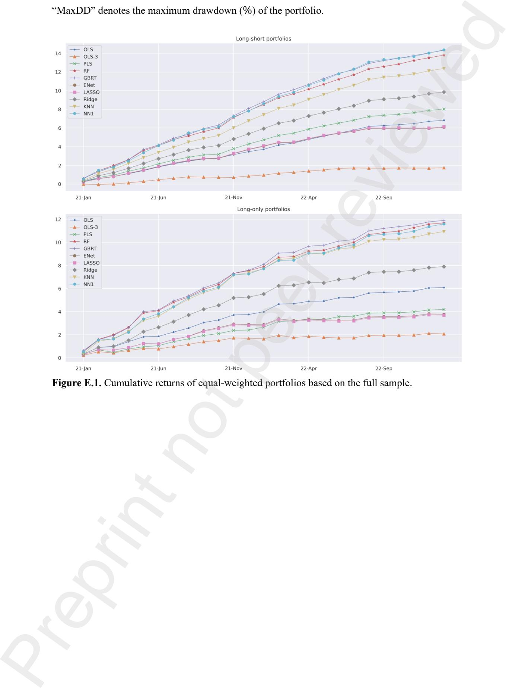

**Figure E.2.** Cumulative returns of neural network portfolios (equal-weighted) based on the full sample.

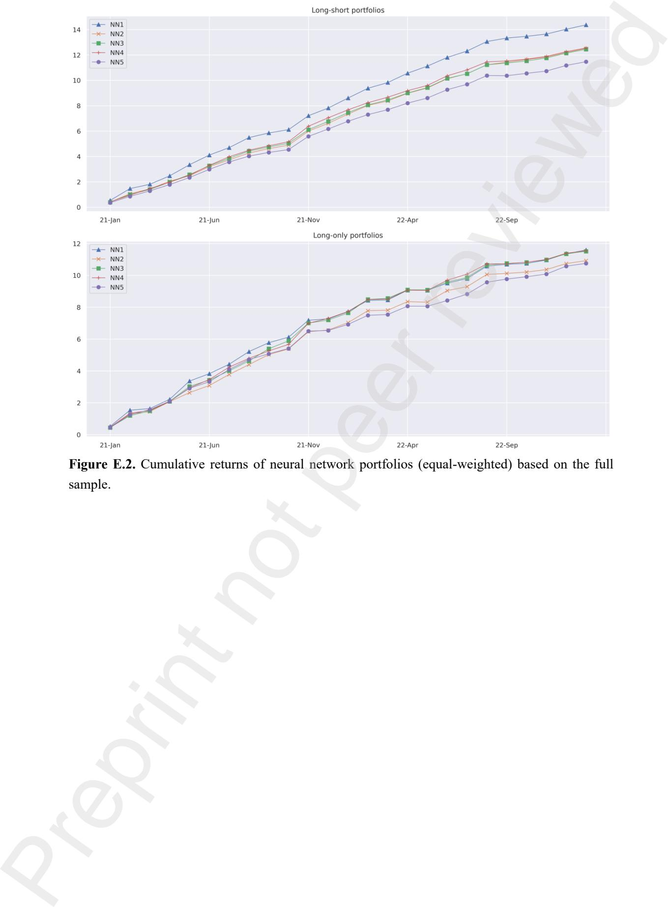