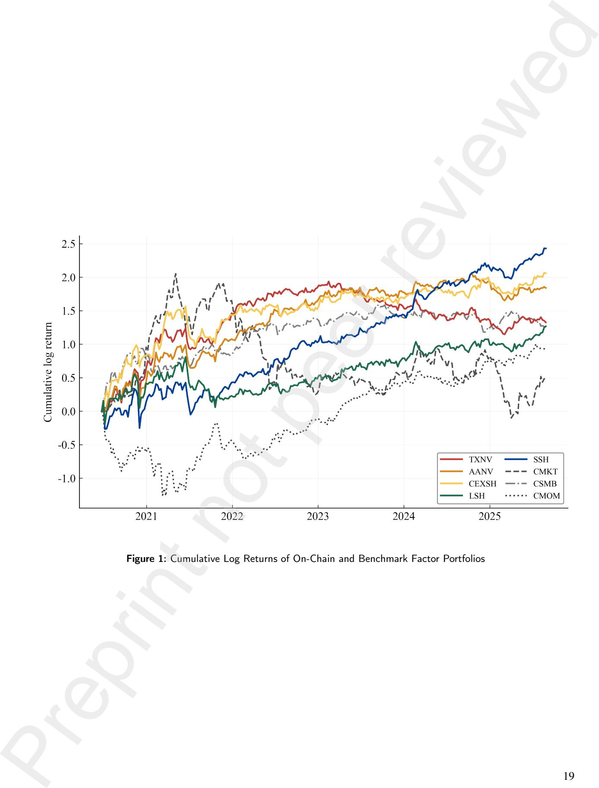

#### **CRediT authorship contribution statement**

**Jun Young Byun:** Conceptualization, Methodology, Software, Formal Analysis, Data Curation, Writing - Original Draft, Visualization. **Yosep Na:** Conceptualization, Validation, Visualization. **Daehyun Kim:** Supervision, Project Administration, Resources, Conceptualization. **Hyun Ho Jeon:** Data Curation, Investigation, Resources, Supervision. **Ga Eun Kim:** Data Curation, Validation. **Jae Wook Song:** Conceptualization, Methodology, Validation, Investigation, Resources, Writing - Review & Editing, Supervision, Project Administration, Funding Acquisition. Preprint not peer reviewed

## On-Chain Factors and Cryptocurrency Asset Pricing: Evidence from Ethereum-Based Tokens

Jun Young Byun*a* , Yosep Na*a* , Daehyun Kim*b* , Hyun Ho Jeon*b* , Ga Eun Kim*b* and Jae Wook Song*a*,∗

*aDepartment of Industrial Engineering, Hanyang University, Seoul, 04763, Republic of Korea*

*bDunamu Inc., Seoul, 06621, Republic of Korea*

#### A R T I C L E I N F O

#### *Keywords*:

Cryptocurrency

Asset Pricing On-Chain Factor

Ethereum

#### A B S T R A C T

This paper examines whether on-chain factors derived from Ethereum blockchain data contain pricing information beyond established cryptocurrency risk factors. We construct 27 onchain factors across four dimensions (network activity, scale-adjusted activity, valuation ratios, and token distribution) for 122 Ethereum-based tokens from July 2020 to August 2025, and evaluate them against 26 benchmark factors spanning size, momentum, volume, and volatility using a double-selection LASSO framework, complemented by portfolio sorts and three-factor regressions. Eight on-chain factors are significant in the cross-sectional pricing test, with the strongest evidence concentrated in scale-adjusted activity and token distribution. Transaction count to network value is the only factor that remains significant in the cross-sectional pricing test, portfolio sorts, and three-factor regressions. In contrast, valuation ratios based on marketto-realized values do not survive as independent sources of abnormal return once momentum is taken into account, reflecting the mechanical overlap between recent price appreciation and slowly adjusting realized values. Token-distribution factors, particularly small-holder share and centralized exchange share, generate the most robust abnormal returns and remain economically meaningful under equal-weighted construction and conservative transaction-cost assumptions. Subperiod analysis further reveals a change in on-chain pricing power: scale-adjusted activity factors are stronger earlier in the sample, whereas distribution-based factors become more important over time. Overall, the results show that blockchain-native information, especially holder distribution, captures a distinct dimension of cryptocurrency asset pricing. Preprint not peer reviewed

∗Corresponding author

jwsong@hanyang.ac.kr (J.W. Song)

ORCID(s): 0000-0001-6455-6524 (J.W. Song)

#### **1. Introduction**

Cryptocurrency asset pricing has developed rapidly from early studies of Bitcoin risk and return to a broader literature on cross-sectional return predictability across digital assets. Foundational work by Liu and Tsyvinski (2021) shows that cryptocurrency returns are largely unrelated to equity, currency, or commodity factors, establishing the asset class as a distinct pricing environment. Building on this insight, Liu, Tsyvinski and Wu (2022) propose a threefactor model comprising market, size, and momentum factors that captures a substantial share of cross-sectional variation among nearly two thousand coins and has become a natural benchmark for evaluating new factor proposals. Alternative specifications have subsequently been advanced. Shen, Urquhart and Wang (2020) replace momentum with reversal, Zhang, Li, Xiong and Wang (2021) document a downside risk premium, Cong, Karolyi, Tang and Zhao (2021a) introduce a network-based value factor, and Bianchi and Babiak (2021) show that latent factors with timevarying loadings can outperform observable factor models. As in equity markets, however, the rapid expansion of candidate predictors raises concerns about redundancy, data mining, and the emergence of a cryptocurrency "factor zoo" (Cochrane, 2011; Harvey, Liu and Zhu, 2016). Recent evidence suggests that these concerns are non-trivial in crypto markets as well. Fieberg, Liedtke and Zaremba (2024b) show that size and volume anomalies are concentrated in micro-cap coins of limited economic relevance, while abnormal returns attenuate over time, echoing the anomaly decay documented in equity markets by McLean and Pontiff (2016). More recently, Mercik, Zaremba and Demir (2026) apply an iterative alpha-based factor compression methodology to 36 predominantly price-based and microstructure factors and find that only two to three, mainly liquidity-related variables such as turnover volatility and bid-ask spreads, are sufficient to eliminate significant portfolio alphas. Importantly, they also note that on-chain signals remain underrepresented in the existing factor set. [P](#page-16-17)[re](#page-16-2)pri[n](#page-16-15)t n[ot](#page-16-14) [pe](#page-16-12)er [re](#page-16-10)v[ie](#page-16-4)[we](#page-16-0)d

Despite this progress, blockchain-native information has received comparatively limited attention as a source of cross-sectional pricing power. This omission is notable because the value of crypto assets is inherently tied to onchain activity, token circulation, and ownership structure. A theoretical foundation for on-chain pricing already exists. Cong, Li and Wang (2021b) model token prices as aggregations of heterogeneous users' transactional demand and predict that network adoption, transaction volume, and user growth are fundamental determinants of cryptocurrency value. Empirically, Bhambhwani, Delikouras and Korniotis(2023) show that blockchain characteristics such as network size and computing power are cointegrated with prices and provide explanatory power comparable to market-based factor models. Sakkas and Urquhart (2024) construct on-chain factors from realized values and holder distributions across 37 blockchains and show that a two-factor model based on network distribution characteristics can subsume traditional price-based factors. In a related study, Lan and Frömmel (2025) evaluate a broad set of cross-sectional predictors and identify several token-specific characteristics as significantly priced. However, these studies share three important limitations. First, they predominantly focus on Bitcoin or broad multi-chain universes rather than the Ethereum ecosystem, where decentralized finance generates richer and more granular on-chain information. Second, they typically evaluate on-chain variables in isolation rather than as part of a systematic factor universe. Third, they rely mainly on standard Fama-MacBeth regressions or portfolio sorts without explicitly addressing the high-dimensional control problem. To our knowledge, no published study applies high-dimensional variable selection methods to test whether a broad set of on-chain factors provides incremental pricing information beyond established cryptocurrency risk factors within the Ethereum ecosystem.

This paper addresses that question. We examine whether on-chain factors derived from Ethereum blockchain data carry incremental pricing power beyond established cryptocurrency risk factors. We focus on Ethereum because the emergence of decentralized finance transformed the network from a simple peer-to-peer transfer platform into a complex financial ecosystem (Baker, 2020), thereby increasing the informational content of blockchain-level fundamentals for asset pricing (Cong et al., 2021b; Liebi, 2022). Using proprietary data from Upbit, we construct 27 on-chain factors for 122 Ethereum-based tokens over the period from July 2020 to August 2025. These factors span four dimensions: network activity and adoption, scale-adjusted activity, valuation ratios, and token distribution and holder structure. We evaluate their pricing relevance against 26 benchmark factors spanning size, momentum, volume, and volatility.

Our study contributes to three strands of the literature. First, we contribute to the literature on cross-sectional return predictability in cryptocurrency markets. Beginning with the return-based factor models of Liu et al. (2022) and Shen et al. (2020), this literature has expanded to encompass momentum dynamics (Li, Urquhart, Wang and Zhang, 2021; Fieberg, Liedtke, Metko and Zaremba, 2023), downside risk (Dobrynskaya, 2024; Zhang et al., 2021), skewness and volatility pricing (Liu and Chen, 2024), trend signals (Fieberg, Liedtke, Poddig, Walker and Zaremba, 2025), and machine learning approaches (Liu, Li, Nekhili and Sultan, 2023; Cakici, Shahzad, Będowska-Sójka and Zaremba, 2024). While this work has substantially improved our understanding of cryptocurrency returns, it relies largely on price-based and trading-based characteristics. We extend this literature by introducing a broad set of on-chain factors derived from Ethereum blockchain data and by evaluating whether they contain pricing information beyond the established return-based predictors.

Second, we contribute to the literature on blockchain fundamentals and cryptocurrency valuation. Cong et al. (2021b) provide the theoretical underpinning by linking token prices to heterogeneous transactional demand, while Liu and Tsyvinski (2021) present early empirical evidence that network-level proxies such as wallet address growth predict returns. Subsequent studies examine blockchain characteristics across multiple chains (Bhambhwani et al., 2023), construct on-chain factor models using realized values and holder distributions (Sakkas and Urquhart, 2024), and explore DeFi-specific return drivers (Şoiman, Dumas and Jimenez-Garces, 2023). Our contribution differs from these studies in three respects. We focus exclusively on Ethereum-based tokens, where on-chain activity is particularly rich; we construct a comprehensive factor universe spanning four distinct on-chain dimensions rather than testing individual variables in isolation; and we evaluate these variables within a unified empirical framework that combines high-dimensional selection, portfolio sorts, and factor model tests.

Third, we contribute to the methodological literature on factor selection in high-dimensional settings. The doubleselection LASSO framework of Feng, Giglio and Xiu (2020), built on the post-double-selection inference of Belloni, Chernozhukov and Hansen (2014), has become a standard approach for evaluating new factor proposals in equity markets. Its application to cryptocurrency markets, however, remains limited. By applying this framework to 27 onchain factors alongside 26 benchmark controls, we provide a systematic assessment of whether blockchain-derived information survives modern high-dimensional testing, thereby addressing the factor-zoo concern emphasized by Cochrane (2011) and Harvey et al. (2016) in the context of on-chain cryptocurrency data.

Our empirical design centers on the double-selection LASSO framework of Feng et al. (2020), which is well suited to settings in which newly proposed factors may be correlated with a large number of benchmark controls. This approach allows us to assess whether a candidate on-chain factor retains pricing relevance after accounting for the benchmark factor set while mitigating omitted-variable bias and overfitting concerns. We complement the crosssectional pricing tests with portfolio-level analyses, including unconditional double-sorted portfolio spreads, threefactor model regressions following Liu et al. (2022), and cumulative performance evaluation.

Our empirical analysis yields three main findings. First, on-chain factors contain significant incremental pricing information after controlling for benchmark factors. Eight of the 27 on-chain factors are statistically significant in the double-selection framework, with the strongest evidence concentrated in the scale-adjusted activity, valuation, and token distribution categories. Transaction count to network value (TXNV) is the only factor that remains significant across all three empirical frameworks—the double-selection pricing test, portfolio spreads, and three-factor alphas—indicating that transaction intensity relative to market capitalization captures pricing information distinct from established risk factors. Second, valuation ratios based on market-to-realized values do not survive as independent sources of abnormal return once momentum is taken into account. Their apparent pricing power is largely subsumed by the momentum factor, reflecting the mechanical relation between recent price appreciation in the numerator and slowly adjusting realized values in the denominator. Third, token distribution factors, particularly small-holder share (SSH), centralized exchange share (CEXSH), and large-holder share (LSH), provide the most robust evidence across testing frameworks and generate economically meaningful risk-adjusted returns over the full sample. Subperiod analysis further reveals a temporal rotation in on-chain pricing power: scale-adjusted activity factors are stronger in the first half of the sample but weaken later, whereas distribution factors become more important over time, suggesting that ownership breadth has become an increasingly relevant cross-sectional characteristic as the Ethereum ecosystem has matured. Pre[p](#page-8-0)rint not [p](#page-16-1)eer re[v](#page-16-24)[ie](#page-16-13)[w](#page-16-11)[ed](#page-16-23)

Overall, our results show that blockchain-native information is not fully subsumed by conventional return-based factor models. In particular, holder distribution appears to capture a distinct dimension of cryptocurrency asset pricing that becomes more important as the market matures. The remainder of this paper is organized as follows. Section 2 describes the data sources, factor construction, and test portfolios. Section 3 presents the double-selection LASSO methodology. Section 4 reports the empirical results, including cross-sectional pricing tests, portfolio sorts, factor model regressions, and cumulative factor performance. Section 5 provides robustness checks through subperiod analysis, equal-weighted portfolios, and transaction cost analysis. Section 6 concludes.

#### **2. Data and Factor Construction**

#### **2.1. Sample and Data Sources**

Our analysis examines the cross-section of weekly returns on Ethereum-based crypto assets listed on Upbit from July 1, 2020, to August 31, 2025, yielding 270 weekly observations. The sample comprises 122 unique Ethereumbased tokens that traded on Upbit at some point during this period. Following standard practice in cryptocurrency asset pricing, we exclude stablecoins in order to focus on risk-bearing assets (Fieberg, Günther, Poddig and Zaremba, 2024a; Cakici et al., 2024). The sample includes tokens with heterogeneous blockchain histories: tokens native to Ethereum, tokens that migrated from other blockchains to Ethereum (network-in), and tokens that originated on Ethereum but later migrated to their own mainnets (network-out). By tracking these network transitions, we preserve the economic history of each asset and avoid artificial breaks in the time series that would arise from classifying tokens solely by their current network status.

Both price data and on-chain variables are obtained from Upbit's proprietary data infrastructure, which integrates exchange trading records with blockchain analytics. Upbit receives an A-rating in the Kaiko Exchange Ranking, which evaluates centralized exchanges on governance, liquidity, security, and data quality dimensions.1 This unified data environment helps ensure consistency between observed returns and blockchain-level activity and reduces the measurement discrepancies that can arise when market and on-chain data are merged from separate providers. Although our cross-section is smaller than in studies covering the broader cryptocurrency universe (Liu et al., 2022), it is well suited to our objective of studying Ethereum-based tokens with sufficiently rich on-chain information and reflects Upbit's relatively selective listing policy.

To mitigate survivorship bias, we include all assets listed during the sample period, including those that were subsequently delisted. Handling delistings is an important challenge in cryptocurrency research. Unlike equity markets, where delisting may immediately impair liquidity, Upbit provides a 30-day liquidation period before actual delisting, allowing market participants time to unwind their positions.2 We therefore compute returns through the final trading week using the last available market price and remove the asset from the investable universe thereafter. Delisting from Upbit also does not eliminate broader market liquidity, because token holders retain custody in their wallets and may transfer their holdings to other exchanges.

To construct factors that require long historical lookback windows, we begin collecting data on July 1, 2018, two years before the start of the main sample. This presample period allows us to estimate all characteristics consistently from the outset of the analysis, including long-horizon momentum variables that require up to 100 weeks of prior returns. Table 1 reports the composition and market capitalization of the sample. The cross-section expands from an average of 33 tokens per week in the second half of 2020 to 96 tokens in 2025, reflecting the growth of the Ethereum ecosystem over the sample period. Market capitalization is highly concentrated throughout, with mean market capitalization exceeding the median by roughly a factor of 30, indicating that aggregate value is dominated by a relatively small number of large tokens.

#### [Table 1 about here.]

#### **2.2. Benchmark Factors**

Our benchmark set comprises 26 factors spanning four broad categories: size, momentum, volume, and volatility. These factors are well established in the cryptocurrency asset pricing literature and serve as control variables throughout the empirical analysis. The size category includes market capitalization (MCAP), price level (PRC), maximum daily price (MAXDPRC), and listing age (AGE). Momentum factors capture return dynamics over multiple horizons, ranging from one-week (*��*1*,*0 ) to 100-week (*��*100*,*0 ) lookback periods. Volume-related variables measure trading intensity through raw volume (VOL), price-volume (PRCVOL), and scaled volume (VOLSCALED). Finally, the volatility category includes market beta (BETA, BETA2), downside beta (DSBETA), idiosyncratic volatility (IDIOVOL), return volatility (RETVOL), maximum return (MAXRET), price delay (DELAY), price-volume volatility (STDPRCVOL), the Amihud illiquidity measure (DAMIHUD), and return skewness (SKEW). [Pre](#page-16-29)[p](#page-21-0)rint not p[e](#page-4-2)er revi[ew](#page-16-27)ed

Table 2 reports the detailed definitions, construction methods, and primary references for the benchmark factors. These variables are grounded in seminal studies in traditional asset pricing (Fama and MacBeth, 1973; Jegadeesh and Titman, 1993) and have been adapted to cryptocurrency markets by Liu et al. (2022) and subsequent research. By

1Kaiko, Kaiko Spot Exchange Ranking (Q1 2026), available at: https://www.kaiko.com/indices/exchange-ranking.

2Upbit's practice of providing a 30-day liquidation period prior to delisting implies that observed prices during the liquidation period reflect market consensus incorporating delisting information, rather than stale prices before sudden suspension.

controlling for this benchmark factor set in the double-selection LASSO framework, we evaluate whether on-chain variables contain pricing information that is incremental to the established return-based characteristics used in the cryptocurrency literature.

#### [Table 2 about here.]

#### **2.3. On-Chain Factors**

In contrast to the return-based benchmark factors, our on-chain factors are constructed from Ethereum blockchain data and are intended to capture network-level fundamentals underlying cryptocurrency valuations. We construct 27 on-chain factors spanning four complementary dimensions: network activity and adoption, scale-adjusted activity, valuation ratios, and token distribution and holder structure.

The first group captures network activity and adoption. Address growth (ADDGR) and transaction growth (TRANSGR) measure the expansion of network participation (Liu and Tsyvinski, 2021; Bhambhwani et al., 2023), while new active addresses (NEWACT) capture user onboarding intensity (Liu and Tsyvinski, 2021). Transfer counts (TRANSFER) and transaction volume (TRANSVOL) reflect the scale of blockchain usage (Liu et al., 2022; Liebi, 2022), and network turnover (TURNOVER) measures token circulation relative to supply, providing a proxy for the velocity of on-chain economic activity (Liu et al., 2022; Lan and Frömmel, 2025).

The second group consists of scale-adjusted activity factors, which normalize network usage by market capitalization in order to account for cross-sectional differences in token size. Transaction volume to network value (TVNV), transaction count to network value (TXNV), and active addresses to network value (AANV) provide sizeadjusted measures of network engagement (Liebi, 2022). We also include circulating supply (CIRCSUP) and its change (ΔCIRCSUP), which capture the level and evolution of token availability in the market (Liu et al., 2023; Lan and Frömmel, 2025).

The third group consists of valuation measures based on realized values. The market-to-realized-value ratio (MVRV) compares the current market price to the realized price of circulating tokens (Sakkas and Urquhart, 2024). We further decompose this aggregate measure into venue-specific ratios (MVCEX, MVDEX) and holder-size-specific ratios (MVL, MVM, MVS), which allow us to examine whether valuation discrepancies differ across trading venues and investor segments (Sakkas and Urquhart, 2024).

The final group captures token distribution and holder structure. Centralized exchange share (CEXSH) and decentralized exchange share (DEXSH) measure the allocation of tokens across venue types, while large-, medium-, and small-holder shares (LSH, MSH, SSH) characterize the ownership structure by wallet size (Sakkas and Urquhart, 2024). We also include changes in these measures (ΔCEXSH, ΔDEXSH, ΔLSH, ΔMSH, and ΔSSH), which capture shifts in investor composition and may reflect evolving sentiment, liquidity provision, or ownership concentration (Sakkas and Urquhart, 2024; Lan and Frömmel, 2025).

All on-chain factors are constructed using information available prior to portfolio formation in order to avoid lookahead bias. Table 3 presents the detailed definitions, calculation methods, and references for all 27 on-chain factors.

#### [Table 3 about here.]

#### **2.4. Factor Mimicking Portfolio Construction**

To reduce the influence of microstructure noise and extreme outliers, we apply a two-step cleaning procedure following recent work on non-standard errors in cryptocurrency markets (Fieberg et al., 2024a). First, we exclude weekly returns exceeding 100%. Such observations are rare but can exert a disproportionate influence on portfolio means and are more likely to reflect short-lived price distortions than persistent risk premia. Second, we winsorize the remaining weekly cross-section of returns at the 1% and 99% levels.

At the end of each week, we sort assets into characteristic-sorted portfolios using a two-dimensional procedure. In the first stage, assets are assigned to three size groups based on market capitalization. Assets below the 20th percentile are classified as Micro, those between the 20th and 50th percentiles as Small, and those above the 50th percentile as Big. This size classification follows standard practice in the asset pricing literature and is motivated by the fact that micro-cap assets tend to exhibit distinct return characteristics and substantially weaker liquidity (Fama and French, 2008; Jensen, Kelly and Pedersen, 2023). Since micro-sized tokens often trade infrequently and are subject to extreme bid-ask spreads, we exclude them from factor return construction.3 [P](#page-16-30)[re](#page-16-31)print [no](#page-16-14)t [p](#page-16-13)eer [r](#page-16-14)[ev](#page-16-0)[i](#page-16-12)ewed

3Micro-cap tokens often experience extended periods without trading activity and exhibit extreme bid-ask spreads, making them unsuitable for constructing tradable factor portfolios.

In the second stage, assets within the Big and Small groups are sorted on the relevant factor signal. Following Jensen et al. (2023), breakpoints are set at the 30th and 70th percentiles of the combined Big and Small universe. Assets below the 30th percentile are assigned to the Low group, those between the 30th and 70th percentiles to the Neutral group, and those above the 70th percentile to the High group. These breakpoints are then applied uniformly across size groups. The intersection of the size and signal sorts yields six double-sorted portfolios for each factor.

Portfolio returns are computed weekly using value-weighted averages, with individual asset weights capped at the 80th percentile of the asset universe in order to limit the influence of extreme positions (Jensen et al., 2023).4 Portfolios are rebalanced weekly. To account for transaction costs, we assume a per-transaction fee of 20 basis points at both entry and exit for each portfolio leg at each weekly rebalancing.5

For both benchmark and on-chain characteristics, we construct size-neutral factor mimicking portfolios following Fama and French (1993).6 The factor return is defined as

$$f_{i,t} = \frac{1}{2} \left( R_{i,t}^{\text{BH}} + R_{i,t}^{\text{SH}} \right) - \frac{1}{2} \left( R_{i,t}^{\text{BL}} + R_{i,t}^{\text{SL}} \right), \quad (1)$$

where *��* indexes the factor, *��* denotes the portfolio formation week, and *��*BH *��,��* , *��* SH *��,��* , *��*BL *��,��* , and *��* SL *��,��* are the value-weighted returns of the Big High, Small High, Big Low, and Small Low portfolios, respectively.

This construction isolates variation in characteristic exposure while remaining neutral to the overall size effect (Fama and French, 1993). By averaging the high-characteristic portfolios across size groups and subtracting the average of the low-characteristic portfolios, we capture the incremental information contained in each characteristic beyond what is already reflected in market capitalization.

All benchmark factor returns are standardized by their univariate regression coefficients prior to entering the double-selection LASSO procedure, following Bryzgalova (2015). This normalization improves comparability across factors with different scales and volatilities.

#### **2.5. Test Portfolios**

To evaluate whether on-chain factors earn risk premia in the cross-section of cryptocurrency returns, we construct a broad set of test portfolios designed to provide variation across multiple dimensions. Following Lewellen, Nagel and Shanken (2010), we avoid relying on only a small set of portfolios sorted on a limited number of characteristics, because such a design may mechanically favor factors related to the sorting variables.

Our test assets consist of two components. First, we include seven economically motivated portfolios provided by the Upbit Data Lab, which represent investment strategies and sectors actively tracked by market participants.7 These portfolios include sector-based indices such as the Smart Contract Platform index and the DeFi index, which capture assets whose economic activity is closely linked to Ethereum infrastructure. They also include broad market portfolios such as the Upbit Composite Index (UPBIT COMP) and the Upbit Altcoin Index (UPBIT ALT), which serve as aggregate benchmarks for systematic pricing information. In addition, strategy-based portfolios such as Momentum, Low Volatility, and Contrarian allow us to examine whether on-chain characteristics contain information beyond standard return-based trading signals. Preprint not pe[e](#page-16-33)r revi[ew](#page-16-31)ed

Second, we augment these seven portfolios with characteristic-sorted portfolios constructed from the benchmark factors. For each of the 26 benchmark factors, we include the four corner portfolios from the double-sort procedure (Big High, Big Low, Small High, and Small Low) while excluding Neutral and Micro portfolios in order to reduce noise from weak signals and illiquidity. This approach follows Feng et al. (2020), who show that expanding the test-asset universe while preserving signal clarity increases the power of cross-sectional pricing tests.8

This procedure yields 109 test portfolios in total. Characteristic-sorted portfolios provide more stable risk exposures than individual assets and substantially richer cross-sectional variation than a narrow set of sorted portfolios (Feng et al.,

4This capped value-weighting approach addresses the highly skewed market capitalization distribution in cryptocurrency markets, where a handful of large tokens can dominate traditional value-weighted portfolios if left uncapped.

5This estimate incorporates Upbit's trading fees, which are 5 basis points per transaction in the KRW market where the majority of sample tokens are traded, and 25 basis points in the BTC and USDT markets (see https://upbit.com/service\_center/fees). For KRW-market tokens, the 20 basis point assumption thus incorporates a substantial margin for market impact and bid-ask spreads; Section 5.3 further evaluates factor profitability across cost levels up to 50 basis points per transaction to accommodate higher-fee trading pairs.

6For the market capitalization factor (MCAP), which is used to define the size sorts themselves, the factor return is constructed as the simple difference between the Big and Small groups, as size-neutralization is not meaningful in this case.

7The Upbit Data Lab provides a comprehensive family of cryptocurrency indices, commonly referred to as the Upbit Crypto Index (UBCI). Detailed index information is available at https://datalab.upbit.com/indexes.

8For the market capitalization factor (MCAP), which is used to define the size sorts themselves, we include only two portfolios.

2020). The resulting design enables us to assess the pricing relevance of on-chain factors across sectoral, market-wide, and strategy-based dimensions while reducing the risk that the findings are driven by a particular choice of test assets.

#### **3. Methodology**

#### **3.1. Double-Selection LASSO Framework**

To evaluate the pricing relevance of on-chain factors in the presence of a broad set of benchmark controls, we adopt the double-selection LASSO framework of Feng et al. (2020). This approach is particularly well suited to settings in which the number of candidate control factors is large and newly proposed factors may be correlated with existing predictors. A specification that ignores relevant controls risks omitted-variable bias, whereas a specification that includes all controls may suffer from low statistical power given the limited cross-section of test portfolios. The double-selection procedure addresses this trade-off by selecting controls in a disciplined and economically interpretable way. Pre[pr](#page-16-25)int not peer reviewed

The procedure consists of three stages. In the first stage, we use LASSO to identify benchmark factors that help explain the cross-section of average test-portfolio returns. For each test portfolio *��*, we estimate

$$\bar{R}_p = \alpha_1 + \sum_{k=1}^K \beta_{1,k} \text{Cov}(h_k, R_p) + \varepsilon_{1,p}, \quad (2)$$

where *��̄ ��* is the average return of test portfolio *��*, *ℎ��* denotes the *��*-th benchmark factor, and Cov(*ℎ�� , ����* ) is the sample covariance between benchmark factor *��* and the returns of portfolio *��*. The LASSO penalty selects a subset *��*1 of benchmark factors that is most informative about the cross-section of average returns. This stage is intended to identify benchmark factors that are directly relevant for pricing the test assets.

In the second stage, we use LASSO to identify benchmark factors that are correlated with the candidate on-chain factor *��*. Specifically, we estimate

$$\text{Cov}(g, R_p) = \alpha_2 + \sum_{k=1}^K \beta_{2,k} \text{Cov}(h_k, R_p) + \varepsilon_{2,p}, \quad (3)$$

which yields a second selected set of controls, *��*2 . This step is important since an on-chain factor may appear to be priced simply because it proxies for omitted benchmark factors. By selecting benchmark variables that co-move with the cross-sectional exposure pattern of the candidate factor, the second stage helps mitigate this source of omitted-variable bias.

In the third stage, we estimate the pricing coefficient of the on-chain factor by OLS conditional on the union of controls selected in the first two stages, *��*3 = *��*1 ∪ *��*2 :

$$\bar{R}_p = \alpha_3 + \beta_g \text{Cov}(g, R_p) + \sum_{k \in K_3} \beta_{3,k} \text{Cov}(h_k, R_p) + \varepsilon_{3,p}, \quad (4)$$

The coefficient *����* measures the price of risk associated with the on-chain factor *��*. A statistically significant estimate of *����* indicates that the factor carries cross-sectional pricing information after controlling for the selected benchmark factors. Because the final OLS regression conditions on the union of predictors selected in the first two stages, the procedure delivers valid post-selection inference in the spirit of Belloni et al. (2014) and Feng et al. (2020).

#### **3.2. Implementation**

Following Feng et al. (2020), we select the LASSO penalty parameter *��* from a fixed exponential grid of 100 values ranging from *��* 0 to *��* −35. Penalty selection is based on 10-fold cross-validation repeated over 200 independent random seeds. For each seed, we compute the fold-averaged cross-validated mean squared error (CV MSE) over the penalty grid and then average the resulting CV MSE profiles across seeds to obtain an overall mean CV MSE curve. We then apply the one-standard-error (1-SE) rule and choose the largest value of *��* whose mean CV MSE lies within one standard error of the minimum.

The standard error is estimated from the variation across seeds, which helps alleviate the downward bias in conventional cross-validation standard errors induced by correlation across folds (Bates, Hastie and Tibshirani, 2024). This implementation favors parsimonious control sets while preserving out-of-sample fit.

We apply the double-selection procedure separately to each of the 27 on-chain factors. In both LASSO stages, the benchmark factors serve as the candidate control set. For each on-chain factor, we report the post-selection pricing coefficient *����* and its associated *��*-statistic.

#### **4. Empirical Results**

#### **4.1. Factor Selection and Pricing Tests**

We begin by examining whether on-chain factors carry incremental risk premia after controlling for established cryptocurrency pricing factors. The double-selection LASSO procedure isolates each on-chain factor's pricing relevance by accounting for its overlap with the 26 benchmark factors spanning size, momentum, volume, and volatility. Table 4 reports the post-double-selection pricing coefficients (*����* ) for all 27 on-chain factors, measured in basis points per week. A significant coefficient indicates that test portfolios with higher exposure to the candidate on-chain factor earn systematically different average returns after controlling for the benchmark factors selected through the doubleselection procedure.

#### [Table 4 about here.]

A notable feature of the results is the first-stage LASSO selection. Across all 27 specifications, the first stage selects no benchmark factors (|*��*1 | = 0), implying that none of the 26 established factors is selected as a direct pricing variable for the cross-section of our 109 test portfolios. Although this result is initially surprising, it is broadly consistent with the sparse first-stage selections reported by Feng et al. (2020) in equity markets. Our test assets include both Upbit sector-based indices and characteristic-sorted portfolios constructed from the benchmark factors themselves, yet the first stage still identifies no benchmark factor as a direct pricing variable. This finding should not be interpreted as evidence that benchmark factors are irrelevant. Rather, it suggests that the cross-sectional variation in average returns is not summarized parsimoniously by any benchmark factor covariance pattern once regularization is imposed. The benchmark factors remain relevant through the second stage: for 20 of the 27 on-chain factors, the final control set is non-empty (|*��*3 | *&gt;* 0), indicating that benchmark factor covariances overlap with on-chain factor exposures and therefore need to be partialled out in the final pricing regression. Preprint not pe[e](#page-16-25)r reviewed

Of the 27 on-chain factors, eight are statistically significant at the 10% level or better. These significant factors are concentrated in three of the four categories: scale-adjusted activity, valuation ratios, and token distribution. Factors that remain significant with empty control sets (|*��*3 | = 0) exhibit standalone pricing relevance, whereas factors associated with larger control sets provide incremental pricing information only after shared variation with benchmark factors has been removed. Taken together, the results indicate that the pricing content of blockchain-native data is selective rather than pervasive once overlap with established return-based characteristics is taken into account.

Among the network activity and adoption factors, only TURNOVER is significant, with a pricing coefficient of −146 basis points (*��* = −4*.*80, |*��*3 | = 0). The fact that no benchmark control is selected suggests that TURNOVER carries standalone pricing relevance in the cross-section. Its negative sign indicates that tokens with higher circulation velocity relative to supply are associated with lower expected returns. One interpretation is that elevated turnover reflects speculative trading activity rather than productive network usage. By contrast, address growth, transaction growth, transfer counts, and transaction volume are all insignificant. Several of these variables require non-trivial second-stage control sets, particularly TRANSGR (|*��*3 | = 20), TRANSVOL (|*��*3 | = 18), and TRANSFER (|*��*3 | = 12), suggesting substantial overlap with established size, momentum, volume, and volatility characteristics. Once this overlap is removed, the remaining variation in raw network activity measures contributes little incremental pricing information.

Within the scale-adjusted activity category, TXNV delivers the strongest positive coefficient among all 27 onchain factors, at 232 basis points (*��* = 3*.*21, |*��*3 | = 19). This result indicates that, conditional on the selected benchmark factors, tokens with higher transaction counts relative to market capitalization earn higher expected returns. The large control set suggests substantial overlap between TXNV exposures and benchmark factor exposures, yet the pricing coefficient remains significant after these controls are included. CIRCSUP is also marginally significant, with a coefficient of 163 basis points (*��* = 1*.*98, |*��*3 | = 11). By contrast, TVNV and AANV are not significant despite their close conceptual relation to TXNV. This contrast suggests that transaction counts may provide a more stable measure of network engagement than transaction volumes or active-address counts. Whereas large transactions or highly active addresses can exert disproportionate influence on TVNV and AANV, transaction counts weight each interaction equally and may therefore provide a cleaner cross-sectional signal.

The evidence for valuation ratios is mixed. Two of the six measures are significant: MVDEX, with a coefficient of 130 basis points (*��* = 2*.*13, |*��*3 | = 4), and MVL, with a coefficient of 217 basis points (*��* = 2*.*05, |*��*3 | = 21). The aggregate MVRV ratio is economically small and statistically insignificant (17 basis points, *��* = 0*.*23), and the remaining disaggregated measures (MVCEX, MVM, and MVS) are also insignificant. The significance of MVDEX and MVL suggests that valuation information becomes more relevant when realized-value measures are segmented by venue type or holder group rather than measured in aggregate. One possible interpretation is that realized values for DEX-held tokens and large-holder balances embed more informative cost bases than those for exchange traders or smaller holders, whose positions may reflect shorter-horizon or more heterogeneous trading motives. At the same time, the large control set associated with MVL indicates substantial overlap with benchmark characteristics, so its pricing relevance is best viewed as conditional rather than standalone.9 Preprint not peer reviewed

Token-distribution factors also contain pricing information, both in levels and in changes. DEXSH and SSH are negatively priced, with coefficients of −162 basis points (*��* = −2*.*56, |*��*3 | = 6) and −195 basis points (*��* = −1*.*77, |*��*3 | = 26), respectively. The negative coefficient on SSH indicates that, conditional on benchmark controls, tokens with greater small-holder concentration are associated with lower subsequent returns. Among the change variables, ΔDEXSH exhibits the largest absolute coefficient in the table, at −236 basis points (*��* = −5*.*40, |*��*3 | = 8). A natural interpretation is that larger token balances in decentralized exchange pools increase readily tradable supply and thereby contribute to future selling pressure. More broadly, these results suggest that token location and ownership structure contain pricing information beyond what is captured by conventional return-based factors.

Across the 27 specifications, the significant on-chain factors are concentrated in scale-adjusted activity, valuation ratios, and token distribution, whereas most raw network activity measures do not survive the double-selection procedure. This pattern suggests that on-chain information is most relevant for asset pricing when it captures network usage relative to valuation, segmented valuation measures, or ownership structure rather than simple growth in blockchain activity.

#### **4.2. Portfolio Sorts**

While the double-selection framework establishes whether on-chain factors carry cross-sectional pricing information after conditioning on benchmark controls, it does not directly show whether simple characteristic-sorted strategies generate stable returns over time. Cross-sectional pricing coefficients summarize the relation between factor exposure and average returns across test portfolios, whereas portfolio spreads measure the unconditional profitability of longshort strategies over the full sample. A factor may therefore appear important in the cross-section yet generate only weak portfolio spreads if its returns are volatile, if its premium varies over time, or if its signal overlaps with other characteristics. We therefore examine whether the pricing relations documented above translate into economically meaningful portfolio-level returns.

Table 5 reports value-weighted average weekly excess returns for the double-sorted portfolios described in Section 2. For each on-chain factor, we report High, Neutral, and Low portfolio returns within the Big and Small size groups, together with the High-minus-Low spread that represents the long-short portfolio return.

#### [Table 5 about here.]

Among the network activity factors, several significant spreads appear only in the Small token universe and are negative in sign. ADDGR generates a spread of −124 basis points per week (*��* = −2*.*34), TRANSGR earns −110 basis points (*��* = −2*.*16), and TURNOVER produces −119 basis points (*��* = −2*.*36). One interpretation is that rapid growth in activity and high token circulation are associated with subsequent reversals among smaller and less mature tokens, where these signals may capture speculative demand rather than durable adoption. In the Big token universe, by contrast, two activity measures produce positive and significant spreads: NEWACT at 111 basis points (*��* = 3*.*39) and TRANSFER at 99 basis points (*��* = 2*.*27). This pattern suggests that user onboarding and transfer activity contain more favorable information for larger, more established tokens than for smaller ones.

Within the scale-adjusted activity category, AANV produces the strongest portfolio-sort evidence, with significant spreads in both size groups: 84 basis points for Big tokens (*��* = 2*.*77) and 82 basis points for Small tokens (*��* = 1*.*71). TXNV earns a significant spread of 67 basis points for Big tokens only (*��* = 1*.*72). By contrast, TVNV and CIRCSUP

9By contrast, MVCEX measures profitability relative to centralized exchange holders who represent relatively short-horizon trading positions, while MVM and MVS capture mid-tier and retail holders whose acquisition costs reflect a broader and noisier mix of investment motivations. The absence of significance for these measures is consistent with their realized values carrying less informative signals about fundamental value, as the underlying holder populations are less homogeneous in their information sets and investment horizons.

do not generate significant spreads in either size group. These results broadly support the view that activity measures become more informative when scaled by token value, although the portfolio-sort evidence is somewhat stronger for AANV than for TXNV.

The valuation-ratio results are notably weak in the portfolio-sort setting. None of the six valuation measures generates a significant spread in either size group. This absence of significance stands in contrast to the double-selection results, where MVDEX and MVL carry significant pricing coefficients. A natural interpretation is that valuation ratios may differentiate expected returns in the cross-section but do not translate into stable unconditional long-short returns over time. In other words, their pricing content appears sensitive to time variation in factor returns and is not strong enough to produce consistently significant spread portfolios over the full sample.

Token-distribution factors produce the most consistent portfolio-level evidence. SSH generates significant positive spreads in both size groups, 110 basis points for Big tokens (*��* = 3*.*13) and 118 basis points for Small tokens (*��* = 2*.*39), indicating that tokens with greater small-holder share outperform those with lower small-holder share in the unconditional sort. CEXSH displays a similar pattern, with significant spreads of 97 basis points for Big tokens (*��* = 2*.*30) and 92 basis points for Small tokens (*��* = 1*.*97). LSH generates a significant negative spread of −78 basis points for Big tokens (*��* = −2*.*33), while MSH earns a significant positive spread of 107 basis points only among Small tokens (*��* = 2*.*23). Taken together, these results suggest that the cross-section of returns is related not only to trading activity but also to the distribution of token ownership across investor groups and holding venues. Relative to activityor valuation-based measures, holder-distribution variables may also be less noisy in portfolio formation because they reflect more persistent and directly observable balance allocation.

An important feature of Table 5 is that the portfolio-sort results do not map one-for-one into the doubleselection results in Table 4. Several factors that are significant in the double-selection framework, including MVDEX, MVL, DEXSH, and ΔDEXSH, do not generate significant unconditional spreads. Conversely, CEXSH and AANV generate significant portfolio spreads despite being insignificant in the double-selection pricing test. This divergence is economically informative rather than contradictory. The double-selection test asks whether a factor retains incremental pricing relevance after conditioning on benchmark controls, whereas the portfolio sort captures the unconditional return spread between high- and low-characteristic portfolios. For CEXSH, the cross-sectional pricing coefficient is attenuated once the benchmark controls are included, but the unconditional sort still captures the total return differential associated with the characteristic. For AANV, the pricing coefficient is positive but imprecisely estimated in the doubleselection framework (*����* = 27, *��* = 0*.*41, |*��*3 | = 19), suggesting that its return variation overlaps substantially with the benchmark factor set even though its sorted portfolios produce economically meaningful spreads. More generally, the results show that cross-sectional pricing tests and portfolio sorts address different empirical questions, and a factor that is informative in one framework need not be equally prominent in the other. Preprin[t](#page-16-1) not peer reviewed

#### **4.3. Factor Model Tests**

Having identified on-chain factors that generate significant portfolio spreads, we next examine whether these returns represent independent pricing information or simply reflect exposure to established cryptocurrency risk factors. Following Liu et al. (2022), we regress the weekly returns of each on-chain factor's High-minus-Low portfolio on the cryptocurrency market excess return (CMKT), size factor (CSMB), and momentum factor (CMOM):

| $f_{i,t} = \alpha_i + \beta_{i,\text{CMKT}}\text{CMKT}_t + \beta_{i,\text{CSMB}}\text{CSMB}_t + \beta_{i,\text{CMOM}}\text{CMOM}_t + \varepsilon_{i,t}$ | (5) |
|---------------------------------------------------------------------------------------------------------------------------------------------------------|-----|
|---------------------------------------------------------------------------------------------------------------------------------------------------------|-----|

where *����,��* is the size-neutral factor return for on-chain factor *��* as defined in Equation (1). A significant intercept *����* indicates abnormal returns not explained by the three-factor model. Table 6 reports the results for all 27 on-chain factors.

#### [Table 6 about here.]

Ten of the 27 factors generate statistically significant alphas. This result indicates that a non-trivial subset of onchain characteristics captures return variation beyond the market, size, and momentum factors of Liu et al. (2022). At the same time, the distribution of significant alphas is uneven across factor categories, with the strongest evidence concentrated in scale-adjusted activity and token-distribution measures.

Among the network activity factors, only ADDGR and TRANSGR produce significant alphas, both negative at −0*.*6% per week (*��* = −1*.*81 for both). The negative signs are consistent with the possibility that rapid network expansion reflects short-lived speculative attention that subsequently reverses. TURNOVER, despite its significant pricing coefficient in the double-selection test, does not generate a significant alpha (−0*.*4%, *��* = −1*.*35). Instead, it loads positively on both CMKT (*��* = 0*.*107, *��* = 2*.*37) and CMOM (*��* = 0*.*240, *��* = 3*.*32), suggesting that part of its return variation is absorbed by broad market and momentum exposures in the three-factor specification.

Scale-adjusted activity factors produce clearer evidence of abnormal performance. TXNV earns a significant positive alpha of 0.6% per week (*��* = 2*.*09), and AANV produces a similarly large alpha of 0.6% (*��* = 2*.*64). These results indicate that transaction intensity and user engagement relative to market capitalization contain pricing information that is not spanned by the three benchmark factors. AANV also exhibits significant positive loadings on CMKT (*��* = 0*.*128, *��* = 3*.*21) and CSMB (*��* = 0*.*219, *��* = 1*.*98), indicating that high-AANV tokens tend to co-move with the overall crypto market and with smaller tokens. The positive alpha nevertheless shows that these exposures do not fully account for the return premium associated with the factor.

The valuation-ratio results are notably different. None of the six MVRV-based factors generates a significant alpha. Instead, each valuation ratio loads positively on the momentum factor, with CMOM coefficients ranging from 0.207 (*��* = 2*.*16) for MVL to 0.538 (*��* = 6*.*31) for MVCEX. This pattern indicates that valuation-ratio portfolios are closely related to momentum: tokens with high market-to-realized values also tend to be recent outperformers. A natural interpretation is mechanical. Market-to-realized value ratios incorporate recent price appreciation in the numerator, while realized values in the denominator adjust only gradually as token cost bases evolve. As a result, the long-short returns of valuation-ratio portfolios are largely absorbed by CMOM rather than appearing as independent abnormal returns. This finding is consistent with the strong role of momentum documented by Liu et al. (2022) and suggests that the pricing content of realized-value measures is limited once momentum exposure is taken into account.

Among the token-distribution factors, SSH earns the largest alpha at 0.9% per week (*��* = 3*.*13), followed by CEXSH at 0.8% (*��* = 2*.*68), MSH at 0.7% (*��* = 2*.*37), DEXSH at 0.6% (*��* = 1*.*81), and LSH at −0*.*5% (*��* = −1*.*99). These results indicate that holder composition and token location contain information not captured by the three-factor benchmark. The negative alpha for LSH is particularly informative because it shows that the return penalty associated with ownership concentration is not simply a disguised size or momentum effect. LSH loads negatively on CMKT (*��* = −0*.*101, *��* = −2*.*22) but has near-zero coefficients on CSMB and CMOM, with an *��*2 of only 0.025, suggesting that concentrated ownership captures a dimension of return variation that is largely orthogonal to the benchmark model. Among the change variables, ΔLSH also generates a significant negative alpha of −0*.*5% (*��* = −1*.*98), together with negative loadings on CMKT (*��* = −0*.*108, *��* = −3*.*50) and CMOM (*��* = −0*.*206, *��* = −2*.*43). This pattern is consistent with the view that increases in large-holder concentration are associated with subsequent underperformance even after controlling for broad market and momentum exposure. P[re](#page-18-0)print not peer [r](#page-16-1)eviewed

Taken together with the previous results, the three-factor regressions reinforce two main conclusions. First, scaleadjusted activity and token-distribution measures provide the most robust evidence of independent pricing information. TXNV remains the strongest scale-adjusted activity variable, while SSH, CEXSH, LSH, and ΔLSH indicate that ownership structure is an important on-chain dimension of expected returns. Second, valuation ratios do not survive as independent pricing factors once momentum is taken into account. Their explanatory power in the cross-section appears to reflect overlap with recent price performance rather than a distinct source of abnormal return.

The comparison across testing frameworks is also informative. TXNV is the only factor that is significant in all three frameworks (the double-selection pricing test, portfolio sorts, and the three-factor model). In contrast, MVDEX and MVL are significant in the double-selection framework but not in portfolio spreads or alphas, implying that their pricing content does not translate into stable, unconditional, or risk-adjusted returns. Conversely, factors such as AANV and CEXSH generate significant portfolio spreads and significant or near-significant alphas even when they are weak in the double-selection framework. These differences reflect the distinct conditioning sets imposed by each empirical test and suggest that no single framework fully characterizes the pricing role of on-chain information.

#### **4.4. Cumulative Factor Performance**

The preceding subsections identify on-chain factors that carry significant pricing information under complementary empirical frameworks. We next examine the cumulative performance of the corresponding long-short portfolios over the full sample period in order to assess whether these pricing relations translate into economically meaningful return patterns. For LSH and CMOM, returns are reported in the premium-earning direction so that positive cumulative values uniformly indicate profitable positions across all portfolios.

Figure 1 plots cumulative log returns for five on-chain factor portfolios together with the three benchmark factors from July 2020 to August 2025. The figure highlights a clear contrast between the market factor and the characteristicbased portfolios. CMKT rises sharply during the 2021 bull market and reaches the highest cumulative return among the eight portfolios by mid-2021, but subsequently experiences a severe drawdown through 2022 that erases most of those gains. By the end of the sample, CMKT records the lowest cumulative return among the eight portfolios. The on-chain factor portfolios, by contrast, exhibit smoother accumulation paths and materially smaller drawdowns, suggesting that their returns are less sensitive to aggregate market cycles than the broad cryptocurrency market factor.

#### [Figure 1 about here.]

Table 7 quantifies these differences using annualized performance measures. CMKT records an annualized volatility of 69.5%, roughly twice that of any on-chain factor, and a maximum drawdown of −88*.*4%, the largest among all eight portfolios. Its Sharpe ratio of 0.47 is therefore the lowest in the comparison set, indicating that passive market exposure delivers a relatively weak risk-return trade-off over the sample period.

#### [Table 7 about here.]

Among the on-chain factors, SSH delivers the strongest risk-adjusted performance with a Sharpe ratio of 1.33 and a Calmar ratio of 1.32. The cumulative return path of SSH is distinctive: it exhibits moderate growth through mid-2022, then accelerates steadily through the remainder of the sample, reaching the highest terminal value among all eight portfolios. This late acceleration suggests that the pricing information embedded in retail ownership dispersion strengthened as the Ethereum ecosystem expanded beyond the initial DeFi-driven growth phase. CEXSH achieves comparable risk-adjusted performance (Sharpe 1.13, Calmar 1.09) but with a different cumulative trajectory: it rises rapidly during the first year of the sample, plateaus through 2022 and 2023, then resumes a gradual upward trend from 2024 onward. The distinct trajectories of SSH and CEXSH indicate that, despite their shared economic connection to retail token flows, the two factors capture different temporal dimensions of distribution-based pricing information. Preprint not peer reviewed

TXNV, the only factor that is significant across all three empirical frameworks, exhibits a steadier but less pronounced cumulative return pattern. Its Sharpe ratio of 0.87 remains substantially above that of CMKT, although the cumulative series flattens in the later part of the sample. AANV follows a broadly similar trajectory but with stronger overall performance, generating a Sharpe ratio of 1.15 and the shallowest maximum drawdown among the on-chain factors at −33*.*8%. These results reinforce the earlier finding that scale-adjusted activity factors, particularly TXNV and AANV, contain economically meaningful pricing information.

LSH exhibits the weakest risk-adjusted performance among the five on-chain factors, with a Sharpe ratio of 0.78 and a Calmar ratio of 0.66, but still compares favorably with the market benchmark. Its cumulative performance is positive over the full sample and becomes more pronounced after 2022. This pattern is consistent with the earlier evidence that ownership concentration captures a distinct but more moderate return dimension than the broader holder-distribution measures SSH and CEXSH.

Among the benchmark factors, CSMB performs relatively well, with a Sharpe ratio of 0.88 and the shallowest maximum drawdown in the comparison set at −33*.*3%, consistent with the persistent size premium documented by Liu et al. (2022). CMOM ends the sample with positive cumulative performance, but its path is much less stable: it declines sharply through the first part of the sample, recovers only later, and still records a maximum drawdown of −69*.*0% together with a Sharpe ratio of 0.62.

Overall, the cumulative performance analysis supports two conclusions. First, on-chain factor portfolios based on token distribution and scale-adjusted activity deliver stronger risk-adjusted performance than the benchmark factors over the sample period. Four of the five on-chain portfolios have Sharpe ratios above 0.87, whereas only CSMB reaches a comparable level among the benchmarks. Second, the cumulative return paths of the on-chain factors are smoother than that of CMKT, indicating that these characteristics capture relatively stable cross-sectional pricing information rather than exposure to broad market swings.

#### **5. Robustness Check**

#### **5.1. Subperiod Analysis**

To assess the temporal stability of on-chain pricing information, we divide the sample into two equal subperiods of 135 weeks each and re-estimate the three-factor model regressions separately for each half. Table 8 reports the results. Since splitting the sample reduces statistical power, the discussion focuses primarily on the direction, magnitude, and broad pattern of the estimated alphas, while also noting their statistical significance.

[Table 8 about here.]

A clear change in the composition of on-chain pricing power emerges across the two subperiods. In the first half of the sample, abnormal returns are concentrated in the scale-adjusted activity factors. TXNV generates an alpha of 1.7% per week (*��* = 3*.*90), and AANV produces an alpha of 1.3% (*��* = 3*.*36), both materially larger than their full-sample estimates. These results indicate that transaction intensity and user engagement relative to market capitalization were especially informative during the earlier period of the sample, when the Ethereum DeFi ecosystem was expanding rapidly. In the second half, however, both effects weaken sharply. TXNV turns negative (−0*.*5%, *��* = −1*.*82), and AANV becomes statistically indistinguishable from zero (*��* = −0*.*08). This pattern suggests that activity-based signals were strongest in the early phase of market development and became less informative later in the sample.

The token-distribution factors show the opposite evolution. SSH is not significant in the first half (*��* = 1*.*61) but becomes the strongest alpha among all 27 factors in the second half, at 0.9% per week (*��* = 3*.*74). MSH follows a similar pattern, shifting from insignificance (*��* = 0*.*95) to a strongly positive alpha (*��* = 2*.*88). On the short side, LSH strengthens from insignificance in the first half (*��* = −1*.*07) to marginal significance in the second half (*��* = −1*.*73). DEXSH also becomes significant only in the later subperiod (*��* = 2*.*99). Taken together, these results indicate that ownership breadth becomes more important over time: tokens held by broader small- and medium-holder bases earn more favorable abnormal returns, whereas concentration among large holders is increasingly associated with underperformance. Relative to transaction-based signals, holder-distribution variables may reflect slower-moving structural features of the market and therefore remain informative later in the sample. Preprint not peer reviewed

Valuation ratios remain consistently subsumed by momentum in both subperiods. Every MVRV-based measure exhibits a positive and significant loading on CMOM in both halves of the sample, and none produces a significant alpha in either period. This result confirms that the momentum-related interpretation of valuation ratios documented in Section 4.3 is not driven by a particular market phase.

Overall, the subperiod analysis indicates a rotation in on-chain pricing power from scale-adjusted activity factors in the earlier sample to token-distribution factors in the later sample. This pattern is consistent with the cumulativeperformance evidence in Section 4.4, where TXNV flattens over time while SSH strengthens materially in the second half of the sample.

#### **5.2. Equal-Weighted Portfolios**

Our main analysis uses value-weighted portfolios in order to reduce the influence of the smallest tokens within each characteristic group. To verify that the results are not instead driven by a small number of large-capitalization tokens, we reconstruct all 27 factor portfolios using equal weights within each size-characteristic group and re-estimate the three-factor regressions. Table 9 reports the results.

#### [Table 9 about here.]

Overall, equal weighting broadly preserves the value-weighted findings and, in several cases, strengthens them. Among the scale-adjusted activity factors, TXNV and AANV continue to generate significant positive alphas of similar magnitude, both equal to 0.6% per week (*��* = 2*.*26 and *��* = 2*.*58, respectively). These results indicate that the pricing information in transaction intensity and active-address counts relative to market capitalization is not concentrated solely among the largest tokens in each portfolio.

The most notable strengthening occurs in the token-distribution category. CEXSH becomes more significant under equal weighting, with the *��*-statistic rising from 2.69 to 3.38, while LSH becomes more negative and more precisely estimated, with its *��*-statistic moving from −1*.*99 to −2*.*47. MSH also strengthens, moving from marginal to conventional significance (*��* = 2*.*85), and DEXSH improves from marginal to statistically significant (*��* = 2*.*11). SSH remains the strongest alpha at 0.9% per week (*��* = 3*.*31), essentially unchanged from the value-weighted specification. Taken together, these results suggest that the pricing information contained in holder-distribution variables is not confined to large-cap tokens and may, in some cases, be more pronounced among smaller names.

The valuation-ratio results remain unchanged in qualitative terms. All six MVRV-based measures continue to load positively and significantly on CMOM, and none generate a significant alpha. This pattern confirms that the momentum-related interpretation of realized-value measures documented in Section 4.3 is robust to the weighting scheme.

Overall, the equal-weighted results indicate that the pricing content of on-chain factors is distributed broadly across the capitalization spectrum rather than concentrated in a few dominant tokens. This result is also relevant from an implementation perspective, as it suggests that investors do not need to rely exclusively on the largest and most liquid tokens to capture the documented premia.

#### **5.3. Transaction Costs**

We next examine whether on-chain factor returns remain economically meaningful after accounting for trading costs. Transaction costs are applied to each leg of the long-short portfolio at each weekly rebalancing under a fullturnover assumption, providing a conservative upper bound on implementation costs. Table 10 reports annualized returns and Sharpe ratios for the five selected on-chain factors at cost levels ranging from 0 to 50 basis points per transaction.

#### [Table 10 about here.]

All five factors generate positive annualized returns across the full range of cost assumptions. At 20 basis points, which is a conservative estimate for liquid tokens on major exchanges, all five factors retain Sharpe ratios above 0.78, with SSH remaining the strongest at 1.33. Even at 30 basis points, four of the five factors maintain Sharpe ratios above 0.55, and SSH remains above 1.0. At the highest cost assumption of 50 basis points, SSH still generates an annualized return of 26.3% with a Sharpe ratio of 0.61, while TXNV and LSH approach breakeven.

The distribution-based factors are more resilient to transaction costs than the scale-adjusted activity factors. SSH maintains a Sharpe ratio above 1.0 up to 30 basis points, and CEXSH remains above 0.65 even at 40 basis points. By contrast, TXNV and LSH fall below 0.60 at 30 basis points and decline close to zero at 50 basis points. Since all factor portfolios are constructed with the same rebalancing frequency and the same full-turnover assumption, this difference primarily reflects higher gross performance for the distribution-based factors rather than more favorable turnover assumptions.

Overall, the transaction-cost analysis indicates that the on-chain premia remain economically meaningful under realistic implementation assumptions, with token-distribution factors offering the greatest margin of safety against trading frictions.

#### **6. Conclusion**

This paper examines whether on-chain factors derived from Ethereum blockchain data contain pricing information beyond established cryptocurrency risk factors. Using proprietary data from Upbit, we construct 27 on-chain factors spanning network activity, scale-adjusted activity, valuation ratios, and token distribution for 122 Ethereum-based tokens over the period from July 2020 to August 2025. We evaluate these factors against 26 benchmark characteristics using the double-selection LASSO framework of Feng et al. (2020), complemented by portfolio sorts, three-factor model regressions, cumulative performance analysis, and robustness tests.

Three conclusions emerge from the analysis. First, blockchain-native information is relevant for the cross-section of cryptocurrency returns, but its pricing content is selective rather than pervasive. Only a subset of the 27 on-chain factors survives the full set of empirical tests, indicating that not all observable blockchain variables contribute independent pricing information once overlap with established return-based characteristics is taken into account. The strongest evidence comes from scale-adjusted activity measures and token-distribution variables rather than from raw measures of network growth. In particular, TXNV is the only factor that remains significant across all three main empirical frameworks, showing that network activity becomes most informative when expressed relative to token valuation rather than in absolute terms. Preprint n[ot p](#page-16-25)eer revie[w](#page-29-0)ed

Second, the results identify a clear limit to the pricing role of on-chain valuation ratios. Although some realizedvalue measures are significant in the cross-sectional test, none produce a significant residual alpha in the three-factor model, and all MVRV-based factors load positively on CMOM. This pattern indicates that much of the apparent pricing content of realized-value ratios reflects their mechanical overlap with recent price appreciation rather than a distinct valuation channel. In this sense, the paper contributes not only a positive result about where on-chain information matters but also a negative result about where it does not: not all blockchain-derived valuation measures represent independent sources of expected return variation.

Third, token-distribution variables emerge as the most robust on-chain dimension in economic terms. SSH delivers the strongest three-factor alpha, significant portfolio spreads across both size groups, and superior risk-adjusted performance over the full sample. Ownership concentration, captured by LSH and ΔLSH, is associated with lower subsequent returns and remains only weakly related to the standard benchmark factors. More broadly, the results indicate that who holds a token and where tokens are held contain pricing information beyond what is captured by market, size, momentum, volume, and volatility characteristics. The subperiod analysis further sharpens this conclusion by showing a rotation in on-chain pricing power: scale-adjusted activity factors are most informative in the earlier part of the sample, whereas token-distribution factors strengthen in the later period. Equal-weighted portfolios and transaction-cost adjustments confirm that these findings are not driven solely by the largest tokens and are not eliminated under conservative implementation assumptions.

Taken together, the evidence suggests that the most relevant on-chain information for asset pricing is not simple blockchain activity per se, but blockchain information that helps characterize the organization of usage, valuation, and ownership across tokens. This distinction matters for the broader cryptocurrency asset-pricing literature. Much of the existing work emphasizes price-based, trading-based, or aggregate network measures. Our results show that on-chain data add the most when they capture structural features of the token economy, especially ownership breadth and the relation between network usage and token value. In this respect, the paper complements the growing literature on cryptocurrency factors by identifying which classes of blockchain-native variables appear to survive more demanding tests of incremental pricing relevance.

The results also have practical implications. For researchers, they suggest that future factor construction in digitalasset markets should move beyond raw adoption metrics and pay greater attention to holder structure and segmented on-chain measures. For investors and data providers, they indicate that holder-level blockchain analytics may be a more durable source of cross-sectional signals than valuation metrics based solely on realized values. More broadly, the findings support the theoretical view of Cong et al. (2021b) that cryptocurrency values are shaped by the composition of underlying token demand, while showing that this composition is most informative when measured through the distribution of balances and the scale of activity relative to valuation.

Several limitations warrant consideration. Our analysis is limited to Ethereum-based tokens listed on a single exchange, and the relatively small cross-section constrains portfolio granularity and may reduce power in some tests. In addition, the weakening of scale-adjusted activity factors in the later sample suggests that some on-chain premia may attenuate as blockchain analytics become more widely incorporated into prices. These limitations point to several directions for future research, including testing whether the documented distribution-based patterns generalize across exchanges and blockchain ecosystems, expanding the factor set to include richer measures of protocol usage and smartcontract interaction, and studying whether time variation in on-chain pricing information can be exploited through dynamic factor allocation. More broadly, our results suggest that future cryptocurrency asset-pricing research should focus less on whether blockchain data matter in general and more on which dimensions of blockchain data remain informative once the factor set becomes large and economically disciplined. Preprint not peer reviewed

#### **Declaration of competing interest**

The authors declare that they have no known competing financial interests or personal relationships that could have appeared to influence the work reported in this paper.

#### **Data Availability**

The proprietary data that support the findings of this study were provided by Dunamu Inc. and are actively utilized in the Upbit Data Lab service, which can be explored at https://datalab.upbit.com. The specific dataset compiled for this research is available from the Upbit Data Lab team upon request by contacting support-datalab@upbit.com.

#### **Acknowledgements**

This work was supported by the National Research Foundation of Korea (NRF) grant funded by the Korea government(MSIT)(RS-2025-24803415) and the Korea Basic Science Institute (National Research Facilities and Equipment Center) grant funded by the Ministry of Education (2023R1A6C101A009). We would like to express our sincere gratitude to Dunamu for providing the data and valuable insights. We also thank Seongchan Park, Byungsoo Kang, Eunsun Gil, Youn Kyung Kim, Hee Dong Kim, Miri Choi, Zie Ho Choi, Gil Young Kim, Seul Gi Seong, Su Dong Choi, Yeonkwon Lee, and Chun Sik Park from the Upbit Data Lab for their helpful discussions and support.

#### **References**

Amihud, Y., 2002. Illiquidity and stock returns: cross-section and time-series effects. Journal of Financial Markets 5, 31–56. Ang, A., Chen, J., Xing, Y., 2006a. Downside risk. The Review of Financial Studies 19, 1191–1239. Ang, A., Hodrick, R.J., Xing, Y., Zhang, X., 2006b. The cross-section of volatility and expected returns. The Journal of Finance 61, 259–299.

Baker, P., 2020. Soaring DeFi usage drives Ethereum contract calls to new record. CoinDesk URL: https://www.coindesk.com/markets/2020/07/2 8/soaring-defi-usage-drives-ethereum-contract-calls-to-new-record. Bali, T.G., Cakici, N., Whitelaw, R.F., 2011. Maxing out: Stocks as lotteries and the cross-section of expected returns. Journal of Financial Economics 99, 427–446. Banz, R.W., 1981. The relationship between return and market value of common stocks. Journal of Financial Economics 9, 3–18. Barry, C.B., Brown, S.J., 1984. Differential information and the small firm effect. Journal of Financial Economics 13, 283–294. Bates, S., Hastie, T., Tibshirani, R., 2024. Cross-validation: what does it estimate and how well does it do it? Journal of the American Statistical Association 119, 1434–1445. Belloni, A., Chernozhukov, V., Hansen, C., 2014. Inference on treatment effects after selection among high-dimensional controls. Review of Economic Studies 81, 608–650. Bhambhwani, S.M., Delikouras, S., Korniotis, G.M., 2023. Blockchain characteristics and cryptocurrency returns. Journal of International Financial Markets, Institutions and Money 86, 101788. Bianchi, D., Babiak, M., 2021. A factor model for cryptocurrency returns. CERGE-EI Working Paper Series . Bryzgalova, S., 2015. Spurious factors in linear asset pricing models. LSE manuscript 1, 6. Cakici, N., Shahzad, S.J.H., Będowska-Sójka, B., Zaremba, A., 2024. Machine learning and the cross-section of cryptocurrency returns. International Review of Financial Analysis 94, 103244. Chordia, T., Subrahmanyam, A., Anshuman, V.R., 2001. Trading activity and expected stock returns. Journal of Financial Economics 59, 3–32. Cochrane, J.H., 2011. Presidential address: Discount rates. The Journal of Finance 66, 1047–1108. Cong, L.W., Karolyi, G.A., Tang, K., Zhao, W., 2021a. Value premium, network adoption, and factor pricing of crypto assets. Network Adoption, and Factor Pricing of Crypto Assets (December 2021) 11. Cong, L.W., Li, Y., Wang, N., 2021b. Tokenomics: Dynamic adoption and valuation. The Review of Financial Studies 34, 1105–1155. De Bondt, W.F., Thaler, R., 1985. Does the stock market overreact? The Journal of Finance 40, 793–805. Dobrynskaya, V., 2024. Is downside risk priced in cryptocurrency market? International Review of Financial Analysis 91, 102947. Fama, E.F., French, K.R., 1993. Common risk factors in the returns on stocks and bonds. Journal of Financial Economics 33, 3–56. Fama, E.F., French, K.R., 2008. Dissecting anomalies. The Journal of Finance 63, 1653–1678. Fama, E.F., MacBeth, J.D., 1973. Risk, return, and equilibrium: Empirical tests. Journal of Political Economy 81, 607–636. Feng, G., Giglio, S., Xiu, D., 2020. Taming the factor zoo: A test of new factors. The Journal of Finance 75, 1327–1370. Fieberg, C., Günther, S., Poddig, T., Zaremba, A., 2024a. Non-standard errors in the cryptocurrency world. International Review of Financial Analysis 92, 103106. Fieberg, C., Liedtke, G., Metko, D., Zaremba, A., 2023. Cryptocurrency factor momentum. Quantitative Finance 23, 1853–1869. Fieberg, C., Liedtke, G., Poddig, T., Walker, T., Zaremba, A., 2025. A trend factor for the cross section of cryptocurrency returns. Journal of Financial and Quantitative Analysis 60, 3116–3153. Fieberg, C., Liedtke, G., Zaremba, A., 2024b. Cryptocurrency anomalies and economic constraints. International Review of Financial Analysis 94, 103218. George, T.J., Hwang, C.Y., 2004. The 52-week high and momentum investing. The Journal of Finance 59, 2145–2176. Harvey, C.R., Liu, Y., Zhu, H., 2016. . . . and the cross-section of expected returns. The Review of Financial Studies 29, 5–68. Hou, K., Moskowitz, T.J., 2005. Market frictions, price delay, and the cross-section of expected returns. The Review of Financial Studies 18, 981–1020. Jegadeesh, N., Titman, S., 1993. Returns to buying winners and selling losers: Implications for stock market efficiency. The Journal of Finance 48, 65–91. Jensen, T.I., Kelly, B., Pedersen, L.H., 2023. Is there a replication crisis in finance? The Journal of Finance 78, 2465–2518. Jondeau, E., Zhang, Q., Zhu, X., 2019. Average skewness matters. Journal of Financial Economics 134, 29–47. Lan, T., Frömmel, M., 2025. Risk factors in cryptocurrency pricing. International Review of Financial Analysis 105, 104389. Lewellen, J., Nagel, S., Shanken, J., 2010. A skeptical appraisal of asset pricing tests. Journal of Financial Economics 96, 175–194. Li, Y., Urquhart, A., Wang, P., Zhang, W., 2021. Max momentum in cryptocurrency markets. International Review of Financial Analysis 77, 101829. Liebi, L.J., 2022. Is there a value premium in cryptoasset markets? Economic Modelling 109, 105777. Liu, Y., Chen, Y., 2024. Skewness risk and the cross-section of cryptocurrency returns. International Review of Financial Analysis 96, 103626. Liu, Y., Li, Z., Nekhili, R., Sultan, J., 2023. Forecasting cryptocurrency returns with machine learning. Research in International Business and Finance 64, 101905. Liu, Y., Tsyvinski, A., 2021. Risks and returns of cryptocurrency. The Review of Financial Studies 34, 2689–2727. Liu, Y., Tsyvinski, A., Wu, X., 2022. Common risk factors in cryptocurrency. The Journal of Finance 77, 1133–1177. McLean, R.D., Pontiff, J., 2016. Does academic research destroy stock return predictability? The Journal of Finance 71, 5–32. Mercik, A., Zaremba, A., Demir, E., 2026. Crypto factor zoo (. zip). International Review of Financial Analysis , 105137. Miller, M.H., Scholes, M.S., 1982. Dividends and taxes: Some empirical evidence. Journal of Political Economy 90, 1118–1141. Newey, W.K., West, K.D., 1987. A simple, positive semi-definite, heteroskedasticity and autocorrelation consistent covariance matrix. Econometrica 55, 703–708. Sakkas, A., Urquhart, A., 2024. Blockchain factors. Journal of International Financial Markets, Institutions and Money 94, 102012. Shen, D., Urquhart, A., Wang, P., 2020. A three-factor pricing model for cryptocurrencies. Finance Research Letters 34, 101248. Şoiman, F., Dumas, J.G., Jimenez-Garces, S., 2023. What drives defi market returns? Journal of International Financial Markets, Institutions and Money 85, 101786. Zhang, W., Li, Y., Xiong, X., Wang, P., 2021. Downside risk and the cross-section of cryptocurrency returns. Journal of Banking & Finance 133, 106246. Preprint not peer review[ed](https://www.coindesk.com/markets/2020/07/28/soaring-defi-usage-drives-ethereum-contract-calls-to-new-record)

### **List of Figures**

1 Cumulative Log Returns of On-Chain and Benchmark Factor Portfolios . . . . . . . . . . . . . . . . 19 Preprint not peer reviewed

Figure 1: Cumulative Log Returns of On-Chain and Benchmark Factor Portfolios

#### **List of Tables**

| List | of Tables    |                  |             |                      |                |                   |            |                              |     |
|------|--------------|------------------|-------------|----------------------|----------------|-------------------|------------|------------------------------|-----|
| 1    | Sample       | Composition      | and         | Market               | Capitalization |                   |            |                              | 21  |
| 2    | Benchmark    | Factors          |             |                      |                |                   |            |                              | 22  |
| 3    | On-Chain     | Factors          |             |                      |                |                   |            |                              | 23  |
| 4    |              | Double-Selection | LASSO       | Estimates            | for            | On-Chain Factors  |            |                              | 24  |
| 5    | Average      | Returns          | of          | Value-Weighted       | Double-Sorted  | Portfolios        |            |                              | 25  |
| 6    | Three-Factor | Model            | Regressions | for                  | Value-Weighted | On-Chain          | Factor     | Portfolios                   | 26  |
| 7    | Performance  |                  | Metrics for | On-Chain             | and            | Benchmark Factor  | Portfolios |                              | 27  |
| 8    | Three-Factor | Model            | Regressions | by                   | Subperiod      |                   |            |                              | 28  |
| 9    | Three-Factor | Model            | Regressions | for                  | Equal-Weighted | On-Chain          | Factor     | Portfolios                   | 29  |
| 10   | Performance  | of               | On-Chain    | Factor               | Portfolios     | under Alternative |            | Transaction Cost Assumptions | 30  |
|      |              |                  |             | Preprint not peer re |                |                   |            | vie                          | wed |

Table 1 Sample Composition and Market Capitalization

| Table 1 Sample Composition and Market Year | Number      | Capitalization Market Mean (\$ | Cap mil.) Median (\$   | mil.) Total (\$ bil.)                          |
|--------------------------------------------|-------------|--------------------------------|------------------------|------------------------------------------------|
| 2020                                       | 33          | 2,309.9                        | 113.2                  | 77.0                                           |
| 2021                                       | 48          | 9,411.5                        | 407.6                  | 454.9                                          |
| 2022                                       | 59          | 5,126.8                        | 240.3                  | 302.8                                          |
| 2023                                       | 67          | 4,059.0                        | 158.4                  | 270.3                                          |
| 2024                                       | 80          | 6,471.0                        | 229.2                  | 515.8                                          |
| 2025                                       | 96          | 5,365.9                        | 161.8                  | 516.3                                          |
| Note: This table reports the average       | weekly      | number of                      | tokens and their       | market capitalization by year. Mean and median |
| are computed by pooling all individual     | token       | market capitalizations         | observed               | at each weekly portfolio formation date        |
| within each year. Total reports            | the average | weekly aggregate               | market capitalization. | All values are in US dollars. The              |
| sample covers July 2020 to August          | 2025.       |                                |                        |                                                |

Table 2: Benchmark Factors

| Factor         | Reference                                                             | Definition                                                                                                                                                                                                                                                                                                                                                                                                     |
|----------------|-----------------------------------------------------------------------|----------------------------------------------------------------------------------------------------------------------------------------------------------------------------------------------------------------------------------------------------------------------------------------------------------------------------------------------------------------------------------------------------------------|
| (a) Size       |                                                                       | Log last-day market capitalization in the portfolio formation week.                                                                                                                                                                                                                                                                                                                                            |
| MCAP           | Banz (1981); Liu et al. (2022)                                        | Log last-day price in the portfolio formation week.                                                                                                                                                                                                                                                                                                                                                            |
| PRC            | Miller and Scholes (1982); Liu et al. (2022)                          | Maximum price of the portfolio formation week.                                                                                                                                                                                                                                                                                                                                                                 |
| MAXDPRC        | George and Hwang (2004); Liu et al. (2022)                            | Number of days since the first coverage in the Upbit database.                                                                                                                                                                                                                                                                                                                                                 |
| AGE            | Barry and Brown (1984); Liu et al. (2022)                             |                                                                                                                                                                                                                                                                                                                                                                                                                |
| (b) Momentum   |                                                                       |                                                                                                                                                                                                                                                                                                                                                                                                                |
| r 1.0          | Jegadeesh and Titman (1993); Liu et al. (2022)                        | Past one-week return.                                                                                                                                                                                                                                                                                                                                                                                          |
| r 2.0          | Jegadeesh and Titman (1993); Liu et al. (2022)                        | Past two-week return.                                                                                                                                                                                                                                                                                                                                                                                          |
| r 3.0          | Jegadeesh and Titman (1993); Liu et al. (2022)                        | Past three-week return.                                                                                                                                                                                                                                                                                                                                                                                        |
| r 4.0          | Jegadeesh and Titman (1993); Liu et al. (2022)                        | Past four-week return.                                                                                                                                                                                                                                                                                                                                                                                         |
| r 4.1          | Jegadeesh and Titman (1993); Liu et al. (2022)                        | Past one-to-four-week return.                                                                                                                                                                                                                                                                                                                                                                                  |
| r 8.0          | Jegadeesh and Titman (1993); Liu et al. (2022)                        | Past eight-week return.                                                                                                                                                                                                                                                                                                                                                                                        |
| r 16.0         | Jegadeesh and Titman (1993); Liu et al. (2022)                        | Past 16-week return.                                                                                                                                                                                                                                                                                                                                                                                           |
| r 50.0         | De Bondt and Thaler (1985); Liu et al. (2022)                         | Past 50-week return.                                                                                                                                                                                                                                                                                                                                                                                           |
| r 100.0        | De Bondt and Thaler (1985); Liu et al. (2022)                         | Past 100-week return.                                                                                                                                                                                                                                                                                                                                                                                          |
| (c) Volume     |                                                                       |                                                                                                                                                                                                                                                                                                                                                                                                                |
| VOL            | Chordia, Subrahmanayan and Anshuman (2001); Liu et al. (2022)         | Log average daily volume in the portfolio formation week.                                                                                                                                                                                                                                                                                                                                                      |
| PRCVOL         | Chordia et al. (2001); Liu et al. (2022)                              | Log average daily volume times price in the portfolio formation week.                                                                                                                                                                                                                                                                                                                                          |
| VOLSCALED      | Chordia et al. (2001); Liu et al. (2022)                              | Log average daily volume times price scaled by market capitalization in the portfolio formation week.                                                                                                                                                                                                                                                                                                          |
| (d) Volatility |                                                                       |                                                                                                                                                                                                                                                                                                                                                                                                                |
| BETA           | Fama and MacBeth (1973); Liu et al. (2022)                            | The regression coefficient $\beta^C MKT$ in $R_t - R_t^* = \alpha_t + \beta_t^C MKT CMKT + \epsilon_t$ . The model is estimated using daily returns of the previous 365 days before the formation week.                                                                                                                                                                                                        |
| BETA2          | Fama and MacBeth (1973); Liu et al. (2022)                            | Beta squared.                                                                                                                                                                                                                                                                                                                                                                                                  |
| DSBETA         | Ang, Chen and Xing (2006a); Dobrynskaya (2024)                        | Downside market beta estimated from a regression of weekly returns on the market factor over the previous 26 weeks, conditioning on negative market returns ( $CMKT < 0$ ), prior to the portfolio formation week.                                                                                                                                                                                             |
| IDIOVOL        | Ang, Hodrick, Xing and Zhang (2006b); Liu et al. (2022)               | Idiosyncratic volatility, measured as the standard deviation of the residual after estimating $R_t - R_t^* = \alpha_t + \beta_t^C MKT CMKT + \epsilon_t$ . The model is estimated using daily returns of the previous 365 days before the formation week.                                                                                                                                                      |
| RETVOL         | Ang et al. (2006b); Liu et al. (2022)                                 | Standard deviation of daily returns in the portfolio formation week.                                                                                                                                                                                                                                                                                                                                           |
| MAXRET         | Bali, Caketi and Whitelaw (2011); Li et al. (2021); Liu et al. (2022) | Maximum daily return of the portfolio formation week.                                                                                                                                                                                                                                                                                                                                                          |
| DELAY          | Hou and Moskowitz (2005); Liu et al. (2022)                           | The improvement of $R^2$ in $R_t - R_t^* = \alpha_t + \beta_t^C MKT CMKT_{t-1} + \beta_t^C MKT_{t-1}^2 + \beta_t^C MKT_{t-2}^2 + \epsilon_t$ , where $CMKT_{t-1}$ and $CMKT_{t-2}$ are the lagged one- and two-day coin market index excess returns, compared to using only current coin market excess returns. The model is estimated using daily returns of the previous 365 days before the formation week. |
| STDPRCVOL      | Chordia et al. (2001); Liu et al. (2022)                              | Log standard deviation of price volume in the portfolio formation week.                                                                                                                                                                                                                                                                                                                                        |
| DAMIHUD        | Amihud (2002); Liu et al. (2022)                                      | Average absolute daily return divided by price volume in the portfolio formation week.                                                                                                                                                                                                                                                                                                                         |
| SKEW           | Jondeau, Zhang and Zhu (2019); Liu and Chen (2024)                    | Skewness of daily returns over the past 90 days.                                                                                                                                                                                                                                                                                                                                                               |

Note: This table reports the definitions of benchmark factors commonly used in the cryptocurrency asset pricing literature. These factors are drawn from prior studies and serve as known risk factors in our double-selection LASSO framework.

# Table3:On-ChainFactors

| Δ CIRCSUP                    |       |
|------------------------------|-------|
| Δ CEXSH                      |       |
| Δ DEXSH                      |       |
|                              | Δ LSH |
|                              | Δ MSH |
|                              | Δ SSH |
| Pre pri nt not peer reviewed |       |

Table 4 Double-Selection LASSO Estimates for On-Chain Factors

| Table 4 Double-Selection LASSO Estimates for On-Chain Factor (a) Network | Factors �� �� Activity | �� -stat and  | �� 3   Adoption                                     |
|--------------------------------------------------------------------------|------------------------|---------------|-----------------------------------------------------|
| ADDGR                                                                    | -31                    | -0.688        | 0                                                   |
| TRANSGR                                                                  | -36                    | -0.426        | 20                                                  |
| NEWACT                                                                   | 71                     | 1.472         | 0                                                   |
| TRANSFER                                                                 | -39                    | -0.218        | 12                                                  |
| TRANSVOL                                                                 | 97                     | 1.008         | 18                                                  |
| TURNOVER                                                                 | -146                   | -4.802***     | 0                                                   |
| (b)                                                                      | Scale-Adjusted         | Activity      |                                                     |
| TVNV                                                                     | 90                     | 0.980         | 6                                                   |
| TXNV                                                                     | 232                    | 3.208***      | 19                                                  |
| AANV                                                                     | 27                     | 0.410         | 19                                                  |
| CIRCSUP                                                                  | 163                    | 1.977*        | 11                                                  |
| Δ CIRCSUP                                                                | -49                    | -0.766        | 0                                                   |
| (c)                                                                      | Valuation Ratios       |               |                                                     |
| MVRV                                                                     | 17                     | 0.228         | 8                                                   |
| MVCEX                                                                    | -190                   | -1.263        | 23                                                  |
| MVDEX                                                                    | 130                    | 2.134**       | 4                                                   |
| MVL                                                                      | 217                    | 2.053**       | 21                                                  |
| MVM                                                                      | 85                     | 0.915         | 11                                                  |
| MVS                                                                      | -5                     | -0.044        | 18                                                  |
| (d) Token                                                                | Distribution           | and           | Holder Structure                                    |
| CEXSH                                                                    | 54                     | 0.949         | 15                                                  |
| DEXSH                                                                    | -162                   | -2.562**      | 6                                                   |
| LSH                                                                      | -45                    | -0.554        | 15                                                  |
| MSH                                                                      | -28                    | -0.355        | 14                                                  |
| SSH                                                                      | -195                   | -1.773*       | 26                                                  |
| Δ CEXSH                                                                  | -75                    | -1.636        | 0                                                   |
| Δ DEXSH                                                                  | -236                   | -5.400***     | 8                                                   |
| Δ LSH                                                                    | 49                     | 1.098         | 0                                                   |
| Δ MSH                                                                    | -72                    | -1.646        | 0                                                   |
| Δ SSH                                                                    | -49                    | -0.720        | 18                                                  |
| Note: This table reports post-double-selection                           | OLS estimates          | of pricing    | coefficients for on-chain factors. The dependent    |
| variable is the time-series mean of weekly                               | test-portfolio         | returns (in   | %). �� �� denotes the post-double-selection pricing |
| coefficient.   �� 3                                                      |                        |               |                                                     |
| is the number of benchmark                                               | controls               | selected from | the union of the first- and second-stage LASSO      |
| procedures ( �� 3 = �� 1 ∪ �� 2                                          |                        |               |                                                     |
| ). �� -statistics are based                                              | on OLS                 | standard      | errors. Asterisks ∗∗∗                               |
|                                                                          |                        |               | ∗∗ , and ∗ denote significance at                   |
| the 1%, 5%, and 10% levels, respectively.                                |                        |               |                                                     |

Table 5 Average Returns of Value-Weighted Double-Sorted Portfolios

| Table 5 Average Returns of Factor (a) Network Activity | Value-Weighted Big High and Adoption | Double-Sorted Neutral | Low             | Portfolios High Low | Small High         | Neutral    | Low           | High Low                  |
|--------------------------------------------------------|--------------------------------------|-----------------------|-----------------|---------------------|--------------------|------------|---------------|---------------------------|
| ADDGR                                                  | -0.812                               | 0.044                 | -0.540          | -0.272              | -0.273             | 0.099      | 0.826         | -1.244**                  |
|                                                        | (-1.085)                             | (0.060)               | (-0.757)        | (-0.724)            | (-0.406)           | (0.134)    | (1.067)       | (-2.341)                  |
| TRANSGR                                                | -0.692                               | -0.099                | -0.373          | -0.319              | -0.380             | 0.728      | 0.722         | -1.102**                  |
|                                                        | (-0.920)                             | (-0.137)              | (-0.516)        | (-0.894)            | (-0.580)           | (0.986)    | (0.900)       | (-2.162)                  |
| NEWACT                                                 | -0.045                               | -0.205                | -1.151          | 1.106***            | 0.413              | 0.239      | 0.116         | 0.249                     |
|                                                        | (-0.061)                             | (-0.276)              | (-1.573)        | (3.393)             | (0.452)            | (0.339)    | (0.182)       | (0.360)                   |
| TRANSFER                                               | -0.069                               | -0.405                | -1.060          | 0.992**             | -0.917             | 0.143      | 0.190         | -0.897                    |
|                                                        | (-0.095)                             | (-0.512)              | (-1.493)        | (2.270)             | (-0.893)           | (0.189)    | (0.309)       | (-1.185)                  |
| TRANSVOL                                               | -0.473                               | -0.204                | -0.367          | -0.106              | -0.290             | 0.340      | 0.458         | -0.754                    |
|                                                        | (-0.591)                             | (-0.271)              | (-0.530)        | (-0.227)            | (-0.378)           | (0.531)    | (0.587)       | (-1.468)                  |
| TURNOVER                                               | -0.691                               | 0.168                 | -0.742          | 0.051               | -0.802             | 1.048      | 0.401         | -1.192**                  |
|                                                        | (-0.855)                             | (0.224)               | (-1.090)        | (0.106)             | (-1.240)           | (1.320)    | (0.613)       | (-2.362)                  |
| (b) Scale-Adjusted                                     | Activity                             |                       |                 |                     |                    |            |               |                           |
| TVNV                                                   | 0.006                                | -0.428                | -0.300          | 0.306               | 0.018              | 0.345      | 0.584         | -0.469                    |
|                                                        | (0.007)                              | (-0.581)              | (-0.437)        | (0.527)             | (0.026)            | (0.501)    | (0.709)       | (-0.887)                  |
| TXNV                                                   | -0.178                               | 0.120                 | -0.844          | 0.666*              | 0.223              | 0.647      | -0.534        | 0.589                     |
|                                                        | (-0.242)                             | (0.159)               | (-1.230)        | (1.722)             | (0.315)            | (0.856)    | (-0.856)      | (1.303)                   |
| AANV                                                   | 0.185                                | -0.035                | -0.654          | 0.839***            | 0.226              | 0.520      | -0.664        | 0.822*                    |
|                                                        | (0.266)                              | (-0.044)              | (-0.939)        | (2.773)             | (0.315)            | (0.695)    | (-1.075)      | (1.714)                   |
| CIRCSUP                                                | -0.185                               | -0.427                | -0.354          | 0.169               | 0.194              | -0.212     | 0.377         | -0.048                    |
|                                                        | (-0.224)                             | (-0.598)              | (-0.523)        | (0.381)             | (0.263)            | (-0.333)   | (0.536)       | (-0.116)                  |
| Δ CIRCSUP                                              | -0.196                               | -1.158                | -0.380          | 0.173               | -0.002             | -0.834     | 0.733         | -1.001                    |
|                                                        | (-0.277)                             | (-0.934)              | (-0.499)        | (0.493)             | (-0.003)           | (-0.898)   | (0.661)       | (-1.328)                  |
| (c) Valuation Ratios                                   |                                      |                       |                 |                     |                    |            |               |                           |
| MVRV                                                   | -0.461                               | -0.158                | -0.431          | -0.031              | -0.234             | 0.396      | 0.089         | -0.153                    |
|                                                        | (-0.673)                             | (-0.200)              | (-0.553)        | (-0.071)            | (-0.295)           | (0.568)    | (0.139)       | (-0.258)                  |
| MVCEX                                                  | -0.246                               | -0.216                | -0.216          | -0.029              | -0.180             | 0.831      | 0.068         | -0.191                    |
|                                                        | (-0.332)                             | (-0.282)              | (-0.292)        | (-0.076)            | (-0.279)           | (0.984)    | (0.095)       | (-0.366)                  |
| MVDEX                                                  | -0.331                               | -0.421                | -0.132          | -0.200              | -0.458             | 0.661      | 0.201         | -0.621                    |
|                                                        | (-0.458)                             | (-0.557)              | (-0.170)        | (-0.572)            | (-0.694)           | (0.894)    | (0.285)       | (-1.131)                  |
| MVL                                                    | -0.448                               | -0.013                | -0.472          | 0.024               | -0.467             | 0.585      | 0.394         | -0.869                    |
|                                                        | (-0.630)                             | (-0.017)              | (-0.634)        | (0.056)             | (-0.655)           | (0.797)    | (0.560)       | (-1.622)                  |
| MVM                                                    | -0.304                               | -0.337                | -0.447          | 0.143               | -0.613             | 1.071      | -0.018        | -0.572                    |
|                                                        | (-0.434)                             | (-0.438)              | (-0.586)        | (0.367)             | (-0.841)           | (1.217)    | (-0.026)      | (-1.147)                  |
| MVS                                                    | -0.439                               | -0.323                | -0.130          | -0.309              | -0.411             | 0.616      | -0.039        | -0.360                    |
|                                                        | (-0.623)                             | (-0.434)              | (-0.165)        | (-0.711)            | (-0.541)           | (0.833)    | (-0.054)      | (-0.628)                  |
| (d) Token Distribution                                 | and                                  | Holder Structure      |                 |                     |                    |            |               |                           |
| CEXSH                                                  | 0.027                                | 0.009                 | -0.940          | 0.966**             | 0.333              | 0.514      | -0.588        | 0.921**                   |
|                                                        | (0.032)                              | (0.013)               | (-1.308)        | (2.298)             | (0.452)            | (0.706)    | (-0.983)      | (1.971)                   |
| DEXSH                                                  | -0.051                               | -0.143                | -0.676          | 0.625               | 0.337              | 0.644      | -0.344        | 0.681                     |
|                                                        | (-0.067)                             | (-0.188)              | (-0.983)        | (1.625)             | (0.445)            | (0.856)    | (-0.527)      | (1.486)                   |
| LSH                                                    | -0.658                               | -0.212                | 0.126           | -0.784**            | -0.311             | 0.190      | 0.385         | -0.504                    |
|                                                        | (-0.838)                             | (-0.277)              | (0.182)         | (-2.330)            | (-0.452)           | (0.285)    | (0.505)       | (-1.024)                  |
| MSH                                                    | 0.102                                | -0.489                | -0.489          | 0.591               | 0.596              | 0.435      | -0.478        | 1.074**                   |
|                                                        | (0.147)                              | (-0.646)              | (-0.618)        | (1.635)             | (0.769)            | (0.613)    | (-0.677)      | (2.229)                   |
| SSH                                                    | 0.174                                | 0.007                 | -0.927          | 1.100***            | 0.474              | 0.445      | -0.858        | 1.181**                   |
|                                                        | (0.254)                              | (0.009)               | (-1.239)        | (3.132)             | (0.626)            | (0.643)    | (-1.230)      | (2.393)                   |
| Δ CEXSH                                                | -0.257                               | -0.183                | -0.463          | 0.207               | 0.127              | 0.638      | -0.365        | 0.256                     |
|                                                        | (-0.322)                             | (-0.257)              | (-0.665)        | (0.583)             | (0.150)            | (0.874)    | (-0.632)      | (0.438)                   |
| Δ DEXSH                                                | -0.446                               | -0.111                | -0.473          | 0.027               | 0.340              | 0.351      | -0.118        | 0.549                     |
|                                                        | (-0.625)                             | (-0.141)              | (-0.666)        | (0.080)             | (0.436)            | (0.505)    | (-0.176)      | (1.110)                   |
| Δ LSH                                                  | -0.512                               | -0.400                | 0.060           | -0.572              | -0.140             | 0.532      | 0.022         | -0.150                    |
|                                                        | (-0.727)                             | (-0.573)              | (0.077)         | (-1.610)            | (-0.236)           | (0.747)    | (0.029)       | (-0.300)                  |
| Δ MSH                                                  | -0.259                               | 0.024                 | -0.585          | 0.326               | 0.176              | 0.083      | 0.102         | 0.083                     |
|                                                        | (-0.343)                             | (0.032)               | (-0.777)        | (0.811)             | (0.214)            | (0.122)    | (0.157)       | (0.163)                   |
| Δ SSH                                                  | -0.493                               | 0.093                 | -0.419          | -0.074              | -0.109             | 0.557      | -0.258        | 0.223                     |
|                                                        | (-0.662)                             | (0.122)               | (-0.608)        | (-0.244)            | (-0.143)           | (0.812)    | (-0.427)      | (0.396)                   |
| Note: This table reports                               | average                              | weekly excess         | returns         | (in percent)        | for value-weighted |            | double-sorted | portfolios. For each      |
| on-chain factor, portfolios                            | are formed                           | independently         | within          | the Big             | and Small size     | groups,    | and the       | High-minus-Low spread     |
| is reported for each group.                            | �� -statistics,                      | shown                 | in parentheses, | are                 | computed using     | Newey–West |               | standard errors with four |
| lags (Newey and West,                                  | 1987). Asterisks                     | ∗∗∗                   |                 |                     |                    |            |               |                           |
|                                                        |                                      | ∗∗ ,                  | , and ∗         | denote significance | at the             | 1%, 5%,    | and 10%       | levels, respectively.     |

Table 6 Three-Factor Model Regressions for Value-Weighted On-Chain Factor Portfolios

**Table 6**  
Three-Factor Model Regressions for Value-Weighted On-Chain Factor Portfolios

|                                                    | $\alpha$             | $\beta_{CMKT}$       | $\beta_{CSMB}$     | $\beta_{CMOM}$      | $R^2$ |
|----------------------------------------------------|----------------------|----------------------|--------------------|---------------------|-------|
| <b>(a) Network Activity and Adoption</b>           |                      |                      |                    |                     |       |
| ADDGR                                              | -0.006* (-1.814)  | 0.023 (0.436)     | -0.045 (-0.271) | 0.120 (0.891)    | 0.020 |
| TRANSGR                                            | -0.006* (-1.812)  | 0.012 (0.290)     | 0.004 (0.032)   | 0.145 (1.608)    | 0.029 |
| NEWACT                                             | 0.005 (1.378)     | 0.077 (1.314)     | 0.202 (0.852)   | -0.033 (-0.253)  | 0.027 |
| TRANSFER                                           | -0.002 (-0.371)   | 0.107* (1.719)    | 0.088 (0.436)   | 0.048 (0.305)    | 0.017 |
| TRANSVOL                                           | -0.004 (-1.166)   | 0.017 (0.402)     | 0.078 (0.560)   | 0.146 (1.620)    | 0.030 |
| TURNOVER                                           | -0.004 (-1.353)   | 0.107** (2.365)   | 0.002 (0.015)   | 0.240*** (3.320) | 0.107 |
| <b>(b) Scale-Adjusted Activity</b>                 |                      |                      |                    |                     |       |
| TVNV                                               | -0.002 (-0.624)   | 0.033 (0.752)     | 0.248* (1.955)  | 0.020 (0.230)    | 0.035 |
| TXNV                                               | 0.006** (2.094)   | 0.078* (1.730)    | 0.119 (1.001)   | 0.082 (1.128)    | 0.030 |
| AANV                                               | 0.006*** (2.638)  | 0.128*** (3.210)  | 0.219** (1.977) | -0.003 (-0.039)  | 0.067 |
| CIRCSUP                                            | -0.000 (-0.076)   | 0.025 (0.553)     | 0.198** (2.051) | 0.023 (0.175)    | 0.030 |
| $\Delta$ CIRCSUP                                   | -0.003 (-0.860)   | -0.052 (-0.776)   | -0.069 (-0.461) | -0.094 (-0.866)  | 0.018 |
| <b>(c) Valuation Ratios</b>                        |                      |                      |                    |                     |       |
| MVRV                                               | -0.001 (-0.211)   | 0.098** (2.076)   | 0.134 (0.813)   | 0.336** (2.296)  | 0.129 |
| MVCEX                                              | 0.003 (1.009)     | -0.073* (-1.865)  | 0.007 (0.081)   | 0.538*** (6.313) | 0.329 |
| MVDEX                                              | -0.003 (-0.929)   | -0.002 (-0.044)   | -0.118 (-1.187) | 0.380*** (4.119) | 0.177 |
| MVL                                                | -0.004 (-1.092)   | 0.051 (1.456)     | -0.098 (-0.785) | 0.207** (2.164)  | 0.059 |
| MVM                                                | -0.001 (-0.177)   | 0.059 (1.442)     | 0.006 (0.055)   | 0.356*** (4.960) | 0.158 |
| MVS                                                | -0.002 (-0.641)   | 0.038 (0.949)     | 0.106 (1.171)   | 0.305*** (5.083) | 0.125 |
| <b>(d) Token Distribution and Holder Structure</b> |                      |                      |                    |                     |       |
| CEXSH                                              | 0.008*** (2.686)  | 0.176*** (3.716)  | 0.160 (1.239)   | 0.152* (1.809)   | 0.097 |
| DEXSH                                              | 0.006* (1.831)    | 0.093** (2.077)   | -0.085 (-0.454) | 0.005 (0.050)    | 0.038 |
| LSH                                                | -0.005** (-1.992) | -0.101** (-2.219) | -0.007 (-0.054) | 0.019 (0.225)    | 0.025 |
| MSH                                                | 0.007** (2.368)   | 0.067 (1.434)     | 0.053 (0.463)   | -0.087 (-1.159)  | 0.023 |
| SSH                                                | 0.009*** (3.134)  | 0.111*** (2.698)  | -0.030 (-0.267) | -0.137 (-1.214)  | 0.063 |
| $\Delta$ CEXSH                                     | 0.004 (1.115)     | 0.117*** (2.678)  |                    |                     |       |

Note: This table reports time-series regressions of on-chain factor portfolio returns on the cryptocurrency three-factor model of Liu et al. (2022). The dependent variable is the weekly return of the High-minus-Low portfolio for each on-chain factor. CMKT is the cryptocurrency market excess return, CSMB is the size factor (Small minus Big), and CMOM is the momentum factor. *��* denotes the abnormal return unexplained by the three factors. *��*-statistics, shown in parentheses, are computed using Newey–West standard errors with four lags (Newey and West, 1987). Asterisks ∗∗∗ , ∗∗ , and ∗ denote significance at the 1%, 5%, and 10% levels, respectively.

Table 7 Performance Metrics for On-Chain and Benchmark Factor Portfolios

| Table 7 Performance Metrics | for On-Chain | and On-chain TXNV | Benchmark AANV | Factor CEXSH | Portfolios LSH | SSH               | CMKT   | Benchmark CSMB  | CMOM              |
|-----------------------------|--------------|-------------------|----------------|--------------|----------------|-------------------|--------|-----------------|-------------------|
| Annualized                  | return       | 0.328             | 0.428          | 0.491        | 0.348          | 0.578             | 0.323  | 0.311           | 0.302             |
| Annualized                  | volatility   | 0.376             | 0.372          | 0.433        | 0.446          | 0.436             | 0.695  | 0.353           | 0.486             |
| Sharpe                      | ratio        | 0.874             | 1.150          | 1.132        | 0.781          | 1.326             | 0.465  | 0.881           | 0.620             |
| Downside                    | deviation    | 0.312             | 0.338          | 0.392        | 0.448          | 0.487             | 0.630  | 0.336           | 0.470             |
| Sortino                     | ratio        | 1.050             | 1.267          | 1.252        | 0.777          | 1.187             | 0.513  | 0.926           | 0.642             |
| Maximum                     | drawdown     | -0.546            | -0.338         | -0.452       | -0.528         | -0.439            | -0.884 | -0.333          | -0.690            |
| Calmar                      | ratio        | 0.601             | 1.265          | 1.087        | 0.659          | 1.316             | 0.365  | 0.932           | 0.437             |
| Note: This table reports    | annualized   | performance       | metrics        | for          | the five       | selected on-chain | factor | portfolios      | and the benchmark |
| factors over July 2020      | to August    | 2025. For         | LSH and        | CMOM,        | returns        | are reported      | in the | premium-earning | direction.        |

Table 8 Three-Factor Model Regressions by Subperiod

| <b>Table 8</b> Three-Factor Model Regressions by Subperiod |                     |                     |                    |                     |                                 |                       |                     |                     |                      |       |
|---------------------------------------------------------------|---------------------|---------------------|--------------------|---------------------|---------------------------------|-----------------------|---------------------|---------------------|----------------------|-------|
| First half (07/2020 - 01/2023)                                |                     |                     |                    |                     | Second half (02/2023 - 08/2025) |                       |                     |                     |                      |       |
|                                                               | $\alpha$            | $\beta_{CMKT}$      | $\beta_{CSMB}$     | $\beta_{CMOM}$      | $R^2$                           | $\alpha$              | $\beta_{CMKT}$      | $\beta_{CSMB}$      | $\beta_{CMOM}$       | $R^2$ |
| <b>(a) Network Activity and Adoption</b>                      |                     |                     |                    |                     |                                 |                       |                     |                     |                      |       |
| ADDGR                                                         | -0.008 (-1.476)  | 0.058 (0.932)    | -0.056 (-0.266) | 0.098 (0.615)    | 0.022                           | -0.004 (-1.131)    | -0.030 (-0.751)  | -0.017 (-0.186)  | 0.230*** (2.776)  | 0.069 |
| TRANSGR                                                       | -0.005 (-1.106)  | 0.024 (0.511)    | -0.016 (-0.108) | 0.148 (1.422)    | 0.033                           | -0.006* (-1.753)   | -0.010 (-0.198)  | 0.059 (0.762)    | 0.120 (1.539)     | 0.024 |
| NEWACT                                                        | 0.004 (0.705)    | 0.081 (1.103)    | 0.209 (0.685)   | -0.020 (-0.125)  | 0.026                           | 0.005 (1.369)      | 0.066 (1.082)    | 0.193 (1.201)    | -0.098 (-1.048)   | 0.034 |
| TRANSFER                                                      | -0.005 (-0.534)  | 0.118 (0.936)    | 0.115 (0.328)   | -0.003 (-0.010)  | 0.014                           | 0.000 (0.036)      | 0.118* (1.944)   | 0.118 (0.769)    | 0.122 (0.951)     | 0.028 |
| TRANSVOL                                                      | -0.003 (-0.466)  | 0.026 (0.455)    | 0.138 (0.769)   | 0.148 (1.456)    | 0.038                           | -0.006* (-1.781)   | -0.025 (-0.460)  | -0.136 (-1.328)  | 0.127 (1.406)     | 0.031 |
| TURNOVER                                                      | 0.003 (0.537)    | 0.122** (2.134)  | 0.023 (0.135)   | 0.230*** (2.912) | 0.112                           | -0.010*** (-3.806) | 0.047 (0.897)    | -0.156 (-1.518)  | 0.263*** (2.823)  | 0.103 |
| <b>(b) Scale-Adjusted Activity</b>                            |                     |                     |                    |                     |                                 |                       |                     |                     |                      |       |
| TVNV                                                          | 0.001 (0.069)    | 0.020 (0.345)    | 0.293* (1.761)  | 0.009 (0.084)    | 0.045                           | -0.005 (-1.554)    | 0.039 (0.664)    | 0.073 (0.512)    | 0.078 (0.792)     | 0.011 |
| TXNV                                                          | 0.017*** (3.896) | 0.076 (1.385)    | 0.051 (0.327)   | 0.112 (1.326)    | 0.035                           | -0.005* (-1.817)   | 0.056 (1.001)    | 0.230*** (2.979) | -0.112 (-1.571)   | 0.063 |
| AANV                                                          | 0.013*** (3.363) | 0.108** (2.243)  | 0.162 (1.158)   | 0.016 (0.168)    | 0.041                           | -0.000 (-0.083)    | 0.157*** (2.706) | 0.342*** (3.542) | -0.126** (-2.126) | 0.172 |
| CIRCSUP                                                       | -0.000 (-0.005)  | 0.033 (0.584)    | 0.269** (2.193) | 0.022 (0.143)    | 0.053                           | -0.001 (-0.338)    | -0.017 (-0.227)  | -0.045 (-0.425)  | 0.022 (0.304)     | 0.003 |
| $\Delta$ CIRCSUP                                              | -0.011* (-1.655) | -0.045 (-0.459)  | 0.023 (0.109)   | -0.105 (-0.767)  | 0.016                           | 0.003 (0.859)      | -0.063 (-1.366)  | -0.190 (-1.593)  | -0.052 (-0.715)   | 0.034 |
| <b>(c) Valuation Ratios</b>                                   |                     |                     |                    |                     |                                 |                       |                     |                     |                      |       |
| MVRV                                                          | 0.001 (0.110)    | 0.152** (2.454)  | 0.202 (0.987)   | 0.333* (1.927)   | 0.161                           | -0.003 (-0.802)    | -0.025 (-0.533)  | -0.100 (-0.689)  | 0.338*** (3.085)  | 0.090 |
| MVCEX                                                         | 0.004 (0.976)    | -0.093* (-1.806) | -0.007 (-0.068) | 0.556***            |                                 |                       |                     |                     |                      |       |

Table 9 Three-Factor Model Regressions for Equal-Weighted On-Chain Factor Portfolios

**Table 9**  
Three-Factor Model Regressions for Equal-Weighted On-Chain Factor Portfolios

|                                                    | $\alpha$             | $\beta_{CMKT}$       | $\beta_{CSMB}$     | $\beta_{CMOM}$      | $R^2$ |
|----------------------------------------------------|----------------------|----------------------|--------------------|---------------------|-------|
| <b>(a) Network Activity and Adoption</b>           |                      |                      |                    |                     |       |
| ADDGR                                              | -0.005* (-1.690)  | 0.039 (0.812)     | -0.026 (-0.168) | 0.119 (0.992)    | 0.024 |
| TRANSGR                                            | -0.004 (-1.510)   | 0.029 (0.872)     | 0.073 (0.781)   | 0.116 (1.580)    | 0.029 |
| NEWACT                                             | 0.003 (0.981)     | 0.073 (1.328)     | 0.204 (0.944)   | -0.060 (-0.466)  | 0.032 |
| TRANSFER                                           | -0.002 (-0.388)   | 0.108* (1.883)    | 0.058 (0.351)   | 0.122 (0.956)    | 0.027 |
| TRANSVOL                                           | -0.001 (-0.207)   | 0.032 (0.742)     | 0.095 (0.668)   | 0.125 (1.338)    | 0.025 |
| TURNOVER                                           | -0.004 (-1.360)   | 0.105** (2.492)   | 0.056 (0.519)   | 0.231*** (3.453) | 0.115 |
| <b>(b) Scale-Adjusted Activity</b>                 |                      |                      |                    |                     |       |
| TVNV                                               | 0.000 (0.071)     | 0.030 (0.717)     | 0.229* (1.765)  | -0.006 (-0.067)  | 0.030 |
| TXNV                                               | 0.006** (2.259)   | 0.066 (1.477)     | 0.098 (0.948)   | 0.069 (1.051)    | 0.023 |
| AANV                                               | 0.006** (2.576)   | 0.122*** (3.036)  | 0.173* (1.755)  | -0.018 (-0.265)  | 0.060 |
| CIRCSUP                                            | 0.002 (0.523)     | 0.033 (0.773)     | 0.148* (1.748)  | 0.020 (0.156)    | 0.019 |
| $\Delta$ CIRCSUP                                   | -0.001 (-0.425)   | -0.046 (-0.720)   | 0.030 (0.247)   | -0.086 (-0.989)  | 0.017 |
| <b>(c) Valuation Ratios</b>                        |                      |                      |                    |                     |       |
| MVRV                                               | -0.002 (-0.506)   | 0.075* (1.755)    | 0.113 (0.775)   | 0.341** (2.432)  | 0.132 |
| MVCEX                                              | 0.001 (0.362)     | -0.085** (-2.246) | 0.029 (0.359)   | 0.470*** (5.306) | 0.280 |
| MVDEX                                              | -0.003 (-1.127)   | -0.013 (-0.261)   | -0.094 (-1.049) | 0.376*** (4.500) | 0.190 |
| MVL                                                | -0.004 (-1.163)   | 0.051 (1.501)     | -0.008 (-0.069) | 0.188** (2.027)  | 0.047 |
| MVM                                                | -0.002 (-0.617)   | 0.060 (1.443)     | 0.018 (0.154)   | 0.323*** (4.397) | 0.139 |
| MVS                                                | -0.003 (-0.934)   | 0.023 (0.586)     | 0.096 (1.045)   | 0.281*** (4.940) | 0.121 |
| <b>(d) Token Distribution and Holder Structure</b> |                      |                      |                    |                     |       |
| CEXSH                                              | 0.009*** (3.375)  | 0.167*** (3.956)  | 0.135 (1.351)   | 0.149** (2.065)  | 0.107 |
| DEXSH                                              | 0.007** (2.112)   | 0.086* (1.921)    | -0.063 (-0.343) | 0.015 (0.163)    | 0.034 |
| LSH                                                | -0.007** (-2.467) | -0.110** (-2.455) | -0.010 (-0.084) | -0.005 (-0.064)  | 0.031 |
| MSH                                                | 0.008*** (2.850)  | 0.071 (1.567)     | 0.038 (0.400)   | -0.078 (-1.114)  | 0.024 |
| SSH                                                | 0.009*** (3.313)  | 0.107*** (2.613)  | 0.005 (0.052)   | -0.164* (-1.738) | 0.078 |
| $\Delta$ CEXSH                                     | 0                    |                      |                    |                     |       |

Note: This table reports three-factor model regressions using equal weighted factor portfolios. The specification is identical to Table 6 except that portfolio returns are computed using equal weights within each size-characteristic group. *��*-statistics, shown in parentheses, are computed using Newey–West standard errors with four lags (Newey and West, 1987). Asterisks ∗∗∗ , ∗∗, and ∗ denote significance at the 1%, 5%, and 10% levels, respectively.

Table 10 Performance of On-Chain Factor Portfolios under Alternative Transaction Cost Assumptions

| Table 10 Performance of On-Chain Factor (a)     | Portfolios Gross | under Alternative TXNV | AANV       | Transaction CEXSH | Cost LSH  | Assumptions SSH                  |
|-------------------------------------------------|------------------|------------------------|------------|-------------------|-----------|----------------------------------|
| Annualized                                      | return           | 0.538                  | 0.639      | 0.701             | 0.558     | 0.789                            |
| Sharpe                                          | ratio            | 1.427                  | 1.708      | 1.612             | 1.247     | 1.803                            |
| (b) 10                                          | basis points     |                        |            |                   |           |                                  |
| Annualized                                      | return           | 0.433                  | 0.533      | 0.596             | 0.453     | 0.684                            |
| Sharpe                                          | ratio            | 1.151                  | 1.429      | 1.372             | 1.014     | 1.565                            |
| (c) 20                                          | basis points     |                        |            |                   |           |                                  |
| Annualized                                      | return           | 0.328                  | 0.428      | 0.491             | 0.348     | 0.578                            |
| Sharpe                                          | ratio            | 0.874                  | 1.150      | 1.132             | 0.781     | 1.326                            |
| (d) 30                                          | basis points     |                        |            |                   |           |                                  |
| Annualized                                      | return           | 0.223                  | 0.323      | 0.386             | 0.243     | 0.473                            |
| Sharpe                                          | ratio            | 0.596                  | 0.870      | 0.891             | 0.546     | 1.087                            |
| (e) 40                                          | basis points     |                        |            |                   |           |                                  |
| Annualized                                      | return           | 0.119                  | 0.218      | 0.280             | 0.138     | 0.368                            |
| Sharpe                                          | ratio            | 0.317                  | 0.589      | 0.650             | 0.312     | 0.847                            |
| (f) 50                                          | basis points     |                        |            |                   |           |                                  |
| Annualized                                      | return           | 0.014                  | 0.114      | 0.176             | 0.034     | 0.263                            |
| Sharpe                                          | ratio            | 0.038                  | 0.307      | 0.408             | 0.076     | 0.606                            |
| Note: This table reports annualized             | returns and      | Sharpe ratios          | for        | the five          | selected  | on-chain factor portfolios under |
| transaction-cost assumptions ranging            | from 0 to        | 50 basis               | points per | transaction.      | Costs     | are applied to both legs of the  |
| long-short portfolio at each weekly rebalancing |                  | under a full-turnover  |            | assumption,       | providing | a conservative upper bound       |
| on implementation costs.                        |                  |                        |            |                   |           |                                  |