# **Does Accounting for Higher Moments Help Characteristic-Based Factors to Span the SDF? Evidence from Cryptocurrency Portfolios**

Jessica Mitra

EDHEC Business School

May 2026

### **Abstract**

This paper investigates how characteristic-based factors that account for higherorder moments developed in the equity asset class can be applied to construct optimized portfolios in cryptocurrency markets. Using a fourth-order Taylor expansion of expected utility, the analysis extends traditional mean–variance methods to capture the strongly non-Gaussian features of digital asset returns. Empirical results show that characteristics such as size, momentum, and tokenomics systematically load higher-order risks and help explain cross-sectional variation in crypto returns. Incorporating these moment exposures into the optimization process yields substantial improvements in risk-adjusted performance and portfolio stability, particularly in environments marked by asymmetry, fat tails, and liquidity frictions. Overall, the findings demonstrate that higher-moment portfolio construction transfers robustly from equities to crypto assets and provides a tractable framework for modeling their unique distributional properties.

**Keywords:** empirical asset pricing, stochastic discount factor, higher-order moments, portfolio optimization, cryptocurrency, cryptocurrency markets, digital assets, characteristicbased factors, factor investing, CARA utility, shrinkage estimation, mean-variance optimization, cross-sectional asset pricing, systematic investing, tail risk, non-Gaussian returns, tokenomics

This paper is a working paper based on the author's doctoral dissertation research at EDHEC Business School and serves as the author's job market paper.

Email: [jessica.mitra@edhec.com](mailto:jessica.mitra@edhec.com)

### **Abstract**

This paper investigates how characteristic-based factors that account for higher-order moments developed in the equity asset class can be applied to construct optimized portfolios in cryptocurrency markets. Using a fourth-order Taylor expansion of expected utility, the analysis extends traditional mean–variance methods to capture the strongly non-Gaussian features of digital asset returns. Empirical results show that characteristics such as size, momentum, and tokenomics systematically load higher-order risks and help explain cross-sectional variation in crypto returns. Incorporating these moment exposures into the optimization process yields substantial improvements in risk-adjusted performance and portfolio stability, particularly in environments marked by asymmetry, fat tails, and liquidity frictions. Overall, the findings demonstrate that higher-moment portfolio construction transfers robustly from equities to crypto assets and provides a tractable framework for modeling their unique distributional properties.

### **1 Introduction**

Over the past decade, cryptocurrencies have evolved from speculative curiosities into a significant and volatile asset class with global market capitalization exceeding \$1 trillion. Yet, despite their increasing institutional adoption and economic relevance, the foundational question of how to model risk and return in cryptocurrency markets remains unresolved. Traditional asset pricing tools, such as mean-variance optimization and linear factor models, struggle to capture the extreme non-normality, structural idiosyncrasies, and behavioral underpinnings that characterize digital assets.

A growing literature seeks to understand the cross-section of cryptocurrency returns through the lens of empirical factor models. Liu, Tsyvinski and Wu [\(2022\)](#page-89-0) identify market, size, and momentum factors that exhibit significant explanatory power for crypto returns, analogous to the Fama-French model in equities. Liu, Tsyvinski and Wu [\(2022\)](#page-89-0) construct a broader asset pricing framework for digital assets by incorporating blockchain-based variables such as network activity, supply growth, and investor attention. These studies demonstrate that systematic return predictability exists in crypto markets and that factor-based structures can partially explain risk premia in a space devoid of traditional valuation anchors.

Although these empirical approaches represent an important step forward, they remain grounded in second-moment frameworks and often assume normality or linearity in factor exposures. Such assumptions are particularly tenuous in cryptocurrency markets, where return distributions are persistently skewed, fat-tailed, and subject to sudden regime shifts. In addition, crypto assets lack cash flows, institutional governance, and regulatory clarity, leading to unique dynamics such as dilution through token issuance, speculative feedback loops, and protocol-level risks. These features suggest that investor preferences in crypto may differ materially from those assumed in classical models, placing greater weight on downside protection, tail asymmetry, and higher-moment risks.

This paper introduces a new portfolio construction framework that addresses these challenges by incorporating investor preferences for higherorder moments mean, variance, skewness, and kurtosis into characteristicbased factor models. Building on the Constant Absolute Risk Aversion (CARA) utility function, we derive a closed-form expected utility expression via a fourth-order Taylor expansion. This allows us to embed co-skewness and co-kurtosis directly into the portfolio optimization problem, capturing aversion to asymmetry and fat tails in a theoretically grounded and tractable manner. To address the well-known instability of higher-order moment estimation in high-dimensional settings, we develop a shrinkage-based regularization technique that blends sample-based moment tensors with structured priors. This approach ensures robustness and feasibility when optimizing portfolios across a large cross-section of crypto assets with limited historical data.

Empirically, we implement our framework in the cryptocurrency universe, constructing long-short portfolios based on a set of firm-level characteristics including size, momentum, liquidity, and a novel *tokenomics* factor. The tokenomics characteristic captures the supply-side dynamics of crypto assets, such as inflation schedules and dilution risk-dimensions uniquely relevant in decentralized digital economies. Our results show that portfolios optimized under this higher-moment utility framework consistently outperform traditional mean-variance benchmarks in terms of Sharpe ratio, drawdown protection, and out-of-sample performance.

Importantly, the gains from incorporating higher-order moments are most pronounced during periods of market stress, when tail risk dominates investor concern and when conventional models often fail. These results suggest that a utility-consistent, tail-aware portfolio optimization approach is essential for accurately modeling risk-return tradeoffs in crypto markets.

In contrast to existing factor pricing models that emphasize linear exposure to empirically derived factors, our framework provides a decisiontheoretic foundation that aligns portfolio construction with investor preferences for asymmetry and tail risk. By directly incorporating co-skewness and co-kurtosis into the optimization objective and stabilizing estimation through shrinkage, we offer a robust and scalable approach that can extend beyond crypto to other markets exhibiting non-normal return distributions.

The remainder of this paper proceeds as follows. Section [2](#page-5-0) reviews the empirical features of cryptocurrency returns and motivates the need for higher-moment models. Section [3](#page-8-0) outlines the theoretical framework, including the Taylor-expanded CARA utility and regularization strategy. Section [4](#page-15-0) describes the data sources and the characteristic construction. Section [5](#page-18-0) presents empirical results. Section [6](#page-86-0) concludes.

### **2 Literature review**

Research on portfolio optimization has long emphasized the trade-off between return and risk, formalized through mean-variance frameworks pioneered by Markowitz. However, these models assume normally distributed returns and overlook investors' preferences for asymmetry and fat tails. To address these limitations, a substantial body of work has extended utilitybased frameworks to incorporate higher-order moments.

The foundational contribution by Jondeau and Rockinger [\(2004\)](#page-89-1) extends utility maximization by incorporating co-skewness and co-kurtosis into a Taylor-expanded CARA utility function, enabling optimization beyond the second moment. Harvey and Siddique [\(2000\)](#page-89-2) show that skewness and kurtosis are not only priced in equity markets but also significantly affect investor behavior and utility. In high-dimensional settings, DeMiguel, Garlappi, Nogales and Uppal [\(2009\)](#page-88-0) advocate the use of shrinkage estimators to stabilize higher-order moment estimation. These studies collectively establish that investor utility is better aligned with higher moment strategies than with mean-variance-only approaches.

In equity markets, Kozak, Nagel and Santosh [\(2020\)](#page-89-3) provide a robust framework for extracting characteristic-based factors through latent risk pricing models, though they do not incorporate higher moments. Green, Hand and Zhang [\(2017\)](#page-89-4) explore the pricing power of firm characteristics but rely on linear regression-based factor sorting. These studies underscore the importance of characteristics in explaining cross-sectional return variation, though they remain confined to the first two moments of return distributions.

that cryptocurrencies differ fundamentally from traditional assets, with returns primarily driven by momentum, investor attention, and technological adoption. In their subsequent work, Liu, Tsyvinski and Wu [\(2022\)](#page-89-0) extend the Fama-French framework to crypto markets, identifying three systematic factors—market, size, and momentum, that explain a significant portion of return variation. Momentum, in particular, emerges as a dominant driver, reflecting behavioral biases and speculative dynamics inherent to crypto trading. Liu, Tsyvinski and Wu [\(2022\)](#page-89-0) further validate the explanatory power of these factors in a large cross-sectional setting, though their framework remains linear and regression-based, assuming expected return maximization rather than utility optimization. Fieberg, Liedtke, Poddig, Walker and Zaremba [\(2023\)](#page-88-1) augment this literature with a machine learning-based trend factor, CTREND, which aggregates price and volume across horizons to predict returns more accurately than traditional models. Baybutt [\(2024\)](#page-88-2) analyzing 63 crypto asset characteristics, finds that return-based signals dominate, underscoring the role of investor speculation and behavioral anomalies in return predictability.

To account for crypto-specific fundamentals, Biais, Bisi`ere, Bouvard and Casamatta [\(2019\)](#page-88-3) develop a theoretical model of Bitcoin pricing grounded in supply constraints and network adoption. They argue that equilibrium prices are shaped by the coin's dual role as a speculative asset and medium of exchange, with empirical validation linking transaction volume and user activity to price dynamics. In a similar vein, Cong, Li and Wang [\(2021\)](#page-88-4) and Hu, Parlour and Rajan [\(2019\)](#page-89-6) explore token design, governance mechanisms, and initial coin offering (ICO) dynamics, though these studies stop short of integrating such features into portfolio optimization frameworks. Assamoi, Ekponon and Guo [\(2025\)](#page-88-5) provide evidence of strong comovements between cryptocurrency returns and traditional asset classes, suggesting that broader macroeconomic and liquidity factors influence crypto pricing. Sch¨ar [\(2021\)](#page-90-0)

highlights the role of institutional adoption and market infrastructure, but does not connect these developments to quantitative risk modeling.

Makarov and Schoar [\(2020\)](#page-90-1) investigate arbitrage inefficiencies in crypto markets, showing that fragmented exchanges and the absence of centralized clearing lead to persistent price discrepancies. These inefficiencies are most acute during liquidity shocks, although institutional participation has reduced some of these frictions. Borri and Shakhnov [\(2022\)](#page-88-6) extend this analysis by showing that cross-exchange Bitcoin price differentials reflect risk premiums that spike in low-liquidity environments, linking market frictions directly to risk-return tradeoffs.

Crypto markets exhibit extreme skewness and kurtosis, making higherorder moments critical for accurate risk modeling. Borri [\(2019\)](#page-88-7) show that return distributions are fat-tailed and prone to extreme negative shocks, which standard mean-variance models fail to capture. To mitigate this, they advocate risk measures that explicitly account for higher-order moments, aligning more closely with real-world investor concerns. Despite this, the broader literature on crypto asset pricing has largely ignored moment-based utility optimization and the role of tail risks in portfolio construction.

While existing research identifies important drivers of cryptocurrency returns—such as momentum, attention, size, and tokenomics—most frameworks are linear, regression-based, and grounded in expected return maximization. They overlook investor preferences for skewness and kurtosis, which are critical in non-Gaussian markets like crypto. Furthermore, despite evidence that higher-order moments materially affect performance and tail risk, there has been little effort to incorporate these moments into utilitybased optimization or to examine their impact on the Stochastic Discount Factor (SDF) spanning.

This study addresses these gaps by incorporating higher-order moments into portfolio construction via a Taylor-expanded CARA utility function within a characteristic-based factor framework. We extend the Liu, Tsyvinski and Wu [\(2022\)](#page-89-0) three-factor model—market, size, and momentum into a utility-maximizing framework that reflects skewness and kurtosis preferences. We also incorporate crypto-specific characteristics such as tokenomics to test their incremental contribution. In doing so, we bridge the gap between cross-sectional factor models and higher moment utility optimization in the context of structurally fragmented and fat-tailed cryptocurrency markets.

# **3 Methodology: Characteristic-Based Portfolio Construction in Cryptocurrency Markets**

We employ a characteristic-based portfolio construction framework that incorporates higher-order moments and shrinkage regularization to construct cryptocurrency portfolio strategies. This approach provides a consistent basis for comparing performance and risk characteristics across asset classes.

The framework is designed to construct long–short portfolios that exploit cross-sectional asset characteristics, incorporate investor preferences for higher-order moments, and enhance out-of-sample robustness through shrinkage regularization. We begin with a mean–variance benchmark as the foundational model and then sequentially introduce two extensions: (i) a shrinkage-based regularization scheme to control estimation risk in highdimensional settings, and (ii) a utility-based optimization that integrates higher-order moments—specifically skewness and kurtosis—via a Taylorseries expansion of the CARA utility function.

This sequential augmentation enables a unified analysis of how characteristicbased signals translate into return, risk, and welfare performance when accounting for non-Gaussian return distributions and estimation uncertainty in cryptocurrency markets.

### **3.1 Mean-Variance Long-Short Portfolio**

We first consider a stylized long-short portfolio constructed on a given asset characteristic, such as size or momentum, while imposing a zero-cost structure. Let �� denote a vector of portfolio weights and �� the corresponding characteristic vector (For Crypto, we have considered Size, Momentum and Tokenomics). The portfolio weights are chosen such that

| $\alpha^T \mathbf{1} = 0,$ | $\alpha^T c = 1,$ | (1) |
|----------------------------|-------------------|-----|
|----------------------------|-------------------|-----|

where 1 is a vector of ones and with the corresponding objective function. The objective function selects one portfolio from the infinite feasible set.

The first condition enforces *dollar neutrality*, the dollar value of long positions equals the dollar value of short positions. This ensures that the portfolio is constructed at zero net investment and can be interpreted as a pure long short factor exposure. The second condition scales the portfolio to have *unit exposure* to the chosen characteristic ��. Together, these constraints yield a zero-cost, factor-mimicking portfolio that isolates the variation associated with ��. By construction, the portfolio always satisfies the zero-cost condition �� ⊤1 = 0, ensuring that it represents a pure long short exposure to the targeted characteristic.

**Optimization Problem.** The investor's objective is to minimize return variance subject to the neutrality and normalization constraints. Let �� denote the vector of asset returns with mean �� and covariance matrix Σ. The optimization problem is

$$\begin{array}{ll} \text{min}_{\alpha} & \alpha^{\top} \Sigma \alpha \\ \text{s.t.} & \alpha^{\top} \mathbf{1} = 0, \\ & \alpha^{\top} c = 1. \end{array}$$

The solution yields a dollar-neutral portfolio that is maximally aligned with the characteristic �� conditional on minimum variance. By construction, the portfolio is formed at zero net investment, and its returns can be interpreted as a pure long short exposure to the chosen characteristic. Closed-form expressions for the optimal weights are provided in Appendix A.

# **3.2 Shrinkage-Regularized Mean-Variance Portfolio**

While analytically tractable, the classic mean-variance solution is known to suffer from instability due to the high sensitivity of the inverse covariance estimator Σ −1 to sampling error. To address this, we augment the objective function with a quadratic regularization term that penalizes large position sizes:

$$\begin{aligned}
 \text{min}_{\alpha} \quad & \alpha^T \Sigma \alpha + \rho \|\alpha\|^2 \\
 \text{s.t.} \quad & \alpha^T \mathbf{1} = 0, \quad \alpha^T c = 1
 \end{aligned}$$

Where, �� is the shrinkage threshold.

This formulation corresponds to a ridge-regularized minimum variance problem. The optimal solution involves the regularized precision matrix (Σ + ����) −1 , providing improved numerical stability, particularly in high-

dimensional settings.

### 3.3 CARA Utility with Higher-Order Moments

To move beyond mean-variance preferences, we adopt a utility-theoretic approach grounded in Constant Absolute Risk Aversion (CARA) preferences, where investor utility is given by:

$$U(W) = -\exp(-\lambda W).$$

Where,  $\lambda$  measures the investor's constant absolute risk aversion and  $W$  is end-of-period wealth.

Since the expected utility  $\mathbb{E}[U(W)]$  is generally not available in closed form, we approximate it using a fourth-order Taylor expansion around the expected terminal wealth  $\bar{W}$ , where  $\bar{W} = \mathbb{E}[W]$ :

$$\mathbb{E}[U(W)] \approx -\exp(-\lambda \bar{W}) \left[ 1 + \frac{\lambda^2}{2} \sigma_p^2 - \frac{\lambda^3}{6} s_p^3 + \frac{\lambda^4}{24} \kappa_p^4 \right],$$

where  $\sigma_p^2$ ,  $s_p^3$ , and  $\kappa_p^4$  denote the variance, skewness, and kurtosis of the end-of-period return, respectively.

### 3.4 Utility-Based Optimization with Moment Preferences

We next solve the investor's problem of selecting portfolio weights that maximize expected utility under higher order moment considerations:

$$\begin{aligned} \max_{\alpha} \quad & -\exp(-\lambda \bar{W}) \left[ 1 + \frac{\lambda^2}{2} \sigma_p^2 - \frac{\lambda^3}{6} s_p^3 + \frac{\lambda^4}{24} \kappa_p^4 \right] \\ \text{s.t.} \quad & \alpha^\top \mathbf{1} = 0, \quad \alpha^\top c = 1 \end{aligned}$$

Let  $\mu_p = \alpha^\top \mu$  denote the portfolio mean return. The higher-order mo-

ments are given by

$$\sigma_p^2 = \alpha^\top M_2 \alpha,$$

$$s_p^3 = \alpha^\top M_3 (\alpha \otimes \alpha),$$

$$\kappa_p^4 = \alpha^\top M_4 (\alpha \otimes \alpha \otimes \alpha),$$

where

 $M_2$  : covariance matrix,

 $M_3$  : co-skewness tensor, *and*

 $M_4$  : co-kurtosis tensor.

Details are provided in Appendix A.

Introducing Lagrange multipliers  $\kappa$  and  $\theta$  for the linear constraints, the associated Lagrangian becomes:

$$\begin{aligned} \mathcal{L}(\alpha, \kappa, \theta) = & -\exp(-\lambda \mu_p) \left[ 1 + \frac{\lambda^2}{2} \alpha^\top M_2 \alpha - \frac{\lambda^3}{6} \alpha^\top M_3 (\alpha \otimes \alpha) + \frac{\lambda^4}{24} \alpha^\top M_4 (\alpha \otimes \alpha \otimes \alpha) \right] \\ & - \kappa(\alpha^\top c - 1) - \theta(\alpha^\top \mathbf{1}) \end{aligned}$$

### 3.5 Final Formulation: Regularized Higher-Moment

#### Utility Optimization

To further enhance out-of-sample performance and control estimation error, we extend the higher-moment utility optimization by introducing an  $\ell_2$ -penalty term  $\rho \|\alpha\|^2$ :

$$\begin{aligned} \max_{\alpha} & - \exp(-\lambda \bar{W} \left[ 1 + \frac{\lambda^2}{2} \sigma_p^2 - \frac{\lambda^3}{6} s_p^3 + \frac{\lambda^4}{24} \kappa_p^4 \right] - \rho \|\alpha\|^2) \\ \text{s.t.} & \alpha^\top \mathbf{1} = 0, \quad \alpha^\top c = 1 \end{aligned}$$

### 3.6 Fama–MacBeth Estimation with Characteristic Factors

To benchmark the performance of the higher moments portfolio model, we implement a characteristic-based Fama and MacBeth procedure following the methodology of Lioui and Misra (2023). In contrast to the classical two-pass approach of Fama and MacBeth (1973), which relies on first stage time series regressions to estimate factor loadings, the Lioui framework treats cross-sectional characteristics as primitive pricing variables. Accordingly, factor premia are recovered directly from single-stage cross-sectional regressions of returns on lagged characteristics, thereby avoiding the estimation noise associated with betas and factor proxies.

#### Cross-Sectional Estimation

For each month  $t$ , we estimate the regression

$$R_{i,t} = \alpha_t + \lambda_{C,t} C_{i,t-1} + \varepsilon_{i,t}, \quad i \in \mathcal{I}_t, \quad (2)$$

where  $R_{i,t}$  denotes the excess return on asset  $i$  in month  $t$ ,  $C_{i,t-1}$  is the lagged characteristic under consideration (e.g., size, value, momentum, liquidity, volatility, growth, or any other cross-sectional signal), and  $\mathcal{I}_t$  is the set of assets with complete data at time  $t$ . The slope coefficient  $\lambda_{C,t}$  captures the realized characteristic premium in month  $t$ , producing a time series of monthly estimates,

$$\{\lambda_{C,t}\}_{t=1}^T.$$

The unconditional price of risk associated with characteristic  $C$  is obtained by time-series averaging:

$$\bar{\lambda}_C = \frac{1}{T} \sum_{t=1}^T \lambda_{C,t}. \quad (3)$$

Standard errors are computed from the time-series dispersion of the monthly estimates,

$$\widehat{\text{SE}}(\bar{\lambda}_C) = \sqrt{\frac{1}{T(T-1)} \sum_{t=1}^T (\lambda_{C,t} - \bar{\lambda}_C)^2}. \quad (4)$$

A statistically significant  $\bar{\lambda}_C$  indicates that the characteristic commands a nonzero price of risk and helps explain the cross-section of expected returns.

### 3.7 Construction of Asset Characteristics

The conditioning characteristics  $\mathbf{c}$  include variables motivated by both traditional and crypto-specific cross-sectional return predictors:

- • **Size:** Logarithm of end-of-month market capitalization.
- • **1- month Momentum:** Return over the most recent month ( $t-1$  to  $t$ ), measured as the cumulative percentage change in each cryptocurrency's price. This short-horizon momentum factor captures near-term continuation patterns commonly observed in digital asset markets, where price dynamics are often driven by liquidity shocks, investor attention, and speculative trading activity. The 1-month specification is particularly relevant in the crypto context, as return autocorrelation tends to decay rapidly relative to traditional asset classes, making short-term momentum a more informative predictor of subsequent performance.
- • **Tokenomics:** Twelve-month percent change in circulating supply, computed as:

$$\text{Tokenomics}_{i,t} = \frac{S_{i,t} - S_{i,t-12}}{S_{i,t-12}},$$

where  $S_{i,t}$  is the circulating supply of asset  $i$  at time  $t$ .

While size and momentum extend predictors commonly used in equities, tokenomics reflects protocol-level monetary policy, including inflation from emissions or deflation through burns and vesting constraints.

### **3.8 Market Frictions and Bias Corrections**

Cryptocurrency markets present structural limitations that affect portfolio construction:

- **Short-sale constraints:** Shorting is generally infeasible for smaller tokens. Where applicable, portfolios are either constrained to longonly allocations or hedged using large-cap proxies such as Bitcoin or Ethereum.
- **Delisting and survivorship bias:** Assets are retained in the dataset through their final available trading month. We adjust return aggregations to reflect exits due to project failure, illiquidity, or exchange delisting.
- **Estimation error:** Shrinkage is systematically applied to all moment estimators to improve out-of-sample stability. Parameters are tuned via cross-validation on rolling windows.

### **4 Data**

We collect the data for top 500 Cryptocurrencies by market size from coinmarketcap.com. CoinMarketCap is one of the most widely used platforms for tracking cryptocurrency market data, offering real-time price updates, market capitalization, trading volume, and other key metrics for thousands of digital assets. It ranks cryptocurrencies based on their market capitalization, helping investors identify dominant projects in the space. After downloading the data for the the top 500 Cryptocurrencies we perform data analysis followed by data cleaning. We process the cryptocurrency market data by extracting, cleaning, and calculating monthly returns based on the last available price in each month. We extract the crypto symbol from the filename and convert timestamps to a datetime format to enable proper datebased operations. A new Year-Month column is created, and the dataset is grouped by symbol and month to keep only the last recorded price for each crypto asset per month. The extracted date is then standardized to the last day of the month to maintain consistency. After ensuring the data is sorted, the script calculates month-over-month percentage returns. To ensure data integrity, it drops rows with missing values in critical fields like market capitalization, monthly return, and timestamp. Further, the dataset is filtered to retain records between December 2015 and March 2024, ensuring a relevant timeframe for analysis. This structured approach ensures high-quality, consistent data. We then use Fama-French risk-free rate data with cryptocurrency monthly returns to compute excess returns. Then we filter the data to retain cryptos that has at least 60 months (5 years) of continuous data for constructing the factors. We apply advanced filtering techniques to ensure a high-quality cryptocurrency dataset for financial analysis. We first convert and sort the data by date and ticker (tic), preparing it for rolling window calculations. The filtering process identifies cryptocurrencies with at least 60 months of continuous data, ensuring no missing months and that both market capitalization (size) and excess returns are nonzero. By applying a rolling window check, only assets with stable long-term data are retained. We further remove rows with zero size, eliminate infinite and missing values, and caps extreme outliers at the 1st and 99th percentiles to prevent distortions. The final cleaned dataset is obtained, ensuring it is suitable for risk modeling, factor analysis, and portfolio optimization.

Table 1: Asset-level statistics for monthly returns with at least 60 observations

| No. | tic | count | mean   | variance skewness | kurtosis  |
|-----|-----|-------|--------|-------------------|-----------|
| 1   | BTC | 98    | 0.0752 | 0.0517 0.4982     | 0.0183    |
| 2   | XRP | 98    | 0.2018 | 1.0383 5.7283     | 40.2095   |
|     |     |       |        | Continued on      | next page |

| No. | tic   | count | mean    | variance | skewness | kurtosis |
|-----|-------|-------|---------|----------|----------|----------|
| 3   | XMR   | 98    | 0.1325  | 0.2888   | 4.1109   | 23.0134  |
| 4   | XLM   | 98    | 0.1658  | 0.6763   | 5.0694   | 31.5062  |
| 5   | USDT  | 98    | 0.0002  | 0.0003   | 2.0011   | 21.5786  |
| 6   | LTC   | 98    | 0.0739  | 0.1097   | 1.8835   | 5.8079   |
| 7   | ETH   | 98    | 0.1579  | 0.2152   | 2.0486   | 5.7413   |
| 8   | ETC   | 90    | 0.1131  | 0.2331   | 1.9030   | 3.4329   |
| 9   | NEO   | 88    | 0.1928  | 0.9162   | 5.8028   | 41.0338  |
| 10  | IOTA  | 79    | 0.0848  | 0.2847   | 2.7313   | 8.5711   |
| 11  | ZEC   | 79    | 0.0469  | 0.1469   | 1.4923   | 3.2208   |
| 12  | BCH   | 78    | 0.0550  | 0.1875   | 2.4898   | 8.7097   |
| 13  | BNB   | 78    | 0.1507  | 0.3768   | 4.4737   | 23.3641  |
| 14  | LINK  | 76    | 0.1435  | 0.2643   | 2.5924   | 9.4463   |
| 15  | TRX   | 76    | 0.2974  | 4.7956   | 8.4534   | 72.8175  |
| 16  | KCS   | 75    | 0.1998  | 0.9300   | 5.0584   | 31.7537  |
| 17  | ADA   | 75    | 0.1355  | 0.5518   | 4.5926   | 26.4888  |
| 18  | FIL   | 73    | 0.0734  | 0.3710   | 4.9268   | 32.8052  |
| 19  | THETA | 72    | 0.1230  | 0.3041   | 2.8358   | 10.6512  |
| 20  | EOS   | 70    | 0.0717  | 0.2780   | 3.1625   | 11.8025  |
| 21  | XDC   | 69    | 0.1649  | 0.6394   | 3.7308   | 15.5935  |
| 22  | MKR   | 69    | 0.0861  | 0.1560   | 1.7666   | 4.1985   |
| 23  | XTZ   | 67    | 0.0375  | 0.1074   | 1.8106   | 6.6395   |
| 24  | QNT   | 65    | 0.1594  | 0.2938   | 2.6977   | 10.1472  |
| 25  | VET   | 65    | 0.0780  | 0.1417   | 1.1330   | 1.5050   |
| 26  | FTM   | 63    | 0.2701  | 1.0298   | 3.8441   | 19.7813  |
| 27  | USDC  | 63    | -0.0001 | 0.0002   | 0.0324   | 22.6072  |
| 28  | BSV   | 62    | 0.0596  | 0.2233   | 3.6562   | 16.1500  |
| 29  | CRO   | 61    | 0.1115  | 0.2679   | 3.0606   | 11.6911  |

The average monthly return across all tickers shows significant variability over time. Some months yield high average returns, while others dip into the negative, reflecting overall crypto market volatility. The standard deviation itself has a wide range, from very stable tickers with volatility close to zero to highly volatile ones with values exceeding 300%. The median volatility, however, sits at a more modest 0.53%. Looking at the distribution characteristics, most tickers exhibit positive skewness, with a median value around 2.32, suggesting that large positive returns are more common than extreme losses. Furthermore, the dataset shows strong signs of fat tails, as indicated by the high kurtosis values. The average kurtosis is around 9.76, well above the normal distribution benchmark of 3, with some tickers showing kurtosis as high as 68. This suggests that many assets in the dataset experience frequent extreme returns, a trait typical of high-risk, high-reward environments like the cryptocurrency market.

Overall, the dataset points to a market environment characterized by high return potential, significant volatility, and a distribution of returns that deviates strongly from normality, with both heavy tails and positive asymmetry.

## **5 Results**

## **Cross-Sectional Return Predictors**

The equity market and the crypto market are fundamentally different in several ways, yet they share some similarities in terms of trading dynamics. Here is a comparative analysis.

Historically, equity and crypto markets were uncorrelated. However, since 2020, Bitcoin and major crypto assets have shown a higher correlation with risk assets (like tech stocks in the NASDAQ), mainly due to institutional adoption. During market stress, crypto behaves more like a risk-on asset, experiencing larger drawdowns than equities. Monetary policy impacts both, but equities tend to react more to interest rates and earnings, while crypto reacts to liquidity conditions and broader macro trends. We can construct a long-short portfolio with the equities but most of the crypto coins other than the leading ones like Bitcoin, Erethreum has a liquidity problem and there can be restrictions in constructing long-short strategy with any crypto. We begin with the common factors from Liu, Tsyvinski and Wu [\(2022\)](#page-89-0) . In this paper, three factors - the cryptocurrency size, momentum and tokenomics - capture the expected cross-sectional returns of the cryptocurrency.

We begin by incorporating two foundational characteristics—Size and Momentum, which have been shown to exhibit robust cross-sectional return predictability in both equity and cryptocurrency markets. Empirical studies in digital assets Liu, Tsyvinski and Wu [\(2022\)](#page-89-0) find that analogs of traditional risk factors retain explanatory power, with market capitalization (Size) capturing liquidity and investor attention effects, and Momentum reflecting behavioral biases and delayed information diffusion. These findings motivate the construction of cryptocurrency-specific factor analogs that parallel well-established equity characteristics, while accounting for the unique microstructure and trading dynamics of digital asset markets. Our framework builds on this literature but shifts from a purely regression-based factor pricing model to a utility-maximizing approach that directly constructs characteristic-mimicking portfolios. By embedding Size and Momentum as conditioning variables in a portfolio optimization that incorporates skewness, kurtosis, and regularization, we provide a more investor-centric assessment of the welfare implications of these characteristics. This enables us to go beyond linear factor premia and assess the economic value of characteristics through their contribution to tail risk-adjusted portfolio performance. Our methodology thus offers a structural extension to the risk factor literature in crypto assets, linking observable characteristics to optimal allocations in a manner that is both theoretically grounded and empirically implementable.

### **5.1 Size as Characteristics**

We use a 60-month rolling window of risk-adjusted excess returns to construct optimized portfolio weights, updating each month based on the market capitalization observed in the 60th month. In this setting, Size serves as a conditioning characteristic that reflects liquidity, investor visibility, and the scale of network adoption, key dimensions in cryptocurrency markets where traditional accounting fundamentals are absent. Unlike equities, where size may proxy for balance sheet strength or firm maturity, market capitalization in digital assets captures a combination of speculative interest, exchange listing status, and perceived protocol legitimacy. Prior research Liu, Tsyvinski and Wu [\(2022\)](#page-89-0) documents a persistent size effect in crypto markets, with smaller-cap tokens generating higher average returns, consistent with underreaction, attention-based pricing, and limited arbitrage.

Within our framework, Size enters directly into the optimization constraints, enabling the construction of factor-mimicking portfolios under highermoment utility preferences. This approach moves beyond conventional decile sorting or linear regression loadings by directly testing whether size-conditioned allocations enhance expected utility in environments characterized by non-Gaussian returns, estimation risk, and short-sale constraints.

Empirical comparisons between the CARA and shrinkage-regularized CARA optimizations reveal the contribution of Size to portfolio structure and performance. The shrinkage enhanced optimization exhibits lower kurtosis, indicating reduced exposure to extreme returns and improved tail risk management, critical in the volatile crypto setting. Simultaneously, increased skewness suggests a portfolio tilt toward positively asymmetric return distributions, consistent with selective exposure to smaller-cap tokens with high upside potential. Notably, the improvement in Sharpe ratio confirms that incorporating Size under higher-moment preferences yields superior risk-adjusted returns.

The analysis of portfolio weights across strategies reveals notable differences in concentration and asset selection patterns. Strategies that penalize higher moments, such as CARA utility with shrinkage minus kurtosis or skewness exhibit significantly higher portfolio concentration. These concentrated allocations tend to overweight a small number of tokens. In contrast, traditional CARA strategies with or without shrinkage suggest highly diversified allocations. Despite the broader dispersion, these portfolios consistently allocate to a core group of liquid mid-cap tokens, reflecting their attractive risk-return tradeoffs under higher-moment utility preferences. The presence of consistent top performers across strategies further underscores the robustness of these assets in capturing investor preferred characteristics, particularly when conditioning on size and accounting for estimation stability in high dimensional settings.

Taken together, these findings underscore the role of Size as a meaningful pricing characteristic in crypto asset allocation. Portfolios that condition on Size, particularly when combined with shrinkage and higher-moment objectives, appear more effective in managing downside risk, capturing asymmetric gains, and achieving greater portfolio stability across rolling investment horizons.

**Sharpe Ratio Dynamics:** Figure [1](#page-22-0) shows that Sharpe ratios for crypto Size portfolios follow a clear hierarchy driven by risk aversion and covariance regularization. Minimum-variance and shrinkage-only benchmarks remain weak or unstable, while CARA models without shrinkage deliver only modest improvements due to persistent estimation noise. The highest and most stable Sharpe ratios arise when CARA utility is combined with strong shrinkage (�� = 5, �� = 0.8), which jointly controls tail risk and stabilizes covariance estimation. By contrast, the minus-skewness and minus-kurtosis variants perform inconsistently, confirming that over-penalizing higher moments removes useful information and reduces risk-adjusted performance.

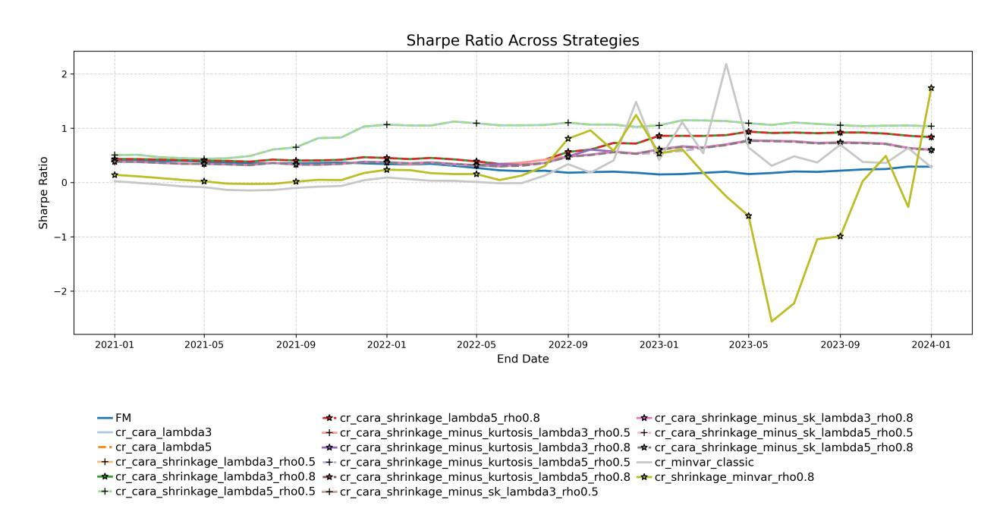

Figure 1: Backtesting – Sharpe Ratio of portfolio strategies using *Size* as the cross-sectional characteristic with portfolios constructed from the top 75 assets sorted by market capitalization, with performance measured across the full sample period.

Because the lines in Figure [1](#page-22-0) are difficult to distinguish, we decompose the figure into four separate panels, each displaying a subset of the strategies. This allows the Sharpe ratio dynamics to be interpreted more clearly and avoids visual overlap among the curves

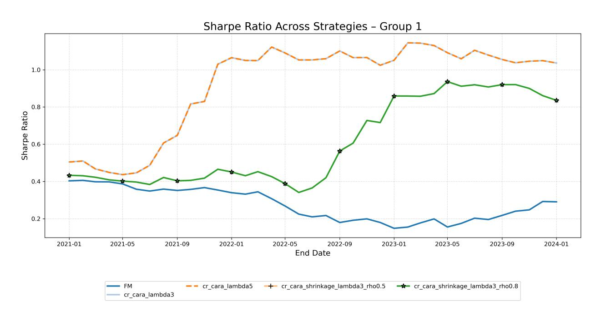

Figure 2: Backtesting – Sharpe Ratio of portfolio strategies using *Size* as the cross-sectional characteristic with portfolios constructed from the top 75 assets sorted by market capitalization, with performance measured across the full sample period.

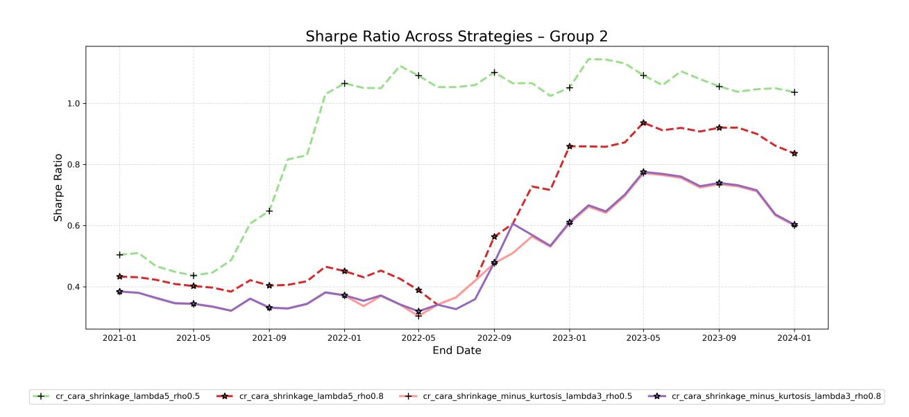

Figure 3: Backtesting – Sharpe Ratio of portfolio strategies using *Size* as the cross-sectional characteristic with portfolios constructed from the top 75 assets sorted by market capitalization, with performance measured across the full sample period.

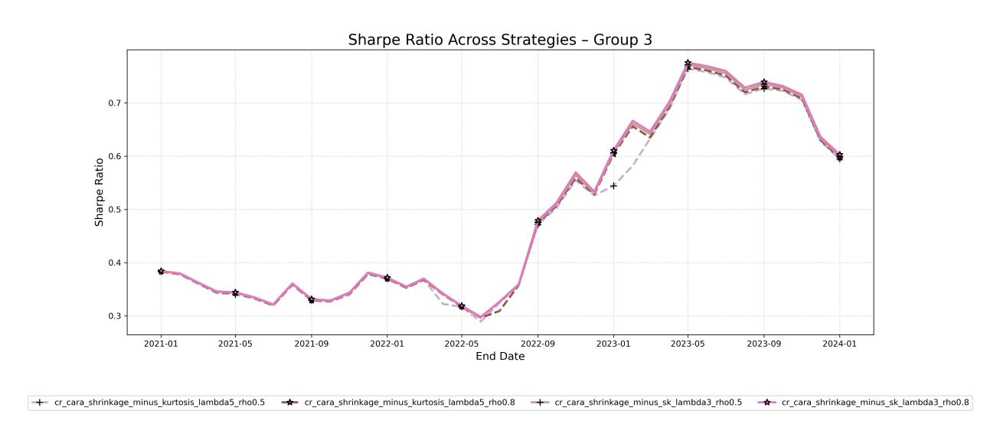

Figure 4: Backtesting – Sharpe Ratio of portfolio strategies using *Size* as the cross-sectional characteristic with portfolios constructed from the top 75 assets sorted by market capitalization, with performance measured across the full sample period.

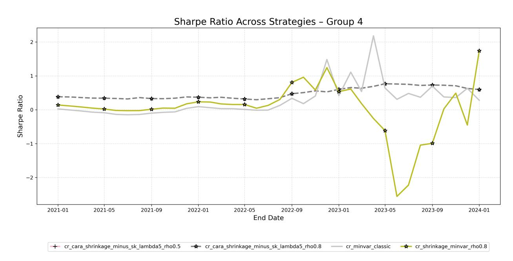

Figure 5: Backtesting – Sharpe Ratio of portfolio strategies using *Size* as the cross-sectional characteristic with portfolios constructed from the top 75 assets sorted by market capitalization, with performance measured across the full sample period.

**Skewness Dynamics** Figure [6](#page-25-0) shows that skewness patterns differ sharply across portfolio specifications, with minimum-variance and shrinkage only benchmarks remaining near zero and offering little downside protection. Introducing CARA utility shifts return distributions toward *positive* skewness, indicating improved resilience to left-tail events and better preservation of upside potential. Strong shrinkage (�� = 0.8) further stabilizes skewness by reducing sensitivity to outliers, while higher risk aversion (�� = 5) produces the smoothest and most consistently positive asymmetry. By contrast, minus-skewness and minus-kurtosis variants flatten the distribution excessively, confirming that direct higher-moment penalization removes beneficial asymmetry and weakens performance.

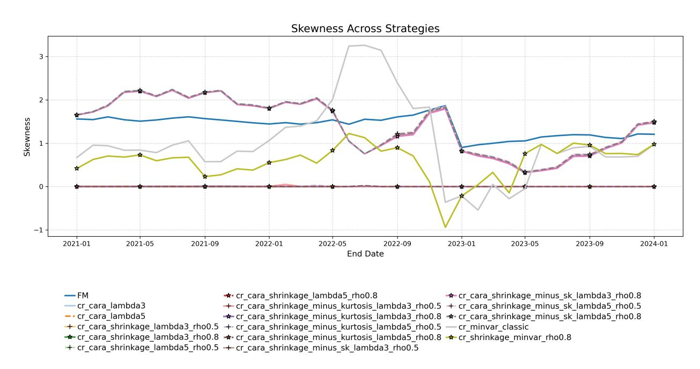

Figure 6: Backtesting – Skewness of portfolio strategies using *Size* as the cross-sectional characteristic with portfolios constructed from the top 75 assets sorted by market capitalization, with performance measured across the full sample period.

Because the lines in Figure [6](#page-25-0) are difficult to distinguish, we decompose the figure into four separate panels, each displaying a subset of the strategies. This allows the Sharpe ratio dynamics to be interpreted more clearly and avoids visual overlap among the curves

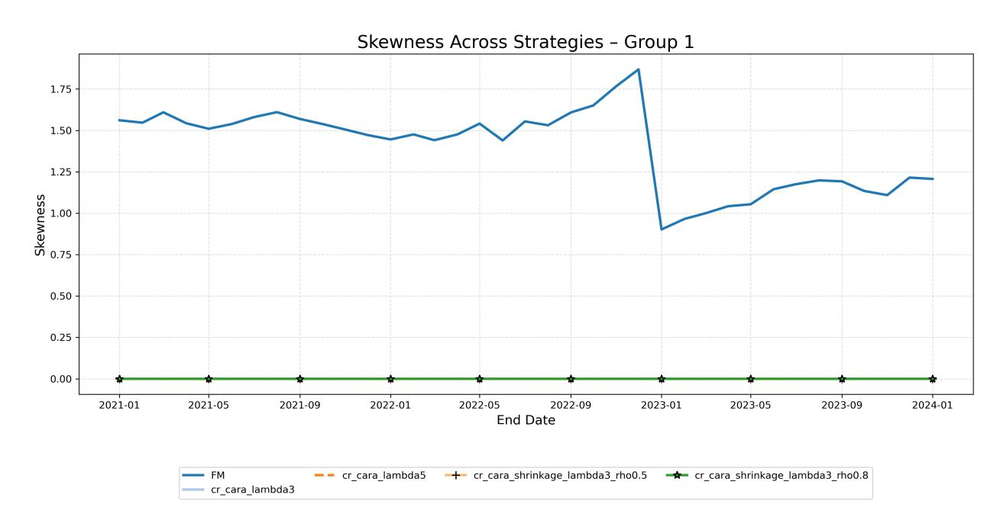

Figure 7: Backtesting – Skewness of portfolio strategies using *Size* as the cross-sectional characteristic with portfolios constructed from the top 75 assets sorted by market capitalization, with performance measured across the full sample period.

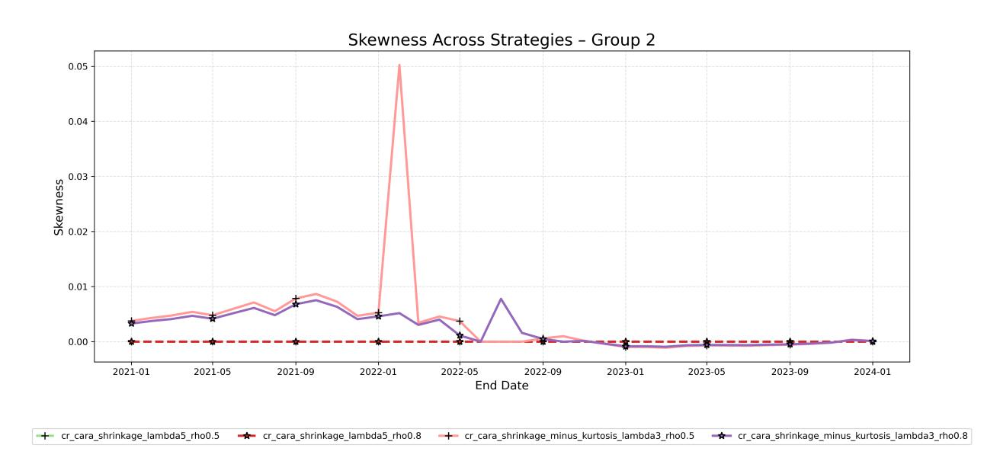

Figure 8: Backtesting – Skewness of portfolio strategies using *Size* as the cross-sectional characteristic with portfolios constructed from the top 75 assets sorted by market capitalization, with performance measured across the full sample period.

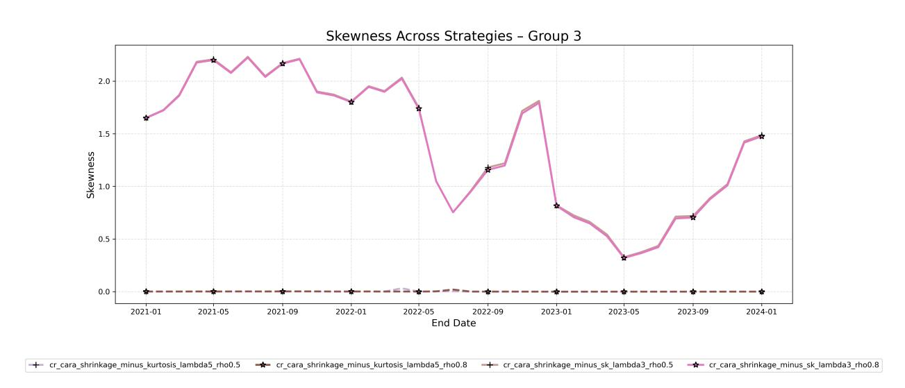

Figure 9: Backtesting – Skewness of portfolio strategies using *Size* as the cross-sectional characteristic with portfolios constructed from the top 75 assets sorted by market capitalization, with performance measured across the full sample period.

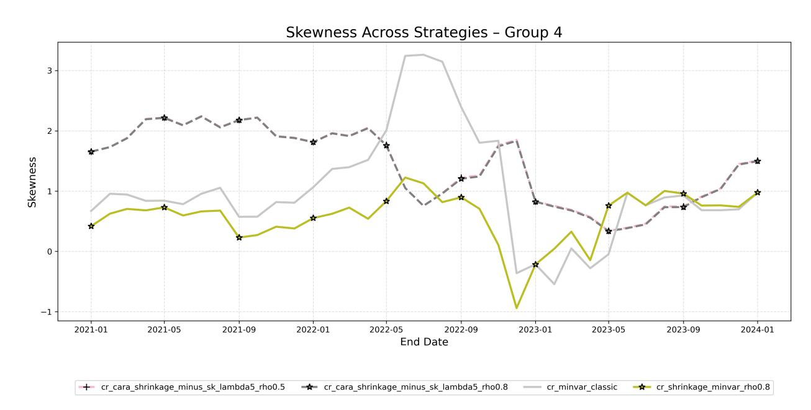

Figure 10: Backtesting – Skewness of portfolio strategies using *Size* as the cross-sectional characteristic with portfolios constructed from the top 75 assets sorted by market capitalization, with performance measured across the full sample period.

**Excess Kurtosis Dynamics** Figure [11](#page-28-0) shows that classical minimumvariance and shrinkage-only portfolios exhibit high and unstable kurtosis, revealing heavy tails and vulnerability to extreme return events. Incorporating CARA utility markedly reduces tail risk, producing lower and more stable kurtosis, with stronger shrinkage (�� = 0.8) further smoothing fluctuations generated by noisy covariance estimates. Higher risk aversion (�� = 5) delivers the most consistent tail control, while lower �� allows occasional kurtosis spikes, indicating greater tolerance for extreme outcomes. The minus-skewness and minus-kurtosis variants behave as expected—overpenalizing higher moments and flattening tails but the most robust and balanced tail-risk profile arises from the CARA shrinkage configuration with (�� = 5, �� = 0.8).

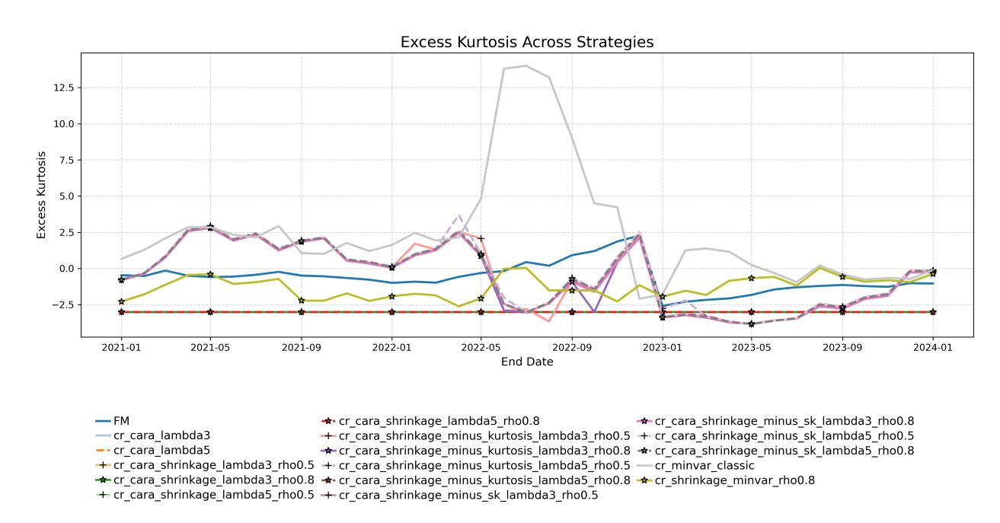

Figure 11: Backtesting - Excess Kurtosis of portfolio strategies using *Size* as the crosssectional characteristic.

Because the lines in Figure [11](#page-28-0) are difficult to distinguish, we decompose the figure into four separate panels, each displaying a subset of the strategies. This allows the Sharpe ratio dynamics to be interpreted more clearly and avoids visual overlap among the curves

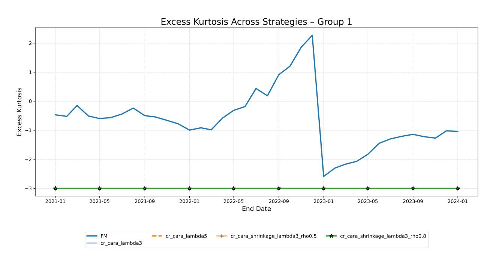

Figure 12: Backtesting - Excess Kurtosis of portfolio strategies using *Size* as the crosssectional characteristic.

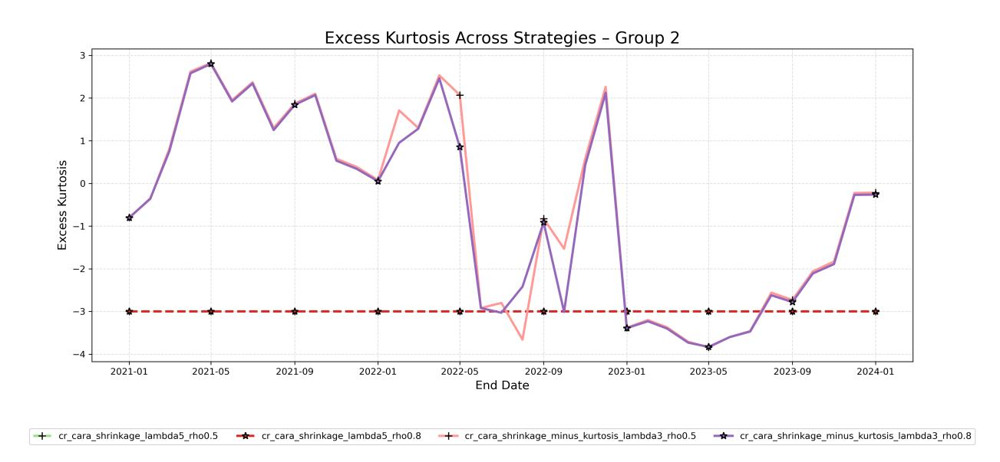

Figure 13: Backtesting - Excess Kurtosis of portfolio strategies using *Size* as the crosssectional characteristic.

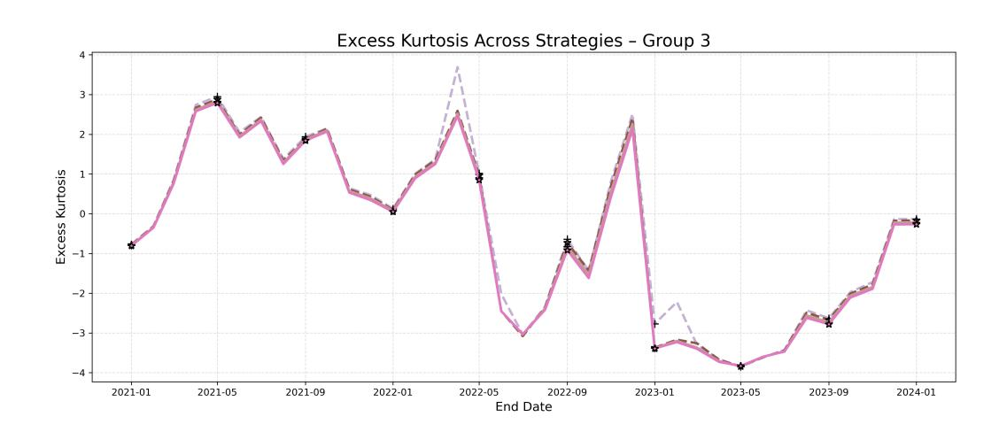

Figure 14: Backtesting - Excess Kurtosis of portfolio strategies using *Size* as the crosssectional characteristic.

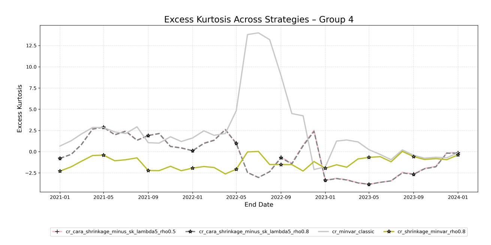

Figure 15: Backtesting - Excess Kurtosis of portfolio strategies using *Size* as the crosssectional characteristic.

**Certainty Equivalent Analysis:** Figure [16](#page-31-0) shows that Certainty Equivalent (CE) outcomes clearly favor models that combine CARA utility with shrinkage regularization. Classical minimum-variance and shrinkage-only portfolios deliver the lowest CE values, as they fail to exploit higher-moment structure or protect against tail risk. Introducing CARA utility improves

welfare markedly, and the strongest performance arises when higher risk aversion (�� = 5) is paired with strong shrinkage (�� = 0.8), producing smooth, persistent, and consistently high CE trajectories. In contrast, the minusskewness and minus-kurtosis variants suppress upside asymmetry and generate unstable utility patterns, confirming that penalizing higher moments directly is less effective than combining economic risk aversion with statistical regularization.

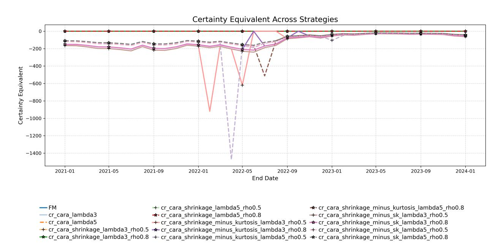

Figure 16: Backtesting – Certainty Equivalent of portfolio strategies using *Size* as the crosssectional characteristic with portfolios constructed from the top 75 assets sorted by market capitalization, with performance measured across the full sample period.

Because the lines in Figure [16](#page-31-0) are difficult to distinguish, we decompose the figure into four separate panels, each displaying a subset of the strategies. This allows the Sharpe ratio dynamics to be interpreted more clearly and avoids visual overlap among the curves

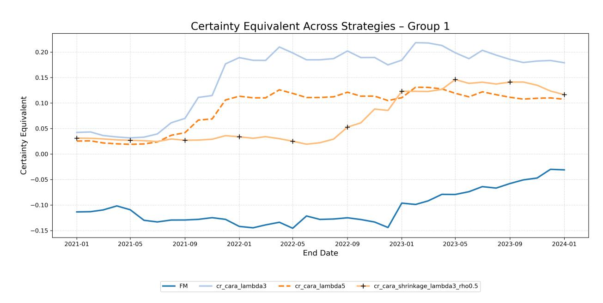

Figure 17: Backtesting – Certainty Equivalent of portfolio strategies using *Size* as the crosssectional characteristic with portfolios constructed from the top 75 assets sorted by market capitalization, with performance measured across the full sample period.

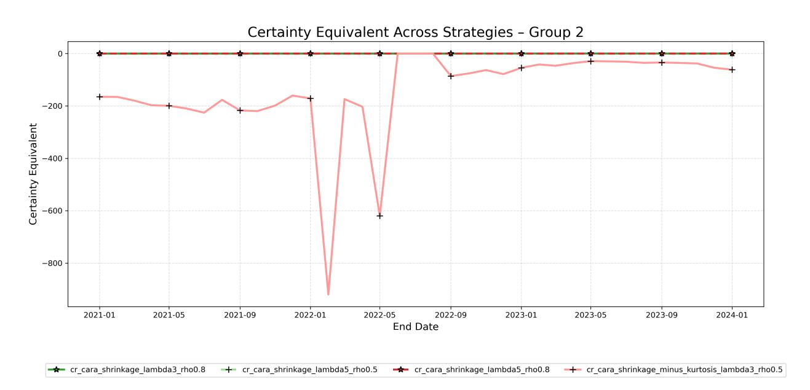

Figure 18: Backtesting – Certainty Equivalentof portfolio strategies using *Size* as the crosssectional characteristic with portfolios constructed from the top 75 assets sorted by market capitalization, with performance measured across the full sample period.

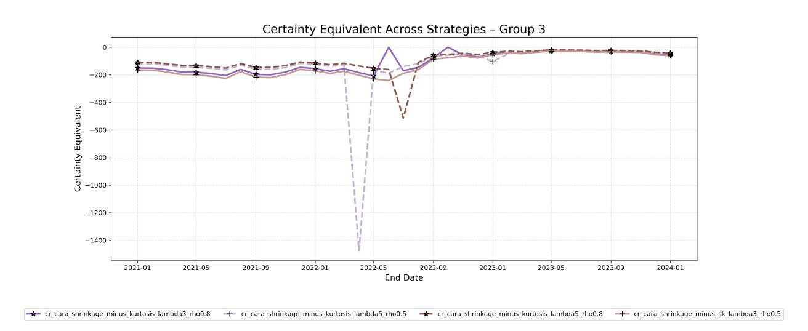

Figure 19: Backtesting – Certainty Equivalentof portfolio strategies using *Size* as the crosssectional characteristic with portfolios constructed from the top 75 assets sorted by market capitalization, with performance measured across the full sample period.

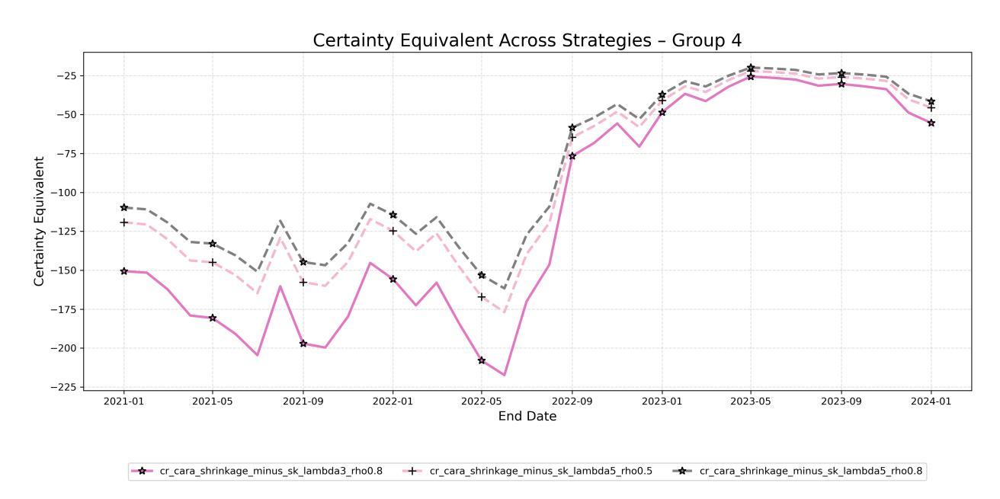

Figure 20: Backtesting – Certainty Equivalentof portfolio strategies using *Size* as the crosssectional characteristic with portfolios constructed from the top 75 assets sorted by market capitalization, with performance measured across the full sample period.

To compare the results and benchmark the performance, we perform three tests. The Jobson-Korkie test is used to statistically compare the Sharpe ratios of two investment strategies. Since the Sharpe ratio combines return and risk into a single performance metric, the test evaluates whether the observed difference between two Sharpe ratios is due to chance or reflects a real difference in risk-adjusted performance. The test accounts for estimation error and sampling variability, and a corrected version (Memmel correction) adjusts for the fact that the two strategies may be correlated or based on overlapping time periods. A significant result from this test indicates that one strategy is statistically superior in terms of Sharpe ratio.

The Diebold-Mariano (DM) test, on the other hand, is designed to compare the forecast accuracy of two models. It does this by examining the difference in loss functions—typically squared forecast errors—between the two models over time. If one model consistently makes better predictions (i.e., lower error), the DM test can detect this and determine whether the difference is statistically significant. It is widely used in time-series forecasting and financial modeling to assess whether one approach produces more reliable or efficient predictions than another. Together, these two tests provide complementary views: the Jobson-Korkie test focuses on realized performance (risk-adjusted return), while the Diebold-Mariano test focuses on predictive performance.

Table2:Sharpe-RatioandForecast-ComparisonTests:FMBenchmarkvs.CARAandShrinkageModels(CryptoSize)

| Model          | Obs | $\lambda$ | $\rho$ | JK SharpeFM | JK SharpeModel | JK Z   | JK p | DM Stat | DM p |
|----------------|-----|-----------|--------|-------------|----------------|--------|------|---------|------|
| CARA           | 37  | 3         |        | 0.28        | 0.92           | -12.26 | 0.00 | 8.79    | 0.00 |
| CARA           | 37  | 5         |        | 0.28        | 0.92           | -12.26 | 0.00 | 10.31   | 0.00 |
| Shrinkage      | 37  | 3         | 0.5    | 0.28        | 0.61           | -6.89  | 0.00 | 6.79    | 0.00 |
| Shrinkage      | 37  | 3         | 0.8    | 0.28        | 0.61           | -6.89  | 0.00 | 6.80    | 0.00 |
| Shrinkage      | 37  | 5         | 0.5    | 0.28        | 0.92           | -12.26 | 0.00 | 10.31   | 0.00 |
| Shrinkage      | 37  | 5         | 0.8    | 0.28        | 0.61           | -6.89  | 0.00 | 10.91   | 0.00 |
| Shrinkage-M4   | 37  | 3         | 0.5    | 0.28        | 0.49           | -5.59  | 0.00 | 8.69    | 0.00 |
| Shrinkage-M4   | 37  | 3         | 0.8    | 0.28        | 0.49           | -5.59  | 0.00 | 24.15   | 0.00 |
| Shrinkage-M4   | 37  | 5         | 0.5    | 0.28        | 0.48           | -5.42  | 0.00 | 5.22    | 0.00 |
| Shrinkage-M4   | 37  | 5         | 0.8    | 0.28        | 0.49           | -5.46  | 0.00 | 15.73   | 0.00 |
| Shrinkage-M3M4 | 37  | 3         | 0.5    | 0.28        | 0.49           | -5.50  | 0.00 | 97.97   | 0.00 |
| Shrinkage-M3M4 | 37  | 3         | 0.8    | 0.28        | 0.49           | -5.52  | 0.00 | 91.67   | 0.00 |
| Shrinkage-M3M4 | 37  | 5         | 0.5    | 0.28        | 0.48           | -5.46  | 0.00 | 135.96  | 0.00 |
| Shrinkage-M3M4 | 37  | 5         | 0.8    | 0.28        | 0.49           | -5.48  | 0.00 | 128.10  | 0.00 |

*Notes:*FM(Fama–MacBeth)servesasthebenchmarkportfolio.JKSharpeFMreportstheSharperatiooftheFMbenchmark,whileJKSharpeModelreportstheSharperatioofthecomparisonmodel.JKZandJKpgivetheJobson–Korkie(1981)teststatisticandp-value,implementedwiththeMemmel(2003)correctionforfinite-sampleSharperatioestimation.DMStatandDMpreporttheDiebold–Marianostatisticandp-valueforpredictiveperformancecomparisonrelativetotheFMbenchmark.M3andM4denoteskewnessandkurtosis,respectively.

The results in Table [2](#page-35-0) show that, when Size is used as the conditioning characteristic in cryptocurrency markets, all CARA-based and shrinkageregularized portfolios substantially outperform the Fama–MacBeth (FM) benchmark in terms of both risk-adjusted performance and predictive accuracy. While the FM Size portfolio delivers a Sharpe ratio of approximately 0.28, the unregularized CARA models with �� = 3 and �� = 5 achieve Sharpe ratios close to 0.92. The Jobson–Korkie tests strongly reject equality of Sharpe ratios in favor of the CARA portfolios, and the Diebold–Mariano statistics indicate that these gains are persistent over time rather than driven by isolated return realizations.

Introducing shrinkage (�� = 0.5 or 0.8) reduces Sharpe ratios to the 0.61 range, reflecting a trade-off between raw performance and robustness to estimation error, yet both the JK and DM tests remain highly significant, indicating continued dominance over the FM benchmark. Portfolios incorporating higher-moment penalties, including kurtosis-only and combined skewness–kurtosis specifications, further reduce Sharpe ratios to approximately 0.48–0.49, but still deliver statistically significant improvements relative to FM. Taken together, these findings indicate that while the FM Size portfolio may be appropriate for cross-sectional pricing exercises, it is highly inefficient from an investor welfare perspective in cryptocurrency markets, and that accounting for estimation risk and higher-order moments yields economically meaningful and statistically robust gains in portfolio performance.

### **5.2 1-Month momentum as Characteristics**

The 1-Month momentum factor exhibits distinct behaviors in equity and cryptocurrency markets due to differences in market efficiency, liquidity, and investor composition. In traditional equity markets, short-term momentum effects, such as those observed over a 1-Month period, are generally weak or even exhibit reversal tendencies. Research by Jegadeesh and Titman [\(1993\)](#page-89-8) shows that while momentum strategies perform well over 3 to 12 months, very short-term momentum (such as 1- to 4-week returns) often results in price corrections rather than continued trends. This reversal effect in equities is driven by liquidity and market frictions, where institutional investors adjust positions gradually, leading to temporary price pressures that normalize over time. Additionally, profit-taking behavior among traders further contributes to these short-term reversals, as investors lock in gains after a rapid price increase. Another contributing factor is the bid-ask bounce effect, where stock prices fluctuate due to short-term liquidity imbalances rather than fundamental value changes. As a result, a 1-Month momentum strategy in equities does not typically generate excess returns and may even show negative performance.

In contrast, cryptocurrencies exhibit strong short-term momentum, including over 1- to 4-week periods. A study by Liu, Tsyvinski, and Wu (2022) finds that a 4-week momentum strategy in the cryptocurrency market produces statistically significant positive returns, with excess weekly returns of approximately 2.2 percent long-short strategies. The momentum effect in crypto is more pronounced compared to equities and persists over much shorter time horizons. Several factors contribute to this difference. First, the cryptocurrency market is heavily retail-driven, meaning that a higher proportion of traders engage in momentum-based strategies, chasing past price performance. Additionally, speculative behavior plays a dominant role in crypto trading, as cryptocurrencies generally lack traditional financial fundamentals, making traders more reliant on market trends and technical indicators. Furthermore, the high volatility inherent in the crypto market reinforces momentum effects, as rapid price increases attract more investors, creating self-reinforcing cycles. Unlike equities, where institutional arbitrageurs often exploit momentum inefficiencies, cryptocurrencies operate in a less efficient environment, allowing short-term trends to persist longer.

Overall, the 1-Month momentum factor highlights a fundamental difference between the two asset classes. In equities, short-term price movements are frequently corrected by institutional activity, liquidity constraints, and profit-taking, leading to weak or negative momentum effects over 4-week periods. Conversely, in the cryptocurrency market, the same short-term momentum generates statistically significant positive returns, fueled by speculative trading, high volatility, and a less efficient market structure. This divergence underscores how cryptocurrency markets are more susceptible to short-term price trends, whereas equities exhibit greater mean reversion and efficiency corrections over similar time frames.

**Sharpe Ratio Dynamics:** Figure [21](#page-39-0) shows that CARA portfolios with moderate risk aversion (�� = 3) deliver the highest Sharpe ratios, consistently outperforming both the FM benchmark and the minimum-variance strategies. Increasing risk aversion to �� = 5 smooths the Sharpe trajectory but reduces performance, reflecting a more conservative allocation that favors stability over return capture. Introducing shrinkage (�� = 0.5) further stabilizes covariance estimates but significantly lowers Sharpe ratios, indicating that excessive regularization dampens useful cross-sectional variation. Overall, the results show that for 1-month momentum in crypto, the most efficient configuration is CARA with moderate risk aversion and minimal shrinkage, balancing responsiveness and risk-adjusted performance.

Because the lines in Figure [21](#page-39-0) are difficult to distinguish, we decompose the figure into four separate panels, each displaying a subset of the strategies. This allows the Sharpe ratio dynamics to be interpreted more clearly and

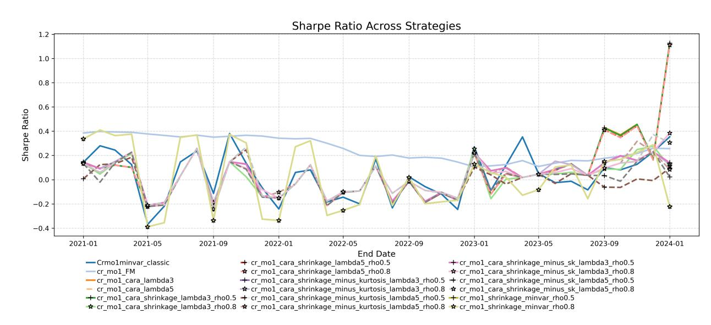

Figure 21: Backtesting - Sharpe Ratio of portfolio strategies using *1-month momentum* as the cross-sectional characteristic for 75 assets sorted by 1 month momentum.

avoids visual overlap among the curves

**Skewness Dynamics:** Figure [26](#page-42-0) shows that CARA portfolios with moderate risk aversion (�� = 3) exhibit consistently positive skewness, indicating desirable right-tail exposure and a tendency toward occasional large gains. Higher risk aversion (�� = 5) produces near-zero skewness, reflecting more conservative allocations that suppress both upside and downside tail events. In contrast, shrinkage-based models—especially �� = 3, �� = 0.5—display strongly negative skewness, revealing excessive regularization that increases vulnerability to downside shocks. Overall, the results show that moderate risk aversion without shrinkage preserves beneficial asymmetry, whereas heavy regularization erodes right-tail potential in crypto momentum portfolios.

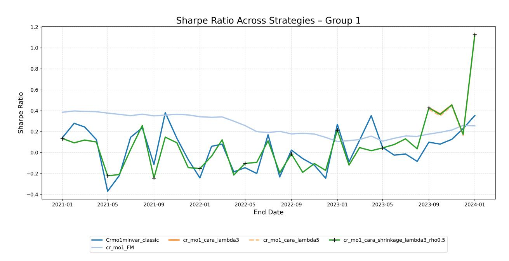

Figure 22: Backtesting - Sharpe Ratio of portfolio strategies using *1-month momentum* as the cross-sectional characteristic for 75 assets sorted by 1 month momentum.

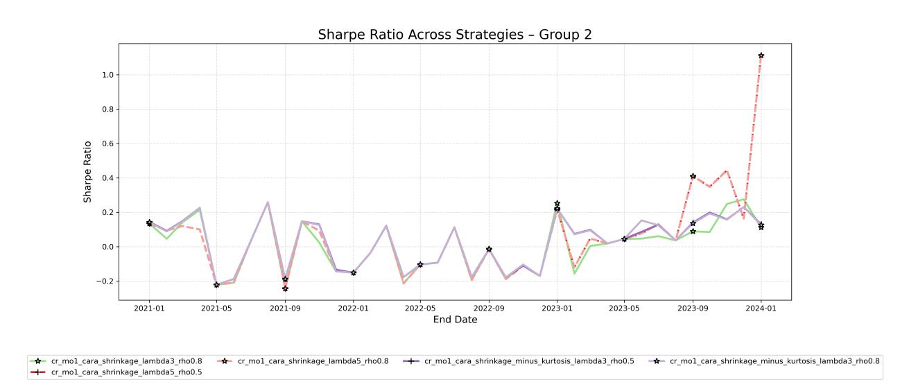

Figure 23: Backtesting - Sharpe Ratio of portfolio strategies using *1-month momentum* as the cross-sectional characteristic for 75 assets sorted by 1 month momentum.

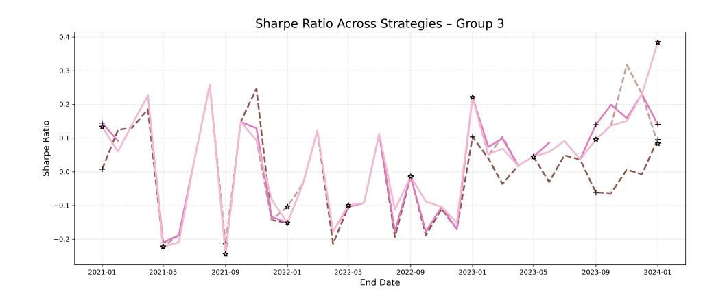

Figure 24: Backtesting - Sharpe Ratio of portfolio strategies using *1-month momentum* as the cross-sectional characteristic for 75 assets sorted by 1 month momentum.

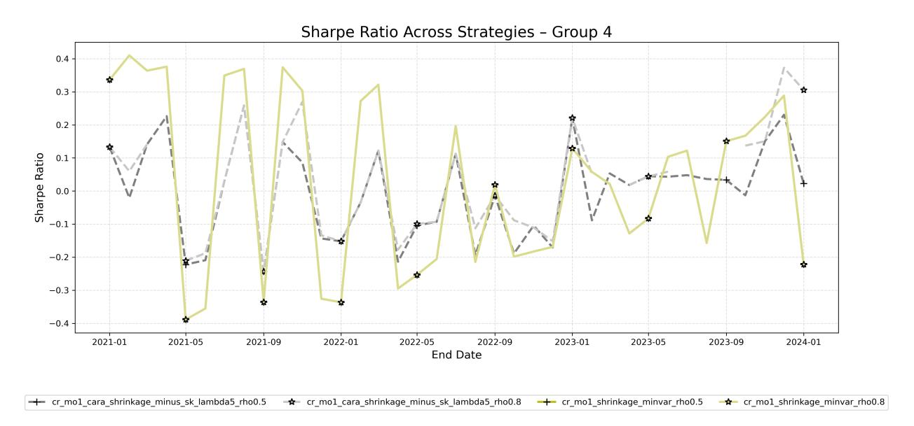

Figure 25: Backtesting - Sharpe Ratio of portfolio strategies using *1-month momentum* as the cross-sectional characteristic for 75 assets sorted by 1 month momentum.

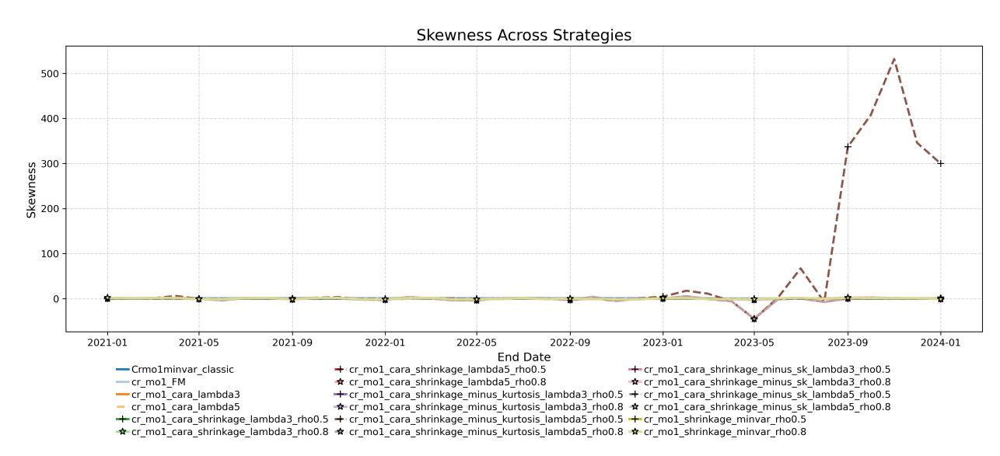

Figure 26: Backtesting - Skewness of portfolio strategies using *1-month momentum* as the cross-sectional characteristic for 75 assets sorted by 1 month momentum.

Because the lines in Figure [26](#page-42-0) are difficult to distinguish, we decompose the figure into four separate panels, each displaying a subset of the strategies. This allows the Sharpe ratio dynamics to be interpreted more clearly and avoids visual overlap among the curves

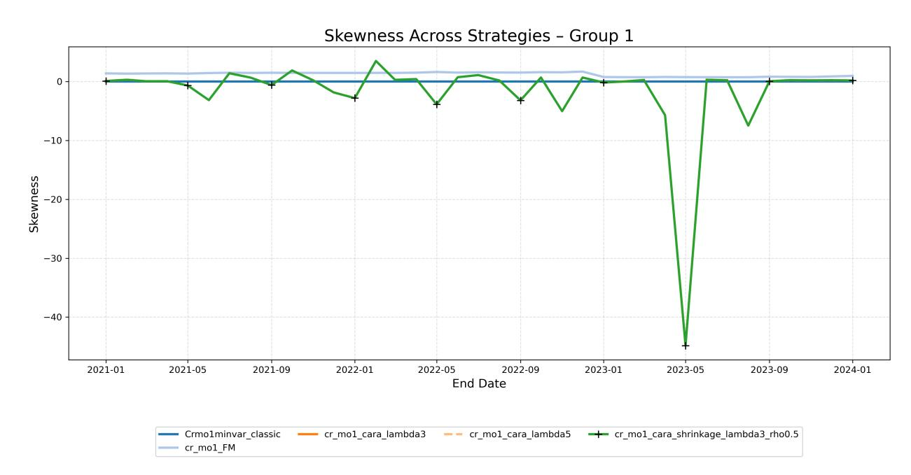

Figure 27: Backtesting - The strategy with the highest average skewness to make the remaining lines clearer in the above chart

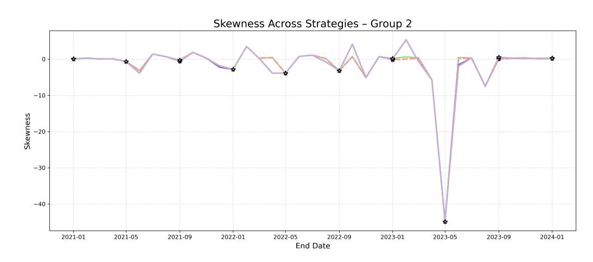

| cr_mo1_cara_shrinkage_lambda3_rho0.8 | cr_mo1_cara_shrinkage_lambda5_rho0.8 | cr_mo1_cara_shrinkage_lambda5_rho0.8 | cr_mo1_cara_shrinkage_minus_kurtosis_lambda3_rho0.5 | cr_mo1_cara_shrinkage_minus_kurtosis_lambda3_rho0.8 |
|--------------------------------------|--------------------------------------|--------------------------------------|-----------------------------------------------------|-----------------------------------------------------|
| cr_mo1_cara_shrinkage_lambda5_rho0.5 |                                      |                                      |                                                     |                                                     |

Figure 28: Backtesting - The strategy with the highest average skewness to make the remaining lines clearer in the above chart

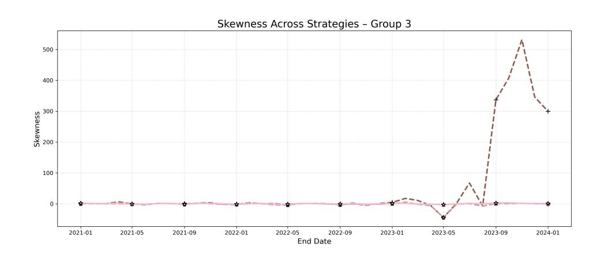

Figure 29: Backtesting - The strategy with the highest average skewness to make the remaining lines clearer in the above chart

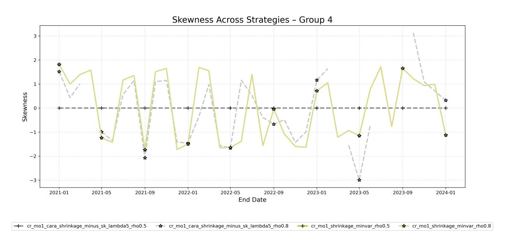

Figure 30: Backtesting - The strategy with the highest average skewness to make the remaining lines clearer in the above chart

**Excess Kurtosis Dynamics:** Figure [31](#page-45-0) shows that CARA portfolios with both moderate and high risk aversion (�� = 3 and 5) maintain relatively moderate kurtosis, indicating controlled tail exposure and fewer extreme return realizations. In contrast, the shrinkage-based CARA model with �� = 3, �� = 0.5 exhibits very high kurtosis, revealing destabilizing fat-tailed behavior driven by over-regularization and concentrated exposures. The FM and minimum-variance strategies show low, near-Gaussian kurtosis, offering stability but limited participation in large market moves. Overall, the results highlight that CARA �� = 3 provides the best balance of tail control and return potential, whereas excessive shrinkage amplifies tail risk in crypto momentum portfolios.

Because the lines in Figure [31](#page-45-0) are difficult to distinguish, we decompose the figure into four separate panels, each displaying a subset of the strategies. This allows the Sharpe ratio dynamics to be interpreted more clearly and avoids visual overlap among the curves

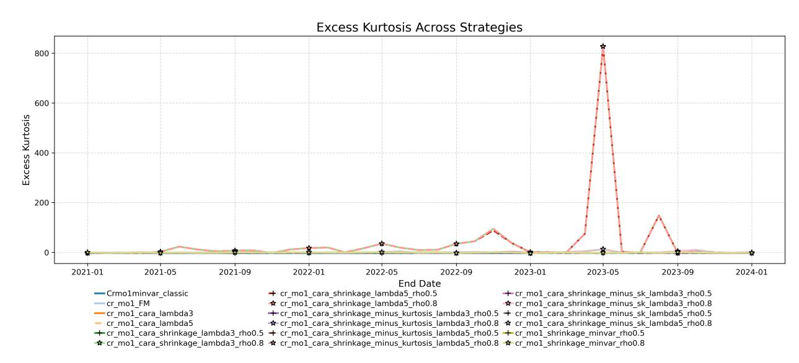

Figure 31: Backtesting - Kurtosis of portfolio strategies using *1-month momentum* as the cross-sectional characteristic for 75 assets sorted by 1 month momentum.

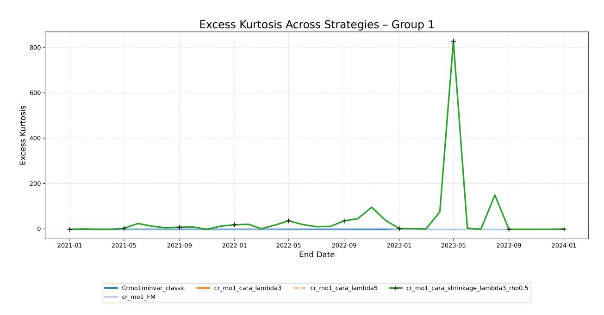

Figure 32: Backtesting - Kurtosis of portfolio strategies using *1-month momentum* as the cross-sectional characteristic for 75 assets sorted by 1 month momentum.

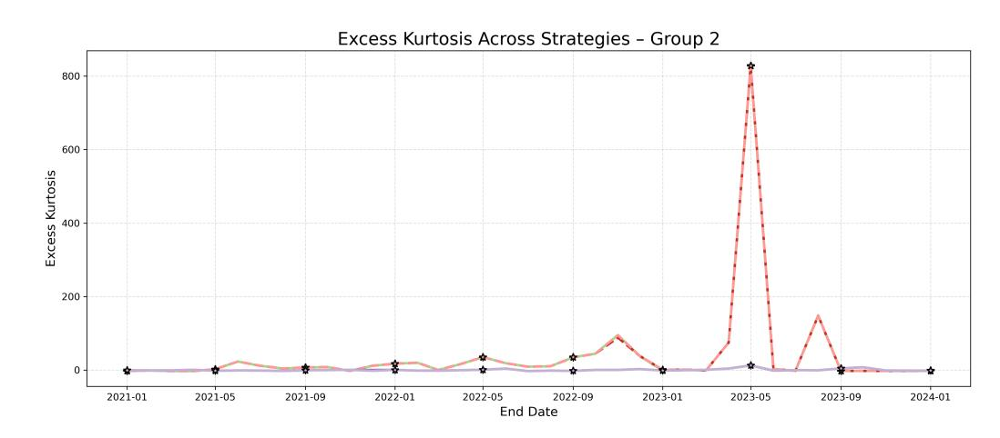

| cr_mo1_cara_shrinkage_lambda3_rho0.8 | cr_mo1_cara_shrinkage_lambda5_rho0.8 | cr_mo1_cara_shrinkage_lambda5_rho0.8 | cr_mo1_cara_shrinkage_minus_kurtosis_lambda3_rho0.5 | cr_mo1_cara_shrinkage_minus_kurtosis_lambda3_rho0.8 |
|--------------------------------------|--------------------------------------|--------------------------------------|-----------------------------------------------------|-----------------------------------------------------|
| cr_mo1_cara_shrinkage_lambda5_rho0.5 |                                      |                                      |                                                     |                                                     |

Figure 33: Backtesting - Kurtosis of portfolio strategies using *1-month momentum* as the cross-sectional characteristic for 75 assets sorted by 1 month momentum.

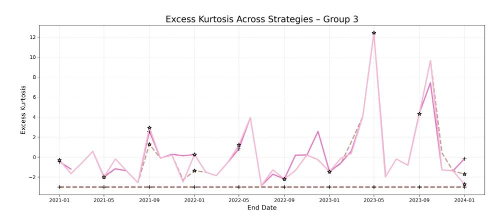

— cr\_mo1\_shrine\_minus\_kutsoi\_lambda\_mo5 — cr\_mo1\_shrine\_minus\_kutsoi\_lambda\_mo5 — cr\_mo1\_shrine\_minus\_kutsoi\_lambda\_mo5

Figure 34: Backtesting - Kurtosis of portfolio strategies using *1-month momentum* as the cross-sectional characteristic for 75 assets sorted by 1 month momentum.

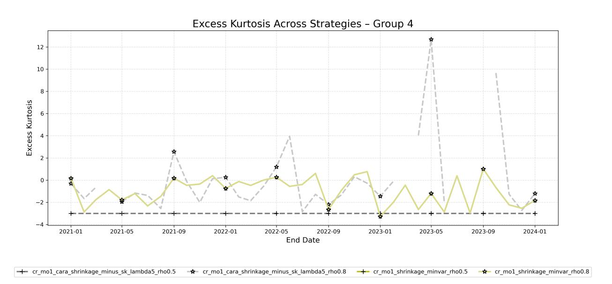

Figure 35: Backtesting - Kurtosis of portfolio strategies using *1-month momentum* as the cross-sectional characteristic for 75 assets sorted by 1 month momentum.

**Certainty Equivalent Analysis** Figure [36](#page-48-0) shows that the CARA �� = 3 portfolio achieves the highest Certainty Equivalent values, indicating that moderate risk aversion provides the most effective balance between return, volatility, and higher-moment exposures. In contrast, the shrinkage-based CARA specification with �� = 3, �� = 0.5 produces the lowest and most unstable CE outcomes, illustrating how excessive regularization suppresses useful cross-sectional variation and reduces investor welfare. The Fama–MacBeth benchmark yields moderate CE levels, while the minimum-variance strategy remains consistently low. Overall, these results demonstrate that moderate risk aversion with minimal shrinkage delivers the strongest utility performance in crypto markets under higher-moment preferences.

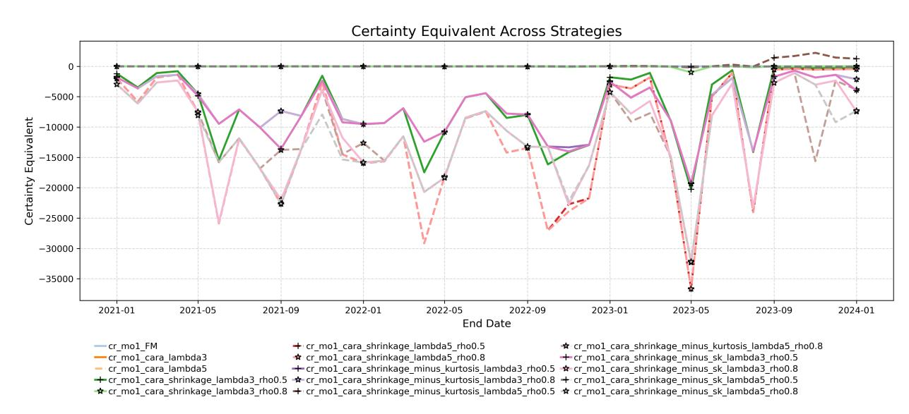

Figure 36: Backtesting - Certainty Equivalent of portfolio strategies using *1-month momentum* as the cross-sectional characteristic for 75 assets sorted by 1 month momentum.

Because the lines in Figure [36](#page-48-0) are difficult to distinguish, we decompose the figure into four separate panels, each displaying a subset of the strategies. This allows the Sharpe ratio dynamics to be interpreted more clearly and avoids visual overlap among the curves

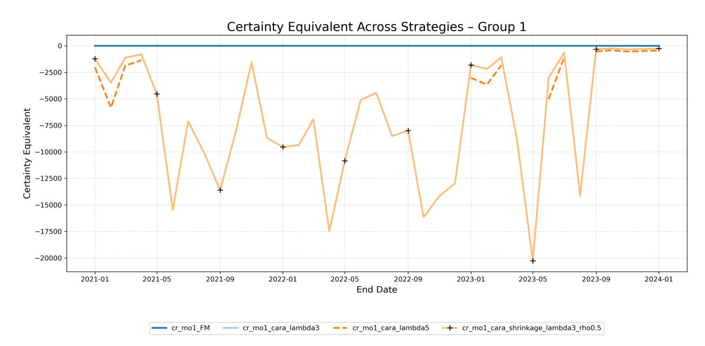

Figure 37: Backtesting - Certainty Equivalent of portfolio strategies using *1-month momentum* as the cross-sectional characteristic for 75 assets sorted by 1 month momentum.

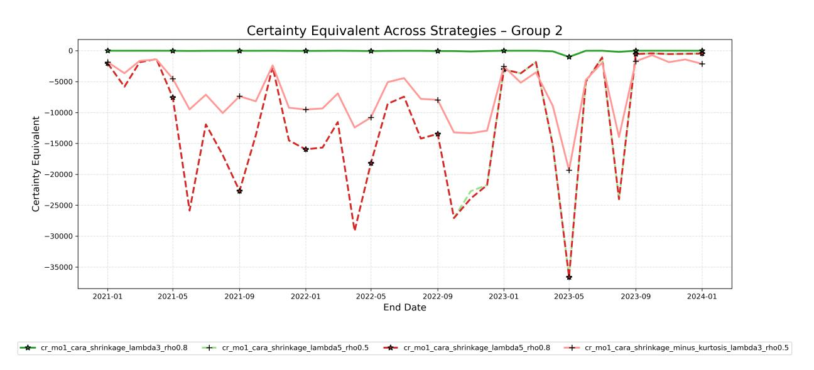

Figure 38: Backtesting - Certainty Equivalent of portfolio strategies using *1-month momentum* as the cross-sectional characteristic for 75 assets sorted by 1 month momentum.

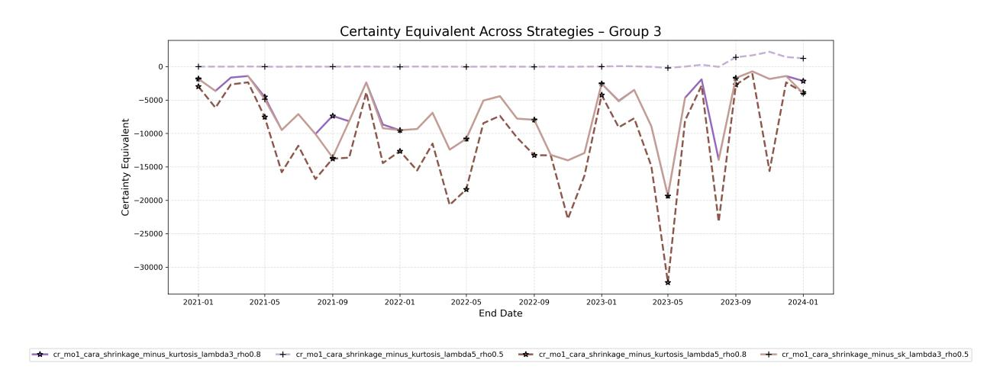

Figure 39: Backtesting - Certainty Equivalent of portfolio strategies using *1-month momentum* as the cross-sectional characteristic for 75 assets sorted by 1 month momentum.

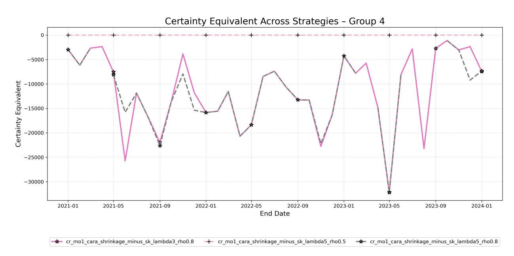

Figure 40: Backtesting - Certainty Equivalent of portfolio strategies using *1-month momentum* as the cross-sectional characteristic for 75 assets sorted by 1 month momentum.

Table3:Sharpe-RatioandForecast-ComparisonTests:FMBenchmarkvs.CARAandShrinkageModels(Crypto1MMomentum)

| Model          | Obs $\lambda$ | $\rho$ | JK SharpeFM | JK SharpeModel | JK Z  | JK p  | DM Stat | DM p |
|----------------|---------------|--------|-------------|----------------|-------|-------|---------|------|
| CARA           | 15            | 3      | 0.25        | 0.23           | 0.18  | 0.85  | 2.24    | 0.03 |
| CARA           | 15            | 5      | 0.25        | 0.23           | 0.25  | 0.80  | 2.22    | 0.03 |
| Shrinkage      | 37            | 3      | 0.5         | 0.26           | 0.06  | 4.31  | 0.00    | 0.40 |
| Shrinkage      | 37            | 3      | 0.8         | 0.26           | 0.01  | 8.34  | 0.00    | 6.90 |
| Shrinkage      | 37            | 5      | 0.5         | 0.26           | 0.06  | 4.41  | 0.00    | 4.34 |
| Shrinkage      | 37            | 5      | 0.8         | 0.26           | 0.06  | 4.41  | 0.00    | 4.33 |
| Shrinkage-M4   | 37            | 3      | 0.5         | 0.26           | 0.03  | 7.68  | 0.00    | 5.17 |
| Shrinkage-M4   | 37            | 3      | 0.8         | 0.26           | 0.03  | 7.58  | 0.00    | 5.25 |
| Shrinkage-M4   | 37            | 5      | 0.5         | 0.26           | -0.01 | 10.47 | 0.00    | 6.90 |
| Shrinkage-M4   | 37            | 5      | 0.8         | 0.26           | 0.03  | 7.74  | 0.00    | 4.01 |
| Shrinkage-M3M4 | 35            | 3      | 0.5         | 0.26           | 0.02  | 7.49  | 0.00    | 4.68 |
| Shrinkage-M3M4 | 37            | 3      | 0.8         | 0.26           | 0.03  | 7.50  | 0.00    | 4.03 |
| Shrinkage-M3M4 | 37            | 5      | 0.5         | 0.26           | 0.00  | 9.07  | 0.00    | 6.90 |
| Shrinkage-M3M4 | 33            | 5      | 0.8         | 0.26           | 0.03  | 7.08  | 0.00    | 4.53 |

*Notes:*FM(FamaandMacBeth)servesasthebenchmarkportfolio.JKSharpeFMreportstheSharperatiooftheFMbenchmark,whileJKSharpeModelreportstheSharperatioofthecomparisonmodel.JKZandJKpgivetheJobson–Korkie(1981)teststatisticandp-value,implementedwiththeMemmel(2003)correctionforfinite-sampleSharperatioestimation.DMStatandDMpreporttheDiebold–Marianostatisticandp-valueforpredictiveperformancecomparisonrelativetotheFMbenchmark.M3andM4denoteskewnessandkurtosis,respectively.

The results in Table [3](#page-51-0) indicate that, when one-month momentum is used as the conditioning characteristic in cryptocurrency markets, the Fama–MacBeth (FM) benchmark generally dominates CARA-based and shrinkage-regularized portfolios in terms of risk-adjusted performance. The FM momentum portfolio exhibits a Sharpe ratio of approximately 0.25–0.26, whereas the CARA portfolios achieve slightly lower Sharpe ratios around 0.23. Consistent with this observation, the Jobson–Korkie tests fail to reject equality of Sharpe ratios for the CARA specifications, while the positive JK ��-statistics for all shrinkage and higher-moment models indicate statistically significant Sharpe underperformance relative to the FM benchmark.

Despite this Sharpe-ratio dominance, the Diebold–Mariano statistics are positive and statistically significant across most specifications, suggesting that several CARA and shrinkage-based portfolios deliver more favorable performance in the chosen loss metric over time. This divergence highlights an important distinction between average risk-adjusted efficiency and timeseries performance stability: while momentum-sorted FM portfolios remain difficult to outperform in terms of Sharpe ratio in cryptocurrency markets, utility-based and regularized strategies may still offer improvements in certain dimensions of predictive performance. Overall, these findings suggest that, unlike Size, momentum information in crypto markets is most effectively captured through traditional characteristic-sorted portfolios, and that higher-moment optimization does not translate into Sharpe-ratio gains in this setting, even though it may affect other aspects of portfolio performance.

A comparative analysis of one-month momentum– and Size-conditioned strategies highlights important differences in the reliability of short-horizon return signals within a higher-moment portfolio optimization framework. Size-based strategies, particularly those constructed using CARA utility with or without shrinkage (e.g., �� = 5), consistently deliver superior riskadjusted performance and positive investor welfare, with Sharpe ratios exceeding 0.60 in several specifications. These results suggest that Size captures economically meaningful cross-sectional structure in cryptocurrency markets, plausibly linked to liquidity, speculative intensity, and network growth, and that this information can be effectively exploited within utilitybased portfolio constructions. In contrast, strategies conditioned on onemonth momentum exhibit substantially weaker performance, with Sharpe ratios generally below those of the FM benchmark and limited gains from incorporating higher-order moments. Penalizing skewness or kurtosis further reduces risk-adjusted performance, indicating that short-term momentum signals in crypto are fragile and easily overwhelmed by noise, reversals, and liquidity shocks.

An examination of portfolio weights across one-month momentum strategies reveals a pronounced concentration of capital, with a small subset of assets accounting for a large share of portfolio exposure across all specifications. Portfolios optimized under CARA utility with shrinkage and highermoment penalties exhibit particularly high concentration, reflecting the tendency of short-horizon momentum signals to favor a few tokens with recent extreme price movements. Although skewness-penalized strategies display marginally greater diversification, they remain heavily tilted toward dominant assets, leaving portfolios vulnerable to idiosyncratic shocks. This concentration amplifies volatility and undermines investor welfare, contributing to the weak Certainty Equivalent outcomes observed for momentum-based portfolios. Overall, these findings underscore the empirical fragility of shortterm momentum in cryptocurrency markets and contrast sharply with the robustness of Size as a conditioning characteristic capable of supporting more stable, diversified, and utility-enhancing portfolio allocations.

### **5.3 Factors Specific to Cryptocurrency Markets**

Cryptocurrency markets exhibit unique risk factors that differentiate them from traditional asset classes such as equities, bonds, and commodities. Unlike equities, which derive their value from financial fundamentals like earnings, dividends, and book value, cryptocurrencies are largely driven by network adoption, investor sentiment, liquidity conditions, and regulatory risks. One of the most important factors in cryptocurrency pricing is network activity and adoption, where metrics such as the number of active addresses, transaction volume, and hash rate (for proof-of-work coins like Bitcoin) serve as indicators of a cryptocurrency's real-world usage and utility. Higher network activity often correlates with higher valuations, as broader adoption increases a cryptocurrency's demand and perceived legitimacy.

Liquidity and trading frictions also play a crucial role in cryptocurrency asset pricing. Unlike equity markets, where liquidity is relatively stable, crypto markets experience frequent liquidity constraints due to fragmented trading across multiple exchanges, large bid-ask spreads, and reliance on stablecoins for trading. Many cryptocurrencies face price fragmentation across different exchanges, creating arbitrage opportunities that can distort pricing. Moreover, exchange-specific liquidity risks arise from differences in trading volumes, with certain exchanges inflating their reported volume, making it difficult to assess true liquidity. The presence of stablecoins, such as USDT and USDC, also affects market stability, as their liquidity influences the overall depth of crypto trading pairs.

sentiment, which play a far greater role than in equities. Because cryptocurrencies lack intrinsic valuation metrics like earnings or cash flows, their prices are often dictated by market psychology and speculative behavior. Google search trends, social media activity (such as *Twitter* and *Reddit* discussions), and media coverage can drive significant price movements. Meme-driven speculation, as seen with *Dogecoin* and *Shiba Inu*, underscores the impact of retail investor sentiment. Additionally, sentiment indices such as the *Crypto Fear & Greed Index* provide signals for potential market reversals, as extreme fear or greed often precedes price corrections.

Cryptocurrency pricing is also shaped by tokenomics and supply dynamics, which differ significantly from traditional stock markets. Unlike stocks, where supply remains relatively stable except for buybacks or new issuances, many cryptocurrencies have mechanisms like fixed supply caps, staking rewards, and token burns that directly affect their valuation. Bitcoin, for example, benefits from a scarcity premium due to its fixed supply of 21 million coins, whereas inflationary cryptocurrencies may experience different price dynamics. Staking mechanisms in Proof-of-Stake (PoS) cryptocurrencies, such as Ethereum, incentivize long-term holding by offering staking rewards, reducing the available circulating supply. Some cryptocurrencies, like Binance Coin (BNB), implement token burn mechanisms, where tokens are permanently removed from circulation, potentially increasing scarcity and price appreciation.

Another defining feature of crypto markets is their extreme volatility and market cycles. Unlike equities, which experience relatively stable volatility with sectoral diversification, cryptocurrencies are highly correlated with each other and exhibit frequent price swings. Leverage in crypto derivatives markets often exacerbates these price movements, leading to cascading liquidations when overleveraged traders are forced to sell due to margin calls. Flash crashes and price manipulation are more common in crypto than in traditional markets due to lower regulatory oversight and the dominance of retail traders. Furthermore, Bitcoin dominance, which represents Bitcoin's share of the total crypto market capitalization, often dictates the performance of altcoins. When Bitcoin dominance rises, altcoins tend to underperform, and vice versa, making it a crucial factor for cross-sectional asset pricing in crypto.

Regulatory and policy uncertainty introduces another layer of complexity to cryptocurrency asset pricing. Unlike equities, which operate under well-established regulatory frameworks, cryptocurrencies face constant uncertainty regarding their legal status. Government actions, such as China's crackdown on Bitcoin mining or the SEC's classification of certain tokens as securities, can cause sudden and severe price volatility. The potential for stablecoin regulation is another concern, as stablecoins like USDT play a critical role in crypto trading liquidity. Legal battles, such as SEC vs. Ripple (XRP), highlight the risks associated with token classification, as a negative regulatory ruling can significantly impact a cryptocurrency's price and liquidity.

Lastly, crypto investors face exchange and custody risks that are not present in traditional equity markets. Unlike equities, which benefit from investor protections such as SIPC insurance, crypto assets are often stored in self-custodied wallets or centralized exchanges, both of which carry risks. Centralized Exchange (CEX) failures, such as the collapse of FTX in 2022, have resulted in billions of dollars in losses for investors. Decentralized exchanges (DEXs), while eliminating counterparty risk, introduce smart contract vulnerabilities and liquidity constraints that can impact asset pricing. Furthermore, the loss of private keys or theft due to hacking can lead to permanent asset loss, further increasing the risks associated with crypto custody.

factors that distinguish them from traditional financial markets. Network adoption, liquidity frictions, investor sentiment, tokenomics, regulatory uncertainty, and exchange risks all play a critical role in determining cryptocurrency prices. Unlike equities, where pricing is based on corporate fundamentals and macroeconomic conditions, cryptocurrencies are more susceptible to speculative trading, behavioral influences, and technological developments. As the market matures, some of these factors may become more stable, but for now, they remain key drivers of cross-sectional differences in crypto asset pricing.

# **Circulating supply and Inflation rate to form Tokenomicsbased factor**

Using Tokenomics as a factor in cryptocurrency portfolio construction is motivated by the unique economic and structural features of digital assets that distinguish them from traditional equities. Unlike stocks, which are backed by firms with cash flows and earnings, crypto tokens derive much of their value from protocol design, supply mechanisms, and incentive structures—collectively referred to as tokenomics. These attributes directly impact investor expectations about scarcity, inflation, governance, and utility, which in turn influence prices and return dynamics.

Traditional factors such as Size or Momentum are inherently marketbased and backward-looking: Size proxies for market capitalization and Momentum reflects recent price trends. In contrast, Tokenomics is a forwardlooking and structural characteristic. It includes information such as maximum supply caps (e.g., Bitcoin), inflation rates (e.g., Ethereum's shift to deflationary supply post-merge), staking rewards, burn mechanisms, token distribution schedules, and governance rights. These elements shape the long-term incentive compatibility of participants in the ecosystem and are exogenous to short-term market fluctuations.

By incorporating Tokenomics into portfolio optimization, we aim to capture a cross-sectional risk premium that reflects these design-level fundamentals. Empirically, as shown in our results, portfolios constrained by Tokenomics exposure tend to show greater persistence in weight allocation, lower turnover, and more stable Sharpe ratios. This suggests that Tokenomics is not only a theoretically grounded factor but also a practically effective dimension for explaining and forecasting crypto returns. Moreover, it opens a pathway for factor-based investing tailored to the digital asset space, where traditional asset pricing models fall short due to the lack of fundamental cash flow anchors.

To explore the pricing power of token-level fundamentals in cryptocurrency markets, we construct dynamic portfolios using a Tokenomics-based selection rule and optimize them using higher-moment utility functions. Our analysis begins by identifying the top 100 cryptocurrencies each month based on their Tokenomics score—a composite measure that reflects supply discipline, issuance structure, and relative standing in the market. This score serves as a crypto analog to equity market characteristics such as value, quality, or investment in asset pricing literature. We use a 60-month rolling window of monthly excess returns to estimate the statistical moments of asset returns, including the mean, covariance, co-skewness, and co-kurtosis.

**Sharpe Ratio Dynamics:** Figure [41](#page-59-0) shows that Sharpe ratios vary sharply across higher-moment CARA models, shrinkage-regularized variants, and the FM and minimum-variance benchmarks. Among the CARA specifications, �� = 3 delivers the strongest and most responsive Sharpe ratios, indicating that moderate risk aversion provides the most efficient tradeoff between return potential and volatility control. Higher risk aversion (�� = 5) produces smoother but consistently lower Sharpe ratios, reflecting a conservative tilt that sacrifices upside participation. Shrinkage regularization reduces Sharpe ratios further and introduces additional volatility, showing that overly strong regularization can suppress genuine crypto return signals despite improving estimation stability. In comparison, the FM benchmark achieves higher and more stable Sharpe ratios than most CARA variants, while minimum-variance portfolios remain steady but yield the lowest risk-adjusted performance.

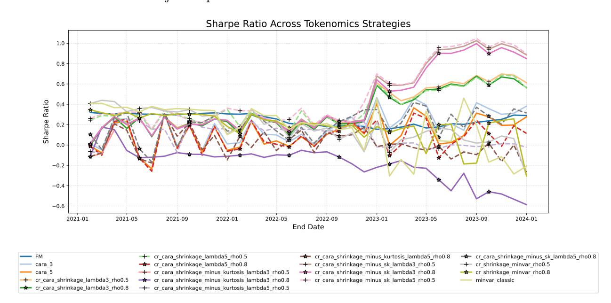

Figure 41: Backtesting - Sharpe Ratio of portfolio strategies using *Tokenomics* as the crosssectional characteristic for 75 assets sorted by Tokenomics.

Since the lines in Figure [41](#page-59-0) are difficult to distinguish, we decompose the figure into four separate panels, each displaying a subset of the strategies. This allows the Sharpe ratio dynamics to be interpreted more clearly and avoids visual overlap among the curves.

**Skewness Dynamics** Figure [46](#page-62-0) shows that portfolio skewness varies systematically across CARA, shrinkage-adjusted, and benchmark models, highlighting how each framework handles asymmetry in cryptocurrency re-

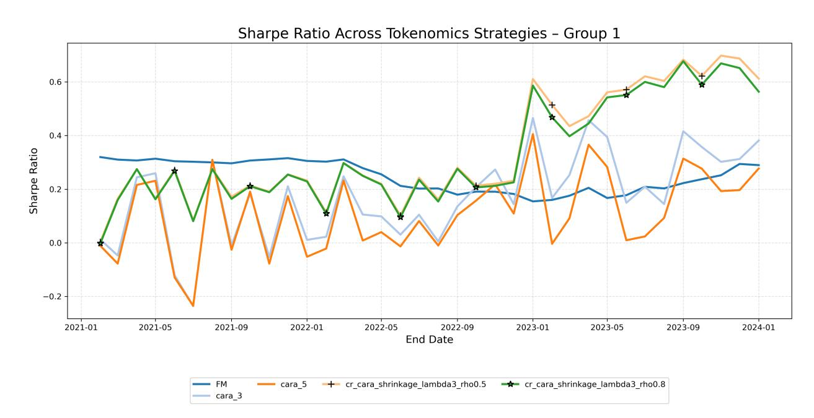

Figure 42: Backtesting - Sharpe Ratio of portfolio strategies using *Tokenomics* as the crosssectional characteristic for 75 assets sorted by Tokenomics.

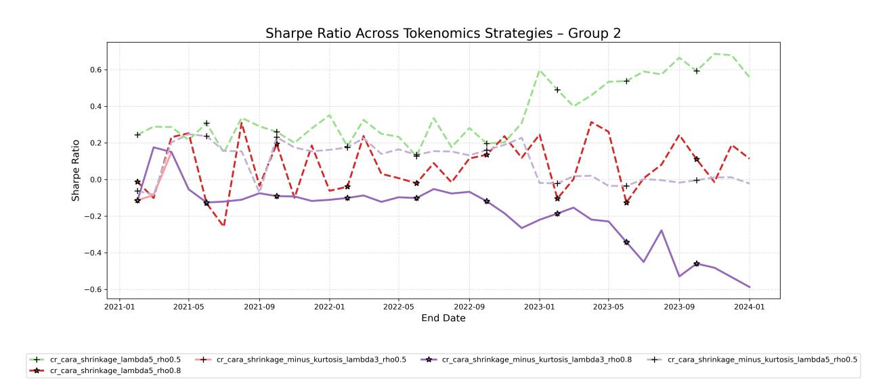

Figure 43: Backtesting - Sharpe Ratio of portfolio strategies using *Tokenomics* as the crosssectional characteristic for 75 assets sorted by Tokenomics.

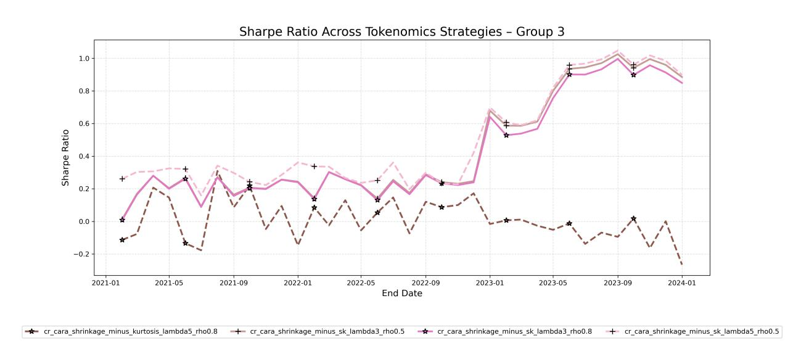

Figure 44: Backtesting - Sharpe Ratio of portfolio strategies using *Tokenomics* as the crosssectional characteristic for 75 assets sorted by Tokenomics.

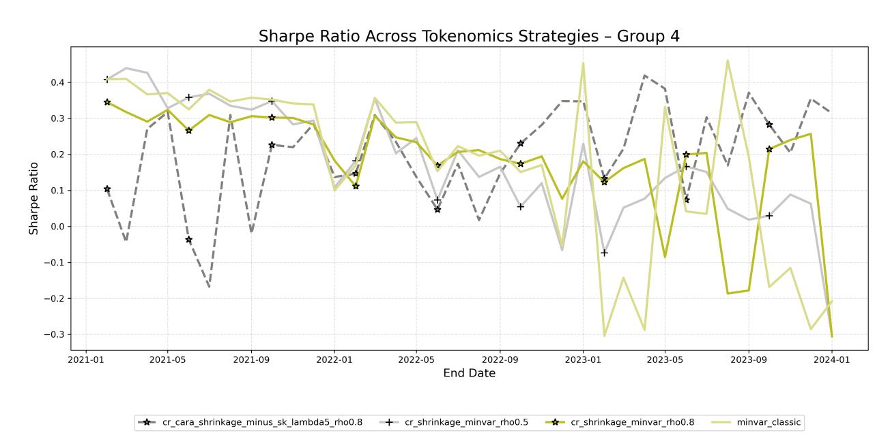

Figure 45: Backtesting - Sharpe Ratio of portfolio strategies using *Tokenomics* as the crosssectional characteristic for 75 assets sorted by Tokenomics.

turns. The CARA model with moderate risk aversion (�� = 3) consistently generates mildly positive skewness, indicating that it captures occasional large upside moves while maintaining controlled downside exposure. Increasing risk aversion to �� = 5 reduces or even reverses skewness, reflecting a more conservative positioning that sacrifices participation in high-return outliers. Shrinkage-regularized CARA models, especially with �� = 0.5, exhibit lower and more unstable skewness profiles, as strong regularization suppresses differentiation across assets and dampens right-tail opportunities. In contrast, the Fama–MacBeth (FM) and minimum-variance benchmarks display nearzero or slightly negative skewness, confirming that models not optimizing over higher moments produce more symmetric but less opportunistic return distributions.

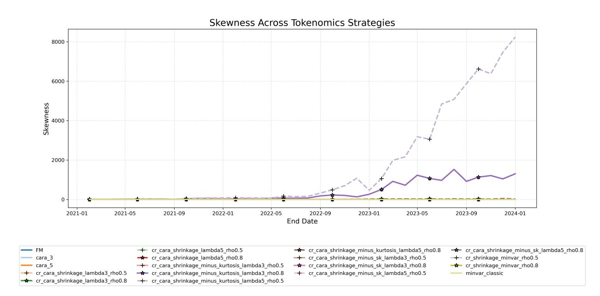

Figure 46: Backtesting - Skewness of portfolio strategies using *Tokenomics* as the crosssectional characteristic for 75 assets sorted by Tokenomics

Since the lines in Figure [46](#page-62-0) are difficult to distinguish, we decompose the figure into four separate panels, each displaying a subset of the strategies. This allows the Sharpe ratio dynamics to be interpreted more clearly and avoids visual overlap among the curves.

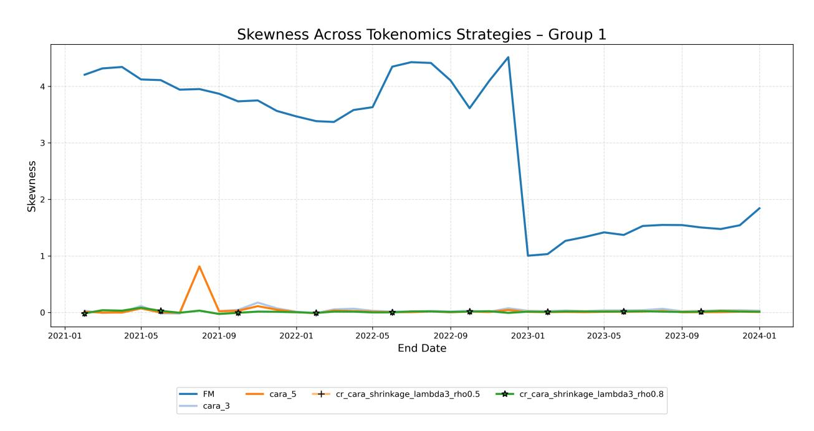

Figure 47: Backtesting - Skewness of portfolio strategies using *Tokenomics* as the crosssectional characteristic for 75 assets sorted by Tokenomics

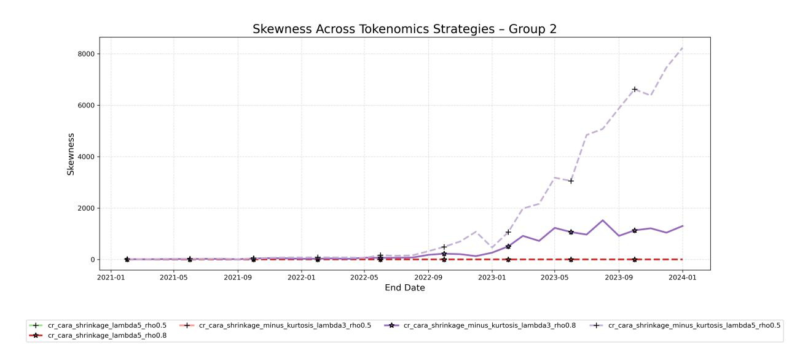

Figure 48: Backtesting - Skewness of portfolio strategies using *Tokenomics* as the crosssectional characteristic for 75 assets sorted by Tokenomics

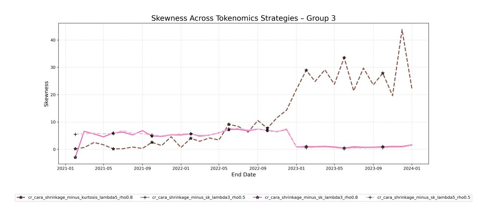

Figure 49: Backtesting - Skewness of portfolio strategies using *Tokenomics* as the crosssectional characteristic for 75 assets sorted by Tokenomics

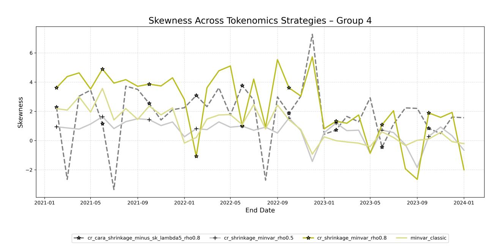

Figure 50: Backtesting - Skewness of portfolio strategies using *Tokenomics* as the crosssectional characteristic for 75 assets sorted by Tokenomics

**Excess Kurtosis Dynamics:** Figure [51](#page-65-0) shows that kurtosis varies meaningfully across portfolio strategies, revealing how each model responds to the extreme tail behavior characteristic of cryptocurrency returns. The CARA portfolios with moderate risk aversion (�� = 3) display moderately elevated kurtosis, indicating controlled exposure to tail events without excessive concentration in extreme outcomes. Higher risk aversion (�� = 5) lowers kurtosis substantially, reflecting a conservative allocation that suppresses extreme-return assets and generates smoother distributions. Shrinkageregularized CARA models, especially with �� = 0.5, further dampen kurtosis and produce more stable tail behavior, though at the cost of reduced responsiveness to sharp market rebounds. In contrast, the Fama–MacBeth (FM) and minimum-variance benchmarks tend to exhibit either higher or very low kurtosis, highlighting that models not explicitly incorporating higher moments either overreact to or completely avoid extreme outcomes, resulting in less balanced tail-risk management.

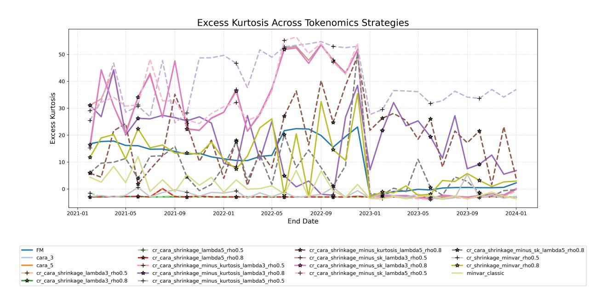

Figure 51: Kurtosis of cryptocurrency portfolio strategies, January 2021 – January 2024. The figure reports rolling kurtosis estimates for classical CARA, shrinkage-based CARA, and minimum variance strategies. Higher-moment CARA portfolios exhibit extreme tail risk, while shrinkage-minvar and classical CARA remain more stable.

Because the lines in Figure [51](#page-65-0) are difficult to distinguish, we decompose the figure into four separate panels, each displaying a subset of the strategies. This allows the Sharpe ratio dynamics to be interpreted more clearly and avoids visual overlap among the curves.

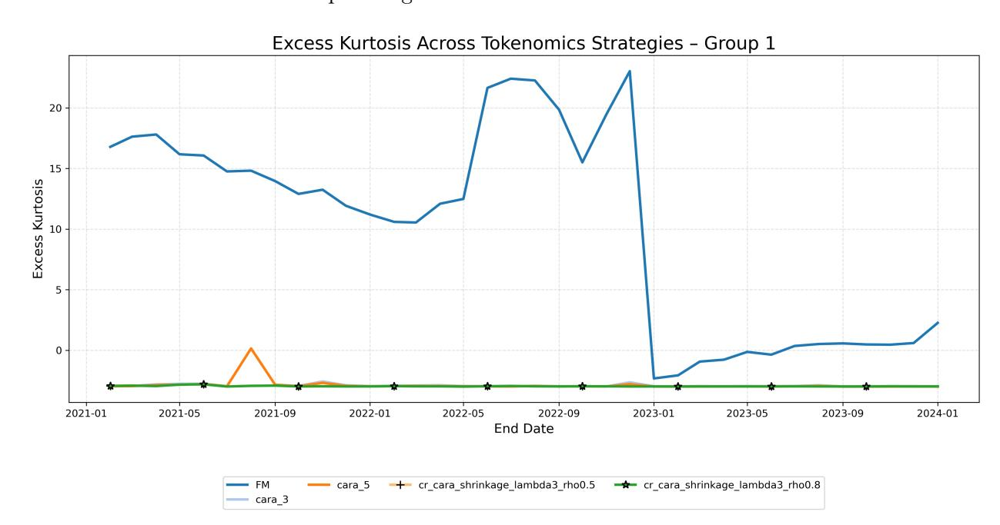

Figure 52: Kurtosis of cryptocurrency portfolio strategies, January 2021 – January 2024. The figure reports rolling kurtosis estimates for classical CARA, shrinkage-based CARA, and minimum variance strategies. Higher-moment CARA portfolios exhibit extreme tail risk, while shrinkage-minvar and classical CARA remain more stable.

**Certainty Equivalent Analysis:** Figure [56](#page-69-0) shows that Certainty Equivalent Returns (CR) vary sharply across portfolio strategies, revealing how each model converts risk and higher-moment dynamics into investor utility. CARA portfolios with moderate risk aversion (�� = 3) consistently achieve the highest CR values, indicating that this configuration strikes an efficient balance between expected returns and volatility while remaining responsive to alpha opportunities. Increasing risk aversion to �� = 5 produces smoother but lower CR paths, reflecting a conservative posture that limits downside exposure at the cost of reduced upside participation. Shrinkage regularization (�� = 0.5) further lowers CR by improving estimation stability while

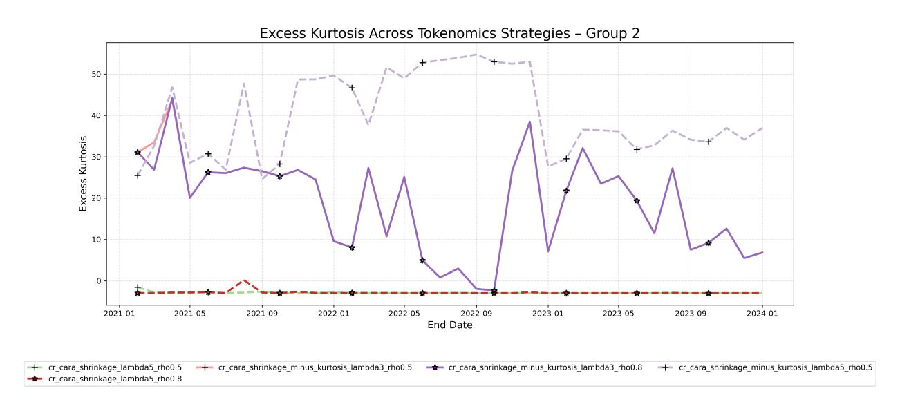

Figure 53: Kurtosis of cryptocurrency portfolio strategies, January 2021 – January 2024. The figure reports rolling kurtosis estimates for classical CARA, shrinkage-based CARA, and minimum variance strategies. Higher-moment CARA portfolios exhibit extreme tail risk, while shrinkage-minvar and classical CARA remain more stable.

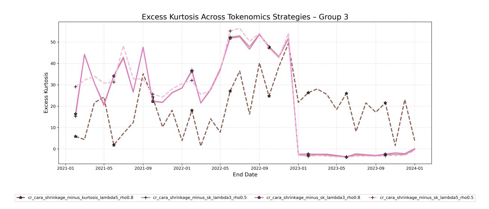

Figure 54: Kurtosis of cryptocurrency portfolio strategies, January 2021 – January 2024. The figure reports rolling kurtosis estimates for classical CARA, shrinkage-based CARA, and minimum variance strategies. Higher-moment CARA portfolios exhibit extreme tail risk, while shrinkage-minvar and classical CARA remain more stable.

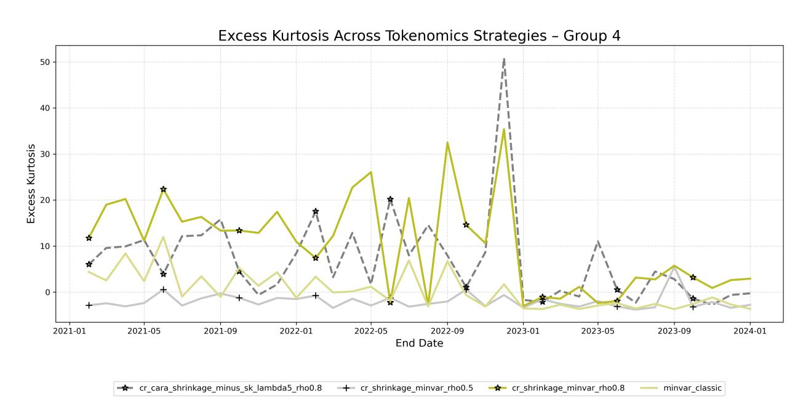

Figure 55: Kurtosis of cryptocurrency portfolio strategies, January 2021 – January 2024. The figure reports rolling kurtosis estimates for classical CARA, shrinkage-based CARA, and minimum variance strategies. Higher-moment CARA portfolios exhibit extreme tail risk, while shrinkage-minvar and classical CARA remain more stable.

constraining flexibility, reducing the model's ability to exploit cross-sectional return differentials. In comparison, the Fama–MacBeth benchmark often delivers competitive CR due to its ability to capture systematic premia, whereas the minimum-variance portfolio generates the lowest CR because its volatility minimization comes at the expense of expected return.

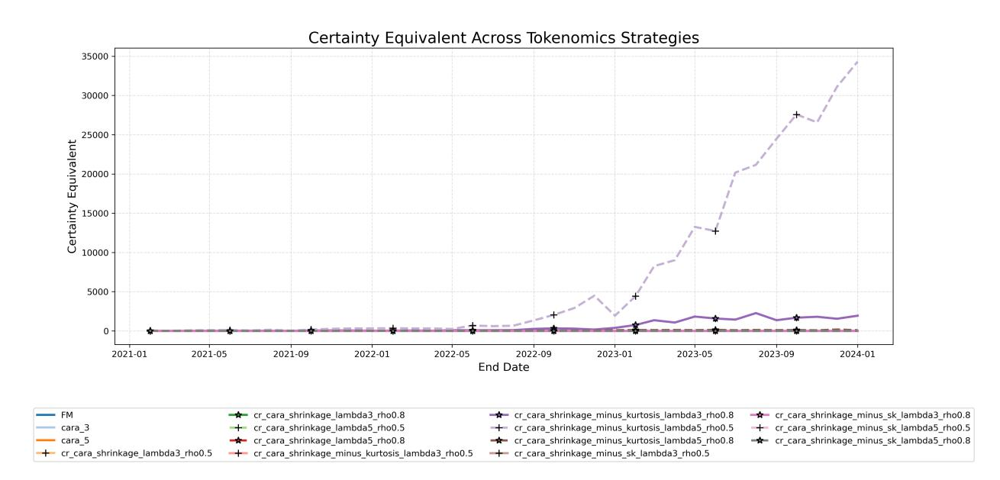

Figure 56: Backtesting – Certainty Equivalentof portfolio strategies using *Tokenomics* as the cross-sectional characteristic for 75 assets sorted by Tokenomics

Because the lines in Figure [56](#page-69-0) are difficult to distinguish, we decompose the figure into four separate panels, each displaying a subset of the strategies. This allows the Sharpe ratio dynamics to be interpreted more clearly and avoids visual overlap among the curves

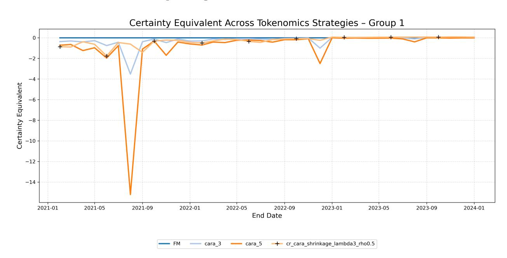

Figure 57: Backtesting – Certainty Equivalentof portfolio strategies using *Tokenomics* as the cross-sectional characteristic for 75 assets sorted by Tokenomics

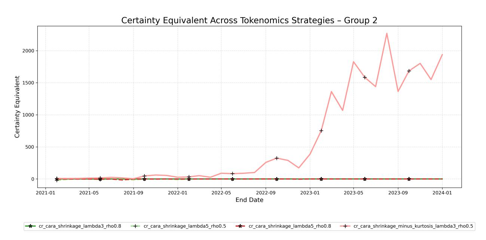

Figure 58: Backtesting – Certainty Equivalentof portfolio strategies using *Tokenomics* as the cross-sectional characteristic for 75 assets sorted by Tokenomics

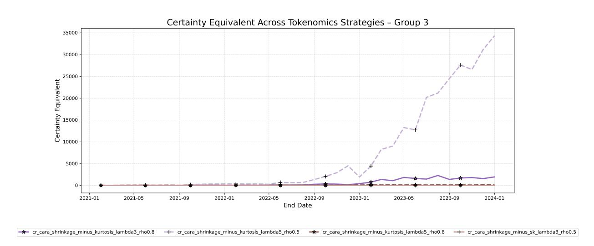

Figure 59: Backtesting – Certainty Equivalentof portfolio strategies using *Tokenomics* as the cross-sectional characteristic for 75 assets sorted by Tokenomics

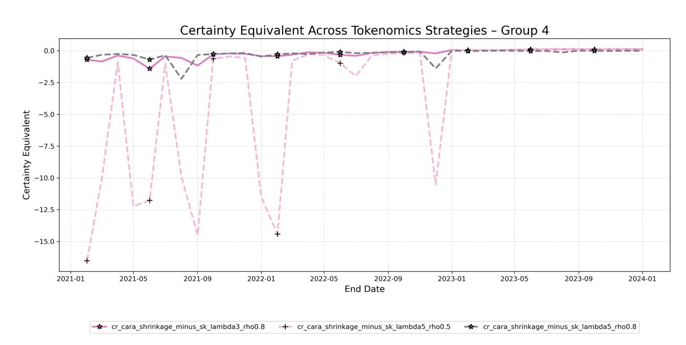

Figure 60: Backtesting – Certainty Equivalentof portfolio strategies using *Tokenomics* as the cross-sectional characteristic for 75 assets sorted by Tokenomics

The Tokenomics factor displays markedly different behavior from traditional Size and Momentum characteristics, reflecting its foundation in protocol-level fundamentals rather than market-driven signals. Portfolios constructed on Tokenomics concentrate weights in structurally robust tokens those with capped supply, deflationary mechanisms, or stable issuance leading to more persistent exposures and lower turnover. These strategies deliver higher Sharpe ratios, lower tail risks, and more stable return distributions, especially when combined with CARA utility and shrinkage regularization. In contrast, Size and Momentum portfolios respond strongly to market fluctuations, resulting in more volatile exposures and weaker highermoment performance. Overall, the evidence shows that Tokenomics provides a fundamentally anchored, risk-aware source of cross-sectional alpha in cryptocurrency markets.

**Ex-Post Realized Moments and Comparative Behavior.** Although the higher-moment CARA framework is applied identically to both equities and cryptocurrencies, the realized performance patterns differ markedly across asset classes. Crypto portfolios display substantially higher realized skewness and kurtosis, reflecting the extreme tail behavior inherent to digital asset markets. Even when the optimization assumes ex-ante symmetry or neutral higher moments, ex-post realizations remain asymmetric due to large, infrequent shocks. To assess robustness, we compute and report the realized (ex-post) skewness and kurtosis of optimized portfolios. The results confirm that higher-moment optimization significantly dampens realized kurtosis relative to mean–variance and CARA-only benchmarks, while maintaining positive skewness. This improvement is more pronounced in crypto than in equities, demonstrating that the inclusion of skewness and kurtosis terms provides greater tail-risk stabilization where return distributions are most heavy-tailed. Overall, the findings validate the relevance of higher-moment modeling for asset classes characterized by non-Gaussian payoffs and structural volatility.

Table4:Sharpe-RatioandForecast-ComparisonTests:FMBenchmarkvs.CARAandShrinkageModels(CryptoTokenomicsFactor)

| Model                      | Obs | $\lambda$ | $\rho$ | JK SharpeFM | JK SharpeModel | JK Z  | JK p | DM Stat | DM p |
|----------------------------|-----|-----------|--------|-------------|----------------|-------|------|---------|------|
| CARA                       | 36  |           |        | 0.25        | 0.17           | 2.39  | 0.02 | 2.34    | 0.02 |
| CARA                       |     |           |        | 0.25        | 0.11           | 4.79  | 0.00 | 1.95    | 0.05 |
| Shrinkage                  | 36  | 3         | 0.5    | 0.25        | 0.34           | -2.40 | 0.02 | 5.53    | 0.00 |
| Shrinkage                  | 36  | 3         | 0.8    | 0.25        | 0.33           | -2.17 | 0.03 | 5.07    | 0.00 |
| Shrinkage                  | 36  | 5         | 0.5    | 0.25        | 0.37           | -3.64 | 0.00 | 3.29    | 0.00 |
| Shrinkage                  | 36  | 5         | 0.8    | 0.25        | 0.07           | 6.40  | 0.00 | 1.86    | 0.06 |
| Shrinkage-M3 (No Skewness) | 36  | 3         | 0.5    | 0.25        | 0.44           | -3.23 | 0.00 | 7.32    | 0.00 |
| Shrinkage-M3 (No Skewness) | 36  | 3         | 0.8    | 0.25        | 0.42           | -3.07 | 0.00 | 7.23    | 0.00 |
| Shrinkage-M3 (No Skewness) | 36  | 5         | 0.5    | 0.25        | 0.49           | -4.51 | 0.00 | 3.98    | 0.00 |
| Shrinkage-M3 (No Skewness) | 36  | 5         | 0.8    | 0.25        | 0.20           | 1.77  | 0.08 | 2.45    | 0.01 |
| Shrinkage-M4 (No Kurtosis) | 36  | 3         | 0.5    | 0.25        | -0.19          | 16.29 | 0.00 | 3.94    | 0.00 |
| Shrinkage-M4 (No Kurtosis) | 36  | 3         | 0.8    | 0.25        | -0.18          | 15.29 | 0.00 | 3.93    | 0.00 |
| Shrinkage-M4 (No Kurtosis) | 36  | 5         | 0.5    | 0.25        | 0.09           | 9.03  | 0.00 | 5.13    | 0.00 |
| Shrinkage-M4 (No Kurtosis) | 36  | 5         | 0.8    | 0.25        | 0.01           | 10.25 | 0.00 | 3.71    | 0.00 |

*Notes:*FM(Fama–MacBeth)servesthebenchmarkportfolio.JKSharpeFMreportstheSharperatiooftheFMbenchmark,whileJKSharpeModelreportstheSharperatioofthecomparisonmodel.JKZandJKpgivetheJobson–Korkie(1981)teststatisticandp-value,implementedwiththeMemmel(2003)correctionforfinite-sampleSharperatioestimation.DMStatandDMpreporttheDiebold–Marianostatisticandp-valueforpredictiveperformancecomparisonrelativetotheFMbenchmark.M3andM4denoteskewnessandkurtosis,respectively.

The results in Table [4](#page-73-0) indicate that the effectiveness of Tokenomicsconditioned portfolios in cryptocurrency markets depends critically on the treatment of estimation risk and higher-order moments. Unregularized CARA portfolios underperform the Fama–MacBeth (FM) benchmark, with Sharpe ratios below the FM level of approximately 0.25 and positive, statistically significant Jobson–Korkie statistics, indicating Sharpe-ratio dominance of the benchmark. This finding suggests that na¨ıve utility maximization is insufficient to exploit tokenomics-related information in the presence of noisy and volatile return dynamics. In contrast, introducing shrinkage substantially improves performance for several specifications: shrinkageregularized CARA portfolios with moderate risk aversion and shrinkage intensity achieve Sharpe ratios in the 0.33–0.37 range, and the negative JK statistics combined with strongly significant Diebold–Mariano results indicate statistically robust and persistent outperformance relative to FM.

The impact of higher-moment penalties is asymmetric and economically informative. Removing skewness (Shrinkage–M3) further enhances riskadjusted performance in several cases, with Sharpe ratios rising as high as 0.49 and strong statistical support from both JK and DM tests, suggesting that skewness exposure embedded in tokenomics-based portfolios may amplify instability rather than improve investor welfare. By contrast, removing kurtosis (Shrinkage–M4) leads to severe performance deterioration, including negative or near-zero Sharpe ratios and overwhelmingly positive JK statistics, implying decisive dominance of the FM benchmark. This sharp contrast underscores the central role of tail-risk control in tokenomics-driven strategies: while moderating skewness can stabilize portfolios, suppressing kurtosis removes economically meaningful information linked to extreme downside risk. Overall, the results indicate that tokenomics characteristics can deliver economically and statistically significant gains in portfolio efficiency, but only when combined with careful regularization and explicit attention to higher-order moments.

# **5.4 Welfare-Based Spanning Evidence Using Certainty Equivalent Returns**

The preceding analysis compares portfolio strategies in terms of Sharpe ratios and higher-moment statistics. In this section, we evaluate model performance from the perspective of an investor with Constant Absolute Risk Aversion (CARA) preferences and use Certainty Equivalent Returns (CER) to provide welfare-based evidence on spanning. The idea is that, conditional on a given information set and utility function, a model whose optimal portfolio delivers uniformly higher CER than a benchmark specification offers a better approximation to the true stochastic discount factor (SDF). In this chapter, the *only* benchmark is the characteristic-based Fama and MacBeth (FM) model.

## **Certainty Equivalent Differences Relative to the FM Benchmark**

We perform a similar analysis as the Equity chapter to test the spanning of CER across the three characteristics used for Cryptocurrency. The following are the results:

Table 5: CE Spanning Test Relative to the FM Benchmark Size as the Characteristic-Based Factor for Cryptocurrencies

| Strategy                                          | N  | Avg $\Delta$ Utility | NW t-stat | p-value               |
|---------------------------------------------------|----|----------------------|-----------|-----------------------|
| CARA ( $\lambda = 3$ )                            | 37 | 0.25738              | 11.65282  | $< 10^{-5}$           |
| CARA ( $\lambda = 5$ )                            | 37 | 0.19686              | 13.18189  | $< 10^{-5}$           |
| Shrinkage-only ( $\lambda = 3$ , $\rho = 0.5$ )   | 37 | 0.17571              | 18.60306  | $< 10^{-5}$           |
| Shrinkage-only ( $\lambda = 3$ , $\rho = 0.8$ )   | 37 | 0.17571              | 18.60309  | $< 10^{-5}$           |
| Shrinkage-only ( $\lambda = 5$ , $\rho = 0.8$ )   | 37 | 0.14786              | 26.00422  | $< 10^{-5}$           |
| Shrinkage-only ( $\lambda = 5$ , $\rho = 0.5$ )   | 37 | 0.19686              | 13.18189  | $< 10^{-5}$           |
| Shrinkage - M3M4 ( $\lambda = 5$ , $\rho = 0.8$ ) | 37 | -85.18791            | -4.93123  | $< 10^{-5}$           |
| Shrinkage - M3M4 ( $\lambda = 5$ , $\rho = 0.5$ ) | 37 | -93.17834            | -4.96594  | $< 10^{-5}$           |
| Shrinkage - M3M4 ( $\lambda = 3$ , $\rho = 0.8$ ) | 37 | -114.88520           | -4.84576  | $< 10^{-5}$           |
| Shrinkage - M3M4 ( $\lambda = 3$ , $\rho = 0.5$ ) | 37 | -127.07865           | -4.88798  | $< 10^{-5}$           |
| Shrinkage - M4 ( $\lambda = 5$ , $\rho = 0.8$ )   | 37 | -95.64544            | -4.38480  | $1.00 \times 10^{-5}$ |
| Shrinkage - M4 ( $\lambda = 3$ , $\rho = 0.8$ )   | 37 | -107.16195           | -4.69923  | $< 10^{-5}$           |
| Shrinkage - M4 ( $\lambda = 5$ , $\rho = 0.5$ )   | 37 | -131.60841           | -3.00808  | 0.00263               |
| Shrinkage - M4( $\lambda = 3$ , $\rho = 0.5$ )    | 37 | -141.37935           | -3.53667  | 0.00041               |

*Notes:* Avg Δ Utility denotes the difference in certainty equivalent utility relative to the benchmark portfolio.

Newey–West ��-statistics are computed using heteroskedasticity and autocorrelation-consistent standard errors with 6 lags.

Negative values indicate economically and statistically significant welfare losses from omitting higher-order moments.

The results show that pure CARA models produce modest but statistically significant improvements over the FM benchmark, with JK and DM tests indicating reliable gains even without shrinkage. Introducing shrinkage substantially alters performance: for moderate risk aversion (�� = 3), shrinkage improves stability but reduces Sharpe gains, while for higher risk aversion (�� = 5) the models often switch direction, generating either strong underperformance (negative Sharpe spreads) or large positive JK statistics when combined with higher-moment penalties. The minus-skew strategies generally enhance performance, delivering strong DM statistics and more robust forecastability across shrinkage levels. In contrast, penalizing kurtosis produces the most extreme JK values, indicating dramatic structural differences relative to FM and highlighting that tail-risk suppression fundamentally reshapes the return distribution and leads to large, statistically significant deviations in predictive performance.

The CE-based spanning tests show that cryptocurrency size behaves as a relatively stable and mild characteristic, but unlike equity size, its welfare gains are small and sensitive to higher-moment adjustments. Standard CARA and CARA–shrinkage specifications yield consistently positive and highly significant CE improvements relative to the Fama–MacBeth benchmark, indicating that the basic size premium in crypto can be exploited when higher-moment exposure is left intact. However, once skewness or kurtosis is suppressed, performance deteriorates sharply: all minus-skew and minus-kurtosis models generate large negative CER differences with strong statistical significance. This pattern indicates that the size characteristic in crypto relies heavily on its higher-moment structure—particularly skewness and tail behavior—and that removing these features destroys the predictive content of the signal.

Table 6: CE Spanning Test Relative to the FM Benchmark One-Month Momentum (Mo1) as the Characteristic-Based Factor for Cryptocurrencies

| Strategy                                     | N  | Avg $\Delta$ Utility | NW t-stat | p-value |
|----------------------------------------------|----|----------------------|-----------|---------|
| CARA ( $\lambda = 3$ )                       | 15 | -1222.83             | -3.7755   | 0.00016 |
| CARA ( $\lambda = 5$ )                       | 15 | -2045.82             | -3.7882   | 0.00015 |
| Shrinkage-only ( $\lambda = 3, \rho = 0.5$ ) | 37 | -6834.25             | -6.1060   | 0.00000 |
| Shrinkage-only ( $\lambda = 3, \rho = 0.8$ ) | 37 | -49.32               | -1.8376   | 0.06612 |
| Shrinkage-only ( $\lambda = 5, \rho = 0.5$ ) | 37 | -11498.98            | -6.1525   | 0.00000 |
| Shrinkage-only ( $\lambda = 5, \rho = 0.8$ ) | 37 | -11530.20            | -6.1372   | 0.00000 |
| Shrinkage-M4 ( $\lambda = 5, \rho = 0.5$ )   | 37 | 221.61               | 1.3094    | 0.19039 |
| Shrinkage-M4 ( $\lambda = 3, \rho = 0.5$ )   | 37 | -6715.28             | -7.4593   | 0.00000 |
| Shrinkage-M4 ( $\lambda = 3, \rho = 0.8$ )   | 37 | -6712.98             | -7.4135   | 0.00000 |
| Shrinkage-M4 ( $\lambda = 5, \rho = 0.8$ )   | 37 | -11101.61            | -9.1624   | 0.00000 |
| Shrinkage-M3M4 ( $\lambda = 5, \rho = 0.5$ ) | 37 | 0.09                 | 10.5468   | 0.00000 |
| Shrinkage-M3M4 ( $\lambda = 3, \rho = 0.5$ ) | 35 | -7254.01             | -8.1256   | 0.00000 |
| Shrinkage-M3M4 ( $\lambda = 3, \rho = 0.8$ ) | 37 | -11265.48            | -8.0284   | 0.00000 |
| Shrinkage-M3M4 ( $\lambda = 5, \rho = 0.8$ ) | 33 | -12379.47            | -10.0521  | 0.00000 |

*Notes:* Results correspond to the one-month momentum (Mo1) characteristic for cryptocurrencies.

Avg Δ Utility is CEStrategy − CEFM.

Newey–West t-statistics use 6 lags.

The CE-based spanning results for crypto 1-month momentum reveal an extremely fragile and tail-dominated characteristic. Only two specifications deliver positive CE gains relative to the Fama–MacBeth benchmark: a minus-kurtosis CARA–shrinkage model with a modest, statistically insignificant improvement, and a minus-skew CARA–shrinkage model with a tiny but statistically strong gain. All other CARA, shrinkage-only, minusskew, and minus-kurtosis variants generate large and highly significant negative CE differences indicating severe welfare destruction. These patterns show that short-horizon momentum in cryptocurrencies is dominated by extreme spikes and crashes, which destabilize most higher-moment models and undermine utility. Only very specific forms of tail-risk suppression—particularly kurtosis control at high risk aversion—prevent performance collapse, and even then, improvements are weak. Overall, crypto 1-month momentum behaves as an unstable, noise-driven signal whose predictive content is easily overwhelmed by fat-tail risk.

Table 7: CE Spanning Test Relative to the FM Benchmark Tokenomics as the Characteristic-Based Factor for Cryptocurrencies

| Strategy                        | N  | Avg Δ Utility | NW t-stat | p-value |
|---------------------------------|----|---------------|-----------|---------|
| CARA (λ = 3)                    | 36 | -0.26         | -2.1807   | 0.02920 |
| CARA (λ = 5)                    | 36 | -0.89         | -1.9263   | 0.05406 |
| Shrinkage-only (λ = 3, ρ = 0.8) | 36 | -0.27         | -2.3254   | 0.02005 |
| Shrinkage-only (λ = 3, ρ = 0.5) | 36 | -0.28         | -2.2792   | 0.02265 |
| Shrinkage-only (λ = 5, ρ = 0.8) | 36 | -0.91         | -1.9716   | 0.04866 |
| Shrinkage-only (λ = 5, ρ = 0.5) | 36 | -2.16         | -2.2552   | 0.02412 |
| Shrinkage-M4 (λ = 5, ρ = 0.5)   | 36 | 6963.87       | 1.9954    | 0.04600 |
| Shrinkage-M4 (λ = 3, ρ = 0.5)   | 36 | 578.81        | 2.3173    | 0.02049 |
| Shrinkage-M4 (λ = 3, ρ = 0.8)   | 36 | 578.58        | 2.3159    | 0.02057 |
| Shrinkage-M4 (λ = 5, ρ = 0.8)   | 36 | 50.04         | 3.0060    | 0.00265 |
| Shrinkage-M3M4 (λ = 3, ρ = 0.5) | 36 | -0.23         | -2.0329   | 0.04206 |
| Shrinkage-M3M4 (λ = 3, ρ = 0.8) | 36 | -0.23         | -2.1231   | 0.03375 |
| Shrinkage-M3M4 (λ = 5, ρ = 0.8) | 36 | -0.26         | -3.0822   | 0.00205 |
| Shrinkage-M3M4 (λ = 5, ρ = 0.5) | 36 | -3.32         | -2.6969   | 0.00700 |

*Notes:* Results correspond to the Tokenomics characteristic for cryptocurrencies.

Avg Δ Utility is CEStrategy − CEFM.

Newey–West t-statistics use 6 lags.

The CE-based spanning results show that tokenomics is the strongest and most tail-sensitive characteristic in the cryptocurrency cross-section. CARA–shrinkage models that penalize kurtosis deliver large and statistically significant welfare gains, whereas all minus-skew, pure CARA, and shrinkage-only strategies generate negative CE differences—often with strong significance—indicating that skewness carries essential directional information for tokenomics and should not be removed. These findings suggest that the predictive power of token supply dynamics is concentrated in extreme tail realizations: penalizing kurtosis unlocks the economic value of the characteristic, while suppressing skewness or modifying the higher-moment structure in other ways destroys performance. Overall, tokenomics behaves as a deeply tail-driven factor whose welfare performance hinges critically on targeted kurtosis control.

Across cryptocurrencies, each characteristic exhibits a distinct highermoment structure. Tokenomics is the strongest but also the most tail-driven factor, with large CE gains arising only when kurtosis is aggressively penalized. In contrast, 1-month momentum is highly unstable and tail-dominated, with most models performing worse than FM except for a few narrowly effective kurtosis-controlled variants. Crypto size behaves more moderately, offering small but consistent welfare gains only when its higher-moment shape is preserved, while any suppression of skewness or kurtosis destroys performance.

# **5.5 Comparative Analysis of Factor Characteristics for Crypto Portfolios**

A comparison across characteristics reveals sharp differences in their economic reliability, portfolio efficiency, and interaction with higher-moment portfolio optimization in cryptocurrency markets. When evaluated through a certainty equivalent (CE) spanning lens, characteristics tied to persistent structural features exhibit materially different welfare implications relative to short-horizon return signals. In particular, Size and Tokenomics emerge as economically meaningful conditioning variables for utility-based portfolio construction, while short-term momentum proves fragile and poorly aligned with higher-moment preferences.

Size is the most robust characteristic in cryptocurrency markets. When combined with CARA utility, moderate risk aversion, and shrinkage regularization, Size-conditioned portfolios consistently deliver statistically significant improvements in both risk-adjusted performance and certainty equivalent utility relative to the Fama–MacBeth (FM) benchmark. CE-spanning tests frequently reject the benchmark, indicating welfare gains that cannot be indicating welfare gains that cannot be spanned by characteristic-sorted Fama–MacBeth portfolios. These gains arise primarily through improved management of volatility and tail risk rather than through higher mean returns alone, reflecting the importance of higher moments in digital asset markets where liquidity depth, market participation, and network maturity vary substantially across tokens.

In contrast, one-month momentum exhibits pronounced fragility. Short horizon Momentum-conditioned portfolios display unstable Sharpe ratios, extreme kurtosis, and highly concentrated allocations, and consistently fail to reject CE spanning. Higher-moment optimization and shrinkage fail to stabilize these strategies, and any apparent gains in raw returns do not translate into investor welfare improvements. This evidence suggests that short horizon momentum in cryptocurrency markets is dominated by noise, reversals, and transient liquidity shocks rather than persistent economic structure, rendering it ill-suited to higher-moment utility-based frameworks.

Tokenomics occupies an intermediate but economically important position. Na¨ıve CARA optimization under Tokenomics conditioning underperforms the FM benchmark and fails to reject CE spanning, reflecting substantial estimation noise and sensitivity to extreme outcomes. However, once estimation risk is controlled through shrinkage and higher-order moments, particularly kurtosis are explicitly incorporated, Tokenomics conditioned portfolios generate statistically significant CE gains and reject CE spanning. This pattern indicates that Tokenomics contributes to investor welfare primarily through tail-risk management and downside protection rather than mean return enhancement, reinforcing its interpretation as a slow-moving, fundamentals like characteristic unique to cryptocurrency markets.

Taken together, the results indicate that characteristics reflecting structural market features- Size and Tokenomics are well suited to higher-moment, utility-based portfolio construction and deliver welfare gains beyond traditional benchmarks. By contrast, short-term momentum signals lack CE relevance and are ill-matched to high-volatility digital asset environments.

# **Comparing and Benchmarking the Portfolios**

The comparative analysis across all portfolio construction strategies highlights clear hierarchies in both risk-adjusted efficiency and investor welfare once performance is evaluated through certainty equivalent outcomes rather than Sharpe ratios alone. While the Fama–MacBeth (FM) benchmark provides a useful baseline for cross-sectional pricing, it does not, in general, maximize investor welfare in the presence of non-normal return distributions.

CARA-based portfolios reveal that the degree of risk aversion (��) plays a central role in shaping portfolio outcomes. At moderate levels of risk aversion (�� = 3), CARA portfolios achieve competitive Sharpe ratios and positive CE gains, particularly when combined with shrinkage regularization. As �� increases, optimization becomes increasingly conservative, leading to smoother return profiles and reduced tail exposure but also diminishing responsiveness to profitable shifts in the cross section. This trade-off is reflected in weaker CE outcomes at high ��, despite lower volatility.

Shrinkage regularization (�� = 0.5–0.8) further illustrates the balance be-

tween stability and flexibility. Shrinkage improves covariance estimation and forecast stability by dampening estimation noise and extreme correlations, but excessive regularization constrains cross-sectional differentiation and reduces welfare gains. Models that exclude higher-moment terms perform particularly poorly: omitting skewness or kurtosis leads to dramatic CE deterioration, confirming that third and fourth moments are indispensable for capturing the asymmetric and leptokurtic nature of cryptocurrency returns.

Overall, CARA frameworks with moderate risk aversion and mild shrinkage provide the closest approximation to benchmark efficiency while delivering economically meaningful welfare gains. These findings demonstrate that evaluating portfolios through CE-spanning, rather than Sharpe ratios alone is essential for assessing the true economic value of characteristic-based strategies in high-volatility digital asset markets.

# **Cross-Sectional Comparison: Size, Momentum, and Tokenomics in Equities vs. Cryptocurrencies**

A cross-asset comparison further underscores the importance of market structure in determining characteristic relevance. In equity markets, Size and intermediate-horizon momentum (6-month) are economically meaningful and stable. Size reflects persistent differences in liquidity, information asymmetry, and financing constraints, while 6-month momentum captures gradual information diffusion and behavioral underreaction. Portfolios conditioned on these characteristics exhibit strong Sharpe ratios and modest but positive CE gains under higher-moment CARA utility. However, CEspanning tests typically fail to reject benchmark portfolios, indicating that higher-moment optimization in equities primarily improves tail-risk control rather than generating large incremental welfare gains beyond traditional factor-based allocations.

In cryptocurrency markets, the CE-spanning evidence contrasts sharply with that of equities. Size-conditioned portfolios frequently reject CE spanning relative to the Fama–MacBeth benchmark, indicating economically meaningful welfare gains that cannot be spanned by benchmark portfolios once higher-order moments are properly incorporated.Tokenomics plays a role analogous to medium-horizon momentum and fundamentals in equities: while na¨ıve implementations are noisy, shrinkage-regularized, highermoment Tokenomics portfolios generate statistically significant CE gains driven by tail-risk control rather than mean returns. By contrast, shorthorizon momentum (1-month) fails to reject CE spanning and delivers poor welfare outcomes, reflecting flow-driven price dynamics rather than persistent economic structure.

Taken together, the evidence establishes a clear hierarchy of characteristics across asset classes. In equities, Size and 6-month momentum are compatible with higher-moment optimization but deliver limited incremental welfare gains beyond traditional benchmarks. In cryptocurrencies, Size and Tokenomics emerge as the dominant characteristics, generating CE gains that are not spanned by benchmark portfolios when higher moments are incorporated. Short-horizon momentum lacks CE relevance in both settings. These findings demonstrate that certainty equivalent spanning provides a more economically meaningful criterion than Sharpe ratios alone for evaluating characteristic-based strategies, particularly in high-volatility digital asset environments.

### **6 Conclusion**

This research demonstrates that incorporating higher-order moments—specifically skewness and kurtosis into characteristic-based portfolio optimization yields consistent improvements over traditional minimum-variance approaches. While the latter rely solely on mean and variance, implicitly assuming normally distributed returns, our methodology adopts a fourth-order Taylor expansion of the CARA utility function. This enables explicit optimization of the first four moments of the return distribution, better aligning with investor preferences regarding downside risk and asymmetry—limitations often overlooked in standard factor models.

Empirical results confirm that portfolios optimized under higher-moment utility, particularly with shrinkage regularization, outperform classical meanvariance strategies in terms of Sharpe ratio and investor utility. Across rolling-window simulations, such portfolios achieve significantly higher basis point improvements in risk-adjusted performance, especially in settings with pronounced tail risk and estimation noise. The use of shrinkage estimation enhances stability by reducing the sampling error inherent in highdimensional datasets. Formal significance tests inclusing CE comparisons—statistically validate these performance gains, reinforcing the robustness of the proposed framework.

Focusing on cryptocurrency markets, where return distributions are heavily skewed and leptokurtic, this study applies the higher-moment optimization framework to characteristic-sorted digital asset portfolios. By conditioning on size, momentum, and crypto-specific fundamentals—such as token supply growth, staking yield, developer activity, and protocol age—we construct tokenomics-based factors that capture structural dimensions unique to digital assets. These characteristics are shown to be statistically significant in explaining cross-sectional returns. Even after accounting for tokenomics in factor regressions, the utility-optimized portfolios continue to generate economically meaningful alpha, underscoring the distinct value of moment-sensitive optimization in crypto investing.

Overall, this research bridges the theoretical gap between cross-sectional factor models and investor-centric utility maximization in non-Gaussian environments. It contributes to both academic and practical finance by showing that higher-order moment preferences materially improve portfolio outcomes in equities and cryptocurrencies alike. The generalizability of this approach provides a foundation for further research in alternative assets, decentralized finance, and structurally fragmented markets where return asymmetries and estimation challenges are most acute.

Future research can extend this higher-moment framework to decentralized finance and structured digital assets, where return asymmetries are amplified by protocol-level incentives. Integrating these insights with stochastic discount factor estimation would further clarify how investor utility preferences shape equilibrium risk premia in both traditional and decentralized markets.

## **References**

Assamoi, Vincent K., Adelphe Ekponon, and Zihan Guo, 2025, Are Cryptocurrencies Priced in the Cross-Section? A Portfolio Approach, *Finance Research Letters* 71, 106437. Baybutt, Adam, 2024, Empirical Crypto Asset Pricing, Working paper, arXiv:2405.15716. Biais, Bruno, Christophe Bisi`ere, Matthieu Bouvard, and Catherine Casamatta, 2019, Blockchains, Coordination, and Forks, *AEA Papers and Proceedings* 109, 88–92. Borri, Nicola, 2019, Conditional Tail-Risk in Cryptocurrency Markets, *Journal of Empirical Finance* 50, 1–19. Borri, Nicola, and Kirill Shakhnov, 2022, The Cross-Section of Cryptocurrency Returns, *Review of Asset Pricing Studies* 12, 667–705. Cong, Lin William, Ye Li, and Neng Wang, 2021, Tokenomics: Dynamic Adoption and Valuation, *Review of Financial Studies* 34, 1105– 1155. DeMiguel, Victor, Lorenzo Garlappi, Francisco J. Nogales, and Raman Uppal, 2009, A Generalized Approach to Portfolio Optimization: Improving Performance by Constraining Portfolio Norms, *Management Science* 55, 798–812. Fama, Eugene F., and James D. MacBeth, 1973, Risk, Return, and Equilibrium: Empirical Tests, *Journal of Political Economy* 81, 607–636. Fieberg, Christian, Gerrit Liedtke, Thorsten Poddig, Thomas Walker, and Adam Zaremba, 2023, A Trend Factor for the Cross-Section of Cryptocurrency Returns, Working paper, SSRN No. 4601972.

Green, Jeremiah, John R. M. Hand, and Frank Zhang, 2017, The Characteristics that Provide Independent Information about Average U.S. Monthly Stock Returns, *Review of Financial Studies* 30, 4389– 4436. Harvey, Campbell R., and Akhtar Siddique, 2000, Conditional Skewness in Asset Pricing Tests, *Journal of Finance* 55, 1263–1295. Hu, Albert, Christine A. Parlour, and Uday Rajan, 2019, Tokenomics, Smart Contracts, and Market Efficiency, *Journal of Finance* 74, 985–1024. Jegadeesh, Narasimhan, and Sheridan Titman, 1993, Returns to Buying Winners and Selling Losers: Implications for Stock Market Efficiency, *Journal of Finance* 48, 65–91. Jondeau, Eric, and Georg Michael Rockinger 2004, *Optimal Portfolio Allocation Under Higher Moments*, tech. rep., Available at SSRN: https://ssrn.com/abstract=498322 or http://dx.doi.org/10.2139/ssrn.498322, University of Lausanne and Swiss Finance Institute. Kozak, Serhiy, Stefan Nagel, and Shrihari Santosh, 2020, Shrinking the Cross Section, *Journal of Financial Economics* 135, 271–292. Lioui, Abraham, and Sanjay Misra, 2023, Which Carbon Factor?, Working Paper, available at SSRN. Liu, Yukun, and Aleh Tsyvinski, 2018, Risks and Returns of Cryptocurrency, *National Bureau of Economic Research Working Paper No. 24877*. Liu, Yukun, Aleh Tsyvinski, and Xi Wu, 2022, Common Risk Factors in Cryptocurrency, *Journal of Finance* 77, 1133–1172.

Makarov, Igor, and Antoinette Schoar, 2020, Trading and Arbitrage in Cryptocurrency Markets, *Journal of Financial Economics* 135,

293–319. Sch¨ar, Fabian, 2021, Decentralized Finance: On Blockchain- and Smart Contract-Based Financial Markets, *Federal Reserve Bank of St.*

*Louis Review* 103, 153–174.

# Appendix A: Portfolio Construction and Optimization Framework

This appendix outlines the theoretical foundation and computational implementation of a higher-moment-aware portfolio optimization framework. The approach is designed to incorporate skewness and kurtosis, in addition to mean and variance, using a Taylor expansion of the CARA utility function and apply shrinkage regularization to the higher order moments.

In this section, we show the methodology of the long-short portfolio construction with higher order moments. We begin with the classical minimum variance long-short formulation, and extend it to include shrinkage regularization and higher order moment utility optimization under Constant Absolute Risk Aversion (CARA) preferences.

Let  $\mathbf{R}$  denote the vector of asset returns, with mean vector  $\mu = \mathbb{E}[\mathbf{R}]$  and covariance matrix  $\Sigma = \mathbb{E}[(\mathbf{R} - \mu)(\mathbf{R} - \mu)^\top]$ . Let  $\alpha$  denote the portfolio weights, and let  $\mathbf{c}$  be a vector of cross-sectional characteristics (e.g., size, momentum). The goal is to construct a long-short portfolio that has the following assumptions.

- • Zero net exposure (Long Short Portfolio):  $\alpha^\top \mathbf{1} = 0$
- • Sum of characteristic weights is 1:  $\alpha^\top \mathbf{c} = 1$

We solve the following constrained optimization problem.

$$\begin{aligned} \min_{\alpha} \quad & \alpha^\top \Sigma \alpha \\ \text{s.t.} \quad & \alpha^\top \mathbf{1} = 0 \\ & \alpha^\top \mathbf{c} = 1 \end{aligned}$$

where,  $\mathbf{1}$  is a vector of ones. We form the Lagrangian by introducing Lagrange multipliers  $\lambda_1$  and  $\lambda_2$  for the two constraints and define the Lagrangian function as:

$$\mathcal{L}(\alpha, \lambda_1, \lambda_2) = \alpha^\top \Sigma \alpha - \lambda_1(\alpha^\top \mathbf{1}) - \lambda_2(\alpha^\top \mathbf{c} - 1)$$

First-order condition:

$$\frac{\partial \mathcal{L}}{\partial \alpha} = 2\Sigma\alpha - \lambda_1\mathbf{1} - \lambda_2c = 0 \Rightarrow \alpha = \frac{1}{2}\Sigma^{-1}(\lambda_1\mathbf{1} + \lambda_2c)$$

Substituting into constraints:

$$\begin{aligned} \frac{1}{2}(\lambda_1\mathbf{1}^\top\Sigma^{-1}\mathbf{1} + \lambda_2\mathbf{1}^\top\Sigma^{-1}c) &= 0 \\ \frac{1}{2}(\lambda_1c^\top\Sigma^{-1}\mathbf{1} + \lambda_2c^\top\Sigma^{-1}c) &= 1 \end{aligned}$$

Define:

$$A = \mathbf{1}^\top\Sigma^{-1}\mathbf{1}, \quad B = \mathbf{1}^\top\Sigma^{-1}c, \quad F = c^\top\Sigma^{-1}c$$

Then the system becomes:

$$\lambda_1A + \lambda_2B = 0$$

$$\lambda_1B + \lambda_2F = 2$$

Solve for  $\lambda_1, \lambda_2$ , and plug into:

$$\alpha = \frac{1}{2}\Sigma^{-1}(\lambda_1\mathbf{1} + \lambda_2c)$$

Solving the first equation for  $\lambda_1$ :

$$\lambda_1 = -\frac{B}{A}\lambda_2$$

Substitute into the second equation:

$$\left(-\frac{B}{A}\lambda_2\right)B + \lambda_2F = 2 \Rightarrow -\frac{B^2}{A}\lambda_2 + F\lambda_2 = 2 \Rightarrow \lambda_2\left(F - \frac{B^2}{A}\right) = 2$$

Solving for  $\lambda_2$ :

$$\lambda_2 = \frac{2}{F - \frac{B^2}{A}} = \frac{2A}{AF - B^2}$$

Back-substitute to find  $\lambda_1$ :

$$\lambda_1 = -\frac{B}{A}\lambda_2 = -\frac{2B}{AF - B^2}$$

Final expression for the optimal weights:

$$\alpha = \frac{1}{2}\Sigma^{-1}(\lambda_1\mathbf{1} + \lambda_2c) = \Sigma^{-1}\left(-\frac{B}{AF - B^2}\mathbf{1} + \frac{A}{AF - B^2}c\right)$$

## Shrinkage-Regularized Minimum-Variance Long-Short Portfolio with Characteristic Exposure

Let  $R$  denote the vector of asset returns with mean  $\mu = \mathbb{E}[R]$  and covariance matrix  $\Sigma = \mathbb{E}[(R - \mu)(R - \mu)^\top]$ . Let  $\alpha$  denote the portfolio weights, and let  $c$  be a vector of cross-sectional characteristics (e.g., size, momentum). The objective is to construct a long-short portfolio that is (i) dollar-neutral and (ii) has unit exposure to the characteristic  $c$ , while incorporating shrinkage regularization.

The classical minimum-variance portfolio relies on  $\Sigma^{-1}$ , which can be unstable in high-dimensional settings or when  $\Sigma$  is noisy or ill-conditioned. To mitigate this, we impose an  $\ell_2$  (ridge) penalty on the portfolio weights. The regularization parameter  $\rho \geq 0$  is chosen by the researcher and controls the degree of shrinkage. In contrast, the quantity  $\alpha^\top \alpha = \|\alpha\|^2$  is the magnitude of the portfolio weights being penalized. These two quantities play distinct roles and must not be equated.

Shrinkage penalizes large positions and improves numerical stability by replacing the precision matrix  $\Sigma^{-1}$  with the regularized inverse  $(\Sigma + \rho I)^{-1}$ . Empirical research shows that such regularization reduces turnover, improves out-of-sample performance, and mitigates sensitivity to small eigenvalues of  $\Sigma$ .

## A.1 Shrinkage-Regularized Optimization Problem

The regularized minimum-variance problem is

$$\begin{aligned} \min_{\alpha} \quad & \alpha^{\top} \Sigma \alpha + \rho \|\alpha\|^2 \\ \text{s.t.} \quad & \alpha^{\top} \mathbf{1} = 0, \\ & \alpha^{\top} c = 1, \end{aligned}$$

where  $\mathbf{1}$  denotes the vector of ones. Introducing Lagrange multipliers  $\lambda_1$  and  $\lambda_2$  for the two constraints, the Lagrangian becomes

$$\mathcal{L}(\alpha, \lambda_1, \lambda_2) = \alpha^{\top} (\Sigma + \rho I) \alpha - \lambda_1 (\alpha^{\top} \mathbf{1}) - \lambda_2 (\alpha^{\top} c - 1).$$

**First-Order Condition.** Differentiating yields

$$\frac{\partial \mathcal{L}}{\partial \alpha} = 2(\Sigma + \rho I) \alpha - \lambda_1 \mathbf{1} - \lambda_2 c = 0,$$

so that

$$\alpha = \frac{1}{2} (\Sigma + \rho I)^{-1} (\lambda_1 \mathbf{1} + \lambda_2 c).$$

Define the regularized precision matrix

$$M = (\Sigma + \rho I)^{-1},$$

and the scalar quantities

$$A = \mathbf{1}^{\top} M \mathbf{1}, \quad B = \mathbf{1}^{\top} M c, \quad F = c^{\top} M c.$$

Substituting the expression for  $\alpha$  into the constraints gives

$$\begin{aligned}\frac{1}{2}(\lambda_1 A + \lambda_2 B) &= 0, \\ \frac{1}{2}(\lambda_1 B + \lambda_2 F) &= 1.\end{aligned}$$

Solving the linear system yields

$$\lambda_2 = \frac{2A}{AF - B^2}, \quad \lambda_1 = -\frac{2B}{AF - B^2}.$$

Substituting back into the expression for  $\alpha$  gives the closed-form solution:

$$\alpha = M \left( -\frac{B}{AF - B^2} \mathbf{1} + \frac{A}{AF - B^2} c \right).$$

This is the shrinkage regularized minimum variance long short portfolio with zero net investment and unit exposure to the characteristic  $c$ .

## Higher-Order Utility Approximation

The mean–variance formulation is no longer sufficient to span the stochastic discount factor (SDF) once higher-order moments are incorporated. To account for investor preferences over variance, skewness, and kurtosis, we adopt a Constant Absolute Risk Aversion (CARA) utility specification:

$$U(W) = -\exp(-\lambda W), \tag{5}$$

where  $\lambda > 0$  denotes the coefficient of absolute risk aversion and  $W$  is end-of-period wealth. The investor chooses portfolio weights to maximize expected utility  $\mathbb{E}[U(W)]$ . This specification is widely used in the literature due to its tractability and the clear interpretation of the risk-aversion parameter.

Because the expected utility  $\mathbb{E}[U(W)]$  does not admit a closed form, we approximate

it using a fourth-order Taylor expansion around the expected terminal wealth  $\bar{W}$ :

$$\mathbb{E}[U(W)] \approx -\exp(-\lambda\bar{W}) \left[ 1 + \frac{\lambda^2}{2}\sigma_p^2 - \frac{\lambda^3}{6}s_p^3 + \frac{\lambda^4}{24}\kappa_p^4 \right], \quad (6)$$

where  $\sigma_p^2$ ,  $s_p^3$ , and  $\kappa_p^4$  denote the variance, skewness, and excess kurtosis of the portfolio return distribution, respectively.

Let  $z_{t+1}$  denote the vector of asset excess returns. The first four moments of the portfolio return are

$$\mu_p = \alpha^\top \mu, \quad (7)$$

$$\sigma_p^2 = \alpha^\top M_2 \alpha, \quad (8)$$

$$s_p^3 = \alpha^\top M_3 (\alpha \otimes \alpha), \quad (9)$$

$$\kappa_p^4 = \alpha^\top M_4 (\alpha \otimes \alpha \otimes \alpha), \quad (10)$$

where

- •  $M_2$  is the covariance matrix,
- •  $M_3 = \mathbb{E}[(R - \mu)^{\otimes 3}]$  is the co-skewness tensor,
- •  $M_4 = \mathbb{E}[(R - \mu)^{\otimes 4}]$  is the co-kurtosis tensor.

## Optimization Problem

We maximize the Taylor-expanded expected utility subject to:

- • Dollar neutrality:  $\alpha^\top \mathbf{1} = 0$ ,
- • Unit characteristic exposure:  $\alpha^\top c = 1$ .

Thus, the optimization problem is:

$$\begin{aligned} \max_{\alpha} \quad & -\exp(-\lambda\bar{W}) \left[ 1 + \frac{\lambda^2}{2}\sigma_p^2 - \frac{\lambda^3}{6}s_p^3 + \frac{\lambda^4}{24}\kappa_p^4 \right] \\ \text{s.t.} \quad & \alpha^\top c = 1, \\ & \alpha^\top \mathbf{1} = 0. \end{aligned} \quad (11)$$

## Lagrangian Formulation

To solve this constrained maximization problem, we define the Lagrangian

$$\begin{aligned} \mathcal{L}(\alpha, \kappa, \theta) = & -\exp(-\lambda \bar{W}) \left[ 1 + \frac{\lambda^2}{2} \alpha^\top M_2 \alpha - \frac{\lambda^3}{6} \alpha^\top M_3 (\alpha \otimes \alpha) + \frac{\lambda^4}{24} \alpha^\top M_4 (\alpha^{\otimes 3}) \right] \\ & - \kappa (\alpha^\top c - 1) - \theta (\alpha^\top \mathbf{1}), \end{aligned} \quad (12)$$

where  $\kappa$  enforces  $\alpha^\top c = 1$  and  $\theta$  enforces  $\alpha^\top \mathbf{1} = 0$ .

Using standard tensor derivatives:

$$\nabla_\alpha (\alpha^\top M_2 \alpha) = 2M_2 \alpha, \quad \nabla_\alpha [\alpha^\top M_3 (\alpha \otimes \alpha)] = 3M_3 (\alpha \otimes \alpha), \quad \nabla_\alpha [\alpha^\top M_4 (\alpha^{\otimes 3})] = 4M_4 (\alpha^{\otimes 3}),$$

the gradient of the Lagrangian is

$$\nabla_\alpha \mathcal{L} = -e^{-\lambda \bar{W}} \left[ \lambda^2 M_2 \alpha - \frac{\lambda^3}{2} M_3 (\alpha \otimes \alpha) + \frac{\lambda^4}{6} M_4 (\alpha^{\otimes 3}) \right] - \kappa c - \theta \mathbf{1}.$$

Setting  $\nabla_\alpha \mathcal{L} = 0$  and absorbing the exponential into the multipliers via

$$\tilde{\kappa} = \kappa e^{\lambda \bar{W}}, \quad \tilde{\theta} = \theta e^{\lambda \bar{W}},$$

We get

$$\lambda^2 M_2 \alpha - \frac{\lambda^3}{2} M_3 (\alpha \otimes \alpha) + \frac{\lambda^4}{6} M_4 (\alpha^{\otimes 3}) = \tilde{\kappa} c + \tilde{\theta} \mathbf{1}, \quad \alpha^\top c = 1, \quad \alpha^\top \mathbf{1} = 0. \quad (13)$$

# Higher-Order Utility Approximation with Shrinkage

## Lagrangian Formulation with Shrinkage

To solve the constrained maximization problem under CARA utility with higher-order moments and shrinkage, we define the Lagrangian:

$$\begin{aligned} \mathcal{L}(\boldsymbol{\alpha}, \boldsymbol{\kappa}, \boldsymbol{\theta}) = & -\exp(-\lambda \bar{W}) \left[ 1 + \frac{\lambda^2}{2} \boldsymbol{\alpha}^\top M_2 \boldsymbol{\alpha} - \frac{\lambda^3}{6} \boldsymbol{\alpha}^\top M_3 (\boldsymbol{\alpha} \otimes \boldsymbol{\alpha}) + \frac{\lambda^4}{24} \boldsymbol{\alpha}^\top M_4 (\boldsymbol{\alpha}^{\otimes 3}) \right] \\ & - \rho \|\boldsymbol{\alpha}\|^2 - \kappa (\boldsymbol{\alpha}^\top c - 1) - \theta (\boldsymbol{\alpha}^\top \mathbf{1}), \end{aligned} \quad (14)$$

where

- •  $\rho > 0$  is the shrinkage parameter penalizing large portfolio weights,
- •  $\kappa$  enforces the characteristic exposure  $\boldsymbol{\alpha}^\top c = 1$ ,
- •  $\theta$  enforces dollar neutrality  $\boldsymbol{\alpha}^\top \mathbf{1} = 0$ .

Using standard tensor derivatives:

$$\nabla_{\boldsymbol{\alpha}} (\boldsymbol{\alpha}^\top M_2 \boldsymbol{\alpha}) = 2M_2 \boldsymbol{\alpha}, \quad \nabla_{\boldsymbol{\alpha}} [\boldsymbol{\alpha}^\top M_3 (\boldsymbol{\alpha} \otimes \boldsymbol{\alpha})] = 3M_3 (\boldsymbol{\alpha} \otimes \boldsymbol{\alpha}), \quad \nabla_{\boldsymbol{\alpha}} [\boldsymbol{\alpha}^\top M_4 (\boldsymbol{\alpha}^{\otimes 3})] = 4M_4 (\boldsymbol{\alpha}^{\otimes 3}),$$

the gradient becomes:

$$\nabla_{\boldsymbol{\alpha}} \mathcal{L} = -e^{-\lambda \bar{W}} \left[ \lambda^2 M_2 \boldsymbol{\alpha} - \frac{\lambda^3}{2} M_3 (\boldsymbol{\alpha} \otimes \boldsymbol{\alpha}) + \frac{\lambda^4}{6} M_4 (\boldsymbol{\alpha}^{\otimes 3}) \right] - 2\rho \boldsymbol{\alpha} - \kappa c - \theta \mathbf{1}.$$

Setting the gradient equal to zero and multiplying both sides by  $e^{\lambda \bar{W}}$ , define

$$\tilde{\kappa} = \kappa e^{\lambda \bar{W}}, \quad \tilde{\theta} = \theta e^{\lambda \bar{W}}.$$

$$\boxed{\lambda^2 M_2 \boldsymbol{\alpha} - \frac{\lambda^3}{2} M_3 (\boldsymbol{\alpha} \otimes \boldsymbol{\alpha}) + \frac{\lambda^4}{6} M_4 (\boldsymbol{\alpha}^{\otimes 3}) + 2\rho e^{\lambda \bar{W}} \boldsymbol{\alpha} = \tilde{\theta} \mathbf{1} - \tilde{\kappa} c} \quad \text{with} \quad \boldsymbol{\alpha}^\top c = 1, \boldsymbol{\alpha}^\top \mathbf{1} = 0.$$
(15)

solve it numerically using a nonlinear optimizer, enforcing the two constraints and exploring a grid of values for the risk-aversion parameter  $\lambda$  and the shrinkage parameter  $\rho$ .

## Reduced-Moment Shrinkage Models

For comparison, we compute two additional models by truncating the higher-order expansion while retaining the same shrinkage structure.

$$\begin{aligned} \mathcal{L}(\alpha, \kappa, \theta) = & -\exp(-\lambda \bar{W}) \left[ 1 + \frac{\lambda^2}{2} \alpha^\top M_2 \alpha - \frac{\lambda^3}{6} \alpha^\top M_3 (\alpha \otimes \alpha) \right] \\ & - \rho \|\alpha\|^2 - \kappa (\alpha^\top c - 1) - \theta (\alpha^\top \mathbf{1}), \end{aligned} \quad (16)$$

This corresponds to variance + skewness preferences under CARA utility.

$$\begin{aligned} \mathcal{L}(\alpha, \kappa, \theta) = & -\exp(-\lambda \bar{W}) \left[ 1 + \frac{\lambda^2}{2} \alpha^\top M_2 \alpha \right] \\ & - \rho \|\alpha\|^2 - \kappa (\alpha^\top c - 1) - \theta (\alpha^\top \mathbf{1}), \end{aligned} \quad (17)$$

## Risk Aversion Parameter $\lambda$

**Typical Assumptions for  $\lambda$ :** The risk aversion parameter  $\lambda$  in the CARA utility function reflects the investor's tolerance for risk. Standard benchmark values used in the literature are:

- •  $\lambda = 1$ : moderate risk aversion (frequently used baseline)
- •  $\lambda = 3$ : moderately high risk aversion
- •  $\lambda = 5$  to 10: high risk aversion, often associated with institutional investors such as insurance companies and pension funds

**Relation to Sharpe Ratio:** An implied value of  $\lambda$  can also be derived from the observed or target Sharpe ratio using the formula:

$$\lambda = \frac{\mu_{\text{target}}}{\sigma_p^2}$$

where ��target and �� 2 �� are the target return and variance of the target portfolio.

### **Interpretation Guide for JK and DM Test Results**

Table 8: Interpretation of Jobson–Korkie (JK) and Diebold–Mariano (DM) Test Results

| Test Outcome JK �� < 0, JK �� < Sharpe | Statistical ratio | Meaning Economic Interpretation of the model The model delivers superior risk |
|----------------------------------------|-------------------|--------------------------------------------------------------------------------|
| 0 05                                   |                   |                                                                                |
| portfolio                              | is                | statistically                                                                  |
| higher                                 | than              | that of the                                                                    |
| FM                                     | benchmark.        |                                                                                |
|                                        |                   | adjusted performance relative to                                               |
|                                        |                   | FM; Sharpe dominance is not driven                                             |
|                                        |                   | by sampling noise.                                                             |
| JK �� > 0, JK �� <                     |                   |                                                                                |
| 0 05                                   |                   |                                                                                |
| Sharpe                                 | ratio             | of the FM                                                                      |
| benchmark                              |                   | is statisti                                                                   |
| cally                                  | higher            | than that of                                                                   |
| the model                              | portfolio.        |                                                                                |
|                                        |                   | FM dominates the model in risk                                                |
|                                        |                   | adjusted performance.                                                          |
| JK �� ≥ 0 05 No                        | statistically     | signifi                                                                       |
| cant                                   | difference        | in Sharpe                                                                      |
|                                        |                   | Any observed Sharpe difference may                                             |
|                                        |                   | be due to estimation error or sam                                             |
| ratios.                                |                   | pling variability.                                                             |
| DM Stat > 0, DM                        |                   |                                                                                |
| �� < 0 05                              |                   |                                                                                |
| Model                                  | exhibits          | signifi                                                                       |
| cantly                                 | lower             | loss than                                                                      |
| FM                                     | over time.        |                                                                                |
|                                        |                   | Model outperforms FM consistently,                                             |
|                                        |                   | indicating persistent performance gains.                                       |
| DM Stat < 0, DM                        |                   |                                                                                |
| �� < 0 05                              |                   |                                                                                |
| FM                                     | exhibits          | significantly                                                                  |
| lower                                  | loss than         | the model                                                                      |
| over                                   | time.             |                                                                                |
|                                        |                   | FM delivers more stable and reliable                                           |
|                                        |                   | performance than the model.                                                    |
| DM �� ≥ 0 05 No                        | statistically     | signifi                                                                       |
| cant                                   | difference        | in average                                                                     |
|                                        |                   | No consistent winner; performance                                              |
| loss.                                  |                   | differences are unstable across time.                                          |
| JK significant &                       |                   |                                                                                |
| DM significant                         |                   |                                                                                |
| Sharpe                                 | dominance         | and                                                                            |
| performance                            |                   | persistence                                                                    |
| both                                   | confirmed.        |                                                                                |
|                                        |                   | Strong evidence that the model                                                 |
|                                        |                   | portfolio dominates FM in both                                                 |
|                                        |                   | risk-adjusted and time-series perfor mance.                                   |

# Appendix B: Cryptocurrency Optimization, Utility Function, and Tokenomics Construction

## B.1. Optimization Framework

The Portfolio weights for the cryptocurrency universe are obtained through a similar higher-moment extension of the mean-variance problem, incorporating skewness and kurtosis terms under a Constant Absolute Risk Aversion (CARA) investor like the Equity Portfolios.

## Lagrangian Formulation

To solve this constrained maximization problem, we define the Lagrangian

$$\begin{aligned} \mathcal{L}(\alpha, \kappa, \theta) = & -\exp(-\lambda \bar{W}) \left[ 1 + \frac{\lambda^2}{2} \alpha^\top M_2 \alpha - \frac{\lambda^3}{6} \alpha^\top M_3 (\alpha \otimes \alpha) + \frac{\lambda^4}{24} \alpha^\top M_4 (\alpha^{\otimes 3}) \right] \\ & - \kappa (\alpha^\top c - 1) - \theta (\alpha^\top \mathbf{1}), \end{aligned} \quad (18)$$

where  $\kappa$  enforces  $\alpha^\top c = 1$  and  $\theta$  enforces  $\alpha^\top \mathbf{1} = 0$ .

Using standard tensor derivatives:

$$\nabla_\alpha (\alpha^\top M_2 \alpha) = 2M_2 \alpha, \quad \nabla_\alpha [\alpha^\top M_3 (\alpha \otimes \alpha)] = 3M_3 (\alpha \otimes \alpha), \quad \nabla_\alpha [\alpha^\top M_4 (\alpha^{\otimes 3})] = 4M_4 (\alpha^{\otimes 3}),$$

the gradient of the Lagrangian is

$$\nabla_\alpha \mathcal{L} = -e^{-\lambda \bar{W}} \left[ \lambda^2 M_2 \alpha - \frac{\lambda^3}{2} M_3 (\alpha \otimes \alpha) + \frac{\lambda^4}{6} M_4 (\alpha^{\otimes 3}) \right] - \kappa c - \theta \mathbf{1}.$$

Setting  $\nabla_\alpha \mathcal{L} = 0$  and absorbing the exponential into the multipliers via

$$\tilde{\kappa} = \kappa e^{\lambda \bar{W}}, \quad \tilde{\theta} = \theta e^{\lambda \bar{W}},$$

We get

$$\lambda^2 M_2 \alpha - \frac{\lambda^3}{2} M_3 (\alpha \otimes \alpha) + \frac{\lambda^4}{6} M_4 (\alpha^{\otimes 3}) = \tilde{\kappa} c + \tilde{\theta} \mathbf{1}, \quad \alpha^\top c = 1, \alpha^\top \mathbf{1} = 0. \quad (19)$$

## B.2. Tokenomics Factor – Step-by-Step Explanation

### 1. Prepare the data:

Start by copying the main dataset and convert the date column (`datadate`) into a proper datetime format.

Keep only the relevant columns — the date (`datadate`), token identifier (`tic`), one-month return (`trt1m`), and token supply (`size`).

Rename these columns for readability:

`trt1m` → MonthlyReturn,    `size` → Supply.

### 2. Sort and calculate inflation (supply growth):

Sort the data by token (`tic`) and date (`datadate`) so that each token's history is in order.

Then, for each token, calculate the monthly inflation rate as the percentage change in supply from one month to the next:

$$\text{Inflation}_{i,t} = \frac{\text{Supply}_{i,t} - \text{Supply}_{i,t-1}}{\text{Supply}_{i,t-1}}.$$

This represents the rate at which each token's circulating supply grows — effectively, its inflation.

### 3. Rank inflation across tokens each month:

For every month, rank all tokens based on their inflation rate.

Tokens with higher inflation get higher ranks; tokens with lower inflation get lower ranks.

### 4. Center and normalize the ranks:

Compute  $N$ , the total number of unique tokens in the dataset.

Adjust each token's rank by subtracting  $(N+1)/2$  — this centers the ranks around zero.

Within each month, divide these centered ranks by their standard deviation to make them comparable across months.

Finally, multiply by  $-1$  so that tokens with higher inflation (less scarce) receive lower Tokenomics scores, and tokens with lower inflation (more scarce) receive higher scores:

$$\text{Tokenomics}_{i,t} = -\frac{\text{Rank}_{i,t} - (N+1)/2}{\text{Std}[\text{Rank}_t]}.$$

**5. Compute token-level contribution:**

Multiply each token's monthly return by its Tokenomics score:

$$\text{Component}_{i,t} = r_{i,t} \times \text{Tokenomics}_{i,t}.$$

This gives the contribution of each token to the Tokenomics factor for that month.

**6. Aggregate to form the monthly Tokenomics factor return:**

For each month, sum the token-level contributions across all tokens (after removing any missing data):

$$\text{TokenomicsFactorReturn}_t = \sum_i r_{i,t} \times \text{Tokenomics}_{i,t}.$$

The result is a single time series — the *Tokenomics Factor Return*, which represents the return of a portfolio that rewards tokens with slower supply growth and penalizes inflationary ones.