# Cross-Sectional Return Prediction in Cryptocurrency Markets Using Variational Latent Factor Models

Sacha Boyer

University of California, Berkeley

sacha.boyer@berkeley.edu

#### Abstract

This paper investigates the application of variational autoencoder-based latent factor models to cryptocurrency markets. We adapt the FactorVAE architecture, originally designed for equity markets, to a universe of 50 major cryptocurrencies using technical indicators derived from price and volume data. Our empirical analysis covers the period 2019–2024, with out-of-sample testing in 2024. We implement and compare seven distinct trading strategies exploiting the model's cross-sectional predictions, including directional, market-neutral, volatility-adjusted, and momentum-filtered approaches. Results demonstrate that the model generates economically significant signals, with six out of seven strategies achieving positive Sharpe ratios exceeding 1.0. The Momentum Filter strategy emerges as the most effective approach, achieving a 269.8% return with a Sharpe ratio of 2.12. We further examine latent factor stabilization techniques and find that temporal regularization produces more interpretable factor dynamics without sacrificing predictive accuracy. These findings suggest that deep generative models offer promising tools for understanding and exploiting cross-sectional structure in cryptocurrency markets.

Keywords: variational autoencoders; latent factor models; cryptocurrency; cross-sectional returns; deep learning; portfolio optimization

# Table of Contents

| 1   | Introduction |                                 | 4  |
|-----|--------------|---------------------------------|----|
| 2   | Model        | Architecture                    | 5  |
| 2.1 | Latent       | Factor Representation           | 5  |
| 2.2 |              | Variational Inference Framework | 5  |
| 2.3 | Network      | Components                      | 6  |
| 3   | Data and     | Implementation                  | 6  |
| 3.1 | Universe     | Selection                       | 6  |
| 3.2 | Feature      | Engineering                     | 7  |
| 3.3 | Sample       | Periods                         | 7  |
| 3.4 | Model        | Configuration                   | 7  |
| 4   | Empirical    | Results                         | 7  |
| 4.1 |              | Prediction Quality              | 7  |
| 4.2 | Trading      | Strategy Implementation         | 7  |
|     | 4.2.1        | Strategy 1: Top-5 Long          | 8  |
|     | 4.2.2        | Strategy 2: Quintile Long-Short | 8  |
|     | 4.2.3        | Strategy 3: Top-10 Long         | 8  |
|     | 4.2.4        | Strategy 4: Decile Long-Short   | 8  |
|     | 4.2.5        | Strategy 5: Volatility-Weighted | 8  |
|     | 4.2.6        | Strategy 6: Momentum Filter     | 8  |
|     | 4.2.7        | Strategy 7: Score-Weighted      | 8  |
| 4.3 |              | Performance Comparison          | 9  |
| 4.4 | Analysis     | of Results                      | 11 |
| 5   | Latent       | Factor Analysis                 | 12 |
| 5.1 |              | Temporal Stability              | 12 |
| 5.2 | Factor       | Dynamics                        | 13 |
| 5.3 |              | Variation Decomposition         | 13 |
| 5.4 | Stability    | Metrics                         | 14 |

# 1 Introduction

The rapid growth of cryptocurrency markets has created new opportunities and challenges for quantitative investment strategies. Unlike traditional equity markets, cryptocurrencies trade continuously across global exchanges, exhibit extreme volatility, and lack the fundamental valuation anchors that characterize stocks. These distinctive features raise important questions about whether established quantitative methods can be successfully transferred to this emerging asset class.

Cross-sectional return prediction—the task of identifying which assets will outperform or underperform their peers—has been extensively studied in equity markets. Traditional approaches rely on firm characteristics, accounting ratios, and risk factor exposures to explain return differentials [\[20\]](#page-17-0). More recently, machine learning methods have demonstrated the ability to capture non-linear relationships between predictors and future returns, often outperforming linear models in out-of-sample tests [\[11,](#page-16-0) [6\]](#page-16-1). Autoencoder-based approaches have emerged as particularly promising for extracting latent factor structures from high-dimensional financial data [\[12\]](#page-16-2).

Among deep learning approaches, variational autoencoders (VAEs) offer a particularly attractive framework for financial applications [\[22,](#page-17-1) [25,](#page-17-2) [8\]](#page-16-3). By treating latent factors as random variables, VAEs can explicitly model uncertainty in predictions—a crucial consideration given the low signal-to-noise ratio inherent in return forecasting. The FactorVAE model [\[9\]](#page-16-4) combines this probabilistic structure with the economic intuition of factor models, learning both common latent drivers and asset-specific exposures from data. Recent extensions include discrete latent representations [\[21\]](#page-17-3), graph-based factor modeling [\[15\]](#page-17-4), diffusion-based approaches [\[23\]](#page-17-5), and spatio-temporal architectures [\[29\]](#page-18-0).

Interpretability remains a central concern in financial machine learning applications [\[1,](#page-16-5) [2\]](#page-16-6). While black-box models may achieve superior predictive performance, practitioners and regulators increasingly demand transparent decision-making processes [\[3\]](#page-16-7). VAEbased approaches offer a middle ground: the latent factor structure provides economic interpretability while the neural network components capture complex non-linearities. Constrained VAE formulations such as β-VAE [\[13\]](#page-16-8) encourage disentangled representations that may correspond to economically meaningful factors.

This paper extends the FactorVAE framework to cryptocurrency markets. We construct a dataset of 50 major cryptocurrencies spanning 2019–2024, generate 158 technical features using the Qlib Alpha158 library, and train models to predict one-day-ahead returns. Our analysis makes three contributions. First, we demonstrate that cross-sectional predictability exists in cryptocurrency markets and can be exploited through systematic trading strategies, building on the portfolio construction literature [\[7\]](#page-16-9). Second, we compare seven different strategy implementations—ranging from simple long-only selection to sophisticated volatility-weighted and momentum-filtered approaches—to understand how model signals translate into economic value. Third, we investigate latent factor stabilization techniques that improve the interpretability of learned representations without degrading predictive performance, following recent work on temporal regularization [\[27\]](#page-18-1).

The remainder of this paper proceeds as follows. Section 2 describes the FactorVAE architecture and its adaptation to cryptocurrency data. Section 3 presents the data construction process. Section 4 reports empirical results on prediction accuracy and strategy performance. Section 5 analyzes latent factor dynamics and stabilization. Section 6 concludes.

# 2 Model Architecture

### 2.1 Latent Factor Representation

We adopt a probabilistic factor model where asset returns are decomposed into systematic and idiosyncratic components. For a cross-section of N assets at time t, returns yt ∈ R N are modeled as:

$$y_t = \alpha_t + \beta_t z_t + \varepsilon_t \quad (1)$$

where αt captures asset-specific expected returns, βt ∈ R N×K represents factor loadings, zt ∈ R K denotes latent factors, and εt is idiosyncratic noise.

Unlike classical factor models that estimate components through linear regression or principal component analysis, we parameterize all quantities as non-linear functions of observable characteristics. Given a feature tensor xt ∈ R N×T ×C containing C characteristics over T historical periods for each asset, we learn mappings:

$$\hat{y}_t = f_\alpha(x_t) + f_\beta(x_t) \cdot f_z(x_t) \quad (2)$$

where fα, fβ, and fz are neural network modules.

### 2.2 Variational Inference Framework

A key innovation is treating latent factors as random variables rather than point estimates [\[22,](#page-17-1) [25\]](#page-17-2). We specify Gaussian distributions for both posterior and prior factors:

$$q(z|x, y) = \mathcal{N}(\mu_{\text{post}}, \text{diag}(\sigma_{\text{post}}^2)) \quad (3)$$

$$p(z|x) = \mathcal{N}(\mu_{\text{prior}}, \text{diag}(\sigma_{\text{prior}}^2)) \quad (4)$$

The posterior distribution q(z|x, y) conditions on future returns and represents the "ideal" factors that best explain realized outcomes, following the conditional VAE framework [\[26\]](#page-17-6). The prior distribution p(z|x) uses only historical information available at prediction time. Training minimizes a loss combining reconstruction accuracy and distributional alignment:

$$\mathcal{L} = -\mathbb{E}_q[\log p(y|z, x)] + \gamma \cdot \text{KL}(q(z|x, y) || p(z|x)) \quad (5)$$

This formulation encourages the model to learn prior factors that approximate posterior factors while explaining return variation. At inference time, only the prior distribution is used, ensuring no forward-looking information leakage. Recent work has explored extensions including quantile-based predictions [\[28\]](#page-18-2), contrastive learning objectives [\[24\]](#page-17-7), and volatility modeling [\[4\]](#page-16-10).

#### 2.3 Network Components

Feature Encoder. Historical characteristics are processed through a Gated Recurrent Unit (GRU) network that compresses the temporal sequence into a fixed-dimensional embedding ei for each asset i:

| $e_i = \text{GRU}(\{x_i^{(t)}\}_{t=1}^T)$ | (6) |
|-------------------------------------------|-----|
|-------------------------------------------|-----|

Portfolio Aggregation. To handle varying cross-section sizes, asset embeddings are aggregated into portfolio-level representations using learned attention weights:

| $p_j = \sum_{i=1}^N a_{ij} \cdot y_i, \quad a_{ij} = \text{softmax}(W_p e_i)_j \quad (7)$ |
|-------------------------------------------------------------------------------------------|
|-------------------------------------------------------------------------------------------|

Factor Distributions. Both encoder (posterior) and predictor (prior) networks output mean and variance parameters for the latent factor distribution. The encoder additionally conditions on portfolio returns {pj}.

Decoder. The decoder computes predicted return distributions by combining latent factors with asset-specific components:

$$\mu_y^{(i)} = \mu_\alpha^{(i)} + \sum_{k=1}^K \beta_k^{(i)} \mu_z^{(k)} \quad (8)$$

$$\sigma_y^{(i)} = \sqrt{(\sigma_\alpha^{(i)})^2 + \sum_{k=1}^K (\beta_k^{(i)})^2 (\sigma_z^{(k)})^2} \quad (9)$$

# 3 Data and Implementation

# 3.1 Universe Selection

We construct a universe of 50 cryptocurrencies traded on Binance, selected based on market capitalization and trading volume. The universe includes major assets (BTC, ETH, BNB, SOL) alongside mid-cap alternatives, providing sufficient cross-sectional breadth for factor analysis. All prices are denominated in USDT.

#### 3.2 Feature Engineering

Raw OHLCV (Open, High, Low, Close, Volume) data is transformed into 158 technical indicators using the Qlib Alpha158 feature set. These features capture:

- Price momentum at multiple horizons (5, 10, 20, 30, 60 days)
- Volatility measures and price ranges
- Volume patterns and price-volume correlations
- Mean reversion signals and trend indicators

Features are cross-sectionally standardized within each date to ensure comparability across assets with different price scales.

## 3.3 Sample Periods

The dataset spans January 2019 through December 2024:

- Training: 2019-01-01 to 2022-12-31 (4 years)
- Validation: 2023-01-01 to 2023-12-31 (1 year)
- Test: 2024-01-01 to 2024-12-31 (1 year)

### 3.4 Model Configuration

The model uses 32 latent factors, hidden dimension 64, sequence length 20 days, and 64 dynamically constructed portfolios. Training proceeds for 20 epochs with early stopping based on validation loss. Transaction costs of 1 basis point per trade are applied in all strategy backtests.

# 4 Empirical Results

### 4.1 Prediction Quality

We evaluate cross-sectional prediction accuracy using the daily Rank Information Coefficient (RankIC), defined as the Spearman correlation between predicted and realized returns across assets. The model achieves positive RankIC throughout the test period, indicating consistent ability to rank assets by future performance.

# 4.2 Trading Strategy Implementation

We implement seven strategies to assess the economic value of model predictions:

#### 4.2.1 Strategy 1: Top-5 Long

Each day, we form an equal-weighted portfolio of the five cryptocurrencies with highest predicted returns. This concentrated approach maximizes exposure to the model's strongest signals.

#### 4.2.2 Strategy 2: Quintile Long-Short

Assets are sorted into quintiles based on predictions. The strategy goes long the top quintile (highest 20%) and short the bottom quintile (lowest 20%), creating a marketneutral position.

#### 4.2.3 Strategy 3: Top-10 Long

Similar to Strategy 1 but selects ten assets, reducing concentration risk at the cost of potentially diluting signal strength.

#### 4.2.4 Strategy 4: Decile Long-Short

A more aggressive market-neutral strategy that goes long the top decile (10%) and short the bottom decile, concentrating in the most extreme predictions.

#### 4.2.5 Strategy 5: Volatility-Weighted

Positions within the Top-5 selection are weighted inversely to recent volatility:

| $w_i \propto \frac{1}{\sigma_i^{(20)}}$ | (10) |
|-----------------------------------------|------|
|-----------------------------------------|------|

where σ (20) i is the 20-day rolling standard deviation. This tilts toward lower-risk assets while preserving ranking information.

#### 4.2.6 Strategy 6: Momentum Filter

The Top-5 Long strategy is modified to hold cash when Bitcoin's 20-day momentum is negative. This market-timing overlay aims to avoid systematic losses during broad downturns.

#### 4.2.7 Strategy 7: Score-Weighted

Weights within Top-5 are proportional to prediction scores rather than equal:

$$w_i \propto \mu_i - \min_j \mu_j + \epsilon \quad (11)$$

This allows the model's confidence levels to influence position sizing.

#### 4.3 Performance Comparison

Table [1](#page-8-1) summarizes performance across all strategies during the 2024 test period.

| 1. 2. 3. 4. | Strategy Top-5 Long Quintile L/S Top-10 Long Decile L/S | Final Equity \$2,069,122 \$1,475,707 \$2,338,648 \$993,957 | Return 106.9% 47.6% 133.9% -0.6% | Sharpe 1.24 1.16 1.42 -0.07 | Max DD -53.9% -33.4% -51.7% -26.3% | Approach Directional Market-neutral Diversified Aggressive L/S |
|-------------|---------------------------------------------------------|------------------------------------------------------------|----------------------------------|-----------------------------|------------------------------------|----------------------------------------------------------------|
| 5.          | Vol-Weighted                                            | \$2,237,733                                                | 123.8%                           | 1.37                        | -52.7%                             | Risk-adjusted                                                  |
| 6.          | Momentum Filter                                         | \$3,697,680                                                | 269.8%                           | 2.12                        | -36.2%                             | Market-timing                                                  |
| 7.          | Score-Weighted                                          | \$1,844,908                                                | 84.5%                            | 1.07                        | -41.6%                             | Confidence-based                                               |

Table 1: Strategy Performance Summary (2024 Test Period, starting capital \$1,000,000)

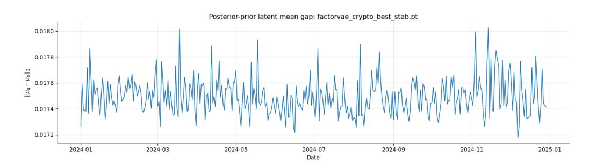

Figure 1: Top-5 Long strategy equity curve and performance metrics.

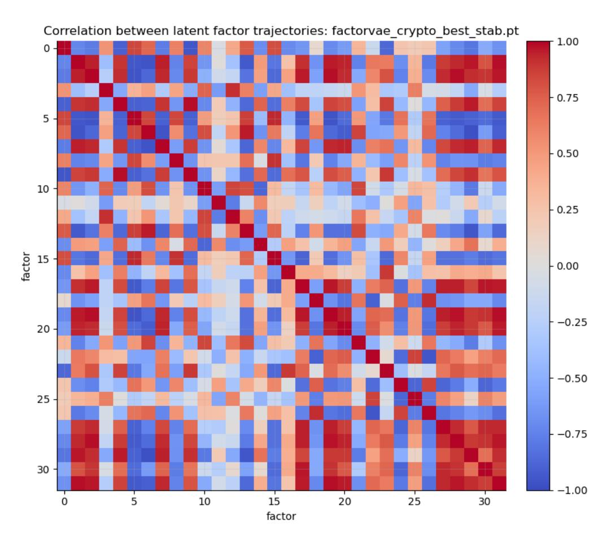

Figure 2: Top-5 Long strategy drawdown profile.

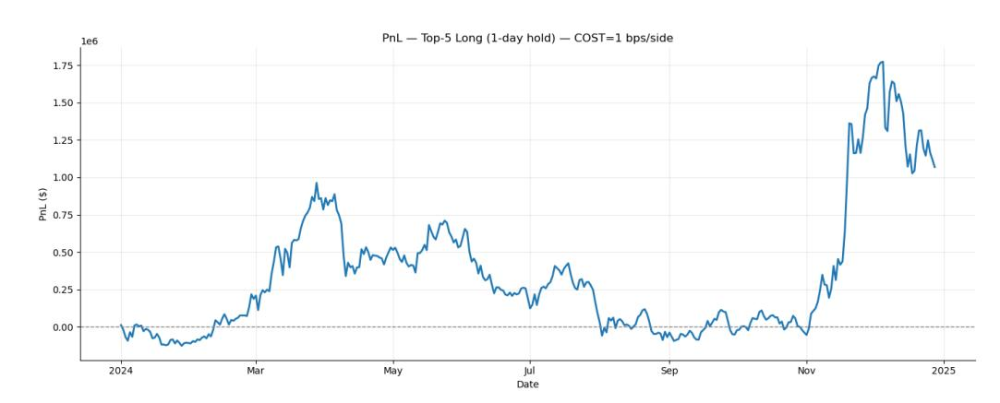

Figure 3: Quintile Long-Short strategy equity curve.

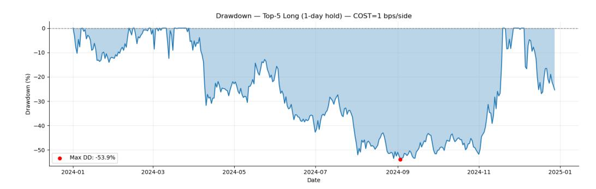

Figure 4: Quintile Long-Short strategy drawdown profile.

### 4.4 Analysis of Results

Several patterns emerge from the strategy comparison:

Dominance of the Momentum Filter. The Momentum Filter achieves by far the best performance with a 269.8% return and a Sharpe ratio of 2.12, substantially outperforming all other strategies. By conditioning trades on Bitcoin's trend direction, this strategy avoids exposure during adverse market conditions, resulting in one of the lowest maximum drawdowns (-36.2%) among all approaches.

Strong directional performance. Long-only strategies consistently deliver strong risk-adjusted returns. The Top-10 Long strategy achieves the highest return among nonfiltered approaches (133.9%) with a Sharpe ratio of 1.42, while the Top-5 Long and Vol-Weighted strategies also exceed Sharpe ratios of 1.2.

Market neutrality trade-offs. The Quintile Long-Short strategy achieves a respectable 47.6% return with the best drawdown protection among directional approaches (-33.4%). However, the more aggressive Decile L/S strategy marginally underperforms (-0.6% return, -0.07 Sharpe), indicating that extreme quantile selection introduces noise that offsets the benefits of market neutrality.

Value of diversification. Moving from Top-5 to Top-10 selection improves both returns (106.9% to 133.9%) and Sharpe ratio (1.24 to 1.42), suggesting that diversification benefits outweigh concentration in this volatile asset class.

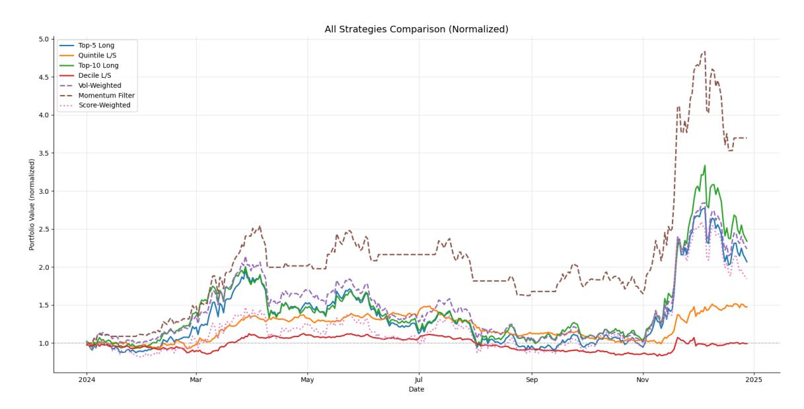

Figure 5: Normalized equity curves for all seven strategies.

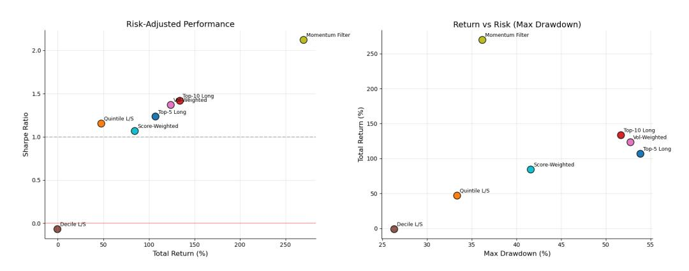

Figure 6: Risk-return profile: Sharpe ratio versus total return.

# 5 Latent Factor Analysis

# 5.1 Temporal Stability

Deep generative models often produce latent representations that drift or rotate over time, complicating interpretation. We address this through temporal regularization that penalizes abrupt changes in factor distributions:

$$\mathcal{L}_{\text{stab}} = \mathcal{L} + \lambda_1 \cdot \text{KL}(q_t \| q_{t-1}) + \lambda_2 \cdot \| \beta_t - \beta_{t-1} \|_2^2 \quad (12)$$

### 5.2 Factor Dynamics

Figure [7](#page-12-2) displays the time series of latent factor means over the evaluation period. The stabilized model produces smooth factor trajectories that evolve gradually rather than exhibiting erratic jumps.

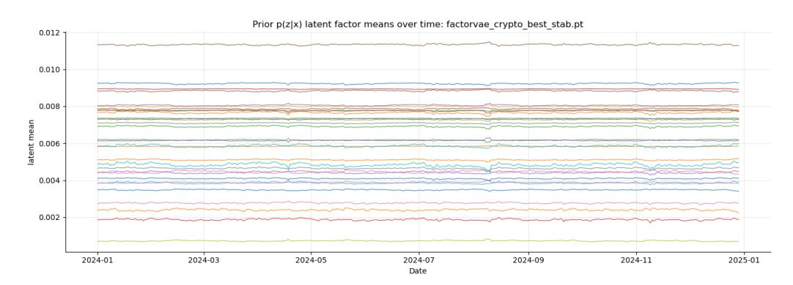

Figure 7: Evolution of latent factor means over the evaluation period.

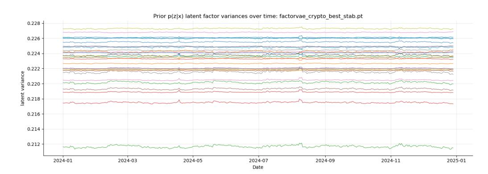

Figure 8: Latent factor variance dynamics.

### 5.3 Variation Decomposition

An important finding is that stabilization reallocates variation across model components. With temporal constraints active, the common factors become highly persistent while the factor loadings β absorb most cross-sectional adaptation:

- Latent factors zt capture slow-moving market-wide conditions
- Factor loadings βt adjust rapidly to asset-specific changes
- Idiosyncratic alpha absorbs remaining variation

This decomposition aligns with economic intuition: broad market structure should be persistent, while individual asset exposures may respond quickly to news and sentiment shifts.

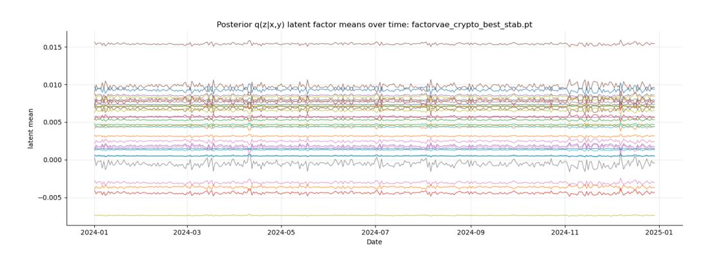

Figure 9: Factor loading (beta) dynamics across assets.

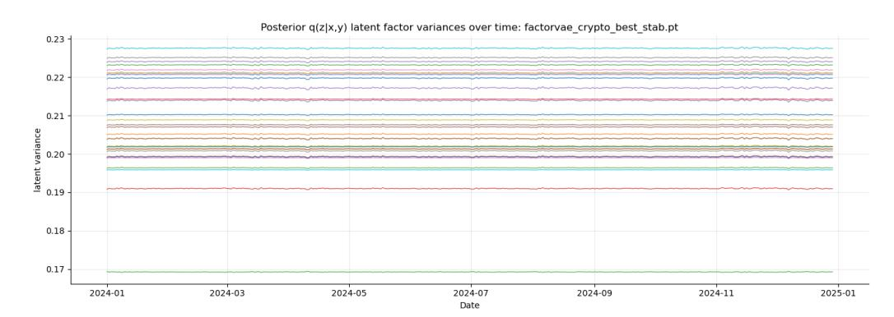

Figure 10: Adjacent-day correlation of latent factor vectors.

### 5.4 Stability Metrics

We quantify temporal coherence using the average correlation between consecutive factor vectors and the L2 distance between successive distributions. Both metrics confirm that the stabilized model maintains high consistency across trading days while preserving predictive accuracy.

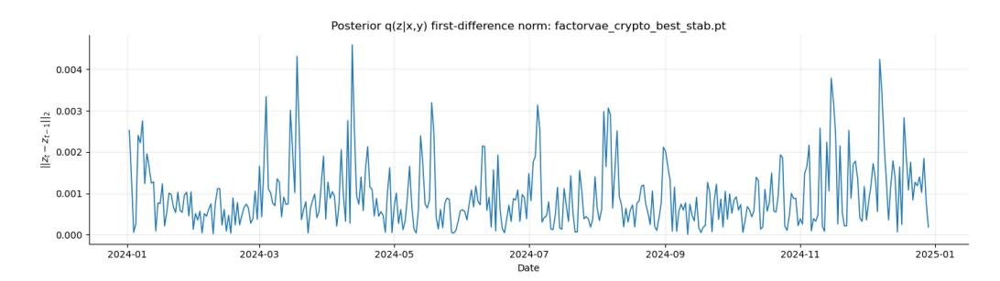

Figure 11: L2 distance between consecutive factor distributions.

# 6 Conclusion

This paper demonstrates that variational latent factor models can effectively capture cross-sectional return predictability in cryptocurrency markets. Our empirical analysis yields several key findings:

- 1. Predictive validity: The FactorVAE architecture generates consistent cross-sectional ranking signals in an asset class characterized by high volatility and continuous trading.
- 2. Economic significance: Six out of seven tested strategies achieve Sharpe ratios exceeding 1.0, with the Momentum Filter reaching 2.12 through selective market exposure and a 269.8% return.
- 3. Strategy flexibility: Model predictions support diverse implementation approaches directional, market-neutral, risk-adjusted, and market-timed—demonstrating robust underlying signal quality.
- 4. Risk management: The Quintile Long-Short construction offers the best drawdown protection (-33.4%), while market-timing via the Momentum Filter reduces drawdown to -36.2% while maximizing returns.
- 5. Interpretable dynamics: Temporal stabilization produces coherent factor trajectories where common factors capture persistent market conditions while loadings adapt to asset-specific changes.

Several extensions merit future investigation. Expanding the asset universe and historical coverage would test robustness across market regimes [\[11\]](#page-16-0). Incorporating alternative data sources—including on-chain metrics, social sentiment, and funding rates—could enhance predictive power, potentially leveraging language models for text-based signals [\[16\]](#page-17-8). Graph-based architectures [\[15\]](#page-17-4) may better capture the interconnected nature of cryptocurrency markets, while regime-switching models such as HireVAE [\[27\]](#page-18-1) and spatio-temporal approaches [\[29\]](#page-18-0) could adapt to the distinct market states observed in this asset class. Finally, discrete latent representations via vector quantization [\[21\]](#page-17-3) offer an alternative path toward more interpretable factor structures.

# References

[1] Bell, S., Kakhbod, A., Lettau, M., and Nazemi, A. (2024). Glass Box Machine Learning and Corporate Bond Returns. NBER Working Paper. [2] Bell, S., Kakhbod, A., Lettau, M., and Nazemi, A. (2025). AlphaGlass: Interpretable Characteristic-Based Portfolio Choice. Working Paper. [3] Bell, S., Kakhbod, A., Nazemi, A., Stanton, R.H., and Wallace, N. (2025). Fairness by Design: Machine Learning and Interpretable Mortgage Lending. Working Paper. [4] Bergeron, M., Fung, N., Hull, J., Poulos, Z., and Veneris, A. (2022). Variational Autoencoders: A Hands-Off Approach to Volatility. The Journal of Financial Data Science, 4(2), 125–138. [5] Chen, H., Kakhbod, A., Kazemi, M., and Xing, H. (2025). Process Intangibles and Agency Conflicts. Working Paper. [6] Chen, L., Pelger, M., and Zhu, J. (2024). Deep Learning in Asset Pricing. Management Science, 70(2), 714–750. [7] Cong, L.W., Tang, K., Wang, J., and Zhang, Y. (2021). AlphaPortfolio: Direct Construction of Optimal Portfolios with Deep Reinforcement Learning and Interpretable AI. Working Paper. [8] Doersch, C. (2016). Tutorial on Variational Autoencoders. arXiv preprint arXiv:1606.05908. [9] Duan, Y., Wang, L., Zhang, Q., and Li, J. (2022). FactorVAE: A Probabilistic Dynamic Factor Model Based on Variational Autoencoder for Predicting Cross-Sectional Stock Returns. Proceedings of the AAAI Conference on Artificial Intelligence, 36, 4468–4476. [10] Fedyk, A., Kakhbod, A., Li, P., and Malmendier, U. (2024). AI and Perception Biases in Investments: An Experimental Study. SSRN Electronic Journal. [11] Gu, S., Kelly, B., and Xiu, D. (2020). Empirical Asset Pricing via Machine Learning. Review of Financial Studies, 33(5), 2223–2273. [12] Gu, S., Kelly, B., and Xiu, D. (2021). Autoencoder Asset Pricing Models. Journal of Econometrics, 222(1), 429–450. [13] Higgins, I., Matthey, L., Pal, A., Burgess, C., Glorot, X., Botvinick, M., Mohamed, S., and Lerchner, A. (2017). β-VAE: Learning Basic Visual Concepts with a Constrained Variational Framework. Proceedings of the 5th International Conference on Learning Representations (ICLR).

- [14] Hochberg, Y.V., Kakhbod, A., Li, P., and Sachdeva, K. (2023). Are Patents with Female Inventors Under-Cited? Evidence from Text Estimation. Working Paper. [15] Jia, Y., Li, G., Zhao, G., Lin, X., and Li, G. (2024). GraphVAE: Unveiling Dynamic Stock Relationships with Variational Autoencoder-Based Factor Modeling. Proceedings of the 33rd ACM International Conference on Information and Knowledge Management, 3807–3811. [16] Kakhbod, A. and Li, P. (2024). NoLBERT: A No Lookahead(Back) Foundational Language Model. Working Paper. [17] Kakhbod, A., Kazempour, S.M., Livdan, D., and Schürhoff, N. (2023). Finfluencers. Working Paper. [18] Kakhbod, A., Kogan, L., Li, P., and Papanikolaou, D. (2024). Measuring Creative Destruction. Working Paper. [19] Kakhbod, A., Kermani, A., and Maciel, B. (2026). The Fed's Mind. NBER Working Paper. [20] Kelly, B.T., Pruitt, S., and Su, Y. (2019). Characteristics Are Covariances: A Unified Model of Risk and Return. Journal of Financial Economics, 134(3), 501–524. [21] Kim, N., Ock, S.E., and Song, J.W. (2024). FactorVQVAE: Discrete Latent Factor Model via Vector Quantized Variational Autoencoder. Knowledge-Based Systems,
- 318. [22] Kingma, D.P. and Welling, M. (2014). Auto-Encoding Variational Bayes. Proceedings of the 2nd International Conference on Learning Representations (ICLR). [23] Ko, K.J.L., Ma, Y.R., Ng, T.S., and Chua (2023). Diffusion Variational Autoencoder for Tackling Stochasticity in Multi-Step Regression Stock Price Prediction. Proceedings of the 32nd ACM International Conference on Information and Knowledge Management, 1087–1096. [24] Liu, R., Huang, H., and Ruf, J. (2025). Asset Pricing with Contrastive Adversarial Variational Bayes. Proceedings of the Thirty-Fourth International Joint Conference on Artificial Intelligence, 7572–7579. [25] Rezende, D.J., Mohamed, S., and Wierstra, D. (2014). Stochastic Backpropagation and Approximate Inference in Deep Generative Models. Proceedings of the 31st International Conference on Machine Learning (ICML). [26] Sohn, K., Lee, H., and Yan, X. (2015). Learning Structured Output Representation Using Deep Conditional Generative Models. Advances in Neural Information Processing Systems (NeurIPS), 28.

[27] Wei, Z., Rao, A., Dai, B., and Lin, D. (2023). HireVAE: An Online and Adaptive Factor Model Based on Hierarchical and Regime-Switch VAE. arXiv preprint arXiv:2306.02848. [28] Yang, X., Zhu, Z., Li, D., and Zhu, K. (2024). Asset Pricing via the Conditional Quantile Variational Autoencoder. Journal of Business & Economic Statistics, 42(2), 681–694. [29] Zhao, Y., Zhang, W., Yang, T., Jiang, Y., Huang, F., Yang, W., and Lim, B. (2026). STORM: A Spatio-Temporal Factor Model Based on Dual Vector Quantized Variational Autoencoders for Financial Trading. Proceedings of the Nineteenth ACM International Conference on Web Search and Data Mining.