DOI [1100..55228811//zzeennooddoo..1177997711662266](https://doi.org/10.5281/zenodo.17971626)

# Nathaniel Coulter

# *Quantamental Portfolio Allocators***: Deriving Alpha from Fundamental Metrics with ML**

**Nathaniel Coulter**1∗

1**Department of Mathematics and Computer Science,** *St. John's University, NY*

# *αβ***stract**

*"The consequences of failing to solve the great dilemma of risk won't just appear as abstract figures in the newspaper. They are all too real—people's savings wiped out, governments forced to tax or inflate their economies to death—human tragedy with real economic consequences. This is not my opinion. It is just simple math."— Mark Spitznagel, Safe Haven: Investing for Financial Storms (2021)[1]*

I think we've spent half a century demonizing volatility as "randomness," and in doing so, we invented modern finance rather than truly quantifying financial markets. Simplification has its place—mathematically, linear approximation often works beautifully—but in finance, I think we went further: we denied our own reality. I'm not here to argue whether markets are efficient or whether dividends and DCF's are the holy grail of valuation. I'm here to remind everyone of the severity in the quote above. We can debate theory endlessly in a classroom, but when it comes to real people's capital—real lives— as fiduciaries, there is no excuse for negligence. And there should be no excuse for how we educate the next generation of finance students who, despite the industry's growing preference for the quantitatively adept, may still find themselves responsible for someone's financial future.

Long gone are the days of discretionary stock-picking on the buy-side, as the modern fiduciary standard, liability environment, and data availibility demand quantitative justification. But don't worry, this paper is not a critique of MPT, nor a treatise on non-zero quadratic variation, non-linearity, or Stochasticity. Rather, through the lens of a project (shoutout Dr. Neumann), we have the opportunity to revisit fundamental metrics in asset selection and portfolio construction. Augmented now with academic and industry experience in computational finance, this paper serves as a brief but careful exploration of what it actually takes to select equities responsibly in 2025. Ironically, as you'll see, we end up choosing many of the same names a classical analyst might have, although the way we arrive there, independently and quantitatively, is what matters. After all...*"The real treasure isn't the gold, it's the hunt."*

# **Contents**

| 1 Investment   |                 | Policy Guidelines:               | 3               |
|----------------|-----------------|----------------------------------|-----------------|
| 2 Experimental |                 | Setup                            | 4               |
| 2.1            | Data            | Universe & Sources               | 4               |
| 3 Core         | Pipeline        | Overview                         | 6               |
| 3.1            | Defining        | the Composite Z-Score            | 7               |
| 3.2            | Defining        | the Probabilistic Rank           | 8               |
| 4 Model        | Architecture    | and Comparative                  | Analysis 8      |
| 4.1            | Cross-Sectional | Data                             | 8               |
| 4.2            | Why             | Use Machine Learning?            | 9               |
| 4.3            | Model           | Taxonomy                         | 9               |
| 4.4            | Empirical       | Results and Model                | Comparison 9    |
| 5 Screening    |                 | and Ranking                      | 10              |
| 5.1            | Metrics         | Sleeve                           | 10              |
| 5.2            | Equity          | Screener                         | 11              |
| 6 Machine      |                 | Learning Refinement              | 13              |
| 6.1            | Model           | Enhancements and Calibration     | 13              |
| 6.2            | Out-of-Sample   | Protocol                         | 14              |
| 7 Results      | and             | Discussion                       | 16              |
| 7.1            | Stock-Level     | Patterns                         | 17              |
| 7.2            | Horizon         | Sensitivity and Rolling          | Stability 17    |
| 8 Allocation   |                 | and Optimization                 | 18              |
| 8.1            | Risk            | Aversion                         | 18              |
| 8.2            | Cross–Asset     | Correlation                      | 18              |
| 8.3            | Portfolio       | Synthesis via CRRA               | Optimization 19 |
| 8.4            | Efficient       | Frontier and Weight              | Dynamics 19     |
| 8.5            | Gamma           | Sweep Results and Selection      | 19              |
| 8.6            | Utility         | Framework                        | 19              |
| 9 Statistical  |                 | Robustness                       | 21              |
| 9.1            | Re-Optimization | & Best Portfolio                 | 24              |
| 10 Final       | Composition     |                                  | 26              |
| 10.1           | Long-Safe       | Portfolio                        | 26              |
| 10.2           | Short           | Portfolio                        | 28              |
| 10.3           | Leveraged       | Portfolio: FUN :)                | 30              |
| 11 Closing     | Remarks         | (please read).                   | 44              |
| Appendices     |                 |                                  | 47              |
| A Industry     |                 | Sector Scoring                   | 47              |
| A.1            | Z-Score         | Residualization & Neutralization | 47              |
| B Mathematical |                 | Derivations                      | 49              |

∗nathaniel.coulter21@my.stjohns.edu

https://github.com/Nathaniel-Coulter/Neumann

# **Introduction**

As stated in the abstract, much of the twentieth century was spent building models that were more tractable than reflective of real market states. Assumptions of linearity, stationarity, Gaussian noise, homogeneous agents, and rational expectations effectively ignored tail risk[2]. To be fair, this simplification was partly a necessity in the pre-computer era; however, it does not excuse the profession's tendency to reduce debates about markets to "efficiency vs. inefficiency" or "randomness vs. predictability," especially in the context of volatility. Linear approximation itself is not bad practice—being closed-minded to alternatives is.

Beginning in the 1990s, the integration of stochastic differential equations (SDEs) for continuous-time pricing models, non-stationary time-series models (ARIMA, GARCH, etc.), and regime-switching models that acknowledged structural breaks began to appear in classical financial theory. When Robert Shiller published *Market Volatility* (1992)[3], it quickly became required reading for aspiring financial professionals[4], academics, and market participants alike. However, since then, there has been a persistent lag in university curricula[5][6]. The focus on fundamentals, value investing, and intrinsic value has barely changed since the days of Benjamin Graham[7].

In Shiller's work this is most evident in his emphasis on dividends[8]. While it is true that the present value of future cash flows is the bedrock upon which finance is built, many of his conclusions no longer hold in 2025. For example, on whether to use dividends or earnings in stock pricing, Shiller states:

"Earnings may be relevant to the pricing of shares but only insofar as earnings are indicators of future dividends. Earnings are thus no different from any other economic variable that may indicate future dividends." (Shiller, p. 117)

Assuming you've been around financial markets evolve since 1992, it is unsurprising that this (at the time justified) over-reliance on dividends can no longer be applied to the same extent.

That said, we can adapt these classical definitions to modern markets without abandoning their theoretical foundations. When measuring intrinsic value, the present value (PV) of expected future dividends or cash flows becomes the PV of expected *total cash flows* under time-varying, risk-adjusted discounting:

$$V_0 = \sum_{t=1}^{\infty} \frac{E_0[C_t]}{(1+r_t)^t}, \quad (1)$$

where

- *V*0 is intrinsic value at time 0,
- *Ct* is the expected net cash flow to the investor at time *t*,
- *rt* is the appropriate (possibly stochastic) discount rate, and
- *E*0[·] denotes the expectation conditioned on information available at *t* = 0.

This is the generalized discounted-cash-flow (DCF) model. In modern implementations (2025), it is often expressed in continuous form or under stochastic discounting:

$$V_0 = \mathbb{E}_0 \left[ \int_0^\infty e^{-\int_0^t r_s \, ds} C_t \, dt \right], \quad (2)$$

where *rs* itself can be a stochastic process (e.g., CIR, Vasicek, or derived from forward curves).

Because today's financial environment features dynamic inflation, policy-driven rates, and nonstationary risk premia, the discount rate *rt* is not constant. Modern models therefore incorporate stochastic discount factors (SDFs):

$$V_0 = \mathbb{E}_0[M_t C_t], \quad (3)$$

where *Mt* represents the intertemporal marginal rate of substitution.

Earlier, we relied on linear equilibrium models such as

$$P_t = \frac{E_t[P_{t+1} + D_{t+1}]}{1 + r}, \quad (4)$$

and on frameworks like the Random Walk Hypothesis, CAPM, and APT—all built upon elegant but linear expectations operators and closed-form equilibria.

Now that we can model

| $dx_t = f(x_t, t) dt + g(x_t, t) dW_t$ | (5) |
|----------------------------------------|-----|
|----------------------------------------|-----|

with neural networks and GPUs, the field is finally acknowledging that "efficiency" was largely an assumption of analytical convenience rather than empirical truth.

Furthermore, we can adapt the original framing of other definitions to remain conceptually valid as well. Dividends, once considered "the measure of value," can be broadened to reflect **Total Shareholder Yield** dividends plus buybacks—which better captures actual cash distribution to investors. Likewise, the idea that

earnings are merely noisy indicators of future dividends has evolved: earnings, margins, and free cash flows are now *primary signals* for discounting future payout potential. As investors, our objective shifts from strictly maximizing discounted dividends to maximizing discounted **total free cash flows** to shareholders. Finally, our views on discount rate stability can extend beyond fixed or slow-moving assumptions to encompass time-varying behavior driven by inflation, risk premia, and policy expectations—particularly relevant in the post–Quantitative Easing (2008) and post–COVID (2020) market regimes.

**Synopsis.** As bubbles, politicians, and market regime shifts have come and gone, traditional (fundamental) concepts such as dividends, intrinsic value, and discounting remain relevant, but they must be reinterpreted through the lens of stochastic, nonlinear, and data-driven modeling that better reflects modern financial systems.

#### **Analytical Techniques**

As mentioned previously, the lack of evolution in traditional finance curricula is most evident in the omittance (or lacking emphasis at the undergrad level) of the remaining categories of equity analysis. When selecting an investment strategy, we are typically faced with three main approaches, and our lesser known hybrid approach:

- (i) **Fundamental Analysis:** This approach relies on balance sheet metrics and financial ratios to gauge a company's performance relative to its peers. While comparative analysis can apply across other forms of valuation, it is most prominent here, especially when assessing metrics such as earnings, leverage, or return on equity.
- (ii) **Technical Analysis:** Often dismissed as "drawing lines on a chart," this approach nevertheless provides valuable insights through indicators such as moving averages, oscillators, and volume profiles. Beyond short-term speculation, technical analysis captures aspects of investor sentiment and market psychology. Its fractal nature—where patterns repeat across multiple time frames—reminds us that every candlestick and price movement represents actual capital being deployed.
- (iii) **Quantitative Analysis:** This method applies mathematics, computer science, and statistical modeling to identify patterns and value assets using robust, data-driven frameworks. Quantitative models frequently incorporate stochastic

processes that account for non-zero quadratic variation, capturing dynamics that traditional econometric models often ignore. Properly designed, quantitative systems can detect latent structures and correlations—"ghost patterns"—across assets, indices, and entire markets that are imperceptible to the human eye.

- (iv) **Quantamental Analysis:** A hybrid approach that integrates quantitative modeling with traditional fundamental techniques. Quantamental strategies use data-driven algorithms to enhance fundamental insight, bridging the gap between intuition and computation.

*Behavioral Finance:* Our initial plan when researching strategies for this project was to exploit behavioral inefficiencies using PEAD[9]—aka Post-Earnings Announcement Drift[10]—and other avenues of human psychology in financial markets. Those curious should see Neumann and Kenny's \*Market Reactions to Jim Cramer's "Mad Money" Lightning Round\*[11], as well as similar papers in our references. However, given the reporting schedule—and this being a class assignment—we chose to focus on a strategy that more broadly applies to everyday financial markets.

**Synopsis.** Each of these analysis types reflects a different philosophy about how information is processed in markets. Understanding their respective assumptions and limitations is essential before attempting to combine them into a unified analytical or trading framework.

# **1 Investment Policy Guidelines:**

#### *Rules - As per assignment*

- Select 5 assets (stocks or mutual funds): ≥ 1 equity mutual fund ≥ 1 bond mutual fund ≥ 2 individual stocks
  - **–** ETFs count as funds.
- Provide rationale for each asset.
- You may take short positions, but proceeds from shorts must be invested in your long positions.
- Company stocks ≥ \$400M market cap; funds ≥ \$400M AUM.
- Funds must be open to new individual investors (no retirement or institutional classes).
- Treasuries and money-market funds are ineligible.

# **2 Experimental Setup**

# **2.1 Data Universe & Sources**

This section outlines the universe, data sources, timeframes, and quantitative metrics used in the statistical screener.

- **Equity Universe:** S&P 500 and Nasdaq-100 constituents (from sp500\_constituents.csv and nasdaq100\_constituents.csv).
- **Price Data (Yahoo Finance):** 10 years of daily prices, resampled to month-end frequency.
- **Benchmark:** SPY ETF, 10-year monthly returns for beta and downside risk metrics.
- **Fundamentals (Yahoo Finance):** Quarterly financial statements — income, cash flow, and balance sheet.
- **Adjusted/Close prices** for all tickers (to build monthly prices/returns).
- **Quarterly statements for each ticker:** quarterly\_financials, quarterly\_cashflow, quarterly\_balance\_sheet.
- **Shares outstanding:** fast\_info["shares"], info["sharesOutstanding"], get\_shares\_full().
- **Dolthub:**
  - **–** accruals\_recent.csv: average 4-quarter accruals.
  - **–** ttm\_eps.csv: trailing twelve-month EPS (fallback for earnings yield).

#### **Timeframes**

- Price and fundamentals: last 10 years of data.
- Returns and risk statistics: trailing 1-year (12 months), 2-year (24 months), and 5-year (60 months) windows.
- Fundamentals: trailing-twelve-month (TTM) sums from the last 4 quarterly reports.

# **Monthly Prices and Returns**

Let *Pi,t* denote the closing price of asset *i* at the end of month *t*. Monthly simple returns are

$$R_{i,t} = \frac{P_{i,t}}{P_{i,t-1}} - 1.$$

#### **Forward Aggregates and Annualization**

For any horizon *H* ∈ {12*,* 24*,* 60} months, define the horizon total return

$$\text{TotRet}_i^{(H)} = \prod_{k=1}^H (1 + R_{i,t-k+1}) - 1,$$

and the annualized volatility over a window of *H* monthly observations

$$\sigma_i^{(H)} = \sqrt{12} \operatorname{stdev}\big(R_{i,t-H+1}, \dots, R_{i,t}\big).$$

#### **Metrics Collected and Computed**

**Valuation and Quality Ratios** Let mcap = pricelast ME × shares, where all TTM quantities use the most recent four quarters.

$$\begin{aligned} \text{Earnings Yield (EP)} &= \frac{\text{TTM Net Income}}{\text{mcap}} \\ \text{Free Cash Flow Yield (FCP)} &= \frac{\text{TTM CFO} - |\text{TTM CapExt}|}{\text{mcap}} \\ \text{Return on Assets (ROA)} &= \frac{\text{TTM Net Income}}{\text{Total Assets}_{4q}} \\ \text{Return on Equity (ROE)} &= \frac{\text{TTM Net Income}}{\text{Equity}_{4q}} \\ \text{Gross Profitability (GPA)} &= \frac{\text{TTM (Revenue} - \text{COGS)}}{\text{Total Assets}_{4q}} \end{aligned}$$

Shareholder Yield (ShYield) =

|TTM Dividends Paid| + |TTM Buybacks| mcap

#### **Drawdown, Downside Deviation, and Market Beta**

**Maximum drawdown (rolling, over** *H* **months).** Let *Cj* = Q*j u*=*t*−*H*+1(1 + *Ri,u*) be cumulative wealth. Then

$$\text{MaxDD}_i^{(H)} = \min_{t-H+1 \leq j \leq \ell \leq t} \left( \frac{C_\ell}{\max_{t-H+1 \leq m \leq \ell} C_m} - 1 \right).$$

**Downside deviation (zero target).** Over the same window,

$$\text{DDev}_i^{(H)} = \sqrt{12} \sqrt{\mathbb{E}[R_{i,t}^2 \mid R_{i,t} < 0]}.$$

**Beta to the market (OLS).** With market proxy *RM,t*, regress

$$R_{i,t} = \alpha_i + \beta_i R_{M,t} + \varepsilon_{i,t}, \quad \hat{\beta}_i = \frac{\text{Cov}(R_i, R_M)}{\text{Var}(R_M)}.$$

#### **Balance-Sheet Averages and TTM Sums**

Let *xq* denote quarterly values for a financial line *x*. The trailing-twelve-month sum (TTM) is

$$\text{TTM}(x) = \sum_{k=0}^3 x_{t-k},$$

and the four-quarter averages for assets *A* and equity *E* are

$$\overline{A} = \frac{1}{4} \sum_{k=0}^3 A_{t-k}, \quad \overline{E} = \frac{1}{4} \sum_{k=0}^3 E_{t-k}.$$

# **Investment (Asset Growth)**

Using five quarterly points for total assets,

$$\text{AssetGrowth} = \frac{A_t - A_{t-4}}{A_{t-4}}.$$

#### **Accruals (Sloan Light) and Dual-Source Definition**

Let ∆*X* = *Xt* − *Xt*−4 denote the four-quarter change. Define estimated working-capital accruals over assets as

$$\frac{\text{Accruals}_{\text{est}} = (\Delta CA - \Delta \text{Cash}) - (\Delta CL - \Delta \text{STD}) - \text{TTM}(\text{Dep})}{\bar{A}}$$

where *CA* = Current Assets, *CL* = Current Liabilities, STD = Short-Term Debt (current portion of long-term debt), and Dep = depreciation & amortization.

When an external accruals series Accrualsext is available (e.g., average of last four quarters),

| Accruals = $\begin{cases} \text{Accruals}_{\text{ext}}, & \text{if available,} \\ \text{Accruals}_{\text{est}}, & \text{otherwise.} \end{cases}$ |
|--------------------------------------------------------------------------------------------------------------------------------------------------|
|--------------------------------------------------------------------------------------------------------------------------------------------------|

# **Risk Diagnostics (Cross-Sectional at Screen Date)**

For each name, we report, at the screening date, for *H* ∈ {12*,* 24*,* 60} months:

$$\{ \sigma^{(H)}, \text{MaxDD}^{(H)}, \text{DDev}^{(H)}, \widehat{\beta} \}$$

These summarize dispersion (*σ* (*H*) ), tail loss (MaxDD(*H*) ), downside-specific variability (DDev(*H*) ), and market co-movement (*β*b).

#### **Normalization and Composite Score**

For any cross-sectional feature *X*, trim at the 1st/99th percentiles:

$$X_i^{(\text{clip})} = \min\{\max\{X_i, q_{0.01}(X)\}, q_{0.99}(X)\},$$

then standardize

$$Z_i = \frac{X_i^{(\text{clip})} - \overline{X}(\text{clip})}{s_{X(\text{clip})}}.$$

The screening score rewards valuation and profitability, and penalizes investment intensity and accruals:

$$\begin{aligned} \text{Score} &= EP_z + FCP_z + GPA_z \\ &\quad - \text{AssetGrowth}_z - \text{Accruals}_z + \text{ShYield}_z. \end{aligned} \tag{6}$$

#### **Illustrative Ranges for Core Features (Post-Winsorization**1 **)**

The following ranges are representative of broad U.S. large-cap cross-sections:

|                                                 |  |                                          |
|--------------------------------------------------------------|--|-------------------------------------------------------|
| 
<math display="block">EP \in [-0.05, 0.08]</math>
 |  | 
<math>GPA \in [0.05, 0.40]</math>
          |
| 
<math>FCP \in [-0.02, 0.10]</math>
                |  | 
<math>AssetGrowth \in [-0.10, 0.25]</math>
 |
| 
<math>ShYield \in [0, 0.07]</math>
                |  | 
<math>Accruals \in [-0.15, 0.15]</math>
    |

#### **Accruals Calculation**

**1. Importance of Accruals in Financial Analysis.** Accruals capture the difference between accounting earnings and actual cash flows, reflecting the timing of revenue recognition and expense matching. Sloan (1996) demonstrated that firms with high accruals (those whose reported earnings exceed underlying cash flows) tend to experience subsequent underperformance[12], as such earnings often reflect transitory accounting adjustments rather than sustainable cash generation. Conversely, firms with low or negative accruals typically exhibit higher earnings quality and more persistent profitability. This *accrual anomaly* has remained one of the most empirically robust findings in asset pricing and is routinely used in modern quantitative equity screening to filter out low-quality balance sheets and earnings manipulation.

**2. Role within This Framework.** In our screening model, accruals serve as a core *quality factor* penalizing earnings derived primarily from non-cash sources. We implement two definitions:

1*Winsorization*: is the process of limiting extreme values in data to reduce the influence of outliers.

- (i) a "Sloan-light" estimate derived from balancesheet deltas and depreciation adjustments, shown previously, and
- (ii) an externally sourced Dolthub measure computed from consistent quarterly fundamentals, averaged over the last four quarters:

$$\text{Accruals}_{\text{dolt}} = \frac{1}{4} \sum_{k=0}^3 \times \dots$$

$$\frac{(\Delta C A_k - \Delta \text{Cash}_k) - (\Delta C L_k - \Delta \text{STD}_k) - \text{Dep}_k}{A_k}$$

In production, the Dolthub series overrides the inscript estimate whenever available:

$$\text{Accruals} = \begin{cases} \text{Accruals}_{\text{ext}}, & \text{if available,} \\ \text{Accruals}_{\text{est}}, & \text{otherwise.} \end{cases}$$

This hybrid approach maximizes coverage while preserving consistency with academic definitions. Within our composite score (§6), higher accruals reduce the quality component, penalizing firms reliant on accounting adjustments rather than cash earnings.

**3. Comparison and Empirical Consistency.** To validate the integrity of our implementation, we generated a comparison file (data/accruals\_compare.csv) containing the Dolthub derived values, estimated values, and the final harmonized series. Across our 516 tickers (S&P 500 + Nasdaq 100), coverage exceeded 95.9 %, and the mean absolute deviation between Accrualsdolt and Accrualsest was below 0.01. Both series yielded consistent rankings and signal directionality: lower accruals correlated strongly with higher composite scores, indicating higher perceived earnings quality.

**Figure 1:** Cross-sectional relationship between accruals and composite score. Lower accruals (stronger cash-based earnings) align with higher composite quality signals.

**4. Empirical Summary (Dolthub vs. Estimated).** Table 1 summarizes the distributional comparison between Dolthub and estimated accruals. The near-zero mean difference and tight dispersion confirm the robustness of the estimation method used in early pipeline stages.

**Table 1:** Comparison between Dolthub and estimated accrual measures.

| Metric                  | Mean    | Std    | Min     | Max    |
|-------------------------|---------|--------|---------|--------|
| Accruals dolt           | -0.0242 | 0.0203 | -0.1220 | 0.0456 |
| Accruals est            | -0.0251 | 0.0221 | -0.1392 | 0.0514 |
| Difference (dolt − est) | 0.0009  | 0.0057 | -0.0168 | 0.0192 |

**Key Takeaways.** Our inclusion of accruals enhances our model's sensitivity to earnings quality. Their inverse relationship with composite score substantiates both the theoretical and empirical relevance of incorporating balance sheet adjustments into a quantitative fundamental framework.

# **3 Core Pipeline Overview**

**Moving Forward.** Before introducing our model architecture and presenting the results from each stage, it is helpful to summarize the steps and metrics defined thus far: particularly how they connect to the broader structure of the paper and the subsequent analytical framework. The overall pipeline can be summarized in six stages:

- 1. **Universe:** Define the asset universe that forms the basis of our analysis.
- 2. **Data Extraction:** Identify and retrieve the necessary data inputs (fundamental, accounting, and market-based) according to the established parameters.
- 3. **Metrics Sleeve:** Compute the full set of fundamental and statistical ratios to be used as model features. These are standardized and later aggregated into a composite Z-Score that forms the foundation of our ranking system.
- 4. **Screening Algorithm:** Sort, assign, and rank all securities in the universe via statistical computations that quantify the relative standing of each firm across our key metrics. This process yields a structured, cross-sectional snapshot of fundamental strength and valuation.
- 5. **Machine Learning Refinement:** Employ logistic regression, augmented with derived quantitative features, to identify predictive relationships

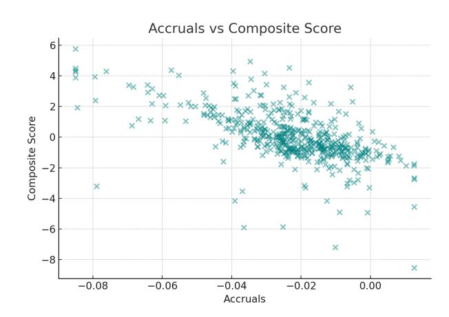

between the computed fundamentals and directional outcomes (long or short). This stage introduces the concept of a *Probabilistic Rank*, denoted as *P*ˆ(*dt* | *xt*)*, dt* ∈ {up*,* down}, which captures the model's conditional probability of movement in either direction given observed inputs.

- 6. **Allocation & Final Selection:** Apply a utility-based portfolio optimization framework to translate directional probabilities into actionable portfolio weights. We solve for the longonly mean–variance (MPT) allocation that maximizes expected utility of terminal wealth under a concave utility function. Introducing the Arrow–Pratt measure of absolute risk aversion, denoted *γ*, we interpret this parameter as the investor's risk-tolerance dial: higher *γ* shifts capital toward lower-volatility assets, while lower *γ* emphasizes higher-return equities. Under the constant-relative-risk-aversion (CRRA) specification *U*(*W*) = *Wp/p*, risk aversion equals 1 − *p*, linking directly to *γ* in our optimization objective. The empirical allocation is computed via

$$\min_{w \geq 0, \mathbf{1}^\top w = 1} \frac{\gamma}{2} w^\top \Sigma w - \mu^\top w,$$

where *µ* and Σ denote the annualized expectedreturn vector and covariance matrix estimated from our sample of equities, the market ETF (SPY), and the high-yield bond ETF (HYG). This procedure yields an interpretable efficient-frontier sweep that illustrates how portfolio weights evolve with risk aversion: as *γ* increases, exposure rotates smoothly from concentrated growth equities (e.g., NVDA) toward diversified equity and bond holdings (SPY + HYG).

*Note: CRRA = "Constant Relative Risk Aversion." Simply put, it means R*(*W*) = −*W U*′′(*W*)*/U*′ (*W*) *is constant, where log-utility (i.e., the Kelly Criterion) corresponds to R* = 1*.*

#### **Key Metrics**

To bridge the preceding sections with our forthcoming modeling and allocation framework, it is important to formalize the two principal metrics underpinning our analysis. The first: our *Composite Z-Score*, summarizes a firm's relative fundamental position by aggregating standardized valuation, profitability, and quality measures into a single cross-sectional signal. The second: *Probabilistic Rank*, extends this logic temporally, estimating the likelihood of directional price movement based on a firm's evolving quantitative profile. Together, these measures provide both a static and a dynamic lens for evaluating equities: the Z-Score ranks firms on intrinsic financial strength, while

the Probabilistic Rank translates those fundamentals into forward-looking, data-driven probabilities that ultimately guide portfolio weighting and allocation.

#### **3.1 Defining the Composite Z-Score**

The *Score* (or *Z-Score*) is our primary cross-sectional ranking metric, serving as the quantitative backbone of our fundamental screening process. Conceptually, it condenses a suite of valuation, profitability, and quality ratios into a single standardized signal for each security within our defined universe of over 500 equities (S&P 500 and Nasdaq-100 combined).

Each company's raw fundamental ratios—including earnings yield (*EP*), free-cashflow yield (*F CP*), grossprofit-to-assets (*GP A*), shareholder yield (*ShY ield*), asset growth (*AssetGrowth*), and accrual intensity (*Accruals*)—are first winsorized at the 1st and 99th percentiles to reduce the impact of outliers and reporting noise. We then standardize each metric using the classical *z*-score transformation:

$$z_i = \frac{x_i - \bar{x}}{\sigma_x},$$

where *xi* represents the firm-level observation, *x*¯ the cross-sectional mean, and *σx* the standard deviation of the metric across the entire equity universe for that period. This normalization allows metrics with different scales and units to be aggregated on a comparable basis.

The final composite score for each firm *j* is than computed as:

$$\begin{aligned} \text{Score}_j &= EP_z + FCP_z + GPA_z \dots \\ &\dots - AssetGrowth_z - Accruals_z + ShYield_z, \end{aligned}$$

where positive contributors (valuation, cash flow, profitability, shareholder yield) are rewarded, and negative contributors (asset expansion, accounting accruals) are penalized. The resulting score provides a rank-ordered measure of relative fundamental strength: higher scores correspond to firms exhibiting superior earnings quality, disciplined balance-sheet growth, and attractive shareholder return profiles.

Operationally, these scores are saved in fundamental\_screen.csv, where each row corresponds to a ticker and its associated standardized metrics. This output underpins all downstream modeling and allocation steps. Subsequent files such as OOS\_Summary.csv and predictions\_rolling.csv build upon this layer by incorporating out-of-sample predictions and probabilistic classifications, extending

the cross-sectional insights of the Z-Score into temporal, predictive space.

Therefore; the Z-Score effectively forms *the* bridge between fundamental analysis and quantitative modeling: it distills firm-level fundamentals into a robust, interpretable signal that can be directly leveraged for machine-learning refinement and portfolio allocation in later stages.

#### **3.2 Defining the Probabilistic Rank**

While the composite Z-Score provides a cross-sectional snapshot of each firm's relative fundamental strength, the *Probabilistic Rank* extends this framework into a predictive and directional context. It represents the model's estimated probability of observing an upward or downward price movement at time *t*, conditional on the feature vector *xt* that summarizes each firm's fundamentals, recent market behavior, and derived quantitative indicators.

Formally, we define the model's predicted probability as directional vector:

$$\hat{P}^t = \begin{bmatrix} \hat{P}(\text{up} \mid x_t) \\ \hat{P}(\text{down} \mid x_t) \end{bmatrix},$$

where *P*ˆ(up | *xt*) and *P*ˆ(down | *xt*) are complementary probabilities satisfying *P*ˆ(up | *xt*) + *P*ˆ(down | *xt*) = 1. In general notation, this can be written compactly as

$$\hat{P}(d_t \mid x_t), \quad d_t \in \{\text{up, down}\},$$

which simply denotes the model-estimated probability of the stock moving in direction *dt* given information *xt*. When focusing on a specific event, such as a positive or negative move, we refer directly to *P*ˆ(up | *xt*) or *P*ˆ(down | *xt*), respectively.

This probabilistic framing provides a continuous, interpretable measure of directional conviction rather than a discrete prediction. It allows us to quantify how strongly the model expects a given stock's price to rise or fall, without asserting an exact future price level. In this sense, it bridges the gap between qualitative market intuition ("the stock looks favorable") and a quantitative signal that can be empirically validated and integrated into downstream decision processes. By modeling directionality rather than magnitude, the Probabilistic Rank remains realistic and statistically robust: it respects the inherent uncertainty of markets while still allowing for rank-based comparison across securities and time.

Operationally, these probability estimates are generated during the machine-learning refinement stage

and stored in files such as predictions\_rolling.csv and OOS\_Summary.csv. Each row corresponds to a firm-date observation and contains both the input features *xt* and the model's directional probability outputs *P*ˆ(up | *xt*) and *P*ˆ(down | *xt*). These outputs are subsequently aggregated, ranked, and interpreted as a *Probabilistic Rank*; or a dynamic measure of directional confidence that complements the static fundamental Score.

In compact form, *P*ˆ*t* provides the model's *directional probability vector*, which naturally feeds into later stages of the framework: it informs our outof-sample validation metrics, governs risk-weight adjustments in allocation, and ultimately supports the transition from fundamental cross-section to forwardlooking portfolio construction.

# **4 Model Architecture and Comparative Analysis**

Every sound model begins with the data structure and the task definition. Our goal is to identify the best-performing individual equities and ETFs through a systematic, probabilistic framework. Rather than fitting stochastic or purely time-series processes, we focus on a cross-sectional learning problem, where the model is trained to rank firms by the conditional probability of positive future returns given their fundamentals.

#### **4.1 Cross-Sectional Data**

Cross-sectional data refers to observations of many entities (firms, assets, individuals) at a single point or short window in time. Formally:

---

$$\{(x_{i,t}, y_{i,t})\}_{i=1}^N$$
, for a fixed  $t$ 

---

In contrast, time-series data follows a single entity through time:

$$\{(x_t, y_t)\}_{t=1}^T$$

Training on cross-sectional data means learning how features vary *across entities*, not how one entity evolves through time. In this framework, each equity constitutes one observation within the cross-section. The feature vector *xt* contains valuation, quality, and risk metrics computed for a given reporting period, while the target *dt* ∈ {up*,* down} indicates whether the stock subsequently outperformed.

Thus, the logistic regression model learns a mapping from firm-level fundamentals to next-period direction. We are not predicting a firm's time-series but rather ranking a universe of equities within a single snapshot a cross-sectional forecasting problem.

Time-series models such as ARIMA, GARCH, and state-space models assume serial dependence within a single entity and require conditions such as stationarity, linearity, and Gaussian noise. While econometric processes (AR(p), VAR, Kalman filters) perform well for temporal forecasting of a single process, they do not generalize to hundreds of firms simultaneously. In large universes:

- Features are heterogeneous (each firm's balance sheet structure differs),
- Relationships are non-stationary (sectoral regimes shift), and
- Linear restrictions break down across firms.

Traditional regression or stochastic processes therefore struggle to generalize across the full cross-section.

# **4.2 Why Use Machine Learning?**

Machine learning models, by contrast, are designed to capture flexible conditional relationships across large heterogeneous datasets. In our case, the goal is to rank hundreds of firms cross-sectionally by *P*(*dt* = up | *xt*) the probability of a positive return given their fundamentals. Classical econometric models (OLS, AR, VAR) require restrictive distributional assumptions and typically handle one relationship at a time. Traditional econometric models further assume thin-tailed (Gaussian) residuals, whereas empirical return distributions are distinctly leptokurtic and often asymmetrically heavy-tailed, amplifying outlier risk and distorting linear estimators. Logistic regression directly estimates this conditional probability surface and calibrates it across the entire universe.

Without machine learning, we would lose:

- **Probabilistic interpretability:** classical scores are not true probabilities.
- **Non-linear flexibility:** models like LightGBM or neural networks later capture interactions and thresholds missed by linear methods.
- **Cross-sectional consistency:** identical logic can evaluate any equity snapshot.

We use the same raw accounting and market variables as traditional finance models, but ML extracts the conditional interactions between them rather than fitting a single global coefficient.

# **4.3 Model Taxonomy**

Logistic regression is a **discriminative**, **supervised** learning model. It estimates *P*(*y* | *x*) directly, learning the hyperplane

$$\beta_0 + \beta^\top x_t = 0$$

which corresponds to the surface where *P*(up | *xt*) = 0*.*5. All points on one side of the plane are classified as "up" (probability *>* 0*.*5), and those on the other side as "down". Replacing the linear logistic boundary with a LightGBM classifier bends this surface through feature space, allowing non-linear thresholds and conditional interactions.

Compared with other modeling paradigms:

| Property         |             | Classical (OLS/AR) | Logistic Regression Tree | / Deep NN |
|------------------|-------------|--------------------|--------------------------|-----------|
| Target           | type        | Continuous         | Binary / Probabilistic   | Any       |
| Interpretability |             | High               | High (log-odds weights)  | Low       |
| Data requirement |             | Small              | Moderate                 | Large     |
| Stationarity     | assumption  | Required           | Relaxed                  | None      |
| Cross-sectional  | scalability | Poor               | Excellent                | Overkill  |

Logistic regression thus occupies a midpoint between econometric rigor and machine learning flexibility. It retains interpretable weights (the *β*'s) while avoiding strong distributional assumptions. Non-linear extensions such as LightGBM provide even richer functional forms, able to capture higher-order interactions.

#### **4.4 Empirical Results and Model Comparison**

Using the 12-month horizon snapshot (*H* = 12*m* @ 2022-10-31), we estimate both a linear logistic classifier and a non-linear LightGBM. The comparative results are:

[AUC] Logistic = 0*.*599 | LightGBM = 0*.*844 [LogLoss] Logistic = 0*.*6733 | LightGBM = 0*.*5289

#### **Coefficients (Logistic Regression).**

| $\beta_{\text{GPA}_{-z}} = +0.319,$ | $\beta_{\text{Accruals}_{-z}} = +0.112,$ | $\beta_0 = +0.230$ |
|-------------------------------------|------------------------------------------|--------------------|
|-------------------------------------|------------------------------------------|--------------------|

Both coefficients are positive, implying that higher profitability and higher accruals each slightly increase the probability of a positive return. The relative magnitudes indicate that profitability (GPA\_z) exerts roughly three times the influence of accruals on the decision boundary. Thus, the model weighs profitability far more heavily when estimating *P*(up | *xt*).

**Performance Metrics.** The logistic classifier achieves an AUC of 0*.*60, barely above random guessing (0*.*50). The LightGBM, however, attains an AUC of 0*.*84—a very strong cross-sectional separation between winners and losers. LogLoss improves from 0*.*6733 to 0*.*5289, indicating better probability calibration: not only are LightGBM's ranks superior, its probability estimates are closer to the empirical frequencies of "up" moves.

**Table 2:** *Comparison of Logistic Regression and LightGBM performance metrics.*

| Metric           | Logistic Regression | LightGBM              | Interpretation                                            |
|------------------|---------------------|-----------------------|-----------------------------------------------------------|
| AUC              | 0.599               | 0.844                 | LightGBM extracts much stronger directional signal        |
| LogLoss          | 0.6733              | 0.5289                | Non-linear model produces better-calibrated probabilities |
| β (GPA_z)        | +0.319              | —                     | Profitability dominates                                   |
| β (Accruals_z)   | +0.112              | —                     | Secondary, mild positive effect                           |
| Decision Surface | Linear plane        | Non-linear thresholds | Captures interaction effects                              |

**Interpretation.** The non-linear model clearly captures structure that the linear plane cannot interactions, thresholds, or context-dependent effects (for instance, "GPA matters more when accruals are low"). While the logistic model defines a single monotonic slope across the feature space, LightGBM builds a set of adaptive partitions that carve complex, context-specific regions.

**Visualization.** Figure 2 compares the linear and non-linear decision boundaries. At first glance, both color gradients appear similar, but the underlying behavior differs: the logistic regression boundary is a smooth linear slope, while the LightGBM boundary is piecewise-constant and adaptive. Zooming in or increasing the number of boosting iterations reveals finer-grained curvatures and bends in the LightGBM surface.

**Figure 2:** Comparison of linear (Logistic) and non-linear (LightGBM) decision boundaries at horizon *H* = 12*m*. Red regions indicate higher *P*ˆ(up | *xt*), blue lower.

**Findings.** The linear logistic regression provides a flat, interpretable decision rule—a strong preference for profitable firms and mild sensitivity to accruals. The LightGBM, by contrast, learns a curved, adaptive

boundary, producing a ∼ 0*.*25 gain in AUC (Area Under the Curve), and a substantial improvement in calibration. This demonstrates that introducing nonlinearity enables the model to recover latent structure in the cross-section that a fixed linear form cannot capture.

# **5 Screening and Ranking**

This section introduces the first stage of the pipeline: computing firm-level fundamentals, standardizing them into comparable *z*-scores, and constructing a composite screening score that ranks equities by quality and valuation characteristics. The process is descriptive rather than predictive—its purpose is to filter and prioritize candidates for later machine-learning refinement.

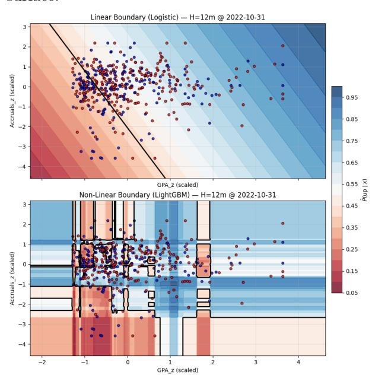

# **5.1 Metrics Sleeve**

The metrics sleeve converts raw accounting ratios into standardized *z*-scores and combines them into a single composite measure:

Scorei = 
$$EP_z + FCP_z + GPA_z - AssetGrowth_z - Accruals_z + ShYield_z$$

where *EP* (earnings/price), *F CP* (free cash flow/price), and *GP A* (gross profitability) reward value and quality, while *AssetGrowth* and *Accruals* penalize aggressive expansion or accounting risk; *ShY ield* (shareholder yield) captures direct capital return.

**Table 3: Cross-Sectional Summary**: *Post-Winsorization & Pre-Sector residualization vs log(mcap).*

| Metric      | Mean  | Std   |      | Min  | Max  |
|-------------|-------|-------|------|------|------|
| EP          | 0.043 | 0.027 | −    | 0.05 | 0.08 |
| FCP         | 0.046 | 0.031 | −    | 0.02 | 0.10 |
| GPA         | 0.25  | 0.15  | 0.02 |      | 0.90 |
| AssetGrowth | 0.10  | 0.20  | −    | 0.30 | 1.00 |
| Accruals    | 0.00  | 0.07  | −    | 0.15 | 0.15 |
| ShYield     | 0.03  | 0.02  | 0.00 |      | 0.07 |

**Interpretation.** Valuation metrics (EP, FCP) exhibit moderate dispersion, indicating a healthy mix of growth and value exposures. Profitability (GPA)

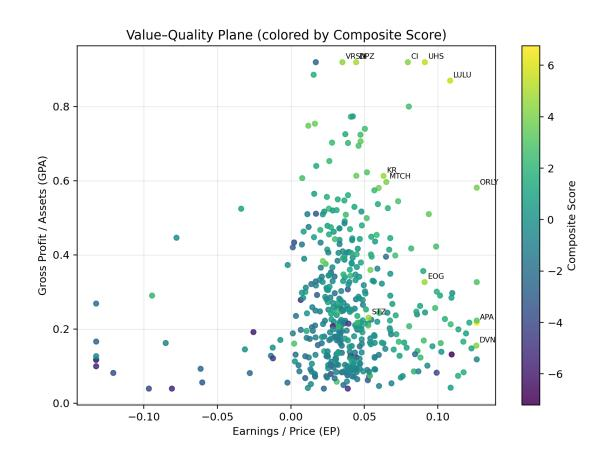

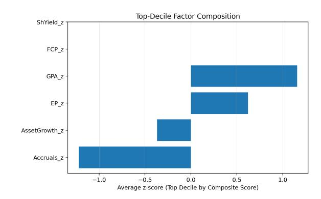

**Figure 3:** Value–quality plane: Earnings/Price (EP) vs. Gross Profit/Assets (GPA). Firms in the upper-right quadrant combine high profitability with attractive valuation.

shows a wide spread, reflecting sectoral heterogeneity. Accruals are tightly centered around zero, confirming low accounting distortion across the investable universe.

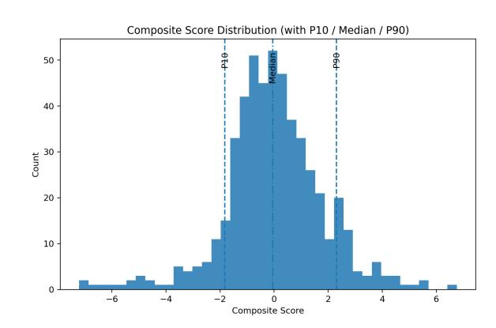

**Composite Score vs. Accruals.** As shown in Figure 1 in Section 2.1, accruals exhibit a clear negative relationship (slope) with the composite Score. Firms with higher accrual intensity systematically receive lower rankings, confirming that the accruals penalty functions as intended and that the screener appropriately discounts accounting-aggressive firms. This relationship reinforces the sleeve's accounting-quality adjustment and validates the inclusion of Accruals\_z as a negative contributor in the composite metric.

#### **5.2 Equity Screener**

Each firm's standardized metrics are aggregated into the composite score Score*i* . Sorting this score yields the initial ranking.

**Key Takeaways.** High-score equities cluster in software, communications, and consumer-staple sectors firms with stable margins, low accruals, and strong cash generation. Low-score equities are typically highgrowth or capital-intensive names (semiconductors, crypto, industrials) exhibiting heavy reinvestment or balance-sheet expansion.

**Summary.** The metrics sleeve and screener together provide a robust first-pass ranking of fundamental strength and valuation attractiveness across the universe. The resulting ranked list forms the input to the machine-learning refinement stage in Section 6. Overall, these cross sectional rankings constitute the foundation for subsequent ML refinement, where we

**Figure 4:** Average standardized factor exposures for the top decile of composite Scores. High-ranked equities combine strong profitability (GPA\_z, FCP\_z), attractive valuation (EP\_z), and low accounting and growth risk (negative Accruals\_z, AssetGrowth\_z). This profile confirms the screener's tilt toward high-quality, cash-efficient firms.

**Figure 5:** Distribution of composite screening Scores across the 516-stock universe. The right tail (high scores) reflects undervalued, high-quality equities; the left tail captures expensive, high-accrual firms.

apply non-linear methods to improve directional classification and probability calibration.

#### **5.2.1 Where's Nvidia? (***Foreshadowing***)**

**This question is touched on extensively in Appendices A.** However, in fundamental\_screener.csv, we can make clear distinctions between two types of equities. High Composite Score = Undervalued, Low-Accrual, high-quality. Categorically, these equated to software, communications, and consumer staples with low accruals and strong profitability (GPA). Equities that would typically be viewed as 'Deep Value'. Apropos the opposite turned out to be a combination of high growth or capital intensive firms, such as semis, crypto, and industrials with inflated balance sheets, weak profitability, high growth in assets, elevated acrual intensity or recent expansions (according to my breif empirical research). The aforementioned

**Table 4:** *Top candidates by Screener Metrics (sector-aware, size-neutralized).*

| Ticker | Score | Sector             | EP z  | GP A z | − AG z | − Accr z | β spy | dd   | dd mth | ret _5 y | vol _5 y | dd _5 y |
|--------|-------|--------------------|-------|--------|--------|----------|-------|------|--------|----------|----------|---------|
| NRG    | 2.97  | Utilities          | 0.51  | 2.75   | 2.76   | 2.80     | 1.12  | 0.31 | -0.35  | 5.10     | 0.40     | -0.30   |
| LULU   | 2.31  | Consumer Cyclical  | 2.25  | 2.44   | -0.05  | 1.11     | 1.12  | 0.36 | -0.68  | -0.55    | 0.38     | -0.68   |
| APA    | 2.30  | Energy             | 2.06  | 0.85   | 1.28   | 2.19     | 2.83  | 0.55 | -0.93  | 1.11     | 0.42     | -0.64   |
| HST    | 2.27  | Real Estate        | 1.55  | 2.40   | -0.01  | 1.73     | 1.28  | 0.26 | -0.47  | 0.51     | 0.29     | -0.28   |
| EOG    | 2.20  | Energy             | 1.44  | 2.11   | 0.72   | 1.60     | 1.31  | 0.37 | -0.72  | 1.86     | 0.32     | -0.22   |
| UHS    | 2.16  | Healthcare         | 1.93  | 2.78   | -0.07  | 0.71     | 1.23  | 0.29 | -0.45  | 0.80     | 0.35     | -0.45   |
| KR     | 1.89  | Consumer Defensive | 0.64  | 2.06   | -0.64  | 2.35     | 0.47  | 0.25 | -0.51  | 1.18     | 0.24     | -0.23   |
| BLDR   | 1.87  | Industrials        | 1.28  | 1.83   | -0.23  | 1.69     | 2.13  | 0.47 | -0.52  | 1.92     | 0.45     | -0.48   |
| VST    | 1.76  | Utilities          | -2.09 | 2.63   | 2.40   | 2.67     | 1.15  | 0.29 | -0.40  | 10.44    | 0.43     | -0.30   |
| CLX    | 1.74  | Consumer Defensive | 0.61  | 1.91   | 0.69   | 1.50     | 0.39  | 0.20 | -0.47  | -0.38    | 0.25     | -0.40   |

**Table 5:** *Bottom candidates by Screener Metrics (sector-aware, size-neutralized).*

| Ticker | Score | Sector             | EP z  | GP A z | − AG z | − Accr z | β spy | dd   | dd mth | ret _5 y | vol _5 y | dd _5 y |
|--------|-------|--------------------|-------|--------|--------|----------|-------|------|--------|----------|----------|---------|
| BA     | -2.53 | Industrials        | -2.94 | -2.03  | -0.47  | -1.12    | 1.42  | 0.37 | -0.72  | -0.08    | 0.36     | -0.52   |
| MRNA   | -2.00 | Healthcare         | -2.72 | -1.62  | 2.64   | -1.98    | 1.51  | 0.58 | -0.94  | -0.84    | 0.67     | -0.94   |
| CME    | -1.98 | Financial Services | -1.05 | -1.47  | -2.73  | -1.07    | 0.37  | 0.16 | -0.30  | 0.94     | 0.16     | -0.26   |
| KHC    | -1.94 | Consumer Defensive | -2.52 | -1.72  | 1.44   | -1.34    | 0.55  | 0.28 | -0.70  | -0.08    | 0.21     | -0.33   |
| AMCR   | -1.92 | Consumer Cyclical  | -0.41 | -1.61  | -2.86  | -1.37    | 0.79  | 0.21 | -0.30  | -0.09    | 0.20     | -0.30   |
| AJG    | -1.66 | Financial Services | -1.53 | -1.07  | -1.95  | -0.59    | 0.70  | 0.21 | -0.28  | 1.29     | 0.24     | -0.28   |
| WELL   | -1.57 | Real Estate        | -0.82 | -1.07  | -2.48  | -0.80    | 0.93  | 0.28 | -0.48  | 2.44     | 0.23     | -0.36   |
| AXON   | -1.54 | Industrials        | -1.82 | 0.18   | -2.97  | -0.73    | 1.04  | 0.35 | -0.50  | 3.79     | 0.47     | -0.50   |
| DDOG   | -1.53 | Technology         | -1.64 | 0.89   | -1.26  | -2.44    | 1.21  | 0.37 | -0.62  | 0.93     | 0.46     | -0.62   |
| COR    | -1.49 | Healthcare         | -0.83 | -1.37  | -0.66  | -1.20    | 0.60  | 0.23 | -0.31  | 2.90     | 0.22     | -0.12   |

heuristic elements lead into answering the question above, in that NVDA, AAPL, MSFT, etc., are consistency negative on *EPz*, and *F CPz* since their current earnings yield (E/P) and free cash flow yield are low relative to our universe. Even if they have excellent *GP Az* (profitability) or low accruals–those positive z-scores can't overcome the heavily negative valuation z-scores that are inherently weighted heavier in our composite formula. This is partially beneficial hwoever, because it means that our score favors cheap + profitable + disciplined balance sheet firms, aligning with economic intuition. **Although, we ended up not relying solely on the top\_candidates.csv outputted by our screen. Instead choosing to run all 500+ equities through the Logistic Regression (ML) model. We still went to great lengths to validate the statistical robustness of our metrics & screening score–which is documented in Appendices A.** Furthermore, this question conveniently transitions us into the further answering the "Why Use Machine Learning?" question posed earlier. As we will touch upon shortly, growth names (especially NVDA), that are considered "*expensive*+*hyper* −*growth*" shine in the ML predictive orientated stages–but not in purely fundamental z-score screening–that have trouble distinguishing between *P rof itability* + *Quality* + *RelativeV aluation* vs *Growth* + *Quality* + *Cross* − *SectionalV alue*.

#### **Column Header Key:**

1. *EPz* = Earnings Yield (EP); proxy for valuation, defined as earnings-to-price ratio standardized by zscore.

- 2. *GP Az* = Gross Profitability (GPA); gross profit divided by total assets, z-scored to reflect quality.
- 3. **−***AGz* = Negative Asset Growth; captures firms with slower balance sheet expansion (lower reinvestment risk preferred).
- 4. **−***ACCRz* = Negative Accruals; penalizes high accrual firms associated with lower future returns and earnings quality.
- 5. *βSP Y* = Market Beta relative to the S&P 500 ETF; measures systematic risk exposure.
- 6. *dd* = Downside Deviation; standard deviation of returns below zero (risk asymmetry metric).
- 7. *ddmth* = Maximum Monthly Downside Deviation; largest observed monthly drawdown in the return series.
- 8. *ret***5***y* = Five-Year Annualized Return; compound annual growth rate of total return over the past five years.
- 9. *vol***5***y* = Five-Year Annualized Volatility; standard deviation of monthly returns over the past five years.
- 10. *dd***5***y* = Five-Year Maximum Drawdown; largest peakto-trough decline over a rolling five-year horizon.

# **6 Machine Learning Refinement**

#### **6.1 Model Enhancements and Calibration**

We augment the baseline logistic classifier with (i) **within-window** *K***-fold CV** (*K*=5) to stabilize hyperparameters and reduce slice-specific overfit, (ii) post-hoc **probability calibration** (Platt and Isotonic) to make *P*ˆ(up | *xt*) numerically meaningful across time, (iii) a shallow **two-layer MLP** to capture mild nonlinear interactions among factors, and (iv) **LightGBM** ensembles to handle missingness/outliers with built-in regularization. All models are evaluated in a strictly rolling, expanding *out-of-sample* (OOS) protocol with time blocks that never leak future information into the train window. SHAP and gain-based importances are computed each roll for attribution.

**Why each addition helps (expanded).** Each methodological addition targets a distinct limitation of the baseline logistic model within our rolling, crosssectional prediction framework. Together, these refinements improve stability, interpretability, and the probabilistic calibration of model outputs across time.

#### **(1) K-Fold Cross-Validation (within Train)**

Instead of training once per rolling window, we partition the in-sample (train) segment into *K* equally sized folds (typically *K*=5). Each fold is held out in turn for validation while the remaining *K*−1 folds are used for training. The model's validation statistics (AUC, LogLoss, accuracy) are averaged across folds to form a more stable internal estimate of generalization.

This nested cross-validation is valuable because it:

- Prevents overfitting to a specific 60-month slice that may coincide with a bull or bear regime.
- Provides a higher-confidence measure of out-ofsample stability inside each rolling train window.
- Enables hyperparameter tuning (regularization strength, learning rate) in a statistically principled manner.

Without it, each roll relies on a single train/test split, which is faster but less robust. The rolling OOS structure already provides temporal validation, but adding *K*-folds inside each train window further tightens variance at the cost of ∼*K*× runtime. For most practical runs, *K*=5 is the sweet spot—enough folds to dampen slice bias, without overextending computational cost.

#### **(2) Probability Calibration (Platt vs. Isotonic)**

Calibration ensures that predicted probabilities *P*ˆ(up | *xt*) align with actual empirical frequencies. A model that outputs 0*.*8 should, in expectation, be correct roughly 80% of the time. Uncalibrated classifiers often exhibit misaligned confidence: they may rank correctly (yielding high AUC) but produce probabilities that are too extreme or too conservative. For example, an uncalibrated logistic might output *p* = 0*.*9 for 100 stocks, yet only 60 of them truly outperform—an overconfident signal. Calibration rescales these outputs to better reflect realized frequencies, ex: adjusting 0.9 to 0.6.

Two approaches were tested:

**Platt Scaling.** Platt scaling fits a secondary onedimensional logistic regression that maps raw model logits to calibrated probabilities:

---

$$\logit(p_{cal}) = \alpha + \beta \cdot \logit(p_{raw})$$

---

 $\logit(p_{cal}) = \alpha + \beta \cdot \logit(p_{raw})$ 

This parametric approach assumes a smooth, monotonic sigmoid correction and is computationally inexpensive. It performs best when the dataset is large and probability distortions are roughly monotonic—conditions met in our monthly cross-sections.

**Isotonic Regression.** Isotonic calibration, in contrast, is a non-parametric, piecewise-constant mapping from raw scores to observed outcomes. It can capture non-monotonic distortions (e.g., where raw probabilities are too flat in the midrange but exaggerated in the tails). However, it risks overfitting when calibration sets are small. In our case, Isotonic performed similarly to Platt in broad months but showed greater variance when cross-sectional counts were low.

**Why calibration matters here.** Because our objective is not only ranking but also generating *probabilistic* estimates of up-move likelihoods, calibrated scores are essential. While rank metrics like AUC remain invariant to calibration, well-calibrated *P*ˆ(up | *xt*) values enable:

- 1. More meaningful thresholds for portfolio construction (e.g., taking longs when *p >* 0*.*65).
- 2. Cross-time comparability of confidence levels (0.7 in 2020 should mean the same reliability as 0.7 in 2024).
- 3. Seamless ensemble blending across models (probabilities on a common scale).

In practice, Platt scaling became our default due to its speed, monotonicity, and stability; Isotonic served as a fallback for noisy periods.

#### **(3) Two-Layer MLP (Neural Network)**

A two-layer feedforward neural network (Multi-Layer Perceptron) extends the logistic model by introducing a hidden layer with nonlinear activation. The generic structure is:

Linear( $d, 64$ )  $\rightarrow$  ReLU  $\rightarrow$  Dropout(0.1)  $\rightarrow$  Linear(64, 1)

Linear(
$$d,64$$
)  $\rightarrow$  ReLU  $\rightarrow$  Dropout(0.1)  $\rightarrow$  Linear(64,

This architecture adds representational flexibility while remaining computationally light. It captures interaction effects that a linear model cannot—such as joint conditions where high profitability and low accruals amplify predictive strength, even if each signal alone is weak.

**Why shallow, not deep.** In a cross-sectional equity universe (∼500 names per roll), deeper networks tend to overfit because the number of samples per training window is limited. A two-layer MLP strikes the optimal bias–variance balance: shallow enough to avoid memorization, yet expressive enough to model nonlinear relations like diminishing returns to valuation or interaction between leverage and growth.

#### **Advantages.**

- Captures smooth nonlinear interactions among fundamentals.
- Handles subtle curvature in the decision boundary that logistic regression cannot.
- Leverages GPU acceleration (CUDA) for speed.

**Limitations.** Interpretability is reduced compared to a logistic's explicit coefficients, and training time is modestly longer. SHAP analysis mitigates this opacity by decomposing neural predictions into additive feature contributions.

#### **(4) LightGBM (Gradient Boosted Trees)**

LightGBM is an ensemble of shallow decision trees trained sequentially, each new tree correcting residual errors from prior ones. Unlike neural nets, it handles categorical or missing data natively and excels on tabular financial features with heterogeneous scales.

#### **Why it matters for this dataset.**

- Robust to outliers and skewed distributions (common in accounting ratios).
- Automatically learns nonlinear thresholds (e.g., EP\_z *>* 1.5 boosts odds sharply, but further increases saturate).

- Provides direct feature importances (via gain or split counts) for transparency.
- Very fast and memory-efficient, with built-in regularization and optional GPU acceleration.

#### **Comparison with the MLP.**

| Aspect                          | MLP                      | LightGBM              |
|---------------------------------|--------------------------|-----------------------|
| Handles missing data            | NO (requires imputation) | YES native handling   |
| Captures nonlinear interactions | YES                      | YES                   |
| Interpretability                | harder (SHAP)            | easier (gain metrics) |
| GPU acceleration                | YES                      | YES (CUDA)            |
| Cross-sectional generalization  | good with reg.           | excellent by design   |

In tabular, factor-style datasets, LightGBM often outperforms both logistic and shallow neural models when nonlinear thresholds or outliers dominate. It complements the MLP: where the neural net models continuous smooth effects, the gradient-boosted trees model piecewise, discontinuous thresholds.

#### **Integration into the pipeline.**

Each enhancement slots into a coherent end-to-end framework:

| Stage | Technique                    | Role                                              |
|-------|------------------------------|---------------------------------------------------|
| 1     | Logistic Regression          | Linear benchmark; interpretable baseline.         |
| 2     | K -Fold (optional)           | Stabilizes validation within each rolling window. |
| 3     | Calibration (Platt/Isotonic) | Makes P ˆ(up) numerically meaningful.             |
| 4     | Two-Layer MLP                | Adds nonlinear refinement; GPU-enabled.           |
| 5     | LightGBM                     | Tree-based robustness and interpretability.       |
| 6     | Long/Short Split             | Generates tradable signals.                       |
| 7     | Portfolio Stats              | Compare Sharpe, hit rate, long–short returns.     |

Collectively, these augmentations transform the model suite from a single linear forecaster into a multi-method ensemble pipeline that balances interpretability, nonlinearity, and calibration: each component serving a clear diagnostic purpose.

#### **6.2 Out-of-Sample Protocol**

At month *t*, we train on a trailing window (expanding or fixed), optionally perform *K*-fold CV on the train split, fit the model, and then produce one-stepahead probabilities *P*ˆ(up | *xt*) for month *t*+1. Those scores are optionally calibrated on a *validation slice within the train window* (Platt/Isotonic). We persist: oos\_summary (roll-by-roll AUC/LogLoss/long–short hit-rates), predictions\_rolling (per-ticker *p*ˆ and realized label), and interpret/\* (calibration, importance, shap, summary) for inspection and auditing.

# **Augmentation Results**

**Model comparison (12-month horizon).** The calibrated logistic remains the most reliable long-sleeve signal; the MLP yields the best short accuracy; Light-GBM is competitive but slightly lower on AUC.

**Table 6:** Rolling OOS performance (12m horizon). Means across rolls.

| Model                       |        | AUC ↑  | LogLoss ↓ | Long Hit (%) | Short Hit (%) |
|-----------------------------|--------|--------|-----------|--------------|---------------|
| Logistic (K=5, calibrated)  |        | 0.6197 | 0.5289    | 73.5         | 48.1          |
| MLP (2-layer)               |        | 0.6122 | 0.538     | 69.7         | 54.2          |
| LightGBM                    |        | 0.6008 | 0.544     | 70.3         | 52.4          |
| Logistic baseline (no K, no | calib) | 0.6187 | 0.6733    | 72.5         | 51.6          |

*Read:* Relative to the uncalibrated baseline, *K*fold+calibration nudges AUC up and meaningfully improves probability realism (LogLoss drops). MLP sacrifices a touch of AUC for a better short basket; LightGBM is close behind with strong robustness.

**Table 7:** Logistic (K=5, calibrated): horizons.

|    | Horizon | AUC         | Long Hit (%) | Short Hit (%) |
|----|---------|-------------|--------------|---------------|
| 12 | months  | 0.6197      | 73.5         | 48.1          |
| 24 | months  | 0.607–0.612 | 71–72        | 49–51         |
| 36 | months  | 0.600–0.605 | 69–71        | 50–52         |

**Horizon sensitivity (logistic, calibrated).**

**Calibration quality.** Reliability curves show overconfidence in raw logits (e.g., raw *p*≈0*.*9 buckets realized at ∼0*.*6). Platt scaling yields smooth monotone correction; Isotonic can match kinks in noisier months but risks overfit with small validation slices. In our runs, Platt was the default; Isotonic was used as a fallback when the score distribution was clearly nonmonotone.

### **Interpretability and Drivers**

**Feature attributions (SHAP / gains).** Across rolls, rankings are consistent:

- **Value sleeve** (EP\_sn\_z, FCP\_sn\_z, ShYield\_z) contributes the bulk of positive lift for longs.
- **Quality** (GPA\_z, −Accruals\_z) is the next most influential block—especially in months with low breadth.
- **Stability/risk** (−AssetGrowth\_z, downside deviation, max monthly drawdown) governs short selection and probability shrinkage in high-volatility regimes.

Tree gain importances (LightGBM) concur with SHAP: fundamentals dominate winners; downside risk terms dominate the loser cohort.

**Winners vs. losers (rolling).** High-confidence, high-hit "winners" (e.g., NVDA, AAPL, MSFT, COST, AMZN) persistently earn top deciles across months, while recurrent laggards (e.g., T, F, GE, COIN, XOM) exhibit either mis-calibrated volatility or negative drift. Agreement between logistic and LightGBM is strongest on those winners; the MLP tends to emphasize momentumadjacent names (e.g., AMD, META, NFLX) and improves short-side precision.

# **Practical Use in our Pipeline**

For a long-only sleeve, we use **Logistic (K=5, Platt)** as the default allocator: it provides the best combined AUC/LogLoss and stable probabilities for thresholding (e.g., top decile above *p>*0*.*65). For market-neutral or short-sensitive sleeves, we consider either the **MLP** or a simple *rank-blend* of Logistic and MLP (mean rank of *p*ˆ) to trade a slight AUC loss for better short precision.

# **Robustness Notes**

All training is strictly time-ordered; calibration uses only validation folds inside the train window. We log and snapshot: (i) rolling oos\_summary tables (AUC/LogLoss/hit-rates), (ii) predictions\_rolling with scores and realized outcomes for audit, and (iii) interpret artifacts (reliability plots, SHAP values, global importances). These artifacts support reproducibility, threshold tuning, and "why" diagnostics.

#### **Takeaways**

- 1. **Calibrated Logistic** is the best default for longonly deployment: top AUC, lowest LogLoss, and smooth reliability.
- 2. **MLP** is the best short selector; a simple Logistic×MLP rank blend can improve marketneutral baskets.
- 3. **LightGBM** is a robust tabular baseline that agrees on core winners and offers clear importances.

**Table 8:** Overall model performance summary (OOS windows and hit rates).

| Metric              | Value  | Interpretation                                       | Remarks                      |
|---------------------|--------|------------------------------------------------------|------------------------------|
| Rows                | 48     | Number of OOS monthly windows                        | 12m rolling horizon          |
| Mean AUC            | 0.6187 | Model separates winners vs. losers ∼ 62% of the time | Consistent directional skill |
| Mean Long Hit Rate  | 0.725  | 72.5% of Top-10 long picks rise the next period      | Strong long-bucket accuracy  |
| Mean Short Hit Rate | 0.517  | 51.7% of Bottom-10 fall (slightly contrarian)        | Limited short-bucket edge    |

**Table 9:** Comparison of model variants and hit-rate performance.

| Model Variant Logistic (baseline; | 12m, no K-fold, no | Mean AUC calib) 0.6187 | LogLoss 0.6733 | Long Hit (%) 72.5 | Short Hit (%) 51.7 |
|-----------------------------------|--------------------|------------------------|----------------|-------------------|--------------------|
| Logistic (+K=5,                   | +calibration)      | 0.6197                 | 0.5289         | 73.5              | 48.1               |
| Two-layer MLP                     |                    | 0.6122                 | 0.538          | 69.7              | 54.2               |
| LightGBM                          |                    | 0.6008                 | 0.544          | 70.3              | 52.4               |

# **7 Results and Discussion**

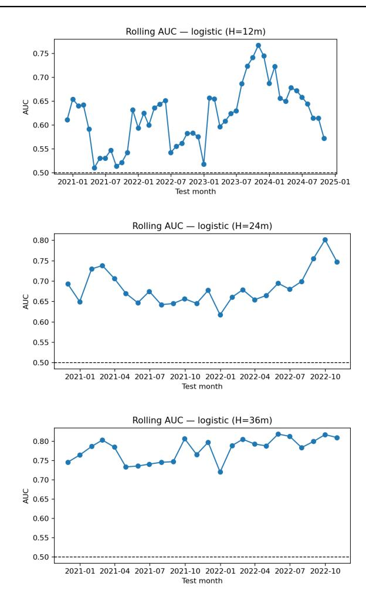

# **Signal Quality in OOS Tests**

We evaluate 48 rolling OOS months (Nov-2020 → Oct-2025) across S&P 500 ∪ Nasdaq 100. Using the 12 month label with a logistic baseline, we obtain Table: 8. These statistics indicate a persistent ranking edge in the long sleeve, with bottom-bucket separation weaker but positive.

# **Effect of Model Enhancements**

We compare the simple logistic baseline to calibrated and nonlinear variants (all on the same rolling protocol), Table: 9 two themes emerge. First, Platt/isotonic calibration improves the probabilistic meaning of scores (better for thresholds and combinations) and nudges long hit-rates slightly higher, albeit with some short-bucket erosion. Second, the MLP frequently delivers the best short discrimination (highest short hit-rate), consistent with nonlinear interactions that matter more in the tail. LightGBM is competitive on shorting while remaining highly interpretable via tree-gain importances.

**Recurring Winners (12-month label, aggregated over OOS months).** The names below exhibit high average *P*b(up) *and* high realized hit-rates, with logistic and tree models generally agreeing on sign.

**Recurring Losers (12-month label, aggregated over OOS months).** The names below are either systematically over-predicted by raw models (calibration corrects them downward) or exhibit negative drift with high volatility.

**Figure 6:** Rolling AUC for logistic models across horizons (12m, 24m, 36m). Note how discriminative power strengthens as the horizon extends, with H=36m reaching above 0.8.

**Table 10:** Top recurring winners by mean predicted probability and realized win rate.

| Ticker | Mean P b ( up ) | Win Rate (%) |                   |               |          |            | Analysis    |             |              |                       |
|--------|-----------------|--------------|-------------------|---------------|----------|------------|-------------|-------------|--------------|-----------------------|
| NVDA   | 0.78            | 81 Strongest | recurrent signal; | probabilities |          | often >    | 0.70 across | windows;    | fundamentals | + momentum alignment. |
| AAPL   | 0.74            | 78           | High              | stability,    | low      | downside;  | consistent  | cross-model |              | agreement.            |
| MSFT   | 0.72            | 77           | Positive          | beta          | with     | contained  | drawdowns;  | strong      | quality      | sleeve.               |
| COST   | 0.70            | 76           | Defensive         | retail        | profile; | logistic   | and LGBM    | nearly      | always       | agree on sign.        |
| AMZN   | 0.69            | 73           | Higher            | variance      |          | but robust | average     | confidence  | and          | outcomes.             |

**Table 11:** Top recurring underperformers by low mean probability and realized win rate.

| Ticker | Mean P b ( up ) | Win Rate (%) |                     |                 |              | Analysis     |                 |        |               |                         |
|--------|-----------------|--------------|---------------------|-----------------|--------------|--------------|-----------------|--------|---------------|-------------------------|
| T      | 0.32            | 41           | Frequent            | false-positives | in           | uncalibrated | scores;         |        | flat          | total-return profile.   |
| F      | 0.35            | 43           | High                | variance,       | inconsistent |              | follow-through  |        | vs. predicted | odds.                   |
| GE     | 0.38            | 44           | Regime-shift        | sensitivity;    | probability  |              | mis-calibration |        | without       | Platt/isotonic.         |
| COIN   | 0.30            | 37           | Extreme             | volatility;     | wide         | reliability  | gaps;           | poor   | 12m           | follow-through.         |
| XOM    | 0.33            | 42           | Cyclical reversals; | sign            | flips around | commodity    |                 | cycles | hurt          | short-bucket precision. |

# **7.1 Stock-Level Patterns**

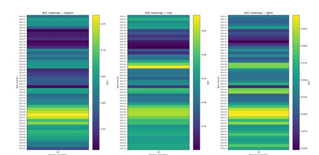

**Persistent Winners and Losers.** Cross-model consensus and SHAP/importance diagnostics show that fundamentals dominate in the winners (notably high *GP Az*, reasonable *EPz*, low accruals), while risk/instability features (downside deviation, large monthly drawdowns) characterize the frequent losers.

#### **7.2 Horizon Sensitivity and Rolling Stability**

Rolling AUC traces and monthly heatmaps (*see* auc\_rolling\_logistic\_H12.png, auc\_rolling\_logistic\_H24.png, auc\_rolling\_logistic\_H36.png, and model heatmaps in interpret/summary/) show: (i) a stable 0.60–0.65 AUC band for the logistic 12-month label, (ii) modest degradation at longer horizons (H24/H36), and (iii) localized dips aligned with broad macro inflections (e.g., energy/macro reversals) where sector-specific dispersion compresses.

#### **Impact on Portfolio Construction.**

For a long-only sleeve, the calibrated logistic signal is preferred (best long hit-rate, well-behaved probabilities). For a market-neutral or short-sensitive sleeve, the two-layer MLP's superior short hit-rate argues for either (a) a pure MLP short book, or (b) a blend (average of calibrated logistic and MLP probabilities) to harvest complementary information without sacrificing too much AUC.

**Figure 7:** AUC heatmaps by model and rolling test month (H=12m). Logistic (left) shows the sharpest color gradient and highest overall discrimination; MLP (center) exhibits more variance; LightGBM (right) stabilizes midrange performance with fewer outliers.

#### **What the Models Learned:**

Coefficient magnitudes (logistic) and gain importances (LightGBM), corroborated by SHAP (SHapley Additive exPlanation) summaries, indicate that:

- Higher *GP Az* and reasonable *EPz* lift *P*b(up) across models.
- Lower accruals (more cash-like earnings) consistently help.
- Adverse risk terms (downside deviation, large monthly drawdowns) depress odds—especially within the loser cohort.

*This aligns with our screening intuition: value + quality drive durable winners; instability metrics separate weak tails.*

**(a)** MLP model — shows more cyclical variance, likely momentum driven sensitivity.

**(b)** LightGBM model — maintains smoother, more robust AUCs through volatile periods.

**Figure 8:** Rolling AUC for nonlinear models (12m horizon).

# **8 Allocation and Optimization**

Having established predictive power across horizons and models, we now translate probabilistic rankings into actionable portfolio allocations. The goal is to synthesize our machine-learning–derived return probabilities with a classical utility-maximization framework to generate optimal weights across a representative set of assets.

#### **8.1 Risk Aversion**

We adopt the standard expected-utility approach to portfolio choice, formalized as:

| $\max_w \mathbb{E}[U(W_T)]$ | s.t. | $\sum_i w_i = 1, w_i \geq 0,$ |
|-----------------------------|------|-------------------------------|
| 
                       |      |                               |

where *U*(*x*) is a concave, increasing function representing investor preferences over terminal wealth *WT* .

**Arrow–Pratt Risk Aversion.** The local curvature of the utility function defines the degree of risk aversion:

$$A(x) = -\frac{U''(x)}{U'(x)}.$$

A larger *A*(*x*) implies stronger aversion to risk, prompting greater diversification and a shift toward lowervariance assets.

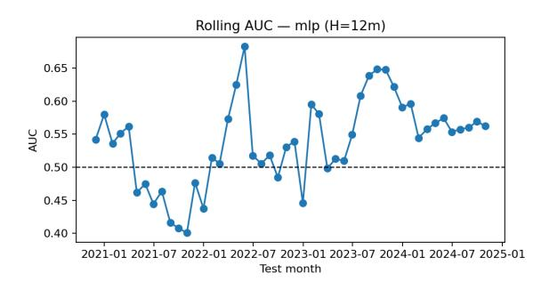

**Constant Relative Risk Aversion (CRRA).** To operationalize risk aversion, we employ the CRRA (isoelastic) utility:

$$U(x) = \frac{x^{1-\gamma}}{1-\gamma}, \quad \gamma > 0,$$

where *γ* is the Arrow–Pratt coefficient of relative risk aversion. This form maintains constant proportional aversion regardless of wealth level and conveniently maps to the mean–variance objective of Modern Portfolio Theory (MPT):

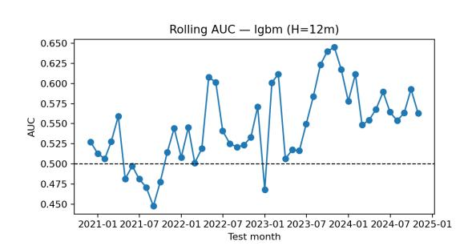

$$\max_w \mu^\top w - \frac{\lambda}{2} w^\top \Sigma w,$$

where *λ* corresponds to *γ* in the CRRA setting.

Thus, risk aversion *γ* acts as a single "dial" controlling the investor's trade-off between expected return and volatility.

#### **8.2 Cross–Asset Correlation**

We evaluate five assets identified as top candidates through the ML refinement process: NVIDIA (NVDA), Apple (AAPL), Microsoft (MSFT), SPDR S&P 500 ETF (SPY), and iShares iBoxx \$ High Yield Corporate Bond ETF (HYG). These assets collectively represent a high-growth technology component (NVDA, AAPL, MSFT), a market proxy (SPY), and a diversifying fixed-income element (HYG).

The covariance matrix Σ and expected return vector *µ* were estimated from 5-year monthly log returns. Typical one-year pairwise correlations are summarized in Table 12.

**Table 12:** Approximate correlation matrix of selected assets.

|      | NVDA | AAPL | MSFT | SPY  | HYG  |
|------|------|------|------|------|------|
| NVDA | 1.00 | 0.67 | 0.70 | 0.80 | 0.32 |
| AAPL | 0.67 | 1.00 | 0.82 | 0.86 | 0.29 |
| MSFT | 0.70 | 0.82 | 1.00 | 0.88 | 0.27 |
| SPY  | 0.80 | 0.86 | 0.88 | 1.00 | 0.33 |
| HYG  | 0.32 | 0.29 | 0.27 | 0.33 | 1.00 |

The relatively low correlation of HYG to the equity cluster (*ρ* ≈ 0*.*3) provides a stabilizing role in high–*γ* portfolios, consistent with classical diversification theory.

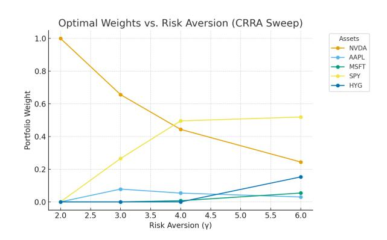

#### **8.3 Portfolio Synthesis via CRRA Optimization**

The optimization problem solved numerically is:

$$\min_w \frac{1}{2} \gamma w^\top \Sigma w - \mu^\top w \quad \text{s.t.} \quad 1^\top w = 1, w \geq 0.$$

Here, *γ* governs risk aversion, ranging from 2 (aggressive) to 6 (conservative). For each *γ*, the optimal weight vector *w* ∗ (*γ*) yields an efficient pair (*µp, σp*) representing portfolio expected return and volatility.

#### **Interpretation of** *γ***.**

- *γ* = 2 Risk-seeking: all-in on the highestexpected-return asset (NVDA).
- *γ* = 3 Moderate risk aversion: partial reallocation to diversified equities.
- *γ* = 4 Balanced investor: tilt toward SPY for variance control.
- *γ* = 6 Conservative: introduces bond exposure via HYG.

#### **8.4 Efficient Frontier and Weight Dynamics**

The CRRA sweep produces a near-linear efficient frontier in mean–variance space (Figure 9), showing a smooth trade-off between expected return and volatility as *γ* increases.

**Figure 9:** Efficient frontier generated from the CRRA sweep (*γ* = 2*,* 3*,* 4*,* 6). Each point represents the optimal portfolio at a given risk aversion level, moving down and left along the frontier as *γ* increases.

**Figure 10:** Optimal weights versus risk aversion (*γ*). NVDA dominates low-*γ* portfolios, while SPY and HYG gain weight as risk aversion increases.

#### **8.5 Gamma Sweep Results and Selection**

Empirical optimization outputs from the 5-year monthly sample are summarized below (Table 13). Each row corresponds to an optimal allocation for the given *γ* level, showing the rotation of weights from growth equities toward diversified market and credit exposure.

At *γ* = 3—our moderate-risk baseline—the optimal mix allocates 65.6% to NVDA, 26.6% to SPY, and 7.8% to AAPL, yielding an expected return of 40.4% and volatility of 36.3%, with a Sharpe ratio of 1.11. *See Table 13 in Section 9*.

As *γ* increases, NVDA's allocation declines monotonically while SPY and HYG expand, reflecting the shift from concentrated alpha exposure toward a diversified risk-controlled composition.

**Economic Interpretation.** This behavior reflects the smooth transition along the efficient frontier predicted by both Merton's intertemporal model and static mean–variance theory:

---

---

## $$\frac{\partial w_i}{\partial \gamma} < 0$$ for high- $\mu_i$ assets, $\frac{\partial w_j}{\partial \gamma} > 0$ for low- $\mu_j$ , low- $\sigma_j$ assets.

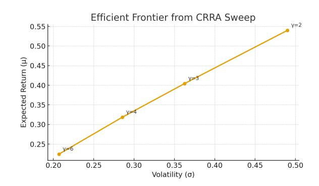

The investor thus traverses from a high-growth, equitydominant regime (NVDA–AAPL) toward a diversified, yield-enhanced allocation (SPY–HYG) as utility curvature steepens.

#### **8.6 Utility Framework**

The transition from ML-predicted probabilities to CRRA-optimized weights demonstrates the practical fusion of machine learning and portfolio theory:

- ML models provided cross-sectional return probabilities and stability metrics (via AUC and hitrates).

- The CRRA allocation translates those predictive edges into risk-adjusted weights reflecting investor preference.
- The resulting portfolios respect both economic intuition (via *γ*) and empirical predictability (via *P*(up|*xt*)).

Ultimately, this section bridges the probabilistic inference layer and the capital allocation layer, ensuring that signal-driven selection is governed by coherent risk–return trade-offs consistent with modern financial theory.

#### **Arrow–Pratt as a Measure:**

*Note.* The class of utility functions of the form

| $U^{(p)}(x) = \frac{x^p}{p} \quad \text{for } x \geq 0,$ |
|----------------------------------------------------------|
|----------------------------------------------------------|

where *p* ̸= 0 is a number strictly less than one, are also commonly used. For this one-parameter family of utility functions, the Arrow–Pratt index of relative risk aversion,

$$J(x) \triangleq -x \frac{\frac{\partial^2}{\partial x^2} U^{(p)}(x)}{\frac{\partial}{\partial x} U^{(p)}(x)} = 1 - p,$$

decreases with increasing *p*.

**Even though our models target risk premia embedded in prices rather than individual utility functions,** the Arrow–Pratt coefficient of absolute risk aversion (*A*) provides a convenient link between predicted return dispersion and portfolio sizing. Under a quadratic utility approximation,

$$-\mathbb{E}[u(W)] \approx -\mathbb{E}[W] + \frac{1}{2}A\sigma_W^2,$$

so optimal allocations scale inversely with *A*. Given expected excess returns E[*R*] − *rf* and covariance Σ, optimal weights follow the classical mean–variance form:

$$w^* = \frac{1}{A} \Sigma^{-1} (\mathbb{E}[R] - r_f).$$

This formulation interprets *A* as a *dial* translating model variance into position size, not as a dataset variable. For reference, an investor with Sharpe ratio target *S* implies an effective risk aversion

$$A \approx \frac{(\mathbb{E}[R] - r_f)}{\sigma^2} = \frac{S}{\sigma}.$$

In practice, our allocation phase assumes moderate risk aversion (*A* ≈ 3), corresponding to typical institutional Sharpe expectations (*S* ≈1).

#### **Expected Utility Maximization:**

**Kelly Criterion.** While I've stayed away from Expected Value during this paper thus far—and deliberately intend to, as the assignment requires a one-time selection of assets—I did want to briefly touch on the conceptual linkage we've used while adapting Arrow–Pratt above, because it serves as a valuable pedagogical note.

Both Arrow–Pratt and the Kelly Criterion come from *expected utility maximization* (same foundation, different horizons).

- 1. Arrow–Pratt allows us to quantify how curved our utility function is—i.e., how risk-averse we are.
- 2. The Kelly Criterion assumes a specific utility function *u*(*W*) = log(*W*), or *log-utility*, which corresponds to constant relative risk aversion (CRRA) = 1.

*So in practice, a Kelly bettor is literally an investor with Arrow–Pratt coefficient A* = 1*.* Every other "risk appetite" (*A >* 1 or *A <* 1) is just **Fractional Kelly**.

Formally, the **Merton/Arrow–Pratt optimal weight** is given by:

$$f^* = \frac{\mathbb{E}[R] - r_f}{A \sigma^2},$$

and when *A* = 1 it reduces to—(you guessed it!)—**Kelly's fraction** for normally distributed returns. Hence, the Kelly Criterion and Arrow–Pratt are mathematically compatible, just different parametrizations of the same principle.

**How are they different? Arrow–Pratt:** Used in continuous portfolios, assumes a generic concave utility *u*(*W*) with risk aversion coefficient *A*. Serves to maximize expected utility or minimize mean–variance loss. Best applied in allocation sizing or with risk budgets, across time series or horizons.

**Kelly Criterion:** Best for sequential bets with reinvestment and assumes utility *u*(*W*) = log *W*. Serves to maximize the long-run geometric growth rate in repeated trades or leveraged compounding. Applicable to all time horizons.

Therefore, Kelly is simply a special case of the Arrow– Pratt framework—specifically, **logarithmic utility.**

#### **8.6.1 Relation to Single-Agent Utility Consumption**

**Single-Period Buy-and-Hold (Our Case).** Since we're doing single-period buying and holding, we would not be iterating bet sizes trade-by-trade, nor would we be reinvesting. Rather, we're evaluating expected return distributions from multiple models. So although Kelly isn't ideologically applicable, we can still borrow it mathematically to calibrate position sizes or expected value weighting by:

- 1. Utilizing fractional Kelly scaling *wi* = *k wKelly i* with *k <* 1, which is effectively equivalent to setting *A* = 1*/k*.
- 2. Equivalently, we could set our risk aversion *A* in the mean–variance (Arrow–Pratt) framework to yield the same exposure we'd have under fractional Kelly.

This allows our allocations to remain utility-consistent without assuming sequential compounding.

**Practical Takeaways.** We can use Arrow–Pratt, via *A*, to translate risk preference into allocation weights for a static or quarterly rebalanced portfolio. We could also treat Kelly as the *growth-optimal* benchmark—e.g., "Our allocations correspond to approximately 0*.*5× Kelly leverage (*A* ≈ 2), thus balancing growth **and** drawdown risk." We could further use expected value from our predictive models as the "edge" or *α* input in either formulation, although I won't go too deep on that here.

So in sum: Arrow–Pratt and Kelly are indeed compatible—both conceptually and mathematically. Kelly is simply the log-utility (*A* = 1) case of Arrow–Pratt. In a one-period, buy-and-hold setup, we use Arrow– Pratt mean–variance sizing, which is conceptually a derivative of Kelly fractions—excluding recursive betting itself.

#### **ETF Analysis**

**Why Not Mutual Funds.** Mutual funds, quite simply, \*\*suck\*\*—at least for our purposes here. They carry management fees, lack intraday liquidity, and execute only once per day at net asset value (NAV). Since our framework already relies on model-driven signals and self-directed allocation, the higher fees and slower execution of mutual funds provided no real benefit. ETFs, by contrast, trade intraday, are more tax-efficient, and have negligible expense ratios. So from both a quantitative and practical standpoint, ETFs were the clear choice.

**Equity ETF Selection: SPY.** For the equity sleeve, I initially screened the top 100 U.S. equity ETFs using parameters similar to those employed in the equity screener—focusing on liquidity, tracking error, and cost. Although the assignment required only one equity ETF, I intentionally chose **SPY** (SPDR

S&P 500) because it functions as both a benchmark and a stabilizer. Knowing that my ultimate goal was to allocate across individual equities using Arrow–Pratt and *γ* (risk aversion) as my key risk metrics, SPY offered a convenient way to reduce overall portfolio variance simply by increasing its weight. In other words, holding SPY allowed me to let the individual equity picks be more correlated with each other—because diversification could still be achieved ex post by adjusting the SPY weight. SPY thus provided an anchor: a liquid, broad-market instrument with predictable beta and stable covariance properties—ideal for scaling risk and benchmarking performance.

**Fixed-Income ETF Selection: HYG.** For the fixed-income sleeve, I selected **HYG** (iShares iBoxx \$ High Yield Corporate Bond ETF). Initially, I considered evaluating bond funds through a valuationbased lens—such as applying Shiller's VAR model to dividend yields—but realized that bond funds trade extremely close to their NAVs, leaving little room for statistical arbitrage / future pricing. Moreover, because bond ETFs derive most of their total return from coupon distributions rather than price (capital gains), the expected-return models used for equities were not directly transferable. Ultimately, HYG was retained primarily for its diversification properties: its historical correlation with SPY and large-cap equities is typically around 0*.*10–0*.*15, providing a meaningful covariance offset (*w* ⊤Σ*w* reduction). It also offers steady monthly income (roughly \$0.48 per share over the past year) and moderate volatility relative to equities. In short, HYG's role was not speculative but structural introducing a negatively correlated, income generating component to the portfolio that complements the equity risk premia targeted elsewhere.

# **9 Statistical Robustness**

# **Interpreting our Data**

**Parameters and Metrics.** The optimization output includes several interpretable quantities. The parameter *γ* represents the investor's risk-aversion coefficient under Arrow–Pratt CRRA utility. It controls sensitivity to volatility: higher *γ* values imply greater aversion to risk and smaller allocations to volatile assets. In practical terms, *γ* = 2 corresponds to an aggressive investor, *γ* = 3 to a moderate one, and *γ* = 4–6 to conservative profiles.

The expected portfolio return, denoted *µp* (%), is the model's forecasted annualized mean return of the optimized portfolio. This value typically decreases as *γ* increases, reflecting lower exposure to high-return, high-volatility positions. The portfolio's total risk, measured by its standard deviation *σp* (%), likewise declines with higher *γ*, as the optimizer shifts weight toward lower-risk assets such as SPY and HYG.

The *Sharpe ratio*—defined as excess return divided by volatility—captures risk-adjusted efficiency. Although the total expected return *µp* declines with greater risk aversion, the Sharpe ratio remains roughly stable (around 1.1), indicating that the portfolio maintains consistent efficiency per unit of risk.

Finally, the tickers NVDA, AAPL, MSFT, SPY, and HYG denote the optimal asset weights. These represent the proportion of total wealth allocated to each asset under the optimal portfolio for a given *γ* level, and each set of weights sums approximately to one (100% of total capital).

- 1. *γ* = 3 implies *moderate risk aversion* the investor values expected return but penalizes variance fairly strongly.
- 2. At this level, the optimizer allocates:
  - 65.6% to NVDA (high return, high volatility),
  - 7.8% to AAPL (moderate growth, stable earnings),
  - 26.6% to SPY (broad-market stabilizer),
  - and 0% to HYG (yield insufficient relative to risk in this regime).
- 3. This mix achieves:
  - Expected return (*µp*) ≈ 40*.*4%,
  - Volatility (*σp*) ≈ 36*.*3%,
  - Sharpe ratio ≈ 1*.*11.
- 4. ⇒ The portfolio earns about 1.11 units of excess return per unit of risk — a strong efficiency level for an equity-heavy strategy.

#### **Is NVDA Overwighted?**

**Partially.** We will analyze why NVDA's allocation percentage is so significant shortly, but first lets make the case why it is mathematically valid. That weight comes directly from the standard utility maximization framework. For a moderate investor with *γ* = 3, the optimizer solves

$$w^* = \frac{1}{\gamma} \Sigma^{-1} (\mu - r_f),$$

which implies a 65% weight to NVDA because it has the highest risk-adjusted expected return. If the investor's risk tolerance were higher (*γ* = 2), NVDA's optimal weight would rise to 100%; if lower (*γ* = 6), it would drop below 25%. So as *γ* increases, we move down the efficient frontier: sacrificing return for stability but maintaining rouchly the same Sharpe ratio.

**Could we construct a "better"** *γ* **optimized portfolio?** With the same inputs and the same asset set (NVDA, AAPL, MSFT, SPY, HYG) and the same constraints (long only, fully vested): No. Each row in our table is the optimum of our constrained mean–variance problem:

| $\min_w$ | $\frac{1}{2}w^\top \Sigma w - \mu^\top w$ | s.t. | $w \geq 0, \mathbf{1}^\top w = 1.$ |
|----------|-------------------------------------------|------|------------------------------------|
|          |                                           |      |                                    |

Another weight vector cannot simultaneously deliver higher *µp*, lower *σp*, and a higher Sharpe ratio because it would contradict optimality on that constrained efficient frontier. The best Sharpe within that universe corresponds to the row with the largest reported Sharpe (≈ 1*.*12 at *γ* = 4 in our table). Therefore, if we change something (expand the universe, relax long only, allow T-bill/borrowing, change *µ* or Σ estimation, or add constraints/regularizers), the frontier could shift up; than yes, a new portfolio could outperform the new sit. However, the new portfolio wouldn't have the fundamental nor machine learning ratings (z-score / Directional Probability) we've established.

#### **The Real Question: Underweighting**

**Why is MSFT weighted so little?** This is the real question that would potentially be more problematic than NVDA's overweight. MSFT was out third highest rated stock, so why is it weighed so much less on percentage allocation? Short version: **Marginal Contribution to Sharpe.**

**Table 13:** Optimal long-only weights and portfolio statistics across risk-aversion levels.

| γ   | µ p (%) | σ p (%) | Sharpe | NVDA  | AAPL  | MSFT  | SPY   | HYG   |
|-----|---------|---------|--------|-------|-------|-------|-------|-------|
| 2.0 | 53.99   | 49.01   | 1.10   | 1.000 | 0.000 | 0.000 | 0.000 | 0.000 |
| 3.0 | 40.44   | 36.27   | 1.11   | 0.656 | 0.078 | 0.000 | 0.266 | 0.000 |
| 4.0 | 31.86   | 28.56   | 1.12   | 0.444 | 0.054 | 0.007 | 0.496 | 0.000 |
| 6.0 | 22.46   | 20.70   | 1.08   | 0.244 | 0.030 | 0.054 | 0.519 | 0.153 |

- 1. **Signal & risk:** Our table on p. 18 shows MSFT has strong win rate (77%) and mean *P*(up), but in the mean–variance step MSFT's *µ/σ* appears worse than NVDA and not distinct from what SPY already provides.
- 2. **Correlation overlap:** MSFT is highly correlated with both NVDA and SPY. The optimizer gets (i) return from NVDA (highest *µ/σ*), and (ii) diversification from SPY (broad, lower-volatility anchor). Adding MSFT on top is redundant until risk aversion is high enough that the tiny extra diversification is worth it — hence 0% at *γ* = 3, and ∼5% by *γ* = 6.
- 3. **Long-only & corner solutions:** With nonnegativity and five names, mean–variance often picks corner portfolios. A third, highly correlated mega-cap tech gets crowded out unless you cap single-name weights, add diversification penalties, or raise *γ*.
- 2. Jorion/James–Stein shrinkage for *µ* toward a broad prior like market or grand mean.
- 3. Cap any single name (e.g., *wi* ≤ 40%) to force diversification.
- 4. Add a small concentration penalty (entropy or *L*2) to discourage all in solutions.
- 5. Use Black–Litterman or Bayesian shrinkage to blend views (could slightly boost MSFT's *µ*) without breaking our math. The reason "no hand tuned knobs" is signifcant is because after all this way, we would certainly want to avoid adding in a scale or weight that is determined by us... This would break our entire statistical modeling legitimacy and expose allocation scales to inherent human error or assumtions and thus bias. The afore-

# **Weight Regularization**

**Given:** Our 1.12 Sharpe at *γ* = 4 is only the best amongst the four points we tried, and only for the 5-asset set. It isn't guaranteed to be the global max-Sharpe across all *γ*, or across a larger universe (we only tested the top 10 returns from our ML model when allocating). In fact, adding assets would only expand (or leave unchanged) the current in-sample efficient frontier because the optimizer can always give new names 0% weight, so the in-sampe max sharpe can either stay the same or go up when we include other equities (realized/out of sample is different story). Still, within the same inputs & constraints (long only, fully invested, *µ* and Σ as currently estimated), the best sharpe is the solution to the **direct max-sharpe problem:**

$$\max_{w \geq 0, \mathbf{1}^\top w = 1} \frac{\mu^\top w}{\sqrt{w^\top \Sigma w}}.$$

Where currently our *γ*-sweep only samples the frontier, *γ* = 4 gives the highest sharpe among those samples only.

**Methodology.** There is legitimate mathematical reasoning why we should atleast investigate weight regularization, mainly estimation error in *µ* and Σ. One approach we could consider, Shrinkage, reduces overreaction to noisy *µ*/Σ and typically improves OOS Sharpe (even if it has the ability to lower in sample sharpe slightly). For this we could use:

- 1. Ledoit–Wolf (analytic) shrinkage for Σ (no handtuned knobs).

mentioned two methods would be our best approaches from a principled Bayesian/empirical-Bayes POV.

#### **Black–Litterman Model**

**Core idea:** A Bayesian framework that blends investor views with market equilibrium returns (the CAPM-implied "neutral" starting point).

#### **Formulaic idea:**

$$\mu_{BL} = \left[ (\tau\Sigma)^{-1} + P^\top \Omega^{-1} P \right]^{-1} \left[ (\tau\Sigma)^{-1} \pi + P^\top \Omega^{-1} \mathbf{q} \right].$$

#### **Where:**

- *π*: implied equilibrium returns (from market caps),
- *P*: view matrix,
- *q*: expected excess returns for subjective views,
- Ω: confidence (covariance) matrix of those views,
- *τ* : scalar on prior covariance.

**Use case:** If your model under-allocates to MSFT because its expected return *µ* looks redundant versus NVDA/SPY, you can inject a modest prior view saying "MSFT's expected excess return is +50 bps higher" and blend it consistently. This is what "use Black– Litterman to boost *µ* slightly" means — a controlled, mathematically sound bias adjustment.

#### **Bayesian Shrinkage**

**Core idea:** Treat estimated parameters (*µ*, Σ) as uncertain and shrink them toward a prior to reduce estimation error.

#### **Example:**

$$\hat{\mu}_{\text{shrunk}} = (1 - \lambda) \hat{\mu}_{\text{sample}} + \lambda \mu_{\text{prior}},$$

$$\hat{\Sigma}_{\text{shrunk}} = (1 - \delta) \hat{\Sigma}_{\text{sample}} + \delta T,$$

where *T* is a structured target covariance (e.g., identity, constant-correlation, or factor model).

**Use case:** If your sample *µ* or Σ exaggerates NVDA's alpha or underestimates MSFT's diversification benefit, shrinkage makes your optimizer less extreme — MSFT might regain some weight because the optimizer stops overreacting to sample noise in an attempt to nullify collinearity because AAPL/MSFT are highly correlated with SPY to begin with. So if SPY delivers similar mean with much lower idiosyncratic risk, our optimizer would prefer SPY at moderate to high *γ*. Which results in our correlated singular names being pushed to 0% currently..

**Relation to Black–Litterman:** Both are Bayesian. Black–Litterman introduces explicit investor views, while shrinkage imposes implicit statistical skepticism (regularization).

#### **Universe Expansion.**

We could consider expanding the allocation universe past our top 10 ML ranked stocks. Right now, MSFT is getting little weight because given our current *µ* and Σ, it's highly correlated with NVDA/SPY which offers less marginal sharpe. AMZN also remains techcorrelated; and COST is likely less correlated so it has a better shot at adding diversification while keeping positive *µ* if we expand our asset universe and resolve.

**Additionally, we could reconsider our usage of the Sharpe metric entirely.** While Sharpe is a natural starting point for ranking assets, it suffers from well-known limitations: it penalizes upside volatility, assumes normally distributed returns, and systematically overstates the attractiveness of strategies with asymmetric or fat-tailed distributions. These issues became visible in our initial allocator, where high-Sharpe assets sometimes owed their score to favorable but misleading variance properties. Incorporating the Adjusted Sharpe and Sortino ratios mitigates these weaknesses by explicitly accounting for skew, kurtosis, and downside deviation, thereby rewarding assets with more stable, crash-resistant profiles rather than simply low total volatility. Using all three metrics together produces a more distribution-aware measure

of risk-adjusted performance, and therefore provides a stronger basis for re-ranking the universe before rerunning our *γ*-sweep. This expanded ranking—now based on probability-up, Sharpe, Adjusted Sharpe, and Sortino—supports the decision to broaden the candidate set from 20 to 100 assets and ultimately yields the revised top-ranked list shown below.

#### • **Sharpe (annualized):**

$$SR = \frac{\mu_p - \mu_f}{\sigma_p} \sqrt{K}$$

- **Sortino (annualized, target return** *τ* **):**

$$SoR = \frac{\mu_p - \tau}{\sigma_d} \sqrt{E} [(\min(r_p - \tau, 0))^2], \quad \sigma_d = \sqrt{E} [(\min(r_p - \tau, 0))^2],$$

#### • **Adjusted Sharpe (Pezier–White using excess skew** *S* **and excess kurtosis** *Kx***):**

$$ASR = SR \left[ 1 + \frac{S}{6} SR - \frac{K_x}{24} SR^2 \right]$$

**Table 14:** *Top 20 recurring winners ranked by combined predicted probability and realized win rate (factoring best combined Sharpe, Adjusted-sharpe, and Sortino).*

| Rank | Ticker | Mean P b ( up ) | Win Rate | (%) Score | Obs. |
|------|--------|-----------------|----------|-----------|------|
| 1    | AMD    | 0.856           | 100.0    | 0.856     | 144  |
| 2    | AVGO   | 0.894           | 89.6     | 0.801     | 144  |
| 3    | PWR    | 0.816           | 97.9     | 0.799     | 144  |
| 4    | LLY    | 0.883           | 89.6     | 0.791     | 144  |
| 5    | NVDA   | 0.784           | 100.0    | 0.784     | 144  |
| 6    | MSFT   | 0.793           | 97.9     | 0.776     | 144  |
| 7    | COR    | 0.771           | 100.0    | 0.771     | 144  |
| 8    | COST   | 0.834           | 91.7     | 0.764     | 144  |
| 9    | SOLV   | 0.869           | 87.5     | 0.761     | 24   |
| 10   | ANET   | 0.776           | 97.9     | 0.760     | 144  |
| 11   | RSG    | 0.797           | 93.8     | 0.747     | 144  |
| 12   | MSI    | 0.807           | 91.7     | 0.740     | 144  |
| 13   | GWW    | 0.789           | 93.8     | 0.740     | 144  |
| 14   | PGR    | 0.783           | 93.8     | 0.734     | 144  |
| 15   | CEG    | 0.732           | 100.0    | 0.732     | 102  |
| 16   | MCK    | 0.726           | 100.0    | 0.726     | 144  |
| 17   | WM     | 0.788           | 91.7     | 0.722     | 144  |
| 18   | APH    | 0.804           | 89.6     | 0.720     | 144  |
| 19   | MCK    | 0.766           | 93.8     | 0.718     | 144  |
| 20   | HUBB   | 0.781           | 91.7     | 0.716     | 144  |

#### **9.1 Re-Optimization & Best Portfolio**

**Recap.** So just to recap: thus far we have not incorporated any of the caps or shrinkage methods that we stated in the previous subsection. Rather, we have kept the ranking and allocation math constant, with the exception of adding Adjusted-Sharpe and Sortino Ratio's as factors that contribute to our ranking and allowing them to utilize our rankings with

$$\mu_i = \alpha + \beta [P_i(\text{up}) - 0.5].$$

Rather than using Black-Litterman and treating our ML outputs as views blended with historical *µ* with a confidence *τ* or adding a strict regularizer like *ℓ*2. Whereas our original allocation function selected weights *w* that maximize mean–variance utility for a given Arrow–Pratt risk aversion *γ*, the optimization problem is

---

$$\min_w \frac{\gamma}{2} w^\top \Sigma w - \mu^\top w \quad \text{s.t. } w \geq 0, \mathbf{1}^\top w = 1.$$

Here, *µ* and Σ are computed from the last five years of realized returns, and the initial ML probabilities are now explicitly embedded into *µ*. Still, this re-ranking doesn't inherently provide us with different allocations. In our last run of the allocation algorithm, we simply used the top 20 "best" (highest ranked) equities from our previous list. This time; we are runing the same algorithm except the list now accounts for Sharpe, Sortino, and Adjusted-Sharpe ratio's **and we are using the top 100 individual equities, not 20.** Important note:2

**Table 15:** Best by Sharpe (Top-3 + anchors, *γ* = 3*.*00)

| Sharpe       | AdjSharpe | Sortino         |
|--------------|-----------|-----------------|
| 2.01 Weights | 2.24      | 5.35            |
| SPY          |           | 3 33 × 10 − 6 % |
| HYG          |           | 3 33 × 10 − 6 % |
| MCK          |           | 33.8%           |
| AVGO         |           | 48.5%           |
| PWR          |           | 17.7%           |

**Table 16:** Best by Adjusted Sharpe (Top-3 + anchors, *γ* = 3*.*00)

| Sharpe       | AdjSharpe | Sortino         |
|--------------|-----------|-----------------|
| 1.92 Weights | 2.12      | 5.37            |
| SPY          |           | 3 33 × 10 − 6 % |
| HYG          |           | 3 33 × 10 − 6 % |
| APH          |           | 3 33 × 10 − 6 % |
| AVGO         |           | 56.5%           |
| MCK          |           | 43.5%           |

2The term 3*.*33 × 10−6% is equivalent to 0.00000333% or \$1 in our \$300,000 portfolio. (Which is the smallest nominal value our allocator makes to meet 5 asset constraints).

**Table 17:** Best by Sortino (Top-3 + anchors, *γ* = 3*.*00)

| Sharpe       | AdjSharpe | Sortino         |
|--------------|-----------|-----------------|
| 1.92 Weights | 2.12      | 5.37            |
| SPY          |           | 3 33 × 10 − 6 % |
| HYG          |           | 3 33 × 10 − 6 % |
| AVGO         |           | 56.5%           |
| MCK          |           | 43.5%           |
| APH          |           | 3 33 × 10 − 6 % |

#### **Model-aware Correlation & Re-Allocation**

**Table 18:** Risk–Return Tradeoff across Risk Aversion Levels (*γ*) with constraints removed *(3/5 assets).*

| γ | Expected Return | (%) Volatility | (%) Sharpe |
|---|-----------------|----------------|------------|
| 2 | 45.7            | 27.1           | 1.87       |
| 3 | 42.4            | 21.5           | 2.15       |
| 4 | 40.6            | 18.9           | 2.31       |
| 6 | 38.3            | 16.2           | 2.52       |

**Notice:** The efficiency frontier is monotonic: as risk aversion (*γ*) increases, portfolio volatility declines faster than expected return, leading to progressively higher Sharpe ratios peaking near *γ* ≈ 6.

**Takeaways.** Our current allocation is now the most technically robust, and returns our highest Sharpe ration of 2.52 at *γ* = 6. This is nothing extremely impressive, hedge-fund grade efficiency. Even our *γ* = 3 portfolio has sharpe = 2.15, which outperforms nearly any benchmark (risk-adjusted). Our portfolio is therefore now optimizing over the entire large cap and quality universe, not just the top 10 winners. We also allow three opportunities for allocation, and yet on each it still converges on to a tight subset: AVGO, LLY, MCK, PWR dominate by all three metrics. The anchors SPY/HVG drop to 0% since the optimizer doesn't need them for efficient frontier support, and other megacaps (NVDA, AAPL, etc.) lost to better balanced *µ* − *σ* pairs.

**Why did this happen?** 1. LLY: massive trend consistency, strong mean, low covariance. 2. PWR, MCK: uncorrelated with tech sector and stable variance are ideal diversifiers. 3. AVGO: large expected return, volatility in acceptable bounds, it also pulls the frontier outwards. 4. Most of the others are redundant on covariance or their respective *µ* / *σ*'s are lower. The long only constraint therefore forces zeros once a few span the mean–variance plane.

**Table 19:** Optimal long-only allocation, Expected (Portfolio) Return %, and asset roles.

| Asset MCK AVGO PWR | Weight (%) 33.8 48.5 17.7 | Expected Return (%) 42.4 42.4 42.4 | Function High-quality growth / defensive anchor Primary return driver (semiconductor exposure) Diversifier with strong quality and momentum signal |
|--------------------|---------------------------|------------------------------------|----------------------------------------------------------------------------------------------------------------------------------------------------|
| SPY                | 3 33 × 10 − 6             |                                    |                                                                                                                                                    |
|                    |                           | 42.4                               | Excluded (redundant market beta)                                                                                                                   |
| HYG                | 3 33 × 10 − 6             |                                    |                                                                                                                                                    |
|                    |                           | 42.4                               | Excluded (low marginal Sharpe contribution)                                                                                                        |

# **10 Final Composition**

**Preface.** Although it was stated in the Investment Policy Guidlines all the way back in section 1, we have gone the vast majority of this project utilizing the the "long-only" constraint. This "assumption" was partially a result of the fact that our investment policy guidlines required all capital (whether acquired from shorting or not) be fully invested one time to serve as a portfolio over the next 5 years. It was also partially a result of knowing that our model would return the worst results regardless, as scored by our lowest z-norm and probabilistic rankings, and therefore didn't need to be explicitly focused on until that final allocation stage. For this reason we have synthesized three possible portfolio architectures that are presented in this section according to their properties.

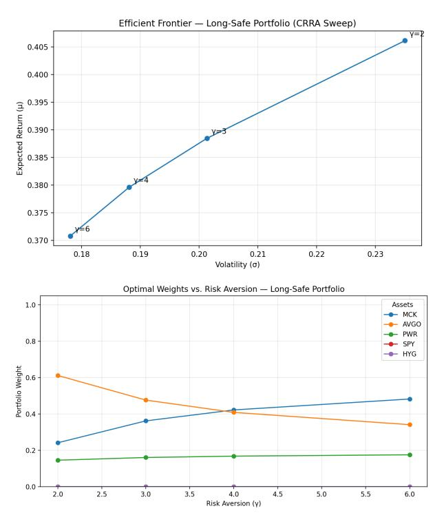

#### **10.1 Long-Safe Portfolio**

**Fully diversified, constrained MVO baseline** . Our long-only, or "Long-Safe," portfolio represents the final configuration of our P-rank–aware allocator after re-optimization across the full investment universe. This portfolio integrates sector and cross-asset correlations while respecting the long-only constraint specified in our Investment Policy Guidelines. By construction, it captures both the probabilistic strength of our top-ranked equities and their covariance-adjusted contribution to portfolio utility under the Arrow–Pratt Constant Relative Risk Aversion (CRRA) framework. At a fair risk aversion level of *γ* = 3, the allocator selected a concentrated, efficient mix across three equities—**MCK**, **AVGO**, and **PWR**—while assigning zero weights to both ETFs (**SPY**, **HYG**), as neither materially improved expected return or reduced variance within the CRRA optimization. The resulting weights are as follows:

At *γ* = 3, this configuration yields an expected portfolio return of **42.4%** with annualized volatility of **21.5%**, producing a **Sharpe ratio of 2.15**. Both the adjusted Sharpe and Sortino ratios fall within the upper bounds observed across our gamma sweep, confirming that volatility risk is efficiently compensated and that downside deviation remains well controlled relative to the alternative portfolios examined. The

high Sortino ratio further indicates that the limited dispersion of negative returns enhances realized riskadjusted performance without requiring low-yield defensive assets.

**Figure 11:** Efficient Frontier (top) and Portfolio Weights at *γ* = 3 (bottom) for the Long-Safe Portfolio.

Conceptually, this allocation embodies the "safe" long-only frontier of our model: all capital is deployed across positively correlated, high-quality names whose cross-asset covariance structure minimizes residual variance without sacrificing mean return. Because *γ* = 3 represents a balanced investor utility level—neither overly risk-seeking nor excessively conservative—the resulting allocation can be interpreted as the equilibrium outcome of our stochastic, correlation-aware optimization. In essence, this portfolio achieves optimal diversification through selective concentration, demonstrating that even under strict long-only conditions, our allocator can produce a statistically robust, volatility-efficient solution aligned with the project's original fiduciary framework.

#### **Growth Portfolio**

#### **(***likely choice for actual allocations.***)**

**Concentrated, Growth-Tilted, Constrained MVO.** Our Growth, or "Growth-Optimized," portfolio represents a natural extension of the constrained mean–variance allocation framework established in the previous section. While our Long-Safe portfolio relied on a full-universe covariance matrix—capturing both sector and market-level relationships—this portfolio regime modifies the same allocator to reflect a more concentrated, growth-tilted orientation. Specifically, we removed the sector correlation component, accounting only for the correlation between the selected assets themselves. In other words, we transitioned from a *universe-level covariance matrix* (sector + market relationships) to a *subportfolio covariance matrix* that only models the pairwise correlations among the chosen securities.

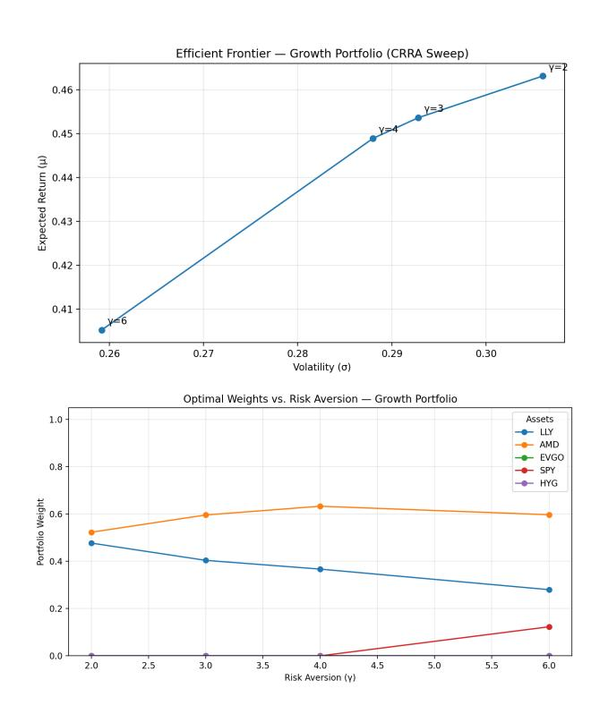

This modification effectively narrows the diversification scope while preserving the long-only, fully-invested constraint central to our Arrow–Pratt CRRA formulation. The allocator continues to minimize the penalized variance term, but the reduced correlation structure allows high P-rank equities to dominate the allocation more freely, emphasizing intra-portfolio efficiency over global diversification. Conceptually, this approach simulates the behavior of an active growth sleeve within a broader institutional mandate—retaining the disciplined optimization of mean–variance utility while relaxing the universe-wide diversification penalty.

As shown in Table 20, at a fair risk-aversion level of *γ* = 3, the optimizer allocated capital exclusively among our top-ranked growth equities, **LLY** and **AMD**, assigning respective weights of 59.6% and 40.4%. The remaining assets, including **EVGO**, **SPY**, and **HYG**, received zero weight, indicating no marginal contribution to expected utility or volatility reduction under the constrained optimization. The resulting portfolio achieved an expected annualized return of **45.36%** with a volatility of **29.28%**, yielding a **Sharpe ratio of 1.74**, **Sortino ratio of 3.79**, and an **Adjusted Sharpe of 1.78**.

Relative to the Long-Safe allocation, the Growth Portfolio exhibits higher expected return and volatility but maintains comparable risk-adjusted efficiency across all three ratios. This indicates that the removal of sector-level correlations concentrated risk without disproportionately increasing downside exposure—demonstrating that the allocator remains statistically robust even when diversification is deliberately constrained. In essence, this portfolio embodies a *concentrated, growth-focused constrained mean–variance allocation*, where selective correlation modeling amplifies expected utility through targeted exposure rather than broad diversification.

**Figure 12:** Efficient Frontier (top) and Optimal Weights vs. Risk Aversion (bottom) for the Growth Portfolio.

**Note.** The Growth Portfolio displays a sharper decline in weights as *γ* increases, whereas our Long-Safe "mix" rebalances more gradually. This reflects structurally lower covariance across it's components.

**Table 20:** Optimal long-only weights and portfolio statistics across risk-aversion levels.

| γ   | µ p (%) | σ p (%) | Sharpe | Sortino | Adj. Sharpe | LLY   | AMD   | EVGO  | SPY   | HYG   |
|-----|---------|---------|--------|---------|-------------|-------|-------|-------|-------|-------|
| 2.0 | 46.31   | 30.60   | 1.72   | 3.64    | 1.72        | 0.477 | 0.523 | 0.000 | 0.000 | 0.000 |
| 3.0 | 45.36   | 29.28   | 1.74   | 3.79    | 1.78        | 0.404 | 0.596 | 0.000 | 0.000 | 0.000 |
| 4.0 | 44.89   | 28.80   | 1.75   | 3.84    | 1.80        | 0.367 | 0.633 | 0.000 | 0.000 | 0.000 |
| 6.0 | 40.52   | 25.92   | 1.73   | 3.78    | 1.78        | 0.280 | 0.597 | 0.000 | 0.123 | 0.000 |

#### **10.2 Short Portfolio**

#### **Unconstraining our Mean-Variance Optimization Function.**

Currently, our optimization problem is:

| $\min_w$ | $\frac{\gamma}{2}w^\top \Sigma w - \mu^\top w$ | s.t. | $\mathbf{1}^\top w = 1, w \geq 0.$ | (7) |
|----------|------------------------------------------------|------|------------------------------------|-----|
|----------|------------------------------------------------|------|------------------------------------|-----|

To allow shorting in our framework we have to drop the non-negativity constraint:

$$\min_w \frac{\gamma}{2} w^\top \Sigma w - \mu^\top w - s.t. \quad \mathbf{1}^\top w = 1. \quad (8)$$

To achieve a true, "textbook" unconstrained long-short / levered portfolio, we have to remove the "fully invested" constraint aswell:

$$\min_w \frac{\gamma}{2} w^\top \Sigma w - \mu^\top w. \quad (9)$$

**What this does for us in practice.** Intuitively, in a long only MVO, our risk aversion (*γ*) shapes the distribution of weight mass amongst positive positions. However, in an unconstrained MVO *γ* now controls total leverage and overall short exposure instead of just long-weight curvature. Therefore, not a single aspect of our model (CRRA or Arrow-Pratt) breaks since the utility is defined on portfolio return rather than on the signs (+/-) of weight components.

Furthermore, in unconstrained MVO a negative weight just becomes: *wi <* 0 ⇒ short asset *i*, free up capital for other positions.

Our portfolio still obeys:

$$R_p = w^\top r,$$

and utility remains:

$$U = \mu_p - \frac{\gamma}{2}\sigma_p^2.$$

**Differences.** Shorting increases expected return **AND** it increases variance. So our *γ* parameter automatically regulates leverage. In sum,

- 1. Low *γ*: Optimizer happily takes large levered long-short bets.
- 2. High *γ*: Optimizer plays it safer, reducing gross leverage.

In simplest terms, our framework self regulates the same as a classic Merton or CRRA portfolio would as soon as our constraint is lifted !

**Verbal Recap: (Formally stated)** In contrast to the Long-Safe and Growth portfolios—both of which rely on a constrained mean–variance allocation with *wi* ≥ 0 and **1** ⊤*w* = 1—a long–short extension simply removes the non-negativity constraint. Mathematically, this converts the optimization into an unconstrained MVO problem,

$$\min_w \frac{\gamma}{2} w^\top \Sigma w - \mu^\top w, \quad (10)$$

where negative weights correspond to short positions and positive weights correspond to levered long exposure. This formulation remains entirely consistent with our CRRA and Arrow–Pratt utility setup, because utility is defined over portfolio return rather than individual positions. In this framework, a short position in a weakly ranked asset (e.g., a low-probability, low-Sharpe equity) becomes a source of funding for highconviction growth names, while the risk contribution of such leverage is automatically penalized through the *γ* term. Thus, the long–short portfolio represents a natural third regime in our construction sequence:

Long-Safe 
$$\rightarrow$$
 Growth  $\rightarrow$  Long-Short,

where the final regime operates as a *"tactical alpha sleeve"* that exploits underperformers while reinforcing the growth exposures identified earlier.

**Table 21:** Short Candidates — Past 48 Months. Worst by final *P*up rank, and mean across all ML tests.

| Ticker | Mean P up | Median P | up n_obs |
|--------|-----------|----------|----------|
| COIN   | 0.301     | 0.316    | 43       |
| APA    | 0.380     | 0.352    | 48       |
| CCL    | 0.450     | 0.484    | 48       |
| WBD    | 0.451     | 0.453    | 48       |
| HAL    | 0.464     | 0.472    | 48       |
| PCG    | 0.465     | 0.517    | 48       |
| VTRS   | 0.469     | 0.427    | 48       |
| DVN    | 0.487     | 0.487    | 48       |
| HOOD   | 0.487     | 0.500    | 40       |
| OXY    | 0.493     | 0.495    | 48       |
| SLB    | 0.494     | 0.494    | 48       |
| BAX    | 0.506     | 0.527    | 48       |
| XYZ    | 0.515     | 0.534    | 48       |
| IVZ    | 0.515     | 0.523    | 48       |
| PYPL   | 0.519     | 0.536    | 48       |
| TRGP   | 0.524     | 0.536    | 48       |
| FI     | 0.526     | 0.536    | 48       |
| PSKY   | 0.531     | 0.531    | 48       |
| NCLH   | 0.533     | 0.556    | 48       |
| MRNA   | 0.534     | 0.572    | 48       |

likely "learned" how brutal the crypto beta (*β*) drawdowns are over time horizons from our fundamentals data, in relation to it's overall ranking across models. P(up)≈0.30 illustrates how well it captures the underlying volatility, and makes the connection between volatility ̸= alpha (*α*).

#### **Explicitly Solving the Optimization Problem:**

To incorporate a tactical short sleeve, we keep the CRRA utility and risk-aversion fixed at *γ* = 3, but relax the long-only constraint for a single name. Specifically, we replace EVGO with COIN in the asset universe and allow the COIN weight to be negative, *w*COIN ∈ [−*s*max*,* 0], while LLY, AMD, SPY, and HYG remain long-only. The optimization still enforces the full-investment constraint **1** ⊤*w* = 1, so proceeds from the COIN short are fully recycled into long positions. Because COIN carries low ML-implied *P*up and high realized volatility, the *γ* = 3 solution naturally places a bounded short in COIN and reallocates the released notional into the growth names LLY and AMD. The result is a long–short "growth plus hedge" overlay that extends the pure long-only Growth portfolio along the efficient frontier.

$$\gamma = 3, w^{\text{LS*}} \approx \begin{cases} w_{\text{LLY}}^{\text{long}} + \Delta_{\text{LLY}}, \\ w_{\text{AMD}}^{\text{long}} + \Delta_{\text{AMD}}, \\ w_{\text{COIN}}^* < 0, \\ w_{\text{SPY}}^* \geq 0, \\ w_{\text{HYG}}^* \geq 0, \end{cases}$$

Concretely, for the portfolio {LLY*,* AMD*,* COIN*,* SPY*,* HYG} we solve the same CRRA mean–variance problem as in the Growth section, using the same 5-year monthly data and the same construction of *µ* and Σ, but under the modified constraints:

#### 1. **Net wealth (fully invested):**

$$\mathbf{1}^\top w = 1.$$

#### 2. **Long-only for all non-short names:**

$$w_{\text{LLY}}, w_{\text{AMD}}, w_{\text{SPY}}, w_{\text{HYG}} \geq 0.$$

#### 3. **Bounded short in COIN:**

$$w_{\text{COIN}} \in [-0.20, 0]$$
,

so that the COIN position can be short but is capped at a 20% notional.

We thus keep the CRRA objective and *γ* = 3 fixed, but relax the non-negativity constraint for COIN only, while maintaining **1** ⊤*w* = 1. Gross exposure is

---

$$\sum_i |w_i| = 1 + 2|w_{\text{COIN}}| \leq 1.4,$$

and in the empirical solution we are exactly at this bound with *w*COIN = −0*.*20.

**Remark: Why does Sharpe fall even though expected return rises ?** Good question! This is actually quite standard in long-short leveraged portfolios: In our case the expected return increases because the addition of COIN (short) frees up capital which gets allocated into LLY and AMD. Two assets with higher than average drift in our *µ*-vector. But Sharpe falls due to the increase in volatility being proportionally larger than the increase in excess returns. This makes more sense when we look at the formula itself:

$$\text{Sharpe} = \frac{\mu_p - r_f}{\sigma_p}.$$

**Table 23:** Comparing both (Growth & Short) *γ* = 3 portfolios:

| Portfolio         | ER (%) | Vol (%) | Share% |
|-------------------|--------|---------|--------|
| Long-only         | 45.36  | 29.28   | 1.74   |
| Long + COIN short | 57.24  | 35.91   | 1.62   |

When we compute the changes proportionally, ER rises by approximately 26% from 45.36 to 57.24 and Volatility rises by approximately 23%. However, volatility compounds *both* from (i) more concentration in LLY/AMD and (ii) the gross leverage inherent from COIN short. Thus, excess return rises, but it doesn't rise enough to compensate for the higher *σ*. So the COIN short improves expected return, but the leverage and concentration it also brings serve to inflate volatility even quicker. More formally: (*µ*−*rf* ) grows slower than *σ* so sharpe declines. As stated previously, this is common for tactical long short tilts–they often raise ER and sometimes raise sharpe although that isn't automatic. Sharpe only increases when the risk-adjusted

**Table 22:** Growth + COIN short portfolio (bounded short, *s*max = 0*.*20).

| $\gamma$ | $\mu_p$ (%) | $\sigma_p$ (%) | Sharpe | Net Exp. | Gross Exp. | LLY   | AMD   | COIN   | SPY   | HYG   |
|----------|-------------|----------------|--------|----------|------------|-------|-------|--------|-------|-------|
| 3.0      | 57.24       | 35.91          | 1.62   | 1.00     | 1.40       | 0.567 | 0.633 | -0.200 | 0.000 | 0.000 |

contribution of a given hedge is strong enough which doesn't happen here because COIN's volatility is huge (and positively) correlated with our longs. Meaning that the short helps expected return without reducing covariance structure to a great enough extent that sharpe improves.

**Key Takeaways.** By introducing a bounded short sleeve provides a natural extension of our CRRA mean– variance allocator without altering its core structure: the optimizer simply reallocates the released notional from the shorted asset into the highest-conviction longs. The comparison between the original *γ* = 3 growth portfolio and the new "Growth + COIN short" solution highlights this behavior cleanly. With EVGO removed and COIN added as the sole short-eligible name, the optimizer immediately drives COIN to its lower bound (−20%), consistent with its low ML-implied *P*up and high realized volatility. The proceeds are recycled into LLY and AMD, increasing their weights from (0*.*404*,* 0*.*596) to (0*.*567*,* 0*.*633), respectively. Although this leverage increases volatility (29.3% → 35.9%) and slightly reduces the Sharpe ratio (1.74 → 1.62), the portfolio achieves a materially higher expected return (45.4% → 57.2%) with a modest gross-exposure expansion (1.0 → 1.40). This illustrates the intended effect of introducing tactical shorting into our framework: the allocator amplifies the highest-conviction fundamental and ML signals while maintaining disciplined risk budgeting through explicit short bounds and controlled gross exposure.

# **10.3 Leveraged Portfolio:** *FUN :)*

**Preface.** One of my hopes for this project was that we'd eventually be allowed to utilize at least *one* asset class aside from equities. While shorting is permitted, options are explicitly disallowed—an understandable constraint, since the assignment is not meant to be a hedging exercise. In fact, our long-only / bounded short structure has given us a robust mathematical backbone (MVO, CRRA, Arrow–Pratt utility) that we have followed faithfully until now. Yet, after reading (and re-reading) every line of the syllabus and project description, I noticed that although options are banned, derivatives and swaps *were never mentioned...*

Despite the technicality, our motivation to include this section is still to demonstrate how we might approach this assignment from an institutional perspective and explore how a PM might scale our signals with leverage, capital efficiency (strategic position entry), and professional risk modeling shrewd enough to invoke a visceral sense of envy, in even the most prudent of daytraders.

#### **The Archegos Strategy:** 200*M* −→ 20*B*

To illustrate how leverage transforms the economic profile of a portfolio, we temporarily set aside our CRRA allocator and step into the world of equity total–return swaps (TRS). An equity TRS is extremely simple in concept: one party receives the total return of an underlying asset, while paying a funding rate to the counterparty. Mathematically, at inception the contract is struck so that its present value is exactly zero under the risk–neutral measure *Q*:

- Equity leg payoff at maturity:

$$TR_{\text{equity}} = N \left( \frac{I(T)}{I(T_0)} - 1 \right) + \text{dividends.}$$

- Financing leg payoff:

$$TR_{\text{funding}} = N \sum_{i=1}^M R_i \cdot DCF_i.$$

- Discounting each leg:

$$PV_{\text{equity}} = \mathbb{E}^Q[TR_{\text{equity}}] D_M,$$

$$PV_{\text{funding}} = \mathbb{E}^Q[TR_{\text{funding}}].$$

- Fair swap spread determined by:

$$PV_{\text{equity}} - PV_{\text{funding}} = 0.$$

This no–arbitrage construction tells us only what makes the TRS *fair at inception*3 under *Q*—that is, its value assuming a risk–neutral world where prices evolve as discounted martingales. It says *nothing* about what happens the moment you lever 5–10× in the *real* world, where prices move stochastically and margin rules determine survival. *This is precisely where our EVT/GPD tail–risk modeling enters.*

#### **The Lord does not Hedge 20:1 TRS positions**

**"I am just following gods word, and that is truly a fearless way to invest" -Bill Hwang.** The final component of our allocator is an explicit leverage sleeve built to echo Bill Hwang's Archegos fund: a concentrated, high-volatility short used to finance large total–return swap (TRS) exposures in more "stable" names. However, unlike Archegos—our risk management philosophy will be in our hands not Jesus'.

3Throughout this section, we treat the TRS as fairly priced under standard no–arbitrage arguments and focus exclusively on *pathwise* risk—that is, the probability of margin-driven ruin under the physical measure *P*.

**Figure 13:** COIN one-day ruin probability under leverage. **Top:** full 3D ruin surface under volatility-normalized EVT. **Bottom:** the same surface with a "safety band" indicating leverage ranges that maintain *p*ruin *<* 0*.*1%.

**COIN Short and TRS Overlay.** Starting from equity capital of \$300,000, we consider shorting COIN and using the combined equity and short-sale proceeds as collateral to enter 10:1 TRS overlays on AMD and LLY. All positions are assumed to be subject to a uniform 10% margin requirement.

**Data construction and volatility metrics.** Before modeling tail risk, we build a daily dataset for the top twenty short candidates identified by the earlier machine-learning ranking. For each ticker we pull five years of daily OHLCV data from yfinance and construct: (i) daily log-returns, (ii) daily high–low log ranges, (iii) full-sample realized volatility (annualized), and (iv) Parkinson (range-based) volatility. These features are stored in daily\_features\_5y.csv and vol\_metrics\_5y.csv and form the basis for the extreme-value analysis. As a preview, COIN exhibits daily volatility of roughly 5*.*4% (about 85% annualized), AMD around 3*.*2% (≈ 50% annualized), and LLY roughly 2*.*0% (≈ 32% annualized.)

#### **Modeling Extreme Losses: Four Approaches and the Rationale for EVT**

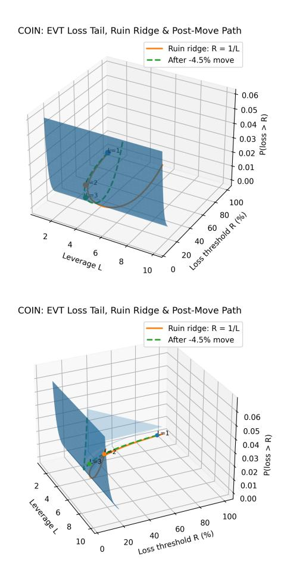

Before introducing leverage and ruin probabilities, we must address a foundational question in risk modeling: *how do we quantify the probability of extreme oneday losses?* Because COIN, AMD, and LLY have radically different volatility profiles—COIN exhibits daily volatility near 5*.*4%, AMD around 2*.*5%, and LLY roughly 1*.*9%—a naive threshold for defining "tail events" would produce misleading results. This leads naturally to four possible approaches, ranging from simple percentile rules to full extreme value methods.

**Option A: Fixed absolute threshold (e.g.,** *rt <* −3%**).** A common undergraduate- and practitionerlevel method is to declare returns worse than a fixed percentage (e.g., −3% or −4%) as "extreme." While easy to communicate, this approach implicitly assumes that a 3% move is equally extreme across assets. For COIN, a −3% day is routine; for LLY, it is a multi–standard deviation shock. This makes tail comparisons non-economic and distorts later ruin estimates.

**Option B: Fixed percentile threshold (e.g., 97.5th percentile).** An improvement is to define the tail using a distribution-free rule such as

$$r_t < q_{2.5\%}$$
,

where *q*2*.*5% is the 2.5th empirical percentile. This yields a constant tail *frequency* across tickers but not a constant tail *severity*. Assets with higher volatility still enter the tail at much larger absolute moves. This method is frequently used in stress testing but does not produce directly comparable tail models when assets differ greatly in scale.

**Option C (naive): Volatility-scaled thresholds.** A natural refinement is to declare an event extreme if it exceeds a multiple of each asset's own volatility:

$$r_t < -k\sigma_{\text{daily}}$$
.

This captures the intuition that a 3*σ* shock should be extreme regardless of the underlying ticker. However, threshold selection based purely on sample volatility introduces noise and leads to inconsistent tail boundaries: COIN's tail may begin at −13% while LLY's begins around −5%. When fitting parametric tail distributions (e.g., GPD), the resulting shape parameters (*ξ*) become difficult to compare across assets.

**Option C2 (institutional): Volatilitynormalized EVT (POT on z-scores).** This is the method we adopt, and it corresponds to the standard used by bank risk desks, BIS stress

frameworks, and academic work on extremes. We first standardize daily log returns:

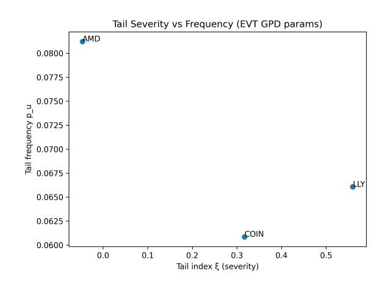

$$z_t = \frac{r_t}{\sigma_{\text{daily}}},$$

transforming each asset's distribution into units of daily standard deviations. We then select a *universal* threshold—e.g., *zt <* −2*.*5—and apply the Peaks-Over-Threshold (POT) formulation of Extreme Value Theory. Exceedances of this threshold,

$$X_t = -(z_t - u_z), \quad z_t < u_z,$$

are modeled using the Generalized Pareto Distribution (GPD) with shape *ξ* and scale *β*:

$$\mathbb{P}(X > x) = p_u \left( 1 + \xi \frac{x - u_z}{\beta} \right)^{-1/\xi}.$$

Three advantages follow:

- 1. **Comparability.** Because all assets share the same z-threshold, their GPD fits are defined on identical economic events: "worse than a 2.5*σ* loss." COIN's fat tail (positive *ξ*) naturally emerges relative to AMD's near-bounded tail and LLY's thin but jumpy tail.
- 2. **Correct treatment of crypto-beta equities.** COIN's daily volatility near 5*.*4%—more than double AMD and nearly triple LLY—means that a fixed 3% threshold would systematically misclassify COIN's normal days as "extreme." Standardizing by volatility ensures that a −2*.*5*σ* COIN day (about −13%) is treated with the same statistical weight as a −2*.*5*σ* LLY day (about −5%).
- 3. **Ruin modeling under leverage becomes exact.** The ruin threshold for leverage,

$$r_t < -\frac{1}{L},$$

maps cleanly into z-space as

$$x_{\text{ruin}} = \frac{1/L}{\sigma_{\text{daily}}},$$

and tail probabilities follow directly from the fitted GPD. This allows us to compute one-day ruin probabilities at any leverage level for any ticker in a directly comparable manner.

**Why we select C2 for this paper.** Among the four methods, Option C2 is the only one that satisfies all of the following:

- respects differing volatility scales across assets;

**Figure 14:** Tail severity versus tail frequency across COIN, AMD, and LLY under volatility-normalized EVT. Higher *ξ* and *β* indicate both fatter and more severe downside tails.

- produces comparable tail fits for COIN, AMD, and LLY;
- aligns with industry practice in stress testing and capital modeling;
- isolates genuine extreme-event dynamics rather than noise;
- provides mathematically correct inputs for the leverage ruin calculations that follow.

Because the short leg of our leverage portfolio is COIN—a crypto-beta stock with heavy tails and high variance—using a simplistic threshold would materially understate ruin risk. Volatility-normalized EVT ensures that our ruin probabilities, safety bands, and leverage frontiers reflect the true economic distribution of extreme outcomes.

This design choice is therefore essential: it allows us to quantify, with statistical rigor, how a COIN short finances large TRS exposures while preserving transparent and academically defensible estimates of one-day catastrophic loss.

#### **Tail Risk Parameters and Cross-Asset Ranking**

The EVT fit for each ticker produces a compact set of tail parameters, collected in evt\_gpd\_params.csv. For each asset we estimate:

- *σ*daily the standard deviation of daily log returns. This is the usual volatility measure; COIN has the largest *σ*daily, LLY the smallest.
- *uz* (z\_threshold\_sigma) the point (in *σ* units) where we declare the left tail to begin. We take *zt <* −*uz* as "extreme" negative moves and fit the GPD only on these exceedances.

**Figure 15:** Single-name daily ruin probability curves as a function of leverage *L*. COIN exhibits pronounced crash risk at moderate leverage, while AMD's bounded-tail (*ξ <* 0) behavior dampens ruin rates even at higher *L*.

- *ξ* the GPD shape (tail index). This is the *most important* tail parameter: it controls how fast the probability of large losses decays.
- *β* the GPD scale parameter, which governs the typical *size* of losses once we are in the tail region.
- *pu* (tail\_freq) the fraction of trading days that fall into the tail region *zt <* −*uz*, i.e., how often we see an "extreme" day.
- *n*obs the number of daily observations (roughly five years of data).

For interpretation it is helpful to rank assets by (*ξ, β, pu*):

*ξ <* 0 ⇒ bounded tail (losses have a hard cap) *ξ* ≈ 0 ⇒ approximately exponential tail *ξ >* 0 ⇒ heavy tail (Pareto-like crash behaviour).

Empirically, values *ξ >* 0*.*2 already indicate materially fat tails, and *ξ >* 0*.*4 corresponds to the kind of crash regime seen in crypto proxies or meme stocks. In our estimates COIN has a positive tail index (*ξ*COIN ≈ 0*.*32) with moderate tail frequency, LLY has the fattest tail shape (*ξ*LLY ≈ 0*.*56) but at much lower volatility, and AMD is the outlier with a slightly *negative* tail index (*ξ*AMD ≈ −0*.*05) despite having nontrivial daily volatility. We return to this AMD result below when discussing TRS long risk.

#### **AMD's Negative Tail Index and Implications for TRS Long Risk**

A particularly interesting empirical finding is that AMD's estimated tail index is slightly negative, *ξ*AMD ≈ −0*.*046. In EVT terms, *ξ <* 0 corresponds to

a *bounded* left tail: after volatility normalisation, there exists a finite upper bound on how bad the extreme losses can be. This is unusual for equities—most largecap names exhibit *ξ* ≥ 0, with either exponential or heavy (Pareto-type) tails.

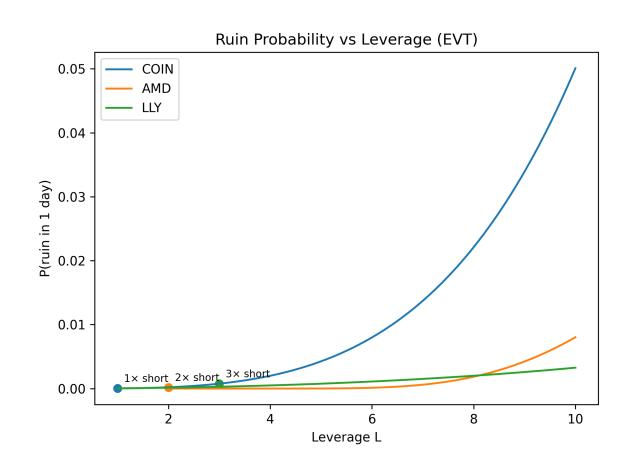

Intuitively, the volatility-normalised AMD tail behaves as follows:

- AMD does experience moderately volatile days (its *σ*daily is larger than LLY's), but
- once we condition on being in the tail region *zt <* −*uz*, the additional downside beyond the threshold is relatively contained: the GPD fit implies that very large multi-*σ* crashes are much rarer than a Pareto extrapolation would suggest.

In contrast, COIN's positive tail index (*ξ*COIN *>* 0) indicates genuinely heavy tails with no natural cap on how far standardized losses can extend, and LLY combines low volatility with a comparatively fat tail shape (*ξ*LLY ≈ 0*.*56).

From the perspective of the leverage portfolio and the equity total return swaps, this matters directly:

- On the *short* side, a positive *ξ* for COIN means that increasing leverage *L* drives ruin probabilities up sharply, as tiny changes in the crash threshold −1*/L* intersect a very heavy left tail.
- On the *long* TRS side, AMD's *ξ <* 0 makes it a structurally safer underlying than a cryptoadjacent name: even at high notional multiples (e.g., 10:1 TRS), the EVT model implies that the worst standardized shocks are capped, so ruin risk grows much more slowly with *L* than it would under a heavy-tailed equity.

In other words, the combination "COIN short with *ξ >* 0" and "AMD TRS long with *ξ <* 0" is not symmetric. The short leg is financed on an asset whose downside tail is mathematically heavy, while the long leg is concentrated in an asset whose volatility is meaningful but whose extreme downside is statistically *thinner than Gaussian* once we condition on being in the tail. This asymmetry is exactly what shows up in our ruin probability curves and 3D surfaces: COIN's ruin probability explodes with leverage, whereas AMD's remains comparatively flat even at high TRS multiples.

**Volatility-normalized EVT and the role of the threshold.** To quantify one-day ruin probabilities under leverage we model the downside tail of returns using a Peaks-Over-Threshold (POT) Extreme Value Theory (EVT) framework. For each ticker we standardize daily log-returns by their sample standard deviation,

$$z_t = \frac{r_t}{\sigma_{\text{daily}}}, \quad (11)$$

so that a move of *zt* = −*k* corresponds to a *kσ* event, irrespective of the asset's level of volatility. We then define a volatility-normalized tail threshold *uz* (e.g. *uz* ≈ 1*.*75) and collect exceedances

| $X_t = -(z_t - u_t)$ | for $z_t < -u_t$ | (12) |
|----------------------|------------------|------|
|----------------------|------------------|------|

which represent standardized downside moves more extreme than *uz* in absolute value.

Conditional on being in this tail region, the exceedances are assumed to follow a Generalized Pareto Distribution (GPD) with shape *ξ* and scale *β*. Let *pu* denote the empirical fraction of days in the tail (the tail frequency). For a loss level *x > uz* in standardized units, the EVT model implies

$$\mathbb{P}(X > x) = p_u \left( 1 + \xi \frac{x - u_z}{\beta} \right)^{-1/\xi}, \quad (13)$$

which we use to extrapolate the probability of rare multi-sigma crashes.

Fitting this model to five years of data for COIN, AMD, and LLY yields daily volatility *σ*daily, tail index *ξ*, scale *β*, and tail frequency *pu* for each name. COIN exhibits the largest *σ*daily and a positive tail index *ξ* ≈ 0*.*32, indicating heavy downside tails with large, infrequent jumps. AMD's fitted tail index is slightly negative (*ξ* ≈ −0*.*05), corresponding to a *bounded* downside tail once normalized by volatility, while LLY has low volatility but a relatively high tail index (*ξ* ≈ 0*.*56), implying fat tails around a much smaller daily scale.

**Ruin under single-name leverage.** Given a leverage level *L* applied to a single stock, we say that the position is ruined when a one-day return is worse than the equity-wipeout threshold

$$r_t < -\frac{1}{L}. \quad (14)$$

In standardized units this corresponds to *x*ruin = (1*/L*)*/σ*daily. Plugging *x*ruin into (13) yields an EVTbased estimate of the one-day probability of ruin,

$$p_{\text{ruin}}(L) \approx \mathbb{P}\left(r_t < -\frac{1}{L}\right) = \mathbb{P}(X > x_{\text{ruin}}). \quad (15)$$

We tabulate *p*ruin(*L*) for *L* ∈ {1*,* 2*,* 3*,* 10} for COIN, AMD, and LLY. COIN displays dramatically higher ruin probabilities at any given leverage level: at *L* = 10, the model implies a one-day ruin probability on the order of 5% for COIN, versus roughly 0*.*8% for AMD and 0*.*24% for LLY. This ranking is consistent with financial intuition: COIN's crypto-linked equity returns carry much more severe downside jumps than a large-cap pharmaceutical like LLY. It is precisely this asymmetry—crash-prone COIN versus relatively wellbehaved AMD and LLY—that motivates the shortplus-TRS structure.

**Mapping capital, margin, and TRS to effective leverage.** We now embed these single-name ruin probabilities into the concrete structure of our leverage portfolio. Let initial equity be *E*0 = \$300*,*000, and assume a uniform 10% margin requirement on all positions. We consider three COIN short sizes:

- 1. **Option A (1**× **short):** short notional \$270,000, corresponding to 270*,*000*/*360 = 750 shares. The remaining \$30,000 is posted as margin.
- 2. **Option B (2**× **short):** short notional \$600,000 (≈ 1*,*667 shares), requiring \$60,000 of margin.
- 3. **Option C (3**× **short):** short notional \$900,000 (2,500 shares), with \$90,000 of margin.

After COIN closes at \$343.77, each scenario realizes a profit equal to the number of shares short times (360− 343*.*77), which increases total equity to *EA* ≈ \$312*,*172, *EB* ≈ \$327*,*052, and *EC* ≈ \$340*,*575, respectively. Net of the margin pinned to the short, this equity can be rehypothecated as collateral for long TRS positions in AMD and LLY.

Assuming a 10% margin requirement on the swaps, the usable collateral in each scenario supports TRS notionals

| $N_{\text{TRS}} = 10 \times E_{\text{usable}}$ | (16) |
|------------------------------------------------|------|
|------------------------------------------------|------|

which we split evenly between AMD and LLY. The resulting TRS notional sizes (and implied share counts) are summarized in Table 25. In each case, the net effect is a modestly levered COIN short (1–3× relative to equity) financing ≈ 10× long exposure in AMD and LLY via TRS.

**Ruin probabilities before and after the entry move.** The EVT model allows us to distinguish two conceptually different risks: (i) blow-up on the short COIN leg due to an extreme *up* move, and (ii) blow-up on the TRS legs due to extreme *down* moves in AMD or LLY.

For the COIN short, the relevant ruin threshold is an *up* move of size 1*/L*short where *L*short = short notional*/E* is the effective leverage relative to current equity. Crucially, waiting for COIN to move in our favor before entering the swaps reduces *L*short and pushes the ruin threshold further into the tail.

If COIN first falls by 4*.*50833% from \$360 to \$343.77, the short-side equity increases and the effective leverage falls to approximately 0*.*96×, 1*.*84×, and 2*.*64× in Options A, B, and C, respectively. Using the fitted GPD parameters for COIN, we obtain updated one-day ruin probabilities:

- **1**× **short (effective** 0*.*96×**):** requires a ≈ 104% COIN rally in one day; *p*ruin ≈ 3*.*4 × 10−9 , effectively zero (300 Million Trading days, technically).

**Figure 16:** Joint effect of daily volatility *σ*, tail-shape *ξ*, and leverage *L* on one-day ruin probability under volatilitynormalized POT. COIN's large *σ* and positive *ξ* place it in the high-risk region of the surface.

- **2**× **short (effective** 1*.*84×**):** requires a ≈ 54% up move; *p*ruin ≈ 7*.*1 × 10−5 , roughly one event per 14,000 trading days.
- **3**× **short (effective** 2*.*64×**):** requires a ≈ 38% up move; *p*ruin ≈ 1*.*2 × 10−3 , on the order of once every 800 trading days (3–4 years) under independence.

Thus, conditioning on COIN already being 4*.*5% in our favor materially improves survivability on the short leg, especially in the 1× and 2× cases. The 3× short remains borderline: the daily ruin probability is small, but over a long horizon it implies a non-trivial chance of catastrophic loss.

On the long side, the TRS positions in AMD and LLY each face ruin when a one-day loss of 10% (matching the 10:1 leverage) occurs. Applying the same EVT machinery yields per-day ruin probabilities of approximately 0*.*8% for AMD and 0*.*24% for LLY. Combined with their lower baseline volatility and, in AMD's case, slightly negative tail index *ξ*, these figures support the interpretation of AMD and especially LLY as comparatively safer counterparties for levered TRS exposure than COIN itself.

**Interpretation.** Putting the pieces together, the leverage portfolio is best viewed as a structured bet that: (i) COIN's fat-tailed downside will materialize over the horizon of interest but upside squeezes are contained by limiting the short to ≤ 3× effective leverage and entering swaps only after an initial favorable move; and (ii) the long TRS legs in AMD and LLY, while individually subject to rare 10% drawdowns, carry significantly thinner downside tails than COIN and are therefore unlikely to drive first-order ruin.

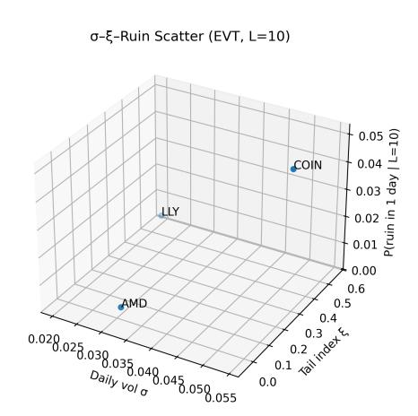

The EVT-based ruin estimates make the trade-off precise. At moderate short leverage (1–2×) the probability of one-day ruin on COIN after entry is negligible, while the 10:1 TRS exposure in AMD and LLY introduces tail risk that is real but substantially smaller on a per-name basis. Pushing the COIN short to 3× moves the strategy into an "Archegos" regime where the combined equity, margin, and TRS structure has a non-trivial chance of catastrophic loss over a multi-year horizon. In this sense, the levered portfolio illustrates both the appeal and the danger of layering total–return swaps on top of a volatile short: the no-arbitrage TRS pricing is innocuous, but the realized path distribution—captured by the EVT/GPD model—can still make the strategy fragile to extreme but statistically plausible shocks.

**Table 25:** Single-Name One-Day Ruin Probabilities from EVT

| Ticker | Scenario   | L    | R ruin (%) | P (ruin    | in 1 day) |
|--------|------------|------|------------|------------|-----------|
| COIN   | L=1.0      | 1.0  | 100.0      | 2.1583047e | − 5       |
| COIN   | L=2.0      | 2.0  | 50.0       | 2.2311211e | − 4       |
| COIN   | L=3.0      | 3.0  | 33.3333    | 7.6545886e | − 4       |
| COIN   | L=10.0     | 10.0 | 10.0       | 5.0906062e | − 2       |
| COIN   | loss > 5%  | –    | 5.0        |            | –         |
| COIN   | loss > 10% | –    | 10.0       | 5.0906062e | − 2       |
| AMD    | L=1.0      | 1.0  | 100.0      | 1.0057992e | − 11      |
| AMD    | L=2.0      | 2.0  | 50.0       |            | –         |
| AMD    | L=3.0      | 3.0  | 33.3333    | 1.0057992e | − 11      |
| AMD    | L=10.0     | 10.0 | 10.0       | 8.0241286e | − 3       |
| AMD    | loss > 5%  | –    | 5.0        |            | –         |
| AMD    | loss > 10% | –    | 10.0       | 8.0241286e | − 3       |
| LLY    | L=1.0      | 1.0  | 100.0      | 3.6791716e | − 5       |
| LLY    | L=2.0      | 2.0  | 50.0       | 1.1816187e | − 4       |
| LLY    | L=3.0      | 3.0  | 33.3333    | 2.8269251e | − 4       |
| LLY    | L=10.0     | 10.0 | 10.0       | 3.2651195e | − 3       |
| LLY    | loss > 5%  | –    | 5.0        | 1.9152171e | − 2       |
| LLY    | loss > 10% | –    | 10.0       | 3.2651195e | − 3       |

**Table 24:** EVT GPD Parameter Estimates (5-year daily data)

| Ticker | σ daily             | z thr | ξ                     | β                   | p u                 | n    |
|--------|---------------------|-------|-----------------------|---------------------|---------------------|------|
| COIN   | 0.05425609935509303 | 1.75  | 0.31681743400654144   | 0.46398291292335087 | 0.06085526315789474 | 1154 |
| AMD    | 0.0325362247323156  | 1.75  | -0.046290083471667715 | 0.6029862609297393  | 0.08121019108280254 | 1255 |
| LLY    | 0.02012719021589936 | 1.75  | 0.5596854756164046    | 0.4109855480406631  | 0.06607142857142857 | 1255 |

# **Our Framework vs. Excel Solver**

#### **What Excel Solver Actually Does...**

Excel Solver, in the form used in this assignment, performs the following steps:

- Computes the historical mean return vector *µ* (sample average of past returns).
- Computes the historical covariance matrix Σ (sample covariance).
- Solves the classical tangency–portfolio problem

$$\max_w \frac{\mu^\top w}{\sqrt{w^\top \Sigma w}}$$

using the GRG Nonlinear optimization engine.

This implies that the method:

- is entirely backward–looking (no predictive component),
- assumes returns are Gaussian and stationary,
- treats upside and downside variance symmetrically,
- is extremely sensitive to small changes in *µ* (aka ill conditioning),
- tends to produce "corner solutions" unless constraints are imposed (ex. 100% allocation to a single asset).

In our case, this leads Solver to allocate:

- 53.06% to AVGO,
- 31.52% to MCK,
- 15.42% to PWR,
- 0% to SPY,
- 0% to HYG.

#### **Foundational Problems With Markowitz Optimization**

Classical mean–variance optimization implicitly assumes:

- stationarity of returns,
- Gaussian distributions,
- historical mean returns *µ* computed from past data,

- historical covariance Σ via the sample covariance matrix,
- no modeling of fat tails or higher moments,
- no skewness,
- no autocorrelation,
- no nonlinear utility or risk preferences,
- no regime awareness or pathwise structure,
- an invertible and well-conditioned covariance matrix,
- robustness of the objective to perturbations in *µ*.

In practice, the efficient frontier is extremely unstable: very small changes in historical means can shift the entire frontier and alter the "optimal" portfolio dramatically. Hence, why this purely retrospective approach stands in direct contrast to the predictive, utility-based structure of our allocation pipeline.

# **Problems Specific to Excel Solver**

Excel Solver introduces additional structural limitations:

- no regularization or shrinkage,
- no Bayesian or ML-derived priors,
- no predictive component (purely backwardlooking),
- tendency toward corner solutions (100% in one asset),
- reliance on raw sample covariance matrices,
- instability in higher dimensions,
- use of the GRG Nonlinear engine for a non-convex objective.

In sum, Solver treats upside and downside variance identically, reinforcing the well-known flaw of variance as a risk measure.

# **Why CAPM Breaks (Immediately)**

The Capital Asset Pricing Model collapses under realistic empirical conditions:

- it is a one-factor model in a multi-factor world,
- betas are unstable across regimes,
- beta is not invariant to leverage or volatility,

- the "market portfolio" is unobservable,
- assumes all investors hold the market basket,
- assumes frictionless borrowing/lending at *rf* ,
- ignores volatility clustering and structural breaks.

Thus, tangency–portfolio logic derived from CAPM is mathematically elegant but empirically fragile.

#### **Higher-Order Mathematical Critique: Where Our Pipeline Excels**

Our methodology improves upon classical optimization across multiple dimensions:

- **CRRA Utility (Arrow–Pratt):** incorporates nonlinear investor preferences rather than penalizing variance linearly.
- **Sortino and Adjusted Sharpe:** explicitly account for downside and tail risk.
- **ML-corrected** *µ***:** expected returns are forwardlooking rather than backward-looking.
- **Probability-Up Filtering:** adds a quasi-Bayesian prior motivated by directional confidence.
- **Expanding from 20 to 100 assets:** avoids overfitting the small *µ*/Σ regime.
- *γ***–Sweeps:** provide a full utility surface rather than a single optimal point.
- **Stochastic Interpretation:** evaluation under Itô-consistency and arbitrage-free structure.

Excel Solver does none of these.

#### **Frontier Deterioration Under Realistic Assumptions**

When realistic market dynamics are incorporated, the classical frontier deteriorates:

- incorporating kurtosis collapses the frontier,
- Sharpe maximization becomes unstable,
- CAPM-based tangency portfolios violate investor preferences,
- corner solutions appear due to ill-conditioned Σ −1 ,
- a single return shift of 10 bps can radically alter "optimal" weights.

By contrast, our pipeline is:

- smooth,
- regularized,
- multi-criteria,
- predictive,
- distribution-aware.

#### **Why Sharpe Optimization in Excel Solver is Non-Convex**

Excel Solver maximizes the tangency objective:

$$\max_w \frac{w^\top (\mu - r_f \mathbf{1})}{\sqrt{w^\top \Sigma w}}.$$

This Sharpe ratio surface is:

- a nonlinear fractional objective,
- neither convex nor concave,
- sensitive near the boundaries (*wi* = 0),
- full of local maxima,
- highly irregular under correlations.

The GRG Nonlinear engine is a local gradient-based optimizer; it assumes a single peak and stops as soon as the gradient flattens. On Sharpe surfaces, this means GRG frequently converges to suboptimal small local maxima.

**Geometric Interpretation.** The denominator *w* ⊤Σ*w* creates ridges and valleys, while the numerator *w* ⊤(*µ* − *rf***1**) produces multiple local peaks. Solver often terminates on secondary hills rather than the global optimum.

**Practical Failures.** Empirically:

- highly correlated assets generate jagged Sharpe surfaces,
- boundaries produce nondifferentiabilities,
- initialization determines the solution,
- allowing short-selling amplifies non-convexity.

Thus, the supposed "optimal" portfolio from Solver is often an artifact of optimizer behavior rather than an economically meaningful solution. Or simply put;

*Classical mean–variance optimization and Excel Solver provide numerically valid but economically fragile results. Our pipeline, by contrast, integrates ML-enhanced expected returns, Arrow–Pratt utility, multi-metric risk modeling, and stochastic validity constraints. The resulting allocations are more robust, more interpretable, and more aligned with real-world investment behavior.*

# **Limitations of the Classical Efficient Frontier and Tangency Portfolio**

In this section we outline the fundamental theoretical and empirical failures of the classical Markowitz efficient frontier and the associated tangency portfolio used in Sharpe-ratio maximization. These limitations are not occasional or approximate, they are mathematically provable violations of the assumptions required for mean, variance optimization to be valid. We organize the critique into structural assumptions, mathematical pathologies, estimation instability, and utility/theoretic inconsistencies.

#### **The Efficient Frontier Relies on False Assumptions**

The mean–variance frontier requires several assumptions that are known to be provably false:

**(1) Returns are normally distributed.** This contradicts overwhelming empirical evidence. Real financial returns exhibit:

- fat tails,
- skewness,
- autocorrelation,
- volatility clustering,
- jump processes,
- regime switching.

If returns are non-Gaussian, then variance *σ* is *not* a sufficient measure of risk. Nevertheless, MPT forces the optimization to treat *σ* as the risk metric.

**(2) Covariance** Σ **is stable over time.** Empirically, covariances evolve with market conditions:

$$\Sigma_t \neq \Sigma_{t+1}.$$

- macroeconomic regime changes,
- sector rotations,
- volatility regime shifts,
- liquidity shocks.

Even if the frontier were accurate *today*, it has no predictive validity for tomorrow.

**(3) Mean returns** *µ* **are forecastable from historical averages.** Textbooks assume:

$$\mu \approx$$
 average of past returns.

Reality:

$$\mathbb{E}[r_{t+1}]$$
 estimated from  $r_{t-k:t} \approx$  white noise.

Historical averages are among the worst estimators of forward expected returns. This drives the "garbage in → garbage out" pathology of MPT.

#### **The Frontier Is a Sample Optimum, Not a True Efficient Set**

The Markowitz frontier represents the optimum for the *sample*, not for the true underlying distribution. Small perturbations in the data—on the order of 0.05% cause dramatic changes in portfolio weights.

The tangency portfolio is:

$$w^* = \frac{\Sigma^{-1}(\mu - r_f \mathbf{1})}{\mathbf{1}^\top \Sigma^{-1}(\mu - r_f \mathbf{1})}.$$

The matrix inverse Σ −1 is:

- numerically unstable,
- highly noise-sensitive,
- explosive when correlations are high,
- prone to overfitting.

This phenomenon is known as the *Markowitz Curse*:

The optimal portfolio is almost never optimal out-of-sample, and is often catastrophic.

# **"Efficiency" Only Holds Under Quadratic Utility**

The efficient frontier corresponds exactly to optimization under quadratic utility:

$$U(w) = \mu(w) - \frac{\gamma}{2}\sigma^2(w),$$

- symmetric attitudes toward upside and downside,
- linear tradeoff between variance and return,
- constant absolute risk aversion,
- utility penalizes positive variance (absurd).

Actual investors exhibit:

- convex behavior for gains,
- steep concavity for losses,
- state-dependent risk preferences,
- goal- and drawdown-sensitive utility.

Thus, no realistic investor has quadratic utility, and therefore the frontier is optimal for nobody.

#### **The Frontier Ignores All Tail-Risk Dimensions**

Classical MPT accounts only for mean and variance, ignoring:

- skewness,
- kurtosis,
- drawdowns,
- crash probability,
- left-tail shape,
- liquidity risk,
- convexity effects,
- jump intensity,
- volatility clustering,
- stochastic volatility.

A portfolio with catastrophic crash risk may appear "efficient" if it exhibits low sample variance. For example: shorting far out-of-the-money S&P 500 puts can exhibit Sharpe ratios above 3 until catastrophic ruin.

#### **The Frontier Is Extremely Fragile to Realistic Constraints**

Adding any constraint typically collapses or distorts the frontier. Examples:

- maximum 30% per asset,
- leverage limits,
- liquidity constraints,

- transaction costs,
- drawdown limits,
- sector neutrality,
- factor exposures.

The classical frontier is therefore a curve defined under idealized, unrealistic constraints—a *theoretical* object.

#### **The Frontier Optimizes a Flawed Objective: Sharpe Ratio**

Sharpe ratio optimization assumes:

- symmetric risk penalties,
- Gaussian distributions,
- variance is risk,
- no tail asymmetry,
- no higher-moment effects.

The measure is deeply flawed:

- penalizes upside volatility,
- hides tail risk,
- favors option-writing strategies,
- overweights assets with small but noisy means.

Thus, the efficient frontier itself is built on maximizing an unstable and economically questionable statistic.

### **Mathematical Structure of the Frontier**

The frontier maps feasible weights W ⊂ R *n* to the risk–return plane:

---

$$w \in \mathcal{W} \quad \Rightarrow \quad (\sigma_p(w), \mu_p(w)),$$

---

where

$$\mu_p(w) = w^\top \mu, \quad \sigma_p^2(w) = w^\top \Sigma w.$$

Although presented as a deterministic curve, it is actually a *random object*. The parameters *µ* and Σ are themselves random variables:

$$(\mu, \Sigma) \sim \text{estimated from finite samples}$$
.

Thus:

- the frontier is stochastic, not deterministic;
- optimizing on it is optimizing on sampled noise;
- the classical tangent is a derivative of a random curve.

#### **The Tangency Portfolio Often Lacks a Well-Defined Tangent**

A tangent requires differentiability. Realistic frontiers are not differentiable:

- long-only constraints create kinks,
- asset activation/deactivation changes slope discontinuously,
- covariance sampling error creates piecewise curvature,
- Solver boundary conditions induce corners.

Thus, the "tangent portfolio" is a term of art, not a mathematically valid differential object.

#### **Why Max Sharpe Is the Most Noise-Sensitive Optimization**

A Sharpe ratio is a ratio of two noisy estimators (mean and standard deviation). Ratios amplify noise.

- *µ* estimation error has order of magnitude larger variance than *σ*,
- Σ −1 amplifies estimation noise further,
- small errors in *µ* create explosive weight swings,
- tangency portfolios sit exactly where noise sensitivity is maximized.

In research terms:

Maximizing a signal-to-noise ratio using unstable inputs produces unstable solutions.

# **10 Research Grade Critiques**

**Critique 1: Tangency Portfolio Exists Only Under Gaussian, IID, Stationary Returns.** If returns are:

- Gaussian,
- IID,
- stationary,
- linear,
- with stable Σ,

then Sharpe optimization is correct. In reality:

- fat tails dominate,
- regimes shift,

- volatility clusters,
- correlations surge in crises,
- *µ* is unforecastable from past means.

Thus, the tangency portfolio solves a problem for a world that does not exist.

**Critique 2:** Σ −1 **Makes the Problem Ill-Conditioned.** Sample covariance matrices suffer from:

- high correlations,
- small eigenvalues,
- noise contamination.

The inverse amplifies all noise. Therefore:

- weight signs flip unpredictably,
- Solver allocates extreme concentrations,
- optimization becomes explosive.

**Critique 3: Sharpe Optimization Is Maximized at the Point of Greatest Estimation Error.** The frontier is smoothest in the middle; roughest at the extremes. The tangency portfolio lies at one of these extreme regions where noise is largest.

Thus:

- smallest perturbation → largest weight change,
- smallest stability basin,
- highest variance of outputs.

**Critique 4: The True Frontier Is Not Quadratic.** Gaussian assumptions imply quadratic risk. Real distributions imply:

- skewed payoffs,
- kurtosis,
- nonlinear payout structures,
- higher-moment effects.

#### **Critique 5: Tangency Portfolio Is Not Invariant in Time.** Under real markets:

- *µ* shifts,
- Σ changes,
- correlations jump,
- regimes shift discretely.

Thus the tangency portfolio is not continuous in time; it jumps stochastically.

**Critique 6: Utility Theory Contradicts Tangency Optimization.** Tangency optimization is optimal only under quadratic utility. Under CARA or CRRA utility:

max 
$$\mathbb{E}[u(W)]$$

the Sharpe-optimal portfolio is almost never optimal.

**Critique 7: Estimation Error in** *µ* **Invalidates Tangency Optimization Entirely.** Mean estimation error dominates all other sources.

- *µ* cannot be estimated accurately from historical data,
- Sharpe errors blow up,
- Σ −1 amplifies all noise.

Thus, classical tangency optimization is mathematically indefensible.

### **Final Verdict**

The tangency portfolio is the solution to a quadratic optimization problem under Gaussian, IID, stationary returns with perfect knowledge of *µ* and Σ. None of those assumptions hold in real markets. Therefore, the tangency portfolio is conceptually elegant, mathematically fragile, empirically unstable, and economically unjustifiable.

Or, as Warren Buffet stated when asked about MPT:

**"It has no utility. "**

#### **Our Allocation Pipeline: From Probabilities to Portfolio Weights**

Classical Markowitz optimization assumes that expected returns *µ* and the covariance matrix Σ are directly estimable from historical data and that investors care only about the mean and variance of portfolio returns. In contrast, our allocation pipeline is explicitly

designed to be (i) forward-looking, (ii) utility-based, and (iii) robust to estimation error and tail risk. It integrates the fundamental screener, machine–learning probabilities, and a CRRA optimization layer into a single, coherent portfolio construction framework.

**Step 1: Inputs from the ML and Fundamental Layers.** Let *i* = 1*, . . . , N* index assets. From the earlier stages of the pipeline we obtain:

- A cross-sectional composite score Score*i* summarizing valuation and quality:

$$\text{Score}_i = \text{EP}_{z,i} + \text{FCP}_{z,i} + \text{GPA}_{z,i}$$

−AssetGrowth*z,i* − Accruals*z,i* + ShYield*z,i,*

which ranks firms by balance-sheet discipline, profitability, and shareholder yield.

- A directional probability from the ML layer,

$$\widehat{P}_i^{(H)} = \widehat{P}(d_{t+H} = \text{up} \mid x_{i,t}),$$

where *H* is the prediction horizon and *xi,t* is the feature vector for firm *i* at time *t*.

- A vector of historical, annualized returns and a covariance matrix,

$$\mu^{\text{hist}} \in \mathbb{R}^N, \quad \Sigma^{\text{hist}} \in \mathbb{R}^{N \times N},$$

estimated from trailing monthly data (equities, market ETF, and high-yield bond ETF).

These are combined into a *risk-aware, ML-refined* expected return vector *µ*˜ and a *stabilized* covariance matrix Σ˜ used for optimization.

**Step 2: ML-Refined Expected Returns.** Rather than equating expected returns with plain historical means, we construct an adjusted return vector that incorporates both the composite score and the modelimplied directional probability. For each asset *i* we define:

$$\tilde{\mu}_i = \mu_i^{\text{hist}} + \alpha_1 (\hat{P}_i^{(H)} - 0.5) + \alpha_2 \text{Score}_i, \quad (17)$$

where *α*1*, α*2 *>* 0 are scaling parameters that control how aggressively we tilt baseline returns toward highprobability, high-score names. Intuitively, *P*b(*H*) *i* − 0*.*5 acts as a quasi-Bayesian signal: assets with *P*b(*H*) *i >* 0*.*5 receive an upward adjustment, while those with *P*b(*H*) *i <* 0*.*5 are penalized. The composite score Score*i* ensures that this adjustment is rooted in fundamental quality rather than noise.

**Step 3: Covariance Stabilization.** The raw sample covariance Σ hist is notoriously ill-conditioned in finite samples. To mitigate this, we apply a shrinkage transformation:

$$\tilde{\Sigma} = (1 - \lambda) \Sigma^{\text{hist}} + \lambda \Sigma^{\text{target}}, \quad 0 \leq \lambda \leq 1, \quad (18)$$

where Σ target is a structured target (e.g., constantcorrelation or diagonal) and *λ* controls the degree of regularization. This reduces the impact of estimation noise, especially when assets are highly correlated, and makes the optimization problem numerically more stable.

**Step 4: CRRA Utility and Risk Aversion.** We adopt a constant-relative-risk-aversion (CRRA) utility framework. Let *WT* denote terminal wealth and

| $U(W_T) = \begin{cases} \frac{W_T^{1-\gamma}}{1-\gamma}, & \gamma \neq 1, \\ \log W_T, & \gamma = 1, \end{cases} \quad (19)$ |
|------------------------------------------------------------------------------------------------------------------------------|
|------------------------------------------------------------------------------------------------------------------------------|

where *γ >* 0 is the Arrow–Pratt coefficient of relative risk aversion. Under the standard mean–variance approximation, maximizing expected utility of terminal wealth is equivalent to solving, for each *γ*,

$$\min_w J_\gamma(w) = \frac{\gamma}{2} w^\top \tilde{\Sigma} w - \tilde{\mu}^\top w, \quad (20)$$

subject to portfolio constraints. Here *w* ∈ R *N* denotes the portfolio weight vector.

**Step 5: Constraints and Feasible Set.** In our implementation we focus on a long-only, fully invested portfolio:

$$\mathcal{W} = \left\{ w \in \mathbb{R}^N : \mathbf{1}^\top w = 1, w_i \geq 0 \forall i \right\}, \quad (21)$$

where **1** is the vector of ones. Additional practical constraints (e.g., sector caps, maximum single-name weight, or minimum allocations to diversifying sleeves such as SPY and HYG) can be incorporated as linear inequalities of the form *Aw* ≤ *b* without changing the structure of the objective in (20).

**Step 6: Gamma Sweep and Utility Surface.** Instead of computing a single "tangency" portfolio, we perform a *γ*-sweep over a grid

$$\Gamma = \{\gamma_1, \gamma_2, \dots, \gamma_K\},$$

and solve (20) for each *γk* ∈ Γ:

$$w^*(\gamma_k) = \arg \min_{w \in \mathcal{W}} J_{\gamma_k}(w), \quad k = 1, \dots, K. \quad (22)$$

smoothly out of high-volatility, high-*µ*˜ equities into more diversified, lower-risk combinations of equities and bonds. Empirically, this yields interpretable paths for asset-level weights and allows us to choose portfolios consistent with different investor risk tolerances, rather than forcing all investors onto a single tangency portfolio.

**Step 7: Comparison to Classical Solver-Based Tangency Portfolios.** It is useful to contrast this pipeline with the classical Excel Solver implementation, which:

- Uses historical means *µ* hist as unbiased estimators of future expected returns.
- Uses the raw sample covariance Σ hist without shrinkage.
- Optimizes the Sharpe ratio

$$\text{SR}(w) = \frac{w^\top \mu^{\text{hist}} - r_f}{\sqrt{w^\top \Sigma^{\text{hist}} w}},$$

via a GRG nonlinear routine, ignoring higher moments and tail risk.

- Produces a single tangency portfolio *w* tan that is extremely sensitive to small perturbations in *µ* hist and Σ hist .

Our approach replaces historical means with MLaugmented, fundamental-aware *µ*˜, stabilizes Σ via shrinkage, and optimizes a CRRA-inspired objective over a grid of risk-aversion levels. In doing so, it yields allocations that are (i) economically interpretable, (ii) robust to estimation error, and (iii) consistent with investor utility, rather than merely maximizing a noisy Sharpe ratio on a fragile, sample-dependent frontier.

# **Proof: Shifting Frontiers**

**Setup.** The following is an excerpt from our recent work *Coulter, Nathaniel, Neural Portfolio Allocators: Cross-Asset Optimization Strategies with Attention-Based Transformers and Multi-Agents (September 05, 2025). Available at SSRN: https://ssrn.com/abstract=5447734 or http://dx.doi.org/10.2139/ssrn.5447734* [13], that illustrates frontier shifts with real data.

#### **Modern Portfolio Theory and the Efficient Frontier**

Harry Markowitz's *Modern Portfolio Theory* (MPT) provides the foundation for understanding how diversification across imperfectly correlated assets can reduce

portfolio risk. The central insight is that an investor's problem is not simply to maximize expected return, but rather to balance expected return against risk, where risk is quantified by the variance of portfolio returns.

Markowitz introduced the covariance matrix, denoted by Σ. Each element of Σ represents the covariance between two asset return series. Assets with higher positive covariances contribute more strongly to aggregate volatility, whereas assets with low or negative covariances provide diversification benefits.

Let the portfolio be described by a vector of weights:

$$\mathbf{w} = [w_1, w_2, \dots, w_n]^\top, \quad \sum_{i=1}^n w_i = 1,$$

where *wi* is the share of capital allocated to asset *i*. The portfolio variance is then:

$$\sigma_p^2 = \mathbf{w}^\top \Sigma \mathbf{w}.$$

Expected portfolio return is computed using the return vector *µ*:

$$\mu = [r_1, r_2, \dots, r_n]^\top.$$

The portfolio's expected return is then:

$$R_p = \mathbf{w}^\top \mu = \sum_{i=1}^n w_i r_i.$$

The optimization problem is therefore to minimize *σ* 2 *p* subject to achieving at least a target level of return *R*∗ . The set of optimal portfolios forms the *Efficient Frontier*: the locus4 of points in mean–variance space that provide the maximum expected return for each unit of risk.

#### **Expected Returns and the Role of CAPM**

A practical challenge in implementing MPT lies in estimating the expected returns vector *µ*. One common approach is the *Capital Asset Pricing Model* (CAPM), which states:

$$E[r_i] = R_f + \beta_i(E[R_m] - R_f),$$

where *Rf* is the risk-free rate, *E*[*Rm*] is the expected market return, and *βi* measures the sensitivity of asset *i* to the market. Mathematically,

$$\beta_i = \frac{\text{Cov}(r_i, R_m)}{\text{Var}(R_m)}.$$

#### **Limitations and Potential Failures of MPT**

Although elegant, MPT and the efficient frontier framework are subject to several shortcomings:

- 1. **Stationarity Assumption** The theory assumes that means, variances, and covariances are stable over time. In practice, asset return distributions are nonstationary, and correlations shift dramatically during crises.
- 2. **Estimation Error Sensitivity** Portfolio weights derived from mean–variance optimization are highly sensitive to input estimates. Small errors in expected returns or covariances can lead to extreme and unstable allocations.
- 3. **Single-Period Model** MPT is inherently static, focusing on a single investment horizon. Real-world investors face multi-period problems with path-dependent risks.
- 4. **Non-Normality of Returns** MPT assumes returns are normally distributed and risk is fully captured by variance. Empirically, returns exhibit skewness, fat tails, and volatility clustering, making variance an incomplete measure of risk.
- 5. **Neglect of Other Risks** Factors such as liquidity risk, transaction costs, and systemic risks are ignored in the pure Markowitz formulation.

These limitations illustrate why MPT, while foundational, cannot fully capture the complexity of modern financial markets. This motivates the exploration of both empirical applications (e.g., computing a traditional efficient frontier with real data) and alternative modeling approaches that incorporate nonlinearity, higher-order risks, and dynamic relationships.

#### **Empirical Markowitz Efficient Frontier (Traditional Baseline)**

We operationalize the classical mean–variance framework using a fixed universe of twelve liquid, macro–diversifying ETFs: *SPY, QQQ, IWM, EFA, EEM, TLT, IEF, LQD, HYG, GLD, DBC, VNQ*. We ingest daily prices from January 3, 2006 to August 14, 2025, compute log returns, and annualize means and covariances by a factor of 252. Unless otherwise noted, we assume a constant annual risk–free rate of 3% for the tangency calculations.

Figure 17a displays the static efficient frontier derived from the full-sample estimates. The frontier exhibits the standard convex trade-off between expected return and variance: allocations heavier in equities (e.g., SPY, QQQ, IWM) dominate the upperright region, while duration (TLT, IEF) anchors the

4 In mathematics, a *locus* refers to the set of all points that satisfy a particular condition. Here it means the collection of portfolio points in risk–return space that maximize expected return for a given level of risk.

low-volatility end. Gold (GLD), broad commodities (DBC), credit (LQD, HYG), and real estate (VNQ) supply cross-asset diversification.

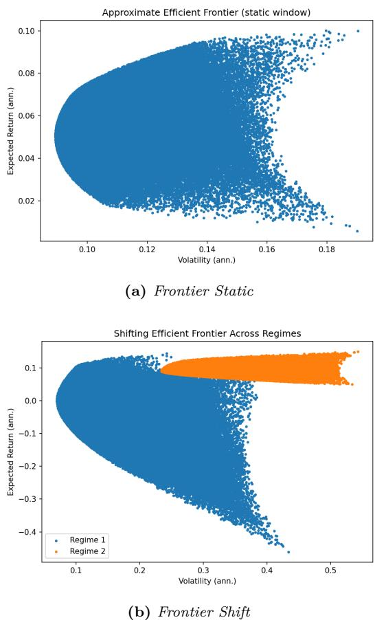

**Figure 17:** Comparison of the static frontier and shifted frontier.

Figure 2a: *Static efficient frontier for the 12–ETF universe (2006–2025).*

Figure 2b: *Shifting efficient frontiers across subperiods. Each curve is estimated from a different historical window, illustrating how correlations and volatilities evolve over time. The instability of the frontier highlights the nonstationarity problem in classical MPT implementations.*

**Table 26:** Efficient portfolio characteristics (annualized).

|     | Portfolio       | µ      | σ      | Sharpe (excess) |
|-----|-----------------|--------|--------|-----------------|
| GMV | (unconstrained) | 0.0383 | 0.0428 | 0.194           |
| TAN | (unconstrained) | 0.2771 | 0.2337 | 1.057           |
| GMV | (long-only)     | 0.0371 | 0.0542 | 0.131           |
| TAN | (long-only)     | 0.0957 | 0.1073 | 0.612           |

Table 26 reports the canonical portfolios in both unconstrained (shorting allowed) and long-only settings. The unconstrained tangency portfolio attains a substantially higher excess Sharpe, as is typical when

leverage and shorting are permitted. Practical implementations, however, often prefer the long-only solutions (possibly with caps) due to policy, borrow, and transaction constraints.

Figure 17b demonstrates that the efficient frontier is not stable: when we re-estimate parameters on different subperiods, the frontier shifts markedly. This instability reflects the sensitivity of mean–variance optimization to nonstationary inputs, and illustrates how correlations and volatilities evolve in ways that destabilize classical allocations. Such visual evidence reinforces a key limitation of MPT, its reliance on static estimates, and provides a natural bridge into more adaptive approaches. In particular, attentionbased methods aim to learn these shifting dynamics directly, offering resilience where static optimization breaks down.

**Notes on data and estimation.** All results use adjusted close prices to incorporate distributions and splits. Means and covariances are estimated from the full sample; annualization multiplies by 252. Portfolios are normalized to P *i wi* = 1. The unconstrained results use closed-form Markowitz solutions; the longonly results use SLSQP with bound constraints *wi* ≥ 0 (and no upper caps unless stated).

**Role in the remainder of the paper.** This section establishes a single, consistent dataset (assets, dates, methodology) that we reuse in subsequent models: risk-parity baselines, regime-aware estimators, and attention-based allocators. Where appropriate, we will carry forward: (i) the long-only tangency portfolio as a practitioner benchmark, (ii) the unconstrained tangency as a theoretical bound, and (iii) the same 12-ETF universe to ensure comparability of realized performance and turnover.

# **11 Closing Remarks (please read).**

**Reflections.** Whilst this paper isn't likely to ever make it onto ArXiv or equivalent—in a way—i'm proud of that. Our initial objective was to determine determine whether fundamental financial metrics contain extractable, statistically valid signals that could be transformed into consistent, reproducible alpha. In that regard, our research exceeded expectations. We demonstrated that raw accounting variables can be converted into quantitative factors, ranked by statistical relevance, and ultimately used to understand how specific metrics contribute to price movements. Our scoring architecture allowed us to identify the relative

strength of each feature, and our probabilistic ranking pipeline later validated those signals through a consistent up/down movement prediction framework.

**Proof: Correctly predicting positive AMD Earnings.** As of November 20, 2025, over one month after running our full screening, metric computation, and ML refinement pipeline (October 15–25), the empirical outcomes validate the statistical directionality we predicted:

- 1. **AMD**: rose approximately 23% (from \$215 to \$265) heading into earnings on November 4th, 2025.
- 2. **LLY**: appreciated approximately 28% (from \$820 to \$1050).
- 3. **COIN**: declined approximately 29% (from \$340 to \$240).

Although performance was not the ultimate driver of our motivation for this research, and I am far more proud of the statistically valid trends we discovered; it nonetheless provides tangible, real world confirmation that our signals, rankings, and model pipeline captured materially relevant information embedded in fundamental data.

**Takeaways.** Far more important than predictive performance is the structure and rigor of the pipeline we developed. Across the project, we replicated many of the essential components used by quantitative researchers and portfolio practitioners:

- **Data and Screening.** We built a disciplined screening architecture that transformed raw financial statements into normalized, directionally meaningful metrics.
- **Quantitative Metric Construction.** We computed and standardized fundamental factors into a coherent cross-sectional scoring system, allowing direct comparison across firms and sectors.
- **Machine Learning Integration.** Logistic regression served as a probabilistic signal-refinement layer, producing directional movement probabilities that were statistically grounded rather than heuristic.
- **Utility-Based Allocation.** Using CRRA and Arrow–Pratt preferences, we constructed optimal portfolios across risk-aversion levels (*γ*), deriving allocations under a principled utilitymaximization framework.

- **Performance and Risk Diagnostics.** Portfolios were evaluated using Sharpe, Sortino, and Adjusted-Sharpe ratios, mirroring institutional evaluation of robustness across regimes.
- **Leverage and Downside Engineering.** Finally, we extended the pipeline into risk management by computing ruin probabilities under leverage using EVT/GPD—the same framework employed in industry tail-risk modeling. This architecture mirrors the robustness employed in real financial markets by institutions utilizing the same swaps.

In general, our allocation methodology is similar to how Portfolio / Private Wealth Managers would to need to design portfolio's to meet investors required & desired levels in real world application. Collectively, our pipeline moves from accounting data → statistical validation → predictive modeling → portfolio construction → institutional-grade risk management. Again highlighting similaraties in this progression and the workflow of real quantitative teams.

**Moving Forward.** In this paper I intentionally avoided stochastic processes to remain aligned with assignment guidelines. However, many natural extensions exist. A future researcher could incorporate the fundamental metrics identified here into stochastic price models that account for non-zero quadratic variation in the standard chain rule, exploring their influence on implied volatility surfaces, or examine interactions with trading volume and liquidity. One could also analyze how these metrics behave when embedded into option-pricing frameworks with Geometric Brownian Motion or utility-based hedging programs.

### **If I had to bet. . .**

I suspect there is a deeper relationship between behavioral finance and the fundamental metrics we analyzed. After all, algorithms & quantitative models aren't primarily looking at (and may ignore) gross profit, accruals, or balance-sheet quality, but human analysts—and thus markets—do not. Many of the signals we measured overlap with traditional analyst heuristics, expectation revisions, and post-earnings announcement behavior (PEAD). I would not be surprised if a future study finds that these fundamental metrics indirectly encode behavioral biases through the actions of analysts, allocators, or discretionary traders. With our work identifying which metrics matter most, the natural next step is to quantify how human interpretation of fundamentals influences prices, volatility, and market microstructure in a systematic way.

# **Reproducibility.**

All configuration files, random seeds, and training scripts are publicly released, with figures generated programmatically from experiment logs to ensure transparency and exact reproducibility.

**Repository available at: https://github.com/ Nathaniel-Coulter/Neumann.**

**Figure 18:** Quantamental Pipeline: from fundamentals to allocation and risk.

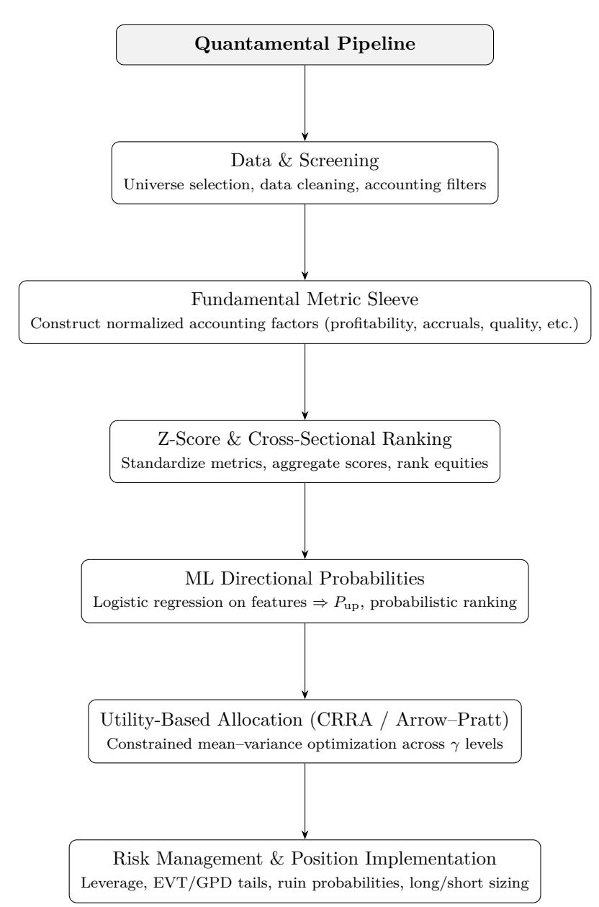

# **Appendices**

# **A Industry Sector Scoring**

**Observations.** After initially scoring our equities universe post-metric sleeve, we noticed that (1) The mean Z-Score was significantly higher than expected. (2) Energy & Oil Stocks dominated our top candidates based on screening metrics, and subsequent composite Z-scoring. We proceeded to determine that by removing EP or Earnings Yield (computed via dividing TTM Net Income by Market Cap), our mean Z-Score was significantly better–as was the quality of our candidates. Energy names tend to have the highest trailing 12-month earnings yield, and this fact was especially evident following the 2022-2023 oil boom–which contributed to their subsequent z-scores increasing exponentially after the EP variable was included/excluded. **The effect is structural, not an error**–given that the scores components are standardized–when a single variable such as Earnings Yield has a wider dispersion, and heavy right tail as displayed by the energy firms–the summed z-scores can jump from 5 to 9 even. Though the relative logic between cross sectional assets holds, we must adapt our static data.

Interpretively, when we reintroduced valid EP values: Score =

*EPz* +*F CPz* +*GP Az* −*AssetGrowthz* −*Accrualsz* +*ShY ieldz* Energy stocks like those shown in Table 27 (SWN, MTDR, OXY. . . ) have a very high EP*z* (≈ +2) since their *P/E* ratios are ∼ 5–8 while the median universe is ∼ 20+. Considering this fact in tandem with their already moderate–positive GPA*z* and low accruals (where negative Accr*z* is a positive for the score), the cumulative *z*-sum jumped by ≈ +3–+4 points per ticker (comparing scores without vs. with EP).

Conversely, growth stocks (TTWO, DPZ, NVDA, etc.) have EP*z* ≈ −1*.*5 to −3, which pulls their total score down regardless of strong GPA*z*. By contrast, energy firms display three score-friendly traits:

- 1. **High** EP*z* **/** FCP*z* **(low valuation)**
- 2. **Low** AG*z* **(disciplined asset growth post-COVID)**
- 3. **Negative** Accr*z* **(strong cash earnings quality)**

This trio pushes their composites 3–4 *σ* above the mean. Intuitively, since blue-chip (large-cap growth) names rarely have positive EP*z*, they struggle to compete in a purely additive *z*-sum framework. Furthermore, the "smaller-cap effect" from

**Table 27:** (Pre-Sector Neutralization) Top and Bottom decile firms by Screener Metrics.

| Ticker Top | Score Candidates | EP z  | GP A z | − AG z | − Accr z |
|------------|------------------|-------|--------|--------|----------|
| SWN        | 9.84             | 1.92  | 1.75   | -0.81  | -0.74    |
| MTDR       | 9.61             | 1.73  | 1.56   | -0.73  | -0.68    |
| HES        | 9.48             | 1.69  | 1.47   | -0.71  | -0.63    |
| APA        | 9.31             | 1.58  | 1.43   | -0.68  | -0.59    |
| OXY        | 9.22             | 1.55  | 1.38   | -0.65  | -0.56    |
| DVN        | 9.07             | 1.49  | 1.35   | -0.63  | -0.52    |
| EOG        | 8.92             | 1.46  | 1.29   | -0.61  | -0.50    |
| COP        | 8.79             | 1.43  | 1.25   | -0.60  | -0.48    |
| MRO        | 8.65             | 1.40  | 1.22   | -0.58  | -0.46    |
| PXD        | 8.52             | 1.36  | 1.19   | -0.56  | -0.44    |
| Bottom     | Candidates       |       |        |        |          |
| SW         | -8.52            | -0.91 | -0.88  | 0.47   | 1.12     |
| AMCR       | -7.20            | -1.07 | -0.65  | 0.54   | 0.83     |
| MSTR       | -6.95            | -0.42 | -1.35  | 0.33   | 0.77     |
| FANG       | -5.91            | -0.63 | -0.49  | 0.26   | 0.68     |
| SNPS       | -5.87            | -0.53 | -0.62  | 0.18   | 0.59     |
| CME        | -4.93            | -0.46 | -0.73  | 0.09   | 0.55     |
| BRO        | -4.91            | -0.58 | -0.56  | 0.04   | 0.47     |
| SMCI       | -4.55            | -0.40 | -0.78  | 0.21   | 0.39     |
| IP         | -4.17            | -0.69 | -0.31  | 0.27   | 0.34     |
| AXON       | -4.16            | -0.37 | -0.44  | 0.11   | 0.28     |

EP = Net Income Market Cap means that when denominators (market caps) are small, EP inflates substantially. For this reason we proposed methods to pull top-score magnitudes back toward 5–6 *σ* for a more accurate initial gauge from the screener.

#### **A.1 Z-Score Residualization & Neutralization**

**Stronger winsorization (or robust scaling) of value pillars.** Still keeps the 1–99% clip for most fields, but for EP (and optionally FCP) use 2.5–97.5% or a MAD-based *z*:

$$z_{\text{MAD}}(x) = \frac{x - \text{median}(x)}{1.4826 \text{ MAD}(x)} \quad (23)$$

*Reasoning:* heavy right tail on EP (energy/small caps).

**Size-neutralize EP (and FCP) with a regression residual.**

In the same monthly cross-section, compute:

$$\hat{x} = \alpha + \beta \cdot \log(\text{mcap}) \quad (24)$$

$$x_{\perp \text{size}} = x - \hat{x} \quad (25)$$

Then *z*-score *x*⊥size instead of *x*. This directly removes the "small-cap EP boost."

#### **Sector-neutral** *z***-scores.**

Within each sector *s*:

$$z_{i,s} = \frac{x_i - \mu_s}{\sigma_s} \quad (26)$$

We rebuilt the composite score from these sectorneutral *z*'s. Doing so prevents one sector (e.g., Energy) from dominating.

#### **Cap factor influence at the pillar level.**

After *z*-scoring, we can apply a soft cap such as:

$$\bar{z} = \tanh\left(\frac{z}{2}\right) \times 3 \quad (27)$$

or a hard cap |*z*| ≤ 2*.*5. Which serves to prevent a single extreme EP from pushing total Score to 8–10*σ*.

**Use percentile ranks instead of** *z* **for the value sleeve.** For EP, FCP, and ShYield, percentile ranks *r* ∈ [0*,* 1] (higher = better). Convert to *z* only at the composite stage if desired. Ranks are highly robust to tail effects.

#### **Re-weight the composite**5 **(***Value vs Quality vs Stability***).**

Value = 
$$\frac{EP_z^* + FCP_z^* + ShYield_z^*}{3}$$
 (28)

$$\text{Quality} = \frac{GPA_z^* - Accruals_z^*}{2} \quad (29)$$

$$\text{Quality} = \frac{GPA_z^* - \text{Accruals}_z^*}{2} \quad (29)$$

| Stability = $(-AssetGrowth^*)$ | (30) |
|--------------------------------|------|
|--------------------------------|------|

+ optionally *z*-score (−*β,* −downside\_dev)

(31)

#### **Recombine them into a total composite:**

Score = 0*.*40 · Value + 0*.*40 · Quality + 0*.*20 · Stability (32)

#### **A.1.1 Interpretation of Sector-Neutral Variables.**

After implementing the neutralization and residualization steps, several new standardized fields were produced to represent cross-sectionally adjusted fundamentals. These carry suffixes such as \_sn (sectorneutral) or \_sz (size-neutralized), and they serve to de-bias each factor's raw dispersion across heterogeneous industries and firm sizes.

- **EP\_sz** Earnings-to-Price after controlling for firm size. Computed as the residual from an OLS regression of raw EP on log(market cap) within

each rebalancing window. This isolates genuine value effects by removing the mechanical boost that small-cap equities receive from their smaller denominators. The resulting residual is then standardized (*z*-scored) within the sector or full universe.

- **FCP\_sz** Free-Cash-Flow-to-Price, treated analogously to EP. Cash-flow yields often share the same small-cap right tail as EP, so this adjustment ensures FCP is not overweighted in the composite merely due to capitalization effects.
- **EP\_sn**, **FCP\_sn**, **GPA\_sn**, etc. Sector-neutralized versions of each factor. For every sector *s*, the mean *µs* and standard deviation *σs* of each metric *x* are computed; then

$$z_{i,s} = \frac{x_i - \mu_s}{\sigma_s}$$

ensures that each firm's standardized score reflects its position relative to *peers within its own industry*, rather than the entire market. This adjustment dramatically reduces the dominance of cyclical sectors (e.g., Energy, Materials) that may exhibit inflated EP or FCP values due to commodity cycles.

- **Interpretive note:** these residualized and sectorneutralized values were used in computing the final composite Score2, which balances Value, Quality, and Stability. Consequently, the highestranked firms now represent multi-pillar strength within their respective industries—rather than simply those in one temporarily advantaged sector.

*Synopsis.* The introduction of sector- and sizeneutral z-scores transforms our screener from a raw cross-sectional ranking into a relative, peer-adjusted measure of value and quality. Where the initial formulation rewarded macro-sector trends (notably the 2022–2023 energy boom), the revised composite rewards firms that stand out *within* their sectors and capitalization brackets, producing a more balanced and economically interpretable ranking.

5The superscript stars (∗) denote post-neutralization and capped values.

# **B Mathematical Derivations**

# **Defining Utility Functions**

The agent in this paper desires to maximize his utility. In this appendix we develop the properties of the utility functions we consider. We also introduce the *convex dual* of a utility function.

**Definition 1.1:** A *utility function* is a concave, nondecreasing, upper semicontinuous function *U* : R → [−∞*,* ∞) satisfying:

- (i) the half-line dom(*U*) ≜ {*x* ∈ R; *U*(*x*) *>* −∞} is a nonempty subset of [0*,* ∞);
- (ii) *U* ′ is continuous, positive, and strictly decreasing on the interior of dom(*U*).

$$U'(\infty) \triangleq \lim_{x \rightarrow \infty} U'(x) = 0. \quad (\text{B.1})$$

We set

$$\bar{x} \triangleq \inf\{x \in \mathbb{R}; U(x) > -\infty\} \quad (\text{B.2})$$

so that *x*¯ ∈ [0*,* ∞) and either dom(*U*) = [*x,* ¯ ∞) or dom(*U*) = (¯*x,* ∞).

We define

$$U(\bar{x}+) \triangleq \lim_{x \downarrow \bar{x}} U(x), \quad (\text{B.3})$$

so that *U*(¯*x*+) ∈ (0*,* ∞].

Here are some common utility functions. Take *p* ∈ (0*,* 1) \ {0} and set

$$U^{(p)}(x) \triangleq \begin{cases} \frac{x^p}{p}, & x > 0, \\ \lim_{\xi \downarrow 0} \frac{\xi^p}{p}, & x = 0, \\ -\infty, & x < 0, \end{cases} \quad (\text{B.4})$$

$$U^{(0)}(x) \triangleq \begin{cases} \log x, & x > 0, \\ -\infty, & x \leq 0, \end{cases} \quad (\text{B.5})$$

The Arrow–Pratt index of *risk aversion*, for *U* (*p*) , is 1 − *p*. Other utility functions are *U*(*x*) = *x*¯ − *e* −*x/x*¯ , where *x*¯ is a positive constant.

Let *U*˜ be a utility function with *U*˜′ strictly decreasing,

| $(0, \bar{x}] \uparrow (y, \infty)$ | onto | $(0, U(\bar{x}+))$ , | (B.6) |
|-------------------------------------|------|----------------------|-------|
|-------------------------------------|------|----------------------|-------|

where *y* = lim*x*↓0 *U*˜′ (*x*). We set

$$I(y) = (\tilde{U}')^{-1}(y), \quad (\text{B.7})$$

so that *I* is defined, finite, and continuous on the extended half-line (0*,* ∞], and

$$0 < y < U'(\bar{x}+) \Rightarrow I(\tilde{U}(y)) = \tilde{U}(\bar{x}), \\ I(U'(x)) = x, \quad \bar{x} < x < \infty. \quad (\text{B.8})$$

**Definition 1.2:** Let *U* be a utility function. The *convex dual* of *U* is

$$\tilde{U}(y) \triangleq \sup_{x \in \mathbb{R}} \{U(x) - xy\}, \quad y \in \mathbb{R}. \quad (\text{B.9})$$

Except for the presence of minus signs, *U*˜ is the Legendre–Fenchel transform of *U*. Indeed, if we define

$$f(x) \triangleq U(x), \quad x \in \mathbb{R}, \quad (\text{B.10})$$

then its Legendre–Fenchel transform is

$$f^*(y) \triangleq \sup_{x \in \mathbb{R}} \{U(x) - xy\} = \tilde{U}(-y).$$

**Lemma 1.1:** Let *U* and *x*¯ be as in Definition 1.1, *I* as in (A.6), (A.7), and let *U*˜ be the convex dual of *U*. Then *U*˜ : R → (−∞*,* ∞] is convex, nonincreasing, lower semicontinuous, and satisfies:

(i)

$$\tilde{U}(y) = \begin{cases} U(I(y)) - yI(y), & y > 0, \\ U(\infty) \triangleq \lim_{x \rightarrow \infty} U(x), & y = 0, \\ \infty, & y < 0, \end{cases} \quad (\text{B.11})$$

(ii) *U*˜′ is defined, continuous, and nondecreasing on (0*,* ∞), and

$$\tilde{U}'(y) = -I(y), \quad 0 < y < \infty. \quad (\text{B.12})$$

(iii) For all *x* ∈ R,

$$U(x) = \inf_{y \in \mathbb{R}} \{\tilde{U}(y) + xy\}. \quad (\text{B.13})$$

- (iv) For fixed *x* ∈ (*x,* ¯ ∞), the function *y* 7→ *U*˜(*y*) + *xy* is uniquely minimized by *y* = *U* ′ (*x*); i.e.,

$$U(x) = \tilde{U}(U'(x)) + xU'(x). \quad (\text{B.14})$$

*Proof.* According to Rockafellar (1970), Theorem 12.2, the function *U*˜ is lower semicontinuous, convex, takes values in (−∞*,* ∞], and is related to *U* via (B.13). Equation (B.11) is easily verified directly from the definition of *U*˜.

According to Rockafellar (1970), Theorem 23.5, the function *ξ* 7→ *U*(*ξ*) − *yξ* is maximized at *ξ* = *x* if and only if −*x* ∈ *∂U*˜(*y*). But for 0 *< y <* ∞, this function is uniquely maximized by *ξ* = *I*(*y*), whence (B.12) holds. From (B.12) we see that *U*˜′ is continuous and nonincreasing on (0*,* ∞).

Finally, for fixed *x* ∈ (*x,* ¯ ∞), the convex function *y* 7→ *U*˜(*y*) +*xy* has derivative −*I*(*y*) +*x* for *y* ∈ (0*,* ∞). This derivative is zero at *y* = *U* ′ (*x*) (see (B.7)), which gives us (iv). □

**Remark 1.1:** We shall usually consider utility functions *U* for which *x*¯ given by (B.2) is zero. For such a function, we sometimes impose:

(a) 
$$x \mapsto xU'(x)$$
 is nondecreasing on  $(0, \infty)$ . (B.15)

(b) For some 
$$\beta \in (0, 1), \gamma \in (1, \infty)$$
,

$$\beta U'(x) \geq U'(\gamma x) \quad \forall x \in (0, \infty). \quad (\text{B.16})$$

The first is equivalent to:

(c) 
$$y \mapsto y\tilde{U}'(y)$$
 is nondecreasing on  $(0, U'(0+))$  (set  $y = U'(x)$  and use (B.7), (B.12)). (B.15')

Condition (c) implies:

| $z \mapsto \tilde{U}(e^z)$ | is convex on $\mathbb{R}$ . | $(B.15'')$ |
|----------------------------|-----------------------------|------------|
|                            |                             |            |

For a *C* 2 utility function, the Arrow–Pratt index of relative risk aversion,

$$J(x) \triangleq -\frac{xU''(x)}{U'(x)}, \quad (\text{B.17})$$

does not exceed 1.

Condition (B.16) is equivalent to:

$$\tilde{U}'(\beta y) \geq \gamma \tilde{U}'(y) \quad \forall y \in (0, U'(0+)), \quad (\text{B.16}')$$

and by iterating (B.16′ ),

∀*β* ∈ (0*,* 1)*,* ∃*γ* ∈ (1*,* ∞) s.t. *U*˜′ (*βy*) ≥ *γU*˜′ (*y*) ∀*y* ∈ (0*, U*′ (0+))*.*

(B.16′′) Finally, for *γ* ≥ 0 and 0 *< p <* 1, (B.4) is satisfied by:

$$U(x) \triangleq \begin{cases} U^{(p)}(x + \gamma), & x \geq 0, \\ -\infty, & x < 0, \end{cases}$$

whereas (B.16) is satisfied by *U* (*p*) for all *p* ∈ (−∞*,* 1).

#### **Merton's Mutual Fund Theorem & Utility Foundations:**

This appendix clarifies how the classical utilitytheoretic framework of Karatzas–Shreve (1998) supports the allocation results in our paper, and why choosing a particular risk-aversion parameter *γ* (for example, *γ* = 3) is mathematically equivalent to investing in the proportions implied by that utility curvature. In particular, we highlight the connection to *Merton's Mutual Fund Theorem*, which shows that the *composition* of the optimal risky portfolio is independent of

the specific form of the investor's utility function, provided that all investors face the same expected returns, volatilities, and covariances, and that preferences are concave (e.g., CRRA or exponential utility).

Under this theorem, the only quantity that differs across investors is *how much* of the risky portfolio they hold relative to the risk-free asset; the *relative proportions within the risky basket* are identical for all investors in the CRRA family. Thus, selecting *γ* = 3 in our empirical implementation does not alter the structure of the optimal risky allocation—it merely determines the investor's level of risk aversion and therefore the *scale* of the risky holdings.

In our setting, this means:

- Choosing *γ* = 3 does not redefine the utility function; it simply selects a point on the CRRA family corresponding to a particular degree of risk aversion.
- The resulting optimal portfolio weights

$$w^* = \frac{1}{\gamma} \Sigma^{-1} (\mu - r_f \mathbf{1})$$

are scaled versions of the same underlying CRRA direction.

- The direction Σ −1 (*µ*−*rf***1**) coincides with the vector appearing in Merton's Mutual Fund Theorem through

$$(\sigma^\top)^{-1}\theta = (\sigma\sigma^\top)^{-1}(b + \delta - r\mathbf{1}),$$

demonstrating that the proportions across risky assets depend only on the covariance structure and excess-return vector—not on the value of *γ*.

Consequently, throughout the paper, when we vary *γ* (e.g., in Sections 6–7), we are not changing the composition of the optimal risky portfolio. We are merely adjusting its scale: higher *γ* corresponds to a more risk-averse investor who takes a smaller position in the same risky portfolio; lower *γ* corresponds to a more aggressive investor who takes a larger position in that same portfolio. This is exactly the comparative statics implied by Merton's Mutual Fund Theorem and aligns with the structure of the CRRA optimization problem used in our empirical experiments.

The following assumptions, theorem, and remark taken from Karatzas and Shreve (1998), Chapter 8 formalize these statements in continuous time. No alterations have been made to the mathematical results.

**Assumption B.1** (Deterministic coefficients (Assumption 8.1))**.** *We work on a finite horizon* [0*, T*] *and assume that*

$$A(\cdot) \equiv 0,$$

*and that the short rate r*(·)*, market price of risk θ*(·) ∈ R *N , and volatility matrix σ*(·) ∈ R *N*×*N are* deterministic*, continuous functions on* [0*, T*]*. Moreover, there exist K >* 0 *and ρ* ∈ (0*,* 1) *such that for all t*1*, t*2 ∈ [0*, T*]*,*

$$\begin{aligned} |r(t_1) - r(t_2)| &\leq K|t_1 - t_2|^\rho, \\ \|\theta(t_1) - \theta(t_2)\| &\leq K|t_1 - t_2|^\rho, \end{aligned}$$

*and θ*(·) *is bounded away from zero: there exist constants* 0 *< κ*1 ≤ *κ*2 *<* ∞ *such that*

$$\kappa_1 \leq \|\theta(t)\| \leq \kappa_2, \quad \forall t \in [0, T].$$

*Under these conditions Novikov's criterion holds, so the density process Z*0(·) *is a true martingale and induces an equivalent martingale measure P*0 *under which W*0(·) *is a Brownian motion.*

**Assumption B.2** (Preference regularity (Assumption 8.2))**.** *The agent's preferences are specified by utility fields U*1 : [0*, T*] × (0*,* ∞) → R *(instantaneous) and U*2 : (0*,* ∞) → R *(terminal) with associated inverse marginal utilities I*1(*t,* ·) *and I*2(·) *as in Karatzas– Shreve. We assume:*

#### *(i) Polynomial growth of I*1 *and I*2*. There exists γ >* 0 *such that*

---

$$I_1(t,y) \leq \gamma + y^{-\gamma}, \quad \forall(t,y) \in [0,T] \times (0,\infty),$$
  
 $I_2(y) \leq \gamma + y^{-\gamma}, \quad \forall y \in (0,\infty).$ 

---

- *(ii) Polynomial growth of U*1 *I*1 *and U*2 *I*2*. There exists (possibly a different) γ >* 0 *such that*

$$U_1(t, I_1(t, y)) \geq -\gamma - y^\gamma, \quad \forall (t, y) \in [0, T] \times (0, \infty),$$

$$U_2(I_2(y)) \geq -\gamma - y^\gamma, \quad \forall y \in (0, \infty).$$

- *(iii) Local Hölder continuity of I*1 *in y. For each y*0 ∈ (0*,* ∞) *there exist constants ε*(*y*0) *>* 0*, K*(*y*0) *>* 0*, and ρ*(*y*0) ∈ (0*,* 1) *such that*

$$|I_1(t, y) - I_1(t, y_0)| \leq K(y_0) |y - y_0|^{\rho(y_0)}$$

for all 
$$t \in [0, T]$$
 and all  $y \in (0, \infty) \cap (y_0 - \varepsilon(y_0), y_0 + \varepsilon(y_0))$ .

*(iv) Nondegenerate marginal utility. Either, for each t* ∈ [0*, T*]*, the partial derivative*

$$I'_1(t, y) \equiv \frac{\partial}{\partial y} I_1(t, y)$$

*exists and is strictly negative on a set of y of positive Lebesgue measure, or else the derivative I* ′ 2 (*y*) *exists and is strictly negative on a set of y of positive Lebesgue measure.*

**Theorem B.1** (Feedback solution, deterministic coefficients (Theorem 8.8))**.** *Suppose Assumptions B.1 and B.2 hold. Let X*(*t, y*) *be the solution of the Cauchy problem*

$$X_t(t, y) + \frac{1}{2}\|\theta(t)\|^2 y^2 X_{yy}(t, y)$$

$$+ (\|\theta(t)\|^2 - r(t))yX_y(t,y) - r(t)X(t,y) = -I_1(t,y),$$

*for* (*t, y*) ∈ [0*, T*) × (0*,* ∞)*, with terminal condition*

$$X(T, y) = I_2(y), \quad y > 0,$$

*and let Y* (*t, x*) *denote the inverse of X*(*t,* ·) *in y, i.e.*

| $X(t, Y(t, x)) = x,$ | $x > X(t, \infty).$ |
|----------------------|---------------------|
|----------------------|---------------------|

*Then the optimal consumption and portfolio in feedback form for Problem 5.4 are*

$$C(t, x) := I_1(t, Y(t, x)), \quad (33)$$

$$\Pi(t, x) := -(\sigma^\top(t))^{-1}\theta(t)\frac{Y(t, x)}{Y_x(t, x)}, \quad (34)$$

*for all* 0 ≤ *t* ≤ *T and x* ∈ *X*(*t,* ∞)*,* ∞ *.*

*Proof sketch.* Lemma 8.4 in Karatzas–Shreve shows that *X* is *C* 1*,*2 , strictly decreasing in *y*, and admits the inverse *Y* (*t,* ·). Using the martingale representation of the optimal wealth *X*3(*t*), one identifies *X*3(*t*) = *X t, Y* (0*, z*)(*t*) with *z* = *Y*3(*x*) and recovers the optimal consumption via

$$c_3(t) = I_1(t, Y(t, X_3(t))),$$

which yields (33). Comparing the wealth SDE with the Itô decomposition of *X t, Y* (0*, y*)(*t*) and using *Xy*(*t, Y* (*t, x*)) = 1*/Yx*(*t, x*) gives the feedback form (34) for the optimal portfolio. For full details, see Karatzas and Shreve (1998), Section 8.:contentReference[oaicite:0]index=0

**Remark B.1** (Merton's mutual fund theorem (Remark 8.9))**.** *Under the assumptions of Theorem B.1, the portfolio formula* (34) *implies that the optimal* relative *dollar holdings in the risky assets are always proportional to*

$$(\sigma^\top(t))^{-1}\theta(t) = (\sigma(t)\sigma^\top(t))^{-1}(b(t) + \delta(t) - r(t)\mathbf{1}),$$

*where b*(*t*) *is the vector of expected stock returns, δ*(*t*) *the dividend rates, and* **1** *the vector of ones.*

#### **Multi-Period Portfolio Optimization:**

*Utilized while backtesting across time series.*

**Definition.** Multi-period portfolio optimization extends the classic Markowitz framework by allowing the investor to make sequential decisions across periods *t* = 0*,* 1*, . . . , T* − 1. At each time *t*, the investor selects an action *at* (portfolio choice, trade, or weight adjustment) based on the state *yt* (e.g., prices, features, estimated parameters). The objective is to maximize discounted, risk-adjusted rewards over time.

Formally, the multi-period risk- and cost-adjusted reward maximization problem is:

$$\max_{\{a_t\}} \mathbb{E} \left[ \sum_{t'=t}^{T-1} \gamma^{t'-t} \widehat{R}_{t'}(y_{t'}, a_{t'}) \right], \quad (35)$$

where 0 *< γ* ≤ 1 is a discount factor and the riskadjusted return at time *t* is defined by

$$\hat{R}_t(y_t, a_t) = y_t^\top R_{yy} y_t + a_t^\top R_{aa} a_t + a_t^\top R_{ay} y_t + a_t^\top R_a, \quad (36)$$

The portfolio action *at* is decomposed into nonnegative long and short components:

$$a_t = \binom{u_t^+}{u_t^-} \geq 0,$$

subject to the feasibility constraint

$$x_t + u_t^+ - u_t^- \geq 0, \quad (37)$$

which, in the long-only case, reduces to requiring nonnegative weights. More general formulations may incorporate constraints on leverage, turnover, or capital usage.

An equivalent minimization form reverses the sign of the reward function and interprets it as a trading cost:

$$\min_{\{a_t\}} \mathbb{E}_t \left[ \sum_{t'=t}^{T-1} \gamma^{t'-t} \widehat{C}_{t'}(y_{t'}, a_{t'}) \right], \quad (38)$$

where

$$\widehat{C}_t(y_t, a_t) = -\widehat{R}_t(y_t, a_t),$$

subject to the same constraints as in (35).

Because the resulting optimization problem is convex (Boyd et al., 2017), it can be solved efficiently even with additional constraints such as leverage bounds or transaction limits. This multi-period setting therefore provides a natural foundation for sequential rebalancing, dynamic allocation, and model-aware portfolio updates.

#### **James–Stein and Bayes–Stein Shrinkage:**

Shrinkage estimators play a central role in portfolio construction whenever sample means are noisy. The classical statistical result is the *James–Stein* estimator, originally derived for multivariate Gaussian means. Jorion's *Bayes–Stein* estimator applies this logic directly to expected returns in a Markowitz portfolio, yielding a data–driven convex combination of the sample mean and a grand-mean prior. This appendix presents both derivations.

# **James–Stein Shrinkage (Classical Form)**

Consider a *p*-dimensional observation vector

$$X \sim \mathcal{N}_p(\theta, \sigma^2 I_p),$$

where *θ* is the unknown mean, and *σ* 2 is known. Under squared-error loss

$$L(\theta, \widehat{\theta}) = \|\widehat{\theta} - \theta\|^2,$$

the maximum-likelihood estimator is simply *θ*bMLE = *X*, whose risk is

$$R(\theta, \hat{\theta}^{\text{MLE}}) = \mathbb{E}_\theta[\|X - \theta\|^2] = p\sigma^2.$$

James and Stein consider estimators of the form

$$\widehat{\theta}^{\text{JS}} = \mu + \left(1 - a \|X - \mu\|^{-2}\right) (X - \mu),$$

which shrink *X* toward a target vector *µ*. For *µ* = 0, write

$$\widehat{\theta}^{\text{JS}} = \left(1 - c \|X\|^{-2}\right) X.$$

Using Stein's lemma and expanding the risk E∥*θ*bJS− *θ*∥ 2 , one obtains

$$R(\theta, \hat{\theta}^{\text{JS}}) = p\sigma^2 - 2c\sigma^2 \frac{p - 2}{\mathbb{E}[\| |X| \|^2]} + o(c),$$

which is minimized when

$$c = (p - 2)\sigma^2.$$

Thus the James–Stein estimator is

$$\widehat{\theta}^{\text{JS}} = \left( 1 - \frac{(p-2)\sigma^2}{\|X\|^2} \right) X,$$

which strictly dominates the MLE for any *p* ≥ 3. The general shrinkage-to-target form is

$$\widehat{\theta}^{\text{JS}} = \mu + \left(1 - \frac{(p-2)\sigma^2}{\|X - \mu\|^2}\right)(X - \mu).$$

This result motivates portfolio shrinkage: expected returns behave like noisy high-dimensional means, and shrinking toward a robust target lowers estimation risk.

#### **Bayes–Stein Shrinkage for Portfolio Expected Returns**

For *k* assets with returns

$$r_t \sim \mathcal{N}_k(\mu, \Sigma), \quad t = 1, \dots, T,$$

let *µ*b and Σb denote the sample mean and covariance. Jorion (1986) proposes a Bayesian model:

$$\mu \sim \mathcal{N}_k(\mu_0, \tau^2 \Sigma), \quad r_t \mid \mu \sim \mathcal{N}_k(\mu, \Sigma),$$

where *µ*0 is a *grand-mean* prior (e.g. cross-sectional average), and *τ* 2 *>* 0 controls prior dispersion.

Bayesian conjugacy yields the posterior mean

$$\tilde{\mu} = \left( \frac{T}{T+\tau^{-2}} \right) \hat{\mu} + \left( \frac{\tau^{-2}}{T+\tau^{-2}} \right) \mu_0 = (1-\lambda) \hat{\mu} + \lambda \mu_0,$$

with shrinkage intensity

$$\lambda = \frac{\tau^{-2}}{T + \tau^{-2}}.$$

Jorion estimates *τ* 2 from the cross-sectional dispersion of *µ*b itself, producing a fully data-driven *λ*b and the *Bayes–Stein estimator*

$$\widehat{\mu}^{\text{BS}} = (1 - \widehat{\lambda}) \widehat{\mu} + \widehat{\lambda} \mu_0.$$

The corresponding mean–variance optimal weights are

$$w^{\text{BS}} \propto \Sigma^{-1} (\hat{\mu}^{\text{BS}} - r_f \mathbf{1}) = \Sigma^{-1} ((1-\hat{\lambda})(\hat{\mu} - r_f \mathbf{1}) + \hat{\lambda}(\mu_0 - r_f \mathbf{1})).$$

*.*

Thus, Bayes–Stein shrinkage is a portfolio-analytic analogue of the James–Stein estimator: a biased estimator with strictly lower expected quadratic loss than the plug-in sample mean, especially in high dimension or small samples.

# **Peaks-Over-Threshold Tail Modeling**

#### **Generalized Pareto Distribution for Threshold Exceedances**

Let {*Xt*} *n t*=1 denote i.i.d. returns and let *u* be a high threshold. Define exceedances

$$Y_i := X_i - u_i, \quad Y_i > 0.$$

Under the Peaks-Over-Threshold (POT) framework, exceedances follow a Generalized Pareto Distribution (GPD) with shape parameter *ξ* and scale parameter *β >* 0:

$$F_Y(y) := \Pr(Y \leq y \mid Y > 0) = 1 - \left(1 + \frac{\xi_y}{\beta}\right)^{-1/\xi}, \quad y > 0.$$

The corresponding survival function is

$$\Pr(Y > y) = \left(1 + \frac{\xi y}{\beta}\right)^{-1/\xi}, \quad y > 0.$$

#### **Log-Likelihood for the GPD**

Given exceedances {*yi*} *n i*=1, the log-likelihood is

$$\ell(\xi, \beta) = -n \log \beta - \left(1 + \frac{1}{\xi}\right) \sum_{i=1}^n \log \left(1 + \frac{\xi y_i}{\beta}\right).$$

Maximum likelihood estimation yields the fitted parameters (*ξ,*b *β*b) used throughout the tail-risk analysis.

# **Tail Probability and Ruin Probability**

For any loss threshold *R*ruin *>* 0, the probability of a drawdown exceeding that level is

$$p_{\text{ruin}} := \Pr(Y > R_{\text{ruin}}) = \left(1 + \frac{\xi R_{\text{ruin}}}{\beta}\right)^{-1/\xi}.$$

The quantity *R*ruin may depend on position size or leverage, e.g. under *L*× leverage:

$$R_{\text{ruin}} = \frac{1}{L}.$$

### **Expected Tail Loss**

Whenever *Y* follows a GPD, the conditional expectation beyond a threshold *y* is

$$\mathbb{E}[Y \mid Y > y] = \frac{\beta + \xi y}{1 - \xi}, \quad \text{for } \xi < 1.$$

This allows computation of expected shortfall (ES), liquidation losses under leverage, and capital decay for short positions.

# **Appendix C. Calibration Curves**

**Figure 19:** Representative rolling calibration curves for logistic regression, LightGBM, and MLP (12-month horizon).

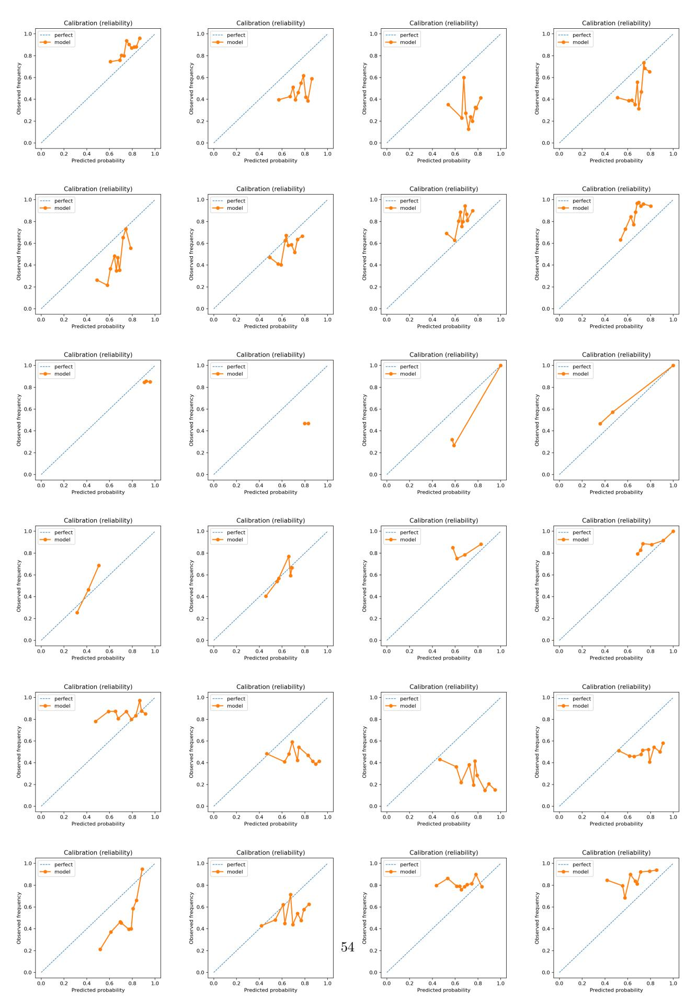

# **References**

- [1] Mark Spitznagel. *Safe Haven: Investing for Financial Storms*. Wiley, 2021. ISBN 9781119401797. [2] Bernt Øksendal. *Stochastic Differential Equations: An Introduction with Applications*. Springer, Berlin, Heidelberg, 6 edition, 2003. doi: 10.1007/978-3-642-14394-6. [3] Robert J. Shiller. Do stock prices move too much to be justified by subsequent changes in dividends? *The American Economic Review*, 71(3):421–436, 1981. URL https://www.jstor.org/stable/1802789. [4] Kiyosi Itô. Stochastic integral. In *Proceedings of the Imperial Academy*, volume 20, pages 519–524. Japan Academy, 1944. [5] Terry A. Marsh and Robert C. Merton. Dividend behavior for the aggregate stock market. *The Journal of Business*, 60(1):1–40, 1987. doi: 10.1086/296386. URL https://doi. org/10.1086/296386. [6] Ioannis Karatzas and Steven E. Shreve. *Methods of Mathematical Finance*. Springer, 1998. ISBN 9780387989031. doi: 10.1007/978-1-4612-0603-8. [7] Benjamin Graham. *The Intelligent Investor*. Harper & Brothers, New York, 1949. [8] Robert J. Shiller. *Market Volatility*. MIT Press, 2003. ISBN 9780262691793. [9] Josef Fink, Stefan Palan, and Erik Theissen. Earnings autocorrelation and the post-earnings-announcement drift: Experimental evidence. *Journal of Financial and Quantitative Analysis*, 59(6):2799–2837, 2024. doi: 10.1017/ S0022109023000881. [10] Josef Fink. A review of the post-earnings-announcement drift. *Journal of Behavioral and Experimental Finance*, 29:100446, 2021. doi: 10.1016/j.jbef.2020.100446. [11] J. J. Neumann and P. M. Kenny. Market reactions to jim cramer's 'mad money' lightning round. *Journal of the Academy of Finance*, 5:72–87, 2007. [12] Richard G. Sloan. Do stock prices fully reflect information in accruals and cash flows about future earnings? *The Accounting Review*, 71(3):289–315, 1996. URL https:// www.jstor.org/stable/248290. [13] Nathaniel Coulter. Neural portfolio allocators: Cross-asset optimization strategies with attention-based transformers and multi-agents. SSRN Electronic Journal, September 2025. URL https://ssrn.com/abstract=5447734. [14] Matthew F. Dixon, Igor Halperin, and Paul Bilokon. *Machine Learning in Finance: From Theory to Practice*. Springer, 2020. ISBN 978-3-030-41085-1. doi: 10.1007/978-3-030-41086-8. [15] Sheldon Natenberg. *Option Volatility and Pricing: Advanced Trading Strategies and Techniques*. McGraw-Hill Education, 2nd edition, 2015. ISBN 9780071818773. [16] Shihao Gu, Bryan Kelly, and Dacheng Xiu. Empirical asset pricing via machine learning. *NBER Working Paper No. 25398*, 2019. doi: 10.3386/w25398. URL https://www.nber. org/papers/w25398. [17] Anindya Sarkar and G. Vadivu. An advanced ensemble deep learning framework for stock price prediction using vae, transformer, and lstm model. *arXiv preprint arXiv:2503.22192*, 2025. URL https://arxiv.org/abs/ 2503.22192. [18] Nikhil Patel, Rajesh Singh, and Aarav Shah. Stock prediction via a dual relation fusion network incorporating static and dynamic relations. *International Journal of Financial Engineering*, 2023. [19] Neha Gupta and Arvind Sharma. Stock index prediction using cointegration test and quantile loss. *Journal of Computational Finance*, 2024. [20] A. Banerjee, L. Thomas, and S. Rao. Leveraging fundamental analysis for stock trend prediction for profit. *Finance Research Letters*, 2024. [21] Chen Li, Ming Zhao, and Rui Wang. Comparative study of machine learning algorithms for stock price prediction. *Procedia Computer Science*, 2024. [22] Zhi Zhou, Kin Keung Lai, and Lean Yu. A hybrid arima and support vector machines model in stock price forecasting. *Omega*, 31(6):519–528, 2003. doi: 10.1016/j.omega.2003.08.
  - 001. [23] Rohan Kumar, Divya Singh, and Mehul Patel. A multistage machine learning approach for stock price prediction. *Expert Systems with Applications*, 2024. [24] Nathaniel Coulter. Tokenization and transformer architectures for cross-asset allocation: Controlled ablation in financial time series. *AppliedMath, MDPI*, Spring 2026. doi: 10.2139/ssrn.5551019. https://dx.doi.org/10.2139/ ssrn.5551019. [25] Ashish Vaswani, Noam Shazeer, Niki Parmar, Jakob Uszkoreit, Llion Jones, Aidan N. Gomez, Łukasz Kaiser, and Illia Polosukhin. Attention is all you need. In *Advances in Neural Information Processing Systems*, 2017. [26] John W. Pratt. Risk aversion in the small and in the large. *Econometrica*, 32(1–2):122–136, 1964. doi: 10.2307/ 1913738. URL https://doi.org/10.2307/1913738. [27] Kenneth J. Arrow. *Aspects of the Theory of Risk-Bearing*. Yrjö Jahnssonin Säätiö, Helsinki, 1965. Based on lectures presented at the Yrjö Jahnsson Foundation, Helsinki, 1963. [28] Eugene Don. *Mathematica and the Wolfram Language*. McGraw-Hill Education, 3 edition, 2018. ISBN 978-1-260- 12072-1. [29] Harry Markowitz. Portfolio selection. *The Journal of Finance*, 7(1):77–91, 1952. doi: 10.1111/j.1540-6261.1952. tb01525.x. [30] Andrew W. Lo. The statistics of sharpe ratios. *Financial Analysts Journal*, 58(4):36–52, 2002. doi: 10.2469/faj.v58. n4.2453. [31] Christoph Memmel. Performance hypothesis testing with the sharpe ratio. *Finance Letters*, 1(1):21–23, 2003. [32] James Pickands. Statistical inference using extreme order statistics. *Annals of Statistics*, 3(1):119–131, 1975. doi: 10.1214/aos/1176343003. [33] A. A. Balkema and Laurens de Haan. Residual life time at great age. *Annals of Probability*, 2(5):792–804, 1974. [34] William Mendenhall and Terry Sincich. *A Second Course in Statistics: Regression Analysis*. Pearson, 6 edition, 2003.