# On-Chain Cash: The effect of stablecoin holdings on protocol valuations

Julius Juette

June 2026

### 1 Introduction

Stablecoins have recently garnered wide-spread mainstream attention for their steep growth and potential to disrupt traditional payment systems (Liao and Caramichael, 2022). To some, this does not come as much of a surprise, as their role within blockchain ecosystems is already far more established. Tokenized ecosystems such as decentralized finance (DeFi) allow users to access complex transaction logic through smart contracts without the need for intermediaries (Makarov and Schoar, 2022; Benedetti et al., 2023). Here, stablecoins serve among the primary general payment tokens that allow users to store liquidity and transact (Cong and Xiao, 2021). An aspect that is often overlooked, however, is the fact that stablecoins make up a sizable portion of on-chain treasuries (Schellinger et al., 2023). Beyond their immediate role in transaction settlement, stablecoins thus appear to play a vital role at the governance layer, where protocols lock stablecoins in treasury smart contracts to finance protocol development.

The blockchain literature commonly hypothesizes a positive relationship between the total value locked (TVL) in DeFi protocols by users and performance (Brigida, 2025). However, evidence on the relationship is mixed (Maouchi et al., 2022; S¸oiman et al., 2023; Korolev, 2026). Beyond that, TVL as a measure of protocol growth or popularity is subject to critique given manipulation risks via "double counting" (Luo et al., 2026). An underexplored area is the relationship between funds locked by the protocol itself (at the governance layer), that is treasury funds, and protocol valuations. Emergent evidence, notably the study by Karakostas and Pantelidis (2024), demonstrates a robust relationship between total assets in decentralized treasuries and protocol value for two DAOs (OlympusDAO and KlimaDAO). Akin to the double counting issue of the TVL metric, the broader debate raises serious concerns about reporting practices that allow protocols to record undistributed native tokens in their treasury, thereby materially overstating the size of their asset base (Schoonwinkel, 2023). The impact of on-chain treasury allocations represents a gap in the literature. While the nature of on-chain treasuries renders them highly transparent, little is known whether markets incorporate information regarding their composition.

The corporate finance literature provides an established theoretical framework for this tension in traditional firms. It advances two competing motives for holding highly liquid cash, cash-equivalent, and short-term investment positions in firm treasuries. The precautionary motive suggests that firms accumulate cash as a hedge against cash-flow volatility, unforeseen future contingencies, and the cost of external financing (Keynes, 1937; Opler et al., 1999), building on the earlier transaction-cost models of optimal cash management (Miller and Orr, 1966). The competing agency motive, grounded in agency theory (Jensen and Meckling, 1976; Jensen, 1986), suggests that weak shareholder protection and oversight allow managers to accumulate excess cash and forego profitable investment opportunities (Dittmar et al., 2003).

To assess the competing hypotheses in the blockchain context, first I propose a classification framework for token risk, to evaluate on-chain treasury holdings. To this end, I separate three risk factors: (i) smart contract/composability risk, (ii) collateral risk and (iii) liquidity risk. The framework suggests that only fiat-backed stablecoins, held in the treasury directly, that is, positions not redeployed for yield generation, should be viewed akin to cash holdings in the traditional sense. To test the hypothesized relationship that protocol stablecoin holdings impact valuations, I conduct an econometric investigation, both at the panel and individual level, testing whether protocol cash-to-asset ratios (defined as fiat-backed stablecoins held as base asset within treasury smart contracts divided by total asset corrected for native tokens) predict protocol valuations.

The findings point to a negative relationship between cash shares and protocol valuations at the panel level. That is, token holders appear to discount protocols after an increase of the cash-to-asset ratio, in line with the agency motive. This finding suggests that excess stabelcoin holdings are a sign of weak governance or inefficient capital allocation, more so than representing a buffer against future turmoil and volatility. At the individual protocol level, the findings are more nuanced. Large cap DeFi protocols do exhibit a positive response akin to the precautionary effect of cash holdings. With an average negative effect, but heterogeneous unit-level findings, the evidence suggests that the role of cash holdings is relevant. It can be interpreted as markets perceiving the cash signal differently, according to protocol category and size. Large scale protocols tend to respond more sharply to changes in their cash-to-asset ratio. Infrastructure and services protocols who drive ecosystems growth and development respond negatively to a cash increase as a potential sign of under-investment or inefficient capital allocation. DeFi protocols primarily maintain liquidity pools and therefore benefit from a liquidity buffer at thir disposal.

The study contributes to a growing body of literature on DAOs, informing practitioners on allocation decisions and policy makers on risk assessments. It further contributes to the corporate finance literature by investigating the implications of cash holdings in a novel institutional setting. Finally, it contributes a first classification scheme for crypto treasury assets, opening the door for future empirical research and a standardized approach to reporting.

The remainder of the paper is structured as follows. Section 2 explains the institutional background on blockchain protocols and conducts a literature review that combines traditional corporate finance and decentralized finance (DeFi). Sections 3 describes the empirical methodology, including variable and sample construction. Section 4 comprises the empirical results as well as a discussion of the findings. Section 5 provides a brief conclusion.

### 2 Background and Literature

### 2.1 Background

#### 2.1.1 Protocols

In the blockchain literature, the terms protocol and DAO are often used interchangeably, yet they can refer to separate parts of an ecosystem. For example, consider a decentralized exchange (DEX) that facilitates the peer–to–peer exchange of crypto assets on a blockchain network like Ethereum. Overall, the application can be viewed as a collection of smart contracts that operate autonomously towards the goal of facilitating decentralized trading. Its core component is a so-called automated market maker (AMM), a protocol or set of protocols that replace the traditional limit order book or dealership model of financial exchange with encoded rules that execute automatically (Aramonte et al. 2021). Closer consideration reveals that the protocol source code (i.e. the smart contracts that implement various liquidity pools and fee mechanisms) is only part of what constitutes the DEX as a whole. Most protocols define further organizational smart contracts that are used to govern the protocol and funds its development (Santana and Albareda, 2022).

Blockchain protocols are thus characterized by two distinct and potentially overlapping user bases. Protocol users, on one side, represent the part of the community that locks its assets in smart contracts to allow it to engage in complex peer-to-peer transactions such as lending, liquid staking, yield farming and decentralized exchange. Governance token holders, on the other side, are the de facto agents of the protocol who manage its operations through a voting process. A blockchain application has only partial control over the crypto assets locked in its smart contracts by users. DeFi and other blockchain application users interact with protocols via non-custodial wallets. Non-custodial wallet software allows users to retain control of their assets when engaging in smart contracts (Barbereau and Bod´o, 2023). It means that the proportion of crypto assets locked in protocol smart contracts, measured as total value locked (TVL), is beyond the control of the corresponding DAO. For example, if we reconsider the DAO used to govern the DEX from above, the protocol might lock substantial funds in its liquidity pools, however, these are not DAO controlled and can therefore not be used directly by protocol agents. Instead, the DAO has authority over technical parameter changes such as the introduction of new liquidity pools (i.e. trading pairs) and the adjustment of pool fees. To address the funding needs associated with building and maintaining the ecosystem, DAOs specify a set of smart contracts that represent a treasury.

Figure 1 therefore distinguishes between the operational layer and the governance layer, to depict a more accurate view of a DEX. The operational layer is where the DeFi application facilitates decentralized exchange, generating fees in the process. The governance layer is used to steer the development and financing of the protocol layer. I acknowledge that the degree of decentralization varies across protocols and yields potential evidence regarding the integrity of the governance layer, however, this is not the primary subject of this paper. For the purpose of the analysis, it suffices to establish blockchain protocols as complex community-governed systems that are secured by blockchain technology (Wang et al., 2019).

The two major components of the governance layer are the governance module, a collection of smart contracts that structure the decision making within the protocol and the treasury module that locks DAO-owned funds within its smart contract (Figure 1). A so-called Governor contract is typically used to codify rules on governance proposals, their lifecycles, quorum thresholds and voting rules. For a detailed breakdown of DAO governance, I refer the reader to Chapter 2, which provides an in-depth discussion of the process. The crucial link to this chapter is that the decentralized governance process is used to determine the allocation of treasury funds to finance the ongoing operation of the protocol (Zhang et al. 2019; Pahari et al. 2026).

For this purpose, blockchain protocols can lock various types of crypto assets, or tokens, in their on-chain treasuries. Yet, previous research highlights serious concerns regarding the disproportionate share of native tokens in protocol treasuries (Schellinger et al., 2023; Schoonwinkel, 2023). Several explanations for the large share of native tokens held in DAO-owned smart contracts are available. Pahari et al. (2026) report a large scale analysis of native tokens for 48 DAOs and show that their treasuries held large shares of unissued or repurchased tokens, as well as tokens locked in vesting contracts for future release, thereby inflating the treasury value. In line with this, Schellinger et al. (2023) analyze 20 DAO treasuries roughly 80% of which were denominated in native tokens, followed by ETH and stablecoins as second and third largest shares.

Thus, the initial coin offering (ICO) appears to be a popular instrument for near-term financing. The role of other token categories, beyond native, remains a gap in our current understanding. Continuous or rules-based token issuance, however, shrinks the share of native tokens held within the treasury (Cong et al., 2022), which means the that long-term ability of protocols to finance their operations rests in part on non-native tokens. Karakostas and Pantelidis (2024) report first evidence on a connection between a protocol's total treasury and market capitalization. Yet, the study does not disclose their approach to native token holdings within the two treasuries under consideration and considering the evidence above, it remains unclear whether the effect is merely mechanical, driven by the native token holdings locked in the smart contract.

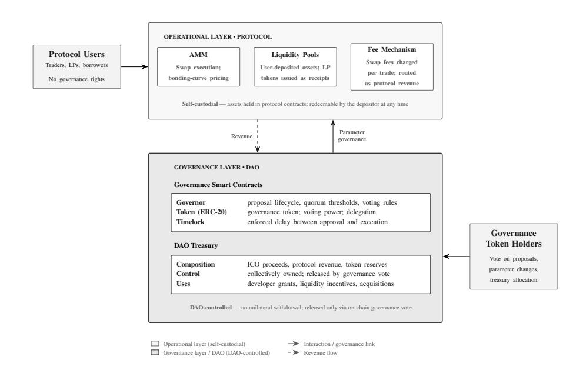

Figure 1: Institutional structure of a blockchain protocol. The operational (protocol) layer comprises self-custodial smart contracts through which users transact while retaining control to their assets; the governance layer comprises DAO-controlled contracts—governance, native token, and treasury—over which token holders exercise collective control.

Notes. Solid arrows denote interaction and governance links; the dashed arrow denotes the revenue flow.

#### 2.2 Literature Review

#### 2.2.1 Token liquidity and risk

Tokens represent the key for users to accessing the operational layer a protocol (Capponi et al. 2023). At the same time, blockchain protocols tend to hold different types of tokens at their governance layer. Generally speaking, tokens represent on-chain assets, implemented through smart contracts (Werner et al., 2023). A more precise classification of tokens establishes their economic role, or tokenomics, within blockchain ecosystems (Cong and Xiao, 2021), and there are various such classifications or taxonomies in the literature. The U.S. Securities and Exchange Commission (SEC), with its recent "Project Crypto", lays out a taxonomy of four different kinds of tokens. It differentiates between network tokens, digital collectible, digital tools and tokenized securities (SEC 2025). Cong and Xiao (2021) advocate for a similar classification of general payment tokens, platform tokens, product tokens including non-fungible tokens (NFTs) and cash-flow-based tokens. General payment tokens, or network tokens as the SEC calls them, comprise traditional crypto assets such as BTC and ETH as well as stablecoins. These primarily derive value from their underlying network and haven been compared to "digital commodities" (SEC 2025) and stores of value (Cong and Xiao, 2021). Digital tools or platform tokens serve a predefined function within a given protocol and expire upon redemption of assets. Digital collectibles or product tokens are product-specific claims by the token holder against the issuer, that is the protocol. Lastly, tokenized securities, or cash-flowbased tokens as Cong and Xiao (2021) call them, represent ownership rights to a protocol (SEC 2025). For a broad survey of the literature, I refer the reader to Le´on and Lehar (2026).

In a tokenized world, protocols therefore have different types of liquid assets at their disposal. The traditional literature defines firm liquidity as the shortterm portion of the balance sheet (Fairhurst and Zahid, 2025). In taking a balance sheet perspective, many studies utilize accounting data from the COM-PUSTAT database for their analyses (Theissen et al., 2023; Fairhurst and Zahid, 2025)(see for example Favilukis et al. 2019). Specifically, the items CHE and TA, cash and marketable securities and total assets, define the popular cash-toasset ratio, which represents the primary measure of corporate liquidity, that is "cash holdings". CHE, while referred to as cash, contains both instruments that represent mediums of exchange and earn low yield, as well as marketable (i.e. short-term) securities that exhibit higher transaction costs, higher yield and include risky investments (Duchin et al., 2017; Cardella et al., 2021; Le and Ramsey, 2024). As annually reported line items of the balance sheet, this information has no direct analogue in DeFi.

However, the token categories discussed earlier provide a first glimpse at the differences in token liquidity. Digital collectible product tokens that include NFTs represent a separate category of potentially illiquid crypto assets that are beyond the scope of this study. General payment or network tokens, both backed and unbacked, comprise the mayor crypto blue chip assets BTC and ETH, as well as stablecoins that represent the stable value of a reference asset (Cong and Xiao, 2021; FSB, 2022) (SEC 2025). These types of crypto asset are the most liquid tokens in DeFi and derive their market depth from their role as safe collateral assets (Cong and Xiao 2021). The safety element of these tokens is, nonetheless, driven by two different mechanisms. Blue chips like BTC and ETH are the native crypto assets of major blockchains and derive their safety from their network utility. Ethereum, as the infrastructure layer for the largest DeFi ecosystem, utilizes ETH to pay transaction fees and secure the network, creating demand for the asset. By contrast, stablecoins are not tied to an underlying blockchain network, with popular assets like Tether (USDT) traded across 107 different chains (DeFillama.com). Stablecoins derive their utility from the pegmechanisms that ensures their price stability and corresponding demand is tied to their safety features. Moving on, platform tokens, or digital tools, derive their utility from the use within a specific blockchain application. For example, DeFi protocols issue LP tokens that symbolize a user's claim on the assets deposited into a liquidity pool (Weston 2022). As such, their liquidity depends primarily on the depth of the corresponding liquidity pool and conditions of the associated smart contract, while they can be used as collateral in more complex (nested) DeFi transactions (Xue et al., 2023). Finally, a separate category of security or cash-flow-based tokens resembles traditional ownership rights in a platform and can be used as financing tool for protocol development (Le´on and Lehar 2026). While speculative motives can increase demand for these types of crypto assets beyond their immediate protocol utility, liquidity is orders of magnitude lower than global network and payment tokens. Gudgeon et al. (2020) demonstrate the relevance of liquidity risk in the context of lending protocols.

The discussion so far suggests that network and payment tokens, by minimizing liquidity risks, are the closest analogues to the cash category in traditional finance. However, two blockchain-specific factors have been purposely excluded from the discussion until this point, which complicate the classification. One is the concept of blockchain "composability" or protocol "interoperability", which allows tokens to be used as "money legos" across multiple protocols simultaneously (Saengchote, 2021; Werner et al., 2023). This was previously alluded to as users building nested transactions across multiple DeFi protocols. The other is the collateral mechanism that subject these tokens to very different risk profiles. The following discusses why even the most widely used and therefore most liquid tokens exhibit different levels of risk, based on their position state, as well as their collateral volatility.

A first formal investigation of "nested" structures of recurring transaction patters in DeFi was conducted by Kitzler et al. (2023). Their presence rests on a technological novelty of blockchains. Smart contracts enable the computation of fractional ownership claims in deterministic, single state environments under atomistic settlement (von Wachter et al., 2021). The literature reveals the prevalence of such complex transactions in DeFi. For example, Kitzler et al. (2023a) provide evidence of nested building blocks from 23 DeFi protocols. Accordingly, it is possible to re-use tokens from any of the categories discussed above, creating nested relationships across the ecosystem and affecting their liquidity profile, yield composition and risk exposure. While this innovation allows users to "compose" or customize their transaction more freely, it introduces smart contract risk in the process (Xue et al., 2023).

Smart contract risk refers to inherent weaknesses or misspecifications of code, that allow attackers to exploit protocols and extract user funds (Gudgeon et al., 2020). Importantly, under composability, the re-use of network tokens across multiple protocols exacerbates smart contract risk, creating multiple dependencies and complex interconnections that heighten systemic risk (Koh and Pukthuanthong, 2026). A network token held as base asset should therefore be viewed as less risky, compared to its re-used counterpart, given lower smart contract exposure.

Figure 2 provides an example of how the stablecoin Sky Dollar (USDS), issued by the Sky protocol formerly known as MakerDAO, can be used across multiple DeFi protocols simultaneously to optimize its yield composition. Atomic transaction settlement allows for the instantaneous deployment of such a strategy within a single transaction. Figure 3 depicts the individual steps that result in the nested token structure aETHsUSDS, a stablecoin derivative that accrues both the savings rate from the Sky protocol (SSR) and the supply rate from the

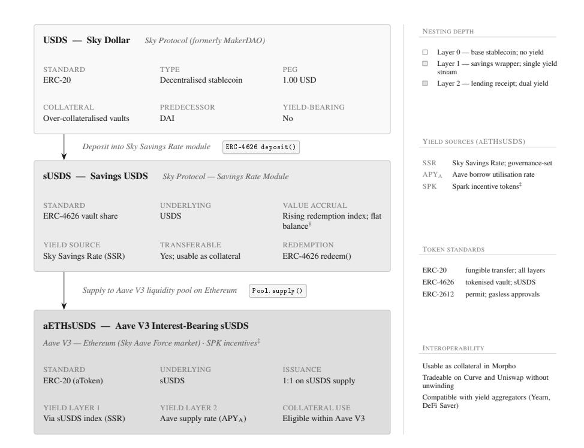

Figure 2: Nested Token Structure: USDS example.

Notes. Assets in .

Aave protocol (APY). While the joint accrual of the SSR and APY optimizes the yield composition of the position, its exposure to three separate smart contracts raises its riskiness in the process. The fact that such a yield strategy can be deployed in a single blockchain transaction (Figure 3) implies that an attacker that exposes a weakness, say in the Aave protocol, can execute an extraction of user funds within a single transaction.

Another risk affecting liquid network tokens within blockchain ecosystems is that of market volatility. Stablecoins generally maintain the stable value of a reference asset, commonly the US dollar. The three main types of collateral used to maintain price stability, fiat, crypto and algorithms, assign different levels of risk to these assets. In this context, the most well-established risk associated with stablecoins is that of a de-peg, where the price of the stablecoin deviates from that of its reference asset (Lee et al., 2025). Several studies indicate that stablecoin risk varies across collateral types (Jarno and Kolodziejczyk 2021; De Blasis et al. 2023; Lee et al. 2025). The common finding is that fiat-backed stablecoins appear more stable, especially during market shocks, compared to other collateral designs (De Blasis et al. 2023). Lee et al. (2025) attribute this to the difference between off-chain and on-chain collateralization of stablecoins.

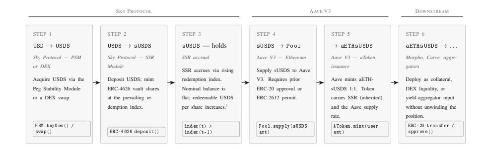

Figure 3: Atomistic Transaction Sequence: USDS example.

Notes. Assets in .

Two stabelcoins can therefore appear very similar in that they track a stable 1 USD, while their underlying collateral, whether that is fiat, crypto or an algorithmic strategy, exposes them to different residual market risks. The crypto market specifically tends to be more volatile than traditional asset classes, which increases the depeg risk for crypto-backed and algorithmic stablecoins (De Blasis et al. 2023). Similarly, it is important to mention why crypto blue chips like BTC and ETH are usually "wrapped" when used on-chain. Crypto assets that are used to pay network operators (i.e. validators or miners) are often non-compliant with smart contract standards, and as a result can not be used across on-chain platforms (Le´on and Lehar 2026). Their wrapped counterparts, through the crypto collateral, are exposed to the same market risk that make crypto-backed stablecoins more risk than fiat-backed stablecoins.

#### 2.2.2 Stablecoins

Stablecoins are swiftly disrupting the traditional financial system, as alternative payment networks characterized by instant, low-cost and continuous transaction settlement around the globe (Altavilla et al., 2026). Furthermore, they are found to serve as alternative stores of value in emerging market economies (EMEs) such as Argentina (Murakami and Viswanath-Natraj, 2025). Yet, stablecoins are still very much an emergent or even niche payment instrument that is not comprable to government-backed money acceptable at par (Gorton et al., 2022). Gorton and Zhang (2023) add that the risk of instability due to bank runs makes stablecoins a risky private money. As a results, calls to regulate these assets are growing (Arner et al., 2020).

Nevertheless, their role in blockchain ecosystems is well-established. Tether (USDT), the largest fiat-backed stablecoin by market capitalization, was first introduced to the Ethereum ecosystem in 2019 (Lyons and Viswanath-Natraj, 2020). On centralized exchanges, stablecoins are utilized in crypto asset trading to ease the reliance on traditional (fiat) banking relationships (Griffin and Shams 2020; Hoang and baur 2024). Similarly, a survey of trading market participants in DeFi finds that 60% of traders prefer stablecoins over the US dollar,

Table 1: Risk profile of treasury positions by token type and deployment state

| Token (collateral General | type risk ↓ ) payment tokens | smart-contract Held in treasury wallet | & composability Deposited (DeFi protocol) | risk −→ Nested (multi-protocol) a |
|---------------------------|------------------------------|----------------------------------------|-------------------------------------------|-----------------------------------|
| Fiat                      | stablecoin                   | 1                                      | 2                                         | 3                                 |
| Crypto                    | stablecoin                   | 2                                      | 3                                         | 4                                 |
| Algorithmic               | stablecoin                   | 4                                      | 5                                         | 5                                 |
| Wrapped                   | blue chip                    | 3                                      | 4                                         | 5                                 |
| Platform                  | tokens                       | 4                                      | 5                                         | 5                                 |
| Cash-flow                 | based tokens                 | 4                                      | 4                                         | 5                                 |

Composite risk: 1 Minimal 2 Low 3 Moderate 4 Elevated 5 High. Darker shading denotes higher composite risk; n/a marks combinations not observed in permissionless DeFi or structurally inapplicable.

The table aggregates three risk components: (i) smart-contract / composability risk rises (left-to-right) as positions move from custody, to single protocol exposure, to layered positions across protocols; (ii) collateral / market risk rises as backing moves from fiat reserves to volatile collateral (includes algorithmic strategies); (iii) liquidity risk concentrates in thinmarket tokens and potentially nested positions.

Platform tokens include LP and governance / utility tokens which are exposed to smart contract risk by default (issued within a given protocol) which explains their rating; cash-flow based tokens include tokenised securities and other revenue-claim (RWA) assets. Algorithmic

stablecoins remain elevated even when held directly (given reflexive depeg risk).

a Nested = a position deployed across two or more protocols (see Figure 2).

a preference that the authors can not explain using standard portfolio diversification and asset pricing arguments (Jin et al., 2023). One of the primary applications of stablecoins appears to be the provision of liquidity and stability in crypto ecosystems. Benedetti et al. (2026) analyze the connectedness between the blue-chip crypto asset returns of Bitcoin and Ethereum with stablecoin supply, which demonstrates how major crypto assets can affect ecosystem wide liquidity conditions. The connectedness between crypto assets and stablecoins is an important topic in the literature. Ante et al. (2021) show that large stablecoin transfers have a positive effect on both Bitcoin trading volumes and abnormal returns. This findings are in line with Griffin and Shams (2020) who identity a significant relationship between Bitcoin prices and USDT during the 2017 market boom.

Lee et al. (2025) find that major crypto asset fluctuations are significant predictors of stablecoin depegging. Taking a closer look at on-chain ecosystems, stablecoins can have systemic implications. Fantazzini (2025) identifies the main determinants of stablecoin resilience and formulates a price threshold of 0.8 as a novel indicator of default. Stablecoins such as USDT, USDC and DAI have established themselves as pivotal providers of liquidity and stability, with empirical evidence rapidly emerging. Gorton et al. (2022) show how stablecoins can maintain their 1 US dollar peg, even under heightened run risk, attributing the dynamic to leverage traders that are willing to compensate stablecoin holders at a premium for lending. Nurbaev et al. (2023) conduct a case study of the TerraUSD to identify triggers of stablecoin collapse, namely selling by major investors and algorithmic malfunction. Importantly, the case study considers algorithmic stablecoins as opposed to more common fiat-collateralized stablecoins. Another stream of literature views stablecoins as the bridge between the traditional financial system and the crypto economy. Ahmed and Aldasoro (2025), using daily observations between 2021 and 2025, demonstrate that stablecoin inflows have a negative effect on short-term US treasury yields. Similarly, Coste (2024) identifies an adverse effect of stablecoins on bank liquidity ratios.

Overall, the literature indicates that stablecoins represent one of the main sources of liquidity in blockchain ecosystems. Their added benefit is price stability, making them a valuable risk management tool. Table 1 shows that even within stablecoin category, risk profiles can proliferate, due to smart contract and collateral exposure. Fiat-backed stablecoins held directly carry the lowest possible risk, combining high liquidity, low collateral risk and low smart contract risk. At the same time, a fiat-backed stbelcoin can be re-deployed across the DeFi ecosystem, increasing its relative smart contract risk due to added protocol exposure and potentially lower liquidity within the targeted pool, while maintaining low collateral risk. Conversely, a crypto-backed stablecoin or wrapped blue chip position often exhibits very similar if not higher liquidity than the fiat-backed counterpart, yet the exposure to collateral risk makes these assets more risky. Overall, fiat-backed stablecoins appear to represent the lowest risk positions in DeFi.

#### 2.2.3 Corporate cash holdings

A stream of the traditional corporate finance literature is focused on exactly the lowest risk funds on corporate balance sheets, namely cash holdings. The academic inquiry into corporate liquidity started with its "irrelevance". Modigliani and Miller (1985) posit that, absent of financing constraints, cash should be irrelevant for the value of a firm. However, real-world markets are far from perfect. The realization came with Kraus and Litzenberger (1973) who introduced the static trade-off theory which postulates that firms weight the costs and benefits of capital structure. The introduction of such tradeoff to corporate liquidity specifically was first undertaken by Opler et al. (1999), who suggest that firms need to balance the cost of holding cash with the benefit it confers.

The ensuant literature is concerned with the theoretical motivations, determinants and value of cash holdings (da Cruz et al., 2019). The cost – benefit tradeoff is the organizing theme of this stream of literature. On the one hand, cash holdings allow firms to save transaction costs, respond dynamically to future contingencies and take advantage of opportunities as they present. This line of reasoning was built on the transaction-cost motive of avoiding the costs of liquidating assets (Keynes, 1937; Miller and Orr, 1966) and is commonly mentioned in line with the precautionary motive of holding cash (Opler et al., 1999). The literature yields broad support for this line of thought. Bates et al. (2009) find that the rise in relative cash shares, measured by cash-to-asset ratios, can be attributed to growing cash flow uncertainty and higher R&D expenditure. More broadly, the literature suggests that cash holdings represent a valuable tool to deter competition and capitalize on opportunities in a competitive environment (Alimov, 2014; Hoberg et al., 2014; Qiu and Wan, 2015). Conversely, Pinkowitz et al. (2013) find no evidence of a relationship between cash holdings and cash acquisitions among cash rich firms. Financial constraints play an important role in this context. Cash is regarded as an internal source of funds (Lamont, 1997) and it allows firms to respond to future investment needs and hedge against shortfalls (Acharya et al., 2007; Sun et al., 2023). Evidence from financial firms for example suggests that liquidity demand rose for banks facing higher credit risk (Acharya and Merrouche, 2013; Bliss et al., 2015). Yilmaz and Samour (2024) establish a significant relationship between the corporate cash holdings of 536 non-financial firms and financial performance indicators such as return on assets, return on equity and earnings before interest and tax margins. This conforms with earlier findings by La Rocca and Cambrea (2019) who detect a positive effect of cash holdings on firm performance.

On the other hand, weak shareholder protections can induce agency problems that allow managers to engage in the accumulation of excessive cash reserves and wasteful spending (Jensen and Meckling, 1976; Jensen, 1986; Dittmar et al., 2003). Evidence from the EU supports this view, showing that firms exposed to superior investor protection and concentrated ownership hold less cash (Ferreira and Vilela, 2004). In countries with particularly strong shareholder protections such as the US, managers choose to spend cash reserves rather quickly, even if this destroys value for shareholders (Harford et al., 2008). Further support for the agency motive of corporate cash holdings in the US is found by Gao et al. (2013), who show that public firms hold twice as much cash as private firms and Yung and Nafar (2014), who find a positive effect of creditor rights and cash holdings. Overall, this stream of literature suggests that excessive cash holdings are a sign of weak governance mechanisms and wasteful spending by managers (da Cruz et al., 2019). Moreover, this literature suggests that cash holdings are associated with an opportunity cost of holding idle capital (Subramaniam et al., 2011).

Chen (2011) concludes that corporate liquidity can have a positive effect on firm value, but that the effect depends partly on country level characteristics such as effective securities laws and mechanisms to control corruption. This suggests precautionary and agency dynamics of corporate cash holdings can coexist. O'Brien and Folta (2009) apply transaction cost economics (TCE) to provide the theoretical backbone for this point. While the motives for holding cash remain a point of debate, the literature agrees on one key aspect. Evidence suggests that markets assign a value to corporate cash holdings (da Cruz et al., 2019). Whether investors under- or over-value each additional unit of cash depends on the factors discussed above.

#### 2.2.4 On-chain cash holdings

The classification presented above (Table 1) suggests that only fiat-backed stablecoins, held as base asset, resemble cash in the traditional sense. The motivations for holding cash can then be extended to blockchain-based markets. Firstly, a series of circumstances make it comparably harder for DAOs to secure external funds. In the traditional financial system, a lack of regulatory recognition and compliance complicates DAOs access to external financing. Traditional financial institutions are subject to know your customer (KYC) rules as a means to tackle money laundering and the financing of crime which DAOs can not satisfy (Arasa, 2015; Schlatt et al., 2022). Within the ecosystem, high fees, volatility, fraud and over-collateralization can impede access to financial resources. Amler et al. (2021) note that DeFi smart contracts can be vulnerable to exploits as a central risk factor. Several historical examples of code vulnerabilities have shown that funds locked across multiple smart contracts are potentially more risky than those held directly. Liu et al. (2025) provide a comprehensive overview of smart contract vulnerabilities. A key risk they highlight is that of external dependencies, suggesting that even a perfectly intact smart contracts is subject to residual risk from its dependence and interconnectedness with other smart contracts that could in turn be flawed. In line with this, Oracle risk introduces external dependencies and associated risk at the data layer (Caldarelli, 2020; Hassan et al., 2023). These findings support the discussion of smart contract risk as a key determinant of token risk within DeFi. Moreover, there is the factor of crypto market volatility. Stablecoins have been found to hedge the downside risk of crypto portfolios (Baur and Hoang, 2021; D´ıaz et al., 2023). Many protocol treasuries are particularly susceptible to crypto market volatility, given their outsized exposure to native token holdings (Schoonwinkel, 2023). Stablecoins represent a viable tool to balance this market risk. The precautionary motive (and implicitly the transaction cost motive) of cash holdings therefore provide a grounded perspective of excess liquidity in DAOs. The theoretical lens implies that DAOs with liquid token reserves at their disposal (locked in DAO owned smart contracts) are superiorly equipped to address operational needs, including future contingencies, and are thus valued at a premium.

Hypothesis 1. A higher ratio of stablecoin holdings in protocol treasuries predicts an increase in valuations, as token holders value excess liquidity as a precautionary buffer for operational resilience.

Conversely, a vast literature addresses the shortcomings of governance mechanisms in blockchain ecosystems. Decentralized governance is prone to centralization, which introduces the risk of expropriation (see Chapter 2). The presence of highly liquid treasury reserves, not deployed in yield strategies, native tokens or investment strategies makes it easier for influential governance token holders, or blockholders, to spend wastefully. Thus, excessive liquid treasury holdings can be regarded as an indicator of agency frictions that impeded efficient allocation at the governance layer. Attomic settlement and transaction finality makes this a particularly potent threat (Federal Reserve Bank of New York 2022; BIS 2023; BIS 2025). In theory, it allows for a flash-loan or related attack vector by which a whale gains access to a protocols treasury assets via the purchase of a substantial share of governance tokens at once . The technological possibility of such attack vector would suggest that blockchain protocols should hold very little idle capital and redeploy its funds upon receipt. The ecosystem offers a broad range of alternative investment and yield opportunities and so the presence of idle stablecoin funds could be perceived as an opportunity cost by token holders. In line with the agency motive, this lends support toward the negative consequences of cash reserves that imply a negative effect of cash holdings on protocol valuations. The second hypothesis therefore inverts the first one.

Hypothesis 2. A higher ratio of stablecoin holdings in protocol treasuries predicts a decrease in valuations, as token holders discount the agency risk of inefficient capital allocation.

## 3 Methodology

### 3.1 Variables and Sample

On-chain treasury data (in US dollars) were sourced from the database on De-Fillama.com, which contains daily observations of on-chain treasuries broken down by token ticker. I obtained the top 110 on-chain treasuries, which represent approximately 75% of the total assets locked in treasury smart contracts across the blockchain economy (DeepDAO.io). The remaining 25% represent marginal treasuries below USD 1,000,000 AUM for which protocol maturity and activity cannot be guaranteed. The individual treasury datasets were filtered according to the criteria listed in the appendix (Table 1A), reducing the sample to 49 individual protocol treasuries (full list in Appendix Table 2A). The remaining treasury balances were then classified according to the framework proposed in section 2 (Figure 1). In the process, roughly 2,600 unique token columns across 49 on-chain treasuries were mapped to one of the eleven token categories defined in section 2.

Subsequently, data on the economic activity of these protocols were merged into the classified logs where available. Protocols with missing market data were dropped from the sample. This step represents the bridge between siloed on-chain treasuries and user ecosystems, ensuring the sample spans economically active protocols. Specifically, I obtain observations of protocol market capitalization (Mcap), fees generated (fees), USD inflows and age (in weeks). Data points were obtained from DeFillama.com. As a final step, the data were aggregated at the weekly level.

The first variable of interest is the share of stablecoins held in treasury (DAO-owned) smart contracts. The corporate finance literature defines the cash-to-asset ratio as cash and cash equivalents normalized by total assets (Han

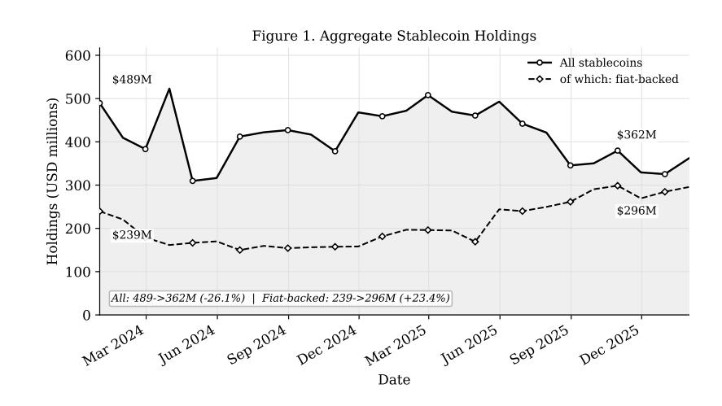

Figure 4: Aggregate stablecoin share

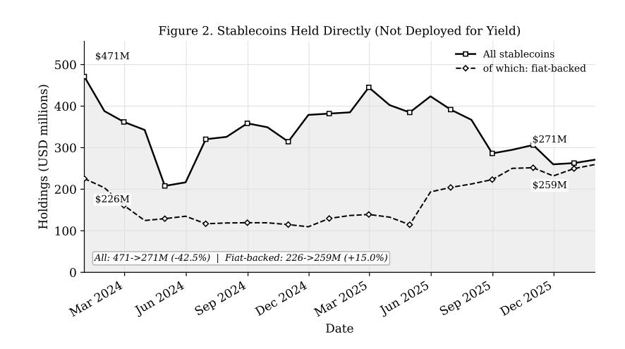

Figure 5: Stablecoins held in treasury smart contracts

| Ticker      | Category    | Holdings | (USD M) | Share (%) |
|-------------|-------------|----------|---------|-----------|
| USDS        | Fiat-backed | Base     | 166.384 | 45.99     |
| USDC        | Fiat-backed | Base     | 67.537  | 18.67     |
| SUSDE       | Yield       |          | 39.779  | 10.99     |
| USDT        | Fiat-backed | Base     | 25.082  | 6.93      |
| DAI         | Base        |          | 9.283   | 2.57      |
| AETHUSDT    | Fiat-backed | Yield    | 9.224   | 2.55      |
| AETHUSDC    | Fiat-backed | Yield    | 7.980   | 2.21      |
| AETHUSDE    | Yield       |          | 7.297   | 2.02      |
| VUSDC       | Fiat-backed | Yield    | 5.876   | 1.62      |
| AETHLIDOGHO | Yield       |          | 3.879   | 1.07      |
| AAVAUSDC    | Fiat-backed | Yield    | 3.371   | 0.93      |
| AAVADAI     | Yield       |          | 2.740   | 0.76      |
| AETHUSDS    | Fiat-backed | Yield    | 2.042   | 0.56      |
| GTUSDC      | Fiat-backed | Yield    | 2.021   | 0.56      |
| AAVAUSDT    | Fiat-backed | Yield    | 1.970   | 0.54      |
| AARBUSDT    | Fiat-backed | Yield    | 1.241   | 0.34      |
| GHO         | Base        |          | 0.668   | 0.18      |
| USDE        | Base        |          | 0.666   | 0.18      |
| AETHRLUSD   | Fiat-backed | Yield    | 0.601   | 0.17      |
| CRVUSD      | Base        |          | 0.508   | 0.14      |

Table 2: Top 20 stablecoin tickers by share of holdings, balanced panel of 49 protocols, January 2026.

and Qiu, 2007). Researchers commonly rely on the standardized definition of "cash", characterized by COMPUSTATS item CHE which comprises cash, cash equivalents and short-term investments (Theissen et al., 2023). I define a DeFi– analogue of the cash-to-asset ratio as

$$\text{CA}_{i,t} = \frac{\text{Cash}_{i,t}}{\text{Total Assets}_{i,t} - \text{Native Tokens}_{i,t}} \quad (1)$$

where T otalAssets captures the aggregate USD value of treasury i at time t. Cash defaults to the USD value of fiat-backed stablecoins held in the same smart contract at time t, as per the definition of "cash" in section 2, and N ativeT okens is a DeFi-specific addition to the cash-to-asset formula, which corrects for undistributed (governance) tokens. Liquidity risks are a widely recognized concern in blockchain ecosystems (Weing¨artner et al., 2023; Alamsyah et al., 2024). Specifically, Howell et al. (2020) document that 47% of native tokens in their sample of ICOs had not been listed on exchanges, exhibiting low or nonexistent liquidity. In line with Schoonwinkel (2023), undistributed tokens do not qualify as an asset and can therefore overstate DAO treasuries materially. By subtracting the value of native tokens locked in DAO treasury contracts from the total assets, I obtain an adjusted DAO CA that accounts for potential mispricing and inflation

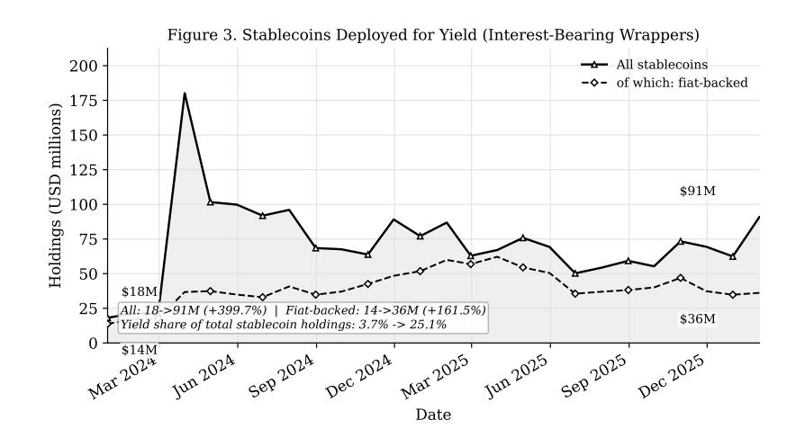

Figure 6: Deployed stablecoins held as derivatives

of treasury value.

Next, I construct a valuation multiple that reflects whether a given protocol is under- or over-valued, relative to its economic activity. The literature frequently evaluates blockchain protocols based on their valuations and Gross Merchandise Volume (GMV) as a proxy for growth potential (Metelski and Sobieraj, 2022). Ali (2026) demonstrates that GMV is the primary valuation determinant ahead of TVL. Therefore, I define the valuation multiple as

$$\text{FY}_{i,t} = \left( \frac{7\text{-day fees}_{i,t} \times 52}{\text{Mcap}_{i,t}} \right) \times 100 \quad (2)$$

which characterizes fee yield (F Y ) as the annualized 7-day fees generated by protocol i at time t, divided by its market capitalization. In line with Grande and Borondo (2025), the variable can be viewed as an indicator of investor confidence. It bypasses previously voiced concerns regarding the relevance of TVL and its risk of double-counting by using annualized fees as measure of protocol growth (activity).

Lastly, the sample contains a set of control variables that are meant to absorb common market effects, including the natural logarithms of ETH volume, DP I returns and BT C returns. DP I is Index Coop's DeFi Pulse (capitalizationweighted) Index which tracks the performance of the largest protocols in DeFi. The price and volume series were sourced from Yahoo Finance and used to compute log return and volume series.

The final sample consists of a balanced weekly panel of N = 23 decentralized autonomous organizations and T = 112 weeks spanning January 2024 to February 2026 (a full list of DAOs is contained in the Appendix Table 3A).

#### 3.2 Empirical strategy

Stage one of the analysis establishes the panel-level dynamic relationship between treasury cash share and protocol valuation, spanning a pretesting pipeline and Granger non-causality test in a panel vector autoregression (PVAR) framework. With T >> N, unbiased statistical inference requires cross-sectional independence and stationarity (Im et al. 2003; Pesaran 2004; Lopez and Weber 2017).

#### 3.2.1 Cross-sectional dependence

The discussion of DeFi composability from above (Section 2), however, suggests that cross-sectional dependence poses a serious risk in the blockchain setting. Blockchain ecosystems are densely interconnected (Sch¨ar 2021, Werner et al. 2022) and protocols in particular are exposed to common market and network factors (S¸oiman et al., 2023), seriously jeopardizing the assumption that error terms are uncorrelated. Pesaran (2004) proposes a cross-sectional dependence test that evaluates the pairwise correlation between the residuals of all entities in a sample. Specifically, the null hypothesis (H0) of cross-sectional independence is evaluated against the alternative hypothesis (H1) of cross-sectional dependence, using the CD statistic.

$$\text{CD} = \sqrt{\frac{2T}{N(N-1)}} \left( \sum_{i=1}^{N-1} \sum_{j=i+1}^N \hat{\rho}_{ij} \right) \quad (3)$$

#### 3.2.2 Unit root test

A unit root test establishes whether the PVAR can be specified in levels. Assuming cross-sectional dependence, I use the more suitable cross-sectionally augmented IPS test (Im et al. 2003; Pesaran 2007). It augments the standard augmented Dickey-Fuller (ADF) regressions with cross-sectional means of lagged levels and first-difference as follows

$$\Delta y_{it} = \alpha_i + \beta_i y_{i,t-1} + c_i \bar{y}_{t-1} + d_i \Delta \bar{y}_t + \varepsilon_{it} \quad (4)$$

where ¯yt−1 = N PN i=1 yi,t−1 and ∆¯yt = 1 N PN i=1 ∆yit, allowing coefficients α and δ to filter out the unobserved common factor. The CIPS statistic is used to evaluate H0 unit root against H1 no unit root as the average of the ti statistics of βi across all protocols in the sample (Pesaran, 2007).

#### 3.2.3 Lag selection and residual diagnostic

Information criteria (ICs) are used to determine the lag order at which both variables enter the model. ICs are generally used to balance model goodness of fit and complexity (Emiliano et al., 2014). For this purpose, I compare the three most common ICs, namely Bayesian, Hannan–Quinn and Akaike, to reach a decision (Akaike, 1974; G, 1978; Hannan and Quinn, 1979). The main difference between these criteria is that they apply different penalty terms for adding further complexity in the form of additional lags to a model (Sin and White, 1996).

Furthermore, the model residuals are diagnosed for serial correlation, or heteroskedasticity, following BREUSCH (1978) and Godfrey (1978). Their approach tests the null hypothesis of no residual correlation across the lag order p against the alternative that there is autocorrelation for at least one lag, by means of the LM statistic obtained from an auxiliary regression.

#### 3.2.4 Granger causality

The Granger non-causality test for heterogeneous panel data models, proposed by Dumitrescu and Hurlin (2012), is used to establish the direction of predictive causality between protocol treasury cash share and fee yields. The approach fits

| $FY_{i,t} = \alpha_i + \sum_{k=1}^K \gamma_{i,k} FY_{i,t-k} + \sum_{k=1}^K \beta_{i,k} CA_{i,t-k} + u_{i,t}$ | (5) |
|--------------------------------------------------------------------------------------------------------------|-----|
|                                                                                                              |     |

$$CA_{i,t} = \alpha_i + \sum_{k=1}^K \gamma_{i,k} CA_{i,t-k} + \sum_{k=1}^K \beta_{i,k} FY_{i,t-k} + u_{i,t}, \quad (6)$$

with i = 1, ..., N and t = 1, ..., T for the two variables under investigation. It allows the null hypothesis of non-causality H0 : βi,1 = · · · = βi,K = 0 ∀i to be tested against its alternative of heterogeneous causality H1 : βi,1 = · · · = βi,K = 0 ∀i = 1, 2, ..., N1 but βi,1 ̸= · · · = βi,K ̸= 0 ∀i = N1 + 1, ..., N. The corresponding test statistic can then be obtained by averaging the individual Wald statistics of the F test on the K linear hypotheses Ni (Mabe and Simo-Kengne, 2025). A valid test must further satisfy the condition that N1 < N, where N1 = 0 indicates a homogeneous result (Dumitrescu and Hurlin 2012, Mabe and Simo-Kengne 2025). In the expected case of cross-sectional dependence, I follow Dumitrescu and Hurlin (2012), who propose the use of bootstrapped critical values as opposed to asymptotic critical values. The block bootstrap procedure obtains the residuals from the regression above and applies a complex resampling logic that appendix B outlines in full.

#### 3.2.5 Panel VAR

The short-run effect between protocol cash shares and fee yields is established in a panel VAR (Holtz-Eakin et al., 1988). The approach combines the standard vector autoregression approach with panel data techniques, considering all variables in the system endogenous and allowing for unobserved individual heterogeneity (Antonakakis et al., 2017; Kazemzadeh et al., 2023).

$$y_{it} = \lambda_t + \alpha_1 y_{i,t-1} + \alpha_2 y_{i,t-2} + \dots + \alpha_k y_{i,t-k} + \mu_i + u_{it} \quad (7)$$

$$y_{it} = \alpha_1 y_{i,t-1} + \dots + \alpha_k y_{i,t-k} + \beta x_{i,t} + \mu_i + u_{it} \quad (8)$$

The lag order is captured by k which was determined via information criteria. yit represents the 1 × 2 vector of endogenous regressors. I initially include both protocol fixed effects (FE) µi and time FE λt. The advantage of this approach is that it addresses unobservable protocol-specific factors that are time invariant, while simultaneously capturing any global shocks that might jointly affect the panel. The blockchain protocols in the panel are heterogeneous, including lending, staking and investment protocols as well as infrastructure and other services. Both cash shares and fee yields therefore conceivably exhibit varying levels across these entities, while macro shocks affect the panel jointly. The primary concern to unbiased inference therefore becomes Nickell bias, which produces inconsistent estimates for fixed T as N → ∞ (Nickell, 1981). However, Alvarez and Arellano (2003) demonstrate that the asymptotic bias in the within group estimator disappears as N/T → 0, precisely the case in the current setting. Monte Carlo analyses by Judson and Owen (1999) confirm that least squares approach performs well compared to its alternatives (most notably GMM) for T = 30. With T = 112 and considerably smaller N, the current setting comfortably passes this threshold and I proceed with the OLS within-groups (FE) estimator.

In line with the corporate finance literature, I subsequently re-estimate the PVAR including explicit control variables following equation 8, where xit enters as a vector of exogenous controls. Both models are estimated using the "sandwich" package in R for clustered Arellano standard errors (Arellano, 1987; Zeileis et al., 2020) and coefficients are reported as cumulative effects. The VAR(k) is a system of two equations yit = (F Yit, CAit) ′ . Equation 9 below presents an example of how the cumulative coefficients are obtained from the F Y equation.

| $FY_{it} = \sum_{\ell=1}^k \phi_\ell FY_{i,t-\ell} + \sum_{\ell=1}^k \theta_\ell CA_{i,t-\ell} + \gamma' x_{it} + \mu_i + u_{it} \quad (9)$ |
|---------------------------------------------------------------------------------------------------------------------------------------------|
|---------------------------------------------------------------------------------------------------------------------------------------------|

The cumulative effect is obtained accordingly as ˆc = Pk ℓ=1 ˆθℓ = ι ′ ˆθ and SE(ˆ c c) = p ι ′Vˆ θ ι. Finally, to complement the homogeneous slope assumption of the PVAR, a Granger block-exclusion Wald test of the null hypothesis that the k lags on CA are jointly zero (χ 2 (k)) is conducted and reported in the appendix.

(currently two-way FE and one-way FE + controls, but we might try no FE and add controls at DAO-level such as TVL and USd inflows, try CR2 or CR3 as other clustering techniques for small N)

#### 3.2.6 Individual VARs

The slope homogeneity assumption imposed above, while correctly pointing to the pooled short-run effect, is expected to partly mask the true effect for some units in the sample. The final step relaxes this assumption by estimating individual VARs for each of the protocols under consideration. The pretesting pipeline is implemented to mirror the above for individual VARs (details in Appendix C). For example, The CIPS test is replaced with conventional perprotocol ADF and KPSS tests. With unit-specific slope coefficients (θiℓ) I now obtain cumulative, protocol-specific, impulse responses from

$$\bar{F}Y_{it} = \sum_{\ell=1}^k \phi_{i\ell} \bar{F}Y_{i,t-\ell} + \sum_{\ell=1}^{k_i} \theta_{i\ell} \bar{C}A_{i,t-\ell} + \varepsilon_{it}, \quad (10)$$

and the analogous equation for CA˜ it with lag orders determined as protocolspecific ki using BIC as

$$c_i = \sum_{h=0}^H \psi_i(h), \quad (11)$$

which will be summarized in a forest plot for comparability.

### 4 Empirical Results and Discussion

#### 4.1 Descriptive statistics

Table 2 reports the descriptive properties of all variables included in the analysis. Panel A on the endogenous variables shows that protocols held an average share of 14.39% of their treasury assets in fiat-backed stablecoins. However, the standard deviation of roughly 22% reveals that the figure can vary substantially across blockchain protocols. The average 7-day annualized fee yield is 3% and ranges between 2.35% and 4.01% across the sample. Panel B indicates that the DeFi market was in a downturn and more volatile than the crypto asset market more broadly, with DPI log returns ranging from roughly −3% to −0.6% between the 25th and 75th percentile, while Bitcoin ranged between −1% and 1% between those percentiles across the same horizon.

During the period in question, protocols have moderately reduced their aggregate stablecoin exposure over the sample period, while simultaneously growing their fiat stablecoin positions (Figure 3). Figure 4 contextualizes the dynamic further, revealing that positions held directly in treasury smart contracts (as base asset) are declining and by the end of 2025 essentially entirely denominated in fiat-backed stablecoins. Conversely, yield-bearing stablecoin positions appear to be on the rise, recording an approximate 400% increase between 2024 and 2026 to around 25% of total holdings (Figure 5).

Closer examination reveals that aggregate stablecoin holdings have remained remarkably stable with most of the decline reported in Figure 3 due to a larger drawdown in a single protocol treasury (Mantle), though the stability hides important compositional changes across on-chain treasuries. Moreover, part of the rotation of base positions into fiat-backed stablecoin is mechanical. At the beginning of the sample period, DAI, a crypto-backed stablecoin attributed to the MakerDAO protocol, was one of the single largest base positions across sample treasuries, which by the end of the sample period had been re-branded and converted to the fiat-backed USDS, thereby inflating base positions denominated in fiat stablecoins. For the analysis, the mechanics behind the fiat increase are

Table 3: Descriptive statistics

|                                 | Mean    | SD     | P25     | Median  | P75     |
|---------------------------------|---------|--------|---------|---------|---------|
| <i>Panel A: Endogenous Vars</i> |         |        |         |         |         |
| Cash holdings (CAit)            | 0.1439  | 0.2170 | 0.0025  | 0.0510  | 0.1822  |
| Fee yield (FYit)                | 3.0044  | 1.4290 | 2.3460  | 3.3093  | 4.0123  |
| <i>Panel B: Market controls</i> |         |        |         |         |         |
| ETH trading volume (log)        | 23.5023 | 0.5338 | 23.0759 | 23.3775 | 23.9356 |
| DeFi Pulse Index return         | -0.0041 | 0.0498 | -0.0338 | -0.0061 | 0.0196  |
| Bitcoin return                  | 0.0014  | 0.0219 | -0.0102 | 0.0019  | 0.0126  |
| Ether return                    | -0.0002 | 0.0335 | -0.0139 | 0.0011  | 0.0133  |

Notes. The panel is balanced with N = 2,484 observations across 23 protocols and 108 weeks. Panel A reports the endogenous regressors as defined in section 8. For panel B, ETH trading volume enters in natural logs; the DeFi Pulse Index, Bitcoin, and Ether series are weekly log returns. P25 and P75 denote the 25th and 75th percentiles, respectively.

not a concern, given that I analyze market reactions to cash holdings and not their drivers. The largest driver behind the increase of yield-bearing stablecoin holdings is Ethena's sUSDe, a synthetic USD protocol that is not fiat-backed thereby further countering the notion that protocols actively rebalanced towards fiat-backed stablecoins.

### 4.2 Granger causality

Table 4 establishes unidirectional CSD-robust Granger causality in the bivariate system. Specifically, protocol cash holdings, that is, the share of fiat-backed stablecoins in treasury smart contracts, is found to granger-cause fee yields, while the test does not detect reverse causality. It follows that changes in cash holdings of DAO-owned smart contracts predictively precede changes in the market valuation of protocol economic activity from self-custodial smart contracts.

Prior to Granger testing, a battery of pretests was deployed to ensure its validity. Table 3 reports the results of the cross-sectional dependence test (CD) on both series. The null hypothesis is rejected at the 1% level in both cases, indicating that the series are cross-sectionally dependent. CSD is a common phenomenon in blockchain research and informs the remaining steps of the Granger analysis. The CIPS unit root test rejects the presence of a unit root for all series, indicating stationarity (Table 3). Hence, there is no need for differencing as the result allows the analysis to carry forward the level series. Stationarity was to be expected at least for the cash-to-asset ratio, given that it is bounded [0, 1].

The CSD findings support the use of the block bootstrap procedure for CSD-robust granger testing, outlined in Dumitrescu and Hurlin (2012), while the CIPS result supports the use of both series in levels. Table 4 reports the corresponding results that reject non-causality from the cash share to fee yield at the 1% level of statistical significance. Reverse non-causality can not be rejected at conventional levels with p = 0.366.

Table 4: Cross-sectional dependence and panel unit-root pretests

| Variable | Pesaran CD | CIPS (levels) |
|----------|------------|---------------|
| FY it    | 6 718 ∗∗∗  | − 2 583 ∗∗∗   |
| CA it    | 11 935 ∗∗∗ | − 2 372 ∗∗∗   |

Notes. CD refers to Pesaran's (2004) statistic that tests the null of cross-sectional independence; CIPS is the cross-sectionally augmented panel unit-root statistic of Pesaran (2007), which tests the unit-root null against stationarity.

∗, ∗∗, ∗∗∗ denote the 10%, 5%, and 1% levels.

Table 5: CSD-robust Dumitrescu–Hurlin tests across lag order

|                                                 | $K = 1$     | $K = 2$     | $K = 3$     |         |
|-------------------------------------------------|-------------|-------------|-------------|---------|
| Null hypothesis ( $H_0$ )                       | $\tilde{Z}$ | $\tilde{Z}$ | $\tilde{Z}$ |         |
| CA it $\rightarrow$ FY it | 7.665       | 0.006***    | 3.096       | 0.060** |
| FY it $\rightarrow$ CA it | 1.206       | 0.366       | 0.437       | 0.143   |

Notes. Dumitrescu and Hurlin (2012) panel Granger non-causality tests at lag K = 1 to K = 3. Per-unit BIC lag distribution is median=1 and mean=2 (see Appendix C) for the balanced weekly panel of 23 protocols. ↛ denotes the null of homogeneous Granger noncausality, tested against its heterogeneous alternative that causality holds for some units. pboot is the bootstrap p-value, given that the standardized heterogeneous-panel statistic Ze under the null is only asymptotically N(0, 1) given cross-sectional independence. The CSDrobust block bootstrap approach (block length 5, 999 replications) proposed by Dumitrescu and Hurlin (2012) was used to tackle CSD accordingly. For example, the bootstrap 90/95/99% critical values for the forward test (3.02/3.64/5.61) materially exceed the standard normal quantiles (1.64/1.96/2.58), confirming that asymptotic inference would over-reject under the cross-sectional dependence documented by the CD test. As a robustness check against reversecausality emerging at a deeper lag structure, the reverse test was re-estimated up to K = 3 and remains insignificant (Ze = 0.143, pboot = 0.600).

∗, ∗∗, ∗∗∗ denote the 10%, 5%, and 1% levels.

#### 4.3 Panel VAR

To further explore the effect of treasury cash shares on protocol valuations, a panel VAR that considers both variables endogenous was estimated. Table 6 documents a positive response of fee yields to treasury cash shares. Hence, an increase in cash holdings predicts lower valuations of a protocols' economic activity. Protocols with a higher cash share tend to be under-valued.

To avoid spurious regression, the model is subjected to further stability tests. Table 5 reports the approach used to establish the optimal lag order of the VAR. Capped at pmax = 8 both BIC and the HIC agree on an optimal lag order of p = 4. Figure 6 confirms that the VAR satisfies the stability condition, as its eigenvalues lie within the unit circle, therefore not supporting the presence of an explosive process. The high eigenvalues around 0.9, nevertheless represent a caveat, suggesting that the series are highly persistent. Two factors drive the decision to continue in levels at this stage. First, the CIPS test rejects the presence of a unit root decisively (Table 3). Second, the CA measure is bounded by construction, which rules out the presence of a truly stochastic unconstrained trend.

Table 6 records the PVAR results under two different specifications. As a baseline, I estimate a bivariate system of fee yields and cash holdings, demonstrating a positive and significant cumulative effect at the 5% level as well as a mildly significant Wald block-exclusion test at the 10% level. The primary specification implements a set of controls to absorb common market variation over time. The results of specification (2) corroborate the baseline (1) with both a positive and significant effect and block-exclusion Wald test at the 5% level. The evidence suggest that, on average, markets interpret fiat-backed cash holdings in protocol treasuries as an agency concern, subsequently under-valuing the protocol relative to its economic activity. Cluster-robust standard errors were obtained, following Arellano (1987).

Panel VARs compress the true variation in the cash effect into a common slope coefficient, which yields a clean positive and cluster-robust headline effect, which is stable across specifications, but conceivably masks part of the effect for individual protocols. For example, the heterogeneous DH Granger causality test provides strong evidence when relaxing the Granger test to protocol-specific coefficients. It suggests that the effect may live in some protocols but not in others. The test was selected precisely because the panel is heterogeneous with protocol types spanning DeFi protocols for lending and exchanges, staking, as well as infrastructure and service providers such as name services. Under such heterogeneity the pooled estimator recovers only a cluster-weighted average of the underlying responses, and if those responses were to differ in sign, this nets them against one another and pulls the coefficient toward zero. The +0.21 I report can therefore be read as a conservative average and not as the effect within any given treasury.1 The final part relaxes the homogeneity assumption altogether, allowing the analysis to recover the distribution of effect sizes between cash shares and fee yields across protocols.

#### 4.4 Individual time series analysis

The analysis of individual treasury dynamics requires the time series equivalents to the panel pretests outlined in section 8. For this individual analysis, three units (listed in Appendix Table C3) were dropped due to near-zero withinunit variation of the cash-to-asset ratio (SD ≈ 0.0006 − 0.0007), which would produce unreliable impulse response functions (IRFs). Appendix B1 reports the

1A moderate positive average can consistently be explained by both a genuinely uniform small effect and a large positive response in some protocols canceled by negative ones in others. The panel cannot distinguish the two.

Table 6: System lag-order selection

| Lag p |     | AIC |     | BIC |     | HQIC |
|-------|-----|-----|-----|-----|-----|------|
| 1     | − 8 | 036 | − 8 | 027 | − 8 | 033  |
| 2     | − 8 | 116 | − 8 | 096 | − 8 | 109  |
| 3     | − 8 | 137 | − 8 | 108 | − 8 | 127  |
| 4     | − 8 | 150 | − 8 | 111 | − 8 | 136  |
| 5     | − 8 | 148 | − 8 | 100 | − 8 | 130  |
| 6     | − 8 | 154 | − 8 | 096 | − 8 | 133  |
| 7     | − 8 | 156 | − 8 | 089 | − 8 | 132  |
| 8     | − 8 | 160 | − 8 | 083 | − 8 | 132  |

Notes. System information criteria for the bivariate panel VAR on the series (common sample, Nobs = 2,392, pmax = 8). Bold denotes each criterion's minimising lag. The Bayesian and Hannan–Quinn criteria both select p = 4, the primary specification; Akaike selects p = 8, reflecting its known tendency to over-parameterise. All candidate orders yield a stable companion matrix (Figure 7).

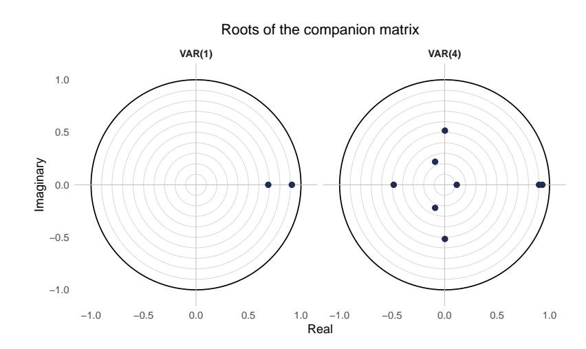

Figure 7: Companion-matrix eigenvalues of the demeaned panel VAR. Roots of the VAR(1) and VAR(4) companion matrices, estimated on the two-way demeaned series, plotted against the unit circle. All eigenvalues lie strictly inside the circle (largest modulus 0.93), confirming a covariance-stationary system and licensing the impulse-response and forecast-error-variance analysis.

Table 7: Panel VAR equation: fee yield and cash holdings

| (1) No controls (2) With baseline Cash holdings → fee yield θ b cash | controls primary |
|----------------------------------------------------------------------|------------------|
| Cumulative effect b c =                                              |                  |
| 0 193 ∗∗ 0 P ℓ ℓ                                                     | 211 ∗∗           |
| (0 070) (0                                                           | 076)             |
| Block-exclusion Wald, χ                                              |                  |
| 4 9 80 ∗ 14                                                          | 38 ∗∗            |
| Fee-yield own dynamics                                               |                  |
| Persistence P                                                        |                  |
| θ b own                                                              |                  |
| ℓ — 0 811 ℓ                                                          | ∗∗∗              |
| (0                                                                   | 032)             |
| Block-exclusion Wald, χ                                              |                  |
| 4 — 1016                                                             | 75 ∗∗∗           |
| Market controls                                                      |                  |
| log ETH volume — 0 082                                               | ∗∗∗              |
| (0                                                                   | 024)             |
| DPI log return — 0                                                   | 316 ∗            |
| (0                                                                   | 155)             |
| BTC log return — 0                                                   | 435              |
| (0                                                                   | 312)             |
| Fixed effects Protocol + time Protocol                               |                  |
| Market controls No                                                   | Yes              |
| Lags 4                                                               | 4                |
| Clusters (DAOs) 23                                                   | 23               |

Notes. The dependent variable is fee yield denoted as FYit; the table reports the focal equation of the FE-OLS panel VAR(4). Standard errors are clustered by protocol (Arellano, 1987; 23 clusters) in parentheses. The CR1 approach of the "sandwich" package for R was used specifically. bc is the cumulative effect, that is, the sum of the four cash lags; the blockexclusion Wald jointly tests that those four lags are zero (χ 2 4 ), a Granger test and is the reported inferential object. Column (1) is the two-way demeaned series as a baseline; column (2) is the primary specification, with protocol fixed effects and market controls (log ETH volume, DeFi Pulse Index and Bitcoin log returns). Both are used to net out common cryptomarket variation through either time demeaning in (1) or through the explicit controls in (2) which is why the cash block tightens from column (1) to column (2).

∗, ∗∗, ∗∗∗ denote the 5%, 1%, and 0.1% levels.

lag distribution of the per-unit selection following the BIC. Following the mean value of ≈ 2, a VAR(2) is fitted for each unit in the sample. As the key piece of diagnostic evidence, residual autocorrelation vanishes for most individual units (14 of 20) at this chosen lag, given evidence from the Breusch-Pagan (BP) test (Appendix Table C2). This is in contrast to the BG test findings that rejected for each lag order at the panel level and introduced the need for cluster-robust standard errors. The discrepancy is reassuring as it suggests that residual autocorrelation was an artifact of imposing a homogeneity assumption on to a heterogeneous dynamic.

Figure 7 records the forest plot of per-unit responses to a positive 0.10 shock to the cash-to-asset ratio. Each interval corresponds to the response of fee yields (x-axis) per protocol (y-axis) to the cash shock at a contemporaneous h = 0 and over the previously selected 4-week (monthly) window h = 4. For robustness, the 10-week (h = 10) cumulative forest plot is included in the Appendix Figure C4. For 13 protocols, the intervals exclude zero at impact and for 10 protocols the cumulative effect intervals exclude zero at h = 4. A substantial share of protocols respond to shocks in their cash-to-asset ratios, however, the effect is not as uniform as the panel evidence made it seem. Protocols such as Aave, Compound, Balancer and Yearn record a negative response to a cash shock, while Lido, ENS, Venus and Convex record positive responses. Importantly, a positive response corresponds to a lower valuation of these protocols' activity, whereas a negative response signals that the market assigns a higher value per unit of fees generated. Figure 7 imposes a common shock size of +0.10 for every unit under investigation, establishing comparability across protocols. The downside of this approach is that the shock-size scaling in the IRF design potentially exacerbates lower variance constituents, which is the reason that the three protocols mentioned above had to be removed in the first palace. For robustness, Figure 9 assumes a unit-specific one SD shock and plots the responses in a forest.

Figure 8 shows the individual IRFs, with CAt ordered first and 90% confidence intervals bootstrapped at B = 500. It depicts the heterogeneous response of a positive 0.10 shock to the cash share on fee yields over a 10 week horizon. Protocols such as ENS and Lido record lower valuations immediately post cash shock that eventually return to baseline, while protocols such as Aave, Compound and Uniswap are characterized by higher relative valuations following a cash shock. Notably, for some of the smaller or more niche protocols including Beefy, Cowswap and LFJ, the CIs span zero and the cash effect is less welldefined. Of the protocols that record positive valuation effects following a cash shock, that is protocols with a negative fee yield response, the effect appears early between weeks 0 and 2. By contrast, negative valuation effects, akin to a positive fee yield after a cash shock, appear early but take longer to return to baseline, spanning weeks 0 and 5 in many cases.

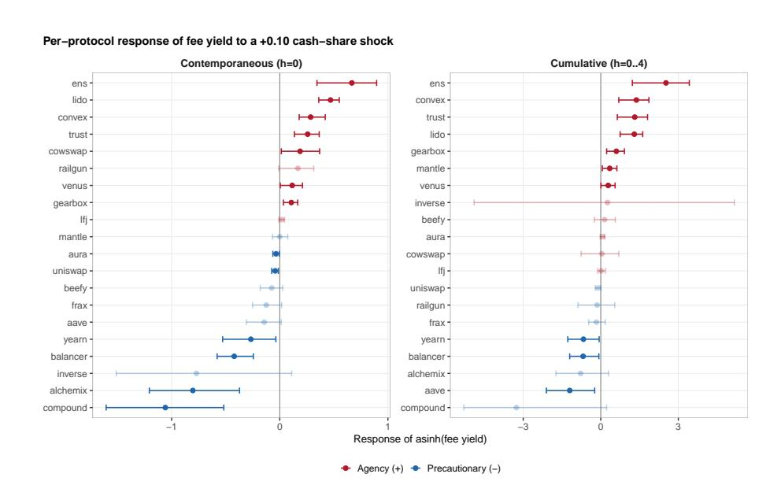

Figure 8: Per-unit response of fee yield to a +0.10 cash-share shock. Each interval is the response of asinh(fee yield) for one protocol, from a protocol-level VAR with log ETH volume and the DeFi Pulse Index return partialled out and identified by a cash-first (CA-first) Cholesky ordering; bands are 90% bootstrap confidence intervals (B = 500). The left panel is the contemporaneous (h = 0) response, the right the cumulative (h = 0–10) response; faded intervals contain zero. Red denotes a positive (agency-consistent) response, blue a negative (precautionary-consistent) one. Magnitudes for low-cash-variance protocols (e.g. compound, inverse) are extrapolated counterfactuals at the common shock size and correspondingly imprecise; the comparable object across units is the sign, not the cardinal magnitude. Figure 9 introduces individual one SD cash shocks per protocol for magnitudes.

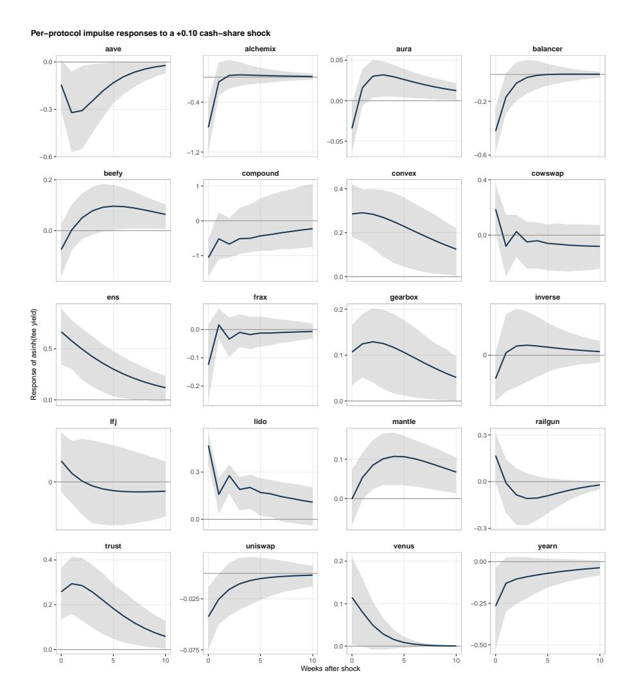

Figure 9: Individual impulse responses to a +0.10 shock to asinh(cash share). Each panel plots the response of asinh(fee yield) over ten weeks for one protocol, from a protocol-level VAR with market controls partialled out and a CA-first ordering; shaded bands are 90% bootstrap confidence intervals (B = 500). All retained systems are dynamically stable and the responses decay to zero.

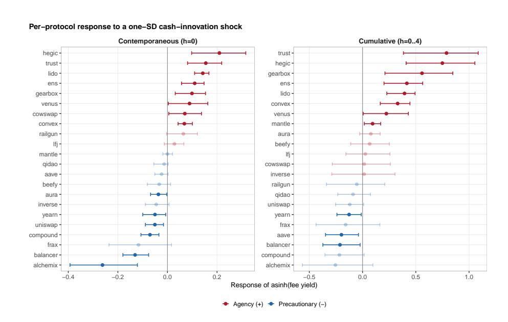

Figure 10: Per-unit response of fee yield to a one-standard-deviation cashinnovation shock. As Figure 8, but each protocol is shocked by its own cashinnovation standard deviation rather than the common +0.10, separating response intensity from shock-size scaling and re-admitting the low-variance protocols (hegic, qidao) excluded from the common-shock figure. Signs are preserved relative to the common-shock specification.

#### 4.5 Discussion

The share of fiat-backed stablecoins, held as base assets (not for yield) at the governance layer, contains predictive content regarding the valuation of protocol activity at the operational layer. This finding not only supports the relevance of stablecoins in protocol treasury management, but further establishes a previously unknown link across layers. The literature generally focuses on the connection between valuations and TVL as a proxy for the growth potential of protocols (Metelski and Sobieraj, 2022; S¸oiman et al., 2023; Grande and Borondo, 2025). This focuses analyses on the operational layer entirely. I show that funds locked at the governance layer, specifically low risk high liquidity stablecoin holdings, are related to protocol valuations.

Corporate finance advances alternate hypotheses on the effect of cash in traditional firms. From a precautionary standpoint, cash holdings should predict an increase in value, as it allows firms the necessary agility to respond to future contingencies, whether a market downturn, lack of external financing or attractive investment opportunity. The decision to hold excess liquidity in fiatbacked stablecoins, without re-deploying these positions within DeFi, ensures that protocols can fund future development opportunities without having to unwind complex nested transactions at an extra cost. Moreover, stablecoins held as base asset mitigate smart contract and liquidity risks associated with nested DeFi transactions. A treasury that holds 1, 000, 000 USDT can be regarded less risky compared to a treasury that holds 1, 000, 000 aUSDT precisely because the latter is exposed to an additional layer of smart contract dependencies, that, if compromised, threaten the redeemability of the position against USDT. Conversely, the treasury opting to hold USDT directly forgoes the yield, associated with supplying liquidity on Aave. From an agency standpoint, cash holdings should predict lower valuations, as idle excess liquidity is an indicator of poor governance or high opportunity cost. Blockchain protocols that decide to hold stablecoin as base assets, whether that is to fund future operations, as a buffer against market volatility or simply to reduce smart contract risk, faces residual risks. Its governance process itself is defined by smart contracts and as such, subject to the risk of exploits. Substantial base asset holdings, say to 1, 000, 000 USDT from above, make it easier for a governance attack to drain the funds of the protocol. Moreover, DeFi token holders my be viewed as having a higher risk tolerance in general, which might prompt them to value idle stablecoin holdings at a discount, compared to a more diversified to yield-heavy treasury.

The results presented above favor the latter explanation on average. The panel evidence suggests not only does a unidirectional relationship exist that assigns predict content to protocol cash holdings, but that this relationship is positive, which given the way the variables are defined, suggest a negative effect on protocol valuations. Conversely, what emerges from the per-unit view (Figure 7) is a more nuanced yet intuitive pattern. While it can only be read as suggestive evidence, pending further validation, there appear to be two principle criteria that can be used to explain the precautionary (negative effect) and agency (positive effect) groups. First, DeFi protocols tend to be on the precautionary side, where cash shares have a positive effect on protocol valuations. Infrastructure and services protocols (notably ENS, Lido and Trust Wallet) tend to appear on the agency side, where cash holdings predict lower market valuations. The structural split between DeFi and infrastructure/services protocols is an intuitive one because it highlights core differences in their respective uses of treasury resources.

A set of protocols exhibit a positive response to the share of fiat-backed stablecoins held in their treasury. The liquidity and security of these positions explains their utility for DeFi protocols in particular. Fiat-backed positions specifically have the added benefit of reducing the market risk inherent in the ecosystem. The literature describes crypto asset markets as highly volatile (Enoksen et al., 2020; Ahmed et al., 2024; S, tefan Cristian Gherghina and Constantinescu, 2025). Both, crypto-backed stablecoins and wrapped blue chip positions such as WETH or WBTC provide deep liquidity, yet they are fully exposed to this market volatility, which increases the riskiness of these positions relative to fiat-backed stablecoins. The mechanism through which crypto-backed (and algorithmic) stablecoins and wrapped blue chips receive volatility spillovers from the market is very similar. Both, rely on crypto collateral, in the wrapped blue chip case to be tokenized for on-chain applications and in the stablecoin case for stability. A market shock can thus hit the collateral of these positions and lead to a devaluation of the position, which is referred to as a "depeg" in the stablecoin case (Eichengreen et al. 2025). Gregory et al. (2024) show that algorithmic stablecoins performed the worst of all stabelcoin types during a market shock. It can therefore be concluded that fiat-backed stablecoins are the only treasury position in the ecosystem that jointly addresses smart contract, liquidity and market risks, thus justifying their classification as cash equivalent within the ecosystem.

### 5 Conclusion

This study classifies fiat-backed stablecoin holdings in on-chain treasury protocols as cash equivalent positions in DeFi and uncovers a significant effect on protocol valuations. As such, the study contributes to establishing a more accurate understanding of decentralized forms of organization on blockchains, informed by traditional theory.

The findings uncover a significant unidirectional relationship between fiatbacked stabelcoin funds locked in treasury smart contracts at the governance layer and market valuations of protocol activity at the operational layer. As a main finding, I therefore establish a link between two strictly separate systems. The literature has previously hypothesized a relationship between the funds locked in self-custodial contracts at the operational layer, as a growth signal, and protocol valuations, as well as governance structure and protocol valuations. However, the relationship between protocol-owned cash reserves and protocol valuations represents a novel finding in the literature.

A key limitation of the study is that the dataset comprises only a snap-

shot of on-chain protocols that have recorded treasury balances continuously throughout a 2 year period. Many protocols have only recently begun to build an on-chain organizational presence and so the sample is likely to represent mature protocols with an established standing in the industry. Cash holdings, however, could be particularly valuable for emerging protocols as they build their ecosystem and are exposed to heightened risks. Future research could focus on the role of stablecoin holdings at the early stages of protocol development specifically. Moreover, the sample period can be viewed as short and focused on a certain market regime. However, data availability and the relative infancy of the industry makes it difficult to focus on yearly observations at this stage. Moreover, a stated objective of this study is to utilize the unprecedented data availability of on-chain protocols which provides never seen before evidence on the short-run effects of treasury dynamics and cash allocations.

While this study establishes cash holdings as a relevant piece of information for token holders, there are many potential avenues for future work. One approach would be to investigate the drivers of cash holdings in protocol treasuries. Another angle would be to interact protocol decentralization, that is, governance token holder structure with cash holdings. Both could contribute additional insight regarding the role of stablecoins in protocol governance are informed by established theory in corporate finance.

# Appendices

# A Variable construction

Table 8: Stablecoin tickers by share of holdings (ranks 1–50 of 124), balanced panel of 49 protocols, January 2026.

| Ticker       | Category    |       | Holdings | (USD M) | Share | (%) |
|--------------|-------------|-------|----------|---------|-------|-----|
| USDS         | Fiat-backed | Base  | 166      | 384     | 45    | 99  |
| USDC         | Fiat-backed | Base  | 67       | 537     | 18    | 67  |
| SUSDE        | Yield       |       | 39       | 779     | 10    | 99  |
| USDT         | Fiat-backed | Base  | 25       | 082     | 6     | 93  |
| DAI          | Base        |       | 9        | 283     | 2     | 57  |
| AETHUSDT     | Fiat-backed | Yield | 9        | 224     | 2     | 55  |
| AETHUSDC     | Fiat-backed | Yield | 7        | 980     | 2     | 21  |
| AETHUSDE     | Yield       |       | 7        | 297     | 2     | 02  |
| VUSDC        | Fiat-backed | Yield | 5        | 876     | 1     | 62  |
| AETHLIDOGHO  | Yield       |       | 3        | 879     | 1     | 07  |
| AAVAUSDC     | Fiat-backed | Yield | 3        | 371     | 0     | 93  |
| AAVADAI      | Yield       |       | 2        | 740     | 0     | 76  |
| AETHUSDS     | Fiat-backed | Yield | 2        | 042     | 0     | 56  |
| GTUSDC       | Fiat-backed | Yield | 2        | 021     | 0     | 56  |
| AAVAUSDT     | Fiat-backed | Yield | 1        | 970     | 0     | 54  |
| AARBUSDT     | Fiat-backed | Yield | 1        | 241     | 0     | 34  |
| GHO          | Base        |       | 0        | 668     | 0     | 18  |
| USDE         | Base        |       | 0        | 666     | 0     | 18  |
| AETHRLUSD    | Fiat-backed | Yield | 0        | 601     | 0     | 17  |
| CRVUSD       | Base        |       | 0        | 508     | 0     | 14  |
| AGUSD        | Fiat-backed | Yield | 0        | 294     | 0     | 08  |
| AETHUSDTB    | Fiat-backed | Yield | 0        | 266     | 0     | 07  |
| MSUSD        | Yield       |       | 0        | 243     | 0     | 07  |
| AUSDP        | Fiat-backed | Yield | 0        | 195     | 0     | 05  |
| DOLA         | Base        |       | 0        | 187     | 0     | 05  |
| AETHPYUSD    | Fiat-backed | Yield | 0        | 162     | 0     | 04  |
| FDUSD        | Fiat-backed | Base  | 0        | 162     | 0     | 04  |
| AETHSUSDE    | Yield       |       | 0        | 143     | 0     | 04  |
| AETHLIDOUSDS | Fiat-backed | Yield | 0        | 131     | 0     | 04  |
| APOLUSDT     | Fiat-backed | Yield | 0        | 126     | 0     | 03  |
| ATUSD        | Fiat-backed | Yield | 0        | 115     | 0     | 03  |
| TUSD         | Fiat-backed | Base  | 0        | 114     | 0     | 03  |
| ASUSD        | Yield       |       | 0        | 108     | 0     | 03  |
| AETHGHO      | Yield       |       | 0        | 097     | 0     | 03  |
| APOLEURS     | Fiat-backed | Yield | 0        | 090     | 0     | 02  |
| AUSD         | Base        |       | 0        | 078     | 0     | 02  |
| AMUSDC       | Fiat-backed | Yield | 0        | 078     | 0     | 02  |
| AETHEURC     | Fiat-backed | Yield | 0        | 073     | 0     | 02  |
| SUSD         | Base        |       | 0        | 070     | 0     | 02  |
| FXUSD        | Base        |       | 0        | 057     | 0     | 02  |
| GUSD         | Fiat-backed | Base  | 0        | 057     | 0     | 02  |
| AARBGHO      | Yield       |       | 0        | 050     | 0     | 01  |
| APOLUSDC     | Fiat-backed | Yield | 0        | 047     | 0     | 01  |
| AMDAI        | Yield       |       | 0        | 044     | 0     | 01  |
| SPUSDC       | Fiat-backed | Yield | 0        | 039     | 0     | 01  |
| AETHLIDOUSDC | Fiat-backed | Yield | 0        | 039     | 0     | 01  |
| AARBDAI      | Yield       |       | 0        | 038     | 0     | 01  |
| AOPTSUSD     | Yield       |       | 0        | 037     | 0     | 01  |
| AMUSDT       | Fiat-backed | Yield | 0        | 037     | 0     | 01  |
| AAVAAUSD     | Yield       |       | 0        | 034     | 0     | 01  |

Notes. Tickers are ranked by share of total stablecoin holdings. Holdings are in USD millions. The remaining ranks (51–100) continue in Table 9.

Table 9: Stablecoin tickers by share of holdings (ranks 51–100 of 124, continued from Table 8), balanced panel of 49 protocols, January 2026.

| Ticker        | Category          | Holdings | (USD M) | Share | (%) |
|---------------|-------------------|----------|---------|-------|-----|
| AARBUSDC      | Fiat-backed Yield | 0        | 031     | 0     | 01  |
| AAVAGHO       | Yield             | 0        | 029     | 0     | 01  |
| USDT0         | Fiat-backed Base  | 0        | 027     | 0     | 01  |
| RAI           | Base              | 0        | 027     | 0     | 01  |
| FRAX          | Base              | 0        | 025     | 0     | 01  |
| AETHDAI       | Yield             | 0        | 024     | 0     | 01  |
| BUSD          | Fiat-backed Base  | 0        | 022     | 0     | 01  |
| AOPTUSDC      | Fiat-backed Yield | 0        | 021     | 0     | 01  |
| USDF          | Base              | 0        | 020     | 0     | 01  |
| AOPTUSDT      | Fiat-backed Yield | 0        | 019     | 0     | 01  |
| AUSDC         | Fiat-backed Yield | 0        | 018     | 0     | 00  |
| USDY          | Yield             | 0        | 016     | 0     | 00  |
| AOPTDAI       | Yield             | 0        | 013     | 0     | 00  |
| APOLDAI       | Yield             | 0        | 013     | 0     | 00  |
| VFDUSD        | Fiat-backed Yield | 0        | 012     | 0     | 00  |
| ADAI          | Yield             | 0        | 010     | 0     | 00  |
| AETHCRVUSD    | Yield             | 0        | 010     | 0     | 00  |
| AUSDT         | Fiat-backed Yield | 0        | 008     | 0     | 00  |
| APOLMIMATIC   | Yield             | 0        | 008     | 0     | 00  |
| AARBFRAX      | Yield             | 0        | 008     | 0     | 00  |
| AAVAEURC      | Fiat-backed Yield | 0        | 006     | 0     | 00  |
| ARAI          | Yield             | 0        | 006     | 0     | 00  |
| VSUSDE        | Yield             | 0        | 005     | 0     | 00  |
| VUSDE         | Yield             | 0        | 005     | 0     | 00  |
| USD1          | Base              | 0        | 005     | 0     | 00  |
| VUSD1         | Yield             | 0        | 005     | 0     | 00  |
| USDP          | Fiat-backed Base  | 0        | 004     | 0     | 00  |
| AARBLUSD      | Yield             | 0        | 004     | 0     | 00  |
| APOLJEUR      | Yield             | 0        | 004     | 0     | 00  |
| VUSDT         | Fiat-backed Yield | 0        | 004     | 0     | 00  |
| EURC          | Fiat-backed Base  | 0        | 003     | 0     | 00  |
| AETHLUSD      | Yield             | 0        | 003     | 0     | 00  |
| AETHFRAX      | Yield             | 0        | 003     | 0     | 00  |
| ABUSD         | Fiat-backed Yield | 0        | 002     | 0     | 00  |
| ALUSD         | Yield             | 0        | 002     | 0     | 00  |
| EURA          | Base              | 0        | 002     | 0     | 00  |
| MUSD          | Base              | 0        | 001     | 0     | 00  |
| LUSD          | Base              | 0        | 001     | 0     | 00  |
| AOPTLUSD      | Yield             | 0        | 001     | 0     | 00  |
| AAVAFRAX      | Yield             | 0        | 001     | 0     | 00  |
| CUSDC         | Fiat-backed Yield | 0        | 001     | 0     | 00  |
| USDD          | Base              | 0        | 001     | 0     | 00  |
| AETHLIDOSUSDE | Yield             | 0        | 000     | 0     | 00  |
| AFANDAI       | Yield             | 0        | 000     | 0     | 00  |
| AFRAX         | Yield             | 0        | 000     | 0     | 00  |
| AFANUSDC      | Fiat-backed Yield | 0        | 000     | 0     | 00  |
| EURS          | Fiat-backed Base  | 0        | 000     | 0     | 00  |
| PYUSD         | Fiat-backed Base  | 0        | 000     | 0     | 00  |
| MIMATIC       | Base              | 0        | 000     | 0     | 00  |
| JEUR          | Base              | 0        | 000     | 0     | 00  |

Notes. Continuation of Table 8. Tickers are ranked by share of total stablecoin holdings; holdings are in USD millions. The lowest 24 of 124 tickers are omitted; each holds under USD 1,000 and rounds to 0.00% of the panel.

### B Pretests

Table 10: Per-unit lag-order selection (BIC)

| Direction                         | <i>N</i> | Median | Mean | SD   | Min | Max |
|-----------------------------------|----------|--------|------|------|-----|-----|
| $\text{Ca} \rightarrow \text{FY}$ | 23       | 1      | 2.09 | 1.68 | 1   | 7   |
| $\text{FY} \rightarrow \text{Ca}$ | 23       | 1      | 1.39 | 1.47 | 1   | 8   |

Notes. Protocol-level lag orders for the bivariate Granger auxiliary regressions, selected by BIC over p ∈ {1, . . . , 8} for each of the N = 23 protocols and summarised by direction. The selected orders are short but right-skewed—a median of one lag in both directions with a heavy upper tail (to seven and eight)—evidencing cross-protocol dynamic heterogeneity and supporting the parsimonious common orders K ∈ {1, 2, 3} used in Table 5.

### C Robustness Checks

Table 11: Block-exclusion Wald tests and cumulative effects from the companion panel VAR

| Direction                                              | $\chi^2$ | df | $p_{\text{Wald}}$ | $\hat{c}$ (s.e.) | $p_{\text{cum}}$ |
|--------------------------------------------------------|----------|----|-------------------|------------------|------------------|
| <i>Panel A: <math>p = 4</math> (primary VAR order)</i> |          |    |                   |                  |                  |
| CA $\rightarrow$ FY                                    | 9.801    | 4  | 0.044**           | 0.193 (0.070)    | 0.006***         |
| FY $\rightarrow$ CA                                    | 7.745    | 4  | 0.101             | 0.000 (0.002)    | 0.981            |
| <i>Panel B: <math>p = 1</math></i>                     |          |    |                   |                  |                  |
| CA $\rightarrow$ FY                                    | 2.287    | 1  | 0.130             | 0.150 (0.099)    | 0.130            |
| FY $\rightarrow$ CA                                    | 0.362    | 1  | 0.547             | -0.001 (0.002)   | 0.547            |

Notes. This table reports the pooled, homogeneous-slope counterpart of the Dumitrescu– Hurlin tests in Table ??. For each direction, the block-exclusion Wald statistic tests the joint exclusion of all p lags of the sending variable from the receiving variable's equation in the oneway fixed-effects panel VAR augmented with market controls, and is distributed χ 2 p under the null of no Granger causality (Granger, 1969; L¨utkepohl, 2005). Standard errors are clustered by protocol (23 clusters). ˆc = Pp ℓ=1 θˆ ℓ is the cumulative effect, the sum of the sender's lag coefficients in the receiver's equation, with its standard error in parentheses and pcum the associated two-sided p-value. The primary specification uses the BIC-selected order p = 4; p = 1 is reported for comparison. Unlike the heterogeneous-slope Dumitrescu–Hurlin test, which permits unit-specific dynamics, the pooled test imposes a common slope and detects the forward effect only at the richer lag order. Stars as in Table ??.

Table 12: Cumulative cash effect: trend and fixed-effects robustness

| Specification                  | $\hat{c}$ | s.e.  | $z$  | $p$ -value |
|--------------------------------|-----------|-------|------|------------|
| Protocol FE, no trend          | 0.211     | 0.076 | 2.76 | 0.006**    |
| Protocol FE + linear trend     | 0.200     | 0.070 | 2.85 | 0.004**    |
| Two-way FE (controls absorbed) | 0.194     | 0.069 | 2.81 | 0.005**    |

Notes. Each row reports the cumulative cash effect bc = P4 ℓ=1 θbcash ℓ from the fee-yield equation of the FE-OLS panel VAR(4), with its delta-method standard error and the associated z-statistic and two-sided p-value; standard errors are clustered by protocol (23 clusters). Row 1 is the primary specification (protocol fixed effects and market controls, as in column (2) of Table 7); row 2 adds a common linear time trend; row 3 replaces the controls with two-way (protocol and time) fixed effects, under which the market controls are collinear with the time effects and drop out. The cumulative effect is stable across all three treatments, indicating it is driven neither by a secular trend nor by the choice between explicit controls and time fixed effects for absorbing common crypto-market variation. ∗∗ denotes significance at the 1% level.

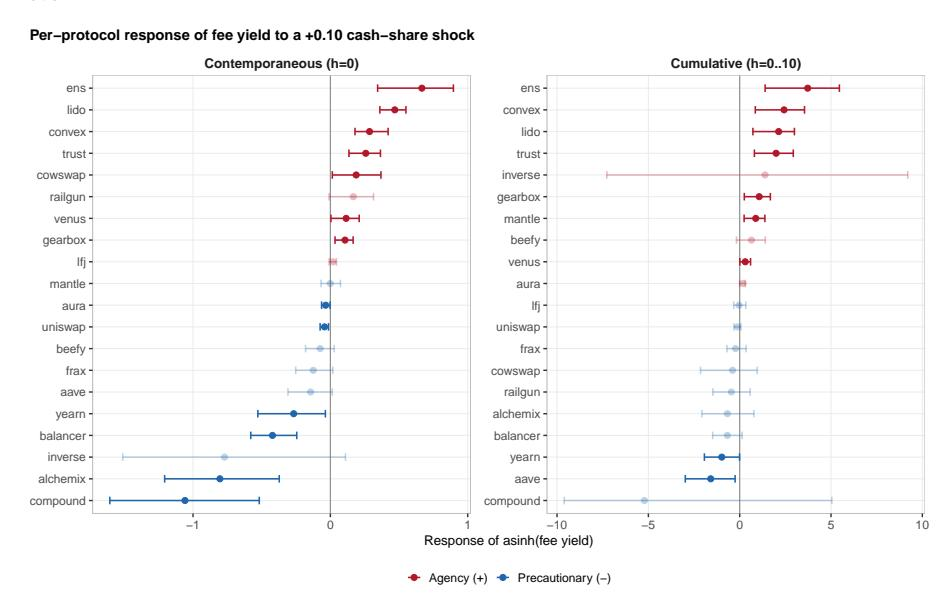

Figure 11: Per-unit response of fee yield to a +0.10 cash-share shock. Each interval is the response of asinh(fee yield) for one protocol, from a protocollevel VAR with log ETH volume and the DeFi Pulse Index return partialled out and identified by a cash-first (CA-first) Cholesky ordering; bands are 90% bootstrap confidence intervals (B = 500). The left panel is the contemporaneous (h = 0) response, the right the cumulative (h = 0–10) response; faded intervals contain zero. Red denotes a positive (agency-consistent) response, blue a negative (precautionary-consistent) one. Magnitudes for low-cash-variance protocols (e.g. compound, inverse) are extrapolated counterfactuals at the common shock size and correspondingly imprecise; the comparable object across units is the sign, not the cardinal magnitude.

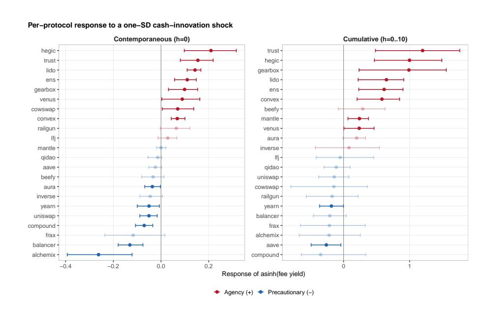

Figure 12: Per-unit response of fee yield to a one-standard-deviation cashinnovation shock. As Figure 8, but each protocol is shocked by its own cashinnovation standard deviation rather than the common +0.10, separating response intensity from shock-size scaling and re-admitting the low-variance protocols (hegic, qidao) excluded from the common-shock figure. Signs are preserved relative to the common-shock specification.

### References

Acharya, V. V., H. Almeida, and M. Campello (2007, 10). Is cash negative debt? A hedging perspective on corporate financial policies. Journal of Financial Intermediation 16 (4), 515–554. Acharya, V. V. and O. Merrouche (2013, 1). Precautionary Hoarding of Liquidity and Interbank Markets: Evidence from the Subprime Crisis. Review of Finance 17 (1), 107–160. Ahmed, M. S., A. A. El-Masry, A. I. Al-Maghyereh, and S. Kumar (2024, 8). Cryptocurrency volatility: A review, synthesis, and research agenda. Research in International Business and Finance 71, 102472. Ahmed, R. and I. Aldasoro (2025, 5). Stablecoins and safe asset prices. Akaike, H. (1974). A New Look at the Statistical Model Identification. pp. 215–222. Alamsyah, A., G. N. W. Kusuma, and D. P. Ramadhani (2024, 2). A review on decentralized finance ecosystems. Future Internet 2024, Vol. 16, 16. Ali, G. M. (2026, 1). Digital Asset Analytics for DeFi Protocol Valuation: An Explainable Optuna-Tuned Super Learner Ensemble Framework. Journal of Risk and Financial Management 2026, Vol. 19, 19 (1), 63. Alimov, A. (2014, 4). Product market competition and the value of corporate cash: Evidence from trade liberalization. Journal of Corporate Finance 25, 122–139. Altavilla, C., M. Boucinha, L. Burlon, R. Adalid, R. Fortes, and F. Maruhn (2026). Stablecoins and monetary policy transmission. SSRN Electronic Journal. Alvarez, J. and M. Arellano (2003). The time series and cross-section asymptotics of dynamic panel data estimators. Econometrica 71 (4), 1121–1159. Amler, H., L. Eckey, S. Faust, M. Kaiser, P. Sandner, and B. Schlosser (2021, 9). Defi-ning defi: Challenges pathway. 2021 3rd Conference on Blockchain Research and Applications for Innovative Networks and Services, BRAINS 2021 , 181–184. Ante, L., I. Fiedler, and E. Strehle (2021, 9). The impact of transparent money flows: Effects of stablecoin transfers on the returns and trading volume of bitcoin. Technological Forecasting and Social Change 170, 120851. Antonakakis, N., I. Chatziantoniou, and G. Filis (2017, 2). Energy consumption, CO2 emissions, and economic growth: An ethical dilemma. Renewable and Sustainable Energy Reviews 68, 808–824.

Arasa, R. (2015, 4). Determinants of know your customer (kyc) compliance among commercial banks in kenya. Journal of Economics and Behavioral Studies 7, 162–175. Arellano, M. (1987, 11). PRACTITIONERS' CORNER: Computing Robust Standard Errors for Within-groups Estimators\*. Oxford Bulletin of Economics and Statistics 49 (4), 431–434. Arner, D., R. Auer, and J. Frost (2020). Stablecoins: risks, potential and regulation. Barbereau, T. and B. Bod´o (2023, 7). Beyond financial regulation of crypto-asset wallet software: In search of secondary liability. Computer Law & Security Review 49, 105829. Bates, T. W., K. M. Kahle, and R. M. Stulz (2009, 10). Why Do U.S. Firms Hold So Much More Cash than They Used To? The Journal of Finance 64 (5), 1985–2021. Baur, D. G. and L. T. Hoang (2021, 1). A crypto safe haven against Bitcoin. Finance Research Letters 38, 101431. Benedetti, H., C. Caceres, and L. Alvaro Abarz´ua (2023, 1). Utility tokens. ´ The Emerald Handbook on Cryptoassets: Investment Opportunities and Challenges, 79–92. Benedetti, H., E. Nikbakht, and B. Pasten (2026, 3). Quantile-based connectedness in the crypto-stablecoin network across market conditions. International Review of Economics & Finance 106, 104912. Bliss, B. A., Y. Cheng, and D. J. Denis (2015, 3). Corporate payout, cash retention, and the supply of credit: Evidence from the 2008–2009 credit crisis. Journal of Financial Economics 115 (3), 521–540. BREUSCH, T. S. (1978, 12). TESTING FOR AUTOCORRELATION IN DY-NAMIC LINEAR MODELS\*. Australian Economic Papers 17 (31), 334–355. Brigida, M. (2025, 12). The surprising irrelevance of total-value-locked on cryptocurrency returns. Economics Letters 257, 112673. Caldarelli, G. (2020, 10). Understanding the Blockchain Oracle Problem: A Call for Action. Information 2020, Vol. 11, 11 (11), 1–19. Cardella, L., D. Fairhurst, and S. Klasa (2021, 6). What determines the composition of a firm's cash reserves? Journal of Corporate Finance 68, 101924. Chen, N. (2011, 1). Securities Laws, Control of Corruption, and Corporate Liquidity: International Evidence. Corporate Governance: An International Review 19 (1), 3–24.

Cong, L. W., Y. Li, and N. Wang (2022, 6). Token-based platform finance. Journal of Financial Economics 144 (3), 972–991. Cong, L. W. and Y. Xiao (2021, 6). Categories and functions of crypto-tokens. The Palgrave Handbook of FinTech and Blockchain, 267–284. da Cruz, A. F., H. Kimura, and V. A. Sobreiro (2019, 1). What do we know about corporate cash holdings? a systematic analysis. Journal of Corporate Accounting and Finance 30, 77–143. D´ıaz, A., C. Esparcia, and D. Hu´elamo (2023, 1). Stablecoins as a tool to mitigate the downside risk of cryptocurrency portfolios. The North American Journal of Economics and Finance 64, 101838. Dittmar, A., J. Mahrt-Smith, and H. Servaes (2003, 3). International corporate governance and corporate cash holdings. The Journal of Financial and Quantitative Analysis 38, 111. Duchin, R., T. Gilbert, J. Harford, and C. Hrdlicka (2017, 4). Precautionary savings with risky assets: When cash is not cash. The Journal of Finance 72, 793–852. Emiliano, P. C., M. J. Vivanco, and F. S. De Menezes (2014, 1). Information criteria: How do they behave in different models? Computational Statistics & Data Analysis 69, 141–153. Enoksen, F. A., C. J. Landsnes, K. Luˇcivjansk´a, and P. Moln´ar (2020, 8). Understanding risk of bubbles in cryptocurrencies. Journal of Economic Behavior & Organization 176, 129–144. Fairhurst, D. and S. M. Zahid (2025, 12). Asset redeployability and corporate liquidity. Financial Management 54, 817–838. Fantazzini, D. (2025, 11). Detecting stablecoin failure with simple thresholds and panel binary models: The pivotal role of lagged market capitalization and volatility. Forecasting 2025, Vol. 7, 7. Ferreira, M. A. and A. S. Vilela (2004, 6). Why do firms hold cash? evidence from emu countries. European Financial Management 10, 295–319. FSB (2022). Assessment of risks to financial stability from crypto-assets. G, S. (1978). "Estimating the Dimension of a Model.". The Annals of Statistics 6 (2), 461 – 464. Gao, H., J. Harford, and K. Li (2013, 9). Determinants of corporate cash policy: Insights from private firms. Journal of Financial Economics 109, 623–639. Godfrey, L. G. (1978, 11). Testing Against General Autoregressive and Moving Average Error Models when the Regressors Include Lagged Dependent Variables. Econometrica 46 (6), 1293.

- Gorton, G. and J. Zhang (2023, 5). Taming wildcat stablecoins. University of Chicago Law Review 90. Gorton, G. B., C. P. Ross, S. Y. Ross, Y. Amihud, S. Hempel, S. Howell,
- K. John, J. Kahn, B. Kay, E. Klee, A. Lehnert, M. Macchiavelli, B. Narajabad, S. Rajan, D. Rakowsky, D. Rappoport, J. Thanassoulis, A. Vardoulakis, G. Viswanath, and M. Money (2022). Nber working paper series making money. Grande, M. and J. Borondo (2025, 4). Trust as a driver in the defi market: Leveraging tvl/mcap bands as confidence indicators to anticipate price movements. Finance Research Letters 75, 106705. Gudgeon, L., D. Perez, D. Harz, B. Livshits, and A. Gervais (2020, 6). The decentralized financial crisis. Proceedings - 2020 Crypto Valley Conference on Blockchain Technology, CVCBT 2020 , 1–15. Han, S. and J. Qiu (2007, 3). Corporate precautionary cash holdings. Journal of Corporate Finance 13, 43–57. Hannan, E. J. and B. G. Quinn (1979). The Determination of the Order of an Autoregression. J. R. Statist. Soc. B 41 (2), 190–195. Harford, J., S. A. Mansi, and W. F. Maxwell (2008, 3). Corporate governance and firm cash holdings in the us. Journal of Financial Economics 87, 535–555. Hassan, A., I. Makhdoom, W. Iqbal, A. Ahmad, and A. Raza (2023, 8). From trust to truth: Advancements in mitigating the Blockchain Oracle problem. Journal of Network and Computer Applications 217, 103672. Hoberg, G., G. Phillips, and N. Prabhala (2014, 2). Product Market Threats, Payouts, and Financial Flexibility. The Journal of Finance 69 (1), 293–324. Holtz-Eakin, D., W. Newey, and H. S. Rosen (1988, 11). Estimating Vector Autoregressions with Panel Data. Econometrica 56 (6), 1371. Howell, S. T., M. Niessner, and D. Yermack (2020, 9). Initial coin offerings: Financing growth with cryptocurrency token sales. Review of Financial Studies 33, 3925–3974. Jensen, M. C. (1986). Agency costs of free cash flow, corporate finance, and takeovers. 76, 323–329. Jensen, M. C. and W. H. Meckling (1976, 10). Theory of the firm: Managerial behavior, agency costs and ownership structure. Journal of Financial Economics 3, 305–360. Jin, F., J. Li, and Y. Xue (2023, 3). Preferring stablecoin over dollar: Evidence from a survey of ethereum platform traders. Journal of International Money and Finance 131, 102796.

- Judson, R. A. and A. L. Owen (1999, 10). Estimating dynamic panel data models: a guide for macroeconomists. Economics Letters 65 (1), 9–15. Karakostas, I. and K. Pantelidis (2024, 4). Dao dynamics: Treasury and market cap interaction. Journal of Risk and Financial Management 2024, Vol. 17, 17. Kazemzadeh, E., J. A. Fuinhas, M. Koengkan, and M. T. A. Shadmehri (2023, 5). Relationship between the share of renewable electricity consumption, economic complexity, financial development, and oil prices: A two-step club convergence and PVAR model approach. International Economics 173, 260–
- 275. Keynes, J. M. (1937, 2). The general theory of employment. The Quarterly Journal of Economics 51, 209–223. Kitzler, S., F. Victor, P. Saggese, and B. Haslhofer (2023, 3). Disentangling decentralized finance (defi) compositions. ACM Transactions on the Web 17,
- 10. Koh, P. and K. Pukthuanthong (2026, 2). Wrapped stablecoins and the defi systemic risk. Korolev, G. (2026). Facts and fantasies about defi: Lending, dex, and derivatives. Journal of Futures Markets. Kraus, A. and R. H. Litzenberger (1973, 9). A STATE-PREFERENCE MODEL OF OPTIMAL FINANCIAL LEVERAGE. The Journal of Finance 28 (4), 911–922. La Rocca, M. and D. R. Cambrea (2019, 2). The effect of cash holdings on firm performance in large Italian companies. Journal of International Financial Management and Accounting 30 (1), 30–59. Lamont, O. (1997, 3). Cash Flow and Investment: Evidence from Internal Capital Markets. The Journal of Finance 52 (1), 83–109. Le, N. and M. Ramsey (2024, 3). Competition, peer firm effects, and cash composition. Journal of Banking & Finance 160, 107092. Lee, Y. H., Y. F. Chiu, and M. H. Hsieh (2025, 4). Stablecoin depegging risk prediction. Pacific-Basin Finance Journal 90, 102640. Liao, G. Y. and J. Caramichael (2022, 1). Stablecoins: Growth potential and impact on banking. International Finance Discussion Papers 2022.0, 1–26. Liu, D., J. Zhang, Y. Wang, H. Shen, Z. Zhang, and T. Ye (2025, 10). Blockchain Smart Contract Security: Threats and Mitigation Strategies in a Lifecycle Perspective. ACM Computing Surveys 58 (4). Luo, Y., Y. Feng, J. Xu, and P. Tasca (2026). Piercing the veil of tvl: Defi reappraised. pp. 3–19.

Lyons, R. K. and G. Viswanath-Natraj (2020). Nber working paper series what keeps stablecoins stable? what keeps stablecoins stable? introduction and motivation. Mabe, Q. M. and B. D. Simo-Kengne (2025, 8). The Impact of Fintech Risk on Bank Performance in Africa: The PVAR Approach. Journal of Risk and Financial Management 2025, Vol. 18, 18 (8). Makarov, I. and A. Schoar (2022). Cryptocurrencies and decentralised finance (defi). Maouchi, Y., L. Charfeddine, and G. E. Montasser (2022, 6). Understanding digital bubbles amidst the covid-19 pandemic: Evidence from defi and nfts. Finance Research Letters 47, 102584. Metelski, D. and J. Sobieraj (2022, 11). Decentralized Finance (DeFi) Projects: A Study of Key Performance Indicators in Terms of DeFi Protocols' Valuations. International Journal of Financial Studies 2022, Vol. 10, 10 (4). Miller, M. H. and D. Orr (1966, 8). A model of the demand for money by firms. The Quarterly Journal of Economics 80, 413–435. Murakami, D. and G. Viswanath-Natraj (2025, 6). Cryptocurrencies in emerging markets: A stablecoin solution? Journal of International Money and Finance 156, 103344. Nickell, S. (1981, 11). Biases in Dynamic Models with Fixed Effects. Econometrica 49 (6), 1417. Nurbaev, V., C. H. Au, and C.-Y. Chou (2023, 12). When stablecoin is no longer stable - a case study on the failure of terrausd. ICIS 2023 Proceedings. O'Brien, J. P. and T. B. Folta (2009, 10). A transaction cost perspective on why, how, and when cash impacts firm performance. Managerial and Decision Economics 30 (7), 465–479. Opler, T., L. Pinkowitz, R. Stulz, and R. Williamson (1999, 4). The determinants and implications of corporate cash holdings. Journal of Financial Economics 52, 3–46. Pesaran, M. H. (2004). General Diagnostic Tests for Cross Section Dependence in Panels. Pesaran, M. H. (2007, 3). A simple panel unit root test in the presence of cross-section dependence. Journal of Applied Econometrics 22, 265–312. Qiu, J. and C. Wan (2015, 3). Technology spillovers and corporate cash holdings. Journal of Financial Economics 115 (3), 558–573. Saengchote, K. (2021). Where do defi stablecoins go? a closer look at what defi composability really means. PIER Discussion Papers.

Santana, C. and L. Albareda (2022, 9). Blockchain and the emergence of decentralized autonomous organizations (daos): An integrative model and research agenda. Technological Forecasting and Social Change 182, 121806. Schellinger, B., I. Fiedler, and F. Steinmetz (2023, 11). How are you daoing? the state of dao treasuries. SSRN Electronic Journal. Schlatt, V., J. Sedlmeir, S. Feulner, and N. Urbach (2022, 11). Designing a framework for digital kyc processes built on blockchain-based self-sovereign identity. Information & Management 59, 103553. Schoonwinkel, H. (2023, 10). Towards fair presentation of dao treasuries: An evaluation of native governance token reporting practices. The Journal of The British Blockchain Association 6, 1–8. Sin, C. Y. and H. White (1996, 3). Information criteria for selecting possibly misspecified parametric models. Journal of Econometrics 71 (1-2), 207–225. Subramaniam, V., T. T. Tang, H. Yue, and X. Zhou (2011, 6). Firm structure and corporate cash holdings. Journal of Corporate Finance 17 (3), 759–773. Sun, W., C. Yin, and Y. Zeng (2023, 11). Precautionary motive or private benefit motive for holding cash: Evidence from ceo ownership. International Review of Financial Analysis 90, 102820. Theissen, M. H., C. Jung, H. H. Theissen, and L. Graf-Vlachy (2023, 11). Cash holdings and firm value: Evidence for increasing marginal returns. Journal of Management Scientific Reports 1, 260–300. von Wachter, V., J. R. Jensen, and O. Ross (2021, 3). Measuring asset composability as a proxy for defi integration. 12676. Wang, S., W. Ding, J. Li, Y. Yuan, L. Ouyang, and F. Y. Wang (2019, 10). Decentralized autonomous organizations: Concept, model, and applications. IEEE Transactions on Computational Social Systems 6, 870–878. Weing¨artner, T., F. Fasser, P. R. S. da Costa, and W. Farkas (2023, 10). Deciphering defi: A comprehensive analysis and visualization of risks in decentralized finance. Journal of Risk and Financial Management 2023, Vol. 16, 16. Werner, S., A. Klages-Mundt, D. Perez, D. Harz, L. Gudgeon, and W. J. Knottenbelt (2023, 7). Sok: Decentralized finance (defi). AFT 2022 - Proceedings of the 2022 4th ACM Conference on Advances in Financial Technologies, 30–46. Xue, Y., D. Fan, S. Su, J. Fu, N. Hu, W. Liu, and Z. Tian (2023, 12). A review on the security of the ethereum-based defi ecosystem. CMES - Computer Modeling in Engineering and Sciences 139, 69–101.

Yilmaz, I. and A. Samour (2024, 1). The effect of cash holdings on financial performance: Evidence from middle eastern and north african countries. Journal of Risk and Financial Management 2024, Vol. 17, 17. Yung, K. and N. A. Nafar (2014, 9). Creditor rights and corporate cash holdings: International evidence. International Review of Economics & Finance 33, 111–127. Zeileis, A., S. K¨oll, and N. Graham (2020, 10). Various Versatile Variances: An Object-Oriented Implementation of Clustered Covariances in R. Journal of Statistical Software 95, 1–36. S¸oiman, F., J. G. Dumas, and S. Jimenez-Garces (2023, 6). What drives defi market returns? Journal of International Financial Markets, Institutions and Money 85, 101786. S, tefan Cristian Gherghina and C. A. Constantinescu (2025, 3). Towards examining the volatility of top market-cap cryptocurrencies throughout the covid-19 outbreak and the russia–ukraine war: Empirical evidence from garch-type models. Risks 2025, Vol. 13, 13.