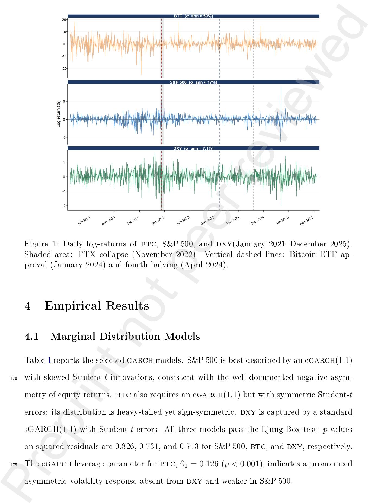
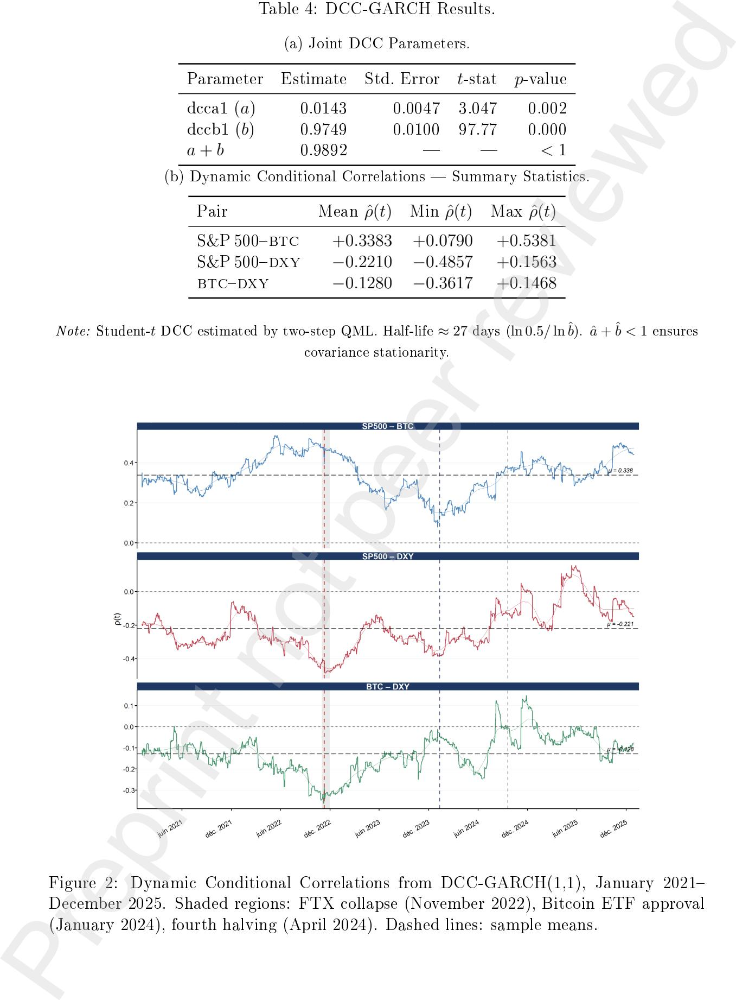
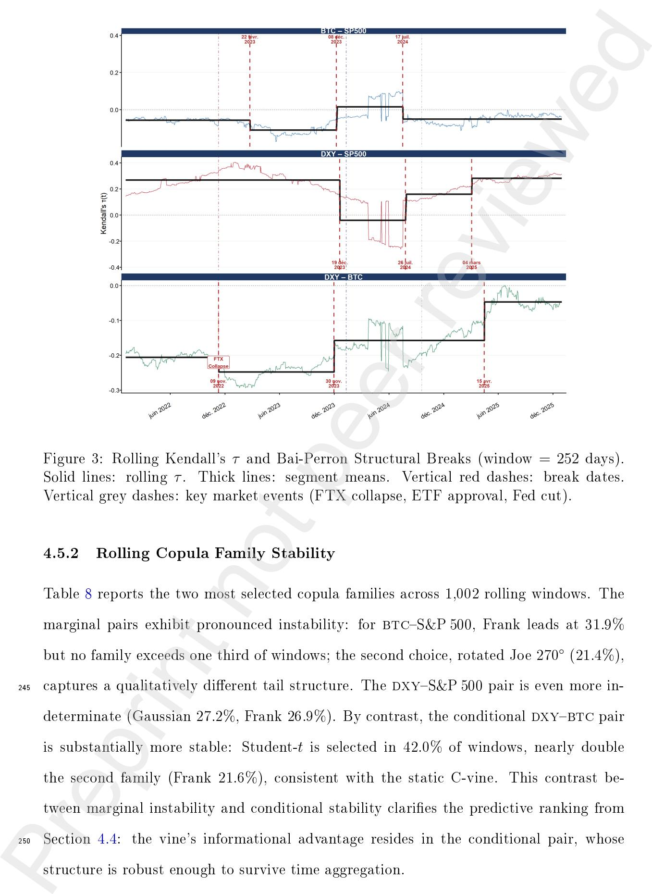

# Modeling Static and Dynamic Dependence Between Cryptocurrency and Traditional Financial Markets: Evidence from Vine and Time-Varying Copulas Preprint not peer reviewed

Fadoua Badaouia,∗ Khalil Saida

a Laboratoire en Genre, Économie, Actuariat, Statistique, Démographie et Développement Durable (GEAS3D),

Institut National de Statistique et d'Économie Appliquée (INSEA),

B.P. 6217 Rabat-Instituts, Morocco.

∗ 10 Corresponding author.

E-mail: fbadaoui@insea.ac.ma

July 16, 2026

# Modeling Static and Dynamic Dependence Between Cryptocurrency and Traditional Financial Markets: Evidence from Vine and Time-Varying Copulas Preprint not peer reviewed

5 July 16, 2026

#### Abstract

Vine copula modelling and Bai-Perron structural break tests are used to demonstrate signicant asymmetric tail dependence and regime shifts in the dependence structure between Bitcoin, equity, and currency markets.

10 This study investigates the static and dynamic dependence structure between Bitcoin (btc), the S&P 500 and the US Dollar Index (dxy) over the period January 2021December 2025. Marginal distributions are ltered using optimally selected GARCH-type models with Student-t and skewed Student-t innovations. Dependence is modeled using a static C-vine copula, a dynamic conditional correlation-GARCH 15 (dcc-garch ) model, and a rolling dynamic C-vine copula. Models are compared using out-of-sample predictive log-likelihoods and DieboldMariano tests.

The results reveal asymmetric dependence structures, including upper tail dependence between Bitcoin and the S&P 500 and negative dependence between btcand the dxyindex conditional on equity market movements. Out-of-sample evaluation 20 shows that the static C-vine copula provides the best predictive performance. Structural break tests further identify several regime shifts associated with major events in the cryptocurrency market, most notably the FTX collapse, which is recovered automatically as a break in btcdxy dependence. Overall, the results indicate that btcexhibits signicant co-movement with equity markets, limiting its role as 25 a diversication asset. This co-movement also suggests that stress can spread from cryptocurrency markets into traditional ones, a risk that grows as digital assets become more embedded in mainstream portfolios. Preprint not peer reviewed

Keywords: Bitcoin; vine copula; tail dependence; DCC-GARCH; structural breaks; cryptocurrency; predictive evaluation

30 JEL Classication: C58, G11, G15

## 1 Introduction

Measuring dependence between nancial assets is central to portfolio construction, risk management, and contagion analysis. Yet standard linear correlation misses the asymmetries and tail clustering that matter most in stress periods Embrechts et al. [2002], 35 Longin and Solnik [2001]. Vine copulas address this limitation by decomposing the multivariate density into a cascade of bivariate pair-copulas, each capturing a distinct tail and asymmetry prole Joe [1996], Bedford and Cooke [2002], Aas et al. [2009]. Applied to cryptocurrency markets, however, two questions remain open: whether static or dynamic specications yield superior out-of-sample predictions, and whether the dependence 40 structure itself is stable or subject to structural breaks.

These two questions matter beyond methodology. Cryptocurrency is no longer a side bet conned to retail traders: banks hold crypto exposure, ETFs tie btc directly to institutional portfolios, and a shock in one market no longer stays contained to it Dwyer [2015], Castrén et al. [2022]. Systemic risk research has dealt with this kind of problem 45 before, using CoVaR, copulas, or network models to trace how stress moves between institutions and markets López-Espinosa et al. [2013], Andrie³ et al. [2022], Silva et al. [2017]. Vine copulas t naturally here: instead of collapsing btc's relationship with equities and the dollar into a single correlation number, they let each pair's tail behaviour be modelled on its own terms which is what is needed to see where, and how, cryptocurrency stress 50 could travel. Preprint not peer reviewed

This paper tackles both questions for three assets whose joint dynamics have become increasingly policy-relevant: Bitcoin (btc), the S&P 500 equity index, and the US Dollar Index (dxy). The 20212025 sample provides exceptionally rich regime variation, spanning the 2022 crypto bear market (btc peak-to-trough: −77%), the Federal Reserve 55 tightening cycle (400 bps over 20222023), the FTX exchange collapse (November 2022), the approval of US spot Bitcoin ETFs (January 2024), and the fourth halving (April 2024) a sequence that makes structural stability an empirical question rather than a maintained assumption Bouri et al. [2021].

The literature oers mixed evidence on the btcS&P 500 link. Early work found Bit-

60 coin largely decorrelated from equities and currencies Dyhrberg [2016], Bouri et al. [2017]. More recent studies document growing co-movement during stress episodes Conlon and McGee [2020], Corbet et al. [2020], but typically rely on dcc-garch or rolling correlations that impose Gaussian dependence and cannot detect asymmetric tail behaviour. Papers applying copulas to cryptocurrency markets BenSaida [2023], Mensi et al. [2019] focus on 65 static or dynamic specications in isolation, without a formal predictive comparison or structural break analysis.

We close these gaps by combining a static C-vine, a dcc-garch benchmark, and a rolling dynamic C-vine, all evaluated on a strictly out-of-sample basis using predictive log-likelihoods and Diebold-Mariano tests. Bai-Perron multiple break tests are applied to 70 the rolling Kendall's τ series to date regime changes without imposing break locations a priori Bai and Perron [1998].

The results yield four main ndings. First, the static C-vine uncovers a heterogeneous dependence structure invisible to linear measures: a Survival Gumbel copula for S&P 500 btc captures upper tail co-movement (τˆ = +0.218), while a Student-t copula for the 75 conditional dxybtc pair (νˆ ≈ 5, τˆ = −0.176) reveals a symmetric tail channel between Bitcoin and the dollar that operates independently of equity conditions. Second, outof-sample evaluation shows that the static C-vine dominates both the dcc benchmark and the rolling dynamic vine, providing evidence that parsimony outperforms exibility. Third, Bai-Perron tests identify three structural breaks per pair; most strikingly, the 80 FTX collapse on November 9, 2022 is recovered automatically as a break in btcdxy dependence. Fourth, the S&P 500btc correlation remains strictly positive across all four regimes, refuting the diversication narrative for Bitcoin in the post-institutionalisation era. Preprint not peer reviewed

The remainder of the paper is organised as follows. Section 2 presents the methodology, 85 Section 3 describes the data, Section 4 reports and discusses the empirical results, and Section 5 concludes.

## 2 Methodology

The analysis proceeds in seven steps: (i) garch marginal modelling; (ii) residual extraction and validation; (iii) pit transformation; (iv) static C-vine estimation; (v) dcc-garch 90 estimation; (vi) rolling dynamic C-vine estimation; and (vii) out-of-sample predictive comparison and structural break analysis.

#### 2.1 Marginal Distribution Modelling

Financial return series typically exhibit volatility clustering and leptokurtosis Mandelbrot [1963], Cont [2001]. Flexible distributional assumptions for the innovation process 95 including skewed and heavy-tailed families are critical for obtaining valid pseudoobservations for copula estimation, as misspecied marginals contaminate dependence inference Nguyen et al. [2026]. Let ri,t denote the log-return of asset i (i = 1, 2, 3 for S&P 500, btc, dxy) at time t (t = 1, . . . , T). Each return series is modelled as: Preprint not peer reviewed

| $r_{it} = \mu_i + \varepsilon_{it},$ | $\varepsilon_{it} = \sigma_{it} z_{it}$ | (1) |
|--------------------------------------|-----------------------------------------|-----|
|--------------------------------------|-----------------------------------------|-----|

where µi is the conditional mean, σi,t > 0 is the conditional standard deviation, and zi,t are i.i.d. innovations with zero mean, unit variance, and distribution Fi(· | ψi 100 ). Three variance processes are considered.

### Standard GARCH(1,1) Bollerslev [1986]:

$$\sigma_{i,t}^2 = \omega_i + \alpha_i \varepsilon_{i,t-1}^2 + \beta_i \sigma_{i,t-1}^2, \quad \alpha_i + \beta_i < 1 \quad (2)$$

### Exponential GARCH(1,1) Nelson [1991]:

$$\ln(\sigma_{i,t}^2) = \omega_i + \alpha_i z_{i,t-1} + \gamma_i (|z_{i,t-1}| - \mathbb{E} |z|) + \beta_i \ln(\sigma_{i,t-1}^2) \quad (3)$$

A negative γi implies negative shocks amplify volatility more than positive shocks of equal size Nelson [1991].

#### GJR-GARCH(1,1) Glosten et al. [1993]:

| $\sigma_{i,t}^2 = \omega_i + (\alpha_i + \gamma_i \mathbf{1}_{[\varepsilon_{i,t-1} < 0]}) \varepsilon_{i,t-1}^2 + \beta_i \sigma_{i,t-1}^2, \quad \alpha_i + \frac{1}{2}\gamma_i + \beta_i < 1$ | (4) |
|-------------------------------------------------------------------------------------------------------------------------------------------------------------------------------------------------|-----|
|-------------------------------------------------------------------------------------------------------------------------------------------------------------------------------------------------|-----|

The standardised innovations follow either a Student-t distribution Bollerslev [1987] 105 or a skewed Student-t Fernandez and Steel [1998], Hansen [1994]. Model selection uses a two-stage grid search over 3 × 3 × 2 = 36 candidate specications. Stage 1 : a model is retained only if the Ljung-Box test Ljung and Box [1978] at lag 10 is passed at the 5% level for both standardised residuals and their squares. Stage 2 : among valid models, the one minimising BICi = −2Lˆ i + ki ln T is selected.

110 Standardised residuals are then transformed via the probability integral transform (pit):

$$u_{i,t} = F_i(\hat{z}_{i,t} \mid \hat{\nu}_i, \hat{\xi}_i) \quad (5)$$

where under correct specication ui,t ∼ U[0, 1] Joe [1997], veried by a Kolmogorov-Smirnov test.

### 2.2 Vine Copula Framework

115 The joint density of an R-vine copula for n variables decomposes as Dissmann et al. [2013]:

$$f(x_1, \dots, x_n) = \prod_{k=1}^n f_k(x_k) \cdot \prod_{j=1}^{n-1} \prod_{e \in E_j} c_{je, ke|D_e}(F(x_{je} \mid \mathbf{x}_{D_e}), F(x_{ke} \mid \mathbf{x}_{D_e}); \boldsymbol{\theta}_{je, ke|D_e}) \quad (6)$$

For n = 3, the decomposition reduces to two pair-copulas in Tree 1 and one conditional copula in Tree 2. Candidate families include Gaussian, Student-t, Clayton, Gumbel, Frank, Survival Clayton, Survival Gumbel, and their 90◦/270◦ rotations. Family selection uses the aic; the tree structure maximises the sum of absolute Kendall's τ values in 120 Tree 1 Dissmann et al. [2013]. Recent work on copula-based conditional quantiles conrms that getting the conditional tail dependence right matters in multivariate copula settings Hakim and Syuhada [2024]. The same logic drives CoVaR-type systemic risk indicators, where the copula family chosen changes the estimated spillover between institutions or Preprint not peer reviewed

markets López-Espinosa et al. [2013], Andrie³ et al. [2022]. The C-vine used here applies 125 that idea to three assets, with an explicit conditioning structure instead of a single pair.

#### 2.3 Dynamic Dependence Models

#### 2.3.1 DCC-GARCH

The dcc-garch model Engle [2002] parameterises the conditional covariance matrix as Ht = DtRtDt , where Rt = diag(Qt) −1/2Qt diag(Qt) −1/2 and:

| $\mathbf{Q}_t = (1 - a - b) \bar{\mathbf{Q}} + a \boldsymbol{\varepsilon}_{t-1} \boldsymbol{\varepsilon}'_{t-1} + b \mathbf{Q}_{t-1},$ | $a + b < 1$ | (7) |
|----------------------------------------------------------------------------------------------------------------------------------------|-------------|-----|
|----------------------------------------------------------------------------------------------------------------------------------------|-------------|-----|

130 The condition a+b < 1 ensures covariance stationarity. Multivariate garch models with non-Gaussian innovations have recently been shown to provide superior t for bivariate nancial time series compared to Gaussian specications Kang et al. [2025].

#### 2.3.2 Rolling Dynamic C-Vine Copula

The rolling dynamic C-vine is estimated on a moving window of T0 = 252 trading days. 135 Vine copula-based rolling estimation has recently been shown to enhance multivariate forecasting by capturing complex interdependencies among time series Manjunatha et al. [2025]. At each step t = T0 + 1, . . . , T, the vine is re-estimated on [t − T0, t − 1], yielding θˆ t−1. The one-step-ahead predictive log-likelihood score is: Preprint not peer reviewed

$$\text{PLS}_t = \sum_{j=1}^{n-1} \sum_{e \in E_j} \log c_{j_e, k_e | D_e} \left( u_{j_e | D_e, t}, u_{k_e | D_e, t}; \hat{\theta}_{j_e, k_e | D_e, t-1} \right) \quad (8)$$

### 2.4 Model Comparison and Structural Break Tests

140 Equal predictive accuracy is tested using the Diebold-Mariano test Diebold and Mariano [1995] with hac correction (Newey-West, lag = 5):

$$DM = \bar{d} / \sqrt{\hat{\sigma}_d^2 / N_{\text{pred}}} \quad (9)$$

where ¯d = N −1 pred P t (PLSA t − PLSB t ) and σˆ 2 d is the hac variance. Predictive aic and bic penalise −2Lpred by 2 ¯k and ¯k ln Npred, respectively.

To detect regime changes, Bai-Perron Bai and Perron [1998, 2003] multiple structural 145 break tests are applied to the rolling Kendall's τt series. The motivation is supported by recent work showing that copula-based Markov chain models detect structural changes in sequential nancial data more accurately than independence-based alternatives Sun et al. [2025]. The procedure minimises:

$$\text{SSR}(T_1, \dots, T_m) = \sum_{j=0}^m \sum_{t=T_j+1}^{T_{j+1}} (\tau_t - \hat{\mu}_j)^2 \quad (10)$$

with mmax = 3 and optimal m by the modied bic of Liu et al. [1997].

## 150 3 Data

The dataset contains daily closing prices for btc/USD, the S&P 500, and the dxy, from January 4, 2021 to December 31, 2025. After aligning to common trading days, the nal sample has N = 1,254 observations. Log-returns are ri,t = 100 × ln(Pi,t/Pi,t−1). Prices are sourced from Yahoo Finance (retrieved January 2026). All computations use 155 R 4.4 with VineCopula Schepsmeier et al. [2023], rugarch/rmgarch Ghalanos [2022], and strucchange Zeileis et al. [2002]. Replication code is available upon request. Preprint not peer reviewed

The sample spans the full post-COVID institutionalisation cycle, including the 2022 crypto bear market (btc peak-to-trough: −77%), the Federal Reserve rate hike cycle (400 bps, 20222023), the FTX collapse (November 811, 2022), the launch of US spot 160 Bitcoin ETFs (January 10, 2024), the fourth Bitcoin halving (April 19, 2024), and renewed macroeconomic uncertainty in early 2025.

Descriptive statistics conrm the stylised facts motivating the garch-copula approach. btc is by far the most volatile series (annualised σˆ ≈ 68%) vs. S&P 500 (≈ 19%) and dxy (≈ 7%). All three series exhibit excess kurtosis and negative skewness. Aug-165 mented Dickey-Fuller tests reject the unit root null at the 1% level. Figure 1 shows the daily log-return series.

Figure 1: Daily log-returns of btc, S&P 500, and dxy(January 2021December 2025). Shaded area: FTX collapse (November 2022). Vertical dashed lines: Bitcoin ETF approval (January 2024) and fourth halving (April 2024).

## 4 Empirical Results

## 4.1 Marginal Distribution Models

Table 1 reports the selected garch models. S&P 500 is best described by an egarch(1,1) 170 with skewed Student-t innovations, consistent with the well-documented negative asymmetry of equity returns. btc also requires an egarch(1,1) but with symmetric Student-t errors: its distribution is heavy-tailed yet sign-symmetric. dxy is captured by a standard sGARCH(1,1) with Student-t errors. All three models pass the Ljung-Box test: p-values on squared residuals are 0.826, 0.731, and 0.713 for S&P 500, btc, and dxy, respectively. 175 The egarch leverage parameter for btc, γˆ1 = 0.126 (p < 0.001), indicates a pronounced asymmetric volatility response absent from dxy and weaker in S&P 500.

Table 1: Selected GARCH Models and Diagnostic Tests.

| Series  | Model                      | LB(10) | LB 2 (10) | BIC    |
|---------|----------------------------|--------|-----------|--------|
| S&P 500 | egarch(1,1)-arma(0,0)-sstd | 0.8127 | 0.8260    | 2.6547 |
| btc     | egarch(1,1)-arma(0,0)-std  | 0.7245 | 0.7311    | 5.2668 |
| dxy     | sGARCH(1,1)-arma(0,0)-std  | 0.0655 | 0.7127    | 1.1390 |

Note: LB(10) and LB2 (10) are Ljung-Box p-values on standardised and squared residuals (lag = 10). All p-values > 0.05 conrm adequate residual whitening.

#### 4.2 Static Dependence Structure

#### 4.2.1 Kendall's Tau Matrix

Table 2 shows three clear patterns. S&P 500btc exhibits a moderate positive rank 180 correlation (τˆ = +0.238), consistent with the growing integration of Bitcoin into equity markets documented in Section 4.5. S&P 500dxy is negatively associated (τˆ = −0.177), tightening during the Fed rate hike cycle. btcdxy shows the weakest connection (τˆ = −0.112), suggesting Bitcoin's response to dollar movements is mainly indirect, transmitted through the equity channel. Preprint not peer reviewed

Table 2: Empirical Kendall's Tau Matrix.

|         | not S&P 500 | btc      | dxy      |
|---------|-------------|----------|----------|
| S&P 500 | 1.0000      | + 0.2379 | − 0.1774 |
| btc     | + 0.2379    | 1.0000   | − 0.1122 |
| dxy     | − 0.1774    | − 0.1122 | 1.0000   |

Note: Computed on PIT-transformed GARCH residuals. All o-diagonal elements signicant at the 5% level.

#### 185 4.2.2 C-Vine Copula Estimation

Table 3 reports the static C-vine with S&P 500 as the central node. The C-vine structure has been shown to yield reliable inference even in small-to-moderate samples when combined with parametric bootstrap uncertainty quantication Zhang et al. [2025]. In Tree 1, the S&P 500btc pair is modelled by a Survival Gumbel copula (ˆθ = 1.278, SE = 0.113, 190 p < 0.001, τˆ = +0.218), which places greater probability mass in the upper joint tail since Bitcoin and equities co-move more strongly in rallies than in downturns, diversi-

cation benets are reduced precisely when they are most needed. The bootstrap 95% interval [1.057, 1.500] lies entirely above unity (the independence boundary), conrming statistical robustness. The S&P 500dxy pair follows a Frank copula (ˆθ = −0.541, 195 SE = 0.280, p = 0.053, τˆ = −0.060), with borderline signicance reecting the gradual decoupling of S&P 500 and dxy since 2020. Moving to Tree 2, the pair dxybtc conditional on S&P 500 is described by a Student-t copula (ρˆ = −0.273, SE = 0.066, p < 0.001, τˆ = −0.176), with 95% interval [−0.402, −0.144]. The degrees of freedom νˆ ≈ 5 indicate symmetric tail dependence between Bitcoin and the dollar once equity conditions are con-200 trolled for a channel invisible to linear correlation. The goodness-of-t test of White White [1982] conrms adequate overall t (stat = 6.881, p = 0.520). Preprint not peer reviewed

Table 3: Static C-Vine Copula: Pair-Copula Decomposition with Bootstrap Standard Errors.

| t pee                                    |        |               |        |
|------------------------------------------|--------|---------------|--------|
| Tree Pair Family                         | Par 1  | Par 2         | τ ˆ    |
| T1 S&P 500btc Surv. Gumbel 1 2784       | ∗∗∗    |  +0 2178     | ∗∗∗    |
| (0                                       | 1130)  | (0            | 0691)  |
| T1 S&P 500dxy Frank − 0                 | 5407 † |  − 0         | 0599 † |
| (0                                       | 2795)  | (0            | 0308)  |
| T2 dxybtc   S&P 500 Student- t − 0 2728 | ∗∗∗ 5  | 1915 − 0 1759 | ∗∗∗    |
| (0                                       | 0659)  | (0            | 0436)  |

Bootstrap SEs in parentheses (B = 500, structure xed). τˆ SE via delta method. ∗∗∗p < 0.001; †p = 0.053. S&P 500 is the central node. GOF White [1982]: stat = 6.881, p = 0.520. LogLik = 154.20; AIC = −300.40; BIC = −279.87; k = 4.

## 4.3 Dynamic Conditional Correlations

Table 4 reports the dcc-garch estimates. The reaction parameter aˆ = 0.014 (p = 0.002) and persistence ˆb = 0.975 (p < 0.001) imply correlation shocks have a half-life of ≈ 27 trading days. The stationarity condition aˆ + ˆ 205 b = 0.989 < 1 is satised. The S&P 500 dxy and btcdxy correlations uctuate around negative means (−0.221 and −0.128) and occasionally change sign, reecting regime-dependent dollar dynamics. By contrast, the S&P 500btc correlation remains strictly positive throughout the sample (mean = +0.338, range [+0.079, +0.538]), providing no support for a diversication role of Bitcoin. 210 Figure 2 traces the full time path.

Table 4: DCC-GARCH Results.

(a) Joint DCC Parameters.

| Parameter                                                 | Estimate             | Std. Error          | t-stat              | p-value |
|-----------------------------------------------------------|----------------------|---------------------|---------------------|---------|
| dcca1 (a)                                                 | 0.0143               | 0.0047              | 3.047               | 0.002   |
| dccb1 (b)                                                 | 0.9749               | 0.0100              | 97.77               | 0.000   |
| $a + b$                                                   | 0.9892               | —                   | —                   | < 1     |
| (b) Dynamic Conditional Correlations — Summary Statistics |                      |                     |                     |         |
| Pair                                                      | Mean $\hat{\rho}(t)$ | Min $\hat{\rho}(t)$ | Max $\hat{\rho}(t)$ |         |
| S&P 500-BTC                                               | +0.3383              | +0.0790             | +0.5381             |         |
| S&P 500-DXY                                               | -0.2210              | -0.4857             | +0.1563             |         |
| BTC-DXY                                                   | -0.1280              | -0.3617             | +0.1468             |         |

Note: Student-t DCC estimated by two-step QML. Half-life ≈ 27 days (ln 0.5/ lnˆb). aˆ + ˆb < 1 ensures covariance stationarity.

Figure 2: Dynamic Conditional Correlations from DCC-GARCH(1,1), January 2021 December 2025. Shaded regions: FTX collapse (November 2022), Bitcoin ETF approval (January 2024), fourth halving (April 2024). Dashed lines: sample means.

#### 4.4 Out-of-Sample Predictive Comparison

Table 5 compares predictive log-likelihoods over Npred = 1,002 observations. The static C-vine ranks rst (log-score 0.1366/obs), ahead of the dcc-Student-t model (0.1301) and the rolling dynamic vine (0.1236). The vine's advantage over the dcc benchmark 215 reects its ability to capture pair-specic and asymmetric tail structures upper-tail concentration for S&P 500btc via the Survival Gumbel, and symmetric conditional tails for dxybtc via the Student-t copula that the scalar correlation parameterisation of the dcc cannot accommodate. The dynamic vine ranks last: no single copula family exceeds 32% of rolling windows, so frequent family switching adds estimation noise that 220 outweighs any gain from time variation. Diebold-Mariano p-values (0.522, 0.195, 0.542) do not reject equal accuracy, but the consistent ordinal ranking across all criteria supports the conclusion that parsimony dominates Patton [2012], Christoersen [2012]. Preprint not peer reviewed

Table 5: Out-of-Sample Predictive Comparison (Npred = 1,002). (a) Log-Predictive Score Comparison.

| Model                                                | LogLik        | LogLik/obs    | AIC pred | BIC pred |
|------------------------------------------------------|---------------|---------------|---------------------|---------------------|
| Static C-Vine                                        | <b>136.87</b> | <b>0.1366</b> | <b>-265.74</b>      | <b>-254.02</b>      |
| DCC (Student-t)                                      | 130.39        | 0.1301        | -256.78             | -247.50             |
| Dynamic C-Vine                                       | 123.89        | 0.1236        | -240.55             | -222.77             |
| (b) Diebold-Mariano Tests (HAC, Newey-West lag = 5). |               |               |                     |                     |
| Comparison                                           |               | DM stat       | <i>p</i> -value     |                     |
| Static vs. DCC-Student-t                             |               | 0.641         | 0.522               |                     |
| Static vs. Dynamic                                   |               | 1.295         | 0.195               |                     |
| DCC-Student-t vs. Dynamic                            |               | 0.610         | 0.542               |                     |

Note: H0 = equal predictive accuracy. Estimation window T0 = 252 days.

## 4.5 Structural Break Analysis and Copula Family Stability

#### 4.5.1 Bai-Perron Breakpoint Tests

225 Tables 6 and 7 report the detected break dates and corresponding segment means µˆj of rolling Kendall's τˆt . Each pair yields four economically interpretable regimes.

The most striking result concerns the btcdxy pair. The rst break falls precisely on

November 9, 2022 the day the FTX collapse became public recovered automatically without any user-imposed constraint. The segment mean shifts from µˆ1 = −0.189 to 230 µˆ2 = −0.073 (> 60% reduction in absolute dependence), consistent with a ight-toquality episode in which the dollar strengthened while Bitcoin sold o sharply. A second shift in late November 2023 (µˆ3 = −0.114) coincides with ETF approval anticipation, and a third in April 2025 (µˆ4 = −0.047) suggests progressive normalisation.

For btcS&P 500, mean τˆ rises near-monotonically from +0.071 (segment 1) to +0.261 235 (segment 3), documenting deepening Bitcoinequity integration, before a mild pullback to +0.198 in segment 4 following post-halving normalisation. For dxyS&P 500, dependence peaks in absolute terms at segment 2 (µˆ2 = −0.301, rate hike cycle) before attenuating to µˆ4 = −0.098 as the Fed pivoted toward cuts. Across all pairs, the segment-level τˆ values align closely with known market events, conrming genuine regime transitions. Figure 3 240 illustrates the rolling series with break dates and segment means superimposed. Preprint not peer reviewed

Table 6: Bai-Perron Multiple Breakpoint Tests on Rolling Kendall's τ .

|         |     |            | t p          |            |
|---------|-----|------------|--------------|------------|
| Pair    |     | Break      | 1 Break      | 2 Break 3  |
| btcS&P | 500 | 2023-02-22 | 2023-12-08   | 2024-07-17 |
| dxyS&P | 500 | 2023-12-19 | 2024-07-26   | 2025-03-04 |
| dxybtc |     | 2022-11-09 | ⋆ 2023-11-30 | 2025-04-15 |

⋆FTX collapse (November 811, 2022). Rolling window = 252 days. Max 3 breaks. Break selection via the modied bic of Liu et al. [1997].

Table 7: Segment Mean Kendall's τˆ Across Bai-Perron Regimes.

| Pair        | Segment 1 | Segment 2 | Segment 3 | Segment 4 |
|-------------|-----------|-----------|-----------|-----------|
| BTC-S&P 500 | +0.071    | +0.142    | +0.261    | +0.198    |
| DXY-S&P 500 | -0.183    | -0.301    | -0.214    | -0.098    |
| DXY-BTC     | -0.189    | -0.073    | -0.114    | -0.047    |

Note: Segment boundaries from Table 6. Values are means of rolling τˆt within each segment. Near-monotone increase in btcS&P 500 across segments 13 documents progressive Bitcoinequity integration. Attenuation of dxybtc in segment 2 coincides with FTX collapse.

Figure 3: Rolling Kendall's τ and Bai-Perron Structural Breaks (window = 252 days). Solid lines: rolling τ . Thick lines: segment means. Vertical red dashes: break dates. Vertical grey dashes: key market events (FTX collapse, ETF approval, Fed cut).

#### 4.5.2 Rolling Copula Family Stability

Table 8 reports the two most selected copula families across 1,002 rolling windows. The marginal pairs exhibit pronounced instability: for btcS&P 500, Frank leads at 31.9% but no family exceeds one third of windows; the second choice, rotated Joe 270◦ (21.4%), 245 captures a qualitatively dierent tail structure. The dxyS&P 500 pair is even more indeterminate (Gaussian 27.2%, Frank 26.9%). By contrast, the conditional dxybtc pair is substantially more stable: Student-t is selected in 42.0% of windows, nearly double the second family (Frank 21.6%), consistent with the static C-vine. This contrast between marginal instability and conditional stability claries the predictive ranking from 250 Section 4.4: the vine's informational advantage resides in the conditional pair, whose structure is robust enough to survive time aggregation.

Table 8: Dominant Copula Families in Rolling C-Vine (N = 1,002 Windows).

| Pair    |     | 1st Family | Freq. (%) | 2nd Family | Freq. (%) |
|---------|-----|------------|-----------|------------|-----------|
| btcS&P | 500 | Frank      | 31.9      | Joe270     | 21.4      |
| dxyS&P | 500 | Gaussian   | 27.2      | Frank      | 26.9      |
| dxybtc |     | Student- t | 42.0      | Frank      | 21.6      |

Note: Estimation window = 252 days. Family selected by AIC. dxybtc conditional pair shows the highest stability.

## 5 Conclusion

This paper studied the static and dynamic dependence among Bitcoin, the S&P 500, and the dxy over January 2021 to December 2025, combining garch-ltered marginals, a 255 static C-vine copula, a dcc-garch model, and a rolling dynamic C-vine evaluated on a strictly out-of-sample basis. Three main ndings stand out.

First, the static C-vine uncovers a heterogeneous dependence structure across pairs and trees. The Survival Gumbel for S&P 500btc captures upper tail co-movement (Bitcoin and equities cluster more in rallies than in downturns), limiting diversication when it is 260 most needed. The Student-t for dxybtc given S&P 500 (νˆ ≈ 5) reveals a symmetric tail channel between Bitcoin and the dollar invisible to linear correlations. Bootstrap inference conrms robustness: the 95% interval for the Survival Gumbel parameter [1.057, 1.500] lies entirely above the independence boundary. Preprint not peer reviewed

Second, the static C-vine predicts best out-of-sample (0.1366/obs), ahead of both the 265 dcc-Student-t and the dynamic vine. The dynamic vine's poorer performance reects copula family instability across rolling windows: exibility increases noise rather than accuracy Patton [2012].

Third, Bai-Perron tests recover the FTX collapse of November 9, 2022 automatically as a break in btcdxy dependence, and the four identied regimes provide a statistically 270 grounded timeline of Bitcoin's market integration.

Two results here matter specically for nancial stability monitoring. The upper tail co-movement between btc and equities, combined with the sharp break around the FTX collapse, shows that crypto markets can transmit stress into traditional markets,

not just absorb it Dwyer [2015], Castrén et al. [2022]. Practically, this cuts two ways. 275 Standard CoVaR-type indicators built on linear or unconditional co-movement López-Espinosa et al. [2013], Andrie³ et al. [2022] will underestimate joint downside risk here, because the dependence we nd is asymmetric and concentrated in the tails rather than uniform. And because that dependence moved substantially around the FTX event, a systemic risk indicator built on cryptotraditional linkages probably needs a rolling or 280 regime-aware window rather than a single full-sample estimate co-movement between markets tends to spike during crises, not stay constant Mobarek et al. [2016].

From a portfolio standpoint, managers should also note that upper tail dependence limits Bitcoin's diversication value during bull markets. Risk managers relying on Gaussian copulas will underestimate tail risk: a preliminary Monte Carlo exercise suggests 285 an Expected Shortfall gap of ≈ 6.8% at the 99% level for a 50/50 btcS&P 500 portfolio, though formal validation using ES-specic backtests Acerbi and Székely [2014] is left for future work. Future research could extend the framework to wider asset universes, use observation-driven vine models with xed family structure, or incorporate macroeconomic state variables (VIX, yield curve slope) to better understand what drives the 290 detected regime changes, as well as embed the estimated pairwise dependence structures into a formal systemic risk indicator (e.g. a crypto-augmented CoVaR) to quantify directly the contribution of cryptocurrency stress to downside risk in traditional markets. Preprint not peer reviewed

# Acknowledgements

The authors used Claude (Anthropic, claude-sonnet-4-5, 2025) to assist with manuscript 295 preparation, including LaTeX formatting, academic writing revision, and bibliographic organisation. All scientic content, empirical results, interpretations, and conclusions remain the sole responsibility of the authors.

[Blind review version: institutional acknowledgements removed]

# Disclosure Statement

300 The authors report there are no competing interests to declare.

## Data Availability Statement

Daily closing prices were obtained from Yahoo Finance (January 2026) and are available from the corresponding author upon request. Replication code in R is also available upon request.

# 305 References

Paul Embrechts, Alexander McNeil, and Daniel Straumann. Correlation and dependence in risk management: Properties and pitfalls. In Risk Management: Value at Risk and Beyond, pages 176223. Cambridge University Press, 2002.

François Longin and Bruno Solnik. Extreme correlation of international equity markets. 310 Journal of Finance, 56(2):649676, 2001.

- H. Joe. Families of m-variate distributions with given margins and m(m−1)/2 bivariate dependence parameters. Distributions with Fixed Marginals and Related Topics, 28: 120141, 1996.
- T. Bedford and R. M. Cooke. Vines a new graphical model for dependent random 315 variables. Annals of Statistics, 30(4):10311068, 2002.
- K. Aas, C. Czado, A. Frigessi, and H. Bakken. Pair-copula constructions of multiple dependence. Insurance: Mathematics and Economics, 44(2):182198, 2009. Gerald P. Dwyer. The economics of Bitcoin and similar private digital currencies. Journal of Financial Stability, 17:8191, 2015. doi: 10.1016/j.jfs.2014.11.006. 320 Olli Castrén, Ilja Kristian Kavonius, and Michela Rancan. Digital currencies in nancial Preprint not peer reviewed

networks. Journal of Financial Stability, 60:101000, 2022. doi: 10.1016/j.jfs.2022. 101000.

Germán López-Espinosa, Antonio Rubia, Laura Valderrama, and Miguel Antón. Good for one, bad for all: Determinants of individual versus systemic risk. Journal of Financial 325 Stability, 9(3):287299, 2013. doi: 10.1016/j.jfs.2013.03.003.

Alin Marius Andrie³, Steven Ongena, Nicu Sprincean, and Radu Tunaru. Risk spillovers and interconnectedness between systemically important institutions. Journal of Financial Stability, 58:100963, 2022. doi: 10.1016/j.jfs.2021.100963.

Walmir Silva, Herbert Kimura, and Vinicius Amorim Sobreiro. An analysis of the liter-330 ature on systemic nancial risk: A survey. Journal of Financial Stability, 28:91114, 2017. doi: 10.1016/j.jfs.2016.12.004. Preprint not peer reviewed

E. Bouri, O. Cepni, D. Gabauer, and R. Gupta. Return connectedness across asset classes around the COVID-19 outbreak. International Review of Financial Analysis, 73:101646, 2021.

335 A. H. Dyhrberg. Bitcoin, gold and the dollar A GARCH volatility analysis. Finance Research Letters, 16:8592, 2016.

E. Bouri, P. Molnár, G. Azzi, D. Roubaud, and L. I. Hagfors. On the hedge and safe haven properties of Bitcoin: Is it really more than a diversier? Finance Research Letters, 20:192198, 2017.

340 T. Conlon and R. McGee. Safe haven or risky hazard? Bitcoin during the Covid-19 bear market. Finance Research Letters, 35:101607, 2020.

S. Corbet, C. Larkin, and B. Lucey. The contagion eects of the COVID-19 pandemic:

Evidence from gold and cryptocurrencies. Finance Research Letters, 35:101554, 2020.

A. BenSaida. The linkage between Bitcoin and foreign exchanges in developed and emerg-

345 ing markets. Financial Innovation, 9(1):127, 2023.

- W. Mensi, M. U. Rehman, K. H. Al-Yahyaee, I. M. W. Al-Jarrah, and S. H. Kang. Timefrequency analysis of the commonalities between Bitcoin and major cryptocurrencies: Portfolio risk management implications. North American Journal of Economics and Finance, 48:295314, 2019. 350 J. Bai and P. Perron. Estimating and testing linear models with multiple structural changes. Econometrica, 66(1):4778, 1998.
  - B. Mandelbrot. The variation of certain speculative prices. Journal of Business, 36(4): 394419, 1963.
- R. Cont. Empirical properties of asset returns: Stylized facts and statistical issues. Quan-355 titative Finance, 1(2):223236, 2001. Thanh T. Nguyen et al. Mixture modeling, heavy tailedness, asymmetry and conditional heteroskedasticity in nancial returns modelling. Journal of Statistical Computation and Simulation, 2026. doi: 10.1080/00949655.2026.2631158. Published online 03 March 2026. 360 T. Bollerslev. Generalized autoregressive conditional heteroskedasticity. Journal of Econometrics, 31(3):307327, 1986.
  - D. B. Nelson. Conditional heteroskedasticity in asset returns: A new approach. Econometrica, 59(2):347370, 1991.
- L. R. Glosten, R. Jagannathan, and D. E. Runkle. On the relation between the expected 365 value and the volatility of the nominal excess return on stocks. Journal of Finance, 48 (5):17791801, 1993.
  - T. Bollerslev. A conditionally heteroskedastic time series model for speculative prices and rates of return. The Review of Economics and Statistics, 69(3):542547, 1987.
- C. Fernandez and M. F. J. Steel. On Bayesian modeling of fat tails and skewness. Journal 370 of the American Statistical Association, 93(441):359371, 1998. Preprint not peer reviewed

- B. E. Hansen. Autoregressive conditional density estimation. International Economic Review, 35(3):705730, 1994.
- G. M. Ljung and G. E. P. Box. On a measure of lack of t in time series models. Biometrika, 65(2):297303, 1978. 375 H. Joe. Multivariate Models and Dependence Concepts. Chapman & Hall, London, 1997.
- J. Dissmann, E. C. Brechmann, C. Czado, and D. Kurowicka. Selecting and estimating regular vine copulae and application to nancial returns. Computational Statistics & Data Analysis, 59:5269, 2013. Abdul Hakim and Khreshna Syuhada. Multivariate copula-based conditional quantiles: 380 Analytic higher-order moments and ratio estimation approaches. Journal of Statistical Computation and Simulation, 94(18):41284178, 2024. doi: 10.1080/00949655.2024. 2409387.
- R. Engle. Dynamic conditional correlation: A simple class of multivariate generalized autoregressive conditional heteroskedasticity models. Journal of Business & Economic 385 Statistics, 20(3):339350, 2002. Yao Kang et al. Estimation and application of the vector-valued AR-GoGARCH models: Symmetric and asymmetric innovations. Journal of Statistical Computation and Simulation, 95(11):25122535, 2025. doi: 10.1080/00949655.2025.2498475.
- B. Manjunatha et al. Vine copula-based optimal multivariate deep learning model with 390 genetic algorithm optimization for time series forecasting. Journal of Statistical Computation and Simulation, 95(6), 2025. doi: 10.1080/00949655.2025.2610733.
  - F. X. Diebold and R. S. Mariano. Comparing predictive accuracy. Journal of Business & Economic Statistics, 13(3):253263, 1995.
- J. Bai and P. Perron. Computation and analysis of multiple structural change models. 395 Journal of Applied Econometrics, 18(1):122, 2003. Preprint not peer reviewed

- Li-Hsien Sun, Yu-Kai Chen, and Wei-Ying Lin. Changepoint detection in Gaussian sequential data with copula-based Markov chain models in an online environment. Journal of Statistical Computation and Simulation, 95(9):21172144, 2025. doi: 10.1080/00949655.2025.2480644. 400 J. Liu, S. Wu, and J. V. Zidek. On segmented multivariate regression. Statistica Sinica, 7(2):497525, 1997. Ulf Schepsmeier, Jakob Stöber, Eike Christian Brechmann, Benedikt Graeler, and Tobias Nagler. VineCopula: Statistical Inference of Vine Copulas, 2023. URL https://CRAN. R-project.org/package=VineCopula. R package version 2.6.0. 405 Alexios Ghalanos. rugarch: Univariate GARCH Models, 2022. URL https://CRAN. R-project.org/package=rugarch. R package version 1.4-8. Achim Zeileis, Friedrich Leisch, Kurt Hornik, and Christian Kleiber. strucchange: An r package for testing for structural change in linear regression models. Journal of Statistical Software, 7(2):138, 2002. 410 Chunmei Zhang, Xuchun Bai, and Liang Wang. Approximate Bayesian analysis for Cvine copula-based dependent model with multiple competing risks. Journal of Statistical Computation and Simulation, 95(7):14501486, 2025. doi: 10.1080/00949655.2025. 2458123.
- H. White. Maximum likelihood estimation of misspecied models. Econometrica, 50(1): 415 125, 1982.
- A. J. Patton. A review of copula models for economic time series. Journal of Multivariate Analysis, 110:418, 2012. Peter F. Christoersen. Elements of Financial Risk Management. Academic Press, 2 edition, 2012. 420 Asma Mobarek, Gulnur Muradoglu, Sabur Mollah, and Andrew Jonathan Hou. Determinants of time varying co-movements among international stock markets dur-Preprint not peer reviewed

ing crisis and non-crisis periods. Journal of Financial Stability, 24:111, 2016. doi: 10.1016/j.jfs.2016.04.001.

Carlo Acerbi and Balázs Székely. Back-testing expected shortfall. Risk, 27(11):7681, 425 2014. Preprint not peer reviewed