# Compounding Effects in Leveraged ETFs: Beyond the Volatility Drag Paradigm∗

Chung-Han Hsieh1 , Jow-Ran Chang1 , and Hui Hsiang Chen1

1Department of Quantitative Finance, National Tsing Hua University, Hsinchu, Taiwan, 30004

#### Abstract

A common belief is that leveraged ETFs (LETFs) suffer long-term performance decay due to volatility drag. We show that this view is incomplete: LETF performance depends fundamentally on return autocorrelation and return dynamics. In markets with independent returns, LETFs exhibit positive expected compounding effects on their target multiples. In serially correlated markets, trends enhance returns, while mean reversion induces underperformance. With a unified framework incorporating AR(1) and AR-GARCH models, continuous-time regime switching, and flexible rebalancing frequencies, we demonstrate that return dynamics—including return autocorrelation, volatility clustering, and regime persistence—determine whether LETFs outperform or underperform their targets. Empirically, using about 20 years of SPDR S&P 500 ETF and Nasdaq-100 ETF data, we confirm these theoretical predictions. Daily-rebalanced LETFs enhance returns in momentum-driven markets, whereas infrequent rebalancing mitigates losses in mean-reverting regimes.

# 1 Introduction

Exchange-traded funds (ETFs) have transformed the investment landscape, offering investors costeffective, liquid, and diversified exposure to various asset classes, e.g., see [Malkiel and Radisich](#page-27-0) [\(2001\)](#page-27-0), [Ben-David et al.](#page-26-0) [\(2017\)](#page-26-0). As of December 2023, global ETF assets under management surpassed \$11.5 trillion, driven by an annual compound growth rate of 18.9% over the preceding five years.1 See also

Leveraged ETFs (LETFs), specialized products within this market, typically implement a constant daily leverage strategy, e.g., see [Trainor Jr and Baryla Jr](#page-27-1) [\(2008\)](#page-27-1), [Leung and Santoli](#page-27-2) [\(2016](#page-27-2)), ensuring that leverage exposure is reset at the end of each trading session. For example, a 2x LETF seeks to deliver twice the daily return of its benchmark index. In practice, this leverage is typically achiev[ed](#page-27-2) [through](#page-27-2) [derivatives](#page-27-2) [such](#page-27-2) [as](#page-27-2) [total](#page-27-2) [return](#page-27-2) [swaps](#page-27-2) [\(TRS\)](#page-27-2) [and](#page-27-2) [futures](#page-27-2) [contracts;](#page-27-2) Leung and Santoli [\(2016\)](#page-27-2).

∗This manuscript is a preprint and is currently under review for publication.

1According to the survey published by PwC (ETFs 2028: Shaping the future), assets under management of global ETFs experienced a compound annual growth rate (CAGR) of 18.9% over the last five years. Moreover, they increased by over 25% since December 2022, reaching a new milestone of nearly \$11.5 trillion by the end of 2023.

Despite their rapid growth, LETFs remain controversial due to concerns over long-term performance decay from volatility drag, which refers to the phenomenon where the compounded (geometric) return of an LETF is less than its arithmetic average return due to the effects of volatility; e.g., see [Avellaneda and Zhang](#page-26-1) [\(2010\)](#page-26-1), [Trainor](#page-27-3) [\(2012](#page-27-3)), [Tang and Xu](#page-27-4) [\(2013](#page-27-4)[\).](#page-27-5) [See](#page-27-5) [also](#page-27-5) U.S. Securities and Exchange Commission [\(2009](#page-27-5)) for an alert announcement from SEC regarding the riskiness of LETFs. Prior studies have primarily focused on volatility drag as the dominant driver of LETF underperformance, e.g., see [Jarrow](#page-27-6) [\(2010](#page-27-6)), [Charupat and Miu](#page-26-2) [\(2011](#page-26-2)), [Trainor](#page-27-7) [\(2017\)](#page-27-7), often emphasizing the negative effects of rebalancing on long-term returns.

However, we argue that this conventional view is incomplete. The literature has placed less emphasis on aspects of return behavior that fundamentally alter LETF performance dynamics. For example, [Lu et al.](#page-27-8) [\(2009](#page-27-8)) showed empirically that LETFs can meet their leverage targets over horizons shorter than a month but may deviate when held beyond a quarter. [Carver](#page-26-3) [\(2009\)](#page-26-3) pointed out that the long-term returns of high-leveraged ETFs may decay toward zero, as indicated by the concept of growth-optimal portfolios. Further studies, such as [Guedj et al.](#page-27-9) [\(2010](#page-27-9)), demonstrated that LETF investors could incur losses even when the underlying index exhibits positive returns, emphasizing the risks of long-term LETF holdings. Recently, [Dai et al.](#page-27-10) [\(2023\)](#page-27-10) studied an optimal rebalancing model for LETFs under market closure and frictions. Yet these analyses fail to fully characterize the mechanism driving LETF performance.

Throughout this paper, we use the term return dynamics to refer broadly to the time-series structure of returns—including independent returns, serial dependence (e.g., autocorrelation), volatility clustering (e.g., GARCH effects), and regime-driven variation in drift and volatility. This encompasses both stationary i.i.d. settings and more complex dynamic models such as AR-GARCH and regime-switching processes

We demonstrate that return autocorrelation and return dynamics play a primary role in driving compounding deviations under realistic return dynamics. Specifically, in markets with independent returns, we show that LETFs exhibit positive expected compounding effects to their target multiples, contrary to conventional wisdom. In serially correlated markets, trends enhance returns while mean reversion induces underperformance. These findings challenge the established paradigm that volatility drag alone dictates LETF performance.

Our theoretical framework and empirical validation over approximately 20 years, spanning multiple LETFs and market crises, confirm that LETF performance cannot be fully explained by volatility drag alone. Rather, it is fundamentally influenced by return autocorrelation, volatility clustering, and regime persistence—factors less emphasized in prior research that relies solely on realized historical volatility. This comprehensive analysis resolves the apparent contradictions in existing literature and provides a more nuanced understanding of when LETFs outperform or underperform their targets under various market conditions.

## 1.1 Key Contributions and Paper Organization

The key contributions of this paper are summarized as follows:

- Return Dynamics as Primary Driver of LETF Performance: We demonstrate that return autocorrelation and return dynamics, not simply volatility drag, play a primary role in driving

compounding deviations under realistic return dynamics. Our analysis provides sufficient conditions for LETF outperformance in trending markets and underperformance in oscillating regimes, resolving contradictions in previous empirical findings.

- Unified Theoretical Framework: We develop a unified framework incorporating discrete-time and continuous-time regime switching dynamics, allowing precise characterization of LETF behavior across diverse market conditions.
- Empirical Validation: Using approximately 20 years of historical data from S&P 500 ETF (Ticker: SPY) and Nasdaq-100 ETF (Ticker: QQQ), we demonstrate that the associated LETF performance systematically outperforms in momentum regimes and underperforms during mean-reverting periods.
- Practical Guidance for Investors: Our findings reveal that daily-rebalanced LETFs are optimal in momentum markets, while weekly/monthly rebalancing reduces losses in meanreverting conditions. This insight is critical for hedge funds, portfolio managers, and individual traders optimizing leveraged positions.

The remainder of this paper is organized as follows. Section [2](#page-2-0) develops the theoretical framework for analyzing the compounding effect under different return structures. Section [3](#page-4-0) presents both theoretical analysis and simulations to evaluate LETF performance. Subsequently, in Section [4,](#page-17-0) we validate our theoretical findings against historical data from SPY and QQQ, covering multiple market regimes such as the 2008 financial crisis and the COVID-19 pandemic. Each section integrates theoretical insights with practical implications, and concludes in Section [5.](#page-26-4)

# 2 Framework for Analyzing LETF Behavior

This section introduces the concept of compounding effect, which plays a central role in understanding LETF performance deviations.

# 2.1 Compounding Effect on LETF

Since LETFs rely on daily rebalancing to maintain a fixed leverage ratio, they reflect the target leverage only on a daily basis. Over longer holding periods, compounding effects cause the cumulative returns of LETFs to deviate from their expected multiple, a phenomenon extensively documented in prior studies, e.g., see [Avellaneda and Zhang](#page-26-1) [\(2010](#page-26-1)). This deviation reveals the importance of understanding LETF performance beyond short-term horizons.

Example 2.1 (Daily Compounding and Effective Leverage). Consider an index that rises by 6% on the first day and falls by 4% the next day; the two-period cumulative return is 1.76%. Now, if an investor holds a 2x leveraged ETF based on this index, they will initially gain 12% in returns on the first day but then experience an 8% loss on the second. This compounding effect reduces the effective leverage ratio to 3.04%/1.76% = 1.73, significantly below the intended leverage of 2. This example highlights how LETFs can deviate from their target leverage over multiple periods due to compounding, even when the underlying index experiences modest fluctuations.

Below, we define the compounding effect as the difference between the cumulative return of an LETF and the corresponding multiple of the underlying ETF's cumulative return. Unlike prior studies th[at focus solely on negative deviations and label them as volatility drag, see](#page-26-1) Avellaneda and Zhang [\(2010](#page-26-1)), [Trainor Jr and Carroll](#page-27-11) [\(2013\)](#page-27-11), we adopt a broader perspective by recognizing that the compounding effect can be either positive or negative, depending on market conditions.

Definition 2.1 (Compounding Effect). Let β ∈ Z \ {0} denote the leverage ratio, and let XLETF t and XETF t represent the returns at time t for the LETF and the corresponding benchmark ETF, respectively. Then, the compounding effect over an n-period horizon, call it CEn, is defined as the difference between the cumulative return of the LETF and β times the cumulative return of the ETF:

$$\mathbf{C}_{\mathbf{E}_n} := R_n^{\text{LETF}, \beta} - \beta R_n^{\text{LETF}}, \quad (1)$$

where R LETF,β n = Qn t=1(1 + XLETF t ) − 1 and RETF n = Qn t=1(1 + XETF t ) − 1 represent the n-period cumulative returns of the LETF with leverage ratio β and the underlying benchmark ETF, respectively.

Remark 2.1. A positive compounding effect implies that the LETF outperforms its target leverage multiple, while a negative compounding effect implies underperformance. The returns in Definition [2.1](#page-3-0) can represent daily, weekly, monthly, or other periodic returns, depending on the rebalancing frequency. Common values for the leverage ratio in practice include β ∈ {−2, −1, 2, 3}, see also Sections [3](#page-4-0) and [4.](#page-17-0) When β is negative, these LETFs are called inverse ETFs.

### 2.2 Fees and Tracking Error Considerations

Real-world LETFs incur annual expense fees, which can significantly impact performance over time. ETF fees are typically much smaller than LETF fees and tracking errors. Although ETF fees exist, they typically contribute only a marginal correction relative to the dominant effects in LETF performance. Henceforth, we take the ETF's daily return to be XETF t = Xt . The LETF's daily return is modified to include fees and tracking errors:

$$X_t^{\text{LETF}} = \beta X_t - f + e_t,$$

where β is the leverage ratio, f is the daily cost (incorporating expense ratio and transaction costs, e.g., f ≈ 1 252 (fexpense + ftransaction), and et is a zero-mean tracking error with variance τ 2 .

Theorem 2.1 (Expected Compounding Effect Approximation). Let β ∈ Z \ {0}. Assume that the underlying daily returns {Xt}t≥1 is strictly stationary with mean µ = E[Xt ] and autocorrelation γk = E[XtXt+k]. Let f denote the daily fee, and {et} be the tracking error and |Xt |, |f|, |et | ≤ M, for some sufficiently small M ≪ 1 with E[et ] = E[etXs] = E[etes] = 0 for t 6= s. Then, the compounding effect over n days satisfies

---

$$\mathbb{E}[\mathbf{CE}_n] = -nf + \sum_{k=1}^{n-1} (n-k) (\beta(\beta-1)\gamma_k - 2\beta f\mu) + \binom{n}{2} f^2 + O(n^3 M^3).$$

Proof. See Appendix [A.1.](#page-27-12)

Remark 2.2. (i) Theorem [2.1](#page-3-1) shows that the expected compounding effect depends on autocorrelation E[XtXs] = γ|t−s| rather than just volatility. If there are no fees and no tracking error, i.e., f = et = 0, then the first-order term vanishes. We obtain E[CEn] ≈ Pn−1 k=1(n − k)β(β − 1)γk, showing that autocorrelation, not volatility, drives expected compounding; see Lemmas [3.1](#page-4-1) and [3.2.](#page-8-0) Moreover, under the i.i.d. model γk = 0 for k ≥ 1, hence E[CEn] = −nf, which is strictly negative only because of costs. (ii) If there are nonzero fees f > 0 and nonzero tracking error et , then the fees contribute a first-order negative term −nf, and the second-order correction further adjusts the compounding effect. For realistic (small) values of f and τ , these corrections will dampen the compounding effect or even reverse its sign if costs are sufficiently high.

# 3 Compounding Effect Analysis: A Revisit

This section presents a comprehensive analysis of the compounding effect, examining how changes in key parameters—leverage ratio, volatility, and rebalancing frequency—affect LETF performance. By exploring these factors across independent, serially correlated return scenarios, as well as continuous-time regime switching models, we aim to provide actionable insights for managing LETFs under varying market conditions. To isolate the compounding effect, we henceforth assume there are no fees and no tracking error.

### 3.1 Serially Independent Returns Case: A Discrete-Time Benchmark

We first analyze the compounding effect under the assumption of serially independent returns, representing a baseline scenario in an idealized market. Specifically, we consider the case where the returns of the underlying ETF, XETF t , are independent, with a common mean µ ∈ R and variance σ 2 > 0. The returns of the LETF, XLETF t , are assumed to perfectly track the underlying ETF with a leverage ratio β ∈ Z\{0} with no fees. Notably, due to the limited liability for investors regarding ETFs and LETFs, we have βµ > −1 in practice, i.e., the LETF does not collapse. Under these circumstances, the following lemma indicates that the expected compounding effect is always nonnegative, regardless of the leverage ratio or the holding period.

Lemma 3.1 (Nonnegative Expected Compounding Effect). Let {Xt}t≥1 be a sequence of independent returns with mean E[Xt ] = µ and let β ∈ Z \ {0, 1} be the leverage ratio with βµ > −1. Then, the expected compounding effect over an n-period horizon satisfies

$$\mathbb{E}[\mathbf{CE}_n] = [(1 + \beta\mu)^n - 1] - \beta[(1 + \mu)^n - 1] \geq 0 \quad \text{for all } n \geq 1. \quad (2)$$

Proof. See Appendix [A.](#page-27-13)

Remark 3.1. Lemma [3.1](#page-4-1) implies that for independent returns, LETFs tend to outperform expectations regardless of the leverage ratio and holding period. This is also evident from the subsequent simulation results in Section [4.](#page-17-0) If leverage is not allowed, i.e., β = 1, then CEn = 0 with probability one. Lastly, while the lemma proves this result for integer values of the leverage ratio β, in theory, it can take any real value; however, practical trading restricts β to integers.

### 3.1.1 Monte Carlo Simulations with Independent Return Model.

To validate our result, we use daily adjusted closing price data for SPY, an ETF that tracks the S&P 500 index, spanning from January 1993 to December 2023 with about a total of 7,800 trading days. SPY is chosen for its broad market representation and high liquidity, making it an ideal candidate for evaluating LETF performance. Using this data, we estimate the daily returns and their standard deviation, which is approximately 1%.

Compounding Effect with Various Leverage Ratios. To understand how leverage ratios β affect the expected compounding effect E[CEn], we assume that the daily returns are normally distributed, with an annualized mean ranging from -20% to 20%. For each simulation, we independently draw daily return samples from this distribution to generate 100,000 return paths over one year across various combinations.2

The theoretical and simulated results, shown in Figure [1,](#page-6-0) demonstrate that LETFs generally have a positive expected compounding effect across various leverage levels, indicating that LETFs generally outperform their underlying target on average. From the figure, we also see that the compounding effect diminishes as expected returns µ approach zero, and it becomes more pronounced when it deviates significantly from zero. These findings are consistent with Lemma [3.1,](#page-4-1) which predicts a positive expected compounding effect for independent returns. Moreover, consistent with existing literature, e.g., [Trainor Jr and Carroll](#page-27-11) [\(2013\)](#page-27-11), [Abdou](#page-26-5) [\(2017\)](#page-26-5), we see that LETFs with higher leverage ratios exhibit a stronger compounding effect.

Compounding Effect with Different Levels of Volatility. After examining the impact of different leverage levels β on the compounding effect, we investigate how varying volatility levels σ influence the expected compounding effect E[CEn]. Specifically, we simulate scenarios with daily volatility levels of 0.5%, 1%, and 1.5%, where the 1% level corresponds to the volatility estimate derived from SPY return data mentioned in Section [3.1.1.](#page-5-0) The other two levels represent adjustments of 0.5 standard deviations above and below this baseline.

The results, shown in Figure [2,](#page-6-1) indicate that when volatility changes, the expected compounding effect remains relatively stable. This suggests that, for ETFs with similar expected returns, the expected compounding effect exhibits consistent behavior despite variations in volatility.3 However, as we shall see later in the case of serially correlated returns, the volatility level would impact the compounding effect.

2We consider one unit of leveraged ETF paired with β (its corresponding leverage ratio) unit of ETF as a combination or a portfolio. Here, we consider β ∈ {−2, −1, 2, 3}, which is commonly found in the market.

3Here, we only present the results when the leverage ratio β = 2 since similar patterns are shown across different leverage combinations, presenting a similar shape of their respective curves.

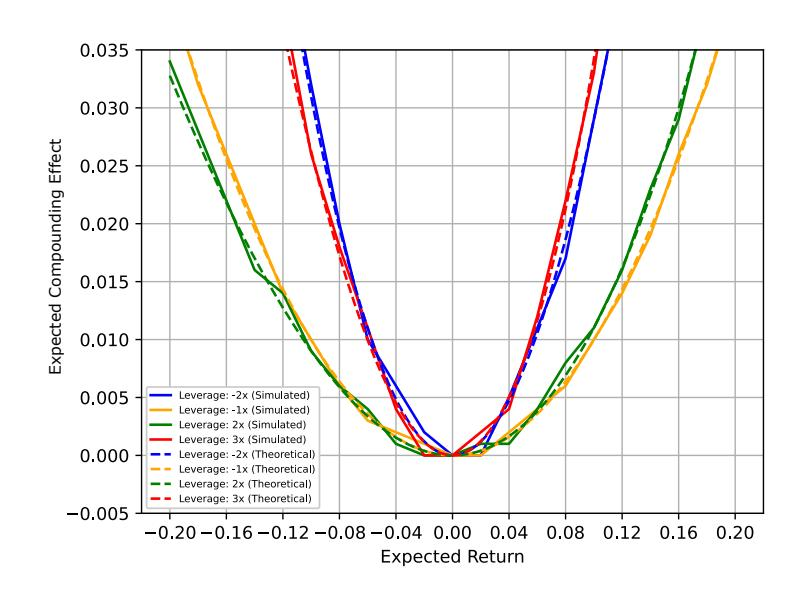

Figure 1: Simulated and Theoretical Compounding Effect E[CEn] with Different Leverage Ratios (Independent Return Case) where Theoretical E[CEn] is computed by Lemma [3.1](#page-4-1) and Simulated E[CEn] is obtained via Monte Carlo simulations. A positive effect is observed across different values of β and µ.

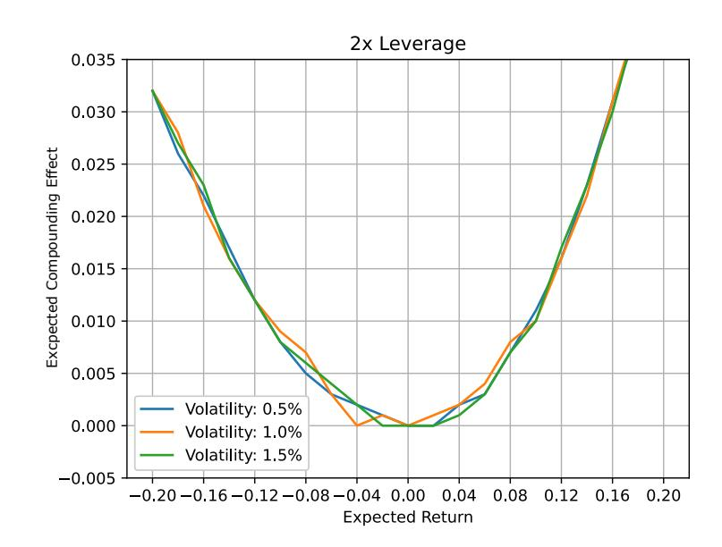

Figure 2: Compounding Effect with Different Volatility (Independent Return Case).

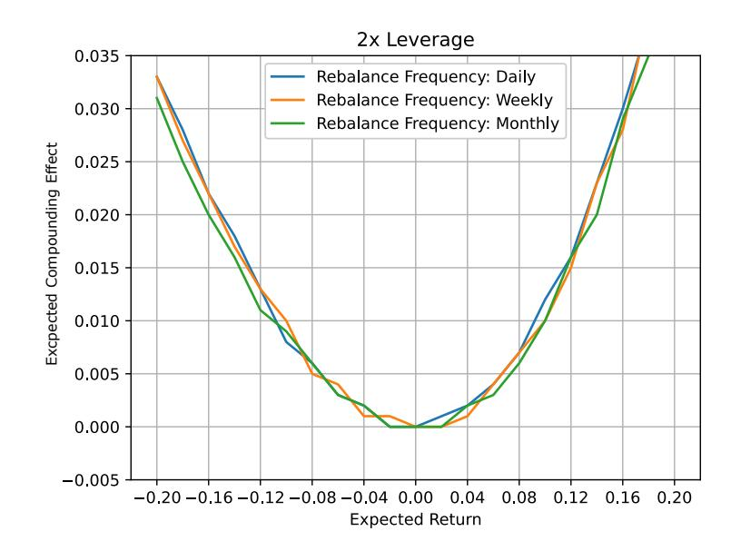

Figure 3: Compounding Effect with Different Rebalancing Frequencies (Independent Return Case).

Rebalancing Frequency Effects. Next, we analyze how the rebalancing frequency of LETFs influences the expected compounding effect by conducting simulations with daily, weekly, and monthly rebalancing intervals. Using a daily volatility level of 1%, we compare the results across different rebalancing frequencies. The results in Figure [3](#page-7-0) demonstrate that changing the rebalancing frequency does not affect the compounding effect when returns are independent. This result suggests that, in the absence of serial correlation, rebalancing frequency has minimal impact on LETF performance. Consequently, under such conditions, investors may choose less frequent rebalancing strategies to reduce transaction costs without sacrificing performance.

#### 3.1.2 Portfolio Construction Implications: Independent Return Model.

Under the frictionless independent returns benchmark, we can construct arbitrage-like portfolios by combining long positions in LETFs with short positions in the corresponding ETFs. For leverage β > 1, a portfolio with one unit of LETF and β units of short position in the underlying ETF captures the positive expected compounding effect E[CEn]. For β < 0, we substitute short ETF positions with long positions in inverse ETFs. The return of such a portfolio is

$$R_{\text{portfolio}} := R_n^{\text{LETF}} - \beta R_n^{\text{ETF}} = \mathbf{C}_n$$

and the expected return is simply E[Rportfolio] = E[CEn] > 0 under independence and µ 6= 0, as established in Lemma [3.1.](#page-4-1) This theoretical property offers potential arbitrage opportunities in markets where returns approximate independence. However, as shown in subsequent sections, return autocorrelation significantly alters compounding behavior, and thus the profitability of such strategies is highly regime-dependent. See also [Rappoport W and Tuzun](#page-27-14) [\(2018\)](#page-27-14) for a empirical evidence that ETF arbitrage may be less effective under illiquid condition.

#### 3.2 Serially Correlated Returns

We now extend our analysis to the case of serially correlated returns, where market dynamics exhibit short-term trends or reversals. To capture the temporal dependence, we begin with an autoregressive process of order 1 (AR(1)) model.

#### 3.2.1 Returns with AR(1) Model.

Specifically, we model the returns Xt using an AR(1) process: Xt = c + φXt−1 + εt with zero intercept c = 0, mean-zero innovation E[εt ] = 0, and constant variance var(εt) = σ 2 > 0, and εt are independent of Xt . Moreover, we assume E[Xt ] = 0 and E[XtXt−1] = φ σ 1−φ2 , where |φ| < 1. This setup reflects scenarios where returns exhibit serial correlation, either positive (momentum) or negative (mean reversion), which can significantly alter the compounding effect compared to the independent return case. The following lemma indicates that the expected compounding effect depends on the sign of the autocorrelation coefficient φ.

Lemma 3.2 (Compounding Effect for AR(1) Return Model). Let β ∈ Z \ {0, 1} be the leverage ratio, and let {Xt}t≥1 follow an AR(1) model. Suppose there exists a constant m ∈ (0, 1) such that P(|Xt | < m) = 1 for all t = 1 . . . , n. Then, the following statements hold:

- (i) If φ > 0, then E[CEn] > 0.
- (ii) If φ < 0, then E[CEn] < 0.

Proof. See Appendix [A.2.](#page-30-0)

Remark 3.2. Lemma [3.2](#page-8-0) establishes that short-term serial dependence—specifically, positive or negative autocorrelation—significantly influences LETF performance. When returns exhibit positive autocorrelation, positive correlation amplifies returns aligned with the prevailing trend, thereby amplifying gains. In contrast, negative autocorrelation induces a mean-reverting pattern that misaligns rebalancing with price movements, leading to a performance drag due to buying high and selling low.

While the AR(1) model suggests that φ > 0 leads to LETF outperformance and φ < 0 leads to underperformance, this relationship weakens in the presence of volatility clustering. As we will see in Section [3.2.4,](#page-12-0) the AR(1)-GARCH(1,1) model reveals that volatility persistence dominates, reducing the predictive power of φ in real-world markets.

#### 3.2.2 Monte Carlo Simulations with AR(1) Model.

In this section, we simulate how LETF performance varies with different values of AR coefficient φ, using Monte Carlo simulations. Specifically, we generate 10, 000 sample paths of daily returns over a one-year horizon and examine how the expected compounding effect E[CEn] varies across a range of AR coefficients with φ ∈ [−0.9, 0.9].

Compounding Effect with Various Leverage Ratios. Figure [4](#page-9-0) demonstrates the impact of different AR coefficients φ on the expected compounding effect E[CEn] across various combinations

of LETFs. Unlike the independent return case, where the expected compounding effect is positive, the AR(1) structure induces sign dependence: For φ > 0 (momentum-driven markets), the expected compounding effect is positive, enhancing LETF performance. Conversely, the expected compounding effect becomes negative for φ < 0 (mean-reverting markets), indicating performance drag due to return reversals. This observation highlights the critical role of return dynamics in determining LETF performance and the necessity of accounting for temporal correlation when evaluating LETF strategies.

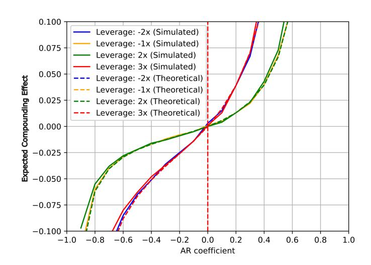

Figure 4: Simulated and Theoretical Compounding Effect with Different Leverage Ratio β. (AR(1) Returns where theoretical E[CEn] is computed by Lemma [3.1](#page-4-1) and simulated E[CEn] is obtained via Monte Carlo simulations with 10, 000 sample paths for each φ.)

Compounding Effect with Different Levels of Volatility. We examine how volatility modulates the expected compounding effect in the presence of serial correlation among returns. As shown in Figure [5,](#page-10-0) increased volatility amplifies the expected compounding effect when the AR coefficient φ > 0, reflecting enhanced return potential under momentum-driven market conditions. In such scenarios, LETFs benefit from larger price movements, as rebalancing adjustments amplify returns in the direction of the trend. However, when the positive correlation weakens, increased volatility introduces greater randomness, reducing the effectiveness of rebalancing.

Conversely, when φ < 0, corresponding to mean-reverting markets, higher volatility exacerbates return fluctuations and induces performance drag. Rebalancing in this regime amplifies exposure during losses and suppresses it during recoveries, generating a pronounced negative compounding effect. These findings highlight the dual role of volatility: while it can enhance LETF performance in trending markets, it poses significant risks in mean-reverting environments.

Compounding Effect with Varying Rebalancing Frequencies. We examine how rebalancing frequency impacts the compounding effect under AR(1) return model. We simulate daily, weekly, and monthly rebalancing intervals. The results, presented in Figure [6,](#page-11-0) indicate that when the AR coefficient φ is positive (indicating momentum-driven markets), portfolios with more frequent rebalancing exhibit a stronger positive compounding effect. This outcome shows the importance

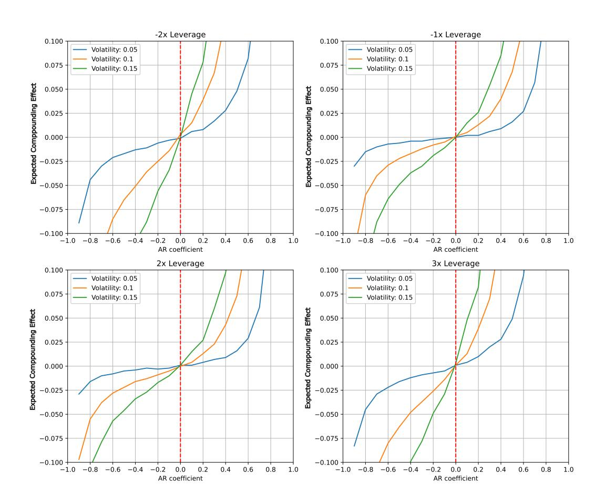

Figure 5: Expected Compounding Effect with Different Volatility (AR(1) Returns).

of timely rebalancing in capturing upward trends, as daily rebalancing allows LETFs to efficiently capitalize on market movements.

In contrast, when the AR coefficient is negative (mean-reverting markets), frequent rebalancing becomes detrimental, leading to a cycle of buying high and selling low. Interestingly, extending the rebalancing interval to a week reduces the negative compounding effect, while monthly rebalancing nearly eliminates it. These results suggest that in oscillating markets, less frequent rebalancing can mitigate performance drag, providing a strategic advantage to investors who choose LETFs with longer rebalancing intervals.

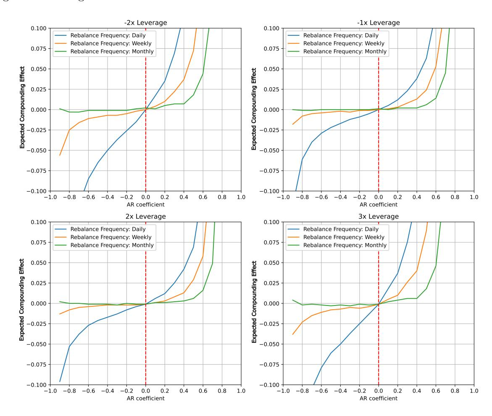

Figure 6: Expected Compounding Effect with Different Rebalancing Frequencies (AR(1) Returns.)

### 3.2.3 Portfolio Construction Implications: AR(1) Model.

Under AR(1) dynamics, arbitrage-like constructions, as seen in Section [3.1.2,](#page-7-1) analogous to the independent case may persist when the AR coefficient φ > 0 (momentum regime), as established in Lemma [3.2.](#page-8-0) However, when φ < 0 such portfolios exhibit negative expected compounding, making the strategy counterproductive.

#### 3.2.4 Returns with AR-GARCH Models.

We now extend our analysis from synthetic return models to an empirically calibrated AR-GARCH model. The preceding sections considered independent returns and AR(1) returns with controlled parameters to isolate key drivers of the compounding effect. Here, we adopt a more realistic framework by estimating model parameters directly from historical data.

Rather than conducting parameter sweeps, we estimate parameters via the maximum likelihood method using daily returns for SPY and LETFs, then assess their implications for the compounding effect through Monte Carlo simulation. Let Xt represent daily returns. A general ARMA(p, q)- GARCH(r, s) structure is given by:

$$\begin{aligned} X_t &= \mu + \sum_{i=1}^p \phi_i X_{t-i} + \sum_{j=1}^q \theta_j \epsilon_{t-j} + \epsilon_t, \\ \epsilon_t &= \sigma_t z_t, \quad z_t \sim \mathcal{N}(0, 1), \\ \sigma_t^2 &= \omega + \sum_{i=1}^r \alpha_i \epsilon_{t-i}^2 + \sum_{j=1}^s \beta_j \sigma_{t-j}^2. \end{aligned}$$

For tractability and empirical relevance, we adopt the AR(1)-GARCH(1,1) specification:

$$\begin{aligned} X_t &= \mu + \phi X_{t-1} + \epsilon_t, \\ \sigma_t^2 &= \omega + \alpha \epsilon_{t-1}^2 + \beta \sigma_{t-1}^2. \end{aligned}$$

Our empirical results reveal that, under AR(1)-GARCH(1,1), the dominant driver of LETF performance is volatility persistence, as captured by the sum α+β, rather than return autocorrelation. While the AR(1) coefficient φ remains statistically significant, its impact on LETF performance is diminished by the presence of volatility clustering.

Indeed, we fit the AR(1)-GARCH(1,1) model to historical daily returns for SPY and several LETFs (SSO, SPXL, SDS, SH[\)](#page-26-6) [using](#page-26-6) [maximum](#page-26-6) [likelihood](#page-26-6) [estimation](#page-26-6) [\(MLE\),](#page-26-6) [see](#page-26-6) Casella and Berger [\(2024\)](#page-26-6). The data ranges from February 2010 to December 2023. The estimation results, reported in Table [1,](#page-12-1) indicate mild mean-reversion (negative AR(1) coefficients) and strong volatility clustering, with significant GARCH parameters.

Table 1: AR(1)-GARCH(1,1) Parameter Estimates for ETFs and LETFs

| ETF      |         | µ (Const.) |                 |               | AR(1) | φ        |          |     | ω        |        |     | α        |        |     | β        |
|----------|---------|------------|-----------------|---------------|-------|----------|----------|-----|----------|--------|-----|----------|--------|-----|----------|
| SPY      | 0.0918  | ∗∗∗        | (0.0130)        | -0.0490       | ∗∗∗   | (0.0188) | 0.0357   | ∗∗∗ | (0.0071) | 0.1747 | ∗∗∗ | (0.0221) | 0.7969 | ∗∗∗ | (0.0212) |
| SSO      | 0.1674  | ∗∗∗        | (0.0259)        | -0.0433       | ∗∗    | (0.0191) | 0.1434   | ∗∗∗ | (0.0286) | 0.1786 | ∗∗∗ | (0.0223) | 0.7939 | ∗∗∗ | (0.0211) |
| SPXL     | 0.2413  | ∗∗∗        | (0.0389)        | -0.0384       | ∗∗    | (0.0191) | 0.3268   | ∗∗∗ | (0.0634) | 0.1805 | ∗∗∗ | (0.0220) | 0.7923 | ∗∗∗ | (0.0208) |
| SDS      | -0.1973 | ∗∗∗        | (0.0260)        | -0.0483       | ∗∗∗   | (0.0187) | 0.1338   | ∗∗∗ | (0.0280) | 0.1760 | ∗∗∗ | (0.0212) | 0.7976 | ∗∗∗ | (0.0209) |
| SH       | -0.0975 | ∗∗∗        | (0.0130)        | -0.0487       | ∗∗∗   | (0.0187) | 0.0340   | ∗∗∗ | (0.0069) | 0.1770 | ∗∗∗ | (0.0220) | 0.7963 | ∗∗∗ | (0.0207) |
| Standard | errors  |            | in parentheses; | significance: |       | ∗∗∗      | p < 0 01 | and | ∗∗ p <   | 0 05   |     |          |        |     |          |

Monte Carlo Simulation and Compounding Effect. We use the estimated AR(1)-GARCH(1,1) model parameters to simulate 10,000 return paths for SPY and its leveraged counterparts over a one-year horizon (252 trading days). From these simulations, we rigorously quantify the compounding effect:

$$\text{CE}_{252} = \left( \prod_{t=1}^{252} (1 + \beta X_t) - 1 \right) - \beta \left( \prod_{t=1}^{252} (1 + X_t) - 1 \right), \quad (3)$$

where β denotes the ETF leverage ratio and Xt denotes simulated daily returns of SPY. The results from these comprehensive simulations are summarized in Table [2.](#page-13-0) Specifically, the table demonstrates significant compounding effects that become larger as leverage increases. We see that volatility clustering affects the performance of LETFs, producing consistent deviations from the stated leverage multiples, confirming the importance of explicitly modeling volatility and serial dependence in the model.

Table 2: Simulated Compounding Effects Using AR(1)-GARCH(1,1) for SPY and Its Associated LETFs

| LETF | Ticker ( β ) | Expected Compounding Effect | Standard Deviation |
|------|--------------|-----------------------------|--------------------|
| SSO  | (2x)         | 0.0744                      | 0.1844             |
| SPXL | (3x)         | 0.2443                      | 0.6383             |
| SDS  | (-2x)        | 0.1664                      | 0.2756             |
| SH   | (-1x)        | 0.0597                      | 0.1063             |

Autocorrelation Versus Volatility Clustering. While the AR(1) coefficients estimated in Table [1](#page-12-1) are statistically significant, their magnitudes are modest compared to the strong persistence exhibited in the GARCH terms (i.e., high values of α + β). This suggests that, in empirical return dynamics, volatility clustering exerts a more dominant influence on compounding effects than return autocorrelation alone.

However, this does not contradict our theoretical findings. Instead, it shows that the relative impact of autocorrelation versus volatility varies by market regime and time scale. Specifically, in low-volatility environments, autocorrelation dominates, see Section [3.2.2,](#page-8-1) whereas in high-volatility periods with clustering, compounding is more sensitive to volatility shocks.

This interplay implies that the predictive power of autocorrelation diminishes in the presence of highly persistent volatility, as shown in our simulations under the AR(1)-GARCH(1,1) framework. A full decomposition of these effects remains an important direction for future work. In summary, autocorrelation effects govern compounding behavior in stable regimes, whereas in highly persistent volatility regimes, volatility clustering may overshadow autocorrelation-induced deviations from LETF targets.

Additional Robustness Test: QQQ and Its Associated LETFs. To test the robustness of our findings, we expand our empirical analysis beyond the S&P 500 ETF (SPY) to the NASDAQ-100 ETF (QQQ) and its leveraged counterparts. Given that QQQ tracks a more volatile technologyfocused index, this serves as a stress test for our theoretical framework. We apply the same AR(1)- GARCH(1,1) estimation and Monte Carlo simulations to assess whether LETFs on QQQ exhibit similar compounding effects as those based on SPY. The result is summarized in Table [3.](#page-14-0) The larger compounding effect observed for QQQ-based LETFs compared to SPY-based LETFs can be attributed to QQQ's historically higher realized volatility. Since volatility drag increases nonlinearly with volatility, this leads to more pronounced deviations in QQQ-based LETFs.

The results above suggest that autocorrelation-driven effects (trend-following benefits or meanreverting losses) might be weaker in markets where volatility clustering is strong. While our findings hold under AR(1)-GARCH(1,1) dynamics, future work could explore alternative specifications, such as regime-switching or rough volatility models, to further validate the generality of our results.

Table 3: Simulated Compounding Effects Using AR(1)-GARCH(1,1) for QQQ and Its Associated LETFs

| LETF | Ticker ( β ) | Mean Compounding Effect | Standard Deviation |
|------|--------------|-------------------------|--------------------|
| QLD  | (2x)         | 0.1206                  | 0.2564             |
| TQQQ | (3x)         | 0.4027                  | 0.9647             |
| QID  | (-2x)        | 0.2483                  | 0.3659             |
| SQQQ | (-3x)        | 0.4560                  | 0.6313             |

#### 3.2.5 Portfolio Construction Implications: AR-GARCH Model.

In the AR-GARCH setting, the presence of volatility clustering diminishes the predictive power of short-term autocorrelation. While simulations suggest positive compounding effect under estimated parameters, the sign of E[CEn] is not guaranteed in theory. Therefore, arbitrage-like portfolios based on compounding asymmetry require careful calibration to prevailing volatility and autocorrelation regimes.

#### 3.3 Compounding Effect for Continuous-Time Model

This section examines a continuous-time regime-switching model. Let St be the ETF price process that evolves according to the regime-dependent geometric Brownian motion, see [Di Masi et al.](#page-27-15) [\(1995\)](#page-27-15), i.e., with S0 > 0,

$$dS_t = \mu_{Z_t} S_t dt + \sigma_{Z_t} S_t dW_t$$

where {Zt}t≥0 ∈ {1, 2, . . . , M} is a continuous-time Markov chain with generator matrix Q = (Qij )1≤i,j≤M, Zt governs both the drift µZt and volatility σZt in each regime, and {Wt}t≥0 is the Wiener process on a filtered probability space (Ω, F, P) with filtration Ft . We further assume that Z(·) and W(·) are independent. With S0 > 0, the solution of St is given by

$$S_t = S_0 \exp \left( \int_0^t \left( \mu_{Z_s} - \frac{1}{2} \sigma_{Z_s}^2 \right) ds + \int_0^t \sigma_{Z_s} dW_s \right).$$
 (4)

For an LETF with leverage ratio β ∈ Z \ {0}, the corresponding price dynamics, denoted by Lt , can be derived from the underlying ETF price St as:

$$\frac{dL_t}{L_t} = \beta \frac{dS_t}{S_t} - f dt. \quad (5)$$

This formulation reflects how LETFs magnify the returns of their underlying ETFs by a fixed leverage factor β. Additionally, the LETF price dynamics [\(5\)](#page-14-1) with leverage β ∈ Z\ {0} has solution

---

$$L_t = L_0 \exp \left( \int_0^t \left( \beta \mu_{Z_s} - \frac{1}{2} \beta^2 \sigma_{Z_s}^2 \right) ds - f t + \beta \int_0^t \sigma_{Z_s} dW_s \right). \quad (6)$$

The derivation of Equation [\(6\)](#page-15-0) is relegated to Appendix [A.3.](#page-31-0)

Remark 3.3. (i) The source of autocorrelation is the persistence of the Markov state Zt : If P(Zt+1 = Zt) > 1/2, then the return process exhibits positive autocorrelation. Negative autocorrelation can be generated by alternating regimes (e.g., mean-reversion via switching between up/down trends). (ii) The continuous-time model implicitly assumes instantaneous and frictionless rebalancing, so that leverage is continuously maintained at level β. This differs from discrete-time implementations where rebalancing occurs on daily or longer intervals. In practice, continuous rebalancing is unachievable; however, the model provides a theoretical upper bound for compounding effects.

Theorem 3.1 (No Intrinsic Volatility Drag in Expectation). Let β ∈ Z \ {0} denote the leverage ratio, and consider the continuous-time returns of an ETF and a corresponding LETF, denoted by RETF t and R LETF,β t , respectively. Then, the expected compounding effect can be approximated by

$$\mathbb{E}[\mathbf{CE}_t] \approx \sum_{j=1}^M \pi_j(t) [\exp((\beta\mu_j - f)t) - \beta \exp(\mu_j t)] + (\beta - 1). \quad (7)$$

where πj (t) := E h t R t 0 1{Zs=j}dsi for each j = 1, . . . , M.

Proof. See Appendix [A.3.](#page-31-0)

Remark 3.4. (i) Equation [\(7\)](#page-15-1) becomes exact in the limit of constant regime, i.e., when Zt = j for all t ∈ [0, T]; see Corollary [3.1](#page-16-0) to follow. More generally, it serves as a first-order approximation assuming that regime switches are relatively infrequent over the horizon [0, t], and that Z and W are independent. In this case, the expected occupation measure πj (t) reflects the time-averaged regime weights and provides a tractable means of interpreting the compounding effect. (ii) When Zt fluctuates frequently, the approximation becomes less accurate. Nevertheless, the representation in [\(7\)](#page-15-1) offers a useful analytical insight into how compounding varies with regime dominance.

#### 3.3.1 Three-Regimes Case

. Let β ∈ Z \ {0} denote the leverage ratio, f ≥ 0 the fixed expense fee, and let µj ∈ R denote the drift in regime j ∈ {1, 2, 3}, characterized as follows:

- Regime j = 1: Trending Up (µ1 > 0)
- Regime j = 2: Trending Down (µ2 < 0)

- Regime j = 3: Oscillating (Mean-Reverting), where µ3 ≈ 0 and σ 2 3 ≫ |µ3|

In Regime 3, although µ3 ≈ 0, the volatility σ3 is large, leading to substantial pathwise fluctuation. Let πj (t) := E h 1 t R t 0 1{Zs=j}dsi denote the occupation measure of regime j over the interval [0, t], and define the regime-specific compounding kernel:

$$\Phi_j(t; \beta, f) := \exp((\beta \mu_j - f)t) - \beta \exp(\mu_j t).$$

Then, the expected compounding effect is approximated by:

$$\mathbb{E}[\mathbf{CE}_t] \approx \sum_{j=1}^3 \pi_j(t) \Phi_j(t; \beta, f) + (\beta - 1).$$

Theorem 3.2 (Sign of Expected CE under Regime Switching). Let β ∈ Z \ {0} and f ≥ 0 be fixed, and suppose (µ1, µ2, µ3) are given constants with µ1 > 0, µ2 < 0, and µ3 ≈ 0. Then the sign of E[CEt ] is determined entirely by the regime occupation vector π(t) = (π1(t), π2(t), π3(t)). Specifically:

- If P3 j=1 πj (t)Φj (t; β, f) > 1 − β, then E[CEt ] > 0.
- If P3 j=1 πj (t)Φj (t; β, f) < 1 − β, then E[CEt ] < 0.
- If P3 j=1 πj (t)Φj (t; β, f) = 1 − β, then E[CEt ] = 0.

Proof. See Appendix [A.3.](#page-31-0)

Corollary 3.1 (Nonnegative Compounding Effect in Single Regime). Let β ∈ Z\ {0, 1} and Zt ≡ j be constant, i.e., the process remains in a single regime. Then for any µj ∈ R, f = 0, and all t ≥ 0, we have:

$$\mathbb{E}[\mathbf{C}_{\mathbf{t}}] = \exp(\beta \mu_{\mathbf{t}}) - \beta \exp(\mu_{\mathbf{t}}) + (\beta - 1) \geq 0$$

with equality if and only if t = 0 or µj = 0 or β = 1.

Proof. See Appendix [A.3.](#page-31-0)

Remark 3.5 (Compounding Effect Under Regime Switching). (i) In a regime-switching model where πj (t) varies over time and no single regime dominates, the E[CEt ] may be negative even though each Φj (t; β, f) ≥ 0 in isolation (as shown in the corollary for f = 0). This occurs because regime mixing destroys the directional coherence necessary for compounding to accumulate effectively. (ii) While GARCH models account for conditional heteroskedasticity, regime-switching models capture drift and volatility persistence via state dynamics. Volatility clustering in AR-GARCH is mimicked in our model by allowing high-volatility states with persistent occupation probabilities. Hence, the regime-switching framework can subsume AR-GARCH-like behavior when transition rates are sufficiently sticky.

#### 3.3.2 Portfolio Construction Implications: Regime Switching Model/

In the continuous-time regime-switching model, expected compounding effect is a function of regime occupation weights πj (t). Arbitrage-like portfolios, as seen in Section [3.1.2,](#page-7-1) may yield positive expected returns when the process spends significant time in trending regimes with positive drift. However, extended periods in oscillating or high-volatility regimes may negate the compounding benefit. Thus, strategy effectiveness depends critically on regime persistence

# 4 Empirical Studies

This section empirically examines the compounding effect of LETFs using historical data from the SPDR S&P 500 ETF (Ticker: SPY) and the Nasdaq-100 ETF (Ticker: QQQ) under varying market conditions. We aim to validate our theoretical findings that LETFs outperform in trending markets and underperform in mean-reverting markets due to volatility.

## 4.1 Hypotheses and Empirical Strategy

To rigorously test our theoretical predictions, we formulate the following hypotheses:

H1 (Trending Markets): LETFs exhibit a positive compounding effect in strongly trending markets, regardless of direction (e.g., Financial Crisis, Post-Crisis Recovery).

H2 (Mean-Reverting Markets): LETFs exhibit a negative compounding effect in oscillating or mean-reverting markets, as frequent rebalancing amplifies losses (e.g., Sideways Markets).

H3 (Volatility Impact): The compounding effect is stronger for higher leverage ratios (e.g., β = ± 3), with larger deviations in high-volatility environments.

To test these hypotheses, we analyze LETF performance across distinct market regimes and compare theoretical with empirical compounding effects. We begin with simulated, synthetic LETF returns and then compare them to realized returns from actual LETF products, adjusting for realworld frictions such as fees and tracking errors.

# 4.2 Market Regimes and Compounding Effects

Below, we focus on six key periods that capture diverse market regimes: the financial crisis (October 2007 to March 2009), its subsequent post-crisis recovery (April 2009 to March 2013), a period of sideways market (February 2014 to September 2015), the COVID-19 pandemic (February 2020 to March 2020), the post-COVID recovery (April 2020 to December 2021), and the 2022 bear market. Each timeframe represents a different market phase, allowing us to assess how LETFs behave under sharply declining, recovering, or stagnant markets.

## 4.2.1 Theoretical Compounding Effects via Synthetic LETFs.

Table [4](#page-19-0) presents theoretical compounding effects for synthetic LETFs. Here, theoretical volatility refers to the effect of synthetic LETFs constructed using the benchmark ETFs SPY and QQQ with different leverage ratios β ∈ {−3, −2, −1, 2, 3}, assuming perfect replication without tracking error or fees. Later in this section, we will compare this with the empirical compounding effect, computed by using the actual LETFs data.

The financial crisis (October 2007 to March 2009) and the subsequent post-crisis recovery (April 2009 to March 2013) provide contrasting phases of sharp decline and sustained growth. During the crisis, the S&P 500 index lost more than 50% of its value, falling from over 1500 to below 700 points. In response, the Federal Reserve introduced quantitative easing, fostering a low-interest-rate environment that gradually fueled economic recovery. By 2013, the index had fully recovered to pre-crisis levels. As shown in Table [4,](#page-19-0) positive-leverage synthetic LETFs exhibit positive compounding effects in both recovery periods, particularly strong for β = 3. For inverse LETFs (β < 0), the compounding effects during the financial crisis are predominantly negative for QQQ, while SPY shows mixed results with β = −1 exhibiting a small positive compounding effect, but negative effects for β = −2 and β = −3. This suggests that LETFs tend to outperform expectations in strongly trending markets, making them attractive for trend following strategies.

However, in mean-reverting markets, the effects differ by market regime. During the Sideways Market period, positive-β synthetic LETFs consistently show negative compounding effects for both ETFs. During the COVID-19 pandemic period, QQQ exhibits negative compounding effects across all leverage ratios, while SPY shows predominantly negative effects with a negligible positive exception for β = 3. The compounding effect is generally strongest in magnitude for highly leveraged LETFs (β = ±3) and becomes more pronounced in high-volatility environments. The robustness check using QQQ confirms these findings, with stronger deviations due to sector volatility.

These results largely support Hypothesis H1: In upward-trending regimes (2009–13, 2020– 21), positive-β synthetic LETFs exhibit consistently positive compounding effects. For downwardtrending regimes (2007–09), with positive-β LETFs showing positive compounding effects as expected, but inverse LETFs showing mixed results that partially support the hypothesis. The data also strongly confirms Hypothesis H2: In the Sideways Market period, positive-β LETFs for both ETFs exhibit negative compounding effects. Finally, our findings provide clear evidence for Hypothesis H3: Across all market regimes, compounding effects are consistently largest in magnitude for the highest leverage ratios (β = ±3), with extreme deviations occurring during high-volatility periods such as the Post-COVID Recovery and Financial Crisis.

## 4.2.2 Empirical Compounding Effects and Robustness Analysis.

We now conduct our empirical analysis using historical LETF data as presented in Table [5.](#page-20-0) For the SPY ETF benchmark, we examine four leveraged ETFs: SDS (β = −2), SH (β = −1), SSO (β = +2), and SPXL (β = +3). As a robustness check, we also analyze the QQQ ETF with its corresponding leveraged ETFs: SQQQ (β = −3), QID (β = −2), QLD (β = 2), TQQQ (β = 3).

Table [5](#page-20-0) shows a consistent sign match as predicted by the theoretical synthetic LETFs case in Table [4](#page-19-0) with a certain deviation. The divergence between theoretical and empirical compounding effects increases with |β|, especially during volatile periods like the COVID-19 crash. Note that transaction costs and fees account for approximately 0.8 to 1.0 percentage points per annum of the observed underperformance, while bid-ask spreads, slippage, and tracking error might contribute additional deviations; see [Abdi and Ranaldo](#page-26-7) [\(2017\)](#page-26-7) for a simple estimation of bid-ask spread.

Table 4: Theoretical Compounding Effects of Portfolios Across Six Market Regimes

| Market Condition Benchmark | ETF -3x | -2x    | Leverage -1x | Ratio ( β ) | 2x 3x  |
|----------------------------|---------|--------|--------------|-------------|--------|
| Financial Crisis SPY       | -0.733  | -0.144 | 0.034        | 0.160       | 0.475  |
| QQQ                        | -0.883  | -0.293 | -0.035       | 0.105       | 0.346  |
| Post-Crisis Recovery SPY   | 2.344   | 1.349  | 0.515        | 0.651       | 1.863  |
| QQQ                        | 3.011   | 1.770  | 0.696        | 1.005       | 3.038  |
| Sideways Market SPY        | -0.016  | -0.016 | -0.008       | -0.018      | -0.064 |
| QQQ                        | 0.117   | 0.048  | 0.011        | -0.007      | -0.043 |
| COVID-19 Pandemic SPY      | -0.332  | -0.141 | -0.037       | -0.007      | 0.005  |
| QQQ                        | -0.398  | -0.189 | -0.057       | -0.034      | -0.076 |
| Post-COVID Recovery SPY    | 2.034   | 1.177  | 0.459        | 0.756       | 2.670  |
| QQQ                        | 2.657   | 1.561  | 0.618        | 1.047       | 3.654  |
| 2022 Bear Market SPY       | -0.251  | -0.105 | -0.027       | 0.003       | 0.011  |
| QQQ                        | -0.187  | -0.018 | 0.018        | 0.066       | 0.214  |

Note: Values in bold represent substantial outperformance (defined as greater than 1.0).

In particular, the COVID-19 pandemic onset (February 2020 to March 2020) caused a rapid 34% drop in the S&P 500 as global lockdowns disrupted economic activity. Swift monetary policy interventions enabled a quick recovery, with the index reaching new highs by late 2021. Interestingly, during the crash, inverse ETF portfolios underperformed expectations. This indicates that LETFs may fail to deliver the expected outperformance in highly volatile, mean-reverting markets due to erratic price movements. These results validate Hypothesis H3 and align with our theoretical predictions: Higher leverage ratios (β = 3) exhibit greater deviations from theoretical predictions, particularly in high-volatility environments like the COVID-19 pandemic period.

The 2022 bear market was marked by a 20% decline in S&P 500, driven by rising inflation and geopolitical uncertainties, see [Bouri et al.](#page-26-8) [\(2023\)](#page-26-8) and news released by [CNBC](#page-27-16) [\(2022](#page-27-16)). As shown in Table [5,](#page-20-0) empirical LETF performance during this period resembled that of the COVID-19 pandemic period. The compounding effect remained weak due to increased market uncertainty, and as expected, inverse LETFs continued to underperform due to tracking error accumulation.

The sideways market (2014–2015) presents a unique challenge for LETFs, as frequent rebalancing results in negative compounding effects. While most portfolios exhibited the negative compounding effects, an exception arises for SQQQ, which yielded a small positive CE. This reflects net upward drift in QQQ over the window. Frequent rebalancing leads to systematic buying high and selling low, which amplifies losses over time. Although mean-reverting markets generally induce negative compounding effects due to rebalancing drag, directional drift—even if modest—can yield a net positive effect, as observed in SQQQ during 2014–15. Thus, H2 holds in expectation but may be violated in certain drifting but volatile environments.

A robustness check using QQQ-based LETFs, see Table [5,](#page-20-0) reveals similar trends but with stronger deviations. The tech-heavy Nasdaq-100 exhibited higher volatility, leading to greater tracking errors and magnified deviations in leveraged products.

#### 4.2.3 Summary.

Tables [4](#page-19-0) and [5](#page-20-0) are directionally consistent: they agree on when CE should be positive versus negative across β and market regimes. The empirical CE is systematically smaller in magnitude (due to fees, financing costs, and imperfect tracking), and some leverage ratios do not exist for the full sample. The robustness check using QQQ confirms these findings while highlighting stronger deviations in tech-heavy indices. In summary, the empirical results support our theoretical hypotheses: H1 is confirmed: LETFs outperform in strongly trending regimes, regardless of direction, due to path-dependent compounding. H2 holds broadly but admits exceptions: While most LETFs exhibit negative compounding effects in the sideways market as predicted, inverse LETFs occasionally outperform in flat markets with sufficient directional drift, as observed with SQQQ during 2014-15. This nuance enhances our understanding of when the volatility decay hypothesis may be counterbalanced by other factors. H3 is robustly validated across all regimes: Empirical CE magnitudes scale with leverage and volatility, with the largest deviations occurring in high-volatility periods.

Table 5: Empirical Compounding Effects of Portfolios Across Six Market Regimes

| Market Condition Benchmark Financial Crisis SPY QQQ Post-Crisis Recovery SPY QQQ Sideways Market SPY | ETF − 3 × ( SQQQ ) — -1.219 — 3.189 — | Leverage − 2 × ( SDS/QID ) 0.053 -0.307 1.342 1.762 -0.021 | Ratio ( β ) and − 1 × ( SH ) -0.050 — 0.500 — -0.018 | Product 2 × ( SSO/QLD ) 0.145 0.085 0.467 0.787 -0.043 | Ticker 3 × ( SPXL/TQQQ ) — — 1.389 — -0.114 |
|------------------------------------------------------------------------------------------------------|---------------------------------------|------------------------------------------------------------|------------------------------------------------------|--------------------------------------------------------|---------------------------------------------|
| QQQ                                                                                                  | 0.112                                 | 0.041                                                      | —                                                    | -0.039                                                 | -0.096                                      |
| COVID-19 Pandemic SPY                                                                                | —                                     | -0.156                                                     | -0.039                                               | -0.015                                                 | -0.019                                      |
| QQQ                                                                                                  | -0.424                                | -0.198                                                     | —                                                    | -0.040                                                 | -0.087                                      |
| Post-COVID Recovery SPY                                                                              | —                                     | 1.173                                                      | 0.451                                                | 0.666                                                  | 2.434                                       |
| QQQ                                                                                                  | 2.656                                 | 1.557                                                      | —                                                    | 0.936                                                  | 3.370                                       |
| 2022 Bear Market SPY                                                                                 | —                                     | -0.051                                                     | -0.002                                               | -0.024                                                 | -0.014                                      |
| QQQ                                                                                                  | -0.109                                | 0.035                                                      | —                                                    | 0.051                                                  | 0.198                                       |

Note: Missing data points (—) indicate values not available for the specific ETF at the given leverage factor. For example, TQQQ wasn't launched until February 2010, so data is unavailable for the Financial Crisis period. Similarly, SPXL launched in November 2008; no continuous daily series exists for the full crisis window. Positive values indicate outperformance relative to the target multiple, while negative values indicate underperformance. Values in bold represent substantial outperformance (> 1.0).

### 4.3 Time-Varying Compounding Effect: A Rolling Window Analysis

While the preceding sections demonstrate that return autocorrelation is a key determinant of LETF performance, the evolution of this relationship over time remains to be characterized. To address this, we examine how the realized compounding effect (CE) varies across market regimes and assess its connection to short-run return persistence. Specifically, we compute 60-, 90-, and 120 day rolling-window estimates of compounding effects for a range of LETFs based on SPY and QQQ, spanning multiple leverage ratios β ∈ {−2, −1, 2, 3}.

Figures [7](#page-21-0)[–12](#page-23-0) display the rolling compounding effects from 2009 (SPY) and 2010 (QQQ) to 2024 where the shaded regions represent major market events, including oil crash (mid 2015 to early 2016), and COVID-19 crash (early 2020 to late 2021), and inflation-driven bear market (early-2022).

Several systematic patterns emerge. First, positive CE is observed during persistent upwardtrending markets—notably the post-2009 recovery, 2016–2017, and the 2020–2021 bull run—particularly for β = 2 and β = 3. In contrast, negative CE is concentrated in volatile or directionless periods, such as 2014–2015 and 2022, where rebalancing erodes returns. These patterns are consistent with the theoretical results in Section [3.](#page-4-0)

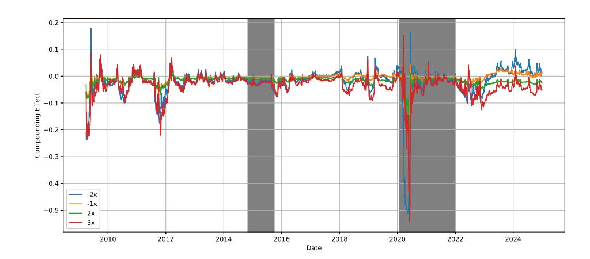

Figure 7: 60-Day Rolling Compounding Effect from 2009 to 2024 (SPY)

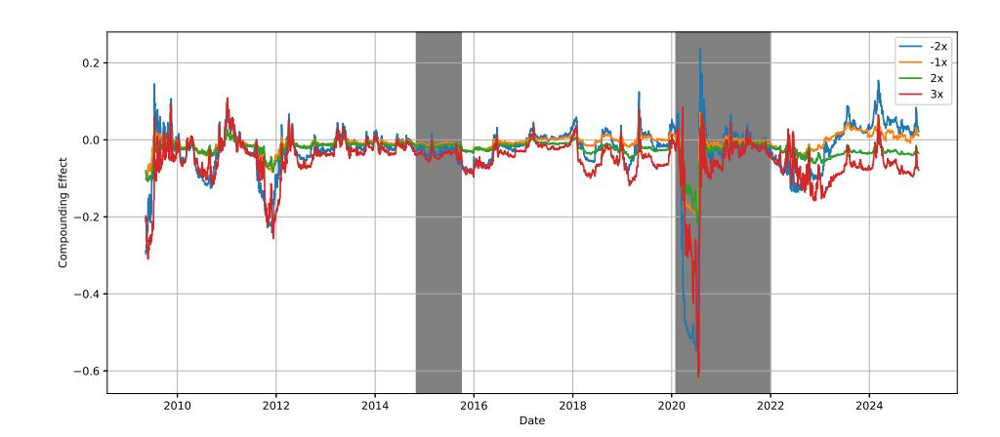

Figure 8: 90-Day Rolling Compounding Effect from 2009 to 2024 (SPY)

To examine the role of short-term momentum, we compute rolling AR(1) coefficients over the same intervals, presented in Figures [13](#page-23-1)[–18.](#page-25-0) These plots reveal fluctuations in φ, often ranging between −0.4 and +0.6. Periods with elevated AR(1) coefficients, such as 2010–2011, 2016–2017, and early 2020, correspond closely to intervals of strongly positive compounding effect. Conversely, during stretches of low or negative autocorrelation—such as late 2015 or mid-2022—compounding effects decay sharply.

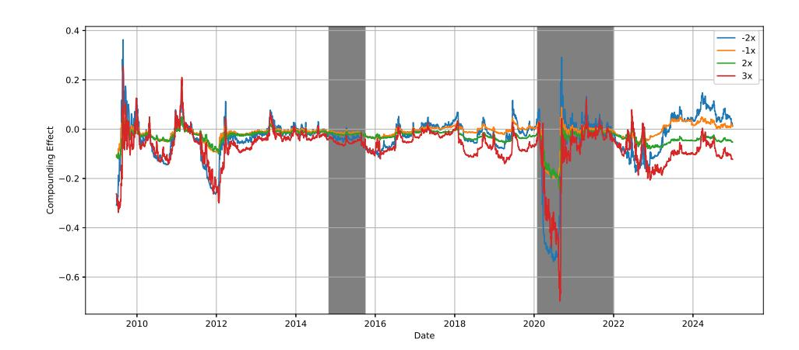

Figure 9: 120-Day Rolling Compounding Effect from 2009 to 2024 (SPY)

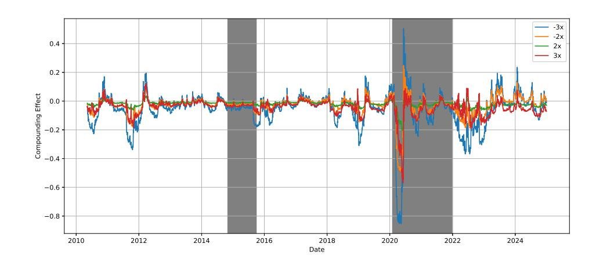

Figure 10: 60-Day Rolling Compounding Effect from 2010 to 2024 (QQQ)

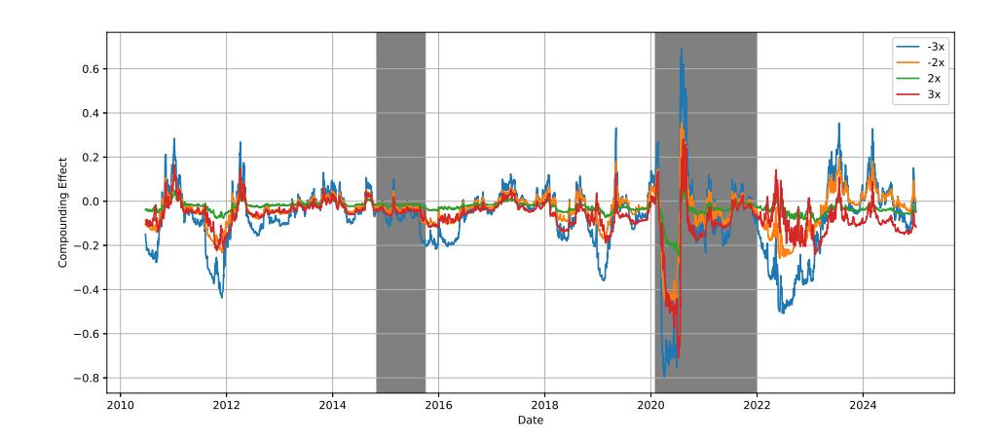

Figure 11: 90-Day Rolling Compounding Effect from 2010 to 2024 (QQQ)

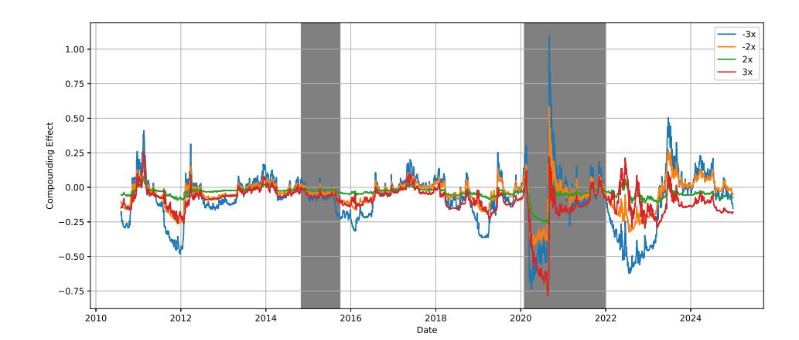

Figure 12: 120-Day Rolling Compounding Effect from 2010 to 2024 (QQQ)

Comparing SPY and QQQ, we observe that QQQ-based LETFs generally exhibit more volatile and extreme CE fluctuations, as well as higher-amplitude AR(1) dynamics. This is consistent with the higher baseline volatility of the Nasdaq-100 and more frequent regime shifts in its constituent firms. For instance, QQQ CE spikes during both the 2020 pandemic rebound and late 2021 coincide with sharp increases in φ, reinforcing the amplifying role of trend-following dynamics under high leverage.

Overall, the rolling-window analysis reveals that LETF compounding behavior is not static, but dynamically linked to the prevailing autocorrelation environment. Positive short-run autocorrelation enhances compounding gains by aligning leverage with trending returns, while mean-reverting or noisy regimes diminish performance. These empirical observations further validate the central theoretical result of this paper: return persistence is a critical driver of LETF performance beyond volatility alone.

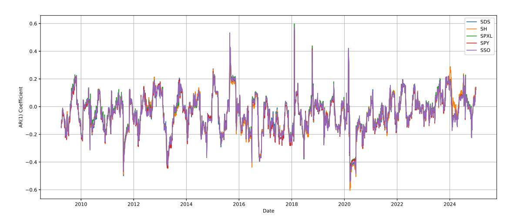

Figure 13: 60-Day Rolling AR(1) Coefficients from 2009 to 2024 (SPY)

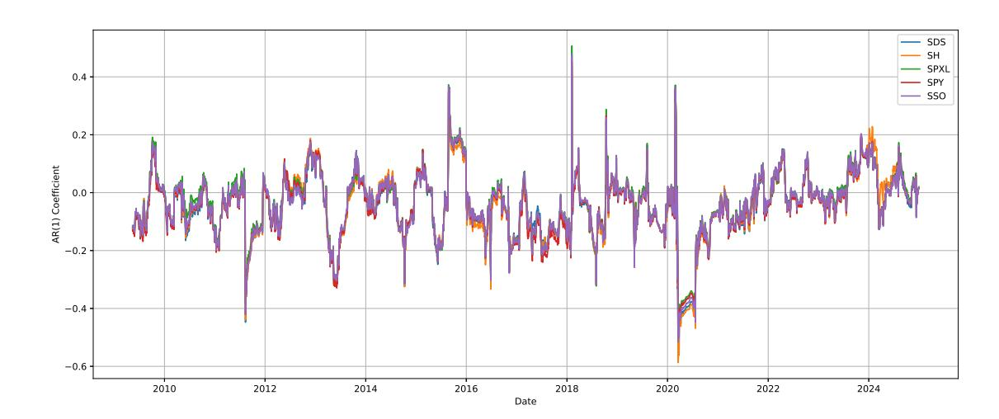

Figure 14: 90-Day Rolling AR(1) Coefficients from 2009 to 2024 (SPY)

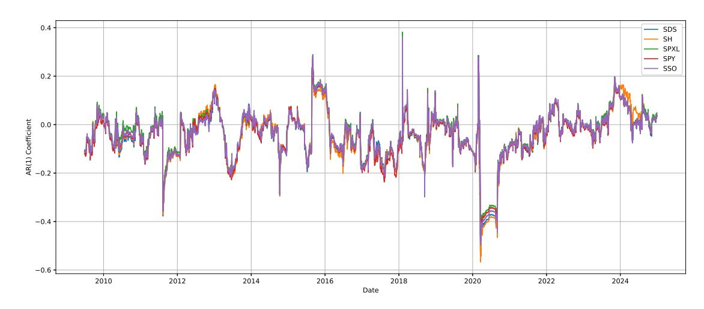

Figure 15: 120-Day Rolling AR(1) Coefficients from 2009 to 2014 (SPY)

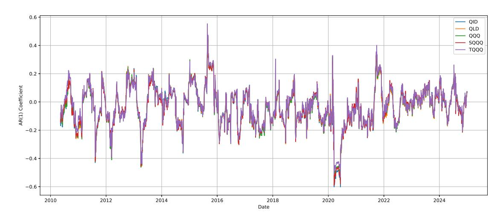

Figure 16: 60-Day Rolling AR(1) Coefficients from 2010 to 2024 (QQQ)

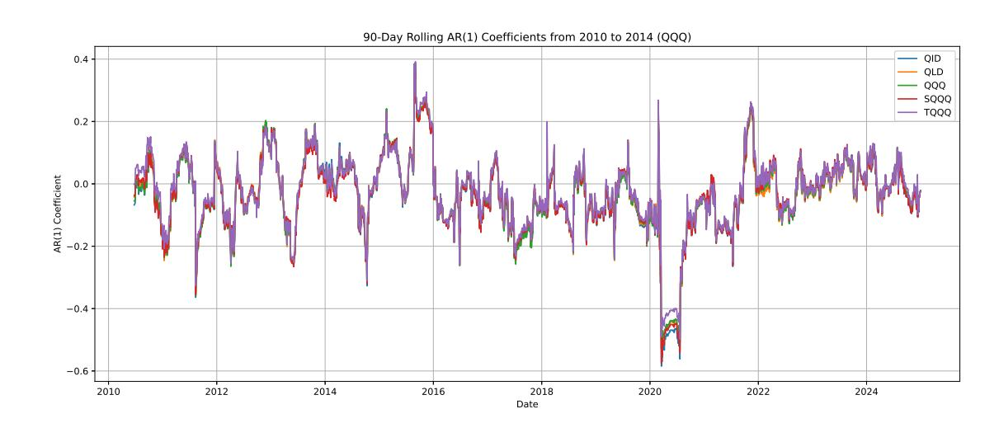

Figure 17: 90-Day Rolling AR(1) Coefficients from 2010 to 2024 (QQQ)

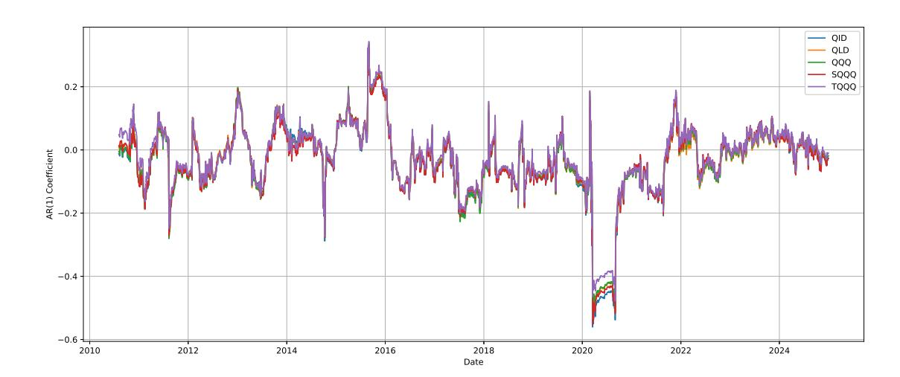

Figure 18: 120-Day Rolling AR(1) Coefficients from 2010 to 2024 (QQQ)

# 5 Concluding Remarks

This paper explores the compounding effect of LETFs under various return dynamics, volatility levels, and rebalancing frequencies. Our central finding is that return autocorrelation and return dynamics—not the volatility alone—determine whether LETFs outperform or underperform their targets. In particular, momentum improves compounding, while mean reversion undermines it, with these effects magnified under frequent rebalancing.

We develop a unified theoretical framework encompassing AR(1), AR-GARCH, and continuoustime regime-switching models. These models reveal that volatility clustering interacts with autocorrelation to shape LETF behavior, particularly under persistent shocks or regime transitions. This insight refines the conventional volatility-drag narrative by emphasizing the joint role of autocorrelation and volatility persistence.

In the benchmark environments with independent returns, LETFs tend to outperform their target multiples on average, and changes in volatility or rebalancing frequency have minimal impact. In contrast, in serially correlated markets, LETF performance is sensitive to the autocorrelation, return dynamics, and the rebalancing interval. Daily rebalancing enhances returns in trending markets, whereas weekly or monthly rebalancing mitigates losses in oscillating or mean-reverting regimes.

Empirical validation using about 20 years of SPY and QQQ data across diverse market regimes confirms these predictions. LETFs exhibit positive compounding during directional trends, but underperform in sideways markets where rebalancing erodes returns. For trend-following investors, daily-rebalanced LETFs offer superior performance. In contrast, when autocorrelation is weak or negative, longer rebalancing intervals reduce performance decay. Future work could extend this framework by incorporating rough volatility models or non-Markovian regime-switching dynamics to capture finer features of real-world return processes.

# References

- Abdi, F. and Ranaldo, A. (2017). A Simple Estimation of Bid-Ask Spreads from Daily Close, High, and Low Prices. The Review of Financial Studies, 30(12):4437–4480. Abdou, A. (2017). Accounting for Volatility Decay in Time Series Models for Leveraged Exchange Traded Funds. Available at SSRN 2980208. Avellaneda, M. and Zhang, S. (2010). Path-Dependence of Leveraged ETF Returns. SIAM Journal on Financial Mathematics, 1(1):586–603. Ben-David, I., Franzoni, F. A., and Moussawi, R. (2017). Exchange Traded Funds (ETFs). Annual Review of Financial Economics, 9:2016–22. Bouri, E., Gabauer, D., Gupta, R., and Kinateder, H. (2023). Global Geopolitical Risk and Inflation Spillovers across European and North American Economies. Research in International Business and Finance, 66:102048. Carver, A. B. (2009). Do Leveraged and Inverse ETFs Converge to Zero? ETFs and Indexing, 2009(1):144–
- 149. Casella, G. and Berger, R. (2024). Statistical Inference. CRC Press. Charupat, N. and Miu, P. (2011). The Pricing and Performance of Leveraged Exchange-Traded Funds. Journal of Banking & Finance, 35(4):966–977.

CNBC (2022). Stocks Fall to End Wall Street's Worst Year Since 2008, S&P 500 Finishes 2022 Down Nearly 20%. Available at: <https://www.cnbc.com/2022/12/29/stock-market-futures-open-to-close-news.html>. Cvitanic, J. and Zapatero, F. (2004). Introduction to the Economics and Mathematics of Financial Markets. MIT Press. Dai, M., Kou, S., Soner, H. M., and Yang, C. (2023). Leveraged Exchange-Traded Funds with Market Closure and Frictions. Management Science, 69(4):2517–2535. Di Masi, G. B., Kabanov, Y. M., and Runggaldier, W. J. (1995). Mean-Variance Hedging of Options on Stocks with Markov Volatilities. Theory of Probability & Its Applications, 39(1):172–182. Guedj, I., Li, G., and McCann, C. (2010). Leveraged and Inverse ETFs, Holding Periods, and Investment Shortfalls. The Journal of Index Investing, 1(3):45–57. Jarrow, R. A. (2010). Understanding the Risk of Leveraged ETFs. Finance Research Letters, 7(3):135–139. Leung, T. and Santoli, M. (2016). Leveraged Exchange-Traded Funds: Price Dynamics and Options Valuation. Springer. Lu, L., Wang, J., and Zhang, G. (2009). Long Term Performance of Leveraged ETFs. Available at SSRN 1344133. Malkiel, B. G. and Radisich, A. (2001). The Growth of Index Funds and the Pricing of Equity Securities. Journal of Portfolio Management, 27(2):9. Rappoport W, D. E. and Tuzun, T. (2018). Arbitrage and Liquidity: Evidence from a Panel of Exchange Traded Funds. Available at SSRN 3281384. Tang, H. and Xu, X. E. (2013). Solving the Return Deviation Conundrum of Leveraged Exchange-Traded Funds. Journal of Financial and Quantitative Analysis, 48(1):309–342. Trainor, W. (2012). Volatility and Compounding Effects on Beta and Returns. The International Journal of Business and Finance Research, 6(4):1–11. Trainor, W. (2017). Leveraged Exchange-Traded Funds: When Four is Not More. Journal of Investment Consulting, 18(1):31–40. Trainor Jr, W. J. and Baryla Jr, E. A. (2008). Leveraged ETFs: A Risky Double That Doesn't Multiply by Two. Journal of Financial Planning, 21(5). Trainor Jr, W. J. and Carroll, M. G. (2013). Forecasting Holding Periods for Leveraged ETFs using Decay Thresholds: Theory and Applications. Journal of Financial Studies & Research, 2013:1. U.S. Securities and Exchange Commission (2009). Leveraged and Inverse ETFs: Specialized Products with Extra Risks for Buy-and-Hold Investors. Investor Alert. Available at: <http://www.sec.gov/investor/pubs/leveragedetfs-alert.htm>.

# A Technical Proofs

This appendix collects some technical proofs of the paper.

# A.1 Proofs in Section [2](#page-2-0)

Proof of Theorem [2.1.](#page-3-1) We begin by noting that the ETF's daily return is XETF t = Xt and LETF's daily return is to include fees and tracking error: XLETF t = βXt − f + et , where β ∈ Z \ {0} is the leverage ratio, f is a daily fee (incorporating expense and transaction costs), and et is a tracking

error with |et | ≤ M and E[et ] = E[etXs] = E[etes] = 0 for t 6= s. Assume also |Xt |, |f| ≤ M, for some M ≪ 1. Define:

$$A_t := \beta X_t - f + e_t, \quad B_t := X_t.$$

Hence, the compounding effect is: CEn := RLETF n − βRETF n where the cumulative returns over n days are:

---

$$R_n^{\text{LETF}} = \prod_{t=1}^n (1 + A_t) - 1$$
 and  $R_n^{\text{ETF}} = \prod_{t=1}^n (1 + B_t) - 1$ .

Using the fact that Qn t=1(1 + Zt) = 1 +Pn t=1 Zt + P 1≤t<s≤n ZtZs + Rn with E[|Rn|] ≤ C ′n 3M3 for some C ′ > 0, it follows that RLETF n and RETF n satisfies

$$R_n^{\text{LETF}} = \sum_{t=1}^n A_t + \sum_{1 \leq t < s \leq n} A_t A_s + \mathfrak{R}_n^{(A)},$$

$$R_n^{\text{ETF}} = \sum_{t=1}^n B_t + \sum_{1 \leq t < s \leq n} B_t B_s + \mathfrak{R}_n^{(B)},$$

and therefore

$$\mathbf{CE}_n = R_n^{\text{LETF}} - \beta R_n^{\text{ETF}} = \sum_{t=1}^n (A_t - \beta B_t) + \sum_{1 \leq t < s \leq n} (A_t A_s - \beta B_t B_s) + \mathfrak{R}_n, \quad (8)$$

where Rn := R (A) n − βR (B) n , and E[|Rn|] ≤ Cn3M3 for some constant C > 0 by triangle inequality. Note that the first-order term in Equation [\(8\)](#page-28-0) can be computed as follows:

$$\sum_{t=1}^n (A_t - \beta B_t) = \sum_{t=1}^n (\beta X_t - f + e_t - \beta X_t) = -nf + \sum_{t=1}^n e_t.$$

Taking expectations and using E[et ] = 0, we obtain: E [ Pn t=1(At − βBt)] = −nf. Next, for t 6= s, we expand:

---

$$\begin{aligned} A_t A_s &= (\beta X_t - f + e_t)(\beta X_s - f + e_s) \\ &= \beta^2 X_t X_s - \beta f (X_t + X_s) + f^2 + \beta X_t e_s + \beta X_s e_t - f (e_t + e_s) + e_t e_s. \end{aligned}$$

Thus, AtAs − βBtBs = β(β − 1)XtXs − βf(Xt + Xs) + f 2 + β(Xtes + Xset) − f(et + es) + etes. Taking the expectation yields

$$\mathbb{E}[A_t A_s - \beta B_t B_s] = \beta(\beta - 1)\gamma_{|t-s|} - 2\beta f\mu + f^2.$$

where the equality holds by using the facts that E[XtXs] = γ|t−s| from strict stationarity, E[et ] = E[etXs] = E[etes] = 0 for t 6= s, and µ := E[Xt ]. Summing over all 1 ≤ t < s ≤ n, we group terms by lag k = s − t, which contributes (n − k) terms per lag. This gives:

$$\mathbb{E} \left[ \sum_{1 \leq t < s \leq n} A_t A_s - \beta B_t B_s \right] = \sum_{1 \leq t < s \leq n} \mathbb{E}[A_t A_s - \beta B_t B_s] = \sum_{k=1}^{n-1} (n-k) [\beta(\beta-1)\gamma_k - 2\beta f\mu + f^2].$$

Putting everything together:

---

$$\mathbb{E}[\mathbf{CE}_n] = -nf + \sum_{k=1}^{n-1} (n-k) [\beta(\beta-1)\gamma_k - 2\beta f\mu] + \binom{n}{2} f^2 + O(n^3 M^3). \quad \square$$

Proof of Lemma [3.1.](#page-4-1) To prove the desired positivity, we proceed with a proof by induction. Firstly, for n = 1, note that E[CE1] = E h R LETF,β 1 − βRETF 1 i = [(1 + βµ) 1 − 1] − β[(1 + µ) 1 − 1] = 0. Now, assume the statement holds for n = k ≥ 1. That is, [(1 + βµ) k − 1] − β[(1 + µ) k − 1] ≥ 0, which is equivalent to (1 + βµ) k + β − 1 ≥ β(1 + µ) k . We must show that the statement holds for n = k + 1. Indeed, observe that

$$\begin{aligned} (1 + \beta\mu)^{k+1} - 1 &= (1 + \beta\mu)(1 + \beta\mu)^k - 1 \\ &= (1 + \beta\mu)[(1 + \beta\mu)^k + \beta - 1] - \beta - \beta^2\mu + \beta\mu \\ &\geq (1 + \beta\mu)[\beta(1 + \mu)^k] - \beta - \beta^2\mu + \beta\mu \end{aligned}$$

where inequality is held by invoking the inductive hypotheses. Hence, it follows that

|    ? <b>1 + <math display="block">\beta\mu</math></b> ? <math>k+1</math> - 1 ≥ (1 + $\beta\mu$ )[ $\beta(1 + \mu)^k$ ] - $\beta - \beta^2\mu + \beta\mu$ |               |
|---------------------------------------------------------------------------------------------------------------------------------------------------------------------------------------------------------------------------------------------------|---------------|
|                                                                                                                                                                                                                                      |  |
| $=(1 + \mu + (\beta - 1)\mu)[\beta(1 + \mu)^k] - \beta - \beta^2\mu + \beta\mu$                                                                                                                                                                   |               |
|                                                                                                                                                                                                                                      |  |
| $=\beta(1 + \mu)^{k+1} + \beta(\beta - 1)\mu(1 + \mu)^k - \beta - \beta^2\mu + \beta\mu$                                                                                                                                                          |               |
|                                                                                                                                                                                                                                      |  |
| $=\beta[(1 + \mu)^{k+1} - 1] + \beta(\beta - 1)\mu(1 + \mu)^k + \beta\mu(1 - \beta)$                                                                                                                                                              |               |
|                                                                                                                                                                                                                                      |  |
| $=\beta[(1 + \mu)^{k+1} - 1] + \beta\mu(\beta - 1)[(1 + \mu)^k - 1].$                                                                                                                                                                             | (9)           |

Note that if βµ(β−1)[(1+µ) k−1] ≥ 0, then we are done. Therefore, to complete the proof, it remains to prove βµ(β − 1)[(1 + µ) k − 1] ≥ 0. Set an auxiliary function f(β, µ) := βµ(β − 1)[(1 + µ) k − 1], then, we consider the following four cases:

Case 1. When β > 1 and µ ≥ 0, it follows that βµ ≥ 0, β − 1 > 0, and [(1 + µ) k+1 − 1] ≥ 0, leading to f(β, µ) ≥ 0.

Case 2. When β > 1 and µ < 0, we have βµ < 0, β − 1 > 0, and [(1 + µ) k+1 − 1] < 0, resulting in f(β, µ) > 0.

Case 3. When β ≤ −1 and µ ≥ 0, it follows that βµ ≤ 0, β − 1 < 0, and [(1 + µ) k+1 − 1] ≥ 0, which implies f(β, µ) ≥ 0.

Case 4. When β ≤ −1 and µ < 0, we obtain βµ > 0, β − 1 < 0, and [(1 + µ) k+1 − 1] < 0, leading to f(β, µ) ≥ 0 again.

Combined with the four cases above, we conclude that f(β, µ) ≥ 0 for all cases. Thus, the given statement holds for any n ∈ N and β ∈ Z \ {0, 1}, which proves that the expected compounding effect is always positive.

#### A.2 Compounding Effect for Serially Correlated AR(1) Returns

Below, we shall work with the AR(1) model for {Xt : t ≥ 1}. Let β ∈ Z \ {0, 1}. For the two-period case, we have that: (i) If φ > 0, then E[CE2] > 0 and (ii) If φ < 0, then E[CE2] < 0. To see this, we begin by noting that

$$\mathbf{CE}_2 = [(1 + \beta X_1)(1 + \beta X_2) - 1] - \beta[(1 + X_1)(1 + X_2) - 1]$$
  
 $= \beta(\beta - 1)X_1X_2.$ 

Taking the expectation on both sides yields: E[CE2] = β(β −1)E[X1X2] = β(β −1)φ σ 1−φ2 . Note that σ > 0, and for β ∈ Z \ {0, 1}, the product β(β − 1) > 0. Therefore, to determine the sign of the expected difference, it suffices to check the sign of the φ. Specifically, for φ > 0, then E[CE2] > 0. On the other hand, for φ < 0, then E[CE2] < 0. The following proof extends this result to the multi-period case.

Proof of Lemma [3.2.](#page-8-0) Given that β ∈ Z \ {0, 1}, we observe that

$$\begin{aligned} \mathbb{E}[\mathbf{CE}_n] &= \mathbb{E} \left[ \left( \prod_{i=1}^n (1 + \beta X_i) - 1 \right) - \beta \left( \prod_{i=1}^n (1 + X_i) - 1 \right) \right] \\ &= \mathbb{E} \left[ (\beta^2 - \beta) \sum_{i \neq j} X_i X_j + (\beta^3 - \beta) \sum_{i \neq j \neq k} X_i X_j X_k + \dots + (\beta^n - \beta) \sum_{i \neq j \neq \dots \neq n} X_i X_j X_k \dots X_n \right] \\ &= \mathbb{E} \left[ (\beta^2 - \beta) \sum_{i \neq j} X_i X_j + \text{higher-order terms in } X_i \right]. \end{aligned}$$

Since |Xi | < m for some m ∈ (0, 1), the first quantity dominates, and the higher-order product term is of smaller order compared to the second-order term for sufficiently small returns. Therefore, we obtain

$$\begin{aligned} \mathbb{E}[\mathbf{CE}_n] &\approx \mathbb{E} \left[ (\beta^2 - \beta) \sum_{i \neq j} X_i X_j \right] \\ &= (\beta^2 - \beta) \left( \sum_{i=1}^{n-1} \mathbb{E}[X_i X_{i+1}] + \sum_{i=1}^{n-2} \mathbb{E}[X_i X_{i+2}] + \cdots + \sum_{i=1}^1 \mathbb{E}[X_i X_{i+(n-1)}] \right), \\ &= (\beta^2 - \beta) \frac{\sigma^2}{1 - \phi^2} \left( \sum_{i=1}^{n-1} \phi + \sum_{i=1}^{n-2} \phi^2 + \cdots + \sum_{i=1}^1 \phi^{n-1} \right), \\ &= (\beta^2 - \beta) \frac{\sigma^2}{1 - \phi^2} \phi [(n-1) + (n-2)\phi + \cdots + \phi^{n-2}] \geq 0 \text{ if } \phi \geq 0 \end{aligned} \tag{10}$$

where |φ| < 1. Note that since β ∈ Z \ {0, 1}, it follows that (β 2 − β) = β(β − 1) > 0. To see inequality [\(10\)](#page-30-1), let Q := (n − 1) + (n − 2)φ + · · · + φ n−2 . Then, for sufficiently large n, E[CEn] = (β 2 − β) σ 1−φ2 φQ, it is readily verified that φQ − Q = φ + φ 2 + · · · + φ n−2 + φ n−1 − (n − 1). Therefore, for all |φ| < 1,

$$Q = \frac{n - 1 + \phi + \phi^2 + \dots + \phi^{n-2} + \phi^{n-1}}{1 - \phi} \\ = \frac{(1 - 1) + (1 - \phi) + (1 - \phi^2) + \dots + (1 - \phi^{n-2}) + (1 - \phi^{n-1})}{1 - \phi} > 0.$$

Therefore, E[CEn] ≷ 0 if φ ≷ 0.

# A.3 Compounding Effect for Continuous-Time Model

Proof of Equation [\(6\)](#page-15-0). Begin by observing that

$$\frac{dL_t}{L_t} = \beta \frac{dS_t}{S_t} - f dt = (\beta \mu_{Z_t} - f) dt + \beta \sigma_{Z_t} dW_t.$$

Given that f(Lt) := log Lt , Itˆo's Lemma states:

$$\begin{aligned} d\log(L_t) &= \left( \frac{1}{L_t} L_t (\beta \mu_{Z_t} - f) - \frac{1}{2} \frac{1}{L_t^2} (L_t^2 \beta^2 \sigma_{Z_t}^2) \right) dt + \frac{1}{L_t} L_t \beta \sigma_{Z_t} dW_t \\ &= \left( (\beta \mu_{Z_t} - f) - \frac{1}{2} \beta^2 \sigma_{Z_t}^2 \right) dt + \beta \sigma_{Z_t} dW_t. \end{aligned}$$

Hence, it has a solution

$$L_t = L_0 \exp \left( \int_0^t \left( \beta \mu_{Z_s} - \frac{1}{2} \beta^2 \sigma_{Z_s}^2 \right) ds - f t + \beta \int_0^t \sigma_{Z_s} dW_s \right)$$

and the proof is complete.

Proof of Theorem [3.1.](#page-15-2) Note that

$$\mathbb{E}[\mathbf{C}_{\mathbf{t}}] = \mathbb{E}[\exp(Y_t)] - \beta \mathbb{E}[\exp(X_t)] + (\beta - 1),$$

where Yt = R t 0 βµZs − 1 2 β 2σ 2 Zs ds − f t + β R t 0 σZs dWs and Xt = R t 0 µZs − 1 2 σ 2 Zs ds + R t 0 σZs dWs. We approximate the expectation using a regime-mixture approximation based on the occupation measure: Let πj (t) := E h 1 t R t 0 1{Zs=j}dsi for each j = 1, . . . , M. This is the expected proportion of time the process spends in regime j over [0, t]. If Zt = j, then

$$\begin{aligned} X_t^{(j)} &= \int_0^t \left( \mu_j - \frac{1}{2}\sigma_j^2 \right) ds + \int_0^t \sigma_j dW_s \\ &= \left( \mu_j - \frac{1}{2}\sigma_j^2 \right) t + \sigma_j W_t \sim \mathcal{N} \left( \left( \mu_j - \frac{1}{2}\sigma_j^2 \right) t, \sigma_j^2 t \right) \end{aligned}$$

and

$$\begin{aligned} Y_t^{(j)} &= \int_0^t \left( \beta \mu_j - \frac{1}{2} \beta^2 \sigma_j^2 \right) ds - f t + \beta \int_0^t \sigma_j dW_s \\ &= (\beta \mu_j - \frac{1}{2} \beta^2 \sigma_j^2 - f) t + \beta \sigma_j W_t \sim \mathcal{N} \left( (\beta \mu_j - \frac{1}{2} \beta^2 \sigma_j^2 - f) t, \beta^2 \sigma_j^2 t \right). \end{aligned}$$

Hence, using the moment generating function technique, it follows that

$$\mathbb{E}[\exp(X_t^{(j)}] = \exp(\mu_j t) \text{ and } \mathbb{E}[\exp(Y_t^{(j)}] = \exp((\beta \mu_j - f)t)$$

Because Zt switches between regimes over time, the full Yt is a weighted combination of regimespecific dynamics. The exact expectation E[exp(Xt)] and E[exp(Yt)] can be approximated4 as follows:

$$\mathbb{E}[\exp(X_t)] \approx \sum_{j=1}^M \pi_j(t) \cdot \mathbb{E}[\exp(X_t^{(j)})] = \sum_{j=1}^M \pi_j(t) \cdot \exp(\mu_j t)$$

$$\mathbb{E}[\exp(Y_t)] \approx \sum_{j=1}^M \pi_j(t) \cdot \mathbb{E}[\exp(Y_t^{(j)})] = \sum_{j=1}^M \pi_j(t) \cdot \exp((\beta \mu_j - f)t).$$

Therefore, the expected compounding effect is obtained:

$$\mathbb{E}[\text{CE}_t] \approx \sum_{j=1}^M \pi_j(t) [\exp((\beta \mu_j - f)t) - \beta \exp(\mu_j t)] + (\beta - 1). \quad \square$$

Lemma A.1 (Expected Occupation Measure). The expected occupation measure PM i=1 πj (t) = 1 for all t ≥ 0.

Proof of Lemma [A.1.](#page-32-0) For every fixed sample point ω ∈ Ω and any time s, the Markov chain is exactly one of the M states. Hence, for all s ≥ 0 and ω ∈ Ω, PM j=1 1{Zs(ω)=j} = 1. Hence, with the

4 In principle, one can compute E[exp(Xt)] and E[exp(Yt)] condition on given Zs = j. Then invoke the Feynman-Kac theorem to solve the resulting PDEs, e.g., see [Cvitanic and Zapatero](#page-27-17) [\(2004](#page-27-17)). However, solving the PDEs can be complex.

aid of the Fubini-Tonelli theorem, we have

$$\begin{aligned} \sum_{j=1}^M \pi_j(t) &= \sum_{j=1}^M \mathbb{E} \left[ \frac{1}{t} \int_0^t \mathbb{1}_{\{Z_s=j\}} ds \right] \\ &= \mathbb{E} \left[ \sum_{j=1}^M \frac{1}{t} \int_0^t \mathbb{1}_{\{Z_s=j\}} ds \right] \\ &= \mathbb{E} \left[ \frac{1}{t} \int_0^t \sum_{j=1}^M \mathbb{1}_{\{Z_s=j\}} ds \right] \\ &= \mathbb{E} \left[ \frac{1}{t} \int_0^t 1 ds \right] = \mathbb{E}[1] = 1. \end{aligned}$$

Proof of Theorem [3.2.](#page-16-1) This is an immediate consequence of the approximation:

---

$$\mathbb{E}[\mathbf{CE}_t] \approx \sum_j \pi_j(t) \Phi_j(t; \beta, f) + (\beta - 1)$$

where Φj (t; β, f) depends on both β and µj . The sign of the convex combination P j πj (t)Φj (t; β, f) determines the sign of CE, relative to the offset (1 − β).

Proof of Corollary [3.1.](#page-16-0) This follows directly from Theorem [3.2.](#page-16-1) Fix f = 0. Note that for t = 0, E[CEt ] = 0. Next, for t > 0, Take x := µj t ∈ R where x ≥ 0 if µj > 0 and x ≤ 0 if µj < 0, and x = 0 if µ = 0. Hence, it suffices to show that hβ(x) := exp (βx) − β exp(x) + (β − 1) ≥ 0 for all x ∈ R. We now consider two cases:

Case 1. For β > 1, set the weights λ1 := 1 β , λ2 := 1 − 1 β then λ1 + λ2 = 1 and λ1, λ2 > 0. Since the exponential function exp(·) is convex, applying the Jensen's inequality yields λ1e βx + λ2e 0 ≥ e λ1βx+λ2·0 = e x . Multiplying β we obtain e βx − βex + (β − 1) ≥ 0 for all x ∈ R, which shows that E[CEt ] ≥ 0 for all t ≥ 0 when β > 1.

Case 2. For β < 0, Take β := −k with k ∈ N. Then, we obtain hk(x) := e −kx + kex − (k + 1). Note that the first derivative: h ′ k (x) = −ke−kx + kex , which vanishes at x = 0. Moreover, its second-order derivative: h ′′ k (x) = k 2 e −kx + kex > 0. Hence, hk is strictly convex and x = 0 is the unique global minimizer of hk. Value at the minimum is hk(0) = 1 + k − (k + 1) = 0. Since the minimum value is 0, we have hk(x) ≥ 0 for every x ∈ R. Hence, it also implies that E[CEt ] ≥ 0 for all t.

Lastly, we consider the degenerate case µ = 0. It implies that E[CEt ] = e 0 − βe0 + (β − 1) = 0, which is desired. Therefore, in all cases, E[CEt ] ≥ 0 for all t ≥ 0 and equality holds when t = 0, or when µ = 0.