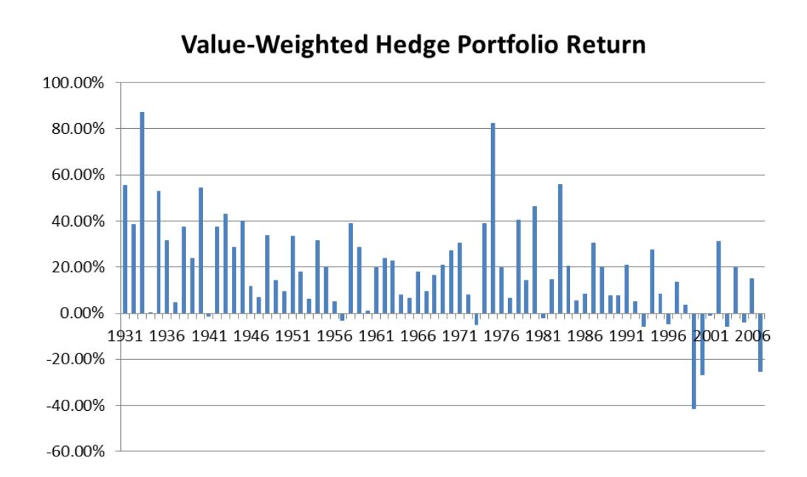
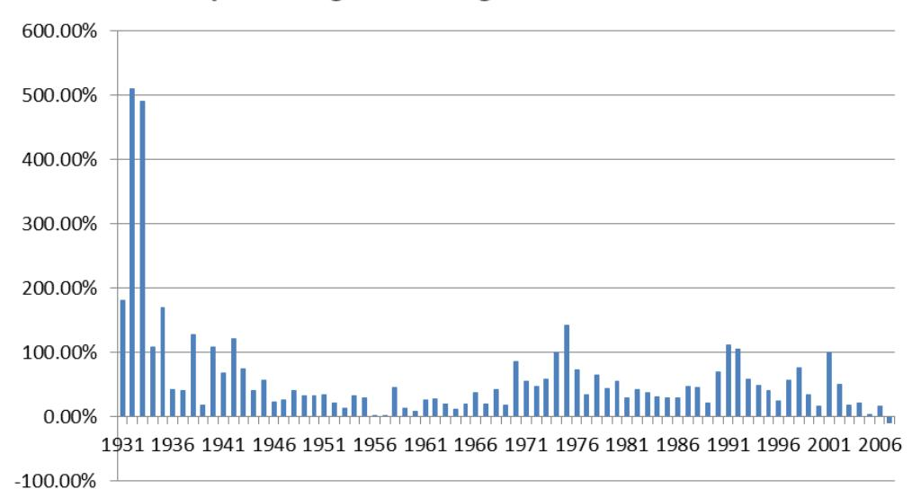
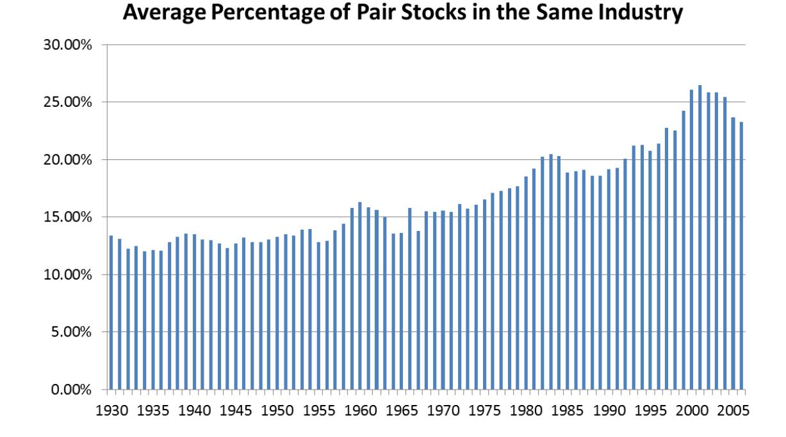

#### Empirical Investigation of an Equity Pairs Trading Strategy

Huafeng (Jason) Chen\*

Shaojun (Jenny) Chen\*\*

Zhuo Chen\*\*\*

Feng Li\*\*\*\*

#### **Abstract**

We show that an equity pairs trading strategy generates large and significant abnormal returns. We find that two components of the trading signal (short term reversal and pairs momentum) have different dynamic and crosssectional properties. The pairs momentum is largely explained by the one month version of the industry momentum. Therefore, the pairs trading profits are largely explained by the short term reversal and a version of the industry momentum.

Keywords: pairs trading, pairs momentum, industry momentum, short term reversal JEL classifications: G12, G14

### April 2017

\* Associate Professor of Finance, PBC School of Finance, Tsinghua University, 43 Chengfu Road, Beijing, China 100083. \*\* Quantitative Analyst, Connor, Clark and Lunn Investment Management, 2200-1111 West Georgia Street, Vancouver, BC V6E 4M3, Canada. \*\*\* Assistant Professor of Finance, PBC School of Finance, Tsinghua University, 43 Chengfu Road, Beijing, China 100083. \*\*\*\* Professor of Accounting, Shanghai Advanced Institute of Finance, 211 West Huaihai Road, Shanghai, China 200030. Huafeng Chen acknowledges the support from the Social Sciences and Humanities Research Council of Canada and the UBC Bureau of Asset Management. We thank Ilia Dichev, Evan Gatev, Ron Giammarino, and the workshop participants at UBC, the Connor, Clark, and Lunn Investment Management, University of Oregon, and PanAgora Asset Management for comments. We also thank Mace Mateo and Sandra Sizer for copy-editing an earlier version of the paper. Please email inquiries to chenhf@pbcsf.tsinghua.edu.cn, jchen@cclgroup.com, [chenzh@pbcsf.tsinghua.edu.cn,](mailto:chenzh@pbcsf.tsinghua.edu.cn) or fli@saif.sjtu.edu.cn.

#### **1. Introduction**

Pairs trading strategy is a market neutral strategy that involves the following two steps. The first step is to identify pairs, which are trading instruments (stocks, options, currencies, bonds, etc.) that show high correlations, i.e., the price of one moves in the same direction as the other. In the second step, pairs traders look for divergence in prices between a pair. When a divergence is noticed, traders take opposite positions for instruments in a pair. In this study, we examine a pairs trading strategy based on publicly traded common equity. In equity pairs trading, the trader takes long position for underperforming stocks and short position for overperforming stocks. The trader then profits from the correction of the divergence.

We test an equity pairs trading strategy that uses historical return correlations to determine pairs. We first estimate the pairwise stock return correlations for all the CRSP firms for each year using return data from the previous five years. For each stock, we identify a set of pair stocks that tend to move most closely with that stock in the last five years. If a given stock's return deviates from its pair stocks in a given month, we examine whether its return converges to its pair stocks in the future and provides potential trading opportunity. We find that a trading strategy that bets on this convergence generates six-factor (market, size, book-to-market, momentum, short-term reversal, and liquidity) alphas of up to 9% annually for a value-weighted self-financing portfolio, and 36% for an equal-weighted portfolio. In addition, our pairs trading profits cannot be explained by investment-based factors, funding liquidity risk, or financial intermediary leverage factor. The proposed pairs residual is also different from existing residual type return predictors.

Our return difference variable is essentially the difference between pairs return and lagged stock return. Thus, the pairs trading profits must stem from the pairs momentum and/or the short term reversal. We further examine which one of these components is driving the pairs returns profits and whether the two components have similar properties. We find that, the shortterm reversal explains part of the pairs trading strategy returns. However, there are still

substantial returns to the pairs trading strategy even when there is no significant movement in a firm's stock but its pairs have experienced significant price changes, i.e., a stock converges to its pairs even when there is no short-term reversal per se. Therefore, both the short term reversal and the pairs momentum contribute to the pairs trading profits. We also find that the short term reversal and pairs momentum components have different dynamic and cross-sectional properties. Specifically, the profits to pairs momentum is basically zero after the first month. However, the profits to short term reversal reverse after the first month. We also find that the profits to the short term reversal strategy is larger in stocks that are in poorer information environment and more illiquid, however profits to the pairs momentum strategy appear largely unrelated to information environment and liquidity in the cross section. We conclude that while both information diffusion and liquidity provision may help explain the pairs trading, there may be other economic channels at work.

Given that the short term reversal is relatively well studied, we further study what explains our pairs momentum. We find that it is largely explained by the one-month version of the industry momentum. For example, in a double sorting procedure, after we control for the lagged one month industry return, the difference between the lagged pairs return and industry return generates an average of 0.29% monthly return differential in the value-weighted portfolios. On the other hand, after we control for the difference between the lagged pairs return and industry return, the lagged one month industry return generates an average of 0.7% return differential per month. We also find that the conventional six-month industry momentum in Moskowitz and Grinblatt (1999) concentrates in the first month, coinciding with the return horizon of pairs momentum.

Our paper extends the findings in Gatev, Goetzmann, and Rouwenhorst (2006), who show that there are abnormal returns from a return-based pairwise relative value trading strategy. We confirm their findings on pairs trading strategy. Our paper also builds on and enriches the results in Engelberg, Gao, and Jagannathan (2009) in our common goal to uncover the economic drivers of the pairs trading profits. We show that pairs trading is largely explained by the short term reversal and one month version of the industry momentum. Our paper complements Da et al. (2014) who investigate a cross sectional return predictor that is the short-term reversal residual after taking out expected return and cash flow news.

#### **2. Profitability of a Pairs Trading Strategy**

# **2.1 A Pairs Trading Strategy**

In this section, we propose and test an equity pairs trading strategy based on the historical pairwise return correlations. Essentially, this test examines whether the information contained in stock comovement is fully impounded into the prices.

We identify the pairs portfolio as follows. For each stock *i* in year *t+1*, we compute the Pearson correlation coefficients between the returns of stock *i* and all other stocks in Center for Research in Security Prices (CRSP) using monthly data from January of year *t-4* to December of year *t*. We then find 50 stocks that have the highest correlations with stock *i* as its pairs.1 In each month in year *t+1*, we compute the pairs portfolio return as the equal-weighted average return of the 50 pairs stocks, *Cret*. Our pairwise trading hypothesis is that if in any given month in year *t+1*, a stock's return, *Lret,* deviates from its pairs portfolio returns, *Cret*, then in the following month this divergence should be reversed. For example, if a stock significantly underperforms its pairs portfolio, that stock should experience abnormally higher returns in the next month.

Specifically, for stock *i* in a month in year *t+1*, we construct a new variable, *RetDiff*, to capture the return divergence between *i*'s stock return and its pairs-portfolio return:

$$RetDiff = beta^C * (Cret-Rf) - (Lret - Rf),$$

 1 We conduct robustness tests by using 10 and 20 stocks and the empirical inferences are similar.

where *Rf* is the risk free rate and *beta*C is the regression coefficient of firm *i*'s monthly return on its pairs-portfolio return using monthly data between year *t-4* and *t*. 2 The use of *beta*C addresses the issue of different return volatilities between the stock and its pairs portfolio.

For *n* stocks, there are *n\*(n-1)/2* correlations to be computed. Because the number of observations for the correlations grows exponentially with the number of stocks, the estimation is computationally intensive. To reduce the computation burden, we require that all firms have 60 monthly stock returns data from year *t--4* to year *t*.

Table 1 reports the returns of the portfolios sorted on *RetDiff*. In each month, we form ten portfolios, Decile 1 through Decile 10, based on the previous month's *RetDiff* and the holding period is one month. Note that while the return difference between a portfolio of fifty mosthighly-correlated stocks with stock *i* and stock *i* is used as a sorting variable, only individual stock *i* enters the portfolio construction, not those fifty stocks. The portfolio of those fifty stocks only serves as a benchmark for portfolio sorting. Our sample period is from January 1931 to December 2007. In Panel A, we report raw returns, Fama-French three-factor (market, size, and book-to-market) alphas, five-factor (the three factors plus momentum and short-term reversal factors) alphas, and six-factor (the three factors plus momentum, short-term reversal, and liquidity factors) alphas for the value-weighted portfolios. We use the short-term reversal factor to examine the pairs trading strategy returns because by construction, the sorting variable *RetDiff* contains information from a stock's lagged returns. 3 The liquidity factor is the Pastor-Stambaugh value-weighted traded liquidity factor, which we include to examine the possibility that the *RetDiff* sorted portfolios compensate for liquidity provision.

 2 Alternatively, we can construct the simple return difference as *Cret-Lret*. The empirical results based on this specification are similar, with comparable magnitude.

3 The short-term reversal factor (*ST\_Rev*) is provided by Kenneth French and is constructed as follows. Six value-weight portfolios are formed on size and prior (month t-1) returns. The portfolios, which are formed monthly, are the intersections of two portfolios formed on size (market equity, ME) and three portfolios formed on prior (t-1) return. The monthly size breakpoint is the median NYSE market equity. The monthly prior (t-1) return breakpoints are the 30th and 70th NYSE percentiles. *ST\_Rev* is the average return on the two low prior return portfolios minus the average return on the two high prior return portfolios, *ST\_Rev=1/2 (Small Low + Big Low) - 1/2(Small High + Big High).*

An examination of the raw returns and alphas of the decile portfolios shows that stocks with high *RetDiff* have higher subsequent returns. For the value-weighted portfolios, the zero-cost portfolio Decile 10 – Decile 1 (i.e., longing Decile 10 and shorting Decile 1) generates a return of 1.40% per month (*t* = 8.81). Unless stated otherwise, all *t*-statistics are Newey-West adjusted. The hedge portfolio has a three-factor adjusted alpha of 1.23% with a *t*-value of 7.69 and a six-factor adjusted alpha of 0.77% (*t* = 3.75). In addition to the significant hedge portfolio alphas, the alphas increase almost monotonically from Decile 1 to Decile 10, indicating that sorting on *RetDiff* systematically drives the hedge portfolio returns.

The equal-weighted portfolios generate even higher dispersion in returns. Panel B of Table 1 reports the raw returns, three-factor alphas, five-factor alphas, and six-factor alphas for equal-weighted portfolios sorted by *RetDiff*. For the equal-weighted portfolios, the zero-cost portfolio Decile 10 – Decile 1 (i.e., longing Decile 10 and shorting Decile 1) generates a return of 3.59% per month (*t* = 12.57). The three-factor alpha for the self-financing portfolio is 3.17% per month (*t* = 13.75). The six-factor alpha is 3.03% (*t*=13.35). Overall, the results in Table 1 suggest that the pairs trading strategy generates significant abnormal returns.4

Figure 1 plots the annual returns of the value-weighted (top panel) and equal-weighted (bottom panel) hedge portfolios based on the pairs trading strategy from 1931 to 2007. The value-weighted hedge portfolio generates negative returns in 12 years (1941, 1957, 1973, 1981, 1993, 1996, 1999, 2000, 2001, 2003, 2005, and 2007). In contrast, the equal-weighted hedged portfolio generates returns that are greater and only lost money in one year (-9.35% in 2007).

#### **2.2 Can Pairs Trading Be Explained by Common Risk Factors?**

Table 1 shows that the pairs trading strategy returns survive the six-factor model, hence they are unlikely to be explained by common risk factors. We now investigate this possibility further by examining the risk factor loadings and the cross-sectional regressions.

 4 In unreported tables, we also find that consumption CAPM does not explain the profitability of this pairs trading strategy.

We first examine the factor-loadings of the pairs-based decile portfolios to investigate how the pairs portfolios correlate with these common factors. Table 2 reports the loadings of the pairs portfolios with respect to the six factors: market, size, book-to-market, momentum, shortterm reversal, and liquidity factor. For the value-weighted portfolios (Panel A), the self-financing portfolio (Decile 10 – Decile 1) loads positively and significantly on the market excess returns and the short term reversal, and negatively and significantly on the momentum factor, but its loadings on SMB, HML, and liquidity factor are both economically and statistically insignificant. The market beta increases with *RetDiff*, but this increase is not monotonic and the difference in beta is relative small (1.13 in Decile 1 vs. 1.24 in Decile 10). The pairs trading profits are negatively correlated with momentum beta, suggesting that momentum factor cannot explain the pairs trading profits. The loading on the Pastor-Stambaugh traded liquidity factor is insignificant and slightly negative, suggesting that pairs trading strategy is unlikely to be explained by compensation for systemic liquidity provision. Among these factors, the loading on the short-term reversal factor (ST Rev) is positive and significant (0.70 with a *t*-statistic of 5.09) and the magnitude is larger and more significant than the loadings on the other factors. The results based on the equal-weighted portfolios (Panel B) are similar: the self-financing portfolio loads positively on the market, SMB, HML, and especially short-term reversal and loads negatively on the momentum factor and liquidity factor. The beta on the short-term reversal factor is larger and more significant compared with the betas on the other factors.

The positive loading of the pairs trading hedge portfolio on the short-term reversal mimicking portfolio suggests that the strategy partially captures the short-term reversal phenomenon. However, the fact that the pairs trading portfolios still generate significant alphas after controlling for the short-term reversal factor and the other common factors (Table 1) suggests that pairs trading strategy is not completely driven by the short-term reversal of a firm's stock returns. We will further examine the relation between short term reversal and pairs trading in Section 3.

We also examine the relation between pairs trading with common risk factors using a cross-sectional regression approach. Table 3 reports the Fama-MacBeth regressions of monthly returns on the previous month's pairs-portfolio return, *Cret*; the firm's own return in the previous month, *Lret*; and other control variables. For returns between July of year *t+1* and June of year *t+2*, we match with size and book-to-market equity at the fiscal year end in year *t*. For the market value of equity, we use Compustat total shares outstanding multiplied by the fiscal year-end price. Size is the logarithm of the market value of equity. We construct the book value of equity as total assets minus total liabilities. Book-to-market equity is then the logarithm of the ratio of the book equity to the market value of equity. Momentum is the cumulative return over month -12 to month -2. The Amihud measure is calculated using daily return and volume within a month (Amihud (2002)). Henceforth, the coefficients on the Amihud measure are multipled by 106 for readability. Idiosyncratic volatility is estimated with respect to the Fama-French three-factor model using daily return within a month (Ang et al. (2006)). MAX is the maximum daily return within a month (Bali, Cakici, and Whitelaw (2011)). BetaMKT, BetaSMB, BetaHML, and BetaMOM are estimated using monthly returns over the past 60 months. Because of the data availability in Compustat, these regressions are for the sample period July 1951 to December 2007. We report the time series average of cross-sectional regression coefficients with Newey-West six-lag adjusted *t*-statistics in parentheses.

Columns 1 and 2 in Table 3 show that, consistent with the portfolio results in Table 1, *RetDiff* positively predicts next month's return, and that the effect is highly statistically significant, even after we include other return determinants (the coefficient on *RetDiff* in Column 2 is 0.080 with a *t*-statistic of 18.01.) To examine whether the pairs trading abnormal returns are incremental to those of the short-term reversal strategy, we split *RetDiff* into its two components (*Cret* and *Lret*) and include them directly in the regressions. We find that *Cret* predicts returns positively and *Lret* predicts returns negatively. In Column 3, the coefficient on *Cret* is 0.226 (*t* = 13.18) and that on *Lret* is -0.068 (*t* = -15.72). The fact that *Cret* is statistically significant even

when *Lret* is included in explaining future returns suggests that there is information contained in the pairs stocks that is not driven by just the short-term reversal phenomenon. In Column 4, we add control variables to the regression. The coefficients on *Cret* and *Lret* both remain statistically significant. In the last two columns, we examine the cross-sectional predictive power of *Cret* and *Lret* separately with control variables. Results suggest that both pairs return effect (coefficient = 0.090, *t* = 7.07) and short-term reversal effect (coefficient = -0.072, *t* = -16.35) contribute to the pairs trading profit.

# **2.3 Other Possible Explanatory Factors of Pairs Trading Profits**

While Table 1 indicates that returns of the pairs trading strategy are not absorbed by commonly used risk factors, it is possible that pairs trading portfolio can be explained by other pricing models. We explore two possible explanations that could result in pairs trading profits in Table 4.

The first model we consider is the Q-factor model proposed by Hou, Xue, and Zhang (2015a and 2015b). Panel A of Table 4 presents the time series regression results. The four-factor (MKT, ME, I/A, and ROE) model cannot explain the pairs trading profits: monthly alphas are 0.94% (*t* = 2.81) and 3.40% (*t* = 9.71) for value-weighted and equal-weighted Decile 10-Decile 1 hedged portfolios, respectively. Pairs trading portfolios have positive and significant loadings on the market factor. The equal-weighted portfolio has negative and significant loading on the ROE factor (BetaROE = -0.45, *t* = -3.15). Nevertheless, the alphas are similar to those in Table 1. Overall, the results suggest that Q-factor model is not the underlying driving force of pairs trading returns.

The second possible explanation is financial friction that might affect arbitrageurs' ability to exploit pairs trading profits. For example, time-varying funding liquidity risk or financial intermediary's leverage could have an impact on arbitrage capital and therefore explain pairs trading profits over time. We look into this possibility in Panels B and C of Table 4. Panel B reports the time series regression results when funding liquidity risk is used to explain the Decile 10-Decile 1 hedge portfolios. Funding liquidity risk is proxied by investment banks' excess returns as in Ang, Gorovyy, and Van Inwegen (2011). We find that returns of pairs trading portfolios remain after we use investment banks' excess return in the time series regressions. Monthly alphas range from 0.87% for the value-weighted portfolio to 2.98% for the equalweighted portfolio. These alphas are similar to those in Table 1. The loadings on the funding liquidity risk are also small, ranging from 0.02 to 0.14. These results suggest that funding liquidity is not the main drive for the pairs trading profits.

In Panel C of Table 4, we adopt financial intermediary's leverage factor (Adrian, Etula, and Muir (2014)) in the time series regression. Results indicate that intermediary's leverage is not the main driver for pairs trading profits: the slope coefficient on the intermediary's leverage is basically 0. As the original leverage factor is not traded and only available at quarterly frequency, we use a traded leverage factor (LMP) and redo the exercise. The beta coefficient on the tradable leverage factor is 0.08 for the value-weighted hedged portfolio and 0.26 for the equal-weighted hedged portfolio. The alphas are 1.31% per month for the value-weighted portfolio and 3.27% per month for the equal-weighted portfolio, similar to those in Table 1. Taken together, while financial friction such as arbitrage capital might partially help explain pairs trading profits, it is not the key driver.

In the Appendix, we also consider whether conditional CAPM can explain the return spread of *RetDiff* sorted portfolios. We select four information variables, including the lagged Tbill rate, lagged dividend yield on the stock market, lagged yield spread between ten-year Treasury bond and three-month T-bill, and lagged yield spread between Moody's BAA and AAA bonds. We find that beta loadings conditional on those information variables cannot explain the return difference across *RetDiff* sorted portfolios (Appendix Table A.1).

The other possibility is that our results are caused by microstructure induced noises. To examine this possibility, we construct the *RetDiff* sorted portfolios using stocks with price greater than \$5 and size greater than 10% NYSE cutoff. We find that the hedged value- and equalweighted portfolios still earn positive and significant returns (Appendix Table A.2).

After the first draft is written, we also have extended the sample period to over the 2008- 2015 period. This constitutes a true out-of-sample test. We find that the trading profits have declined in the recent sample period. However, the hedged portfolios are still statistically and economically significant for the equal-weighted portfolios (Appendix Table A.4).

# **2.4 Comparison with Other Residual Type Predictors**

A couple of recent papers study other residual type cross-sectional return predictors. Da et al. (2014) find that a lagged return residual without expected return and cash flow news significantly predicts next month's return in the cross section. Collin-Dufresne and Daniel (2015) examine the role of slow moving capital in the return predictability of CAPM residual. We now examine whether our *RetDiff* measure is simply another proxy for these residuals.

Table 5 reports the sequentially sorted portfolios on *RetDiff* and these two types of return residuals. After controlling for Da et al. (2014) residual (Panel A.1), the HML portfolios sorted by *RetDiff* generate significant and positive returns for all but the low Da et al. (2014) residual groups. On average, the hedged Quintile 5-Quintile 1 portfolio has a monthly return of 0.56% (*t*statistic = 3.22). In contrast, Panel A.2 shows that the HML portfolios sorted by Da et al. (2014) residual do not deliver significant returns after controlling for the *RetDiff*. In Panel B.1, after controlling for CAPM residual, high *RetDiff* stocks still generate higher returns with an average spread of 0.63% per month (*t*-statistic = 4.50). On the other hand, CAPM residual sorted portfolios conditional on *RetDiff* do not show monotonic relation in return (Panel B.2). Overall, the proposed pairs residual *RetDiff* is an effective cross sectional return predictor even in the presence of existing residual type predictors. In the Appendix, we provide more discussions on the relation between *RetDiff* and these two types of residuals for interested readers.

#### **3. Short Term Reversal vs. Pairs Momentum**

Our return difference variable is essentially the difference between pairs return and lagged stock return. We now further examine whether either or both of these components are driving the pairs returns profits and whether the two components have similar properties.

# **3.1 Double Sorts**

In Table 6, we report the value- and equal-weighted portfolio returns based on sequential double sorts of the previous month's stock return and pairs portfolio return. The holding period is also one month. Panel A reports the value-weighted and equal-weighted returns of portfolios sequentially sorted by previous month return and then pairs portfolio return. For stocks within each quintile group sorted by previous month return, their returns increase with pairs portfolio return. The monthly return spread between high and low pairs return groups ranges from 1.26% (*t* = 6.53) to 0.48% (*t* = 2.90). On average, controlling for the short-term reversal effect, the incremental return of pairs portfolio effect is 0.96% (*t* = 7.41). Similar patterns are found for equal-weighted portfolios with even larger magnitude. The results suggest that pairs trading abnormal returns persist even after the lagged returns are controlled for.

Panel B also reports the results for portfolios sequentially sorted by pairs portfolio return and then previous month return. Consistent with the findings in Fama (1965) and Jegadeesh (1990), stock returns exhibit a short-term reversal: the average monthly returns of the hedged value- and equal-weighted short-term reversal portfolio are 1.07% (*t* = 8.77) and 2.18% (*t* = 13.47), after controlling for the pair portfolio return.

#### **3.2 Long-Horizon Returns**

To explore the persistence of the pairs trading strategy, Table 7 reports the long horizon returns for hedge portfolios (Decile 10 – Decile 1) sorted by the return difference. Panel A examine value-weighted portfolios. In the first month after portfolio formation, the pairs trading profit is 1.40% (the same as Table 1). Starting in the 2nd month, the pairs trading strategy generates a loss of -0.39%. In each month between the 3rd month and the 6th month, this loss persists. By the end of the six months, the loss from the pairs trading strategy exceeds the profit in the first month.

Panel B examines the equal-weighted portfolios. In the first month, the pairs trading profit is 3.59%. In the second month, the profit reduces sharply to 0.16% and is not statistically significant. Starting in the third month, the pairs trading strategy generates a loss, although the loss by the end of the sixth month does not exceed the profit in the first month.

The results in Table 7 show that the pairs trading profits are short lived and do not persist beyond the first month. This evidence also suggests that fundamental risk-based explanation is unlikely to explain the pairs trading strategy since the fundamental risk is likely to persist longer than just one month.

To further examine this issue, we sort stocks on pairs return (pairs momentum) and lagged returns, separately. Column 3 of Table 7 reports the results. In value-weighted portfolios sorted on the pairs momentum (*Cret*). In the first month after portfolio formation, the pairs momentum profit is 0.74% (the same as Table 1). In the 2nd month, the pairs momentum portfolio generates a small return of 0.02%. In each month between the 2 rd month and the 6th month, the return is statistically not significant. The sum of returns to the pairs momentum portfolio from the 2 nd month to the 6th month is -0.14%. In the equal-weighted portfolios, in the first month after portfolio formation, the pairs momentum profit is 0.76%. In the 2nd month, the pairs momentum portfolio generates a small return of 0.01%. In each month between the 2 rd month and the 6th month, the return is statistically not significant. The sum of the pairs momentum profit from the 2 nd month to the 6th month is 0.1%. Therefore, we conclude that the pairs momentum exists in the first month after portfolio formation, and is basically zero afterwards.

The pattern is different for portfolios sorted by lagged return. Column 4 of Table 7 reports the results. In the first month after portfolio formation, the difference between the high lagged return portfolio the low lagged return portfolio is -0.97%. Starting in the 2nd month, the difference becomes positive at 0.30%. In each month between the 2 rd month and the 6th month, this return is positive. By the end of the six months, the cumulative difference between the high lagged return portfolio the low lagged return portfolio is 0.34%. In equal-weighted portfolios, in the first month, the difference between the high lagged return portfolio the low lagged return portfolio is -3.07%. In the 2nd month, the difference is still negative at -0.09%. In each month between the 3rd month and the 6th month, this return is positive. By the end of the six months, the cumulative difference between the high lagged return portfolio the low lagged return portfolio has reduced to 2.39%.

To summarize, the long/short portfolio returns sorted by the pairs return is basically zero after the 1st month. However, the long/short portfolio returns sorted by the lagged return reversed after the 1st month. The reversal after the 1st month exceeds those in the first month in valueweighted portfolios. We therefore conclude that pairs momentum and short term reversal have different dynamic properties.

# **3.3 Cross-Sectional Variation in Relation to Information Environment and Liquidity Provision**

Two promising explanations of the pairs trading strategy are the information delay explanation and the liquidity provision explanation. The information delay explanation posits that when a firm and its peer deviate in stock prices, there is likely news related to the fundamentals of the pair; however, it takes time for the news to disseminate to the pair and this creates trading opportunity. Another potential explanation of the pairs trading strategy is the short-term liquidity provision. The short-term liquidity provision explanation posits that the trading profits are compensation for market makers who buy the shares of a particular stock when there is liquidity shock that leads to selling the stock relative to its peers.

Table 8 reports the abnormal returns to the pairs trading strategy by dividing the sample into two parts based on four information environment variables (size, media coverage, investor recognition, and analyst coverage) and two liquidity variables (Amihud's measure and dollar trading volume in the formation month). We acknowledge that these two sets of variables are

likely correlated. We measure size using the market value of equity at the portfolio formation date in the portfolio formation month. We measure media coverage as the number of news articles in three major newspapers (*Wall Street Journal*, *The New York Times*, and *USA Today*) for each firm in the 12 months before the portfolio formation date. Due to the high cost of collecting news articles from Factiva, we focus only on the three newspapers, rather than the universe of news outlets. We focus on the 1998-2007 period for the same consideration. However, given the wide influence of these three major newspapers (Soltes (2009)), we believe that this should not be an issue for the empirical tests. We also follow Lehavy and Sloan (2008) and use the breadth of ownership using the most recent 13-F data prior to the portfolio formation date to capture investor recognition. The argument is that more broad institutional ownership translates into more investor recognition. In addition, we obtain the number of analysts covering a firm in the most recent month prior to portfolio formation from I/B/E/S. Everything else equal, firms with more analyst coverage tend to have more efficient information environment. We also use two liquidity variables, Amihud's illiquidity and the dollar trading volume in the formation year.

We divide the sample into two subsamples based on each of the information environment or liquidity variables and Column 2 of Table 8 shows the equal-weighted hedge portfolio returns, calculated as the difference in the Decile 10 and Decile 1 portfolios sorted on the firm-pairs return difference, for each subsample.

The results in Table 8 show that firms that are small, without much media coverage, and firms with low investor recognition and low analyst coverage tend to have more significant pairs trading returns. During the 1931-2007 period, the pairs trading strategy generates a hedge return of 5.05% (*t* = 18.63) for small firms and 1.48% (*t* = 12.36) for large firms; the difference between the two hedge returns is 3.56% and is statistically significant. The difference in the pairs trading profits is 2.32%, 1.32%, and 2.51%, for portfolios sorted by media coverage, investor recognition, and analyst coverage, respectively. All these differences are statistically and economically significant.

The results also indicate that firms that are illiquid and with low trading volume tend to have more significant pairs trading returns. During the 1931-2007 period, the pairs trading strategy generates a hedge return of 5.25% (*t* = 20.33) for illiquid firms according to Amihud's measure and 1.20% (*t* = 9.23) for liquid firms; the difference between the two hedge returns is statistically significant. The strategy generates an average monthly equal-weighted hedge return of 5.38% (*t* = 20.49) for firms with low dollar trading volume. On the other hand, for firms with high dollar trading volume, this number is 1.18% (*t*=8.76) and the difference between the two groups is statistically significant. This evidence is consistent with both the information diffusion explanation and the liquidity provision explanation.

Further examination shows that two components of the return difference (*Cret* and *Lret*), have different correlations with the information environment and liquidity measures. For Decile 10-Decile 1 portfolios sorted on *Cret*, it is 0.56% per month in small stocks and 0.79% in large stocks, the difference is -0.23% and statistically not significant. For media coverage, investor recognition, analyst coverage, Amihud's measure, and dollar trading volume, the differences are 0.55%, 0.29%, -0.32%, -0.09%, 0.06%, respectively, and none of them is statistically significant at the 5% level.

However, profits to Decile 10-Decile 1 portfolios sorted on *Lret* are related to both the information environment and liquidity measures. For Decile 10-Decile 1 portfolios sorted on *Lret*, it is -4.68% per month in small stocks and -1.03%, the difference is -3.65% and statistically significant. For media coverage, investor recognition, analyst coverage, Amihud's measure, and dollar trading volume, the differences are -1.92%, -1.33%, -2.75%, -4.07%, -4.09%, respectively, and each of them is statistically significant at the 1% level.

Overall, we conclude that pairs momentum and short term reversal have different crosssectional properties. While profits to the short term reversal strategy is concentrate in stocks with poor information environment and low liquidity, the profits to pairs momentum appears not related information environment and liquidity. These results also suggest that while both information diffusion and liquidity provision may help explain the pairs trading profits, there may be other channels that contribute to the pairs trading profits.

While the short-term reversal effect *Lret* may be due to the price over-reaction to firm specific news (Da et al. (2014)), the pairs momentum effect *Cret* could be driven by slow information diffusion of industry news (or under-reaction). To summarize, the *RetDiff* effect can be viewed as an over-reaction to firm-specific news relative to peers.

# **4. Does Industry Momentum Explain Pairs Momentum?**

In the previous section, we show that pairs momentum and short reversal have different dynamic and cross-sectional properties. We now explore further what drives the pairs momentum. In particular, Moskowitz and Grinblatt (1999) find that industry returns tend to exhibit momentum, in that industry returns in the previous six months tend to positively predict returns in the next six months. On the other hand, prices of stocks in the same industry usually move together and thus are more likely to be identified as pair stocks. We plot the average percentage of a stock's 50 pair stocks that belong to the same industry in Figure 2, where a stock is classified into one of the twenty industries as in Moskowitz and Grinblatt (1999). While the unconditional average percentage is 5%, the percentage of paired stocks in the same industry is around 17%, and this number increases over time from around 12% in early years to 25% in more recent years. As a result, stocks in the same industry could be affected by the same piece of industry specific news that can be related to industry momentum effect. We now examine whether industry momentum explain pairs momentum.

# **4.1 Double Sorts**

In Table 9, we report the value- and equal-weighted portfolio returns based on sequential double sorts of the previous month's industry return (*IndRet*) and the difference between pairs return and industry return (*Cret-IndRet*). The holding period is again one month. Panel A sorts on *IndRet* and then *Cret-IndRet*. For stocks within each quintile group sorted by previous month industry return, their returns increase with *Cret-IndRet*, but the magnitude of the increase appears relatively small. The monthly return spread between high and low *Cret-IndRet* groups ranges from 0.12% (*t* = 0.74) to 0.42% (*t* = 2.69). On average, controlling for the lagged industry return, the incremental return of *Cret-IndRet* effect is 0.29% (*t* = 2.51). For equal-weighted portfolios, the average incremental return of *Cret-IndRet* is 0.20% (*t* = 1.41).

Panel B also reports the results for portfolios sequentially sorted by *Cret-IndRet* and then previous month's industry return. Consistent with the findings in Moskowitz and Grinblatt (1999), stock returns exhibit an industry momentum: the average monthly returns of the hedged valueand equal-weighted industry momentum portfolio are 0.7% (*t* = 5.07) and 0.88% (*t* = 6.23), after controlling for *Cret-IndRet*. Taking the results of Panels A and B together, it appears that pairs momentum (*Cret*) can be largely explained by the one-month version of the industry momentum.

#### **4.2 Fama-MacBeth Regressions**

We also examine the relation between pairs momentum and industry momentum using a cross-sectional regression approach. Table 10 reports the Fama-MacBeth regressions of monthly returns on the previous month's industry return, *IndRet*, the previous month's pairs-portfolio return, *Cret*, the firm's own return in the previous month, *Lret*; and other control variables. The methodology is the same as that in Table 3.

Columns 1 and 2 in Table 10 show that, *IndRet* positively predicts next month's return, and that the effect is highly statistically significant, even after we include other return determinants (the coefficient on *IndRet* in Column 2 is 0.14 with a *t*-statistic of 14.36). In Columns 3 and 4, we examine the cross-sectional predictive power of *IndRet* and *Cret* on returns, jointly with control variables. In Column 4, after controlling for other common determinants of returns, the coefficient on *IndRet* is 0.12 (*t* = 13.48), while the coefficient on *Cret* is 0.11 (*t* = 8.81). Recall that in Column 4 of Table 3, without controlling for *IndRet*, the coefficient on *Cret* in the Fama-MacBeth regressions of returns is 0.14. The fact that this coefficient reduces to 0.11

suggests that while the industry momentum helps explain the pairs momentum, pairs momentum has remainder predictive power over the future return.

We further study the conventional measure of industry momentum in Moskowitz and Grinblatt (1999), who use the previous six months' industry returns to predict future returns. We construct the previous six months' industry return, *IndRet6*, and repeat our exercise, now in Columns 5 through 8. In Column 8, after controlling for *IndRet6*, and other determinants of the returns, the coefficient on *Cret* is 0.13 (*t* = 10.22). This is close to the coefficient on *Cret*, 0.14, without controlling for *IndRet6*, in Column 4 of Table 3. This result suggests the conventional six month industry momentum does not subsume the predictive power in the pairs momentum, *Cret*.

Furthermore, we also apply the variable selection technique proposed by Harvey and Liu (2016) to evaluate the explanatory power of various stock characteristics on cross sectional returns. We find that *RetDiff* plays the most important role in predicting cross-sectional returns based on the magnitude of Fama-MacBeth regression *t*-statistics and R2 . Detailed results can be found in the appendix.

# **4.3 Time Series Evidence on the Industry Momentum Factor**

We now examine whether the pairs momentum portfolios can be explained by the industry momentum factor in the time series tests. The dependent variables are hedged Decile 10- Decile 1 portfolios sorted by *RetDiff*, *Cret*, and *Lret*. The independent variables are industry momentum factors constructed by longing three winner industries and short selling three loser industries as in Moskowitz and Grinblatt (1999). They use the previous six months' industry return to predict returns in the next months. The formation month, the skipping month, and the holding month are therefore (6,0,6). This corresponds to our first version of the industry momentum in Panel A of Table 11. In Panels B and C, we also consider two other versions of the industry momentum that have formation month, the skipping month, and the holding month of (6,0,1), and (1,0,1), respectively.

Panel A shows that the conventional (6,0,6) industry momentum does not explain the pairs momentum profits: the monthly returns of *Cret* sorted Decile 10-Decile 1 value-weighted pairs momentum portfolio HMLCret is 0.74%, while the monthly alpha is 0.70% (*t* = 3.15), and the beta on the industry momentum factor is 0.15 (*t* = 0.86). In Panel B, when we use the (6,0,1) industry momentum, the result remains largely the same. The monthly alpha is 0.66% (*t* = 2.97), and the beta on the industry momentum factor is 0.26 (*t* = 1.84). In Panel C, however, the onemonth (1,0,1) version of the industry momentum does appear to explain the pairs momentum; the monthly alpha is 0.09% (*t*=0.61), and the beta on the industry momentum is 0.97 (*t* = 14.59). None of the industry momentum factors explains the returns of the *RetDiff* sorted portfolio HMLRetDiff (pairs trading effect) or the *Lret* sorted portfolio HMLLret (short-term reversal effect). Overall, while the conventional 6-month industry momentum does not explain the pairs momentum return spread HMLCret, the one-month version of the industry momentum does appear to explain much of the pairs momentum spread in the time series test.

To further examine the relation between the 6-month and the 1-month industry momentum, we examine the industry winner minus loser portfolio returns for each of the six formation months and each of six holding months. The results are reported in Table 12. Panel A reports results on the value-weighted portfolios. The one-month industry momentum portfolio (formation month of month 0, holding month of month 1) has an average monthly return of 0.75% with a *t*-statistic of 5.65. For the same formation period, holding in month 2 generates an average monthly return of 0.19% with a *t*-statistic of 1.56. Holding returns in the 3 rd, 4th, 5th, and 6th months are 0.17%, 0.11%, -0.04%, and 0.12%, respectively, with the highest *t*-statistic being 1.31 in absolute values. Returns for formation period of month -1 and holding period of month 1 is conceptually the same as formation period of month 0 and holding period of month 2. In fact, all the numbers that line up in a 45 degree line in this table are the same. We therefore focus on the first row and the last column. For the holding period of month 6, the average returns for formation month of -1, -2, -3, -4, and -5 are 0.20%, 0.08%, 0.22%, 0.08%, and 0.35%,

respectively. Most of these numbers are statistically insignificant except for the last one, with a *t*statistic of 3.11. The one-month industry momentum, 0.75%, is higher than industry momentum in any of the other combinations of formation period and holding period. Therefore, the sixmonth industry momentum concentrates in the one-month period in value-weighted portfolios.

Panel B reports results on the equal-weighted portfolios. The pattern is the same. The one month industry momentum portfolio (formation period of month 0, holding period of month 1) has an average monthly return of 0.93% with a *t*-statistic of 6.84. For the same formation month, holding in month 2, has an average monthly return of 0.39% with a *t*-statistic of 3.14. Holding returns in the 3rd, 4th, 5th, and 6th months are 0.18%, 0.21%, 0.23%, and 0.20%, respectively, with the highest *t*-statistic being 1.77. For the holding period of month 6, the average returns for formation month of -1, -2, -3, -4, and -5, are 0.31%, 0.29%, 0.17%, 0.08%, and 0.33%, respectively. The *t*-statistics are 2.58, 2.50, 1.43, 0.71, and 2.91, respectively. Again, the sixmonth industry momentum concentrates in the one month in equal-weighted portfolios. Results suggest that return horizons of industry momentum effect and pairs momentum effect coincide and pairs momentum effect reflects slow diffusion of industry news in the horizon of one month.

# **5. Conclusion**

In this paper, we first extend the results in Gatev, Goetzmann, and Rouwenhorst (2006) by showing that a pairs trading strategy can generate significant abnormal returns. The pairs trading profits cannot be explained by common risk factors, investment based factors, funding liquidity risk, or intermediary's leverage factor.

Our return difference variable is essentially the difference between pairs return and lagged stock return. We further find that both the short term reversal and the pairs momentum contribute to the pairs trading profits. However, the short term reversal and pairs momentum components have different dynamic and cross-sectional properties.

The pairs momentum is largely explained by the one month version of the industry momentum, although not by the conventional six-month version of the industry momentum. The results from portfolio sorts, Fama-MacBeth regression, and time series tests are consistent with this view. Therefore, pairs trading profits are largely explained by the short term reversal and a version of the industry momentum.

#### **References**

- Amihud, Yakov, 2002, Illiquidity and stock returns: cross-section and time-series effects, *Journal of Financial Markets* 5, 31-56. Ang, Andrew, Sergiy Gorovyy, and Gregory B Van Inwegen, 2011, Hedge fund leverage, *Journal of Financial Economics* 102 (2), 102-126. Ang, Andrew, Robert J. Hodrick, Yuhang Xing, and Xiaoyan Zhang, 2006, The cross-section of volatility and expected returns, *Journal of Finance* 61 (1), 259-299. Adrian, Tobias, Erkko Etula, and Tyler Muir, 2014, Financial intermediaries and the crosssection of asset returns, *Journal of Finance* 69 (6), 2557-2596. Bali, Turan G., Stephen J. Brown, Yi Tang, 2015, Macroeconomic uncertainty and expected stock returns, working paper, Georgetown University Bali, Turan G., Nusret Cakici, and Robert F. Whitelaw, 2011, Maxing out: stocks as lotteries and the cross-section of expected returns, *Journal of Financial Economics* 99 (2), 427-
- 446. Collin-Dufresne Pierre and Kent Daniel, 2015, Liquidity and return reversals, Working Paper Da, Zhi, Qianqiu Liu, and Ernst Schaumburg, 2014, A closer look at the short-term return reversal, *Management Science* 60 (3), 658-674. Engelberg, Joseph, Pengjie Gao, Ravi Jagannathan, 2009, An anatomy of pairs trading: The role of idiosyncratic news, common information and liquidity, Working Paper, UNC. Fama, Eugene F., 1965, The behavior of stock market prices, *Journal of Business* 38, 34-105. Gatev, Evan, William N. Goetzmann, and K. Geert Rouwenhorst, 2006, Pairs trading: Performance of a relative value arbitrage rule, *Review of Financial Studies* 19, 797-827. Green, T. Clifton, and Byoung-Hyoun Hwang, 2009, Price-based return comovement, *Journal of Financial Economics* 93, 37-50. Greenwood, Robin, 2008, Excess comovement: Evidence from cross-sectional variation in Nikkei 225 weights, *Review of Financial Studies* 21, 1153-1186. Hameed, Allaudeen, Randall Morck, Jianfeng Shen, and Bernard Yeung, 2015, Information, analysts, and stock return comovement, *Review of Financial Studies* 28 (11), 3153-3187. Harvey, Campbell, and Yan Liu, 2016, Lucky factors, Working Paper, Duke University. Hou, Kewei, Xue Chen, and Lu Zhang, 2015a, Digesting anomalies: an investment approach, *Review of Financial Studies* 28 (3), 650-705. Hou, Kewei, Xue Chen, and Lu Zhang, 2015b, A comparison of new factor models, Working Paper.

Jegadeesh, Narasimhan, 1990, Evidence of predictable behavior of security returns, *Journal of Finance* 45, 881-898. Lehavy, Reuven, and Richard G. Sloan, 2008, Investor recognition and stock returns, *Review of Accounting Studies* 13, 217-361. Moskowitz, Tobias J. and Mark Grinblatt, 1999, Do industries explain momentum?, *Journal of Finance* 54(4), 1249-1290. Pastor, Lubos, and Robert Stambaugh, 2003, Liquidity risk and expected stock returns, *Journal of Political Economy* 111, 642-685. Soltes, Eugene F., 2009, News dissemination and the impact of the business press, Ph.D. dissertation, University of Chicago.

# **Figure 1: Hedge Portfolio Return between 1931 and 2007**

This figure plots the value-weighted (top panel) and equal-weighted (bottom panel) self-financing portfolio (Decile 10 – Decile 1) returns for the portfolios that are formed on return difference (*RetDiff*). *Cret* is the previous month's pairs portfolio return. For each month in year t+1, the pairs portfolio is the equal weighted portfolio of the 50 stocks that have the highest return correlations with a given stock between year t-4 and year t. *Lret* is the previous month's stock return. *RetDiff* is *beta*C \*(*Cret-Rf) – (Lret – Rf)*, where *beta*C is the regression coefficient of a firm's monthly return on its pairs portfolio return in the most recent five years. The sample period is 1931 to 2007.

#### **Figure 2: Average Percentage of Each Stock's Pair Stocks Sharing the Same Industry Classification**

This figure plots the time series of the average percentage of each stock's pair stocks that belong to the same industry. In each of the formation year, a stock is classified into one of the twenty industries as defined in Moskowitz and Grinblatt (1999). The percentage of a stock's 50 pair stocks that have the same industry classification is averaged across all stocks. The sample period is 1930 to 2006.

# **Table 1: Portfolios Formed on Return Difference**

This table reports the value- and equal-weighted returns for portfolios that we form on the return difference (*RetDiff*). *Cret* is the previous month's pairs portfolio return. For each month in year *t+1*, the pairs portfolio is the equal-weighted portfolio of the 50 stocks that have the highest return correlations with a given stock between year *t-4* and year *t*. *Lret* is the previous month's stock return. *RetDiff* is *beta*C \*(*Cret-Rf) – (Lret – Rf)*, where *beta*C is the regression coefficient of a firm's monthly return on its pairs portfolio return in the most recent five years. The three factors are excess market return, SMB, and HML. The five factors are the three factors, the momentum factor, and the short-term reversal factor. The six factors are the five factors, plus Pastor-Stambaugh's liquidity factor. Panel A reports value-weighted portfolios formed using all stocks with 60 monthly returns in the last five years. Panel B reports equal-weighted portfolios formed using all stocks with 60 monthly returns in the last five years. Monthly returns and alphas are reported in percentage with Newey-West six-lag adjusted *t*-statistics in parentheses. The sample period is January 1931 to December 2007, except for the 6-factor alphas (January 1968 to December 2007).

|                    | Panel A: Value-weighted portfolios Raw Return | 3-Factor Alpha | 5-Factor Alpha | 6-Factor Alpha |
|--------------------|-----------------------------------------------|----------------|----------------|----------------|
| Decile 1           | 0.45                                          | -0.70          | -0.46          | -0.22          |
|                    | (1.92)                                        | (-6.66)        | (-4.21)        | (-1.50)        |
| 2                  | 0.65                                          | -0.43          | -0.17          | -0.35          |
|                    | (3.26)                                        | (-5.42)        | (-1.79)        | (-3.67)        |
| 3                  | 0.74                                          | -0.26          | -0.13          | -0.28          |
|                    | (3.73)                                        | (-4.76)        | (-2.05)        | (-3.52)        |
| 4                  | 0.93                                          | -0.03          | 0.04           | -0.01          |
|                    | (5.14)                                        | (-0.62)        | (0.56)         | (-0.09)        |
| 5                  | 0.97                                          | 0.04           | 0.04           | -0.03          |
|                    | (5.42)                                        | (0.77)         | (0.75)         | (-0.43)        |
| 6                  | 1.17                                          | 0.24           | 0.18           | 0.30           |
|                    | (6.76)                                        | (4.87)         | (3.13)         | (3.82)         |
| 7                  | 1.16                                          | 0.18           | 0.10           | 0.23           |
|                    | (6.14)                                        | (3.38)         | (1.85)         | (3.00)         |
| 8                  | 1.35                                          | 0.33           | 0.27           | 0.32           |
|                    | (6.98)                                        | (5.47)         | (2.84)         | (3.61)         |
| 9                  | 1.53                                          | 0.39           | 0.39           | 0.78           |
|                    | (6.63)                                        | (4.76)         | (4.08)         | (6.70)         |
| Decile 10          | 1.86                                          | 0.52           | 0.45           | 0.55           |
|                    | (6.60)                                        | (4.64)         | (4.24)         | (3.43)         |
| Decile 10-Decile 1 | 1.40                                          | 1.23           | 0.91           | 0.77           |
|                    | (8.81)                                        | (7.69)         | (6.37)         | (3.75)         |

|                    | Panel B: Equal-weighted portfolios Raw Return | 3-Factor Alpha | 5-Factor Alpha | 6-Factor Alpha |
|--------------------|-----------------------------------------------|----------------|----------------|----------------|
| Decile 1           | 0.00                                          | -1.45          | -1.14          | -0.97          |
|                    | (0.00)                                        | (-13.87)       | (-10.10)       | (-7.11)        |
| 2                  | 0.61                                          | -0.74          | -0.53          | -0.52          |
|                    | (2.49)                                        | (-13.56)       | (-10.06)       | (-6.90)        |
| 3                  | 0.94                                          | -0.36          | -0.22          | -0.34          |
|                    | (3.80)                                        | (-6.63)        | (-4.01)        | (-4.72)        |
| 4                  | 1.07                                          | -0.20          | -0.15          | -0.23          |
|                    | (4.69)                                        | (-4.35)        | (-2.34)        | (-3.30)        |
| 5                  | 1.22                                          | -0.03          | -0.01          | 0.00           |
|                    | (5.59)                                        | (-0.74)        | (-0.18)        | (-0.07)        |
| 6                  | 1.37                                          | 0.11           | 0.05           | 0.17           |
|                    | (5.97)                                        | (2.01)         | (0.84)         | (2.58)         |
| 7                  | 1.56                                          | 0.25           | 0.15           | 0.34           |
|                    | (6.51)                                        | (4.65)         | (2.02)         | (4.64)         |
| 8                  | 1.78                                          | 0.41           | 0.32           | 0.48           |
|                    | (7.20)                                        | (6.93)         | (4.71)         | (6.28)         |
| 9                  | 2.22                                          | 0.69           | 0.68           | 0.91           |
|                    | (7.62)                                        | (9.74)         | (8.96)         | (8.54)         |
| Decile 10          | 3.59                                          | 1.72           | 1.84           | 2.06           |
|                    | (8.63)                                        | (9.64)         | (8.83)         | (9.43)         |
| Decile 10-Decile 1 | 3.59                                          | 3.17           | 2.99           | 3.03           |
|                    | (12.57)                                       | (13.75)        | (11.39)        | (13.35)        |

**Table 2: Time-Series Factor Loadings**

This table reports the factor loadings for portfolios that we form on the return difference (*RetDiff*). *Cret* is the previous month's pairs portfolio return. For each month in year *t+1*, the pairs portfolio is the equal-weighted portfolio of the 50 stocks that have the highest return correlations with a given stock between year *t-4* and year *t*. *Lret* is the previous month's stock return. *RetDiff* is *beta*C \*(*Cret-Rf) – (Lret – Rf)*, where *beta*C is the regression coefficient of a firm's monthly return on its pairs portfolio return in the most recent five years. The six factors are the excess market return, SMB, HML, the momentum factor, the short-term reversal factor, and Pastor and Stambaugh's (2003) liquidity factor. Newey-West six-lag adjusted *t*-statistics are reported in parentheses. The sample period is January 1968 to December 2007.

|                    | Alpha   | Beta mktrf | Beta smb | Beta hml | Beta mom | Beta str | Beta liq |
|--------------------|---------|------------|----------|----------|----------|----------|----------|
| Decile 1           | -0.22   | 1.12       | 0.30     | -0.06    | 0.02     | -0.47    | 0.00     |
|                    | (-1.50) | (30.94)    | (7.21)   | (-1.08)  | (0.59)   | (-5.35)  | (0.01)   |
| 2                  | -0.35   | 1.03       | -0.04    | 0.02     | 0.04     | -0.18    | -0.03    |
|                    | (-3.67) | (37.63)    | (-0.99)  | (0.53)   | (1.62)   | (-3.55)  | (-0.97)  |
| 3                  | -0.28   | 1.01       | -0.15    | 0.11     | 0.00     | -0.04    | -0.01    |
|                    | (-3.52) | (46.42)    | (-3.71)  | (2.52)   | (-0.04)  | (-1.00)  | (-0.26)  |
| 4                  | -0.01   | 0.95       | -0.16    | 0.09     | -0.03    | -0.07    | 0.02     |
|                    | (-0.09) | (46.10)    | (-6.78)  | (2.33)   | (-1.38)  | (-1.74)  | (0.62)   |
| 5                  | -0.03   | 0.95       | -0.14    | 0.13     | -0.02    | 0.03     | 0.01     |
|                    | (-0.43) | (59.77)    | (-5.21)  | (3.74)   | (-0.74)  | (0.62)   | (0.29)   |
| 6                  | 0.30    | 0.93       | -0.09    | 0.11     | -0.01    | 0.05     | -0.05    |
|                    | (3.82)  | (36.66)    | (-4.30)  | (2.48)   | (-0.39)  | (1.13)   | (-2.17)  |
| 7                  | 0.23    | 0.98       | -0.11    | 0.10     | -0.01    | 0.10     | -0.01    |
|                    | (3.00)  | (58.03)    | (-3.56)  | (2.62)   | (-0.54)  | (2.37)   | (-0.38)  |
| 8                  | 0.32    | 1.03       | -0.03    | 0.03     | -0.04    | 0.18     | 0.00     |
|                    | (3.61)  | (41.23)    | (-0.96)  | (0.80)   | (-1.38)  | (3.32)   | (0.01)   |
| 9                  | 0.78    | 1.07       | 0.16     | -0.02    | -0.18    | 0.13     | -0.06    |
|                    | (6.70)  | (34.87)    | (3.12)   | (-0.39)  | (-4.37)  | (1.63)   | (-1.61)  |
| Decile 10          | 1.04    | 1.24       | 0.37     | -0.07    | -0.20    | 0.23     | -0.09    |
|                    | (6.30)  | (28.64)    | (5.89)   | (-1.00)  | (-3.56)  | (2.77)   | (-1.89)  |
| Decile 10-Decile 1 | 0.77    | 0.12       | 0.07     | -0.01    | -0.22    | 0.70     | -0.09    |
|                    | (3.75)  | (2.24)     | (1.03)   | (-0.10)  | (-3.91)  | (5.09)   | (-1.45)  |

|                    | Alpha   | Beta mktrf | Beta smb | Beta hml | Beta mom | Beta str | Beta liq |
|--------------------|---------|------------|----------|----------|----------|----------|----------|
| Decile 1           | -0.97   | 1.00       | 1.12     | 0.15     | -0.11    | -0.33    | 0.04     |
|                    | (-7.11) | (27.32)    | (17.60)  | (2.24)   | (-2.38)  | (-3.70)  | (1.36)   |
| 2                  | -0.52   | 0.98       | 0.71     | 0.30     | -0.07    | -0.09    | -0.02    |
|                    | (-6.90) | (39.68)    | (18.36)  | (7.69)   | (-2.45)  | (-1.94)  | (-0.81)  |
| 3                  | -0.34   | 0.96       | 0.59     | 0.35     | -0.07    | 0.00     | -0.03    |
|                    | (-4.72) | (46.44)    | (14.14)  | (8.60)   | (-2.32)  | (0.08)   | (-1.41)  |
| 4                  | -0.23   | 0.91       | 0.55     | 0.40     | -0.07    | 0.05     | 0.00     |
|                    | (-3.30) | (45.71)    | (11.67)  | (9.95)   | (-2.49)  | (1.56)   | (-0.08)  |
| 5                  | 0.00    | 0.90       | 0.53     | 0.41     | -0.08    | 0.09     | -0.03    |
|                    | (-0.07) | (44.56)    | (11.63)  | (10.47)  | (-2.35)  | (2.73)   | (-1.54)  |
| 6                  | 0.17    | 0.90       | 0.58     | 0.42     | -0.08    | 0.12     | -0.03    |
|                    | (2.58)  | (44.72)    | (10.45)  | (10.14)  | (-2.57)  | (3.03)   | (-1.58)  |
| 7                  | 0.34    | 0.94       | 0.67     | 0.45     | -0.11    | 0.14     | -0.03    |
|                    | (4.64)  | (41.17)    | (12.63)  | (9.89)   | (-2.72)  | (3.12)   | (-1.41)  |
| 8                  | 0.48    | 0.97       | 0.73     | 0.42     | -0.13    | 0.23     | -0.05    |
|                    | (6.28)  | (41.32)    | (12.35)  | (8.87)   | (-3.34)  | (5.62)   | (-1.94)  |
| 9                  | 0.91    | 1.02       | 0.94     | 0.37     | -0.20    | 0.26     | -0.06    |
|                    | (8.54)  | (34.70)    | (14.24)  | (6.24)   | (-4.35)  | (5.68)   | (-1.48)  |
| Decile 10          | 2.06    | 1.09       | 1.31     | 0.34     | -0.37    | 0.43     | -0.09    |
|                    | (9.43)  | (19.85)    | (13.35)  | (2.72)   | (-3.83)  | (5.05)   | (-1.21)  |
| Decile 10-Decile 1 | 3.03    | 0.09       | 0.19     | 0.19     | -0.26    | 0.76     | -0.14    |
|                    | (13.35) | (2.23)     | (1.72)   | (2.02)   | (-3.93)  | (8.40)   | (-1.87)  |

# **Table 3: Fama-MacBeth Regressions of Monthly Returns**

This table reports the Fama-MacBeth regressions of monthly returns on lagged variables. *Cret* is the previous month's pairs portfolio return. For each month in year *t*+1, the pairs portfolio is the equal-weighted portfolio of 50 stocks that have the highest return correlations with a given stock between year *t*-4 and year *t*. *Lret* is the previous month's stock return. *RetDiff* is *betaC \*(Cret-Rf) – (Lret – Rf)*, where *betaC* is the regression coefficient of a firm's monthly return on its pairs portfolio return in the most recent five years. For returns between July of year *t*+1 and June of year *t*+2, we match with *Size* and book-to-market equity at the fiscal year end in year *t*. For returns in each month, we match with other control variables calculated in the previous month. The market value of equity is Compustat total shares outstanding multiplied by the fiscal year-end price. *Size* is the logarithm of the market value of equity. The book value of equity is the total assets minus total liabilities. *Logbtm* is the logarithm of the ratio of the book equity to the market value of equity. Momentum is the cumulative return over month -12 to month -2. The Amihud measure is calculated using daily return and volume within a month (Amihud (2002)). Henceforth, the coefficients on the Amihud measure are multiplied by 106 for readability. Idiosyncratic volatility is estimated with respect to the Fama-French three-factor model using daily return within a month (Ang et al. (2006)). MAX is the maximum daily return within a month (Bali, Cakici, and Whitelaw (2011)). BetaMKT, BetaSMB, BetaHML, and BetaMOM are estimated using monthly returns over the past 60 months (Bali, Brown, and Tang (2015)). All the regressions are for the sample period July 1951 to December 2007. Newey-West six-lag adjusted *t*-statistics are reported in parentheses.

|          | 1       | 2       | 3        | 4        | 5       | 6        |
|----------|---------|---------|----------|----------|---------|----------|
| Retdiff  | 0.080   | 0.080   |          |          |         |          |
|          | (16.84) | (18.01) |          |          |         |          |
| Cret     |         |         | 0.226    | 0.142    | 0.090   |          |
|          |         |         | (13.18)  | (10.91)  | (7.07)  |          |
| Lret     |         |         | -0.068   | -0.078   |         | -0.072   |
|          |         |         | (-15.72) | (-16.57) |         | (-16.35) |
| Logsize  |         | -0.001  |          | -0.001   | -0.001  | -0.001   |
|          |         | (-3.51) |          | (-3.57)  | (-3.30) | (-3.49)  |
| Logbm    |         | 0.002   |          | 0.002    | 0.002   | 0.002    |
| -12,-2   |         | (4.59)  |          | (4.55)   | (4.55)  | (4.52)   |
| R        |         | 0.010   |          | 0.010    | 0.009   | 0.010    |
|          |         | (7.21)  |          | (7.27)   | (7.36)  | (7.15)   |
| Amihud   |         | 300.000 |          | 289.000  | 369.000 | 312.000  |
|          |         | (2.27)  |          | (2.21)   | (2.71)  | (2.32)   |
| Idio vol |         | -0.011  |          | -0.010   | 0.008   | -0.010   |
|          |         | (-3.38) |          | (-3.09)  | (2.32)  | (-3.03)  |
| MAX      |         | 0.022   |          | 0.017    | -0.112  | 0.015    |
|          |         | (1.62)  |          | (1.26)   | (-8.82) | (1.10)   |
| Beta MKT |         | 0.001   |          | 0.002    | 0.002   | 0.002    |
|          |         | (1.33)  |          | (1.91)   | (2.31)  | (1.60)   |
| Beta SMB |         | 0.000   |          | 0.000    | 0.000   | 0.000    |
|          |         | (0.30)  |          | (-0.19)  | (-0.12) | (0.29)   |
| Beta HML |         | 0.000   |          | 0.000    | 0.000   | 0.000    |

|               |       | (0.61)  |       | (0.65)  | (0.39)  | (0.75)  |
|---------------|-------|---------|-------|---------|---------|---------|
| Beta MOM      |       | -0.001  |       | -0.001  | -0.001  | -0.001  |
|               |       | (-1.52) |       | (-1.64) | (-1.49) | (-1.60) |
| Avg. Obs.     | 1922  | 1922    | 1922  | 1922    | 1922    | 1922    |
| Avg. Adj. R 2 |       |         |       |         |         |         |
|               | 0.010 | 0.083   | 0.022 | 0.086   | 0.079   | 0.083   |

# **Table 4: Portfolios Formed on Return Difference – Other Factor Models**

This table reports the value- and equal-weighted returns for portfolios that we form on the return difference (*RetDiff*). *Cret* is the previous month's pairs portfolio return. For each month in year *t+1*, the pairs portfolio is the equal-weighted portfolio of the 50 stocks that have the highest return correlations with a given stock between year *t-4* and year *t*. *Lret* is the previous month's stock return. *RetDiff* is *beta*C \*(*Cret-Rf) – (Lret – Rf)*, where *beta*C is the regression coefficient of a firm's monthly return on its pairs portfolio return in the most recent five years. Panel A reports alphas and betas of the value-weighted and equal-weighted Decile 10-Decile 1 hedged portfolios against the "Q-theory" based factors (Hou, Xue, and Zhang (2015a and 2015b)). ME is the market equity, I/A is the investment-to-assets, and ROE is the return-on-equity. The sample period is January 1967 to December 2007. Panel B reports alphas and betas of the value-weighted and equal-weighted Decile 10-Decile 1 hedged portfolios against the funding liquidity risk. The proxy for the funding liquidity risk is investment banks' excess returns (IBR). The sample period is February 1962 to December 2007. Panel C reports alphas and betas of the value-weighted and equal-weighted Decile 10-Decile 1 hedged portfolio against the financial intermediary leverage factor (Adrian, Etula, and Muir (2014)). The sample period is the first quarter of 1968 to the fourth quarter of 2007 for the original financial intermediary leverage factor LevF, and January 1931 to December 2007 for the factor mimicking portfolio LMP. Alphas are presented in monthly percentage with Newey-West four-lag adjusted *t*-statistics in parentheses.

| Panel A: Q-factor model | VW      | EW      |
|-------------------------|---------|---------|
| Alpha                   | 0.94    | 3.40    |
|                         | (2.81)  | (9.71)  |
| Beta-MKT                | 0.25    | 0.21    |
|                         | (3.71)  | (2.66)  |
| Beta-ME                 | 0.09    | 0.10    |
|                         | (0.64)  | (0.53)  |
| Beta-I/A                | -0.01   | 0.12    |
|                         | (-0.07) | (0.47)  |
| Beta-ROE                | -0.11   | -0.45   |
|                         | (-0.82) | (-3.15) |
| Adj. R                  |         |         |
|                         | 0.07    | 0.12    |

| Panel B: Funding liquidity risk | VW     | VW     | EW      | EW      |
|---------------------------------|--------|--------|---------|---------|
| Alpha                           | 0.88   | 0.87   | 2.98    | 2.98    |
|                                 | (4.35) | (4.33) | (13.97) | (14.02) |
| Beta IBR                        | 0.14   | 0.10   | 0.14    | 0.02    |
|                                 | (5.58) | (0.97) | (5.81)  | (0.27)  |
| Beta MKT                        |        | 0.10   |         | 0.13    |
|                                 |        | (2.38) |         | (3.15)  |
| Adj. R 2                        |        |        |         |         |
|                                 | 0.07   | 0.08   | 0.07    | 0.07    |

| Panel C:  | VW      | VW      | VW     | EW      | EW      | EW      |
|-----------|---------|---------|--------|---------|---------|---------|
| Alpha     |         |         | 1.31   |         |         | 3.27    |
|           |         |         | (8.05) |         |         | (12.53) |
| Intercept | 1.07    | 0.92    |        | 3.50    | 3.39    |         |
|           | (4.14)  | (3.52)  |        | (11.07) | (10.69) |         |
| Beta LevF |         |         |        |         |         |         |
|           | -0.00   | -0.00   |        | -0.00   | -0.00   |         |
|           | (-0.62) | (-1.36) |        | (-0.36) | (-0.75) |         |
| Beta MKT  |         | 0.37    |        |         | 0.29    |         |
|           |         | (3.49)  |        |         | (2.90)  |         |
| Beta LMP  |         |         | 0.08   |         |         | 0.26    |
|           |         |         | (0.92) |         |         | (1.60)  |
| Adj. R 2  |         |         |        |         |         |         |
|           | 0.00    | 0.12    | 0.00   | -0.01   | 0.05    | 0.03    |

# **Table 5: Portfolios Formed on** *RetDiff* **and Return Residuals**

This table presents the value-weighted returns for double sorted portfolios on *RetDiff* and other return residuals. *Cret* is the previous month's pairs portfolio return. For each month in year t+1, the pairs portfolio is the equal-weighted portfolio of the 50 stocks that have the highest return correlations with a given stock between year t-4 and year t. *Lret* is the previous month's stock return. *RetDiff* is *betaC \*(Cret-Rf) – (Lret – Rf)*, where *betaC* is the regression coefficient of a firm's monthly return on its pairs portfolio return in the most recent five years. The return residual in Panel A is defined as the lagged return after subtracting the components of expected return and cash flow news as in Da et al. (2014). CAPM residual in Panel B are estimated using a rolling window of past 24 months' returns. Monthly returns of sequentially sorted portfolios are reported with Newey-West six-lag adjusted *t*-statistics in parentheses. The sample period is January 1982 to December 2007.

| Panel A.1: Sequential sorting    | on return Low RetDiff | residual and 2      | RetDiff 3 | 4      | High RetDiff  | HML     |
|----------------------------------|-----------------------|---------------------|-----------|--------|---------------|---------|
| Low residual                     | 1.56                  | 1.50                | 1.70      | 1.72   | 1.47          | -0.09   |
|                                  | (4.30)                | (4.32)              | (5.09)    | (4.75) | (3.36)        | (-0.27) |
| 2                                | 0.87                  | 1.28                | 1.73      | 1.67   | 1.67          | 0.81    |
|                                  | (2.76)                | (4.68)              | (6.12)    | (5.81) | (5.22)        | (2.71)  |
| 3                                | 0.91                  | 1.13                | 1.31      | 1.47   | 1.67          | 0.76    |
|                                  | (3.12)                | (4.39)              | (5.26)    | (5.56) | (5.45)        | (2.98)  |
| 4                                | 0.70                  | 0.91                | 1.18      | 1.08   | 1.47          | 0.77    |
|                                  | (2.34)                | (3.63)              | (4.65)    | (3.94) | (4.85)        | (2.84)  |
| High residual                    | 0.76                  | 0.82                | 0.51      | 1.09   | 1.28          | 0.52    |
|                                  | (2.13)                | (2.51)              | (1.75)    | (3.87) | (3.78)        | (1.83)  |
| Average                          | 0.96                  | 1.13                | 1.28      | 1.41   | 1.51          | 0.56    |
|                                  | (3.45)                | (4.55)              | (5.33)    | (5.58) | (5.15)        | (3.22)  |
| Panel A.2: Sequential sorting on | RetDiff               | and return residual |           |        |               |         |
|                                  | Low residual          | 2                   | 3         | 4      | High residual | HML     |
| Low RetDiff                      | 0.97                  | 0.83                | 0.64      | 0.62   | 0.67          | -0.30   |
|                                  | (2.86)                | (3.03)              | (2.24)    | (1.93) | (1.91)        | (-0.94) |
| 2                                | 1.09                  | 1.07                | 1.25      | 0.97   | 1.10          | 0.01    |
|                                  | (3.40)                | (4.18)              | (5.05)    | (3.79) | (3.76)        | (0.04)  |
| 3                                | 1.32                  | 1.29                | 1.26      | 1.24   | 1.13          | -0.19   |
|                                  | (4.12)                | (5.15)              | (5.18)    | (5.03) | (3.77)        | (-0.62) |
| 4                                | 1.44                  | 1.54                | 1.52      | 1.65   | 1.50          | 0.06    |
|                                  | (4.13)                | (5.31)              | (5.46)    | (6.28) | (4.73)        | (0.18)  |
| High RetDiff                     | 1.47                  | 1.55                | 1.57      | 1.65   | 1.90          | 0.43    |
|                                  | (3.13)                | (4.16)              | (4.91)    | (5.08) | (5.22)        | (1.10)  |
| Average                          | 1.09                  | 1.11                | 1.14      | 1.12   | 1.15          | 0.06    |
|                                  | (3.26)                | (4.17)              | (4.55)    | (4.45) | (3.87)        | (0.23)  |

|                                  | Low RetDiff  | 2                 | RetDiff 3 | 4      | High RetDiff  | HML    |
|----------------------------------|--------------|-------------------|-----------|--------|---------------|--------|
| Low residual                     | 1.11         | 1.49              | 1.51      | 1.36   | 1.66          | 0.55   |
|                                  | (3.77)       | (5.59)            | (5.29)    | (3.98) | (4.13)        | (1.88) |
| 2                                | 0.85         | 1.17              | 1.44      | 1.30   | 1.71          | 0.86   |
|                                  | (3.47)       | (5.36)            | (6.36)    | (5.80) | (6.13)        | (3.87) |
| 3                                | 0.64         | 0.84              | 1.07      | 1.31   | 1.59          | 0.95   |
|                                  | (2.87)       | (4.22)            | (5.65)    | (6.08) | (6.65)        | (5.21) |
| 4                                | 0.66         | 0.77              | 0.90      | 1.05   | 1.17          | 0.51   |
|                                  | (2.94)       | (3.86)            | (4.40)    | (5.03) | (4.72)        | (2.51) |
| High residual                    | 0.61         | 0.51              | 0.40      | 0.73   | 0.89          | 0.27   |
|                                  | (2.11)       | (1.93)            | (1.77)    | (3.27) | (3.34)        | (1.26) |
| Average                          | 0.77         | 0.96              | 1.06      | 1.15   | 1.40          | 0.63   |
|                                  | (3.47)       | (4.69)            | (5.30)    | (5.37) | (5.56)        | (4.50) |
| Panel B.2: Sequential sorting on | RetDiff      | and CAPM residual |           |        |               |        |
|                                  | Low residual | 2                 | 3         | 4      | High residual | HML    |
| Low RetDiff                      | 0.62         | 0.57              | 0.60      | 0.56   | 0.64          | 0.02   |
|                                  | (2.47)       | (2.59)            | (2.68)    | (2.09) | (1.94)        | (0.07) |
| 2                                | 0.83         | 0.85              | 0.71      | 0.94   | 0.93          | 0.10   |
|                                  | (3.41)       | (4.29)            | (3.63)    | (4.37) | (3.82)        | (0.44) |
| 3                                | 0.89         | 0.89              | 1.08      | 1.19   | 1.20          | 0.31   |
|                                  | (3.49)       | (4.38)            | (5.70)    | (5.90) | (5.09)        | (1.34) |
| 4                                | 1.33         | 1.34              | 1.36      | 1.44   | 1.33          | 0.01   |
|                                  | (4.72)       | (5.67)            | (6.42)    | (6.28) | (5.21)        | (0.04) |
| High RetDiff                     | 1.29         | 1.28              | 1.48      | 1.81   | 1.66          | 0.37   |
|                                  | (3.22)       | (3.77)            | (5.37)    | (6.39) | (5.61)        | (1.19) |
| Average                          | 0.99         | 0.99              | 1.05      | 1.19   | 1.15          | 0.16   |
|                                  | (3.82)       | (4.62)            | (5.29)    | (5.60) | (4.75)        | (0.84) |

#### **Table 6: Excess Returns of Portfolios Sorted on Previous Month's Return and Previous Month's Pairs Portfolio Return**

This table reports the average monthly returns in excess of risk free rates for 25 portfolios conditionally sorted on lagged return and lagged pairs return between 1931 and 2007. For each month in year *t*+1, we form sequential double-sorted portfolios and hold for one month. The pairs portfolio is composed of 50 stocks that have the highest return correlations with a given stock between year *t*-4 and year *t*. Panel A reports excess returns of value-weighted and equal-weighted portfolios sequentially sorted on lagged return and then on lagged pairs return. Panel B reports excess returns of value-weighted and equal-weighted portfolios sequentially sorted on lagged pairs return and lagged return. The last column of each panel reports the long/short portfolio conditional on lagged return (Panel A) or lagged pairs return (Panel B). The last two rows of each panel reports the average return of quintile portfolios in each column. The results are reported in percentage with Newey-West six-lag adjusted *t*-statistics in parentheses.

|                 | Panel A.1: Value-weighted Low lag |        |        |        | High lag        |         |
|-----------------|-----------------------------------|--------|--------|--------|-----------------|---------|
|                 | pairs return                      | 2      | 3      | 4      |                 |         |
|                 |                                   |        |        |        | pairs return    | L/S     |
| Low lag return  | 0.61                              | 1.04   | 1.27   | 1.65   | 1.87            | 1.26    |
|                 | (2.37)                            | (4.19) | (5.06) | (6.13) | (6.91)          | (6.53)  |
| 2               | 0.50                              | 0.78   | 0.96   | 1.18   | 1.57            | 1.07    |
|                 | (2.30)                            | (3.70) | (4.67) | (5.72) | (6.50)          | (5.73)  |
| 3               | 0.23                              | 0.70   | 0.76   | 0.96   | 1.39            | 1.16    |
|                 | (1.08)                            | (3.40) | (3.61) | (5.01) | (6.56)          | (6.69)  |
| 4               | 0.19                              | 0.53   | 0.65   | 1.00   | 1.00            | 0.81    |
|                 | (0.94)                            | (2.52) | (3.21) | (4.34) | (3.92)          | (4.89)  |
| High lag return | 0.11                              | 0.19   | 0.45   | 0.60   | 0.59            | 0.48    |
|                 | (0.42)                            | (0.84) | (1.82) | (2.56) | (2.24)          | (2.90)  |
| Average         | 0.33                              | 0.65   | 0.82   | 1.08   | 1.28            | 0.96    |
|                 | (1.58) Low lag                    | (3.20) | (3.98) | (5.30) | (5.62) High lag | (7.41)  |
|                 | pairs return                      | 2      | 3      | 4      |                 |         |
|                 |                                   |        |        |        | pairs return    | L/S     |
| Low lag return  | 1.62                              | 1.99   | 2.21   | 2.60   | 2.95            | 1.32    |
|                 | (5.38)                            | (6.55) | (6.96) | (6.97) | (7.93)          | (5.38)  |
| 2               | 0.44                              | 0.98   | 1.30   | 1.47   | 2.06            | 1.62    |
|                 | (1.88)                            | (4.09) | (5.02) | (6.01) | (6.93)          | (8.63)  |
| 3               | 0.33                              | 0.79   | 1.13   | 1.23   | 1.72            | 1.39    |
|                 | (1.40)                            | (3.29) | (4.76) | (5.39) | (6.34)          | (10.00) |
| 4               | 0.22                              | 0.61   | 0.86   | 1.13   | 1.49            | 1.27    |
|                 | (0.86)                            | (2.29) | (3.48) | (4.22) | (4.78)          | (8.26)  |
| High lag return | -0.23                             | 0.10   | 0.21   | 0.40   | 0.57            | 0.79    |
|                 | (-0.78)                           | (0.37) | (0.79) | (1.47) | (1.82)          | (4.84)  |
| Average         | 0.48                              | 0.89   | 1.14   | 1.37   | 1.76            | 1.28    |
|                 | (1.92)                            | (3.54) | (4.51) | (5.24) | (5.89)          | (8.49)  |

|                       | Low lag |        |        |        | High lag |         |
|-----------------------|---------|--------|--------|--------|----------|---------|
|                       | return  | 2      | 3      | 4      |          |         |
|                       |         |        |        |        | return   | L/S     |
| Low lag pairs return  | 0.96    | 0.75   | 0.44   | 0.25   | 0.03     | -0.93   |
|                       | (3.53)  | (3.42) | (1.96) | (1.16) | (0.13)   | (-4.71) |
| 2                     | 1.30    | 0.98   | 0.71   | 0.56   | 0.20     | -1.11   |
|                       | (5.07)  | (4.53) | (3.67) | (2.60) | (0.84)   | (-6.76) |
| 3                     | 1.48    | 1.12   | 0.70   | 0.65   | 0.36     | -1.12   |
|                       | (5.99)  | (5.00) | (3.36) | (3.13) | (1.66)   | (-7.65) |
| 4                     | 1.49    | 1.17   | 0.99   | 0.84   | 0.46     | -1.03   |
|                       | (5.83)  | (5.71) | (4.98) | (3.72) | (1.98)   | (-5.83) |
| High lag pairs return | 1.62    | 1.36   | 1.12   | 0.86   | 0.47     | -1.16   |
|                       | (6.19)  | (5.78) | (4.87) | (3.48) | (1.67)   | (-6.30) |
| Average               | 1.37    | 1.08   | 0.79   | 0.63   | 0.30     | -1.07   |
|                       | (5.77)  | (5.44) | (4.19) | (3.09) | (1.39)   | (-8.77) |

|                       | Low lag |        |        |        | High lag |          |
|-----------------------|---------|--------|--------|--------|----------|----------|
|                       | return  | 2      | 3      | 4      |          |          |
|                       |         |        |        |        | return   | L/S      |
| Low lag pairs return  | 2.37    | 0.96   | 0.56   | 0.29   | -0.22    | -2.59    |
|                       | (7.22)  | (3.71) | (2.37) | (1.25) | (-0.80)  | (-12.01) |
| 2                     | 2.24    | 1.26   | 0.82   | 0.71   | 0.17     | -2.07    |
|                       | (7.23)  | (4.96) | (3.44) | (2.85) | (0.63)   | (-12.38) |
| 3                     | 2.23    | 1.44   | 1.15   | 0.86   | 0.24     | -1.99    |
|                       | (6.37)  | (5.66) | (4.83) | (3.19) | (0.92)   | (-9.79)  |
| 4                     | 2.30    | 1.41   | 1.16   | 0.93   | 0.23     | -2.07    |
|                       | (6.80)  | (5.72) | (4.97) | (3.50) | (0.84)   | (-11.47) |
| High lag pairs return | 2.48    | 1.68   | 1.48   | 1.19   | 0.30     | -2.18    |
|                       | (6.74)  | (6.04) | (4.99) | (3.93) | (0.97)   | (-9.38)  |
| Average               | 2.33    | 1.35   | 1.03   | 0.80   | 0.14     | -2.18    |
|                       | (7.23)  | (5.49) | (4.42) | (3.15) | (0.54)   | (-13.47) |

# **Table 7: Long Horizon Returns of Hedge Portfolios Sorted by Return Difference**

This table reports the value- and equal-weighted returns for hedge portfolios (Decile 10 – Decile 1) that we form on the return difference (*RetDiff*), *Cret* and *Lret*. *Cret* is the previous month's pairs portfolio return. For each month in year *t+1*, the pairs portfolio is the equal-weighted portfolio of the 50 stocks that have the highest return correlations with a given stock between year *t-4* and year *t*. *Lret* is the previous month's stock return. *RetDiff* is *beta*C \*(*Cret-Rf) – (Lret – Rf)*, where *beta*C is the regression coefficient of a firm's monthly return on its pairs portfolio return in the most recent five years. Month 1 is the first month after portfolio formation and Month 2 is the second month after portfolio formation, etc. Panel A reports value-weighted portfolios formed using all stocks with 60 monthly returns in the last five years. Panel B reports equal-weighted portfolios formed using all stocks with 60 monthly returns in the last five years. Monthly returns are reported in percentage with Newey-West six-lag adjusted *t*-statistics in parentheses. The sample period is January 1931 to December 2007.

| Month | Panel A: Value-weighted portfolios HML RetDiff | HML Cret | HML Lret |
|-------|------------------------------------------------|----------|----------|
| 1     | 1.40                                           | 0.74     | -0.97    |
|       | (8.81)                                         | (3.78)   | (-4.91)  |
| 2     | -0.39                                          | 0.02     | 0.30     |
|       | (-2.64)                                        | (0.10)   | (1.81)   |
| 3     | -0.50                                          | -0.07    | 0.27     |
|       | (-3.20)                                        | (-0.39)  | (1.35)   |
| 4     | -0.21                                          | -0.24    | 0.13     |
|       | (-1.20)                                        | (-1.33)  | (0.69)   |
| 5     | -0.18                                          | -0.01    | 0.20     |
|       | (-1.04)                                        | (-0.07)  | (1.14)   |
| 6     | -0.54                                          | 0.16     | 0.41     |
|       | (-3.04)                                        | (0.87)   | (1.95)   |

| Month | Panel B: Equal-weighted portfolios HML RetDiff | HML Cret | HML Lret |
|-------|------------------------------------------------|----------|----------|
| 1     | 3.59                                           | 0.76     | -3.07    |
|       | (12.57)                                        | (3.23)   | (-11.82) |
| 2     | 0.16                                           | 0.01     | -0.09    |
|       | (1.06)                                         | (0.04)   | (-0.61)  |
| 3     | -0.52                                          | -0.04    | 0.22     |
|       | (-4.10)                                        | (-0.20)  | (1.48)   |
| 4     | -0.14                                          | 0.01     | 0.05     |
|       | (-0.96)                                        | (0.05)   | (0.33)   |
| 5     | -0.06                                          | -0.04    | 0.09     |
|       | (-0.43)                                        | (-0.23)  | (0.65)   |
| 6     | -0.59                                          | 0.16     | 0.41     |
|       | (-4.96)                                        | (0.82)   | (2.32)   |

#### **Table 8: Pairs Trading Strategy Sorted by Pairs Momentum and Lagged Returns with Different Information Diffusion Proxies and Liquidity Provision Proxies**

This table reports the pairs trading strategy return as a function of information diffusion and liquidity provision proxies. *Cret* is the previous month's pairs portfolio return. For each month in year *t+1*, the pairs portfolio is the equal-weighted portfolio of the 50 stocks that have the highest return correlations with a given stock between year *t-4* and year *t*. *Lret* is the previous month's stock return. *RetDiff* is *beta*C \*(*Cret-Rf) – (Lret – Rf)*, where *beta*C is the regression coefficient of a firm's monthly return on its pairs portfolio return in the most recent five years. Stocks are sorted into 10 deciles based on *RetDiff*, *Cret*, and *Lret* and average monthly returns of equal-weighted Decile 10 – Decile 1 portfolio are presented, conditional on various proxies. Small (large) firms are those firms with a market value of equity below (above) median value in a cross-section. Firms with (without) media coverage are those firms that have at least one (do not have any) coverage by *Wall Street Journal, The New York Times,* and *USA Today* in the portfolio formation month. Low (high) investor recognition firms are those that have investor recognition below (above) the median value in a cross-section, where investor recognition is calculated following Lehavy and Sloan (2008). Firms with low (high) analyst coverage are those firms with the number of analysts following below (above) median in a cross-section based on the I/B/E/S data; if a firm is not included in I/B/E/S, it is assumed to have zero analyst coverage. Firms with high (low) Amihud measure are those whose Amihud illiquidity measure is above (below) the median, where the Amihud illiquidity measure is the time series average of absolute daily return divided by daily dollar trading volume in the formation month. Firms with high (low) dollar trading volume are those whose monthly dollar trading volume is above (below) the median. Newey-West adjusted *t*-statistics are in parentheses.

| Panel A: Size (193101-200712) | HML RetDiff                                     | HML Cret | HML Lret |
|-------------------------------|-------------------------------------------------|----------|----------|
| Small                         | 5.05                                            | 0.56     | -4.68    |
|                               | (18.63)                                         | (2.22)   | (-17.19) |
| Large                         | 1.48                                            | 0.79     | -1.03    |
|                               | (12.36)                                         | (4.14)   | (-5.89)  |
| Diff                          | 3.56                                            | -0.23    | -3.65    |
|                               | (13.74) Panel B: Media coverage (199801-200712) | (-1.12)  | (-14.33) |
|                               | HML RetDiff                                     | HML Cret | HML Lret |
| Without                       | 2.47                                            | 0.53     | -2.18    |
|                               | (4.36)                                          | (0.60)   | (-2.46)  |
| With                          | 0.16                                            | -0.02    | -0.26    |
|                               | (0.25)                                          | (-0.02)  | (-0.33)  |
| Diff                          | 2.32                                            | 0.55     | -1.92    |
|                               | (3.53)                                          | (0.92)   | (-3.05)  |

|                                 | Panel C: Investor recognition (198102-200712) HML RetDiff | HML Cret | HML Lret |
|---------------------------------|-----------------------------------------------------------|----------|----------|
| Low                             | 3.38                                                      | 0.85     | -2.98    |
|                                 | (11.18)                                                   | (2.14)   | (-7.39)  |
| High                            | 2.05                                                      | 0.56     | -1.66    |
|                                 | (8.87)                                                    | (1.51)   | (-4.80)  |
| Diff                            | 1.32                                                      | 0.29     | -1.33    |
|                                 | (6.23) Panel D: Analyst coverage (198401-200712)          | (1.67)   | (-6.48)  |
|                                 | HML RetDiff                                               | HML Cret | HML Lret |
| Low                             | 4.02                                                      | 0.40     | -3.78    |
|                                 | (10.66)                                                   | (0.95)   | (-7.94)  |
| High                            | 1.51                                                      | 0.71     | -1.04    |
|                                 | (6.71)                                                    | (1.81)   | (-3.13)  |
| Diff                            | 2.51                                                      | -0.32    | -2.75    |
| Panel E: Amihud (193101-200712) | (9.00)                                                    | (-1.13)  | (-8.81)  |
|                                 | HML RetDiff                                               | HML Cret | HML Lret |
| Low liquidity                   | 5.25                                                      | 0.70     | -4.85    |
|                                 | (20.33)                                                   | (2.76)   | (-17.96) |
| High liquidity                  | 1.20                                                      | 0.79     | -0.78    |
|                                 | (9.23)                                                    | (3.87)   | (-4.14)  |
| Diff                            | 4.05                                                      | -0.09    | -4.07    |
|                                 | (17.80) Panel F: Dollar trading volume (193101-200712)    | (-0.45)  | (-16.46) |
|                                 | HML RetDiff                                               | HML Cret | HML Lret |
| Low liquidity                   | 5.38                                                      | 0.84     | -4.86    |
|                                 | (20.49)                                                   | (3.35)   | (-18.17) |
| High liquidity                  | 1.18                                                      | 0.78     | -0.77    |
|                                 | (8.76)                                                    | (3.61)   | (-3.97)  |
| Diff                            | 4.21                                                      | 0.06     | -4.09    |
|                                 | (17.05)                                                   | (0.30)   | (-16.45) |

#### **Table 9: Excess Returns of Portfolios Sorted on Previous Month's Industry Returns and Previous Month's Pairs-Minus-Industry Returns**

This table reports the average monthly returns in excess of risk free rates for 25 value-weighted and equalweighted portfolios conditionally sorted on lagged industry return and lagged pairs-minus-industry return. For each month in year *t*+1, we form sequential double-sorted portfolios and hold for one month. The pairs portfolio is composed of 50 stocks that have the highest return correlations with a given stock between year *t*-4 and year *t*. All stocks are grouped into 20 industries and returns of value-weighted industry portfolios are calculated. Panel A reports excess returns of value-weighted and equal-weighted portfolios sequentially sorted on lagged industry return (*IndRet*) and then on lagged pairs-minus-industry return (*Cret-IndRet*). Panel B reports excess returns of value-weighted and equal-weighted portfolios sequentially sorted on lagged pairs-minus industry return and lagged industry return. The last column of each panel reports the long/short portfolio conditional on lagged industry return (Panel A) or lagged pairs-minus-industry return (Panel B). The last two rows of each panel reports the average return of quintile portfolios in each column. The results are reported in percentage with Newey-West six-lag adjusted *t*-statistics in parentheses.

|                    | Low lagged Cret Indret | 2      | Indret 3 | and lagged 4 | Cret Indret High lagged Cret Indret | L/S    |
|--------------------|------------------------|--------|----------|--------------|-------------------------------------|--------|
| Low lagged Indret  | 0.24                   | 0.31   | 0.37     | 0.54         | 0.66                                | 0.42   |
|                    | (1.03)                 | (1.43) | (1.71)   | (2.55)       | (3.03)                              | (2.69) |
| 2                  | 0.55                   | 0.68   | 0.62     | 0.70         | 0.67                                | 0.12   |
|                    | (2.36)                 | (3.07) | (2.80)   | (3.19)       | (3.18)                              | (0.74) |
| 3                  | 0.55                   | 0.67   | 0.84     | 0.86         | 0.95                                | 0.41   |
|                    | (2.27)                 | (3.12) | (4.02)   | (3.95)       | (4.69)                              | (2.32) |
| 4                  | 0.91                   | 1.00   | 1.03     | 1.12         | 1.12                                | 0.20   |
|                    | (4.01)                 | (4.64) | (5.02)   | (5.41)       | (4.84)                              | (1.20) |
| High lagged Indret | 0.90                   | 1.00   | 0.95     | 1.05         | 1.18                                | 0.28   |
|                    | (3.59)                 | (4.43) | (4.17)   | (4.67)       | (4.81)                              | (1.49) |
| Average            | 0.63                   | 0.73   | 0.76     | 0.86         | 0.92                                | 0.29   |
|                    | (2.94)                 | (3.69) | (3.88)   | (4.39)       | (4.65)                              | (2.51) |

Panel A.2: Sequential sorted EW portfolios by lagged *Indret* and lagged *Cret*-*Indret*

|                    | Low lagged Cret Indret | 2      | 3      | 4      | High lagged Cret Indret | L/S    |
|--------------------|------------------------|--------|--------|--------|-------------------------|--------|
| Low lagged Indret  | 0.55                   | 0.62   | 0.76   | 0.74   | 0.87                    | 0.32   |
|                    | (1.84)                 | (2.34) | (2.83) | (2.77) | (3.30)                  | (1.84) |
| 2                  | 0.77                   | 0.95   | 1.06   | 1.01   | 1.06                    | 0.29   |
|                    | (2.86)                 | (3.71) | (4.05) | (3.94) | (4.12)                  | (1.64) |
| 3                  | 1.10                   | 1.05   | 1.20   | 1.11   | 1.28                    | 0.18   |
|                    | (4.02)                 | (4.01) | (4.72) | (4.40) | (5.47)                  | (1.04) |
| 4                  | 1.34                   | 1.25   | 1.33   | 1.30   | 1.36                    | 0.02   |
|                    | (4.75)                 | (4.72) | (5.30) | (5.09) | (4.81)                  | (0.09) |
| High lagged Indret | 1.44                   | 1.38   | 1.44   | 1.55   | 1.65                    | 0.20   |
|                    | (5.39)                 | (5.52) | (5.49) | (6.12) | (5.98)                  | (1.11) |
| Average            | 1.04                   | 1.05   | 1.16   | 1.14   | 1.24                    | 0.20   |
|                    | (3.94)                 | (4.24) | (4.65) | (4.67) | (5.06)                  | (1.41) |

|                                                      | Low lagged Indret | 2      | Cret 3      | Indret and lagged 4 | Indret High lagged Indret | L/S    |
|------------------------------------------------------|-------------------|--------|-------------|---------------------|---------------------------|--------|
| Low lagged Cret-Indret                               | 0.51              | 0.86   | 0.81        | 0.86                | 1.26                      | 0.76   |
|                                                      | (2.19)            | (3.68) | (3.52)      | (3.74)              | (5.01)                    | (4.16) |
| 2                                                    | 0.45              | 0.87   | 0.93        | 1.09                | 1.19                      | 0.76   |
|                                                      | (1.88)            | (3.71) | (4.48)      | (5.07)              | (5.42)                    | (4.15) |
| 3                                                    | 0.34              | 0.56   | 0.78        | 1.07                | 1.16                      | 0.82   |
|                                                      | (1.50)            | (2.75) | (3.61)      | (5.33)              | (5.08)                    | (4.26) |
| 4                                                    | 0.36              | 0.72   | 0.74        | 0.95                | 1.02                      | 0.63   |
|                                                      | (1.59)            | (3.40) | (3.39)      | (4.35)              | (4.68)                    | (3.38) |
| High lagged Cret-Indret                              | 0.59              | 0.32   | 1.01        | 0.67                | 0.92                      | 0.46   |
|                                                      | (2.73)            | (1.41) | (4.67)      | (3.11)              | (4.01)                    | (2.43) |
| Average                                              | 0.42              | 0.69   | 0.84        | 0.94                | 1.11                      | 0.70   |
|                                                      | (1.99)            | (3.42) | (4.21)      | (4.73)              | (5.31)                    | (5.07) |
| Panel B.2: Sequential sorted EW portfolios by lagged |                   |        | Cret-Indret | and lagged          | Indret                    |        |
|                                                      | Low lagged        |        |             |                     | High lagged               |        |
|                                                      | Indret            | 2      | 3           | 4                   | Indret                    | L/S    |
| Low lagged Cret-Indret                               | 0.78              | 1.41   | 1.39        | 1.37                | 1.74                      | 0.94   |
|                                                      | (2.68)            | (5.01) | (4.90)      | (5.33)              | (6.42)                    | (5.28) |
| 2                                                    | 0.59              | 1.20   | 1.26        | 1.35                | 1.52                      | 0.95   |
|                                                      | (2.16)            | (4.49) | (4.92)      | (5.15)              | (6.11)                    | (5.31) |
| 3                                                    | 0.58              | 1.02   | 1.16        | 1.21                | 1.52                      | 0.94   |
|                                                      | (2.29)            | (4.27) | (4.23)      | (5.21)              | (5.53)                    | (4.98) |
| 4                                                    | 0.56              | 0.88   | 1.12        | 1.23                | 1.33                      | 0.70   |
|                                                      | (2.03)            | (3.54) | (4.25)      | (4.93)              | (5.42)                    | (3.50) |
| High lagged Cret-Indret                              | 0.63              | 0.66   | 1.28        | 1.02                | 1.32                      | 0.85   |
|                                                      | (2.60)            | (2.47) | (4.80)      | (3.88)              | (4.95)                    | (4.98) |
| Average                                              | 0.61              | 1.06   | 1.23        | 1.25                | 1.48                      | 0.88   |
|                                                      | (2.38)            | (4.31) | (4.78)      | (5.13)              | (6.05)                    | (6.23) |

# **Table 10: Fama-MacBeth Regressions of Monthly Returns**

This table reports the Fama-MacBeth regressions of monthly returns on lagged variables. *Cret* is the previous month's pairs portfolio return. For each month in year *t*+1, the pairs portfolio is the equal-weighted portfolio of 50 stocks that have the highest return correlations with a given stock between year *t*-4 and year *t*. *Lret* is the previous month's stock return. *Indret* is the previous month's return of the industry that a stock belongs to. *Indret6* is the previous six months' return of the industry that a stock belongs to. For returns between July of year *t*+1 and June of year *t*+2, we match with *Size* and book-to-market equity at the fiscal year end in year *t*. For returns in each month, we match with other control variables calculated in the previous month. The market value of equity is Compustat total shares outstanding multiplied by the fiscal year-end price. *Size* is the logarithm of the market value of equity. The book value of equity is the total assets minus total liabilities. *Logbtm* is the logarithm of the ratio of the book equity to the market value of equity. Momentum is the cumulative return over month -12 to month -2. The Amihud measure is calculated using daily return and volume within a month (Amihud (2002)). Idiosyncratic volatility is estimated with respect to the Fama-French three-factor model using daily return within a month (Ang et al. (2006)). MAX is the maximum daily return within a month (Bali, Cakici, and Whitelaw (2011)). BetaMKT, BetaSMB, BetaHML, and BetaWML are estimated using monthly returns over the past 60 months (Bali, Brown, and Tang (2015)). All the regressions are for the sample period July 1951 to December 2007. Newey-West six-lag adjusted *t*-statistics are reported in parentheses.

|          | 1        | 2        | 3        | 4        | 5        | 6        | 7        | 8        |
|----------|----------|----------|----------|----------|----------|----------|----------|----------|
| Indret   | 0.18     | 0.14     | 0.14     | 0.12     |          |          |          |          |
|          | (14.17)  | (14.36)  | (12.17)  | (13.48)  |          |          |          |          |
| Indret6  |          |          |          |          | 0.05     | 0.03     | 0.04     | 0.03     |
|          |          |          |          |          | (8.34)   | (7.79)   | (8.12)   | (7.60)   |
| Cret     |          |          | 0.18     | 0.11     |          |          | 0.20     | 0.13     |
|          |          |          | (11.43)  | (8.81)   |          |          | (13.01)  | (10.22)  |
| Lret     | -0.06    | -0.08    | -0.07    | -0.08    | -0.06    | -0.07    | -0.07    | -0.08    |
|          | (-14.46) | (-17.39) | (-16.54) | (-17.19) | (-13.73) | (-16.84) | (-16.13) | (-16.79) |
| Logsize  |          | 0.00     |          | 0.00     |          | 0.00     |          | 0.00     |
|          |          | (-3.19)  |          | (-3.26)  |          | (-3.23)  |          | (-3.29)  |
| Logbm    |          | 0.00     |          | 0.00     |          | 0.00     |          | 0.00     |
| -12,-2   |          | (4.86)   |          | (4.88)   |          | (4.77)   |          | (4.80)   |
| R        |          | 0.01     |          | 0.01     |          | 0.01     |          | 0.01     |
|          |          | (7.22)   |          | (7.33)   |          | (6.84)   |          | (6.99)   |
| Amihud   |          | 430.09   |          | 403.93   |          | 439.91   |          | 410.45   |
|          |          | (2.97)   |          | (2.82)   |          | (3.02)   |          | (2.85)   |
| Idio vol |          | -0.01    |          | -0.01    |          | -0.01    |          | -0.01    |
|          |          | (-2.99)  |          | (-3.01)  |          | (-2.91)  |          | (-2.96)  |
| MAX      |          | 0.02     |          | 0.02     |          | 0.02     |          | 0.02     |
|          |          | (1.38)   |          | (1.47)   |          | (1.28)   |          | (1.39)   |
| Beta MKT |          | 0.00     |          | 0.00     |          | 0.00     |          | 0.00     |
|          |          | (1.55)   |          | (1.81)   |          | (1.62)   |          | (1.93)   |
| Beta SMB |          | 0.00     |          | 0.00     |          | 0.00     |          | 0.00     |
|          |          | (0.04)   |          | (-0.35)  |          | (0.14)   |          | (-0.25)  |

| Beta HML    |      | 0.00    |      | 0.00    |      | 0.00    |      | 0.00    |
|-------------|------|---------|------|---------|------|---------|------|---------|
|             |      | (0.73)  |      | (0.66)  |      | (0.70)  |      | (0.62)  |
| Beta WML    |      | 0.00    |      | 0.00    |      | 0.00    |      | 0.00    |
|             |      | (-1.58) |      | (-1.57) |      | (-1.56) |      | (-1.55) |
| Avg. obs.   | 1922 | 1922    | 1922 | 1922    | 1922 | 1922    | 1992 | 1992    |
| Avg. adj. R | 0.02 | 0.08    | 0.02 | 0.09    | 0.02 | 0.08    | 0.03 | 0.09    |

# **Table 11: Time Series Regressions on the Industry Momentum Factor**

This table reports the time series regressions of Decile 10-Decile 1 value-weighted hedge portfolios on winner-minus-loser industry momentum portfolio. Dependent variables are hedged Decile 10-Decile 1 portfolios and indicated by HMLRetDiff, HMLCret, and HMLLret, respectively. Pairs trading portfolios are formed on *RetDiff*, *Cret* and *Lret*. *Cret* is the previous month's pairs portfolio return. For each month in year *t+1*, the pairs portfolio is the equal-weighted portfolio of the 50 stocks that have the highest return correlations with a given stock between year *t-4* and year *t*. *Lret* is the previous month's stock return. *RetDiff* is *beta*C \*(*Cret-Rf) – (Lret – Rf)*, where *beta*C is the regression coefficient of a firm's monthly return on its pairs portfolio return in the most recent five years. Independent variables are industry momentum portfolios and constructed by longing the three winner industries and short selling the three loser industries. The formation month, the skipping month, and the holding month are (6,0,6), (6,0,1), and (1,0,1), for Panels A, B, and C. Newey-West six-lag adjusted *t*-statistics are presented in parentheses. The sample period is January 1931 to December 2007.

|            | Panel A: Industry WML (6,0,6) HML RetDiff | HML Cret | HML Lret | HML RetDiff | HML Cret | HML Lret |
|------------|-------------------------------------------|----------|----------|-------------|----------|----------|
| Raw        | 1.40                                      | 0.74     | -0.97    |             |          |          |
|            | (8.81)                                    | (3.78)   | (-4.91)  |             |          |          |
| Alpha      |                                           |          |          | 1.48        | 0.70     | -1.05    |
|            |                                           |          |          | (9.47)      | (3.15)   | (-4.77)  |
| Beta 6,0,6 |                                           |          |          |             |          |          |
|            |                                           |          |          | -0.24       | 0.15     | 0.22     |
|            |                                           |          |          | (-3.60)     | (0.86)   | (1.23)   |
| Adj. R 2   |                                           |          |          |             |          |          |
|            | Panel B: Industry WML (6,0,1)             |          |          | 0.04        | 0.01     | 0.02     |
|            | HML RetDiff                               | HML Cret | HML Lret | HML RetDiff | HML Cret | HML Lret |
| Raw        | 1.40                                      | 0.74     | -0.97    |             |          |          |
|            | (8.81)                                    | (3.78)   | (-4.91)  |             |          |          |
| Alpha      |                                           |          |          | 1.52        | 0.66     | -1.11    |
|            |                                           |          |          | (10.24)     | (2.97)   | (-5.51)  |
| Beta 6,0,1 |                                           |          |          |             |          |          |
|            |                                           |          |          | -0.37       | 0.26     | 0.42     |
|            |                                           |          |          | (-7.00)     | (1.84)   | (4.22)   |
| Adj. R 2   |                                           |          |          |             |          |          |
|            | Panel C: Industry WML (1,0,1)             |          |          | 0.13        | 0.04     | 0.09     |
|            | HML RetDiff                               | HML Cret | HML Lret | HML RetDiff | HML Cret | HML Lret |
| Raw        | 1.40                                      | 0.74     | -0.97    |             |          |          |
|            | (8.81)                                    | (3.78)   | (-4.91)  |             |          |          |
| Alpha      |                                           |          |          | 1.66        | 0.09     | -1.65    |
|            |                                           |          |          | (10.79)     | (0.61)   | (-9.83)  |
| Beta 1,0,1 |                                           |          |          |             |          |          |
|            |                                           |          |          | -0.38       | 0.97     | 1.00     |
|            |                                           |          |          | (-4.75)     | (14.59)  | (10.52)  |
| Adj. R 2   |                                           |          |          |             |          |          |
|            |                                           |          |          | 0.12        | 0.47     | 0.42     |

# **Table 12: Returns of Industry Momentum Portfolios**

This table reports monthly returns of industry momentum portfolios. Industry momentum portfolio is constructed by longing the three winner industries and short selling the three loser industries, where the industries are defined as in Moskowitz and Grinblatt (1999). The formation month is given in the first column and the holding month is given in the first row. Newey-West six-lag adjusted *t*-statistics are presented in parentheses. The sample period is January 1931 to December 2007.

| Months | 1       | 2       | 3       | 4       | 5       | 6      |
|--------|---------|---------|---------|---------|---------|--------|
| 0      | 0.75    | 0.19    | 0.17    | 0.11    | -0.04   | 0.12   |
|        | (5.65)  | (1.56)  | (1.31)  | (0.90)  | (-0.33) | (0.94) |
| -1     | 0.19    | 0.17    | 0.11    | -0.04   | 0.12    | 0.20   |
|        | (1.56)  | (1.31)  | (0.90)  | (-0.33) | (0.94)  | (1.65) |
| -2     | 0.17    | 0.11    | -0.04   | 0.12    | 0.20    | 0.08   |
|        | (1.31)  | (0.90)  | (-0.33) | (0.94)  | (1.65)  | (0.64) |
| -3     | 0.11    | -0.04   | 0.12    | 0.20    | 0.08    | 0.22   |
|        | (0.90)  | (-0.33) | (0.94)  | (1.65)  | (0.64)  | (1.80) |
| -4     | -0.04   | 0.12    | 0.20    | 0.08    | 0.22    | 0.08   |
|        | (-0.33) | (0.94)  | (1.65)  | (0.64)  | (1.80)  | (0.65) |
| -5     | 0.12    | 0.20    | 0.08    | 0.22    | 0.08    | 0.35   |
|        | (0.94)  | (1.65)  | (0.64)  | (1.80)  | (0.65)  | (3.11) |
| Months | 1       | 2       | 3       | 4       | 5       | 6      |
| 0      | 0.93    | 0.39    | 0.18    | 0.21    | 0.23    | 0.20   |
|        | (6.84)  | (3.14)  | (1.38)  | (1.63)  | (1.77)  | (1.63) |
| -1     | 0.39    | 0.18    | 0.21    | 0.23    | 0.20    | 0.31   |
|        | (3.14)  | (1.38)  | (1.63)  | (1.77)  | (1.63)  | (2.58) |
| -2     | 0.18    | 0.21    | 0.23    | 0.20    | 0.31    | 0.29   |
|        | (1.38)  | (1.63)  | (1.77)  | (1.63)  | (2.58)  | (2.50) |
| -3     | 0.21    | 0.23    | 0.20    | 0.31    | 0.29    | 0.17   |
|        | (1.63)  | (1.77)  | (1.63)  | (2.58)  | (2.50)  | (1.43) |
| -4     | 0.23    | 0.20    | 0.31    | 0.29    | 0.17    | 0.08   |
|        | (1.77)  | (1.63)  | (2.58)  | (2.50)  | (1.43)  | (0.71) |
| -5     | 0.20    | 0.31    | 0.29    | 0.17    | 0.08    | 0.33   |
|        | (1.63)  | (2.58)  | (2.50)  | (1.43)  | (0.71)  | (2.91) |