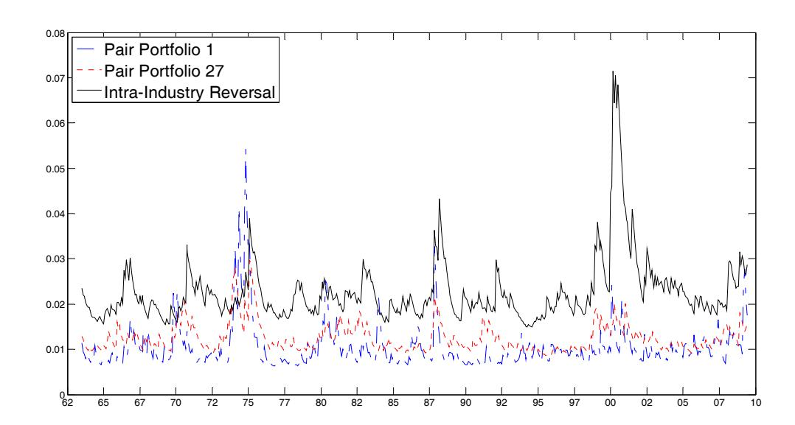

# Are Pairs Trading Profits Robust to Trading Costs?

Binh Do Department of Accounting and Finance, Monash University

> Robert Faff UQ Business School, University of Queensland

> > *31 January 2011*

*Acknowledgments:* We are greatly appreciative to the following people for their advice on various aspects of this paper – most notably, regarding the thorny issue of constructing reliable proxies for trading costs applicable to institutional investors: Henk Berkman; Stephen Brown; Carole Commerton-Forde; Ray da Silva-Rosa; Doug Foster; Bruce Grundy; Allaudeen Hameed; Bing Liang; Lasse Pedersen; Tom Smith; Gary Twite; Terry Walter. We are also thankful for advice from Leigh Sneddon, Managing Director, Blackrock, and Clare Rowsell, Head of Client Relationship Management, ITG Asia Pacific. We also benefit greatly from many helpful comments and suggestions from an anonymous referee.

#### **Are Pairs Trading Profits Robust to Trading Costs?**

#### **Abstract**

We examine the impact of trading costs on pairs trading profitability in the US equity market over the period 1963-2009. After controlling for commissions, market impact and short selling fees; we find that pairs trading remains profitable, albeit at much more modest levels. Specifically, we document a risk-adjusted return of about 30 basis points (bps) per month amongst portfolios of well matched pairs that are formed within refined industry groups. Strategies that are implemented on the top 30% largest stocks produce an average alpha of 24 bps per month. Pairs trading exhibits a lower risk and lower return profile than a short-term reversal strategy that sorts stocks relative to their industry peers. Notably, both of these forms of contrarian investing are largely unprofitable in the period post 2002.

*JEL Classification*: G11, G12, G14

# **I. Introduction**

Pairs trading is a special form of short-term contrarian strategy that seeks to exploit violations of the "law of one price". 1 An unconditional reversal strategy typically buys a group of extreme losers and sells a group of extreme winners over fixed intervals. In contrast, pairs trading identifies stocks of close economic substitutes that have also historically moved together over a long horizon, and buys the losers and sells the winners in the pairs only when they have significantly moved apart. Notably, it also implies high frequency trading. In this paper, using data from the period 1963-2009, we examine whether pairs trading in the US equity market is profitable after transaction costs.

In their pioneering work on pairs trading, Gatev, Goetzmann and Rouwenhorst (hereafter "GGR") (2006) test a simple algorithm on the US market over period 1963-2002. They document that the strategy generates a statistically and economically significant excess return in the order of 90 basis points (" bps") per month and a risk-adjusted return of 76 bps per month. These estimates are before trading costs. The authors consider the impact of the bid-ask spread, which is a noisy proxy for market impact, and see the net profit fall to 19 to 38 bps per month. They also separately examine short selling constraints by performing pairs trading in the top size deciles to filter out stocks with high short selling costs (specials) and by simulating the effect of stock recalls. Of particular concern, commissions are not taken into account in the analysis. Like any long-short strategy, pairs trading involves trading two stocks twice, at the initial divergence and at the subsequent convergence (or stop-loss closing), hence, implying two roundtrips of commissions. A failure to comprehensively

 1 Short-term return reversals in individual stocks are one of numerous capital market anomalies that are sizeable in magnitude but present little arbitrage opportunity once transaction costs are taken into account. Jegadeesh (1990) finds that a short-term contrarian trading strategy that buys extreme losers and sells extreme winners, based on their prior month returns, generates a risk-adjusted return of almost 2% per month. However, Avramov, Chordia and Goyal (2006) show that the phenomenon is caused by liquidity shocks with prices subsequently reverting once non-informational demands are accommodated. Of particular note, they find that outside investors (as opposed to market makers), are unable to profitably exploit the pattern due to prohibitive transaction costs faced by this trading intensive strategy.

account for all of these trading costs will erroneously bias evidence in favor of a market inefficiency conclusion.2

Other recent work in this nascent literature of pairs trading also fail to control for trading costs. Do and Faff (2010) focus on the declining trend in gross pairs trading profitability in recent years and attempt to identify the underlying forces. Engelberg, Gao and Jagannathan (2009) look at the role of firm-specific news and common information on pairs trading returns. Neither of these analyses takes into account trading costs.

A cross-reference to other similar literatures reveals that trading costs do play a pivotal role in a trading strategy's effectiveness such that failure to control for them has led to material upward bias in the conclusion of profitability. For example, Mitchell and Pulvino (2001) study risk arbitrage, which is another type of relative value arbitrage in equity markets where the arbitrageur seeks to profit from the spread between the target's stock price and the offer price following an acquisition announcement. After accounting for trading costs, they find that the risk-adjusted return is 4% per annum, materially lower than returns of 12.5% (and higher) reported in prior literature. Korajczyk and Sadka (2004) find that transaction costs lower momentum trading profits by 10-20 bps per month. Grundy and Martin (2001) estimate that at roundtrip costs of 1.5%, the profits on a momentum strategy become statistically insignificant, and at roundtrip costs of 1.77%, the profits are driven to zero. In the option literature, Chan, Jha and Kalimipalli (2009) combine both realized volatility and current implied volatilities to forecast future implied volatility for pricing, trading and hedging options. Although they document a superior pricing performance, they do not find any significant economic gain in option trading and hedging once transaction costs are included.

We fill this void in the pairs trading literature by explicitly incorporating all three components of direct trading costs, namely: commissions, market impact and short selling fees. In particular, we construct return time series by subtracting two roundtrips of commissions and market impact for each completed pair trade, and a short selling fee payable during the period that the pair stays open. To

 Jensen (1978) defines market efficiency with respect to an information set as the inability to profit from that information set.

obtain a long history of commissions on the US stocks, we rely on the work of Jones (2002) who estimates annual commissions on NYSE stocks paid by investors. Jones (2002) uses the regulated minimum per-share commission for the period up to 1968, and NYSE members' annual income reports for the later years. We then apply a discount of 20% on this annual series of commissions to reflect the institutional nature of long-short funds. When verified against the growing literature on institutional trading costs, this approximation proves to be remarkably close to empirical evidence reported elsewhere. It shows that the institutional commission rate per dollar peaks at 90 bps in 1974, declines steadily after the deregulation of the securities industry and falls to less than 10 bps in recent years, for an average of 34 bps over the period 1963-2009.

For market impact, using actual price statistics around pairs trading days, we produce an estimate of approximately 26 bps which realistically reflects the market impact of pairs trades that are executed within 2 days following divergence/convergence. To gauge the impact of short sale constraints, we rely on D'Avolio's (2002) description of the security lending market in the US which suggests that such constraints are not binding for larger stocks.

These costs are applied to relatively liquid stocks since we exclude those: that fall into the bottom size decile, that fail to trade on at least 1 day during the formation year, and/or with prices of less than \$1. To add further robustness to our analysis, we also consider a scenario that only includes the top 3 size decile stocks, a subset that is of particular interest to hedge funds. As such, we offer a reliable and robust analysis of the (full) after-cost performance of pairs trading strategies.3

In our analysis, we consider numerous pairs portfolios, consisting of: the baseline case studied in GGR (2006), the utility-only and bank-only portfolios studied in Do and Faff (2010) and an alternative range of other formations that draw on insights from Do and Faff (2010) – namely, industry homogeneity and inclusion of a measure of historical frequency of reversal.

 3 Mitchell and Pulvino (2001) are amongst the very few studies in the broader trading strategies literature that comprehensively account for all relevant trading costs. Korajczyk and Sadka (2004) include market impact, but not commissions in their analysis of momentum profits. Avramov et al (2006) consider commissions and market impact independently.

Our key results are as follows. On average, pairs trading is unprofitable, with the monthly excess return dropping from 93 bps to just 12 bps, once transaction costs are included. However, several portfolios of better matched pairs that are formed within refined industry groups are mildly profitable. Over the period 1963-2009, the top 4 portfolios post an average excess return of 28 bps per month, or 3.37% on an annualized basis. Consistent with prior literature, pairs trading returns are positively correlated with the short-term reversal factor and negatively correlated with market liquidity. However, amongst the top 4 portfolios, returns after adjustment for these and other common factors remain positive and significant, in the order of 30 bps per month. Over the more recent period 1989- 2009, although pairs trading is profitable with a risk-adjusted return of 45 bps for the better portfolios, the majority of this profitability is generated during the 2000-2002 bear market. While the pairs trading applied to the top 30% largest stocks is less profitable, the top 4 portfolios continue to report a statistically significant alpha of 24 bps per month (after trading costs).

Recently, Hameed, Huang and Mian (2010) document a stronger reversal effect by sorting winners and losers within same industry groups instead of across all stocks in the market. We show that pairs trading exhibits a lower risk and lower return profile than this intra-industry contrarian strategy. The latter reports an excess return of 65 bps after transaction costs but the standard deviation doubles that of the pairs strategies. When implemented on the top 30% largest stocks, the intra-industry contrarian strategy returns just 2 bps per month, confirming prior literature that such reversal effect is liquidity driven. Due to its greater trading intensity, the intra-industry strategy is also more sensitive to trading costs. Similar to pairs trading, this form of contrarian investing is largely unprofitable in recent years.

# **II. Methodology and Data**

### *The Baseline Portfolio*

Under the baseline algorithm in GGR (2006), pairs are formed by finding, for each stock in the stock universe, a partner that minimizes the normalized price spread during the formation period, chosen to be twelve months, where the normalized price is the total return index, inclusive of dividends, scaled to start at \$1 at the beginning of the formation period. Top pairs in terms of the lowest sum of squared differences in the normalized prices (hereafter, "SSD"), are chosen for trading in the subsequent trading period which is set at six months. The trading rule opens a long-short position in a pair whenever its normalized spread diverges by two historical standard deviations. Traded pairs are closed at the first reversal of the spread or at the end of the trading period if reversal never occurs. Pairs which complete a roundtrip (i.e. they diverge and converge within the trading period) are then available for trading again for that period. A typical trading portfolio in this baseline algorithm is an equally weighted combination of the top 20 pairs with the lowest SSD statistics. As in the momentum strategy literature, trading is implemented on overlapping portfolios with the whole process repeating every month without waiting for the running portfolio to complete its cycle.

# *A Critique of the Baseline Portfolio*

There are three inherent pitfalls in the baseline method. First, pairs might be formed between firms that are not inherently close economic substitutes, implying high fundamental risk leading to an increased probability of divergence. While GGR (2006) examine pairs that are matched within the S&P major sectors (Utilities, Financials, Transportation and Industrials), Do and Faff (2010) show that considerable benefit is to be gained by using finer industry classification schemes such as Fama and French's (1997) industry classification.4 Second, matching pairs only on the basis of how closely they moved together in the past may fail to recognize that profitable pairs trading requires frequent reversal in the price spread, implying the need for paired stocks to also oscillate around each other. Do and Faff (2010) introduce a measure of historical reversal in the form of the number of zero crossings (hereafter "NZC") over the formation period, and show that, when used in conjunction with the SSD metric, pairs returns increase materially, especially when industry homogeneity is also incorporated into the trading method. Third, in a deep market such as the US stock market, the top pairs might move very tightly together such that two standard deviations might be negligible in magnitude,

 4 The classification scheme, described in Appendix B of Fama and French (1997), assigns firms to one of 48 industries based on their SIC codes. This scheme is a good trade-off between the degree of homogeneity within each group and the number of members within the group, and is used by, for example, Campbell, Lettau, Malkiel and Xu (2001), to estimate aggregate industry volatility.

making it likely to open a trade at a point that is insufficient to cover bid-ask bounce and transaction costs even when stocks converge. As GGR (2006) point out, this problem is very relevant for some of the pairs in their sample.

### *Alternative Portfolios*

To enrich our analysis and enhance the robustness of the results, we conduct our investigation on a range of pairs portfolios that improve on the inherent weaknesses in the baseline algorithm.5 In total, we examine twenty-nine alternative portfolios, which differ in the way stocks are matched and pairs are selected for trading. Nine portfolios are based on the mechanical pair matching scheme, without industry restriction. Of this group of portfolios, the baseline portfolio is the object of study in GGR (2006). A second is the top 50 pairs which could have interesting diversification implications, as pointed out in GGR (2006). Portfolios 3 and 4 comprise pair 11 to pair 30 and pair 11 to pair 60, respectively. By removing the lowest SSD pairs, the portfolio seeks to filter out non-profitable, trading excessive pairs. For the next three portfolios, pairs are sorted independently based on SSD and NZC, into twenty equal parts (vigintiles). Specifically, portfolios 5, 6 and 7 are the intersection of pairs in the first, second and third SSD vigintile, respectively, and the last NZC vigintile. Finally, portfolios 8 and 9 are the intersection of pairs in the first and second SSD decile, respectively, and the last NZC decile.

The next nine portfolios (portfolios 10-18) are identical to the first nine except that the pair matching is done within the four S&P major sectors.6 For example, portfolio 10 comprises the top 20 lowest SSD pairs, chosen amongst all possible pairs that are formed within each of the four major sectors. Similarly, the next nine portfolios (portfolios 19-27) are identical to the first nine except that the pair

 5 We are acutely aware of potential data snooping issues (Lo and MacKinlay, 1990). Thus, in this exercise we retain the basic structure of the GGR algorithm with its implementation parameters, namely the duration of formation and trading periods, the trigger rule and the price-based pair matching scheme. Nevertheless, by examining a wide spectrum of portfolios, we are able to show that the performance of a given pairs portfolio is a function of various factors such as the degree of economic substitution between paired securities, the magnitude and frequency of mispricings, diversification among pairs and the trading intensity of the portfolio, the effects of which may counteract each another.

6 This classification is based on CRSP, Header Standard Industry Classification Major Group (HSICMG). Utilities are securities with HSICMG of 49. Financials are those with HSICMG between 60 and 67. Transport are securities with HSICMG between 40 and 47 and Industrials are those with HSICMG between 15 and 39.

matching is done within each of the 48 Fama-French (1997) industries. The final two portfolios (portfolios 28 and 29) are the single-industry portfolios that are tested in Do and Faff (2010), an allutility portfolio and all-bank portfolio. Table 1 summarizes these portfolio formations.

#### [Table 1 here]

There is a possibility that pairs trading is merely a disguised way of exploiting short-term return reversals widely documented in the literature (see for example, Jegadeesh, 1990). Hameed et al (2010) show that the "reversal effect" is due to reversions by firms that have deviated from their own industry peers, and not due to reversions by firms that have experienced extreme returns relative to the whole market. In particular, they examine a double sort strategy using the prior month return. Specifically, they first sort ranks stocks relative to other stocks in the market, and identify them as Market Winners (whose prior month returns fall into the top quintile), Market Losers (the bottom quintile) and Market Neutral (the middle 60%). A separate, independent, sort also identifies stocks as Industry Winners, Industry Losers and Industry Neutral in an analogous fashion.

Hameed et al (2010) find that, over 1963-2006, a contrarian strategy of buying (selling) stocks that intersect the Industry Losers (Winners) and Market Neutral categories, generates a return of 1.82% per month. This is significantly larger than a return of 1.05% achieved from the unconditional strategy of buying Market Losers and selling Market Winners. Since the Hameed et al strategy essentially matches winners and losers within industries, purporting to cancel out common factors and highlight firm-specific shocks which are expected to mean revert, it bears a striking resemblance to what we do here with pairs trading. Accordingly, we also reconstruct Hameed et al's (2010) double sort contrarian strategy and examine how it performs relative to pairs trading before and after costs.

### *Stock sample*

We apply our strategies to US stocks in the daily CRSP files with share codes 10 and 11 for the period from July 1962 to June 2009. Since our focus is to obtain a realistic picture of pairs trading profitability after accounting for various implementation constraints, we restrict our sample to liquid stocks that are relatively easy and cheap to trade and short sell. We do so by first removing stocks in the bottom size decile, using NYSE breakpoints, and those with closing prices in the one-year formation period less than \$5. Next, we screen out stocks with one or more days with no trade during the formation period, using trading volume, and stocks with one or more invalid prices/returns during the formation period. Finally, over the trading period, for pairs that have one or more invalid prices/returns, or have missing prices/returns on days that otherwise have a record, we report zero returns. These last two filters have very little impact on our results, but are included for robustness.

### *Construction of Return Time Series*

Our analyses are based on monthly return time series which is a common practice in the trading strategy literature and consistent with the benchmark GGR study. Before-cost returns are computed as the monthly marked-to-market payoffs to the pair portfolio, divided by the number of pairs in the portfolio. The strategies are repeated every month, giving rise to six return time series that are staggered by one month. The reported return time series is the equally weighted average of those time series. Finally, to obtain after-costs returns, we subtract (time-varying) trading costs from this return series, to which we now turn.

# **III. Trading Costs**

Explicit trading costs in a pairs trading program comprise two roundtrip commissions per pair trade, and short selling fees; and the implicit cost of the market impact. Trading costs are impossible to determine exactly.7 Our approach is to assemble from different sources in the literature, the best available proxy for a set of trading costs that face a marginal hedge fund at different points in our long sample period from 1963-2009. These estimates underpin our baseline analysis.

 7 Trading costs are problematic because they vary: with the sample period (the post-1970s period experienced a sharp decline in commissions due to deregulation, although the same might not be true for market impact); with the size of the trade (large orders entail lower commissions but greater market impact, and for a similar reason, institutional investors face lower commissions but possibly greater market impact costs than retail investors); and for reasons related to a whole host of other technical aspects such as the type of brokers assigned to execute the trade, and the investment style underlying the trade.

### *Commissions*

For commissions, we begin with Jones' (2002) work in which an annual time series of commissions on New York Stock Exchange (NYSE) stocks over the period 1925-2000 is reconstructed. However, since Jones' (2002) time series reflects the average commission paid by all groups of investors across the whole spectrum of stocks, it is likely to overstate the actual commissions paid by hedge funds trading relatively liquid stocks. Accordingly, to achieve a more realistic cost estimate for institutional investors, we apply a discount of 20% off Jones' estimates. Table 2 lists these estimates. It turns out that such a heuristic approach results in figures that are closely in line with the numbers reported elsewhere for institutional trades. Klaus and Stoll (1972) report 62 bps (December 1968) versus the 1969 estimate in Table 2 of 64 bps (see column 'Institutional trades'). Berkowitz , Logue and Noser (1988) report 18 bps (1985), Chan and Lakonishok (1995) 19 bps (1986-1988), and Keim and Madhavan (1997) 20 bps (1991-1992); versus our estimates in Table 2 ranging between 19 to 25 bps over the same period. Jones and Lipson (2001) report 10 bps using institutional trades executed in 1997, and so does Table 2 for the same year.

For the period 2001 to 2009, which is beyond Jones' (2002) data, we note that Investment Technology Group (ITG, a global brokerage firm that specializes in trade execution), publishes quarterly reports on institutional trading costs in recent years for several regions.8 Based on ITG's (2008 and 2010) reports, commissions on institutional trades in the US market are 10 bps in 2005, declining to 7-9 bps in the years 2006-2009. These statistics corroborate well with Jones' (2002) discounted series which also drop to 10 bps towards the end of the 1990s. We therefore augment Jones' (2002) 1963-2000 series (after the 20% discount), with ITG's estimates for the 2005-2009 period. For the intervening years 2001-2004, we use 10 bps, which seems reasonable given the trend. Table 2 summarizes these workings. It shows an average commission of 34 bps over the full sample period 1963-2009.

 8 The reports are based on actual trade data supplied by institutional investors for the purposes of bespoke posttrade transaction cost analysis (based on correspondence with Clare Rowsell, Head of Client Relationship Management, ITG Asia Pacific).

### *Market impact*

We use an ex-post direct estimate of "market impact" incurred by the hypothetical or simulated pairs trades modelled in our study – we measure exact price movements which occur immediately after the divergence signals that are picked up by our algorithms. We start by computing the spread between each pair of stocks that participate in our trading algorithms, 1 day before, on the day, and two days after, the day the pair is opened under the two historical standard deviation rule (i.e. the "divergence" day). In addition, we compute the log returns for the long leg and the short leg on each of the two days following the divergence day. If our trading rules do pick up actual pair trades in the market, or correctly identify the mean reversion pattern in the mispricing between the stocks, we should see a gradual narrowing in the spread post the divergence, caused by a positive return on the long leg and/or a negative return on the short leg. The magnitude of the returns post the divergence date should then give us an indication of the extent of actual market impact incurred by pair trades. Table 3 reports these statistics for all 29 portfolios, as well as the average across the portfolios.

#### [TABLE 3 HERE]

Across all portfolios, without exception, the spread does exhibit the expected pattern: it widens on the divergence date and gradually narrows over the subsequent two days. On average, over the full sample, the spread jumps from 4.41% to 7.56% on the divergence date, to decline to 7.02% and 6.78% in the following two days. Clearly, our algorithms successfully pick up the peak of mispricing between the pair stocks. The return statistics also show that on the day following divergence, on average, the long leg, that is the (relatively "cheap") stock to be bought in a pair trade, increases 32 bps, while for the short leg, the (relatively "dear") stock to be shorted, falls by 21 bps. The stocks continue to drift in their respective directions the following day, with the long leg increasing by another 15 bps and the short leg falling by another 9 bps. As shown in Table 3, these movements are statistically significant at the highest level of confidence.

With closing prices of the stocks in pairs trades travel in the direction of the trade in the subsequent two days, it is reasonable to assume that pairs traders will have been progressively trading at more favourable prices during the day than the closing price.9 As such, the volume-weighted average execution price should be more favourable than the closing price. This analysis is suggestive that pairs trading funds that can execute their trades within 1 day following divergence, face market impact of less than 32 bps on the long side and less than 21 bps on the short side, for an average market impact of less than 26 bps, over the period July 1963-June 2009. Since the additional price movement in the second day is 15 bps for the long leg and 9 bps for the short leg, or just 12 bps on average, it is reasonable to argue that funds that can execute their trades within 2 days following divergence achieve a volume weighted average price equal to the closing price on day 1 after divergence. This implies an average market impact of 26 bps.

Table 3 also reports the average statistics for two sub-periods, July 1963-December 1988 and January 1989-June 2009. The cut-off year of 1989 is used in Gatev et al (2006) and Do and Faff (2010) to mark the emergence of the hedge fund industry. We use the same convention here to gauge the time variation of (implied) market impact. The sub-period results show that over the period 1963-1988, the average market impact is around 30 bps (i.e. (39 + 23) / 2) for trades that are executed over 2 days following divergence, whereas over the period 1989-2009, it is markedly lower at about 20 bps (i.e. (23 + 18) / 2). Since institutional investors typically spread their trades over adjacent days to avoid severe market impact (see Chan and Lakonishok, 1995, for empirical evidence), it is reasonable to assume that pairs trading funds have their order executed well within 2 days following divergence. Thus, we assign a market impact cost of 30 bps for the period 1963-1988 and 20 bps for the period 1989-2009. While these estimates are below the market-wide numbers reported in the literature, we believe they still conservatively but realistically capture the market impact cost faced by pairs traders.

To put things in perspective, our cost estimates imply an average one-way cost (commission plus market impact) of 60 bps (i.e. 34 bps + 26 bps) for the full sample 1963-2009; 81 bps (i.e. 51 bps + 30 bps) for the 1963-1988 sub-period; 33 bps (i.e. 13 bps + 20 bps) for the 1989-2009 sub-period and 28

 9 We further verify this interpolation by looking at the return from opening to closing on the day following divergence. We do this using data over the period August 1992 to June 2009 when opening prices are available in CRSP. We indeed find a positive and significant return from opening to closing for the long stock and a negative and significant return for the short stock.

bps (i.e. 8 bps + 20 bps) for the most recent 3 years. Since a pair trade involves two roundtrips, this magnitude of costs will substantially reduce pairs trading profits.

### *Short selling constraints*

Relative value arbitrageurs in the equity market face short-sale constraints in three forms: the inability to short securities at the time desired (shortability); the cost of shorting in the form of a loan fee, which can be relatively low for the so-called "general collaterals" or very high for the so-called "specials"; and finally, the possibility of the borrowed stock being recalled prematurely. According to D'Avolio (2002) who examines the borrowing market using a proprietary sample covering 2000- 2001, the constraints are not severe in recent years: 84% CRSP stocks (or 99% by market value) can be shorted, only 7% of the loan supply is borrowed, and only 2% of the stocks on loan are recalled. We choose to explicitly control for short sale constraints by including a constant loan fee of 1% per annum payable over the life of each pair trade. Since this 1% fee is conservative with respect to D'Avolio's (2002) estimate of 0.6% in the 2000-2001 period, on balance, applying the fee across the whole sample is expected to yield reliable results.

# **IV. Results**

# *Pairs Trading RiskReturn Profile*

Tables 4 and 5 report the distribution of excess return time series before and after trading costs, respectively, for 29 pairs portfolios as described in Table 1. Before trading costs, the 29 pairs portfolios generate monthly excess returns that range from 70 bps to 115 bps, for an average of 93 bps. These excess returns are statistically significant at the 1% confidence level. Standard deviations are remarkably low, in the order of 1%, resulting in very high Sharpe ratios, ranging from 0.35 to 1.05. The z-statistics computed for the estimated Sharpe ratios, using Lo's (2002) standard errors that are robust to non-iid returns, show that the ratios are also highly significant. These statistics point to a market-neutral strategy that successfully picks up a steady source of small mispricings across different market conditions.

#### [Tables 4 and 5 here]

However as shown in Table 5, once transaction costs are accounted for, pairs trading profitability is reduced substantially, with monthly excess returns ranging from -7 bps to 35 bps, for an average of 12 bps across the 29 pair portfolios. Nevertheless, as many as half of the portfolios are able to generate statistically significant profits, with statistically significant Sharpe ratios. In particular, portfolios 6, 14, 15, 17 and 23 to 29 are profitable after costs, mostly at the 1% significance level. All of these portfolios share one thing in common: their pairs are matched using both the SSD and NZC metrics (recall that the former captures the "closeness" in historical price paths and the latter measures the "oscillation" or reversal frequency).10 The four best performing portfolios according to the Sharpe ratio, namely portfolios 24, 25, 27, and 29, report an average excess return of 28 bps per month, or 3.37% p.a. In contrast, unprofitable portfolios (numbered 1 to 4, 7, 9 to 13, 16 and 19 to 21), tend to be those that use SSD as the only filter, and/or worse still, allow stocks to be matched freely across industries or only within sectors instead of narrowly defined industries. In the next subsection, we take a closer look at the relative performance amongst the various portfolios.

Tables 4 and 5 also report the excess returns to an intra-industry contrarian strategy examined by Hameed et al (2010). As described previously, this strategy also buys industry losers and sells industry winners, with both winners and losers not falling in the extreme return groups when sorted relative to other stocks in the whole market. Compared to the pairs portfolios, the intra-industry strategy exhibits a much higher return-higher risk profile, with a significantly large before-cost excess return of 1.91% per month, and standard deviation doubling that of pairs trading (2.35% compared to an average of 0.93% across the 29 pairs portfolios).11 As a result, Table 4 shows that, while the intraindustry strategy significantly outperforms the pairs portfolios on the size of the mean return, it ranks

 10 Notably, portfolios 7, 9 and 16 also incorporate both SSD and NZC, yet generate losses or insignificant profits. These portfolios do not perform pair matching within refined industries and are rather "aggressive" in skipping the most closely co-moving, presumably less mispriced, pairs. Specifically, portfolio 9 is the intersection of the second lowest SSD decile and the highest NZC decile, thus discarding the top 10% lowest SSD pairs. Similarly, portfolios 7 and 16 combine the third lowest SSD vigintile with the top NZC vigintile, again skipping the top 10% most closely co-moving pairs.

11 This slightly stronger result of 1.91% compared to 1.82% reported by Hameed et al (2010) is due to slightly different sample periods, and due to us using a more refined industry classification with 48 industries instead of 12 sectors as per the original study. The authors also make this observation in their section 3.2.3.

only 13 amongst all 30 portfolios on the Sharpe ratio metric. While there is an obvious overlap between the two effects, with correlations between the pairs portfolios and the intra-industry returns measured at only about 0.13, there is a nontrivial distinction between them. Although they both seek to exploit a performance differential amongst stocks within an industry, pairs trading sources profits from temporary divergence amongst pairs of stocks that have historically moved closely together, whilst the intra-industry strategy sources profits from extreme performance of individual stocks in either direction. It is therefore of little surprise that pairs trading profits are smaller and more steady, while industry reversal profits are larger and more volatile. Figure 1 further illustrates the lower risk profile associated with pairs trading by plotting the GARCH (1,1) conditional volatilities of two representative pairs portfolios, 1 and 27, and of the intra-industry reversal strategy. Clearly, the latter exhibits markedly larger return fluctuation throughout the sample period.

#### [Figure 1 here]

A question of more practical relevance is how the intra-industry reversal performs after transaction costs, given its much larger returns than pairs trading. The statistics from Table 5 shows that the strategy remains profitable once costs are taken into account, with an excess return of 65 bps per month, well exceeding those of all our pairs portfolios. Moreover, the Sharpe ratio is 0.28 and statistically significant (ranking 3rd across all tested portfolios). This strong after-cost performance is achieved despite its greater trading intensity compared to the pairs portfolios: the pairs portfolios turn over once every 2.7 months (unreported), whereas the intra-industry strategy trades one roundtrip per month by construction.12

# *Relative Performance across Pairs Portfolios*

In evaluating the 29 pairs portfolios, we focus on the after-cost performance because it helps to highlight the sub-optimality of trading on tiny divergence that might be prevalent amongst pairs with the lowest SSDs. As is clear from Table 5, portfolio ranking is very similar under the Sharpe ratio

 12 However, as will be seen in our sensitivity analysis later on, this outperformance by the intra-industry disappears when we restrict our sample to the top 3 size decile stocks, a subset that is arguably more relevant to hedge funds due to its greater liquidity.

metric and the mean return metric. Another immediate observation is that portfolio 1 (the baseline portfolio), which comprises the 20 lowest SSD pairs (as studied in Gatev et al, 2006) underperforms all of the alternative portfolios that we propose in this paper. In fact, Table 5 lends support to all three pairs trading principles we suggest: matching pairs within well defined industries, combining SSD and NZC, and removing close pairs with the lowest SSDs.

In particular, industry homogeneity proves an important driver of pairs trading performance, confirming Do and Faff's (2010) results. In particular, portfolios that comprise pairs matched within industries, rank higher than those with pairs matched 'unconditionally' across the entire stock universe, and this improvement is larger for Fama and French's (1997) finer industry classification, compared to the more coarse 4 major sector classification. For example, portfolio 20, which comprises the top 50 lowest SSD pairs matched within Fama-French's (1997) 48 industries, ranks 17th, which is better than its 'major-sector' counterpart, portfolio 11, which ranks 21st. This latter portfolio in turn ranks better than portfolio 2, the unconditionally matched portfolio of top 50 lowest SSD pairs.

Similarly, the results improve as we move from portfolios that are made up of pairs in the lowest SSD group to those that comprise the next lowest SSD group (e.g., from portfolio 1 to portfolio 3, from 2 to 4, from 5 to 6, from 10 to 12, from 19 to 21, from 20 to 22, and from 26 to 27). Recall that the rationale for removing the lowest SSD pairs is that such pairs by construction are those that historically move together 'too' closely such that a 2 standard deviation divergence amongst them will be too small to cover trading costs.

Furthermore, better Sharpe ratios are generated as we move from portfolios whose pairs are matched on the basis of SSDs alone to those whose matching combines both SSD and NZC. For example, portfolios 5 and 8 outperform portfolios 1and 2, portfolio 6 outperforms portfolios 3 and 4, portfolio 14 and 17 outperform portfolios 10 and 11 and portfolios 24 and 27 outperform portfolios 21 and 22. Indeed, as pointed out previously, all profitable strategies are those that integrate both SSD and NZC in their pair matching.

The two industry specific portfolios, Utilities (portfolio 28) and Banks (portfolio 29) are also expected to perform well due to the depth and homogeneity of these industries. Table 5 confirms that: Banks (Utilities) ranks 8 (11) in terms of the Sharpe ratio and generating a mean excess return of 25 (13) bps per month. Note that the Bank portfolio ranks just 27th, pre-transaction costs (Table 4). Its jump in the ranking on an after-cost basis suggests that the Banks portfolio is trading less frequently relative to other portfolios, hence, incurring lower trading costs. In untabulated analysis, we find that this is indeed the case, with the Banks portfolio reporting the lowest number of trades per pair (2.2 trades per six month trading period, compared to an average of 2.9 trades across all portfolios).

### *Risk Characteristics of Pairs Trading Strategies*

Next, we ask if pairs trading is profitable on a risk-adjusted basis. We consider several risk factor specifications that have had some success in explaining cross-sectional returns, with factors that are expected to correlate with pairs trading returns. We start off with a four factor model that augments the standard Fama and French (1993) model with the momentum factor. Since pairs trading is a shortterm reversal phenomenon, the first model we consider further augments this model with a marketwide short term reversal factor in the spirit of Jegadeesh (1990). This specification, Model 1, is also used by Gatev et al (2006) to adjust for risk. Hameed et al (2010) show that a more pronounced reversal effect exists within industries. Therefore, we consider a second specification that replaces the market-wide reversal factor in Model 1 by the intra-industry reversal factor examined previously ('Model 2').

In addition, liquidity has been known to contribute significantly to the short-term reversal effect. Avramov et al (2006) find that the strongest reversal occurs amongst illiquid stocks as the price pressure for immediacy is accommodated. Engelberg el al (2009) find part of pairs trading profits comes from providing liquidity when it is needed. Accordingly, Model 3 examines this relation, with the four factors (Fama-French 3 factors plus the momentum factor) combined with Pastor and Stambaugh's (2003) liquidity factor. To avoid spurious regression, we use the liquidity innovation series available in WRDS (see, for example, Hameed et al, 2010).

Pairs trading might also be driven by a distress factor. The underperformance of the 'loser' stock relative to its peers could be due to it facing a relatively higher perceived default risk (possibly because of higher indebtedness). Consistent with this view, a divergence will reverse when there is a surprise improvement in the stock if it survives. Such a sequence seems particularly applicable during turbulent markets. In fact, Do and Faff (2010) document a surge in pairs trading profits during bear markets. This also makes sense because more frequent mispricing opportunities seem to arise in such times of panic. Therefore, we should expect a positive relation between pairs trading returns and some aggregate level of distress. We examine this possibility by considering a model that combines Fama-French and momentum factors with an aggregate measure of idiosyncratic volatility ('Model 4'). We construct this measure using Campbell, Lettau, Malkiel and Xu's (2001) decomposition scheme that decomposes total volatility into three orthogonal components: market-level, industry-level and firmlevel (or idiosyncratic) volatilities. Tables 6 and 7 report the regression results for each of these models, on before-cost and after-cost returns, respectively.

#### [Tables 6 and 7 here]

Results from Table 6 show that, as expected, pairs profits are positively related to short term reversal factors (Models 1 and 2) and strongly negatively related to liquidity (Model 3). The relations are statistically significant in many of the 29 portfolios examined. The intra-industry return reversal better explains pairs trading returns than the market return reversal factor because the former bears closer resemblance to pairs trading, as discussed previously. In contrast, idiosyncratic volatility has a negligible relation to pairs returns. Notably, none of the models can explain away the pairs trading effect on a before cost basis. While the model with an intra-industry factor (Model 2) appears best able to explain the pairs return, the alphas remain large and significant, averaging 87 bps across the 29 portfolios. This finding confirms that pairs trading is not a disguised form of intra-industry reversal.

The after-cost results in Table 7 show that several portfolios deliver positive abnormal returns. Most notably, the portfolios that are profitable before risk adjustment, namely, portfolios 5, 6, 8, 14, 15, 17, 18 and 22 to 29 (Table 5), continue to be profitable after risk adjustment. Furthermore, the portfolios that ranked highest in the previous section on a raw return basis, i.e. portfolios 24, 25, 27 and 29, continue to outperform on a risk-adjusted basis, with average monthly abnormal returns ranging from 27 bps (Model 2 average) to 34 bps (Model 4 average), or 3.18% to 4.09% on an annualized basis.13

Do and Faff (2010) find that pairs trading profits decline in recent years, but that the decline is interrupted by strong surges during bear markets. We re-examine that evidence on an after-cost basis to see if the corresponding decline in commissions over the same period helps to offset the diminishing effect. Following that study, we focus on the recent sample from January 1989-2009 and segment it into four sub-periods as follows: January 1989-December 1999; January 2000-December 2002; January 2003-June 2007; and July 2007-June 2009. The second sub-period corresponds to the bear market that spans the dotcom bust, the September 11 terrorist attack and the SARS mini pandemic, and the fourth sub-period corresponds to the recent global financial crisis. We perform a factor regression using Model 1 for these sub-periods and report the results in Table 8.

#### [Table 8 here]

We can see that pairs trading has been profitable for several portfolios over recent years from 1989- 2009, with the top 4 portfolios (24, 25, 27 and 29) reporting an average alpha of 45 bps per month. However, the majority of pairs profits was generated during the 2000-2002 bear market, with an average alpha of as much as 1.26% per month for the top 4. The bull market that followed witnesses a much more subdued pairs trading effect, with alphas averaging just 1 bps for these top performers. Pairs profits improved again during the bear market period of July 2007-June 2009, but the magnitude falls well short of that of the previous bear market. Over the global financial crisis, the top 4 portfolios deliver an average monthly alpha of 14 bps, although the raw return is higher at 30 bps.

The attribution analysis in Do and Faff (2010) (see Table 3, Panel B) shows that the declining trend post 2002 is driven by a drop in the size of mispricings amongst paired stocks. In addition, this effect outweighs improvements in arbitrage uncertainty, as a greater percentage of pairs converge in recent years than had been the case before. Using the same type of analysis to decipher the difference in

 13 For comparison, in un-tabulated results, the risk-adjusted return on Hameed et al's (2010) intra-industry contrarian strategy is 66 bps based on Model 1, 51 bps based on Model 3 and 40 bps based on Model 4.

performance between the two bear markets, we also find the same dynamic. On the one hand, the recent bear market (July 2007-June 2009) witnesses a greater proportion of converged pairs: 67% of pairs from the top 4 portfolios experienced at least one convergence over the six-month trading interval, compared to just 55% over the earlier bear market (January 2000-December 2002). On the other hand, the former's weighted average profit per pair, holding the pair composition constant, is 1.23 percentage points lower per month.

Another useful statistic is the average divergence amount across all traded pairs, which indicates the magnitude of mispricings a typical pair trade seeks to exploit. This statistic is 8.24% in the second bear market, compared to 10.00% in the first one. In short, violations of the law of one price appear less severe in magnitude in the second bear market, leading to lower realized profits. Whilst one might interpret this as evidence of improved market efficiency (either due to investors being more rational or hedge funds being more aggressive in exploiting anomalies), another possibility is that the financial nature of the latter bear market means that the impact on stocks is more uniform, thus relative mispricings would be less pronounced.

At the risk-adjusted level, the performance differential between the two bear markets is also caused by stronger factor loadings in the second bear market, in the expected direction. In particular, for Model 1, which is the risk specification used in Table 8, over period January 2000-December 2002, the average loading for the short-term reversal factor is -0.0093 for all 29 portfolios and -0.0118 for the top 4 portfolios, although *a priori* the factor should have a positive loading. Over the recent bear market, July 2007-June 2009, the average loadings are indeed positive, 0.0513 for all 29 portfolios and 0.0299 for the top 4 portfolios. Similarly, for Model 3 (with a liquidity factor added), the average estimated loading for liquidity, which should be negative, changes from 0.0068 to -0.0727 for all 29 portfolios and from 0.0342 to -0.0848 for the top 4 portfolios. These risk factors seem more relevant in the latter bear market. On the other hand, the average estimated loading for idiosyncratic volatility (i.e. Model 4) drops from 0.2755 to -0.0989 whereas we expect a positive sign. One explanation for this result is that volatility may have a quadratic effect on pairs trading returns: high idiosyncratic volatility induces severe mispricings, but too much volatility implies distress which can cause divergence.14

### *Sensitivity Analysis*

This section adds further robustness to our results by considering two additional settings. Since successful execution of pairs trading programs heavily hinges on the ability to trade securities quickly with minimal implementation costs, in the analysis reported up to this point, we have excluded small stocks with market capitalizations that fall in the bottom decile and those with prices less than \$5. Here, we apply an even more stringent filter, retaining only stocks in the top 3 size deciles.15 Panel A of Table 9 reports after-costs results for the 29 pairs portfolios as well as the intra-industry reversal portfolio, with stocks chosen from the top 3 size deciles of the CRSP universe.

Naturally, large cap stocks should attract lower commissions as a percentage of the trade value because commissions are charged as a number of cents per share. From the ITG report (ITG, 2010), this 'large cap' discount can be 10-15% in the 2005-2010 period. In addition, we also re-estimate market impact for this large cap subset using actual price movements following the divergence day, that is, in the same way we did to construct Table 3. In unreported results, we find that the market impact measure indeed drops slightly, by 3-4 bps, for stocks in the top 3 deciles. Note also that we had conservatively assumed in our market impact estimation that orders are executed over two days following the divergence day. Here, in our second robustness check we consider a more realistic cost assumption for large stocks, with one-way trading costs dropping 10 bps (from an average of 68 bps). Panel B of Table 9 reports results for the top 3 decile stocks that incorporate this lower cost assumption.16

 14 We thank an anonymous referee for suggesting that we explore the potential of differential factor loadings to explain the variation in results across the two bear phases.

15 In some private discussions with some hedge fund managers, it was suggested that this subset is more relevant to long-short strategies where the need for quick execution is paramount.

16 A global asset management firm that we contacted suggests that in contemporary market settings small funds that trade large caps face a one-way cost of around 15 bps (both commissions and market impact). Our estimates come in at 18 bps for the years 2007-2009.

While the restriction of pairs trading to large stocks markedly reduces profits, the top four pairs portfolios, 24, 25, 27 and 29, remain profitable for the whole sample, both at the raw level and at the risk-adjusted level. For the full sample, their alphas (based on Model 1) reduced from an average of 32 bps (i.e. (39+31+30+28)/4 from Table 7) to 24 bps (i.e. (10+39+26+21)/4) (Table 9, Panel A). In contrast, the intra-industry reversal returns are no longer significant, with an alpha of just 9 bps and a raw return of 2 bps (recall from Table 5 that the raw return for this strategy without the top 3 size decile restriction is 65 bps). Clearly, like the short-term reversal effect in general, the intra-industry reversal phenomenon is concentrated amongst less liquid stocks, much more so than the case for pairs trading.

Within the recent period 1989-2009, the declining trend reported previously also applies for this large cap subset. The top 4 pairs trading portfolios produce monthly alphas that average 27 bps, 56 bps, -19 bps and -11 bps for sub-periods January 1989-December 1999, January 2000-December 2002, January 2003-June 2007 and July 2007-June 2009, respectively. Once again, the profit drop in the last two sub-periods is caused by lower mispricings as well as stronger factor loadings.17 The intraindustry reversal strategy also sees its alpha dropping from 27 bps and 76 bps in the first two subperiods to -61 bps and -31 bps in the last two sub-periods.

Finally, when a lower cost assumption is applied to the top 3 size deciles (Panel B), all pairs portfolios, except for the baseline portfolio and portfolios 10 and 14, report positive and significant risk-adjusted returns, for the full sample. The average alpha for the top 4 pairs portfolios improves from 24 bps to 37 bps. The intra-industry strategy reports a more markedly improved alpha, 34 bps compared to 9 bps. The intra-industry strategy, being more trading intensive than the pairs strategies, exhibits greater sensitivity to trading costs. Over the recent 4 sub-periods, under this lower cost scenario, the top 4 pairs trading portfolios report average alphas of 36 bps, 65 bps, -11 bps and 0 bps, respectively, whilst the intra-industry portfolio generates 47 bps, 96 bps, -41 bps and -17 bps

 17 Two pairs portfolios that post unusually strong performance over the period July 2007-June 2009 before the size restriction, portfolios 8 (51 bps) and 15 (128 bps) in Table 8, cease to do so when pairs trading is restricted to the top 30% of stocks by market capitalization. Specifically, their alphas for the period are 33 bps (statistically insignificant) and -14 bps, respectively.

respectively. Profits from contrarian investing amongst liquid stocks seem to have disappeared in recent years.

### *Discussion*

In short, based on our evidence, pairs trading profits have vanished since about 2002 as relative mispricings, or equivalently, trading opportunities, have lessened. However, taken over a long period from 1963 to 2009, applying a pairs trading strategy with well-matched pairs is a mildly profitable phenomenon. Does it mean that hedge funds have not discovered this anomaly until recently, or have we missed some factors in our risk specification? Both potential explanations have their own merit. The hedge fund industry which emerged in the early 1990s may have been drawn to the idea with the circulation of the original GGR paper in 1999. Intensified competition coupled with advances in execution technology might have seen the effect exploited away.18

On the other hand, it is also plausible that we have not completely accounted for relevant risk factors in the documented profitable results for periods prior to 2003. Unlike momentum and contrarian investing, or other return-based anomalies, pairs trading is an arbitrage strategy. More specifically, it is a risk arbitrage as opposed to textbook arbitrage that is risk free. The risks facing pairs traders are, among other things, the unexpected arrival of firm specific shocks that cause a permanent divergence in the spread (referred to as fundamental risk in Schleifer and Vishny, 1997), or a failure by pairs traders or contrarian traders as a group to gain critical mass to bring about convergence (or a synchronization risk pointed out in Abreu and Brunnermeier (2002), or a "crowd-trade effect" discussed in Stein (2009)). Stein (2009) shows that arbitrageurs are also exposed to a risk that fellow arbitrageurs who are highly leveraged might be forced to unwind their position when getting hit in an unrelated part of their portfolio. The "quant crisis" of August 2007 as detailed in Khandani and Lo (2007) is the most recent reminder of this leverage effect.

 18 Do and Faff (2010) show, however, that increased competition is not the main explanation for the drop in profitability before and after 1990.

We do not account for these "limits to arbitrage" in our regressions. Consequently, the profit documented for periods prior to 2003 might be simply compensation for arbitrageurs bearing these risks, whereas the near zero alphas reported for the period post 2002 could reflect steeper losses for pairs traders over this time. Future attempts to evaluate the performance of arbitrage strategies need to draw on the works like Fung and Hsieh (2002 and 2004) where asset-based style factors are constructed from market prices to capture the common components in hedge fund returns.

# **V. Conclusion**

We re-examine evidence of pairs trading in the presence of transaction costs to investigate if the potential profits documented in the literature are attainable. We extensively consult the growing literature on trading costs to reconstruct a realistic series of trading costs facing institutional investors over time, namely, commissions, market impact and short selling fees. After controlling for costs and accounting for systematic risks, we find that the baseline approach of Gatev et al (2006) loses its profitability. Pairs trading only remains profitable in a relatively small number of refined versions and then at much diminished levels. Portfolios of better matched pairs that are formed within refined industry groups produce a risk-adjusted return of about 30 bps per month over the period 1963-2009. When implemented on the top 3 deciles of stocks in terms of market capitalization, the same portfolios report an alpha of 24 bps per month. We also show that pairs strategies offer a lower risk and lower return profile compared to Hameed et al's (2010) similar contrarian strategy that buys extreme losers and sells extreme winners that are sorted within industries. Although recent evidence points to disappearing profits, pairs trading can represent a small return and low risk opportunity for those institutional investors who can quickly and, at low costs, execute trades to exploit temporary mispricings amongst relatively liquid stocks in the US equity market.

#### **References**

Abreu, D. and M. Brunnermeier, 2002, Synchronization risk and delayed arbitrage, *Journal of Financial Economics* November-December, 341-360. Avramov, D., T. Chordia, and A. Goyal, 2006, Liquidity and autocorrelations in individual stock returns, *Journal of Finance* 61, 2365-2394. Berkowitz, S., D. Logue, and E. Noser. 1988, The total cost of transactions on the NYSE, *Journal of Finance* March, 97-112. Campbell, J., M. Lettau, B. Malkiel and Y. Xu, 2001, Have individual stocks become more volatile? An empirical exploration of idiosyncratic risk, *Journal of Finance* 51, 1-43. Chan, W.H., R. Jha, and M. Kalimipalli, 2009, The economic value of using realized volatility in forecasting future implied volatility, *Journal of Financial Research* 32, 231-259. Chan, L. and J. Lakonishok, 1995, Behaviour of stock prices around institutional trades, *Journal of Finance* 50, 1147-1174. D'Avolio, G., 2002, The market for borrowing stocks, *Journal of Financial Economics* 66, 271-306. Do, B. and R. Faff, 2010, Does simple pairs trading still work?, *Financial Analysts Journal* 66, 83-95. Duffie, D., N. Garleanu, and L. Pedersen, 2002, Securities lending, shorting and pricing, *Journal of Financial Economics* 66, 307-339. Engelberg, J., P. Gao, and R. Jagannathan, 2009, An anatomy of pairs trading: The role of idiosyncratic news, common information and liquidity, Working Paper. Fama, E. and K. French, 1993, Common risk factors in the returns on stocks and bonds, *Journal of Financial Economics* 33, 3-56. Fama, E. and K. French, 1997, Industry costs of equity, *Journal of Financial Economics* 43, 153-193. Fung, W and D. Hsieh, 2002, Asset-based style factors for hedge funds, *Financial Analysts Journal* 58, 16-27. Fung, W and D. Hsieh, 2004, Hedge fund benchmarks: A risk-based approach, *Financial Analysts Journal* 60, 65-80. Gatev, E., W. Goetzmann, and K. Rouwenhorst, 2006, Pairs trading: Performance of a relative value arbitrage rule, *Review of Financial Studies* 19, 797-827. Grundy, B. and J. Martin, 2001, Understanding the nature of the risks and the sources of the rewards to momentum investing, *Review of Financial Studies* 14, 29-78. Hameed, A., J. Huang, and G.M. Mian, 2010, Industries and stock return reversals, http://ssrn.com/paper=1570566. ITG, 2010, ITG's global commission review report: 2010 Q1, http://www.itg.com/2010/07/16/itgsglobal-commission-review-2010-q1/ Keim, D. and A. Madhavan, 1997, Transaction costs and investment style: an inter-exchange analysis of institutional equity trades, *Journal of Financial Economics* 46, 265-292. Korajczyk, R. and R. Sadka, 2004, Are momentum profits robust to trading costs? *Journal of Finance* 59, 1039-1082. Kraus, A. and H. Stoll, 1972, Price impact of block trading on the New York Stock Exchange, *Journal of Finance* June, 569-588. Jegadeesh, N., 1990, Evidence of predictable behaviour in security prices, *Journal of Finance* 45, 881-898. Jegadeesh, N. and S. Titman, 1993, Returns to buying winners and selling losers: Implication for stock market efficiency, *Journal of Finance* 48, 65-91. Jensen, M., 1978, Some anomalous evidence regarding market efficiency, *Journal of Financial Economics* 6, 95–101. Jones, C. and M. Lipson, 2001, Sixteenths: Direct evidence on institutional execution costs, *Journal of Financial Economics* 59, 253-278. Jones, C., 2002, A century of stock market liquidity and trading costs, Working paper, Columbia University. Khankani, A. and A. Lo, 2007, What happened to the quants in August 2007?, *Journal of Investment Management* 5, 5-54. Lo, A., 2002, The statistics of Sharpe ratios, *Financial Analysts Journal* 58, 36-52 Lo, A. and C. MacKinlay, 1990, Data snooping biases in tests of financial asset pricing models, *Review of Financial Studies* 3, 175-205.

Mitchell, M. and T. Pulvino, 2001, Characteristics of risk and return in risk arbitrage, *Journal of Finance* 56, 2135-2175. Pastor, L. and R. Stambaugh, 2003, Liquidity risk and expected stock returns, *Journal of Political Economy* 111, 642-685. Schleifer, A. and R. Vishny, 1997, The limits of arbitrage, *Journal of Finance* 52, 35-55. Stein, J., 2009, Sophisticated investors and market efficiency, *Journal of Finance* 64, 1517-1547.

**TABLE 1. Pairs Portfolio Formation.** 

| Portfolio | Unconditional |       |        |   |   |                                           |
|-----------|---------------|-------|--------|---|---|-------------------------------------------|
|           |               | Major | sector |   |   |                                           |
| 1         | x             |       |        | x |   | Top 20 pairs                              |
| 2         | x             |       |        | x |   | Top 50 pairs                              |
| 3         | x             |       |        | x |   | Pairs 11- 30                              |
| 4         | x             |       |        | x |   | Pairs 11-60                               |
| 5         | x             |       |        | x | x | 1st                                       |
|           |               |       |        |   |   | SSD vigintile ∩ 20th NZC vigintile        |
| 6         | x             |       |        | x | x | 2nd SSD vigintile ∩ 20th NZC vigintile    |
| 7         | x             |       |        | x | x | 3rd SSD vigintile ∩ 20th NZC vigintile    |
| 8         | x             |       |        | x | x | 1st                                       |
|           |               |       |        |   |   | SSD decile ∩ 10th NZC decile              |
| 9         | x             |       |        | x | x | 2nd SSD decile ∩ 10th NZC decile          |
| 10        |               | x     |        | x |   | Top 20 pairs                              |
| 11        |               | x     |        | x |   | Top 50 pairs                              |
| 12        |               | x     |        | x |   | Pairs 11- 30                              |
| 13        |               | x     |        | x |   | Pairs 11-60                               |
| 14        |               | x     |        | x | x | 1st                                       |
|           |               |       |        |   |   | SSD vigintile ∩ 20th NZC vigintile        |
| 15        |               | x     |        | x | x | 2nd SSD vigintile ∩ 20th NZC vigintile    |
| 16        |               | x     |        | x | x | 3rd SSD vigintile ∩ 20th NZC vigintile    |
| 17        |               | x     |        | x | x | 1st                                       |
|           |               |       |        |   |   | SSD decile ∩ 10th NZC decile              |
| 18        |               | x     |        | x | x | 2nd SSD decile ∩ 10th NZC decile          |
| 19        |               |       | x      | x |   | Top 20 pairs                              |
| 20        |               |       | x      | x |   | Top 50 pairs                              |
| 21        |               |       | x      | x |   | Pairs 11- 30                              |
| 22        |               |       | x      | x |   | Pairs 11-60                               |
| 23        |               |       | x      | x | x | 1st                                       |
|           |               |       |        |   |   | SSD vigintile ∩ 20th NZC vigintile        |
| 24        |               |       | x      | x | x | 2nd SSD vigintile ∩ 20th NZC vigintile    |
| 25        |               |       | x      | x | x | 3rd SSD vigintile ∩ 20th NZC vigintile    |
| 26        |               |       | x      | x | x | 1st                                       |
|           |               |       |        |   |   | SSD decile ∩ 10th NZC decile              |
| 27        |               |       | x      | x | x | 2nd SSD decile ∩ 10th NZC decile          |
| 28a       |               |       | x      | x | x | Top 20 NZC pairs amongst top 50 SSD pairs |
| 29b       |               |       | x      | x | x | Top 20 NZC pairs amongst top 50 SSD pairs |

Note: This table summarises the formation of 29 pairs portfolios. "Unconditional matching" means stocks are matched across the stock universe. "Major sector matching" means stocks are matched within each of the four Standard & Poors major sectors "Utilities", "Financials", "Industrials" and "Transport". "Industry matching" means stocks are matched within each of the 48 Fama and French (1997) industry groups. "SSD ranking" means pairs are ranked in the ascending order of the SSD statistic (sum of squared differences). "NZC ranking" means pairs are ranked in the ascending order of the NZC statistic (number of zero crossings). Symbol ∩ denotes the intersection of two sets. An "x" indicates that the relevant method is applied for that portfolio. a(b) Pairs are formed amongst Utilities (Banks) stocks using Fama and French (1997) 48 industry classification.

**TABLE 2. Estimates of One-way Commissions.**

| Year | All trades | Institutional trades | Year | All trades | Institutional trades |
|------|------------|----------------------|------|------------|----------------------|
| 1963 | 87         | 70                   | 1987 | 25         | 20                   |
| 1964 | 89         | 71                   | 1988 | 24         | 19                   |
| 1965 | 89         | 71                   | 1989 | 25         | 20                   |
| 1966 | 83         | 66                   | 1990 | 25         | 20                   |
| 1967 | 84         | 67                   | 1991 | 26         | 21                   |
| 1968 | 85         | 68                   | 1992 | 24         | 19                   |
| 1969 | 80         | 64                   | 1993 | 21         | 17                   |
| 1970 | 79         | 63                   | 1994 | 21         | 17                   |
| 1971 | 82         | 66                   | 1995 | 20         | 16                   |
| 1972 | 76         | 61                   | 1996 | 17         | 14                   |
| 1973 | 70         | 56                   | 1997 | 13         | 10                   |
| 1974 | 90         | 72                   | 1998 | 12         | 10                   |
| 1975 | 85         | 68                   | 1999 | 12         | 10                   |
| 1976 | 71         | 57                   | 2000 | 12         | 10                   |
| 1977 | 68         | 54                   | 2001 | na         | 10                   |
| 1978 | 69         | 55                   | 2002 | na         | 10                   |
| 1979 | 60         | 48                   | 2003 | na         | 10                   |
| 1980 | 56         | 45                   | 2004 | na         | 10                   |
| 1981 | 51         | 41                   | 2005 | na         | 10                   |
| 1982 | 41         | 33                   | 2006 | na         | 9                    |
| 1983 | 35         | 28                   | 2007 | na         | 7                    |
| 1984 | 32         | 26                   | 2008 | na         | 8                    |
| 1985 | 31         | 25                   | 2009 | na         | 9                    |
| 1986 | 28         | 22                   |      |            |                      |

Note: This table lists estimates of one-way commissions by year, from 1963-2009, expressed in basis points. Column "All trades" lists Jones' (2002) market-wide estimates for the period 1963- 2000. The numbers in column "Institutional trades" up to 2000 are our approximation of commissions paid by institutional investors, set to be 80% of Jones' (2002) market-wide series. The estimates for period 2005-2009 in column "Institutional trades" are based on actual institutional commissions reported by ITG (2008 and 2010) for the period 2005-2009. The estimates for the period 2001-2004 are based on our own interpolation. Collectively, the numbers in column "Institutional trades" are used to compute after-costs returns in our analysis.

**TABLE 3. Price Behaviour around Pair Trades.** 

| Portfolio | SpreadT-1 | SpreadT | SpreadT+1 | SpreadT+2 | LongT+1 | t-stat | ShortT+1 | t-stat | LongT+2 | t-stat | ShortT+2 | t-stat |
|-----------|-----------|---------|-----------|-----------|---------|--------|----------|--------|---------|--------|----------|--------|
| 1         | 0.0308    | 0.0546  | 0.0498    | 0.0479    | 0.0030  | 26.08  | -0.0018  | -16.88 | 0.0014  | 13.60  | -0.0005  | -4.71  |
| 2         | 0.0355    | 0.0611  | 0.0565    | 0.0545    | 0.0029  | 38.30  | -0.0017  | -23.44 | 0.0014  | 19.41  | -0.0006  | -8.19  |
| 3         | 0.0349    | 0.0603  | 0.0556    | 0.0536    | 0.0031  | 25.46  | -0.0016  | -14.23 | 0.0013  | 11.71  | -0.0007  | -6.34  |
| 4         | 0.0385    | 0.0656  | 0.0611    | 0.0591    | 0.0029  | 35.55  | -0.0016  | -21.11 | 0.0013  | 17.71  | -0.0007  | -9.35  |
| 5         | 0.0345    | 0.0634  | 0.0573    | 0.0553    | 0.0036  | 23.73  | -0.0025  | -16.50 | 0.0014  | 9.93   | -0.0006  | -4.55  |
| 6         | 0.0476    | 0.0848  | 0.0794    | 0.0767    | 0.0031  | 12.02  | -0.0021  | -8.88  | 0.0015  | 6.42   | -0.0011  | -4.85  |
| 7         | 0.0547    | 0.0960  | 0.0913    | 0.0886    | 0.0027  | 8.21   | -0.0018  | -5.91  | 0.0018  | 5.48   | -0.0011  | -3.56  |
| 8         | 0.0404    | 0.0721  | 0.0667    | 0.0645    | 0.0032  | 29.38  | -0.0022  | -21.52 | 0.0014  | 14.66  | -0.0008  | -8.13  |
| 9         | 0.0572    | 0.0995  | 0.0953    | 0.0927    | 0.0025  | 13.63  | -0.0017  | -10.04 | 0.0015  | 8.42   | -0.0011  | -6.71  |
| 10        | 0.0316    | 0.0554  | 0.0504    | 0.0483    | 0.0031  | 26.97  | -0.0019  | -17.41 | 0.0015  | 14.63  | -0.0006  | -5.28  |
| 11        | 0.0367    | 0.0625  | 0.0575    | 0.0554    | 0.0030  | 37.85  | -0.0019  | -25.54 | 0.0015  | 20.30  | -0.0007  | -9.28  |
| 12        | 0.0361    | 0.0613  | 0.0561    | 0.0540    | 0.0031  | 26.18  | -0.0019  | -16.87 | 0.0014  | 12.57  | -0.0007  | -6.65  |
| 13        | 0.0402    | 0.0674  | 0.0626    | 0.0604    | 0.0029  | 34.34  | -0.0019  | -23.61 | 0.0015  | 18.78  | -0.0007  | -9.76  |
| 14        | 0.0332    | 0.0605  | 0.0541    | 0.0520    | 0.0037  | 22.93  | -0.0026  | -16.59 | 0.0014  | 9.61   | -0.0007  | -4.63  |
| 15        | 0.0465    | 0.0824  | 0.0762    | 0.0730    | 0.0035  | 12.39  | -0.0026  | -9.33  | 0.0017  | 6.32   | -0.0015  | -5.72  |
| 16        | 0.0549    | 0.0946  | 0.0890    | 0.0855    | 0.0026  | 6.93   | -0.0028  | -7.46  | 0.0022  | 6.04   | -0.0013  | -3.72  |
| 17        | 0.0390    | 0.0690  | 0.0630    | 0.0605    | 0.0035  | 30.52  | -0.0024  | -21.38 | 0.0016  | 14.79  | -0.0009  | -8.64  |
| 18        | 0.0573    | 0.0979  | 0.0931    | 0.0899    | 0.0026  | 12.57  | -0.0021  | -10.27 | 0.0018  | 8.85   | -0.0014  | -7.05  |
| 19        | 0.0315    | 0.0549  | 0.0498    | 0.0478    | 0.0032  | 27.40  | -0.0019  | -17.59 | 0.0015  | 13.89  | -0.0006  | -5.75  |
| 20        | 0.0370    | 0.0623  | 0.0571    | 0.0549    | 0.0032  | 39.55  | -0.0020  | -26.72 | 0.0016  | 21.18  | -0.0006  | -8.41  |
| 21        | 0.0363    | 0.0612  | 0.0558    | 0.0536    | 0.0033  | 27.12  | -0.0020  | -17.44 | 0.0014  | 12.38  | -0.0008  | -6.85  |
| 22        | 0.0408    | 0.0676  | 0.0623    | 0.0601    | 0.0032  | 36.87  | -0.0021  | -25.30 | 0.0015  | 18.75  | -0.0007  | -9.13  |
| 23        | 0.0360    | 0.0639  | 0.0577    | 0.0555    | 0.0037  | 28.58  | -0.0024  | -19.30 | 0.0015  | 12.73  | -0.0006  | -5.14  |
| 24        | 0.0535    | 0.0904  | 0.0839    | 0.0807    | 0.0036  | 13.66  | -0.0030  | -12.65 | 0.0016  | 7.05   | -0.0016  | -6.69  |
| 25        | 0.0685    | 0.1120  | 0.1059    | 0.1033    | 0.0035  | 9.54   | -0.0027  | -7.35  | 0.0016  | 4.27   | -0.0009  | -2.53  |
| 26        | 0.0431    | 0.0739  | 0.0679    | 0.0655    | 0.0035  | 35.79  | -0.0024  | -26.03 | 0.0016  | 17.14  | -0.0008  | -9.48  |
| 27        | 0.0718    | 0.1172  | 0.1115    | 0.1089    | 0.0030  | 14.04  | -0.0025  | -12.87 | 0.0013  | 6.56   | -0.0012  | -6.46  |
| 28        | 0.0365    | 0.0619  | 0.0560    | 0.0538    | 0.0036  | 30.31  | -0.0023  | -20.86 | 0.0016  | 14.95  | -0.0006  | -5.76  |
| 29        | 0.0753    | 0.1177  | 0.1127    | 0.1098    | 0.0033  | 13.69  | -0.0016  | -6.94  | 0.0014  | 5.98   | -0.0014  | -6.61  |
| Average   | 0.0441    | 0.0756  | 0.0702    | 0.0678    | 0.0032  |        | -0.0021  |        | 0.0015  |        | -0.0009  |        |
| 1963-1988 | 0.0421    | 0.0726  | 0.0664    | 0.0633    | 0.0039  |        | -0.0023  |        | 0.0021  |        | -0.0010  |        |
| 1989-2009 | 0.0460    | 0.0779  | 0.0737    | 0.0720    | 0.0023  |        | -0.0018  |        | 0.0009  |        | -0.0007  |        |

Note: This table reports closing price statistics around pair trades for 29 pair portfolios over the period July 1963-June 2009. Portfolio formation is described in Table 1. Columns "Spread" report the average spread across all pair trades within a portfolio, measured on a given day relative to day T, T being the divergence date when the spread exceeds two historical standard deviations. Spreads are measured as the normalised (closing) price difference between the two stocks in a pair. Columns "Long" ("Short") report the average return on the long (short) stock, on a given day relative to day T. The last three rows report the average across the 29 portfolios for the full sample 1963-2009, for the sub-period 1963-1988 and the sub-period 1989-2009.

**TABLE 4. Pairs Trading Excess Returns Before Trading Costs.** 

| Portfolio               | Mean   | Stdev | t-stat   | Skew | Sharpe | z-stat   | Rank by Mean | Rank by Sharpe |
|-------------------------|--------|-------|----------|------|--------|----------|--------------|----------------|
| 1                       | 0.0085 | 0.01  | 9.72***  | 1.08 | 0.76   | 10.74*** | 25           | 21             |
| 2                       | 0.0083 | 0.01  | 9.95***  | 1.46 | 0.83   | 12.11*** | 29           | 11             |
| 3                       | 0.0086 | 0.01  | 9.85***  | 1.07 | 0.79   | 11.45*** | 21           | 17             |
| 4                       | 0.0083 | 0.01  | 10.52*** | 1.56 | 0.86   | 12.69*** | 28           | 10             |
| 5                       | 0.0102 | 0.01  | 11.84*** | 1.37 | 0.81   | 14.31*** | 9            | 14             |
| 6                       | 0.0110 | 0.02  | 10.21*** | 1.15 | 0.63   | 13.36*** | 4            | 26             |
| 7                       | 0.0070 | 0.02  | 8.00***  | 0.52 | 0.35   | 7.73***  | 30           | 30             |
| 8                       | 0.0100 | 0.01  | 11.28*** | 1.60 | 0.89   | 13.18*** | 10           | 6              |
| 9                       | 0.0085 | 0.01  | 10.50*** | 0.70 | 0.65   | 13.02*** | 23           | 25             |
| 10                      | 0.0088 | 0.01  | 9.50***  | 0.85 | 0.76   | 10.32*** | 17           | 20             |
| 11                      | 0.0086 | 0.01  | 10.19*** | 1.47 | 0.87   | 11.96*** | 20           | 8              |
| 12                      | 0.0085 | 0.01  | 9.65***  | 1.12 | 0.78   | 11.21*** | 24           | 18             |
| 13                      | 0.0084 | 0.01  | 10.55*** | 1.34 | 0.89   | 11.90*** | 26           | 5              |
| 14                      | 0.0108 | 0.01  | 11.70*** | 1.01 | 0.79   | 12.57*** | 5            | 16             |
| 15                      | 0.0115 | 0.02  | 10.83*** | 0.62 | 0.69   | 12.06*** | 2            | 23             |
| 16                      | 0.0090 | 0.02  | 10.43*** | 0.10 | 0.50   | 9.81***  | 15           | 29             |
| 17                      | 0.0107 | 0.01  | 11.96*** | 1.49 | 0.95   | 12.96*** | 6            | 3              |
| 18                      | 0.0094 | 0.01  | 11.23*** | 0.53 | 0.68   | 12.38*** | 14           | 24             |
| 19                      | 0.0086 | 0.01  | 9.30***  | 0.86 | 0.75   | 10.18*** | 22           | 22             |
| 20                      | 0.0087 | 0.01  | 10.18*** | 1.41 | 0.88   | 11.55*** | 18           | 7              |
| 21                      | 0.0086 | 0.01  | 9.57***  | 1.05 | 0.79   | 10.34*** | 19           | 15             |
| 22                      | 0.0088 | 0.01  | 11.10*** | 1.37 | 0.94   | 11.89*** | 16           | 4              |
| 23                      | 0.0106 | 0.01  | 12.21*** | 1.47 | 0.96   | 14.05*** | 7            | 2              |
| 24                      | 0.0114 | 0.01  | 12.49*** | 0.57 | 0.87   | 12.20*** | 3            | 9              |
| 25                      | 0.0094 | 0.02  | 13.30*** | 0.15 | 0.51   | 10.81*** | 13           | 28             |
| 26                      | 0.0104 | 0.01  | 12.60*** | 1.49 | 1.05   | 12.43*** | 8            | 1              |
| 27                      | 0.0099 | 0.01  | 12.92*** | 0.84 | 0.77   | 16.33*** | 11           | 19             |
| 28                      | 0.0096 | 0.01  | 10.20*** | 1.07 | 0.83   | 11.82*** | 12           | 12             |
| 29                      | 0.0084 | 0.02  | 9.65***  | 0.48 | 0.55   | 10.86*** | 27           | 27             |
| Intra-Industry Reversal | 0.0191 | 0.02  | 19.10*** | 0.83 | 0.81   | 11.62*** | 1            | 13             |

Note: This table reports key distribution statistics for excess return time series before trading costs, generated by 29 pairs portfolios – described in Table 1 – over the period July 1963-June 2009. "Intra-Industry Reversal" is Hameed et al's (2010) short-term contrarian strategy of buying losers and selling winners within industries. Stocks are sorted as Market Winners (whose prior month returns fall into the top quintile), Market Losers (the bottom quintile) and Market Neutral (the middle 60%). An analogous sort also identifies stocks as Industry Winners, Industry Losers and Industry Neutral, using Fama and French's (1997) 48 industry group classification. The strategy then involves buying the stocks in the intersection of the Industry Losers and Market Neutral groups, and shorting stocks in the intersection of the Industry Winners and Market Neutral groups. "tstat" is the test statistic for the estimated mean return, computed using Newey-West standard errors with six lags. "z-stat" is the test statistic for the estimated Sharpe ratio based on Lo's (2002) standard errors that are robust to non-iid returns. \*\*\* Indicates statistical significance at the 1% level.

**TABLE 5. Pairs Trading Excess Returns After Trading Costs.** 

| Portfolio               | Mean     | Stdev | t-stat  | Skew  | Sharpe | z-stat  | Rank by Mean | Rank by Sharpe |
|-------------------------|----------|-------|---------|-------|--------|---------|--------------|----------------|
| 1                       | -0.0004  | 0.01  | -0.82   | -0.81 | -0.05  | -0.92   | 29           | 30             |
| 2                       | -0.0001  | 0.01  | -0.25   | 0.35  | -0.02  | -0.30   | 28           | 28             |
| 3                       | 0.0001   | 0.01  | 0.25    | -0.12 | 0.02   | 0.31    | 25           | 25             |
| 4                       | 0.0002   | 0.01  | 0.33    | 0.76  | 0.02   | 0.39    | 24           | 24             |
| 5                       | 0.0010   | 0.01  | 1.66*   | 1.01  | 0.09   | 1.74*   | 17           | 16             |
| 6                       | 0.0024   | 0.02  | 3.08*** | 0.71  | 0.15   | 3.33*** | 7            | 10             |
| 7                       | -0.0007  | 0.02  | -0.82   | 0.24  | -0.04  | -0.75   | 30           | 29             |
| 8                       | 0.0012   | 0.01  | 1.82*   | 0.83  | 0.12   | 2.21**  | 16           | 14             |
| 9                       | 0.0003   | 0.01  | 0.40    | 0.21  | 0.02   | 0.43    | 23           | 23             |
| 10                      | 0.0000   | 0.01  | -0.02   | -1.14 | 0.00   | -0.02   | 26           | 26             |
| 11                      | 0.0004   | 0.01  | 0.79    | 0.33  | 0.05   | 0.98    | 21           | 21             |
| 12                      | 0.0003   | 0.01  | 0.62    | 0.03  | 0.04   | 0.75    | 22           | 22             |
| 13                      | 0.0006   | 0.01  | 1.12    | 0.51  | 0.08   | 1.40    | 20           | 18             |
| 14                      | 0.0016   | 0.01  | 2.86*** | 0.54  | 0.14   | 2.93*** | 11           | 12             |
| 15                      | 0.0032   | 0.02  | 3.57*** | 0.33  | 0.21   | 3.82*** | 3            | 7              |
| 16                      | 0.0013   | 0.02  | 1.56    | -0.06 | 0.07   | 1.47    | 13           | 19             |
| 17                      | 0.0020   | 0.01  | 3.23*** | 0.60  | 0.21   | 3.79*** | 9            | 5              |
| 18                      | 0.0013   | 0.01  | 1.86*   | 0.11  | 0.10   | 1.95*   | 12           | 15             |
| 19                      | - 0.0001 | 0.01  | -0.18   | -1.24 | -0.01  | -0.22   | 27           | 27             |
| 20                      | 0.0007   | 0.01  | 1.35    | 0.18  | 0.09   | 1.70*   | 18           | 17             |
| 21                      | 0.0006   | 0.01  | 1.07    | 0.07  | 0.07   | 1.32    | 19           | 20             |
| 22                      | 0.0012   | 0.01  | 2.45**  | 0.55  | 0.17   | 3.10*** | 15           | 9              |
| 23                      | 0.0018   | 0.01  | 3.47*** | 0.43  | 0.21   | 4.00*** | 10           | 6              |
| 24                      | 0.0035   | 0.01  | 5.51*** | 0.15  | 0.32   | 5.56*** | 2            | 1              |
| 25                      | 0.0025   | 0.02  | 3.97*** | 0.00  | 0.14   | 3.23*** | 5            | 13             |
| 26                      | 0.0022   | 0.01  | 4.16*** | 0.31  | 0.28   | 5.09*** | 8            | 2              |
| 27                      | 0.0027   | 0.01  | 4.43*** | 0.53  | 0.23   | 4.76*** | 4            | 4              |
| 28                      | 0.0013   | 0.01  | 2.59**  | -0.15 | 0.15   | 2.91*** | 14           | 11             |
| 29                      | 0.0025   | 0.01  | 3.13*** | 0.30  | 0.17   | 3.77*** | 6            | 8              |
| Intra-Industry Reversal | 0.0065   | 0.02  | 6.52*** | 1.03  | 0.28   | 5.70*** | 1            | 3              |

Note: This table reports key distribution statistics for excess return time series after trading costs, generated by 29 pairs portfolios – described in Table 1 – over the period July 1963-June 2009. "Intra-Industry Reversal" is Hameed et al's (2010) short-term contrarian strategy of buying losers and selling winners within industries. Stocks are sorted as Market Winners (whose prior month returns fall into the top quintile), Market Losers (the bottom quintile) and Market Neutral (the middle 60%). An analogous sort also identifies stocks as Industry Winners, Industry Losers and Industry Neutral, using Fama and French's (1997) 48 industry group classification. The strategy then involves buying the stocks in the intersection of the Industry Losers and Market Neutral groups, and shorting stocks in the intersection of the Industry Winners and Market Neutral groups. Trading costs comprise two roundtrips of commissions and market impact, with annual estimates reported in Table 2, plus a short selling fee payable for the duration of short selling. "t-stat" is the test statistic for the estimated mean return, computed using Newey-West standard errors with six lags. "z-stat" is the test statistic for the estimated Sharpe ratio based on Lo's (2002) standard errors that are robust to non-iid returns.\*,\*\*,\*\*\* Indicate statistical significance at the 10%, 5% and 1% level, respectively.

**TABLE 6. Risk-adjusted Pairs Trading Returns Before Trading Costs.**

| Portfolio |   | Alpha | Fama-French 3 | p t-stat | Model 1 | Factor |   | t-stat |   | Alpha | Fama-French 3 | t-stat | Model 2 | Factor |   | t-stat |   | Alpha | Fama-French 3 | t-stat | Model 3 plus Liquidity | Factor |    | t-stat |   | Alpha |    | Fama-French 3 t-stat | Model 4 | Factor  |    | t-stat  |
|-----------|---|-------|---------------|----------|---------|--------|---|--------|---|-------|---------------|--------|---------|--------|---|--------|---|-------|---------------|--------|------------------------|--------|----|--------|---|-------|----|----------------------|---------|---------|----|---------|
| 1         | 0 | .0084 | 11            | .57***   | 0       | .05    | 1 | .68*   | 0 | .0074 | 9             | .34*** | 0       | .07    | 2 | .29**  | 0 | .0087 | 11            | .58*** | -0                     | .05    | -3 | .78*** | 0 | .0089 | 11 | .05***               |         | - 0 .02 |    | - 0 .70 |
| 2         | 0 | .0084 | 12            | .51***   | 0       | .05    | 1 | .74*   | 0 | .0075 | 10            | .07*** | 0       | .07    | 2 | .34**  | 0 | .0086 | 12            | .48*** | -0                     | .04    | -4 | .11*** | 0 | .0087 | 11 | .74***               | -0      | .01     | -0 | .33     |
| 3         | 0 | .0088 | 12            | .31***   | 0       | .04    | 1 | .44    | 0 | .0079 | 10            | .14*** | 0       | .07    | 2 | .20**  | 0 | .0090 | 12            | .34*** | -0                     | .05    | -4 | .88*** | 0 | .0089 | 11 | .68***               | 0       | .01     | 0  | .64     |
| 4         | 0 | .0085 | 13            | .42***   | 0       | .06    | 2 | .12**  | 0 | .0078 | 10            | .92*** | 0       | .06    | 2 | .17**  | 0 | .0088 | 13            | .47*** | -0                     | .04    | -4 | .36*** | 0 | .0088 | 12 | .36***               | 0       | .01     | 0  | .25     |
| 5         | 0 | .0103 | 13            | .74***   | 0       | .10    | 3 | .65*** | 0 | .0096 | 9             | .88*** | 0       | .07    | 1 | .82*   | 0 | .0108 | 13            | .83*** | -0                     | .04    | -2 | .85*** | 0 | .0110 | 12 | .22***               | -0      | .02     | -0 | .39     |
| 6         | 0 | .0114 | 11            | .69***   | 0       | .11    | 2 | .48**  | 0 | .0107 | 10            | .31*** | 0       | .08    | 1 | .60    | 0 | .0118 | 11            | .58*** | -0                     | .04    | -2 | .20*** | 0 | .0112 | 10 | .45***               | 0       | .12     | 2  | .24**   |
| 7         | 0 | .0074 | 7             | .42***   | 0       | .10    | 2 | .84**  | 0 | .0080 | 6             | .96*** | 0       | .00    | 0 | .10    | 0 | .0076 | 8             | .42*** | -0                     | .02    | -1 | .40    | 0 | .0075 | 7  | .31***               | 0       | .07     | 1  | .45     |
| 8         | 0 | .0103 | 14            | .58***   | 0       | .08    | 2 | .75**  | 0 | .0094 | 11            | .51*** | 0       | .08    | 2 | .22**  | 0 | .0106 | 14            | .32*** | -0                     | .04    | -3 | .04*** | 0 | .0103 | 12 | .58***               | 0       | .07     | 1  | .59     |
| 9         | 0 | .0089 | 12            | .25***   | 0       | .09    | 3 | .40*** | 0 | .0086 | 9             | .31*** | 0       | .04    | 1 | .49    | 0 | .0092 | 12            | .47*** | -0                     | .03    | -2 | .73*** | 0 | .0091 | 10 | .53***               | 0       | .04     | 0  | .83     |
| 10        | 0 | .0086 | 11            | .13***   | 0       | .05    | 1 | .45    | 0 | .0077 | 9             | .13*** | 0       | .07    | 2 | .00**  | 0 | .0089 | 11            | .05*** | -0                     | .06    | -4 | .67*** | 0 | .0091 | 10 | .83***               | -0      | .03     | -1 | .49     |
| 11        | 0 | .0085 | 12            | .36***   | 0       | .05    | 1 | .88*   | 0 | .0076 | 9             | .99*** | 0       | .07    | 2 | .36**  | 0 | .0089 | 12            | .59*** | -0                     | .05    | -4 | .33*** | 0 | .0090 | 12 | .02***               | -0      | .02     | -1 | .26     |
| 12        | 0 | .0084 | 11            | .21***   | 0       | .05    | 1 | .72*   | 0 | .0075 | 9             | .22*** | 0       | .07    | 2 | .05**  | 0 | .0087 | 11            | .60*** | -0                     | .05    | -5 | .01*** | 0 | .0088 | 11 | .15***               | -0      | .02     | -1 | .21     |
| 13        | 0 | .0084 | 12            | .79***   | 0       | .06    | 2 | .31**  | 0 | .0076 | 10            | .48*** | 0       | .06    | 2 | .44**  | 0 | .0088 | 13            | .29*** | -0                     | .04    | -4 | .66*** | 0 | .0087 | 12 | .24***               | 0       | .00     | 0  | .19     |
| 14        | 0 | .0105 | 12            | .13***   | 0       | .10    | 3 | .18*** | 0 | .0096 | 8             | .59*** | 0       | .08    | 1 | .95*   | 0 | .0112 | 13            | .15*** | -0                     | .06    | -3 | .86*** | 0 | .0116 | 12 | .39***               | -0      | .07     | -1 | .49     |
| 15        | 0 | .0118 | 10            | .53***   | 0       | .04    | 1 | .08    | 0 | .0109 | 9             | .74*** | 0       | .07    | 1 | .78*   | 0 | .0114 | 11            | .98*** | -0                     | .04    | -2 | .72**  | 0 | .0113 | 9  | .58***               | 0       | .09     | 1  | .45     |
| 16        | 0 | .0095 | 10            | .50***   | 0       | .07    | 2 | .72**  | 0 | .0103 | 9             | .77*** |         | -0 .02 |   | -0 .54 | 0 | .0101 | 10            | .78*** | -0                     | .01    | -0 | .58    | 0 | .0101 | 10 | .27***               | -0      | .01     | -0 | .21     |
| 17        | 0 | .0107 | 14            | .77***   | 0       | .07    | 2 | .64**  | 0 | .0098 | 12            | .13*** | 0       | .08    | 2 | .29**  | 0 | .0110 | 14            | .55*** | -0                     | .05    | -4 | .30*** | 0 | .0112 | 12 | .92***               | -0      | .00     | -0 | .00     |
| 18        | 0 | .0098 | 13            | .53***   | 0       | .07    | 2 | .48**  | 0 | .0098 | 10            | .43*** | 0       | .02    | 0 | .77    | 0 | .0102 | 13            | .85*** | -0                     | .03    | -2 | .70**  | 0 | .0101 | 12 | .63***               | 0       | .02     | 0  | .45     |
| 19        | 0 | .0084 | 10            | .90***   | 0       | .04    | 1 | .13    | 0 | .0071 | 8             | .51*** | 0       | .09    | 2 | .66**  | 0 | .0087 | 10            | .79*** | -0                     | .05    | -4 | .01*** | 0 | .0090 | 10 | .71***               | -0      | .04     | -2 | .24**   |
| 20        | 0 | .0086 | 12            | .02***   | 0       | .04    | 1 | .51    | 0 | .0075 | 10            | .03*** | 0       | .07    | 2 | .62**  | 0 | .0089 | 12            | .35*** | -0                     | .05    | -4 | .34*** | 0 | .0092 | 12 | .09***               | -0      | .05     | -2 | .79**   |
| 21        | 0 | .0085 | 10            | .90***   | 0       | .04    | 1 | .46    | 0 | .0076 | 9             | .15*** | 0       | .07    | 2 | .14**  | 0 | .0088 | 11            | .45*** | -0                     | .06    | -5 | .29*** | 0 | .0091 | 11 | .40***               | -0      | .05     | -2 | .19**   |
| 22        | 0 | .0088 | 13            | .29***   | 0       | .04    | 1 | .84*   | 0 | .0079 | 11            | .07*** | 0       | .06    | 2 | .38**  | 0 | .0091 | 13            | .56*** | -0                     | .05    | -4 | .76*** | 0 | .0093 | 13 | .08***               | -0      | .03     | -1 | .78     |
| 23        | 0 | .0108 | 14            | .97***   | 0       | .05    | 1 | .84*   | 0 | .0095 | 12            | .52*** | 0       | .09    | 2 | .74**  | 0 | .0109 | 14            | .67*** | -0                     | .05    | -5 | .10*** | 0 | .0112 | 13 | .25***               | -0      | .02     | -0 | .54     |
| 24        | 0 | .0115 | 13            | .45***   | 0       | .07    | 2 | .39**  | 0 | .0106 | 11            | .32*** | 0       | .07    | 2 | .17**  | 0 | .0118 | 13            | .86*** | -0                     | .05    | -3 | .48*** | 0 | .0123 | 12 | .66***               | -0      | .05     | -0 | .97     |
| 25        | 0 | .0099 | 11            | .11***   | 0       | .02    | 0 | .71    | 0 | .0086 | 8             | .40*** | 0       | .08    | 2 | .20**  | 0 | .0101 | 11            | .10*** | 0                      | .01    | 0  | .44    | 0 | .0104 | 11 | .00***               | -0      | .05     | -0 | .96     |
| 26        | 0 | .0105 | 15            | .77***   | 0       | .05    | 2 | .13**  | 0 | .0093 | 12            | .70*** | 0       | .09    | 3 | .00**  | 0 | .0107 | 15            | .54*** | -0                     | .05    | -4 | .75*** | 0 | .0110 | 13 | .87***               | -0      | .02     | -0 | .39     |
| 27        | 0 | .0101 | 15            | .82***   | 0       | .06    | 2 | .45**  | 0 | .0088 | 11            | .03*** | 0       | .09    | 3 | .39*** | 0 | .0104 | 15            | .22*** | -0                     | .03    | -2 | .01**  | 0 | .0104 | 13 | .63***               | 0       | .01     | 0  | .15     |
| 28        | 0 | .0098 | 12            | .42***   | 0       | .06    | 1 | .82*   | 0 | .0085 | 10            | .15*** | 0       | .09    | 2 | .59**  | 0 | .0100 | 12            | .05*** | -0                     | .06    | -4 | .22*** | 0 | .0106 | 11 | .96***               | -0      | .07     | -3 | .67***  |
| 29        | 0 | .0088 | 10            | .44***   | 0       | .04    | 1 | .51    | 0 | .0084 | 7             | .84*** | 0       | .03    | 1 | .04    | 0 | .0090 | 11            | .67*** | -0                     | .05    | -3 | .39*** | 0 | .0087 | 10 | .54***               | 0       | .04     | 0  | .62     |

Note: This table presents results from regressing before-cost returns to pairs trading strategies against the Fama-French and momentum factors as well as other factors relevant to pairs trading: Market Reversal, Industry Reversal, Liquidity and Idiosyncratic Volatility as discussed in the text. "Alpha" is the estimated intercept term in each regression. Columns "Factor" report the estimated loading on the additional factor listed in the third row. Columns "t-stat" report the test statistic for the estimated coefficient on the left, computed using Newey-West standard errors with six lags. \*,\*\*,\*\*\* Indicate statistical significance at the 10%, 5% and 1% level, respectively.

**TABLE 7. Risk-adjusted Pairs Trading Returns After Trading Costs.** 

| Portfolio |          | Alpha | p  | t-stat | Model 1 | Factor |   | t-stat |          | Alpha |    | t-stat | Model 2 | Factor |    | t-stat |    | Alpha |    | t-stat | Model 3 plus Liquidity | Factor |    | t-stat |    | Alpha |     | t-stat | Model 4 | Factor |     | t-stat |
|-----------|----------|-------|----|--------|---------|--------|---|--------|----------|-------|----|--------|---------|--------|----|--------|----|-------|----|--------|------------------------|--------|----|--------|----|-------|-----|--------|---------|--------|-----|--------|
| 1         | -0 .0003 |       | -0 | .56    | 0       | .02    | 0 | .98    | -0 .0007 |       | -1 | .23    | 0       | .03    | 1  | .64    | -0 | .0002 | -0 | .47    | -0                     | .03    | -3 | .29*** | -0 | .0002 | - 0 | .44    | 0       | .01    | 0   | .30    |
| 2         | 0        | .0001 | 0  | .32    | 0       | .02    | 1 | .11    | -0       | .0002 | -0 | .45    | 0       | .03    | 1  | .64    | 0  | .0002 | 0  | .40    | -0                     | .03    | -3 | .57*** | 0  | .0001 | 0   | .24    | 0       | .02    | 0   | .69    |
| 3         | 0        | .0005 | 0  | .97    | 0       | .02    | 0 | .70    | 0        | .0001 | 0  | .11    | 0       | .03    | 1  | .46    | 0  | .0005 | 0  | .97    | -0                     | .04    | -4 | .14*** | 0  | .0003 | 0   | .52    | 0       | .04    | 1   | .48    |
| 4         | 0        | .0005 | 1  | .10    | 0       | .03    | 1 | .65    | 0        | .0003 | 0  | .55    | 0       | .02    | 1  | .25    | 0  | .0006 | 1  | .34    | -0                     | .03    | -3 | .67*** | 0  | .0005 | 0   | .91    | 0       | .03    | 0   | .89    |
| 5         | 0        | .0013 | 2  | .09**  | 0       | .07    | 3 | .40*** | 0        | .0011 | 1  | .42    | 0       | .03    | 1  | .13    | 0  | .0015 | 2  | .53**  | -0                     | .03    | -2 | .10**  | 0  | .0016 | 2   | .16**  | 0       | .00    | 0   | .02    |
| 6         | 0        | .0030 | 3  | .56*** | 0       | .08    | 2 | .18**  | 0        | .0029 | 3  | .28*** | 0       | .03    | 0  | .88    | 0  | .0032 | 4  | .01*** | -0                     | .02    | -1 | .60    | 0  | .0024 | 2   | .83**  | 0       | .14    | 2   | .45**  |
| 7         | -0       | .0001 | -0 | .14    | 0       | .09    | 2 | .55**  | 0        | .0007 | 0  | .68    | -0      | .02    | -0 | .52    | -0 | .0001 | -0 | .06    | -0                     | .01    | -0 | .92    | -0 | .0004 | - 0 | .35    | 0       | .10    | 1   | .79*   |
| 8         | 0        | .0016 | 2  | .89*** | 0       | .05    | 2 | .47**  | 0        | .0013 | 1  | .99**  | 0       | .04    | 1  | .52    | 0  | .0017 | 3  | .21*** | -0                     | .02    | -2 | .36**  | 0  | .0012 | 1   | .97*   | 0       | .09    | 1   | .86*   |
| 9         | 0        | .0008 | 1  | .10    | 0       | .08    | 3 | .25*** | 0        | .0011 | 1  | .30    | 0       | .01    | 0  | .32    | 0  | .0010 | 1  | .47    | -0                     | .02    | -2 | .00**  | 0  | .0007 | 0   | .91    | 0       | .06    | 1   | .15    |
| 10        | 0        | .0000 | 0  | .01    | 0       | .02    | 0 | .71    | -0       | .0003 | -0 | .58    | 0       | .02    | 1  | .21    | 0  | .0000 | 0  | .08    | -0                     | .04    | -4 | .38*** | 0  | .0001 | 0   | .17    | 0       | .00    | 0   | .04    |
| 11        | 0        | .0005 | 1  | .09    | 0       | .02    | 1 | .34    | 0        | .0001 | 0  | .14    | 0       | .03    | 1  | .72*   | 0  | .0006 | 1  | .49    | -0                     | .03    | -3 | .80*** | 0  | .0006 | 1   | .28    | 0       | .01    | 0   | .23    |
| 12        | 0        | .0003 | 0  | .70    | 0       | .02    | 1 | .14    | 0        | .0000 | 0  | .01    | 0       | .03    | 1  | .30    | 0  | .0005 | 1  | .12    | -0                     | .04    | -4 | .40*** | 0  | .0004 | 0   | .92    | 0       | .01    | 0   | .30    |
| 13        | 0        | .0007 | 1  | .52    | 0       | .03    | 1 | .87*   | 0        | .0004 | 0  | .74    | 0       | .03    | 1  | .56    | 0  | .0009 | 2  | .17**  | -0                     | .03    | -3 | .94*** | 0  | .0006 | 1   | .47    | 0       | .03    | 1   | .05    |
| 14        | 0        | .0015 | 2  | .32**  | 0       | .07    | 2 | .69**  | 0        | .0011 | 1  | .32    | 0       | .04    | 1  | .39    | 0  | .0020 | 3  | .30*** | -0                     | .04    | -2 | .97*** | 0  | .0022 | 3   | .24*** | - 0     | .04    | - 0 | .82    |
| 15        | 0        | .0037 | 3  | .57*** | 0       | .02    | 0 | .52    | 0        | .0033 | 3  | .18*** | 0       | .03    | 0  | .91    | 0  | .0031 | 3  | .93*** | -0                     | .03    | -2 | .10**  | 0  | .0029 | 2   | .72**  | 0       | .11    | 1   | .62    |
| 16        | 0        | .0019 | 2  | .10**  | 0       | .06    | 2 | .39**  | 0        | .0031 | 3  | .00*** | -0      | .05    | -1 | .15    | 0  | .0024 | 2  | .58**  | 0                      | .00    | 0  | .24    | 0  | .0022 | 2   | .33**  | 0       | .00    | 0   | .06    |
| 17        | 0        | .0021 | 4  | .02*** | 0       | .04    | 2 | .29**  | 0        | .0018 | 2  | .86**  | 0       | .03    | 1  | .45    | 0  | .0022 | 4  | .37*** | -0                     | .03    | -3 | .65*** | 0  | .0022 | 3   | .38*** | 0       | .03    | 0   | .51    |
| 18        | 0        | .0019 | 2  | .84**  | 0       | .05    | 2 | .14**  | 0        | .0024 | 2  | .81**  | -0      | .01    | -0 | .27    | 0  | .0022 | 3  | .37*** | -0                     | .02    | -1 | .98*   | 0  | .0019 | 2   | .70**  | 0       | .04    | 0   | .87    |
| 19        | 0        | .0000 | -0 | .06    | 0       | .01    | 0 | .26    | -0       | .0008 | -1 | .27    | 0       | .04    | 2  | .03**  | 0  | .0000 | -0 | .06    | -0                     | .03    | -3 | .74*** | 0  | .0001 | 0   | .14    | - 0     | .01    | - 0 | .40    |
| 20        | 0        | .0008 | 1  | .73*   | 0       | .02    | 0 | .84    | 0        | .0002 | 0  | .39    | 0       | .04    | 2  | .00**  | 0  | .0009 | 2  | .15**  | -0                     | .03    | -3 | .91*** | 0  | .0010 | 2   | .33**  | - 0     | .02    | - 0 | .99    |
| 21        | 0        | .0006 | 1  | .17    | 0       | .02    | 0 | .79    | 0        | .0002 | 0  | .30    | 0       | .03    | 1  | .39    | 0  | .0007 | 1  | .53    | -0                     | .04    | -4 | .55*** | 0  | .0009 | 1   | .80*   | - 0     | .02    | - 0 | .90    |
| 22        | 0        | .0013 | 3  | .10*** | 0       | .02    | 1 | .28    | 0        | .0009 | 1  | .85*   | 0       | .03    | 1  | .67*   | 0  | .0014 | 3  | .58*** | -0                     | .03    | -4 | .11*** | 0  | .0015 | 3   | .47*** | - 0     | .01    | - 0 | .43    |
| 23        | 0        | .0021 | 4  | .31*** | 0       | .02    | 1 | .02    | 0        | .0015 | 2  | .57**  | 0       | .04    | 2  | .11**  | 0  | .0021 | 4  | .32*** | -0                     | .04    | -4 | .50*** | 0  | .0022 | 3   | .59*** | 0       | .01    | 0   | .20    |
| 24        | 0        | .0039 | 5  | .77*** | 0       | .04    | 2 | .09**  | 0        | .0035 | 4  | .58*** | 0       | .03    | 1  | .45    | 0  | .0040 | 6  | .34*** | -0                     | .03    | -2 | .71**  | 0  | .0043 | 5   | .66*** | - 0     | .03    | - 0 | .49    |
| 25        | 0        | .0031 | 3  | .61*** | 0       | .02    | 0 | .56    | 0        | .0022 | 2  | .33**  | 0       | .06    | 1  | .47    | 0  | .0032 | 3  | .71*** | 0                      | .02    | 1  | .02    | 0  | .0034 | 3   | .77*** | - 0     | .03    | - 0 | .60    |
| 26        | 0        | .0024 | 5  | .35*** | 0       | .03    | 1 | .56    | 0        | .0018 | 3  | .25*** | 0       | .05    | 2  | .44**  | 0  | .0025 | 5  | .58*** | -0                     | .03    | -4 | .25*** | 0  | .0025 | 4   | .48*** | 0       | .01    | 0   | .22    |
| 27        | 0        | .0030 | 5  | .59*** | 0       | .04    | 2 | .23**  | 0        | .0021 | 3  | .30*** | 0       | .06    | 2  | .72**  | 0  | .0032 | 5  | .63*** | -0                     | .02    | -1 | .53    | 0  | .0031 | 4   | .81*** | 0       | .03    | 0   | .59    |
| 28        | 0        | .0015 | 3  | .37*** | 0       | .02    | 0 | .97    | 0        | .0008 | 1  | .53    | 0       | .05    | 2  | .17**  | 0  | .0015 | 3  | .34*** | -0                     | .03    | -3 | .59*** | 0  | .0019 | 3   | .65*** | - 0     | .04    | - 1 | .60    |
| 29        | 0        | .0028 | 3  | .48*** | 0       | .03    | 1 | .36    | 0        | .0028 | 2  | .68**  | 0       | .01    | 0  | .32    | 0  | .0029 | 4  | .04*** | -0                     | .04    | -2 | .46**  | 0  | .0028 | 3   | .58*** | 0       | .02    | 0   | .29    |

Note: This table presents results from regressing after-cost returns to pairs trading strategies against the Fama-French and momentum factors as well as other factors relevant to pairs trading: Market Reversal, Industry Reversal, Liquidity and Idiosyncratic Volatility as discussed in the text. "Alpha" is the estimated intercept term in each regression. Columns "Factor" report the estimated loading on the additional factor listed in the third row. Columns "t-stat" report the test statistic for the estimated coefficient on the left, computed using Newey-West standard errors with six lags. \*,\*\*,\*\*\* Indicate statistical significance at the 10%, 5% and 1% level, respectively.

**TABLE 8. Pairs Trading Profitability After Trading Costs over Recent Periods.** 

| Portfolio |    | Mean  | Jan 1989 | Alpha | -Jun 2009 | t-stat  |    | Mean  |    | Jan 1989 Alpha | -Dec 1999 | t-stat |    | Mean  | Jan 2000 | Alpha | -Dec 2002 | t-stat  |    | Mean  | Jan 2003 | Alpha | -Jun 2007 | t-stat |     | Mean  | Jul 2007 | Alpha | -Jun 2009 | t-stat |
|-----------|----|-------|----------|-------|-----------|---------|----|-------|----|----------------|-----------|--------|----|-------|----------|-------|-----------|---------|----|-------|----------|-------|-----------|--------|-----|-------|----------|-------|-----------|--------|
| 1         | -0 | .0005 | - 0      | .0004 | -0        | .74     | -0 | .0009 | -0 | .0010          | -1        | .88    | 0  | .0017 | 0        | .0036 | 2         | .01 **  | -0 | .0024 | -0       | .0027 | -3        | .79*** | 0   | .0022 | 0        | .0038 | 0         | .99    |
| 2         | -0 | .0002 | 0        | .0000 | 0         | .10     | -0 | .0004 | -0 | .0003          | -0        | .59    | 0  | .0025 | 0        | .0042 | 2         | .96***  | -0 | .0021 | -0       | .0025 | -3        | .24*** | 0   | .0008 | 0        | .0011 | 0         | .50    |
| 3         | 0  | .0001 | 0        | .0004 | 0         | .74     | -0 | .0002 | -0 | .0001          | -0        | .24    | 0  | .0039 | 0        | .0052 | 2         | .68**   | -0 | .0014 | -0       | .0019 | -2        | .3**4  | - 0 | .0006 | -0       | .0010 | -0        | .35    |
| 4         | 0  | .0003 | 0        | .0007 | 1         | .43     | -0 | .0002 | 0  | .0001          | 0         | .16    | 0  | .0044 | 0        | .0060 | 4         | .67***  | -0 | .0016 | -0       | .0020 | -2        | .28**  | 0   | .0014 | 0        | .0010 | 0         | .42    |
| 5         | 0  | .0022 | 0        | .0026 | 3         | .22***  | 0  | .0015 | 0  | .0016          | 2         | .09 ** | 0  | .0096 | 0        | .0104 | 4         | .86***  | -0 | .0020 | -0       | .0028 | -2        | .69**  | 0   | .0051 | 0        | .0063 | 1         | .35    |
| 6         | 0  | .0037 | 0        | .0046 | 4         | .02***  | 0  | .0036 | 0  | .0055          | 3         | .71*** | 0  | .0069 | 0        | .0093 | 2         | .93***  | 0  | .0002 | -0       | .0004 | -0        | .25    | 0   | .0076 | 0        | .0030 | 0         | .81    |
| 7         | 0  | .0022 | 0        | .0032 | 2         | .22**   | 0  | .0003 | 0  | .0008          | 0         | .58    | 0  | .0080 | 0        | .0101 | 2         | .38**   | -0 | .0003 | -0       | .0003 | -0        | .20    | 0   | .0100 | 0        | .0048 | 0         | .94    |
| 8         | 0  | .0023 | 0        | .0029 | 4         | .01***  | 0  | .0016 | 0  | .0024          | 4         | .24*** | 0  | .0082 | 0        | .0095 | 4         | .78***  | -0 | .0017 | -0       | .0025 | -2        | .39**  | 0   | .0064 | 0        | .0051 | 2         | .15 ** |
| 9         | 0  | .0023 | 0        | .0029 | 3         | .34**   | 0  | .0014 | 0  | .0025          | 2         | .92*** | 0  | .0069 | 0        | .0090 | 3         | .67 *** | 0  | .0003 | -0       | .0002 | -0        | .15    | 0   | .0047 | 0        | .0026 | 0         | .79    |
| 10        | -0 | .0008 | - 0      | .0009 | -1        | .81*    | -0 | .0009 | -0 | .0011          | -1        | .95 *  | 0  | .0000 | 0        | .0007 | 0         | .29     | -0 | .0019 | -0       | .0023 | -3        | .79*** | 0   | .0008 | 0        | .0033 | 0         | .89    |
| 11        | -0 | .0001 | - 0      | .0000 | -0        | .04     | -0 | .0001 | -0 | .0002          | -0        | .33    | 0  | .0023 | 0        | .0030 | 1         | .57     | -0 | .0015 | -0       | .0021 | -4        | .10*** | - 0 | .0002 | 0        | .0010 | 0         | .33    |
| 12        | -0 | .0003 | - 0      | .0003 | -0        | .64     | -0 | .0002 | -0 | .0001          | -0        | .11    | 0  | .0014 | 0        | .0013 | 0         | .50     | -0 | .0009 | -0       | .0017 | -2        | .38**  | - 0 | .0025 | -0       | .0010 | -0        | .32    |
| 13        | 0  | .0003 | 0        | .0004 | 0         | .90     | 0  | .0003 | 0  | .0005          | 1         | .28    | 0  | .0043 | 0        | .0046 | 2         | .61**   | -0 | .0015 | -0       | .0020 | -3        | .92*** | - 0 | .0015 | -0       | .0007 | -0        | .26    |
| 14        | 0  | .0021 | 0        | .0020 | 2         | .15**   | 0  | .0018 | 0  | .0018          | 2         | .56**  | 0  | .0098 | 0        | .0095 | 4         | .33***  | -0 | .0017 | -0       | .0019 | -1        | .69*   | 0   | .0009 | 0        | .0032 | 0         | .44    |
| 15        | 0  | .0058 | 0        | .0066 | 4         | .93***  | 0  | .0048 | 0  | .0059          | 4         | .75*** | 0  | .0077 | 0        | .0086 | 3         | .02***  | 0  | .0024 | 0        | .0011 | 0         | .59    | 0   | .0161 | 0        | .0128 | 2         | .75 ** |
| 16        | 0  | .0039 | 0        | .0048 | 3         | .72***  | 0  | .0026 | 0  | .0039          | 2         | .34**  | 0  | .0121 | 0        | .0155 | 3         | .94***  | 0  | .0024 | 0        | .0019 | 1         | .06    | 0   | .0022 | 0        | .0005 | 0         | .09    |
| 17        | 0  | .0031 | 0        | .0032 | 4         | .69 *** | 0  | .0024 | 0  | .0029          | 7         | .16*** | 0  | .0096 | 0        | .0098 | 4         | .32***  | -0 | .0001 | -0       | .0004 | -0        | .40    | 0   | .0039 | 0        | .0040 | 0         | .99    |
| 18        | 0  | .0027 | 0        | .0034 | 3         | .64***  | 0  | .0023 | 0  | .0037          | 3         | .78*** | 0  | .0071 | 0        | .0103 | 4         | .40***  | 0  | .0011 | 0        | .0003 | 0         | .31    | 0   | .0021 | -0       | .0008 | -0        | .20    |
| 19        | -0 | .0010 | - 0      | .0010 | -2        | .10**   | -0 | .0009 | -0 | .0012          | -2        | .05**  | -0 | .0005 | 0        | .0005 | 0         | .22     | -0 | .0016 | -0       | .0020 | -2        | .94*** | - 0 | .0006 | 0        | .0014 | 0         | .41    |
| 20        | -0 | .0002 | - 0      | .0000 | -0        | .10     | -0 | .0002 | -0 | .0001          | -0        | .28    | 0  | .0026 | 0        | .0032 | 1         | .82*    | -0 | .0018 | -0       | .0022 | -3        | .72*** | - 0 | .0006 | 0        | .0010 | 0         | .34    |
| 21        | -0 | .0003 | - 0      | .0003 | -0        | .50     | -0 | .0002 | -0 | .0001          | -0        | .20    | 0  | .0026 | 0        | .0023 | 0         | .81     | -0 | .0013 | -0       | .0022 | -3        | .00*** | - 0 | .0034 | -0       | .0021 | -0        | .53    |
| 22        | 0  | .0006 | 0        | .0007 | 1         | .41     | 0  | .0005 | 0  | .0007          | 1         | .60    | 0  | .0045 | 0        | .0048 | 3         | .13***  | -0 | .0012 | -0       | .0019 | -3        | .18*** | - 0 | .0012 | -0       | .0006 | -0        | .19    |
| 23        | 0  | .0025 | 0        | .0029 | 4         | .09***  | 0  | .0016 | 0  | .0018          | 3         | .74*** | 0  | .0092 | 0        | .0100 | 7         | .97***  | -0 | .0006 | -0       | .0012 | -1        | .36    | 0   | .0046 | 0        | .0042 | 1         | .22    |
| 24        | 0  | .0042 | 0        | .0047 | 4         | .47***  | 0  | .0054 | 0  | .0058          | 6         | .56*** | 0  | .0077 | 0        | .0109 | 4         | .12***  | 0  | .0004 | -0       | .0003 | -0        | .21    | 0   | .0009 | -0       | .0021 | -0        | .53    |
| 25        | 0  | .0045 | 0        | .0049 | 4         | .00***  | 0  | .0046 | 0  | .0052          | 2         | .96*** | 0  | .0116 | 0        | .0172 | 5         | .32***  | 0  | .0012 | 0        | .0008 | 0         | .63    | 0   | .0006 | 0        | .0014 | 0         | .44    |
| 26        | 0  | .0027 | 0        | .0031 | 5         | .05***  | 0  | .0025 | 0  | .0028          | 6         | .21*** | 0  | .0077 | 0        | .0096 | 6         | .97***  | 0  | .0000 | -0       | .0004 | -0        | .55    | 0   | .0020 | 0        | .0012 | 0         | .48    |
| 27        | 0  | .0036 | 0        | .0039 | 5         | .53***  | 0  | .0040 | 0  | .0050          | 5         | .72*** | 0  | .0083 | 0        | .0114 | 5         | .38***  | 0  | .0001 | 0        | .0002 | 0         | .23    | 0   | .0022 | 0        | .0012 | 0         | .46    |
| 28        | 0  | .0003 | 0        | .0006 | 1         | .02     | 0  | .0000 | -0 | .0002          | -0        | .36    | 0  | .0019 | 0        | .0025 | 1         | .06     | -0 | .0016 | -0       | .0024 | -2        | .73**  | 0   | .0032 | 0        | .0036 | 1         | .43    |
| 29        | 0  | .0039 | 0        | .0044 | 3         | .48***  | 0  | .0028 | 0  | .0034          | 3         | .08*** | 0  | .0104 | 0        | .0109 | 5         | .49***  | 0  | .0006 | -0       | .0002 | -0        | .23    | 0   | .0081 | 0        | .0052 | 0         | .67    |

Note: This table presents results from regressing after-cost returns to pairs trading strategies over various sub-periods against the Fama-French factors as well as the momentum and marketwide reversal factor. "Alpha" is the estimated intercept term in the regression. "t-stat" is the test statistic for the estimated alpha, computed using Newey-West standard errors with six lags.

\*,\*\*,\*\*\* Indicate statistical significance at the 10%, 5% and 1% level, respectively.

**TABLE 9. Pairs Trading Profitability After Trading Costs – Sensitivity Analysis.** 

| Portfolio               |    | Mean  |     | Alpha |    | Panel A: t-stat |          | Mean  | Jan 1989 | Alpha | -Jun 2009 | t-stat |   | Mean  |   | Panel B: Alpha |   | t-stat |    | Mean  | Jan 1989 | Alpha | -Jun 2009 | t-stat |
|-------------------------|----|-------|-----|-------|----|-----------------|----------|-------|----------|-------|-----------|--------|---|-------|---|----------------|---|--------|----|-------|----------|-------|-----------|--------|
| 1                       | -0 | .0013 | - 0 | .0011 | -2 | .53**           | -0 .0014 |       | - 0      | .0013 | -2        | .37 ** | 0 | .0003 | 0 | .0004          | 0 | .97    | -0 | .0004 | - 0      | .0002 | -0        | .31    |
| 2                       | -0 | .0011 | - 0 | .0009 | -2 | .26**           | -0       | .0007 | - 0      | .0004 | -0        | .79    | 0 | .0004 | 0 | .0006          | 1 | .67*   | 0  | .0004 | 0        | .0007 | 1         | .53    |
| 3                       | -0 | .0009 | - 0 | .0006 | -1 | .37             | -0       | .0008 | - 0      | .0005 | -0        | .97    | 0 | .0006 | 0 | .0009          | 2 | .04**  | 0  | .0002 | 0        | .0006 | 0         | .99    |
| 4                       | -0 | .0010 | - 0 | .0006 | -1 | .54             | -0       | .0004 | 0 .0001  |       | 0         | .24    | 0 | .0005 | 0 | .0009          | 2 | .21**  | 0  | .0007 | 0        | .0012 | 2         | .61**  |
| 5                       | -0 | .0009 | - 0 | .0004 | -0 | .59             | -0       | .0007 | - 0      | .0005 | -0        | .52    | 0 | .0008 | 0 | .0013          | 1 | .90*   | 0  | .0005 | 0        | .0007 | 0         | .66    |
| 6                       | 0  | .0001 | 0   | .0009 | 1  | .10             | -0       | .0006 | 0 .0003  |       | 0         | .22    | 0 | .0016 | 0 | .0025          | 2 | .80**  | 0  | .0005 | 0        | .0014 | 1         | .06    |
| 7                       | 0  | .0003 | 0   | .0009 | 0  | .86             | 0        | .0015 | 0 .0026  |       | 1         | .76*   | 0 | .0017 | 0 | .0023          | 2 | .25**  | 0  | .0026 | 0        | .0038 | 2         | .46**  |
| 8                       | -0 | .0004 | 0   | .0002 | 0  | .40             | -0       | .0003 | 0 .0003  |       | 0         | .38    | 0 | .0013 | 0 | .0019          | 3 | .49*** | 0  | .0009 | 0        | .0015 | 2         | .01**  |
| 9                       | -0 | .0004 | - 0 | .0000 | -0 | .05             | 0        | .0011 | 0 .0017  |       | 1         | .69*   | 0 | .0011 | 0 | .0015          | 2 | .08**  | 0  | .0023 | 0        | .0029 | 2         | .84**  |
| 10                      | -0 | .0009 | - 0 | .0008 | -1 | .79*            | -0       | .0016 | - 0      | .0016 | -3        | .03*** | 0 | .0006 | 0 | .0007          | 1 | .47    | -0 | .0006 | - 0      | .0005 | -1        | .00    |
| 11                      | -0 | .0008 | - 0 | .0005 | -1 | .45             | -0       | .0008 | - 0      | .0005 | -1        | .26    | 0 | .0007 | 0 | .0009          | 2 | .34**  | 0  | .0002 | 0        | .0005 | 1         | .10    |
| 12                      | -0 | .0003 | - 0 | .0001 | -0 | .33             | -0       | .0008 | - 0      | .0006 | -1        | .03    | 0 | .0011 | 0 | .0013          | 2 | .81**  | 0  | .0002 | 0        | .0004 | 0         | .79    |
| 13                      | -0 | .0006 | - 0 | .0004 | -0 | .92             | -0       | .0002 | 0 .0001  |       | 0         | .17    | 0 | .0008 | 0 | .0010          | 2 | .64**  | 0  | .0008 | 0        | .0011 | 2         | .25**  |
| 14                      | -0 | .0006 | - 0 | .0004 | -0 | .45             | -0       | .0019 | - 0      | .0019 | -1        | .27    | 0 | .0011 | 0 | .0012          | 1 | .28    | -0 | .0008 | - 0      | .0008 | -0        | .54    |
| 15                      | 0  | .0009 | 0   | .0010 | 1  | .24             | 0        | .0008 | 0 .0009  |       | 0         | .80    | 0 | .0022 | 0 | .0024          | 2 | .87**  | 0  | .0017 | 0        | .0019 | 1         | .63    |
| 16                      | -0 | .0001 | 0   | .0002 | 0  | .27             | -0       | .0001 | 0 .0001  |       | 0         | .07    | 0 | .0011 | 0 | .0014          | 1 | .66*   | 0  | .0008 | 0        | .0011 | 0         | .72    |
| 17                      | 0  | .0000 | 0   | .0002 | 0  | .37             | -0       | .0004 | - 0      | .0002 | -0        | .25    | 0 | .0016 | 0 | .0019          | 3 | .02*** | 0  | .0007 | 0        | .0010 | 1         | .26    |
| 18                      | -0 | .0001 | 0   | .0004 | 0  | .56             | 0        | .0014 | 0 .0022  |       | 2         | .00**  | 0 | .0014 | 0 | .0019          | 2 | .44**  | 0  | .0026 | 0        | .0033 | 3         | .01*** |
| 19                      | -0 | .0007 | - 0 | .0006 | -1 | .51             | -0       | .0015 | - 0      | .0014 | -2        | .76**  | 0 | .0009 | 0 | .0009          | 1 | .89*   | -0 | .0005 | - 0      | .0004 | -0        | .71    |
| 20                      | -0 | .0001 | - 0 | .0000 | -0 | .06             | -0       | .0009 | - 0      | .0007 | -1        | .60    | 0 | .0012 | 0 | .0014          | 3 | .78*** | 0  | .0000 | 0        | .0003 | 0         | .63    |
| 21                      | 0  | .0001 | 0   | .0001 | 0  | .31             | -0       | .0012 | - 0      | .0010 | -1        | .68    | 0 | .0015 | 0 | .0015          | 3 | .39*** | -0 | .0002 | - 0      | .0000 | -0        | .06    |
| 22                      | 0  | .0001 | 0   | .0003 | 0  | .79             | -0       | .0005 | - 0      | .0003 | -0        | .60    | 0 | .0014 | 0 | .0016          | 4 | .22*** | 0  | .0004 | 0        | .0006 | 1         | .24    |
| 23                      | -0 | .0005 | - 0 | .0005 | -0 | .73             | -0       | .0014 | - 0      | .0014 | -1        | .59    | 0 | .0012 | 0 | .0012          | 1 | .75*   | -0 | .0004 | - 0      | .0003 | -0        | .38    |
| 24                      | 0  | .0013 | 0   | .0010 | 1  | .17             | 0        | .0009 | 0 .0007  |       | 0         | .52    | 0 | .0028 | 0 | .0024          | 2 | .88**  | 0  | .0019 | 0        | .0017 | 1         | .29    |
| 25                      | 0  | .0030 | 0   | .0039 | 3  | .43***          | 0        | .0038 | 0 .0045  |       | 2         | .81**  | 0 | .0042 | 0 | .0052          | 4 | .46*** | 0  | .0047 | 0        | .0055 | 3         | .38*** |
| 26                      | -0 | .0002 | - 0 | .0001 | -0 | .21             | -0       | .0010 | - 0      | .0009 | -1        | .32    | 0 | .0014 | 0 | .0014          | 2 | .61**  | 0  | .0000 | 0        | .0001 | 0         | .21    |
| 27                      | 0  | .0022 | 0   | .0026 | 4  | .57***          | 0        | .0015 | 0 .0019  |       | 2         | .18**  | 0 | .0035 | 0 | .0039          | 6 | .73*** | 0  | .0024 | 0        | .0029 | 3         | .29*** |
| 28                      | -0 | .0001 | 0   | .0001 | 0  | .21             | -0       | .0015 | - 0      | .0012 | -1        | .97    | 0 | .0013 | 0 | .0015          | 3 | .26*** | -0 | .0006 | - 0      | .0003 | -0        | .46    |
| 29                      | 0  | .0012 | 0   | .0021 | 2  | .23**           | 0        | .0015 | 0 .0022  |       | 1         | .66*   | 0 | .0023 | 0 | .0032          | 3 | .27*** | 0  | .0023 | 0        | .0030 | 2         | .26**  |
| Intra-Industry Reversal | 0  | .0002 | 0   | .0009 | 0  | .69             | 0        | .0006 | 0 .0009  |       | 0         | .48    | 0 | .0027 | 0 | .0034          | 2 | .49**  | 0  | .0025 | 0        | .0028 | 1         | .49    |

Note: This table reports after cost results for the top 3 size decile subset (Panel A) and for the top 3 size decile subset with a cost assumption of 10 bps lower. "Alpha" is the estimated intercept term in the regression of the excess returns against the Fama-French factors plus the momentum and market reversal factor. "t-stat" is the test statistic for the estimated alpha, computed using Newey-West standard errors with six lags. \*,\*\*,\*\*\* Indicate statistical significance at the 10%, 5% and 1% level, respectively.

#### **FIGURE 1. Daily GARCH Volatility on Pairs Trading Returns.**

This figure plots conditional volatility using the GARCH (1,1) model, generated from the daily return time series for three portfolios over the period July 1963-June 2009. Portfolios 1 and 27 are pairs trading portfolios that are described in Table 1. "Intra-Industry Reversal" is Hameed et al's (2010) short-term contrarian strategy of buying losers and selling winners within industries. Stocks are sorted as Market Winners (whose prior month returns fall into the top quintile), Market Losers (the bottom quintile) and Market Neutral (the middle 60%). An analogous sort also identifies stocks as Industry Winners, Industry Losers and Industry Neutral, using Fama and French's (1997) 48 industry group classification. The strategy then involves buying the stocks in the intersection of the Industry Losers and Market Neutral groups, and shorting stocks in the intersection of the Industry Winners and Market Neutral groups

