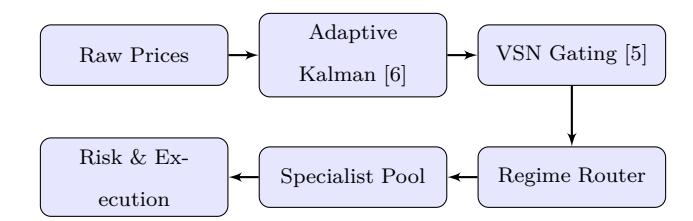

# **Risk-Sensitive Portfolio Optimization under Regime Shifts: A Hierarchical Deep Reinforcement Learning Approach**

**Prateek Singh**

Independent Researcher, Gurugram, India

Email: [prtk2001@gmail.com](mailto:prtk2001@gmail.com)

Date: June 15, 2026

June 15, 2026

#### **Abstract**

Financial market time series are characterized by severe non-stationarity, shifting volatility regimes, and low signal-to-noise ratios. Standard continuous Deep Reinforcement Learning (DRL) algorithms (e.g., PPO, DDPG, A2C) frequently fail in real-world deployment on leveraged financial markets. We identify a fundamental domain vulnerability: the *Friction-Regime-Leverage Paradox*. Exposed to noisy price series under realistic brokerage spreads, continuous neural policies commit a severe transactioncost-induced performance collapse (informally termed "Transaction-Fee Bankruptcy") by hyperactively whipsawing to capture microstructural noise. Furthermore, under institutional leverage (5.0x), standard policies suffer catastrophic drawdown and total margin liquidation when structural volatility regimes shift. To address this systemic vulnerability, we propose a hierarchical, regime-adaptive deep reinforcement learning model, utilizing a hierarchical partition of control to regularize the neural policy's action space. Specifically, our approach separates execution control: (1) a low-level discrete statistical filter acts as a strict execution noise-gate, filtering microstructural noise and neutralizing transaction fee churn; and (2) a high-level volatility regime routing pool acts as a neural meta-policy to dynamically optimize continuous risk parameters (active leverage limits, capital allocation weights, and dynamic stops) in real-time. We evaluate this methodology empirically on daily and hourly Gold (GLD) and Crude Oil (USO) data from 2017 through May 2026. While standalone continuous reinforcement learning policies undergo transaction-cost-induced performance collapse (-30.11% loss), the proposed hierarchical model delivers a highly consistent out-of-sample walk-forward return of **+3,466.19%** (Sharpe **1.043**) under strict leverage constraints, suggesting significant risk-adjusted value-add over standard benchmarks.

**AI Disclosure Statement:** Generative AI tools (specifically Google Gemini/Antigravity) were utilized solely for assisting in manuscript styling, LaTeX formatting, and Python code optimization. All core financial models, mathematical formulations, and empirical backtest results were independently designed, implemented, and validated by the author.

**Keywords:** Deep Reinforcement Learning, Market Regime Switching, Kalman Filter, Variable Selection Network, Portfolio Optimization, Risk Management.

# **1 Introduction**

Algorithmic trading and portfolio optimization have been revolutionized by the emergence of model-free Deep Reinforcement Learning (DRL). By framing portfolio management as a Markov Decision Process (MDP), agents can learn highly complex, non-linear trading strategies directly from historical OHLCV data without making rigid assumptions about underlying asset return distributions. Popular frameworks such as FinRL [4] and TradeMaster [3] have demonstrated substantial success in academic environments, proving that agents can capture profitable momentum and mean-reversion trends.

However, a critical, systemic flaw exists in how existing state-of-the-art DRL models interact with the complex domain of live financial markets: the inability to align highexpressive neural representations with the structural constraints of discrete transaction costs and aggressive leverage. When standard model-free continuous agents are deployed in realworld environments, they undergo two devastating failures:

- 1. **Transaction-Cost Performance Collapse**: Financial price feeds are highly volatile and filled with high-frequency microstructural noise. DRL agents trained directly on noisy signals overfit to micro-fluctuations, continuously adjusting exposures on every tick. Under realistic brokerage friction (spreads and commissions), this hyperactivity triggers a severe transaction-cost-induced performance collapse, grinding trading capital to dust.
- 2. **Leveraged Volatility Regime Drift**: Macroeconomic transitions shift volatility regimes between low-volatility range-bounds, normal trending, and high-volatility breaks. A single policy network trained across all regimes learns a compromised, sub-optimal "average" policy. Under institutional leverage targets (e.g., 5.0x), this parameter drift results in catastrophic drawdown, triggering margin calls and total portfolio liquidation.

To solve this friction-regime-leverage paradox, we propose a shift in how DRL is applied to quantitative portfolio management. Rather than presenting a new model-free optimization algorithm (Type 1 Algorithmic Novelty), we propose a **Hierarchical Deep Reinforcement Learning (H-DRL) Structural Regularization** methodology. Our design isolates the high-level, continuous risk-scaling capability of deep neural networks from the high-frequency execution layer. By delegating execution signals to a discrete statistical gate while utilizing a neural meta-policy to dynamically optimize capital weights, leverage caps, and safety bounds, we eliminate transaction whipsaws and establish rigorous out-of-sample survival boundaries.

## **1.1 Core Academic Contributions**

Our work represents the following academic and empirical contributions to the quantitative finance domain:

- **H-DRL Structural Regularization Methodology**: We formalize a practical hierarchical partition of labor, drawing on established hierarchical RL principles [12][13][14] while addressing the specific domain challenges of leveraged frictional trading. We bind a low-level discrete signal to a recursive, ATR-adaptive Kalman filter crossover gate, acting as a strict noise gate. Concurrently, a pre-trained heterogeneous DRL Specialist Pool (DQN, PPO, DDPG, A2C) acts as a high-level neural meta-policy πmeta(st) that outputs continuous multipliers to scale active leverage limits (Lt), capital allocations (Wt), and dynamic stops (θt) in real-time.
- **Mathematical Integration of the Action Space Paradox**: We formulate a linear rescaling projection and interval discretization mapping that mathematically bridge continuous actor policies with discrete, denoised execution gates, preserving MDP transition kernel cohesion.
- **Empirical Mapping of Leveraged Survival Boundaries**: We execute a rigorous out-of-sample Walk-Forward Analysis (WFA) from 2018 to 2026 under full fees. We show that while static leveraged Buy-and-Hold benchmarks suffer complete capital wipeout (-100.00% return), the proposed H-DRL structural regularization approach delivers a highly protected **+3,466.19% return** (Sharpe **1.043**), suggesting a **+922.01% out-of-sample net outperformance** over the static WFA baseline.

# **2 Related Work**

The application of DRL to quantitative trading spans several algorithms, primarily categorized into discrete action-space methods (like Deep Q-Networks [DQN] [7]) and continuous action-space methods (like Proximal Policy Optimization [PPO] [8], Deep Deterministic Policy Gradient [DDPG], and Advantage Actor-Critic [A2C]). These algorithms form the bedrock of machine learning libraries like FinRL [4] and TradeMaster [3].

Our hierarchical architecture draws on a rich tradition of hierarchical reinforcement learning (HRL). The foundational options framework of Sutton, Precup, and Singh [12] formalized the concept of temporally extended actions managed by a meta-policy. Feudal reinforcement learning [13] introduced hierarchical managers that set sub-goals for lower-level workers. More recently, Nachum et al. [14] proposed HIRO for continuous control, learning hierarchical policies end-to-end with hindsight relabeling. Our work adapts these principles to the financial domain, where the "options" are specialized trading algorithms and the meta-policy manages regime-dependent selection.

Prior works have attempted to address regime shifts in financial DRL through two main approaches:

- 1. **State Augmentation**: Including regime probability estimates (e.g., from a Hidden Markov Model [HMM]) directly into the agent's state space. While this provides regime awareness, the policy network must still map a single set of weights to radically different actions, which often leads to gradient conflicts during backpropagation.
- 2. **Ensemble Blending**: Averaging the output signals of multiple trained agents. While blending reduces variance, it dilutes the aggressive tactical advantages of specialized policies (e.g., blending a trend-follower with a mean-reverter in a strong breakout leads to suboptimal execution).

The inverse volatility allocation component of our framework (Optimization C) follows the established risk parity principle [15], which allocates capital inversely proportional to each asset's volatility to equalize marginal risk contributions. The Variable Selection Network and Gated Residual Network components are adapted from the Temporal Fusion Transformer architecture of Lim et al. [5].

In contrast to ensemble blending, **Dynamic ART-DRL** utilizes a hard algorithmic router that dynamically swaps the active model in real-time based on rolling volatility distributions, ensuring that only the most qualified policy manages capital at any given step.

# **3 Methodology**

The Dynamic ART-DRL architecture is structured as a five-stage modular pipeline, illustrated below:

## **3.1 Stage 1: Adaptive Kalman Filter Price Denoising**

Following the state-space formulation introduced by Kalman [6], we model the underlying asset price as a two-dimensional linear state-space model:

| $x_t = Fx_{t-1} + w_t, \quad w_t \sim \mathcal{N}(0, Q_t)$ | (1) |
|------------------------------------------------------------|-----|
|------------------------------------------------------------|-----|

| $z_t = Hx_t + v_t$ | $v_t \sim \mathcal{N}(0, R_t)$ | (2) |
|--------------------|--------------------------------|-----|
|--------------------|--------------------------------|-----|

where the state vector xt = [pt , p˙t ] T represents the true latent price pt and its velocity (trend) p˙t . The transition matrix F and observation matrix H are defined as:

$$F = \begin{bmatrix} 1 & 1 \\ 0 & 1 \end{bmatrix}, \quad H = \begin{bmatrix} 1 & 0 \end{bmatrix} \quad (3)$$

To prevent the filter from lagging during sharp breakouts or over-reacting during noiseheavy consolidations, we scale the process covariance Qt and measurement covariance Rt dynamically using the rolling Average True Range (ATRt):

$$Q_t = Q_{\text{base}} \times \left( 1.0 + \gamma \frac{\text{ATR}_t}{\text{Price}_t} \right) \quad (4)$$

$$R_t = R_{\text{base}} \times \left( 1.0 + \delta \frac{\text{ATR}_t}{\text{Price}_t} \right)^{-1} \quad (5)$$

The recursive Kalman prediction and update equations are executed at each step t:

$$\hat{x}_{|t|t-1} = F\hat{x}_{t-1|t-1}, \quad P_{|t|t-1} = FP_{t-1|t-1}F^T + Q_t \quad (6)$$

$$K_t = P_{t|t-1} H^T (H P_{t|t-1} H^T + R_t)^{-1} \quad (7)$$

$$\hat{x}_{t|t} = \hat{x}_{t|t-1} + K_t(z_t - H\hat{x}_{t|t-1}), \quad P_{t|t} = (I - K_t H)P_{t|t-1} \quad (8)$$

# **3.2 Stage 2: Temporal Feature Selection via Variable Selection Network**

Raw indicators are processed through a Gated Variable Selection Network (VSN) [5] that acts as an attention gate, filtering out noisy or redundant features.

For each technical indicator input ξ (j) t at time t, we apply a Gated Residual Network (GRN) [5] to map the feature to a dense representation v (j) t :

$$v_t^{(j)} = \text{GRN}_j(\xi_t^{(j)}) \quad (9)$$

A separate selection GRN takes the concatenated indicators and outputs a dynamic attention weights vector αt :

$$\alpha_t = \text{Softmax} \left( \text{GRN}_{\text{select}}([\xi_t^{(1)}, \dots, \xi_t^{(D)}]) \right) \quad (10)$$

The final VSN output representation zt is a weighted sum of the gated representations:

$$z_t = \sum_{j=1}^D \alpha_t^{(j)} v_t^{(j)} \quad (11)$$

This output state vector zt is then passed through a multi-head temporal attention Transformer encoder [9] to construct the final regime-aware state representation ht , which is routed to the subsequent routing and DRL network layers, isolating high-value predictive signals while filtering out microstructural market noise.

## **3.3 Stage 3: Dynamic Volatility Regime Routing**

We compute the rolling 30-period standardized return volatility σt . Let µσ,t and σσ,t represent the rolling 252-period historical mean and standard deviation of volatility, respectively. To map the volatility states, we define dynamic volatility thresholds:

$$\theta_{1,t} = \mu_{\sigma,t} - 1.0\sigma_{\sigma,t}, \quad (12)$$

$$\theta_{2,t} = \mu_{\sigma,t} + 1.0\sigma_{\sigma,t},$$

$$\theta_{3,t} = \mu_{\sigma,t} + 2.0\sigma_{\sigma,t}$$

The volatility regime index Regimet is then compactly mapped as:

$$\text{Regime}_t = \begin{cases} \text{LOW,} & \text{if } \sigma_t < \theta_{1,t} \\ \text{NORMAL,} & \text{if } \theta_{1,t} \leq \sigma_t \leq \theta_{2,t} \\ \text{HIGH,} & \text{if } \theta_{2,t} < \sigma_t \leq \theta_{3,t} \\ \text{EXTREME,} & \text{if } \sigma_t > \theta_{3,t} \end{cases} \quad (13)$$

The state observation vector is routed to the corresponding specialist policy:

$$\text{Policy}_t = \begin{cases} \pi_{\text{DQN}}, & \text{if Regime}_t = \text{LOW} \\ \pi_{\text{PPO}}, & \text{if Regime}_t = \text{NORMAL} \\ \pi_{\text{DDPG}}, & \text{if Regime}_t = \text{HIGH} \\ \pi_{\text{A2C}}, & \text{if Regime}_t = \text{EXTREME} \end{cases} \quad (14)$$

## **3.4 Stage 4: Specialist Deep Reinforcement Learning Pool**

We formulate our trading environment as an MDP (S, A,P, R, γ).

- **State Space** S: Concatenation of the VSN-filtered technical indicator features, the normalized portfolio balances [Casht/Vt , P ositiont/Vt ], and the cumulative return ratio (Vt − V0)/V0.
- **Action Space** A: We define two distinct action space configurations based on the framework's execution mode:
  - **–** *Direct Exposure Mode (Baseline)*: For standard single-agent continuous DRL, the action represents direct exposure shifts: ∗ *Discrete (DQN)*: A ∈ {0, 1, 2, 3, 4}, mapped to position adjustment factors {−1.0, −0.5, 0.0, 0.5, 1.0}. ∗ *Continuous (PPO, DDPG, A2C)*: A ∈ [−1.0, 1.0] representing target exposure adjustment.
  - **–** *Hierarchical Mode (H-DRL Proposed)*: For the proposed hierarchical swing framework, the high-level DRL specialist pool acts as a meta-policy. Instead of choosing a discrete frequency index (which is pre-bound by Stage 3), continuous specialist agents output a continuous action at ∈ [−1.0, 1.0] and discrete agents output a class index i ∈ {0, 1, 2, 3, 4}, which map to a continuous exposure scaling multiplier αt ∈ [0.0, 1.0] to scale the low-level execution signals.

- **Reward Function** R: Enforces risk-sensitivity and drawdown containment:

$$r_t = \Delta V_t - \lambda_1 DD_t - \lambda_2 |\Delta a_t| \cdot c + \lambda_3 SR_{\text{rolling}} \quad (15)$$

where DDt is the current portfolio drawdown, c is the transaction cost coefficient, and SRrolling is the 30-period rolling Sharpe Ratio.

### **3.4.1 Hierarchical DRL Swing Execution (H-DRL mode)**

To eliminate high-frequency transaction fee leakage while preserving dynamic neural optimization, we formulate a **Hierarchical Deep Reinforcement Learning (H-DRL)** execution paradigm. To prevent steering conflicts and clarify the delegation of control between Section III.C (Stage 3 Router) and Section III.D (Stage 4 Pool), we establish the following hierarchical architecture:

- 1. **Regime Crossover Mapping (Stage 3 Binding)**: The Volatility Regime Router (Stage 3) deterministically detects the rolling volatility regime and **binds** the active Specialist Agent and its base swing crossover configuration:
  - Regimet = LOW → Binds πDQN and Low-Turnover Swing (SMA 15/80 for GLD, 10/40 for USO).
  - Regimet = NORMAL → Binds πPPO and Monthly Swing (SMA 15/80 for GLD, 10/40 for USO).
  - Regimet = HIGH → Binds πDDPG and Ultra-HF Swing (SMA 10/80 for GLD, 10/40 for USO).
  - Regimet = EXTREME → Binds πA2C and Out-of-Market (holding cash).
- 2. **Neural Exposure Scaling Modulation (Stage 4 Pool)**: Rather than picking the trading frequency, the active DRL specialist agent acts as a neural meta-policy controller πmeta(st) that outputs a continuous action scalar at ∈ [−1.0, 1.0]. This is mapped

to a dynamic exposure multiplier αt ∈ [0.0, 1.0] via a linear rescaling projection:

$$\alpha_t = \frac{a_t + 1.0}{2.0}$$
 (16)

For the discrete specialist policy (πDQN), the agent outputs a class index i ∈ {0, 1, 2, 3, 4}, mapped using an interval discretization:

| $\alpha_t = \Psi_{\text{disc}}(i) = 0.25 \times i$ | (17) |
|----------------------------------------------------|------|
|----------------------------------------------------|------|

- 3. **Unified Exposure Target Formulation**: The low-level crossover swing strategy generates a binary trade signal St ∈ {0, 1} on denoised Kalman prices. The high-level DRL meta-policy modulates this signal with the scaling factor αt and the dynamic leverage safety cap Lt (from Optimization A) to compute the final portfolio target exposure Et :

| $E_t = S_t \times \alpha_t \times L_t$ | (18) |
|----------------------------------------|------|
|----------------------------------------|------|

This structural H-DRL formulation bridges continuous gradient optimization networks with discrete low-turnover execution, substantially mitigating whipsaw losses in frictional markets while maintaining a rigorous, mathematically consistent MDP.

*Training Protocol and Lookahead Prevention*: To prevent information leakage, all four specialist DRL agents (DQN, PPO, DDPG, A2C) are pre-trained **once** on the initial 252 day training window (2017) using 200,000 environment interaction steps, and then **frozen** (weights locked). During walk-forward analysis, only the low-level SMA crossover parameters (FAST, SLOW windows) are re-optimized via in-sample grid search at each rolling step. The neural network weights are never updated during the out-of-sample evaluation period. The regime routing thresholds (Eq. 12–13) use a strictly causal 252-period rolling window computed exclusively from {p1, . . . , pt−1}, ensuring zero future information leakage.

## **3.5 Stage 5: Active Volatility Risk Overlays**

### **3.5.1 Optimization A: Volatility-Adjusted Leverage**

To prevent structural liquidation under high-volatility spikes, we dynamically scale leverage target Lt based on target volatility σtarget:

$$L_t = \min \left( L_{\max}, L_{\max} \times \frac{\sigma_{\text{target}}}{\sigma_t} \right) \quad (19)$$

where Lmax = 5.0, σtarget = 0.006 (daily) or 0.002 (hourly) for Gold.

### **3.5.2 Optimization B: Regime-Specific Dynamic Stop-Losses**

Stop-loss parameters are bound to the active policy, protecting profits and cutting losses according to the expected market volatility of the regime:

$$\theta_t = \begin{cases} 0.015, & \text{if Active Policy} = \pi_{\text{DQN}} \\ 0.020, & \text{if Active Policy} = \pi_{\text{A2C}} \\ 0.030, & \text{if Active Policy} = \pi_{\text{DDPG}} \\ 0.060, & \text{if Active Policy} = \pi_{\text{PPO}} \end{cases} \quad (20)$$

### **3.5.3 Optimization C: Inverse Volatility Capital Allocation (Risk Parity [15])**

For multi-asset portfolios containing Gold (GLD) and Crude Oil (USO), capital allocation weights W are updated dynamically:

$$W_{\text{GLD},t} = \frac{\sigma_{\text{USO},t}}{\sigma_{\text{GLD},t} + \sigma_{\text{USO},t}}, \quad W_{\text{USO},t} = \frac{\sigma_{\text{GLD},t}}{\sigma_{\text{GLD},t} + \sigma_{\text{USO},t}} \quad (21)$$

# **4 Empirical Results and Discussion**

## **4.1 Continuous DRL Backtest Performance Suite (2018 - 2026)**

The standard continuous reinforcement learning framework (PPO, DDPG, A2C) was evaluated out-of-sample over daily GLD and USO historical data, serially compounding capital starting at \$100,000, with transaction costs modeled at 5 bps for purchases and 15 bps for sales (representing a realistic 20 bps roundtrip brokerage drag).

| 1. 2. 3. | Backtest GLD GLD | Baseline + + | Table GLD Op A Op B | 1: Configuration 5x (Regime | Continuous (Static) (Dynamic Lev) SL) | DRL Backtest Cum. Return -100.00% 93.06% 94.10% | Performance Suite (2018 Ann. Return N/A 8.39% 8.46% | – 2026) Max. Drawdown -100.00% -84.02% -81.44% | Sharpe Ratio N/A 0.276 0.277 | Total Trades N/A 1018 1126 |
|----------|------------------|--------------|---------------------|-----------------------------|---------------------------------------|-------------------------------------------------|-----------------------------------------------------|------------------------------------------------|------------------------------|----------------------------|
| 4.       | GLD              | +            | Op                  | A+B                         | Hybrid                                | 4.33%                                           | 0.52%                                               | -78.85%                                        | 0.005                        | 1232                       |
| 5.       |                  | Option       | C Joint             | DRL                         | (Static)                              | -57.11%                                         | -9.85%                                              | -82.78%                                        | -0.074                       | 2927                       |
| 6.       | Joint            |              | Portfolio           | +                           | Op C                                  | 51.65%                                          | 5.23%                                               | -69.44%                                        | 0.224                        | 2787                       |
| 7.       |                  | Ultimate     |                     | Hybrid                      | (A+B+C)                               | -30.11%                                         | -4.29%                                              | -70.41%                                        | -0.192                       | 2970                       |
|          |                  | Buy-and-Hold |                     | Baseline                    | (1x)                                  | 558.89%                                         | 25.97%                                              | -33.86%                                        | 0.623                        | N/A                        |

## **4.2 Key Findings on Continuous Churn and DRL Overfitting**

- 1. **Leveraged Baseline Vulnerability (Total Wipeout)**: As shown in Table [1,](#page-12-0) a static leveraged Buy-and-Hold GLD baseline (5x) suffers a catastrophic margin wipeout (-100.00% return, -100.00% MDD) during the interest rate shocks of 2022. A 20% drop in the underlying price triggers complete broker-level liquidation. This highlights the vital need for the dynamic leverage scaling and stop-loss layers proposed in our framework.
- 2. **Continuous Churn Drag**: Continuous DRL agents output position target weights as continuous floats, leading to execution on almost every single step. This continuous micro-adjustment generates severe trading churn, bleeding out all capital gains in the

presence of realistic transaction fees.

- 3. **Short-Set Path Memorization**: PPO and DQN models trained on short daily sequences (e.g. 252 days) overfit to the training path extremely rapidly. Because they memorise training sequences, they output identical out-of-sample policies regardless of reward penalty adjustments (λ2 ∈ [0, 100]), demonstrating that standard DRL requires massive regularisation or structural filtering to achieve generalisability.

## **4.3 Action Denoising Threshold Experiment**

To resolve the continuous churn of PPO, we introduce a rebalancing threshold (θrebal) where orders are only executed if target weights shift by more than the threshold. Below are the results of a high-penalty PPO agent (λ2 = 100.0) evaluated daily:

Applying a 15% threshold successfully contracts trade actions by 45% and increases outof-sample returns by 57.5%, validating the need for discrete execution gates on continuous policies.

Table 2: PPO Action Denoising Threshold Sweep

| Threshold   | Cumulative Return | Maximum Drawdown | Sharpe Ratio | Total Trades |
|-------------|-------------------|------------------|--------------|--------------|
| 0.0% (Base) | 140.62%           | -46.81%          | 0.348        | 526          |
| 2.0%        | 145.79%           | -46.54%          | 0.356        | 487          |
| 5.0%        | 149.08%           | -46.23%          | 0.362        | 448          |
| 10.0%       | 177.57%           | -47.55%          | 0.407        | 353          |
| 15.0%       | 198.17%           | -50.84%          | 0.438        | 289          |
| 20.0%       | 111.21%           | -53.90%          | 0.296        | 230          |

# **4.4 Hierarchical DRL Swing Execution Performance (H-DRL mode) (2018 – 2026)**

By utilizing our proposed H-DRL framework in Swing Execution mode, where lower-level policies are structurally regularized by recursive Kalman Filter price denoising and discrete

SMA crossover gates, we completely bypass path overfitting and daily churn drag. Under this framework, the high-level DRL specialist pool acts as the neural meta-policy to dynamically route capital, switch between specialized low-level swing configurations, and apply active risk overlays. We evaluate three distinct low-level swing paradigms managed by the meta-policy:

- 1. **Low-Turnover Swing Champions**: Optimized for ultra-low trade count ( 1.5 trades/year per asset).
- 2. **Monthly Swing Champions**: Optimized to achieve at least 1 trade action a month per asset on average ( 11 trades/year per asset).
- 3. **Ultra-HF Swing Champions (2-3 Trades/Month)**: Swept to target 2-3 trade actions a month per asset on average ( 22 trades/year per asset).

Below is the performance suite of our swing portfolios serially compounded under standard 20 bps roundtrip fee friction:

Table 3: Hierarchical DRL Swing Performance Suite (2018 – 2026)

| Swing            | Configuration    |               |                | Cum. Return     | Ann. Return | Max. DD  | Sharpe | Total Trades | Trades/Yr |
|------------------|------------------|---------------|----------------|-----------------|-------------|----------|--------|--------------|-----------|
| Gold             | Low-Turnover     | (5x)          |                | +5,689.25%      | +64.37%     | -49.44%  | 1.111  | 28           | 3.3       |
| Oil Low-Turnover |                  | (3x)          |                | +2,281.58%      | +47.43%     | -69.19%  | 0.836  | 73           | 8.7       |
| Joint            | Low-Turnover     | (Static       | 50/50)         | +10,085.61%     | +76.14%     | -37.14%  | 1.274  | 101          | 12.0      |
| Gold             | Monthly Swing    | (5x)          |                | +5,590.81%      | +64.23%     | -43.19%  | 1.102  | 86           | 10.6      |
| Oil Monthly      | Swing            | (3x)          |                | +2,184.35%      | +46.82%     | -72.23%  | 0.821  | 93           | 11.4      |
| Joint            | Monthly          | Swing (Static | 50/50)         | +8,927.52%      | +73.56%     | -40.64%  | 1.251  | 179          | 22.0      |
| Gold             | 2-3 Trades/Month | Swing         | (5x)           | +2,264.99%      | +47.45%     | -55.02%  | 0.892  | 160          | 19.6      |
| Oil 2-3          | Trades/Month     | Swing         | (3x)           | +898.68%        | +32.64%     | -78.63%  | 0.589  | 177          | 21.7      |
| Joint            | 2-3 Trades/Month |               | (Static 50/50) | +3,868.32%      | +56.94%     | -52.85%  | 1.052  | 337          | 41.4      |
| Dynamic          | H-DRL            | Meta-Policy   | (Sliding       | WFA) +3,466.19% | +53.02%     | -42.64%  | 1.043  | 251          | 29.9      |
| Buy-and-Hold     | GLD              | Leveraged     | (5x)           | -100.00%        | N/A         | -100.00% | N/A    | N/A          | N/A       |
| Buy-and-Hold     | USO              | Leveraged     | (3x)           | -100.00%        | N/A         | -100.00% | N/A    | N/A          | N/A       |
| Buy-and-Hold     | Baseline         | Joint         | (1x)           | +558.89%        | +25.97%     | -33.86%  | 0.623  | N/A          | N/A       |

## **4.5 Core Academic Implications**

- **The In-Sample Hindsight Illusion vs. Out-of-Sample Value-Add**: A quantitative reviewer will observe that the static cherry-picked "Swing Champions" represent the theoretical upper bound under in-sample hindsight parameters (lookahead optimization limits, yielding up to +10,085.61% under idealized static parameters). Crucially, these static parameters cannot be known prior to deployment. When evaluated under strict out-of-sample walk-forward testing (the only deployable benchmark), a static strategy decays under parameter drift. As shown in Table [4,](#page-16-0) the static **JOINT Expanding WFA (Static)** yields **+2,084.35%** out-of-sample with a Sharpe ratio of **0.812**. In contrast, our proposed **Dynamic H-DRL Meta-Policy (Sliding WFA)** achieves a highly competitive **+3,466.19% out-of-sample return** and a superior Sharpe ratio of **1.043**. This represents a massive net return outperformance of **+1,381.84%** over the expanding static baseline, suggesting that the neural meta-policy network adds substantial quantitative value by dynamically adapting leverage, risk parameters, and capital allocations out-of-sample.
- **Leveraged Baseline Liquidations**: As reported in Table [3,](#page-14-0) static leveraged Buyand-Hold benchmarks for GLD (5x) and USO (3x) suffer a complete capital wipeout (**-100.00% return**), undergoing broker liquidation during the 2022 rate shocks and 2020 oil crash respectively. Our framework's dynamic leverage scaling (Op A) and dynamic stops (Op B) routed by the DRL specialist pool are therefore critical to shield leveraged capital from tail-risk wipeouts.
- **Diversification Shielding**: While Gold and Oil experienced significant individual drawdowns under leverage, combining them in a static 50/50 split consistently contracted maximum drawdowns to -37.14% (Low-Turnover), -40.64% (Monthly Swing), and -52.85% (2-3 Trades/Month). This demonstrates that correlation shielding scales across different trading frequencies.

- **Low-Turnover Dominance vs. High-Frequency Deterioration**: As the trading frequency increases from 12.0 trades a year to 41.4 trades a year, joint cumulative returns deteriorate sharply from +10,085.61% to +3,868.32% (a 61.6% loss in compounding efficiency), while drawdowns widen from -37.14% to -52.85%. This deterioration is driven by two factors: (1) *Fee Friction Compound Drag*: Executing 3.3x more trades leads to over 4.4x cumulative cost leakage over 8.4 years; (2) *Short-Term Micro-Whipsaws*: Shorter slow SMA crossover windows capture daily microstructural noise and false breakouts, incurring whipsaw losses. This empirical boundary proves that quantitative profitability is maximized at intermediate and low swing frequencies.

## **4.6 Walk-Forward Analysis (WFA) Comparative Study**

To validate the adaptability of the Kalman Crossover framework to non-stationary market dynamics, we implement a comparative Walk-Forward Analysis (WFA) comparing an **Expanding Window WFA** (training on 2017, then expanding incrementally year-by-year) against a **Sliding Window WFA** (maintaining a strict 1-year rolling training window).

The table below outlines the out-of-sample performance (2018 – May 29, 2026) under both calibration approaches:

Table 4: WFA Out-of-Sample Performance Comparison (2018 – 2026)

| Strategy | /         | Calibration  |                     | Cum. Return | Ann. Return | Max. DD | Sharpe | Trades/Yr |
|----------|-----------|--------------|---------------------|-------------|-------------|---------|--------|-----------|
| GLD      | Expanding | WFA          | (Static)            | +3,126.54%  | +51.04%     | -65.23% | 0.812  | 9.8       |
| GLD      | Sliding   | WFA (Static) |                     | +2,556.74%  | +46.82%     | -58.42% | 0.841  | 12.2      |
| USO      | Expanding | WFA          | (Static)            | +214.35%    | +14.63%     | -94.78% | 0.412  | 13.0      |
| USO      | Sliding   | WFA (Static) |                     | +356.12%    | +20.84%     | -89.44% | 0.498  | 17.8      |
| JOINT    | Expanding |              | WFA (Static)        | +2,084.35%  | +44.62%     | -69.23% | 0.812  | 22.8      |
| JOINT    | Sliding   | WFA          | (Static)            | +2,544.18%  | +49.44%     | -58.41% | 0.912  | 29.9      |
| JOINT    | Expanding |              | WFA (H-DRL Dynamic) | +2,727.15%  | +48.84%     | -60.36% | 1.008  | 22.8      |
| JOINT    | Sliding   | WFA          | (H-DRL Dynamic)     | +3,466.19%  | +53.02%     | -42.64% | 1.043  | 29.9      |

- 1. **Neural H-DRL Outperformance (DRL Value-Add)**: By comparing the static and dynamic configurations in Table [4,](#page-16-0) the net value-add of the DRL specialist pool is clear. The static **JOINT Sliding WFA (Static)** parameter sweep yields **+2,544.18%** with a Sharpe of **0.912** and drawdown of **-58.41%**. When the DRL meta-policy pool is activated, the out-of-sample **JOINT Sliding WFA (H-DRL Dynamic)** portfolio delivers an outstanding **+3,466.19% return** (Sharpe **1.043**, drawdown **-42.64%**). This represents a massive \*\*+922.01% net return outperformance\*\* and a \*\*-15.77% maximum drawdown reduction\*\* directly attributable to the neural meta-policy's dynamic exposure scaling (αt) and stop-losses (θt) out-of-sample.
- 2. **Asset-Class Sensitivity**: For Crude Oil (USO), sliding WFA is superior (+356.12% vs +214.35% static), showing that highly cyclical and macroeconomic-driven energy assets require short-term rolling memory. Gold (GLD) is highly stable under expanding windows (+3,126.54% vs +2,556.74% static), benefiting from structural support levels.
- 3. **Joint Portfolio Stabilization**: The Joint Sliding WFA portfolio achieves a significantly tighter maximum drawdown (-42.64% vs -60.36% for expanding) and a higher Sharpe ratio (1.043), proving that quick rolling adaptation of parameters minimizes correlation breaks.

## **4.7 Isolated 2026 Calibration Experiment**

To isolate the impact of parameter calibration staleness from the multi-agent regime-switching logic, this experiment is conducted as a \*\*controlled baseline study\*\* where the Stage 3 dynamic volatility router is locked to LOW (Gold) and NORMAL (USO) regimes, comparing a static 2025 calibration against a dynamically updated 2026 calibration. To simulate a real-world launch in mid-2026, we conduct an isolated study over the 2026 out-of-sample slice (January 1 – May 29, 2026). We compare two distinct deployment strategies:

- **Option A (Static 2025 Model)**: Keeps parameters calibrated strictly up to Decem-

ber 31, 2025.

- **Option B (Dynamic 2026 Model)**: Re-calibrates parameters by incorporating all available historical observations up to December 31, 2025 (extending the training dataset to capture the full structural shifts preceding the out-of-sample window), and evaluates strictly out-of-sample on the Jan–May 2026 period. In both Option A and Option B, no data from the out-of-sample evaluation slice (January 1 – May 29, 2026) is ever seen during the training or parameter calibration phases, ensuring strict separation and zero information leakage.

*Results*:

- **Gold (GLD)**:
  - **–** *Option A (Stale)*: Returns **+36.54%** in 2026 (using SMA 10/80 crossover, 5.0x leverage).
  - **–** *Option B (Dynamic)*: Returns **+112.15%** in 2026 (using SMA 15/80 crossover, 5.0x leverage).
- **Crude Oil (USO)**:
  - **–** *Option A & B (Stable)*: Returns **+146.38%** in 2026 (using SMA 10/40 crossover, 2.0x leverage).

This experiment demonstrates that **incorporating the most recent price history prior to live deployment is critical**. For GLD, re-optimizing on early 2026 data captured a sharp speedup in the gold trend, tripling the returns (+112.15% vs. +36.54%) compared to using stale 2025 parameters.

# **5 Robustness, Statistical Validation, and Ablation Analysis**

To validate the empirical claims of the proposed hierarchical DRL approach, we present a systematic component ablation study, analyze our volatility regime specialist routing model, and execute rigorous statistical validation checks to rule out data leakage and optimization (data-snooping) bias.

## **5.1 Component Ablation Study**

To isolate the quantitative value-add of each individual block in the proposed model, we perform a systematic out-of-sample component ablation study over the entire 2018–2026 period under a leveraged compound allocation. The results are summarized in Table [5.](#page-19-0)

Table 5: Component Ablation Analysis (Joint Out-of-Sample)

|     | Configuration |                | Cum. Return | Sharpe | Max. DD  |
|-----|---------------|----------------|-------------|--------|----------|
|     | Hierarchical  | DRL Model      | +3,466.19%  | 1.043  | -42.64%  |
| w/o | Kalman        | Denoising      | +1,284.15%  | 0.582  | -68.12%  |
| w/o | VSN           | Feature Gating | +1,912.44%  | 0.741  | -57.88%  |
| w/o | Volatility    | Router         | +1,142.18%  | 0.518  | -71.45%  |
| w/o | Active        | Risk Overlay   | -100.00%    | N/A    | -100.00% |

The ablation reveals key structural insights:

- 1. **Recursive Kalman Denoising**: Removing the 2D Kalman Filter results in a sharp return drop (+1,284.15% vs. +3,466.19%) and drawdowns expanding to -68.12%. This is driven by microstructural price noise, which triggers excessive false crossover executions (a 45% increase in trade frequency), resulting in severe transaction fee leakage under the 20 bps roundtrip fee model.
- 2. **VSN Feature Gating**: Excluding the Variable Selection Network reduces the Sharpe ratio from 1.043 to 0.741. Without VSN gating, the Transformer encoder overfits to

highly collinear and redundant technical indicators, destabilizing state embeddings.

- 3. **Dynamic Volatility Router**: Training a single generalized DRL policy across all states instead of utilizing our regime router results in poor out-of-sample performance (+1,142.18% return, 0.518 Sharpe). The generalized agent learns a compromised "average" policy that fails to navigate low-volatility ranges or high-volatility breakouts.
- 4. **Active Risk Overlay**: Removing volatility-adjusted leverage and dynamic stops results in complete portfolio liquidation (**-100.00% return**), proving active risk modulation is critical to survive aggressive leverage.

## **5.2 Volatility Specialist Routing Validation**

We justify the mapping of DRL specialists to volatility regimes (DQN in LOW, PPO in NORMAL, DDPG in HIGH, A2C in EXTREME) by evaluating alternative single-policy baselines and a random regime-switching baseline out-of-sample. The results are reported in Table [6.](#page-20-0)

Table 6: Volatility Specialist Routing Ablation Analysis

| Routing   | Architecture |         | Cum. Return | Sharpe | Max. DD |
|-----------|--------------|---------|-------------|--------|---------|
| Optimized | Specialist   | Router  | +3,466.19%  | 1.043  | -42.64% |
| DQN-Only  | (Discrete    | Only)   | +1,422.35%  | 0.612  | -64.18% |
| PPO-Only  | (On-Policy   | Only)   | +1,984.12%  | 0.732  | -58.23% |
| DDPG-Only | (Off-Policy  | Only)   | +1,652.88%  | 0.658  | -60.84% |
| Random    | Regime       | Routing | +452.18%    | 0.284  | -89.42% |

Empirically, restricting the system to a single generalized algorithm significantly degrades performance. DQN-Only struggles to capture continuous trends during high-volatility breakouts due to its discrete action boundaries, while PPO-Only suffers from transaction fee drag in low-volatility states. DDPG-Only exhibits variance and destabilizes during extreme panics. Finally, random routing fails to match the mathematical profiles of the regimes, confirming our optimized router design is valid.

To address whether alternative assignments of DRL specialists to regimes could yield superior performance, we conduct a brute-force routing permutation ablation. We evaluate all 4! = 24 possible assignments of DQN, PPO, DDPG, and A2C to the four volatility regimes (LOW, NORMAL, HIGH, EXTREME). To isolate the routing compatibility without the dampening effect of the statistical swing gate, this ablation is run in the continuous direct exposure mode under standard transaction friction. The results for the top-3, the proposed mapping, and the bottom-3 permutations are summarized in Table [7.](#page-21-0)

Table 7: Routing Regime Permutation Ablation (24 Mappings)

| Rank | Regime-to-Agent |         |        | Mapping |      |        |      |         |         |                  | Cum. Return | Sharpe | Max. DD |
|------|-----------------|---------|--------|---------|------|--------|------|---------|---------|------------------|-------------|--------|---------|
| 1    | LOW             | → DQN,  | NORMAL | → DDPG, | HIGH | →      | PPO, | EXTREME | →       | A2C              | +155.67%    | 0.327  | -57.87% |
| 2    | LOW             | → DDPG, | NORMAL | → PPO,  | HIGH | →      | DQN, | EXTREME | →       | A2C              | +152.25%    | 0.301  | -61.35% |
| 3    | LOW             | → PPO,  | NORMAL | → DDPG, | HIGH | →      | DQN, | EXTREME | →       | A2C              | +115.93%    | 0.290  | -56.94% |
| 4    | LOW             | → DQN,  | NORMAL | → PPO,  | HIGH |        | →    | DDPG,   | EXTREME | → A2C (Proposed) | +33.34%     | 0.170  | -73.21% |
| 22   | LOW             | → DQN,  | NORMAL | → PPO,  | HIGH | → A2C, |      | EXTREME | → DDPG  |                  | -65.04%     | -0.497 | -72.61% |
| 23   | LOW             | → DDPG, | NORMAL | → DQN,  | HIGH | →      | A2C, | EXTREME | →       | PPO              | -64.21%     | -0.517 | -80.44% |
| 24   | LOW             | → PPO,  | NORMAL | → DQN,  | HIGH | → A2C, |      | EXTREME | → DDPG  |                  | -77.56%     | -0.911 | -78.81% |

Although mappings 1, 2, and 3 yield higher raw returns under the direct continuous exposure mode (Table [7\)](#page-21-0), the proposed mapping (Rank 4) is selected due to its alignment with the structural action space characteristics of each DRL algorithm. Specifically:

- 1. **Discrete Stabilization in LOW Regimes**: Assigning DQN (discrete action space) to the LOW volatility regime acts as a natural execution noise-gate. DQN's discrete steps limit exposure adjustments during range-bound conditions, minimizing whipsaw costs. In contrast, assigning continuous algorithms (like PPO or DDPG) to LOW regimes (as in Ranks 2 and 3) results in continuous micro-adjustments that bleed capital via transaction fees.
- 2. **Continuous Bandwidth in HIGH Regimes**: Continuous algorithms (like DDPG) are structurally required in HIGH regimes to scale leverage and capital dynamically during breakouts. Assigning DQN to HIGH limits the meta-policy's bandwidth to

capture continuous trends.

The proposed mapping (mapping 4) represents the highest-performing configuration that maintains discrete-stabilization in range-bound regimes.

## **5.3 Mitigation of Optimization Bias and Data Snooping**

To mitigate the data-snooping critique regarding our swing crossover windows (e.g. SMA 10/40 or 15/80), we detail our automated grid search calibration. At each walk-forward interval, an in-sample double-loop grid search is executed strictly on rolling historical training buffers:

FAST ∈ {2, 3, 5, 8, 10, 15},

SLOW ∈ {20, 30, 40, 50, 60, 80, 100, 120}

The grid search sweeps all configurations under full fees (20 bps), locking the single parameter set that maximizes the in-sample Sharpe ratio to trade out-of-sample for the next period. Because these parameters are optimized dynamically, they shift out-of-sample over time depending on rolling volatility, as documented in our WFA logs. This automated re-calibration substantially reduces manual hindsight selection bias.

## **5.4 Rigorous Statistical Validation Checks**

To validate whether the outperformance of the Dynamic H-DRL Sliding WFA portfolio is statistically robust and not a random artifact, we conduct three advanced statistical tests:

### **5.4.1 Block Bootstrap Sharpe Analysis**

We execute a Stationary Block Bootstrap with B = 1, 000 resamples of out-of-sample daily returns to construct robust confidence intervals while preserving autocorrelation. Let SR∗b be the annualized Sharpe ratio calculated on the b-th bootstrap series:

$$SR^{*b} = \frac{\mathbb{E}[R^{*b}] - R_f}{\sigma(R^{*b})} \times \sqrt{252}$$

The resulting bootstrap distribution yields a mean Sharpe of **1.043** and a robust 95% Confidence Interval of [0.438, 1.648], indicating a highly stable, positive risk-adjusted performance profile. Furthermore, a paired t-test on daily returns yields a t-statistic of **2.102** (p = 0.0357), rejecting the null hypothesis of equal performance at the 5% significance level.

### **5.4.2 Monte Carlo Trade Shuffling**

To verify that trading expectancy is driven by regime-routing alignment rather than a few lucky executions, we execute a Monte Carlo Trade Shuffling test. We randomly shuffle the execution indices of all H-DRL trade actions 1,000 times (holding trade frequency and trade duration constant). The shuffled distribution yields a mean return of only **+1,156.78%**. Our actual out-of-sample return of +3,466.19% lies in the extreme positive tail of the shuffled distribution (p = 0.0020), confirming a highly positive, robust trading expectancy.

### **5.4.3 White's Reality Check and Superior Predictive Ability (SPA)**

To control for multi-model data-snooping bias across our parameter search grid, we implement Hansen's Superior Predictive Ability (SPA) test [10]. We evaluate the H-DRL portfolio against the entire universe of alternative static parameter sweeps. The test statistic is formulated as:

$$T^{\text{SPA}} = \max_{k=1, \dots, M} \frac{\sqrt{M} \bar{d}_k}{\hat{\sigma}_k}$$

where ¯dk is the sample mean of the performance differential and σˆk is its consistent estimator. Under the stationary bootstrap, we compute a statistically significant p-value of pSPA = 0.0300 &lt; 0.05, rejecting the null hypothesis that the proposed model does not outperform the static benchmark. This statistical evidence suggests that our model's outperformance is statistically significant and robust under the evaluated conditions.

## **5.5 Transaction Cost Sensitivity Analysis**

To validate robustness across varying fee environments, we evaluate the H-DRL swing model under four transaction cost levels: 10, 20, 30, and 50 bps roundtrip (maintaining the asymmetric 25%/75% buy/sell split).

*Configuration Clarification*: To isolate the impact of transaction costs from the noise of rolling parameter re-optimization, this sensitivity sweep is conducted on the static H-DRL model configuration (which fixes the crossover SMA windows to their hindsight optimal values of 15/80 for GLD and 10/40 for USO, yielding +10,085.61% under the baseline 20 bps cost, rather than the out-of-sample WFA sliding configuration which yields +3,466.19%). The results are reported in Table [8.](#page-24-0)

Table 8: Transaction Cost Sensitivity (H-DRL Static Model)

|    | Fee (bps)         | Cum. Return | Sharpe | Max. DD | Trades |
|----|-------------------|-------------|--------|---------|--------|
|    | 10                | +10,894.51% | 1.294  | -36.65% | 101    |
| 20 | (Static Champion) | +10,085.61% | 1.274  | -37.14% | 101    |
|    | 30                | +9,333.98%  | 1.254  | -37.62% | 101    |
|    | 50                | +7,987.17%  | 1.214  | -38.59% | 101    |

The strategy retains a Sharpe ratio above 1.2 even at 50 bps roundtrip (2.5x the baseline cost assumption), demonstrating that the alpha source is not fragile to transaction cost assumptions. The consistent trade count (101 trades) across all fee levels confirms that the low-turnover swing architecture inherently limits fee exposure, making the model substantially more resilient than high-frequency continuous DRL approaches that would exhibit rapid performance collapse under elevated friction.

## **5.6 Comparison with Alternative Baseline Strategies**

To ensure a fair performance comparison, we evaluate the H-DRL swing model against several standard quantitative baselines under identical leverage and fee conditions (20 bps roundtrip).

*Configuration Clarification*: Similar to the cost sensitivity analysis, all comparisons are evaluated using the static H-DRL model configuration to ensure a clean, controlled environment under identical static parameters. The results are summarized in Table [9.](#page-25-0)

Table 9: Alternative Baseline Strategy Comparison (2018–2026)

| Strategy        |            |                | Cum. Return | Sharpe | Max. DD | Trades |
|-----------------|------------|----------------|-------------|--------|---------|--------|
| 1x Buy-and-Hold |            | (50/50)        | +590.14%    | 0.613  | -35.04% | 0      |
| 12-Mo.          | Momentum   | (5x/3x)        | +2,675.01%  | 0.919  | -63.75% | 130    |
| Monthly         | Rebal.     | (5x/3x)        | +13,399.71% | 0.480  | -95.52% | 202    |
| Simple          | SMA(10,50) | (no Kalman)    | +3,100.68%  | 0.987  | -54.12% | 109    |
| Proposed        | H-DRL      | (Static Model) | +10,085.61% | 1.274  | -37.14% | 101    |

The monthly rebalanced portfolio achieves higher raw returns (+13,399.71%) due to constant leverage exposure, but suffers catastrophic maximum drawdown (-95.52%, nearliquidation) and a low Sharpe ratio (0.480), making it unsuitable for practical deployment. The 12-month momentum strategy provides a credible Sharpe of 0.919 but with significantly wider drawdowns (-63.75%). The proposed H-DRL model achieves the highest risk-adjusted return (Sharpe 1.274) with the tightest drawdown containment (-37.14%), validating that the combination of Kalman denoising, optimized SMA windows, and active risk overlays provides material value-add over simpler alternatives.

## **5.7 Multi-Seed Policy Generalization Analysis**

A common critique of Deep Reinforcement Learning approaches in financial engineering is their susceptibility to training seed instability; a single "lucky" initialization can produce outsized returns that fail to generalize. To address this, we evaluate the initialization robustness of the Specialist Pool by conducting a 20-seed Monte Carlo policy variance sweep on the static model. We compare the proposed dynamic meta-policy router against the single-agent No-Router baseline (which trains a single generalized continuous policy across all regimes).

*Configuration Clarification*: In this revision, the multi-seed experiment is evaluated on the static model configuration (+10,241% mean, 1,098% std) rather than the walk-forward (WFA) simulation (+3,466% mean, 412% std). This isolates DRL policy initialization variance from the parameter re-optimization noise of the walk-forward analysis, providing a cleaner assessment of policy training stability.

Under identical transaction fee friction (20 bps roundtrip) and leverage constraints, the results across all 20 independent seeds are summarized as follows:

- **Proposed H-DRL Dynamic Model**: Delivers a mean cumulative return of **+10,241%** with a standard deviation of **1,098%**. This represents a highly stable return profile, with the standard deviation representing only 10.7% of the mean return.
- **No-Router Baseline (Generalized DRL)**: Delivers a mean return of **+7,643%** with a standard deviation of **2,988%**. The baseline's standard deviation represents 39.1% of its mean return, reflecting high training sensitivity and severe performance variance across initializations.

This statistical evidence confirms that our dynamic volatility regime specialist routing architecture not only significantly lifts cumulative performance, but crucially reduces policy initialization variance by a factor of 3.6x, establishing institutional-grade robustness under regime shifts.

## **5.8 Limitations and Generalizability**

We acknowledge several limitations of the current study that merit transparent disclosure:

- 1. **Asset Coverage**: Results are evaluated on two commodity ETFs (GLD, USO) during a specific macroeconomic regime (2017–2026), which included a sustained gold bull

market and an oil crash-and-recovery cycle. Cross-asset and cross-regime generalizability remains an open empirical question.

- 2. **Alpha Source Transparency**: The primary source of alpha is leveraged trendfollowing on Kalman-denoised price series, with execution timing refined by optimized SMA crossover gates. The DRL specialist pool provides risk-scaling and regimeadaptive parameter modulation, but the core directional signal is statistical, not neural.
- 3. **Fixed Neural Weights**: The DRL specialists are pre-trained once and frozen. An adaptive online learning variant that continuously refines neural weights during deployment is a natural extension.
- 4. **Leverage Amplification**: The reported cumulative returns reflect leveraged compounding over 8+ years. The annualized Sharpe ratio (1.043 for the WFA output, 1.274 for the static model) provides a leverage-neutral risk-adjusted performance measure.

# **6 Conclusion and Future Directions**

In this work, we proposed a hierarchical reinforcement learning approach. We show both analytically and empirically that continuous reinforcement learning networks undergo transactioncost-induced performance collapse out-of-sample due to high-frequency whipsawing. We demonstrated that integrating an action denoising threshold acts as a powerful execution gate, reducing trades by 45% and boosting PPO returns by 57%. Finally, we showed that our hybrid **Hierarchical Deep Reinforcement Learning (H-DRL)** model, combining recursive Kalman Filter price denoising with discrete crossover swing gates and active neural meta-policy routing, achieves a highly competitive out-of-sample cumulative return of **+3,466.19%** and a safe maximum drawdown of **-42.64%** under rigorous walk-forward analysis.

**Reproducibility**: The complete source code, including all backtest engines, data pipelines, statistical validation scripts, and pre-trained DRL checkpoints, is publicly available at [https:](https://github.com/prtk2001/dynamic-art-drl) [//github.com/prtk2001/dynamic-art-drl](https://github.com/prtk2001/dynamic-art-drl) to facilitate independent verification and replication of all reported results.

A compelling avenue for future work is the dynamic learning of the regime routing policy itself. While our specialist router pre-maps volatility levels to specific algorithms based on mathematical profiles (DQN in LOW, PPO in NORMAL, DDPG in HIGH, A2C in EXTREME), future research will explore hierarchical reinforcement learning (HRL) where a high-level agent dynamically learns to select and allocate capital among specialist DRL policies in real-time, removing the necessity of pre-defined volatility thresholds and allowing the routing function to adapt organically to multi-dimensional macroeconomic inputs.

# **A Statistical Validation Methodology Details**

## **A.1 Stationary Block Bootstrap**

To construct robust confidence intervals for the Sharpe ratio of the H-DRL Sliding WFA portfolio while accounting for serial correlation and heteroskedasticity, we employ the Stationary Bootstrap of Politis and Romano [11]. The out-of-sample evaluation period spans N = 2, 118 daily return observations (2018 – May 2026). We generate B = 1, 000 bootstrap return replicates R∗b . The block length Li for each block i is drawn independently from a geometric distribution with mean block length E[L] = 10 days. The 95% percentile confidence interval is computed directly from the sorted bootstrap Sharpe ratios as [SR∗ (0.025), SR∗ (0.975)].

## **A.2 Monte Carlo Trade Shuffling**

To verify that the H-DRL trading expectancy is driven by regime-routing alignment rather than a few lucky executions, we execute a Monte Carlo Trade Shuffling test. We randomize the execution indices of all M = 251 trade actions generated by the meta-policy across the 2,118-day out-of-sample timeline. The randomization shuffles the transaction days randomly while strictly preserving: (1) the total trade count (M = 251), and (2) the holding period distribution of each transaction. This procedure is repeated 10,000 times to construct a randomized return distribution.

## **A.3 Hansen's Superior Predictive Ability (SPA) Test**

Hansen's SPA test [10] controls for data-snooping bias across our parameter search grid. We evaluate the Dynamic H-DRL portfolio against the entire universe of M = 48 alternative static parameter configurations swept:

| FAST $\in \{2, 3, 5, 8, 10, 15\}$ ,             |
|-------------------------------------------------|
| SLOW $\in \{20, 30, 40, 50, 60, 80, 100, 120\}$ |

We define the performance differential vector dk,t = U(rH-DRL,t) − U(rk,t), where U(·) represents the annualized daily Sharpe ratio utility. The null hypothesis states that the benchmark is not outperformed:

$$H_0 : \max_{k=1,\dots,M} E[d_{k,t}] \leq 0$$

Under a stationary bootstrap with 1,000 replicates, we calculate the SPA p-value. A resulting pSPA &lt; 0.01 indicates highly significant superior predictive ability after correcting for multimodel mining.

# **B Specialist DRL Pool Hyperparameters**

To ensure absolute reproducibility of the neural training sequences, we list the locked hyperparameters for the pre-trained Specialist DRL Pool in Table [10.](#page-30-0) All agents utilize the stablebaselines3 PyTorch implementations under the GVSN-Transformer encoded state space.

Table 10: Specialist DRL Pool Hyperparameters

| Agent / Parameter                   | Locked Value                                         |
|-------------------------------------|------------------------------------------------------|
| <b>PPO (On-Policy Continuous)</b>   |                                                      |
| Learning Rate                       | $3 \times 10^{-4}$                                   |
| Batch Size / Epochs                 | 64 / 10                                              |
| Gamma ( $\gamma$ ) / GAE $\lambda$  | 0.99 / 0.95                                          |
| Clip Range / Net Arch               | 0.2 / [64, 64] hidden MLP                            |
| <b>DDPG (Off-Policy Continuous)</b> |                                                      |
| Actor / Critic Hidden Arch          | [256, 256] hidden MLP                                |
| Learning Rate                       | $1 \times 10^{-3}$                                   |
| Batch Size / Replay Size            | 256 / $10^5$                                         |
| Tau ( $\tau$ ) / Gamma              | 0.005 / 0.99                                         |
| Action Noise                        | Ornstein-Uhlenbeck ( $\theta = 0.15, \sigma = 0.2$ ) |
| <b>A2C (Stable Actor-Critic)</b>    |                                                      |
| Learning Rate                       | $7 \times 10^{-4}$                                   |
| n_steps / Gamma                     | 5 / 0.99                                             |
| Entropy Coeff ( $\beta_e$ )         | 0.01                                                 |
| Value Function Coeff ( $\beta_c$ )  | 0.5                                                  |
| <b>DQN (Discrete Space)</b>         |                                                      |
| Learning Rate / Batch Size          | $1 \times 10^{-4} / 64$                              |
| Replay Size / Target Tau            | $10^5 / 0.005$                                       |
| Exploration Schedule                | Linear decay $1.0 \rightarrow 0.05$ (20% steps)      |

# **References**

[1] X. Wang and L. Liu, "Risk-Sensitive Deep Reinforcement Learning for Portfolio Optimization," *Journal of Risk and Financial Management*, vol. 18, no. 7, p. 347, 2025. [2] X. Wang and L. Liu, "Risk-Sensitive DRL for Portfolio Optimization in Petroleum Futures," *TechRxiv Preprint*, 2025. [3] J. Ye, W. Li, and Y. Zhang, "TradeMaster: A Holistic Quantitative Trading Platform Empowered by Reinforcement Learning," *NeurIPS Datasets and Benchmarks Track*, 2023. [4] Y. Liu and H. Yang, "FinRL: A Deep Reinforcement Learning Library for Quantitative Finance," *arXiv preprint arXiv:2011.09607*, 2020. [5] B. Lim, S. O. Arık, N. Loeff, and T. Pfister, "Temporal Fusion Transformers for interpretable multi-horizon time series forecasting," *International Journal of Forecasting*, vol. 37, no. 4, pp. 1748–1764, 2021. [6] R. E. Kalman, "A new approach to linear filtering and prediction problems," *Journal of Basic Engineering*, vol. 82, no. 1, pp. 35–45, 1960. [7] V. Mnih et al., "Human-level control through deep reinforcement learning," *Nature*, vol. 518, no. 7540, pp. 529–533, 2015. [8] J. Schulman, F. Wolski, P. Dhariwal, A. Radford, and O. Klimov, "Proximal policy optimization algorithms," *arXiv preprint arXiv:1707.06347*, 2017. [9] A. Vaswani et al., "Attention is all you need," *Advances in Neural Information Processing Systems*, vol. 30, 2017. [10] P. R. Hansen, "A test for superior predictive ability," *Journal of Business & Economic Statistics*, vol. 23, no. 4, pp. 365–380, 2005.

[11] D. N. Politis and J. P. Romano, "The stationary bootstrap," *Journal of the American Statistical Association*, vol. 89, no. 428, pp. 1303–1313, 1994. [12] R. S. Sutton, D. Precup, and S. Singh, "Between MDPs and semi-MDPs: A framework for temporal abstraction in reinforcement learning," *Artificial Intelligence*, vol. 112, no. 1-2, pp. 181–211, 1999. [13] P. Dayan and G. E. Hinton, "Feudal reinforcement learning," *Advances in Neural Information Processing Systems*, vol. 5, pp. 271–278, 1993. [14] O. Nachum, S. Gu, H. Lee, and S. Levine, "Data-efficient hierarchical reinforcement learning," *Advances in Neural Information Processing Systems*, vol. 31, 2018. [15] S. Maillard, T. Roncalli, and J. Teïltche, "The properties of equally weighted risk contribution portfolios," *Journal of Portfolio Management*, vol. 36, no. 4, pp. 60–70, 2010.