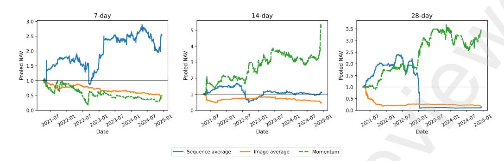

# From Predictability to Tradability: Machine-Learning Signals and Trading Frictions in Cryptocurrency Markets

Kyeong Hun Kima , Byung Hwa Limb,∗

aDepartment of FinTech, Sungkyunkwan University, Republic of Korea

bDepartment of FinTech, SKK Business School, Sungkyunkwan University, Republic of Korea

#### Abstract

This paper examines whether machine-learning-based return predictability in cryptocurrency markets survives into tradable long–short performance. Using daily OHLCV data from 2018 to 2024, five rolling out-of-sample study periods, and a common portfolio-evaluation protocol, we compare representative sequence- and image-based deep-learning models under fixed information, horizon-matched portfolio construction, transaction costs, implementation timing, and benchmark competition. The paper provides a layered evaluation of financial machine-learning signals, moving from statistical ranking quality to net performance, benchmark-adjusted tradability, and uncertaintyaware diagnostics. The models generate weak but statistically detectable cross-sectional ranking signals, especially at short and intermediate horizons, but economic survival is narrow. Strict benchmark-adjusted survival is concentrated at the 7-day horizon, especially in LSTM and GRU. At the 14-day horizon, GRU provides the clearest descriptive model-level pooled case but does not survive the benchmark-adjusted criterion. At the 28-day horizon, no model delivers pooled or benchmark-adjusted economic survival. Overall, the results identify a predictability-tradability gap driven by the difficulty of monetizing weak, regime-dependent, and benchmark-sensitive signals. Preprint not peer reviewed

∗Corresponding author, Byung Hwa Lim acknowledges that this work was supported by the National Research Foundation of Korea (NRF) grant funded by the Korea government (MSIT) (No. RS-2026-25494226)

Email addresses: bigevlt@g.skku.edu (Kyeong Hun Kim), limbh@skku.edu (Byung Hwa Lim)

Keywords: Cryptocurrency markets, Financial machine learning, Cross-sectional return predictability, Predictability-tradability gap, Trading frictions, Long-short portfolios Preprint not peer reviewed

# From Predictability to Tradability: Machine-Learning Signals and Trading Frictions in Cryptocurrency Markets

## Abstract

This paper examines whether machine-learning-based return predictability in cryptocurrency markets survives into tradable long–short performance. Using daily OHLCV data from 2018 to 2024, five rolling out-of-sample study periods, and a common portfolio-evaluation protocol, we compare representative sequence- and image-based deep-learning models under fixed information, horizon-matched portfolio construction, transaction costs, implementation timing, and benchmark competition. The paper provides a layered evaluation of financial machine-learning signals, moving from statistical ranking quality to net performance, benchmark-adjusted tradability, and uncertaintyaware diagnostics. The models generate weak but statistically detectable cross-sectional ranking signals, especially at short and intermediate horizons, but economic survival is narrow. Strict benchmark-adjusted survival is concentrated at the 7-day horizon, especially in LSTM and GRU. At the 14-day horizon, GRU provides the clearest descriptive model-level pooled case but does not survive the benchmark-adjusted criterion. At the 28-day horizon, no model delivers pooled or benchmark-adjusted economic survival. Overall, the results identify a predictability-tradability gap driven by the difficulty of monetizing weak, regime-dependent, and benchmark-sensitive signals. Preprint not peer reviewed

Keywords: Cryptocurrency markets, Financial machine learning, Cross-sectional return predictability, Predictability-tradability gap, Trading frictions, Long-short portfolios

## 1. Introduction

Cryptocurrency markets have evolved from a niche decentralized payment system into a heterogeneous digital asset class characterized by high volatility, abrupt regime shifts, fragmented trading venues, continuous trading, and substantial cross-sectional dispersion. These features make cryptocurrency markets a natural setting for studying return predictability, market frictions, and the interaction between modern predictive models and implementable trading strategies. Prior research documents economically meaningful patterns and risk premia in cryptocurrency returns, while fragmented trading venues can generate persistent arbitrage opportunities and trading frictions (Liu and Tsyvinski, 2021; Makarov and Schoar, 2020).

At the same time, a growing literature asks whether machine-learning methods can extract predictive structure from cryptocurrency data. Especially, recent studies show that nonlinear models can be useful for cryptocurrency forecasting and trading in selected settings (McNally et al., 2018; Alessandretti et al., 2018; Chen et al., 2020; Jaquart et al., 2022). Closely related work forecasts returns for large cryptocurrency cross-sections, develops hybrid deep-learning models, uses technical and candlestick-based features, and reviews the expanding use of machine learning in cryptocurrency research (Liu et al., 2023; Jirou et al., 2025; Orte et al., 2023; Ren et al., 2022). This literature establishes the relevance of machine learning for cryptocurrency prediction, but it also raises a further finance question: whether statistical predictability survives the full transition into economically tradable performance.

That transition is nontrivial. Predictive fit and economic tradability are not the same object. Weak statistical signals can be materially affected by turnover, transaction costs, execution timing, drawdowns, compounding, and competition from simpler benchmark strategies. More broadly, empirical asset-pricing research shows that apparent profitability can weaken once implementation costs, turnover, replication, data-snooping concerns, and postdiscovery decay are taken seriously (Lesmond et al., 2004; Gˆarleanu and Pedersen, 2013; Harvey et al., 2016; Novy-Marx and Velikov, 2016; McLean and Pontiff, 2016; Hou et al., 2017; Patton and Weller, 2020). The relevant question is therefore not only whether machine-learning models can extract cross-sectional predictive information, but whether that information remains distinctive, persistent, and economically useful enough to survive the transition from score to trade. Preprint not peer reviewed

This paper studies that transition. We ask whether machine-learningbased return predictability in cryptocurrency markets survives into net-ofcost long–short performance after portfolio formation, transaction-cost assumptions, implementation timing, compounding, and benchmark competition are imposed. The focus is the predictability-tradability gap: the possibility that model scores contain statistically meaningful ranking information, but that this information fails to become a robust source of tradable performance once implemented through a common portfolio-evaluation protocol. This framing shifts the evaluation of financial machine learning from signal detection to signal monetization.

A central design choice is to hold the information set fixed. We restrict predictive inputs to daily open, high, low, close, and volume (OHLCV) variables, which are widely available across assets and commonly used in cryptocurrency prediction studies (Alessandretti et al., 2018; Jaquart et al., 2022; Liu et al., 2023). Richer predictors such as sentiment, order-book variables, derivatives-market information, on-chain measures, funding rates, or informed-trading variables may contain incremental forecasting content (Dias et al., 2022; Wang et al., 2022; He et al., 2023; Jirou et al., 2025). However, including such variables would change the information set and confound the comparison of how alternative predictive representations process the same market information. Our objective is not to maximize forecasting performance using the richest possible predictor set, but to examine whether signals extracted from a common daily OHLCV setting survive the economic trading layer.

Within this fixed-information design, we compare representative sequencebased and image-based deep-learning models. The sequence-based family processes numerical OHLCV time series using LSTM, GRU, and Transformer architectures (Hochreiter and Schmidhuber, 1997; Cho et al., 2014; Vaswani et al., 2017; Fischer and Krauss, 2018). The image-based family converts the same 30-day OHLCV windows into candlestick-and-volume chart representations and processes them using ResNet, DenseNet, and Vision Transformer architectures (He et al., 2016; Huang et al., 2017; Dosovitskiy et al., 2021). Visual encodings of price histories can contain predictive information in financial markets (Jiang et al., 2023), and technical or candlestick-related features are also used in crypto-asset forecasting (Orte et al., 2023). Here, however, the representation comparison is not treated as an architecture horse race. Instead, the model families provide a controlled way to examine whether different forms of signal extraction lead to different patterns of economic signal survival. Preprint not peer reviewed

The empirical design separates predictive learning from economic evaluation. Models are trained as three-class directional classifiers over horizons h ∈ {1, 7, 14, 28} using a neutral band around zero returns. Predicted class probabilities are converted into scalar ranking scores and then mapped into horizon-matched long–short portfolios using overlapping holding-period tranches, a baseline one-day implementation lag, and proportional transaction costs of 15 bps per half-turn. We evaluate statistical signal quality using horizon-matched cross-sectional information coefficients and economic tradability using pooled out-of-sample net performance over five rolling study periods. We also compare model-based portfolios with momentum, reversal, and random-ranking benchmarks under the same implementation assumptions. The momentum comparison is central because momentum-type strategies have been shown to be relevant in cryptocurrency trading (Chu et al., 2020).

To avoid ambiguity in the notion of signal survival, we distinguish three nested layers. Statistical survival refers to positive cross-sectional ranking information, measured by mean IC. Pooled economic survival refers to positive pooled out-of-sample net Sharpe under the baseline protocol. Benchmarkadjusted survival refers to a nonnegative pooled Sharpe difference relative to the horizon-matched momentum benchmark under the same implementation assumptions. This distinction is important because a signal may survive statistically or within the machine-learning model set without surviving benchmark competition. We further examine score–momentum overlap, residual ICs, rank persistence, regime dependence, transaction-cost robustness, and paired bootstrap evidence on Sharpe-ratio differences.

The results show a structured but narrow predictability–tradability pattern. Model scores contain weak but statistically detectable cross-sectional ranking information, especially at short and intermediate horizons. However, strict benchmark-adjusted survival is concentrated at the 7-day horizon, especially in LSTM and GRU. At the 14-day horizon, GRU reports the highest descriptive pooled Sharpe among the machine-learning models, but it does not survive the stricter benchmark-adjusted criterion and should not be interpreted as statistically dominant. At the 28-day horizon, selected models, especially Transformer, retain detectable statistical signal, but no model delivers pooled or benchmark-adjusted economic survival. Family-level NAV paths reinforce this interpretation: sequence-based signals display the clearest 7-day survival pattern, but neither representation family delivers broad or stable tradability across horizons. Preprint not peer reviewed

The diagnostic results sharpen the interpretation. Transaction costs matter, but they are not the sole bottleneck: removing costs improves performance but does not create broad tradability at the 14- and 28-day horizons. Score-overlap diagnostics show that model scores are not merely momentum clones, yet signal distinctiveness alone is insufficient for economic value. Regime diagnostics show that the main 7-day survival pockets are concentrated in particular market states, while longer-horizon performance remains fragile and benchmark-sensitive. Newey–West inference confirms that several ICs are statistically detectable despite their small magnitudes, whereas paired moving-block bootstrap tests do not support claims of statistically significant architecture dominance in selected Sharpe-ratio comparisons. Thus, the main result is not that a particular architecture dominates, but that statistical signal strength, residual predictability, persistence, and realized tradability need not be ordered in the same way.

The paper's main contribution is an implementation-aware, layered evaluation of financial machine-learning signals that separates statistical signal extraction from tradable signal monetization. First, the paper evaluates machine-learning signals beyond predictive accuracy, directional classification, and raw information coefficients by asking whether model scores survive portfolio formation, trading costs, implementation timing, compounding, and benchmark competition. This extends the forecasting-oriented cryptocurrency machine-learning literature by emphasizing the conversion from prediction to tradability (Liu et al., 2023; Jirou et al., 2025; Orte et al., 2023). Second, the paper develops a controlled classification-to-ranking-to-portfolio design under a fixed OHLCV information set, making the predictability– tradability gap directly observable. Third, the paper provides diagnostic evidence on why statistical signals fail to become tradable signals. By combining residual information coefficients, score–momentum overlap, rank persistence, selection retention, pooled net performance, family-level NAV paths, regime splits, bootstrap checks, and benchmark-relative comparisons, the paper shows that the bottleneck lies not in detecting weak predictive structure alone, but in monetizing weak, regime-dependent, and benchmark-sensitive signals. Preprint not peer reviewed

The broader implication is prescriptive. Financial machine-learning signals should not be evaluated only by a single predictive metric. A credible evaluation should ask whether a signal ranks assets correctly, whether the induced trades survive implementation, whether the resulting strategy remains economically distinctive relative to transparent benchmarks, and whether descriptive model rankings are robust to uncertainty checks. The contribution of this paper is to bring these layers together in a controlled cryptocurrency setting and to show that the economic viability of machine-learning signals depends on whether weak predictive information survives the full transition from statistical ranking to tradable performance.

The remainder of the paper proceeds as follows. Section 2 describes the data and empirical design. Section 3 reports the empirical results. Section 4 discusses the implications of the findings. Section 5 concludes.

#### 2. Data and Empirical Design

This section describes the data, predictive-signal construction, portfolioevaluation design, benchmark construction, and diagnostic tests. The empirical framework separates signal extraction from signal monetization by evaluating model scores first as cross-sectional rankings and then as implemented long–short portfolios under common costs, timing, compounding, benchmark comparisons, and robustness diagnostics.

### 2.1. Data and Sample Construction

We use daily cryptocurrency data denominated in U.S. dollars from February 1, 2018, to December 15, 2024. For each asset, we observe open, high, low, and close prices, trading volume, and market capitalization. Prices are obtained from CryptoCompare's CCCAGG index, which aggregates quotes across major exchanges using volume-weighted averaging and outlier controls. Daily observations are timestamped at 00:00 UTC and correspond to the previous calendar day's close. For coin c, the one-day simple return is defined as

$$r_{t+1}^c = \frac{P_{t+1}^c}{P_t^c} - 1.$$

All labels, information coefficients, benchmark signals, portfolio returns, and economic performance statistics are based on simple returns.

For each study period, the investable universe is defined as the top 100 cryptocurrencies ranked by market capitalization on the first day of the corresponding training window. Fiat-pegged stablecoins and assets with insufficient continuous OHLCV histories are excluded. Once selected, the universe is held fixed within the study period. This fixed-universe design keeps the cross-sectional domain stable when comparing model signals and avoids reconstructing the tradable set using future information. Assets with missing or non-finite inputs are excluded on affected dates, and the set of tradable assets on date t is denoted by C(t). Preprint not peer reviewed

To accommodate the non-stationarity of cryptocurrency markets, we divide the sample into five rolling study periods. Each study period spans 1,350

trading days and contains a training window of 810 days, a validation window of 270 days, and a strictly held-out test window of 270 days. Adjacent study periods overlap in the estimation sample but generate non-overlapping out-of-sample test windows. Models are estimated separately by study period and forecast horizon. Training data are used to fit model parameters and feature transformations, validation data are used for model selection, and test data are reserved exclusively for out-of-sample evaluation. Table 1 reports the exact calendar ranges. Preprint not peer reviewed

Table 1: Study periods and date ranges for training, validation, and test sets.

|    |                       |                       | er r                  |
|----|-----------------------|-----------------------|-----------------------|
| SP | Training              | Set Validation        | Set Test Set          |
| 1  | 2018-05-02–2020-07-09 | 2020-07-10–2021-04-05 | 2021-04-06–2021-12-31 |
| 2  | 2019-01-27–2021-04-05 | 2021-04-06–2021-12-31 | 2022-01-01–2022-09-27 |
| 3  | 2019-10-24–2021-12-31 | 2022-01-01–2022-09-27 | 2022-09-28–2023-06-24 |
| 4  | 2020-07-20–2022-09-27 | 2022-09-28–2023-06-24 | 2023-06-25–2024-03-20 |
| 5  | 2021-04-16–2023-06-24 | 2023-06-25–2024-03-20 | 2024-03-21–2024-12-15 |

# 2.2. Predictive Signals and Model Families

Within each study period, model inputs are constructed from 30-day rolling lookback windows. We deliberately restrict the information set to daily OHLCV variables. This restriction is an identification choice: it allows sequence-based and image-based models to be compared under the same underlying market information rather than under different predictor sets.

The first representation is a sequence-based numerical input. For each coin c and day t, we compute one-day percentage changes of OHLC prices and log-differences of trading volume:

$$\Delta p_t^c = \frac{p_t^c - p_{t-1}^c}{p_{t-1}^c}, \quad p \in \{\text{Open, High, Low, Close}\},$$

$$\ell V_t^c = \log(1 + V_t^c), \quad \Delta \ell V_t^c = \ell V_t^c - \ell V_{t-1}^c.$$

The resulting five-channel time series is standardized using training-window statistics only, and the fitted transformation is applied unchanged to validation and test observations.

The second representation is an image-based input. Each 30-day OHLCV window is rendered as a candlestick chart with aligned volume bars. The chart-generation rule is fixed across assets, dates, study periods, and image architectures. The image pipeline uses the same OHLCV information as the sequence pipeline; it changes only the representation through which that information is presented to the model.

We compare representative models from the two representation families. The sequence-based family consists of LSTM, GRU, and Transformer models. The image-based family consists of ResNet, DenseNet, and Vision Transformer (ViT) models. The six architectures are chosen to span common recurrent, attention-based, convolutional, densely connected, and visual-transformer representations under a fixed information set. The goal is not to exhaust the rapidly evolving forecasting-model universe or to identify the globally best architecture, but to evaluate whether representative signal representations survive the economic trading layer. Preprint not peer reviewed

For each horizon h ∈ {1, 7, 14, 28}, the cumulative simple return for coin c over the forward window is

$$R_{t,h}^c = \prod_{j=1}^h (1 + r_{t+j}^c) - 1.$$

We formulate prediction as a three-class directional classification problem. Let η = 0.005 denote the neutral-band threshold. The label is defined as

$$y_{t,h}^c = \begin{cases} +1, & \text{if } R_{t,h}^c \geq \eta, \\ 0, & \text{if } |R_{t,h}^c| < \eta, \\ -1, & \text{if } R_{t,h}^c \leq -\eta. \end{cases}$$

The neutral band reduces label noise from small price movements and stabilizes the learning problem in a high-volatility market. Labels are defined on the forward window, while predictors use information available before portfolio execution.

All models are trained with cross-entropy loss to predict the three directional classes. Hyperparameters are selected on the validation window within each study period, and early stopping is used to reduce overfitting. Although the models are trained as classifiers, the empirical object of interest is not classification accuracy. Instead, we convert predicted class probabilities into a scalar ranking score:

$$s_{t,h}^c = \widehat{p}_{t,h}^c(\text{up}) - \widehat{p}_{t,h}^c(\text{down}).$$

This score is used to rank assets cross-sectionally on each signal date. Higher values indicate stronger model-implied confidence in upward relative to downward movement. Architecture and training details are summarized in Appendix A.

#### 2.3. Portfolio Construction and Performance Evaluation

We translate model scores into long–short portfolios using a common, model-invariant trading rule. For each signal date t and horizon h, assets in C(t) are ranked by s c t,h. The portfolio buys the top k assets and shorts the bottom k assets. The main text focuses on the representative case k = 5.

Portfolio formation is horizon-matched. For horizon h, a new long–short tranche is opened each trading day and held for h trading days. Hence, in steady state, the strategy contains h overlapping tranches initiated on different signal dates. This rolling-tranche design reduces dependence on arbitrary portfolio start dates and aligns the investment horizon with the prediction horizon.

Let δ ∈ {0, 1} denote the implementation lag, with δ = 1 in the baseline specification. The baseline rule uses lagged model scores so that the portfolio does not use information unavailable at execution. The zero-lag case is reported only as an implementation-timing proxy.

For each active tranche, positions are initialized with equal notional within the long and short legs at entry and are then held to maturity without intermediate rebalancing. Let A (h) t denote the set of active tranches at date t for horizon h. For a tranche initiated on signal date u, let Lu,h and Su,h denote the top-k and bottom-k assets selected by the model score, and let q L u,c and q S u,c denote the fixed quantities held in the long and short legs. These quantities are fixed at tranche entry and remain unchanged until tranche expiration; therefore, within-tranche weights are allowed to drift with realized prices. Preprint not peer reviewed

The gross daily mark-to-market PnL of the horizon-matched portfolio is computed from active tranche-level positions:

$$\Pi_{t+1}^{G,(h)} = \sum_{u \in \mathcal{A}_t^{(h)}} \left[ \sum_{c \in L_{u,h}} q_{u,c}^L \left( P_{t+1}^c - P_t^c \right) + \sum_{c \in S_{u,h}} q_{u,c}^S \left( P_t^c - P_{t+1}^c \right) \right].$$

The corresponding gross portfolio return is

$$r_{p,t+1}^{G,(h)} = \frac{\prod_{t+1}^{G,(h)}}{E_t},$$

where  $E_t$  denotes portfolio equity immediately before the return from  $t$  to  $t+1$ . Equivalently, the gross return can be written using the aggregate signed portfolio weights induced by all active long and short positions:

$$r_{p,t+1}^{G,(h)} = \sum_c \tilde{w}_{c,t}^{(h)} r_{t+1}^c,$$

where  $\tilde{w}_{c,t}^{(h)}$  denotes the pre-trade, mark-to-market portfolio weight after passive price drift and before opening or closing tranches. This notation makes clear that the implementation is based on position-level mark-to-market accounting, not on daily re-equal-weighting within active tranches.

Transaction costs are incorporated through proportional costs applied to trade-induced one-way turnover. Let  $w_{c,t+1}^{(h)}$  denote the post-trade aggregate signed portfolio weight after opening the new tranche and closing expired tranches, and let  $\tilde{w}_{c,t+1}^{(h)}$  denote the corresponding pre-trade weight after passive mark-to-market drift. One-way turnover is defined as

$$\text{TO}_{t+1}^{(h)} \equiv \frac{1}{2} \sum_c \left| w_{c,t+1}^{(h)} - \tilde{w}_{c,t+1}^{(h)} \right|.$$

Passive mark-to-market drift within an active tranche is not counted as turnover because it does not require an intermediate trade. Turnover is generated by tranche openings, tranche expirations, and any explicit rebalancing rule; in the baseline design, active tranches are not rebalanced before maturity.

The baseline cost rate is  $\lambda = 15$  basis points per half-turn, and transaction costs are deducted from daily portfolio returns as

$$\text{TC}_{t+1}^{(h)} = \lambda \cdot \text{TO}_{t+1}^{(h)}.$$

The 15 bps per half-turn specification is intended as a disciplined baseline rather than a claim that the same execution cost applies uniformly across all cryptocurrency assets and venues. It is broadly consistent with trading liquid assets on major centralized exchanges, but it is likely optimistic for smaller or less liquid assets once bid-ask spreads, slippage, market impact, funding costs, and borrowing constraints are included. For this reason, we interpret the transaction-cost sensitivity analysis at 0, 15, and 30 bps as a diagnostic robustness check rather than as a precise execution-cost calibration.

The net portfolio return is therefore

$$r_{p,t+1}^{N,(h)} = r_{p,t+1}^{G,(h)} - \text{TC}_{t+1}^{(h)}.$$

Under the horizon-matched tranche design, a new tranche is opened and the tranche initiated h days earlier is closed each day. This convention counts opening and closing trades separately through trade-induced turnover while avoiding the assumption of daily rebalancing inside active tranches.

Net asset value evolves multiplicatively:

$$\text{NAV}_{t+1}^{(h)} = \text{NAV}_t^{(h)} \left( 1 + r_{p,t+1}^{N,(h)} \right).$$

The same path-stability rules are applied to all model-based and benchmark strategies. Sleeve-level asset returns used for mark-to-market valuation are winsorized at ±25%, portfolio-level daily returns are clipped to the interval [−0.99, 0.99], and paths whose net equity falls below 10−6 are treated as effectively failed. These safeguards do not create profits; they make path deterioration explicit and prevent economically meaningless wealth recursion after near-bankruptcy. Preprint not peer reviewed

The primary statistical signal-quality metric is the daily cross-sectional information coefficient:

$$IC_{t,h} = \rho_S \left( \{s_{t,h}^c\}_{c \in \mathcal{C}(t)}, \{R_{t,h}^c\}_{c \in \mathcal{C}(t)} \right),$$

where ρS(·, ·) denotes Spearman rank correlation. The IC evaluates whether model scores rank assets in the correct cross-sectional order, independently of any trading rule.

Economic performance is evaluated using pooled out-of-sample net returns, annualized Sharpe ratios, cumulative net asset value (NAV), maximum drawdown, and benchmark-relative comparisons. Pooled out-of-sample results are computed by concatenating the five non-overlapping test windows. Because cryptocurrency markets trade continuously, annualized volatility and Sharpe ratios are computed from daily returns using the 365-day convention:

$$\text{Vol}_{\text{ann}} = \sqrt{365} \text{Vol}_{\text{daily}}, \quad \text{Sharpe}_{\text{ann}} = \sqrt{365} \text{Sharpe}_{\text{daily}}$$

Sharpe ratios are interpreted jointly with cumulative performance and drawdown because risk-adjusted statistics alone can be misleading when wealth paths are unstable or collapse.

For visualization, we also report family-level pooled NAV paths. Individual model NAVs are first constructed from pooled out-of-sample net returns. The sequence-family NAV is the equal-initial-capital average of the LSTM,

GRU, and Transformer NAV paths; the image-family NAV is the corresponding average of the ResNet, DenseNet, and ViT NAV paths. If an individual model path effectively fails, its terminal NAV is retained in the family average rather than dropping the path. This convention prevents failed strategies from disappearing from the family-level visualization. As a robustness check, we also compute median family-level NAV paths. The family-level paths are used only to visualize representation-family signal survival; the main tabular comparisons remain at the individual model level. Preprint not peer reviewed

## 2.4. Benchmarks and Survival Definitions

We compare model-based portfolios with three simple benchmark strategies evaluated under the same universe, portfolio breadth, holding-period structure, transaction-cost convention, implementation lag, and positionlevel accounting.

First, the horizon-matched momentum benchmark buys recent winners and shorts recent losers. Let u denote a signal date. For horizon h, the horizon-matched momentum score is the past-h cumulative simple return ending on the signal date:

$$M_{u,h}^c = \prod_{j=0}^{h-1} (1 + r_{u-j}^c) - 1 = \frac{P_u^c}{P_{u-h}^c} - 1.$$

The resulting momentum ranking is implemented under the same one-day lag convention used for the model-based portfolios. Second, the one-day reversal benchmark buys recent losers and shorts recent winners based on the previous one-day return. Third, the random-ranking benchmark assigns random cross-sectional rankings and is averaged across repeated random draws. The random benchmark is interpreted as a sampling-variation baseline rather than as a serious deterministic trading rule.

To avoid ambiguity in the term signal survival, we use three nested definitions. Statistical survival refers to positive mean IC. Pooled economic survival refers to positive pooled out-of-sample net Sharpe under the baseline portfolio-evaluation protocol. Benchmark-adjusted survival refers to a nonnegative pooled Sharpe difference relative to the horizon-matched momentum benchmark:

$$\Delta S R_{m,h}^{\text{pooled}} = S R_{m,h}^{\text{pooled}} - S R_{\text{Mom},h}^{\text{pooled}}$$

where SRpooled m,h is the pooled net Sharpe of model m at horizon h, and SRpooled Mom,h is the pooled net Sharpe of the corresponding horizon-matched momentum benchmark.

We also report a descriptive strict survival indicator that requires statistical survival, pooled net Sharpe above 0.50, and nonnegative pooled benchmark-adjusted performance. This final threshold is not used as a formal statistical test; it is used to separate small positive pooled cases from economically stronger cases. Average lag-1 Sharpe gaps relative to momentum are reported separately as diagnostic benchmark comparisons, but the nested survival counts are based on pooled benchmark-adjusted performance. Preprint not peer reviewed

Transaction-cost robustness is evaluated by repeating the portfolio-evaluation protocol at alternative per-half-turn cost levels. The main cost-sensitivity results compare 0, 15, and 30 basis points per half-turn. These checks are used to distinguish performance deterioration caused by transaction costs from broader weakness in the underlying signal.

## 2.5. Signal Diagnostics and Inference

To understand why statistical predictability and economic tradability diverge, we compute additional signal diagnostics. The first is a residual information coefficient. On each signal date, model scores are rank-residualized with respect to the horizon-matched momentum score and the one-day reversal score; the residual scores are then correlated with horizon-matched realized returns. This diagnostic asks whether model signals contain ranking information beyond simple benchmark-like structure.

The second diagnostic is score–momentum overlap. For each signal date, model, and horizon, we compute the cross-sectional Spearman correlation between the machine-learning score and the horizon-matched momentum score. We also compute top-k long-side and short-side selection overlap with momentum. These diagnostics distinguish model signals that are merely close substitutes for momentum from signals that are statistically distinct but still economically fragile.

The third diagnostic is rank persistence, measured by the day-to-day Spearman autocorrelation of model score rankings. The fourth diagnostic is selection retention, defined as the one-day overlap in the assets selected for the long and short sides of the portfolio. These diagnostics are not intended to provide a full liquidity, capacity, or microstructure decomposition. Instead, they provide within-design evidence on whether predictive rankings are distinct, persistent, and economically usable after benchmark overlap and implementation filters are imposed.

Because adjacent horizon-matched returns and daily IC series may be serially dependent, we supplement descriptive IC comparisons with Newey– West inference. For horizon h, the lag length is set to h − 1, matching the overlap induced by horizon-matched forward returns. The resulting statistics are interpreted as diagnostic evidence on whether weak ICs are statistically detectable, not as standalone evidence of economic tradability.

We also conduct paired moving-block bootstrap checks for selected Sharperatio differences. Differences are computed using aligned daily net return series. The bootstrap block length is set to the corresponding holding horizon h, and the tests are used to distinguish descriptive model rankings from statistically significant architecture or benchmark dominance. These tests are interpreted as robustness diagnostics rather than as evidence that any single architecture dominates all alternatives.

Finally, we examine regime dependence. Regimes are defined from the same daily OHLCV panel. Market direction is classified by the sign of the cross-sectional average one-day return. Cross-sectional dispersion is measured as the daily standard deviation of one-day asset returns and split into high and low states by horizon-specific medians. Rolling market volatility is computed as the 30-day rolling standard deviation of the cross-sectional average return within each study period and horizon, again split by horizonspecific medians. Momentum strength is measured as the cross-sectional average absolute horizon-matched momentum score and split into high and low states. We then recompute IC diagnostics and conditional net-return performance within each regime state. Preprint not peer reviewed

Taken together, the design allows the empirical analysis to distinguish five questions. First, do machine-learning scores contain cross-sectional ranking information? Second, do these rankings survive common portfolio implementation? Third, do the surviving strategies provide economic value relative to simple benchmarks? Fourth, are the learned signals distinct from benchmark-like rankings such as momentum? Fifth, are descriptive model rankings robust to inference checks and regime conditioning? The paper's main contribution lies in studying the mapping across these layers rather than in proposing a new forecasting architecture.

#### 3. Empirical Results

This section examines whether machine-learning signals that contain crosssectional predictive information survive the transition into tradable long– short performance. Unless otherwise stated, the analysis focuses on the representative portfolio breadth k = 5, the baseline one-day implementation lag, and the 15 bps per half-turn transaction-cost specification described in Section 2.3. We center the main text on the 7-, 14-, and 28-day horizons because these horizons provide the relevant trade-off between signal persistence and implementation burden. The 1-day horizon is omitted from the main tables because it is primarily a high-turnover reference case rather than the central setting for the tradability claims.

We use the term signal survival in three nested senses. Statistical survival refers to positive mean cross-sectional information coefficients. Pooled economic survival refers to positive pooled out-of-sample net Sharpe under the baseline implementation protocol. Benchmark-adjusted survival refers to a nonnegative pooled Sharpe difference relative to the horizon-matched momentum benchmark. We also report a descriptive strict survival indicator that requires statistical survival, pooled net Sharpe above 0.50, and nonnegative pooled benchmark-adjusted performance. This final threshold is not a formal statistical test; it is used only to distinguish small positive cases from economically stronger cases. Preprint not peer reviewed

The analysis proceeds in five subsections. First, we compare statistical ranking quality with pooled out-of-sample net performance and summarize nested survival patterns. Second, we examine implementation costs and execution timing. Third, we compare model-based portfolios with simple benchmark strategies evaluated under the same implementation assumptions. Fourth, we use score-overlap, residual-signal, persistence, and inferential diagnostics to explain why statistical predictability does not necessarily imply tradability. Fifth, we summarize regime dependence and path-aggregation robustness.

## 3.1. Predictive Signals, Net Performance, and Nested Survival

We begin by comparing the statistical content of model-generated scores with the economic performance of the portfolios formed from those scores. Table 2 reports, for each model and horizon, the mean cross-sectional information coefficient (IC) and the pooled out-of-sample net Sharpe ratio. The IC is computed as the daily Spearman rank correlation between model

Table 2: Predictive signals and pooled net performance at k = 5.

| scores and periods. The pooled overlapping return series under Table 2: Model | horizon-matched Sharpe out-of-sample the Predictive IC | realized ratio test common signals 7-day Sharpe | returns, is computed windows trading and pooled IC | and by and engine. net 14-day Sharpe | then concatenating compounding performance | averaged across study the five non the resulting net at k = 5. 28-day IC Sharpe |
|-------------------------------------------------------------------------------|--------------------------------------------------------|-------------------------------------------------|----------------------------------------------------|--------------------------------------|--------------------------------------------|----------------------------------------------------------------------------------|
| DenseNet                                                                      | 0.040                                                  | -0.378                                          | 0.031                                              | 0.274                                | 0.010                                      | -0.823                                                                           |
| GRU                                                                           | 0.058                                                  | 0.615                                           | 0.042                                              | 0.731                                | 0.009                                      | -0.167                                                                           |
| LSTM                                                                          | 0.050                                                  | 0.981                                           | 0.033                                              | -0.008                               | -0.006                                     | -0.926                                                                           |
| ResNet                                                                        | 0.023                                                  | -1.168                                          | 0.015                                              | -1.070                               | 0.007                                      | -1.101                                                                           |
| Transformer                                                                   | 0.060                                                  | 0.129                                           | 0.067                                              | -0.351                               | 0.041                                      | -0.325                                                                           |
| ViT                                                                           | 0.021                                                  | -0.614                                          | 0.016                                              | 0.150                                | 0.004                                      | -0.913                                                                           |
| Notes: IC reports                                                             | the mean                                               | cross-sectional                                 |                                                    | Spearman                             | information                                | coefficient averaged                                                             |
| across study periods.                                                         | Sharpe                                                 | reports                                         | the pooled                                         | out-of-sample                        | net                                        | Sharpe ratio across                                                              |
| the five non-overlapping                                                      | test                                                   | windows                                         | under                                              | the baseline                         | one-day                                    | lag and 15 bps per                                                               |
| half-turn transaction-cost                                                    |                                                        | specification.                                  | The                                                | 1-day horizon                        | is                                         | omitted from the main                                                            |
| table because it                                                              | is used as a                                           | high-turnover                                   |                                                    | reference                            | case rather                                | than as a central                                                                |
| tradability setting.                                                          |                                                        |                                                 |                                                    |                                      |                                            |                                                                                  |
| Table 2 shows                                                                 | that the                                               | model                                           | scores                                             | contain                              | weak but                                   | systematic ranking                                                               |
| information,                                                                  | especially at                                          | the 7-                                          | and 14-day                                         | horizons.                            |                                            | Most ICs are positive,                                                           |
| and Transformer                                                               | has the                                                | highest                                         | mean IC                                            | at all                               | three                                      | horizons reported in the                                                         |
| main text. However,                                                           | the                                                    | mapping                                         | from                                               | statistical                          |                                            | predictability to tradable                                                       |
| performance is                                                                | selective and                                          |                                                 | non-monotonic.                                     |                                      |                                            |                                                                                  |
| At the 7-day                                                                  | horizon,                                               | LSTM and                                        | GRU                                                | provide                              | the                                        | clearest positive pooled                                                         |
| cases, with net                                                               | Sharpe ratios                                          | of                                              | 0.981 and                                          | 0.615,                               | respectively.                              | Transformer                                                                      |
| has the highest                                                               | mean IC at                                             | this                                            | horizon,                                           | but its                              | pooled                                     | net Sharpe is only                                                               |
| 0.129. Thus,                                                                  | even at the                                            | horizon                                         | where                                              |                                      | machine-learning                           | portfolios per                                                                  |
| form most favorably,                                                          | higher                                                 | statistical                                     |                                                    | ranking                              | quality does                               | not mechanically                                                                 |
| translate into                                                                | higher economic                                        |                                                 | performance.                                       |                                      |                                            |                                                                                  |
| At the 14-day                                                                 | horizon,                                               | the                                             | divergence                                         | is sharper.                          |                                            | Transformer again has                                                            |
| the highest IC,                                                               | but its pooled                                         | net                                             | Sharpe                                             | is                                   | negative.                                  | GRU has a lower IC                                                               |
| but reports the                                                               | highest                                                | descriptive                                     | pooled                                             | Sharpe                               | within                                     | the model set, with                                                              |
| a net Sharpe of                                                               | 0.731. This                                            | result                                          | should                                             | be                                   | interpreted                                | as a model-level                                                                 |
| pooled case rather                                                            | than as                                                | evidence                                        | of                                                 |                                      | benchmark-adjusted                         | or statistically                                                                 |
| dominant performance.                                                         |                                                        |                                                 |                                                    |                                      |                                            |                                                                                  |

At the 28-day horizon, pooled economic performance is weak across all models. Transformer retains a positive IC of 0.041, but its pooled net Sharpe is negative. All six models produce negative pooled Sharpe ratios at this horizon. The 28-day results therefore do not imply that long-horizon predictive content is entirely absent; rather, they show that any remaining statistical signal does not survive pooled implementation into robust tradability.

Table 3 summarizes these patterns using the nested survival definitions introduced above. The table makes clear that statistical survival is much broader than economic survival. At the 7-day horizon, all six models exhibit positive mean ICs, three models have positive pooled Sharpe ratios, three models have nonnegative pooled benchmark-adjusted gaps, and two models satisfy the more demanding strict survival criterion. At the 14-day horizon, all six models retain statistical survival and three have positive pooled Sharpe ratios, but none survives the benchmark-adjusted criterion. At the 28-day horizon, five models retain positive mean ICs, but none produces pooled or benchmark-adjusted economic survival. Preprint not peer reviewed

Table 3: Nested survival counts by horizon.

| Survival criterion                            |     | 7-day | 14-day | 28-day |
|-----------------------------------------------|-----|-------|--------|--------|
| Statistical: mean IC > 0                      |     | 6/6   | 6/6    | 5/6    |
| Pooled economic: pooled Sharpe > 0            |     | 3/6   | 3/6    | 0/6    |
| Benchmark-adjusted: pooled gap vs. momentum   | ≥ 0 | 3/6   | 0/6    | 0/6    |
| Strict: IC > 0, Sharpe > 0 50, pooled gap ≥ 0 |     | 2/6   | 0/6    | 0/6    |

Notes: Entries report the number of models satisfying each criterion out of six models. Benchmark-adjusted survival is based on the pooled Sharpe difference relative to the horizon-matched momentum benchmark. The strict criterion is descriptive and is used to distinguish small positive pooled cases from economically stronger cases.

The nested decomposition is important for interpretation. The main evidence of strict machine-learning tradability is concentrated in the 7-day horizon, especially in LSTM and GRU. The 14-day GRU result remains economically relevant within the model set, but it is not a benchmark-adjusted survival case. The 28-day horizon is best interpreted as statistical survival without economic survival.

Figure 1 provides family-level path evidence for the transition from predictive signals to tradable performance. At the 7-day horizon, the sequence-

Figure 1: Family-level pooled out-of-sample NAV paths at k = 5. Each panel compounds net returns over the five non-overlapping test windows under the baseline one-day lag and 15 bps per half-turn transaction-cost specification. The sequence average is the equal-initial-capital average of LSTM, GRU, and Transformer; the image average is the corresponding average of ResNet, DenseNet, and ViT. Momentum is the horizon-matched benchmark evaluated under the same implementation assumptions. Full model-level results are reported in Table 2. Vertical scales are panel-specific.

based family exhibits the clearest pooled survival pattern, while the imagebased family and the momentum benchmark remain weaker. At the 14 day horizon, benchmark competition becomes more restrictive: the horizonmatched momentum benchmark compounds more strongly than either representation family, even though selected machine-learning specifications remain economically relevant at the model level. At the 28-day horizon, neither representation family delivers stable pooled tradability, while momentum remains the more demanding benchmark. The figure therefore reinforces the table-based conclusion that economic value is selective and benchmarkdependent rather than broad-based across representation families.

A median-family NAV robustness check confirms the same qualitative interpretation. At the 7-day horizon, the sequence-family mean and median terminal NAVs are 2.535 and 1.325, respectively, so the short-horizon sequence-family survival pattern is not solely an artifact of mean aggregation. At the 14-day horizon, however, the sequence-family mean terminal NAV of 1.106 weakens to a median terminal NAV of 0.535, and at the 28-day horizon both sequence and image families fail under mean and median aggregation. The robustness check therefore supports the 7-day sequence-family result while reinforcing the fragility of longer-horizon machine-learning performance. Preprint not peer reviewed

#### 3.2. Implementation Costs and Execution Timing

The pooled performance results in Table 2 and the family-level NAV paths in Figure 1 are already net of the baseline 15 bps per half-turn transactioncost specification. We next examine whether the economic interpretation changes when transaction costs and implementation timing are varied.

Table 4 reports a broad horizon-level transaction-cost sensitivity summary at 0, 15, and 30 bps per half-turn, averaging across model specifications, study periods, and available portfolio-breadth settings. The results clarify that transaction costs matter, but they are not the sole bottleneck. Removing transaction costs improves performance, especially at short horizons, but it does not create broad tradability at the 14- and 28-day horizons. At zero costs, the average Sharpe is 0.708 at 7 days, 0.282 at 14 days, and 0.006 at 28 days. Thus, the predictability–tradability gap is not explained by transaction costs alone. The deeper issue is that OHLCV-based machine-learning signals are weak, regime-dependent, and benchmark-sensitive. Preprint not peer reviewed

Table 4: Broad horizon-level transaction-cost sensitivity.

| Horizon | t p 0 bps | 15 bps | 30 bps |
|---------|-----------|--------|--------|
| 7-day   | 0.708     | 0.140  | -0.383 |
| 14-day  | 0.282     | -0.009 | -0.306 |
| 28-day  | 0.006     | -0.142 | -0.306 |

Notes: Entries report average annualized net Sharpe ratios from the transaction-cost sensitivity exercise, averaged across model specifications, study periods, and available portfolio-breadth settings within each horizon. Cost levels are expressed in basis points per half-turn. The table is intended as a broad diagnostic summary of cost sensitivity, not as a replacement for the model-level pooled k = 5 results in Table 2.

Selected model–horizon cases remain more favorable than the broad averages. For example, the 7-day LSTM, GRU, and Transformer specifications remain positive in the average lag-1 Sharpe comparison across the reported cost levels, and GRU remains positive at the 14-day horizon. However, these selected cases do not overturn the nested survival interpretation in Table 3: strict benchmark-adjusted survival remains concentrated at the 7-day horizon.

We next isolate implementation timing. Table 5 compares average net Sharpe ratios under a zero-lag implementation proxy and the baseline oneday-lag specification. Each cell reports lag 0 / lag 1.

Table 5: Execution-timing check at k = 5.

| Model       |        | 7-day    |        | 14-day   |        | 28-day vi |
|-------------|--------|----------|--------|----------|--------|-----------|
| DenseNet    | 0.191  | / -0.270 | 0.421  | / 0.265  | -0.276 | / -0.258  |
| GRU         | 0.624  | / 1.214  | 0.546  | / 0.949  | -0.440 | / 0.565   |
| LSTM        | 0.665  | / 1.076  | -1.436 | / -0.380 | -1.611 | / -0.460  |
| ResNet      | -0.810 | / -1.028 | -1.343 | / -1.116 | -1.430 | / -1.452  |
| Transformer | 1.171  | / 1.070  | 0.716  | / 0.192  | 0.879  | / 0.579   |
| ViT         | -0.054 | / -0.644 | -0.833 | / -0.053 | -0.242 | / -0.928  |

Notes: Each cell reports average net Sharpe under lag 0 / lag 1 across study periods. Lag 1 is the baseline implementation.

The lag results show that execution timing is not a uniform decay channel. At the 7-day horizon, GRU, LSTM, and Transformer are positive in the average lag-1 Sharpe comparison, although the pooled evidence in Table 2 indicates that the strict 7-day cases are concentrated mainly in LSTM and GRU. At the 14-day horizon, GRU improves under the lagged implementation and remains the clearest descriptive model-level case, while Transformer loses much of its zero-lag advantage. At the 28-day horizon, positive average lag-1 Sharpe values for GRU and Transformer should be interpreted cautiously because the pooled Sharpe evidence remains negative for all models. Preprint not peer reviewed

These patterns indicate that implementation timing can reorder strategies rather than simply subtract value from a fixed signal. In a noisy and continuously traded market, a one-day implementation delay may damp unstable same-day signals in some cases while eroding useful information in others. The economic value of a model score is therefore not determined solely by its rank correlation with future returns. It also depends on whether the induced trading rule can survive timing conventions, transaction costs, benchmark competition, and the path through which portfolio returns compound.

# 3.3. Benchmark Comparison

We next compare the model-based portfolios with simple benchmark strategies evaluated under the same trading engine, transaction-cost rate, implementation lag, and portfolio breadth. Table 6 reports average net Sharpe ratios for horizon-matched momentum, one-day reversal, and repeated random ranking. The benchmark values are study-period averages under the baseline lag-1 and 15 bps per half-turn specification, so the relevant model comparator is the lag-1 average net Sharpe in Table 5. The random-ranking benchmark is averaged across repeated random draws and is best interpreted as a sampling-variation baseline rather than as a serious deterministic trading rule.

Table 6: Benchmark comparison at k = 5.

| Benchmark      | 7-day  | 14-day | 28-day |
|----------------|--------|--------|--------|
| Momentum       | 0.019  | 1.037  | 1.162  |
| Random ranking | -0.914 | -0.652 | -0.571 |
| Reversal       | -0.080 | -0.906 | -1.487 |

Notes: Entries report average net Sharpe ratios across study periods under the baseline lag-1 and 15 bps per half-turn transaction-cost specification. The random-ranking benchmark is averaged across repeated random seeds.

The benchmark comparison sharpens the economic interpretation of the model results. At the 7-day horizon, the simple benchmark hurdle is low. Momentum is close to zero, reversal is slightly negative, and random ranking is clearly unattractive. Against this benchmark set, the favorable 7-day machine-learning specifications, especially LSTM and GRU, provide positive benchmark-relative cases. Transformer also exceeds the simple benchmarks in the average lag-1 Sharpe comparison, although its pooled Sharpe in Table 2 is much weaker than that of LSTM and GRU. Preprint not peer reviewed

At the 14-day horizon, the benchmark hurdle becomes materially higher. Horizon-matched momentum reaches a net Sharpe of 1.037. Although GRU provides the highest descriptive pooled Sharpe among the machine-learning models at this horizon, it does not exceed the momentum benchmark in the average lag-1 comparison. The 14-day result should therefore be interpreted as model-level pooled survival within the machine-learning set, not as benchmark-adjusted survival.

At the 28-day horizon, benchmark competition is even more restrictive. Momentum remains strong, while the model-based portfolios fail to generate positive pooled Sharpe ratios. This result prevents an overstatement of machine-learning value at longer horizons. Positive or persistent predictive structure is insufficient for economic relevance if a simple benchmark strategy remains more effective under the same implementation assumptions.

Overall, benchmark competition acts as a final economic filter. A signal that survives the statistical and implementation layers may still fail to provide incremental economic value once compared with transparent alternatives. The paper's main claim is therefore not broad machine-learning dominance, but selective signal survival after implementation filters and benchmark competition are imposed.

## 3.4. Signal Distinctiveness, Inference, and Model-Ranking Uncertainty

The preceding results show that statistical predictability, pooled performance, implementation timing, and benchmark-relative performance do not move one-for-one. This subsection adds three diagnostic layers. First, we examine whether model scores are simply momentum-like rankings. Second, we report Newey–West inference for selected daily IC series. Third, we use paired moving-block bootstrap tests to determine whether descriptive Sharpe differences should be interpreted as statistically significant model dominance.

Table 7 reports selected model–horizon cases that illustrate the main survival and failure patterns. The table includes the mean IC, a Newey–West t-statistic for the mean IC, residual IC computed after rank-residualizing model scores with respect to horizon-matched momentum and one-day reversal scores, the average daily cross-sectional correlation between model scores and horizon-matched momentum scores, pooled net Sharpe, and the average lag-1 Sharpe gap relative to horizon-matched momentum. Full model-level diagnostics, score-overlap summaries, and inference tables are reported in the Appendix.

Table 7 delivers four results. First, the model signals are weak in magnitude but statistically detectable for the main short- and intermediate-horizon cases. The Newey–West t-statistics for LSTM, GRU, and Transformer at the 7-day horizon exceed 6, and the 14-day GRU and Transformer ICs are also statistically detectable. These results should be interpreted as evidence of statistical detectability rather than economic strength. The IC magnitudes remain small, and the portfolio and bootstrap results show that statistically detectable rankings can still be too weak to produce robust net tradability. At the 28-day horizon, the GRU IC is not statistically distinguishable from zero under this diagnostic, while Transformer retains a small but detectable IC. Preprint not peer reviewed

Second, the model scores are not simple momentum clones. The score– momentum correlations are small and, for several of the economically relevant cases, negative. For example, the 7-day LSTM and GRU score–momentum correlations are -0.185 and -0.155, respectively, and the 14-day GRU correlation is -0.031. Transformer is more positively related to momentum, especially at longer horizons, but its score–momentum correlations remain

Table 7: Selected signal, overlap, and inferential diagnostics at k = 5.

| Horizon | Model       | IC    | NW for IC | t Resid. IC | ρ (score, mom.) | Pooled Sharpe | evi Gap vs. Mom. |
|---------|-------------|-------|-----------|-------------|-----------------|---------------|------------------|
| 7-day   | GRU         | 0.058 | 6.68      | 0.030       | -0.155          | 0.615         | 1.194            |
| 7-day   | LSTM        | 0.050 | 6.24      | 0.020       | -0.185          | 0.981         | 1.057            |
| 7-day   | Transformer | 0.060 | 6.37      | 0.059       | 0.075           | 0.129         | 1.051            |
| 14-day  | GRU         | 0.042 | 3.86      | 0.024       | -0.031          | 0.731         | -0.088           |
| 14-day  | Transformer | 0.067 | 4.88      | 0.064       | 0.103           | -0.351        | -0.845           |
| 28-day  | GRU         | 0.009 | 0.55      | 0.003       | 0.125           | -0.167        | -0.598           |
| 28-day  | Transformer | 0.041 | 2.10      | 0.042       | 0.148           | -0.325        | -0.583           |

Notes: NW t reports the Newey–West t-statistic for the mean daily IC. Residual IC is computed after rank-residualizing model scores with respect to the horizon-matched momentum score and the one-day reversal score on each signal date, and then correlating the residual scores with horizon-matched realized returns. ρ(score, mom.) is the average daily cross-sectional Spearman correlation between the machine-learning score and the horizon-matched momentum score. Gap vs. Mom. reports the average lag-1 net Sharpe difference relative to the horizon-matched momentum benchmark and is used as a diagnostic benchmark comparison.

modest. Thus, the failure to convert statistical predictability into tradability is not simply explained by models mechanically reproducing momentum. The learned scores can be distinct from momentum and still fail to become economically robust signals.

Third, the highest-IC model is not necessarily the best-performing trading model. The 14-day horizon provides the clearest example. Transformer has the highest raw IC, the highest residual IC, and a statistically detectable mean IC. Yet its pooled net Sharpe is negative and its average lag-1 Sharpe remains well below the momentum benchmark. GRU has weaker statistical diagnostics, but it reports the highest descriptive pooled Sharpe among the machine-learning models at the 14-day horizon and comes closest to the momentum benchmark. Preprint not peer reviewed

Fourth, this GRU–Transformer contrast should be interpreted descriptively rather than as evidence of statistically significant architecture dominance. Paired moving-block bootstrap tests for selected Sharpe-ratio differences do not reject equality of model performance at conventional significance levels. For example, the 14-day GRU–Transformer Sharpe difference is positive in the descriptive comparison, but the corresponding bootstrap p-value is 0.285. Similarly, the 7-day LSTM–GRU comparison has a bootstrap pvalue of 0.262, and the 14-day GRU–momentum comparison has a bootstrap p-value of 0.572. The diagnostic implication is therefore not that one architecture statistically dominates another. Rather, the evidence shows that the ranking of statistical signal strength, residual predictability, persistence, and realized trading performance need not coincide.

The 7-day horizon provides the main strict survival pocket. LSTM and GRU translate modest residual signal into positive pooled performance and positive benchmark-relative gaps. Transformer again illustrates the difference between statistical signal strength and monetization: it has the highest 7-day IC and residual IC among the selected cases, but its pooled Sharpe is much weaker than that of LSTM and GRU.

The 28-day horizon illustrates the limiting case. Transformer retains positive residual IC and a statistically detectable mean IC, but the pooled Sharpe remains negative and momentum remains economically more effective. GRU is less negative in pooled performance but has essentially no residual IC and no statistically detectable mean IC. Thus, the long-horizon result is not merely a monetization failure. It also reflects a benchmark-relative signalextraction limitation: the daily OHLCV-based models do not capture the longer-horizon trend component in an economically useful way under the present design. Preprint not peer reviewed

## 3.5. Regime Dependence and Path Robustness

The final diagnostic layer asks whether the selective survival pockets are concentrated in particular market states. We split daily observations by market direction, cross-sectional dispersion, rolling market volatility, and momentum strength. These regime diagnostics do not overturn the main results, but they clarify where the machine-learning signals are more economically usable.

The 7-day survival pocket is regime-dependent. LSTM and GRU perform better in more adverse or more dispersed market states. For example, the 7-day LSTM Sharpe is 1.409 in down-market states and 0.476 in up-market states, while the corresponding GRU values are 1.119 and 0.213. Similar patterns appear in high-dispersion and high-volatility states. Thus, the main 7-day survival cases are not uniform across market environments; they are concentrated in regimes where short-horizon cross-sectional dislocations appear more exploitable.

At the 14-day horizon, regime conditioning confirms that GRU is a descriptive model-level case but not a benchmark-adjusted survival case. GRU performs relatively well in some regimes, but horizon-matched momentum remains a demanding benchmark. At the 28-day horizon, Transformer shows isolated positive pockets in low-dispersion or low-volatility states, but it performs poorly in more stressed states and does not overturn the pooled or benchmark-relative failure at that horizon. These results reinforce the interpretation that longer-horizon machine-learning tradability is fragile and benchmark-sensitive.

The path-aggregation robustness check leads to the same conclusion. Replacing mean family-level NAV aggregation with median aggregation leaves the 7-day sequence-family survival pattern visible, but it weakens the apparent 14-day sequence-family case and confirms failure for both representation families at the 28-day horizon. Thus, the family-level path evidence is not driven solely by a single outlying model path, but the economic interpretation remains selective rather than broad-based.

Taken together, the empirical results support four conclusions. First, weak cross-sectional machine-learning predictability is present in cryptocurrency markets, especially at short and intermediate horizons. Second, strict benchmark-adjusted tradability survives only narrowly and is concentrated at the 7-day horizon, mainly in LSTM and GRU. Third, transaction costs worsen performance but are not the sole bottleneck: even zero-cost robustness does not create broad tradability at the 14- and 28-day horizons. Fourth, signal extraction and signal monetization are distinct empirical objects. Machine-learning scores can be statistically detectable and partially distinct from momentum, yet remain economically fragile, regime-dependent, and unable to dominate simple horizon-matched momentum at longer horizons. Preprint not peer reviewed

#### 4. Discussion

The empirical results provide a qualified answer to whether machinelearning-based return predictability in cryptocurrency markets can be converted into tradable long–short performance. The main finding is not broad machine-learning dominance, but a narrow and layered form of signal survival. Machine-learning models extract weak but statistically detectable cross-sectional ranking information, especially at short and intermediate horizons, yet only a small subset of these signals survives portfolio implementation, transaction costs, timing conventions, and benchmark competition. Statistical predictability, pooled economic performance, benchmark-adjusted tradability, and uncertainty-aware model ranking are therefore related but distinct empirical objects.

The first implication is that signal extraction is not sufficient for signal monetization. The IC evidence shows that several architectures repeatedly rank assets in the correct cross-sectional direction, but the magnitudes are small. Newey–West inference confirms that some of these weak ICs are statistically detectable, while the portfolio evidence shows that statistical detectability should not be interpreted as economic strength. This distinction is particularly important in financial machine-learning settings, where large cross-sections can make small signals statistically visible even when they remain economically fragile after costs, timing, drawdowns, and compounding are imposed.

A second implication is that transaction costs matter, but they are not the sole source of the predictability–tradability gap. Removing costs improves performance, especially at shorter horizons, but it does not create broad tradability at the 14- and 28-day horizons. The implemented signals are weak in economic magnitude, sensitive to market conditions, and exposed to strong benchmark competition. Implementation frictions therefore reveal and amplify signal fragility, rather than merely subtracting value from an otherwise strong predictive signal. Execution timing reinforces this point: moving from a zero-lag proxy to the baseline one-day lag reorders model performance in some cases rather than uniformly destroying it.

Benchmark competition is the third and most important economic filter. At the 7-day horizon, the simple benchmark hurdle is low, and selected machine-learning strategies—especially LSTM and GRU—survive both pooled and benchmark-adjusted criteria. At the 14-day horizon, GRU provides the clearest descriptive pooled case within the model set, but horizon-matched momentum remains stronger under the benchmark-adjusted criterion. At the 28-day horizon, selected models retain detectable statistical signal, but none delivers pooled or benchmark-adjusted economic survival. These results show that a model can pass the statistical layer and even generate positive pooled performance, yet still fail to provide incremental economic value relative to a transparent benchmark. Preprint not peer reviewed

The diagnostic evidence further shows that the machine-learning scores are not merely noisy replications of momentum. Score–momentum correlations are generally modest, and in the clearest 7-day cases they are negative. Residual ICs also indicate that some ranking information remains after neutralizing simple momentum and reversal components. However, signal distinctiveness alone is not enough. The 14-day GRU–Transformer contrast illustrates this point: Transformer has stronger raw and residual ICs and more persistent rankings, whereas GRU reports the stronger descriptive pooled Sharpe within the machine-learning model set. Paired moving-block bootstrap tests, however, do not support statistically significant architecture dominance. The relevant lesson is therefore not that one architecture dominates another, but that statistical signal rankings and realized trading rankings need not coincide.

The regime and representation-family results point in the same direction. The main 7-day survival pockets are stronger in more adverse or more dispersed market states, suggesting that OHLCV-based machine-learning signals are regime-dependent rather than uniformly monetizable. The representationfamily evidence is also selective. Sequence-based models contain the clearest favorable cases, and family-level NAV paths show the strongest 7-day survival pattern for the sequence family. However, median-family NAV aggregation weakens the apparent 14-day sequence-family case and confirms that both representation families fail at the 28-day horizon. The weaker image-family evidence should not be interpreted as proof that visual financial representations are uninformative. Rather, it suggests that the tradable signal contained in candlestick-based encodings may be too weak, regime-dependent, or benchmark-sensitive to survive the portfolio layer in cryptocurrency markets. It may also reflect a mismatch between ImageNet-pretrained visual backbones and sparse 30-day financial charts. Preprint not peer reviewed

These findings have a broader methodological implication for empirical finance and financial machine learning. Model evaluation should not stop at predictive fit, classification accuracy, or raw ICs. A credible assessment should include a statistical layer that asks whether the model ranks assets correctly, an implementation layer that asks whether the induced trades survive costs, timing, and compounding, a benchmark layer that asks whether the strategy is economically distinctive relative to transparent alternatives, and an uncertainty layer that asks whether descriptive model rankings support dominance claims. The evidence in this paper shows that a signal can pass the statistical layer while failing the implementation or benchmark layers. Evaluating only the statistical layer therefore risks overstating the real-world tradability of machine-learning forecasts.

Several limitations should be noted. The analysis is deliberately con-

ditional on a fixed daily OHLCV information set, a fixed ex ante universe within each study period, representative deep-learning architectures, and a stylized long–short trading engine with proportional transaction costs. The design does not incorporate richer predictors such as order-book variables, derivatives-market information, on-chain measures, funding rates, or sentiment data. It also does not model exchange-specific liquidation rules, borrow constraints, market impact, funding costs, or full liquidity and capacity limits. These restrictions keep the comparison controlled and allow the paper to focus on the mapping from predictive signal to tradable performance under a common protocol. Richer information sets, cost-aware learning objectives, decision-aware training losses, regime-conditional deployment rules, and more detailed execution models remain important directions for future research.sequence- or image-based representations uniformly dominatening is not simply the presence of transaction costs, nor is it the complete absence of predictability. Machine-learning models can extract weak and partly benchmark-distinct ranking information from standardized OHLCV data. The central difficulty is that this information is hard to monetize: strict survival is concentrated at short horizons, longer-horizon performance is benchmark-sensitive, and statistical model rankings do not translate reliably into robust economic dominance. Preprint not peer reviewed

#### 5. Conclusion

This paper examines whether machine-learning-based return predictability in cryptocurrency markets survives into tradable long-short performance. Using daily OHLCV data, five rolling out-of-sample study periods, representative sequence-based and image-based deep-learning models, and a common portfolio-evaluation protocol, we evaluate model signals through a layered framework that separates statistical signal extraction evidence from equitymarket imaginization.

The evidence shows that machine-learning models can extract weak but statistically detectable cross-sectional ranking information from cryptocurrency markets. However, this predictability converts into economic value only narrowly. Strict benchmark-adjusted survival is concentrated at the 7-day horizon, especially in LSTM and GRU. At the 14-day horizon, GRU reports the strongest descriptive pooled case within the machine-learning model set, but it does not survive the stricter benchmark-adjusted criterion and should not be interpreted as statistically dominant. At the 28-day horizon, selected models, especially Transformer, retain detectable statistical signal, but no model delivers pooled or benchmark-adjusted economic survival.

The central conclusion is that signal extraction and signal monetization are distinct empirical objects. Higher ICs, stronger residual predictability, more persistent score rankings, and higher selection retention do not mechanically imply higher trading performance. Transaction costs matter, but they are not the sole bottleneck; model scores are not simply momentum clones, but signal distinctiveness alone is insufficient for economic value; and the surviving 7-day pockets are regime-dependent rather than uniform. Bootstrap evidence further cautions against interpreting descriptive Sharpe differences as statistically significant architecture dominance.

These findings qualify the role of deep learning in cryptocurrency trading. They do not imply that deep-learning models are unable to learn useful structure from OHLCV data. Rather, they show that the economic value of such structure is fragile, implementation-sensitive, regime-dependent, and benchmark-dependent. Evaluations based only on predictive fit, classification performance, raw ICs, or residual predictability are therefore likely to overstate tradability unless they are paired with disciplined portfolio construction, transaction-cost assumptions, execution timing, benchmark calibration, and uncertainty checks.

The analysis is deliberately conditional on a fixed daily OHLCV information set, a fixed ex ante universe within each study period, representative model families, and a stylized long–short trading engine. Future work could examine whether richer predictors, cost-aware or decision-aware learning objectives, regime-conditional deployment rules, dynamic universe selection, and more detailed execution and liquidity models improve the conversion of predictive signals into tradable performance. The central lesson is therefore broader than the performance of any individual architecture: in cryptocurrency markets, machine-learning predictability is easier to detect than to monetize, especially when signals are weak, regime-dependent, and exposed to strong benchmark competition. Preprint not peer reviewed

## Data Availability

The raw cryptocurrency market data used in this study are obtained from CryptoCompare and are subject to the provider's data access terms. Processed result tables, diagnostic outputs, and audit files underlying the empirical analysis are available from the authors upon reasonable request. Replication code for the empirical pipeline is available from the authors upon reasonable request, to the extent permitted by data-provider access restrictions.

### References

Alessandretti, L., ElBahrawy, A., Aiello, L.M., Baronchelli, A., 2018. Anticipating cryptocurrency prices using machine learning. Complexity 2018, 8983590. Chen, Z., Li, C., Sun, W., 2020. Bitcoin price prediction using machine learning: An approach to sample dimension engineering. Journal of Computational and Applied Mathematics 365, 112395. Cho, K., Van Merrienboer, B., Gulcehre, C., Bahdanau, D., Bougares, F., Schwenk, H., Bengio, Y., 2014. Learning phrase representations using rnn encoder–decoder for statistical machine translation, in: Proceedings of the 2014 Conference on Empirical Methods in Natural Language Processing (EMNLP), pp. 1724–1734. Chu, J., Chan, S., Zhang, Y., 2020. High frequency momentum trading with cryptocurrencies. Research in international business and finance 52, 101176. Dias, I.K., Fernando, J.R., Fernando, P.N.D., 2022. Does investor sentiment predict bitcoin return and volatility? a quantile regression approach. International Review of Financial Analysis 84, 102383. Dosovitskiy, A., Beyer, L., Kolesnikov, A., Weissenborn, D., Zhai, X., Unterthiner, T., Dehghani, M., Minderer, M., Heigold, G., Gelly, S., Uszkoreit, J., Houlsby, N., 2021. An Image is Worth 16x16 Words: Transformers for Image Recognition at Scale, in: International Conference on Learning Representations. Fischer, T., Krauss, C., 2018. Deep learning with long short-term memory networks for financial market predictions. European journal of operational research 270, 654–669. Gˆarleanu, N., Pedersen, L.H., 2013. Dynamic trading with predictable returns and transaction costs. The Journal of Finance 68, 2309–2340. Preprint not peer reviewed

Harvey, C.R., Liu, Y., Zhu, H., 2016. . . . and the cross-section of expected returns. The Review of financial studies 29, 5–68. He, K., Zhang, X., Ren, S., Sun, J., 2016. Deep residual learning for image recognition, in: Proceedings of the IEEE conference on computer vision and pattern recognition, pp. 770–778. He, M., Shen, L., Zhang, Y., Zhang, Y., 2023. Predicting cryptocurrency returns for real-world investments: A daily updated and accessible predictor. Finance Research Letters 58, 104406. Hochreiter, S., Schmidhuber, J., 1997. Long short-term memory. Neural computation 9, 1735–1780. Hou, K., Xue, C., Zhang, L., 2017. Replicating anomalies. Technical Report. National Bureau of Economic Research. Huang, G., Liu, Z., Van Der Maaten, L., Weinberger, K.Q., 2017. Densely connected convolutional networks, in: Proceedings of the IEEE conference on computer vision and pattern recognition, pp. 4700–4708. Jaquart, P., K¨opke, S., Weinhardt, C., 2022. Machine learning for cryptocurrency market prediction and trading. The Journal of Finance and Data Science 8, 331–352. Jiang, J., Kelly, B., Xiu, D., 2023. (re-) imag (in) ing price trends. The Journal of Finance 78, 3193–3249. Jirou, I., Jebabli, I., Lahiani, A., 2025. A hybrid deep learning model for cryptocurrency returns forecasting: Comparison of the performance of financial markets and impact of external variables. Research in International Business and Finance 73, 102575. Lesmond, D.A., Schill, M.J., Zhou, C., 2004. The illusory nature of momentum profits. Journal of financial economics 71, 349–380. Liu, Y., Li, Z., Nekhili, R., Sultan, J., 2023. Forecasting cryptocurrency returns with machine learning. Research in International Business and Finance 64, 101905. Liu, Y., Tsyvinski, A., 2021. Risks and returns of cryptocurrency. The Review of Financial Studies 34, 2689–2727. Preprint not peer reviewed

Makarov, I., Schoar, A., 2020. Trading and arbitrage in cryptocurrency markets. Journal of Financial Economics 135, 293–319. McLean, R.D., Pontiff, J., 2016. Does academic research destroy stock return predictability? The Journal of Finance 71, 5–32. McNally, S., Roche, J., Caton, S., 2018. Predicting the price of bitcoin using machine learning, in: 2018 26th euromicro international conference on parallel, distributed and network-based processing (PDP), IEEE. pp. 339–343. Novy-Marx, R., Velikov, M., 2016. A taxonomy of anomalies and their trading costs. The Review of Financial Studies 29, 104–147. Orte, F., Mira, J., S´anchez, M.J., Solana, P., 2023. A random forest-based model for crypto asset forecasts in futures markets with out-of-sample prediction. Research in International Business and Finance 64, 101829. Patton, A.J., Weller, B.M., 2020. What you see is not what you get: The costs of trading market anomalies. Journal of Financial Economics 137, 515–549. Ren, Y.S., Ma, C.Q., Kong, X.L., Baltas, K., Zureigat, Q., 2022. Past, present, and future of the application of machine learning in cryptocurrency research. Research in International Business and Finance 63, 101799. Vaswani, A., Shazeer, N., Parmar, N., Uszkoreit, J., Jones, L., Gomez, A.N., Kaiser, L., Polosukhin, I., 2017. Attention is all you need, in: Advances in Neural Information Processing Systems. Wang, Y., Wang, C., Sensoy, A., Yao, S., Cheng, F., 2022. Can investors' informed trading predict cryptocurrency returns? evidence from machine learning. Research in International Business and Finance 62, 101683. Preprint not peer reviewed

## Appendix A. Data Filters and Model Configuration

This appendix reports compact information on the data filters and model configurations used in the empirical analysis. The appendix is intentionally limited to implementation details needed to interpret the main results. Full asset-level audit files, additional portfolio-breadth outputs, and diagnostic robustness outputs are available from the authors upon reasonable request.

## Appendix A.1. Data filters

For each study period, the initial candidate universe is defined as the top 100 cryptocurrencies by market capitalization on the first day of the corresponding training window. Two filters are then applied before the studyperiod universe is fixed. First, fiat-pegged stablecoins and stable-value tokens are excluded because they are not suitable for directional return prediction. Second, assets with insufficient continuous OHLCV histories are excluded when the 30-day sequence and image inputs cannot be constructed consistently. Table A.1 summarizes the filters. Preprint not peer reviewed

Table A.1: Summary of asset exclusion filters.

|                            | not p                                |       |
|----------------------------|--------------------------------------|-------|
| Filter                     | Description                          | Count |
| Stable-value assets        | Fiat-pegged stablecoins and          |       |
|                            | stable-value tokens                  | 11    |
| Insufficient OHLCV history | Assets without sufficient continuous |       |
|                            | daily OHLCV histories                | 53    |
| Total excluded assets      |                                      | 64    |

The fixed-universe design is used for comparability across model families and study periods. Assets with missing or non-finite inputs on a particular date are excluded from the tradable cross-section on that date. The full asset-level exclusion list is not reported in the main appendix to keep the submission compact, but it is retained in the audit files available from the authors upon reasonable request.

# Appendix A.2. Model configuration

All models are trained separately by study period and forecast horizon using cross-entropy loss, validation-window model selection, and early stopping.

Table A.2: Model-specific architecture and training settings.

| The model set is rather tures are chosen to span common recurrent, densely connected, and formation set. The purpose is not to architecture, but to evaluate whether survive the economic trading layer. Table Table A.2: Model-specific architecture Model Input Architecture summary Sequence models LSTM Sequence Single-layer LSTM; input | than identify A.2 size 5; | the and hidden | exhaustive. globally summarizes training size | The six architec under a fixed in best forecasting signal the final model settings. Optimizer LR Batch Max epochs Adam |
|-----------------------------------------------------------------------------------------------------------------------------------------------------------------------------------------------------------------------------------------------------------------------------------------------------------------------------------------------|---------------------------|----------------|-----------------------------------------------|--------------------------------------------------------------------------------------------------------------------------|
| 64; MLP head 64 → 32 → 3                                                                                                                                                                                                                                                                                                                      | with                      | ReLU           |                                               |                                                                                                                          |
|                                                                                                                                                                                                                                                                                                                                               |                           |                |                                               | 10 − 4 64 100 Adam                                                                                                       |
| GRU Sequence Single-layer GRU; input size                                                                                                                                                                                                                                                                                                     | 5;                        | hidden         | size                                          |                                                                                                                          |
| 64; MLP head 64 → 32 → 3                                                                                                                                                                                                                                                                                                                      | with                      | ReLU           |                                               |                                                                                                                          |
|                                                                                                                                                                                                                                                                                                                                               |                           |                |                                               | 10 − 4 64 100 Adam                                                                                                       |
| Transformer Sequence Input projection 5 →                                                                                                                                                                                                                                                                                                     | 64;                       | 4-head         | self                                         |                                                                                                                          |
| attention; feedforward width                                                                                                                                                                                                                                                                                                                  | 64;                       | dropout        |                                               |                                                                                                                          |
| 0.15; mean pooling; 3-class                                                                                                                                                                                                                                                                                                                   | head                      |                |                                               |                                                                                                                          |
|                                                                                                                                                                                                                                                                                                                                               |                           |                |                                               | 10 − 4 64 100                                                                                                            |
| Image models                                                                                                                                                                                                                                                                                                                                  |                           |                |                                               | Adam                                                                                                                     |
| ResNet Image ImageNet-pretrained ResNet-50;                                                                                                                                                                                                                                                                                                   |                           | final fully    |                                               |                                                                                                                          |
| connected layer replaced with                                                                                                                                                                                                                                                                                                                 | a                         | 3-class head;  |                                               |                                                                                                                          |
| end-to-end fine-tuning                                                                                                                                                                                                                                                                                                                        |                           |                |                                               |                                                                                                                          |
|                                                                                                                                                                                                                                                                                                                                               |                           |                | 5 ×                                           | 10 − 5 16 100 Adam                                                                                                       |
| DenseNet Image ImageNet-pretrained                                                                                                                                                                                                                                                                                                            | DenseNet-121;             | classi        |                                               |                                                                                                                          |
| fier replaced with a 3-class                                                                                                                                                                                                                                                                                                                  | head;                     | end-to-end     |                                               |                                                                                                                          |
| fine-tuning                                                                                                                                                                                                                                                                                                                                   |                           |                | 5 ×                                           | 10 − 5 16 100 Adam                                                                                                       |
| ViT Image Pretrained ViT-B/16;                                                                                                                                                                                                                                                                                                                | classification            | head           |                                               |                                                                                                                          |
| adapted to 3 output classes;                                                                                                                                                                                                                                                                                                                  | end-to-end                | fine          |                                               |                                                                                                                          |
| tuning                                                                                                                                                                                                                                                                                                                                        |                           |                | 5 ×                                           | 10 − 5 16 100                                                                                                            |
| All sequence-based models use the same                                                                                                                                                                                                                                                                                                        |                           | five-channel   |                                               | input representation:                                                                                                    |
| one-day percentage changes in open, high,                                                                                                                                                                                                                                                                                                     | low,                      | and            | close                                         | prices, and the one                                                                                                     |
| day log-difference of trading volume.                                                                                                                                                                                                                                                                                                         | These                     | inputs         | are                                           | standardized using                                                                                                       |
| training-window statistics only. Image-based                                                                                                                                                                                                                                                                                                  |                           | models         | use                                           | 30-day candlestick                                                                                                      |
| and-volume charts generated from the                                                                                                                                                                                                                                                                                                          | same                      | OHLCV          |                                               | windows. The chart                                                                                                      |
| generation rule is fixed across study periods,                                                                                                                                                                                                                                                                                                |                           | assets,        | and                                           | image architectures.                                                                                                     |
| Early stopping is enabled with                                                                                                                                                                                                                                                                                                                | validation-window         |                | model                                         | selection. For the                                                                                                       |
| sequence models, mini-batches of size 64                                                                                                                                                                                                                                                                                                      | are                       | used,          | and                                           | gradient clipping with                                                                                                   |
| maximum norm 1.0 is applied during                                                                                                                                                                                                                                                                                                            | optimization.             |                | For                                           | the image models,                                                                                                        |
| chart images are resized deterministically                                                                                                                                                                                                                                                                                                    | to 224                    | ×              | 224                                           | before being passed to                                                                                                   |

the pretrained visual backbone; no stochastic image augmentation is used. These choices are intended to keep the comparison controlled rather than to search exhaustively for the best architecture.

## Appendix B. Full Signal Diagnostics

The main text reports selected diagnostic cases to explain the divergence between statistical predictability and economic tradability. Table B.1 reports the full set of model-level diagnostics for all six models at the 7-, 14-, and 28-day horizons. The 1-day horizon is omitted because it is treated as a high-turnover reference case rather than as a central setting for the paper's tradability claims.

Residual IC is computed by rank-residualizing model scores with respect to the horizon-matched momentum score and the one-day reversal score on each signal date, and then correlating the residual scores with horizonmatched realized returns. Rank AC denotes day-to-day score-rank autocorrelation. Long Ret. and Short Ret. report one-day selection-retention rates for the long and short sides of the portfolio. Pooled Sharpe is the pooled outof-sample net Sharpe at k = 5. Gap vs. Momentum is the difference between the model's average lag-1 net Sharpe and the corresponding horizon-matched momentum benchmark.

The full diagnostics reinforce the interpretation in the main text. First, positive statistical signal does not necessarily imply positive pooled tradability. Transformer retains high residual IC and rank persistence, especially at the 14- and 28-day horizons, but does not deliver higher economic performance. Second, the 7-day horizon contains the clearest survival pocket, but even there model-level success is selective rather than broad. Third, at the 28-day horizon, residual signal remains detectable for some models, but neither representation family produces robust pooled tradability once implementation and benchmark competition are imposed. Preprint not peer reviewed

# Appendix C. Robustness and Inference

This appendix reports robustness and inference checks used to support the diagnostic interpretation in the main text. The results are not used to claim statistically significant architecture dominance. Rather, they clarify whether the reported model rankings should be interpreted as descriptive evidence of non-monotonic mapping between statistical signals and realized performance.

Table B.1: Full signal diagnostics at k = 5.

| Model Panel | Table B.1: A: 7-day | Full IC Resid. IC | signal Rank AC | Long Ret. | diagnostics Short Ret. | at k = Pooled Sharpe | 5. Gap vs. Mom. |
|-------------|---------------------|-------------------|----------------|-----------|------------------------|----------------------|-----------------|
| DenseNet    | 0.040               | 0.021             | 0.735          | 0.467     | 0.457                  | -0.378               | -0.289          |
| GRU         | 0.058               | 0.030             | 0.688          | 0.478     | 0.530                  | 0.615                | 1.194           |
| LSTM        | 0.050               | 0.020             | 0.583          | 0.442     | 0.487                  | 0.981                | 1.057           |
| ResNet      | 0.023               | 0.007             | 0.635          | 0.377     | 0.370                  | -1.168               | -1.047          |
| Transformer | 0.060               | 0.059             | 0.904          | 0.753     | 0.772                  | 0.129                | 1.051           |
| ViT         | 0.021               | 0.013             | 0.426          | 0.245     | 0.234                  | -0.614               | -0.663          |
| Panel B:    | 14-day              |                   |                |           |                        |                      |                 |
| DenseNet    | 0.031               | 0.018             | 0.771          | 0.492     | 0.497                  | 0.274                | -0.771          |
| GRU         | 0.042               | 0.024             | 0.751          | 0.570     | 0.588                  | 0.731                | -0.088          |
| LSTM        | 0.033               | 0.011             | 0.673          | 0.514     | 0.553                  | -0.008               | -1.417          |
| ResNet      | 0.015               | 0.004             | 0.699          | 0.437     | 0.423                  | -1.070               | -2.152          |
| Transformer | 0.067               | 0.064             | 0.925          | 0.764     | 0.793                  | -0.351               | -0.845          |
| ViT         | 0.016               | 0.014             | 0.526          | 0.309     | 0.296                  | 0.150                | -1.090          |
| Panel C:    | 28-day              |                   |                |           |                        |                      |                 |
| DenseNet    | 0.010               | 0.006             | 0.806          | 0.555     | 0.532                  | -0.823               | -1.420          |
| GRU         | 0.009               | 0.003             | 0.856          | 0.643     | 0.662                  | -0.167               | -0.598          |
| LSTM        | -0.006              | -0.017            | 0.889          | 0.647     | 0.689                  | -0.926               | -1.622          |
| ResNet      | 0.007               | 0.000             | 0.731          | 0.473     | 0.439                  | -1.101               | -2.614          |
| Transformer | 0.041               | 0.042             | 0.930          | 0.776     | 0.788                  | -0.325               | -0.583          |
| ViT         | 0.004               | -0.002            | 0.589          | 0.351     | 0.330                  | -0.913               | -2.090          |

#### Appendix C.1. Transaction-cost robustness

Table C.1 reports cost robustness for selected model–horizon cases. The table uses average lag-1 net Sharpe values at k = 5 under alternative per-halfturn transaction-cost levels. These selected cases are more favorable than the broad horizon-level averages reported in the main text, and should be interpreted jointly with the pooled Sharpe and benchmark-adjusted survival results.

Table C.1: Cost robustness for selected model–horizon cases.

| Case         |        | 0 bps | 15 bps | er re 30 bps |
|--------------|--------|-------|--------|--------------|
| LSTM,        | 7-day  | 1.400 | 1.076  | 0.764        |
| GRU,         | 7-day  | 1.413 | 1.214  | 1.244        |
| Transformer, | 7-day  | 1.388 | 1.070  | 0.945        |
| GRU,         | 14-day | 1.107 | 0.949  | 0.807        |
| Transformer, | 14-day | 0.345 | 0.192  | 0.032        |
| Transformer, | 28-day | 0.647 | 0.579  | 0.617        |

The selected-case cost results show that some model–horizon combinations remain positive in the average lag-1 comparison across the reported cost levels. However, the broad cost-robustness exercise in the main text shows that removing costs does not create broad tradability at the 14- and 28-day horizons. Transaction costs therefore matter, but they are not the only bottleneck. The 15 bps baseline should be interpreted as a disciplined reference point rather than as a universal execution-cost calibration for all assets and venues. Preprint not peer reviewed

#### Appendix C.2. Score–momentum overlap

Table C.2 reports selected score–momentum overlap diagnostics. The score–momentum correlation is the daily cross-sectional Spearman correlation between the machine-learning score and the horizon-matched momentum score, averaged over the evaluation sample. Long and short overlaps report the average overlap between the model-selected top-k or bottom-k assets and the corresponding momentum-selected sets at k = 5.

The overlap diagnostics show that the machine-learning scores are not merely momentum rankings in disguise. Several of the clearest short-horizon cases have negative or weak score–momentum correlations. However, distinctiveness from momentum is not sufficient for tradability: model scores can

Table C.2: Selected score–momentum overlap diagnostics.

| Horizon           | Table C.2: Model    | Selected score–momentum ρ (score, mom.) | overlap diagnostics. Long overlap | Short overlap            |
|-------------------|---------------------|-----------------------------------------|-----------------------------------|--------------------------|
| 7-day             | LSTM                | -0.185                                  | 0.055                             | 0.103                    |
| 7-day             | GRU                 | -0.155                                  | 0.069                             | 0.110                    |
| 7-day             | Transformer         | 0.075                                   | 0.114                             | 0.196                    |
| 14-day            | GRU                 | -0.031                                  | 0.086                             | 0.143                    |
| 14-day            | Transformer         | 0.103                                   | 0.120                             | 0.193                    |
| 28-day            | GRU                 | 0.125                                   | 0.112                             | 0.212                    |
| 28-day            | Transformer         | 0.148                                   | 0.155                             | 0.212                    |
| be statistically  | detectable          | and partially                           | benchmark-distinct                | while still failing      |
| to produce        | robust net          | performance.                            |                                   |                          |
| Appendix          | C.3.                | Information-coefficient                 | inference                         |                          |
| Table             | C.3 reports         | Newey–West inference                    | for selected                      | mean daily ICs.          |
| The lag           | length is set to h  | − 1 for horizon h to                    | account for                       | overlap in horizon      |
| matched           | forward returns.    | The results are used                    | to evaluate                       | whether weak ICs         |
| are statistically | detectable;         | they are not                            | interpreted as                    | evidence of economic     |
| tradability       | by themselves.      |                                         |                                   |                          |
|                   | Table C.3: Selected | Newey–West inference                    | for mean                          | daily ICs.               |
|                   | Horizon Model       | Mean IC                                 | NW t -stat p                      | -value                   |
|                   | 7-day LSTM          | 0.050                                   | 6.24 <                            | 0 001                    |
|                   | 7-day GRU           | 0.058                                   | 6.68 <                            | 0 001                    |
|                   | 7-day               | Transformer 0.060                       | 6.37 <                            | 0 001                    |
|                   | 14-day GRU          | 0.042                                   | 3.86 <                            | 0 001                    |
|                   | 14-day              | Transformer 0.067                       | 4.88 <                            | 0 001                    |
|                   | 28-day GRU          | 0.009                                   | 0.55                              | 0.581                    |
|                   | 28-day              | Transformer 0.041                       | 2.10                              | 0.036                    |
| The IC            | inference supports  | the statement                           | that the main                     | short- and intermediate |
| horizon           | signals are weak    | but statistically                       | detectable. However,              | the IC mag              |
| nitudes           | remain small, and   | the portfolio-level                     | evidence shows                    | that statistical         |
| detectability     | should not be       | interpreted as                          | economic strength.                |                          |

## Appendix C.3. Information-coefficient inference

Table C.3: Selected Newey–West inference for mean daily ICs.

| Horizon | Model       | Mean IC | NW t -stat | p     | -value |
|---------|-------------|---------|------------|-------|--------|
| 7-day   | LSTM        | 0.050   | 6.24       | < 0   | 001    |
| 7-day   | GRU         | 0.058   | 6.68       | < 0   | 001    |
| 7-day   | Transformer | 0.060   | 6.37       | < 0   | 001    |
| 14-day  | GRU         | 0.042   | 3.86       | < 0   | 001    |
| 14-day  | Transformer | 0.067   | 4.88       | < 0   | 001    |
| 28-day  | GRU         | 0.009   | 0.55       | 0.581 |        |
| 28-day  | Transformer | 0.041   | 2.10       | 0.036 |        |

## Appendix C.4. Sharpe-difference bootstrap

Table C.4: Paired moving-block bootstrap tests for selected Sharpe-ratio differences.

| Appendix             | C.4.                 | Sharpe-difference |                          | bootstrap       |             |        |             |                   |           |              |              |               |
|----------------------|----------------------|-------------------|--------------------------|-----------------|-------------|--------|-------------|-------------------|-----------|--------------|--------------|---------------|
| Table                | C.4                  | reports           | paired moving-block      | bootstrap       |             |        |             | tests             |           | for          | selected     | annu         |
| alized Sharpe-ratio  |                      |                   | differences. Differences | are             | computed    |        |             |                   | as        |              | Sharpe(A)    | minus         |
| Sharpe(B)            | using                | aligned           | daily net                | returns. The    | bootstrap   |        |             |                   |           | block        |              | length is set |
| to the corresponding |                      |                   | holding horizon.         | These           | tests       |        |             | are               |           | used         |              | as diagnostic |
| checks on            | model-ranking        |                   | uncertainty.             |                 |             |        |             |                   |           |              |              |               |
| Table C.4:           | Paired               | moving-block      | bootstrap                | tests for       | selected    |        |             | Sharpe-ratio      |           |              |              | differences.  |
| Comparison           |                      |                   |                          | ∆Sharpe         |             |        |             |                   | 95%       |              | CI           | p -value      |
| LSTM                 | −                    | GRU,              | 7-day                    | 0.366           | [           | −      | 0           | 246               | ,         | 1            | 220]         | 0.262         |
| LSTM                 | −                    | Transformer,      | 7-day                    | 0.854           | [           | −      | 0           | 230               | ,         | 2            | 194]         | 0.119         |
| GRU                  | −                    | Transformer,      | 14-day                   | 0.742           | [           | −      | 0           | 610               | ,         | 2            | 056]         | 0.285         |
| GRU                  | −                    | Momentum,         | 14-day                   | -0.376          | [           | −      | 1           | 601               | ,         | 0            | 863]         | 0.572         |
| GRU                  | −                    | Momentum,         | 28-day                   | -1.411          | [           | −      | 2           | 958               | ,         | 0            | 380]         | 0.144         |
| Transformer          |                      | −                 | Momentum, 28-day         | -1.436          | [           | −      | 3           | 003               | ,         | 1            | 255]         | 0.324         |
| The                  | bootstrap            |                   | results do not           | reject equality |             |        | of          | Sharpe            |           |              | ratios       | for the       |
| selected             | comparisons          |                   | at conventional          | significance    |             |        | levels.     |                   |           |              | Accordingly, | the           |
| model rankings       |                      | in the            | main text are            | interpreted     | as          |        | descriptive |                   |           |              |              | evidence of a |
| non-monotonic        |                      | mapping           | from statistical         | signal          | strength    |        |             |                   |           | to           | realized     | trading       |
| performance,         |                      | not as            | evidence of              | statistically   | significant |        |             |                   |           | architecture |              | domi         |
| Appendix             |                      | D. Regime         | and Path                 | Robustness      |             |        |             |                   |           |              |              |               |
| This                 | appendix             | reports           | compact                  | robustness      | checks      |        |             | on                |           | regime       |              | dependence    |
| and family-level     |                      | NAV               | aggregation.             | These checks    |             |        | support     |                   |           |              | the          | main inter   |
| pretation            | that                 | strict            | tradability survival     | is narrow,      |             |        |             | regime-dependent, |           |              |              | and           |
| Appendix             | D.1.                 | Regime            | dependence               |                 |             |        |             |                   |           |              |              |               |
| Table                | D.1                  | reports           | selected conditional     | Sharpe          |             | ratios |             |                   | by        |              | market       | direction     |
| for the main         |                      | 7-day             | survival cases.          | Regimes are     | defined     |        |             |                   | from      |              | the          | daily cross  |
| sectional            | average              | market            | return. The              | table shows     |             | that   |             |                   | the       |              | 7-day        | LSTM and      |
| GRU cases            | are                  | stronger          | in down-market           | states          | than        |        |             | in                | up-market |              |              | states.       |
| The                  | regime               | diagnostics       | indicate                 | that the        | 7-day       |        |             | machine-learning  |           |              |              | sur          |
| vival pockets        |                      | are not           | uniform across           | market          | states.     |        |             | They              |           |              | are          | concentrated  |
| Pre pri              | nt not peer reviewed |                   |                          |                 |             |        |             |                   |           |              |              |               |

# Appendix D. Regime and Path Robustness

# Appendix D.1. Regime dependence

Table D.1: Selected regime diagnostics by market direction.

| Case        | Up | market | Down market |
|-------------|----|--------|-------------|
| LSTM, 7-day |    | 0.476  | 1.409       |
| GRU, 7-day  |    | 0.213  | 1.119       |

## Appendix D.2. Family-level NAV aggregation

Table D.2: Mean versus median family-level terminal NAV robustness.

|              | Table               | D.1:         | Selected           | regime         | diagnostics by   | market         | direction.   |                 |
|--------------|---------------------|--------------|--------------------|----------------|------------------|----------------|--------------|-----------------|
|              |                     | Case         |                    | Up market      | Down             | market         |              |                 |
|              |                     | LSTM,        | 7-day              |                | 0.476            | 1.409          |              |                 |
|              |                     | GRU,         | 7-day              |                | 0.213            | 1.119          |              |                 |
| more         | strongly in         | adverse      | or                 | dislocated     | market           | environments.  |              | Longer-horizon  |
| regime       | splits do           | not overturn | the                | benchmark      | results:         | the            | 14-day       | cases remain    |
|              | benchmark-sensitive | and          | the                | 28-day         | machine-learning |                | signals fail | to produce      |
| robust       | pooled or           |              | benchmark-adjusted |                | tradability.     |                |              |                 |
| Appendix     | D.2.                | Family-level |                    | NAV            | aggregation      |                |              |                 |
| Table        | D.2                 | compares     | mean               | and median     | family-level     |                | terminal     | NAVs. The       |
| sequence     | family              | consists     | of LSTM,           | GRU,           | and              | Transformer;   | the          | image family    |
| consists     | of ResNet,          |              | DenseNet,          | and ViT.       | Mean             | paths          | correspond   | to equal       |
|              | initial-capital     | averages     | across             | models         | within each      | representation |              | family, while   |
| median       | paths report        | the          | cross-model        |                | median NAV       | at each        | date.        | Failed or ter  |
| minated      | individual          | paths        | are                | retained       | through          | terminal-value |              | carry-forward.  |
|              | Table D.2:          | Mean         | versus             | median         | family-level     | terminal NAV   | robustness.  |                 |
|              | Horizon Series      |              |                    | Mean NAV       | Median           | NAV            | Momentum     | NAV             |
| 7-day        |                     | Sequence     | family             | 2.535          |                  | 1.325          |              | 0.406           |
| 7-day        | Image               | family       |                    | 0.493          |                  | 0.602          |              | 0.406           |
|              | 14-day              | Sequence     | family             | 1.106          |                  | 0.535          |              | 5.243           |
|              | 14-day Image        | family       |                    | 0.464          |                  | 0.246          |              | 5.243           |
|              | 28-day              | Sequence     | family             | 0.109          |                  | ≈ 0            |              | 3.507           |
|              | 28-day Image        | family       |                    | 0.171          |                  | ≈ 0            |              | 3.507           |
| The          | median-family       |              | NAV                | check supports | the              | main           | figure’s     | qualitative in |
| terpretation | while               | making       | the                | longer-horizon |                  | fragility      | more         | explicit. The   |
| 7-day        | sequence-family     |              | survival           | pattern        | remains          | visible        | under median | aggre          |
| gation.      | By contrast,        | the          | 14-day             |                | sequence-family  | mean           | case weakens | under           |
| median       | aggregation,        | and          | both               | representation |                  | families fail  | at the       | 28-day hori    |
| zon          | under mean          | and          | median             | aggregation.   |                  |                |              |                 |