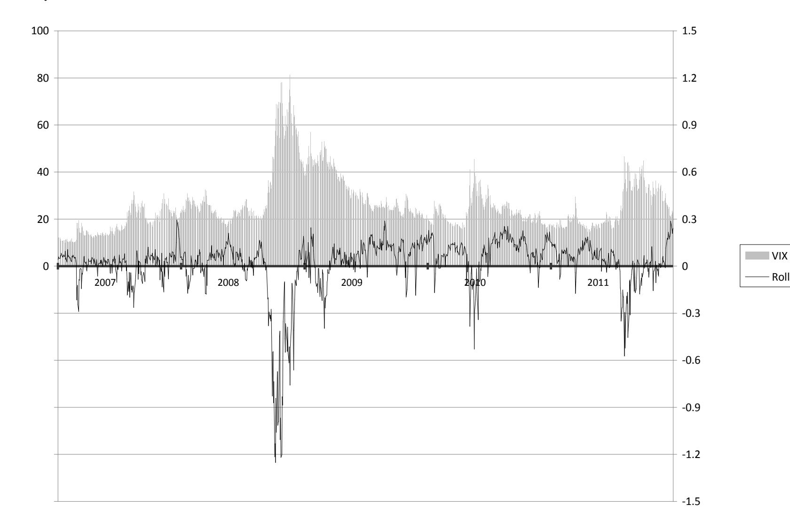
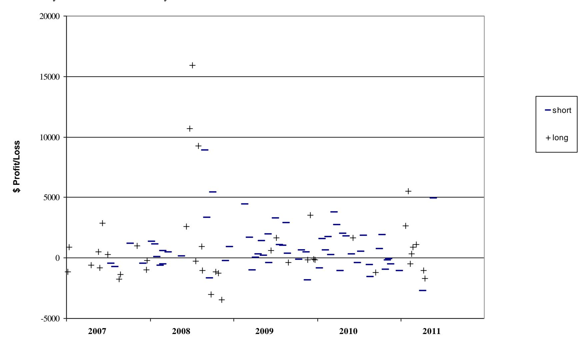
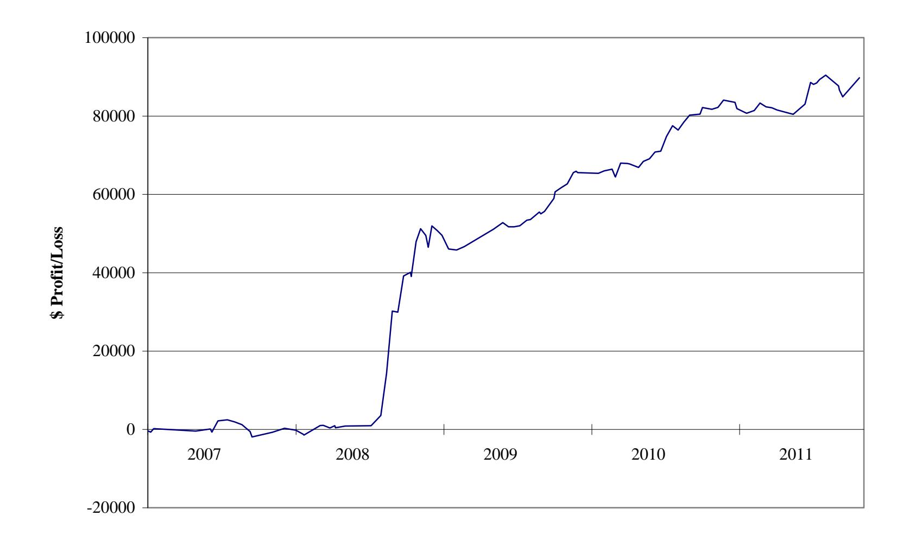

### **The VIX Futures Basis: Evidence and Trading Strategies**

David P. Simon\* Professor of Finance Bentley University Waltham, MA 02452

Jim Campasano Doctoral Candidate Isenberg School of Management University of Massachusetts Amherst, MA 01003

April 16, 2013

Corresponding Author, Bentley University, 175 Forest Street, Waltham, MA 02452. Tel: (781) 891-2489, Fax: (781) 891-2982, Email: [dsimon@bentley.edu.](mailto:dsimon@bentley.edu) The authors thank the editor and an anonymous referee for helpful comments.

#### **The VIX Futures Basis: Evidence and Trading Strategies**

#### Abstract

This study demonstrates that the VIX futures basis does not have significant forecast power for the change in the spot VIX from 2006 through 2011 but does have forecast power for VIX futures price changes. The study then demonstrates the profitability of shorting VIX futures contracts when the basis is in contango and buying VIX futures contracts when the basis is in backwardation with the market exposure of these positions hedged with mini-S&P 500 futures positions. The results indicate that these trading strategies are highly profitable and robust to transaction costs and out of sample hedge ratio forecasts. Overall, the analysis supports the view that the VIX futures basis does not accurately reflect the mean-reverting properties of the VIX spot index but rather reflects a risk premium that can be harvested.

### **The VIX Futures Basis: Evidence and Trading Strategies**

Volatility has become a widely accepted asset class since the introduction of the VIX futures contract in 2004. The popularity of the VIX futures contract stems from its hedging properties, which owe to its reliably negative correlation with equity returns and its usefulness as insurance against tail risk.1 Szado (2010) and Alexander and Korovilas (2011) examine the impact of adding long VIX futures positions to equity portfolios and find that while long VIX futures positions are drags on equity portfolio returns during calm periods, they provide substantial benefits during steep equity market selloffs. Much of the losses on long VIX futures positions during calm periods result from VIX futures rolling down a typically upward sloped futures curve. This phenomenon suggests the profitability of short VIX futures positions when the VIX curve is upward sloped.

Other studies, such as Zhang and Zhu (2006), Zhang et al. (2010) and Dupoyet et al. (2011), focus on modeling the VIX futures curve. These studies assume that volatility follows a mean reverting process, which implies that the basis reflects the risk-neutral expected path of volatility.2 Accordingly, when the VIX futures curve is upward sloped (in contango), the VIX is expected to rise because it is low relative to long run levels, as reflected by higher VIX futures prices.3 Likewise, when the VIX futures curve is inverted (in backwardation), the VIX is expected to fall because it is above its long run levels, as reflected by lower VIX futures prices. Thus,

 1 Tail risk hedging refers to hedging against extreme adverse market moves and was championed by Taleb (2007), who claims that such events are far more frequent than market participants generally believe. Tail risk insurance became extremely popular in the aftermath of the large equity market declines associated with the financial panic that began in 2008.

2 Because the VIX index is not readily tradable, the basis is not determined by cash and carry and reverse cash and carry arbitrage as is typically the case for most financial futures contracts.

3 For expositional ease this study refers to the VIX spot price as the VIX and the relationship between VIX futures prices and the VIX as the VIX futures curve. This study also describes VIX futures trading above the VIX as contango or an upward sloped VIX futures curve and VIX futures trading below the VIX as backwardation or an inverted VIX futures curve.

contango and backwardation reflect risk-neutral expected VIX increases and decreases, respectively, and the steepness of the curve in either case reflects the speed of mean-reversion. The recent empirical evidence on the forecast power of models calibrated to the VIX futures curve indicates satisfactory out of sample forecast power for the one-day ahead VIX futures curve.

Research that examines the forecast power of the VIX futures basis for future VIX prices in a regression framework, such as Mixon (2007) and Nossman and Wilhelmsson (2009), indicates insignificant forecast power unless the basis is adjusted for a time-varying volatility risk premium. This risk premium owes to the usefulness of long VIX futures positions as hedges for equity positions, which causes the basis to be more upward sloped than rational expectations would dictate.

This study examines trading opportunities presented by the VIX futures curve's lack of forecast power for the subsequent VIX change. The study first assesses the forecast power of the VIX futures basis from 2006 through 2011 and finds consistent with previous studies that the basis does not have predictive power for VIX changes. This lack of forecast power suggests that the VIX futures basis forecasts VIX futures returns, which is confirmed.4 This finding is similar to those of Erb and Harvey (2006) and Gorton and Rouwenhorst (2006), who demonstrate more generally that the basis has profound effects on commodity futures index returns. These authors show that when futures markets are in backwardation, investors benefit from buying futures contracts at discounts to spot prices given that backwardated markets are not associated with commodity spot prices falling.5 Likewise, an implication of this finding is that when the curve is

 4 For example, if the front futures contract is trading well above the spot price and the spot price at the settlement of the futures contract is expected to be unchanged because the basis has no forecast power, the futures price must converge to the expected unchanged spot price at the settlement of the futures contract and hence would tend to fall on average. Whether the tendency of futures prices to decline under these circumstances is statistically significant is another issue.

5 A parallel literature exists in the foreign currency literature where this phenomenon is referred to as the carry trade (see Darvas (2009) and Burnside et al. (2011)). The trade involves borrowing in a low yielding currency and lending in a high yielding currency without hedging foreign currency risk in order to take advantage of the yield differential in light of the tendency of the higher yielding currency not to depreciate. This strategy is also similar to riding the yield curve in bond

in contango, short futures positions benefit from selling futures contracts at premiums to spot prices. Of course, futures positions that benefit from the roll are exposed to risks associated with the level of the futures curve. Similarly, VIX futures positions that take advantage of the basis or the roll have similar risks associated with the VIX futures curve rising or falling. However, the present study shows that much of this risk is associated with equity prices rising or falling owing to the strong tendency of the VIX to move inversely to equity returns, and as a result can be hedged.

This study demonstrates that selling (buying) VIX futures contracts when the basis is in contango (backwardation) by more than a given threshold and hedging market exposure with short (long) S&P futures positions offers very attractive risk adjusted profits over the sample period from January 2007 through the end of December 2011. The results are robust to conservative assumptions about transaction costs, the use of out of sample forecasts to set up hedge ratios and to splitting the sample period in half. The study proceeds as follows: the first section provides background information on VIX futures contracts and presents preliminary information about the data. The second section focuses on tests of the forecast power of the VIX futures basis for both VIX changes and VIX futures price changes. The third section simulates trading strategies and the fourth section discusses the implications of the findings.

# I. Background on the VIX Futures Contract

The Chicago Board Options Exchange (CBOE) introduced the Volatility Index (VIX) in 1993 to provide a measure of the implied volatility of 30-day, at the money S&P 100 index options. The current methodology for calculating the VIX was introduced in 2003 and is based on

 markets, where in a steep yield curve environment investors who buy longer duration bonds benefit from the relatively higher yield, which is not systematically offset by capital losses because steep yield curves are not associated systematically with rising interest rates.

more heavily traded S&P 500 index options and provides a measure of 30-day implied volatility in a model-free framework consistent with the pricing of volatility swaps. The VIX is interpolated from the mid-points of the bid-ask spreads of the two front month option contracts until the front contract has eight days until expiration, at which time options from the second and third contracts are used. The VIX is calculated as a weighted average of the prices of options that are out of the money relative to the forward value of the S&P 500 index and have bid quotes above zero. While the VIX is a useful indicator of the changing demand for the limited risk associated with being long S&P 500 index call options or hedging long stock portfolios with S&P 500 index put options, the VIX is not readily tradable. This is because while the VIX theoretically could be replicated by a basket of options, doing so would be prohibitively expensive because of the large number of options that would have to be bought and traded on an ongoing basis to maintain the 30-day interpolated maturity of the VIX.

The CBOE introduced VIX futures contracts in March 2004 to facilitate volatility trading and to encourage investors to use volatility to hedge equity portfolios owing to the strong negative correlation between equity returns and implied volatility.6 Another motivation was to give market participants a pure way to trade implied volatility, which is far more complicated to do with S&P index options.7 In light of the popularity of VIX futures contracts, the CBOE introduced VIX options in 2006 and Barclays introduced the first volatility exchange traded note (ticker symbol—

 6 For example, Akoundi and Haugh (2010) show that the correlation between US large cap stocks and the VIX was -.65 with monthly data from March 2006 through April 2010.

7 While market participants can bet on implied volatility rising by buying S&P 500 index straddles, these positions are not pure bets on implied volatility because of exposure to other factors such as gamma and time decay. Also, if a straddle goes well in or out of the money or as time elapses, the exposure of straddles to implied volatility changes (vega) can fall dramatically. By contrast, the VIX futures contract is designed so that a one percentage point implied volatility change is always worth \$1,000. Nevertheless, the VIX futures curve should be consistent with the term structure of S&P 500 index options and potential trading opportunities between S&P index options and VIX futures contracts is an interesting topic for future research.

VXX) in January 2009, in light of expected strong retail investor demand for a volatility instrument.8

The data examined in this study are from January 2006 through the end of December 2011. The sample period begins in January 2006 because of gaps in VIX futures trading activity prior to then. The study focuses on the front two VIX futures contracts because liquidity falls off and quoted bid-ask spreads rise substantially beyond the front two contracts. Because this study examines trading strategies, making sure that transaction costs associated with bid-ask spreads are reflected accurately and that the data are synchronous is extremely important. The VIX futures data used in this study are from CQG Market Data and include all bid and ask quotes, trades and sizes of each throughout the trading day. The closing VIX futures quotes used in this study are constructed from what appeared on trading screens from 3:00 to 3:15 pm (CST) and specifically are the first quote during this time interval with a bid-ask spread no greater than .10 VIX futures point or \$100, as one VIX futures point is worth \$1,000. 9 In the absence of such a quote, the final bid and ask quotes of the day are used. This procedure is consistent with the assumption made later that trades are executed and full bid-ask spreads are paid at the first opportunity after 3:00 pm CST when bid-ask spreads are no more than .10 futures point**,** or in the absence of such opportunities at the reported bid-ask spreads at the close.10 The VIX (spot index values) and the front rollover adjusted mini-S&P 500 futures prices are taken from Pi Trading, which provides

 8 The VXX provides exposure to a combination of the two front VIX futures contracts with a portion of the exposure to the front contract rolled to the second contract each day to keep the average time until settlement of the VXX equal to one month. When the VIX futures curve is in contango, this roll can produce a significant headwind and not surprisingly, the VXX has attracted its share of negative publicity. From its launch through the end of the first quarter of 2012, the VXX lost 95 percent of its value owing to losses from contango and because the VXX was launched when implied volatility was extremely high.

9 Regular trading hours for the VIX futures contract are from 8:30 AM to 3:15 PM CST, while extended hours trading begins at 7:00 AM CST.

10 As can be seen in exhibit 1, bid-ask spreads over the sample period are typically around .06 futures point. We originally used closing data from Bloomberg but found that the closing bid-ask spreads occasionally were very wide, despite CQG data showing a lot of activity with fairly tight bid-ask spreads in the last minutes of the trading day. The sometimes wide bid-ask spread closing quotes recorded by Bloomberg likely reflects traders occasionally pulling their quotes at the very end of the trading day.

one-minute open, high, low, and close data during the trading day. The spot VIX values and the mini-S&P 500 futures prices used in the study are averages of the open and closing quotes during the minute in which the above conditions for VIX futures contracts hold.11

Exhibit 1 provides a statistical summary of the data examined in this study, including the VIX, the mid-point and bid-ask spread of the front two VIX futures contracts, the basis of the two VIX futures contracts, defined as the levels of each of the front two VIX futures contract prices minus the VIX, and the price of the front mini-S&P 500 futures contract. The exhibit shows the levels and daily first differences of these variables (percent change in the case of the S&P 500 futures contract) and for each provides the mean, standard deviation, maximum and minimum values, cutoffs for the top and bottom deciles, as well as skewness and kurtosis coefficients.

The VIX averages 23.70 percent over the sample period from 2006 through 2011, while the means of the two front VIX futures contracts are higher at 23.84 and 24.36 percent. The peak and trough of the VIX are 81.11 and 9.88 percent. Not surprisingly, the range of VIX futures prices is compressed relative to that of the VIX, consistent with a tendency of VIX futures prices to be lower than the VIX when the VIX is at extremely high levels and above the VIX when the VIX is at extremely low levels. For example, the peak and trough prices of the front VIX futures contract are 69.04 and 10.30 percent, respectively. The basis of the front VIX futures contract averages 14 basis points with the cutoffs for the top and bottom deciles at 201 and -140 basis points, respectively. The basis of the second VIX futures contract averages 66 basis points with cutoffs for the top and bottom deciles at 420 and -276 basis points, respectively. Thus, the VIX term structure varies substantially over the sample period, despite the fact that on average it is upward sloping. Bid-ask spreads at the close average .062 and .068 futures points for the front and

 11 For example, if the first bid-ask spread less than or equal to 10 cents occurs for the front VIX futures at 3:07 pm CST on a given day, the bid and ask of the VIX futures price is matched with the average of the open and close of both the spot VIX and the mini-S&P 500 futures price at 3:07 pm CST. Thus, the VIX futures basis is measured synchronously, as are the prices of mini-S&P 500 futures contracts that are used to hedge VIX futures positions.

second futures contract, although there are instances when bid-ask spreads at the close are very wide with the maximum values at roughly a full point for both contracts. Nevertheless, the cutoff for the top decile of bid-ask spreads is .10 futures point. VIX changes are more volatile than VIX futures price changes with a standard deviation of 2.24 percentage points for the VIX versus 1.49 and .99 for the front and second VIX futures contract. These standard deviations are associated with occasionally very large changes in the VIX and VIX futures prices—the largest front VIX futures increases and decreases are 7.71 and -11.49 percentage points, with top and bottom decile cutoffs at 1.51 and -1.33 percentage points. Finally, as expected VIX and VIX futures changes are skewed to the right.

Exhibit 2 provides further information on the VIX futures basis during different volatility regimes and demonstrates a strong tendency of the basis to be in contango when volatility is low and in backwardation when volatility is high. When the VIX is less than 20, the front and second VIX futures bases are in contango 78 and 91 percent of the time and the bases average 64 and 182 basis points, respectively. By contrast, when the VIX is between 40 and 50 percent, the front and second VIX futures bases are in contango only 46 and 32 percent of the time and the bases average -102 and -280 basis points, respectively. This evidence underscores the fact that while the bases of the front two futures contracts are in contango roughly 2/3 to 3/4 of the time, respectively, they fluctuate substantially according to the different volatility regimes and backwardation is not infrequent.

The relationship between the basis and the level of the VIX is also seen in Exhibit 3, which shows the daily roll, defined as the spread between the price of the front VIX futures contract that has at least ten business days until settlement and the VIX, scaled by the number of business days until settlement. The exhibit further underscores the strong tendency of the basis to go into backwardation when the VIX spikes and also demonstrates that while backwardation is

most prominent during the height of the financial crisis, it also occurs frequently throughout the sample period.

### II. The Predictive Power of the Basis

This section examines the predictive power of the VIX futures basis for subsequent VIX and VIX futures price changes. Studies, such as Mixon (2007) and Nossman and Wilhelmsson (2009), demonstrate that the VIX basis has insignificant forecast power for VIX changes unless a risk premium that stems from the usefulness of long VIX futures positions as hedges against equity price declines is included. Mixon (2007) models the risk premium as a linear function of volatility, while Nossman and Wilhelmsson (2009) model the risk premium in a constant elasticity of variance framework that allows for jumps.

The purpose of the present study differs from these two studies. The issue here is to determine whether the VIX futures basis can be exploited by trading strategies, which is linked to whether the VIX futures basis has predictive power for subsequent VIX changes**.** This can be seen most readily with an example: suppose that the VIX futures basis is in contango with the one month VIX futures at 22 percent and the VIX at 20 percent. If the basis has unbiased forecast power for the VIX, the VIX on average should rise from 20 to 22 percent over the next month, which would imply no systematic tendency for VIX futures price changes and no VIX futures trading strategy. However, if the basis does not have forecast power for the VIX, an unchanged VIX is a reasonable forecast on the basis of this information. Since VIX futures must converge to the VIX on settlement dates**,** the implication would be that VIX futures on average would fall from 22 to 20 percent, which would suggest shorting the VIX futures contract. 12 Therefore, the absence of forecast power of the VIX futures basis for subsequent VIX changes would suggest short VIX futures trades when the basis is in contango and long VIX futures trades when the basis is in backwardation.

The forecast power of the basis for subsequent VIX changes is examined by estimating the following equations, where the data are from the last trading day of each month of the front VIX futures contract.

| $VIX_{t+1}^S - VIX_t^S = \alpha_0 + \alpha_1[VIX_t^F - VIX_t^S] + u_t \quad (1)$ |
|----------------------------------------------------------------------------------|
|----------------------------------------------------------------------------------|

$$VIX_{t+1}^F - VIX_t^F = B_0 + B_1 [VIX_t^F - VIX_t^S] + u_t \quad (2)$$

One month VIX and VIX futures price changes are regressed on a constant and on the lagged VIX futures basis, defined as the spread between the price of the VIX futures contract that settles in one month and the VIX. If the basis has significant forecast power for VIX changes, the estimated α1 coefficient in equation 1 should be significantly positive. On the other hand, if the basis reflects a risk premium rather than expectations about future VIX changes, the β1 coefficient in equation 2 should be significantly negative. In this case, as the basis becomes more positively sloped the VIX futures price tends to fall more as it rolls down a more steeply sloped curve and as the basis becomes more negatively sloped the VIX futures price tends to rise more as it rolls up a more steeply sloped inverted curve. To determine whether the forecast power of the basis varies

 12 VIX futures contracts are cash settled on Wednesdays that are 30 days before the Fridays on which SPX options settle, with the settlement values based on opening prices of 30-day options. Pavlova and Daigler (2008) demonstrate that this settlement procedure often results in meaningful deviations between the VIX and VIX futures prices just before settlement. For the purposes of the trading strategies examined in this study, VIX and VIX futures prices need not converge completely at settlement because VIX futures positions are entered in contracts that have at least 10 business days to settlement and are exited before settlement.

when the basis is in contango or backwardation, equations 1 and 2 are also estimated separately conditional on the basis being in contango or in backwardation.

Exhibit 4 shows the estimation results over the sample period from January 2006 through December 2011. The results indicate that the basis does not have significant forecast power for VIX changes and this finding continues to hold when the equation is estimated separately when the basis is in contango and in backwardation. By contrast, the basis has substantial predictive power for subsequent VIX futures price changes. The highly statistically significant -.79 point estimate on the lagged basis along with the statistically insignificant intercept term indicates a tendency for VIX futures prices to fall (rise) over the following month by 79 percent of the amount that the VIX futures price is above (below) the VIX.13 The VIX futures basis also has significant forecast power for subsequent VIX futures prices both when the basis is in contango and in backwardation. The results indicate that when in contango, a one percentage point basis is associated with a statistically significant 1.12 percentage point VIX futures price decrease over the next month. Likewise, the results indicate that a backwardated curve is associated with a statistically significant (at the 10 percent level) increase in VIX futures prices over the next month. Thus, the evidence is consistent with the VIX futures basis reflecting how much the VIX futures contract is going to either roll up or down the curve rather than predicting the subsequent VIX change. The finding that the basis has substantial forecast power for subsequent VIX futures price changes suggests the possibility that profitable trading strategies could be designed where short (long) VIX futures trades are triggered when the basis is in contango (backwardation) by more than some threshold. At the same time, the regressions explain only about 10 percent of the variation of VIX futures price changes, which also suggests that such trades would have considerable market exposure, in

 13 Also, because the slope coefficient estimate is not significantly different from -1, we cannot reject the hypothesis that the basis is an unbiased forecast of how much VIX futures will fall (rise) through settlement when the basis is in contango (backwardation).

light of the strong negative correlation between VIX futures prices and equity prices. In the next section we examine the profitability of these trading strategies and explore whether risk-reward tradeoffs are enhanced by hedging VIX futures positions with mini-S&P futures positions.

## III. VIX Futures Trading Strategies

The previous section demonstrates that the basis has little forecast power for subsequent VIX changes but has substantial forecast power for subsequent VIX futures price changes. This section examines the profitability of shorting VIX futures when the basis is in contango and buying VIX futures when the basis is in backwardation. While these trading strategies take advantage of the roll by selling VIX futures at a premium to the VIX and by buying VIX futures at a discount to the VIX, they are exposed to the potentially substantial risks associated with adverse moves in the VIX futures curve. For example, traders who short VIX futures face substantial losses if the VIX curve spikes, but because such spikes typically are associated with sharp equity market selloffs, much of this risk can be hedged by shorting mini-S&P 500 futures. Likewise, traders who buy VIX futures face the risk that the VIX curve declines, but because such events typically are associated with rallying equity markets, much of this risk can be hedged by buying mini-S&P 500 futures. Thus, by hedging risks associated with changes in the overall level of the VIX futures curve, it may be possible to earn the roll embedded in the VIX futures basis with more favorable risk-return tradeoffs.

The trading simulations examine the profitability of hedged and unhedged VIX futures positions where the size of the mini-S&P futures hedge is based on out of sample hedge ratio estimates. The hedge ratios are constructed from regressions of VIX futures price changes on a constant and on contemporaneous percentage changes of the front mini-S&P 500 futures contract

both alone and multiplied by the number of business days that the VIX futures contract is from settlement, as shown below.

| $\Delta V I X_1^F = \beta_0 + \beta_1 * \text{SPRET}_t + \beta_2 * [\text{SPRET}_t * \text{TTS}] + \mu_t$ | (3) |
|-----------------------------------------------------------------------------------------------------------|-----|
|-----------------------------------------------------------------------------------------------------------|-----|

$$\Delta \text{VIX}^{\text{F}}_t = \beta_0 + \beta_1^* \text{SPRET}_t + \beta_2^* [\text{SPRET}_t^* \text{TTS}]_t + \mu_t \quad (3)$$

The latter independent variable owes to the empirical evidence that the reaction of VIX futures prices to equity returns is more subdued for VIX futures contracts that are further from settlement, consistent with the mean reverting tendencies of the VIX demonstrated by Zhang and Zhu (2006), Zhang et al. (2010) and Dupoyet et al. (2011). Because our trading simulations assume that traders buy or sell the nearest VIX futures contract that settles in at least 10 business days, VIX futures price changes in equation 3 are based on the same contracts and are adjusted for breaks between contracts. The β1 coefficient should be significantly negative in light of the tendency of VIX futures prices to move inversely to equity returns. The β2 coefficient should be significantly positive if the reaction of VIX futures prices to equity returns is more subdued the further contracts are from settlement. Out of sample estimates of the hedge ratio are formed and updated each day of the trading simulations beginning in 2007 by re-estimating equation 3 with data from the beginning of 2006 through the previous day. For the sake of illustration, the estimates of equation 3 from 2006 through the end of 2011 are shown below, with standard errors shown in parentheses.

| $\Delta \text{VIX}^{\text{F}}_t =$ | $-.018$ | $-.717 * \text{SPRET}_t$ | $+.011 * [\text{SPRET}_{t+1} * \text{TTS}]$ |
|------------------------------------|---------|--------------------------|---------------------------------------------|
|                                    | (.022)  | (.047)                   | (.002)                                      |

RBAR2= .45, DW = 2.26, NOBS = 1511,

The coefficient estimates are fairly stable throughout the sample period and indicate that positive (negative) S&P futures returns are associated with contemporaneous declines (increases) in front VIX futures prices. The estimates also indicate that the response of the VIX to a one percent increase or decrease in S&P futures returns is decreased by .011 for each business day that the relevant VIX futures contract is from settlement. The estimates indicate that a one percent increase (decrease) in S&P futures returns is associated with a .61 percentage point decrease (increase) in prices of VIX futures contracts that have 10 business days until settlement.

 The hedge ratio--the number of mini-S&P futures contracts to buy or sell per VIX futures contract--is constructed using daily updated out of sample parameter estimates from equation 3 to obtain the fitted gain or loss on one VIX futures contract for an arbitrarily assumed one percent mini-S&P futures price change and the associated gain or loss per mini-S&P futures contract. We then solve for the number of mini-S&P futures contracts that offset the fitted gains and losses on one VIX futures contract. The value of a one point VIX futures price change is \$1,000 and the gain or loss for a one percent mini-S&P futures price change is equal to .01 times the lagged value of the mini-S&P futures contract times \$50 (the value of one mini-S&P futures point). The formula for the hedge ratio is

| $\text{HR}_t = [\beta_1 * 1000 + \beta_2 * \text{TTS}_{t-1} * 1000] / [0.1 * \text{ES}_{t-1} * 50]$ | (4) |
|-----------------------------------------------------------------------------------------------------|-----|
|-----------------------------------------------------------------------------------------------------|-----|

The average hedge ratio is close to one mini-S&P futures contract per VIX futures contract, and the range from about 1/2 to 2 mini-S&P futures contracts owes mostly to fluctuations in the number of business days to settlement of relevant VIX futures contracts and the level of S&P futures prices.14 Hedge ratios are determined at the outset of trades and are not adjusted during trades.

The simulations examine the profitability of shorting or buying the front VIX futures contract that has at least 10 business days to settlement when the VIX futures basis is sufficiently in contango or backwardation as well as the efficiency of hedging market risk with mini-S&P futures positions. Short VIX futures positions are entered when the VIX futures basis is in contango and the daily roll exceeds .10 VIX futures points (\$100 per day) and long VIX futures positions are entered when the VIX futures basis is in backwardation and the daily roll is less than -.10 VIX futures points.15 The daily roll is defined as the difference between the front VIX futures price and the VIX, divided by the number of business days until the VIX futures contract settles, and measures potential profits assuming that the basis declines linearly until settlement.

The simulations assume that trades are exited when the motivating conditions no longer exist, defined as the daily roll being less than .05 VIX futures points for short trades and greater than -.05 VIX futures points for long trades.16 If these exit conditions are not triggered, trades are exited at the end of 9 business days. 17 A major reason for this additional exit rule is that because trades are entered in the nearest VIX futures contract that has at least 10 business days until settlement, exiting after 9 business days allows us to avoid issues related to the settlement of VIX futures contracts when the first exit rule is not triggered. Another more practical motivation is to have an adequate number of trades, which becomes especially important when

 14 More specifically, the fitted gain or loss on a VIX futures contract for a one percent change in S&P futures prices is equal to β1\*1000 + β2\*TTSt-1\*1000. The gain or loss on one mini-S&P futures contract for a one percent price change is equal to .01\*ESt-1\*50. The hedge ratio is determined by solving for the number of futures contracts needed to buy or sell to have expected offsetting gains and losses.

15 Simulations were also run using +/-.15 daily roll thresholds for entering trades and the unreported results show more profitable but fewer trades.

16 The authors are grateful to the editor for pointing out that assuming that trades are exited after an arbitrary number of days as in an earlier version of the paper can result in trades being held when the reasons for being in them no longer exist. At this point, traders would have no reason to expect gains and rationally would exit positions.

17 The results are fairly robust to assuming shorter holding periods when exit rules are not triggered.

we later examine the performance of trading strategies over sub-samples. After exiting trades, new trades are entered on the next day that entry conditions are triggered.

The trading simulations incorporate conservative assumptions about transaction costs, which are assumed to be incurred both at the outset and at the termination of trades. VIX futures positions are entered and exited in the last 15 minutes of the trading day at the first instance that the bid-ask spread is no greater than .10, and in the absence of such opportunities, at the final bid-ask spread recorded at the close.18 The simulations assume that full bid-ask spreads are paid on VIX futures contracts--sales and purchases of VIX futures contracts are executed at the bid and ask, respectively. Mini-S&P futures hedges are assumed to be entered at the average of the opening and closing price of the minute that VIX futures positions are entered. Bid-ask spread costs of mini-S&P futures contracts are assumed to be one-half of the minimum 1/4 point tick size of mini-S&P futures contracts or \$6.25, which are assumed to be paid upon both entering and exiting positions. In addition, round trip futures brokerage charges of \$3 per contract are assumed for both futures contracts. 19 Total round trip transaction costs associated with bid-ask spreads and brokerage fees average roughly \$140 per trade.

The statistical significance of the mean hedged and unhedged P&Ls of the trading strategies against the null hypothesis that the mean P&Ls are not better than random is tested as follows: We randomly select with replacement entry days for the same number of trades that are entered for each strategy (assumed here to be n). We then calculate the P&Ls for each of the n random trades assuming that trades are held for durations equal to the average duration of the actual trades and calculate the mean P&L of the n simulated trades. We repeat this procedure

 18 Again, the basis and whether entry or exit conditions are triggered are determined at this point, where the midpoint of VIX futures bid and ask prices are compared to the average of the open and close of the VIX during the same minute.

19 Indivisibilities in the number of mini-S&P futures contracts are not considered here in light of the possibility that the number of VIX futures contracts trades could be increased to minimize divisibility issues.

10,000 times and calculate the p-values based on the percentage of times that the means of the 10,000 trials are better than the actual results. 20 We do this for the integer number of days that are immediately below and above the actual number of days and report interpolated p-values.21 The reported p-values indicate the percentage of trials that randomly selecting the entry points for an equal number of trades lasting the same average number of days resulted in a higher mean P&L than the actual mean P&L.

Exhibit 5 reports the P&L of hedged VIX futures positions, unhedged VIX futures positions, mini-S&P futures hedges and the P&L from the roll. The latter breaks out and accumulates the daily gains earned on the roll while trades are open.22 Transaction costs associated with bid-ask spreads and brokerage fees are apportioned to each of these positions and included in the P&Ls. The exhibit shows the means, associated p-values and cutoffs for the top and bottom deciles. The exhibit also reports semi-standard deviations and Sortino ratios rather than standard deviations and Sharpe ratios owing to the frequently non-normal P&L distributions. The Sortino ratio is calculated as the mean P&L divided by the semi-standard deviation of the P&L and is preferred in the present context because it penalizes only downside volatility.23

The results indicate that shorting VIX futures and hedging when the basis is sufficiently in contango is highly profitable. Mean profits after transaction costs are a highly statistically

 20 These randomization strategies are similar to those performed by Lo et al. (2000), who compare the conditional distributions of stock returns after technical patterns occur to randomly selected unconditional distributions. A similar approach is also taken by Batchelor and Kwan (2007), who examine the market timing ability of technical analysts in German bond markets and compare their results to randomly shuffled trading positions.

21 Thus, for the 62 short VIX futures trades shown in Exhibit 5 that have an average life of 6.4 days, the reported pvalue of .003 comes from 60 and 40 percent weights on the p-values assuming 6 and 7 day trade durations, respectively.

22 The roll measures the profit earned assuming that the basis decays linearly until settlement. Thus, if the basis equals 2 percentage points with 10 business days to expiration, the daily roll is 0.20, or \$200 per futures contract. The roll P&L reported in the exhibits reflects the accumulated values of the daily roll while trades are open, with the daily roll recalculated each day that trades are open.

23 The semi-standard deviation calculations assume that the minimum acceptable profit is equal to zero with gains set equal to zero and included in the calculations.

significant \$792 with a win to loss ratio of roughly 2:1 for the 62 trades. The losses are manageable, as the bottom 10 percent P&L cutoff is -\$1,045. The results also indicate that average profits are in line with the average \$831 P&L from the roll, and hence the roll largely accounts for profits. Shorting VIX futures without hedging is also highly profitable with a highly statistically significant mean profit of \$861, as the average loss on hedges is \$69 per trade. However, the bottom decile P&L cutoff for unhedged trades is -\$1,973, which is about twice that of hedged trades, and downside volatility is about 50% higher for unhedged trades.24 The greater downside volatility more than offsets the slightly higher mean returns of unhedged trades, resulting in a considerably higher Sortino ratio for hedged versus unhedged trades (1.26 vs. 0.88).

The results also indicate that buying VIX futures when the VIX futures curve is sufficiently in backwardation and hedging with long mini-S&P futures is highly profitable. The average P&L for the 40 trades is a highly statistically significant \$1,018, with a roughly equal number of winning and losing trades. Because VIX futures and equity market volatility are higher when the VIX futures curve is in backwardation, long VIX futures trades have roughly 50 percent more downside volatility than short VIX futures trades. In this higher volatility environment, hedging reduces downside volatility by about 1/3 and improves the bottom decile P&L cutoff to -\$1,539 from -\$2,683. However, hedging also reduces average profits by \$387, which about offsets the lower downside volatility, resulting in similar Sortino ratios of 1.03 and .97 for hedged and unhedged trades, respectively. Average profits on long VIX futures trades are less than the profits on the roll, which can be attributed to losses from hedging. Nevertheless,

 24 Unreported correlations between the P&Ls of VIX futures positions and mini-S&P futures positions are -.7 and thus while adding mini-S&P futures positions to VIX futures positions results in an additional source of variability, the reliably negative correlations and the stability of the estimated hedge ratios result in considerably lower downside volatilities for hedged versus unhedged trades.

the results for both long and short trades indicate that much of the profitability of hedged VIX futures trades can be attributed to the roll.

Exhibit 6 shows the outcomes and the timing of short and long VIX futures trades over the sample period. The exhibit demonstrates that opportunities to buy and short VIX futures contracts are fairly well spread over the sample period, although short trades are more frequent during the latter half of the sample period and long trades are more frequent during the first half of the sample period. The exhibit demonstrates the fairly consistent profitability of the trading strategies over the sample period, albeit with a few very large winning trades on both the short and long side during 2008. The sizes of the very large wining trades relative to average size of other winning trades can be explained partly by their different durations. Because trades are not exited before 9 business days unless the conditions for being in them no longer exist, the very large winning trades tend to be held for longer durations and are not nearly as outsized when scaled by their durations. 25 In any event, unreported results indicate that both long and short trades remain significantly profitable for the entire sample period when the largest winning long and short trades are trimmed from the distribution.

The stability of the profitability of hedged short and long VIX futures trades is also shown in Exhibit 7, which shows the cumulative gains over the 2007-2011 period, assuming that each trade involves one VIX futures contract and the corresponding mini-S&P 500 futures hedge. The exhibit shows cumulative gains of \$89,835 over the 5 year period, as well as an absence of meaningful drawdowns and especially strong performance during the financial panic. The exhibit also shows small cumulative gains over the first 1-1/2 years of the sample period and meaningful gains during the last year of the sample period. This pattern is the opposite of the

 25 For example, the largest winning long trade is held for 9 business days. The average daily gain on this trade is about 3 times the average daily gain of the other long winning trades compared to 6 times the average gain of the other long winning trades when not adjusted for their durations. Also, an examination of the data for the largest winning trades does not reveal data errors.

decline in profitability that might be expected if market participants learned about and than committed large amounts of capital to these strategies over the sample period.

One way to gain perspective on the potential returns on equity associated with the \$89,835 gain over the sample period is to compare earnings both to margin requirements and to multiples of margin requirements. The minimum initial margin requirement for one VIX futures contract and one mini-S&P futures contract (the average size of hedges) at the time of the writing of this paper was \$6,900 and \$4,375, respectively. Thus, traders fully margined at the outset could have enjoyed 55 percent annual compound returns on these trades over the 5 year period, not including returns from investing margin account funds or from plowing back the substantial gains into the trading strategies. However, such returns are an extreme upper bound for possible returns given that few traders would employ such high leverage at the outset. 26 If we make a more realistic assumption that traders employing this strategy initially have equity equal to 5 times required margin, the gains correspond to 21 percent annually compounded returns over the sample period.

We next formally examine the performance of the trading strategies over the first and second halves of the sample period. Exhibit 8 displays the results of the same trading rules from January 2007 through June 2009 and from July 2009 through December 2011. The results show that both short and long trades are profitable across these sub-periods. The mean P&Ls of hedged short trades are \$991 and highly statistically significant during the first half of the sample period and \$704 and statistically significant at the 7.4 percent confidence level during the second half of the sample period. 27 The greater mean P&L and lower downside volatility during the first half of

 26 Exhibits 6 and 7 also suggest that heavily margined traders would not have received margin calls. The cumulative earnings on trades over time would have substantially lowered leverage because of the assumption that each trade involves buying or selling one VIX futures contract.

27 The 7.4 percent p-values for short VIX futures trades during the second half of the sample period paradoxically owes to the relatively high bar set by the \$243 mean profit on randomly entered short VIX futures trades of 7.1 day

the sample period results in a Sortino ratio of 1.97 compared to 1.04 in the second half of the sample period. A comparison of these results indicates that the somewhat greater profitability in the first half of the sample period can be more than explained by the swing from \$547 average gains on short S&P futures hedges during the first half of the sample period when equity prices generally fell to \$341 average losses on hedges during the second half of the sample period when equity prices on balance rose. Without the tail winds and then head winds from hedging in the first and second halves of the sample period, respectively, the mean P&L of unhedged short VIX futures trades more than doubles from the first to the second half of the sample period, although neither of these mean unhedged P&Ls are statistically significant. Other differences between the sub-periods are the fewer number of trades in the first versus the second half of the sample period (19 versus 33), which owes to the lower frequency of contango during the first half of the sample period.

Likewise, the profitability of hedged long VIX futures trades is robust over the first and second half of the sample periods with highly statistically significant mean profits of \$1,211 and \$757, respectively. The considerably greater mean profits during the first half of the sample period occur despite substantial \$653 mean losses from hedging compared to only minor losses from hedging during the second half of the sample period. However, downside volatility falls in half from the first to second halves of the sample period, which results in a higher Sortino ratio during the second half versus the first half of the sample period (1.29 versus 1.00). Despite the substantial losses from hedging during the first half of the sample period, hedging reduces downside risk by a commensurate amount, leaving Sortino ratios on unhedged trades only somewhat higher than those on hedged trades (1.10 versus 1.00). By contrast, hedging long VIX futures positions during the second half leads to only minor hedging losses and substantially

 durations. By contrast, randomly entering short VIX futures trades of 4.8 day durations during the first half of the sample period results in mean losses.

improves Sortino ratios to 1.29 versus .74 without hedging. Overall, the evidence indicates that both short and long hedged VIX futures trading strategies offered attractive risk adjusted profits over both halves of the sample period.

### IV. Conclusion

This study examines trading strategies in VIX futures contracts stemming from the evidence that the VIX futures basis does not have significant forecast power for the VIX. This finding suggests that the VIX futures basis should have predictive power for VIX futures price changes. If no tendency exists for the VIX to be either higher or lower when the VIX futures basis is in contango or backwardation, convergence of VIX futures prices to a VIX that is unchanged on average should result in VIX futures prices falling when the basis is in contango and rising when the basis is in backwardation. Empirical evidence is consistent with this view, as the VIX futures basis has substantial forecast power for subsequent VIX futures price changes. Hence, VIX futures tend to roll down the VIX futures curve when in contango and roll up the VIX futures curve when in backwardation. This evidence is consistent with the poor performance of VIX related products in recent years, which largely can be attributed to substantial built-in losses from rolling long VIX futures positions in an upward sloped VIX futures curve environment.

This study then examines whether the roll can be captured by trading strategies, which involve shorting the front VIX futures contract when the VIX futures curve is sufficiently in contango and buying the VIX futures contract when the VIX futures curve is sufficiently in backwardation. While these positions are exposed to the risk of adverse movements of the VIX futures curve, much of this risk is associated with equity price movements and can be hedged. The trading strategies hedge this risk by matching short VIX futures and short mini-S&P futures positions and long VIX futures and long mini-S&P futures positions, with hedge ratios determined by out of sample estimates of the tendency of VIX futures prices to move inversely to mini-S&P futures returns. In addition, the simulations assume that traders pay full bid-ask spreads on VIX futures contracts when both entering and exiting positions as well as brokerage fees.

The trading strategies involve shorting one front VIX futures contract when the VIX futures basis is in contango and the daily roll exceeds 0.10 VIX futures points and buying one front VIX futures contract when the basis is in backwardation and the daily roll is greater in magnitude than -0.10 VIX futures points and holding until the conditions for being in the trade no longer exist or 9 business days elapse. These strategies produce statistically significant \$792 and \$1,018 profits per contract for short and long trades, respectively, and highly favorable downside risk-adjusted returns over the January 2007 through December 2011 sample period. The cumulative gains on the trading strategies show only minor drawdowns over the sample period and while the largest gains occur in the midst of the financial crisis, the trading strategies remain profitable during the second half of the sample period and during the last year of the sample period.

Overall, the results are consistent with the lack of forecast power of the basis in many commodity and financial futures markets. In the case of VIX futures, the popularity of "tail risk" insurance during the sample period likely put a strong bid in VIX futures prices, which may have caused their prices to be higher and the VIX futures curve to be steeper than otherwise. While this phenomenon could be partly responsible for the profitability of short VIX futures positions, this study also demonstrates ample opportunities to profit from buying VIX futures when the VIX futures curve was inverted. Interesting issues for future research include whether these

findings can be extended to other volatility products, the relationship between the VIX futures curve and the term structure of S&P 500 index option implied volatilities and whether the roll in other futures markets can be exploited with risk-reward tradeoffs enhanced by hedging market risk as in this study.

### **References**

- Alexander, C. & Korovilas, D. (2011). The hazards of volatility diversification, ICMA Centre Discussion Paper in Finance No. DP2011-04. Akoundi, K. & Haugh, J. (2010). Tail risk hedging: A roadmap for asset owners, Deutsche Bank Pension Strategies and Solutions, May. Batchelor, R. & Kwan, T. (2007). Judgemental bootstrapping of technical traders in the bond market, International Journal of Forecasting, 23, 427-445. Burnside, C., Eichenbaum, M., Kleshchelski, M., I., & Rebelo, S. (2011). Do peso problems explain the carry trade? Review of Financial Studies, 24 (3), 853-891. Darvas, Z. (2009). Leveraged carry trade portfolios, Journal of Banking and Finance, 33:1, 944-
- 957. Dupoyet, B., Daigler, R. T., & Chen, Z. (2011). A Simplified Pricing Model for Volatility Futures . Journal of Futures Markets, 31(4), 307-339. Erb, C., & Harvey C. (2006). The strategic and tactical value of commodity futures, Financial Analysts Journal, 62 (2), 69-97 Gorton, G,. & Rouwenhorst, K. (2006). Facts and fantasies about commodity futures. Financial Analysts Journal, 62 (2), 47-68. Lo, A., Mamaysky, H., & Wang, J. (2000). Foundations of technical analysis: Computational algorithms, statistical inference and empirical implementation. Journal of Finance, 55, 1705−1765. Mixon, S. (2007). The implied volatility term structure of stock index options, Journal of Empirical Finance 41, 333-354. Nossman, M. & Wilhemsson, A. (2009). Is the VIX futures market able to predict the VIX index? A test of the expectation hypothesis, The Journal of Alternative Investments 12:2, 54-67. Pavlova, I. & Daigler, R. (2008). The non-convergence of the VIX Futures at expiration. Review of Future Markets, 17(2), 201-223. Szado, E. (2009). VIX Futures and options: A case study of portfolio diversification during the 2008 financial crisis. The Journal of Alternative Investments, 12(2), 68-85. Taleb, N. (2007). The Black Swan: The impact of the highly improbable. Random House and Penguin Publishing, New York. Zhang, J., Shu, J. & Brenner, M. (2010). The new market for volatility trading. Journal of Futures Markets 30, 809–833. Zhang, J. & Zhu, Y. 2006, VIX Futures, Journal of Futures Markets 26, 521-531.

**Exhibit 1.** Daily summary statistics for the VIX, the mid-points and bid-ask spreads of the front and second VIX futures, the basis of the front and second VIX futures and the rollover-adjusted mini-S&P 500 futures price from 2006-2011. The basis equals the VIX futures price minus the VIX. Each observation is taken after 3:00 pm CST at the first instance the bid-ask spread for the VIX future is 0.10 or less. The levels for the VIX and mini-S&P 500 futures are the average of the open and close for the minute at which the VIX futures prices are taken. The top panel displays the levels, while the bottom panel displays the daily first differences and daily percent changes of the mini-S&P futures contract.

| Levels         | VIX     | Front VIX Futures | nd VIX 2 Futures | Bid-Ask Front VIX Futures | Bid-Ask 2nd VIX Futures | Front VIX Basis | nd VIX 2 Basis | Mini-S&P Futures |
|----------------|---------|-------------------|------------------|---------------------------|-------------------------|-----------------|----------------|------------------|
| Mean           | 23.70   | 23.84             | 24.36            | 0.062                     | 0.068                   | 0.144           | 0.658          | 1201.14          |
| Std. Deviation | 11.39   | 10.362            | 9.146            |                           |                         | 2.349           | 4.229          | 207.63           |
| Maximum        | 81.11   | 69.04             | 59.16            | 1.00                      | 0.99                    | 4.885           | 6.715          | 1536.00          |
| Minimum        | 9.88    | 10.30             | 11.78            | 0.00                      | 0.00                    | -22.150         | -35.210        | 610.50           |
| Top Decile     | 39.10   | 37.58             | 35.75            | 0.10                      | 0.10                    | 2.005           | 4.195          | 1443.75          |
| Bottom Decile  | 11.99   | 12.40             | 13.21            | 0.03                      | 0.04                    | -1.395          | -2.755         | 857.75           |
| Skewness       | 1.71    | 1.399             | 1.024            |                           |                         | -3.970          | -3.544         | -0.619           |
| Kurtosis       | 3.737   | 2.319             | 1.253            |                           |                         | 24.886          | 18.691         | -0.406           |
| st Differences |         |                   |                  |                           |                         |                 |                |                  |
| Mean           | 0.0064  | 0.0065            | 0.0062           |                           |                         | 0.00006         | 0.00015        | -0.00003         |
| Std. Deviation | 2.239   | 1.490             | 0.994            |                           |                         | 1.367           | 1.620          | 0.0155           |
| Maximum        | 15.300  | 7.710             | 6.405            |                           |                         | 8.355           | 12.960         | 0.1305           |
| Minimum        | -16.300 | -11.485           | -7.610           |                           |                         | -20.94          | -21.335        | -0.1145          |
| Top Decile     | 2.000   | 1.505             | 1.035            |                           |                         | 1.115           | 1.305          | 0.0147           |
| Bottom Decile  | -1.910  | -1.330            | -0.925           |                           |                         | -1.000          | -1.285         | -0.0150          |
| Skewness       | 0.534   | 0.328             | 0.429            |                           |                         | -2.865          | -1.359         | -0.1945          |
| Kurtosis       | 10.964  | 7.387             | 7.241            |                           |                         | 46.715          | 30.743         | 11.058           |

**Exhibit 2**. The VIX basis by volatility regime. The table shows the basis, scaled by the VIX, and the frequency of contango and backwardation for the front and second VIX futures contract when the VIX is at various levels.

|            | OBS  | VIX   | Basis & % of VIX | First VIX Future OBS & % in Contango | OBS& % in Backwardation | Basis & % of VIX | Second VIX Future OBS & % in Contango | OBS & % in Backwardation |
|------------|------|-------|------------------|--------------------------------------|-------------------------|------------------|---------------------------------------|--------------------------|
| All OBS    | 1493 | 23.70 | 0.144            | 1017                                 | 476                     | 0.658            | 1119                                  | 374                      |
|            |      |       | 0.6%             | 68.1%                                | 31.9%                   | 2.8%             | 74.9%                                 | 25.1%                    |
| VIX<=20    | 644  | 15.01 | 0.635            | 505                                  | 139                     | 1.822            | 588                                   | 56                       |
|            |      |       | 4.2%             | 78.4%                                | 21.6%                   | 12.1%            | 91.3%                                 | 8.7%                     |
| 20<VIX<=30 | 559  | 24.10 | 0.625            | 394                                  | 165                     | 1.816            | 439                                   | 120                      |
|            |      |       | 2.6%             | 70.5%                                | 29.5%                   | 7.5%             | 78.5%                                 | 21.5%                    |
| 30<VIX<=40 | 152  | 34.04 | -0.810           | 76                                   | 76                      | -1.610           | 65                                    | 87                       |
|            |      |       | -2.4%            | 50.0%                                | 50.0%                   | -4.7%            | 42.8%                                 | 57.2%                    |
| 40<VIX<=50 | 81   | 44.22 | -1.019           | 37                                   | 44                      | -2.800           | 26                                    | 55                       |
|            |      |       | -2.3%            | 45.7%                                | 54.3%                   | -6.3%            | 32.1%                                 | 67.9%                    |
| VIX>50     | 57   | 61.23 | -5.918           | 5                                    | 52                      | -12.880          | 1                                     | 56                       |
|            |      |       | -9.7%            | 8.8%                                 | 91.2%                   | -21.0%           | 1.8%                                  | 98.2%                    |

**Exhibit 3.** The VIX and the daily roll from 2007 through 2011, where the daily roll is the difference between the price of the front VIX futures contract that has at least 10 days to settlement and the VIX, scaled by the number of business days until settlement .

**Exhibit 4.** The forecast power of the VIX futures basis for one month VIX and the nearest VIX futures price changes taken on the last day of trading each month from January 2006 through December 2011. The VIX futures basis is defined as the difference between the price of the VIX futures contract that has roughly one month to settlement and the VIX index. The VIX futures price change is measured from the contract that has one month to settlement at month t until it settles in month t+1. Regressions are also run separately when the VIX futures basis is in contango (+) and in backwardation (-). Standard errors are shown in parentheses and one, two and three asterisks denote statistical significance at the 10, 5 and 1 percent levels, respectively.

| Dependent Variable      |  |                 | $\frac{S}{VIX_{t+1}} - VIX_t$ | $\frac{S}{VIX_{t+1}} - VIX_t$ |                    | $\frac{F}{VIX_{t+1}} - VIX_t$ |                 |
|-------------------------|--|-----------------|-------------------------------|-------------------------------|--------------------|-------------------------------|-----------------|
| Constant                |  | -.016 (.791) | 1.36 (1.26)                | -3.74 (3.17)               | .019 (.779)     | 1.22 (1.24)                | -3.81 (3.10) |
| $[VIX_t^F - VIX_t^S]$   |  | .231 (.279)  |                               |                               | -.791*** (.276) |                               |                 |
| $[VIX_t^F - VIX_t^S]^+$ |  | -.178 (.549) |                               |                               |                    | -1.12** (.542)             |                 |
| $[VIX_t^F - VIX_t^S]^-$ |  |                 |                               | -.483 (.779)               |                    |                               | -1.54* (.76) |
| RBAR 2       |  | -.005           | -.018                         | -.040                         | .095               | .058                          | .162            |
| DW                      |  | 1.99            | 2.05                          | 1.64                          | 2.00               | 2.02                          | 1.60            |
| NOBS                    |  | 71              | 53                            | 18                            | 71                 | 53                            | 18              |

**Exhibit 5.** Profits from shorting or buying the nearest VIX futures contract with at least ten business days until settlement when the daily roll is more favorable that .10 VIX futures points and exiting when the daily roll is less favorable than .05 VIX futures points or in 9 business days. Trades are entered and exited at the close. The table shows the P&L on hedged and unhedged VIX futures positions and the P&L on the S&P futures hedge. The Roll P&L accumulates the profits on the daily roll, calculated each day as the difference between the front VIX futures contract and the VIX, divided by the number of business days until settlement. Transaction costs for both entering and exiting positions are included for each of the P&L categories and assume that quoted bid-ask spreads are paid on VIX futures contracts and that bid-ask spreads equal to one half of the minimum 1/4 point tick are paid on mini-S&P futures contracts. \$3 round trip brokerage fees per contract also are assumed. The sample period is from January 2007 through December 2011.

|         | Hedged P&L Unhedged P&L S&P Hedge P&L Roll P&L |
|---------|------------------------------------------------|
| 10%     | fractile                                       |
| Sortino | Ratio                                          |
| Sortino | Ratio                                          |

**Exhibit 6.** The P&L after transactions costs on short and long VIX futures trades (1 contract) hedged by mini-S&P futures contracts when the daily roll is greater than .10 VIX futures point or less than -.10 VIX futures point, where the daily roll is the difference between the price of the front VIX futures contract that has at least 10 days to settlement and the VIX, scaled by the number of business days until settlement.

**Exhibit 7.** The cumulative P&L after transactions costs on short and long VIX futures trades (1 contract) hedged by mini-S&P futures contracts when the daily roll is greater than .10 VIX futures point or less than -.10 VIX futures point, where the daily roll is the difference between the price of the front VIX futures contract that has at least 10 days to settlement and the VIX, scaled by the number of business days until settlement.

**Exhibit 8.** Profits over the first and second halves of the sample period from shorting or buying the nearest VIX futures contract with at least ten business days until settlement when the daily roll is more favorable than .10 VIX futures points and exiting when the daily roll is less favorable than .05 VIX futures points or in 9 business days. Trades are entered and exited at the close. The table shows the P&L on hedged and unhedged VIX futures positions and the P&L on the S&P futures hedge. The Roll P&L accumulates the profits on the daily roll, calculated each day as the difference between the front VIX futures contract and the VIX, divided by the number of business days until settlement. Transaction costs for both entering and exiting positions are included for each of the P&L categories and assume that quoted bid-ask spreads are paid on VIX futures contracts and that bid-ask spreads equal to one half of the minimum 1/4 point tick are paid on mini-S&P futures contracts. \$3 round trip brokerage fees per contract also are assumed.

|                                 | Hedged P&L | Unhedged P&L | S&P Hedge P&L | Roll P&L |
|---------------------------------|------------|--------------|---------------|----------|
| <b>Short Trades: 1/07-6/09</b>  |            |              |               |          |
| Mean                            | \$991      | \$444        | \$547         | \$533    |
| P-value                         | (.009)     | (.135)       | --            | --       |
| Semi Std. Dev                   | 503        | 1,170        | 743           | --       |
| 90% fractile                    | 5,431      | 6,457        | 1,238         | 1,274    |
| 10% fractile                    | -737       | -2,503       | -1,744        | 61       |
| Winners/Losers                  | 12/7       | 11/8         | 14/5          | --       |
| Mean Duration (Days)            | 4.8        | --           | --            | --       |
| SortinoRatio                    | 1.97       | .38          | --            |          |
|                                 |            |              |               |          |
| <b>Short Trades: 7/09-12/11</b> |            |              |               |          |
| Mean                            | \$704      | \$1,045      | -\$341        | \$963    |
| P-value                         | (.074)     | (.109)       | --            |          |
| Semi-Std. Dev                   | 680        | 875          | 883           | --       |
| 90% fractile                    | 2,881      | 3,897        | 620           | 1,696    |
| 10% fractile                    | -1,068     | -1,303       | -1,365        | 71       |
| Winners/Losers                  | 28/15      | 27/16        | 15/28         | --       |
| Mean Duration (Days)            | 7.1        | --           | --            | --       |
| Sortino Ratio                   | 1.04       | 1.19         | --            | --       |
|                                 |            |              |               |          |
| <b>Long Trades: 1/07-6/09</b>   |            |              |               |          |
| Mean                            | \$1,211    | \$1,864      | -\$653        | \$1,711  |
| P-value                         | (.014)     | (.016)       | --            |          |
| Semi Std. Dev                   | 1,205      | 1,678        | 3,081         | --       |
| 90% fractile                    | 9,244      | 14,817       | 2,341         | 5,088    |
| 10% fractile                    | -1,740     | -3,073       | -3,747        | 60       |
| Winners/Losers                  | 10/13      | 8/15         | 11/12         | --       |
| Mean Duration (Days)            | 5.0        | --           | --            | --       |
| Sortino Ratio                   | 1.00       | 1.11         | --            | --       |
|                                 |            |              |               |          |
| <b>Long Trades: 7/09-12/11</b>  |            |              |               |          |
| Mean                            | \$757      | \$785        | -\$28         | \$822    |
| P-value                         | (.006)     | (.029)       | --            | --       |
| Semi Std Dev                    | 585        | 1,055        | 1,846         | --       |
| 90% fractile                    | 3,543      | 5,347        | 2,001         | 2,968    |
| 10% fractile                    | -1,174     | -1,853       | -1,182        | 69       |
| Winners/Losers                  | 9/8        | 8/9          | 12/5          | --       |
| Mean Duration (Days)            | 3.4        | --           | --            | --       |
| Sortino Ratio                   | 1.29       | .74          | --            | --       |