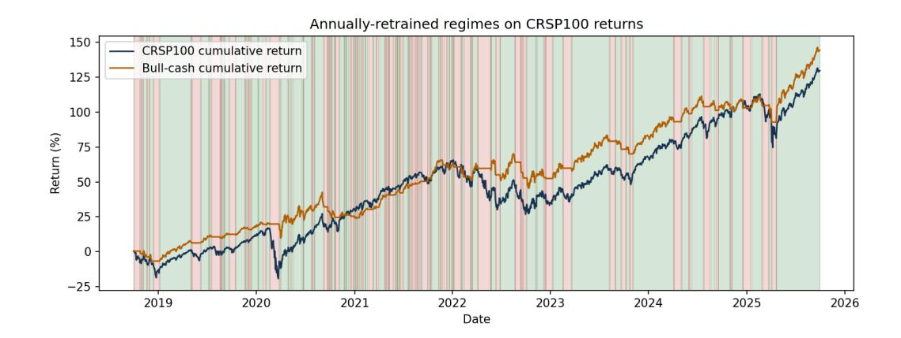
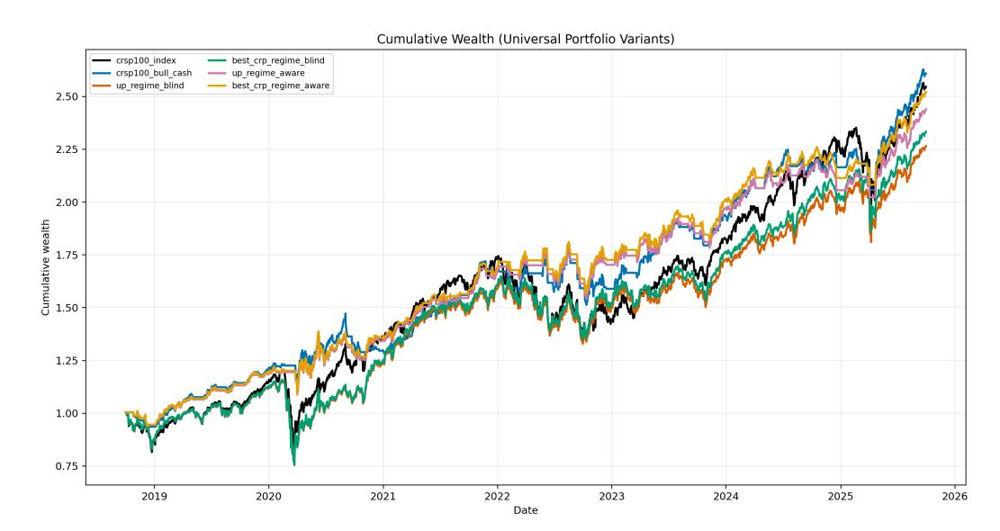
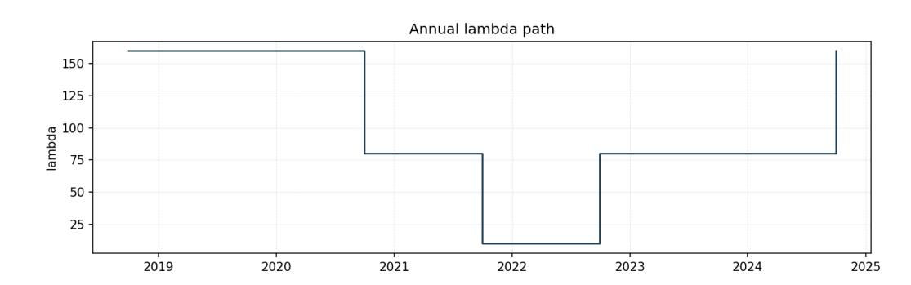
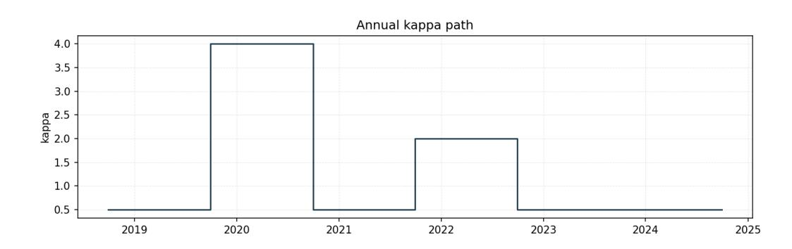

# Regime-Aware Universal Portfolio

Dmitrii Vlasiuk Mikhail Smirnov Department of Mathematics, Columbia University December 2025

#### Abstract

This paper studies whether exogenous side information in the form of market regimes improves the performance of universal portfolios in a large equity universe. We construct a value-weighted index from the universe of all stocks by picking top-100 assets by market capitalization and infer daily bull and bear regimes using the weighted sparse jump model of Shu and Mulvey (2025) estimated on technical, volatility, and macro-financial features. Building on Cover (1991) and Cover and Ordentlich (1996), we implement regime-aware universal portfolios that invest in the risky universe during bull regimes and hold cash during bear regimes, and we compare them to regime-blind universal portfolios and their best constant rebalanced portfolio comparators in hindsight. Empirically, regime awareness delivers similar annualized returns but substantially lower volatility and drawdown, raising Sharpe ratios above one. We also document finite-sample convergence of the universal portfolio growth rate toward the corresponding hindsight CRP benchmark.

## 1 Introduction

Universal portfolios provide a model-free approach to sequential portfolio selection. In the framework of Cover (1991), a universal portfolio is a self-financing strategy whose long-run average log-wealth competes with the best constant rebalanced portfolio (CRP) chosen in hindsight over a fixed admissible set. Cover and Ordentlich (1996) extend this idea to finite-valued side information, showing that conditioning portfolio choice on an observable state enlarges the benchmark class while retaining asymptotic competitiveness. This paper studies market regimes as a form of side information and asks whether a regime-conditioned universal portfolio yields improved empirical performance relative to a regime-blind construction.

We work with a fixed large-capitalization equity universe constructed from CRSP daily stock data. At an anchor date we select the top 100 names by market capitalization and freeze the universe to avoid look-ahead and turnover effects. From these constituents we form a value-weighted buy-and-hold CRSP-100 index that serves as the baseline risky benchmark. We then infer a two-state daily regime process, interpreted as bull and bear phases, from a jump-penalized segmentation model estimated on technical, volatility, and macro-financial predictors. The regime label used for trading on day t is computed causally, using only information available by t − 1.

The empirical objective is to evaluate regimes as an exposure gate within the universal portfolio framework rather than as a parametric return forecast. We consider a bull-cash policy: in bull regimes the strategy allocates across the risky universe using long-only weights, while in bear regimes it holds cash. This restriction keeps the admissible set consistent with long-only universality arguments and targets tail-risk reduction as the primary economic channel through which regimes may add value.

The analysis tests three hypotheses. First, regime awareness improves riskadjusted performance through lower volatility. Second, conditioning on regimes changes the relevant hindsight benchmark: the regime-aware best CRP, which optimizes only over bull dates and avoids bear exposure, can dominate the regime-blind best CRP because it is computed in a different admissible class. Third, the regimeaware universal portfolio tracks its regime-aware hindsight CRP in the qualitative sense predicted by universal portfolio theory, so that remaining log-wealth gaps are consistent with finite-sample regret and approximation error.

The remainder of the paper proceeds as follows. Section 2 introduces CRPs, universal portfolios, and the extension with finite side information that motivates regime conditioning. Section 3 describes the CRSP-100 construction, the feature set, and the regime identification procedure. Section 4 presents regime-blind and regimeaware universal portfolio implementations, their corresponding hindsight CRP comparators, and the resulting out-of-sample performance and growth-rate comparisons. Section 5 concludes.

# 2 Regime-aware universal portfolios framework

Universal portfolio selection can be viewed as an operationalization of asymptotic growth optimality under minimal distributional structure. The benchmark notion of optimality is the maximization of long-run expected log wealth associated with the Kelly criterion and related capital growth arguments in Kelly (1956) and its portfolio interpretation in Thorp (1971). Cover (1991) shows that a universal mixture over constant rebalanced portfolios achieves asymptotic performance comparable to the best constant rebalanced portfolio selected in hindsight, and the associated finitesample cost of competing with the hindsight optimum is analyzed in Ordentlich and Cover (1998). The extension to the incorporation of side information within the universal portfolio framework is developed in Cover and Ordentlich (1996), clarifying how additional predictive structure can be introduced without abandoning the competitive, distribution-free perspective. Algorithmically, the universal portfolio and its modern variants connect closely to the literature on sequential prediction and online learning, including the weighted majority and multiplicative-weights

paradigms of Littlestone and Warmuth (1994) and Freund and Schapire (1997), the exponentiated-gradient view of simplex updates in Kivinen and Warmuth (1997), and the explicit formulation of online portfolio selection via multiplicative updates in Helmbold, Schapire, Singer, and Warmuth (1998). Efficient approximation and computational perspectives for universal and related online decision rules are studied in Kalai and Vempala (2005) and Hazan, Agarwal, and Kale (2007), while modern empirical and algorithmic synthesis for portfolio selection in the online learning setting is summarized in Li and Hoi (2014).

The regime-aware variant studied here can be interpreted as restricting the trading rule to a regime-conditioned action set, where the portfolio is active in the bull state and transitions to a cash-like allocation in the bear state. This aligns the universal portfolio machinery with the broader view that competitive portfolio selection is naturally compatible with state-dependent constraints and decision rules, as in Cover and Ordentlich (1996), while retaining the core goal of competing with the best element of a benchmark class under log-wealth. In empirical implementations, the regime-aware restriction changes the tradeoff between growth and risk relative to the regime-blind mixture by reducing exposure during adverse states, and therefore interacts directly with the literature emphasizing that risk-managed exposure can dominate naive full-exposure rules when volatility and tail events are state-dependent, as in Moreira and Muir (2017). In this sense, the regime-aware universal portfolio is introduced as a method for injecting economically motivated state information into a competitive portfolio selection procedure while preserving the sequential, nonparametric spirit of Cover (1991) and the side-information framework of Cover and Ordentlich (1996).

#### 2.1 Market model, price relatives, and rebalancing

We consider a discrete-time market with m risky assets and one additional cash asset indexed m + 1. For each date t ≥ 1, define the vector of price relatives

$$x_t := (x_{1t}, \dots, x_{mt}, x_{m+1,t})^T \in \mathbb{R}_+^{m+1}, \quad (2.1.1)$$

where xit = Pi,t/Pi,t−1 for risky assets. Cash is modeled explicitly as an asset with deterministic price relative

| $x_{m+1,t} \equiv 1$ | $(2.1.2)$ |
|----------------------|-----------|
|----------------------|-----------|

A long-only portfolio is a vector of nonnegative weights that sum to one,

$$\Delta^{m+1} := \left\{ b \in \mathbb{R}_+^{m+1} : \mathbf{1}^\top b = 1 \right\}. \quad (2.1.3)$$

If an investor holds b ∈ ∆m+1 over the period from t − 1 to t, the one-period gross return is b ⊤xt . The interpretation is that the investor allocates fractions bi of wealth to each asset at time t−1, and the value of each fraction is multiplied by xit by time t. Rebalancing means that, after the period return is realized, the investor restores the same target weights before the next period.

#### 2.2 Constant rebalanced portfolios and the hindsight benchmark

A constant rebalanced portfolio (CRP) is the dynamic trading rule in this framework: the investor chooses a fixed weight vector b ∈ ∆m+1 once and then rebalances back to b every period. Starting from unit wealth, the wealth of a CRP after n periods is

$$S_n(b) := \prod_{t=1}^n b^\top x_t. \quad (2.2.1)$$

The role of CRPs is twofold. First, they include many meaningful strategies, ranging from buy-and-hold in a single asset to diversified allocations across assets. Second, their performance can be evaluated exactly for any fixed b, which allows us to define a clear benchmark for learning.

The hindsight benchmark is the best CRP that could have been selected if the entire return path x1, . . . , xn were known in advance:

$$S_n^* := \sup_{b \in \Delta^{m+1}} S_n(b). \quad (2.2.2)$$

This benchmark is intentionally strong. It does not correspond to a feasible ex-ante choice, but it provides a meaningful target for an online algorithm: we aim to design a strategy whose long-run growth rate is close to that of S ∗ n .

#### 2.3 Universal portfolios and what they guarantee

A universal portfolio is a nonparametric way to compete with the hindsight CRP benchmark without committing to a single b upfront. The idea is to maintain a distribution over CRPs and to update it according to realized performance. Formally, fix a prior probability measure π on ∆m+1. The universal wealth is the mixture of CRP wealths under π:

$$U_n := \int_{\Delta^{m+1}} S_n(b) \pi(db). \quad (2.3.1)$$

This representation is convenient because it makes clear that each candidate b contributes proportionally to how well it has performed. Equivalently, the induced trading rule at time t is the posterior-weighted average of portfolio weights, where the posterior assigns larger weight to those b that have accumulated more wealth up to time t − 1.

Cover (1991) proves the classical universality result: under standard market boundedness conditions, the universal portfolio achieves the same asymptotic average log-wealth as the best CRP in hindsight, meaning that the per-period regret in log-wealth vanishes. In our paper this statement appears as Theorem A.2.2 in Appendix A, where we also provide the proof in the form used throughout our framework.

This result motivates the baseline hypothesis: even without prediction, the universal portfolio can learn an effective long-only allocation, and in the long run it behaves as well as the best fixed-rebalanced long-only portfolio selected with hindsight.

#### 2.4 Side information and regimes

The universality principle becomes more powerful when the investor observes side information. The key point is that markets are not homogeneous across time: the portfolio that performs well in one environment need not be the best in another. Cover and Ordentlich (1996) formalize this idea by allowing the investor to condition the portfolio choice on a finite-valued side-information process Yt ∈ Y. A statedependent CRP is a mapping

$$\beta : \mathcal{Y} \rightarrow \Delta^{m+1}, \quad (2.4.1)$$

which selects a portfolio β(Yt) whenever the side information equals Yt . Its wealth is

$$S_n(\beta) := \prod_{t=1}^n \beta(Y_t)^\top x_t. \quad (2.4.2)$$

Cover and Ordentlich (1996) prove that an appropriate universal mixture over such mappings asymptotically competes, in average log-wealth, with the best statedependent CRP chosen in hindsight. In our paper, this is stated as Theorem A.3.4 in Appendix A.

This theorem provides the logic for regimes. If the side information Yt captures changes in the investment environment, then the benchmark class {β : Y → ∆m+1} is strictly richer than the class of unconditional CRPs. A universal strategy that remains competitive with the best state-dependent CRP can therefore achieve higher growth than a universal strategy that ignores the side information, provided the side information is informative.

#### 2.5 Regime-aware portfolios with a bull and a cash regime

In this paper we set the side information to a two-state regime process Rt ∈ {+, −}, interpreted as a bull regime (+) and a bear regime (−). The regime labels are constructed causally from information available at time t−1; the concrete estimation procedure is described in Section 3. The regime sequence Rt plays the role of the side information Yt in the framework of Cover and Ordentlich (1996).

A central empirical finding of our study is that regime timing improves performance primarily through the long-only leg, while systematic short exposure is not robust in our sample. For that reason, we adopt a bull and cash policy rather than a long and short policy. We encode this choice by defining regime-specific admissible sets:

| $B^+ := \{(b, 0) \in \Delta^{m+1} : b \in \Delta^m\},$ | $B^- := \{e_{m+1}\}.$ | (2.5.1) |
|--------------------------------------------------------|-----------------------|---------|
|                                                        |                       |         |

Thus in the bull regime the strategy invests fully in risky assets and assigns zero weight to cash. In the bear regime the strategy holds cash only, which implies a one-period gross return equal to 1 regardless of the risky asset returns.

Fix a bull allocation b + ∈ ∆m and write ˜b + := (b +, 0) ∈ B+. In the bear regime we use ˜b − := em+1 ∈ B−. The associated regime-conditioned CRP benchmark has wealth

$$S_n(b^+ \mid R) := \prod_{t=1}^n \left( (\tilde{b}^+)^\top x_t \right)^{1\{R_t=+\}} \left( (\tilde{b}^-)^\top x_t \right)^{1\{R_t=-\}} = \prod_{t=1}^n \left\{ \begin{matrix} (\tilde{b}^+)^\top x_t, & R_t = +, \\ 1, & R_t = -. \end{matrix} \right. \quad (2.5.2)$$

This benchmark is stronger than the unconditional CRP benchmark because it allows the investor to avoid exposure in bear periods while still choosing the best fixed-rebalanced risky allocation for bull periods. When the regime labels are informative, the best b + under (2.5.2) can outperform the best unconditional b in (2.2.2).

We define the regime-aware universal portfolio as the mixture of (2.5.2) over b + ∈ ∆m under a prior π +:

$$U_n(R) := \int_{\Delta^m} S_n(b^+ \mid R) \pi^+(db^+). \quad (2.5.3)$$

The relevant theoretical statement is the specialization of Cover and Ordentlich's side-information universality to Y = {+, −} together with the admissible sets in (2.5.1). Appendix A proves that Un(R) asymptotically competes, in average logwealth, with the best bull allocation b + executed under the same regime path R; see Theorem A.5.2. This is the formal justification for using regimes to gate risk exposure while retaining the learning and competitiveness properties of universal portfolios.

#### 2.6 Illustrative example: two risky assets and cash

Let m = 2, so xt = (x1t , x2t , 1). Any bull allocation is ˜b + = (b1, b2, 0) with b1+b2 = 1, while the bear allocation is ˜b − = (0, 0, 1). Then the regime-conditioned CRP wealth (2.5.2) becomes

| $S_n(b_1 \mid R) = \prod_{t=1}^n \begin{cases} b_1 x_{1t} + (1 - b_1) x_{2t}, & R_t = +, \\ 1, & R_t = -, \end{cases} \quad (2.6.1)$ |
|--------------------------------------------------------------------------------------------------------------------------------------|
|--------------------------------------------------------------------------------------------------------------------------------------|

where the only free parameter is b1 ∈ [0, 1]. The regime-aware universal portfolio (2.5.3) averages (2.6.1) over b1 ∈ [0, 1] under π +. Equation (2.6.1) makes clear how the regime enters the wealth recursion: on bear dates the portfolio holds cash and wealth is preserved, while on bull dates the strategy behaves like a universal portfolio that learns an allocation across the two risky assets. The asymptotic competitiveness of this mixture with the best fixed b1 executed under the same regime path Rt follows from Appendix A, Theorem A.5.2.

### 3 Regime Identification

In this section, we introduce a regime process that summarizes the medium-term state of the equity market and later serves as conditioning information for the universal portfolio. Our construction follows the jump-based regime signals proposed by Shu and Mulvey (2025) and is specialized to a single equity market factor built from a fixed large-capitalization universe.

#### 3.1 Jump-based regime signals

Shu and Mulvey (2025) model factor returns as a continuous-time jump-diffusion whose parameters depend on an unobserved finite-state Markov chain (St)t≥0. In each regime k ∈ {1, . . . , K}, the dynamics of a factor Ft are characterized by a diffusion component with drift and volatility (µk, σk) and a compound Poisson jump component with intensity λk and jump size distribution Jk. Changes in regime correspond to changes in the tuple (µk, σk, λk, Jk); in particular, stressed or crisis regimes are identified empirically by elevated jump intensities and larger negative jump sizes. Given a time series of observed factor returns, the model is estimated and filtered regime probabilities P(St = k | Ft) are obtained. These probabilities then act as regime signals, and the authors show that conditioning portfolio weights on these signals improves out-of-sample performance.

In our setting, we adopt the same approach but work with a single equity market factor constructed from a fixed large-capitalization universe. We treat the logarithmic returns of this factor as the observable input to a jump-diffusion with regimedependent parameters. The filtered regime probabilities extracted from this model define a discrete-time regime process (Rt) on the daily grid of trading dates and will later be used to condition the universal portfolio on the prevailing market state.

The regime identification component is motivated by a large literature documenting that equity return dynamics and risk characteristics vary substantially across market states, with regime-switching models providing a canonical formalization. Markov-switching and hidden-state specifications have been widely used for macrofinancial time series and business cycle inference since Hamilton (1989), and are treated systematically in the state-space regime-switching framework of Kim and Nelson (1999). In financial applications, regime-switching has been employed to model changing conditional distributions and risk premia, including interest-rate and volatility dynamics in Gray (1996), bull and bear market identification in Maheu and McCurdy (2000), and asset allocation under regime shifts in Ang and Bekaert (2002) and Guidolin and Timmermann (2007). Related work emphasizes that heteroskedasticity and learning effects can themselves be state dependent, as in Turner, Startz, and Nelson (1989), supporting the premise that a single stationary model may be misspecified over long evaluation windows.

Methodologically, the SJM perspective also connects to the broader structuralbreak and change-point detection literature, which targets persistent shifts in lev-

els, trends, or volatility without requiring an explicit parametric hidden Markov structure. Classical sequential detection begins with Page (1954) and is comprehensively surveyed from a signal-processing viewpoint in Basseville and Nikiforov (1993). Econometric treatments of multiple structural breaks include Bai and Perron (1998), while penalized and computationally efficient segmentation procedures are developed in Lavielle (2005) and in the linear-time PELT algorithm of Killick, Fearnhead, and Eckley (2012); high-dimensional and adaptive procedures for multiple change points include wild binary segmentation in Fryzlewicz (2014), and a modern overview of offline change-point detection is given in Truong, Oudre, and Vayatis (2020). Finally, since the SJM is designed to capture large discontinuities, it is naturally related to the jump modeling tradition in finance, including discontinuous return dynamics in Merton (1976) and option-implied jump and stochasticvolatility evidence in Bates (1996), as well as to high-frequency identification of jumps and jump-robust variation measures in Andersen, Bollerslev, Diebold, and Labys (2003), Barndorff-Nielsen and Shephard (2004), Lee and Mykland (2008), and A¨ıt-Sahalia and Jacod (2009). These literatures collectively motivate the use of a jump-focused regime estimator when the objective is to identify rare, persistent stress states rather than to fit a smoothly time-varying volatility model such as Engle (1982).

Regime classification has a long history in econometrics and asset allocation. Markov switching and hidden state models were introduced for macroeconomic and financial time series by Hamilton (1989) and subsequently developed in applications to equity and volatility dynamics, including Turner, Startz, and Nelson (1989), Kim and Nelson (1999), Ang and Bekaert (2002), and Guidolin and Timmermann (2007). A complementary line of work detects structural breaks and change points in distributional parameters, as in Page (1954), Bai and Perron (1998), Killick, Fearnhead, and Eckley (2012), and Truong et al. (2020). In high frequency and daily return settings, the regime signal is often coupled to volatility and jump activity, motivating the use of jump robust realized measures and tests; see Andersen, Bollerslev, Diebold, and Labys (2003), Barndorff-Nielsen and Shephard (2004), Lee and Mykland (2008), and Ait-Sahalia and Jacod (2009). The statistical jump model and its sparse extensions connect these ideas by constructing regime switching signals from return innovations while allowing supervised feature selection for portfolio decisions, as in Nystrup, Kolm, Lindstrom (2021), Shu and Mulvey (2025), Aydinhan, Kolm, Mulvey, and Shu (2024), and Mulvey and Liu (2016).

### 3.2 Index construction

To build the equity factor that underlies our regime process, we use the CRSP daily stock database accessed via WRDS. We extract all common equities whose primary listing is on the main U.S. (NYSE, NASDAQ, AMEX) over the period from 30 September 2015 to 30 September 2025. Let t0 denote 30 September 2015 and J the set of all securities satisfying our exchange filters on that date. For each security i ∈ J , we denote by Pi,t the closing price on day t and by qi,t the number of shares outstanding, and by

| $M_{i,t} = P_{i,t}q_{i,t}$ | (3.2.1) |
|----------------------------|---------|
|----------------------------|---------|

its market capitalization.

From this cross-section, we form a large-capitalization universe by selecting the 100 securities with the largest market capitalizations Mi,t0 at the anchor date t0. We denote this fixed universe by I ⊂ J , |I| = 100. By freezing the universe at t0 and then following the subsequent paths of these same names through time, we avoid the survivorship and look-ahead biases that would arise from allowing new entrants to replace firms ex post and, more importantly, make it convenient for following the universal portfolio theory with the fixed universe. In particular, firms that delist or are acquired during [t0, T] remain in I; their contribution to the factor is determined by their realized return history up to their exit date.

CRSP provides for each security i a daily total return series (Ri,t)t≥t0 , which incorporates cash dividends, stock dividends, splits and other capital actions. Given the initial price Pi,t0 , this series can be turned into an adjusted price path representing the evolution of one share with reinvested distributions:

| $\tilde{P}_{i,t} = P_{i,t_0} \prod_{u=t_0+1}^t (1 + R_{i,u}), \quad t \geq t_0. \quad (3.2.2)$ |
|------------------------------------------------------------------------------------------------|
|------------------------------------------------------------------------------------------------|

The use of total returns ensures that our constructed factor reflects the full wealth evolution of a buy-and-hold investor in each name, rather than capital gains only.

We now define a value-weighted index based on the universe I. At the anchor date t0 we normalize total wealth to one and allocate it across the 100 securities in proportion to their market capitalizations:

| $w_i = \frac{M_{i,t_0}}{\sum_{j \in \mathcal{I}} M_{j,t_0}}, \quad i \in \mathcal{I}, \quad \sum_{i \in \mathcal{I}} w_i = 1.$ | (3.2.3) |
|--------------------------------------------------------------------------------------------------------------------------------|---------|
|--------------------------------------------------------------------------------------------------------------------------------|---------|

These weights correspond to holding wi/Pi,t0 shares of security i at t0. Let Vi,t denote the wealth associated with the position in security i at time t. Starting from Vi,t0 = wi , its evolution is given by

| $V_{i,t} = w_i \prod_{u=t_0+1}^t (1 + R_{i,u}), \quad t \geq t_0.$ | (3.2.4) |
|--------------------------------------------------------------------|---------|
|                                                                    |         |

If security i ceases trading at some stopping date τi , we stop updating its total return after τi ; the last available total return already incorporates any terminal cash flow at delisting, so Vi,t = Vi,τi for all t > τi . Economically, this corresponds to the proceeds from a delisted position being held in cash and no longer exposed to equity risk.

The aggregate wealth of the value-weighted portfolio at date t is then

$$I_t = \sum_{i \in \mathcal{I}} V_{i,t}, \quad t_0 \leq t \leq T, \quad (3.2.5)$$

with It0 = 1. We refer to the process (It)t0≤t≤T as the CRSP-100 market index. It is a model-free, pathwise wealth process generated by buying and holding the 100 largest capitalization stocks at t0, with all distributions reinvested and with proceeds from delistings parked in cash.

The daily log-returns of this index,

$$r_t = \log\left(\frac{I_t}{I_{t-1}}\right),$$

constitute the equity factor to which we apply the jump model. In the subsequent analysis, the filtered regime probabilities derived from (rt) will provide a parsimonious description of market states and will serve as the regime process with respect to which the universal portfolio is made regime aware.

#### 3.3 Sparse jump model and regime identification

Shu and Mulvey (2025) propose to identify latent market regimes by segmenting a multivariate time series into blocks with piecewise constant means. For a feature vector xt ∈ R p and regime labels st ∈ {0, . . . , K − 1} their baseline objective is

$$\min_{\theta_0, \dots, \theta_{K-1}, s_0, \dots, s_{T-1}} \sum_{t=0}^{T-1} \frac{1}{2} \left\| x_t - \theta_{s_t} \right\|_2^2 + \lambda \sum_{t=1}^{T-1} \mathbf{1}_{\{s_t \neq s_{t-1}\}}, \quad (3.3.1)$$

where θk is the mean vector in regime k and λ > 0 penalizes each regime switch. In this paper we specialize to K = 2 and interpret regime 0 as a low mean (bear) state and regime 1 as a high mean (bull) state.

To allow the model to focus on the most informative features, Shu and Mulvey introduce nonnegative feature weights and an ℓ1 bound on their sum. Adapting their construction to our standardized feature vector Xt and binary labels zt ∈ {0, 1} we consider, for fixed λ > 0 and κ > 0,

| $\min_{z, \theta_0, \theta_1, w} \sum_{t=1}^T \ D_w^{1/2}(X_t - \theta_{z_t})\ _2^2 + \lambda \sum_{t=2}^T \mathbf{1}_{\{z_t \neq z_{t-1}\}} \quad (3.3.2)$ | s.t. $z_t \in \{0, 1\}$ for $t = 1, \dots, T$ , $w_j \geq 0$ for $j = 1, \dots, p$ , $\sum_{j=1}^p w_j \leq \kappa$ , |
|-------------------------------------------------------------------------------------------------------------------------------------------------------------|-----------------------------------------------------------------------------------------------------------------------------|
|-------------------------------------------------------------------------------------------------------------------------------------------------------------|-----------------------------------------------------------------------------------------------------------------------------|

where Dw = diag(w1, . . . , wp). The quadratic term is a weighted sum of squared deviations from the regime centroids and the jump penalty controls the number of regime switches.

In the implementation we alternate between two steps. Given current labels zt and weights w, we update θ0 and θ1 as cross sectional means of Xt within each regime and recompute the optimal label sequence by dynamic programming. Given the updated centroids, we update the feature weights from the squared differences in regime means and rescale them so that the ℓ1 constraint in (3.3.2) is binding. The resulting wj are later averaged over all re estimation windows and reported in normalized form in Appendix B.2.

### 3.4 Feature construction for the sparse jump model

Let R crsp t denote the daily log return of the CRSP-100 index constructed in the previous subsection. We complement this series with market and volatility variables and transform all raw inputs into a feature vector Xt ∈ R p observed on each trading day t. The final specification contains p = 24 features, grouped in four categories, summarized in Table 1. All transformations and windowed quantities are defined formally in Appendix B.2.

Panel A collects trend and oscillator indicators built from the CRSP-100 price path It . Momentum (mom 21, mom 63), a medium-horizon log-trend slope (trend slope 63), and MACD (macd 12 26) summarize persistent directionality, while stochk 14 and rsi 14 proxy short-horizon overbought and oversold conditions.

Panel B captures risk accumulation and stress in the index itself. Drawdowns at multiple horizons (dd 63, dd 126, dd 252) measure distance from rolling peaks, realized volatilities (rv 21, rv 63, rv 126) summarize dispersion at short to medium horizons, downside 63 emphasizes negative-return variation, and rvv 63 captures time variation in volatility via a volatility-of-volatility proxy.

Panel C represents the option-implied volatility regime using the VIX level and its transforms. We obtain daily closing values of the CBOE VIX index from Yahoo Finance (ticker ^VIX) via yfinance and include vix, log vix, a 21-day difference vix diff 21, and a smoothed level proxy vix ewma 21.

Panel D measures market exposure and relative performance versus the broad equity benchmark SPY. We compute the SPY log return R spy t (ret mkt), the active return ret act defined by

$$\text{ret\_act} = R_t^{\text{crsp}} - R_t^{\text{spy}},$$

one-day lags of CRSP and active returns (ret crsp lag1, ret act lag1), a rolling beta estimate beta 63, and an active-return realized volatility act rv 21.

All features are standardized within each training window by subtracting the median and dividing by a robust scale as described in Appendix B.2. The resulting standardized feature vector Xt is the input to the sparse jump model.

| Feature  | name              | Transformation |                |               | Window lengths             |
|----------|-------------------|----------------|----------------|---------------|----------------------------|
| Panel    | A: CRSP-100       |                | trend and      | oscillator    | features                   |
| mom      | 21                | Simple         | momentum       | of            | index level 21             |
| mom      | 63                | Simple         | momentum       | of            | index level 63             |
| trend    | slope             | 63 OLS         | slope of log   | I t on        | time 63                    |
| macd     | 12 26             | Fast           | minus slow     | EWMA          | of index level (12, 26)    |
| stochk   | 14                | Stochastic     | oscillator     | %K            | on index level 14          |
| rsi      | 14                | Relative       | strength       | index         | on index level 14          |
| Panel    | B: CRSP-100       |                | risk and       | drawdown      | features                   |
| dd       | 63                | Drawdown       | from           | rolling       | maximum of index level 63  |
| dd       | 126               | Drawdown       | from           | rolling       | maximum of index level 126 |
| dd       | 252               | Drawdown       | from           | rolling       | maximum of index level 252 |
| rv       | 21                | Realized       | volatility     | of R          |                            |
| rv       | 63                | Realized       | volatility     | of R          |                            |
| rv       | 126               | Realized       | volatility     | of R          |                            |
| downside | 63                | Downside       | semi-deviation |               | of R                       |
| rvv      | 63                | Volatility     | of rv          | 21            | 63                         |
| Panel    | C: Option-implied |                | volatility     | (VIX)         | features                   |
| vix      |                   | VIX            | index level    |               | daily                      |
| log      | vix               | log( vix       | )              |               | daily                      |
| vix      | diff 21           | 21-day         | difference     | of VIX        | level 21                   |
| vix      | ewma 21           | EWMA           | of VIX         | level         | 21                         |
| Panel    | D: Market         | and            | active         | risk features | (CRSP-100 vs SPY)          |
| ret      | mkt               | SPY            | daily log      | return R      |                            |
|          |                   |                |                |               | t daily                    |
| ret      | act               | Active         | return         | R             |                            |
|          |                   |                |                | t −           | R                          |
|          |                   |                |                |               | t daily                    |
| ret      | crsp lag1         | One-day        | lag of         | R             |                            |
| ret      | act lag1          | One-day        | lag of         | active        | return 1                   |
| beta     | 63                | Rolling        | CAPM           | beta of       | CRSP-100 to SPY 63         |
| act      | rv 21             | Realized       | volatility     | of active     | returns 21                 |

Table 1: Overview of features input to the sparse jump model. Window lengths are in trading days. SPY and VIX series are obtained from Yahoo Finance via yfinance.

## 3.5 Annual expanding estimation and empirical performance

We estimate the weighted sparse jump model on daily data from 30 September 2015 to 30 September 2025. The anchor date is t0 = 30 September 2015 and the regime design window begins on 30 September 2018. For each year end e between 2018-09-30 and 2025-09-30 we construct an expanding training window [t0, s) and an evaluation segment [s, e], where s is the first trading day after the previous year end.

Within each training window [t0, s) we standardize all features and perform

supervised pre screening. For each feature j we compute the correlation between the factor Xt,j and the one step ahead CRSP-100 log return R crsp t+1 using only observations in [t0, s). Features are ranked by the absolute value of this correlation and we retain the 24 most correlated features. This selection is performed strictly within the training window and does not access the evaluation segment [s, e].

We then split the training window chronologically into an inner training block (first 80 percent) and an inner validation block (last 20 percent). For each candidate pair (λ, κ) in the fixed grids

| $\kappa \in \{0.5, 1, 2, 4, 6\},$ | $\lambda \in \{10, 20, 40, 80, 160, 320\},$ |
|-----------------------------------|---------------------------------------------|
|-----------------------------------|---------------------------------------------|

we estimate (3.3.2) on the inner training block, infer a regime path on the validation block, and evaluate the bull-cash return series

$$\tilde{R}_t^{\text{bc}}(\lambda, \kappa) = \mathbf{1}_{\{z_t=1\}} R_t^{\text{crsp}},$$

which is long the CRSP-100 index in the bull regime and holds cash in the bear regime. On the validation block we compute the out of sample Sharpe ratio of R˜bc t (λ, κ) and subtract a linear penalty proportional to the number of regime switches per year. The pair (λ, κ) with the highest penalized score is selected. The model is then re-estimated on the full training window at the selected (λ, κ). During the evaluation segment [s, e], regimes are generated causally: for each trading day t ∈ [s, e], the regime Rt used for trading on day t is computed from information available up to t − 1 only. Concretely, we run the regime recursion forward and record the current-state label each day, without using any data after the decision time. Concatenating the inferred regimes across all annual evaluation segments yields a single daily regime process over 2018-09-30 to 2025-09-30.

Figure 1 displays the resulting segmentation. The dark blue line shows the cumulative total return of the CRSP-100 index in percent; The orange line represents the cumulative total return of the bull-cash strategy in percent; green and red bands mark the bull and bear regimes.

The annual expanding retraining induces two benchmark strategies over the evaluation period 2018-09-30 to 2025-09-30. Table 2 reports cumulative returns, annualized returns, annualized volatilities, and Sharpe ratios for these strategies.

| strategy  | ann. return (%) | ann. vol (%) | Sharpt |
|-----------|-----------------|--------------|--------|
| hold      | 14.32           | 19.41        | 0.75   |
| bull-cash | 14.73           | 11.65        | 1.24   |

Table 2: Performance of hold and bull-cash strategies based on annually retrained regimes, 2018-09-30 to 2025-09-30.

The hold strategy delivers an annualized return of 14.32% with annualized volatility of 19.41% and a Sharpe ratio of 0.75. Conditioning exposure on the estimated regimes improves this risk-return profile. The bull-cash strategy increases the

Figure 1: Annually retrained sparse jump model regimes on CRSP-100 returns. The dark blue line shows the cumulative total return of the CRSP-100 index in percent; The orange line shows the cumulative total return of the regime-aware strategy in percent; green (red) bands correspond to the bull (bear) regime.

annualized return to 14.73% while reducing volatility to 11.65%, yielding a Sharpe ratio of 1.24. These results indicate that the regime process extracted from the feature set contains economically meaningful information about future CRSP-100 returns, and that restricting exposure to bull regimes provides a robust improvement over continuous exposure in this sample.

## 4 Universal portfolios with regime awareness

The objective of this section is to finally implement universal portfolios on both regime-aware and regime-blind strategies and see whether (1) the regime-aware model is superior in its performance, (2) the best CRP in hindsight of the regimeaware model outperforms the one generated within the regime-blind strategy, and (3) the universal portfolio growth converges to the one established by the CRP with time.

#### 4.1 Generation and optimization of constant rebalanced portfolios

A constant rebalanced portfolio (CRP) is defined by a fixed weight vector b ∈ ∆m, where ∆m = {b ∈ R m + : Pm i=1 bi = 1}. The portfolio is rebalanced to b at the start of each trading day. Its wealth process over T days is

$$S_T(b) = \prod_{t=1}^T \langle b, x_t \rangle,$$

where xt ∈ R m + collects the daily price relatives and ⟨·, ·⟩ is the Euclidean inner product. The best CRP in hindsight is the solution to

$$b^* \in \arg \max_{b \in \Delta^m} \sum_{t=1}^T \log \langle b, x_t \rangle.$$

This objective is concave in b, and we solve it numerically using mirror descent on the simplex, implemented as exponentiated gradient updates with a decreasing step size ηt = η0/ √ t. The optimizer is used only to define the hindsight comparator, not as a trading rule.

The universal portfolio problem originates in the asymptotic growth rate viewpoint of Kelly (1956) and the subsequent information theoretic development in Cover and Gluss (1986), Algoet and Cover (1988), Cover (1991), and Cover and Ordentlich (1996), with a non-asymptotic treatment of the performance gap and computational aspects in Ordentlich and Cover (1998). Algorithmic implementations draw on online learning and sequential prediction, including the weighted majority and multiplicative weights methodology of Littlestone and Warmuth (1994), Freund and Schapire (1997), and Kivinen and Warmuth (1997), and their specialization to portfolio selection in Helmbold et al. (1998), Blum and Kalai (1999), Borodin, El-Yaniv, and Gogan (2004), Cesa-Bianchi and Lugosi (2006), Kalai and Vempala (2005), and Hazan et al. (2007). The empirical online portfolio selection literature has also proposed mean reversion and pattern exploiting rules that are comparable as benchmarks in the same sequential decision framework, for example in Magdon-Ismail et al. (2004), Li et al. (2012), and Li and Hoi (2014).

Cover (1996) connected universal portfolios to universal data compression and used that analogy to justify log-wealth as the right criterion. Cover and Ordentlich (1998) showed the same idea can be carried beyond the basic long-only case and still compete with the best admissible strategy in hindsight. Cuchiero, Schachermayer and Wong (2019) related Cover's construction to stochastic portfolio theory by tying it to the numeraire portfolio and relative-wealth dynamics. Fernholz (2002) developed stochastic portfolio theory as a framework for relative performance, and Fernholz, Karatzas and Ruf (2018) sharpened how volatility enters that relativegrowth picture. This gives a clean parallel: SPT explains when market structure can support relative growth, while universal portfolios explain how to stay modelagnostic and still track the best rule in a comparator class.

For regime-aware comparators, the feasible set is restricted in the manner used by the regime-aware universal portfolio. Specifically, on bear days the strategy holds cash, while on bull days it holds a CRP over the full asset set. Let T+ = {t : Zt = 1} denote bull days and define the bull-only objective

$$b_+^* \in \arg \max_{b \in \Delta^m} \sum_{t \in \mathcal{T}_+} \log \langle b, x_t \rangle.$$

The associated traded wealth process applies ⟨b ⋆ +, xt⟩ on bull days and 1 on bear days.

Two points are important for further interpretation. First, the hindsight optimizers b ⋆ and b ⋆ + are not implementable, because they use the full evaluation sample. They are included as upper bounds within their respective benchmark classes. Second, the benchmark class for a CRP consists of strategies that rebalance to fixed weights every day. A buy-and-hold portfolio is a drifting-weight strategy and therefore lies outside the CRP class. Consequently, there is no theoretical requirement that ST (b ⋆ ) dominates buy-and-hold wealth for a given dataset.

#### 4.2 Universal portfolio implementation and trading rules

The universal portfolio is the wealth-weighted mixture over CRPs introduced in Section 2. In its continuous form, the day-t universal portfolio weight is the posterior mean under the prior µ on ∆m,

$$\hat{b}_t = \frac{\int_{\Delta^m} b S_{t-1}(b) \mu(db)}{\int_{\Delta^m} S_{t-1}(b) \mu(db)}.$$

Since the integral is intractable at m ≈ 100, we approximate it by a discrete set of sampled CRPs. We draw K = 4096 portfolios {b (k)} K k=1 from a mixture of Dirichlet distributions on ∆m with concentration parameters α ∈ {0.1, 0.3, 1.0, 3.0} and mixture weights (0.20, 0.30, 0.30, 0.20). Low α draws produce sparse portfolios, while high α draws produce diversified portfolios, so the mixture spans a wide range of effective dimensionalities. We also include simplex corners, including the all-cash corner, to ensure that concentrated allocations are represented.

Given particles and equal prior weights, the discrete approximation updates particle wealth multiplicatively and computes ˆbt as the wealth-weighted average of particle weights. Writing

$$S_{t-1}^{(k)} = \prod_{u=1}^{t-1} \langle b^{(k)}, x_u \rangle, \quad \pi_{t-1}^{(k)} = \frac{S_{t-1}^{(k)}}{\sum_{\ell=1}^K S_{t-1}^{(\ell)}},$$

the traded portfolio on day t is

$$\hat{b}_t = \sum_{k=1}^K \pi_{t-1}^{(k)} b^{(k)}.$$

This rule is applied daily for the regime-blind universal portfolio. For the regimeaware universal portfolio, the action set is restricted by the regime label: on bear days the portfolio holds cash, and on bull days it trades according to the discrete universal update. Concretely, if Zt = 0 then ˆbt = ecash and the particle weights are not updated; if Zt = 1 then ˆbt is computed from {π (k) t−1 } and particles are updated using the realized bull-day gross returns.

We report six strategies. The first is the CRSP-100 index level, constructed as a buy-and-hold value-weighted portfolio of the selected universe. The second is a bullcash overlay on that index, which invests fully in the index on bull days and holds cash on bear days. The third and fourth are the regime-blind universal portfolio and the regime-blind best CRP in hindsight. The fifth and sixth are the regime-aware universal portfolio and the regime-aware best CRP in hindsight.

Performance is summarized by annualized geometric return, annualized volatility of daily simple returns, Sharpe ratio using a zero risk-free rate, and maximum drawdown computed from the cumulative wealth path. The annualized return is computed from the geometric mean of daily gross returns, while volatility and Sharpe are computed from arithmetic daily returns and scaled by √ 252.

Maximum drawdown is a central tail-risk diagnostic for wealth processes and has been incorporated directly into portfolio choice objectives, including the drawdownconstrained formulation in Grossman and Zhou (1993) and the drawdown-based risk measure in Chekhlov, Uryasev, and Zabarankin (2005); probabilistic properties of drawdowns for canonical stochastic processes are studied in Magdon-Ismail, Atiya, Pratap, and Abu-Mostafa (2004). These measures are particularly relevant in regime-dependent environments, where exposure management can materially alter tail behavior without necessarily increasing average growth, consistent with volatility-managed allocation arguments in Moreira and Muir (2017). From an online-learning viewpoint, performance should be interpreted relative to benchmark classes and implementability constraints: the regime-blind UP is compared to the class of constant rebalanced portfolios that rebalance daily, and the regime-aware UP is compared to the class of regime-conditioned constant rebalanced rules that rebalance within regimes, consistent with the competitive framing in Cover (1991) and the finite-sample benchmark cost analysis in Ordentlich and Cover (1998).

Because our study evaluates multiple strategies and variants on a common sample, we also note the standard concerns regarding data snooping and backtest overfitting. The real environment multiple testing approach is formalized in White (2000), with refinements in the test for superior predictive ability in Hansen (2005), and an explicit quantification of overfitting risk is provided in Bailey, Borwein, L´opez de Prado, and Zhu (2014). These results motivate a conservative interpretation of small performance differences in average return across closely related rules, while placing greater emphasis on economically meaningful and statistically persistent reductions in volatility and drawdown that arise from structural design choices, such as switching exposure based on an independently estimated regime signal. In this sense, the relative ordering between the regime-aware and regime-blind variants should be read primarily through the lens of risk-adjusted performance and tail protection, rather than through point estimates of mean return alone, in line with the broader literature on sequential portfolio selection and multiplicative-weights style updates in Littlestone and Warmuth (1994), Freund and Schapire (1997), Kivinen and Warmuth (1997), Helmbold et al. (1998), Kalai and Vempala (2005), and Hazan et al. (2007).

Figure 2: Cumulative wealth for the CRSP-100 index, a bull-cash overlay, regimeblind universal portfolio and best CRP, and regime-aware universal portfolio and best CRP, over the evaluation window.

|         | strategy |              | ann. | return (%) | ann. vol | (%) Sharpe | max. drawdown (%) |
|---------|----------|--------------|------|------------|----------|------------|-------------------|
| best    | crp      | regime aware | 14   | 17         | 11.19    | 1.2402     | -13.74            |
| best    | crp      | regime blind | 12   | 91         | 18.57    | 0.7472     | -34.77            |
| crsp100 |          | bull cash    | 14   | 73         | 11.65    | 1.2381     | -14.76            |
| crsp100 |          | index        | 14   | 32         | 19.41    | 0.7870     | -30.89            |
| up      | regime   | aware        | 13   | 63         | 11.16    | 1.2014     | -13.65            |
| up      | regime   | blind        | 12   | 43         | 18.48    | 0.7268     | -34.69            |

Table 3: Performance summary for universal portfolio variants and comparators. Returns and volatility are annualized using 252 trading days. Sharpe uses a zero risk-free rate. Maximum drawdown is computed from cumulative wealth.

The interpretation of performance differences among sequential allocation rules must account for strategy comparison and data snooping effects when alternatives are selected ex post, as emphasized in White (2000), Hansen (2005), and Bailey et al. (2014). Downside focused metrics are informative in regime switching settings, where drawdown control and option like convexity can dominate average return comparisons; see Grossman and Zhou (1993) and the volatility managed return evidence in Moreira and Muir (2017). In addition, coherent risk criteria and tail focused objectives provide a complementary perspective on the log wealth criterion, including the CVaR framework of Rockafellar and Uryasev (2000) and portfolio applications in Chekhlov, Uryasev, and Zabarankin (2005), Bae, Kim, and Mulvey (2014), and the robust multistage allocation perspective of Mulvey, Gould, and Morgan (2000). These considerations motivate reporting the annualized growth rate, volatility, and maximum drawdown jointly rather than relying on a single summary statistic.

The regime-aware restriction induces a first-order change in the risk profile relative to regime-blind trading. This is visible in Figure 2 as a sequence of flatter segments during bear episodes for the regime-aware lines, reflecting the cash allocation, and as materially smaller peak-to-trough declines around the major selloffs of the sample. In Table 3, we can see that the regime-blind universal portfolio and regime-blind best CRP exhibit annualized volatilities near 18.5% and maximum drawdowns near −35%. Their Sharpe ratios are correspondingly below 0.75. In contrast, the regime-aware universal portfolio and the regime-aware best CRP reduce annualized volatility to approximately 11.2% and reduce maximum drawdown to approximately −13.7%. Thus, the drawdown reduction is significant. Comparing the universal portfolios directly, the drawdown magnitude decreases from 0.3469 to 0.1365, which is a reduction of about 61% in the size of the worst peak-to-trough loss. Volatility decreases from 0.1848 to 0.1116, which is a reduction of about 40%. These changes translate into Sharpe ratios above 1.20 for the regime-aware strategies, despite only modest differences in annualized return.

The regime-aware universal portfolio achieves an annualized return of 13.63% while the regime-blind universal portfolio achieves 12.43%. The difference is economically meaningful but smaller than the volatility and drawdown changes. A similar pattern holds for the best-CRP comparators, where the regime-aware best CRP has annualized return 14.17% and the regime-blind best CRP has 12.91%. The primary contribution of the regime-aware constraint is, therefore, a large reduction in exposure during adverse market states that compresses the left tail of the wealth distribution.

The closeness of the universal portfolios to their corresponding best-CRP comparators is consistent with the universal portfolio theory stated earlier. In the regime-blind case, the universal portfolio underperforms the best CRP by approximately 0.48 percentage points in annualized return and by about 0.02 in Sharpe. This is compatible with finite-sample regret, Monte Carlo approximation error, and the fact that the universal portfolio is not constructed by directly solving the hindsight optimization problem. In the regime-aware case, the universal portfolio underperforms the regime-aware best CRP by approximately 0.53 percentage points in annualized return and by about 0.04 in Sharpe. The direction of these gaps is as expected, because the best CRP is an oracle that selects a single fixed weight vector with full knowledge of the realized sample, while the universal portfolio maintains a mixture over many candidate CRPs and updates their weights only through realized performance. The key empirical point is that the regime-aware universal portfolio remains close to its hindsight oracle while delivering the large volatility and drawdown improvements implied by the regime restriction.

A central interpretive issue is the relationship between CRP and buy-and-hold performance. In Table 3, the CRSP-100 index buy-and-hold series attains an annualized return of 14.32%, which exceeds both regime-blind strategies and exceeds the regime-aware universal portfolio. This observation does not conflict with the definition of the best CRP. The best CRP is the best performer within the class of constant rebalanced strategies, which rebalance back to fixed weights each day. The buy-and-hold index is not constant rebalanced. Its constituent weights drift endogenously as relative prices evolve. In a market with persistent cross-sectional trends, this drift can be beneficial because it allows winning constituents to grow in weight rather than being systematically sold down by rebalancing. In the same setting, constant rebalancing can reduce geometric growth by repeatedly transferring weight from recent winners to recent losers. Therefore, it is mathematically possible, and empirically common, that a buy-and-hold benchmark outperforms the best constant rebalanced portfolio in realized wealth over a finite horizon.

Comparing the regime-aware strategies and the bull-cash overlay, we can see that the bull-cash overlay on the index attains the highest annualized return among the six series at 14.73%, with annualized volatility 11.65% and maximum drawdown −14.76%. Its Sharpe ratio of 1.238 is nearly identical to the regime-aware best CRP's Sharpe ratio of 1.240. This proximity indicates that most of the improvement in riskadjusted performance is explained by regime timing rather than by cross-sectional optimization across constituents. The regime-aware best CRP modestly improves upon bull-cash in maximum drawdown, lowering it from −14.76% to −13.74%, which is consistent with diversification within bull regimes and with the ability of constant rebalancing to harvest cross-sectional volatility when that volatility is not dominated by a persistent downtrend. The regime-aware universal portfolio reaches an even slightly smaller maximum drawdown of −13.65% while giving up some annualized return relative to the best CRP in hindsight. As expected, the universal portfolio optimizes relative log-wealth performance against CRPs, so changes in maximum drawdown can move in either direction depending on the realized sequence of returns and the time variation of the inferred mixture weights.

The regime-blind results also align with the theoretical scope of universal portfolios. Universal portfolios are designed to compete with the best CRP in terms of log wealth without parametric assumptions. They do not target Sharpe ratio, and they do not guarantee outperformance relative to buy-and-hold or relative to the market portfolio. In the present sample, both regime-blind strategies have volatilities close to the buy-and-hold index volatility, and their drawdowns are larger. The larger drawdowns are consistent with a broad, continuously rebalanced long-only allocation across a large cross-section of equities in a period that includes several market drawdowns and subsequent recoveries. Rebalancing maintains exposure to constituents that underperform the market and does not incorporate an explicit

market-timing mechanism. In contrast, the regime-aware constraint introduces a timing mechanism by construction, and the resulting reduction in exposure during bear regimes is reflected in both volatility and maximum drawdown, improving the overall performance.

Taken together, Figure 2 and Table 3 support three conclusions that are consistent with the existing literature. First, the universal portfolio implementation behaves as expected relative to the hindsight best CRP in both the regime-blind and regime-aware settings, with moderate finite-sample gaps. Second, imposing the regime-aware cone constraint produces a substantial reduction in realized risk, with volatility and drawdown reductions on the order of 40% and 60%, respectively, relative to regime-blind trading. Third, the dominant driver of improved risk-adjusted performance is the regime gate itself which serves as the side information defined previously by Cover and Ordentlich (1996).

# 5 Concluding remarks

This paper evaluated whether regime side information, extracted from price and macro-financial predictors by the weighted sparse jump model of Shu and Mulvey (2025), can be used to improve the performance of universal portfolio methods in a broad US equity universe. The empirical design separated two questions. The first question was whether regime awareness improves the attainable constant rebalanced benchmark, meaning the best constant rebalanced portfolio computed in hindsight within the relevant trading class. The second question was whether a regime-aware universal portfolio can exploit the same information in a sequential, implementable manner, and whether its realized growth rate exhibits the qualitative convergence behavior predicted by the universal portfolio theory.

The results indicate that regime information is economically consequential primarily through risk reduction rather than through a large increase in mean return. In the regime-blind setting, the universal portfolio and its best-CRP comparator achieve annualized returns of 12.43% and 12.91%, with annualized volatilities of 18.48% and 18.57%, Sharpe ratios of 0.73 and 0.75, and maximum drawdowns of -34.69% and -34.77%. These magnitudes are consistent across the two regime-blind methods, which is expected because universal portfolios are designed to compete with the best constant rebalanced portfolio, but only asymptotically and under a log-optimal objective. Finite-sample tracking error is therefore plausible, and in addition the regime-blind benchmark class is demanding because it forces continuous exposure to the risky universe in both calm and stressed periods.

In contrast, the regime-aware setting changes the benchmark class by allowing the investment policy to condition on the externally supplied regime state. Operationally, the implementation trades the risky universe only during bull regimes and allocates to cash in bear regimes, using the same information set and the same causality constraints, with regimes shifted forward to ensure that the label used for trading at time t is determined from information available by time t−1. Under this regime-aware class, both the universal portfolio and the hindsight best-CRP exhibit a sharp reduction in realized risk. The regime-aware universal portfolio attains an annualized return of 13.63% with annualized volatility of 11.16%, Sharpe ratio 1.20, and maximum drawdown -13.65%. The regime-aware best-CRP comparator achieves 14.17% return with 11.19% volatility, Sharpe ratio 1.24, and maximum drawdown -13.74%. The return gap between regime-aware and regime-blind methods is modest in absolute terms, while the volatility and drawdown differences are large. This pattern is coherent with the economic role of the regime filter: by reducing exposure during adverse states, the strategy reduces the frequency and magnitude of large losses, which mechanically reduces volatility and drawdown and increases the Sharpe ratio even when average returns move only moderately.

The relationship between the regime-aware universal portfolio and the regimeaware best-CRP comparator is also informative for the growth-rate convergence question. Universal portfolio theory establishes that the log-wealth of the universal portfolio approaches that of the best constant rebalanced portfolio with vanishing per-period regret under standard assumptions. In a regime-aware construction, the relevant benchmark is the best constant rebalanced allocation within each conditional subproblem induced by the regime path, combined with the admissible switching rule between risky assets and cash. The empirical wealth curves exhibit close co-movement between the regime-aware universal portfolio and the regimeaware best-CRP comparator, and the corresponding performance statistics are near each other, which is the finite-sample analog of the asymptotic guarantee. The remaining performance gap is consistent with two frictions that are inherent to the framework rather than evidence against convergence: the universal portfolio distributes capital across many candidate portfolios at each date and therefore learns gradually, and the realized sample is finite with long stretches of similar returns where learning signals are weak.

A key qualitative comparison is the distinction between constant rebalanced portfolios and buy-and-hold. A constant rebalanced portfolio is not the same object as buy-and-hold, because it enforces continuous rebalancing to fixed weights. Buyand-hold corresponds to fixed initial shares, which induces time-varying weights that drift with relative asset performance. As a consequence, it is mathematically possible, and empirically common, for a buy-and-hold strategy to outperform the best constant rebalanced portfolio over a finite horizon, because buy-and-hold is not constrained to maintain constant weights. In the reported results, the CRSP-100 index exhibits an annualized return of 14.32% with volatility 19.41% and maximum drawdown -30.89%, while the regime-blind best-CRP achieves a lower return with similar volatility to the regime-blind universal portfolio. This does not contradict the definition of the hindsight best-CRP line: that comparator is an upper bound only within the CRP class, not within the class of all self-financing trading strategies, and not within the class that includes buy-and-hold as a different rebalancing constraint. The same logic applies to the regime-aware setting. The regime-aware benchmark is an upper bound within the regime-aware CRP class, not a global upper bound across all possible dynamic allocations that could condition on the same information.

Finally, the analysis highlights a practical implication for regime-aware portfolio learning. When the regime process is informative about tail risk, conditioning the allocation rule on regimes can improve risk-adjusted performance even if it does not dramatically increase average returns. The bull-cash CRSP-100 overlay illustrates this point directly, with annualized return 14.73%, volatility 11.65%, Sharpe ratio 1.24, and maximum drawdown -14.76%, which aligns closely with the regime-aware best-CRP and is consistent with the view that the primary contribution of the regime signal is defensive exposure management. Future work should quantify the sensitivity of these conclusions to transaction costs, the stability of the regime classifier under alternative feature sets and penalty choices, and the robustness of the results under different universes and cash proxies. The present evidence supports the central hypothesis of the paper: regimes inferred from the Shu-Mulvey model provide economically meaningful side information that improves universal portfolio performance primarily by reducing volatility and drawdown, and the regime-aware universal portfolio exhibits behavior consistent with convergence toward its hindsight CRP benchmark within the corresponding admissible class.

# References

A¨ıt-Sahalia, Y. and J. Jacod (2009). "Testing for jumps in a discretely observed process". In: The Annals of Statistics 37 1: 184–222. Algoet, P. H. and T. M. Cover (1988). "Asymptotic optimality and asymptotic equipartition properties of log-optimum investment". In: The Annals of Probability 16 2: 876–898. Andersen, T. G., T. Bollerslev, F. X. Diebold, and P. Labys (2003). "Modeling and forecasting realized volatility". In: Econometrica 71 2: 579–625. Ang, A. and G. Bekaert (2002). "International asset allocation with regime shifts". In: Review of Financial Studies 15 4: 1137–1187. Aydınıhan, A. O., P. N. Kolm, J. M. Mulvey, and Y. Shu (2024). "Identifying patterns in financial markets: extending the statistical jump model for regime identification". In: Annals of Operations Research. Online first. doi: 10.1007/ s10479-024-06035-z. Bae, J., W. C. Kim, and J. M. Mulvey (2014). "Dynamic asset allocation for varied financial markets under a regime-switching framework". In: European Journal of Operational Research 234 2: 450–458.

- Bai, J. and P. Perron (1998). "Estimating and testing linear models with multiple structural changes". In: Econometrica 66 1: 47–78. Bailey, D. H., J. M. Borwein, M. L´opez de Prado, and Q. J. Zhu (2014). "The probability of backtest overfitting". In: Journal of Computational Finance 20 4: 39–69. Barndorff-Nielsen, O. E. and N. Shephard (2004). "Power and bipower variation with stochastic volatility and jumps". In: Journal of Financial Econometrics 2 1: 1–37. Basseville, M. and I. V. Nikiforov (1993). Detection of Abrupt Changes: Theory and Application. Prentice Hall, 1993. Bates, D. S. (1996). "Jumps and stochastic volatility: exchange rate processes implicit in Deutsche mark options". In: Review of Financial Studies 9 1: 69–107. Blum, A. and A. Kalai (1999). "Universal portfolios with and without transaction costs". In: Proceedings of the Twelfth Annual Conference on Computational Learning Theory (COLT). 1999. Borodin, A., R. El-Yaniv, and V. Gogan (2004). "Can we learn to beat the best stock?" In: Journal of Artificial Intelligence Research 21: 579–594. Cesa-Bianchi, N. and G. Lugosi (2006). Prediction, Learning, and Games. Cambridge University Press, 2006. Chekhlov, A., S. Uryasev, and M. Zabarankin (2005). "Drawdown measure in portfolio optimization". In: International Journal of Theoretical and Applied Finance 8 1: 13–58. Cover, T. M. (1991). "Universal portfolios". In: Mathematical Finance 1 1: 1–29.
- (1996). "Universal Data Compression and Portfolio Selection". In: Proceedings of the 37th Annual Symposium on Foundations of Computer Science (FOCS). IEEE, 1996, pp. 534–538. Cover, T. M. and D. H. Gluss (1986). "Empirical Bayes stock market portfolios". In: Advances in Applied Mathematics 7 2: 170–181. Cover, T. M. and E. Ordentlich (1996). "Universal portfolios with side information". In: IEEE Transactions on Information Theory 42 2: 348–363.

Cover, T. M. and E. Ordentlich (1998). "Universal Portfolios with Short Sales and Margin". In: Proceedings of the 1998 IEEE International Symposium on Information Theory. IEEE, 1998, p. 174. Cuchiero, C., W. Schachermayer, and T.-K. L. Wong (2019). "Cover's Universal Portfolio, Stochastic Portfolio Theory, and the Numeraire Portfolio". In: Mathematical Finance 29 3: 773–803. Engle, R. F. (1982). "Autoregressive conditional heteroskedasticity with estimates of the variance of United Kingdom inflation". In: Econometrica 50 4: 987–1007. Fernholz, E. R. (2002). Stochastic Portfolio Theory. New York: Springer-Verlag, 2002. Fernholz, E. R., I. Karatzas, and J. Ruf (2018). "Volatility and arbitrage". In: The Annals of Applied Probability 28 1: 378–417. Freund, Y. and R. E. Schapire (1997). "A decision-theoretic generalization of on-line learning and an application to boosting". In: Journal of Computer and System Sciences 55 1: 119–139. Fryzlewicz, P. (2014). "Wild binary segmentation for multiple change-point detection". In: The Annals of Statistics 42 6: 2243–2281. Gray, S. F. (1996). "Modeling the conditional distribution of interest rates as a regime-switching process". In: Journal of Financial Economics 42 1: 27–62. Grossman, S. J. and Z. Zhou (1993). "Optimal investment strategies for controlling drawdowns". In: Mathematical Finance 3 3: 241–276. Guidolin, M. and A. Timmermann (2007). "Asset allocation under multivariate regime switching". In: Journal of Economic Dynamics and Control 31 11: 3503– 3544. Hamilton, J. D. (1989). "A new approach to the economic analysis of nonstationary time series and the business cycle". In: Econometrica 57 2: 357–384. Hansen, P. R. (2005). "A test for superior predictive ability". In: Journal of Business & Economic Statistics 23 4: 365–380. Hazan, E., A. Agarwal, and S. Kale (2007). "Logarithmic regret algorithms for online convex optimization". In: Machine Learning 69: 169–192.

Helmbold, D. P., R. E. Schapire, Y. Singer, and M. K. Warmuth (1998). "On-line portfolio selection using multiplicative updates". In: Mathematical Finance 8 4: 325–347. Kalai, A. and S. Vempala (2005). "Efficient algorithms for on-line decision problems". In: Proceedings of the 18th Annual Conference on Learning Theory (COLT). 2005. Kelly, J. L. (1956). "A new interpretation of information rate". In: Bell System Technical Journal 35 4: 917–926. Killick, R., P. Fearnhead, and I. A. Eckley (2012). "Optimal detection of changepoints with a linear computational cost". In: Journal of the American Statistical Association 107 500: 1590–1598. Kim, C.-J. and C. R. Nelson (1999). State-Space Models with Regime Switching. MIT Press, 1999. Kivinen, J. and M. K. Warmuth (1997). "Exponentiated gradient versus gradient descent for linear predictors". In: Information and Computation 132 1: 1–63. Lavielle, M. (2005). "Using penalized contrasts for the change-point problem". In: Signal Processing 85 8: 1501–1510. Lee, S. S. and P. A. Mykland (2008). "Jumps in financial markets: a new nonparametric test and jump dynamics". In: Review of Financial Studies 21 6: 2535– 2563. Li, B. and S. C. H. Hoi (2014). "Online portfolio selection: a survey". In: ACM Computing Surveys 46 3: Article 35. Li, B., S. C. H. Hoi, and V. Gopalkrishnan (2012). "OLMAR: online portfolio selection with moving average reversion". In: Proceedings of the 29th International Conference on Machine Learning (ICML). 2012. Littlestone, N. and M. K. Warmuth (1994). "The weighted majority algorithm". In: Information and Computation 108 2: 212–261. Magdon-Ismail, M., A. F. Atiya, A. Pratap, and Y. S. Abu-Mostafa (2004). "On the maximum drawdown of a Brownian motion". In: Journal of Applied Probability 41 1: 147–161. Maheu, J. M. and T. H. McCurdy (2000). "Identifying bull and bear markets in stock returns". In: Journal of Business & Economic Statistics 18 1: 100–112.

- Merton, R. C. (1976). "Option pricing when underlying stock returns are discontinuous". In: Journal of Financial Economics 3 1–2: 125–144. Moreira, A. and T. Muir (2017). "Volatility-managed portfolios". In: The Journal of Finance 72 4: 1611–1644. Mulvey, J. M., J. P. Gould, and C. Morgan (2000). "An Asset and Liability Management System for Towers Perrin-Tillinghast". In: Interfaces 30 1: 96–114. Mulvey, J. M. and H. Liu (2016). "Identifying economic regimes: reducing downside risks in quantitative investments". In: Journal of Portfolio Management 43 1: 100–108. Nystrup, P., P. N. Kolm, and E. Lindstr¨om (2021). "Feature selection in jump models". In: Expert Systems with Applications 184: 115558. doi: 10.1016/j. eswa.2021.115558. Ordentlich, E. and T. M. Cover (1998). "The cost of achieving the best portfolio in hindsight". In: Mathematics of Operations Research 23 4: 960–982. Page, E. S. (1954). "Continuous inspection schemes". In: Biometrika 41 1/2: 100–
- 115. Rockafellar, R. T. and S. Uryasev (2000). "Optimization of Conditional Value-at-Risk". In: Journal of Risk 2 3: 21–41. Shu, Y. and J. M. Mulvey (2025). "Dynamic Factor Allocation Leveraging Regime-Switching Signals". In: Journal of Portfolio Management 51 3: 50–72. doi: 10. 3905/jpm.2024.1.649. Thorp, E. O. (1971). "Portfolio choice and the Kelly criterion". In: Proceedings of the 1971 Business and Economics Section of the American Statistical Association. 1971, pp. 215–224. Truong, C., L. Oudre, and N. Vayatis (2020). "Selective review of offline change point detection methods". In: Preprint (arXiv:2001.06222). Turner, C. M., R. Startz, and C. R. Nelson (1989). "A Markov model of heteroskedasticity, risk, and learning in the stock market". In: Review of Economic Studies 56 4: 493–509. White, H. (2000). "A reality check for data snooping". In: Econometrica 68 5: 1097– 1126.

## 6 Appendix

# A Mathematical Framework

In this section we formalize the discrete-time market model, the simplex-based longonly universal portfolio, and the extension to a cone of admissible portfolios. We then extend the universal portfolio to the case of finite side information. Finally, we specialize the side-information process to a two-state regime process and introduce the regime-aware universal portfolio, which is competitive with the best regimeconditioned constant rebalanced portfolio.

## A.1 Market Model and Admissible Portfolios

We consider a discrete-time market with m ∈ N risky assets and an additional cash asset (index

Definition A.1.1. For each risky asset i ∈ {1, . . . , m} and time t, let Pi,t denote its closing price at date t, and define the risky price relatives

$$x_{it} = \frac{P_{i,t}}{P_{i,t-1}}. \quad (\text{A.1.1})$$

We augment the market by a cash asset m + 1 with deterministic price relative

| $x_{m+1,t} \equiv 1$ | $for \text{ all } t.$ | $(A.1.2)$ |
|----------------------|-----------------------|-----------|
|                      |                       |           |

The (augmented) price relative vector at time t is

$$x_t = (x_{1t}, \dots, x_{mt}, x_{m+1,t})^\top \in \mathbb{R}^{m+1}. \quad (\text{A.1.3})$$

The component xit is the gross return of asset i between dates t − 1 and t. If initially one unit of wealth is invested entirely in asset i, then after one period the wealth becomes xit. The vector xt collects these gross returns across all assets at time t.

Assumption A.1.2. For each risky asset i ∈ {1, . . . , m} there exist constants 0 < xi ≤ xi < ∞ such that for all t,

$$\underline{x}_i \leq x_it \leq \bar{x}_i. \quad (\text{A.1.4})$$

Moreover, the cash asset satisfies xm+1,t ≡ 1.

Assumption A.1.2 ensures that each risky price relative is uniformly bounded away from 0 and ∞. It is the standing market assumption in the universal portfolio literature.

Definition A.1.3 (Risky simplex and augmented simplex). Let m denote the number of risky assets and let asset m+ 1 denote cash with price relative xm+1,t ≡ 1. Define the risky simplex

$$\Delta^m = \left\{ b \in \mathbb{R}_+^m : \sum_{i=1}^m b_i = 1 \right\}, \quad (\text{A.1.5})$$

and the augmented simplex (risky assets + cash)

$$\Delta^{m+1} = \left\{ \tilde{b} \in \mathbb{R}_+^{m+1} : \sum_{i=1}^{m+1} \tilde{b}_i = 1 \right\}. \quad (\text{A.1.6})$$

If at time t − 1 the investor holds an augmented long-only portfolio ˜b ∈ ∆m+1 , then the one-period gross return is

$$\tilde{b}^\top x_t = \sum_{i=1}^{m+1} \tilde{b}_i x_{it}. \quad (\text{A.1.7})$$

Starting from initial wealth S0 = 1, the wealth recursion is St = St−1 ( ˜b ⊤xt).

Definition A.1.4. In the bull regime we restrict to fully-invested risky portfolios (no cash allocation),

$$B^+ := \left\{ \tilde{b} \in \Delta^{m+1} : \tilde{b}_{m+1} = 0 \right\} = \{(b,0) \in \mathbb{R}^{m+1} : b \in \Delta^m\}. \quad (\text{A.1.8})$$

In the bear regime we hold cash only,

$$B^- := \{e_{m+1}\}, \quad (\text{A.1.9})$$

where em+1 is the (m+1)-st standard basis vector in R m+1 .

Definition A.1.5. A constant rebalanced portfolio (CRP) on the augmented market is specified by a fixed ˜b ∈ ∆m+1 and has wealth

$$S_n(\tilde{b}) = \prod_{t=1}^n \tilde{b}^\top x_t. \quad (\text{A.1.10})$$

Equation (A.1.10) defines the basic wealth process in the universal portfolio framework. At each date, the current wealth is multiplied by the portfolio's gross return b ⊤xt . The log-wealth log Sn(b) is the cumulative sum of log returns log(b ⊤xt).

To accommodate short sales and margin constraints, it is convenient to work with more general sets of portfolios. Following Cover and Ordentlich (1996, 1998), we model these sets using convex cones.

Definition A.1.6. A subset C ⊂ R m+1 is called a convex cone if

$$ac_1 + \beta c_2 \in C$$
 for all  $c_1, c_2 \in C$  and all  $\alpha, \beta \geq 0$ . (A.1.11)

If, in addition, C is closed in the usual topology of R m+1, then C is a closed convex cone.

Geometrically, a convex cone is a set that is stable under nonnegative linear combinations. In portfolio problems, such cones arise naturally when admissible trading strategies are constrained by homogeneous linear inequalities, such as leverage and margin constraints.

Following Cover and Ordentlich (1996), we describe admissible trading strategies by a cone A and derive admissible portfolios from its dual cone.

Definition A.1.7. Let A ⊂ R m+1 be a closed convex cone representing admissible trading vectors under margin and short-sale constraints. The dual cone B = A+ is defined by

$$B = A^+ = \{b \in \mathbb{R}^{m+1} : a^\top b \geq 0 \text{ for all } a \in A\}.$$
 (A.1.12)

Remark A.1.8. In applications, the set of admissible portfolios is obtained by intersecting the dual cone A+ with a compact set encoding leverage or margin constraints; see Cover and Ordentlich (1998) for the bounded-stocks short-sales formulation. We keep the notation B for this compact admissible portfolio set. The compactness assumption in Theorem A.2.2 is therefore imposed on this intersection rather than on the dual cone itself.

Elements b ∈ B will be interpreted as generalized portfolio vectors. In the longonly case, one may take A = R m+1 + , in which case A+ is the nonnegative orthant. Imposing the additional condition Pm+1 i=1 bi = 1 recovers the simplex ∆m+1 .

To encode a "risk-free" position, we treat the (m + 1)-st asset as cash with price relative xm+1,t ≡ 1. In particular, allocating all wealth to cash corresponds to the portfolio em+1 ∈ ∆m+1, where em+1 is the (m + 1)-st standard basis vector. Throughout the regime-aware construction below, the downtrend (bear) action will be identified with this cash portfolio.

Remark A.1.9. Short-selling and leveraged cones can also be incorporated in the cone framework by choosing an appropriate admissible cone A (and hence its dual B = A+). In the present paper, however, we focus on long-only portfolios with an explicit cash asset; the bear regime corresponds to holding cash rather than taking net-short exposure.

Definition A.1.10. A constant rebalanced portfolio on the dual cone is any fixed vector b ∈ B. Its wealth at time n, starting from one unit of capital at time 0, is given by (A.1.10) with b ∈ B.

#### A.2 Universal Portfolios on a Cone

We now introduce the universal portfolio on the cone B. This is the pathwise wealth process that will serve as the starting point for the extensions with side information and regime awareness.

Let µ be a probability measure on B with full support in a compact subset of B.

Definition A.2.1. The universal wealth process associated with the cone B and prior µ is defined by

$$\hat{S}_n = \int_B S_n(b) \, \mathrm{d}\mu(b), \quad (\text{A.2.1})$$

where Sn(b) is given by (A.1.10).

The wealth Sˆ n is the wealth of an investor who distributes the initial capital across all portfolios b ∈ B according to the prior µ and holds each b as a CRP. At time n, the wealth of this mixture investor is the µ-weighted average of Sn(b) over B.

For each n, the best CRP in hindsight and its associated wealth are given by

$$S_n^* = \sup_{b \in B} S_n(b). \quad (\text{A.2.2})$$

The next theorem is the cone-based universality result of Cover and Ordentlich (1996), stated in our notation.

Theorem A.2.2. Suppose that Assumption A.1.2 holds, that B is a nonempty compact subset of R m+1, and that µ has full support on B. Then there exists a constant CA > 0, depending only on the market bounds, the dimension m, and the geometry of B, such that for every sequence (xt) n t=1,

$$\log \hat{S}_n \geq \log S_n^* - C_A \log n. \quad (\text{A.2.3})$$

In particular,

$$\frac{1}{n}(\log S_n^* - \log \hat{S}_n) \rightarrow 0 \quad as \ n \rightarrow \infty. \quad (\text{A.2.4})$$

Proof. See Cover and Ordentlich (1996).

Theorem A.2.2 shows that the universal wealth process on a cone is asymptotically as good, in per-period log-wealth, as the best CRP chosen in hindsight from the cone. In the next subsection we use this result as a building block to handle side information taking values in a finite state space.

#### A.3 Universal Portfolios with Finite Side Information

We now extend the cone-based universal portfolio to incorporate finite-valued side information. The construction follows the side-information framework of Cover and Ordentlich (1996) but is stated in the notation used in this paper.

Let Yt be a side-information process taking values in a finite set Y. At each time t, the portfolio rule can depend on Yt but not on future returns.

Definition A.3.1. A state-dependent constant rebalanced portfolio is a mapping

$$\beta: \mathcal{Y} \rightarrow B, \quad (\text{A.3.1})$$

where B is the dual cone from Definition A.1.7. The wealth of β at time n is

$$S_n(\beta) = \prod_{t=1}^n \beta(Y_t)^\top x_t. \quad (\text{A.3.2})$$

The mapping β assigns to each side-information value y ∈ Y a portfolio vector β(y) ∈ B. When the side information at time t equals Yt , the investor uses the corresponding portfolio β(Yt). Equation (A.3.2) is the analogue of (A.1.10) in which the portfolio can vary with the observable side information.

The best state-dependent CRP in hindsight is

$$S_n^{*,Y} = \sup_{\beta: \mathcal{Y} \rightarrow B} S_n(\beta). \quad (\text{A.3.3})$$

The next lemma expresses log-wealth as a sum of contributions from different side-information states. This decomposition is the key to applying Theorem A.2.2 state by state.

For each y ∈ Y, define the index set of times when Yt = y by

$$T_y = \{t \in \{1, \dots, n\} : Y_t = y\}. \quad (\text{A.3.4})$$

Lemma A.3.2. For any state-dependent CRP β,

$$\log S_n(\beta) = \sum_{y \in \mathcal{Y}} \sum_{t \in T_y} \log(\beta(y)^\top x_t). \quad (\text{A.3.5})$$

Proof. Substituting β(Yt) into (A.3.2) gives

$$S_n(\beta) = \prod_{t=1}^n \beta(Y_t)^\top x_t. \quad (\text{A.3.6})$$

Taking logarithms yields

$$\log S_n(\beta) = \sum_{t=1}^n \log(\beta(Y_t)^\top x_t). \quad (\text{A.3.7})$$

Grouping terms according to the value of Yt leads to

$$\log S_n(\beta) = \sum_{y \in \mathcal{Y}} \sum_{t \in \{1, \dots, n\}} \log(\beta(y)^\top x_t) = \sum_{y \in \mathcal{Y}} \sum_{t \in T_y} \log(\beta(y)^\top x_t), \quad (\text{A.3.8})$$

which is (A.3.5).

We now define a universal wealth process over the class of state-dependent CRPs. To keep the construction parallel to the cone-based case, we use a product prior on the space of mappings.

Let µ be the prior measure on B used in Definition A.2.1. On the product space B = BY we define the product measure

$$\mu_Y = \bigotimes_{y \in \mathcal{Y}} \mu, \quad (\text{A.3.9})$$

so that under µY the random vector (β(y))y∈Y has independent components, each distributed according to µ. Here N denotes the product of measures on the product space B.

Definition A.3.3. The side-information universal wealth process is defined by

$$\hat{S}_n^Y = \int_{\mathcal{B}} S_n(\beta) \, \mathrm{d}\mu_Y(\beta), \quad (\text{A.3.10})$$

where Sn(β) is given by (A.3.2).

Having established universality for the cone-based universal portfolio, we now extend this result to the side-information setting. The next theorem shows that the side-information universal wealth process asymptotically matches the best statedependent CRP in hindsight, up to a logarithmic regret term.

Theorem A.3.4. Under Assumption A.1.2 and the compactness and support conditions of Theorem A.2.2, there exists a constant CB > 0, depending only on the market bounds, the dimension m, the cardinality of Y, and the geometry of B, such that for every sequence (xt , Yt) n t=1,

$$\log \hat{S}_n^* \geq \log S_n^{*,Y} - C_B \log n, \quad (\text{A.3.11})$$

where S ∗,Y n is defined in (A.3.3). In particular,

$$\frac{1}{n}(\log S_n^{*,Y} - \log \hat{S}_n^Y) \rightarrow 0 \quad \text{as } n \rightarrow \infty. \quad (\text{A.3.12})$$

Proof. By the construction of µY and the product representation in Lemma A.3.2, the integrand factorizes over states. For a given mapping β : Y → B, write

$$S_n(\beta) = \prod_{t=1}^n \beta(Y_t)^\top x_t = \prod_{y \in \mathcal{Y}} \prod_{t \in T_y} \beta(y)^\top x_t. \quad (\text{A.3.13})$$

Thus,

$$\hat{S}_n^Y = \int_{\mathcal{B}} \prod_{y \in \mathcal{Y}} \prod_{t \in T_y} \beta(y)^\top x_t \, \mathrm{d}\mu_Y(\beta). \quad (\text{A.3.14})$$

Under the product measure µY , the components β(y) are independent and each has distribution µ. Therefore

$$\hat{S}_n^Y = \prod_{y \in \mathcal{Y}} \int_B \prod_{t \in T_y} b^\top x_t \, \mathrm{d}\mu(b). \quad (\text{A.3.15})$$

For each state y ∈ Y, let

$$n_y = |T_y| \quad (\text{A.3.16})$$

be the number of times state y occurs. If ny = 0, the corresponding factor in the product is equal to 1 and can be dropped. If ny ≥ 1, we can apply Theorem A.2.2 to the subsequence (xt)t∈Ty , which also satisfies Assumption A.1.2. Writing

$$S_{n_y}^{*,y} = \sup_{b \in B} \prod_{t \in T_y} b^\top x_t, \quad (\text{A.3.17})$$

Theorem A.2.2 gives

$$\log \left( \int_B \prod_{t \in T_y} b^\top x_t \, \mathrm{d}\mu(b) \right) \geq \log S_{n_y}^{*,y} - C_A \log n_y, \quad (\text{A.3.18})$$

for each state y with ny ≥ 1. Summing over y ∈ Y yields

$$\log \hat{S}_n^Y = \sum_{y \in \mathcal{Y}} \log \left( \int_B \prod_{t \in T_y} b^\top x_t \, d\mu(b) \right) \geq \sum_{y \in \mathcal{Y}} \log S_{n_y}^{*,y} - C_A \sum_{y \in \mathcal{Y}, n_y \geq 1} \log n_y. \quad (\text{A.3.19})$$

On the other hand, for any state-dependent CRP β,

$$\log S_n(\beta) = \sum_{y \in \mathcal{Y}} \sum_{t \in T_y} \log(\beta y)^\top x_t \leq \sum_{y \in \mathcal{Y}} \log S_{n_y}^{*,y}, \quad (\text{A.3.20})$$

since for each y the inner sum is bounded above by log S ∗,y ny . Taking the supremum over all β shows that

$$\log S_n^{*,Y} = \sup_{\beta} \log S_n(\beta) = \sum_{y \in \mathcal{Y}} \log S_{n,y}^{*,y}. \quad (\text{A.3.21})$$

Substituting this identity into (A.3.19) gives

$$\log \hat{S}_n^Y \geq \log S_n^{*,Y} - C_A \sum_{y \in \mathcal{Y}, n_y \geq 1} \log n_y. \quad (\text{A.3.22})$$

Finally, for each state y with ny ≥ 1 we have ny ≤ n, so log ny ≤ log n. The number of such states is at most |Y|. Therefore

$$\sum_{y \in \mathcal{Y}, n_y \geq 1} \log n_y \leq |\mathcal{Y}| \log n. \quad (\text{A.3.23})$$

Setting CB = CA|Y| yields

$$\log \hat{S}_n^Y \geq \log S_n^{*,Y} - C_B \log n, \quad (\text{A.3.24})$$

which is (A.3.11).

Theorem A.3.4 shows that, when side information takes values in a finite set, the universal wealth process SˆY n matches the best state-dependent CRP up to a logarithmic regret term. The constant CB grows linearly with the number of sideinformation states. This result is the finite-state analogue of the side-information theorem in Cover and Ordentlich (1996), proved here in the cone notation of this paper.

### A.4 Regime Model and Regime-Specific Cones

We now specialize the side-information process to a two-state regime process inferred from an external model. The mathematical treatment in this section does not depend on the specific estimation procedure and uses only the existence of an observable regime label.

Definition A.4.1. Let Rt ∈ {−, +} denote the regime at time t, where

| $R_t + \text{corresponds to an uptrend regime},$ | $R_t = - \text{corresponds to a downtrend regime.}$ |
|--------------------------------------------------|-----------------------------------------------------|
|                                                  | (A.4.1)                                             |

The sequence (Rt) n t=1 is treated as observable side information, potentially generated by a jump-penalized sparse jump model as in Shu and Mulvey (2025).

We introduce regime-specific admissible cones inside the dual cone B of Definition A.1.7.

Definition A.4.2. Let em+1 ∈ R m+1 denote the (m + 1)-st standard basis vector (the pure cash portfolio). We define the downtrend admissible set as the singleton

$$B^- := \{e_{m+1}\}. \quad (A.4.2)$$

Let B+ ⊆ B ∩ ∆m+1 be a nonempty convex compact subset representing admissible portfolios in the uptrend regime. We assume that

| $B^- \subseteq B$ | $B^+ \subseteq B$ | (A.4.3) |
|-------------------|-------------------|---------|
|                   |                   |         |

and that the prior measure on B can be restricted to each of these subsets.

In applications, B+ may encode long-only or long-biased portfolios with leverage constraints, while B− may encode short-constrained portfolios such as net-short positions with bounded leverage.

Definition A.4.3. A regime-conditioned constant rebalanced portfolio is a pair

| $(b^-, b^+) \in B^- \times B^+ =: \mathcal{C}$ | (A.4.4) |
|------------------------------------------------|---------|
|------------------------------------------------|---------|

Its wealth at time n is

$$S_n(b^-, b^+) = \prod_{t=1}^n (b^{R_t})^\top x_t, \quad (\text{A.4.5})$$

where by convention b + is used when Rt = + and b − is used when Rt = −.

The best regime-conditioned CRP in hindsight is

$$S_n^{*,\text{reg}} = \sup_{(b^-, b^+) \in \mathcal{C}} S_n(b^-, b^+). \quad (\text{A.4.6})$$

Let Bblind ⊆ B denote any nonempty set of portfolios that are admissible in both regimes, for example Bblind = B− ∩ B+. The next proposition compares the regime-conditioned comparator S ∗,reg n with the regime-blind comparator S ∗ n from (A.2.2).

### A.5 Regime-Aware Universal Portfolio

We now define a universal wealth process over the class of regime-conditioned CRPs and show that it is competitive with the best regime-conditioned CRP in hindsight. This is the main new universality result of the paper.

Let C = B− × B+ as in Definition A.4.3. Equip C with a reference probability measure µreg with full support in a compact subset of C.

Definition A.5.1. The regime-aware universal wealth process is defined by

$$\hat{S}_n^{\text{reg}} = \int_{\mathcal{C}} S_n(b^-, b^+) \, \mathrm{d}\mu_{\text{reg}}(b^-, b^+), \quad (\text{A.5.1})$$

where Sn(b −, b+) is given by (A.4.5).

Theorem A.3.4 covers the case of arbitrary finite side information. The next theorem specializes that result to the regime-aware setting with uptrend and downtrend cones B+ and B−.

Theorem A.5.2. Under Assumption A.1.2 and the cone assumptions of Definitions A.1.7 and A.4.2, there exists a constant Creg = 2CA > 0, depending only on the market bounds, the dimension m, and the geometry of B− and B+, such that for every sequence (xt , Rt) n t=1,

$$\log \hat{S}_n^{\text{reg}} \geq \log S_n^{*,\text{reg}} - C_{\text{reg}} \log n, \quad (\text{A.5.2})$$

where S ∗,reg n is defined in (A.4.6). In particular,

$$\frac{1}{n}(\log S_n^{*,\text{reg}} - \log \hat{S}_n^{\text{reg}}) \rightarrow 0 \quad \text{as } n \rightarrow \infty. \quad (\text{A.5.3})$$

Proof. We embed the regime-conditioned setting into the side-information framework of Theorem A.3.4. Set Y = {−, +} and define a side-information process Yt = Rt . For each pair (b −, b+) ∈ C, define a state-dependent mapping β by

$$\beta(-) = b^-, \quad \beta(+) = b^+. \quad (\text{A.5.4})$$

For this mapping, the wealth process (A.3.2) coincides with (A.4.5):

| $S_n(\beta) = \prod_{t=1}^n \beta(Y_t)^\top x_t = \prod_{t=1}^n \beta(R_t)^\top x_t = \prod_{t=1}^n (b^{R_t})^\top x_t = S_n(b^-, b^+).$ | (A.5.5) |
|------------------------------------------------------------------------------------------------------------------------------------------|---------|
|                                                                                                                                          |         |

Consequently, the best state-dependent CRP in hindsight over mappings β : Y → B that satisfy β(−) ∈ B− and β(+) ∈ B+ is equal to S ∗,reg n from (A.4.6).

We now define the prior measure µY on the restricted class of state-dependent mappings β. Let µ − and µ + be probability measures with full support on B− and B+, respectively. On the product space B− × B+ define

$$\mu_{\text{reg}} = \mu^- \otimes \mu^+. \quad (\text{A.5.6})$$

Here ⊗ denotes the product measure on B− × B+. The mapping (b −, b+) 7→ β with β(−) = b − and β(+) = b + induces a probability measure µY on the space of admissible mappings β. Under this identification,

$$\hat{S}_n^{\text{reg}} = \int_{\mathcal{C}} S_n(b^-, b^+) \, \mathrm{d}\mu_{\text{reg}}(b^-, b^+) = \int S_n(\beta) \, \mathrm{d}\mu_Y(\beta) = \hat{S}_n^Y, \quad (\text{A.5.7})$$

where SˆY n is the side-information universal wealth process defined in (A.3.10).

Since Y = {−, +} has cardinality |Y| = 2, Theorem A.3.4 applies with this side-information space and yields

$$\log \hat{S}_n^Y \geq \log S_n^{*Y} - C_B \log n, \quad (\text{A.5.8})$$

where CB = 2CA and S ∗,Y n is the best state-dependent CRP compatible with the constraints. In the present setting, the constraint β(−) ∈ B− and β(+) ∈ B+ is built into the definition of admissible β, so that

$$S_n^{*,Y} = S_n^{*,\text{reg}}. \quad (\text{A.5.9})$$

Thus

$$\log \hat{S}_n^* = \log \hat{S}_n^* \geq \log S_n^{*,\text{reg}} - 2C_A \log n. \quad (\text{A.5.10})$$

Renaming the constant Creg = 2CA yields (A.5.2).

Taken together, Theorems A.2.2, A.3.4, and A.5.2 show that the regime-aware universal portfolio Sˆreg n has asymptotic per-period log-wealth equal to that of the best regime-conditioned CRP, while ensures that the regime-conditioned benchmark S ∗,reg n dominates the classical non-regime-aware benchmark S ∗ n . The universal portfolio constructed in this section therefore tracks, in average log-wealth, a stronger comparator than the original universal portfolio on a single cone.

# B Sparse Jump Model Parameters and Results

### B.1 Annual lambda-kappa evolution

This subsection documents the evolution and empirical distribution of the tuning parameters λ and κ in the annual expanding estimation of the sparse jump model (SJM) applied to the CRSP-100 index. At each annual re-estimation date s in the out-of-sample window [2018-09-30, 2025-09-30], the model performs an inner grid search over

| $\kappa \in \{0.5, 1, 2, 4, 6\},$ | $\lambda \in \{10, 20, 40, 80, 160, 320\},$ |
|-----------------------------------|---------------------------------------------|
|-----------------------------------|---------------------------------------------|

on a validation block that belongs to the expanding training window and is disjoint from the contemporaneous evaluation segment.

Table 4 reports the empirical usage proportions of λ and κ across the seven annual re-estimation dates in the evaluation period. Grid values that are never selected are omitted.

| parameter | value | usage proportion |
|-----------|-------|------------------|
| λ         | 10    | 0.14             |
|           | 80    | 0.43             |
|           | 160   | 0.43             |
| κ         | 0.5   | 0.71             |
|           | 2     | 0.14             |
|           | 4     | 0.14             |

Table 4: Empirical usage proportions of λ and κ in the annual expanding SJM over 2018-09-30 to 2025-09-30. Proportions are computed over the seven annual re-estimation dates. Values never selected from the grids are omitted.

The annual selection pattern is dominated by relatively large jump penalties: λ ∈ {80, 160} is chosen in six out of seven re-estimation dates. This indicates that, under the annual design, the preferred regime path is strongly regularized against frequent switching, consistent with the goal of isolating persistent stress episodes rather than reacting to short-lived fluctuations. The single low-penalty selection λ = 10 occurs only once and represents an exceptional year in which the validation objective favored a more reactive segmentation.

The sparsity budget κ is selected at its smallest grid value κ = 0.5 in five out of seven years. This implies that the regime separation is typically driven by a very concentrated subset of the feature space. In contrast, κ increases to 4 in the 2019- 2020 segment and to 2 in the 2021-2022 segment, suggesting that during unusually stressed transitions the model benefits from admitting a broader set of explanatory signals.

Figures 3 and 4 display the chronological paths of the selected λ and κ across annual evaluation segments. Both parameters are piecewise constant by construction because they are re-selected only at the annual re-estimation dates.

Figure 3: Chronological path of selected λ values in the annually retrained model over 2018-09-30 to 2025-09-30.

Figure 4: Chronological path of selected κ values in the annually retrained model over 2018-09-30 to 2025-09-30.

#### B.2 Definition of input features

This subsection collects the definitions of the input features used in the annual SJM specification. All transformations are computed pathwise and use only information available up to time t.

Let (It)t0≤t≤T denote the CRSP-100 index constructed in Section 3.2, with daily log-returns

$$r_t = \log\left(\frac{I_t}{I_{t-1}}\right).$$

Let St denote the SPY index level and let

$$r_t^{\text{spy}} = \log\left(\frac{S_t}{S_{t-1}}\right)$$

be the corresponding daily log-return. Define the daily active return

$$r_t^{\text{act}} = r_t - r_t^{\text{spy}}.$$

Rolling-window features are indexed by a window length L in trading days.

Drawdown features. Define the rolling maximum and drawdown over window L:

$$M_{t,L}^{\max} = \max_{u \in \{t-L+1, \dots, t\}} I_u, \quad \text{dd}_{t,L} = 1 - \frac{I_t}{M_{t,L}^{\max}}.$$

The features dd 63, dd 126, and dd 252 correspond to ddt,L at L ∈ {63, 126, 252}.

Realized volatility and downside risk. Let µt,L = L Pt u=t−L+1 ru. The realized volatility feature is

$$\text{rv}_{t,L} = \sqrt{\frac{1}{L-1} \sum_{u=t-L+1}^t (r_u - \mu_{t,L})^2}.$$

The features rv 21, rv 63, and rv 126 correspond to rvt,L at L ∈ {21, 63, 126}.

The realized volatility of active returns is defined analogously using r act u :

$$\text{act\_rv}_{t,21} = \sqrt{\frac{1}{20} \sum_{u=t-20}^t (r_u^{\text{act}} - r_{t,21}^{\text{act}})^2},$$

where r act t,21 is the sample mean of r act u over the same window. This is the feature act rv 21.

The downside risk feature downside 63 is the 63-day downside semi-deviation:

$$\text{downside}_{t,63} = \sqrt{\frac{1}{63} \sum_{u=t-62}^t (\min(r_u, 0))^2}.$$

Finally, rvv 63 is a volatility-of-volatility proxy computed as the 63-day rolling volatility of the 21-day realized volatility series:

$$\text{rvv}_{t,63} = \sqrt{\frac{1}{62} \sum_{u=t-62}^t (\text{rv}_{u,21} - \overline{\text{rv}}_{t,63})^2},$$

where rvt,63 is the sample mean of rvu,21 over u ∈ {t − 62, . . . , t}.

Momentum and trend. The rolling momentum over window L is

$$\text{mom}_{t,L} = \frac{I_t}{I_{t-L}} - 1,$$

and the features mom 21 and mom 63 correspond to L ∈ {21, 63}.

The feature trend slope 63 is the slope coefficient from an OLS fit of log I on a time index over the last 63 observations. Let xk = k for k = 0, . . . , 62 and yk = log It−62+k. Then

$$\text{trend\_slope}_{t,63} = \frac{\sum_{k=0}^{62} (x_k - \bar{x})(y_k - \bar{y})}{\sum_{k=0}^{62} (x_k - \bar{x})^2},$$

with ¯x = 1 63 P62 k=0 xk and ¯y = 63 P62 k=0 yk.

MACD. Define the exponential moving average of the index level with half-life L by

$$\text{EMA}_{t,L} = (1 - \beta_L)I_t + \beta_L \text{EMA}_{t-1,L}, \quad \beta_L = \exp(-\log 2/L).$$

The MACD feature is

macdt,12,26 = EMAt,12 − EMAt,26,

and corresponds to macd 12 26.

Oscillators. Define the stochastic oscillator %K over window L:

$$I_{t,L}^{\min} = \min_{u \in \{t-L+1, \dots, t\}} I_u, \quad I_{t,L}^{\max} = \max_{u \in \{t-L+1, \dots, t\}} I_u,$$

$$\text{StockK}_{t,L} = \frac{I_t - I_{t,L}^{\min}}{I_{t,L}^{\max} - I_{t,L}^{\min} + \varepsilon},$$

where ε > 0 avoids division by zero. The feature stochk 14 uses L = 14.

The RSI over window L is defined from gains and losses. Writing ∆Iu = Iu−Iu−1, define

| $G_{t,L} = \frac{1}{L} \sum_{u=t-L+1}^t \max(\Delta I_u, 0), \quad L_{t,L} = \frac{1}{L} \sum_{u=t-L+1}^t \max(-\Delta I_u, 0),$ |  |
|----------------------------------------------------------------------------------------------------------------------------------|--|
|----------------------------------------------------------------------------------------------------------------------------------|--|

$$\text{RS}_{t,L} = \frac{G_{t,L}}{L_{t,L} + \varepsilon}, \quad \text{RSI}_{t,L} = 100 - \frac{100}{1 + \text{RS}_{t,L}}.$$

The feature rsi 14 uses L = 14.

VIX features. Let Vt denote the VIX index level. Then vix is Vt and log vix is log Vt . The 21-day VIX difference is

$$\text{vix\_diff}_{t,21} = V_t - V_{t-21},$$

which corresponds to vix diff 21. The feature vix ewma 21 is the EWMA of Vt with half-life 21:

vix\_ewmat\_21 = (1 - 
$$\alpha$$
)Vt +  $\alpha$  vix\_ewmat\_{-1,21},       $\alpha = \exp(-\log 2/21)$ .

Market beta and return lags. The rolling beta of CRSP-100 returns to SPY returns over window L is

$$\hat{\beta}_{t,L} = \frac{\sum_{u=t-L+1}^t (r_u - \bar{r}_{t,L}) (r_u^{\text{SPY}} - \bar{r}_{t,L}^{\text{SPY}})}{\sum_{u=t-L+1}^t (r_u^{\text{SPY}} - \bar{r}_{t,L}^{\text{SPY}})^2},$$

where ¯rt,L and ¯r spy t,L are sample means over the window. The feature beta 63 corresponds to L = 63.

The return-based features are

| ret_crsp_lag1 : $r_{t-1}$ , | ret_mkt : $r_t^{\text{spy}}$ , | ret_act : $r_t^{\text{act}}$ , | ret_act_lag1 : $r_{t-1}^{\text{act}}$ , |
|-----------------------------|--------------------------------|--------------------------------|-----------------------------------------|
|                             |                                |                                |                                         |

All transformations depend only on observables up to time t.

#### B.3 Feature weights of the SJM model

For each annual expanding training window, the model estimation produces a vector of nonnegative feature weights w = (w1, . . . , wp). In the implementation used here, the weights reflect the relative contribution of each standardized feature to the squared separation between the two regime centroids. To summarize importance over the evaluation period, we take absolute weights at each annual re-estimation date, average them across re-estimations for each feature, and rescale the averages to sum to one. Table 5 reports the resulting normalized weights in percentage terms.

The weight mass concentrates on drawdown measures across multiple horizons: dd 63, dd 126, and dd 252 jointly account for about 54% of total weight. Realized volatility (rv 21, rv 63, rv 126), downside risk (downside 63), and volatility regime proxies (VIX level and its transforms) form the next tier. Return lags and short-horizon return terms receive negligible weight, which is consistent with a segmentation that keys off persistent stress and risk accumulation rather than day-to-day return noise.

|          | factor    | weight (%) |
|----------|-----------|------------|
| dd       | 63        | 25.607     |
| dd       | 126       | 15.690     |
| dd       | 252       | 12.227     |
| rv       | 21        | 8.147      |
| vix      |           | 4.747      |
| downside | 63        | 4.148      |
| vix      | ewma 21   | 3.826      |
| rv       | 63        | 3.659      |
| mom      | 63        | 3.542      |
| trend    | slope     | 63 3.344   |
| rvv      | 63        | 3.070      |
| act      | rv 21     | 2.646      |
| log      | vix       | 2.440      |
| macd     | 12 26     | 2.409      |
| mom      | 21        | 1.546      |
| rv       | 126       | 1.335      |
| beta     | 63        | 0.577      |
| stochk   | 14        | 0.471      |
| vix      | diff 21   | 0.419      |
| ret      | crsp lag1 | 0.082      |
| ret      | mkt       | 0.043      |
| ret      | act       | 0.014      |
| ret      | act lag1  | 0.010      |
| rsi      | 14        | 0.001      |

Table 5: Normalized average feature weights of the annually retrained SJM. Absolute weights are averaged across annual re-estimation dates and rescaled so the weights sum to 100%.