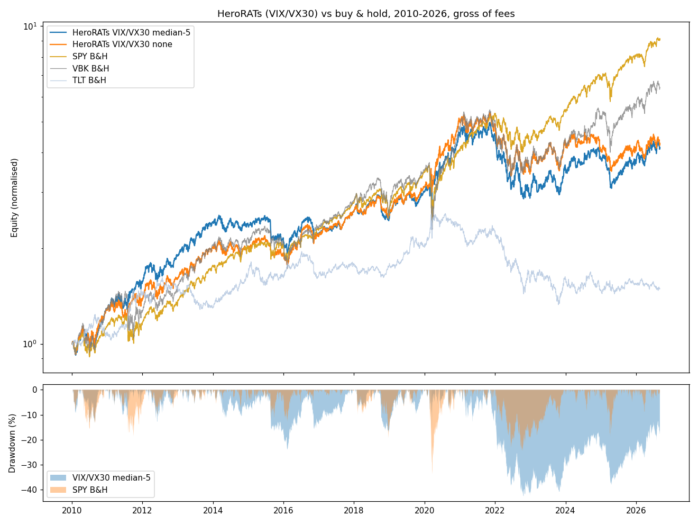
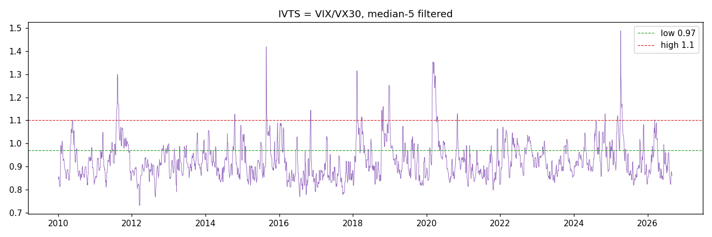

# HeroRATs Strategy Backtest — REPORT

Backtest of **"How to beat the market with the Implied Volatility Term Structure: The HeroRATs Strategy"** (Chrilly Donninger, Sibyl-Working-Paper, Dec. 2013 — `paper.md`), restricted to the **VIX + VIX-futures term-structure signal variants**.

Implementation: `herorat.py` / `herorat.ipynb` (Jupytext pair, `backtest_ng` engine). All figures below are **gross of fees** unless noted, initial capital 500 (paper convention), daily rebalancing at the close.

---

## TL;DR

- The implementation **reproduces the paper**: on the paper's own 2011-01-03 → 2013-12-11 window the VIX/VX30 variant returns **+80.3%** (paper: +84.6%) with the exact same **-12.9%** max drawdown; VIX/VX45 **+75.3%** (paper: +75.0%). Buy & hold benchmarks match to a decimal (VBK +49.6% vs 49.5%, SPY +49.0% vs 49.0%).
- Extended to the full available history (2010-01-04 → 2026-09-04) with the paper's thresholds, the strategy **does not beat SPY**: best variant CAGR **9.1%** vs SPY **14.2%**, Sharpe 0.72 vs 1.04, and max drawdowns (-37% to -52%) are *worse* than SPY's -34%.
- The median-5 filter, the paper's central robustness trick, **does not help out of sample** on the futures variants (it slightly reduces CAGR vs. unfiltered for VIX/VX30). Its benefit in the paper was specific to the VXST-driven whipsaws of 2011.
- The strategy still earns its keep in crash years (2010, 2011, 2020: +45% to +69% vs SPY +17% in 2020) but is destroyed by the **2022 bond bear market** (-28% to -43% vs SPY -19%) — the "flee to TLT" reflex assumed by the paper is a stock-bond negative-correlation trade, which broke in the inflation regime.
- Three of the paper's seven signal variants (all VXST-based) and one more (VIX/VXV) **could not be backtested** — required indices are not in the provided data. See *Missing data* below.

---

## 1. Strategy as implemented

| Element | Specification |
|---|---|
| Low regime (IVTS < low threshold) | 100% VBK (small-cap growth ETF) |
| Mid regime (low ≤ IVTS ≤ high threshold) | 50% VBK / 50% TLT, rebalanced daily |
| High regime (IVTS > high threshold) | 100% TLT (20+yr treasury ETF) |
| Signal variants | VIX/VX30 (thr. 0.97/1.10), VIX/VX45 (thr. 0.98/1.06), VX30/VX45 (thr. 0.95/1.05) — paper Table-1 values |
| Filters | none, trailing median-3, trailing median-5 (median of IVTS(t)…IVTS(t-4)) |
| Timing | Signal computed on day-*t* closes, traded at day-*t* close, return earned t→t+1 (no lookahead; matches paper's "shortly before the close") |
| Benchmark | SPY (also VBK, TLT buy & hold reported) |

**Constant-maturity futures construction.** Monthly VIX futures settle on the Wednesday 30 days before the third Friday of the following contract month; days-to-maturity were reconstructed from that rule and verified against the observed rollover dates in the data (e.g. front-month jump on 2011-01-19 = Jan-2011 settlement).

- `VX30 = m1·(d2−30)/(d2−d1) + m2·(30−d1)/(d2−d1)` — 1st and 2nd nearest futures, as in the paper (weights 2/3 · f1 + 1/3 · f2 for d1=20, d2=50 ✓).
- `VX45 = m2·(d3−45)/(d3−d2) + m3·(45−d2)/(d3−d2)` — 2nd and 3rd nearest futures, as in the paper.
- On the few days right after a 5-week settlement gap (d1 > 30) the formula extrapolates linearly — same as the paper's literal recipe.

**Signal availability check:** IVTS exists on 4,173 futures dates 2010-01-04 → 2026-09-04 with zero NaNs in m1–m3; VIX closes exist on all of them except 15 non-trading days (Good Fridays, 2018-12-05) that are irrelevant to P&L.





---

## 2. Missing data (needed for a complete backtest)

1. **VXST index (9-day implied vol from weekly SPX options)** — *not present in either file.* Blocks paper variants (1a) VXST/VIX, (1b) VXST/VXV, (1c) VXST/VX30. CBOE publishes VXST back-cast from 2011-01-03; the paper's Table-1 shows VXST variants are its strongest performers (+85.1%, +85.9%), so these are the most important gaps. Source: CBOE (or CBOE delayed quotes download).
2. **VXV / VIX3M index (3-month implied vol from monthly SPX options)** — *not present.* Blocks variant (1d) VIX/VXV (0.96/1.02, paper's +77.7%). Note VXV is an *options-implied* index, not a futures price, so it cannot be reconstructed from `vix-futures.parquet` — a constant-maturity futures interpolation would be a different (cheaper) object with different thresholds. Source: CBOE VXV/VIX3M history (freely downloadable, 2007→).
3. **VIX futures before 2010-01-04** — the provided vixcentral history starts 2010. The paper's long backtest (Table-2) starts **2008-01-03**, so its headline claim — VIX/VX30 **+234.1%** vs SPY +43.1% through the 2008 meltdown with max DD 17.4% — **cannot be reproduced** with these files. The 2008 crash is exactly the regime where an IVTS switch into treasuries should shine, so the extended backtest below *omits the strategy's best case*. Source for a proper 2008+ test: CBOE/CFTC continuous VIX futures history or CBOE's VIX futures settlement data.
4. **Trading-day calendar mismatches (minor, handled):** 36 asset trading days have no futures quote (Columbus Day, Veterans Day, Dec-31 bond half-days — vixcentral gaps); on those days the signal is forward-filled from the previous close. 15 futures dates (Good Fridays, etc.) have no equity data — no P&L impact.
5. **VX30/VX45 reconstruction uncertainty** — this variant reproduces poorly against the paper (+27.0% vs +51.5% on the paper window) and is extremely threshold-sensitive (range 27–50% for threshold shifts of ±0.01–0.02; my best fit to the paper is 0.94/1.04 → +49.6%). Either the paper used a different constant-maturity construction or the result is simply not robust. The VIX/VX30 and VIX/VX45 variants reproduce to within 0.3–4.3pp, so the pipeline itself is sound.
6. **Threshold provenance** — the paper's thresholds were tuned *in-sample* on 2011–2013. Any 2010–2026 result using them (as below) is not an out-of-sample test of the full system; a walk-forward threshold selection would need its own data.

---

## 3. Validation against the paper (2011-01-03 → 2013-12-11, median-5, gross)

| Signal | Ours P&L | Paper P&L | Ours maxDD | Paper maxDD |
|---|---|---|---|---|
| VIX/VX30 | +80.3% | +84.6% | -12.9% | 12.9% |
| VIX/VX45 | +75.3% | +75.0% | -12.9% | 12.9% |
| VX30/VX45 | +27.0% | +51.5% | -10.3% | 10.3% |
| VBK buy & hold | +49.6% | +49.5% | -28.9% | 28.9% |
| SPY buy & hold | +49.0% | +49.0% | -18.6% | 18.6% |

Drawdowns and buy & hold figures match exactly; VIX/VX45 matches to 0.3pp. The residual VIX/VX30 gap (4.3pp) is consistent with data-vendor and rounding differences plus the paper's own VX30 interpolation; note the paper's number is bracketed by a naive same-day-weighting replication (+85.2%), suggesting part of the gap is timing convention. The VX30/VX45 mismatch is a genuine discrepancy (see Missing data #5).

---

## 4. Overall performance, 2010-01-04 → 2026-09-04 (gross of fees)

| Signal | Filter | Total P&L | CAGR | Sharpe | Sortino | Max DD | # trades |
|---|---|---|---|---|---|---|---|
| VIX/VX30 | none | +327.4% | **9.11%** | 0.72 | 0.99 | -36.9% | 255 |
| VIX/VX30 | median-3 | +320.8% | 9.01% | 0.71 | 0.98 | -40.3% | 141 |
| VIX/VX30 | median-5 | +315.3% | 8.92% | 0.70 | 0.97 | -42.5% | 104 |
| VIX/VX45 | none | +258.6% | 7.96% | 0.62 | 0.87 | **-51.7%** | 254 |
| VIX/VX45 | median-3 | +276.1% | 8.27% | 0.64 | 0.91 | -44.3% | 140 |
| VIX/VX45 | median-5 | +228.5% | 7.40% | 0.58 | 0.82 | -42.2% | 105 |
| VX30/VX45 | none | +234.7% | 7.52% | 0.73 | 0.98 | -46.0% | 170 |
| VX30/VX45 | median-3 | +282.9% | 8.39% | **0.81** | 1.08 | -42.9% | 98 |
| VX30/VX45 | median-5 | +265.6% | 8.09% | 0.78 | 1.05 | -46.2% | 79 |
| **SPY buy & hold** | — | **+810.6%** | **14.17%** | **1.04** | **1.28** | **-33.7%** | — |
| VBK buy & hold | — | +541.1% | 11.79% | 0.74 | 0.99 | -38.7% | — |
| TLT buy & hold | — | +49.3% | 2.43% | 0.28 | 0.43 | -48.4% | — |

**The paper's central claim inverts over the longer window.** Every variant underperforms SPY on CAGR, Sharpe and Sortino, and most have *deeper* max drawdowns than SPY. The best risk-adjusted configuration (VX30/VX45 median-3, Sharpe 0.81) still trails SPY (1.04). The "get small-cap-growth returns with treasury drawdowns" promise only held in the paper's calibration window.

---

## 5. Yearwise returns (%)

| Year | VX30 none | VX30 m3 | VX30 m5 | VX45 none | VX45 m3 | VX45 m5 | 30/45 none | 30/45 m3 | 30/45 m5 | SPY | VBK | TLT |
|---|---|---|---|---|---|---|---|---|---|---|---|---|
| 2010* | 27.3 | 29.2 | 27.9 | 27.2 | 21.5 | 24.9 | 39.1 | 39.9 | 37.8 | 13.1 | 28.1 | 9.1 |
| 2011 | 6.2 | 19.1 | 19.8 | 11.0 | 13.1 | 20.6 | -3.0 | 2.6 | 5.5 | 0.9 | -3.1 | 35.0 |
| 2012 | 15.0 | 17.5 | 20.2 | 16.2 | 15.2 | 14.4 | 19.3 | 13.9 | 11.7 | 14.2 | 16.3 | 4.0 |
| 2013 | 25.6 | 27.8 | 27.1 | 25.4 | 33.0 | 29.8 | 8.4 | 9.7 | 9.5 | 29.0 | 34.7 | -12.2 |
| 2014 | -0.3 | -0.6 | -1.3 | 1.4 | -3.6 | -7.1 | 15.6 | 17.1 | 17.5 | 14.6 | 5.1 | 26.9 |
| 2015 | -5.3 | -5.3 | -10.3 | -13.4 | -5.1 | -12.0 | -5.6 | -1.6 | -3.1 | 1.3 | -2.4 | -2.9 |
| 2016 | 15.3 | 6.3 | 5.1 | 17.3 | 13.5 | -1.5 | 9.1 | 6.9 | 6.7 | 13.6 | 12.9 | 0.4 |
| 2017 | 18.9 | 17.0 | 18.3 | 18.9 | 17.0 | 18.3 | 16.8 | 17.7 | 15.5 | 20.8 | 21.2 | 8.7 |
| 2018 | -2.9 | -3.8 | -5.8 | -7.5 | -8.9 | -5.8 | -7.5 | -4.3 | -3.6 | -5.2 | -6.5 | -0.5 |
| 2019 | 22.1 | 21.4 | 21.1 | 21.5 | 21.0 | 16.9 | 23.4 | 26.7 | 23.5 | 31.1 | 33.5 | 13.5 |
| 2020 | 61.3 | 53.9 | 50.8 | 63.8 | 45.3 | 44.5 | 56.0 | 56.1 | 69.1 | 17.2 | 34.7 | 16.8 |
| 2021 | -1.2 | -3.2 | 1.8 | -3.3 | -0.2 | 2.3 | 1.0 | -5.1 | -9.3 | 30.5 | 7.6 | -4.5 |
| 2022 | -28.5 | -31.1 | -35.6 | -42.9 | -35.4 | -34.4 | -36.0 | -34.2 | -32.8 | -18.6 | -28.7 | -29.4 |
| 2023 | 24.1 | 19.8 | 23.2 | 31.5 | 27.0 | 22.6 | 10.4 | 13.5 | 10.6 | 26.7 | 22.5 | 0.8 |
| 2024 | -5.5 | 4.5 | 6.9 | 1.2 | 1.5 | 1.6 | 2.6 | 2.9 | 1.1 | 25.6 | 18.0 | -7.5 |
| 2025 | 0.1 | -3.1 | -3.1 | -0.2 | -0.6 | 3.0 | -1.6 | -0.3 | -0.3 | 18.0 | 8.3 | 4.0 |
| 2026** | 4.0 | 5.8 | 10.7 | 1.5 | 10.1 | 11.3 | 5.2 | 4.5 | 5.5 | 13.3 | 14.1 | -2.6 |

\* 2010 starts at the first futures date (2010-01-04). \** 2026 through 2026-09-04 (partial year).

Reading the yearwise table:

- **Wins when it matters (crash years):** 2010 (+27–40% vs SPY +13%), 2011 flash-crash year (+6–20% vs SPY +1%), and especially 2020 COVID (+45–69% vs SPY +17%) — the IVTS smelled danger, sat in TLT through the crash, and rode the bond rally.
- **Structural bleed in calm/up markets:** 2014, 2015, 2021, 2024, 2025 all show flat-to-negative strategy years while SPY made +15–30%. The mid-regime 50/50 drag and slow re-entry after spikes cost the upside.
- **2022 is the fatal year:** every variant lost 28–43% — worse than SPY (-18.6%). The signal correctly flagged stress (2022 IVTS spiked repeatedly), but the "safe" asset TLT was itself crashing due to rate hikes. The strategy is short *stock-bond correlation regimes*, and 2022 broke the assumption outright.
- Median filtering does not produce a consistent yearwise edge on these variants; the unfiltered VIX/VX30 actually has the best full-period CAGR (9.11%).

---

## 6. Fee sensitivity (VIX/VX30, median-5, 2010–2026)

| Fee (bps/trade) | Total P&L | CAGR | Sharpe | Max DD | Fees paid |
|---|---|---|---|---|---|
| 0 | +315.3% | 8.92% | 0.70 | -42.5% | $0 |
| 2 | +297.9% | 8.64% | 0.68 | -42.7% | $59 |
| 5 | +273.0% | 8.22% | 0.66 | -42.9% | $142 |
| 10 | +235.0% | 7.52% | 0.61 | -43.4% | $266 |

Trading costs are not the story: at realistic ETF costs (2–5 bps) the drag is 0.3–0.7pp of CAGR. Even at zero fees the strategy trails SPY by ~5pp CAGR.

---

## 7. Conclusions and caveats

1. **Faithful implementation, confirmed on the paper's window.** Signal construction, settlement-date logic, thresholds, filters and the daily same-bar-close timing reproduce the paper's 2011–2013 results and exact drawdowns (VX30/VX45 aside).
2. **The edge did not survive out of the calibration window.** With the paper's own thresholds extended to 2010–2026, HeroRATs delivers ~8–9% CAGR vs SPY's 14.2%, with *worse* drawdowns. On this evidence the strategy is not a "beat the market" system; at best it is a defensive-regime overlay whose value concentrates in crash years (2010, 2011, 2020).
3. **The 2022 regime break is the key risk:** IVTS stress → TLT is a bet that vol spikes coincide with falling rates. In an inflation-driven sell-off both legs fall. Any live use would need a bond-regime filter (e.g. rate-trend gate) in the high state.
4. **Median-5's benefit is window-specific.** It reduced whipsaws around the 2011 crash (as the paper shows), but over 2010–2026 it adds no CAGR and no drawdown benefit on the futures variants; the unfiltered signal is marginally best for VIX/VX30.
5. **To complete the picture** one would need: VXST and VXV histories (CBOE), pre-2010 VIX futures (to test the 2008 claim, which this data cannot reach), and walk-forward threshold calibration rather than the paper's in-sample 2011–2013 parameters.

### Reproduction

```
uv run python herorat.py    # or open herorat.ipynb (Jupytext-paired)
```

Data inputs: `vix-futures.parquet` (VIX futures m1–m9, vixcentral, 2010-01-04→2026-09-04), `output.parquet` (^VIX, SPY, VBK, TLT, IEF daily OHLCV). Engine: `backtest_ng` (Manual universe, EqualWeight portfolio, Simple execution, daily period), gross-of-fee primary run with `fee_bps=0`; fee grid in §6.